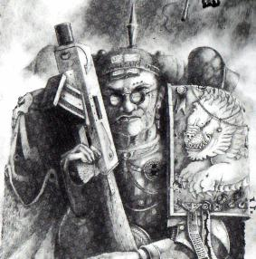
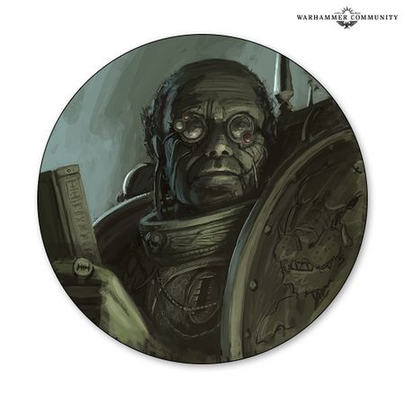

# 0605 菲杜斯·克里普特曼 Fidus Kryptman

精校状态：中文行文已逐段精校，部分术语仍为暂定

分类：人类帝国 / 攘外修会

原文来源：https://www.bilibili.com/opus/1142394883379560453

原作者：帝国神选罐头

原文时间：2025年12月04日 12:35

[返回分类目录](目录.md) · [全书目录](../../目录.md)

<!-- A0605-B0001 -->
**英文原文**

Fidus Kryptman is an Inquisitor Lord of the Ordo Xenos, also known as the Hero of the Macharian Heresy. He is best known for being the first to formally recognise the Tyranid threat to the Galaxy and has fought in all three major Tyrannic Wars.

<!-- /A0605-B0001 -->

<!-- A0605-B0002 -->

原译文

菲杜斯·克里普特曼是攘外修会的领主审判官，也被称为马卡里安叛乱的英雄。他最出名的是第一个正式承认泰伦对银河系的威胁，并参加了三次主要的泰伦战争。

**校订译文**

菲杜斯·克瑞普特曼是异形审判庭的领主审判官，被誉为“马卡里安叛乱的英雄”。他最著名的事迹，是最早正式辨认出泰伦对银河的威胁，并参与了前三次大规模泰伦战争。

**校注：** 原all three来自较早三次战争框架；本书579含第四次，不将原改为已参加第四次，译前三次。 对照本段英文确认同一实体，与全书核心译名统一；不改变同形异义词或省略称呼。

<!-- /A0605-B0002 -->

<!-- A0605-B0003 图片 -->

<!-- A0605-B0004 -->

原译文

Fidus Kryptman 菲杜斯·克里普特曼

**校订译文**

Fidus Kryptman 菲杜斯·克瑞普特曼

<!-- /A0605-B0004 -->

<!-- A0605-B0005 -->
### Biography 传记

<!-- /A0605-B0005 -->

<!-- A0605-B0006 -->
### First Tyrannic War 第一次泰伦战争

<!-- /A0605-B0006 -->

<!-- A0605-B0007 -->
**英文原文**

Upon coming across the recently ruined Dead World of Tyran, Kryptman uncovered a protected data-codex and learnt about the unknown, cataclysmic alien race which had destroyed the world. After the planet Tyran, he gave the new alien threat the designation "Tyranids".

<!-- /A0605-B0007 -->

<!-- A0605-B0008 -->

原译文

在偶然发现最近被毁的泰兰死亡世界后，克里普特曼发现了一个受保护的数据圣典，并了解了摧毁世界的未知、灾难性的异型种族。在泰兰行星之后，他将新的异型威胁命名为“泰伦虫族”。

**校订译文**

发现刚遭毁灭的泰兰死寂世界后，克瑞普特曼找到一部受保护的数据典籍，从中得知毁灭该世界的未知异形。于是，他借泰兰之名，将新威胁命名为“泰伦”。

**校注：** After the planet Tyran是以行星命名，不是时间上在行星之后；data-codex非规则圣典。

<!-- /A0605-B0008 -->

<!-- A0605-B0009 -->
**英文原文**

He went on to warn Marneus Calgar, Chapter Master of the Ultramarines, of the oncoming Hive Fleet Behemoth. This allowed the Ultramarines to prepare for the conflict and to summon support from Battlefleet Tempestus, allowing them to defeat the Hive Fleet.

<!-- /A0605-B0009 -->

<!-- A0605-B0010 -->

原译文

他继续警告极限战士的战团长马涅乌斯·卡尔加，即将到来的虫巢舰队贝希摩斯。这使得极限战士能够为冲突做好准备，并获得暴风舰队的支持，从而击败虫巢舰队。

**校订译文**

他向极限战士战团长马涅乌斯·卡尔加警告贝希摩斯虫巢舰队即将来袭，使战团得以备战，并召来暴风战斗舰队支援，最终击败虫群。

<!-- /A0605-B0010 -->

<!-- A0605-B0011 -->
### Third Tyrannic War 第三次泰伦战争

<!-- /A0605-B0011 -->

<!-- A0605-B0012 -->
**英文原文**

Inquisitor Kryptman became involved in the defence of Tarsis Ultra during 999.M41 when a tendril of Hive Fleet Leviathan was discovered to be moving towards the planet. Imperial forces arrived to defend the planet, which consisted of the Ultramarines Fourth Company led by Captain Uriel Ventris, a detachment from the Mortifactors led by Chaplain Astador, the 10th Logres Regiment led by Colonel Octavius Rabelaq, the 933rd Death Korps of Krieg led by Colonel Trymon Stagler, and the PDF regiments headed by Major Aries Satria. Kryptman was on hand to share his extensive knowledge of the Tyranids with the commanders in aid of the war effort. He was also accompanied by Magos Biologis Vianco Locard, an expert on the Tyranids, and a Deathwatch Kill-team led by Captain Bannon.

<!-- /A0605-B0012 -->

<!-- A0605-B0013 -->

原译文

审判官克里普特曼在999.M41期间参与了塔西斯·极限的防御，当时发现虫巢舰队利维坦的卷须正在向行星移动。帝国部队抵达保卫行星，其中包括由乌瑞尔·文崔斯连长领导的极限战士第四连队、由阿斯塔多牧师领导的苦行者、由屋大维·拉伯拉克上校领导的第10洛格斯兵团、由特里蒙·斯塔格勒上校领导的第933克里格死亡军团和由阿瑞斯·萨特里亚少校领导的行星防御部队。克里普特曼随时准备与指挥官分享他对泰伦的广泛了解，以协助战争。陪同他的还有泰伦专家生物贤者维安科·洛卡德和班农连长领导的死亡守望杀戮小队。

**校订译文**

999.M41，利维坦的一支分支逼近塔西斯·极限，克瑞普特曼参与其防御。抵达的帝国军包括：乌瑞尔·文崔斯率领的极限战士第四连、阿斯塔多教士率领的苦行者分遣队、屋大维·拉伯拉克上校的洛格斯第十团、特里蒙·斯塔格勒上校的克里格死亡军团第九三三团，以及阿瑞斯·萨特里亚少校指挥的行星防卫军各团。克瑞普特曼以丰富的泰伦知识协助诸指挥官；同行的还有泰伦专家、生物贤者维安科·洛卡德，以及班农连长率领的死亡守望杀戮小队。

**校注：** 933rd是团号，非第933个整支克里格兵种军团；兵力细目单位保留。

<!-- /A0605-B0013 -->

<!-- A0605-B0014 -->
**英文原文**

Despite an initial victory in destroying a Hive Ship during a space battle, Inquisitor Kryptman wished to invoke Exterminatus upon the world of Chordelis, the next planet in the path of the Tyranids. This was to prevent it from being devoured and swelling the Tyranids' numbers, as planetary evacuation was too slow. Captain Ventris vehemently opposed this decision and supported an alternative solution proposed by Lord Admiral Lazlo Tiberius, to slow down the Tyranids by exploding a hydrogen-plasma refinery in space to destroy another Hive Ship. However, Kryptman had lied to Ventris and with the assistance of the Mortifactors invoked Exterminatus anyway.

<!-- /A0605-B0014 -->

<!-- A0605-B0015 -->

原译文

尽管在一场太空战中摧毁了一艘虫巢舰并取得了初步胜利，但审判官克里普特曼仍希望在泰伦路径上的下一个行星科德里斯世界上调用灭绝令。这是为了防止它被吞噬，并防止泰伦的数量膨胀，因为行星疏散太慢了。文崔斯连长强烈反对这一决定，并支持领主海军上将拉兹洛·提比略提出的另一种解决方案，即通过在太空中爆炸氢等离子体精炼厂来摧毁另一虫巢舰，从而减缓泰伦的速度。然而，克里普特曼对文崔斯撒了谎，并在苦行者的协助下调用了灭绝令。

**校订译文**

帝国军虽在初期太空战中摧毁一艘虫巢舰，克瑞普特曼仍主张对虫群路径上的下一个世界科德里斯执行灭绝令：撤离太慢，不能让它被吞食、壮大泰伦。文崔斯激烈反对，赞同拉兹洛·提比略海军领主上将的替代方案——引爆太空中的氢等离子精炼厂，摧毁另一艘虫巢舰，以拖慢虫群。但克瑞普特曼隐瞒实情，仍在苦行者协助下执行了灭绝令。

<!-- /A0605-B0015 -->

<!-- A0605-B0016 -->
**英文原文**

During the repeated Tyranid attacks on Tarsis Ultra, Kryptman, along with his retinue, studied the biology of the Tyranid corpses killed in combat. During one expedition, a Lictor which had earlier landed on the planet, attacked his team but was fended off by the Deathwatch; Kryptman immediately ordered Captain Bannon to capture the Lictor without killing it, which they did. This proved pivotal to the war, as Magos Locard was able to concoct a poison from the Lictor's genetic structure that would allow them to defeat the entire swarm by infecting the Norn Queen aboard the last remaining Hive Ship. The Deathwatch team, led by Ventris, accomplished this mission, ending the war shortly before the few remaining defenders were overwhelmed by the hive swarms.

<!-- /A0605-B0016 -->

<!-- A0605-B0017 -->

原译文

在泰伦对塔西斯·极限的反复攻击中，克里普特曼和他的随从研究了在战斗中死亡的泰伦尸体的生理。在一次探索中，一只早些时候降落在行星上的利卡特攻击了他的小队，但被死亡守望击退；克里普特曼立即命令班农连长在不杀死利卡特的情况下抓住它，他们照做了。这被证明是战争的关键，因为贤者洛卡德能够从利卡特的基因结构中制造出一种毒药，使他们能够通过感染最后一艘虫巢舰上的诺恩女王来击败整个虫群。由文崔斯领导的死亡守望小队完成了这项任务，在剩下的几名守军被虫群淹没前不久结束了战争。

**校订译文**

泰伦反复进攻塔西斯·极限期间，克瑞普特曼与随从研究阵亡虫体。一次外出，一只早已潜入的刀斧虫袭击调查队，被死亡守望挡住；他立即命班农将其活捉。此举成为转机：洛卡德利用刀斧虫基因结构配制毒素，只要感染最后一艘虫巢舰上的诺恩女王，便可击败整支虫群。文崔斯率死亡守望完成任务，赶在残存守军被彻底淹没之前结束战斗。

<!-- /A0605-B0017 -->

<!-- A0605-B0018 -->
### Galactic Cordon 银河封锁

<!-- /A0605-B0018 -->

<!-- A0605-B0019 -->
**英文原文**

After one of the two tendrils of Leviathan was destroyed on Tarsis Ultra, contact was reestablished with the worlds between the two tendrils of Leviathan, which previously had been smothered by the Shadow in the Warp. This made Kryptman aware of the fall of numerous worlds within this region, each one swelling the ranks of the hive fleet. With a grim determination, Kryptman began exterminating worlds in Leviathan's path, creating a galactic cordon. Any world within this cordon would undergo Exterminatus as soon as the Tyranids invaded, the virus bombs destroying all life on the planet. This would cause the Hive Fleet to expend large amounts of resources to invade a planet, resources that would then be lost with the planet's destruction. Billions died, in the largest act of genocide the Imperium has faced since the Horus Heresy. As a result, Kryptman was declared a traitor, a fool and a radical, and a Carta Extremis was issued for him, stripping Kryptman of his title and condemning him to death, should he be apprehended. However, these harsh measures slowed Leviathan's advance to a crawl.

<!-- /A0605-B0019 -->

<!-- A0605-B0020 -->

原译文

在塔西斯·极限上摧毁了利维坦的两根卷须中的一根后，与利维坦的两根卷须之间的世界重新建立了联系，先前被亚空间阴影所窒息。这让克里普特曼意识到该地区许多世界的陷落，每个世界都扩大了虫巢舰队的队伍。带着坚定的决心，克里普特曼开始消灭利维坦路径上的世界，建立了一条银河封锁线。一旦泰伦入侵，这条封锁线内的任何世界都将遭受灭绝令，病毒炸弹摧毁了行星上的所有生命。这将导致虫巢舰队花费大量资源入侵一颗行星，这些资源将随着行星的毁灭而损失。数十亿人死亡，这是自荷鲁斯叛乱以来帝国面临的最大规模的灭绝行为。结果，克里普特曼被宣布为叛徒、愚者和激进分子，并为他颁发了极端文书，剥夺了克里普特曼的头衔，如果他被捕，将被判处死刑。然而，这些残酷的措施减缓了利维坦的前进速度。

**校订译文**

利维坦两支分支中的一支在塔西斯·极限被摧毁后，原受亚空间之影隔绝的两支之间各世界，重新恢复通信。克瑞普特曼这才得知，已有众多行星陷落，每一处都在滋养虫群。他决意沿利维坦路径建立银河封锁，毁灭沿途世界：泰伦一登陆，便执行灭绝令，以病毒炸弹消灭星球生命，使虫群先投入进攻资源，再随目标毁灭血本无归。数十亿人因此丧生，成为帝国自荷鲁斯之乱以来最大规模的种族灭绝行动。克瑞普特曼被斥为叛徒、愚者与激进分子，遭签发极端文书，剥夺头衔，一旦捕获即可处死。然而，这些残酷措施也使利维坦的进军迟滞至极。

**校注：** 前段999.M41等年代与580其他纪年分歧，源文原数保留。

<!-- /A0605-B0020 -->

<!-- A0605-B0021 -->
### Kryptman's Gamble 克瑞普特曼的赌博

原题：Kryptman's Gamble 克里普特曼的赌博

<!-- /A0605-B0021 -->

<!-- A0605-B0022 -->
**英文原文**

Kryptman observed the war between Tyranids and Orks on the world of Tesla Prime, where these two enemies of the Imperium locked each other in a long and bloody conflict. Seeing this as a way to slow or halt Leviathan without further loss of human life, Kryptman and a Deathwatch team loyal to him embarked on a dangerous mission on the planet of Carpathia to capture a brood of live genestealers. At the cost of many Deathwatch lives, the genestealers were placed in a stasis field and then unleashed in the space hulk Perdition's Flame. The Deathwatch and Kryptman then detonated a nearby moon, sending the hulk hurtling into the Ork Empire of Octarius. The genestealers quickly infected the Orks that attempted to raid the space hulk, causing the infection to flourish and quickly reach all corners of Octavius. Soon the psychic signature of the genestealers was strong enough to attract the second tendril of Hive Fleet Leviathan, causing it to veer away from Imperial space. Leviathan is currently engaged in a protracted war with the Orks.

<!-- /A0605-B0022 -->

<!-- A0605-B0023 -->

原译文

克里普特曼观察了泰伦和欧克在特斯拉一号世界上的战争，在那里，帝国的这两个敌人在一场漫长而血腥的冲突中相互锁定。克里普特曼和一支忠于他的死亡守望小队将此视为一种在不进一步造成人员伤亡的情况下减缓或阻止利维坦的方法，他们在卡柏菲亚行星上开始了一项危险的任务，以抓捕一群活着的基因窃取者。以许多死亡守望的生命为代价，这些基因窃取者被放置在一个静滞力场，然后被释放到太空废船毁灭之火号中。死亡守望和克里普特曼随后引爆了附近的一颗卫星，使这艘废船冲向奥克塔琉斯的欧克帝国。基因窃取者很快感染了试图突袭太空废船的欧克，导致感染迅速蔓延，并迅速蔓延到奥克塔维斯的各个角落。很快，基因窃取者的灵能特征就足够强大，吸引了虫巢舰队利维坦的第二根卷须，使其偏离了帝国空域。利维坦目前正在与欧克进行一场旷日持久的战争。

**校订译文**

克瑞普特曼见特斯拉一号的泰伦与欧克陷入漫长血战，认为可以借敌制敌，避免更多人类死亡。他与仍忠于自己的死亡守望赴卡柏菲亚，冒险活捉一群基因窃取者，付出多人阵亡的代价后，将其封入静滞场，再释放到太空废船毁灭之火号上。他们引爆附近卫星，把废船推向奥克塔琉斯欧克帝国。基因窃取者感染登舰劫掠的欧克，迅速向各处扩散；其灵能信号最终强到足以吸引利维坦另一支分支，使之偏离帝国疆域，转而与欧克陷入旷日持久的战争。

**校注：** Octavius疑Octarius误拼，按同一战区奥克塔琉斯；currently为条目记述时点，非更新为现实当前出版进度。

<!-- /A0605-B0023 -->

<!-- A0605-B0024 图片 -->

<!-- A0605-B0025 -->

原译文

Fidus Kryptman 菲杜斯·克里普特曼

**校订译文**

Fidus Kryptman 菲杜斯·克瑞普特曼

<!-- /A0605-B0025 -->

<!-- A0605-B0026 -->
**英文原文**

However, Kryptman seems to have overlooked the fact that whichever side emerges victorious from the Octarius War will surely be far more powerful than they were before — a fact which left the Ordo Xenos with "an unholy mess to clean up" well into M42.

<!-- /A0605-B0026 -->

<!-- A0605-B0027 -->

原译文

然而，克里普特曼似乎忽略了这样一个事实，即无论哪一方在奥克塔琉斯战争中获胜，都肯定会比以前强大得多 — 这一事实使攘外修会在M42中留下了“需要清理的邪恶混乱”。

**校订译文**

克瑞普特曼似乎忽略了一个后果：奥克塔琉斯之战无论哪方获胜，都会比原先更强。到了第42千年，异形审判庭仍得收拾这场可怕的烂摊子。

<!-- /A0605-B0027 -->

本篇核心术语与暂定项

以下列出本篇出现的英文原形及核心术语表用词。同形词可能指不同对象，具体词义以本篇正文和校注为准；单复数、别名和仅见于图注的名称可能尚未列入。完整候选见[术语表](../../术语表/双语术语候选.csv)。

| 英文 | 采用中文 | 状态 |
| --- | --- | --- |
| Deathwatch | 死亡守望 | 官方已核对 |
| Tyranids | 泰伦虫族 | 官方已核对 |
| Orks | 欧克蛮人 | 官方已核对 |
| Ultramarines | 极限战士 | 官方已核对 |
| Horus Heresy | 荷鲁斯之乱 | 官方已核对 |
| Warp | 亚空间 | 官方已核对 |
| Inquisitor | 审判官 | 官方已核对 |
| Imperium | 帝国 | 暂定·简称 |
| Shadow in the Warp | 亚空间之影 | 暂定 |
| Magos Biologis | 生物贤者 | 暂定·官方待核 |
| Horus | 荷鲁斯 | 暂定·官方待核 |
| Octarius | 奥克塔琉斯 | 暂定·官方待核 |
| Kryptman | 克瑞普特曼 | 暂定·官方待核 |
| Hive Fleet Leviathan | 利维坦虫巢舰队 | 暂定·官方待核 |
| Ordo Xenos | 异形审判庭 | 用户指定 |
| Inquisitor Lord | 领主审判官 | 暂定 |
| Master | 导师（审判庭职衔）／舰务官（舰员职务） | 语境定译·官方待核 |
| Mission | 教团／传教机构 | 暂定 |
| Chaplain | 教士 | 官方已核对 |
| Vianco Locard | 维安科·洛卡德 | 暂定·官方待核 |
| Chapter | 战团 | 暂定·官方待核 |
| Chapter Master | 战团长 | 暂定·官方待核 |
| Captain | 连长 | 暂定·官方待核 |
| Marneus Calgar | 马涅乌斯·卡尔加 | 暂定·官方待核 |
| Uriel Ventris | 乌瑞尔·文崔斯 | 官方已核 |
| Mortifactors | 苦行者 | 暂定·官方待核 |
| Death Korps of Krieg | 克里格死亡军团 | 官方已核对 |
| Xenos | 异形 | 暂定·官方待核 |
| Ork Empire of Octarius | 奥克塔琉斯欧克帝国 | 暂定·官方待核 |
| Tyran | 泰兰 | 暂定·官方待核 |
| Lictor | 刀斧虫（泰伦单位）／侍从官（禁军职衔） | 语境定译·泰伦单位官译已核 |
| Tarsis Ultra | 塔西斯·极限 | 暂定·官方待核 |
| Astador | 阿斯塔多 | 暂定·官方待核 |
| Trymon Stagler | 特里蒙·斯塔格勒 | 暂定·官方待核 |
| Satria | 萨特里亚 | 暂定·官方待核 |
| Chordelis | 科德里斯 | 暂定·官方待核 |
| Carta Extremis | 极端文书 | 暂定·官方待核 |
| Carpathia | 卡柏菲亚 | 暂定·官方待核 |
| Tesla Prime | 特斯拉一号 | 暂定·官方待核 |
| Lazlo Tiberius | 拉兹洛·提比略 | 暂定·官方待核 |
| Bannon | 班农 | 暂定·官方待核 |
| Fidus Kryptman | 菲杜斯·克瑞普特曼 | 暂定·官方待核 |
| Octavius Rabelaq | 屋大维·拉伯拉克 | 暂定·官方待核 |
| Aries Satria | 阿瑞斯·萨特里亚 | 暂定·官方待核 |
| Captain Bannon | 班农连长 | 暂定·官方待核 |
| Battlefleet Tempestus | 暴风战斗舰队 | 暂定·官方待核 |
| Dead World | 死寂世界 | 暂定·官方待核 |
| Krieg | 克里格 | 暂定·官方待核 |
| Macharian Heresy | 马卡里安叛乱 | 暂定·官方待核 |
| Octarius War | 奥克塔琉斯战争 | 暂定·官方待核 |
| Hive Ship | 虫巢舰 | 暂定·官方待核 |

