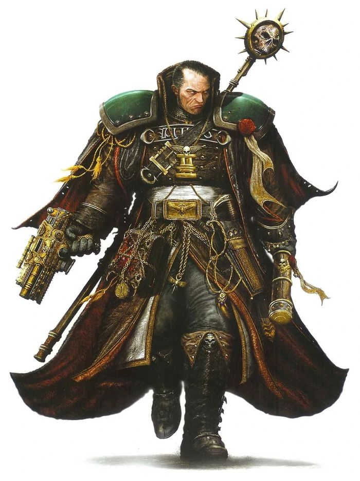
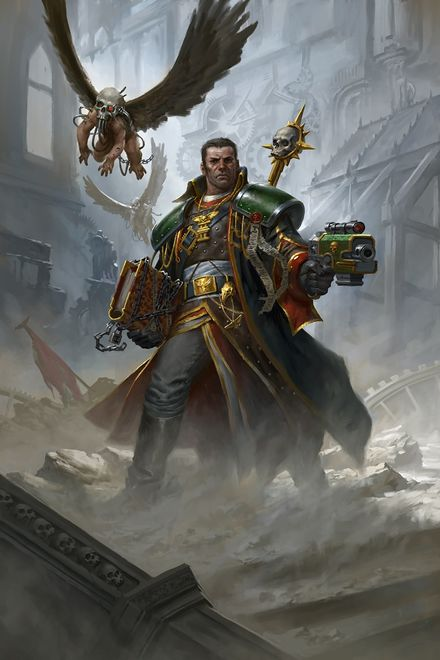
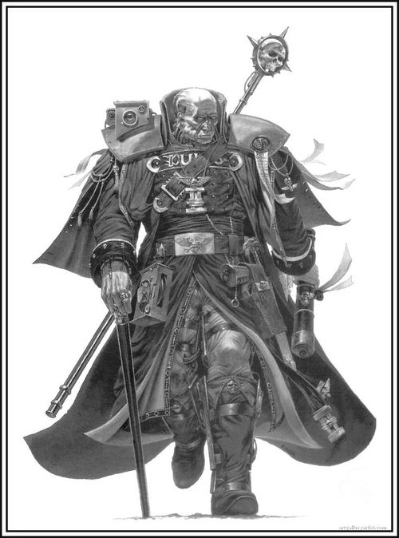
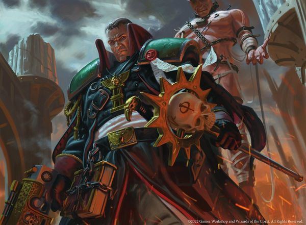
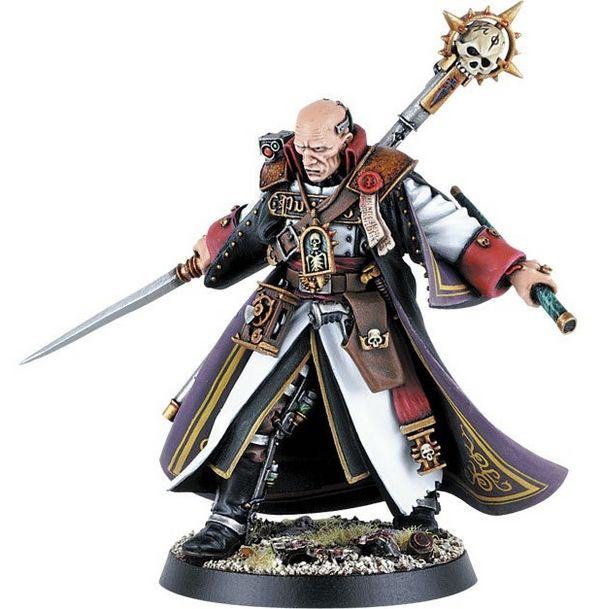
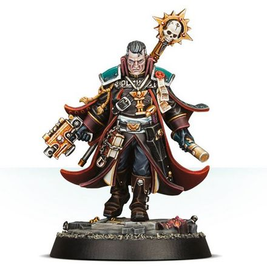

# 0606 格雷戈·艾森霍恩 Gregor Eisenhorn

精校状态：中文行文已逐段精校，部分术语仍为暂定

分类：人类帝国 / 攘外修会

原文来源：https://www.bilibili.com/opus/1108730186692558880

原作者：帝国神选罐头

原文时间：2025年09月04日 19:19

[返回分类目录](目录.md) · [全书目录](../../目录.md)

<!-- A0606-B0001 -->
**英文原文**

All my life I have had a reputation for being cold, unfeeling. Some have called me heartless, ruthless, even cruel. I am not. I am not beyond emotional response or compassion. But I possess - and my masters count this as perhaps my paramount virtue - a singular force of will. Throughout my career it has served me well to draw on this facility and steel myself, unflinching, at all that this wretched galaxy can throw at me. To feel pain or fear or grief is to allow myself a luxury I cannot afford.

<!-- /A0606-B0001 -->

<!-- A0606-B0002 -->

原译文

我一生都以冷酷无情而闻名。有人说我狠心、无情，甚至残忍。我没有。我没有超越情感反应或同情。但我拥有一种独特的意志力，我主也认为这可能是我最重要的美德。在我的整个职业生涯中，利用这个才能并坚定地面对这个可怜的银河所能给我的一切，对我很有帮助。感受痛苦、恐惧或悲伤，就是给自己一种我负担不起的奢侈。

**校订译文**

我一生都以冷漠、不近人情闻名。有人说我铁石心肠、冷酷，甚至残忍。我并非如此。我并非没有感情，也并非不懂怜悯。但我拥有非凡的意志力——我的上级认为，这或许是我最重要的品格。从业以来，正是它让我百折不挠，直面这悲惨银河施加的一切。容许自己感受痛苦、恐惧或悲伤，是我承受不起的奢侈。

<!-- /A0606-B0002 -->

<!-- A0606-B0003 -->
**英文原文**

Gregor Eisenhorn, 240.M41

<!-- /A0606-B0003 -->

<!-- A0606-B0004 -->

原译文

格雷戈·艾森霍恩，240.M41

**校订译文**

格雷戈·艾森霍恩，240.M41

<!-- /A0606-B0004 -->

<!-- A0606-B0005 -->
**英文原文**

Gregor Eisenhorn was a renowned Inquisitor of the Ordo Xenos, active during the third and fourth centuries of M41.

<!-- /A0606-B0005 -->

<!-- A0606-B0006 -->

原译文

格雷戈·艾森霍恩是攘外修会的著名审判官，活跃于M41的第三和第四世纪。

**校订译文**

格雷戈·艾森霍恩是异形审判庭的著名审判官，活跃于第41千年的第三、第四个世纪。

<!-- /A0606-B0006 -->

<!-- A0606-B0007 图片 -->

<!-- A0606-B0008 -->

原译文

Gregor Eisenhorn 格雷戈·艾森霍恩

**校订译文**

Gregor Eisenhorn 格雷戈·艾森霍恩

<!-- /A0606-B0008 -->

<!-- A0606-B0009 -->
**英文原文**

Initially a Puritan of the Amalathian faction, Eisenhorn's ideology would alter over the course of his career so dramatically towards Radical Xanthism that other members of the Inquisition would consider him possibly heretical. Indeed, Eisenhorn has officially been considered a rogue agent at least twice in his Inquisitorial career, only to be proved righteous both times.

<!-- /A0606-B0009 -->

<!-- A0606-B0010 -->

原译文

艾森霍恩最初是纯洁派的阿马拉特安派，在他的职业生涯中，他的意识形态发生了巨大的变化，转向了激进派的腐化派，以至于审判庭的其他成员都认为他可能是异端。事实上，艾森霍恩在他的审判庭职业生涯中至少两次被正式视为失常特工，但两次都被证明是正义的。

**校订译文**

他起初信奉纯洁派中的阿马拉特安派，但在漫长生涯中，理念逐渐向激进的赞瑟斯派转变，幅度之大，令其他审判官怀疑他已涉异端。他至少两次被正式判为叛离审判庭的人员，后来又都获证明并无罪责。

<!-- /A0606-B0010 -->

<!-- A0606-B0011 -->
## History 历史

<!-- /A0606-B0011 -->

<!-- A0606-B0012 -->
### Early Career 早期职业

<!-- /A0606-B0012 -->

<!-- A0606-B0013 -->
**英文原文**

Born in 198.M41, on DeKere's World. When he was 12, Gregor Eisenhorn watched the White Scars take Almanadae. Circa 219.M41 he became an interrogator under Inquisitor Hapshant. He studied alongside fellow trainee Titus Endor and was elevated to the rank of Inquisitor in 222.M41, aged 24. His first successful persecution was that of the heretic Lemete Syre. Soon after, he was temporarily assigned the late Inquisitor Flammel's patrol duty over the Grand Banks worlds coreward of the Helican subsector, where he was instrumental in closing a regia occulta on the planet Ignix that had facilitated the appearance of orks onto the world who'd killed several citizens.

<!-- /A0606-B0013 -->

<!-- A0606-B0014 -->

原译文

生于198.M41，在德科勒世界。12岁时，格雷戈·艾森霍恩观看了白色伤疤占领阿尔曼达伊。大约在219.M41，他成为了审判官哈普山特的审讯者。他与同为见习生的泰图斯·恩多一起学习，并于222.M41晋升为审判官，年24岁。他第一次成功的迫害是异端勒梅特·赛尔。不久之后，他被临时指派给年老的审判官弗拉梅尔，在赫利坎分区的大银行世界核心地带执行巡逻任务，在那里他帮助关闭了伊格尼斯行星上的隐秘王权 - 促成了杀害多名公民的欧克出现在世界上。

**校订译文**

艾森霍恩于198.M41生在德科勒世界，十二岁时目睹白疤攻下阿尔曼达伊。约219.M41，他在哈普山特审判官麾下担任审讯者，与泰图斯·恩多一同受训；222.M41、二十四岁时晋升审判官，首次成功查办的是异端勒梅特·赛尔。不久，他临时代接已故审判官弗拉梅尔的巡逻辖区，巡视赫利坎次星区朝银心一侧的大浅滩诸世界。在伊格尼斯，他协助封闭一条让欧克进入、杀害多名居民的“隐秘通道”。

**校注：** late Inquisitor已故，非年老；Grand Banks地理专名暂大浅滩，不是银行。coreward朝银心，不是本区核心。persecution依调查定罪语境译查办，未将迫害评价强加。

<!-- /A0606-B0014 -->

<!-- A0606-B0015 -->
**英文原文**

Carving out a stable and competent career, Eisenhorn eventually found himself being drawn into events that would change the course of his life in the year 240.M41. During this year, Eisenhorn successfully tracked down and killed the mass-murderer Murdin Eyclone on Hubris, an investigation that is notable not only for bringing Godwyn Fischig and Alizebeth Bequin into his retinue, but also for setting him on the route of both Pontius Glaw and the Necroteuch.

<!-- /A0606-B0015 -->

<!-- A0606-B0016 -->

原译文

艾森霍恩开创了一个稳定而有能力的职业生涯，最终在240.M41发现自己被卷入了改变他人生轨迹的事件中。在这一年里，艾森霍恩在傲慢星成功追踪并杀死了大屠杀的凶手穆丁·埃克隆，这项调查不仅因将古德温·费希格和伊丽莎白·贝奎恩带入他的随从中而闻名，而且因为他让他走上了庞蒂乌斯•格劳和亡灵经之路。

**校订译文**

艾森霍恩的事业原本稳健，240.M41却迎来改变一生的案件。他在傲慢星追捕、击杀连环屠杀者穆丁·埃克隆，既招募了古德温·费希格与伊丽莎白·贝奎恩，也循线接触到庞蒂乌斯·格劳及《死灵之书》。

<!-- /A0606-B0016 -->

<!-- A0606-B0017 -->
### The Necroteuch Affair 亡灵经事件

<!-- /A0606-B0017 -->

<!-- A0606-B0018 -->
**英文原文**

Following leads from the Eyclone investigation, Eisenhorn became tangled up with a heretical cabal on the world of Gudrun, and in fact was briefly captured and tortured by one of their members, Gorgone Locke. The cabal was eventually driven off Gudrun by a full Inquisitorial purge led by Inquisitor Commodus Voke. However, this turned out to be the first in a series of events that would come to be known as the Helican Schism.

<!-- /A0606-B0018 -->

<!-- A0606-B0019 -->

原译文

根据调查埃克隆的线索，艾森霍恩与古德伦世界的一个异端秘会纠缠在一起，事实上，他被他们的一名成员戈尔贡·洛克短暂抓获并折磨。秘会最终被审判官科莫德斯.沃克领导的审判庭全面清洗赶出了古德伦。然而，这被证明是被称为赫利坎分裂的一系列事件中的第一个。

**校订译文**

追查埃克隆案，使他卷入古德伦的异端秘密团伙，一度遭成员戈尔贡·洛克俘虏、拷打。科莫德斯·沃克率审判庭全面清剿，最终将团伙逐出该世界；但这只是后来“赫利坎分裂”一连串事件的开端。

<!-- /A0606-B0019 -->

<!-- A0606-B0020 -->
**英文原文**

Eisenhorn was able to recover a device known as "the Pontius" from the cabal survivors on Damask, and it later transpired that this device held the encoded brain-engrams of the long-dead infamous heretic Pontius Glaw; one of the cabal's schemes had involved arranging his resurrection. Eisenhorn held Pontius Glaw captive and interrogated him regularly, before finally choosing to have the Pontius device incarcerated by Magos Bure of the Adeptus Mechanicus. This decision would have a profound effect on Eisenhorn's future.

<!-- /A0606-B0020 -->

<!-- A0606-B0021 -->

原译文

艾森霍恩从达马斯克的秘会幸存者那里找到了一个名为“庞修斯”的装置，后来发现这个装置保存着早已死去的臭名昭著的异端庞蒂乌斯•格劳的编码脑印；秘会的一个计划涉及安排他的复活。艾森霍恩俘虏了庞蒂乌斯•格劳，并定期审问他，最后选择将庞蒂乌斯装置交给机械神教的贤者布尔监禁。这一决定将对艾森霍恩的未来产生深远的影响。

**校订译文**

艾森霍恩在达马斯克从残党手中收回名为“庞蒂乌斯”的装置，后来发现其中储存着早已死去的异端庞蒂乌斯·格劳的脑印编码，复活他正是团伙的计划之一。艾森霍恩将其拘禁，定期审问，最后交给机械修会的布尔贤者看守。这一决定深刻影响了他的未来。

<!-- /A0606-B0021 -->

<!-- A0606-B0022 -->
**英文原文**

Following up further leads from the purge of the cabal led Eisenhorn into one of his most famous investigations; the affair of the Necroteuch - a tome of chaotic knowledge. Eisenhorn tracked the survivors of the cabal to a xenos colony world designated KCX-1288 inhabited by the Saruthi.

<!-- /A0606-B0022 -->

<!-- A0606-B0023 -->

原译文

追踪秘会的净化的进一步线索，艾森霍恩展开了他最著名的调查之一；亡灵经事件 — 一部混沌的知识巨著。艾森霍恩追踪秘会的幸存者到了一个名为KCX-1288的异型徒殖民世界，该殖民地由萨鲁提居住。

**校订译文**

继续追索清剿留下的线索，使艾森霍恩介入最著名的案件之一：《死灵之书》事件。这是一部记载混沌知识的禁书。残党逃往编号KCX-1288、由萨鲁提居住的异形殖民世界，他也追踪而至。

<!-- /A0606-B0023 -->

<!-- A0606-B0024 -->
**英文原文**

The Saruthi had come into the possession of a copy of the Necroteuch, which was found on KCX-1288 and burned by Eisenhorn himself, as well as all but three of the last remaining cabal members being killed, one of whom Gregor captured. Some radical Inquisitors deemed burning the Necroteuch a heretical act, and damned Eisenhorn for it. However, the majority of the local Inquisitorial conclave supported Eisenhorn's decision to burn the tome, outvoting the radicals and protecting Gregor from censure. The captured cabal member was accidentally tortured to death by one of these radicals, Konrad Molitor, who sought any knowledge of the Necroteuch. Eisenhorn and Voke performed an auto-seance on the corpse and learned that there was a second copy that the Saruthi had made for themselves, though a warp entity was conjured during the rite that traumatized Eisenhorn & Voke as well as killing several astropaths, including Eisenhorn's own astropathic servant, Lowink.

<!-- /A0606-B0024 -->

<!-- A0606-B0025 -->

原译文

萨鲁提人获得了一份在KCX-1288上发现并由艾森霍恩本人烧毁的亡灵经副本，以及除最后三名秘会成员外的所有其他成员被杀害，其中一人被格雷戈抓获。一些激进派的审判官认为焚烧亡灵经是一种异端行为，并因此谴责艾森霍恩。然而，当地审判庭会议的大多数成员支持艾森霍恩焚烧这本书的决定，投票超过了激进派，并保护格雷戈免受谴责。被捕的秘会成员被其中一名激进派康拉德·莫里托意外折磨致死，莫里托试图了解亡灵经。艾森霍恩和沃克在尸体上进行了一次自降灵，并得知萨鲁提人为自己制作了第二个副本，尽管在仪式中，一个亚空间实体被召唤出来，这给艾森霍恩和沃克造成了创伤，并杀死了几名星语者，包括艾森霍恩自己的星语者仆人洛温克。

**校订译文**

萨鲁提持有一份《死灵之书》，被艾森霍恩在KCX-1288找到并亲手焚毁。余下团伙成员除三人外全部被杀，三人中一人被他俘获。一些激进审判官视焚书为异端之举，予以谴责；当地审判庭会议多数却支持他，以票数压过激进派，使其免于惩处。激进派康拉德·莫里托为追索禁书知识，不慎将俘虏拷打致死。艾森霍恩与沃克对遗体施行降灵术，得知萨鲁提另为自己抄有第二份。但仪式招来亚空间实体，重创二人，又杀死数名星语者，包括艾森霍恩的仆从洛温克。

**校注：** 幸存三人中俘一人，原长句主谓混乱；auto-seance为尸体降灵仪式，暂降灵术而非自降灵。

<!-- /A0606-B0025 -->

<!-- A0606-B0026 -->
**英文原文**

During his recovery, Eisenhorn was instrumental in planning an invasion of another Saruthi world designated 56-Izar, during which the xenos Necroteuch and an item to translate it were destroyed, as were the last remaining members of the cabal. Molitor attempted to kill Eisenhorn during the attack and make off with the book and the translator, but he failed. It was during this attack that Eisenhorn also first met Cherubael, a powerful daemonhost who had been working with Molitor and would plague Eisenhorn and the Imperium in later endeavours.

<!-- /A0606-B0026 -->

<!-- A0606-B0027 -->

原译文

在康复期间，艾森霍恩在计划入侵另一个名为56伊扎尔的萨鲁提世界方面发挥了重要作用，在此期间，异型亡灵经和翻译它的物品被摧毁，秘会的最后一名成员也被摧毁。莫里托试图在袭击中杀死艾森霍恩，并偷走这本书和翻译，但他失败了。正是在这次袭击中，艾森霍恩还首次遇到了切鲁贝尔，一个强大的恶魔宿主，他一直在与莫里托合作，并在后来的努力中困扰着艾森霍恩和帝国。

**校订译文**

恢复期间，他参与策划进攻另一个萨鲁提世界56-伊扎尔，摧毁异形版《死灵之书》及翻译装置，消灭团伙最后残党。莫里托企图杀死他，抢走书与译读装置，却没有成功。行动中，艾森霍恩首次遇见与莫里托合作的强大恶魔宿主凯鲁巴埃尔；此后，它将不断纠缠他与帝国。

<!-- /A0606-B0027 -->

<!-- A0606-B0028 -->
### Sameter 萨米特

<!-- /A0606-B0028 -->

<!-- A0606-B0029 -->
**英文原文**

The following year, 241.M41, Eisenhorn investigated apparent ritual murders on the world of Sameter, at first believing the killings to be the work of some chaotic cult. Soon, however, it was revealed that the culprits were ex-soldiers of the Imperial Guard. These former soldiers of the Sameter 9th Infantry had been driven mad by the horrors they had faced in war, and were ritually killing regular citizens. Backed up by the local Adeptus Arbites, Eisenhorn managed to corner and eliminate the fanatics in an abandoned and decaying building. During the resultant firefight Eisenhorn lost his left hand to an experienced former-sharpshooter. He was offered a prosthetic but declined, making do with a fused stump until he could have a vat-grown hand grafted on two years later.

<!-- /A0606-B0029 -->

<!-- A0606-B0030 -->

原译文

第二年，241.M41，艾森霍恩调查了萨米特世界上明显的仪式谋杀案，起初认为这些谋杀案是一些混沌教派所为。然而，很快就有消息称，罪魁祸首是帝国卫队的前士兵。萨米特第9步兵团的这些前士兵被战争中面临的恐怖所激怒，并仪式性地杀害普通公民。在当地的法务部人的支持下，艾森霍恩设法在一座废弃且破败的建筑中围堵并消灭了狂热分子。在交火中，艾森霍恩的左手被一位经验丰富的前神枪手夺走。有人给他提供了一个假肢，但他拒绝了，只能凑合着用一个熔接残肢，直到两年后他可以移植一只缸熟的手。

**校订译文**

241.M41，艾森霍恩调查萨米特疑似仪式谋杀案，起初以为出自混沌教派，后来发现凶手是帝国卫队萨米特第九步兵团的退伍兵。他们受战争恐怖折磨而精神失常，以仪式方式杀害普通市民。当地法务部协助围堵，最终在废楼中剿灭这些狂热者。交火时，一名老练的前神枪手打掉了艾森霍恩左手。他拒绝安装机械义肢，暂以封合的残端生活，直到两年后接上培养槽育成的新手。

**校注：** driven mad是精神失常，非激怒；vat-grown手在培养槽中生长，非缸熟。

<!-- /A0606-B0030 -->

<!-- A0606-B0031 -->
### Quixos 奇科索斯

原题：Quixos 奎克索斯

<!-- /A0606-B0031 -->

<!-- A0606-B0032 -->
**英文原文**

In 312.M41, Eisenhorn's best friend, Midas Betancore was killed by the heretic Fayde Thuring during an investigation. Thuring escaped, and Eisenhorn promised to keep a watchful eye on Midas' infant daughter, Medea. Years later, when she came of age, she would follow the path of her father and join the retinue of Inquisitor Eisenhorn as his pilot.

<!-- /A0606-B0032 -->

<!-- A0606-B0033 -->

原译文

312.M41，艾森霍恩最好的朋友米达斯·贝坦科尔在一次调查中被异端菲德·瑟林杀害。瑟林逃走了，艾森霍恩承诺会密切关注米达斯的小女儿美狄亚。几年后，当她成年时，她会追随父亲的脚步，加入审判官艾森霍恩的随从，成为他的飞行员。

**校订译文**

312.M41，挚友米达斯·贝坦科尔在调查中遭异端菲德·瑟林杀害。凶手逃脱，艾森霍恩答应照看米达斯尚在襁褓的女儿美狄亚。多年后，她成年，追随父亲道路，成为艾森霍恩随从中的驾驶员。

<!-- /A0606-B0033 -->

<!-- A0606-B0034 图片 -->

<!-- A0606-B0035 -->

原译文

Gregor Eisenhorn 格雷戈·艾森霍恩

**校订译文**

Gregor Eisenhorn 格雷戈·艾森霍恩

<!-- /A0606-B0035 -->

<!-- A0606-B0036 -->
**英文原文**

26 years later, in 338.M41, Eisenhorn began the investigation that he would become most known for; the elimination of the heretic Inquisitor Quixos. The investigation took place in the aftermath of the disaster of the Thracian Primaris Triumph (where Eisenhorn's Interrogator, Gideon Ravenor, was horrifically injured), an atrocity that appeared to have been engineered to free several alpha-plus class rogue psykers.

<!-- /A0606-B0036 -->

<!-- A0606-B0037 -->

原译文

26年后，在338.M41，艾森霍恩开始了他最为人所知的调查；铲除异端审判官奎克索斯。调查发生在色雷斯原铸胜利的灾难之后（艾森霍恩的审讯者吉迪恩·拉文诺在那场灾难中受了重伤），这场暴行似乎是为了释放几名超阿尔法级非法灵能者而设计的。

**校订译文**

二十六年后，338.M41，他展开最负盛名的调查：铲除异端审判官奇科索斯。此案源于色雷斯主星凯旋庆典上的灾难，学徒吉迪恩·拉文诺在其中遭到可怖重创。这场暴行似乎是为释放数名阿尔法加级失控灵能者而策划。

**校注：** Thracian Primaris为行星名，暂色雷斯主星，与特拉修斯人物异名无关；Triumph凯旋庆典，不是原铸胜利。

<!-- /A0606-B0037 -->

<!-- A0606-B0038 -->
**英文原文**

Eisenhorn's investigation took him to the world of Eechan, where, posing as mutants, he and his team discovered that there was Inquisitorial collusion in the scheme that freed the psykers. Inquisitor Lyko was discovered in the company of the daemonhost, Cherubael. Taken aback by the reappearance of Cherubael, Eisenhorn focused his investigations upon the creature. This led him to Cadia, where he discovered another daemonhost, Prophaniti, and ties between these daemonhosts and the missing radical Inquisitor Quixos. However, Eisenhorn's investigation was sidelined for some time by his arrest by Inquisitor Osma for consorting with daemons. Escaping, he was declared outcast and forced to operate as a rogue for the remainder of the investigation. Eisenhorn sojurned with his associate Magos Bure on the world of Cinchare for some time, where he conferred with his prisoner, Pontius Glaw. During this period he defeated a Chaos cult that existed on the world and gained master-crafted Force Weapons.

<!-- /A0606-B0038 -->

<!-- A0606-B0039 -->

原译文

艾森霍恩的调查将他带到了伊詹世界，在那里，他和他的团队伪装成变种人，发现在释放灵能者的计划中存在审判庭的勾结。审判官莱克在恶魔宿主切鲁贝尔的陪伴下被发现。切鲁贝尔的再次出现让艾森霍恩大吃一惊，他将调查重点放在了这种生物身上。这把他带到了卡迪亚，在那里他发现了另一个恶魔普罗法尼狄，以及这些恶魔与失踪的激进派审判官奎克索斯之间的联系。然而，艾森霍恩的调查因与恶魔勾结而被审判官奥斯马逮捕而搁置了一段时间。逃跑后，他被宣布为被放逐者，并被迫在调查的剩余时间里以非法身份行事。艾森霍恩和他的伙伴贤者布尔在辛查尔世界逗留了一段时间，在那里他与他的俘虏庞蒂乌斯•格劳进行了交谈。在此期间，他击败了世界上存在的混沌教派，并获得了大师级灵能武器。

**校订译文**

线索将他带至伊詹，他与团队假扮变种人，发现放走灵能者的阴谋牵涉审判庭内部勾结；莱克审判官竟与凯鲁巴埃尔为伍。恶魔宿主再次出现，令艾森霍恩转而专查它。他追到卡迪亚，发现另一宿主普罗法尼狄，以及两者与失踪激进审判官奇科索斯之间的联系。但奥斯马以通魔罪名将他拘捕，调查暂时中断。逃脱后，他被放逐，只能以非法身份继续追查。他曾在辛查尔的布尔贤者处停留，与囚禁的庞蒂乌斯·格劳交谈；期间还击败当地混沌教派，取得精工灵能武器。

**校注：** daemonhost为恶魔宿主；其他两处不得只留恶魔而抹去宿主状态。

<!-- /A0606-B0039 -->

<!-- A0606-B0040 -->
**英文原文**

Eisenhorn next assembled a small strike group of three other Inquisitors, and acting in concert with them tracked down and confronted Quixos. Eisenhorn himself was the one who killed Quixos, recovered his heretical book, the Malus Codicium, and banished both Prophaniti and Cherubael. He was cleared of all charges against him at the conclusion of the investigation.

<!-- /A0606-B0040 -->

<!-- A0606-B0041 -->

原译文

艾森霍恩接下来召集了一个由其他三名审讯者组成的小型突击队，并与他们协同行动，追捕并对抗奎克索斯。艾森霍恩本人就是杀害奎克索斯、收回他的异端著作《禁忌典籍》并放逐普罗法尼狄和切鲁贝尔的人。调查结束时，他洗脱了所有指控。

**校订译文**

艾森霍恩随后联络另三名审判官组成突击队，合力找到奇科索斯。他亲手将其杀死，收回异端典籍《邪恶律典》，放逐普罗法尼狄与凯鲁巴埃尔。案件结束，他洗清全部指控。

**校注：** 三个同伴是Inquisitors审判官，非其下Interrogators审讯者。

<!-- /A0606-B0041 -->

<!-- A0606-B0042 -->
**英文原文**

In 345.M41, Eisenhorn succeeded in secretly summoning the daemon Cherubael and trapping him for interrogation and study. In 355.M41 he dealt with a minor warp incursion on Gudrun.

<!-- /A0606-B0042 -->

<!-- A0606-B0043 -->

原译文

345.M41，艾森霍恩成功地秘密召唤了恶魔切鲁贝尔，并将其困住进行审问和研究。355.M41，他处理了古德伦的轻微亚空间入侵。

**校订译文**

345.M41，他秘密召唤、囚住凯鲁巴埃尔，进行审讯与研究。355.M41，他处理了古德伦一次小规模亚空间入侵。

<!-- /A0606-B0043 -->

<!-- A0606-B0044 -->
### Heretic 异端

<!-- /A0606-B0044 -->

<!-- A0606-B0045 -->
**英文原文**

It was in the year 386.M41 that Eisenhorn was able to avenge the death of Midas Betancore, but it came at considerable cost. Killing the heretic Fayde Thuring cost him the lives of several associates, placed Bequin into a coma, resulted in the destruction of his gun-cutter and forced him to use Cherubael as an ally.

<!-- /A0606-B0045 -->

<!-- A0606-B0046 -->

原译文

正是在386.M41，艾森霍恩为米达斯·贝坦科尔的死报仇，但为此付出了相当大的代价。杀害异端菲德·瑟林使他失去了几名伙伴的生命，使贝奎因陷入昏迷，导致他的枪火切割者号被毁，并迫使他与切鲁贝尔结盟。

**校订译文**

386.M41，他终于杀死菲德·瑟林，为米达斯复仇，却付出惨重代价：数名同伴身亡，贝奎恩昏迷，武装小艇被毁，他还被迫借助凯鲁巴埃尔。

**校注：** gun-cutter沿70武装小艇，通用载具不造名为枪火切割者号。

<!-- /A0606-B0046 -->

<!-- A0606-B0047 图片 -->

<!-- A0606-B0048 -->

原译文

Eisenhorn later in his career 艾森霍恩职业生涯后期

**校订译文**

Eisenhorn later in his career 艾森霍恩职业生涯后期

<!-- /A0606-B0048 -->

<!-- A0606-B0049 -->
**英文原文**

Shortly afterwards Eisenhorn was the victim of a carefully planned attack orchestrated by Pontius Glaw, who had escaped captivity and decided to punish and torment his captors. Almost every facet of Eisenhorn's life was brought crashing down around him, including his career, as he was once again declared an outcast by Inquisitors Osma and Heldane. His organisation shattered, his own body broken and much of his retinue dead, Eisenhorn was eventually able to call on the aid of his once-pupil, Gideon Ravenor, who was now a full Inquisitor. With Ravenor's assistance, Eisenhorn was able to track Pontius down and eliminate him for good. However, the Pontius affair did more than deplete Eisenhorn's physical resources, it also finally broke down his resistance to employing radical methods - he began to travel with Cherubael as his constant companion.

<!-- /A0606-B0049 -->

<!-- A0606-B0050 -->

原译文

不久之后，艾森霍恩成为庞蒂乌斯•格劳精心策划的袭击的受害者，格劳逃脱了囚禁，决定惩罚和折磨俘虏他的人。艾森霍恩生活的几乎每一个方面都崩溃了，包括他的职业生涯，因为他再次被审判官奥斯马和赫尔丹宣布为被放逐者。艾森霍恩的组织崩溃了，自己的身体也破碎了，他的大部分随从也死了，他最终求助于他曾经的学生吉迪恩·拉文诺，他现在是一名正式的审判官。在拉文诺的帮助下，艾森霍恩找到了庞蒂乌斯，并彻底消灭了他。然而，庞蒂乌斯事件不仅耗尽了艾森霍恩的物质资源，还最终打破了他对使用激进方法的抵制 — 他开始与切鲁贝尔一起旅行，成为他的忠实同伴。

**校订译文**

不久，逃出拘禁的庞蒂乌斯·格劳精心报复昔日囚禁自己的人，摧毁艾森霍恩几乎整个人生。奥斯马与赫尔丹再次宣告其放逐，麾下组织破碎，肉身重残，大半随从殒命。他最终求助已成为正式审判官的旧徒拉文诺，借其协助追到并彻底消灭格劳。此事不仅耗尽资源，也打破他对激进手段最后的抵抗；凯鲁巴埃尔从此成为长期同行者。

<!-- /A0606-B0050 -->

<!-- A0606-B0051 -->
**英文原文**

Eisenhorn largely dropped out of sight after the Pontius affair, despite his outcast status apparently being rescinded once again. He has reappeared for only brief moments in the years following, to recruit new retainers or confer with past associates, such as warning Gideon Ravenor about the intentions of the cult known as the Divine Fratery. Later members of the cult discuss Eisenhorn and it is suggested that he may have been killed fighting their followers, as he was inside a building that they bombed, and Eisenhorn subsequently vanished from their foresight. The truth of this can be disputed.

<!-- /A0606-B0051 -->

<!-- A0606-B0052 -->

原译文

艾森霍恩在庞蒂乌斯事件后基本上消失了，尽管他的被放逐者身份显然再次被取消。在接下来的几年里，他只出现了很短的时间，招募新的随从或与过去的同事商议，例如警告吉迪恩·拉文诺关于被称为神圣兄弟会的教派的意图。后来，教派成员讨论了艾森霍恩，有人认为他可能是在与他们的追随者作战时被杀的，因为他当时在他们轰炸的一座建筑内，艾森霍恩随后从他们的视野中消失了。这件事的真相是有争议的。

**校订译文**

案件结束后，尽管放逐令似乎再次撤销，艾森霍恩仍大体销声匿迹，只偶尔现身招募新人、联络旧友，如警告拉文诺留意神圣兄弟会的意图。该教派后来讨论，认为他可能死于与信众的冲突：他曾身处一栋遭其炸毁的建筑，此后也消失于它们的预知视野。但死亡说法并无定论。

**校注：** foresight是预知视野，不是普通肉眼视线。

<!-- /A0606-B0052 -->

<!-- A0606-B0053 -->
**英文原文**

Eisenhorn seemingly escaped death, as he was seen protecting the secret of the Keeler Image, which contained an uncorrupted visage of Horus Lupercal and an explanation that the Emperor denied his own divinity. To keep the heretical document from harming the Imperium, Eisenhorn massacred a group of Inquisitorial Stormtroopers to keep the secret safe.

<!-- /A0606-B0053 -->

<!-- A0606-B0054 -->

原译文

艾森霍恩似乎逃脱了死亡，因为他看起来正在保护琪乐的照片的秘密，该形象中包含了一张未受污染的荷鲁斯·卢佩卡尔的脸，以及帝皇否认自己神性的解释。为了防止异端文件伤害帝国，艾森霍恩屠杀了一群审判庭冲锋队，以保护秘密的安全。

**校订译文**

他似乎仍然活着，后来曾保护“琪乐影像”的秘密：其中既呈现荷鲁斯·卢佩卡尔堕落前的面容，也说明帝皇否认自己的神性。为免这份异端材料危害帝国，他屠杀了一队审判庭风暴兵，封锁秘密。

<!-- /A0606-B0054 -->

<!-- A0606-B0055 -->
**英文原文**

Later, while investigating suspicious heretical activity on Gershom, Eisenhorn recruited the Magos Biologis Valentin Drusher. Along with the Arbites official Germaine Macks they discovered a local plot by the Cognitae under Goran Gobleka. Captured, Eisenhorn was subjected to a Warp infused device which unexpectedly vastly increased his psychic abilities while also allowing him an encyclopedic knowledge of Enuncia. Eisenhorn also learned of a new foe connected to the Cognitae, the mysterious King in Yellow. After a brief reunion with Gideon Ravenor, Eisenhorn pledged to hunt down and destroy the figure before he could destroy the Imperium.

<!-- /A0606-B0055 -->

<!-- A0606-B0056 -->

原译文

后来，在调查格肖姆上可疑的异端活动时，艾森霍恩招募了生物贤者瓦伦丁·德鲁什。他们与法务部官员杰曼·麦克斯一起发现了戈兰·戈布雷卡领导下的闻道学派的一个当地阴谋。被捕后，艾森霍恩接受了一种具有亚空间特性的装置，这出乎意料地大大提高了他的灵能能力，同时也让他对暗言有了百科全书式的了解。艾森霍恩还得知了一个与闻道学派有关的新敌人，神秘的黄衣之王。在与吉迪恩·拉文诺短暂重聚后，艾森霍恩承诺在帝国毁灭之前追捕并摧毁这个人物。

**校订译文**

之后，他在格肖姆调查异端疑云，招募生物贤者瓦伦丁·德鲁什，并与法务部的杰曼·麦克斯一道，发现戈兰·戈布雷卡领导的闻道学派阴谋。被俘后，他遭亚空间装置实验，灵能却意外大增，获得浩博的暗言知识，也得知与学派相连的新敌人——黄衣之王。他与拉文诺短暂重聚，誓要赶在对方毁灭帝国前将其铲除。

<!-- /A0606-B0056 -->

<!-- A0606-B0057 -->
**英文原文**

Eisenhorn seemingly escaped death, as he was next observed pursuing Alizebeth Bequin, who in turn was being sought after by the Cognitae and the mysterious King in Yellow due to her Blank abilities. Now working with a Space Marine identifying himself as Alpharius, Eisenhorn has Cherubael free Bequin from Ravenor's captivity.

<!-- /A0606-B0057 -->

<!-- A0606-B0058 -->

原译文

艾森霍恩似乎逃脱了死亡，因为他接下来被观察到追逐伊丽莎白·贝奎因，而伊丽莎白·贝奎因则因其空白者能力而受到闻道学派和神秘的黄衣之王的追捕。现在，艾森霍恩与一名自称阿尔法瑞斯的星际战士合作，将切鲁贝尔从拉文诺的囚禁中解救出来。

**校订译文**

艾森霍恩后来追寻伊丽莎白·贝奎恩；闻道学派与黄衣之王也因她的空白者能力追捕她。他此时与一名自称“阿尔法瑞斯”的星际战士合作，并让凯鲁巴埃尔从拉文诺的拘禁中救出贝奎恩。

**校注：** 救援者为凯鲁巴埃尔，被救者为贝奎恩，原把恶魔宿主写成获救者。与早期昏迷贝奎恩之间的个体身份和时间衔接，本条未解释，不因姓名一致擅自补全。

<!-- /A0606-B0058 -->

<!-- A0606-B0059 -->
**英文原文**

Eisenhorn and his entourage next traveled to Queen Mab on the world of Sancour to investigate how to enter the City of Dust, the pocket dimension of the Yellow King. During their travels they encountered Ravenor, who Eisenhorn was able to establish a tenuous truce with via Bequin. Eisenhorn later attempted to use Cherubael to take Bequin back into his custody before she entered the City of Dust, but was foiled by Comus.

<!-- /A0606-B0059 -->

<!-- A0606-B0060 -->

原译文

艾森霍恩和他的随从接下来前往桑库尔世界的马布女王那里，调查如何进入尘埃之城，即黄衣之王的口袋维度。在旅途中，他们遇到了拉文诺，艾森霍恩通过贝奎因与拉文诺建立了微弱的休战。艾森霍恩后来试图利用切鲁贝尔在贝奎因进入尘埃之城之前将其带回他的监护之下，但被科摩斯挫败。

**校订译文**

他与随从随后前往桑库尔的马布女王城，调查如何进入黄衣之王的袖珍维度“尘埃之城”。途中，他们与拉文诺相遇，经贝奎恩促成脆弱休战。艾森霍恩后来试图让凯鲁巴埃尔在贝奎恩入城前重新控制她，却被科摩斯阻止。

**校注：** Queen Mab在此为桑库尔上的地点，非前往拜见一位女王。

<!-- /A0606-B0060 -->

<!-- A0606-B0061 -->
## Appearance and Abilities 外貌和能力

<!-- /A0606-B0061 -->

<!-- A0606-B0062 -->
**英文原文**

A psyker, Eisenhorn possesses considerable natural willpower and resolve, which combined with his pool of psychic power, makes him a potent telepath. He normally channels his psychic talent through his voice, compelling people to follow his instructions. He can focus this talent upon distinct individuals in a crowd, or upon many people at once. After being experimented on by the Cognitae, Eisenhorn's psychic abilities increased substantially to the point where even Cherubael feared him.

<!-- /A0606-B0062 -->

<!-- A0606-B0063 -->

原译文

艾森霍恩是一名灵能者，他拥有相当大的自然意志力和决心，再加上他的灵能力量，使他成为一名强大的心灵感应者。他通常通过声音来传导他的灵能天赋，迫使人们听从他的指示。他可以将这种天赋集中在人群中的不同个人身上，或者同时集中在许多人身上。在被闻道学派实验后，艾森霍恩的灵能能力大大提高，甚至连切鲁贝尔都惧怕他。

**校订译文**

艾森霍恩天生意志坚强、决心坚定，再结合灵能，成为强大的心灵感应者。他惯以声音传导力量，迫使人听从指令，既可锁定人群中特定个体，也能同时影响多人。闻道学派实验之后，力量暴增，连凯鲁巴埃尔也畏惧他。

<!-- /A0606-B0063 -->

<!-- A0606-B0064 图片 -->

<!-- A0606-B0065 -->

原译文

Eisenhorn in his iconic great coat 艾森霍恩穿着他标志性的大衣

**校订译文**

Eisenhorn in his iconic great coat 艾森霍恩穿着他标志性的大衣

<!-- /A0606-B0065 -->

<!-- A0606-B0066 -->
**英文原文**

The most obvious physical attribute of Inquisitor Eisenhorn is his crude augmentic assist system, which can be seen projecting from the back of his head and encasing his lower limbs. This implantion was done in a hurry near the end of the Pontius affair and appeared to both be permanent and sub-par. The augmetic rig allows him reasonable movement, but he has taken to using a swordstick to aid balance. Several centuries old, Eisenhorn only looks roughly middle-aged to the casual observer; his aging process has been retarded by Inquisitorial Rejuvenat treatments.

<!-- /A0606-B0066 -->

<!-- A0606-B0067 -->

原译文

艾森霍恩审判官最明显的身体特征是他粗糙的增强辅助系统，可以看到它从后脑勺伸出，包裹着他的下肢。这件植入是在庞蒂乌斯事件接近尾声时匆忙完成的，似乎既永恒又不完美。增强操纵允许他合理移动，但他已经开始使用剑杖来帮助平衡。几个世纪以来，艾森霍恩在不经意的观察者看来只是大致中年；他的衰老过程被审判庭的回春手术延缓了。

**校订译文**

他最显眼的身体特征，是从后脑伸出、包覆下肢的粗陋机械辅助系统。它在庞蒂乌斯案末期匆忙植入，似乎不可移除，性能也不理想。系统让他恢复基本行动，却仍需剑杖维持平衡。审判庭的回春治疗延缓了衰老，虽已数百岁，外人看他却大约只是中年。

**校注：** permanent为永久安装，非抽象永恒；sub-par低于正常水准，原不完美过弱。

<!-- /A0606-B0067 -->

<!-- A0606-B0068 -->
**英文原文**

The torture inflicted by Gorgone Locke resulted in the permanent destruction of many of the nerves in Eisenhorn's face. As a result, he has limited facial expressions and movement and notably can no longer smile - though he conceded to himself that this was no great change.

<!-- /A0606-B0068 -->

<!-- A0606-B0069 -->

原译文

戈尔贡·洛克施加的酷刑导致艾森霍恩脸上的许多神经永久性破坏。因此，他的面部表情和动作都很有限，尤其是不能再微笑了 — 尽管他承认这并没有太大的变化。

**校订译文**

戈尔贡·洛克施加的酷刑导致艾森霍恩脸上的许多神经永久性破坏。因此，他的面部表情和动作都很有限，尤其是不能再微笑了 — 尽管他承认这并没有太大的变化。

<!-- /A0606-B0069 -->

<!-- A0606-B0070 -->
**英文原文**

Clean-shaven and dark-haired, Eisenhorn was forced to permanently shave his head when accepting his augmetic system. He normally wears sober suits of dark greys or blacks under long blue or black high-collared coats.

<!-- /A0606-B0070 -->

<!-- A0606-B0071 -->

原译文

艾森霍恩的胡子剃得干干净净，头发乌黑，在接受他的增强系统时，他被迫永久剃光头。他通常穿着深灰色或黑色的朴素套装，搭配蓝色或黑色的高领长外套。

**校订译文**

他原本黑发、面无胡须；安装机械辅助系统后，便不得不长期剃光头发。他常以深灰或黑色素净套装，搭配蓝色或黑色高领长衣。

<!-- /A0606-B0071 -->

<!-- A0606-B0072 -->
**英文原文**

Underneath the coat could once be found his sword, sheathed at his hip. It is now fashioned into a sword-stick, with the scabbard forming a walking-cane. Also under his coat is the chest-rig for his sidearm, normally holstered under his left shoulder. His Inquisitorial rosette is normally placed in an inside pocket. While Eisenhorn typically plays down his Inquisitorial station, he occasionally chooses to proudly display the full majesty of his office. In such circumstances he dresses more ornately and colourfully, if still in the same basic pattern of suit and long coat. His Inquisitorial rosette is then pinned to the front of his jacket, alongside other symbols and distinctions he is eligible to wear.

<!-- /A0606-B0072 -->

<!-- A0606-B0073 -->

原译文

在外套下面曾经可以找到他的剑，插在他的臀侧。现在它被做成了一根剑杖，剑鞘形成了一根手杖。他的外套下面还有他的侧臂的胸部操纵，通常放在左肩下。他的审判庭身份通常放在里面的口袋里。虽然艾森霍恩通常会淡化他的审判庭身份，但他偶尔会选择自豪地展示他职务的全部威严。在这种情况下，他穿得更华丽、更鲜艳，仍然穿着套装和长外套的基本形式。然后，他的审判官玫瑰结被钉在他的夹克前面，旁边还有他有资格佩戴的其他象征和区别。

**校订译文**

长衣下，剑曾悬于腰侧，如今改作剑杖，剑鞘兼为行杖。另有胸前携枪具，手枪通常收在左肩下方的枪套中，审判官玫瑰徽章则藏于内袋。他平日低调，但有时也公开展现职权威仪，穿得更华美鲜亮，仍维持套装与长衣的基本形式；徽章此时别在外套前襟，与其他获准佩戴的标识、勋饰并列。

**校注：** sidearm为手枪，非侧臂；chest-rig为胸前携枪装具，非胸部操纵；rosette为实体职权徽章，非抽象身份。

<!-- /A0606-B0073 -->

<!-- A0606-B0074 -->
**英文原文**

Eisenhorn and his retinue also employed their own personal form of coded language, named Glossia. The basic format was created by Eisenhorn when he was 32 years of age, but it grew organically with use over the years, with several of his employees contributing to its form.

<!-- /A0606-B0074 -->

<!-- A0606-B0075 -->

原译文

艾森霍恩和他的随从也使用了他们自己的编码语言形式，名为格罗西亚码。基本格式是艾森霍恩在32岁时创建的，但随着时间的推移，它随着使用而有机地发展，他的几名雇员为其形式做出了贡献。

**校订译文**

他与随从使用自创暗语“格罗西亚码”。基本结构由三十二岁的艾森霍恩建立，随后随多年使用不断发展，数名成员也参与完善。

<!-- /A0606-B0075 -->

<!-- A0606-B0076 -->
### Armaments 军备

<!-- /A0606-B0076 -->

<!-- A0606-B0077 -->
**英文原文**

In the early part of his career, Eisenhorn carried a power sword of unusual design; instead of having a conventional metal blade as the focus of its energy-field, the blade was itself made of pure energy. This antique, graceful and deadly blade had been blessed by the Provost of Inx.

<!-- /A0606-B0077 -->

<!-- A0606-B0078 -->

原译文

在职业生涯的早期，艾森霍恩携带了一把设计独特的动力剑；本身是由纯能量制成的，而不是以传统的金属剑刃作为能量力场的焦点。这把古老、优雅、致命的剑刃得到了因克斯教长的祝福。

**校订译文**

生涯早期，他佩一把结构特殊的动力剑：不用金属剑刃承载能量场，而以纯能量构成剑身。这把古老、优雅而致命的武器，曾获因克斯教长祝福。

<!-- /A0606-B0078 -->

<!-- A0606-B0079 -->
**英文原文**

In contrast to this priceless weapon, his standard sidearm during most of the same period was a cheap Naval-pattern Scipio stub-pistol that had been crudely gang-marked by Lores Vibben, an ex-ganger employed by Eisenhorn as his bodyguard and personal aide. The grips had been replaced with ivory, upon which was etched an entwined skull and rose; droplets of blood from the rose thorns were represented by inlaid carmine gems.

<!-- /A0606-B0079 -->

<!-- A0606-B0080 -->

原译文

与这种无价的武器形成鲜明对比的是，在同一时期的大部分时间里，他的标准手枪是一把廉价的海军式西庇阿短管手枪，由艾森霍恩雇佣的前帮派成员洛蕾斯·维本粗操地标记帮派标志，作为他的护卫和个人助手。握把已被象牙所取代，象牙上刻着一个缠绕的头骨和玫瑰；玫瑰刺上的血滴以镶嵌的胭脂宝石为代表。

**校订译文**

与宝剑相比，他同期常用的手枪十分廉价，是海军型西庇阿实弹手枪。原帮派成员洛蕾斯·维本受雇担任护卫与私人助手，在枪上粗犷地添了帮派装饰：象牙握把刻着骷髅与玫瑰相缠的图案，以嵌入的深红宝石表现玫瑰刺上滴落的鲜血。

**校注：** stub-pistol按实弹手枪，不据stub推断一定短管；gang-marked指装饰标记，护卫身份属于维本。

<!-- /A0606-B0080 -->

<!-- A0606-B0081 -->
**英文原文**

Eisenhorn was initially rather embarrassed by this customisation to his pistol, but later realised that he was being honoured by Vibben's marking of his weapon in her gang-colours. When Vibben was killed by agents of Murdin Eyclone, Eisenhorn made sure to use the pistol she had altered to execute Eyclone. It was then buried with her.

<!-- /A0606-B0081 -->

<!-- A0606-B0082 -->

原译文

艾森霍恩最初对他的手枪的这种定制感到相当尴尬，但后来意识到，维本用她的帮派颜色标记他的武器让他感到荣幸。当维本被穆丁·埃克隆的特工杀害时，艾森霍恩确保使用她改装过的手枪处决埃克隆。随后，它与她一同被埋葬。

**校订译文**

艾森霍恩起初颇觉难堪，后来明白，维本将帮派标记加在他的枪上，是表达敬意。她被埃克隆手下杀害后，他特意用这把枪处决埃克隆，最后将枪与她合葬。

<!-- /A0606-B0082 -->

<!-- A0606-B0083 -->
**英文原文**

Eisenhorn's next signature weapon was a heavily customised Bolt Pistol given to him by a Librarian of the Deathwatch. Made of green-hued chased steel, it was hand-crafted to be of compact dimensions and given an unusual feature of the magazine housing being in the handgrip. It was lost during the Quixos investigation and never replaced with another particular favourite handgun.

<!-- /A0606-B0083 -->

<!-- A0606-B0084 -->

原译文

艾森霍恩的下一个标志性武器是死亡守望智库送给他的一把高度定制的爆矢手枪。它由绿色花纹钢制成，手工制作，尺寸紧凑，手柄上有一个不同寻常的弹匣外壳。它在对奎克索斯的调查中丢失了，从未被另一把特别喜欢的手枪所取代。

**校订译文**

他的下一把标志性武器，是死亡守望智库员赠送的定制爆矢手枪。它以泛绿的錾花钢材手工制成，体积紧凑，弹匣置于握把之中，设计少见。该枪在调查奇科索斯时遗失，之后他再没有特别偏爱的固定配枪。

**校注：** chased金属錾花工艺；magazine housing弹匣位于握把内，不仅多了外壳。

<!-- /A0606-B0084 -->

<!-- A0606-B0085 图片 -->

<!-- A0606-B0086 -->

原译文

Inquisitor Eisenhorn 审判官艾森霍恩

**校订译文**

Inquisitor Eisenhorn 审判官艾森霍恩

<!-- /A0606-B0086 -->

<!-- A0606-B0087 -->
**英文原文**

His power-sword destroyed in battle with Cherubael, Eisenhorn had Magos Bure craft him two powerful force weapons; a force staff topped by a powerful psychic lodestone carved to resemble Eisenhorn's own skull and a force sword based on Barbarisater, a blade once carried by Arianhrod Esw Sweydyr, one of his deceased retainers. A very old weapon, the blade had been folded over 900 times and enhanced by potent pentagrammatic wards. Originally a long, double-handed saber-like weapon, Barbarisater was straightened and reforged into a single-handed sword after it was broken in battle against Quixos. His force-staff is slung across his back when not in use.

<!-- /A0606-B0087 -->

<!-- A0606-B0088 -->

原译文

他的动力剑在与切鲁贝尔的战斗中被摧毁，艾森霍恩让贤者布尔为他制作了两件动力武器；一把灵能杖，上面有一块雕刻成艾森霍恩头骨形状的强大灵能矿石，还有一把以巴巴里萨特为基础的灵能剑，这把剑曾由他已故的随从之一阿瑞安诺德·艾希·斯威德携带。这是一种非常古老的武器，刀刃折叠了900多次，并通过强大的五角防护进行了强化。巴巴里萨特最初是一种长而双手的剑状武器，在与奎克索斯的战斗中被折断后，它被拉直并重新制成单手剑。不使用时，他的灵能杖被挂在背上。

**校订译文**

动力剑毁于同凯鲁巴埃尔的战斗后，他请布尔贤者制作两件强大灵能武器：一柄杖顶嵌有强力灵能磁石、雕成自己颅骨形状的灵能权杖，以及以巴巴里萨特重铸的灵能剑。巴巴里萨特原属已故随从阿瑞安诺德·艾希·斯威德，历史古老，剑身经九百余次折锻，又有强效五芒星封印加持。它原是一柄长双手弯刃武器，在与奇科索斯交战时折断，随后拉直、重铸为单手剑。灵能权杖不用时，则背在身后。

**校注：** force weapons灵能武器，原第一句动力武器误类；saber-like保留原弯刃与后文拉直相应。 对照本段英文确认同一实体，与全书核心译名统一；不改变同形异义词或省略称呼。

<!-- /A0606-B0088 -->

<!-- A0606-B0089 -->
**英文原文**

The most powerful conventional weapon in his arsenal was his gun-cutter, a personal spacecraft capable of atmospheric flight, if not independent warp-travel. Large enough to contain cabins and crew-quarters for a half-dozen people as well as a sizable cargo deck, the cutter was fast, agile and well-armed with several autocannon turrets.

<!-- /A0606-B0089 -->

<!-- A0606-B0090 -->

原译文

他武器库中最强大的常规武器是他的枪火切割者号，这是一种能够进行大气层飞行的个人航天器，如果不是独立的亚空间航行的话。这艘船足够大，可以容纳六个人的舱室和船员宿舍，以及一个相当大的载货甲板，它速度快、敏捷，装备了几座自动炮炮塔。

**校订译文**

他拥有的最强常规武装是私人武装小艇，能在大气层飞行，却不能独立航行亚空间。艇内可容六人的客舱、船员舱，还有宽敞货舱；它快速灵活，装有数座自动炮塔。

**校注：** if not independent warp-travel此处否定小艇独立跃迁能力，原直译悬句未表达。

<!-- /A0606-B0090 -->

<!-- A0606-B0091 图片 -->

<!-- A0606-B0092 -->

原译文

Eisenhorn 艾森霍恩

**校订译文**

Eisenhorn 艾森霍恩

<!-- /A0606-B0092 -->

<!-- A0606-B0093 -->
## Retinue 随从

<!-- /A0606-B0093 -->

<!-- A0606-B0094 -->
**英文原文**

Inquisitor Eisenhorn created a considerable organisation during the first part of his career, starting out with a bare handful of hired hands and eventually employing dozens of retainers, including the Distaff, a group of psychic Blanks. This world-spanning organisation was destroyed by the machinations of Pontius Glaw, who also ensured the deaths of most of Eisenhorn's retinue. With Eisenhorn missing at the end of the Pontius case, his surviving followers became part of the retinue of Inquisitor Ravenor. Eisenhorn largely avoided acquiring servants other than Cherubael for some time, but eventually began assembling a small retinue around himself once more. His notable employees and associates are listed below:

<!-- /A0606-B0094 -->

<!-- A0606-B0095 -->

原译文

审判官艾森霍恩在其职业生涯的前半段创建了一个相当大的组织，最初只有少数雇员，最终雇佣了数十名随从，其中包括一群灵能空白者 — 纺纱杆。这个跨越世界的组织被庞蒂乌斯·格劳的阴谋摧毁了，他还确保了艾森霍恩的大多数随从的死亡。在庞蒂乌斯案结束时，艾森霍恩失踪，他幸存的追随者成为了审判官拉文诺的随从。艾森霍恩在一段时间内基本上避免雇佣切鲁贝尔以外的仆人，但最终又开始在自己周围召集一小群随从。他的著名雇员和伙伴如下：

**校订译文**

生涯前期，他从少数雇员起家，逐步建立数十名随从组成的庞大组织，其中包括空白者组成的“纺纱杆组织”。这个横跨多世界的体系毁于格劳阴谋，大多数成员也被杀。艾森霍恩失踪后，幸存者转入拉文诺麾下。他一度仅留凯鲁巴埃尔相伴，后来才又招集小队。知名随从与合作伙伴列于下文。

<!-- /A0606-B0095 -->

<!-- A0606-B0096 -->
### Former Recruits 前成员

<!-- /A0606-B0096 -->

<!-- A0606-B0097 -->

原译文

Eemanda 艾曼达

**校订译文**

Eemanda 艾曼达

<!-- /A0606-B0097 -->

<!-- A0606-B0098 -->
### The Necroteuch Affair 亡灵经事件

<!-- /A0606-B0098 -->

<!-- A0606-B0099 -->
**英文原文**

During his investigation of House Glaw and the hunt for the Necroteuch, Eisenhorn employed only a small retinue.

<!-- /A0606-B0099 -->

<!-- A0606-B0100 -->

原译文

在调查格劳家族和寻找亡灵经期间，艾森霍恩只雇佣了一小群随从。

**校订译文**

在调查格劳家族和寻找亡灵经期间，艾森霍恩只雇佣了一小群随从。

<!-- /A0606-B0100 -->

<!-- A0606-B0101 -->
**英文原文**

Uber Aemos (Savant)

<!-- /A0606-B0101 -->

<!-- A0606-B0102 -->

原译文

乌伯·艾莫斯（仆人）

**校订译文**

乌伯·艾莫斯（博学者）

**校注：** Savant博学者，非servant仆人。

<!-- /A0606-B0102 -->

<!-- A0606-B0103 -->
**英文原文**

Midas Betancore (Pilot)

<!-- /A0606-B0103 -->

<!-- A0606-B0104 -->

原译文

米达斯·贝坦科尔（飞行员）

**校订译文**

米达斯·贝坦科尔（飞行员）

<!-- /A0606-B0104 -->

<!-- A0606-B0105 -->
**英文原文**

Lores Vibben (Bodyguard)

<!-- /A0606-B0105 -->

<!-- A0606-B0106 -->

原译文

洛蕾斯·维本（护卫）

**校订译文**

洛蕾斯·维本（护卫）

<!-- /A0606-B0106 -->

<!-- A0606-B0107 -->
**英文原文**

Alizebeth Bequin (Untouchable)

<!-- /A0606-B0107 -->

<!-- A0606-B0108 -->

原译文

伊丽莎白·贝奎因（不可接触者）

**校订译文**

伊丽莎白·贝奎恩（不可接触者）

<!-- /A0606-B0108 -->

<!-- A0606-B0109 -->
**英文原文**

Godwyn Fischig (Adeptus Arbite)

<!-- /A0606-B0109 -->

<!-- A0606-B0110 -->

原译文

古德温·费希格（法务部）

**校订译文**

古德温·费希格（法务部执法者）

<!-- /A0606-B0110 -->

<!-- A0606-B0111 -->
### The Hunt for Quixos 追猎奇科索斯

原题：The Hunt for Quixos 狩猎奎克索斯

<!-- /A0606-B0111 -->

<!-- A0606-B0112 -->
**英文原文**

By the time Eisenhorn came up against the machinations of Quixos, his retinue had expanded dramatically, with some members operating semi-independently and recruiting new agents on Eisenhorn's behalf.

<!-- /A0606-B0112 -->

<!-- A0606-B0113 -->

原译文

当艾森霍恩遇到奎克索斯的阴谋时，他的随从已经急剧扩大，一些成员半独立运作，并代表艾森霍恩招募新的特工。

**校订译文**

调查奇科索斯时，他的随从已大幅扩充，部分成员能够半独立行动，代他招募新人。

<!-- /A0606-B0113 -->

<!-- A0606-B0114 -->

原译文

Uber Aemos 乌伯·艾莫斯

**校订译文**

Uber Aemos 乌伯·艾莫斯

<!-- /A0606-B0114 -->

<!-- A0606-B0115 -->
**英文原文**

Alizebeth Bequin - now in charge of recruiting and training psychic Blanks for the ranks of the Distaff.

<!-- /A0606-B0115 -->

<!-- A0606-B0116 -->

原译文

伊丽莎白·贝奎因 - 现在负责为纺纱杆招募和训练灵能空白者。

**校订译文**

伊丽莎白·贝奎恩——负责为纺纱杆组织招募、训练空白者。

<!-- /A0606-B0116 -->

<!-- A0606-B0117 -->
**英文原文**

Godwyn Fischig - now enacting distant missions on Eisenhorn's behalf.

<!-- /A0606-B0117 -->

<!-- A0606-B0118 -->

原译文

古德温·费希格 - 现在代表艾森霍恩执行远程任务。

**校订译文**

古德温·费希格 - 现在代表艾森霍恩执行远程任务。

<!-- /A0606-B0118 -->

<!-- A0606-B0119 -->
**英文原文**

Gideon Ravenor (Interrogator)

<!-- /A0606-B0119 -->

<!-- A0606-B0120 -->

原译文

吉迪恩·拉文诺（审讯者）

**校订译文**

吉迪恩·拉文诺（审讯者）

<!-- /A0606-B0120 -->

<!-- A0606-B0121 -->
**英文原文**

Arianhrod Esw Sweydyr (Swordswoman)

<!-- /A0606-B0121 -->

<!-- A0606-B0122 -->

原译文

阿瑞安诺德·艾希·斯威德（剑士）

**校订译文**

阿瑞安诺德·艾希·斯威德（剑士）

<!-- /A0606-B0122 -->

<!-- A0606-B0123 -->
**英文原文**

Mescher Qus (ex-Astra Militarum heavy-gunner)

<!-- /A0606-B0123 -->

<!-- A0606-B0124 -->

原译文

米彻尔·丘斯（前星界军重炮手）

**校订译文**

米彻尔·丘斯（前星界军重武器射手）

<!-- /A0606-B0124 -->

<!-- A0606-B0125 -->
**英文原文**

Medea Betancore (Pilot)

<!-- /A0606-B0125 -->

<!-- A0606-B0126 -->

原译文

美狄亚·贝坦科尔（驾驶员）

**校订译文**

美狄亚·贝坦科尔（驾驶员）

<!-- /A0606-B0126 -->

<!-- A0606-B0127 -->
**英文原文**

Harlon Nayl (Former bounty-hunter, now hired gun and recruiter of same)

<!-- /A0606-B0127 -->

<!-- A0606-B0128 -->

原译文

哈隆·纳伊尔（前赏金猎人，现在雇佣了枪支和招募人员）

**校订译文**

哈隆·纳伊尔（前赏金猎人，现为受雇枪手，也负责招募同类人员）

**校注：** hired gun指受雇武装人员，非雇佣枪支；recruiter of same是招募同类。

<!-- /A0606-B0128 -->

<!-- A0606-B0129 -->
**英文原文**

Jan Husmaan (Sniper)

<!-- /A0606-B0129 -->

<!-- A0606-B0130 -->

原译文

扬·胡斯曼（狙击手）

**校订译文**

扬·胡斯曼（狙击手）

<!-- /A0606-B0130 -->

<!-- A0606-B0131 -->
**英文原文**

Nathun Inshabel (Interrogator)

<!-- /A0606-B0131 -->

<!-- A0606-B0132 -->

原译文

纳森·因沙贝尔（审讯者）

**校订译文**

纳森·因沙贝尔（审讯者）

<!-- /A0606-B0132 -->

<!-- A0606-B0133 -->
### Glaw's Revenge 格劳的复仇

<!-- /A0606-B0133 -->

<!-- A0606-B0134 -->
**英文原文**

Eisenhorn's retinue, including almost the entire Distaff, was gutted by the actions of Pontius Glaw. However, several members from this era survived and later transferred to the retinue of Gideon Ravenor.

<!-- /A0606-B0134 -->

<!-- A0606-B0135 -->

原译文

艾森霍恩的随从，包括几乎整个纺纱杆，都被庞蒂乌斯·格劳的行动所摧毁。然而，这个时代的几名成员幸存下来，后来被转移到吉迪恩·拉文诺的随从中。

**校订译文**

格劳几乎摧毁了整个纺纱杆组织与艾森霍恩的随从体系。部分幸存者后来加入拉文诺麾下。

<!-- /A0606-B0135 -->

<!-- A0606-B0136 -->

原译文

Uber Aemos 乌伯·艾莫斯

**校订译文**

Uber Aemos 乌伯·艾莫斯

<!-- /A0606-B0136 -->

<!-- A0606-B0137 -->

原译文

Alizebeth Bequin 伊丽莎白·贝奎因

**校订译文**

Alizebeth Bequin 伊丽莎白·贝奎恩

<!-- /A0606-B0137 -->

<!-- A0606-B0138 -->

原译文

Godwyn Fischig 古德温·费希格

**校订译文**

Godwyn Fischig 古德温·费希格

<!-- /A0606-B0138 -->

<!-- A0606-B0139 -->

原译文

Medea Betancore 美狄亚·贝坦科尔

**校订译文**

Medea Betancore 美狄亚·贝坦科尔

<!-- /A0606-B0139 -->

<!-- A0606-B0140 -->

原译文

Harlon Nayl 哈隆·纳伊尔

**校订译文**

Harlon Nayl 哈隆·纳伊尔

<!-- /A0606-B0140 -->

<!-- A0606-B0141 -->
**英文原文**

Kara Swole (Acrobat turned hired gun)

<!-- /A0606-B0141 -->

<!-- A0606-B0142 -->

原译文

卡拉·斯沃（杂技演员变成了雇佣兵）

**校订译文**

卡拉·斯沃（由杂技演员转为受雇枪手）

<!-- /A0606-B0142 -->

<!-- A0606-B0143 -->
**英文原文**

Bex Begundi (Gang-gunner hired by Harlon Nayl)

<!-- /A0606-B0143 -->

<!-- A0606-B0144 -->

原译文

贝克斯·贝贡迪（哈隆·纳伊尔雇佣的帮派枪手）

**校订译文**

贝克斯·贝贡迪（哈隆·纳伊尔雇佣的帮派枪手）

<!-- /A0606-B0144 -->

<!-- A0606-B0145 -->
**英文原文**

Duclane Haar (ex-Astra Militarum sniper)

<!-- /A0606-B0145 -->

<!-- A0606-B0146 -->

原译文

杜克兰·哈尔（前星界军狙击手）

**校订译文**

杜克兰·哈尔（前星界军狙击手）

<!-- /A0606-B0146 -->

<!-- A0606-B0147 -->
**英文原文**

Eleena Koi (Psychic Blank recruited for the Distaff)

<!-- /A0606-B0147 -->

<!-- A0606-B0148 -->

原译文

埃琳娜·科伊（纺纱杆招募的灵能空白者）

**校订译文**

埃琳娜·科伊（为纺纱杆组织招募的空白者）

<!-- /A0606-B0148 -->

<!-- A0606-B0149 -->
**英文原文**

Cherubael (Daemonhost)

<!-- /A0606-B0149 -->

<!-- A0606-B0150 -->

原译文

切鲁贝尔（恶魔宿主）

**校订译文**

凯鲁巴埃尔（恶魔宿主）

<!-- /A0606-B0150 -->

<!-- A0606-B0151 -->
### Later Recruits 后来加入者

原题：Later Recruits 后续招聘

<!-- /A0606-B0151 -->

<!-- A0606-B0152 -->
**英文原文**

Lucius 'Slick' Devlan (Gunfighter)

<!-- /A0606-B0152 -->

<!-- A0606-B0153 -->

原译文

卢修斯“滑头'”迪维兰（枪战能手）

**校订译文**

卢修斯“滑头”迪维兰（枪手）

<!-- /A0606-B0153 -->

<!-- A0606-B0154 -->
**英文原文**

Severina and Sevora Devout (Death Cultists)

<!-- /A0606-B0154 -->

<!-- A0606-B0155 -->

原译文

瑟维丽娜与瑟沃娜·迪奥特（拜死教徒）

**校订译文**

瑟维丽娜与瑟沃娜·迪奥特（拜死教徒）

<!-- /A0606-B0155 -->

<!-- A0606-B0156 -->
**英文原文**

Quovandius (Warrior)

<!-- /A0606-B0156 -->

<!-- A0606-B0157 -->

原译文

寇万迪乌斯（战士）

**校订译文**

寇万迪乌斯（战士）

<!-- /A0606-B0157 -->

<!-- A0606-B0158 -->
**英文原文**

Valentin Drusher (Magos Biologis)

<!-- /A0606-B0158 -->

<!-- A0606-B0159 -->

原译文

瓦伦丁·德鲁什（生物贤者）

**校订译文**

瓦伦丁·德鲁什（生物贤者）

<!-- /A0606-B0159 -->

<!-- A0606-B0160 -->
**英文原文**

Germaine Macks (Arbites official)

<!-- /A0606-B0160 -->

<!-- A0606-B0161 -->

原译文

杰曼·麦克斯（法务部官员）

**校订译文**

杰曼·麦克斯（法务部官员）

<!-- /A0606-B0161 -->

<!-- A0606-B0162 -->
**英文原文**

An Alpha Legion Space Marine identifying himself as Alpharius

<!-- /A0606-B0162 -->

<!-- A0606-B0163 -->

原译文

一名自称阿尔法瑞斯的阿尔法军团的星际战士

**校订译文**

一名自称阿尔法瑞斯的阿尔法军团的星际战士

<!-- /A0606-B0163 -->

<!-- A0606-B0164 -->
### Other Allies 其他盟友

<!-- /A0606-B0164 -->

<!-- A0606-B0165 -->
**英文原文**

Eisenhorn often worked alongside trusted allies who were not official members of his retinue.

<!-- /A0606-B0165 -->

<!-- A0606-B0166 -->

原译文

艾森霍恩经常与值得信赖的盟友一起工作，这些盟友不是他的正式随从。

**校订译文**

艾森霍恩经常与值得信赖的盟友一起工作，这些盟友不是他的正式随从。

<!-- /A0606-B0166 -->

<!-- A0606-B0167 -->
**英文原文**

Tobias Maxilla (Merchant Captain)

<!-- /A0606-B0167 -->

<!-- A0606-B0168 -->

原译文

托比阿斯•马克西拉（商船船长）

**校订译文**

托比阿斯·马克西拉（商船舰长）

<!-- /A0606-B0168 -->

<!-- A0606-B0169 -->
**英文原文**

Olm Madorthene (Ranking officer, Naval Security, Imperial Battlefleet Scarus)

<!-- /A0606-B0169 -->

<!-- A0606-B0170 -->

原译文

奥姆·马多西恩（海军保卫部高级军官，帝国斯卡鲁斯舰队）

**校订译文**

奥姆·马多西恩（海军保卫部高级军官，帝国斯卡鲁斯舰队）

<!-- /A0606-B0170 -->

<!-- A0606-B0171 -->
**英文原文**

Geard Bure (Tech Priest)

<!-- /A0606-B0171 -->

<!-- A0606-B0172 -->

原译文

吉尔德·布尔（技术神甫）

**校订译文**

吉尔德·布尔（技术祭司）

<!-- /A0606-B0172 -->

<!-- A0606-B0173 -->
**英文原文**

Crezia Berschilde (Surgeon and Eisenhorn's former lover)

<!-- /A0606-B0173 -->

<!-- A0606-B0174 -->

原译文

克丽齐亚·贝希尔德（外科医生和艾森霍恩的前情人）

**校订译文**

克丽齐亚·贝希尔德（外科医生和艾森霍恩的前情人）

<!-- /A0606-B0174 -->

本篇核心术语与暂定项

以下列出本篇出现的英文原形及核心术语表用词。同形词可能指不同对象，具体词义以本篇正文和校注为准；单复数、别名和仅见于图注的名称可能尚未列入。完整候选见[术语表](../../术语表/双语术语候选.csv)。

| 英文 | 采用中文 | 状态 |
| --- | --- | --- |
| Deathwatch | 死亡守望 | 官方已核对 |
| Adeptus Mechanicus | 机械修会 | 官方已核对 |
| Astra Militarum | 星界军 | 官方已核对 |
| Imperial Guard | 帝国卫队 | 暂定·语境区分 |
| Orks | 欧克蛮人 | 官方已核对 |
| Psyker | 灵能者 | 官方已核对 |
| Librarian | 智库员 | 官方已核对 |
| Bolt Pistol | 爆矢手枪 | 官方已核对 |
| Warp | 亚空间 | 官方已核对 |
| Inquisition | 审判庭 | 暂定 |
| Inquisitor | 审判官 | 官方已核对 |
| Imperium | 帝国 | 暂定·简称 |
| Alpha-Plus | 阿尔法加级 | 暂定 |
| Emperor | 帝皇 | 官方已核对 |
| Adeptus Arbites | 法务部 | 暂定 |
| Magos Biologis | 生物贤者 | 暂定·官方待核 |
| Horus | 荷鲁斯 | 暂定·官方待核 |
| Ordo Xenos | 异形审判庭 | 用户指定 |
| Inquisitorial Stormtroopers | 审判庭风暴兵 | 暂定·官方待核 |
| Subsector | 次星区 | 暂定·官方待核 |
| Cabal | 密教 | 暂定·官方待核 |
| Lucius | 卢修斯 | 暂定·官方待核 |
| Cadia | 卡迪亚 | 暂定·官方待核 |
| Blank | 空白者 | 暂定·官方待核 |
| Untouchable | 不可接触者 | 暂定·官方待核 |
| Alizebeth Bequin | 伊丽莎白·贝奎恩 | 暂定·官方待核 |
| Distaff | 纺纱杆组织 | 暂定·官方待核 |
| Gregor Eisenhorn | 格雷戈·艾森霍恩 | 暂定·官方待核 |
| Enuncia | 暗言 | 暂定·官方待核 |
| Cognitae | 闻道学派 | 暂定·官方待核 |
| Gideon Ravenor | 吉迪恩·拉文诺 | 暂定·官方待核 |
| Tech | 技术语 | 暂定·官方待核 |
| Master | 导师（审判庭职衔）／舰务官（舰员职务） | 语境定译·官方待核 |
| Gun-Cutter | 武装小艇 | 暂定·官方待核 |
| Inquisitorial Conclave | 审判庭秘会 | 暂定·官方待核 |
| Xanthism | 赞瑟斯派 | 暂定·官方待核 |
| Horus Lupercal | 荷鲁斯·卢佩卡尔 | 暂定·官方待核 |
| Lupercal | 卢佩卡尔 | 暂定·官方待核 |
| White Scars | 白疤 | 官方已核 |
| Alpha Legion | 阿尔法军团 | 暂定·官方待核 |
| Scars | 伤疤 | 暂定·官方待核 |
| Space Marine | 星际战士 | 暂定·官方待核 |
| Captain | 连长 | 暂定·官方待核 |
| Grief | 格里夫 | 暂定·官方待核 |
| Alpharius | 阿尔法瑞斯 | 暂定·官方待核 |
| Xenos | 异形 | 暂定·官方待核 |
| Saruthi | 萨鲁提 | 暂定·官方待核 |
| Regia Occulta | 隐秘通道 | 暂定·官方待核 |
| Cinchare | 辛查尔 | 暂定·官方待核 |
| Malus Codicium | 《邪恶律典》 | 暂定·官方待核 |
| Necroteuch | 《死灵之书》 | 暂定·官方待核 |
| The Purge | 净世疫军 | 暂定·官方待核 |
| Devlan | 德夫兰 | 暂定·官方待核 |
| Malus | 马吕斯 | 暂定·官方待核 |
| Amalathian | 阿马拉特安派 | 暂定·官方待核 |
| Almanadae | 阿尔曼达伊 | 暂定·官方待核 |
| Hapshant | 哈普山特 | 暂定·官方待核 |
| Titus Endor | 泰图斯·恩多 | 暂定·官方待核 |
| Lemete Syre | 勒梅特·赛尔 | 暂定·官方待核 |
| Flammel | 弗拉梅尔 | 暂定·官方待核 |
| Grand Banks | 大浅滩诸世界 | 暂定·官方待核 |
| Ignix | 伊格尼斯 | 暂定·官方待核 |
| Murdin Eyclone | 穆丁·埃克隆 | 暂定·官方待核 |
| Hubris | 傲慢星 | 暂定·官方待核 |
| Godwyn Fischig | 古德温·费希格 | 暂定·官方待核 |
| Pontius Glaw | 庞蒂乌斯·格劳 | 暂定·官方待核 |
| The Pontius | 庞蒂乌斯 | 暂定·官方待核 |
| Gorgone Locke | 戈尔贡·洛克 | 暂定·官方待核 |
| Commodus Voke | 科莫德斯·沃克 | 暂定·官方待核 |
| Helican Schism | 赫利坎分裂 | 暂定·官方待核 |
| Gudrun | 古德伦 | 暂定·官方待核 |
| Damask | 达马斯克 | 暂定·官方待核 |
| Konrad Molitor | 康拉德·莫里托 | 暂定·官方待核 |
| Lowink | 洛温克 | 暂定·官方待核 |
| Cherubael | 凯鲁巴埃尔 | 暂定·官方待核 |
| Sameter | 萨米特 | 暂定·官方待核 |
| Quixos | 奇科索斯 | 暂定·官方待核 |
| Midas Betancore | 米达斯·贝坦科尔 | 暂定·官方待核 |
| Medea Betancore | 美狄亚·贝坦科尔 | 暂定·官方待核 |
| Fayde Thuring | 菲德·瑟林 | 暂定·官方待核 |
| Thracian Primaris | 色雷斯主星 | 暂定·官方待核 |
| Eechan | 伊詹 | 暂定·官方待核 |
| Lyko | 莱克 | 暂定·官方待核 |
| Prophaniti | 普罗法尼狄 | 暂定·官方待核 |
| Osma | 奥斯马 | 暂定·官方待核 |
| Heldane | 赫尔丹 | 暂定·官方待核 |
| Divine Fratery | 神圣兄弟会 | 暂定·官方待核 |
| Keeler Image | 琪乐影像 | 暂定·官方待核 |
| Gershom | 格肖姆 | 暂定·官方待核 |
| Valentin Drusher | 瓦伦丁·德鲁什 | 暂定·官方待核 |
| Germaine Macks | 杰曼·麦克斯 | 暂定·官方待核 |
| Goran Gobleka | 戈兰·戈布雷卡 | 暂定·官方待核 |
| Queen Mab | 马布女王城 | 暂定·官方待核 |
| Sancour | 桑库尔 | 暂定·官方待核 |
| City of Dust | 尘埃之城 | 暂定·官方待核 |
| Comus | 科摩斯 | 暂定·官方待核 |
| Glossia | 格罗西亚码 | 暂定·官方待核 |
| Provost of Inx | 因克斯教长 | 暂定·官方待核 |
| Lores Vibben | 洛蕾斯·维本 | 暂定·官方待核 |
| Barbarisater | 巴巴里萨特 | 暂定·官方待核 |
| Arianhrod Esw Sweydyr | 阿瑞安诺德·艾希·斯威德 | 暂定·官方待核 |
| Uber Aemos | 乌伯·艾莫斯 | 暂定·官方待核 |
| Savant | 博学者 | 暂定·官方待核 |
| Mescher Qus | 米彻尔·丘斯 | 暂定·官方待核 |
| Harlon Nayl | 哈隆·纳伊尔 | 暂定·官方待核 |
| Jan Husmaan | 扬·胡斯曼 | 暂定·官方待核 |
| Nathun Inshabel | 纳森·因沙贝尔 | 暂定·官方待核 |
| Kara Swole | 卡拉·斯沃 | 暂定·官方待核 |
| Bex Begundi | 贝克斯·贝贡迪 | 暂定·官方待核 |
| Duclane Haar | 杜克兰·哈尔 | 暂定·官方待核 |
| Eleena Koi | 埃琳娜·科伊 | 暂定·官方待核 |
| Sevora Devout | 瑟沃娜·迪奥特 | 暂定·官方待核 |
| Quovandius | 寇万迪乌斯 | 暂定·官方待核 |
| Tobias Maxilla | 托比阿斯·马克西拉 | 暂定·官方待核 |
| Olm Madorthene | 奥姆·马多西恩 | 暂定·官方待核 |
| Geard Bure | 吉尔德·布尔 | 暂定·官方待核 |
| Crezia Berschilde | 克丽齐亚·贝希尔德 | 暂定·官方待核 |
| Force Sword | 灵能剑 | 暂定·官方待核 |
| Gun | 甘 | 暂定·官方待核 |
| Helican Subsector | 赫利坎次星区 | 暂定·官方待核 |
| System | 星系（恒星系统） | 暂定·官方待核 |
| Colony World | 殖民世界 | 暂定·官方待核 |
| Force Staff | 灵能权杖 | 暂定·官方待核 |
| Autocannon | 自动炮 | 暂定·官方待核 |
| Bolt | 爆矢 | 暂定·官方待核 |
| Force Weapons | 灵能武器 | 暂定·官方待核 |

