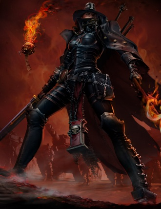

# 0607 阿德拉斯蒂娅 Adrastia

精校状态：中文行文已逐段精校，部分术语仍为暂定

分类：人类帝国 / 讨逆修会

原文来源：https://www.bilibili.com/opus/1209343390520442903

原作者：帝国神选罐头

原文时间：2026年06月02日 22:30

[返回分类目录](目录.md) · [全书目录](../../目录.md)

<!-- A0607-B0001 -->
**英文原文**

Adrastia was an Inquisitor of the Ordo Hereticus.

<!-- /A0607-B0001 -->

<!-- A0607-B0002 -->

原译文

阿德拉斯蒂娅是讨逆修会的审判官。

**校订译文**

阿德拉斯蒂娅是一名异端审判庭审判官。

<!-- /A0607-B0002 -->

<!-- A0607-B0003 图片 -->

<!-- A0607-B0004 -->

原译文

Inquisitor Adrastia 审判官阿德拉斯蒂娅

**校订译文**

Inquisitor Adrastia 审判官阿德拉斯蒂娅

<!-- /A0607-B0004 -->

<!-- A0607-B0005 -->
**英文原文**

She battled alongside the Imperial Guard under General Castor to secure the Aurelia Sub-sector in investigating the supposed heresy of Azariah Kyras, Chapter Master of the Blood Ravens. During the campaign, she willingly allied with Xenos forces such as Eldar and Orks.

<!-- /A0607-B0005 -->

<!-- A0607-B0006 -->

原译文

她与卡斯托将军率领的帝国卫队并肩作战，以确保奥瑞利亚分区的安全，调查血鸦战团长亚撒利雅·凯拉斯的所谓异端。在战役中，她心甘情愿地与灵族和欧克等异型部队结盟。

**校订译文**

她与卡斯托将军麾下的帝国卫队并肩作战，维护奥瑞利亚次星区的安全，并调查血鸦战团长亚撒利雅·凯拉斯涉嫌异端一事。在这场战役中，她主动与灵族、欧克等异形势力结盟。

<!-- /A0607-B0006 -->

本篇核心术语与暂定项

以下列出本篇出现的英文原形及核心术语表用词。同形词可能指不同对象，具体词义以本篇正文和校注为准；单复数、别名和仅见于图注的名称可能尚未列入。完整候选见[术语表](../../术语表/双语术语候选.csv)。

| 英文 | 采用中文 | 状态 |
| --- | --- | --- |
| Imperial Guard | 帝国卫队 | 暂定·语境区分 |
| Eldar | 灵族 | 暂定·语境区分 |
| Orks | 欧克蛮人 | 官方已核对 |
| Inquisitor | 审判官 | 官方已核对 |
| Azariah Kyras | 亚撒利雅·凯拉斯 | 暂定 |
| Blood Ravens | 血鸦 | 暂定 |
| Ordo Hereticus | 异端审判庭 | 用户指定 |
| Sector | 星区 | 暂定·官方待核 |
| Castor | 卡斯托 | 暂定·官方待核 |
| Master | 导师（审判庭职衔）／舰务官（舰员职务） | 语境定译·官方待核 |
| Chapter | 战团 | 暂定·官方待核 |
| Chapter Master | 战团长 | 暂定·官方待核 |
| Xenos | 异形 | 暂定·官方待核 |
| Adrastia | 阿德拉斯蒂娅 | 暂定·官方待核 |
| Aurelia Sub-sector | 奥瑞利亚次星区 | 暂定·官方待核 |
| The Blood | 鲜血 | 暂定·官方待核 |

