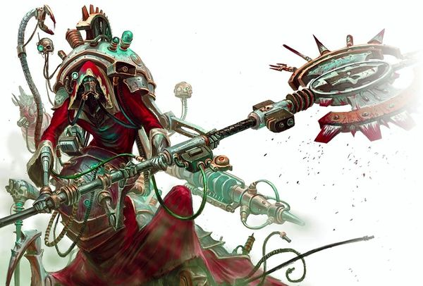
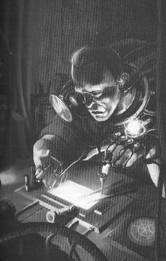
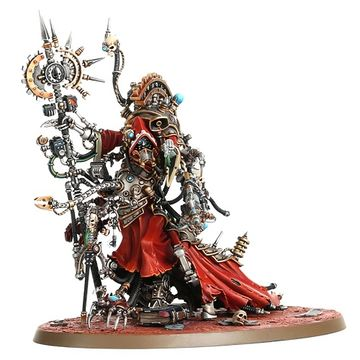

# 0610 贝利萨留斯·考尔 Belisarius Cawl

精校状态：中文行文已逐段精校，部分术语仍为暂定

分类：人类帝国 / 机械神教

原文来源：https://www.bilibili.com/opus/988020775087767554

原作者：帝国神选罐头

原文时间：编辑于 2026年07月24日 16:27

[返回分类目录](目录.md) · [全书目录](../../目录.md)

原篇名：贝利撒留·考尔 Belisarius Cawl

<!-- A0610-B0001 -->
**英文原文**

Belisarius Cawl is an Archmagos Dominus of the Adeptus Mechanicus who has been involved in one of the Imperium's greatest secrets for many centuries. He first appeared openly during the Thirteenth Black Crusade of the late 41st Millennium. Cawl is known as the Dominatus Dominus, the Master of Masters, one of the highest ranks available in the Mechanicum. Unlike many Tech-Priests within the Mechanicum he does not seek to copy or discover lost technology, but to innovate.

<!-- /A0610-B0001 -->

<!-- A0610-B0002 -->

原译文

贝利撒留·考尔是机械神教的统御大贤者，几个世纪以来一直参与帝国最大的秘密之一。他首次公开露面是在41千年末的第十三次黑暗远征期间。考尔被称为统御之主，大师中的大师，是机械神教中可获得额的最高级别之一。与机械神教中的许多技术神甫不同，他不寻求复制或发现丢失的技术，而是寻求创新。

**校订译文**

贝利萨留斯·考尔是机械修会的一位统御大贤者，长期参与帝国最重大的秘密计划之一。他在第41个千年末的第十三次黑色远征期间公开现身。考尔获称“统御之主”，即“大师之师”，这是机械教最高的位阶之一。与许多技术祭司不同，他追求的是技术创新，而不只是复制既有技术或重新发现失落的知识。

<!-- /A0610-B0002 -->

<!-- A0610-B0003 图片 -->

<!-- A0610-B0004 -->

原译文

Belisarius Cawl 贝利撒留·考尔

**校订译文**

Belisarius Cawl 贝利萨留斯·考尔

<!-- /A0610-B0004 -->

<!-- A0610-B0005 -->
###### History 历史

<!-- /A0610-B0005 -->

<!-- A0610-B0006 -->
**英文原文**

Cawl himself is over ten thousand years old, predating even the Imperium itself, though how exactly he has sustained his life for so long is unknown. Cawl has been memory wiped at least twice, leaving his own origins a mystery even to himself. It is thought that he has used forbidden alien methods technology with mechanical bionics to sustain his life at the cost of any humanity he may have had left.

<!-- /A0610-B0006 -->

<!-- A0610-B0007 -->

原译文

考尔本人已有一万多年的历史，甚至早于帝国本身，尽管他究竟是如何维持这么长时间的生命尚不清楚。考尔的记忆至少被抹去了两次，甚至对他自己来说，他的起源都是一个谜。人们认为，他使用了被禁止的外星技术和机械仿生学来维持自己的生命，代价是他可能留下的任何人性。

**校订译文**

考尔已有一万多岁，甚至比帝国本身还要古老；他究竟如何延续了如此漫长的生命，至今不得而知。他的记忆至少被清除过两次，因此连他自己也不清楚自己的全部来历。有人认为，他将禁忌的异形技术与机械义体结合，以牺牲残存人性为代价维持生命。

**校注：** 本段称考尔早于帝国，后文又写生于M31；两种说法均出自英文底稿，保留差异，不擅自调整出生年代。异形延寿技术仅为文中推测。

<!-- /A0610-B0007 -->

<!-- A0610-B0008 图片 -->

<!-- A0610-B0009 -->

原译文

The young Belisarius Cawl during the Horus Heresy 荷鲁斯叛乱时期的年轻贝利撒留·考尔

**校订译文**

The young Belisarius Cawl during the Horus Heresy 荷鲁斯之乱时期的年轻贝利萨留斯·考尔

<!-- /A0610-B0009 -->

<!-- A0610-B0010 -->
###### Heresy-era 叛乱时代

<!-- /A0610-B0010 -->

<!-- A0610-B0011 -->
**英文原文**

Cawl was born on Mars sometime in M31 in the facilities of Xanthe Terra which belonged to Magos Biologis Hammareth. Like most Martian children he was vat-born and at the time of his birth already was a young adolescent. However unlike most children he was able to speak normally at the time of his birth, a result of absorbing the inloaded data while he was being grown in his vat. Cawl first appears in history during the Horus Heresy, where he was a Tech-Acolyte on the Mechanicum world of Trisolian-A4. He was trained under Hester Aspertia Sigma-Sigma, herself a master of soul-merging. Cawl, the last remaining disciple of the art of soul merging, at this time maintained that the Emperor was the Omnissiah, but disagreed with a great deal of Mechanicum dogma as he felt they should innovate rather than ritualistically maintain. He believed in the human form, and refused many of the more visible cybernetic modifications utilized by other Tech-Priests. However during this time, the young Cawl secretly performed illegal brain enhancement surgeries on himself in order to increase his own intelligence. Later the Trisolian System assaulted by traitor forces led by Horus himself, and Cawl was betrayed when his master Hester Aspertia Sigma-Sigma defected to the Warmaster. He became disgusted at the sight of the corrupted Horus, but feigned submission to survive. Later during the battle, Cawl, along with his colleague Friedisch Adum Ship Qvo were able to kill Aspertia and escape the Trisolian System - but not before Cawl absorbed his masters intelligence core and mastery of cloning.

<!-- /A0610-B0011 -->

<!-- A0610-B0012 -->

原译文

考尔出生在M31的火星的克珊忒台地设施中，该设施属于生物贤者哈马瑞斯。像大多数火星孩子一样，他出生在火星上，出生时已经是一个年轻的少年。然而，与大多数孩子不同的是，他出生时能够正常说话，这是他在罐里成长时吸收了加载的数据的结果。考尔首次出现在历史上的荷鲁斯叛乱时期，当时他是特里索兰-A4机械世界的技术助手。他在海丝特·阿斯佩蒂亚·西格玛-西格玛指导下接受训练，海丝特·阿斯佩蒂亚·西格玛本人是灵魂融合的大师。考尔是灵魂融合艺术的最后一位弟子，他当时坚持认为帝皇是欧姆尼赛亚，但不同意大量的机械神教教条，因为他认为这些教条应该创新而不是仪式化地维护。他相信人类的形态，并拒绝了其他技术神甫使用的许多更明显的智控修改。然而，在这段时间里，年轻的考尔为了提高自己的智力，秘密地对自己进行了非法的脑部增强手术。后来，由荷鲁斯本人领导的叛徒势力袭击了特里索兰星系，当他的主人海丝特·阿斯佩蒂亚·西格玛-西格玛叛逃到战帅时，考尔被背叛了。他一看到堕落的荷鲁斯就感到厌恶，但为了生存，他假装屈服。在战斗的后期，考尔和他的同事弗里迪希·阿杜姆·西利普·邱弗杀死了阿斯佩蒂亚并逃离特里索兰星系，但在此之前考尔吸收了他的主人的算力核心和克隆技术。

**校订译文**

考尔于第31个千年出生在火星克珊忒台地的一处设施中，那里归生物贤者哈马瑞斯所有。与大多数火星孩童一样，他诞生于培养槽，出槽时身体就已发育到少年阶段。不同的是，他在培养槽中成长时便吸收了灌输给他的数据，因此刚出生就能正常说话。考尔最早见于史料的事迹发生在荷鲁斯之乱期间；当时，他是机械教世界特里索兰-A4上的一名技术侍僧，师从精于灵魂融合的海丝特·阿斯佩蒂亚·西格玛-西格玛。作为这门技艺最后的传人，考尔坚信帝皇就是欧姆尼赛亚，却不认同机械教的许多教条。他认为技术应当不断创新，而非仅靠仪式维持现状。他尊重人类原有的躯体形态，拒绝接受其他技术祭司常用的许多显眼义体改造；与此同时，为了提高智力，年轻的考尔也曾秘密对自己实施非法的脑部强化手术。后来，荷鲁斯亲率叛军进攻特里索兰星系，考尔的导师阿斯佩蒂亚投靠战帅。考尔目睹荷鲁斯腐化后的模样，心生厌恶，却为了活命而佯装归顺。在随后的战斗中，他与同僚弗里德里希·阿杜姆·西利普·克沃合力杀死阿斯佩蒂亚，逃出了星系；临行前，考尔还吸收了导师的心智核心及其掌握的克隆技术。

**校注：** vat-born 指培养槽培育，并非重复说出生于火星。Friedisch 的中间名在此写作 Ship，结合本书完整姓名 Silip 统一中文西利普，英文差异保留待核。

<!-- /A0610-B0012 -->

<!-- A0610-B0013 -->
**英文原文**

Following Trisolian, Cawl and Friedisch went to Terra where he came under the tutelage of Ezekiel Sedayne. In truth, Sedayne simply wanted Cawl's knowledge to achieve immortality so he may continue the work of the Emperor. Sedayne threatened Friedisch's life to try and merge his soul with Cawl's body and achieve eternal life. However unexpectedly, Sedayne's personality was overpowered by Cawl and he emerged as the dominant personality. Upon awakening Cawl relived a memory of Sedayne meeting the Emperor during the Unification Wars. In the memory the Master of Mankind was speaking directly to Cawl in the future as he had foreseen Sedayne's ultimate fate. He stated that Cawl must continue His work, even when the day came when Cawl thinks he has betrayed Him. Cawl was horrified by the idea of ever betraying the Emperor.

<!-- /A0610-B0013 -->

<!-- A0610-B0014 -->

原译文

特里索兰之后，考尔和弗里迪希去了泰拉，在那里他受到了以西结·赛丹的监护。事实上，塞丹只是想要考尔的知识达到永生，这样他就可以继续帝皇的工作。赛丹威胁弗里迪希的生命，试图将他的灵魂与考尔的身体融合，实现永生。然而，出乎意料的是，塞丹的意识被考尔压倒了，考尔成为了主导意识。醒来后，考尔回忆起塞丹在统一战争期间会见帝皇的情景。在记忆中，人类之主在未来直接与考尔交谈，因为他预见到了塞丹的最终命运。他说考尔必须继续他的工作，即使有一天考尔认为他背叛了帝皇。考尔对背叛帝皇的想法感到震惊。

**校订译文**

离开特里索兰后，考尔与弗里德里希前往泰拉，考尔在那里接受以西结·赛丹的教导。赛丹真正想要的却是借考尔的知识获得永生，以便继续帝皇的事业。他以弗里德里希的性命相要挟，试图把自己的灵魂融入考尔体内。但融合的结果出乎他的预料：考尔的人格压倒了赛丹，取得主导地位。苏醒后，考尔亲历了赛丹的一段记忆——统一战争期间，赛丹曾与帝皇会面。记忆中的人类之主早已预见赛丹的结局，因此实际上是在通过这段记忆，对未来的考尔说话。帝皇要求考尔继续自己的事业，即使有一天考尔自以为背叛了他，也必须坚持下去。考尔一想到自己竟可能背叛帝皇，便感到恐惧。

**校注：** 帝皇在过去的会面中预先向未来的考尔传话。本段称考尔“自以为背叛”，第595篇措辞不同，两处按各自英文保留并提示版本差异。

<!-- /A0610-B0014 -->

<!-- A0610-B0015 -->
**英文原文**

After the Heresy Cawl was charged by Roboute Guilliman to oversee two great tasks should the Primarch fall. They were to be the resurrection of Guilliman and the creation of the Primaris Space Marines with the Sangprimus Portum, two things he worked on for the next 10 millennia. During his ten thousand years of work, Cawl changed dramatically. He began to combine more entities within his own intelligence core, becoming in essence a legion of separate beings described as a mesh of souls rather than a combination of minds. These include Ezekiel Sedayne as well as Hester Aspertia Sigma-Sigma. Over time, Cawl began to lose much of his memory as he was forced to dump data around every 500 years.

<!-- /A0610-B0015 -->

<!-- A0610-B0016 -->

原译文

在叛乱之后，考尔被罗伯特·基里曼委托监督两项重大任务，如果原体倒下。它们是基里曼的复活以及用原血之栈创建原铸星际战士，这是他在接下来的1万年里所做的两件事。在他一万年的工作中，考尔发生了巨大的变化。他开始在自己的智能核心中组合更多的实体，本质上成为一个由不同生命组成的军团，被描述为灵魂的网状结构，而不是思想的结合。其中包括以西结·赛丹和海丝特·阿斯佩蒂亚·西格玛-西格玛。随着时间的推移，考尔开始失去大部分记忆，因为他被迫每500年转储一次数据。

**校订译文**

荷鲁斯之乱之后，罗保特·基里曼交给考尔两项重大任务：一旦原体倒下，就设法使他复苏；同时利用原血之栈创造原铸星际战士。此后一万年，考尔始终为这两个目标工作。他自身也发生了巨大变化，不断把其他个体融入自己的心智核心，逐渐成为由众多个体构成的庞大集合。人们将其形容为一张交织的灵魂之网，而非单纯的思想组合，其中就包括以西结·赛丹与海丝特·阿斯佩蒂亚·西格玛-西格玛。为了腾出容量，考尔大约每五百年就不得不清除一批数据，也因此逐渐丢失了大量记忆。

<!-- /A0610-B0016 -->

<!-- A0610-B0017 -->
###### Post-Heresy 叛乱后

<!-- /A0610-B0017 -->

<!-- A0610-B0018 -->
**英文原文**

At the time of the 13th Black Crusade, Cawl was guided by a Harlequin Shadowseer to a planet which was long-abandoned during the 4th Black Crusade. After battling Orks on the world he recovered an artifact and learned of the Pylons holding back the Immaterium. He was then instructed by this mysterious Shadowseer to go to Cadia, where he aided in the defenses of the world against the forces of Chaos. He was eventually joined into a reluctant alliance with the Necron Lord Trazyn the Infinite and the duo joined together to activate Cadia's Pylon array. While initially successful in activating the Pylons, Cadia was shattered by Abaddon's redirection of the remains of a Blackstone Fortress into the planet. Cawl fled the Cadian system with his artifact and several allies including Saint Celestine, Inquisitor Greyfax, and Marshal Marius Amalrich. Hounded by the Black Legion who sought his artifact of still unknown significance, Cawl and his allies were eventually guided into the Webway on Kalisus by his saviors: Eldar under Eldrad Ulthran.

<!-- /A0610-B0018 -->

<!-- A0610-B0019 -->

原译文

在第13次黑色远征时，考尔被一位丑角暗影先知引导到一个在第4次黑色远征被长期遗弃的星球。在与世界上的欧克蛮人作战后，他找到了一件神器，并了解到黑石方尖碑正在阻挡亚空间。随后，这位神秘的暗影先知指示他前往卡迪亚，在那里他协助世界防御混沌势力。最终加入了与太空死灵霸主无尽者塔拉辛的不情愿的联盟，两人联手激活了卡迪亚的黑石方尖碑阵列。虽然最初成功地激活了方尖碑，但阿巴顿将黑石堡垒的残余重新定向到星球上，使卡迪亚四分五裂。考尔带着他的神器和几个盟友逃离了卡迪安星系，其中包括圣塞勒斯汀、审判官格雷法克斯和元帅马里乌斯·阿莫里奇。在黑色军团的追捕下，考尔和他的盟友最终被他的拯救者：艾德拉德·乌索然手下的艾达灵族的带领下进入了卡利苏斯的网道。

**校订译文**

第十三次黑色远征期间，一位丑角暗影先知引导考尔前往一颗自第四次黑色远征起便遭遗弃的星球。考尔在那里与欧克交战，找回一件遗物，并获知方尖碑可以阻隔亚空间。神秘的暗影先知随后指引他前往卡迪亚，协助守军抵御混沌。他最终与太空死灵领主无尽者塔拉辛勉强结盟，合力启动卡迪亚的方尖碑阵列。阵列一度成功运作，阿巴顿却将一座黑石要塞的残骸撞向星球，摧毁了卡迪亚。考尔带着遗物，与圣塞莱斯汀、审判官格雷法克斯、元帅马里乌斯·阿马尔里奇等盟友逃离卡迪亚星系。黑色军团为夺取那件用途仍不明的遗物，一路紧追不舍。最终，艾尔德拉德·乌瑟兰麾下的灵族出手相救，引导他们在卡利苏斯进入网道。

**校注：** 英文为 Necron Lord，译作太空死灵领主，不因通行身份将本句擅改为 Overlord（霸主）。

<!-- /A0610-B0019 -->

<!-- A0610-B0020 -->
**英文原文**

The Eldar guided the expedition to Macragge where Cawl revealed that his precocious artifacts were the Emperor's Sword and a suit of Power Armour that could heal the comatose Primarch Guilliman. During the Ultramar Campaign Cawl was able to successfully work with the Eldar in resurrecting Guilliman, who drove the Chaos invaders from Ultramar. Cawl accompanied Guilliman in the subsequent Terran Crusade and was one of the few to reach Terra. Once on Terra Cawl talked with Guilliman of a secret pact with Mars and of his work nearing completion. He then made his way to the Red Planet to oversee its success.

<!-- /A0610-B0020 -->

<!-- A0610-B0021 -->

原译文

灵族带领探险队前往马库拉格，考尔透露，他的早期制品是皇帝之剑和一套可以治愈昏迷的原体基里曼的动力盔甲。在奥特拉马之战期间，考尔成功地与灵族合作，复活了将混沌入侵者赶出奥特拉马的基里曼。考尔在随后的泰拉远征中陪伴基里曼，是少数到达泰拉的人之一。有一次在泰拉上，考尔与基里曼谈到了与火星的秘密协议，以及他的工作即将完成。然后，他前往红色星球监督它的成功。

**校订译文**

灵族将这支队伍带到马库拉格，考尔才揭示自己携带的珍贵遗物：帝皇之剑，以及一套能够治愈昏迷中的原体基里曼的动力甲。在奥特拉玛战役中，考尔与灵族合作，成功唤醒基里曼，后者随即将混沌入侵者逐出奥特拉玛。之后，考尔陪同基里曼踏上泰拉远征，成为少数成功抵达泰拉的人之一。在泰拉，他与基里曼谈起同火星订立的秘密协议，以及自己即将完成的工作，随后前往红色星球，亲自监督计划的完成。

**校注：** precocious artifacts 字面“早熟的遗物”不合语境，疑为 precious 的笔误，暂按“珍贵遗物”校正并留疑。

<!-- /A0610-B0021 -->

<!-- A0610-B0022 -->
**英文原文**

This secret project was Cawl was revealed to be the creation of Primaris Space Marines, the next generation of the Angels of Death. In truth, Cawl had been working on the project for 10,000 years. Despite his seeming loyalty and effectiveness, Guilliman still harbors a great amount of distrust for Cawl. He believes Cawl to border the heretekal, particularly with regard to his creation of an artificial intelligence known as the Cawl Inferior. Due to this, Guilliman has repeatedly refused Cawl's requests to become Fabricator-General. Cawl's actions have also made him enemies with many across the greater Mechanicum, particularly the more religious and conservative Tech-Priests.

<!-- /A0610-B0022 -->

<!-- A0610-B0023 -->

原译文

这个秘密项目被考尔透露为是下一代死亡天使原铸星际战士的创作。事实上，考尔已经为这个项目工作了1万年。尽管考尔表面上忠诚而高效，但基里曼仍然对考尔怀有极大的不信任。他认为考尔接近异端，特别是在他创造了一种名为次级考尔的人工智能后。因此，基里曼一再拒绝考尔成为铸造将军的请求。考尔的行为也使他与机械教的许多人成为敌人，尤其是那些更虔诚和保守的技术神甫。

**校订译文**

这项秘密工程后来揭晓：创造新一代死亡天使——原铸星际战士。考尔已经为此工作了一万年。尽管他表现得忠诚而高效，基里曼仍对他抱有深深的戒心，认为他的研究游走在技术异端的边缘，尤其怀疑他制造的“次级考尔”属于人工智能。因此，基里曼一再拒绝让考尔担任铸造将军。考尔的种种行为也使他在机械教内树敌众多，尤其激怒了那些虔诚而保守的技术祭司。

**校注：** 与本篇末段合读，次级考尔是否拥有完整自主意识仍为基里曼的怀疑；不将其预设为已获证实。

<!-- /A0610-B0023 -->

<!-- A0610-B0024 -->
**英文原文**

During the Age of the Dark Imperium, Cawl traveled with the rebuilt Scythes of the Emperor to Sotha to study the reactivated Pharos and use it to learn of Blackstone deposits across the Galaxy. During the experiments the C'tan held within the device, Zarhulash, agreed to work with Cawl to remove the heart of the Pharos in exchange for being set free. Cawl agreed, but tricked the C'tan by destroying the Pharos and teleporting Zarhulash to the far side of the galaxy.

<!-- /A0610-B0024 -->

<!-- A0610-B0025 -->

原译文

在黑暗帝国时期，考尔带着重建的帝皇之镰战团前往索萨，研究重新激活的灯塔，并用它来了解整个银河系的黑石矿床。在实验过程中，星神扎胡拉什被放在装置内，并同意与考尔合作解除灯塔之心，以换取自由。考尔同意了，但通过摧毁灯塔并将扎胡拉什传送到银河系的远端欺骗了星神。

**校订译文**

黑暗帝国时代，考尔与重建后的帝皇之镰战团一同前往索萨，研究重新启动的法罗斯装置，打算借此寻找银河各地的黑石矿藏。实验期间，被囚禁在装置内的星神扎胡拉什同意协助他取出法罗斯核心，条件是重获自由。考尔答应了，却又摆了它一道：他摧毁法罗斯，将扎胡拉什传送到银河的另一端。

**校注：** 英文在此简称星神；第585篇将装置内的存在具体称为星神碎片。此处不凭空增加实验时才将其放入装置的情节。

<!-- /A0610-B0025 -->

<!-- A0610-B0026 -->
**英文原文**

Most recently, Cawl has led Battle Group Hephaestus of Indomitus Crusade Fleet Primus into the Nephilim Sector in order to battle the Necrons. His main goal is to secure the area before the arrival of Guilliman himself.

<!-- /A0610-B0026 -->

<!-- A0610-B0027 -->

原译文

最近，考尔带领不屈远征舰队的赫菲斯托斯战斗群进入涅菲里姆星区，与太空死灵作战。他的主要目标是在基里曼本人抵达之前确保该地区的安全。

**校订译文**

原稿最新记载称，考尔率领不屈远征第一舰队的赫菲斯托斯战斗群进入拿非利星区，与太空死灵交战。他的主要目标是在基里曼亲自抵达前控制这片区域。

**校注：** Most recently 仅指英文底稿成文时的进度，不代表本次校订日期的最新出版剧情。Fleet Primus 的第一舰队在原译中遗漏。

<!-- /A0610-B0027 -->

<!-- A0610-B0028 -->
###### Biology and Wargear 生理与战争装备

<!-- /A0610-B0028 -->

<!-- A0610-B0029 -->
**英文原文**

Belisarius Cawl is equipped with a Solar Atomiser, Arc Scourge, Master-crafted Omnisian Axe, Refractor Field, vast multitude of Mechandarites, and Servo-Skull.

<!-- /A0610-B0029 -->

<!-- A0610-B0030 -->

原译文

贝利撒留·考尔配备了日冕爆炎枪、电弧鞭、精工欧姆尼塞亚之斧、折射立场护盾、大量机械手和伺服头骨。

**校订译文**

贝利萨留斯·考尔装备有日冕爆炎枪、电弧鞭、精工欧姆尼赛亚之斧、折射力场、大量机械触须，以及伺服颅骨。

**校注：** 原稿 Mechandarites 疑为机械触须类术语的拼写错误，按装备语境暂校；保留英文待核。

<!-- /A0610-B0030 -->

<!-- A0610-B0031 图片 -->

<!-- A0610-B0032 -->

原译文

Belisarius Cawl 贝利撒留·考尔

**校订译文**

Belisarius Cawl 贝利萨留斯·考尔

<!-- /A0610-B0032 -->

<!-- A0610-B0033 -->
**英文原文**

Cawl's humanity has long since been stripped away. He maintains different "files" of personalities, which he accesses depending on the situation. By the end of the Indomitus Crusade, Cawl had artificially replicated his own sentience to the point where he could no longer said to be a single individual. Cawl kept each "Sub-Cawl" limited to prevent the core intelligence from being threatened. Aboard his Ark Mechanicus Zar-Quaesitor dozens of sub-cawls swarm about, each undertaking a different task.

<!-- /A0610-B0033 -->

<!-- A0610-B0034 -->

原译文

考尔的人性早已被剥夺。他保存着不同的个性“档案”，并根据具体情况访问这些档案。到不屈远征结束时，考尔已经人为地复制了自己的感知能力，以至于他再也不能说自己是一个人了。考尔限制了每个“分考尔”，以防止核心情报受到威胁。在他的机械方舟探索者之王号上，有着数十个分考尔，每个都承担着不同的任务。

**校订译文**

考尔的人性早已消磨殆尽。他保存着多套人格“档案”，并会根据情势调用不同人格。到不屈远征结束时，他已经以人工手段大量复制自己的意识，难以再被视为单一的个体。他限制每个“分考尔”的能力，以免它们威胁主体心智。在机械方舟探索者之王号上，数十个分考尔同时忙碌，各自执行不同任务。

**校注：** sentience 指意识，intelligence 在此指主体心智；分别修正原译“感知能力”“核心情报”。

<!-- /A0610-B0034 -->

<!-- A0610-B0035 -->
**英文原文**

Cawl has a number of other creations used to aid him, such as Alpha Primus and Qvo.

<!-- /A0610-B0035 -->

<!-- A0610-B0036 -->

原译文

考尔还有许多其他的作品可以帮助他，比如原铸之首和Qvo。

**校订译文**

考尔还创造了许多其他助手，例如原铸之首与克沃。

<!-- /A0610-B0036 -->

<!-- A0610-B0037 -->
###### The Cawl Inferior 次级考尔

<!-- /A0610-B0037 -->

<!-- A0610-B0038 -->
**英文原文**

Cawl developed the Cawl Inferior, a device to emulate himself, housed deep within the Macragge’s Honour. The Cawl Inferior was made to communicate with the Primarch Roboute Guilliman in the Archmagos's stead, as well as to serve as a backup in case Cawl himself were to die. To facilitate this, the Cawl Inferior contains the sum total of its creator's knowledge. While stated to only communicate using pre-programmed responses, the Primarch suspects that the Cawl Inferior is actually a fully sentient Abominable Intelligence.

<!-- /A0610-B0038 -->

<!-- A0610-B0039 -->

原译文

考尔开发了次级考尔，这是一种模仿自己的装置，位于马库拉格之耀深处。次级考尔是为了代替大贤者与原体罗伯特·基里曼沟通，并在考尔本人死亡的情况下作为替补。为了促进这一点，次级考尔包含了其创造者的知识总和。虽然据说只能使用预先编程的反应进行交流，但原体怀疑次级考尔实际上完全是一种有感知力的憎恶智能。

**校订译文**

考尔制造了一个模拟自身的装置——次级考尔，将其安置在马库拉格之耀号深处。这个装置代替大贤者与原体罗保特·基里曼沟通，也在考尔本人死亡时充当备份。为此，它储存了创造者的全部知识。考尔声称，它只能用预先编写的回答作出回应；原体却怀疑，次级考尔实际上是一种拥有完整自主意识的憎恶智能。

<!-- /A0610-B0039 -->

本篇核心术语与暂定项

以下列出本篇出现的英文原形及核心术语表用词。同形词可能指不同对象，具体词义以本篇正文和校注为准；单复数、别名和仅见于图注的名称可能尚未列入。完整候选见[术语表](../../术语表/双语术语候选.csv)。

| 英文 | 采用中文 | 状态 |
| --- | --- | --- |
| Space Marines | 星际战士 | 官方已核对 |
| Adeptus Mechanicus | 机械修会 | 官方已核对 |
| Eldar | 灵族 | 暂定·语境区分 |
| Necrons | 太空死灵 | 官方已核对 |
| Orks | 欧克蛮人 | 官方已核对 |
| Roboute Guilliman | 罗保特·基里曼 | 官方已核对 |
| Ultramar | 奥特拉玛 | 官方已核对 |
| Horus Heresy | 荷鲁斯之乱 | 官方已核对 |
| Inquisitor | 审判官 | 官方已核对 |
| Imperium | 帝国 | 暂定·简称 |
| Mechanicum | 机械教 | 暂定·历史称谓 |
| Abominable Intelligence | 憎恶智能 | 暂定·官方待核 |
| Webway | 网道 | 暂定 |
| Shadowseer | 暗影先知 | 官方已核对 |
| Harlequin | 丑角 | 暂定 |
| Trazyn the Infinite | 无尽者塔拉辛 | 官方已核对 |
| Indomitus | 不屈学派 | 暂定·学派语境 |
| History | 历史 | 编辑用语已统一 |
| Emperor | 帝皇 | 官方已核对 |
| Primarch | 原体 | 官方已核对 |
| Ark Mechanicus | 机械方舟 | 暂定·官方待核 |
| Magos Biologis | 生物贤者 | 暂定·官方待核 |
| Black Legion | 黑色军团 | 暂定·官方待核 |
| Terra | 泰拉 | 暂定·官方待核 |
| Horus | 荷鲁斯 | 暂定·官方待核 |
| Servo-Skull | 伺服颅骨 | 暂定·官方待核 |
| Dark Imperium | 黑暗帝国 | 暂定·官方待核 |
| Indomitus Crusade | 不屈远征 | 暂定·官方待核 |
| Nephilim Sector | 拿非利星区 | 暂定·官方待核 |
| Unification Wars | 统一战争 | 暂定·官方待核 |
| Sector | 星区 | 暂定·官方待核 |
| Omnissiah | 欧姆尼赛亚 | 暂定·官方待核 |
| Mars | 火星 | 暂定·官方待核 |
| Cadia | 卡迪亚 | 暂定·官方待核 |
| Macragge | 马库拉格 | 暂定·官方待核 |
| Sotha | 索萨 | 暂定·官方待核 |
| Pharos | 灯塔 | 暂定·官方待核 |
| Tech | 技术语 | 暂定·官方待核 |
| Bionics | 仿生改造／仿生部件（依语境） | 语境定译·官方待核 |
| Master | 导师（审判庭职衔）／舰务官（舰员职务） | 语境定译·官方待核 |
| Saint Celestine | 圣塞莱斯汀 | 官方已核对 |
| Ezekiel Sedayne | 以西结·赛丹 | 暂定·官方待核 |
| Fabricator-General | 铸造将军 | 暂定·官方待核 |
| Belisarius Cawl | 贝利萨留斯·考尔 | 官方已核对 |
| Archmagos Dominus | 统御大贤者 | 暂定·官方待核 |
| Qvo | 克沃 | 暂定·官方待核 |
| Angels of Death | 死亡天使 | 暂定·官方待核 |
| Refractor Field | 折射力场 | 暂定·官方待核 |
| Power Armour | 动力盔甲 | 暂定·官方待核 |
| Ezekiel | 以西结 | 暂定·官方待核 |
| Scythes of the Emperor | 帝皇之镰 | 暂定·官方待核 |
| Alpha Primus | 原铸之首 | 暂定·官方待核 |
| Invaders | 侵略者 | 暂定·官方待核 |
| Marius Amalrich | 马里乌斯·阿马尔里奇 | 暂定·官方待核 |
| Sangprimus Portum | 原血之栈 | 暂定·官方待核 |
| C'tan | 星神 | 暂定·官方待核 |
| Blackstone Fortress | 黑石要塞 | 暂定·官方待核 |
| Eldrad Ulthran | 艾尔德拉德·乌瑟兰 | 官方已核对 |
| Primus | 领军 | 官方已核对 |
| Marshal | 元帅 | 官方已核对 |
| Necron Lord | 死灵领主 | 暂定·官方待核 |
| Zarhulash | 扎胡拉什 | 暂定·官方待核 |
| Zar-Quaesitor | 探索者之王号 | 暂定·官方待核 |
| Pylons | 方尖碑 | 暂定·官方待核 |
| Battle Group Hephaestus | 赫菲斯托斯战斗群 | 暂定·官方待核 |
| Friedisch | 弗里德里希 | 暂定·官方待核 |
| Kalisus | 卡利苏斯 | 暂定·官方待核 |
| Inquisitor Greyfax | 审判官格雷法克斯 | 官方已核对 |
| Macragge’s Honour | 马库拉格之耀号 | 暂定·官方待核 |
| Dominatus Dominus | 统御之主 | 暂定·官方待核 |
| Master of Masters | 大师之师 | 暂定·官方待核 |
| Xanthe Terra | 克珊忒台地 | 暂定·官方待核 |
| Hammareth | 哈马瑞斯 | 暂定·官方待核 |
| Tech-Acolyte | 技术侍僧 | 暂定·官方待核 |
| Trisolian-A4 | 特里索兰-A4 | 暂定·官方待核 |
| Hester Aspertia Sigma-Sigma | 海丝特·阿斯佩蒂亚·西格玛-西格玛 | 暂定·官方待核 |
| Cawl Inferior | 次级考尔 | 暂定·官方待核 |
| Solar Atomiser | 日冕爆炎枪 | 暂定·官方待核 |
| Arc Scourge | 电弧鞭 | 暂定·官方待核 |
| Master-crafted Omnisian Axe | 精工欧姆尼赛亚之斧 | 暂定·官方待核 |
| Mechandarites | 机械触须 | 暂定·官方待核 |
| Sub-Cawl | 分考尔 | 暂定·官方待核 |
| Vat-born | 缸裔 | 暂定·官方待核 |
| The Dark | 《黑暗》 | 暂定·官方待核 |
| Trisolian | 特里索兰 | 暂定·官方待核 |
| System | 星系（恒星系统） | 暂定·官方待核 |
| Hephaestus | 赫菲斯托斯 | 暂定·官方待核 |
| Emperor's Sword | 帝皇之剑 | 暂定·官方待核 |
| Terran Crusade | 泰拉远征 | 暂定·官方待核 |
| Fabricator | 铸造师 | 暂定·待核官方 |
| Omnisian Axe | 欧姆尼赛亚之斧 | 暂定·官方待核 |

