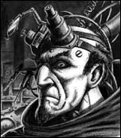
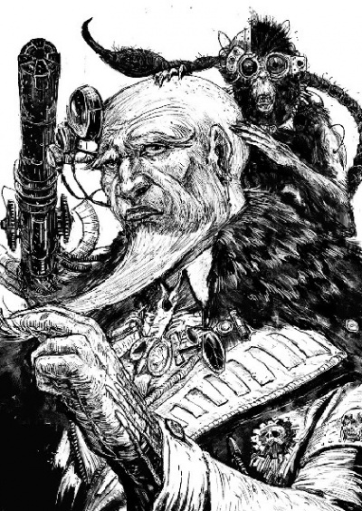

# 0611 阿坎·兰德 Arkhan Land

精校状态：中文行文已逐段精校，部分术语仍为暂定

分类：人类帝国 / 机械神教

原文来源：https://www.bilibili.com/opus/1082418551322574854

原作者：帝国神选罐头

原文时间：编辑于 2026年07月24日 16:47

[返回分类目录](目录.md) · [全书目录](../../目录.md)

<!-- A0611-B0001 -->
**英文原文**

Arkhan Land was one of the most famous members of the Mechanicum, a Magos and technoarchaeologist, best known for recovering rare STC technology from the Librarius Omnis.

<!-- /A0611-B0001 -->

<!-- A0611-B0002 -->

原译文

阿坎·兰德是机械教最著名的成员之一，一位贤者和技术考古学家，以从火星大图书馆那里回收稀有的STC技术而闻名。

**校订译文**

阿坎·兰德是机械教最著名的成员之一。他既是贤者，也是技术考古学家，以从全知图书馆中找回罕见的STC技术而闻名。

<!-- /A0611-B0002 -->

<!-- A0611-B0003 图片 -->

<!-- A0611-B0004 -->

原译文

Magos Arkhan Land 贤者阿坎兰德

**校订译文**

Magos Arkhan Land 贤者阿坎·兰德

<!-- /A0611-B0004 -->

<!-- A0611-B0005 -->
## Biography 传记

<!-- /A0611-B0005 -->

<!-- A0611-B0006 -->
**英文原文**

Arkhan Land was one of the most legendary and gifted members of the Mechanicum even in the age of the Great Crusade. By the age of five, he could speak over 50 dialects and quickly became a renowned Tech-Priest who was able to successfully navigate the hazardous catacombs and tech-vaults beneath Mars' surface and recover STC fragments and artifacts. Known to the greater Mechanicum as an unparalleled genius but also arrogant and disrespectful, he was also notable for having few outward bionic enhancements.

<!-- /A0611-B0006 -->

<!-- A0611-B0007 -->

原译文

即使在大远征时期，阿坎·兰德也是机械教最具传奇色彩和天赋的成员之一。到五岁时，他能说50多种方言，并迅速成为一名著名的技术神甫，他能够成功地在火星表面下的危险地下墓穴和技术秘库中导航，并回收STC碎片和造物。被更大的机械教称为无与伦比的天才，但也傲慢无礼，他也以很少进行外部仿生增强而闻名。

**校订译文**

即使在人才辈出的大远征时代，阿坎·兰德也是机械教中最富传奇色彩、最有天赋的人物之一。他五岁时就能说五十多种方言，后来很快成为著名的技术祭司，深入火星地表下危险的地下墓窟与技术宝库，成功带回STC残片及各类遗物。机械教普遍视他为无与伦比的天才，也认为他傲慢无礼。他还有一个引人注目的特点：几乎看不出接受过义体强化。

<!-- /A0611-B0007 -->

<!-- A0611-B0008 -->
### First Expedition 第一次探险

<!-- /A0611-B0008 -->

<!-- A0611-B0009 -->
**英文原文**

Land led a three-year expedition into the Librarius Omnis in search of a functioning STC database, resulting in the recovery of the blueprints for Land's Raider-Pattern Main Battle Tank, Land's Crawler multi-purpose heavy utility vehicle, the Mars Universal Land Engine (the basis of the Onager Dunecrawler), and the information on rare anti-gravitic plates used in Land's Speeder, all of which are named for him. In the 41st Millennium, some sources incorrectly state he died before seeing the practical implementation of the anti-gravitic plates he discovered.

<!-- /A0611-B0009 -->

<!-- A0611-B0010 -->

原译文

兰德率领一支为期三年的远征队进入火星大图书馆，寻找可运作的STC数据库。此次远征成功回收了兰德掠袭者型主战坦克、兰德爬行者多用途重型工程车、火星通用兰德引擎（沙丘爬行者的基础）的蓝图，以及兰德速攻艇所用的稀有反重力板的技术资料，这些装备均以他命名。在第41个千年的部分记载中，一些消息来源错误地说，他在看到他发现的反重力块的实际应用之前就去世了。

**校订译文**

兰德曾带队深入全知图书馆，花费三年寻找仍可运作的STC数据库。这次探险带回了多种设计图，包括兰德掠袭者型主战坦克、兰德爬行者多用途重型工程车，以及火星通用兰德引擎——沙丘爬行者便以此为基础发展而来。他还找回了兰德速攻艇所用的稀有反重力板技术资料。这些发现都以他的名字命名。第41个千年的某些记载错误地声称，他在亲眼见到反重力板投入实际应用之前便已去世。

**校注：** 原文列出发现命名及后世错误记载；不沿错误记载反推兰德死亡时间。

<!-- /A0611-B0010 -->

<!-- A0611-B0011 -->
**英文原文**

Land's discoveries drew the attention of the Emperor of Mankind, his discoveries finding wide use in the Legio Custodes who used a variety of Grav-Tanks powered by Land's anti-gravitic plates as well as the Paragon Pattern Jetbike. Shortly after the recovery of Angron, Arkhan Land was personally assigned by the Emperor to aid Him in His attempt to cure the Primarch of the Butcher's Nails. Only Land could confirm the Emperor's belief that the Butcher's Nails were based on the ancient cruciamen, a technology referred to in profane texts in the Hexarchion Vaults.

<!-- /A0611-B0011 -->

<!-- A0611-B0012 -->

原译文

兰德的发现引起了人类帝皇的关注，其成果在禁军中得到广泛应用，禁军装备了多种由兰德反重力板供能的反重力坦克，以及典范型悬浮摩托。安格隆回归后不久，阿坎·兰德就被帝皇亲自指派，帮助他治愈原体的屠夫之钉。只有兰德可以证实帝皇的看法，即屠夫之钉是基于古代的钻心者，这是一种在六头秘库的亵渎文本中提到的技术。

**校订译文**

兰德的发现引起了人类帝皇的注意，其成果也被禁军广泛采用。禁军不仅装备了以兰德反重力板驱动的多种反重力坦克，也使用典范型喷气摩托。安格隆回归后不久，帝皇亲自征召兰德，协助尝试消除屠夫之钉对这位原体造成的伤害。只有兰德有能力证实帝皇的判断：屠夫之钉源于一种名叫“钻心者”的古老技术，六头秘库的禁忌文献中曾提及这种技术。

<!-- /A0611-B0012 -->

<!-- A0611-B0013 -->
### Horus Heresy 荷鲁斯之乱

原题：Horus Heresy 荷鲁斯叛乱

<!-- /A0611-B0013 -->

<!-- A0611-B0014 -->
**英文原文**

Land revered the Emperor as the Omnissiah, and as such stayed loyal to him during the Horus Heresy. He was evacuated from Mars by Sergeant Nicanor Tullus of the Imperial Fists on the orders of First Captain Sigismund. As Land and Tullus made their way to the lander that would take them to safety, they were attacked by a Vorax Class Robot sent by the Dark Mechanicum to kill Land rather than let his talents be removed to Terra. Tullus gave his life to buy Land the time to escape along with other loyalist Tech-Priests.

<!-- /A0611-B0014 -->

<!-- A0611-B0015 -->

原译文

兰德将帝皇尊为欧姆尼赛亚，因此在荷鲁斯叛乱期间忠于他。根据西吉斯蒙德连长的命令，帝国之拳军士尼卡诺·图卢斯将他从火星撤离。当兰德和图卢斯前往将他们带到安全地带的登陆艇时，他们遭到了黑暗机械师教来的沃拉克斯级机兵的攻击，准备杀死兰德，而不是让他的天赋被转移到泰拉。图卢斯用自己的生命救下了兰德，并与其他忠诚的技术神甫一起逃离。

**校订译文**

兰德尊奉帝皇为欧姆尼赛亚，因此在荷鲁斯之乱中始终保持忠诚。帝国之拳军士尼卡诺·图卢斯奉第一连连长西吉斯蒙德之命，护送他撤离火星。两人赶往登陆艇时，遭到一台沃拉克斯级机兵袭击。黑暗机械教宁可杀死兰德，也不愿让他的才智为泰拉所用。图卢斯牺牲自己，为兰德和其他忠诚派技术祭司争取到了逃离的时间。

**校注：** First Captain 为第一连连长；原译末句错误地让已经牺牲的图卢斯与其他人一起逃走。

<!-- /A0611-B0015 -->

<!-- A0611-B0016 图片 -->

<!-- A0611-B0017 -->

原译文

Arkhan Land and Sapien during the Horus Heresy 荷鲁斯叛乱时期的阿坎·兰德和萨皮恩

**校订译文**

Arkhan Land and Sapien during the Horus Heresy 荷鲁斯之乱时期的阿坎·兰德和萨皮恩

<!-- /A0611-B0017 -->

<!-- A0611-B0018 -->
**英文原文**

Although he and Fabricator General Kane shared a mutual disdain for one another, Land's knowledge of forbidden weaponisation gleaned from the Hexarchion Vaults and good standing with the Custodes prompted Kane to seek his assistance in the ascension of Magos Domina Hieronyma into the Archimandrite. He accompanied the Archimandrite into the webway, bringing his personal Grav-Raider and Psyber-Monkey Sapien with him. When they arrived in Calastar as it was falling to the enemy, Land was visibly shaken by the sight of daemons.

<!-- /A0611-B0018 -->

<!-- A0611-B0019 -->

原译文

尽管他和铸造将军凯恩相互蔑视，但兰德从六头秘库收集到的关于禁止武器化的知识以及与禁军的良好关系促使凯恩寻求他的帮助，将统御贤者希罗尼玛提升为技术牧首。他同技术牧首进入网道，带着他的私人反重力掠袭者和灵能猿猴萨皮恩。当他们到达卡拉斯塔时，卡拉斯塔正落入敌人之手，兰德明显被恶魔的景象所震撼。

**校订译文**

兰德与铸造将军凯恩彼此鄙夷，但他掌握着从六头秘库中获得的禁忌武器技术，又与禁军关系良好，因此凯恩仍寻求他的协助，将统御贤者希罗尼玛提升为技术牧首。兰德随后与技术牧首一同进入网道，还带上了自己的反重力掠袭者战车，以及灵械猿猴萨皮恩。他们抵达卡拉斯塔时，城池正逐步落入敌手；亲眼见到恶魔，让兰德大为惊恐。

**校注：** Psyber-Monkey 依本书 Psyber Eagle“灵械天鹰”的词根译灵械猿猴，不将其简单理解为施展灵能的猿猴。

<!-- /A0611-B0019 -->

<!-- A0611-B0020 -->
**英文原文**

Following the Webway War, Land began spending much time with fellow veteran Dominion Zephon of the Blood Angels. Zephon's bionic limbs were constantly rejected by his body, so Land agreed to repair them. To bypass the bodily rejection, Land inserted fragments of a Dark Age of Technology-era Artificial Intelligence into Zephon's limbs and brain. The operation was a success and Zephon's limbs were finally accepted by his body, and in exchange Land demanded an audience with Sanguinius likely to lobby for the reclamation of Mars from the Dark Mechanicus.

<!-- /A0611-B0020 -->

<!-- A0611-B0021 -->

原译文

网道战争后，兰德开始花很多时间与圣血天使的老兵统御者泽丰在一起。泽丰的仿生肢体不断被他的身体排斥，所以兰德同意修复它们。为了绕过身体的排斥反应，兰德将黑暗技术时代的人工智能片段插入了泽丰的四肢和大脑。这次行动取得了成功，泽丰的四肢终于被他的身体所接受，作为交换，兰德要求与圣吉列斯会面，他可能会游说从黑暗机械教手中夺回火星。

**校订译文**

网道战争之后，兰德常与同样参加过那场战争的圣血天使统御者泽丰相处。泽丰的身体一直排斥所装配的义肢，兰德答应帮助修复。为了绕过排斥反应，他把黑暗科技时代的一段人工智能分别植入泽丰的四肢与大脑。手术成功，泽丰终于能够正常使用义肢。作为交换，兰德要求获准觐见圣吉列斯，很可能是想劝说他从黑暗机械教手中夺回火星。

<!-- /A0611-B0021 -->

<!-- A0611-B0022 -->
**英文原文**

During the Siege of Terra, Land managed to narrowly survive despite the ever-decreasing loyalist territory. Declaring he was too important to die, he managed to attach himself to convoys which fled into the Sanctum Imperialis. During this, he managed to nurse the wounded Dominion Zephon back to health from his injuries. Arkhan barely survived the journey back to the Sanctum Imperialis, but was pressed into service against his will to take part in the final defense of the Eternity Gate against hopeless odds. The night before the battle Land was comforted by both Zephon and the Skitarii Transacta-7Y1, though the Blood Angel ordered him to protect his three Bloodthralls Eristes, Shafia, and Shenkai in the coming struggle. Should he abandon these thralls, Zephon pledged to hunt him down and kill him regardless of outcome. This combined with Sanguinius' rousing speech seemed to force some bravery into Land, who courageously took part in the defense of the Eternity Gate.

<!-- /A0611-B0022 -->

<!-- A0611-B0023 -->

原译文

在泰拉围城期间，尽管忠诚者的领土不断减少，兰德还是勉强生存了下来。他宣称自己太重要了，不能死，于是设法加入了逃往帝国圣地的车队。在此期间，他设法将受伤的统御者泽丰从伤病中恢复过来。阿坎在返回帝国圣地的旅程中几乎没有幸存下来，但他被迫违背自己的意愿，参加了永恒之门的最后防御。战斗前一天晚上，泽丰和护教军坦斯达-7Y1都安慰了兰德，尽管圣血天使命令他在即将到来的战斗中保护他的三个血奴厄里斯忒斯、沙菲亚和申凯。如果他放弃这些奴隶，泽丰承诺无论结果如何，都会追捕并杀死他。这与圣吉列斯鼓舞人心的演讲相结合，似乎迫使一些勇敢的人加入兰德，他们勇敢地参与了永恒之门的防御。

**校订译文**

泰拉围城期间，忠诚派控制的区域不断收缩，兰德仍设法活了下来。他宣称自己太过重要，绝不能死，并混进撤往帝国圣所的车队。途中，他还照料受伤的统御者泽丰，使其恢复健康。兰德九死一生地回到圣所，却又被强征参加永恒之门的最后防御，面对几乎毫无胜算的战局。决战前夜，泽丰与护教军战士坦斯达-7Y1都曾安慰他；但泽丰也命令他，在即将到来的战斗中保护自己的三名血奴——厄里斯忒斯、沙菲亚和申凯。泽丰发誓，只要兰德抛下他们，不论战争结果如何，自己都会追上去杀了他。这番威胁，加上圣吉列斯振奋人心的演说，似乎终于激起了兰德的勇气。他勇敢地投入了永恒之门保卫战。

**校注：** 最后一句写勇气被激发的是兰德本人，并非另有“一些勇敢的人加入兰德”。Sanctum Imperialis 统一为帝国圣所。

<!-- /A0611-B0023 -->

<!-- A0611-B0024 -->
**英文原文**

During the final stages of the battle, two of the three thralls he was charged with protecting were killed in action and Land, Transacta-7Y1, and the sole remaining Thrall fled back to the Eternity Gate. However both Transacta and Land's psyber-monkey Sapian were killed by the World Eater Kargos Bloodspitter before Land and Shenkai were saved by Zephon. As the Eternity Gate sealed shut, Land and his entourage managed to make it inside the Sanctum.

<!-- /A0611-B0024 -->

<!-- A0611-B0025 -->

原译文

在战斗的最后阶段，他负责保护的三名奴隶中有两名在战斗中丧生，而兰德，坦斯达-7Y1和唯一剩下的奴隶逃回了永恒之门。然而，在兰德和申凯被泽丰救出之前，坦斯达和兰德的灵能猿猴萨皮恩都被吞世者吐血者卡尔戈斯杀死了。当永恒之门关闭时，兰德和他的随从设法进入了圣所。

**校订译文**

战斗进入最后阶段，兰德负责保护的三名血奴已有两人阵亡。他与坦斯达-7Y1及仅存的申凯一同退向永恒之门。随后，吞世者“吐血者”卡尔戈斯杀死了坦斯达和兰德的灵械猿猴萨皮恩；泽丰及时赶到，救下兰德与申凯。永恒之门关闭时，他们终于撤入圣所。

**校注：** Sapian 与前文 Sapien 为原稿拼写差异，中文统一萨皮恩。

<!-- /A0611-B0025 -->

<!-- A0611-B0026 -->
### Second Expedition 第二次探险

<!-- /A0611-B0026 -->

<!-- A0611-B0027 -->
**英文原文**

Land went missing while leading a second expedition into Librarius Omnis, with his vox diary being found two centuries later. He and his team were believed to have been picked off one by one by an unknown predator, possibly a psychic entity or a sentient virus. Other sources state that Land was killed by a psychic entity.

<!-- /A0611-B0027 -->

<!-- A0611-B0028 -->

原译文

兰德在第二次带领探险队进入火星大图书馆时失踪，两个世纪后，他的音阵日志被发现。他和他的团队被认为是被一个未知的捕食者一个接一个地抓走的，可能是一个灵能实体或一种有感知力的病毒。其他消息来源称，兰德是被一个灵能实体杀害的。

**校订译文**

兰德后来带领第二支探险队深入全知图书馆，却就此失踪。两个世纪后，人们才找回他的音阵日志。据推测，他和队员遭到某个不明捕食者逐一猎杀；凶手可能是一个灵能实体，也可能是一种拥有自主意识的病毒。另一些记载则直接称，他死于灵能实体之手。

<!-- /A0611-B0028 -->

<!-- A0611-B0029 -->
## Legacy 遗留

<!-- /A0611-B0029 -->

<!-- A0611-B0030 -->
**英文原文**

Land is so revered a figure in the Adeptus Mechanicus that his followers amount to a sub-cult that call themselves Landites (or Landists). They seek to continue the work of Land and research the many STC variants of his work.

<!-- /A0611-B0030 -->

<!-- A0611-B0031 -->

原译文

兰德在机械神教中是一个受人尊敬的人物，他的追随者组成了一个自称兰德学派（或兰德派）的分教派。他们试图继续兰德的工作，并研究他的许多STC变体。

**校订译文**

兰德在机械修会中备受尊崇，追随者甚至组成了一个小教派，自称“兰德学派”或“兰德派”。他们致力于延续他的研究，探索其发现中蕴藏的各种STC变体。

<!-- /A0611-B0031 -->

<!-- A0611-B0032 -->
## Publications 论著

<!-- /A0611-B0032 -->

<!-- A0611-B0033 -->
**英文原文**

Worthy Notes and Treatises of Direct Relevance to Land’s Raider-Pattern Main Battle Tank: The Rebirth of an Ancient Miracle - an essay in rebuttal of the trend among the Legiones Astartes of referring to Land's Raider-Pattern Main Battle Tank simply as a Land Raider.

<!-- /A0611-B0033 -->

<!-- A0611-B0034 -->

原译文

与兰德掠袭者型主战坦克直接相关的重要注释和论文：《古老奇迹的重生 — 驳斥阿斯塔特军团将兰德掠袭者型主战坦克简称为“兰德掠袭者”的趋势》

**校订译文**

《与兰德掠袭者型主战坦克直接相关的重要笔记与论述：古老奇迹的重生》——这篇文章驳斥了阿斯塔特军团中将“兰德的掠袭者型主战坦克”简称为“兰德掠袭者”的做法。

**校注：** 保留书名边界；破折号后是对论文目的的说明，不属于论文标题。中文用“兰德的”提示 Land’s 与 Land 的命名差别。

<!-- /A0611-B0034 -->

<!-- A0611-B0035 -->
## Trivia 琐事

<!-- /A0611-B0035 -->

<!-- A0611-B0036 -->
**英文原文**

Belisarius Cawl, or perhaps Ezekiel Sedayne, had once known Arkhan Land. Cawl has memories of Land from before the Horus Heresy, when Land had his strange simian brain familiar that he had cooked up. More poignantly, the archmagos recalls that Land was never happy with the name given to his tanks. Land had been quite angry with the name "Land's Raider".

<!-- /A0611-B0036 -->

<!-- A0611-B0037 -->

原译文

贝利撒留·考尔，或者以西结·赛丹，曾经知道阿坎·兰德。考尔对兰德的记忆来自荷鲁斯叛乱之前，当时兰德有着他熟悉的奇怪的似猿大脑。更令人感慨的是，大贤者回忆起兰德从未对赋予其坦克的名字感到满意。兰德对“兰德袭击者”这个名字非常愤怒。

**校订译文**

贝利萨留斯·考尔——又或是被他融合的以西结·赛丹——曾与阿坎·兰德相识。考尔保存着荷鲁斯之乱之前有关兰德的记忆，那时兰德身边已经带着自己培育出的古怪类猿使魔。更令人感慨的是，大贤者记得兰德一直不喜欢人们为他的坦克取的名称；“兰德的掠袭者”这个叫法曾让他十分恼火。

**校注：** familiar 在此为随从／使魔，并非“熟悉”；原文 simian brain familiar 结构不够清楚，类猿使魔的具体构造仍待核。本段对 Land’s Raider 名称的描述与前文命名争论并不完全一致，按原文保留。

<!-- /A0611-B0037 -->

<!-- A0611-B0038 -->
**英文原文**

In older media, Arkhan Land's first name is sometimes spelled "Arkan".

<!-- /A0611-B0038 -->

<!-- A0611-B0039 -->

原译文

在旧媒体中，阿坎·兰德的名字有时拼写为“Arkan”。

**校订译文**

在较早的作品中，Arkhan Land 的名字有时拼作 Arkan。

<!-- /A0611-B0039 -->

本篇核心术语与暂定项

以下列出本篇出现的英文原形及核心术语表用词。同形词可能指不同对象，具体词义以本篇正文和校注为准；单复数、别名和仅见于图注的名称可能尚未列入。完整候选见[术语表](../../术语表/双语术语候选.csv)。

| 英文 | 采用中文 | 状态 |
| --- | --- | --- |
| Blood Angels | 圣血天使 | 官方已核对 |
| Adeptus Mechanicus | 机械修会 | 官方已核对 |
| Horus Heresy | 荷鲁斯之乱 | 官方已核对 |
| Mechanicum | 机械教 | 暂定·历史称谓 |
| Tech-Priest | 技术祭司 | 官方已核对 |
| Dark Mechanicum | 黑暗机械教 | 暂定·官方待核 |
| Dark Age of Technology | 黑暗科技时代 | 暂定 |
| Webway | 网道 | 暂定 |
| Librarius | 智库（机构）／智库学派（灵能学派） | 语境定译·官方待核 |
| Notes | 注释 | 编辑用语已统一 |
| Imperial Fists | 帝国之拳 | 暂定 |
| Emperor of Mankind | 人类帝皇 | 暂定 |
| Emperor | 帝皇 | 官方已核对 |
| Primarch | 原体 | 官方已核对 |
| Great Crusade | 大远征 | 暂定·官方待核 |
| Terra | 泰拉 | 暂定·官方待核 |
| Horus | 荷鲁斯 | 暂定·官方待核 |
| STC | 标准建造模板 | 暂定·官方待核 |
| Skitarii | 护教军 | 暂定·官方待核 |
| Legiones Astartes | 阿斯塔特军团 | 暂定·官方待核 |
| Omnissiah | 欧姆尼赛亚 | 暂定·官方待核 |
| Mars | 火星 | 暂定·官方待核 |
| Land Raider | 兰德掠袭者战车 | 官方已核对 |
| Onager Dunecrawler | 沙丘爬行者 | 官方已核对 |
| Tech | 技术语 | 暂定·官方待核 |
| Arkhan Land | 阿坎·兰德 | 暂定·官方待核 |
| Librarius Omnis | 全知图书馆 | 暂定·官方待核 |
| Ancient | 旗手 | 官方已核对 |
| Ezekiel Sedayne | 以西结·赛丹 | 暂定·官方待核 |
| Belisarius Cawl | 贝利萨留斯·考尔 | 官方已核对 |
| First Captain | 第一连长 | 暂定·官方待核 |
| Sigismund | 西吉斯蒙德 | 暂定·官方待核 |
| Zephon | 泽丰 | 暂定·官方待核 |
| Captain | 连长 | 暂定·官方待核 |
| Veteran | 老兵 | 暂定·官方待核 |
| Sergeant | 军士 | 暂定·官方待核 |
| Ezekiel | 以西结 | 暂定·官方待核 |
| Dominion | 主天使 | 暂定·官方待核 |
| Dark Mechanicus | 黑暗机械教 | 暂定·官方待核 |
| Raider | 掠袭者飞艇 | 官方已核对 |
| Imperialis | 帝国徽记 | 暂定·官方待核 |
| Sanctum | 圣所星 | 暂定·官方待核 |
| Sanctum Imperialis | 帝国圣所 | 暂定·官方待核 |
| Angron | 安格隆 | 官方已核对 |
| Vorax Class Robot | 沃拉克斯级机兵 | 暂定·官方待核 |
| Butcher | 屠夫号 | 暂定·官方待核 |
| Land’s Raider-Pattern Main Battle Tank | 兰德掠袭者型主战坦克 | 暂定·官方待核 |
| Mars Universal Land Engine | 火星通用兰德引擎 | 暂定·官方待核 |
| Paragon Pattern Jetbike | 典范型喷气摩托 | 暂定·官方待核 |
| cruciamen | 钻心者 | 暂定·官方待核 |
| Hexarchion Vaults | 六头秘库 | 暂定·官方待核 |
| Nicanor Tullus | 尼卡诺·图卢斯 | 暂定·官方待核 |
| Hieronyma | 希罗尼玛 | 暂定·官方待核 |
| Archimandrite | 技术牧首 | 暂定·官方待核 |
| Grav-Raider | 反重力掠袭者战车 | 暂定·官方待核 |
| Psyber-Monkey | 灵械猿猴 | 暂定·官方待核 |
| Sapien | 萨皮恩 | 暂定·官方待核 |
| Calastar | 卡拉斯塔 | 暂定·官方待核 |
| Dominion Zephon | 统御者泽丰 | 暂定·官方待核 |
| Transacta-7Y1 | 坦斯达-7Y1 | 暂定·官方待核 |
| Eristes | 厄里斯忒斯 | 暂定·官方待核 |
| Shafia | 沙菲亚 | 暂定·官方待核 |
| Shenkai | 申凯 | 暂定·官方待核 |
| Kargos Bloodspitter | 吐血者卡尔戈斯 | 暂定·官方待核 |
| Landites | 兰德学派 | 暂定·官方待核 |
| Landists | 兰德派 | 暂定·官方待核 |
| The Dark | 《黑暗》 | 暂定·官方待核 |
| The Blood | 鲜血 | 暂定·官方待核 |
| Magos Domina | 统御贤者 | 暂定·官方待核 |
| Fabricator | 铸造师 | 暂定·待核官方 |
| Jetbike | 喷气摩托 | 暂定·官方待核 |
| Eternity Gate | 永恒之门 | 暂定·官方待核 |
| The Librarius Omnis | 全知图书馆 | 暂定·官方待核 |

