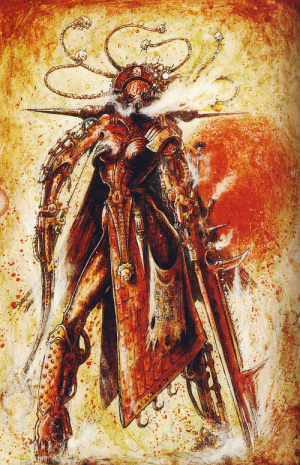

# 0614 科瑞尔·泽斯 Koriel Zeth

精校状态：中文行文已逐段精校，部分术语仍为暂定

分类：人类帝国 / 机械神教

原文来源：https://www.bilibili.com/opus/1198009723420409859

原作者：帝国神选罐头

原文时间：2026年05月03日 09:29

[返回分类目录](目录.md) · [全书目录](../../目录.md)

<!-- A0614-B0001 -->
**英文原文**

Koriel Zeth was a female member of the Martian Mechanicum who lived in the years when the Emperor began the Great Crusade to unify Mankind under His Imperium.

<!-- /A0614-B0001 -->

<!-- A0614-B0002 -->

原译文

科瑞尔·泽斯是火星机械教的一名女性成员，她生活在帝皇开始将人类统一到他的帝国之下的大远征的年代。

**校订译文**

科瑞尔·泽斯是火星机械教的一名女性成员，生活在帝皇发起大远征、试图将全人类统一于帝国治下的时代。

**校注：**  Death of Innocence统一纯真之死（原无罪之死），依773事件语境，暂定译名。

<!-- /A0614-B0002 -->

<!-- A0614-B0003 图片 -->

<!-- A0614-B0004 -->

原译文

Koriel Zeth 科瑞尔·泽斯

**校订译文**

Koriel Zeth 科瑞尔·泽斯

<!-- /A0614-B0004 -->

<!-- A0614-B0005 -->
## History 历史

<!-- /A0614-B0005 -->

<!-- A0614-B0006 -->
**英文原文**

In that time, she achieved the position of Adept where she controlled Magma City — a Forge that was located within an active volcano. Whilst outwardly she appeared to be a loyal follower of the principles of the Mechanicum, secretly she did not believe in the existence of the Machine God and instead was more dedicated to the acquisition of knowledge. To that end, she began a secret project that involved tapping into the Empyrean as a wellspring of knowledge by way of the Akashic Reader. The designs of this device she had acquired but had failed to implement until she learnt of the existence of Dalia Cythera, whose mind was not constrained by Mechanicum dogma. With her assistance, she attempted to complete the device by channelling its energy through Psykers though there were numerous failures in the process.

<!-- /A0614-B0006 -->

<!-- A0614-B0007 -->

原译文

在那段时间里，她获得了专家的职位，在那里她控制了岩浆城 — 一座位于活火山内的铸造厂。虽然表面上她似乎是机械教信条的忠实追随者，但私下里她不相信万机神的存在，而是更致力于获取知识。为此，她开始了一个秘密项目，通过阿卡西克阅读器挖掘作为知识源泉的至高天。她已经获得了这个装置的设计，但直到她得知达莉娅·基西拉的存在才得以实施，她的思想不受机械教教条的约束。在她的帮助下，她试图通过引导灵能者的能量来完成这个装置，尽管在这个过程中出现了许多失败。

**校订译文**

泽斯在教内获得技师职衔，统辖位于活火山内的铸造城——岩浆城。她表面上忠实遵守机械教信条，私下却并不相信万机神存在，而是把追求知识置于首位。她秘密开展了一项计划，打算以阿卡西克读取器接触至高天，将其化为知识的源泉。虽然早已取得设计图，她却一直无法把装置建成，直到发现了不受机械教教条束缚的达莉亚·库忒拉。在达莉娅协助下，泽斯试图借助灵能者传导装置的能量，完成这项工程，但过程中遭遇了多次失败。

**校注：** 原文 channelling its energy through Psykers 指借灵能者传导装置能量，不是直接将其改写为“灵能者的能量”。Adept 在本篇机械教职衔语境暂译技师。

<!-- /A0614-B0007 -->

<!-- A0614-B0008 -->
**英文原文**

At the time, Mars suffered from the Death of Innocence and the rise of the Dark Mechanicum who sided with Warmaster Horus during the Horus Heresy. These corrupted members of the Mechanicum included the Fabricator-General who demanded her loyalty but she rejected them and stayed loyal to the Emperor. Despite a valiant struggle, the invaders were too many and Koriel Zeth herself was assaulted by a member of the Sisters of Cydonia. Her last act was detonating the reactors of Magma City thus killing herself and anyone else within it in order to prevent its usage by the traitor forces as well as any attempt at them to use the Akashic Reader.

<!-- /A0614-B0008 -->

<!-- A0614-B0009 -->

原译文

当时，火星遭受了无罪之死和黑暗机械教的崛起，在荷鲁斯叛乱期间，黑暗机械教站在了战帅荷鲁斯一边。这些被腐化的机械教成员包括要求她忠诚的铸造将军，但她拒绝了他们，仍然忠于帝皇。尽管进行了英勇的抗争，但入侵者太多了，科瑞尔·泽斯本人也遭到了赛多尼亚修女的成员的袭击。她最后的行动是引爆岩浆城的反应堆，从而杀死自己和里面的任何人，以防止叛徒部队以及任何人试图使用阿卡西克阅读器的企图。

**校订译文**

此时，火星正经历“纯真之死”的浩劫，荷鲁斯之乱中的黑暗机械教也随之崛起，倒向战帅一方。铸造将军等遭到腐化的机械教领袖要求泽斯效忠，她却断然拒绝，仍然忠于帝皇。尽管守军奋勇抵抗，入侵者还是凭借数量优势步步紧逼，泽斯本人也遭到一名赛多尼亚修女袭击。最后，她引爆岩浆城的反应堆，与城内所有人同归于尽，以免叛军夺取铸造设施，或利用阿卡西克读取器。

**校注：** Death of Innocence 沿原稿事件名“无罪之死”，暂定待核；结尾的阻止对象是叛军使用岩浆城与读取器，不是阻止所有人使用的泛指。

<!-- /A0614-B0009 -->

本篇核心术语与暂定项

以下列出本篇出现的英文原形及核心术语表用词。同形词可能指不同对象，具体词义以本篇正文和校注为准；单复数、别名和仅见于图注的名称可能尚未列入。完整候选见[术语表](../../术语表/双语术语候选.csv)。

| 英文 | 采用中文 | 状态 |
| --- | --- | --- |
| Horus Heresy | 荷鲁斯之乱 | 官方已核对 |
| Imperium | 帝国 | 暂定·简称 |
| Mechanicum | 机械教 | 暂定·历史称谓 |
| Dark Mechanicum | 黑暗机械教 | 暂定·官方待核 |
| Emperor | 帝皇 | 官方已核对 |
| Great Crusade | 大远征 | 暂定·官方待核 |
| Horus | 荷鲁斯 | 暂定·官方待核 |
| Machine God | 万机神 | 暂定·官方待核 |
| Dalia Cythera | 达莉亚·库忒拉 | 暂定·官方待核 |
| Mars | 火星 | 暂定·官方待核 |
| Adept | 帝国任职者（广义）／文吏（行政语境） | 语境定译·官方待核 |
| Fabricator-General | 铸造将军 | 暂定·官方待核 |
| Invaders | 侵略者 | 暂定·官方待核 |
| Koriel Zeth | 科瑞尔·泽斯 | 暂定·官方待核 |
| Akashic Reader | 阿卡西克读取器 | 暂定·官方待核 |
| Magma City | 岩浆城 | 暂定·官方待核 |
| Death of Innocence | 纯真之死 | 暂定·官方待核 |
| Sisters of Cydonia | 赛多尼亚修女 | 暂定·官方待核 |
| The Dark | 《黑暗》 | 暂定·官方待核 |
| Fabricator | 铸造师 | 暂定·待核官方 |

