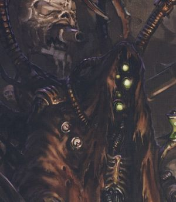
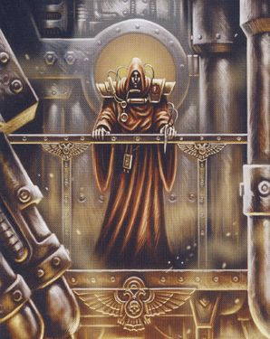
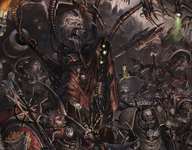

# 0616 凯尔博·哈尔 Kelbor-Hal

精校状态：中文行文已逐段精校，部分术语仍为暂定

分类：人类帝国 / 黑暗机械教

原文来源：https://www.bilibili.com/opus/1190256959591284771

原作者：帝国神选罐头

原文时间：2026年04月12日 12:04

[返回分类目录](目录.md) · [全书目录](../../目录.md)

原篇名：凯尔博-哈尔 Kelbor-Hal

<!-- A0616-B0001 -->
**英文原文**

Kelbor-Hal was the Fabricator-General of the Mechanicum during the Great Crusade and Horus Heresy. He joined forces with Horus and assisted the renegades with all of the technology available to mankind, forming the Dark Mechanicum.

<!-- /A0616-B0001 -->

<!-- A0616-B0002 -->

原译文

凯尔博·哈尔是大远征和荷鲁斯叛乱期间机械教的铸造将军。他与荷鲁斯联手，用人类可用的所有技术协助叛徒，形成了黑暗机械教。

**校订译文**

凯尔博·哈尔是大远征与荷鲁斯之乱时期机械教的铸造将军。他与荷鲁斯结盟，以人类掌握的各类技术支援叛军，并建立了黑暗机械教。

<!-- /A0616-B0002 -->

<!-- A0616-B0003 图片 -->

<!-- A0616-B0004 -->

原译文

Kelbor-Hal after his fall to Chaos 堕入混沌后的凯尔博·哈尔

**校订译文**

Kelbor-Hal after his fall to Chaos 堕入混沌后的凯尔博·哈尔

<!-- /A0616-B0004 -->

<!-- A0616-B0005 -->
## History 历史

<!-- /A0616-B0005 -->

<!-- A0616-B0006 -->
**英文原文**

Kelbor-Hal was present when the Emperor first arrived on Mars, and, while the Master of Mankind was widely celebrated by most of his colleagues, he was deeply distrustful of the Terran warlord.

<!-- /A0616-B0006 -->

<!-- A0616-B0007 -->

原译文

当帝皇第一次抵达火星时，凯尔博·哈尔在场，虽然人类之主受到了大多数同事的广泛赞誉，但他对泰拉军阀深表不信任。

**校订译文**

帝皇初次抵达火星时，凯尔博·哈尔就在现场。虽然大多数同僚都热烈欢迎人类之主，他却对这位泰拉军阀深怀戒心。

<!-- /A0616-B0007 -->

<!-- A0616-B0008 -->
**英文原文**

Hal and his followers were among those who refused to see the Emperor as the avatar of the Omnissiah, instead only seeing a False prophet who had subordinated the Mechanicum under the Imperium's heel with lies and falsehoods. Kelbor-Hal feared that the Emperor and His forces were going to strip away the autonomy Mars had enjoyed dating back all the way to the Dark Age of Technology. Despite this disdain, eventually Kelbor-Hal was able to rise through the Tech-Priest hierarchy to become Fabricator-General by the late Great Crusade. He gathered around him a circle of like-minded Magi including Urtzi Malevolus, Lukas Chrom, and Melgator.

<!-- /A0616-B0008 -->

<!-- A0616-B0009 -->

原译文

哈尔和他的追随者拒绝将帝皇视为欧姆尼赛亚的化身，而只看到了一个假先知，他用谎言和虚假将机械教置于帝国的脚下。凯尔博·哈尔担心帝皇和他的部队会剥夺火星自黑暗科技时代以来一直享有的自治权。尽管有这种鄙视，最终凯尔博-哈尔还是能够在技术神甫阶层中崛起，在大远征后期成为铸造将军。他召集了一群志同道合的圣贤士，包括乌尔齐·马勒沃尔斯、卢卡斯·克罗姆和梅尔加托。

**校订译文**

哈尔与追随者拒绝承认帝皇是欧姆尼赛亚的化身，只把他视为一个假先知，认为他靠谎言欺骗机械教，使之屈居帝国之下。哈尔担心，帝皇及其军队将剥夺火星自黑暗科技时代以来享有的自治权。尽管抱持这种敌意，他仍在技术祭司的等级体系中步步晋升，于大远征后期成为铸造将军。他身边聚集了一批志同道合的贤者，包括乌尔齐·马勒沃尔斯、卢卡斯·克罗姆和梅尔加托。

<!-- /A0616-B0009 -->

<!-- A0616-B0010 图片 -->

<!-- A0616-B0011 -->

原译文

Kelbor-Hal, Fabricator-General of Mars 凯尔博·哈尔，火星铸造将军

**校订译文**

Kelbor-Hal, Fabricator-General of Mars 凯尔博·哈尔，火星铸造将军

<!-- /A0616-B0011 -->

<!-- A0616-B0012 -->
**英文原文**

At the outbreak of the Horus Heresy, there were high tensions between the various Magi governing Mars. Seeing an opportunity for a powerful new ally, Horus sent Regulus into this powder keg and he was able to convince Kelbor-Hal to join forces with the Traitors on the condition that the autonomy of the Mechanicum be ensured, that the STCs the Sons of Horus had captured from the recently subjugated but technologically advanced Auretian Technocracy be handed over to him, and that the Martian Vaults of forbidden technology be opened for Mechanicum use. In the ensuing Schism of Mars between rebel and loyalist Mechanicus forces, Kelbor-Hal's new Dark Mechanicum emerged victorious. However after the Schism Mars was blockaded by the Imperial Fists and Kelbor-Hal was contained on the Red Planet for the next several years, forcing to rely on his Nine Disciples to act as his emissaries in Horus' fleets. Also during the Heresy, he oversaw the construction of the Furious Abyss in the shipyards around Jupiter for the Word Bearers, after which it was used to attempt to destroy the Ultramarines Legion and their homeworld, Macragge.

<!-- /A0616-B0012 -->

<!-- A0616-B0013 -->

原译文

在荷鲁斯叛乱爆发时，统治火星的各位圣贤士之间关系紧张。看到了一个强大的新盟友的机会，荷鲁斯派雷古勒斯进入这个火药桶，他能够说服凯尔博·哈尔与叛徒联手，条件是确保机械教的自治权，荷鲁斯之子从最近被征服但技术先进的奥瑞提安技术联盟手中夺取的STC移交给他，并且将火星密库的禁忌技术开放给机械教使用。在随后叛军和忠诚派机械教部队之间的火星分裂中，凯尔博·哈尔的新黑暗机械师取得了胜利。然而，在分裂之后，火星被帝国之拳封锁，凯尔博·哈尔在接下来的几年里被困在这颗红色行星上，迫使他依靠他的九名门徒作为他在荷鲁斯舰队中的使者。同样在叛乱期间，他监督了木星周围造船厂为怀言者建造的狂怒深渊号的建造，之后它被用来试图摧毁极限战士军团和他们的家园世界马库拉格。

**校订译文**

荷鲁斯之乱爆发时，统治火星的诸位贤者关系紧张。荷鲁斯看准机会，派雷古勒斯前往这个一触即发的火药桶，争取强大的新盟友。雷古勒斯成功说服哈尔加入叛军，条件是保证机械教自治，将荷鲁斯之子从新近征服、技术先进的奥瑞提安技术联盟夺得的STC交给他，并允许机械教开启火星禁忌技术秘库。在随后爆发的“火星分裂”中，哈尔率领的新生黑暗机械教击败了忠诚派。然而，帝国之拳随后封锁火星，使他被困在红色星球上数年，只能依靠“九门徒”在荷鲁斯的舰队中充当使者。叛乱期间，他还监督木星轨道造船厂为怀言者建造狂怒深渊号；该舰随后被派去执行摧毁极限战士军团及其母星马库拉格的任务。

<!-- /A0616-B0013 -->

<!-- A0616-B0014 图片 -->

<!-- A0616-B0015 -->

原译文

Kelbor-Hal during the Horus Heresy 荷鲁斯叛乱期间的凯尔博·哈尔

**校订译文**

Kelbor-Hal during the Horus Heresy 荷鲁斯之乱期间的凯尔博·哈尔

<!-- /A0616-B0015 -->

<!-- A0616-B0016 -->
**英文原文**

Following the Solar War, the loyalist blockade of Mars was lifted and Kelbor-Hal was able to take direct command of the Dark Mechanicus war effort again. Arrogant and gaudy, he attempted to take credit for many of the achievements of Perturabo and Sota-Nul during the Siege of Terra. During the Siege of the Imperial Palace, Kelbor-Hal remained behind on Mars to oversee its reconstruction and muster fleets against the anticipated arrival of Roboute Guilliman. However, upon examining chronological distortions emanating from Terra due to the Warp presence on the world, Kelbor-Hal was assailed by an immense input of data which told him the true name of the Dark King, a figure whom he had regarded as the true Omnissiah. He then began to scream, as the Dark King was revealed to be the Emperor.

<!-- /A0616-B0016 -->

<!-- A0616-B0017 -->

原译文

太阳战争结束后，忠诚派对火星的封锁被解除，凯尔博·哈尔能够再次直接指挥黑暗机械教的战争。他傲慢自大，试图将佩图拉博和索塔·努尔在泰拉围城中的许多成就归功于自己。在围攻帝国皇宫期间，凯尔博·哈尔留在火星上监督其重建，并召集舰队对抗预期到来的罗伯特·基里曼。然而，在检查了由于亚空间在世界上的存在而从泰拉产生的时间扭曲后，凯尔博·哈尔受到了大量数据的攻击，这些数据告诉他黑暗之王的真名，他认为这个人物是真正的欧姆尼赛亚。然后，当黑暗之王被揭露为帝皇时，他开始尖啸。

**校订译文**

太阳战争之后，忠诚派对火星的封锁瓦解，哈尔得以重新直接指挥黑暗机械教的战争行动。他傲慢浮夸，试图将佩图拉博与索塔·努尔在泰拉围城中的许多功绩据为己有。帝国皇宫遭到围攻时，他仍留在火星，监督重建并集结舰队，准备迎战预计将要赶来的罗保特·基里曼。此时，亚空间的侵蚀使泰拉周围出现时间扭曲。哈尔分析这些现象时，海量数据猛然涌入他的意识，揭示了“黑暗之王”的真名。他一直将这个存在视为真正的欧姆尼赛亚；如今得知黑暗之王竟是帝皇，他顿时发出尖叫。

**校注：** 这是本段所叙时刻哈尔通过数据获知的身份，不应由此补写帝皇最终成为黑暗之王；后续发展另依相应篇目。

<!-- /A0616-B0017 -->

本篇核心术语与暂定项

以下列出本篇出现的英文原形及核心术语表用词。同形词可能指不同对象，具体词义以本篇正文和校注为准；单复数、别名和仅见于图注的名称可能尚未列入。完整候选见[术语表](../../术语表/双语术语候选.csv)。

| 英文 | 采用中文 | 状态 |
| --- | --- | --- |
| Roboute Guilliman | 罗保特·基里曼 | 官方已核对 |
| Ultramarines | 极限战士 | 官方已核对 |
| Horus Heresy | 荷鲁斯之乱 | 官方已核对 |
| Warp | 亚空间 | 官方已核对 |
| Imperium | 帝国 | 暂定·简称 |
| Mechanicum | 机械教 | 暂定·历史称谓 |
| Tech-Priest | 技术祭司 | 官方已核对 |
| Dark Mechanicum | 黑暗机械教 | 暂定·官方待核 |
| Dark Age of Technology | 黑暗科技时代 | 暂定 |
| Imperial Fists | 帝国之拳 | 暂定 |
| Emperor | 帝皇 | 官方已核对 |
| Word Bearers | 怀言者 | 暂定·官方待核 |
| Great Crusade | 大远征 | 暂定·官方待核 |
| Terra | 泰拉 | 暂定·官方待核 |
| Horus | 荷鲁斯 | 暂定·官方待核 |
| Auretian Technocracy | 奥瑞提安技术联盟 | 暂定·官方待核 |
| Sons of Horus | 荷鲁斯之子 | 暂定·官方待核 |
| Omnissiah | 欧姆尼赛亚 | 暂定·官方待核 |
| Mars | 火星 | 暂定·官方待核 |
| Jupiter | 木星 | 暂定·官方待核 |
| Macragge | 马库拉格 | 暂定·官方待核 |
| Tech | 技术语 | 暂定·官方待核 |
| Master | 导师（审判庭职衔）／舰务官（舰员职务） | 语境定译·官方待核 |
| Fabricator-General | 铸造将军 | 暂定·官方待核 |
| Furious Abyss | 狂怒深渊号 | 暂定·官方待核 |
| Dark Mechanicus | 黑暗机械教 | 暂定·官方待核 |
| Kelbor-Hal | 凯尔博·哈尔 | 暂定·官方待核 |
| Dark King | 黑暗之王 | 暂定·官方待核 |
| Urtzi Malevolus | 乌尔齐·马勒沃尔斯 | 暂定·官方待核 |
| Lukas Chrom | 卢卡斯·克罗姆 | 暂定·官方待核 |
| Melgator | 梅尔加托 | 暂定·官方待核 |
| Nine Disciples | 九门徒 | 暂定·官方待核 |
| Sota-Nul | 索塔·努尔 | 暂定·官方待核 |
| Regulus | 雷古勒斯 | 暂定·官方待核 |
| The Dark | 《黑暗》 | 暂定·官方待核 |
| Fabricator | 铸造师 | 暂定·待核官方 |

