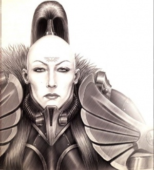
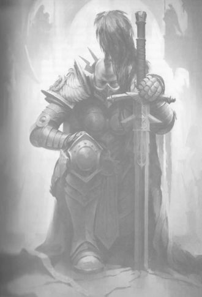
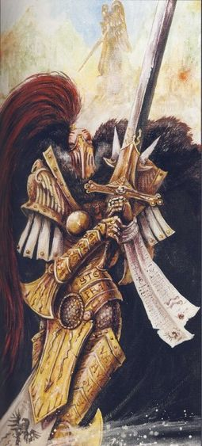
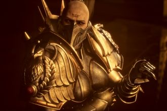
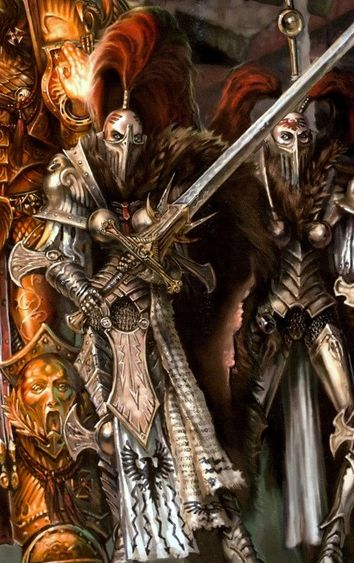
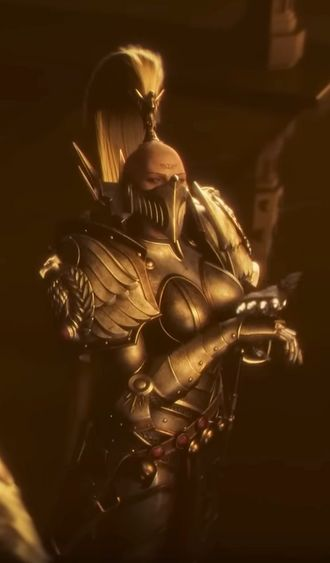
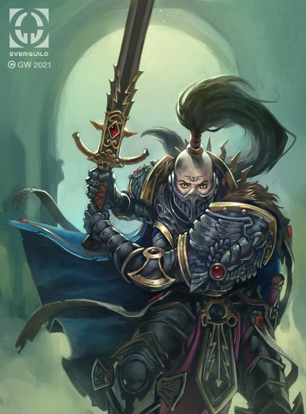
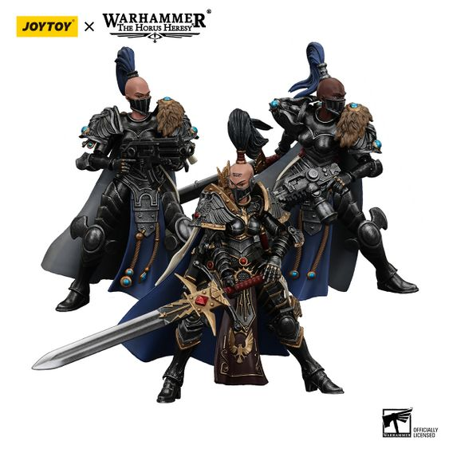
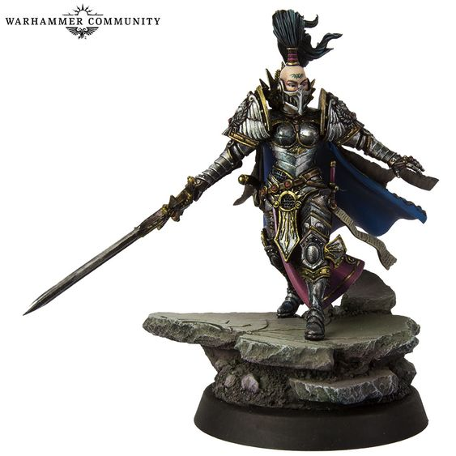

# 0621 珍提亚·科勒 Jenetia Krole

精校状态：中文行文已逐段精校，部分术语仍为暂定

分类：人类帝国 / 寂静修女

原文来源：https://www.bilibili.com/opus/1188714954648190984

原作者：帝国神选罐头

原文时间：编辑于 2026年04月08日 09:36

[返回分类目录](目录.md) · [全书目录](../../目录.md)

<!-- A0621-B0001 -->
**英文原文**

Jenetia Krole (sometimes spelled Jenetta Krole), also known as the Soulless Queen of the Imperium, was the Knight-Commander of the Silent Sisterhood and Chief Investigatus-Militant of the Divisio Astra Telepathica during the Great Crusade and Horus Heresy. She led the Silent Sisterhood during the Battle of Prospero and the War Within the Webway. She was one of the Emperor’s three main advisors and a lynchpin of his war council during the Great Crusade and the Horus Heresy, alongside Constantin Valdor and Malcador the Sigilite.

<!-- /A0621-B0001 -->

<!-- A0621-B0002 -->

原译文

珍提亚·科勒（有时拼写为杰妮塔·科勒），也被称为帝国的无魂女王，是大远征和荷鲁斯叛乱期间寂静修女的骑士指挥官和星语庭部门的首席军务调查员。她在普罗斯佩罗之战和网道战争期间领导了寂静修女。她是帝皇的三位主要顾问之一，也是他在大远征和荷鲁斯叛乱期间战争议会的关键人物，与康斯坦丁·瓦尔多和掌印者马卡多并肩作战。

**校订译文**

珍提亚·科勒的英文名为 Jenetia Krole，有时也拼作 Jenetta Krole。她被称为“帝国的无魂女王”，在大远征与荷鲁斯之乱期间担任寂静修女骑士指挥官，以及星语庭分部的首席军务调查员。她曾率领寂静修女参加普罗斯佩罗之战与网道战争。她与康斯坦丁·瓦尔多、掌印者马卡多并列为帝皇最主要的三位顾问，也是帝皇战争议会的核心人物。

<!-- /A0621-B0002 -->

<!-- A0621-B0003 图片 -->

<!-- A0621-B0004 -->

原译文

Jenetia Krole 珍提亚·科勒

**校订译文**

Jenetia Krole 珍提亚·科勒

<!-- /A0621-B0004 -->

<!-- A0621-B0005 -->
## Biography 传记

<!-- /A0621-B0005 -->

<!-- A0621-B0006 -->
**英文原文**

Jenetia Krole was born on Terra in the shanties of the Albian Wasteland. Cast out by her people, her youth was one of solitude and misery – as a Pariah. The hollow girl was discovered in Albia by Constantin Valdor and eventually taken before the Emperor, giving her purpose in life. Whether Valdor sought out the girl or merely happened upon her is unknown. Krole became a trusted confidant of the Emperor, and was present when the latter received the council of the Adeptus Custodes regarding the creation of the Primarchs.

<!-- /A0621-B0006 -->

<!-- A0621-B0007 -->

原译文

珍提亚·科勒出生在阿尔比亚荒原的棚屋里。被她的人民驱逐了，她的青年是孤独和痛苦的 — 作为被遗弃者。这个空洞的女孩在阿尔比亚被康斯坦丁·瓦尔多发现，最终被带到帝皇面前，给了她人生的目标。瓦尔多是找到了那个女孩，还是仅仅偶然遇到了她，目前尚不清楚。科勒成为了帝皇值得信赖的密友，当帝皇接受禁军修会关于创造原体的会议时，科勒也在场。

**校订译文**

科勒出生于泰拉阿尔比亚荒原的棚户区。由于具有贱民体质，她被族人排斥，童年充满孤独与痛苦。康斯坦丁·瓦尔多在阿尔比亚发现了这个“无魂”的女孩，最终将她带到帝皇面前，使她找到了人生的目标。瓦尔多究竟是专程寻找，还是偶然遇见她，至今不得而知。科勒后来成为帝皇信赖的知己；帝皇听取禁军关于创造原体的意见时，她也在场。

**校注：** Pariah 为贱民／空白者的设定身份，不能仅按普通词义译为被遗弃者。council 在此结合 received 与语境按提供意见处理。

<!-- /A0621-B0007 -->

<!-- A0621-B0008 图片 -->

<!-- A0621-B0009 -->

原译文

Jenetia Krole 珍提亚·科勒

**校订译文**

Jenetia Krole 珍提亚·科勒

<!-- /A0621-B0009 -->

<!-- A0621-B0010 -->
**英文原文**

During the Unification Wars she compiled a staggering array of battle honours in the Wars of Succession, Red Frost, the harnessing of Albia, the Pacific, and Last Unity. At one point, she cut off her own tongue. By the time of the Horus Heresy, Krole was older than she appeared.

<!-- /A0621-B0010 -->

<!-- A0621-B0011 -->

原译文

在统一战争期间，她在继承战争，红霜、控制阿尔比亚、太平洋和最后的统一战争中获得了惊人的战斗荣誉。在某一时间，她割掉了自己的舌头。到荷鲁斯叛乱时期，科勒已经比她看起来的要大了。

**校订译文**

统一战争期间，她在继承战争、红霜之战、征服阿尔比亚与太平洋地区的战事，以及最后统一之战中立下赫赫战功。在某个时候，她还亲手割掉了自己的舌头。到荷鲁斯之乱时，她的实际年龄已远大于外表所显。

<!-- /A0621-B0011 -->

<!-- A0621-B0012 图片 -->

<!-- A0621-B0013 -->

原译文

Jenetia Krole 珍提亚·科勒

**校订译文**

Jenetia Krole 珍提亚·科勒

<!-- /A0621-B0013 -->

<!-- A0621-B0014 -->
### Great Crusade 大远征

<!-- /A0621-B0014 -->

<!-- A0621-B0015 -->
**英文原文**

When the Emperor declared the Great Crusade, he personally appointed Krole as Knight-Commander of a new order: the Anathema Psykana. She was tasked with finding other Psychic Blanks like herself, and forging them into a fighting force that would supplement the Emperor’s other forces in the wars to come. The group was widely known as the Sisters of Silence, and she led them in many of the pivotal battles of the Great Crusade and the Horus Heresy that followed.

<!-- /A0621-B0015 -->

<!-- A0621-B0016 -->

原译文

当帝皇宣布大远征时，他亲自任命科勒为新组织：诅咒灵能者的骑士指挥官。她的任务是找到其他像她一样的灵能空白者，并将其打造成一支战斗部队，在未来的战争中补充帝皇的其他部队。该组织被广泛称为寂静修女，她带领她们参加了大远征和随后荷鲁斯叛乱的许多关键战役。

**校订译文**

帝皇宣布发动大远征时，亲自任命科勒为新组织“巫咒修女会”的骑士指挥官，命她寻找其他与自己一样的空白者，将其训练成军，以配合帝皇其他部队参加未来的战争。这一组织更广为人知的名字是“寂静修女”。科勒率领她们经历了大远征及随后荷鲁斯之乱中的许多关键战役。

<!-- /A0621-B0016 -->

<!-- A0621-B0017 图片 -->

<!-- A0621-B0018 -->

原译文

Jenetia Krole during the onset of the Horus Heresy 荷鲁斯叛乱开始时的珍提亚·科勒

**校订译文**

Jenetia Krole during the onset of the Horus Heresy 荷鲁斯之乱开始时的珍提亚·科勒

<!-- /A0621-B0018 -->

<!-- A0621-B0019 -->
**英文原文**

In the early years of the Great Crusade, Krole participated in Compliance 9-13 and the Cataclysm of Pentacanaes. No more than four decades into the Crusade, the Silent Sisterhood was formed and Krole appointed its Knight-Commander, charged by the Emperor of Mankind with overseeing the 'Great Tithe' of psykers.

<!-- /A0621-B0019 -->

<!-- A0621-B0020 -->

原译文

在大远征的早期，科勒参加了9-13平定和佩塔卡纳斯之灾。远征不到四十年，寂静修女就成立了，科勒被委任为它的骑士指挥官，被人类帝皇使用负责监督灵能者的“大什一税”。

**校订译文**

大远征早期，科勒参加了第9-13号平定行动与佩塔卡纳斯之灾。远征开始不到四十年，寂静修女会便已成立，科勒获任骑士指挥官，并奉帝皇之命监督征集灵能者的“大什一税”。

**校注：** 本段称组织在远征开始后四十年内成立，前段将任命与远征宣布相连；保留原稿叙述尺度差异。

<!-- /A0621-B0020 -->

<!-- A0621-B0021 -->
**英文原文**

At some point in the Crusade, Krole was attached to an expeditionary force engaged in the war for the Mournful Gate against Eldar slavers. When the commanders were assassinated, she assumed command by executing the remaining general staff and subordinate officers. Under her leadership, the militia won a victory that earned her the right to wear the Laurels Invictarus (laurels of victory) of a lauded general.

<!-- /A0621-B0021 -->

<!-- A0621-B0022 -->

原译文

在远征的某个时刻，科勒加入了一支远征部队，参与了对抗灵族奴隶贩子的悲伤之门战争。当指挥官被暗杀时，她通过处决剩余的参谋和下级军官来接管指挥权。在她的领导下，民兵取得了胜利，使她有权佩戴一位受誉将军的常胜桂冠（胜利桂冠）。

**校订译文**

大远征期间，科勒曾随一支远征军参加悲伤之门战事，对抗灵族奴隶贩子。指挥官遭暗杀后，她处决了其余参谋及下级军官，接管指挥权。她率领民兵取得胜利，由此获准佩戴属于功勋将领的常胜桂冠，即胜利桂冠。

**校注：** 处决参谋和下级军官这一做法直接见于英文底稿，不擅自改成处决刺客，也不补造动机。

<!-- /A0621-B0022 -->

<!-- A0621-B0023 图片 -->

<!-- A0621-B0024 -->

原译文

Knight-Commander Jenetia Krole 骑士指挥官珍提亚·科勒

**校订译文**

Knight-Commander Jenetia Krole 骑士指挥官珍提亚·科勒

<!-- /A0621-B0024 -->

<!-- A0621-B0025 -->
**英文原文**

Krole's later Crusade battle honours included Skagan, where the first Psy-Titan of the Ordo Sinister was deployed, Itria, the Witch Wars, and Asmodex.

<!-- /A0621-B0025 -->

<!-- A0621-B0026 -->

原译文

科勒后来在远征中获得的荣誉包括斯卡根，在那里噩兆修会部署了第一架灵能泰坦，伊特里亚、女巫战争和阿斯莫德克斯。

**校订译文**

她在大远征后期参加的战事还包括斯卡根、伊特里亚、巫师战争，以及阿斯莫德克斯。噩兆修会正是在斯卡根首次投入灵能泰坦。

<!-- /A0621-B0026 -->

<!-- A0621-B0027 -->
**英文原文**

When the Emperor decreed that Magnus the Red was to be censured, Krole commanded the forces of the Silent Sisterhood that accompanied the Censure Host to Prospero. She personally divided her forces into protectorate detachments for the rest of the host to provide them with protection against psychic attack from the Thousand Sons. During the Battle of Prospero, she sought out and killed many of the Thousand Sons' greatest sorcerers in single combat, as well as confronting the daemon that had been manipulating Kasper Hawser.

<!-- /A0621-B0027 -->

<!-- A0621-B0028 -->

原译文

当帝皇下令判决赤红之马格努斯时，科勒指挥了陪同惩戒天军前往普罗斯佩罗的寂静修女的部队。她亲自将她的部队分成保护分遣队，为其余的天军提供保护，以抵御千子的灵能攻击。在普罗斯佩罗之战中，她在一场战斗中找到并杀死了千子最伟大的巫师中的许多人，并与操纵卡斯佩尔·豪瑟尔的恶魔对峙。

**校订译文**

帝皇下令惩戒红魔马格努斯后，科勒率寂静修女随惩戒天军前往普罗斯佩罗。她亲自将麾下兵力分成护卫分遣队，配属大军各部，抵御千子的灵能攻击。普罗斯佩罗之战中，她主动寻找千子最强大的巫师，与他们逐一决斗，杀死其中多人；她也曾直面那个操纵卡斯佩尔·豪瑟尔的恶魔。

**校注：** in single combat 是一对一决斗，不是所有战果都发生在“一场战斗”。

<!-- /A0621-B0028 -->

<!-- A0621-B0029 图片 -->

<!-- A0621-B0030 -->

原译文

Jenetia Krole 珍提亚·科勒

**校订译文**

Jenetia Krole 珍提亚·科勒

<!-- /A0621-B0030 -->

<!-- A0621-B0031 -->
### Horus Heresy 荷鲁斯之乱

原题：Horus Heresy 荷鲁斯叛乱

<!-- /A0621-B0031 -->

<!-- A0621-B0032 -->
**英文原文**

Krole returned to Terra to lead the forces of the Silent Sisterhood in the War Within the Webway. She took joint command of Imperial forces in Calastar alongside with Tribunes Jasaric, Kadai Vilaccan, and Ra Endymion of the Legio Custodes. By the later stages of the war, her mouth was permanently concealed behind a mouthpiece surgically bonded to her jaw and cheekbones. She survived the retreat from Calastar to return to the Imperial Palace, losing three fingers on her left hand in the battle.

<!-- /A0621-B0032 -->

<!-- A0621-B0033 -->

原译文

科勒回到泰拉，在网道战争中领导寂静修女的部队。她与禁军军团的保民官 贾萨里克、卡代·维拉坎和拉·恩底弥翁共同指挥卡拉斯塔的帝国部队。到战争后期，她的嘴巴被永久性地隐藏在一块通过手术固定在她下巴和颧骨上的口器后面。她从卡拉斯塔撤退后幸存下来，回到了帝国皇宫，在战斗中左手失去了三根手指。

**校订译文**

科勒随后返回泰拉，在网道战争中统率寂静修女。她与禁军保民官贾萨里克、卡代·维拉坎及拉·恩底弥翁共同指挥卡拉斯塔的帝国部队。到战争后期，她的嘴部已被一块护具永久遮住，护具通过手术固定在下颌与颧骨上。她在卡拉斯塔撤退战中活了下来，重返帝国皇宫，却也在战斗中失去了左手的三根手指。

<!-- /A0621-B0033 -->

<!-- A0621-B0034 图片 -->

<!-- A0621-B0035 -->

原译文

Jenetia Krole during the Heresy 叛乱时期的珍提亚·科勒

**校订译文**

Jenetia Krole during the Heresy 叛乱时期的珍提亚·科勒

<!-- /A0621-B0035 -->

<!-- A0621-B0036 -->
**英文原文**

During the Siege of Terra, Krole decided to venture out to fight in the defense of the doomed Eternity Wall Spaceport. She kept her reasoning for doing so to herself. Knowing that she would die in the battle, Krole appointed her trusted second-in-command Aphone Ire as her successor to lead the Silent Sisterhood. She then fought at the Eternity Wall Spaceport, displaying the ability to not only appear near-invisible to daemons, but also to standard humans. During the battle she saved army trooper Ollanius Piers from a World Eater. As the port fell, Krole slew many World Eaters, but was confronted by Captain Kharn, now swelling with the powers of Khorne. She engaged him in battle but was slain by the berserk World Eater, who was not certain what he had just slain due to Krole's near-invisibility.

<!-- /A0621-B0036 -->

<!-- A0621-B0037 -->

原译文

在泰拉围城期间，科勒决定冒险出去为注定要失败的永恒之墙太空港而战。她让她自己想清楚为什么要这么做。科勒知道她将在战斗中死去，于是任命她信任的副指挥官阿芙恩·艾尔为她的继任者，领导寂静修女。然后，她在永恒之墙太空港作战，展示了不仅恶魔几乎无视，而且对普通人类也是如此的能力。在战斗中，她从一名吞世者手中救出了陆军士兵欧兰尼奥斯·皮尔斯。随着港口的沦陷，科勒杀死了许多吞世者，但遭遇了现在拥有恐虐之力的连长卡恩。她与他交战，但被狂暴的吞世者杀死，由于科勒几乎无法被看见，吞世者不确定他刚才杀了什么。

**校订译文**

泰拉围城期间，科勒决定离开安全地带，参加注定陷落的永恒之墙太空港保卫战，却没有向任何人解释原因。她知道自己会死在那里，便指定信任的副手阿芙恩·艾尔继任，领导寂静修女。战斗中，她强大的空白者能力使恶魔乃至普通人都几乎无法察觉她的存在。她从一名吞世者手中救下陆军士兵欧良尼乌斯·皮尔斯，并在太空港陷落之际杀死许多吞世者。随后，她遭遇了恐虐力量不断增强的卡恩连长。两人交战，科勒被这名狂暴的吞世者杀死。由于她几乎无法被感知，卡恩甚至不清楚自己刚刚杀死了什么。

**校注：** kept her reasoning to herself 指不向别人解释，不是“让自己想清楚”；受救士兵 Piers 与 Pius、Persson 区分。

<!-- /A0621-B0037 -->

<!-- A0621-B0038 图片 -->

<!-- A0621-B0039 -->

原译文

Jenetia Krole with Vigilators 珍提亚·科勒与警戒者

**校订译文**

Jenetia Krole with Vigilators 珍提亚·科勒与警戒修女

<!-- /A0621-B0039 -->

<!-- A0621-B0040 -->
## Appearance and Wargear 外貌和战备

<!-- /A0621-B0040 -->

<!-- A0621-B0041 -->
**英文原文**

Jenetia Krole had red-dyed hair bound in a topknot that reached to the base of her spine. She wore silver Artificer Armour and a fur-edged enhanced Voidsheen Cloak known as the Onyx Cloak. Her weapons were the two-handed Execution Blade Veracity, a gift once wielded by the Emperor of Mankind who forged it himself, an Archaeotech Pistol older than the Imperium, the aeldari sabre Mortale, and a dagger named No Man's Hand.

<!-- /A0621-B0041 -->

<!-- A0621-B0042 -->

原译文

珍提亚·科勒的头发染成红色，扎成一个发结，一直垂到脊椎底部。她身穿银色的精工盔甲和一件被称为玛瑙斗篷的皮边增强虚光斗篷。她的武器是双手处决刃真实，这是人类帝皇亲自铸造的礼物，一把比帝国更古老的考古技术手枪，艾尔达里军刀凡人和一把名为无人之手的匕首。

**校订译文**

科勒将头发染成红色，在头顶束起，发束一直垂到脊背下端。她身穿银色精工甲，披着一件带毛皮镶边、经过强化的虚光斗篷，名为“玛瑙斗篷”。她的主要武器是双手处决刃“真实”——帝皇亲手锻造并曾亲自使用，后来将其赐给她。她还携带一把年代早于帝国的考古科技手枪、一把名为“凡人”的灵族军刀，以及一柄“无人之手”匕首。

**校注：** 补回帝皇曾亲自使用 Veracity 的信息；Archaeotech 为古科技，不是考古技术。 对照本段英文确认同一实体，与全书核心译名统一；不改变同形异义词或省略称呼。

<!-- /A0621-B0042 -->

<!-- A0621-B0043 图片 -->

<!-- A0621-B0044 -->

原译文

Jenetia Krole 珍提亚·科勒

**校订译文**

Jenetia Krole 珍提亚·科勒

<!-- /A0621-B0044 -->

<!-- A0621-B0045 -->
**英文原文**

Krole was sometimes accompanied by a Proloquor (Speaker), Melpomanei. The Raptor Guard, a cadre of elite Oblivion Knights, acted as her honour guard in battle. Such was her power as a blank that she could be barely seen by even standard Humans and Space Marines.

<!-- /A0621-B0045 -->

<!-- A0621-B0046 -->

原译文

科勒有时会由言者（说话者）墨尔波墨涅陪同。猛禽卫队是一支精英遗忘骑士核心队，在战斗中担任她的荣誉卫队。她作为空白者的力量如此强大，以至于即使是普通的人类和星际战士也几乎看不见她。

**校订译文**

科勒有时会由传言者墨尔波墨涅陪同，由其替她发言。一支由精锐湮灭骑士组成的猛禽卫队，在战斗中担任她的荣誉卫队。她的空白者力量极为强大，甚至连普通人类与星际战士也几乎看不见她。

**校注：** Proloquor 为替沉默修女发言的职务，暂译传言者；不与普通说话者混同。

<!-- /A0621-B0046 -->

<!-- A0621-B0047 -->
## Trivia 琐事

<!-- /A0621-B0047 -->

<!-- A0621-B0048 -->
**英文原文**

Jenetia Krole's name is pronounced Jen-EET-sha.

<!-- /A0621-B0048 -->

<!-- A0621-B0049 -->

原译文

珍提亚·科勒的名字发音为Jen-EET-sha。

**校订译文**

Jenetia 的英文发音在原稿中标注为 Jen-EET-sha。

<!-- /A0621-B0049 -->

本篇核心术语与暂定项

以下列出本篇出现的英文原形及核心术语表用词。同形词可能指不同对象，具体词义以本篇正文和校注为准；单复数、别名和仅见于图注的名称可能尚未列入。完整候选见[术语表](../../术语表/双语术语候选.csv)。

| 英文 | 采用中文 | 状态 |
| --- | --- | --- |
| Space Marines | 星际战士 | 官方已核对 |
| Adeptus Custodes | 帝皇禁军 | 官方已核对 |
| Thousand Sons | 千子 | 官方已核对 |
| World Eaters | 吞世者 | 官方已核对 |
| Aeldari | 艾达灵族 | 官方已核对 |
| Eldar | 灵族 | 暂定·语境区分 |
| Horus Heresy | 荷鲁斯之乱 | 官方已核对 |
| Imperium | 帝国 | 暂定·简称 |
| Webway | 网道 | 暂定 |
| Khorne | 恐虐 | 官方已核对 |
| Emperor of Mankind | 人类帝皇 | 暂定 |
| Emperor | 帝皇 | 官方已核对 |
| Great Crusade | 大远征 | 暂定·官方待核 |
| Compliance | 归顺；纳入帝国统治 | 暂定·官方待核 |
| Terra | 泰拉 | 暂定·官方待核 |
| Horus | 荷鲁斯 | 暂定·官方待核 |
| Sisters of Silence | 寂静修女 | 暂定·官方待核 |
| Magnus the Red | 红魔马格努斯 | 官方已核对 |
| Unification Wars | 统一战争 | 暂定·官方待核 |
| Titan | 泰坦 | 暂定·官方待核 |
| Blank | 空白者 | 暂定·官方待核 |
| Pariah | 贱民 | 暂定·官方待核 |
| Ordo Sinister | 噩兆修会 | 暂定·官方待核 |
| Jenetia Krole | 珍提亚·科勒 | 暂定·官方待核 |
| Kasper Hawser | 卡斯佩尔·豪瑟尔 | 暂定·官方待核 |
| Anathema Psykana | 巫咒修女会 | 暂定·官方待核 |
| Cadre | 骨干连（寂静修女）／核心队（钛族） | 语境定译·钛族词根参考 |
| Honour Guard | 荣誉卫队 | 暂定·官方待核 |
| The Primarchs | 原体 | 暂定·官方待核 |
| Captain | 连长 | 暂定·官方待核 |
| Constantin Valdor | 康斯坦丁·瓦尔多 | 暂定·官方待核 |
| Artificer | 技工 | 暂定·官方待核 |
| Powers | 能天使 | 暂定·官方待核 |
| Host | 天军 | 暂定·官方待核 |
| Laurels of Victory | 胜利桂冠号 | 暂定·官方待核 |
| Censure Host | 惩戒天军 | 暂定·官方待核 |
| The Anathema | 被诅咒者 | 暂定·官方待核 |
| Ra Endymion | 拉·恩底弥翁 | 暂定·官方待核 |
| Ollanius Piers | 欧良尼乌斯·皮尔斯 | 暂定·官方待核 |
| Calastar | 卡拉斯塔 | 暂定·官方待核 |
| Soulless Queen of the Imperium | 帝国的无魂女王 | 暂定·官方待核 |
| Chief Investigatus-Militant | 首席军务调查员 | 暂定·官方待核 |
| Albian Wasteland | 阿尔比亚荒原 | 暂定·官方待核 |
| Wars of Succession | 继承战争 | 暂定·官方待核 |
| Red Frost | 红霜之战 | 暂定·官方待核 |
| Last Unity | 最后统一之战 | 暂定·官方待核 |
| Compliance 9-13 | 第9-13号平定行动 | 暂定·官方待核 |
| Cataclysm of Pentacanaes | 佩塔卡纳斯之灾 | 暂定·官方待核 |
| Mournful Gate | 悲伤之门 | 暂定·官方待核 |
| Laurels Invictarus | 常胜桂冠 | 暂定·官方待核 |
| Skagan | 斯卡根 | 暂定·官方待核 |
| Itria | 伊特里亚 | 暂定·官方待核 |
| Witch Wars | 巫师战争 | 暂定·官方待核 |
| Asmodex | 阿斯莫德克斯 | 暂定·官方待核 |
| Jasaric | 贾萨里克 | 暂定·官方待核 |
| Kadai Vilaccan | 卡代·维拉坎 | 暂定·官方待核 |
| Aphone Ire | 阿芙恩·艾尔 | 暂定·官方待核 |
| Voidsheen Cloak | 虚光斗篷 | 暂定·官方待核 |
| Onyx Cloak | 玛瑙斗篷 | 暂定·官方待核 |
| Veracity | 真实 | 暂定·官方待核 |
| Mortale | 凡人 | 暂定·官方待核 |
| No Man's Hand | 无人之手 | 暂定·官方待核 |
| Proloquor | 传言者 | 暂定·官方待核 |
| Melpomanei | 墨尔波墨涅 | 暂定·官方待核 |
| Raptor Guard | 猛禽卫队 | 暂定·官方待核 |
| Archaeotech Pistol | 考古科技手枪 | 暂定·官方待核 |
| Albia | 阿尔比亚 | 暂定·官方待核 |
| War Council | 战争议会 | 暂定·官方待核 |
| Artificer Armour | 精工盔甲 | 暂定·官方待核 |
| Eternity Wall | 永恒之墙 | 暂定·官方待核 |
| Eternity Wall Spaceport | 永恒之墙太空港 | 暂定·官方待核 |

