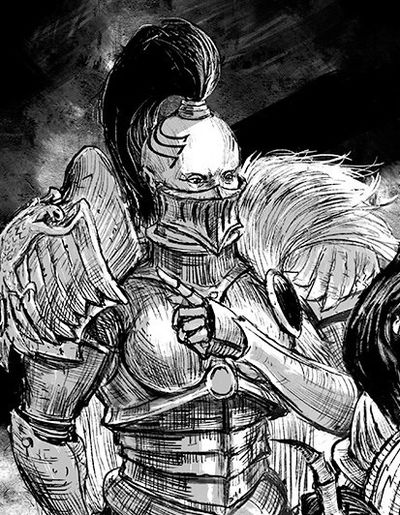

# 0622 凯莉娅·卡斯琳 Kaeria Casryn

精校状态：中文行文已逐段精校，部分术语仍为暂定

分类：人类帝国 / 寂静修女

原文来源：https://www.bilibili.com/opus/1084131633377837128

原作者：帝国神选罐头

原文时间：2025年06月30日 12:24

[返回分类目录](目录.md) · [全书目录](../../目录.md)

<!-- A0622-B0001 -->
**英文原文**

Kaeria Casryn was an Oblivion Knight of the Steel Foxes Cadre of the Sisters of Silence during the Horus Heresy.

<!-- /A0622-B0001 -->

<!-- A0622-B0002 -->

原译文

凯莉娅·卡斯琳是荷鲁斯叛乱时期寂静修女钢狐核心队的遗忘骑士。

**校订译文**

凯莉娅·卡斯琳是荷鲁斯之乱时期寂静修女钢狐核心队的一名湮灭骑士。

<!-- /A0622-B0002 -->

<!-- A0622-B0003 图片 -->

<!-- A0622-B0004 -->

原译文

Kaeria Casryn 凯莉娅·卡斯琳

**校订译文**

Kaeria Casryn 凯莉娅·卡斯琳

<!-- /A0622-B0004 -->

<!-- A0622-B0005 -->
**英文原文**

During the War Within the Webway Kaeria was paired with the Custodian Diocletian Coros and the two grew into close comrades. Coros could understand Kaeria's meaning by simple facial expression and she did not have to sign to communicate with him. As a result, she accompanied Diocletian outside the Webway as they attempted to recruit reinforcements for the secret war. Later Kaeria oversaw the implementation of the Unspoken Sanction within the Imperial Palace, sacrificing a thousand captured Psykers to the Golden Throne so the Emperor could leave it for a single day.

<!-- /A0622-B0005 -->

<!-- A0622-B0006 -->

原译文

在网道战争期间，凯莉娅与禁军戴克里先·科罗斯合作，两人逐渐成为亲密的战友。科罗斯可以通过简单的面部表情理解凯莉娅的意思，她不必使用手语就可以和他交流。因此，当戴克里先试图为这场秘密战争招募援军时，她陪同戴克里先离开了网道。后来，凯莉娅监督了皇宫内沉默法案的实施，将一千名被俘的灵能者牺牲给了黄金王座，这样帝皇就可以离开它一天。

**校订译文**

网道战争期间，凯莉娅与禁军戴克里先·科罗斯搭档，逐渐成为亲密战友。科罗斯仅凭她简单的面部表情便能理解其意，无须她比划手语。因此，两人也曾一同离开网道，为这场秘密战争征集援军。后来，凯莉娅在帝国皇宫内监督“沉默法案”的执行，将一千名被囚禁的灵能者献祭给黄金王座，使帝皇能够离开王座一天。

**校注：** Unspoken Sanction 沿原稿沉默法案，作为特定行动／授权名称暂定待核；不得误读为禁止发声的普通法令。

<!-- /A0622-B0006 -->

<!-- A0622-B0007 -->
**英文原文**

Later during the Siege of Terra, Kaeria Casryn was one of those chosen to come before Malcador the Sigillite before he ascended the Golden Throne and carry out his final tasks given to them. She then gathered captive Psykers to sacrifice to the Throne to aid Malcador in his struggle to power the ancient device.

<!-- /A0622-B0007 -->

<!-- A0622-B0008 -->

原译文

后来在泰拉围城期间，凯莉娅·卡斯琳是被选中在掌印者马卡多登上黄金王座并执行他交给他们的最后任务之前来到这里的人之一。然后，她召集被俘的灵能者向王座献祭，以帮助马卡多为古代装置供能。

**校订译文**

泰拉围城期间，马卡多即将登上黄金王座前，召来一批人交代最后的任务，凯莉娅·卡斯琳也在其中。此后，她集中被囚禁的灵能者，将其献祭给王座，帮助马卡多维持这台古老装置的运转。

**校注：** 先觐见并领受任务，再执行献祭，原译将两个“之前”关系错接。

<!-- /A0622-B0008 -->

本篇核心术语与暂定项

以下列出本篇出现的英文原形及核心术语表用词。同形词可能指不同对象，具体词义以本篇正文和校注为准；单复数、别名和仅见于图注的名称可能尚未列入。完整候选见[术语表](../../术语表/双语术语候选.csv)。

| 英文 | 采用中文 | 状态 |
| --- | --- | --- |
| Horus Heresy | 荷鲁斯之乱 | 官方已核对 |
| Webway | 网道 | 暂定 |
| Emperor | 帝皇 | 官方已核对 |
| Terra | 泰拉 | 暂定·官方待核 |
| Horus | 荷鲁斯 | 暂定·官方待核 |
| Sisters of Silence | 寂静修女 | 暂定·官方待核 |
| Golden Throne | 黄金王座 | 暂定·官方待核 |
| Malcador the Sigillite | 掌印者马卡多 | 暂定·官方待核 |
| Ancient | 旗手 | 官方已核对 |
| Oblivion Knight | 湮灭骑士 | 官方已核对 |
| Cadre | 骨干连（寂静修女）／核心队（钛族） | 语境定译·钛族词根参考 |
| Diocletian Coros | 戴克里先·科罗斯 | 暂定·官方待核 |
| The Sigillite | 掌印者 | 暂定·官方待核 |
| Kaeria Casryn | 凯莉娅·卡斯琳 | 暂定·官方待核 |
| Steel Foxes Cadre | 钢狐核心队 | 暂定·官方待核 |
| Unspoken Sanction | 沉默法案 | 暂定·官方待核 |

