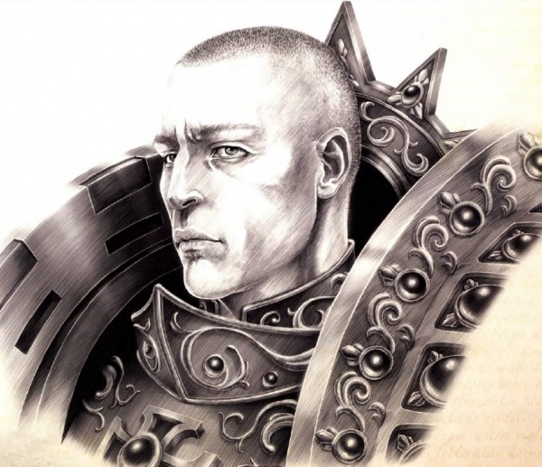
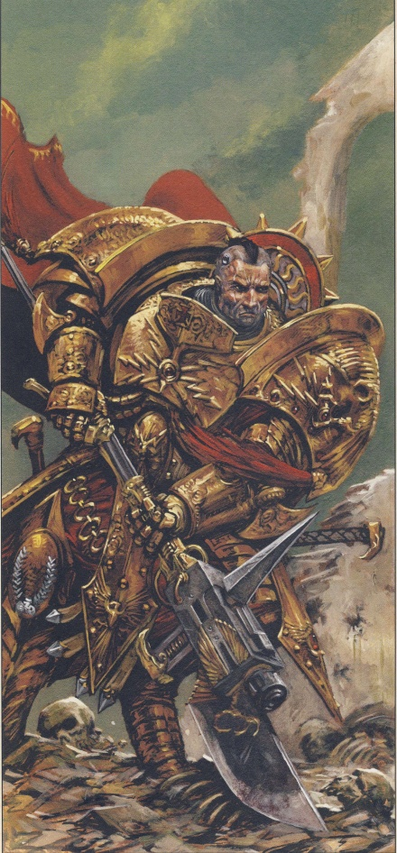
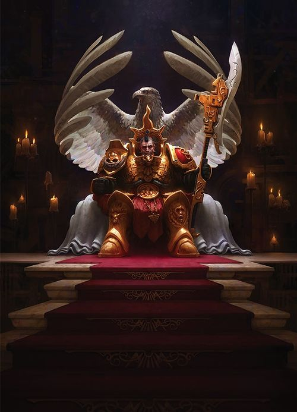
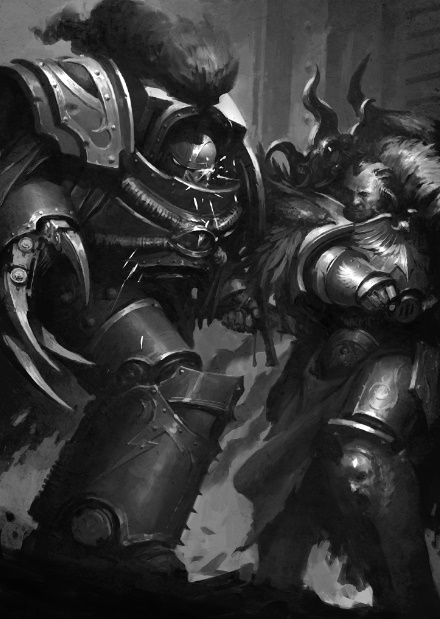

# 0623 康斯坦丁·瓦尔多 Constantin Valdor

精校状态：中文行文已逐段精校，部分术语仍为暂定

分类：人类帝国 / 禁军修会

原文来源：https://www.bilibili.com/opus/1056407958784573457

原作者：帝国神选罐头

原文时间：2025年04月16日 19:22

[返回分类目录](目录.md) · [全书目录](../../目录.md)

<!-- A0623-B0001 -->
**英文原文**

Constantin Valdor ('Emperor's Spear'), the First of the Ten Thousand, was the Chief Custodian to the Emperor of Mankind as Captain-General of the Adeptus Custodes at the time of the Unification Wars, Great Crusade, and the Horus Heresy.

<!-- /A0623-B0001 -->

<!-- A0623-B0002 -->

原译文

康斯坦丁·瓦尔多（“帝皇之矛”）是万人团中的第一个，在统一战争、大远征和荷鲁斯叛乱时期，他是人类帝皇的首席禁军，担任禁军总司令。

**校订译文**

康斯坦丁·瓦尔多，号称“帝皇之矛”，是万夫团之首。在统一战争、大远征与荷鲁斯之乱期间，他担任禁军元帅，是守护人类帝皇的首席禁军。

<!-- /A0623-B0002 -->

<!-- A0623-B0003 图片 -->

<!-- A0623-B0004 -->

原译文

Constantin Valdor 康斯坦丁·瓦尔多

**校订译文**

Constantin Valdor 康斯坦丁·瓦尔多

<!-- /A0623-B0004 -->

<!-- A0623-B0005 -->
## Biography 传记

<!-- /A0623-B0005 -->

<!-- A0623-B0006 -->
### Unification Wars 统一战争

<!-- /A0623-B0006 -->

<!-- A0623-B0007 -->
**英文原文**

The origins of Constantin Valdor are mysterious. According to Amar Astarte, his original parents were killed by the Emperor, who moved entire armies across continents to locate and retrieve him. Valdor himself knows very little of his past before becoming the Emperor's servant. While commonly accepted as the first Custodes, Valdor does not recall if he was truly the first Custodian, or simply the first successfully produced one. He served during the Unification Wars at the Battle of Maulland Sen. A handful of years later, he assassinated Koja Zu, the Minister of the Anuatan Steppes, and claimed her son, Ra Endymion, for the Legio Custodes. During the Battle of Maulland Sen, Valdor witnessed the savagery of the Thunder Warriors and became worried over their future.

<!-- /A0623-B0007 -->

<!-- A0623-B0008 -->

原译文

康斯坦丁·瓦尔多的起源是神秘的。据阿马尔·阿斯塔特称，他的亲生父母被帝皇杀害，帝皇调动了整个军队在各大洲寻找并营救他。瓦尔多本人在成为皇帝的仆人之前，对自己的过去知之甚少。虽然瓦尔多被普遍认为是第一位禁军，但他不记得自己是否真的是第一位禁军，或者仅仅是第一位成功制作的禁军。他在统一战争期间在莫兰森战役中服役。几年后，他暗杀了阿努亚坦草原使节科嘉·祖，并声称她的儿子拉·恩底弥翁为军团禁军。在莫兰森战役中，瓦尔多目睹了雷霆战士的野蛮行径，并对他们的未来感到担忧。

**校订译文**

瓦尔多的来历笼罩着谜团。据阿玛尔·阿斯塔特所言，帝皇杀死了他的亲生父母，并曾调动整支军队横跨大陆，寻找并带回他。瓦尔多本人对成为帝皇仆从之前的往事知之甚少。人们普遍认为他是第一名禁军，但他已经记不清，自己究竟是第一个接受改造的人，还是第一个成功的成品。他曾在统一战争的莫兰森战役中作战，亲眼见证雷霆战士的暴虐，并开始担忧他们的未来。几年后，他暗杀了阿努亚坦草原的部长科嘉·祖，将她的儿子拉·恩底弥翁带走，送入禁军军团。

**校注：** claim her son 指带走孩子纳入禁军培养体系，不是声称孩子属于某人；父母遭杀是阿玛尔的说法，保留来源归属。

<!-- /A0623-B0008 -->

<!-- A0623-B0009 图片 -->

<!-- A0623-B0010 -->

原译文

Chief-Custodian Constantin Valdor 首席禁军康斯坦丁·瓦尔多

**校订译文**

Chief-Custodian Constantin Valdor 首席禁军康斯坦丁·瓦尔多

<!-- /A0623-B0010 -->

<!-- A0623-B0011 -->
**英文原文**

By the end of the Unification Wars Valdor had emerged as part of the ruling "triumvirate" of Terra alongside the Emperor and Malcador. He had become suspicious of Grand Provost Marshal Uwoma Kandawire, dispatching Samonas to unravel her conspiracy before it could begin. However the conspirators still struck in the Palace Coup, during which Valdor was confronted by Kandawire, as well as Ushotan and his surviving Thunder Warriors. Valdor urged the conspirators to surrender, but when they refused he deployed the proto-Legiones Astartes in their first battle. During the battle the rebels were crushed and Valdor slew Ushotan, an act he took no gratification in as he had admired the General. Surprisingly, Valdor spared Kandawire and let her leave the Palace to retire in peace.

<!-- /A0623-B0011 -->

<!-- A0623-B0012 -->

原译文

到统一战争结束时，瓦尔多已经与帝皇和马卡多一起成为泰拉统治的“三巨头”的一部分。他开始怀疑大宪兵司令乌沃马·坎达维尔，派遣萨摩亚在阴谋开始前揭穿她的阴谋。然而，阴谋者仍然在皇宫政变中发动袭击，在此期间，瓦尔多与坎达维尔以及乌什坦和他幸存的雷霆战士对峙。瓦尔多敦促阴谋者投降，但当他们拒绝时，他在他们的第一场战斗中部署了原初阿斯塔特军团。在战斗中，叛军被镇压，瓦尔多杀死了乌什坦，他对这一行为并不满意，因为他钦佩这位将军。令人惊讶的是，瓦尔多饶过了坎达维尔，让她离开皇宫平静地退休。

**校订译文**

统一战争结束时，瓦尔多已与帝皇、马卡多并列为统治泰拉的“三巨头”。他怀疑宪兵大元帅乌沃玛·坎达维尔图谋不轨，派萨门纳斯追查，试图在阴谋发动前将其瓦解。然而，密谋者仍然掀起了皇宫政变；瓦尔多面对的是坎达维尔、乌什坦，以及残存的雷霆战士。他劝他们投降，遭到拒绝后，便投入尚处初创阶段的阿斯塔特军团，令其首次参战。叛军被彻底击败，瓦尔多亲手杀死乌什坦，却没有从中获得任何快意，因为他一直敬重这位将军。出人意料的是，他饶过了坎达维尔，允许她离开皇宫，安静地退隐。

<!-- /A0623-B0012 -->

<!-- A0623-B0013 -->
**英文原文**

Later Valdor expressed his surprise when Malcador stated that the Primarchs were still alive and that the Emperor was attempting to find them. Valdor couldn't understand why the Arch-Enemy had decided to spare them, and believed that if they were alive then they would be corrupted. Valdor instead wished to raise armies of mortals to be led by his Custodians.

<!-- /A0623-B0013 -->

<!-- A0623-B0014 -->

原译文

后来，当马卡多说原体们还活着，帝皇正试图找到他们时，瓦尔多表示惊讶。瓦尔多不明白为什么头号敌人决定放过他们，他相信如果他们还活着，他们就会被腐化。瓦尔多反而希望召集凡人军队，由他的禁军领导。

**校订译文**

后来，马卡多告诉瓦尔多，原体们仍然活着，帝皇正设法寻找他们。瓦尔多十分惊讶，不明白大敌为何放过他们；他认为，若他们尚在人世，就很可能已遭腐化。他更愿意建立由禁军率领的凡人大军。

<!-- /A0623-B0014 -->

<!-- A0623-B0015 -->
**英文原文**

Prior to the Horus Heresy, Valdor had earned 1932 names. By the 41st Millennium a book which apparently had his whole name written down took up an entire volume.

<!-- /A0623-B0015 -->

<!-- A0623-B0016 -->

原译文

在荷鲁斯叛乱之前，瓦尔多已经获得了1932个名字。到了第41个千年，一本显然写有他的全名的书占据了整整一卷。

**校订译文**

荷鲁斯之乱之前，瓦尔多已经获得1,932个名字。到了第41个千年，据称仅是抄录他的完整姓名，就足以写满一整卷书。

<!-- /A0623-B0016 -->

<!-- A0623-B0017 -->
### Horus Heresy 荷鲁斯之乱

原题：Horus Heresy 荷鲁斯叛乱

<!-- /A0623-B0017 -->

<!-- A0623-B0018 -->
### Battle of Prospero 普罗斯佩罗之战

<!-- /A0623-B0018 -->

<!-- A0623-B0019 -->
**英文原文**

Just prior to the open outbreak of the Horus Heresy, Valdor was charged by the Emperor to accompany Leman Russ of the Space Wolves in bringing Magnus the Red to account for breaking promises made during the Council of Nikaea at which the Emperor strictly forbade the use of sorcery and psychic powers.

<!-- /A0623-B0019 -->

<!-- A0623-B0020 -->

原译文

就在荷鲁斯叛乱公开爆发之前，瓦尔多被帝皇下令陪同太空野狼的黎曼·鲁斯，将赤红之马格努斯绳之以法，因为他违反了帝皇严格禁止使用巫术和灵能的尼凯亚会议上做出的承诺。

**校订译文**

荷鲁斯之乱公开爆发前夕，帝皇命瓦尔多陪同太空野狼原体黎曼·鲁斯前去问责红魔马格努斯，追究他违反尼凯亚会议禁令的责任。帝皇曾在那次会议上严禁使用巫术与灵能力量。

<!-- /A0623-B0020 -->

<!-- A0623-B0021 -->
**英文原文**

Valdor, with a contingent of elite Custodian Guard, fought alongside Russ and the Space Wolves on Prospero. He and his forces were responsible for killing at least three of the greatest psykers of the Thousand Sons and routing a force much more numerous than their own, however little else is known after this. Valdor eventually faced over thirty of the elite Khenetai "Blademasters", warriors who could predict an enemies' attacks through psychic precognition. The Captain-General slew every one of these deadly warriors, receiving only a single wound in the process. According to one account, he was also responsible for saving Bjorn when his arm was corrupted by the sorcerous powers of a Thousand Sons psyker. Valdor sliced Bjorn's arm off to prevent the corruption from overrunning his body. The other states that Bjorn's arm was cut off by a Skjald of the Space Wolves, Kasper Hawser.

<!-- /A0623-B0021 -->

<!-- A0623-B0022 -->

原译文

瓦尔多和一支精英禁军卫队在普罗斯佩罗与鲁斯和太空野狼并肩作战。他和他的部队至少杀死了千子中最伟大的三名灵能者，并击败了一支比他们多得多的部队，但在此之后，我们对其他事情知之甚少。瓦尔多最终面对了30多名精英肯特泰“剑刃大师”，这些战士可以通过灵能预知来预测敌人的攻击。禁军总司令杀死了所有这些致命的战士，在这个过程中只受了一处伤。根据一种说法，当比约恩的手臂被千子灵能者的魔法力量腐蚀时，他也负责拯救比约恩。瓦尔多砍掉了比约恩的手臂，以防止腐化席卷他的身体。另一份宣告称，比约恩的手臂被太空野狼的一名吟游诗人卡斯佩尔·豪瑟尔切断了。

**校订译文**

在普罗斯佩罗，瓦尔多率精锐禁军卫队与鲁斯及太空野狼并肩作战。他们杀死了至少三名千子顶尖灵能者，并击溃了数量远超己方的敌军。有关他此后的具体战况，记载并不完整。瓦尔多曾独自迎战三十多名肯特泰精锐“剑术大师”；这些战士能够通过灵能预知敌人的攻击，却全都死于他手，而他只受了一处伤。另有一种说法称，比约恩的手臂遭到千子巫术腐化时，是瓦尔多将其斩断，阻止腐化蔓延全身，救了比约恩一命。另一种记载则将这件事归于太空野狼的吟游诗人卡斯佩尔·豪瑟尔。

**校注：** 保留比约恩断臂事件的两种不同记载，不擅自选定其一。

<!-- /A0623-B0022 -->

<!-- A0623-B0023 -->
### Later Actions 后续行动

<!-- /A0623-B0023 -->

<!-- A0623-B0024 -->
**英文原文**

When Amon Tauromachian returned from his extended Blood Game, Valdor informed his fellow Custodian of how Horus Lupercal had declared rebellion against the Emperor. When Tauromachian asked how this could happen, Valdor, speaking as someone who knew the Warmaster, rejected theories that it was pride or resentment, instead voicing his belief that something had driven Horus and his closest advisers mad. Valdor then assigned Tauromachian with the task of investigating Pherom Sichar, Lord of Hy Brasil, for evidence of treason.

<!-- /A0623-B0024 -->

<!-- A0623-B0025 -->

原译文

当阿蒙·塔罗马奇从他的长期血战中回来时，瓦尔多告诉他的禁军同伴荷鲁斯·卢佩卡尔是如何宣布反抗帝皇的。当塔罗马奇问这怎么可能发生时，瓦尔多以一个了解战帅的人的身份拒绝了这是骄傲或怨恨的理论，而是表达了他的信念，即有什么东西让荷鲁斯和他最亲密的顾问发疯了。瓦尔多随后指派塔罗马奇调查海巴西领主费尔昂·西查尔的叛国罪证据。

**校订译文**

阿蒙·塔罗马奇完成一次漫长的鲜血游戏归来时，瓦尔多告诉他，荷鲁斯·卢佩卡尔已经公开背叛帝皇。阿蒙难以理解此事为何发生。瓦尔多自认了解战帅，不相信单凭骄傲或怨恨就足以解释，而是认为某种力量使荷鲁斯与最亲近的顾问陷入疯狂。随后，他派阿蒙调查海巴西领主费尔昂·西查尔，搜集可能存在的叛国证据。

<!-- /A0623-B0025 -->

<!-- A0623-B0026 图片 -->

<!-- A0623-B0027 -->

原译文

Constantin Valdor 康斯坦丁·瓦尔多

**校订译文**

Constantin Valdor 康斯坦丁·瓦尔多

<!-- /A0623-B0027 -->

<!-- A0623-B0028 -->
**英文原文**

After Horus declared his rebellion, Valdor then oversaw the mission and deployment of the first ever execution team. Invited by the Master of Assassins whose secret identity was Malcador The Sigillite who oversaw the council of Assassins. Each clade- Venenum, Eversor, Culexus, Vanus, Callidus, and led by Vindicare selected a single alpha-dan operative for the mission. The target was Horus Lupercal. Rogal Dorn learned of such events and challenged Valdor claiming that Horus being alive was a boon because he was predictable, and killing the head of the rebellion would not stop it, someone more predictable would simply take over. Valdor argued that the actions of the Officio Assassinorum were not necessarily cowardly, but expedient. Valdor says to Dorn that they all want the same thing; to preserve the Emperor. Dorn however claims that Valdor's role is to safeguard the life of the Emperor, whilst Dorn himself, and all the Astartes role is to safeguard the Imperium. The Assassin's mission uncovered valuable information, and encountered Erebus' own agent, daemonically enhanced. The mission to kill Horus is a failure as Horus is tipped off of the attempt on his life and sends a proxy who is killed in his place. Dorn and Valdor continue to argue, Dorn citing that to preserve the Imperium we must have a moral code, Valdor citing that to match Horus' evil we must not stop at underhanded tactics. The Emperor settles the argument with the final statement "No more shadows. No more veils".

<!-- /A0623-B0028 -->

<!-- A0623-B0029 -->

原译文

荷鲁斯宣布叛乱后，瓦尔多监督了有史以来第一支处刑队的任务和部署。应刺客大师的邀请，其秘密身份是监督刺客议会的掌印者马卡多。每个分支——文纳姆、艾弗森、邱利萨斯、文努斯、卡利都司，以及由文迪卡领导的分支——都为这次任务选择了一名阿尔法级特工。目标是荷鲁斯·卢佩卡尔。罗格·多恩得知了这些事件，并挑战瓦尔多，声称荷鲁斯活着是一件好事，因为他是可预测的，杀死叛军首领并不能阻止它，更可预测的人会接管。瓦尔多认为，暗杀官员的行动不一定是懦弱的，而是权宜之计。瓦尔多对多恩说，他们都想要同样的东西；为了保护帝皇。然而，多恩声称瓦尔多的角色是保卫帝皇的生命，而多恩本人和所有阿斯塔特的角色都是保卫帝国。刺客的任务发现了有价值的信息，并遇到了艾瑞巴斯的特工，经过了恶魔的增强。杀死荷鲁斯的任务是失败的，因为荷鲁斯得知有人试图杀害他，并派了一名替身代替他被杀。多恩和瓦尔多继续争论，多恩列举说，为了维护帝国，我们必须有一个道德准则，瓦尔多列举说，要与荷鲁斯的邪恶相匹配，我们不能止步于卑鄙的战术。帝皇最后以一句话“不再有阴影，不再有遮蔽”平息了这场争论。

**校订译文**

荷鲁斯宣布叛乱后，瓦尔多应刺客庭之主的邀请，监督组建并部署了第一支处决小队。主持刺客议会的这位神秘人物，真实身份正是掌印者马卡多。文纳姆、艾弗森、丘里克斯、文努斯、卡利都司和文迪卡六支系各选派一名阿尔法段位特工，由文迪卡成员领队，目标直指荷鲁斯·卢佩卡尔。多恩得知计划后与瓦尔多争执：荷鲁斯尚且可以预测，留着他反而有利；杀死首领也无法终结叛乱，仍会有人接替他，英文底稿甚至称那人会“更容易预测”。瓦尔多认为，刺客庭的做法未必出于怯懦，也可以是必要的权宜之计。他强调，众人的共同目标都是保护帝皇。多恩却回应说，瓦尔多的职责是保护帝皇的生命，而自己与阿斯塔特的职责是守护帝国。刺客们取得了一些重要情报，还遇到了艾瑞巴斯派出、接受过恶魔强化的代理人，但刺杀本身失败了：荷鲁斯事先获悉计划，派出替身，死去的只是替身。争论仍在继续。多恩坚持守护帝国必须恪守道德准则，瓦尔多则认为，面对荷鲁斯的邪恶，己方不能因手段阴险就拒绝采用。最终，帝皇以一句话结束争论：“不再有阴影，不再有帷幕。”

**校注：** 原文 someone more predictable 与多恩保留可预测首领的论证不协调，疑漏否定；正文保留原意并明确提示待核。clade 六支各派一人，由文迪卡特工领导，不是文迪卡领导其他全部神庙。alpha-dan 为刺客等级，不能误当灵能等级。

<!-- /A0623-B0029 -->

<!-- A0623-B0030 -->
**英文原文**

Later as the majority of the Custodian Guard was occupied by the War Within the Webway, Valdor assumed a vital position on the loyalist War Council alongside Malcador, Rogal Dorn, and Kane. He reappeared shortly before Leman Russ left Terra to confront Horus directly, returning the Spear of Russ to him. During their conservation, Valdor expressed disdain at the Space Wolves use of Rune Priests, considering them no different from normal Librarians which were now banned due to the Council of Nikaea. Valdor next appeared as the Solar War began, meeting with Rogal Dorn alongside Sanguinius, Jaghatai Khan, Malcador, and Dorn's command staff.

<!-- /A0623-B0030 -->

<!-- A0623-B0031 -->

原译文

后来，随着大部分禁军卫队被网道战争拖住，瓦尔多与马卡多、罗格·多恩和凯恩一起在忠诚派战争议会中担任了重要职务。在黎曼·鲁斯离开泰拉直接对抗荷鲁斯之前不久，他再次出现，将鲁斯之矛还给了他。在他们的保护过程中，瓦尔多对太空野狼使用符文牧师表示不屑，认为他们与普通的智库没有什么不同，后者现在因尼凯亚会议而被禁止。瓦尔多随后出现在太阳战争开始时，与罗格·多恩以及圣吉列斯、察合台可汗、马卡多和多恩的指挥人员会面。

**校订译文**

后来，大多数禁军被牵制在网道战争中，瓦尔多则与马卡多、多恩及凯恩共同在忠诚派战争议会中承担要职。黎曼·鲁斯即将离开泰拉、直接挑战荷鲁斯前，瓦尔多将鲁斯之矛交还给他。交谈中，瓦尔多对太空野狼继续使用符文祭司表示鄙夷，认为他们与已被尼凯亚会议禁令约束的普通智库员并无区别。太阳战争爆发时，他又与圣吉列斯、察合台可汗及马卡多一同会见多恩和其指挥幕僚。

**校注：** conservation 疑 conversation 的笔误，按谈话语境修正；不是保护过程。

<!-- /A0623-B0031 -->

<!-- A0623-B0032 -->
### Siege of Terra 泰拉围城

<!-- /A0623-B0032 -->

<!-- A0623-B0033 -->
**英文原文**

Valdor fought in defence of Mankind's homeworld during the Siege of Terra. During the battle loyalist marines who witnessed the Captain-General in combat, saw him reave through traitor marines as easily as they would against ordinary humans and weaker xenos. He also deployed Amon Tauromachian to investigate apparent Daemonic activity in the Imperial Palace. When Amon asked what should be done to Euphrati Keeler and her proto-Imperial Cultists, Valdor ordered that they remain unharmed as part of Malcador's plan to use them in the fight against Chaos. After the fall of the Lion's Gate Spaceport he helped lead the defense of the Colossi Gate alongside Jaghatai Khan and Raldoron, fighting against swathes of Daemons. After the escape of Basilio Fo from Blackstone Prison Valdor saw the mad scientist a threat big enough to warrant his own personal attention, and he hunted the prisoner throughout the Palace. He eventually saved Fo from a roaming Night Lord and decided that the human's supposed anti-Astartes bio-weapon could be of service to the Emperor.

<!-- /A0623-B0033 -->

<!-- A0623-B0034 -->

原译文

瓦尔多在泰拉围城中为保卫人类家园而战。在战斗中，忠诚的星际战士目睹了禁军总司令的战斗，看到他像对付普通人和较弱的异教徒一样轻松地战胜了叛徒星际战士。他还派遣阿蒙·塔罗马奇调查皇宫中明显的恶魔活动。当阿蒙问应该对幼发拉底·琪乐和她的原初帝国信徒做些什么时，瓦尔多命令他们不要受到伤害，这是马卡多在与混沌的斗争中使用他们的计划的一部分。狮门太空港陷落后，他与察合台可汗和拉尔德隆一起帮助领导了巨像门的防御，与大片的恶魔作战。巴西利奥·弗从黑石监狱越狱后，瓦尔多看到这位疯狂的科学家是一个足以引起他个人关注的威胁，于是他在整个皇宫里追捕这名囚犯。他最终从一位游荡的午夜领主手中救出了弗，并决定人类所谓的反阿斯塔特生物武器可以为帝皇服务。

**校订译文**

泰拉围城期间，瓦尔多为保卫人类母星而战。目睹他战斗的忠诚派星际战士发现，他斩杀叛军阿斯塔特之轻易，就如同他们自己杀死普通人或弱小异形。他还派阿蒙·塔罗马奇调查皇宫内疑似恶魔活动。阿蒙请示如何处置尤弗拉蒂·琪乐及其早期帝国信仰追随者时，瓦尔多下令不得伤害他们，因为马卡多准备借助这些人对抗混沌。狮门太空港陷落后，瓦尔多与察合台可汗、拉尔德隆共同指挥巨像门的防御，迎战大批恶魔。巴西利奥·弗从黑石监狱逃脱后，瓦尔多认为这位疯狂科学家的威胁足以让自己亲自处理，于是追踪其行迹，搜遍皇宫。最终，他从一名游荡的午夜领主手中救下弗，并判断此人宣称能够对付阿斯塔特的生物武器或许对帝皇有用。

**校注：** 原句比较的是禁军杀阿斯塔特与阿斯塔特杀普通人／弱小异形的难易，非阿斯塔特等同异教徒。

<!-- /A0623-B0034 -->

<!-- A0623-B0035 -->
**英文原文**

Valdor was summoned to the Emperor's side during the final teleportation attack aboard the Vengeful Spirit, and he left Basillo Fo and his weapon in the hands of his own Custodes. During the battle aboard the Vengful Spirit Valdor became separated from the Emperor and he and his Custodes found themselves in a dark abyss surrounded by Daemons. Part of a trap by Horus to drive the Captain-General to torment, it made him feel something close to fear for the first time as he realized he could not fulfill his duty. Nonetheless, this did not stop Valdor's killing duty in the slightest as he slaughtered his way through hordes of Daemons. To confirm that he had indeed been teleported to the Vengeful Spirit, Valdor plunged the Apollonian Spear into its floor to reveal its identity. Valdor's forces continued to battle through madness and Daemons until he grew closer to the location of the Emperor, at which point he began to encounter Sons of Horus and Word Bearers for the first time. During the struggle, he spotted First Captain Abaddon.

<!-- /A0623-B0035 -->

<!-- A0623-B0036 -->

原译文

在复仇之魂号上的最后一次传送攻击中，瓦尔多被召唤到帝皇身边，他把巴西利奥·弗和他的武器交给了自己的禁军。在战斗中，瓦尔多与帝皇分离，他和他的禁军发现自己陷入了被恶魔包围的黑暗深渊。这是荷鲁斯为折磨禁军总司令而设的陷阱的一部分，当他意识到自己无法履行职责时，这让他第一次感到近乎恐惧。尽管如此，这并没有丝毫阻止瓦尔多的杀戮职责，因为他屠杀了成群的恶魔。为了确认他确实被传送到了复仇之魂上，瓦尔多将日神之矛刺入其地板，以暴露其身份。瓦尔多的部队继续在疯狂和恶魔中作战，直到他离帝皇的位置越来越近，此时他开始第一次遇到荷鲁斯之子和怀言者。在战斗中，他发现了第一连长阿巴顿。

**校订译文**

帝皇准备传送突袭复仇之魂号时，召瓦尔多随行。瓦尔多将巴西利奥·弗及其武器交给手下禁军看管，随后参加突击。登舰后，他与帝皇分离，同部下落入恶魔环伺的黑暗深渊。这是荷鲁斯为折磨他设下的陷阱：意识到自己无法履行守护之责，瓦尔多第一次感到了近似恐惧的情绪。但他仍未停止战斗，在恶魔大军中不断杀出道路。为确认所在地确实是复仇之魂号，他将日神之矛刺入甲板，借其力量探知舰船的身份。禁军一边对抗疯狂与恶魔，一边逼近帝皇的位置，直到这时才在此次突袭中遇见荷鲁斯之子与怀言者。战斗间隙，瓦尔多看到了第一连连长阿巴顿。

<!-- /A0623-B0036 -->

<!-- A0623-B0037 -->
**英文原文**

Injured and weakened from their previous battles, Valdor and his remaining Custodes fought admirably against a vicious counterattack launched by Abaddon consisting of Justaerin and veteran Word Bearers, who outnumbered them by over thirty to one. However, the traitor Astartes were aided by Erebus, who managed to greatly empower Abaddon through Warp-infused rituals. During the fighting, Valdor was pinned down by six Justaerin Terminators and badly wounded by Hellas Sycar, but kept on fighting and managed to cut Abaddon with the Apollonian Spear. Gaining insight from Abaddon's future, Valdor was horrified to see the next 10,000 years of war and labeled Abaddon "Despoiler" before punching him. The experience, as well as the sudden berserk frenzy of the Blood Angels contingent of Operation Anabasis, left Valdor unsettled and angry, and afterwards he displayed more brutal and impatient traits, particularly towards Dorn and the Astartes whom he repeatedly spouted curses towards. However, he also learned of Sanguinius' death, something which caused Valdor genuine grief. Valdor and Dorn were ultimately able to escape Abaddon's attack and finally make it to Lupercal's Court.

<!-- /A0623-B0037 -->

<!-- A0623-B0038 -->

原译文

瓦尔多和他剩下的禁军们在之前的战斗中受伤和虚弱，他们出色地对抗了阿巴顿发动的恶性反击，阿巴顿的部队由加斯塔林和经验丰富的怀言者组成，他们的人数比他们为三十比一。然而，叛徒阿斯塔特得到了艾瑞巴斯的帮助，艾瑞巴斯通过亚空间的仪式极大地增强了阿巴顿的力量。在战斗中，瓦尔多被六名加斯塔林终结者压住，并被赫拉斯·赛卡重伤，但他继续战斗，并设法用日神之矛砍倒了阿巴顿。瓦尔多从阿巴顿的未来中获得了洞察，看到接下来一万年的战争，他感到震惊，并在攻击阿巴顿之前给他贴上了“掠夺者”的标签。这段经历，以及阿纳巴斯行动中圣血天使特遣队的突然狂暴，让瓦尔多感到不安和愤怒，之后他表现出更残酷和不耐烦的特征，尤其是对多恩和阿斯塔特，他反复咒骂他们。然而，他也得知了圣吉列斯的牺牲，这给瓦尔多带来了真正的悲痛。瓦尔多和多恩最终逃脱了阿巴顿的袭击，并最终进入了卢佩卡尔王庭。

**校订译文**

瓦尔多与残存禁军早已负伤、筋疲力尽，仍顽强抵挡阿巴顿率领的加斯塔林及怀言者老兵的猛烈反击。叛军人数超过他们三十倍，还得到艾瑞巴斯支援：后者借助亚空间仪式，大幅增强了阿巴顿的力量。瓦尔多被六名加斯塔林终结者牵制，又遭赫拉斯·赛卡重创，却仍继续奋战，以日神之矛划伤阿巴顿。长矛让他窥见对方的未来；看到随后一万年的战争，他惊骇不已，称阿巴顿为“掠夺者”，随后一拳击向他。这段经历，以及远征行动中的圣血天使突然陷入狂暴，使瓦尔多又惊又怒。此后他变得更加凶狠、急躁，尤其对多恩与阿斯塔特屡屡出言咒骂。然而，得知圣吉列斯已死时，他也感到了真切的悲痛。最终，瓦尔多与多恩摆脱阿巴顿的攻击，抵达卢佩卡尔王庭。

**校注：** cut Abaddon 表示划伤，不能译为砍倒。Operation Anabasis 依全书第588篇采用远征行动。

<!-- /A0623-B0038 -->

<!-- A0623-B0039 图片 -->

<!-- A0623-B0040 -->

原译文

Impaled by a Power Sword, Valdor battles Hellas Sycar and other Justaerin aboard the Vengeful Spirit 在一把动力剑的穿透下，瓦尔多在复仇之魂号上与赫拉斯·赛卡和其他加斯塔林作战

**校订译文**

Impaled by a Power Sword, Valdor battles Hellas Sycar and other Justaerin aboard the Vengeful Spirit 被动力剑刺穿身体的瓦尔多，在复仇之魂号上与赫拉斯·赛卡及其他加斯塔林交战

<!-- /A0623-B0040 -->

<!-- A0623-B0041 -->
**英文原文**

Within Lupercal's Court, Valdor and Dorn discovered Garviel Loken and Leetu as the only survivors alongside the corpse of Horus and the grievously wounded Emperor. Leetu discovered a tarot card of "The Throne", which helped Dorn argue that the Emperor should be brought back to the Golden Throne. Valdor initially dismissed the superstition, but ultimately acquiesced.

<!-- /A0623-B0041 -->

<!-- A0623-B0042 -->

原译文

在卢佩卡尔王庭里，瓦尔多和多恩发现加加维尔·洛肯和勒图是唯一的幸存者，与荷鲁斯的尸体和重伤的帝皇并肩而立。勒图发现了一张“王座”的塔罗牌，这有助于多恩认为帝皇应该被带回黄金王座。瓦尔多最初驳斥了这种迷信，但最终还是默许了。

**校订译文**

在卢佩卡尔王庭，两人发现了荷鲁斯的尸体与身负重伤的帝皇；除帝皇外，现场仅有加维尔·洛肯和勒图两名幸存者。勒图找到一张“王座”塔罗牌，多恩借此主张应将帝皇送回黄金王座。瓦尔多起初斥之为迷信，最终还是同意了。

<!-- /A0623-B0042 -->

<!-- A0623-B0043 -->
**英文原文**

After the Siege of Terra, Valdor met with the newly arrived Leman Russ. While Russ was distraught and pessimistic about what had befallen the Imperium and Emperor, Valdor expressed confidence that the Master of Mankind had foreseen all that had transpired and planned accordingly. Secretly, however, Valdor is unsure if this is true.

<!-- /A0623-B0043 -->

<!-- A0623-B0044 -->

原译文

在泰拉围城之后，瓦尔多会见了新抵达的黎曼·鲁斯。当鲁斯对帝国和帝皇的遭遇感到心烦意乱和悲观时，瓦尔多表示相信人类之主已经预见到了所有发生的事情，并相应地进行了计划。然而，瓦尔多私下里不确定这是否属实。

**校订译文**

泰拉围城结束后，瓦尔多会见了刚刚抵达的黎曼·鲁斯。鲁斯为帝国与帝皇遭受的灾难悲痛失措，对未来十分悲观；瓦尔多则表示相信，人类之主早已预见这一切，并作出相应安排。不过，他私下也无法确定事实是否如此。

<!-- /A0623-B0044 -->

<!-- A0623-B0045 -->
### Fate 命运

<!-- /A0623-B0045 -->

<!-- A0623-B0046 -->
**英文原文**

Sometime after the Heresy, around the same time as the disappearance of Leman Russ, Valdor also disappeared without a trace. During the dead of night, Valdor simply slipped out of the Imperial Palace, turning back once to look upon the Palace and whisper "Only in Death"(the first part of the Imperial quote Only in death does duty end) before vanishing. His fate is unknown even by the Custodes themselves. He is one of three Captain-Generals to have gone missing without even the Adeptus Custodes being aware of the details.

<!-- /A0623-B0046 -->

<!-- A0623-B0047 -->

原译文

叛乱之后的某个时候，大约在黎曼·鲁斯失踪的同时，瓦尔多也消失得无影无踪。在夜深人静的时候，瓦尔多只是离开了皇宫，回头看了一眼皇宫，低声说“只有死亡”（帝国语录的第一部分只有死亡，责任才结束），然后消失了。他的命运甚至连禁军自己都不知道。他是三位失踪的禁军总司令之一，即使是禁军也不知道细节。

**校订译文**

叛乱结束后的某个时候，大约与黎曼·鲁斯失踪同时，瓦尔多也消失无踪。一个深夜，他悄然离开帝国皇宫，只回头望了一眼，低声说出“唯有死亡”，便消失了。这句话是帝国格言“唯有死亡，职责方休”的开头。连禁军也不知道他此后的命运。在历代禁军元帅中，共有三人失踪得如此彻底，连禁军自身也不掌握详情；瓦尔多正是其中之一。

<!-- /A0623-B0047 -->

<!-- A0623-B0048 -->
**英文原文**

A book recovered and translated by Gideon Ravenor and Alizebeth Bequin identified the enigmatic King in Yellow as apparently being Constantin Valdor.

<!-- /A0623-B0048 -->

<!-- A0623-B0049 -->

原译文

吉迪恩·拉文诺和伊丽莎白·贝奎恩找到并翻译的一本书确定了这位神秘的黄色国王显然是康斯坦丁·瓦尔多。

**校订译文**

吉迪恩·拉文诺与伊丽莎白·贝奎恩找回并翻译的一本书，似乎将神秘的“黄衣之王”指认为康斯坦丁·瓦尔多。

**校注：** apparently 为推测性措辞，保留“似乎”，不把黄衣之王身份写成已经最终确证。

<!-- /A0623-B0049 -->

<!-- A0623-B0050 -->
## Personality and Abilities 性格和能力

<!-- /A0623-B0050 -->

<!-- A0623-B0051 -->
**英文原文**

Beyond his absolute loyalty to the Emperor, Constantin Valdor was known for his stoic and observant personality. Despite the claims by outside observers he did not experience emotions such as pride or arrogance, or really any feeling at all besides his sense of duty to the Emperor. The Thunder Warrior Ushotan expressed pity for Valdor, stating that he had all the humanity sucked from him and had become numb. Valdor did not disagree with the sentiment. Nonetheless he seems capable of taking fondness to certain individuals, such as Uwoma Kandawire and Ushotan.

<!-- /A0623-B0051 -->

<!-- A0623-B0052 -->

原译文

除了对帝皇的绝对忠诚外，康斯坦丁·瓦尔多还以其坚忍不拔、善于观察的性格而闻名。尽管外界观察者声称，除了对帝皇的责任感外，他没有经历过骄傲或傲慢等情绪，也没有任何其他感觉。雷霆战士乌什坦对瓦尔多表示同情，说他把所有的人性都从他身上吸走了，变得麻木了。瓦尔多并不反对这种观点。尽管如此，他似乎有能力喜欢某些人，比如乌沃马·坎达维尔和乌什坦。

**校订译文**

瓦尔多不仅对帝皇绝对忠诚，也以坚忍克制、观察敏锐闻名。尽管旁人对他有所揣测，他实际上并不体验骄傲、傲慢等情绪；除对帝皇的责任感外，他几乎不再有其他感受。雷霆战士乌什坦曾怜悯他，认为他的人性已被彻底抽走，变得麻木，而瓦尔多并未反驳。不过，他似乎仍能对个别人抱有好感，例如乌沃玛·坎达维尔与乌什坦。

**校注：** 本段概括其缺乏情绪，前文又写悲痛、恐惧等体验；忠实保留底稿自身的张力，不擅自删去其中一面。

<!-- /A0623-B0052 -->

<!-- A0623-B0053 -->
**英文原文**

Valdor's battle prowess was legendary. His reaction time was to the point where it seemed as if he could see time itself come to a halt. A warrior of superlative skill, it was said that Valdor could match even a Primarch in single combat. Indeed, such was his might, that there were those, even in the Imperial Court, who called him a "Primarch" in all but name.

<!-- /A0623-B0053 -->

<!-- A0623-B0054 -->

原译文

瓦尔多的战斗能力是传奇。他的反应时间似乎已经到了可以看到时间本身停止的地步。瓦尔多是一位技艺超群的战士，据说他在一场战斗中甚至可以与一位原体匹敌。事实上，他的力量如此之大，以至于即使在帝国王庭中，也有人称他为“原体”。

**校订译文**

瓦尔多的武艺堪称传奇。他反应极快，仿佛能看见时间本身停滞。据说，他凭借超凡战技，在一对一决斗中足以匹敌原体。甚至连帝国宫廷内，也有人认为他除名号之外，与一位“原体”无异。

<!-- /A0623-B0054 -->

<!-- A0623-B0055 -->
## Wargear 战备

<!-- /A0623-B0055 -->

<!-- A0623-B0056 -->
**英文原文**

Valdor went into battle equipped with a expertly crafted Guardian Spear known as the Apollonian Spear and an ornate suit of Custodian Armour known as the Corinthine Warplate.

<!-- /A0623-B0056 -->

<!-- A0623-B0057 -->

原译文

瓦尔多带着一把被称为日神之矛的精心制作的卫士之矛和一套被称为科林斯战甲的华丽禁军盔甲参加了战斗。

**校订译文**

瓦尔多上阵时，手持精工打造的卫士之矛“日神之矛”，身穿华丽的禁军护甲“科林斯战甲”。

**校注：** 对照本段英文确认同一实体，与全书核心译名统一；不改变同形异义词或省略称呼。

<!-- /A0623-B0057 -->

本篇核心术语与暂定项

以下列出本篇出现的英文原形及核心术语表用词。同形词可能指不同对象，具体词义以本篇正文和校注为准；单复数、别名和仅见于图注的名称可能尚未列入。完整候选见[术语表](../../术语表/双语术语候选.csv)。

| 英文 | 采用中文 | 状态 |
| --- | --- | --- |
| Blood Angels | 圣血天使 | 官方已核对 |
| Space Wolves | 太空野狼 | 官方已核对 |
| Adeptus Custodes | 帝皇禁军 | 官方已核对 |
| Thousand Sons | 千子 | 官方已核对 |
| Psyker | 灵能者 | 官方已核对 |
| Horus Heresy | 荷鲁斯之乱 | 官方已核对 |
| Warp | 亚空间 | 官方已核对 |
| Imperium | 帝国 | 暂定·简称 |
| Webway | 网道 | 暂定 |
| Teleportation | 传送 | 暂定 |
| Emperor of Mankind | 人类帝皇 | 暂定 |
| Emperor | 帝皇 | 官方已核对 |
| Primarch | 原体 | 官方已核对 |
| Officio Assassinorum | 刺客庭 | 暂定·官方待核 |
| Word Bearers | 怀言者 | 暂定·官方待核 |
| Great Crusade | 大远征 | 暂定·官方待核 |
| Terra | 泰拉 | 暂定·官方待核 |
| Horus | 荷鲁斯 | 暂定·官方待核 |
| Erebus | 艾瑞巴斯 | 暂定·官方待核 |
| Garviel Loken | 加维尔·洛肯 | 暂定·官方待核 |
| Vengeful Spirit | 复仇之魂号 | 暂定·官方待核 |
| Sons of Horus | 荷鲁斯之子 | 暂定·官方待核 |
| Magnus the Red | 红魔马格努斯 | 官方已核对 |
| Eversor | 艾弗森 | 暂定·官方短名对应 |
| Golden Throne | 黄金王座 | 暂定·官方待核 |
| Legiones Astartes | 阿斯塔特军团 | 暂定·官方待核 |
| Thunder Warriors | 雷霆战士 | 暂定·官方待核 |
| Unification Wars | 统一战争 | 暂定·官方待核 |
| Malcador the Sigillite | 掌印者马卡多 | 暂定·官方待核 |
| Amar Astarte | 阿玛尔·阿斯塔特 | 暂定·官方待核 |
| Alizebeth Bequin | 伊丽莎白·贝奎恩 | 暂定·官方待核 |
| Kasper Hawser | 卡斯佩尔·豪瑟尔 | 暂定·官方待核 |
| Gideon Ravenor | 吉迪恩·拉文诺 | 暂定·官方待核 |
| Council of Nikaea | 尼凯亚会议 | 暂定·官方待核 |
| Amon Tauromachian | 阿蒙·塔罗马奇 | 暂定·官方待核 |
| Master | 导师（审判庭职衔）／舰务官（舰员职务） | 语境定译·官方待核 |
| Euphrati Keeler | 尤弗拉蒂·琪乐 | 暂定 |
| Mission | 教团／传教机构 | 暂定 |
| Leetu | 勒图 | 暂定·官方待核 |
| Ushotan | 乌什坦 | 暂定·官方待核 |
| Custodian Guard | 禁军卫队 | 官方已核对 |
| Grand Provost Marshal | 宪兵大元帅 | 暂定·官方待核 |
| Execution team | 处决小队 | 暂定·官方待核 |
| Captain-General | 禁军元帅 | 暂定·官方待核 |
| Horus Lupercal | 荷鲁斯·卢佩卡尔 | 暂定·官方待核 |
| Lupercal | 卢佩卡尔 | 暂定·官方待核 |
| Justaerin | 加斯塔林 | 暂定·官方待核 |
| The Sigillite | 掌印者 | 暂定·官方待核 |
| The Primarchs | 原体 | 暂定·官方待核 |
| First Captain | 第一连长 | 暂定·官方待核 |
| Raldoron | 拉多隆 | 暂定·官方待核 |
| Amon | 阿蒙 | 暂定·官方待核 |
| Despoiler | 劫掠者 | 暂定·官方待核 |
| Captain | 连长 | 暂定·官方待核 |
| Veteran | 老兵 | 暂定·官方待核 |
| Terminators | 终结者 | 暂定·官方待核 |
| Constantin Valdor | 康斯坦丁·瓦尔多 | 暂定·官方待核 |
| Grief | 格里夫 | 暂定·官方待核 |
| Hellas Sycar | 赫拉斯·赛卡 | 暂定·官方待核 |
| Absolute | 绝对号 | 暂定·官方待核 |
| Powers | 能天使 | 暂定·官方待核 |
| Operative | 特工 | 暂定·官方待核 |
| Xenos | 异形 | 暂定·官方待核 |
| Jaghatai Khan | 察合台可汗 | 暂定·官方待核 |
| Marshal | 元帅 | 官方已核对 |
| Ra Endymion | 拉·恩底弥翁 | 暂定·官方待核 |
| Operation Anabasis | 远征行动 | 暂定·官方待核 |
| Uwoma Kandawire | 乌沃玛·坎达维尔 | 暂定·官方待核 |
| Samonas | 萨门纳斯 | 暂定·官方待核 |
| Basilio Fo | 巴西利奥·弗 | 暂定·官方待核 |
| Koja Zu | 科嘉·祖 | 暂定·官方待核 |
| Maulland Sen | 莫兰森 | 暂定·官方待核 |
| First of the Ten Thousand | 万夫团之首 | 暂定·官方待核 |
| Emperor's Spear | 帝皇之矛 | 暂定·官方待核 |
| Anuatan Steppes | 阿努亚坦草原 | 暂定·官方待核 |
| Pherom Sichar | 费尔昂·西查尔 | 暂定·官方待核 |
| Hy Brasil | 海巴西 | 暂定·官方待核 |
| alpha-dan | 阿尔法段位 | 暂定·官方待核 |
| Colossi Gate | 巨像门 | 暂定·官方待核 |
| Blackstone Prison | 黑石监狱 | 暂定·官方待核 |
| Apollonian Spear | 日神之矛 | 暂定·官方待核 |
| Corinthine Warplate | 科林斯战甲 | 暂定·官方待核 |
| skjald | 吟游诗人 | 暂定·官方待核 |
| The Blood | 鲜血 | 暂定·官方待核 |
| Palace Coup | 皇宫政变 | 暂定·官方待核 |
| War Council | 战争议会 | 暂定·官方待核 |
| Corruption | 腐败 | 暂定·官方待核 |
| Guardian Spear | 卫士之矛 | 暂定·官方待核 |
| Spear of Russ | 鲁斯之矛 | 暂定·官方待核 |
| Colossi | 巨像 | 暂定·官方待核 |
| Lupercal's Court | 卢佩卡尔王庭 | 暂定·官方待核 |
| Nikaea | 尼凯亚 | 暂定·官方待核 |
| Lion's Gate Spaceport | 狮门太空港 | 暂定·官方待核 |
| Lion's Gate | 狮门 | 暂定·官方待核 |

