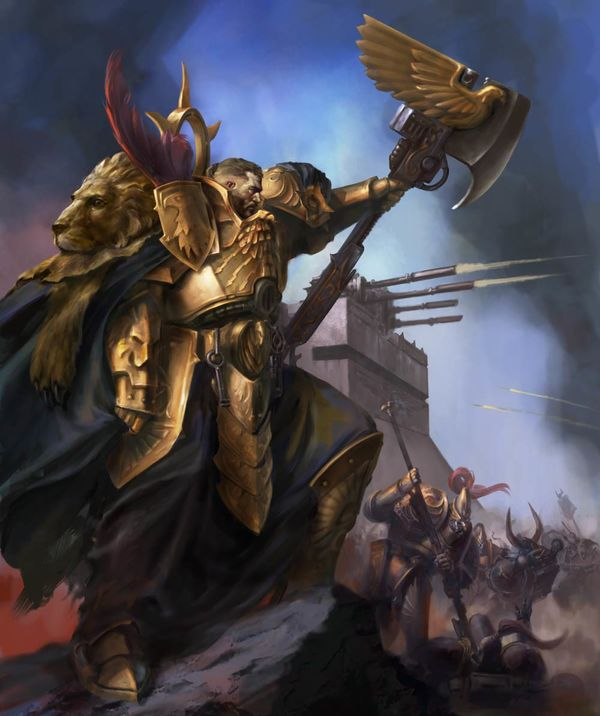
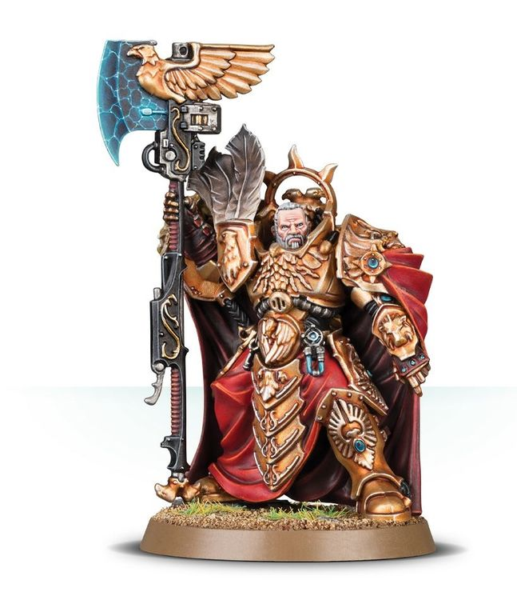

# 0624 图拉真·瓦洛瑞斯 Trajann Valoris

精校状态：中文行文已逐段精校，部分术语仍为暂定

分类：人类帝国 / 禁军修会

原文来源：https://www.bilibili.com/opus/1074827922455396359

原作者：帝国神选罐头

原文时间：2025年06月05日 10:41

[返回分类目录](目录.md) · [全书目录](../../目录.md)

原篇名：图拉真·瓦洛里斯 Trajann Valoris

<!-- A0624-B0001 -->
**英文原文**

Trajann Valoris is the 17th and current Captain-General of the Adeptus Custodes and a High Lord of Terra.

<!-- /A0624-B0001 -->

<!-- A0624-B0002 -->

原译文

图拉真·瓦洛里斯是第17位也是现任禁军修会的禁军元帅，也是泰拉高领主。

**校订译文**

按英文底稿所述，图拉真·瓦洛瑞斯是第十七任禁军元帅，也是当时在任的泰拉高领主之一。

**校注：** current 指底稿成文时的在任状况，不将其当作本次校订日期的新出版状态核验。人名依已采用官方对应瓦洛瑞斯。

<!-- /A0624-B0002 -->

<!-- A0624-B0003 图片 -->

<!-- A0624-B0004 -->

原译文

Captain-General Trajann Valoris 禁军元帅图拉真·瓦洛里斯

**校订译文**

Captain-General Trajann Valoris 禁军元帅图拉真·瓦洛瑞斯

<!-- /A0624-B0004 -->

<!-- A0624-B0005 -->
## History 历史

<!-- /A0624-B0005 -->

<!-- A0624-B0006 -->
**英文原文**

An imposing and cold man with a severely scarred face, at the time of the Thirteenth Black Crusade Trajann was considered to be perhaps the deadliest individual warrior in the entire Imperium, with his combat prowess approaching that of the Primarchs of old.

<!-- /A0624-B0006 -->

<!-- A0624-B0007 -->

原译文

在第十三次黑色远征期间，图拉真是一个面容伤痕累累、气势磅礴而冷酷的人，被认为可能是整个帝国中最致命的战士，他的战斗力接近过去的原体。

**校订译文**

图拉真面容布满深深的伤疤，气势威严，性情冷峻。第十三次黑色远征期间，人们认为他或许是整个帝国最致命的单兵战士，武艺已接近昔日原体的水平。

<!-- /A0624-B0007 -->

<!-- A0624-B0008 -->
**英文原文**

Those who know of Valoris' existence speak of him with reverence and considered the Captain-General to be a representative of the Emperor. Originally an Allarus Custodian, he has run two successful Blood Games, a record that remains unbroken. While serving as an Allarus Custodian Trajann gained fame for the destruction of the Space Hulk Mournful Siren, the defeat of the Genestealer Cult of the Emperor's Writhing Shadow, and spearheading a preemptive strike against Waaagh! Krushfist. After these feats he was accepted into the Companions for 22 years before he was reassigned due to his desire to be more proactive. Thereafter he gained the rank of Shield-Captain and spent several centuries leading sorties throughout the Sol System and beyond. He was elevated to the position of Captain-General following the death of Andros Launceddre during the Years of Madness. His rise has seen the Custodes become the most proactive they have been since the Age of Apostasy. During his ruling the number of Blood Games greatly increased, long-hidden cults of the polar Terran underhives have been purged, thirty-two separate extrasolar interdiction strikes were launched and the defences of the stable warp routes into the Sol System have been strengthened. It is said that it is the Moment Shackle — a mysterious artefact of Valoris from the dark history of old Terra — that allowed him to predict Roboute Guilliman's return so that he managed to adapt the Adeptus Custodes to the new Imperium in the ascension of the Primarch.

<!-- /A0624-B0008 -->

<!-- A0624-B0009 -->

原译文

那些知道瓦洛里斯存在的人怀着崇敬的心情谈论他，并认为禁军元帅是帝皇的代表。他最初是一名阿拉鲁斯禁军，他已经成功举办了两次鲜血游戏，这一记录至今仍未被打破。在担任阿拉鲁斯禁军期间，图拉真因摧毁太空废船哀悼塞壬号、击败帝皇盘绕的阴影的基因窃取者教派以及率先对碎拳的Waaagh!发动先发制人的打击而闻名。在这些壮举之后，他被伙友接纳了22年，然后由于他希望更加积极主动而被重新分配。此后，他获得了盾卫连长的军衔，并花了几个世纪的时间在整个太阳系内外领导出击。安德罗斯·朗斯德雷在叛教时代牺牲后，他被提升为禁军元帅。他的崛起使禁军成为自叛教时代以来最积极主动的。在他的领导期间，鲜血游戏的数量大大增加，长期隐藏的泰拉极地地下巢穴的邪教被清除，发动了三十二次独立的太阳系外封锁打击，进入太阳系的稳定亚空间航道的防御得到了加强。据说，正是时间枷锁 —瓦洛里斯在旧泰拉黑暗历史中找到的一件神秘造物 — 使他能够预测罗伯特·基里曼的回归，从而使他能够在原体升天时使禁军适应新的帝国。

**校订译文**

知晓瓦洛瑞斯存在的人，提起他时无不心怀敬意，将禁军元帅视为帝皇的代表。他最初是一名阿拉鲁斯亲卫，曾两次在鲜血游戏中成功达成目标，创下无人打破的纪录。服役期间，他因摧毁太空废船哀悼塞壬号、击败帝皇蠕动之影基因窃取者教派，以及率先发动打击、阻止碎拳的Waaagh!而闻名。立下这些功勋后，他被选入近侍，服役二十二年。由于希望主动出击，他后来获调其他岗位，升任盾卫连长，在此后数百年间率军征战太阳系内外。安德罗斯·朗塞德尔在“疯狂年代”殒命后，图拉真接任禁军元帅，使禁军展现出自叛教时代以来少有的主动性。在他任内，鲜血游戏次数大幅增加，潜藏于泰拉极地底巢的古老邪教受到清剿，禁军先后发动三十二次太阳系外的拦截打击，并加强了通往太阳系的稳定亚空间航道的防御。据说，他持有一件源自古老泰拉黑暗历史的神秘遗物——时间枷锁；正是它让他预见了罗保特·基里曼的归来，提前调整禁军，以适应原体重新掌权后的帝国。

**校注：** 两次鲜血游戏成功是参与并达成目标，不是单指组织两届活动。Years of Madness 与 Age of Apostasy 是两个不同年代名称，原译混同。

<!-- /A0624-B0009 -->

<!-- A0624-B0010 图片 -->

<!-- A0624-B0011 -->

原译文

Trajann Valoris 图拉真·瓦洛里斯

**校订译文**

Trajann Valoris 图拉真·瓦洛瑞斯

<!-- /A0624-B0011 -->

<!-- A0624-B0012 -->
**英文原文**

Though the Captain-General traditionally only served as one of the High Lords of Terra under the most dire of circumstances, as during the War of the Beast, the fervent persistence of Chancellor Lev Tieron persuaded Valoris to take the seat left open by Lord Brach. Tieron had hoped that Valoris would serve as the High Lords' deciding vote to abolish the Lex Imperialis, which would allow the Custodes to leave Terra and fight against the Despoiler's forces, but the Captain-General disagreed with this. He was about to vote no against the abolition and defeat the measure when pandemonium broke out as word of Cadia's destruction reached the High Lords' chambers. Later it is revealed that Valoris had been quietly preparing the Custodes for war for some time and had possibly issued a summons for the reformation of the Sisters of Silence years in advance, making it suspect that his objection might have been a ploy to avoid tensions with the High Lords.

<!-- /A0624-B0012 -->

<!-- A0624-B0013 -->

原译文

尽管禁军元帅传统上只在最可怕的情况下担任泰拉的高领主之一，比如在野兽战争期间，但议长列弗·蒂隆的强烈坚持说服了瓦洛里斯坐上了布拉奇领主留下的座位。蒂隆曾希望瓦洛里斯能够成为高领主废除帝国法律的决定性投票，这将允许禁军离开泰拉并与掠夺者的部队作战，但禁军元帅不同意这一点。当卡迪亚被摧毁的消息传到参议院时，他正要对反对废除法律投票并挫败这项提案时，混乱爆发了。后来有消息透露，瓦洛里斯一直在悄悄地为禁军备战一段时间，并可能提前几年发出了改革寂静修女的提案，这让人怀疑他的反对可能是为了避免与参议院的紧张关系。

**校订译文**

按照惯例，禁军元帅只会在最危急的时刻——例如野兽之战期间——出任泰拉高领主。但议长列弗·蒂隆不断劝说，最终使瓦洛瑞斯接受了布拉奇领主留下的席位。蒂隆希望借他的关键一票废除《帝国律法》对禁军的限制，使其能够离开泰拉，对抗掠夺者的大军，瓦洛瑞斯却表示反对。他正准备投下否决票、让提案流产时，卡迪亚毁灭的消息传入议事厅，会场顿时大乱。后来人们才知道，瓦洛瑞斯早已悄悄为禁军备战，甚至可能提前数年发出召集令，准备重组寂静修女。由此有人怀疑，他当初反对提案，或许只是为了避免与高领主发生冲突。

**校注：** 英文称 abolish the Lex Imperialis；结合本段具体争论对象，中文明确这里讨论的是解除限制禁军离开泰拉的律法约束，不延伸为废掉整个帝国的所有法律。召回修女仍是可能性，保留限定。

<!-- /A0624-B0013 -->

<!-- A0624-B0014 -->
**英文原文**

During the subsequent Second Battle of Terra against the forces of Khorne, Valoris was the overall commander of Imperial forces at the Imperial Palace and personally led a charge of 4,000 Custodes from the Lion's Gate. When Roboute Guilliman arrived from Luna Valoris cooperated with the Primarch, much to the disdain of several High Lords like Irthu Haemotalion. Valoris even allowed Guilliman to stand before the Golden Throne itself.

<!-- /A0624-B0014 -->

<!-- A0624-B0015 -->

原译文

在随后的第二次泰拉之战中，瓦洛里斯是皇宫帝国军队的总指挥，并亲自率领4000名禁军从狮门冲锋，当罗伯特·基里曼从月球抵达时，瓦洛里斯与原体合作，这让伊图·哈莫塔里昂等几位高领主嗤之以鼻。瓦洛里斯甚至允许基里曼站在黄金王座前。

**校订译文**

随后，恐虐大军引发第二次泰拉之战，瓦洛瑞斯担任帝国皇宫守军的总指挥，亲率四千名禁军从狮门冲出迎敌。罗保特·基里曼从月球抵达后，他与原体合作，甚至准许其来到黄金王座前。这让伊图·哈默塔利昂等几位高领主十分不满。

<!-- /A0624-B0015 -->

<!-- A0624-B0016 -->
**英文原文**

Valoris took part in the subsequent Indomitus Crusade, leading a combined force of Custodians and Grey Knights in the Battle of Gathalamor. He subsequently led a Solblade fleet against Hive Fleet Leviathan in the Fourth Tyrannic War from the flagship Manifest Judgement. During the Battle of Bastior, he led reinforcements that saved the world of Sanctum from Grendyllus and personally saved the life of Lord Commander Solar Leontus from a Norn Emissary.

<!-- /A0624-B0016 -->

<!-- A0624-B0017 -->

原译文

瓦洛里斯参加了随后的不屈远征，在加塔拉莫之战中领导了一支由禁军和灰骑士组成的联合部队。随后，他率领一支太阳之刃舰队在第四次泰伦战争中从旗舰审判显现号对抗利维坦虫巢舰队。在巴斯蒂奥战役中，他率领援军从格伦迪勒斯手中拯救了圣所世界，并亲自从一名诺恩使者手中拯救了太阳领主指挥官雷昂图斯的生命。

**校订译文**

瓦洛瑞斯参加了随后的不屈远征，在加塔拉莫之战中率领禁军与灰骑士组成的联军。第四次泰伦战争期间，他以审判显现号为旗舰，率一支太阳之刃舰队迎战利维坦虫巢舰队。巴斯蒂奥之战中，他带领援军解救了遭格伦迪勒斯威胁的圣所星，还亲自从一头诺恩使者手中救下太阳领主雷昂图斯。

**校注：** Sanctum 为星球名，采用圣所星；不可与皇宫的 Sanctum Imperialis 混同。

<!-- /A0624-B0017 -->

<!-- A0624-B0018 -->
## Wargear 战备

<!-- /A0624-B0018 -->

<!-- A0624-B0019 -->
**英文原文**

Trajann Valoris wears a special and elaborate powered armour known as the Castellan Plate and wields the Watcher's Axe. He also carries the Moment Shackle, a relic of the Dark Age of Technology, and a Misericordia.

<!-- /A0624-B0019 -->

<!-- A0624-B0020 -->

原译文

图拉真身穿被称为堡主战甲的特殊而精致的动力盔甲，并挥舞着守望者之斧。他还带着黑暗技术时代的遗物时间枷锁和怜悯之刃。

**校订译文**

图拉真身穿特殊而华美的“堡主战甲”，挥舞“守望者之斧”。他还携带黑暗科技时代的遗物时间枷锁，以及一把怜悯之刃。

<!-- /A0624-B0020 -->

本篇核心术语与暂定项

以下列出本篇出现的英文原形及核心术语表用词。同形词可能指不同对象，具体词义以本篇正文和校注为准；单复数、别名和仅见于图注的名称可能尚未列入。完整候选见[术语表](../../术语表/双语术语候选.csv)。

| 英文 | 采用中文 | 状态 |
| --- | --- | --- |
| Grey Knights | 灰骑士 | 官方已核对 |
| Adeptus Custodes | 帝皇禁军 | 官方已核对 |
| Roboute Guilliman | 罗保特·基里曼 | 官方已核对 |
| Warp | 亚空间 | 官方已核对 |
| Imperium | 帝国 | 暂定·简称 |
| Dark Age of Technology | 黑暗科技时代 | 暂定 |
| Khorne | 恐虐 | 官方已核对 |
| Waaagh! | Waaagh! | 暂定·保留原文 |
| Indomitus | 不屈学派 | 暂定·学派语境 |
| History | 历史 | 编辑用语已统一 |
| Emperor | 帝皇 | 官方已核对 |
| Primarch | 原体 | 官方已核对 |
| Age of Apostasy | 叛教时代 | 暂定·官方待核 |
| Unbroken | 不屈者 | 暂定·官方待核 |
| Terra | 泰拉 | 暂定·官方待核 |
| High Lords of Terra | 泰拉高领主 | 暂定·官方待核 |
| Sisters of Silence | 寂静修女 | 暂定·官方待核 |
| Indomitus Crusade | 不屈远征 | 暂定·官方待核 |
| Hive Fleet Leviathan | 利维坦虫巢舰队 | 暂定·官方待核 |
| Fourth Tyrannic War | 第四次泰伦战争 | 暂定·官方待核 |
| Lex Imperialis | 帝国律法 | 暂定·官方待核 |
| Golden Throne | 黄金王座 | 暂定·官方待核 |
| Gathalamor | 加塔拉莫 | 暂定·官方待核 |
| Cadia | 卡迪亚 | 暂定·官方待核 |
| Luna | 月球 | 暂定·官方待核 |
| Shield-Captain | 盾卫连长 | 官方已核对 |
| Trajann Valoris | 图拉真·瓦洛瑞斯 | 官方已核对 |
| Captain-General | 禁军元帅 | 暂定·官方待核 |
| Companions | 近侍 | 暂定·官方待核 |
| Andros Launceddre | 安德罗斯·朗塞德尔 | 暂定·官方待核 |
| Lord Commander | 领主指挥官 | 暂定·官方待核 |
| The Primarchs | 原体 | 暂定·官方待核 |
| Sol | 太阳系 | 暂定·官方待核 |
| Despoiler | 劫掠者 | 暂定·官方待核 |
| Captain | 连长 | 暂定·官方待核 |
| Castellan | 堡主 | 官方已核对 |
| The Beast | 野兽 | 暂定·官方待核 |
| Imperialis | 帝国徽记 | 暂定·官方待核 |
| Sanctum | 圣所星 | 暂定·官方待核 |
| Grendyllus | 格伦迪勒斯 | 暂定·官方待核 |
| Battle of Bastior | 巴斯蒂奥之战 | 暂定·官方待核 |
| Blood Games | 鲜血游戏 | 暂定·官方待核 |
| Mournful Siren | 哀悼塞壬号 | 暂定·官方待核 |
| Emperor's Writhing Shadow | 帝皇蠕动之影 | 暂定·官方待核 |
| Krushfist | 碎拳 | 暂定·官方待核 |
| Years of Madness | 疯狂年代 | 暂定·官方待核 |
| Moment Shackle | 时间枷锁 | 暂定·官方待核 |
| Lev Tieron | 列弗·蒂隆 | 暂定·官方待核 |
| Lord Brach | 布拉奇领主 | 暂定·官方待核 |
| Irthu Haemotalion | 伊图·哈默塔利昂 | 暂定·官方待核 |
| Manifest Judgement | 审判显现号 | 暂定·官方待核 |
| Castellan Plate | 堡主战甲 | 暂定·官方待核 |
| Watcher's Axe | 守望者之斧 | 暂定·官方待核 |
| Misericordia | 怜悯之刃 | 暂定·官方待核 |
| The Dark | 《黑暗》 | 暂定·官方待核 |
| Andros | 安德罗斯 | 暂定·官方待核 |
| System | 星系（恒星系统） | 暂定·官方待核 |
| Lord Commander Solar | 太阳领主指挥官 | 暂定·官方待核 |
| Sol System | 太阳系 | 暂定·官方待核 |
| Lion's Gate | 狮门 | 暂定·官方待核 |

