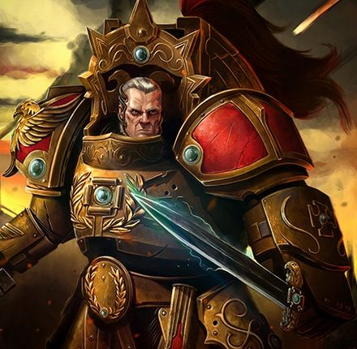

# 0625 凯卡尔图斯·达斯克 Caecaltus Dusk

精校状态：中文行文已逐段精校，部分术语仍为暂定

分类：人类帝国 / 禁军修会

原文来源：https://www.bilibili.com/opus/1067204991182176281

原作者：帝国神选罐头

原文时间：2025年05月15日 21:40

[返回分类目录](目录.md) · [全书目录](../../目录.md)

<!-- A0625-B0001 -->
**英文原文**

Caecaltus Dusk was a Custodes Proconsul of the Hetaeron Guard and Aquilon Terminator during the Horus Heresy.

<!-- /A0625-B0001 -->

<!-- A0625-B0002 -->

原译文

凯卡尔图斯·达斯克是荷鲁斯叛乱时期禁军伙友卫队和天鹰终结者的总督。

**校订译文**

凯卡尔图斯·达斯克是荷鲁斯之乱时期伴卫卫队的一名禁军执政官，也是一名天鹰终结者。

**校注：** Proconsul 为禁军职衔，采用禁军执政官，不与行星总督混同；Aquilon Terminator 描述他的装备／战士身份。

<!-- /A0625-B0002 -->

<!-- A0625-B0003 图片 -->

<!-- A0625-B0004 -->

原译文

Caecaltus Dusk 凯卡尔图斯·达斯克

**校订译文**

Caecaltus Dusk 凯卡尔图斯·达斯克

<!-- /A0625-B0004 -->

<!-- A0625-B0005 -->
## History 历史

<!-- /A0625-B0005 -->

<!-- A0625-B0006 -->
**英文原文**

By the the final stages of the Siege of Terra, Caecaltus alongside fellow Proconsul Uzkarel Ophite were the two sentinels closest to the Emperor directly on the steps of the Golden Throne. Upon the rousing of the Emperor to confront Horus aboard the Vengeful Spirit, Caecaltus was chosen by the Emperor to accompany Him in the teleportation assault. Before Malcador the Sigillite took the place of the Emperor on the Throne, he put his finger in his mouth and made his sigil with saliva upon Caecaltus' armour.

<!-- /A0625-B0006 -->

<!-- A0625-B0007 -->

原译文

在泰拉围城的最后阶段，凯卡尔图斯和他的战友乌兹卡雷尔·奥菲特总督是直接在黄金王座台阶上距离帝皇最近的两名哨卫。当帝皇起身跳帮复仇之魂号与荷鲁斯对峙时，凯卡尔图斯被帝皇选中陪同他进行传送攻击。在掌印者马卡多取代帝皇坐上王座之前，他把手指伸进嘴里，用唾液在凯卡尔图斯的盔甲上刻印。

**校订译文**

泰拉围城进入最后阶段时，凯卡尔图斯与另一位禁军执政官乌兹卡雷尔·奥菲特，站在黄金王座台阶上，担任距帝皇最近的两名哨卫。帝皇起身准备突袭复仇之魂号、迎战荷鲁斯时，选中凯卡尔图斯随行，参加传送突击。在马卡多代替帝皇登上王座之前，他先以手指蘸取唾液，在凯卡尔图斯的护甲上画下自己的印记。

<!-- /A0625-B0007 -->

<!-- A0625-B0008 -->
**英文原文**

Upon the teleportation aboard the Vengeful Spirit, Caecaltus succumbed to the Warp-sorcery of Horus alongside dozens of other Custodes. The Companions were then controlled by Horus into attacking the Emperor, blood flowing from their eyes at the effort to resist. Caecaltus was amongst the Custodes to survive the ordeal, and the lingering taint of Horus was expelled from him by the Emperor. However the shame of attacking his Master would never go away.

<!-- /A0625-B0008 -->

<!-- A0625-B0009 -->

原译文

在传送到复仇之魂号上后，凯卡尔图斯与其他数十名禁军一起屈服于荷鲁斯的亚空间魔法。然后，伙友被荷鲁斯控制，开始攻击帝皇，鲜血从他们的眼睛里流出，试图抵抗。凯卡尔图斯是在折磨中幸存下来的禁军之一，帝皇将荷鲁斯挥之不去的污点从他身上驱逐出去。然而，攻击主人的耻辱永远不会消失。

**校订译文**

传送至复仇之魂号后，凯卡尔图斯与其他数十名禁军一同遭到荷鲁斯的亚空间巫术控制。这些近侍被迫攻击帝皇，竭力抵抗控制时，眼中甚至流出鲜血。凯卡尔图斯最终活了下来，帝皇也将荷鲁斯残留的污染从他体内驱除。但他曾亲手攻击主人的耻辱，却再也无法洗去。

**校注：** 遭控制且抗拒，不是主动向荷鲁斯效忠；眼中流血的原因是奋力抵抗。

<!-- /A0625-B0009 -->

<!-- A0625-B0010 -->
**英文原文**

Dusk continued to accompany his master even as out of desperation, the Emperor began to drink from the Warp and transform into an entity dubbed the Dark King. This proto-god swelled with power to an extent that His very presence killed all Custodians around him save Dusk, who apparently had survived due to Malcador's earlier blessing. However Dusk was still a near-totally charred corpse, and acted as little more than a mouthpiece for the Emperor during His conversation with Ollanius Persson. After being convinced by Persson to abandon the power of the Dark King, the Emperor let out a blast of power that managed to heal Caecaltus.

<!-- /A0625-B0010 -->

<!-- A0625-B0011 -->

原译文

达斯克继续陪伴着他的主人，尽管出于绝望，帝皇开始吸收亚空间力量，变成了一个被称为黑暗之王的实体。这个原神的力量膨胀到一定程度，以至于他的存在杀死了他周围的所有禁军，除了达斯克，他显然是因为马卡多早些时候的祝福而幸存下来的。然而，达斯克仍然是一具几乎完全烧焦的尸体，在帝皇与欧兰尼奥斯·佩松的谈话中，它只不过是帝皇的喉舌。在被佩松说服放弃黑暗之王的力量后，帝皇释放了一股力量，成功治愈了凯卡尔图斯。

**校订译文**

帝皇在绝境中开始汲取亚空间力量，逐渐向被称作“黑暗之王”的存在转变，达斯克仍紧随左右。这个正在成形的神祇力量不断膨胀，仅仅是身处其近旁，就足以杀死其他禁军。唯有达斯克幸存，似乎是因为马卡多先前赐下的祝福。不过，他已经几乎变成一具完全焦黑的尸体；帝皇与欧良尼乌斯·佩松交谈时，他只能充当帝皇传话的喉舌。佩松终于说服帝皇放弃黑暗之王的力量，帝皇随后释放的一股能量也治愈了凯卡尔图斯。

**校注：** proto-god 为正在成形的神祇，非“原神”；nearly charred corpse 为濒死焦躯的描写，不能据此断言此时已经死亡。

<!-- /A0625-B0011 -->

<!-- A0625-B0012 -->
**英文原文**

Dusk, alongside Leetu, Garviel Loken, and the Emperor Himself ultimately faced Horus within Lupercal's Court aboard the Vengeful Spirit. After Horus grievously wounded the Emperor Dusk briefly stood between the traitorous Warmaster and his King. Defying Horus, Dusk was contemptuously hit with a blast of dark energy emitted from the Warmaster's great eye upon his breastplate. Much to Horus' shock Dusk survived, apparently due to the sigil Malcador had left upon him. Frustrated, Horus was able to gleam all 610 names Dusk had collected and used it to gain absolute power over the Custodian. Horus quickly recited all the names then let out a second blast that obliterated Dusk utterly.

<!-- /A0625-B0012 -->

<!-- A0625-B0013 -->

原译文

达斯克，与勒图、加维尔·洛肯和帝皇本人一起，最终在复仇之魂号上与卢佩卡尔王庭中的荷鲁斯对峙。荷鲁斯重伤帝皇后，达斯克短暂地站在叛徒战帅和他的王之间。抵抗荷鲁斯，达斯克被战帅胸甲上巨大的眼睛发出的一股黑暗能量轻蔑地击中了。令荷鲁斯震惊的是，达斯克幸存了下来，显然是因为马卡多留下的印记。沮丧之下，荷鲁斯得以亮出达斯克收集的所有610个名字，并利用这些名字获得了对禁军的绝对权力。荷鲁斯迅速吟诵了所有的名字，然后发出第二次爆炸，彻底抹去了达斯克。

**校订译文**

最终，达斯克与勒图、加维尔·洛肯及帝皇本人一同进入复仇之魂号的卢佩卡尔王庭，直面荷鲁斯。帝皇被重创后，达斯克站到叛变的战帅与自己的君主之间，拒绝退让。荷鲁斯轻蔑地从胸甲上的巨眼中发出一束黑暗能量，击中达斯克。令战帅震惊的是，他竟然活了下来，似乎仍受马卡多留下的印记保护。恼怒的荷鲁斯随即探知了达斯克积累的全部610个名字，借此彻底支配这名禁军。他迅速念出所有名字，再次释放黑暗能量，将达斯克彻底抹去。

**校注：** gleam 疑 glean 的笔误，意为探知全部名字，并非“亮出”。两次打击均为荷鲁斯释放的黑暗能量。

<!-- /A0625-B0013 -->

本篇核心术语与暂定项

以下列出本篇出现的英文原形及核心术语表用词。同形词可能指不同对象，具体词义以本篇正文和校注为准；单复数、别名和仅见于图注的名称可能尚未列入。完整候选见[术语表](../../术语表/双语术语候选.csv)。

| 英文 | 采用中文 | 状态 |
| --- | --- | --- |
| Terminator | 终结者 | 官方已核对 |
| Horus Heresy | 荷鲁斯之乱 | 官方已核对 |
| Warp | 亚空间 | 官方已核对 |
| Teleportation | 传送 | 暂定 |
| Emperor | 帝皇 | 官方已核对 |
| Terra | 泰拉 | 暂定·官方待核 |
| Horus | 荷鲁斯 | 暂定·官方待核 |
| Garviel Loken | 加维尔·洛肯 | 暂定·官方待核 |
| Vengeful Spirit | 复仇之魂号 | 暂定·官方待核 |
| Golden Throne | 黄金王座 | 暂定·官方待核 |
| Ollanius Persson | 欧良尼乌斯·佩松 | 官方词根参考·全名待核 |
| Malcador the Sigillite | 掌印者马卡多 | 暂定·官方待核 |
| Master | 导师（审判庭职衔）／舰务官（舰员职务） | 语境定译·官方待核 |
| Leetu | 勒图 | 暂定·官方待核 |
| Companions | 近侍 | 暂定·官方待核 |
| Hetaeron Guard | 伴卫卫队 | 暂定·官方待核 |
| Caecaltus Dusk | 凯卡尔图斯·达斯克 | 暂定·官方待核 |
| Lupercal | 卢佩卡尔 | 暂定·官方待核 |
| The Sigillite | 掌印者 | 暂定·官方待核 |
| Absolute | 绝对号 | 暂定·官方待核 |
| Proconsul | 总督 | 暂定·官方待核 |
| Dark King | 黑暗之王 | 暂定·官方待核 |
| Uzkarel Ophite | 乌兹卡雷尔·奥菲特 | 暂定·官方待核 |
| The Dark | 《黑暗》 | 暂定·官方待核 |
| Lupercal's Court | 卢佩卡尔王庭 | 暂定·官方待核 |

