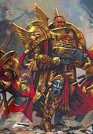

# 0626 戴克里先·科罗斯 Diocletian Coros

精校状态：中文行文已逐段精校，部分术语仍为暂定

分类：人类帝国 / 禁军修会

原文来源：https://www.bilibili.com/opus/1061864276679983123

原作者：帝国神选罐头

原文时间：2025年05月01日 12:15

[返回分类目录](目录.md) · [全书目录](../../目录.md)

<!-- A0626-B0001 -->
**英文原文**

Diocletian Coros was a Prefect of the Hykanatoi caste of the Custodian Guard during the Great Crusade and Horus Heresy.

<!-- /A0626-B0001 -->

<!-- A0626-B0002 -->

原译文

戴克里先·科罗斯是大远征和荷鲁斯叛乱时期禁军卫队卫士阶级的长官。

**校订译文**

戴克里先·科罗斯是大远征及荷鲁斯之乱时期帝皇禁军中亥卡纳托阶层的一名长官。

<!-- /A0626-B0002 -->

<!-- A0626-B0003 图片 -->

<!-- A0626-B0004 -->

原译文

Diocletian Coros 戴克里先·科罗斯

**校订译文**

Diocletian Coros 戴克里先·科罗斯

<!-- /A0626-B0004 -->

<!-- A0626-B0005 -->
## History 历史

<!-- /A0626-B0005 -->

<!-- A0626-B0006 -->
**英文原文**

Falling under the command of Tribune Ra Endymion, during the War Within the Webway Diocletian was charged with organizing a fresh wave of Imperial forces to resist the Chaos forces in the Webway including the condemned prisoners of House Vyridion. During the final battle for the portal Diocletian fought alongside both Ra and the Emperor himself, eventually managing to evacuate the Webway and make it back to Terra. After the battle the Emperor began showing visions of the past to Diocletian much as he had done with Ra, indicating that he had become Custodes Tribune following Ra's disappearance into the Webway.

<!-- /A0626-B0006 -->

<!-- A0626-B0007 -->

原译文

戴克里先在网道战争期间，在保民官拉·恩底弥翁的指挥下，被指示组织新一轮的帝国军队，以抵抗网道的混沌势力，包括维里迪恩家族的死囚。在门户的最后一场战斗中，戴克里先与拉和帝皇本人并肩作战，最终设法撤离网道并将其带回泰拉。战争结束后，帝皇开始向戴克里先展示过去的景象，就像他对拉所做的那样，表明在拉消失在网道之后，他已经成为了禁军保民官。

**校订译文**

网道战争期间，戴克里先受护民官拉·恩底弥翁指挥，负责组织新一批帝国兵力，抵挡网道中的混沌军队；这批援军也包括维里迪恩家族的死囚。在争夺门户的最后一战中，他与拉及帝皇本人并肩作战，最终成功撤出网道，返回泰拉。战后，帝皇开始像此前向拉展示往昔景象一样，让戴克里先看到过去。这暗示拉消失在网道后，戴克里先已接任禁军护民官。

**校注：** 死囚属于戴克里先征集的帝国援军，非混沌势力；make it back 指本人成功返回。原文将护民官继任视作帝皇展示幻象所暗示的结论，故保留推断措辞。

<!-- /A0626-B0007 -->

<!-- A0626-B0008 -->
**英文原文**

Now the sole remaining Tribune, Diocletian commanded Custodes forces of the Inner Palace during the Siege of Terra and oversaw the defense of the Eternity Gate alongside Sanguinius. As Daemons began manifesting inside the Sanctum itself, Coros went off to seek a "good death", wishing Malcador the same. Diocletian accompanied the Emperor during the teleportation assault aboard the Vengeful Spirit, becoming scattered from his liege-lord and fighting alongside Constantin Valdor. Finding total madness aboard the Vengeful Spirit, the Custodians were forced to fight in pitch-black against waves of Daemons. During the fighting, Coros was brought down despite Valdor's attempts to save him.

<!-- /A0626-B0008 -->

<!-- A0626-B0009 -->

原译文

戴克里先现在是唯一剩下的保民官，他在泰拉围城期间指挥了内殿的禁军部队，并与圣吉列斯一起监督了永恒之门的防御。当恶魔开始在圣所内显现时，科罗斯去寻求“好的死亡”，希望马卡多也一样。戴克里先在复仇之魂号上的传送攻击中陪同帝皇，从他的领主身边散开，与康斯坦丁·瓦尔多并肩作战。发现复仇之魂号上完全疯了，禁军们被迫在漆黑中与恶魔浪潮作战。在战斗中，尽管瓦尔多试图营救科罗斯，但科罗斯还是被击倒了。

**校订译文**

作为仅存的护民官，戴克里先在泰拉围城期间指挥内皇宫的禁军，与圣吉列斯共同主持永恒之门的防御。当恶魔开始在圣所内部显现时，科罗斯动身去求一个“死得其所”，并祝愿马卡多也能如此。随后，他随帝皇传送突袭复仇之魂号，却与主君失散，转而同康斯坦丁·瓦尔多并肩作战。舰上一切已陷入彻底的疯狂，禁军被迫在伸手不见五指的黑暗中迎击一波波恶魔。战斗中，尽管瓦尔多试图救他，科罗斯还是被打倒了。

<!-- /A0626-B0009 -->

<!-- A0626-B0010 -->
**英文原文**

Coros and a few other surviving Custodes later make it to Lupercal's Court, where they discover Valdor, Dorn, Garviel Loken, and Leetu with the bodies of Horus and the Emperor. Coros is able to initiate the teleportation that brings the loyalists back to the Imperial Palace.

<!-- /A0626-B0010 -->

<!-- A0626-B0011 -->

原译文

科罗斯和其他几名幸存的禁军后来来到卢佩卡尔王庭，在那里他们发现了瓦尔多、多恩、加维尔·洛肯和勒图以及荷鲁斯和帝皇的尸体。科罗斯能够启动传送，将忠诚者带回皇宫。

**校订译文**

后来，科罗斯与另外几名幸存的禁军抵达卢佩卡尔王庭，发现瓦尔多、多恩、加维尔·洛肯和勒图正守着荷鲁斯与帝皇的躯体。科罗斯启动传送，将忠诚者带回皇宫。

**校注：** bodies 在这里指躯体；不能因英文复数而将当时尚有生命的帝皇译成尸体。上段 brought down 也只指被打倒，未断言科罗斯阵亡。

<!-- /A0626-B0011 -->

<!-- A0626-B0012 -->
## Legacy 遗产

<!-- /A0626-B0012 -->

<!-- A0626-B0013 -->
**英文原文**

Diocletian was noted for being one of the few Custodes capable of dreaming and they were reverently written to script. These scripts were then buried in the deepest vaults of the Imperial Palace's Inner Palace, along with the recorded dreams of other Custodes. Later on in his career, Diocletian wrote a seminal work dubbed The Master of Mankind. The book was still read by the Custodes 10,000 years later.

<!-- /A0626-B0013 -->

<!-- A0626-B0014 -->

原译文

戴克里先是为数不多的能够做梦的禁军之一，它们被虔诚地写成了剧本。这些手稿随后被埋葬在皇宫内殿最深的地窖里，还有其他禁军的记录的梦。在戴克里先的职业生涯后期，他写了一部具有开创性的作品，名为《人类之主》。一万年后，这本书仍被禁军阅读。

**校订译文**

戴克里先是少数能够做梦的禁军之一，他的梦境被人郑重地记录成文。这些记录与其他禁军的梦境记录一起，封存于皇宫内皇宫最深处的密库。他后来还撰写了具有开创性的著作《人类之主》；一万年后，禁军仍在阅读这本书。

**校注：** script 指文字记录而非剧本；buried 于密库语境译封存。

<!-- /A0626-B0014 -->

<!-- A0626-B0015 -->
## Trivia 琐事

<!-- /A0626-B0015 -->

<!-- A0626-B0016 -->
**英文原文**

The Hikanatoi were an elite Byzantine guard unit during the Middle Ages.

<!-- /A0626-B0016 -->

<!-- A0626-B0017 -->

原译文

希卡纳托伊（得力干将）是中世纪拜占庭的一支精英卫队。

**校订译文**

希卡纳托伊是中世纪拜占庭的一支精锐卫队。

**校注：** Hikanatoi 为此处真实历史词形，正文虚构阶层拼作 Hykanatoi；保留两者字形区别。原文没有“得力干将”的括注，移除未经本段支持的附加释义。

<!-- /A0626-B0017 -->

本篇核心术语与暂定项

以下列出本篇出现的英文原形及核心术语表用词。同形词可能指不同对象，具体词义以本篇正文和校注为准；单复数、别名和仅见于图注的名称可能尚未列入。完整候选见[术语表](../../术语表/双语术语候选.csv)。

| 英文 | 采用中文 | 状态 |
| --- | --- | --- |
| Horus Heresy | 荷鲁斯之乱 | 官方已核对 |
| Webway | 网道 | 暂定 |
| Teleportation | 传送 | 暂定 |
| Emperor | 帝皇 | 官方已核对 |
| Great Crusade | 大远征 | 暂定·官方待核 |
| Terra | 泰拉 | 暂定·官方待核 |
| Horus | 荷鲁斯 | 暂定·官方待核 |
| Garviel Loken | 加维尔·洛肯 | 暂定·官方待核 |
| Vengeful Spirit | 复仇之魂号 | 暂定·官方待核 |
| Master | 导师（审判庭职衔）／舰务官（舰员职务） | 语境定译·官方待核 |
| Leetu | 勒图 | 暂定·官方待核 |
| Custodian Guard | 禁军卫队 | 官方已核对 |
| Tribune | 护民官 | 暂定·官方待核 |
| Hykanatoi | 亥卡纳托 | 暂定·官方待核 |
| Diocletian Coros | 戴克里先·科罗斯 | 暂定·官方待核 |
| Lupercal | 卢佩卡尔 | 暂定·官方待核 |
| Constantin Valdor | 康斯坦丁·瓦尔多 | 暂定·官方待核 |
| Initiate | 正式成员 | 暂定·官方待核 |
| Sanctum | 圣所星 | 暂定·官方待核 |
| Ra Endymion | 拉·恩底弥翁 | 暂定·官方待核 |
| Prefect | 长官 | 暂定·官方待核 |
| House Vyridion | 维里迪恩家族 | 暂定·官方待核 |
| Lupercal's Court | 卢佩卡尔王庭 | 暂定·官方待核 |
| Inner Palace | 内殿 | 暂定·官方待核 |
| Eternity Gate | 永恒之门 | 暂定·官方待核 |

