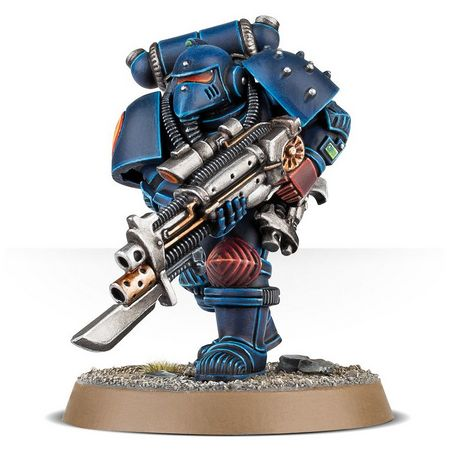
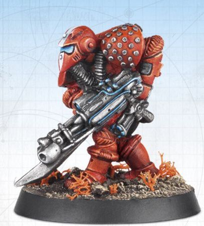

# 0631 勒图 Leetu

精校状态：中文行文已逐段精校，部分术语仍为暂定

分类：人类帝国 / 星际战士(包括CSM)

原文来源：https://www.bilibili.com/opus/1068932177932058624

原作者：帝国神选罐头

原文时间：2025年05月20日 13:22

[返回分类目录](目录.md) · [全书目录](../../目录.md)

<!-- A0631-B0001 -->
**英文原文**

Leetu or "LE 2" was a prototype Space Marine legionary who had sworn to protect the Perpetual Erda before the start of the Great Crusade.

<!-- /A0631-B0001 -->

<!-- A0631-B0002 -->

原译文

勒图或“LE 2”是一名原型星际战士军团士兵，在大远征开始前发誓要保护永生者尔达。

**校订译文**

勒图或“LE 2”是一名原型星际战士军团士兵，在大远征开始前发誓要保护永生者尔达。

<!-- /A0631-B0002 -->

<!-- A0631-B0003 图片 -->

<!-- A0631-B0004 -->

原译文

LE2 Imperial Space Marine LE2帝国星际战士

**校订译文**

LE2 Imperial Space Marine LE2帝国星际战士

<!-- /A0631-B0004 -->

<!-- A0631-B0005 -->
## History 历史

<!-- /A0631-B0005 -->

<!-- A0631-B0006 -->
**英文原文**

Leetu was among the first successful legionary templates, created using the gene-stock of the Emperor and Erda before they used the technique to create the Primarchs. As such, he considers them to be his parents, but his loyalty is only to Erda. This occurred after she became disillusioned with the grim future the Emperor intended for the Primarchs and scattered them into the warp before escaping the Imperial Palace. Leetu defended her from that day forth and swore to protect her from the Emperor or anyone else who sought to harm her. When Erda told John Grammaticus that Ollanius Persson was due to arrive on Terra in two weeks, she gave Leetu to the perpetual to serve as his protector. Leetu continued to protect John when they searched for Ollanius, eventually finding a group of Calth survivors and continuing on in their quest alongside Actaea and a Space Marine identifying himself as Alpharius. During their journey to the Sanctum Imperialis, Leetu expressed some memories of his past, including that he once liked to draw and revealing he still partook in the hobby.

<!-- /A0631-B0006 -->

<!-- A0631-B0007 -->

原译文

勒图是首批成功的军团士兵模板之一，在帝皇和尔达使用该技术创建原体之前，使用他们的基因库创建。因此，他认为他们是他的父母，但他只忠于尔达。这发生在她对帝皇为原体所设想的残酷未来感到幻灭之后，并在逃离皇宫之前将他们分散到亚空间中。从那天起，勒图为她辩护，并发誓要保护她免受帝皇或任何试图伤害她的人的伤害。当尔达告诉约翰·格拉马迪库斯欧兰尼奥斯·佩松将在两周后抵达泰拉时，她把勒图交给了永生者作为守护者。勒图在寻找欧兰尼奥斯时继续保护约翰，最终找到了一群考斯幸存者，并与阿克泰娅和一名自称为阿尔法瑞斯的星际战士一起继续他们的探索。在前往帝国圣殿的旅途中，勒图表达了他对过去的一些回忆，包括他曾经喜欢画画，并透露他仍然有这个爱好。

**校订译文**

勒图是首批成功培育的军团士兵原型之一。他由帝皇与尔达的基因材料创造，时间早于二人使用同一技术创造原体。因此，他将二人视为父母，却只忠于尔达。尔达对帝皇为原体规划的严酷未来彻底失望，于是将原体散入亚空间，并逃离皇宫。自那以后，勒图便守护着她，发誓阻止帝皇或任何其他人伤害她。后来，尔达告诉约翰·格拉马迪库斯，欧良尼乌斯·佩松将在两周后抵达泰拉，并让勒图跟随这位永生者，担任他的护卫。勒图随约翰寻找欧良尼乌斯，途中遇到一群考斯幸存者，并与阿克泰及一名自称阿尔法瑞斯的星际战士结伴前行。前往帝国圣所的途中，勒图谈起往事，说自己曾喜欢画画，而且至今仍保有这一爱好。

**校注：** 英文 Actaea、下段 Actae 为同一人物的拼写变体，中文统一阿克泰。原文 This occurred 的指代较松散，依后接 defended her from that day forth，译为勒图转而守护尔达发生于她离宫之后；不将勒图的培育年代错误后移。

<!-- /A0631-B0007 -->

<!-- A0631-B0008 -->
**英文原文**

Leetu accompanied the group into the Imperial Dungeon, eventually reaching the Golden Throne alongside the other "Argonauts", but discovering that the Emperor had gone to fight Horus aboard the Vengeful Spirit. Nonetheless, the group continued on their quest in search of a new plan of action. It was then that they encountered Erebus on the walls of the Imperial Palace. During the subsequent struggle, all of the group save Ollanius, John, and Leetu were slain while Actae was buried under rubble. Leetu and John managed to break a despondent Ollanius out of his despair and continue on with their mission, and the Space Marine nearly gave his life to save them from a group of frenzied Word Bearers. While badly injured, Leetu still helped Ollanius in confronting the Emperor as He appeared as the proto-Dark King. The Emperor seemed to recognize Leetu by name, and together with Garviel Loken the group were able to convince the Emperor to give up the Warp power He had absorbed in order to avoid corruption. Leetu and Loken then went with the Emperor to confront Horus while John and Ollanius were ordered to stay behind.

<!-- /A0631-B0008 -->

<!-- A0631-B0009 -->

原译文

勒图陪同这群人进入了帝国地牢，最终与其他“阿尔戈英雄”一起登上了黄金王座，但发现帝皇已经跳帮复仇之魂号去与荷鲁斯作战。尽管如此，这群人仍在继续寻找新的行动计划。就在那时，他们在皇宫城墙上遇到了艾瑞巴斯。在随后的战斗中，除了欧兰尼奥斯、约翰和勒图之外，所有人都被杀害，而阿克泰则被埋在瓦砾下。勒图和约翰设法让沮丧的欧兰尼奥斯摆脱了绝望，继续他们的任务，而星际战士几乎献出了自己的生命，将他们从一群疯狂的怀言者手中拯救出来。虽然受了重伤，但勒图仍然帮助欧兰尼奥斯对抗帝皇，因为他以原初黑暗之王的身份出现。帝皇似乎认出了勒图的名字，他们与加维尔·洛肯一起说服帝皇放弃他为避免腐化而吸收的亚空间力量。勒图和洛肯随后与帝皇一起去对抗荷鲁斯，而约翰和欧兰尼奥斯则被命令留下来。

**校订译文**

勒图随众人进入帝国地牢，与其他“阿尔戈英雄”一路来到黄金王座前，却发现帝皇已登上复仇之魂号，前去迎战荷鲁斯。他们继续寻找新的行动办法，随后在皇宫城墙上遭遇艾瑞巴斯。冲突过后，欧良尼乌斯、约翰与勒图幸存，阿克泰被埋在瓦砾下，其余同行者全部遇害。勒图和约翰设法让心灰意冷的欧良尼乌斯振作起来，继续执行使命；勒图随后又几乎付出性命，才将他们从一群狂乱的怀言者手中救出。尽管重伤，他仍协助欧良尼乌斯面对已显现出黑暗之王雏形的帝皇。帝皇似乎认得勒图，还叫出了他的名字。众人与加维尔·洛肯一道，说服帝皇放弃已吸收的亚空间力量，以免受到腐化。勒图与洛肯随后陪同帝皇前去迎战荷鲁斯，约翰与欧良尼乌斯则奉命留在后方。

**校注：** reaching the Golden Throne 是到达王座所在处，并非坐上王座。放弃亚空间力量的目的是避免腐化，原译反写成“为了避免腐化而吸收力量”。原文先称除三人外全部死亡，随即单列阿克泰被埋，译文将这项例外单列，避免把“被埋”擅定为已死。

<!-- /A0631-B0009 -->

<!-- A0631-B0010 图片 -->

<!-- A0631-B0011 -->

原译文

LE2 Imperial Space Marine LE2帝国星际战士

**校订译文**

LE2 Imperial Space Marine LE2帝国星际战士

<!-- /A0631-B0011 -->

<!-- A0631-B0012 -->
**英文原文**

Leetu joined the Emperor, Loken, and Caecaltus Dusk in battling Horus within Lupercal's Court. However, the three lesser warriors were easily blasted away by Horus, and Leetu found himself before the strung-up corpse of Sanguinius. Leetu saved Sanguinius's corpse from being devoured by daemons and cut down the dead Primarch. He then aided the defeated Emperor in freeing him from the throne Horus had nailed him as Dusk sacrificed himself as a distraction. However, he was discovered by Horus, informed of Erda's death at the hands of Erebus, and thrown into the shadows surrounding Lupercal's Court. Leetu found himself face-to-face with the four Gods of Chaos.

<!-- /A0631-B0012 -->

<!-- A0631-B0013 -->

原译文

勒图加入了帝皇、洛肯和凯卡尔图斯·达斯克在卢佩卡尔王庭内与荷鲁斯作战。然而，三个较弱的战士很容易被荷鲁斯炸倒，勒图发现自己在圣吉列斯的尸体前。勒图救了圣吉列斯的尸体免于被恶魔吞噬并削减死去的原体。然后，他帮助战败的帝皇将他从荷鲁斯钉在他身上的王座上解放出来，因为达斯克牺牲了自己作为分散注意力。然而，他被荷鲁斯发现，得知尔达死于艾瑞巴斯之手，并被扔进了卢佩卡尔王庭周围的阴影中。勒图发现自己与混沌四神面对面。

**校订译文**

勒图随帝皇、洛肯和凯卡尔图斯·达斯克进入卢佩卡尔王庭，迎战荷鲁斯。然而，荷鲁斯轻易便将帝皇之外的三名战士轰飞。勒图落在被吊起的圣吉列斯遗体旁，阻止恶魔吞噬遗体，并将死去的原体解下放下。随后，达斯克牺牲自己引开荷鲁斯的注意，勒图则趁机帮助战败的帝皇挣脱被钉在其上的王座。但荷鲁斯发现了他，告诉他尔达已死于艾瑞巴斯之手，并将他扔进王庭周围的阴影。勒图在那里直面混沌四神。

**校注：** cut down 指把悬挂的遗体解下，不是砍削遗体；荷鲁斯将帝皇钉在王座上，而非把王座钉在帝皇身上。

<!-- /A0631-B0013 -->

<!-- A0631-B0014 -->
**英文原文**

Miraculously, Leetu survived his brief encounter with the Ruinous Powers, as they quickly recoiled following Horus's death at the Emperor's hands. He teleported back into the Imperial Palace with Rogal Dorn, Valdor, and the other scant survivors of the boarding action. He produced a tarot card of The Throne which had been discovered near the Emperor's body, helping convince Dorn and the others that the Emperor could be saved from death by being placed on the Golden Throne.

<!-- /A0631-B0014 -->

<!-- A0631-B0015 -->

原译文

奇迹般地，勒图在与毁灭力量的短暂相遇中幸存下来，因为荷鲁斯在帝皇手中死去后，他们迅速退缩。他和罗格·多恩、瓦尔多和其他跳帮行动中幸存下来的少数人一起被传送回了皇宫。他制作了一张在帝皇尸体附近发现的王座塔罗牌，帮助多恩和其他人相信，帝皇可以通过登上黄金王座而免于死亡。

**校订译文**

荷鲁斯被帝皇杀死后，毁灭诸神迅速退去，勒图奇迹般地从这场短暂的会面中活了下来。他与罗格·多恩、瓦尔多，以及登舰行动中所剩无几的其他幸存者一起，传送返回皇宫。他拿出一张在帝皇身旁发现的“王座”塔罗牌，帮助多恩等人相信，将帝皇安置在黄金王座上就可能保住他的性命。

**校注：** produced 在此指拿出既有纸牌，不是制作；正文未确认谁在何时发现此牌。

<!-- /A0631-B0015 -->

<!-- A0631-B0016 -->
**英文原文**

Leetu survived the Heresy, and after the Siege of Terra was found sitting in a room alone waiting to be interrogated, sorting through a tarot deck he had created through his old collection and those found aboard the Vengeful Spirit.

<!-- /A0631-B0016 -->

<!-- A0631-B0017 -->

原译文

勒图在叛乱中幸存下来，在泰拉围城后被发现他独自坐在一个房间里等待审问，正在整理一副塔罗牌，这副塔罗牌由他以往的收藏以及在复仇之魂号上找到的牌组成。

**校订译文**

勒图在叛乱中幸存。泰拉围城结束后，人们发现他独自坐在房间里等候审讯，一边整理一副塔罗牌。这副牌由他过去的收藏与在复仇之魂号上拾得的纸牌拼成。

<!-- /A0631-B0017 -->

<!-- A0631-B0018 -->
## Wargear 武器装备

原题：Wargear 战备

<!-- /A0631-B0018 -->

<!-- A0631-B0019 -->
**英文原文**

Leetu was armed with an ancient M676 Union Model bolt pistol which was made before the Imperium's accord with Mars. He also wore a beak-helmed pale silver suit of power armour that bore a small stamp of LE 2, which he takes his name from.

<!-- /A0631-B0019 -->

<!-- A0631-B0020 -->

原译文

勒图配备了一把古老的M676联盟型号爆矢手枪，该手枪是在帝国与火星达成协议之前制造的。他还穿着一套带喙头盔的淡银色动力盔甲，上面有一个LE 2的小印记，他的名字就是从LE 2来的。

**校订译文**

勒图使用一把古老的 M676 联盟型爆矢手枪，制造时间早于帝国与火星缔结协定。他身穿浅银色动力甲，头盔呈鸟喙状，甲上印着小小的“LE 2”标记；他的名字正是由这一编号而来。

<!-- /A0631-B0020 -->

<!-- A0631-B0021 -->
**英文原文**

He later wielded Loken's blade Mourn-It-All during the final battle aboard the Vengeful Spirit, but it is unknown if he kept it after the battle.

<!-- /A0631-B0021 -->

<!-- A0631-B0022 -->

原译文

后来，他在复仇之魂号上的最后一场战斗中挥舞着洛肯的刀刃“哀悼一切”，但尚不清楚他是否在战斗后保留了这把刀。

**校订译文**

在复仇之魂号上的最终一战中，他还使用了洛肯的剑“哀悼一切”。战后他是否保留了这把剑，仍不得而知。

<!-- /A0631-B0022 -->

<!-- A0631-B0023 -->
## Trivia 琐事

<!-- /A0631-B0023 -->

<!-- A0631-B0024 -->
**英文原文**

Leetu's designation LE2 is likely a callback to the 1985 Imperial Space Marine miniature released by Games Workshop. The miniature, part of a line known as LE2 (Limited Edition 2), predates even the release of the 1st Edition and was one of the first Space Marine figures released.

<!-- /A0631-B0024 -->

<!-- A0631-B0025 -->

原译文

勒图的命名LE2可能是对GW发布的1985年帝国星际战士微型模型的回收。这个迷你模型是LE2（限量版2）系列的一部分，甚至早于第一版的发布，是首批发布的星际战士人物之一。

**校订译文**

勒图的编号 LE2 很可能是在呼应 Games Workshop 于 1985 年推出的帝国星际战士模型。该模型属于 LE2（Limited Edition 2，限量版 2）系列，发布时间甚至早于游戏第一版，也是最早的一批星际战士模型之一。

<!-- /A0631-B0025 -->

本篇核心术语与暂定项

以下列出本篇出现的英文原形及核心术语表用词。同形词可能指不同对象，具体词义以本篇正文和校注为准；单复数、别名和仅见于图注的名称可能尚未列入。完整候选见[术语表](../../术语表/双语术语候选.csv)。

| 英文 | 采用中文 | 状态 |
| --- | --- | --- |
| Bolt Pistol | 爆矢手枪 | 官方已核对 |
| Warp | 亚空间 | 官方已核对 |
| Imperium | 帝国 | 暂定·简称 |
| Emperor | 帝皇 | 官方已核对 |
| Primarch | 原体 | 官方已核对 |
| Word Bearers | 怀言者 | 暂定·官方待核 |
| Great Crusade | 大远征 | 暂定·官方待核 |
| Terra | 泰拉 | 暂定·官方待核 |
| Horus | 荷鲁斯 | 暂定·官方待核 |
| Erebus | 艾瑞巴斯 | 暂定·官方待核 |
| Garviel Loken | 加维尔·洛肯 | 暂定·官方待核 |
| Vengeful Spirit | 复仇之魂号 | 暂定·官方待核 |
| Golden Throne | 黄金王座 | 暂定·官方待核 |
| Perpetual | 永生者 | 暂定·官方待核 |
| John Grammaticus | 约翰·格拉马迪库斯 | 暂定·官方待核 |
| Ollanius Persson | 欧良尼乌斯·佩松 | 官方词根参考·全名待核 |
| Erda | 尔达 | 暂定·官方待核 |
| Protector | 守护者 | 暂定·官方待核 |
| Mars | 火星 | 暂定·官方待核 |
| Calth | 考斯 | 暂定·官方待核 |
| Stamp | 印块 | 暂定·官方待核 |
| Mission | 教团／传教机构 | 暂定 |
| Leetu | 勒图 | 暂定·官方待核 |
| Ancient | 旗手 | 官方已核对 |
| Caecaltus Dusk | 凯卡尔图斯·达斯克 | 暂定·官方待核 |
| Lupercal | 卢佩卡尔 | 暂定·官方待核 |
| The Primarchs | 原体 | 暂定·官方待核 |
| Power Armour | 动力盔甲 | 暂定·官方待核 |
| Space Marine | 星际战士 | 暂定·官方待核 |
| Emperor's Hands | 帝皇之手 | 暂定·官方待核 |
| Powers | 能天使 | 暂定·官方待核 |
| Alpharius | 阿尔法瑞斯 | 暂定·官方待核 |
| Actaea | 阿克泰 | 暂定·官方待核 |
| Ruinous Powers | 毁灭诸力 | 暂定·官方待核 |
| Imperialis | 帝国徽记 | 暂定·官方待核 |
| Sanctum | 圣所星 | 暂定·官方待核 |
| Sanctum Imperialis | 帝国圣所 | 暂定·官方待核 |
| Dark King | 黑暗之王 | 暂定·官方待核 |
| Actae | 阿克泰 | 暂定·官方待核 |
| Mourn-It-All | 哀悼一切 | 暂定·官方待核 |
| Corruption | 腐败 | 暂定·官方待核 |
| Bolt | 爆矢 | 暂定·官方待核 |
| Lupercal's Court | 卢佩卡尔王庭 | 暂定·官方待核 |
| Games Workshop | Games Workshop | 暂定·官方待核 |
| Imperial Dungeon | 帝国地牢 | 暂定·官方待核 |

