# 0632 莱昂·艾尔’庄森 Lion El'Jonson

精校状态：中文行文已逐段精校，部分术语仍为暂定

分类：人类帝国 / 黑暗天使

原文来源：https://www.bilibili.com/opus/1082419135408766984

原作者：帝国神选罐头

原文时间：编辑于 2025年07月15日 13:18

[返回分类目录](目录.md) · [全书目录](../../目录.md)

原篇名：莱昂·艾尔庄森 Lion El'Jonson

<!-- A0632-B0001 -->
**英文原文**

"Loyalty is its own reward"

<!-- /A0632-B0001 -->

<!-- A0632-B0002 -->

原译文

“忠诚本身就是回报”

**校订译文**

“忠诚本身就是回报”

<!-- /A0632-B0002 -->

<!-- A0632-B0003 -->
**英文原文**

Lion El'Jonson, also known as The Lion and The First, is the Primarch of the Dark Angels. He was scattered along with the other Primarchs to the far corners of the galaxy. He finally came to rest on the world Caliban, a beautiful but blighted world tainted by Chaos due to its proximity to the Eye of Terror. Lion El'Jonson was renowned for a level of strategic brilliance and martial prowess that was rivaled perhaps only by Horus, but was distrusted by his brother Primarchs for his secretive and taciturn nature. The Chaos emissary to Lorgar called him the Duelist.

<!-- /A0632-B0003 -->

<!-- A0632-B0004 -->

原译文

莱昂·艾尔庄森，也被称为狮子或首子，是黑暗天使的原体。他和其他原体分散在银河系的各个角落。他最终降落在卡利班世界，这是一个美丽但被混沌污染的世界，因为它靠近恐惧之眼。莱昂·艾尔庄森以其卓越的战略才华和军事实力而闻名，也许只有荷鲁斯才能与之匹敌，但他的兄弟原体因其隐秘和沉默寡言的天性而不信任他。混沌派前往洛加的使者称他为决斗者。

**校订译文**

莱昂·艾尔’庄森又称“雄狮”与“首子”，是黑暗天使的原体。他与其他原体一同被散落到银河偏远地区，最终降在卡利班。这颗世界虽美丽，却因靠近恐惧之眼而饱受混沌污染。莱昂以卓越的战略才智与武艺闻名，或许只有荷鲁斯能与之匹敌；然而，他行事隐秘、寡言少语，因而不受其他原体兄弟信任。向珞珈传达意旨的混沌使者称他为“决斗者”。

<!-- /A0632-B0004 -->

<!-- A0632-B0005 图片 -->
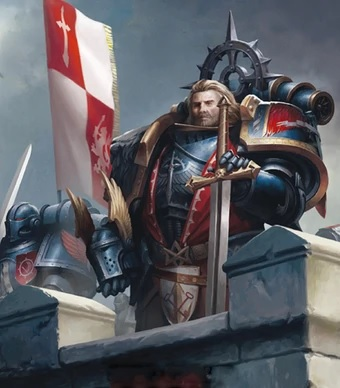

<!-- A0632-B0006 -->

原译文

Lion El'Jonson during the Great Crusade 大远征期间的莱昂·艾尔庄森

**校订译文**

Lion El'Jonson during the Great Crusade 大远征期间的莱昂·艾尔’庄森

<!-- /A0632-B0006 -->

<!-- A0632-B0007 -->
**英文原文**

Having disappeared for ten millennia following the Destruction of Caliban after the Horus Heresy, The Lion has finally returned to the Imperium following the Arks of Omen Campaign.

<!-- /A0632-B0007 -->

<!-- A0632-B0008 -->

原译文

在荷鲁斯叛乱摧毁卡利班后消失了一万年，莱昂终于在噩兆方舟战役后回到了帝国。

**校订译文**

荷鲁斯之乱结束后，卡利班毁灭，雄狮也随之消失了整整一万年。直到噩兆方舟战役之后，他终于重返帝国。

**校注：** 英文 Destruction of Caliban after the Horus Heresy 指卡利班的毁灭发生在叛乱后，非“荷鲁斯叛乱摧毁卡利班”。

<!-- /A0632-B0008 -->

<!-- A0632-B0009 -->
## History 历史

<!-- /A0632-B0009 -->

<!-- A0632-B0010 -->
### Youth 青年

<!-- /A0632-B0010 -->

<!-- A0632-B0011 -->
**英文原文**

Jonson's capsule landed in a remote area of Caliban, far from any human habitation. There are no records of how he survived or what he encountered in the jungle during his early years and any normal man would have died within minutes of being exposed to the planet. Yet live he did for a decade in the jungle, alone and with no one to aid him. It would not be till the end of this decade that he would encounter his first humans. On that day Jonson was found by a group of warrior knights of The Order during one of their quests across the planet. The young Primarch was already larger than a normal man, wounded by a Bolt Weapon fired from one of the knights and covered in the blood of one of the Great Beasts. While the knights prepared to kill Jonson, one of their number, a man named Luther, sensed something not immediately apparent about this seemingly wild man and prevented his fellow knights from attacking. Despite the Primarch's near-feral state, Luther was able to slowly convince the savage man to come with him. Taking him out of the forest Luther and the band then brought Jonson back to their Fortress Monastery and there Luther named him 'Lion El'Jonson' which means The Lion, the Son of the Forest both in honor of the circumstances they found him in and in honor of his fierceness which reminded Luther of the most feared of the Great Beasts, the Calibanite Lion.

<!-- /A0632-B0011 -->

<!-- A0632-B0012 -->

原译文

庄森的空投舱降落在卡利班的一个偏远地区，远离任何人类居住地。没有关于他早年如何幸存或在丛林中遇到什么的记录，任何正常人都会在暴露于星球的几分钟内死亡。然而，他在丛林中独自生活了十年，没有人帮助他。直到十年的最后一年，他才遇到第一批人类。那天，庄森被一群骑士团的战斗骑士在他们的一次行星任务中发现。年轻的原体已经比正常人大了，他被一名骑士发射的爆矢武器打伤，身上沾满了一头巨兽的鲜血。当骑士们准备杀死庄森时，他们中的一个名叫卢瑟的人感觉到这个看似野蛮的人身上有些不明显的东西，并阻止了他的骑士同伴进攻。尽管这位原体近乎野蛮，卢瑟还是能够慢慢说服这个野蛮人和他一起去。卢瑟和小队把他带出森林，然后把庄森带回了他们的堡垒修道院，在那里，卢瑟给他起名叫“莱昂·艾尔庄森”，意思是狮子，森林之子，既是为了纪念他们发现他的环境，也是为了纪念他的凶猛，这让卢瑟想起了最可怕的巨兽，卡利班狮。

**校订译文**

庄森的育婴舱降在卡利班偏远地区，远离人烟。没有记录说明他早年如何生存，又在丛林中遭遇过什么；普通人在那里暴露几分钟便会丧命，他却无依无靠地独自活了十年。直到这十年将尽时，他才第一次遇到人类：一支骑士团的骑士队伍在巡行冒险途中发现了他。年轻原体的体型已超过常人，身上沾满一头巨兽的血，又被其中一名骑士的爆矢武器击伤。骑士们正准备杀死这个看似野人的少年，卢瑟却察觉到他身上非同寻常的特质，制止了同伴。尽管原体几近野兽，卢瑟仍耐心地说服他随行。众人将他带出森林，带回要塞修道院。卢瑟给他取名“莱昂·艾尔’庄森”，意为“狮子，森林之子”，既纪念他们发现他的情景，也赞颂他的凶猛——这让卢瑟想起最令人畏惧的巨兽：卡利班狮。

<!-- /A0632-B0012 -->

<!-- A0632-B0013 图片 -->
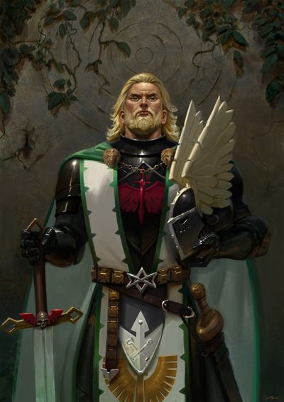

<!-- A0632-B0014 -->

原译文

Young Lion El'Jonson 青年莱昂·艾尔庄森

**校订译文**

Young Lion El'Jonson 青年莱昂·艾尔’庄森

<!-- /A0632-B0014 -->

<!-- A0632-B0015 -->
**英文原文**

Lion El'Jonson quickly grew up under the care of Luther and adapted to the customs of the planet's inhabitants, learning to speak at an extremely rapid speed, though he never would speak of his first ten years of life. Luther and Jonson formed a strong friendship that complimented each other's abilities and skills. It was now that Jonson's primary skills were discovered. He was a brilliant strategist and unstoppable once he decided on a course of action. Together, the two warriors rose through the ranks of the Order and spread the name of the Order through the quests they undertook together.

<!-- /A0632-B0015 -->

<!-- A0632-B0016 -->

原译文

莱昂·艾尔庄森在卢瑟的照顾下迅速长大，适应了行星居民的习俗，以极快的速度学习说话，尽管他永远不会谈论自己生命的前十年。卢瑟和庄森建立了深厚的友谊，彼此的能力和技能相得益彰。现在，庄森的主要技能被发现了。他是一位杰出的战略家，一旦决定采取行动，就势不可挡。这两名战士一起在骑士团中崛起，并通过他们共同承担的任务传播了骑士团的名字。

**校订译文**

在卢瑟照料下，莱昂迅速成长，适应了当地习俗，并以惊人的速度学会语言，却始终不肯谈起人生最初的十年。卢瑟与庄森结下深厚友谊，彼此的能力恰能互补。庄森的天赋逐渐显露：他是杰出的战略家，一旦决意采取行动便无人能阻。二人在骑士团中不断晋升，共同完成的冒险也使骑士团声名远扬。

<!-- /A0632-B0016 -->

<!-- A0632-B0017 图片 -->
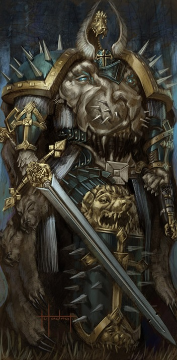

<!-- A0632-B0018 -->

原译文

Lion El'Jonson in his Caliban armor 卡利班盔甲里的莱昂·艾尔庄森

**校订译文**

Lion El'Jonson in his Caliban armor 身穿卡利班铠甲的莱昂·艾尔’庄森

<!-- /A0632-B0018 -->

<!-- A0632-B0019 -->
### Crusade against the Great Beasts 巨兽远征

<!-- /A0632-B0019 -->

<!-- A0632-B0020 -->
**英文原文**

When the Order's ranks had swelled with new recruits, Jonson and Luther petitioned for a crusade against the terrible Beasts which lived within the forest. Luther used his oratory skills to convince many of the Grand Masters of other monasteries to join the Order in this quest and within a single decade the planet was free from the Great Beasts, the armies having been led by Jonson. In recognition of his achievements, Jonson was given the title Supreme Grand Master of the Order, which created jealousy within Luther. After defeating the Beasts, Lion El'Jonson demanded fealty from all the other Knightly orders of Caliban. The only ones to oppose were the corrupted Knights of Lupus, who were hunted down and destroyed.

<!-- /A0632-B0020 -->

<!-- A0632-B0021 -->

原译文

当骑士团的队伍随着新兵的增加而壮大时，庄森和卢瑟请求对生活在森林里的可怕野兽进行远征。卢瑟用他的演讲技巧说服了其他骑士团的许多大导师加入，在短短十年内，这个行星就摆脱了巨兽，军队由庄森领导。为了表彰他的成就，庄森被授予骑士团至高大导师的称号，这在卢瑟心中引起了嫉妒。击败野兽后，莱昂·艾尔庄森要求卡利班的所有其他骑士团效忠。唯一反对的是堕落的豺狼骑士团，他们被追捕并毁灭。

**校订译文**

随着新成员不断加入，骑士团日益壮大。庄森与卢瑟提议发动远征，消灭森林中的恐怖巨兽。卢瑟凭借雄辩说服其他修道院的许多大导师加入；庄森则统领联军，在短短十年内清除了全星球的巨兽。为表彰其功绩，庄森获授骑士团至高大导师之位，却也因此招来卢瑟的嫉妒。此后，莱昂要求卡利班其他骑士团向他效忠。只有已遭腐化的豺狼骑士团拒绝臣服，最终被追剿消灭。

<!-- /A0632-B0021 -->

<!-- A0632-B0022 图片 -->
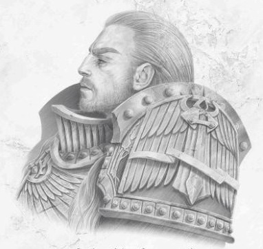

<!-- A0632-B0023 -->

原译文

Lion El'Jonson 莱昂·艾尔庄森

**校订译文**

Lion El'Jonson 莱昂·艾尔’庄森

<!-- /A0632-B0023 -->

<!-- A0632-B0024 -->
### Rediscovery 回归

<!-- /A0632-B0024 -->

<!-- A0632-B0025 -->
**英文原文**

Eventually a unit of the Emperor's forward scouts arrived at Caliban. Jonson was immediately given command of the First Legion when the Emperor realized he had found a lost son. Luther and the other members of the Order who passed the Astartes' trials were formed into First Legion soldiers, either as fully fledged Astartes if they were young enough, or through genetic manipulation to increase their abilities if they were too old for the process. The new direction of Caliban did not sit well with many older knights of The Order, and they attempted to assassinate both Jonson and the Emperor but were foiled by the psychic Zahariel. With his powerbase secured and the new Astartes ready, Jonson publicly re-named the First Legion the Dark Angels after an old Caliban myth. Luther, too old to be a Space Marine, was the first to be genetically modified and became Jonson's second in command, as he had been during the crusade. Jonson then left with the Emperor and the newly re-named Dark Angels. Befitting his status as the first Primarch, Lion El'Jonson received the first Gloriana Class Battleship Invincible Reason.

<!-- /A0632-B0025 -->

<!-- A0632-B0026 -->

原译文

最终，帝皇的一支前线侦察兵部队抵达了卡利班。当帝皇意识到他找到了一个失踪的子嗣时，庄森立即被授予第一军团的指挥权。卢瑟和其他通过阿斯塔特测试的骑士团成员组成了第一军团的士兵，如果他们足够年轻，要么是完全成熟的阿斯塔斯，要么是通过基因操作来提高他们的能力，如果他们太老了，则无法进行这一过程。卡利班的新方向与骑士团的许多老骑士并不合拍，他们试图暗杀庄森和帝皇，但被灵能者扎哈瑞尔挫败。随着他的权力基础得到保障，新的阿斯塔特准备就绪，庄森根据一个古老的卡利班神话公开将第一军团重新命名为黑暗天使。卢瑟年龄太大，不能成为星际战士，他是第一个进行基因改造的人，并成为庄森的副手，就像他在远征期间一样。庄森随后和帝皇带着新改名的黑暗天使离开了。莱昂·艾尔庄森获得了第一艘荣光女王级战列舰无敌理性号，这与他作为第一位原体的地位相称。

**校订译文**

最终，帝皇的先遣侦察部队抵达卡利班。帝皇认出自己失散的儿子后，立即将第一军团交由庄森指挥。卢瑟与其他通过阿斯塔特试炼的骑士团成员都加入了军团：年龄合适者接受完整改造，成为真正的阿斯塔特；年龄过大者则接受其他基因强化。许多老骑士不满卡利班的发展方向，企图刺杀庄森与帝皇，却被灵能者扎哈瑞尔挫败。统治基础稳固、新的阿斯塔特也准备就绪后，庄森依照卡利班的一则古老传说，公开将第一军团更名为“黑暗天使”。卢瑟因年龄太大，无法成为真正的星际战士，却是首个接受替代性基因强化的人；他像巨兽远征时期一样，担任庄森的副手。随后，庄森与帝皇率更名后的军团离开卡利班。为匹配第一原体的地位，莱昂获得了首艘荣光女王级战列舰无敌理性号。

**校注：** 区分年轻候选人的完整阿斯塔特改造与年长骑士的替代性强化。first Primarch 按序号／身份理解为第一原体，非声称他最早被找到。

<!-- /A0632-B0026 -->

<!-- A0632-B0027 -->
**英文原文**

The Lion found a Legion beset by strife, for it had suffered greatly in a series of reckless campaigns and was overcome by a malaise of pride and vainglory. Upon reunion with his Legion The Lion tested his sons mettle by dueling the captain of the company presented before him. Though not clad in Power Armour and facing a Terminator-clad captain, The Lion bested his foe and it is said both sides learned respect for the other. From that day forth The Lion renamed the Legion the Dark Angels. The Council of Masters however became anxious at the news, with some worried what their Primarch would think regarding the state of the Legion and others remaining prideful. However The Lion granted new purpose and vision for the fractured Legion, his first act being to merge the many teachings of Caliban with the First Legion's Hexagrammaton. He combined both to create something new and more refined. Alongside his Xana allies the Lion then took a newly mustered host of 20,000 Legionaries - a third of the Legion - and embarked on a Crusade of his own. He sought out the scattered Companies of Dark Angels across the Great Crusade. Each Company encountered accepted their Primarch with dour allegiance and each had their Captain tested in battle by The Lion. The Lion demonstrated his worth by actions and skill rather than words and vague promises, allowing those that might doubt him to match their blades against his in honest combat. Within a few short years The Lion had gathered 100,000 Legionaires to his side and mustered them at the Legion's ancient stronghold at Gramarye.

<!-- /A0632-B0027 -->

<!-- A0632-B0028 -->

原译文

莱昂发现了一个被冲突困扰的军团，因为它在一系列鲁莽的战役中遭受了巨大的痛苦，并被骄傲和虚荣的问题所影响。在与他的军团重聚后，莱昂通过与靠前的连队连长决斗来考验他的子嗣们的勇气。虽然没有穿上动力盔甲，面对着一个穿着终结者盔甲的连长，但莱昂击败了他的敌人，据说双方都学会了尊重对方。从那天起，莱昂将军团更名为黑暗天使。然而，导师议会对这一消息感到焦虑，一些人担心他们的原体会对军团的状态有什么看法，而另一些人则仍然感到骄傲。然而，莱昂为分裂的军团赋予了新的目标和愿景，他的第一个行动是将卡利班的许多教义与第一军团的六重圣道融合在一起。他将两者结合起来，创造了一些新的、更精致的东西。随后，莱昂与他的夏纳盟友一起，召集了2万名军团士兵 — 占军团总数的三分之一 — 并开始了自己的远征。他在大远征中寻找分散的黑暗天使军团。每个遇到的连队都以严肃的忠诚接受了他们的原体，每个连队的连长都在战斗中接受了莱昂的考验。莱昂通过行动和技能而不是言语和模糊的承诺来证明自己的价值，让那些可能怀疑他的人在诚实的战斗中用刀刃来对抗他。在短短几年内，莱昂已经召集了10万名军团士兵，并将他们聚集在军团在格拉马利的古老据点。

**校订译文**

莱昂接手的是一个内斗不休的军团。此前一连串鲁莽的战役使军团损失惨重，傲慢与虚荣又令其积弊日深。初见军团时，莱昂向前来接受检阅的连队连长发起决斗，以检验子嗣的勇气。他没有穿动力甲，对手却身着终结者护甲，最终仍由原体取胜。据说双方由此赢得了彼此的尊重。从那天起，莱昂便将军团更名为黑暗天使。导师议会却对消息感到不安：有些人担忧原体如何看待军团现状，有些人仍放不下傲气。莱昂为这个分裂的军团赋予了新的目标与方向。他首先将卡利班的诸多传统与第一军团的六翼体系结合，形成更精进的新制度。随后，他与夏纳盟友率新集结的两万名军团战士出征——这占当时军团人数的三分之一——寻找分散在大远征各战场的黑暗天使连队。每支连队都以肃穆的忠诚迎接原体，其连长也都接受他的武艺考验。莱昂让怀疑者亲自与他公平交锋，用行动与实力证明自己。短短数年，他身边已聚集十万名军团战士，并在格拉马利的军团古老据点完成集结。

**校注：** 原文 presented before him 指来到面前接受检阅，不是“靠前的连队”。本段与上一段重复叙述军团改名，源文没有清楚协调两种叙述的时间点，保留。

<!-- /A0632-B0028 -->

<!-- A0632-B0029 -->
**英文原文**

At Gramarye another Legion Council was held and this time The Lion dueled the ceremonial Council Champion Pyrhus Calagat, master of the Host of Fire. In an hour long legendary duel the Primarch won the trial and accepted the titles of Grandmaster of the First Legion and the six Wings of the Hexagrammaton: the Deathwing, Ravenwing, Dreadwing, Firewing, Ironwing, and Stormwing. Before his Legion the Lion took a final oath before his sons, and they in turn swore oaths of their own to their Primarch. His oath sworn, the Lion placed new masters over each Wing and formalized the various informal Orders in the style of Caliban's Knightly Orders. By this time the new recruits from Caliban were ready and The Lion swiftly incorporated them into The Legion. The Lion's first act was to move on Karkasarn, which had since rose in rebellion against its Ultramarines garrison. The reorganized Dark Angels under The Lion fought brilliantly, sweeping aside any memories of their earlier humbling on the world and saving their Ultramarines allies from being overwhelmed.

<!-- /A0632-B0029 -->

<!-- A0632-B0030 -->

原译文

在格拉马利，又举行了一次军团会议，这次莱昂与议会冠军、火焰天军之主皮鲁斯·卡拉加特决斗。在长达一小时的传奇决斗中，原体赢得了试炼，并接受了第一军团大导师和六重圣道六翼的称号：死翼、鸦翼、恐翼、炎翼、铁翼和风暴翼。在他的军团面前，莱昂在他的子嗣们面前做了最后的宣告，他们又向他们的原体宣誓。他宣誓后，莱昂在每个翼上都任命了新的导师，并以卡利班骑士勋章的风格正式确立了各种非正式的勋章。这时，卡利班的新兵已经准备就绪，莱昂迅速将他们编入了军团。莱昂的第一个行动是向卡尔卡萨恩进军，卡尔卡萨恩叛乱对抗其极限战士驻军。重组后的黑暗天使在莱昂的带领下进行了出色的战斗，扫除了他们早期在世界上的任何屈辱记忆，并拯救了他们的极限战士盟友免于被击败。

**校订译文**

格拉马利再次召开军团议会。莱昂这次挑战的是担任仪式决斗冠军的火焰天军之主皮鲁斯·卡拉加特。经过长达一小时的传奇交锋，原体赢得试炼，获授第一军团及六翼的大导师之位；六翼即死翼、鸦翼、恐翼、炎翼、铁翼和风暴翼。莱昂在全军面前立下最后的誓言，子嗣也向原体宣誓效忠。随后，他为各翼任命新导师，并仿照卡利班骑士团的形式，将原有各个非正式结社纳入正式建制。此时卡利班新兵已完成准备，莱昂迅速将他们编入军团。重组后的首次行动是进军卡尔卡萨恩，镇压那里反抗极限战士驻军的叛乱。黑暗天使在原体指挥下表现出色，一扫先前在该世界受挫的耻辱，也使极限战士盟友免于覆灭。

**校注：** Orders 指军团结社及骑士团，不是勋章；“六翼大导师”是统领六翼的职衔，并非获授“六个翼”的称号。

<!-- /A0632-B0030 -->

<!-- A0632-B0031 -->
### Great Crusade 大远征

<!-- /A0632-B0031 -->

<!-- A0632-B0032 -->
**英文原文**

One of the first major commands The Lion oversaw were the vicious Rangdan Xenocides, where the Dark Angels took grievous losses and were for the first time eclipsed by the Ultramarines, Iron Hands, and Sons of Horus in numbers and prominence. During the later stages of the war a member of the XXth Legion identifying itself as Alpharius but admitting their primarch had not yet been discovered came before the Lion. This "Alpharius" offered aid to the Primarch against the Rangdan in hopes that the Dark Angels would maintain their prominence and thus one day The Lion would be made Warmaster. The Lion at this time did not even know of the title Warmaster, but still secretly believed that such a title may one day be likely bestowed by one of the Primarch's by the Emperor. "Alpharius" stated that the XXth Legion preferred The Lion for Warmaster over someone like Roboute Guilliman, as he was not so different from them on their views of secrecy and war. It is not ultimately known if The Lion accepted Alpharius' help or not.

<!-- /A0632-B0032 -->

<!-- A0632-B0033 -->

原译文

莱昂监督的第一批主要命令之一是对邪恶的冉丹异型的灭绝，黑暗天使在那里遭受了巨大的损失，并首次在数量和知名度上被极限战士、钢铁之手和荷鲁斯之子超越。在战争的后期阶段，第二十军团的一名成员自称为阿尔法瑞斯，但承认他们的原体尚未回归。这个“阿尔法瑞斯”向原体提供了对抗冉丹的援助，希望黑暗天使能够保持他们的突出地位，从而有一天莱昂会成为战帅。此时的莱昂甚至不知道战帅这个头衔，但仍然秘密地相信，有一天，帝皇可能会授予一位原体这样的头衔。“阿尔法瑞斯”表示，第二十军团更喜欢莱昂而不是像罗伯特·基里曼这样的人，因为他在秘密和战争的观点上与他们没有太大不同。目前尚不清楚莱昂是否接受了阿尔法瑞斯的帮助。

**校订译文**

莱昂早期指挥的大规模战事之一，是惨烈的冉丹灭绝战争。黑暗天使损失惨重，人数与声望首次被极限战士、钢铁之手和荷鲁斯之子超越。战争后期，一名自称“阿尔法瑞斯”的第二十军团成员前来拜见莱昂，同时声称他们的原体尚未被找到。他表示愿意协助对抗冉丹，希望黑暗天使保持领先地位，使莱昂有朝一日能获任战帅。莱昂当时甚至未曾听过这一职衔，但心中已认为帝皇终有一天可能会把类似权位授予某位原体。“阿尔法瑞斯”说，第二十军团更愿意支持莱昂，而非罗保特·基里曼这样的人，因为莱昂对保密与战争的看法与他们相近。莱昂最后是否接受这份帮助，仍不得而知。

**校注：** major commands 指原体指挥的大规模战事；不是发出的命令。源文在此使用 Sons of Horus 而非更早的 Luna Wolves，保留所给称谓，不擅自更换其时代名称。

<!-- /A0632-B0033 -->

<!-- A0632-B0034 图片 -->
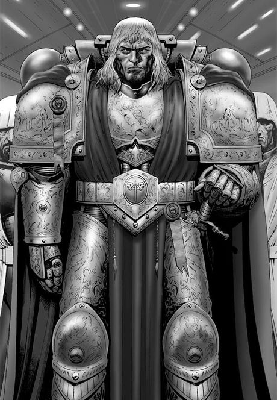

<!-- A0632-B0035 -->

原译文

Lion El'Jonson 莱昂·艾尔庄森

**校订译文**

Lion El'Jonson 莱昂·艾尔’庄森

<!-- /A0632-B0035 -->

<!-- A0632-B0036 -->
**英文原文**

Lion El'Jonson gained notoriety for his leadership and combat capability in the Great Crusade, but was too secretive and stoic to be considered for the honour of Warmaster. Indeed, the Lion himself admitted he had difficulty understanding the emotions of others. Horus was instead appointed Warmaster by the Emperor, and the reaction among the other Primarchs was mixed. Some supported the appointment out of affection for Horus, and others opposed it. The Lion and Leman Russ were, ironically, alike in their attitude, cynically accepting the appointment as the final sign of Horus' status as their father's favorite son.

<!-- /A0632-B0036 -->

<!-- A0632-B0037 -->

原译文

莱昂·艾尔庄森因其在大远征中的领导能力和战斗能力而闻名，但他过于隐秘和坚忍，不适合作为战帅的荣誉。事实上，莱昂自己也承认他很难理解别人的情绪。荷鲁斯被帝皇任命为战帅，其他原体的反应喜忧参半。一些人出于对荷鲁斯的喜爱而支持这一任命，而另一些人则反对。具有讽刺意味的是，莱昂和黎曼·鲁斯的态度是一样的，他们愤世嫉俗地接受这一任命是荷鲁斯作为父亲最宠爱的子嗣地位的最后标志。

**校订译文**

大远征中，莱昂凭借统军与战斗能力声名远扬，但他过于隐秘、情感内敛，未被选为战帅。他自己也承认，理解他人的情绪对他而言颇为困难。帝皇最终任命荷鲁斯，其他原体对此反应不一：一些人出于对荷鲁斯的喜爱而支持，另一些人则反对。颇具讽刺意味的是，莱昂与黎曼·鲁斯在此事上态度一致；他们带着冷嘲接受了任命，认为这最终坐实了荷鲁斯是父亲最宠爱的儿子。

<!-- /A0632-B0037 -->

<!-- A0632-B0038 -->
**英文原文**

During the campaign against the Sarosh, Luther was able to foil a detonation of a nuclear weapon aboard the Lion's flagship. However due to his own deep-buried jealously he had initially hesitated, something the Lion somehow discovered. As a result the two had a falling out, and Luther along with a force of mainly Caliban-native legionaries were sent back to their homeworld. This was ostensibly to accelerate the recruitment of new Legionnaires, but Luther felt they had been exiled, particularly after his scolding in the Zaramund Campaign.

<!-- /A0632-B0038 -->

<!-- A0632-B0039 -->

原译文

在对抗萨罗什的战役中，卢瑟成功阻止了莱昂旗舰上的核武器爆炸。然而，由于他内心深处的嫉妒，他最初犹豫了一下，莱昂不知怎么发现了这一点。结果，两人争吵起来，卢瑟和一支主要由卡利班本地军团组成的部队被送回了他们的家园世界。这表面上是为了加快招募新的军团士兵，但卢瑟觉得他们被流放了，尤其是在他在扎拉蒙德战役中受到斥责之后。

**校订译文**

对萨罗什的战役中，卢瑟阻止了莱昂旗舰上一枚核武器的引爆。但出于深藏心底的嫉妒，他最初曾有所犹豫，莱昂不知通过何种方式获悉了此事。二人因此失和，卢瑟与一支主要由卡利班籍战士组成的部队被遣回母星。名义上的任务是加快新兵征募，卢瑟却觉得自己遭到了流放，尤其是在扎拉蒙德战役中再次受斥之后。

<!-- /A0632-B0039 -->

<!-- A0632-B0040 -->
**英文原文**

Fifty years later, and following great success in recruiting, training, and equipping new Dark Angels, Luther and his lieutenants were faced by a widespread rebellion on Caliban. Following investigations on the part of the Librarian Zahariel, it was revealed that Caliban was plagued by a resurgence of monsters; and that the insurgency raised against them included former Knights of the Order who felt that the Lion had betrayed them.

<!-- /A0632-B0040 -->

<!-- A0632-B0041 -->

原译文

五十年后，在招募、训练和装备新的黑暗天使方面取得巨大成功后，卢瑟和他的副手们面临着卡利班的广泛叛乱。经过智库扎哈里尔的调查，卡利班被怪物的复活所困扰；针对他们的叛乱包括前骑士团的骑士，他们觉得莱昂背叛了他们。

**校订译文**

五十年后，卢瑟及其副手在征募、训练、武装新一代黑暗天使方面成果斐然，却面临卡利班大范围爆发的叛乱。智库员扎哈瑞尔调查后发现，怪物正在卡利班重新出现，发动叛乱的人中也包括骑士团的旧成员；他们认为莱昂背叛了自己。

<!-- /A0632-B0041 -->

<!-- A0632-B0042 -->
**英文原文**

At the center of the entire affair was a mysterious cabal of Terran sorcerers somehow linked to the emergence of warp-monsters and twisted undead corpses. Having learned of Horus' rebellion against the Emperor, Luther declared the independence of Caliban and his opposition to Terra and the Lion alike.

<!-- /A0632-B0042 -->

<!-- A0632-B0043 -->

原译文

整个事件的中心是一个神秘的泰拉巫师密会，不知何故，他们与扭曲的不死尸体和亚空间的变形怪物的出现有关。在得知荷鲁斯叛乱对抗帝皇后，卢瑟宣布卡利班独立，并反对泰拉和莱昂。

**校订译文**

整件事的核心是一个神秘的泰拉巫师密会，他们与亚空间怪物和扭曲亡尸的出现有着不明联系。得知荷鲁斯反叛帝皇后，卢瑟宣布卡利班独立，同时反对泰拉与莱昂。

<!-- /A0632-B0043 -->

<!-- A0632-B0044 -->
### The Lion and the Wolf 狮与狼

<!-- /A0632-B0044 -->

<!-- A0632-B0045 -->
**英文原文**

Few tales have been recorded regarding the Lion and the conduct of his Legion during the Great Crusade. One of them is that which is now known as the saga of "The Lion and the Wolf".

<!-- /A0632-B0045 -->

<!-- A0632-B0046 -->

原译文

关于莱昂和他的军团在大远征期间的行为，很少有故事被记录下来。其中之一就是现在被称为“狮与狼”的传奇故事。

**校订译文**

关于莱昂和他的军团在大远征期间的行为，很少有故事被记录下来。其中之一就是现在被称为“狮与狼”的传奇故事。

<!-- /A0632-B0046 -->

<!-- A0632-B0047 图片 -->
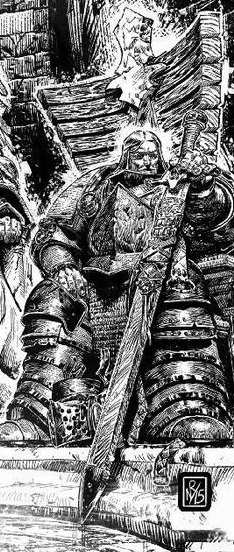

<!-- A0632-B0048 -->

原译文

Lion El'Jonson during the Horus Heresy 荷鲁斯叛乱期间的莱昂·艾尔庄森

**校订译文**

Lion El'Jonson during the Horus Heresy 荷鲁斯之乱期间的莱昂·艾尔’庄森

<!-- /A0632-B0048 -->

<!-- A0632-B0049 -->
**英文原文**

Sometime during The Great Crusade, the Dark Angels and the Space Wolves assaulted the planet Dulan whose ruled the independent Faash empire. In addition to disrespecting the Emperor, the leader of the rebels had also insulted Leman Russ personally by naming him "The Emperor's Lapdog". In response, Leman Russ swore that he would cut the rebel leader's head from his shoulders and demanded that he be allowed to make an immediate attack on the rebel's headquarters. This impatient request was refused because The Lion had spent days gathering intelligence on the headquarters' defenses and had planned a detailed assault of his own. The Dark Angel attack went forward with few casualties and Russ could only watch from the grounds as Lion El'Jonson killed the rebel leader high on the walls of the fortress. After the battle, Russ stormed into the halls of the headquarters to find El'Jonson and vent his frustrations. During the confrontation Leman Russ struck Lion El'Jonson a blow to his head and the two proceeded to wrestle for a day and night without victory for either combatant. When the two finally broke apart, Russ began to laugh - humored by the circumstances the two were fighting over. The Lion was not amused however and in what was considered a cowardly act, struck Russ unconscious as he was laughing.

<!-- /A0632-B0049 -->

<!-- A0632-B0050 -->

原译文

在大远征期间的某个时候，黑暗天使和太空野狼袭击了独立统治杜兰行星的法什帝国。除了不尊重帝皇，叛军领袖还侮辱了黎曼·鲁斯，称他为“帝皇的走狗”。作为回应，黎曼·鲁斯发誓要砍下叛军领袖的头，并要求允许他立即袭击叛军总部。这个不耐烦的请求被拒绝了，因为莱昂花了几天时间收集总部防御的情报，并计划了一次详细的袭击。黑暗天使的袭击进行得很顺利，伤亡人数很少，鲁斯只能在地面上看着莱昂·艾尔庄森杀死了堡垒高墙上的叛军领袖。战斗结束后，鲁斯冲进总部大厅寻找莱昂·艾尔庄森并发泄他的沮丧。在对抗中，黎曼·鲁斯打了莱昂·艾尔庄森头部一拳，两人继续搏斗了一天一夜，两人都没有获胜。当两人最终分道扬镳时，鲁斯开始大笑 — 被两人争吵的理由逗乐了。然而，莱昂并没有被逗笑，在被认为是懦弱的行为中，在鲁斯大笑时袭击了他。

**校订译文**

大远征期间，黑暗天使与太空野狼共同进攻杜兰——独立的法什帝国的统治中心。叛军领袖不仅蔑视帝皇，还称黎曼·鲁斯为“帝皇的走狗”。鲁斯发誓亲手斩下其头颅，要求立即进攻敌军总部。莱昂拒绝了这项急躁的要求：他已花数日搜集防御情报，拟定了周密的突击计划。黑暗天使随后以很小的伤亡完成进攻，鲁斯却只能站在地面，眼看莱昂在堡垒高墙上杀死叛军首领。战后，鲁斯怒气冲冲地闯入总部大厅，找莱昂发泄不满；争执中，他一拳击中莱昂头部，二人随即厮打了一天一夜，始终不分胜负。终于暂时分开时，鲁斯想到两人打架的缘由，不由放声大笑。莱昂却丝毫不觉得好笑，趁鲁斯笑时一击将他打昏；这一击被视为怯懦的偷袭。

**校注：** broke apart 指激斗后暂时分开，不是双方分道扬镳；原译漏掉鲁斯被打昏。偷袭评价来自源文 was considered，而非译者另加的道德判断。

<!-- /A0632-B0050 -->

<!-- A0632-B0051 -->
**英文原文**

The Space Wolves' Primarch was carried from the chamber by his men, and when he had regained consciousness the Dark Angels had already escaped the planet to embark on another campaign. Russ swore he would avenge the slight to his honor, and to this day the two chapters fight honor duels in remembrance of this event. Some say these duels have brought mutual respect and a closer bond between the chapters. On other occasions, however, the rivalry between the two chapters has boiled into open hostility, fueled by mistrust and suspicion.

<!-- /A0632-B0051 -->

<!-- A0632-B0052 -->

原译文

太空野狼的原体被他的部下抬出了房间，当他恢复意识时，黑暗天使已经离开了这个行星，开始了另一场战役。鲁斯发誓要为自己的名誉报仇，直到今天，两个战团仍在为纪念这一事件进行荣誉决斗。有人说，这些决斗带来了相互尊重和战团之间更紧密的联系。然而，在其他情况下，这两个战团之间的竞争在不信任和怀疑的推动下演变为公开的敌意。

**校订译文**

太空野狼的原体被他的部下抬出了房间，当他恢复意识时，黑暗天使已经离开了这个行星，开始了另一场战役。鲁斯发誓要为自己的名誉报仇，直到今天，两个战团仍在为纪念这一事件进行荣誉决斗。有人说，这些决斗带来了相互尊重和战团之间更紧密的联系。然而，在其他情况下，这两个战团之间的竞争在不信任和怀疑的推动下演变为公开的敌意。

<!-- /A0632-B0052 -->

<!-- A0632-B0053 -->
### Horus Heresy 荷鲁斯之乱

原题：Horus Heresy 荷鲁斯叛乱

<!-- /A0632-B0053 -->

<!-- A0632-B0054 -->
### Taking Sides 抉择

<!-- /A0632-B0054 -->

<!-- A0632-B0055 -->
**英文原文**

Jonson was campaigning in the Shield Worlds against the Gordian League when he received news of Horus's betrayal. The Lion knew that if Horus was to triumph in his rebellion he would eventually have to confront the Emperor at Terra, for as long as the Emperor remained safe in the confines of the Imperial Palace, Horus could never truly triumph and become the new master of mankind. The Lion decided to act in order to prevent Horus from being able to successfully assault the Imperial Palace. He led a small force to the forge world Diamat in order to secure several highly powerful siege weapons that Horus would need in order to assault Terra. Faced with superior odds, the Lion nonetheless succeeded in securing the siege weapons, and thus "performed a master stroke": rather than confronting Horus directly, he had seemingly defeated the Warmaster with only a handful of troops.

<!-- /A0632-B0055 -->

<!-- A0632-B0056 -->

原译文

庄森收到荷鲁斯叛乱的消息时，正在盾牌世界对抗戈迪亚联盟。莱昂知道，如果荷鲁斯要在叛乱中获胜，他最终将不得不在泰拉与帝皇对抗，因为只要帝皇在皇宫的范围内保持安全，荷鲁斯就永远无法真正获胜，成为人类的新主人。莱昂决定采取行动，阻止荷鲁斯成功袭击皇宫。他带领一小支部队前往铸造世界迪亚马特，以获得荷鲁斯攻击泰拉所需的几件威力强大的攻城武器。尽管面对悬殊的实力对比，莱昂还是成功地获得了攻城武器，从而“完成了大师的一击”：他似乎只用少数部队就击败了展示，而不是直接对抗荷鲁斯。

**校订译文**

接到荷鲁斯之乱的消息时，庄森正在盾牌诸世界对抗戈迪亚联盟。他知道，只要帝皇仍安然坐镇皇宫，荷鲁斯就不可能真正夺得胜利、成为人类的新主宰；叛乱最终必将指向泰拉。为阻止荷鲁斯攻破皇宫，莱昂率一小支部队赶往铸造世界迪亚马特，抢先控制数件威力巨大的攻城武器——荷鲁斯进攻泰拉时正需要这些武器。尽管敌众我寡，莱昂仍成功夺取装备，看似下成了绝妙的一着：无需正面对抗荷鲁斯，只用少量兵力，便破坏了战帅的计划。

**校注：** a master stroke 是绝妙举措；Warmaster 原译误作“展示”。

<!-- /A0632-B0056 -->

<!-- A0632-B0057 -->
**英文原文**

Following his victory, the Lion met with Perturabo, who, along with other Legions, was on his way to join Ferrus Manus in confronting Horus at Isstvan V. Jonson, seeing the opportunity to become the new Warmaster following Horus' seemingly inevitable defeat, traded the siege weapons to Perturabo in exchange for his support in his bid to become the new Warmaster. Tragically, Perturabo was in fact an ally of Horus, as revealed by his actions at Isstvan V. Immediately following the siege of Diamat and Perturabo acquiring the siege engines from Jonson, the Primarch of the Dark Angels returned to the Shield Worlds where the majority of his legion were operating with the intention of heading to Terra immediately (prior to the massacre at Isstvan V).

<!-- /A0632-B0057 -->

<!-- A0632-B0058 -->

原译文

在他获胜后，莱昂会见了佩图拉博，佩图拉博和其他军团正在前往伊斯塔万五号的途中，与费鲁斯·马努斯一起对抗荷鲁斯。在荷鲁斯看似不可避免的失败后，庄森看到了成为新战帅的机会，于是将攻城武器交易给了佩图拉博，以换取他成为新战帅的支持。可悲的是，佩图拉博实际上是荷鲁斯的盟友，正如他在伊斯塔万五号的行动所揭示的那样。在提亚马特被围困后，佩图拉博从庄森那里获得了攻城引擎，黑暗天使的原体回到了盾牌世界，他的大部分军团都在那里行动，打算立即前往泰拉（在伊斯塔万五号大屠杀之前）。

**校订译文**

胜利后，莱昂会见了佩图拉博。当时，后者正与其他军团前往伊斯塔万五号，准备会合费鲁斯·马努斯，共同对抗荷鲁斯。莱昂以为荷鲁斯败局已定，自己有望接任战帅，于是将攻城武器交给佩图拉博，换取后者支持。可悲的是，佩图拉博实际上早已站在荷鲁斯一边，这一点很快便在伊斯塔万五号暴露。迪亚马特围攻结束、武器交接完成后，莱昂随即返回军团主力所在的盾牌诸世界，准备立刻启程赴泰拉；此时伊斯塔万五号大屠杀尚未发生。

<!-- /A0632-B0058 -->

<!-- A0632-B0059 -->
### Thramas 萨拉玛斯

原题：Thramas 萨拉马斯

<!-- /A0632-B0059 -->

<!-- A0632-B0060 -->
**英文原文**

As part of Horus' campaign to divert many of the remaining loyalist legions from Terra, the Night Lords were dispatched to the Eastern Fringes, where in the Thramas Crusade they rampaged across many loyalist worlds. During the genocide, Konrad Curze would invite the Lion to a meeting on the planet Tsagualsa. There, the Night Haunter would reveal a prophecy to the Lion, concerning the future of the Dark Angels. Eventually, the talks degraded to a fight and the Lion left with a slashed throat and Curze with a sword in his back. The Lion then went on to obtain a warp engine of unforeseen power known as Tuchulcha, that would allow him to coordinate entire fleets in a warp jump. During their trip, the Dark Angels ships encountered Daemons and Lion El'Jonson reinstituted Librarians to fight them, in direct violation of the Council of Nikea. This caused a dispute within the legion that saw The Lion eventually kill Nemiel. Lion El'Jonson encountered Kairos Fateweaver at the height of the battle, who attempted to convert him to Chaos but could find nothing in his heart to sway it with, for he was absolutely loyal to the Emperor and viewed loyalty as its own reward. The Lion dismissed the Lord of Change by impaling it through the heart and quipping if the Greater Daemon saw that coming.

<!-- /A0632-B0060 -->

<!-- A0632-B0061 -->

原译文

作为荷鲁斯将许多剩余的忠诚军团从泰拉转移出去的行动的一部分，午夜领主被派往东部边缘，在色雷斯远征中，他们在许多忠诚的世界里横冲直撞。在大屠杀期间，康拉德·科兹邀请莱昂在察古尔萨行星上会面。在那里，午夜幽魂向莱昂透露一个关于黑暗天使未来的预言。最终，谈判演变成了一场战斗，莱昂的喉咙被割断，科兹被剑击中后背。随后，莱昂获得了一台名为图丘查的亚空间引擎，这个引擎具有无法预料的力量，可以让他在亚空间跳跃中协调整个舰队。在他们的航行中，黑暗天使的战舰遇到了恶魔，莱昂·艾尔庄森重新设立了智库与它们作战，这直接违反了尼凯亚会议。这在军团内部引起了争议，最终莱昂杀死了奈米尔。莱昂·艾尔庄森在战斗最激烈的时候遇到了卡洛斯·织命者，后者试图将他转化为混沌，但在他心中找不到任何可以动摇的东西，因为他对帝皇绝对忠诚，并将忠诚视为自己的回报。莱昂刺穿了万变魔君的心脏并将其驱逐，嘲笑大魔是否看到了这一点。

**校订译文**

为把尚存的忠诚军团牵制在泰拉之外，荷鲁斯派午夜领主前往银河东部边缘。他们在萨拉玛斯远征中蹂躏许多忠诚世界。大屠杀期间，康拉德·科兹邀请莱昂到察古尔萨会面，向他透露有关黑暗天使未来的预言。谈判最终演变为厮杀：莱昂喉部遭割伤，科兹背部中剑。后来，莱昂取得力量惊人的亚空间引擎图丘查，得以协调整支舰队共同跃迁。一次航行中，黑暗天使舰船遭遇恶魔，莱昂恢复智库员的职能，让他们参与战斗，直接违背了尼凯亚会议的禁令。军团内部因此爆发争执，最终莱昂杀死了奈米尔。战况最激烈时，凯洛斯·织命者现身，企图诱使莱昂投向混沌，却找不到任何可以动摇他的心念：莱昂绝对忠于帝皇，认为忠诚本身便是回报。他刺穿诡变领主的心脏，将其放逐，还反问这位大魔是否预见了这一击。

**校注：** 重新启用的是被禁用的智库员及其能力。末句是针对凯洛斯预知能力的讥讽。原喉咙“割断”容易暗示已死亡，slashed throat 此处译喉部割伤。

<!-- /A0632-B0061 -->

<!-- A0632-B0062 图片 -->
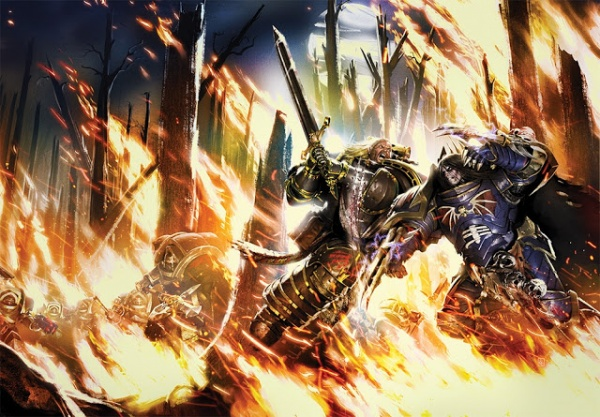

<!-- A0632-B0063 -->

原译文

Lion El'Jonson battles Konrad Curze on Macragge during the Heresy 叛乱期间莱昂·艾尔庄森和康拉德·科兹在马库拉格上战斗

**校订译文**

Lion El'Jonson battles Konrad Curze on Macragge during the Heresy 叛乱期间莱昂·艾尔’庄森和康拉德·科兹在马库拉格上战斗

<!-- /A0632-B0063 -->

<!-- A0632-B0064 -->
**英文原文**

Using this engine, he ambushed the Night Lords and, for a second time, fought his brother Primarch. The Night Lords left severely injured, with Curze in a comatose state. The Lion soon directed a second ambush on the regrouping Night Lords. There, Curze reawakened and boarded the Invincible Reason with several of his troops. The battle ended with Curze fleeing to the lower decks and any surviving Night Lords, including the First Captain Sevatar, taken prisoner. Curze however was still loose in the bowels of the massive ship and wreaked terror throughout it, killing any search team the Lion sent after him. After losing several squads the Lion took up the hunt for Curze himself, stalking his brother throughout the Invincible Reason for the next sixteen weeks. However, he would never catch the elusive Primarch.

<!-- /A0632-B0064 -->

<!-- A0632-B0065 -->

原译文

使用这台引擎，他伏击了午夜领主，并第二次与他的兄弟原体作战。午夜领主伤亡惨重，科泽处于昏迷状态。莱昂很快对重新集结的午夜领主进行了第二次伏击。在那里，科兹苏醒过来，带着他的几名军团士兵登上了无敌理性号。战斗以科兹逃到下层甲板而告终，包括第一连长赛维塔在内的所有幸存的午夜领主都被俘了。然而，科兹仍然在这艘巨大的战舰内部自由活动，并在整个船上制造了恐怖，杀死了莱昂派来追捕他的任何搜索队。在失去几个小队后，莱昂自己开始追捕科兹，在接下来的十六周里，他一直在无敌理性号中追踪他的兄弟。然而，他永远也抓不到难以捉摸的原体。

**校订译文**

凭借图丘查，莱昂伏击午夜领主，第二次与科兹交锋。午夜领主遭到重创，科兹也陷入昏迷。莱昂随即再度伏击正重新集结的敌军。科兹在此战中苏醒，带少数战士登上无敌理性号，最终逃入下层甲板；包括第一连长赛维塔在内的其他幸存登舰者则被俘。科兹仍潜伏在巨舰深处，大肆杀戮，把莱昂派来的搜索队逐一歼灭。损失数个小队后，莱昂亲自追猎自己的兄弟，在无敌理性号内持续追踪了十六周，却始终未能将他擒获。

<!-- /A0632-B0065 -->

<!-- A0632-B0066 -->
### Imperium Secundus 第二帝国

<!-- /A0632-B0066 -->

<!-- A0632-B0067 -->
**英文原文**

Due to the Ruinstorm erected by the Word Bearers, the Dark Angels found themselves unable to return to Terra as the Lion had intended. Eventually they locked onto the light of the Pharos and made their way to Ultramar, linking up with the Ultramarines and Blood Angels as well as their respective Primarchs, Roboute Guilliman and Sanguinius. The three Primarch's were instrumental in the formation of Imperium Secundus, and Lion El'Jonson was made Lord Protector of this new Empire, a title similar to Warmaster. When Curze escaped the Invincible Reason and rampaged across Macragge, the Lion aided Guilliman in the unsuccessful attempt to defeat the renegade Primarch. However the entire battle had been a trap, and Curze brought down the chapel they were battling in. Lion El'Jonson and Guilliman both survived only thanks to Barabas Dantioch, who activated the Pharos and teleported them to Sotha.

<!-- /A0632-B0067 -->

<!-- A0632-B0068 -->

原译文

由于怀言者建立的毁灭风暴，黑暗天使发现自己无法按照莱昂的意图返回泰拉。最终，他们锁定了法罗斯的光芒，前往奥特拉玛，与极限战士和圣血天使以及他们各自的原体罗伯特·基里曼和圣吉列斯联合在一起。三位原体在第二帝国的形成中发挥了重要作用，莱昂·艾尔庄森被任命为这个新帝国的护国公，这个头衔类似于战帅。当科兹逃离无敌理性号并在马库拉格横冲直撞时，莱昂帮助基里曼试图击败叛徒原体，但未能成功。然而，整个战斗都是一个陷阱，科兹摧毁了他们正在战斗的教堂。莱昂·艾尔庄森和基里曼都幸存下来，这要归功于巴拉巴斯-丹提欧克，他激活了法罗斯并将他们传送到索萨。

**校订译文**

怀言者制造的毁灭风暴阻断航路，黑暗天使无法按莱昂的计划返回泰拉。他们最终锁定灯塔的光芒，抵达奥特拉玛，会合极限战士、圣血天使，以及各自的原体罗保特·基里曼与圣吉列斯。三位原体促成了第二帝国的建立，莱昂获任护国领主，地位近似战帅。科兹逃出无敌理性号，在马库拉格大肆作乱，莱昂于是与基里曼联手追捕，却未能制服他。整场交战实际上都是陷阱：科兹摧毁了三人交战的礼拜堂。幸亏巴拉巴斯·丹提欧克启动灯塔，将莱昂与基里曼传送至索萨，二人才得以生还。

**校注：** Lord Protector of Imperium Secundus 依第38篇同一职衔定译为护国领主；本篇原译护国公仅留于原稿对照。

<!-- /A0632-B0068 -->

<!-- A0632-B0069 -->
**英文原文**

The Lion, feeling responsible for Curze's rampages across Ultramar, obsessively hunted for his dark brother. In the Zepath System, Lion El'Jonson commanded the Dreadwing to wreak havoc against Word Bearers and World Eaters in the search for Curze. The Lion and Guilliman continued to clash over the policy with Imperium Secundus, particularly over how to deal with rebels on Macragge that the Dark Angels Primarch was certain Curze had a hand in. After a suicide bomber hit an Astartes convoy, Lion El'Jonson used his Legion to establish martial law on Macragge. The Lion became certain that Curze was hiding in the rebellious Illyrium region of Ultramar's capital, and advocated using weapons of mass destruction to destroy it from orbit. After facing resistance from both Sanguinius and Guilliman over the idea, the Lion instead deployed the Dreadwing to flush Curze the rebels out.

<!-- /A0632-B0069 -->

<!-- A0632-B0070 -->

原译文

莱昂对科兹在奥特拉玛的暴行负有责任，过分地追捕他的黑暗兄弟。在泽帕斯星系中，莱昂·艾尔庄森命令恐翼在寻找科兹的过程中对怀言者和吞世者造成严重破坏。莱昂和基里曼在与第二帝国的政策上发生冲突，特别是在如何处理黑暗天使原体确信科兹参与其中的马库拉格叛军问题上。在一名自杀式炸弹袭击者袭击了阿斯塔特车队后，莱昂·艾尔庄森利用他的军团在马库拉格实施戒严令。莱昂确信科兹藏身于奥特拉玛首都的叛乱地区伊利里亚姆，并主张使用大规模杀伤性武器将其从轨道上摧毁。在面临圣吉列斯和基里曼对这一想法的抵制后，莱昂转而部署了恐翼将科兹驱逐出叛军。

**校订译文**

莱昂认为自己应为科兹在奥特拉玛的暴行负责，因此近乎执拗地追捕这个阴暗的兄弟。在泽帕斯星系，他命恐翼为搜寻科兹而猛烈打击怀言者与吞世者。他与基里曼也不断因第二帝国的政策冲突，尤其无法就如何处理马库拉格叛军达成一致；莱昂确信科兹参与策划了叛乱。一次自杀式炸弹袭击击中阿斯塔特车队后，他动用军团在马库拉格实行戒严。随后，他认定科兹藏在首都世界的伊利里亚姆叛乱地区，主张从轨道投放大规模杀伤性武器，将该地区夷平。圣吉列斯与基里曼反对这一方案，莱昂遂改派恐翼，试图将科兹及叛军逼出藏身处。

**校注：** feeling responsible 是莱昂的主观责任感，不能直接写成客观定责。英文 Curze the rebels 缺连接词，按围剿两者的上下文译科兹及叛军，原文仍保留。

<!-- /A0632-B0070 -->

<!-- A0632-B0071 图片 -->
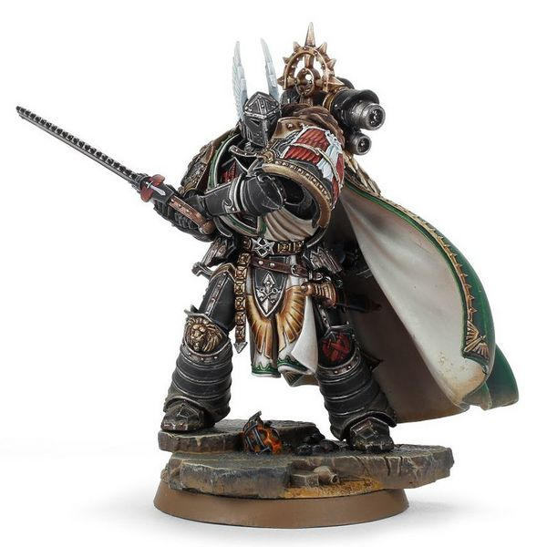

<!-- A0632-B0072 -->

原译文

Lion El'Jonson 莱昂·艾尔庄森

**校订译文**

Lion El'Jonson 莱昂·艾尔’庄森

<!-- /A0632-B0072 -->

<!-- A0632-B0073 -->
**英文原文**

During the attack on Alma Mons, the Lion was finally able to corner Curze and the two once again came to blows. After a vicious battle, the Lion was eventually victorious. The Lion questioned why Curze turned, to which Curze answered, "Why not?", saying that there was a monster in his head that he could not stop. Instead of killing Curze, the Lion pulled back, saying he could not kill him but then pummeled him again. The Lion then ripped off Curze's backpack and brought him down upon his knee, breaking his spine and paralyzing him. Curze was then brought before Sanguinius and Guilliman to stand trial.

<!-- /A0632-B0073 -->

<!-- A0632-B0074 -->

原译文

在对阿尔马·蒙斯的攻击中，莱昂终于将科兹逼入绝境，两人再次交锋。经过一场激烈的战斗，莱昂最终取得了胜利。莱昂问科兹为什么叛乱，科兹回答说：“为什么不呢？”他说他脑子里有个怪物，他停不下来。莱昂没有杀死科兹，而是后退了一步，说他杀不了他，然后又打了他一顿。然后，莱昂扯下科兹的背包，把他抱到膝盖上，打断了他的脊椎，使他瘫痪。随后，科兹被带到圣吉列斯和基里曼面前接受审判。

**校订译文**

进攻阿尔马·蒙斯时，莱昂终于堵住科兹，二人再度交手。经过一场惨烈搏斗，莱昂获胜，质问兄弟为何叛变。科兹回答“为什么不呢？”，声称自己脑中有个无法遏制的怪物。莱昂收住杀招，说自己不能杀他，随后却再次痛殴科兹。他扯下科兹的背包，将他的背部猛砸在膝盖上，折断脊椎，使其瘫痪。科兹随后被押到圣吉列斯与基里曼面前受审。

<!-- /A0632-B0074 -->

<!-- A0632-B0075 -->
**英文原文**

Curze admitted to his action, but refused to accept guilt because he was made to act that way, thus they were not crimes. Curze then divided Guilliman from the Lion, accusing the Lion of ordering secret orbital attacks and pitting the against each other. The Lion sought to kill Curze, but Sanguinius prevented him with words and Guilliman broke his sword. The Lion responded with anger, but Sanguinius dismissed him, ending the Triumvirate and banishing him from Imperium Secundus. The Dark Angels withdrew from the planet hours following the dismissal. Afterwards, The Lion continued to brood, questioning his exile of Luther and other decisions as he stood in the chamber of Tuchulcha. Soon, his council arrived and the Lion told them that they would return to Caliban. Before they left, the Lion had a thought and ordered Tuchulcha to teleport him and Holguin to Sanguinius's chamber. Shortly before Sanguinius was able to execute Curze back on Macragge, the Lion appeared, asking for the Angel to stop. Troops came into the room, demanding the Lion's surrender but he responded that Curze was able to see the future, and he repeated that Curze's claim that his death would be at the hands of an assassin was sent by the Emperor. This, to the Lion, was proof that the Emperor was still alive. Sanguinius recognized that his own visions of death would also be true. Guilliman demanded what would come of Curze. The Lion knelt before his brothers and promised that he would be Curze's gaoler. Curze remained captive aboard the Invincible Reason and occasionally The Lion would visit to speak with him in an attempt to gather information from his prophetic visions, though the Night Haunter rarely proved cooperative.

<!-- /A0632-B0075 -->

<!-- A0632-B0076 -->

原译文

科兹承认了自己的行为，但拒绝认罪，因为他是被迫这样做的，因此这些行为不是犯罪。科兹随后将基里曼与莱昂分开，指责莱昂下令进行秘密轨道攻击，并使双方相互对立。莱昂试图杀死科兹，但圣吉列斯用言语阻止了他，基里曼折断了他的剑。莱昂愤怒地回应，但圣吉列斯解雇了他，结束了三巨头并将他驱逐出第二帝国。黑暗天使在被解雇数小时后退出了行星。之后，狮子继续沉思，质疑他流亡卢瑟和其他的决定，他站在图丘查大厅里。很快，他的议会来了，莱昂告诉他们，他们将返回卡利班。在他们离开之前，莱昂有一个想法，命令图丘查将他和霍尔金传送到圣吉列斯的房间。就在圣吉列斯决定在马库拉格上处决科兹之前不久，莱昂出现了，要求天使停下来。军队进入房间，要求莱昂投降，但他回应说，科兹能够看到未来，他重申，科兹声称他的死亡将由刺客造成，这是帝皇发出的。对莱昂来说，这证明了帝皇还活着。圣吉列斯认识到，他自己对死亡的看法也是真实的。基里曼询问如何处置科兹。莱昂跪在他的兄弟们面前，答应他会成为科兹的狱卒。科兹仍被囚禁在无敌理性号上，偶尔莱昂会来拜访他，试图从他的预言中收集信息，尽管午夜幽魂很少表现出合作的意图。

**校订译文**

科兹承认自己的所作所为，却拒不认罪，辩称自己生来就注定如此行事，因此那些行为算不上罪行。他又揭露莱昂曾下令秘密进行轨道轰炸，挑拨莱昂与基里曼反目。莱昂想当场杀死科兹，圣吉列斯出言制止，基里曼则折断他的剑。莱昂愤怒回应，却被圣吉列斯免职并逐出第二帝国，三巨头的共治由此终结。数小时后，黑暗天使撤离马库拉格。莱昂独自站在图丘查所在的舱室中，反思自己放逐卢瑟等决定。顾问们前来时，他宣布返回卡利班。但临行前，他忽有所悟，命图丘查将自己与霍尔金送往圣吉列斯的房间。此刻，圣吉列斯正要处决科兹；莱昂现身要求住手。卫兵赶来，命他投降，他却指出：科兹能预见未来，而且一再声称自己将死于帝皇派出的刺客之手。在莱昂看来，这足以证明帝皇仍然活着。圣吉列斯也意识到，自己预见的死亡同样可能成为现实。基里曼问该如何处置科兹，莱昂便向两位兄弟跪下，承诺由自己担任看守。此后，科兹被囚于无敌理性号，莱昂偶尔前去探视，希望从他的预言中取得线索，但午夜幽魂很少合作。

**校注：** dismissed 指免去护国领主职务。科兹所预言的是帝皇派遣刺客将其杀死，非帝皇发出某个死亡预言；莱昂由此推断帝皇仍生存。

<!-- /A0632-B0076 -->

<!-- A0632-B0077 -->
### To Terra 前往泰拉

<!-- /A0632-B0077 -->

<!-- A0632-B0078 -->
**英文原文**

Following the Trial of Curze, Sanguinius, Lion El'Jonson, and Guilliman all agreed to try and breach the Ruinstorm to reach Terra and aid the Emperor who they now knew still lived. In the Ruinstorm, the loyalist fleet came across a variety of horrors and word of an entity spreading destruction known as the "Pilgrim". Not even the Tuchulcha could navigate the Ruinstorm, frustrating the Lion. During the Battle of Pyrrhan, The Lion commanded Dark Angels personel as Sanguinius received a vision and he realized that he needed to go where this struggle had begun, Davin. Reluctantly, Guilliman and The Lion agreed to trust in Sanguinius but both had thought they would simply destroy the world upon arriving. While over Davin, Sanguinius shocked The Lion by boarding the Invincible Reason and taking the captive Konrad Curze with him. Sanguinius hoped to use Curze's prophetic abilities to determine what he was meant to do upon Davin. Sanguinius then commended a mass landing on the world, and the enraged Lion nearly ordered that Davin be subjected to Exterminatus regardless of Sanguinius' presence on it. At the last minute The Lion relented, and immediately was horrified by what he had nearly done. He realized that some power was attempting to force the Primarch's down the path to damnation, and followed Sanguinius down to Davin.

<!-- /A0632-B0078 -->

<!-- A0632-B0079 -->

原译文

在审判科兹之后，圣吉列斯、莱昂·艾尔庄森和基里曼都同意试图突破毁灭风暴，到达泰拉，帮助他们现在知道还活着的帝皇。在毁灭风暴中，忠诚派舰队遇到了各种恐怖事件，并听说了一个被称为“朝圣者”的实体正在传播破坏。即使是图丘查也无法在毁灭风暴中航行，这让莱昂感到沮丧。在皮尔罕之战中，当圣吉列斯看到幻象时，莱昂指挥黑暗天使，他意识到自己需要去这场战斗开始的地方-戴文。基里曼和莱昂不情愿地同意信任圣吉列斯，但他们都认为自己一到达就会毁灭世界。在戴文上空，圣吉列斯登上无敌理性号并带走了俘虏康拉德·科兹，震惊了莱昂。圣吉列斯希望利用科兹的预言能力来确定他打算对戴文做什么。圣吉列斯随后指挥了在世界上的大规模登陆，愤怒的莱昂几乎下令对戴文进行灭绝令，不管圣吉列斯是否在场。在最后一刻，莱昂让步了，并立即对他几乎要做的事情感到震惊。他意识到某种力量正试图迫使原体走上诅咒之路，于是跟随圣吉列斯来到了戴文。

**校订译文**

科兹受审后，三位原体同意设法突破毁灭风暴，赶往泰拉援助已知仍然健在的帝皇。忠诚派舰队在风暴中遭遇种种恐怖景象，也听说一个名为“朝圣者”的存在正在四处毁灭。连图丘查都无法在风暴中辨明航路，令莱昂倍感挫败。皮尔罕之战中，莱昂指挥黑暗天使作战，圣吉列斯则收到异象，意识到必须前往一切纷争的起点——戴文。基里曼与莱昂勉强答应相信他，却都暗自打算抵达后直接摧毁那颗星球。到了戴文上空，圣吉列斯竟登上无敌理性号，带走囚犯科兹，令莱昂震惊；他希望借科兹的预知能力，弄清自己在戴文应当做什么。圣吉列斯继而指挥大规模登陆。盛怒之下，莱昂几乎不顾圣吉列斯仍在地表，就要下令灭绝戴文。最后一刻，他收回命令，旋即为自己险些铸成的大错惊惧不已。他意识到，有某种力量正试图将原体推向毁灭，于是也降落戴文，追随圣吉列斯。

**校注：** 异象及必须去戴文的判断属于圣吉列斯；避免与前句指挥战斗的莱昂混淆。原文 commended a mass landing 按上下文应为 commanded，译指挥登陆并保留英文。

<!-- /A0632-B0079 -->

<!-- A0632-B0080 -->
**英文原文**

At Davin, Sanguinius was trapped within a portal and did battle with the Daemon Madail while Guilliman and The Lion desperately tried to reach him. a vicious battle erupted both on Davin and above it, in which Guilliman's acting flagship Samothrace was destroyed in orbit by the Daemonship Veritas Ferrum. During the battle at Davin's temple, Guilliman and The Lion managed to finally fight as brothers and together they brought down a massive Soul Grinder. Eventually, Sanguinius was able to escape and the Space Marine forces evacuated to space. Davin was destroyed by Cyclonic Torpedoes, and with its anchor gone the Daemonic fleet vanished. In the place of where Davin once was, a breach in the Ruinstorm was visible. The path led to Terra, but upon further study it became apparent that somehow Horus had foreseen this route and a large blockade was erected to block them. Guilliman and The Lion agreed to distract the blockade while Sanguinius and the Blood Angels made directly for Terra, for that was their destiny. The Lion expressed his desire to further distract the enemy by attacking worlds Horus had captured along the way to Terra, an act of vengeance he would come to relish.

<!-- /A0632-B0080 -->

<!-- A0632-B0081 -->

原译文

在戴文，圣吉列斯被困在一个传送门内，与恶魔玛戴尔作战，而基里曼和莱昂拼命试图接近他。在戴文及其上空爆发了一场激烈的战斗，基里曼的行动旗舰萨莫色雷斯号在轨道上被恶魔战舰钢铁真理号摧毁。在戴文神殿的战斗中，基里曼和莱昂最终以兄弟的身份作战，他们一起摧毁了一个巨大的灵魂研磨者。最终，圣吉列斯得以逃脱，星际战士撤离到太空。戴文被旋风鱼雷摧毁，随着锚点的消失，恶魔舰队也消失了。在戴文曾经所在的地方，可以看到毁灭风暴中的缺口。这条路通往泰拉，但经过进一步研究，很明显荷鲁斯已经预见到了这条路，并竖起了一道巨大的封锁线来封锁他们。基里曼和莱昂同意分散封锁，而圣吉列斯和圣血天使则直接前往泰拉，因为这是他们的命运。莱昂表示，他希望通过攻击荷鲁斯在前往泰拉的途中占领的世界来进一步分散敌人的注意力，这是一种他会喜欢的复仇行为。

**校订译文**

圣吉列斯在戴文被困于一道传送门内，与恶魔玛戴尔交战；基里曼和莱昂则拼命设法赶到他身边。地表与轨道同时爆发恶战，基里曼的临时旗舰萨莫色雷斯号被恶魔舰钢铁真理号击毁。在戴文神殿中，莱昂与基里曼终于真正以兄弟之姿并肩作战，合力摧毁一头巨大的磨魂者。最终，圣吉列斯脱身，星际战士撤回太空，再用旋风鱼雷毁灭戴文。失去这一锚点，恶魔舰队也随之消散，毁灭风暴在星球原址露出一道缺口。缺口通向泰拉，但进一步侦察发现，荷鲁斯似乎早已预见这条路线，部署了庞大舰队封锁。基里曼与莱昂同意牵制封锁舰队，让圣吉列斯与圣血天使直接赶往泰拉，履行他们的命运。莱昂还决定攻击通往泰拉沿途被荷鲁斯夺取的世界，以进一步分散敌人兵力；后来，他逐渐沉溺于这种复仇。

**校注：** acting flagship 指临时旗舰，非行动旗舰。基里曼与莱昂负责牵制封锁舰队，不是“分散封锁”。

<!-- /A0632-B0081 -->

<!-- A0632-B0082 -->
**英文原文**

At some point before or during the Siege of Terra, the Astronomican went dark for the Dark Angels fleet. Fearing that Terra had fallen to Horus, The Lion became nihilistic and instead of moving towards Terra pledged himself to burning as much of the traitor's territory as he could. Using the rationalization of attacking the traitor homeworlds in hopes of drawing reinforcements away from Terra to his troops, The Lion oversaw the destruction of Chemos and Barbarus in a spiteful purge dubbed the Passage of the Angels. Without the Astronomican, the Lion relied on the Tuchulcha for guidance.

<!-- /A0632-B0082 -->

<!-- A0632-B0083 -->

原译文

在泰拉围城之前或期间的某个时刻，星炬的熄灭使黑暗天使舰队陷入黑暗。由于担心泰拉已经落入荷鲁斯之手，莱昂变得虚无，并承诺尽可能多地烧毁叛徒的领土，而不是前往泰拉。利用攻击叛徒家园世界的合理化，希望从泰拉吸引援军到他的部队，莱昂监督了彻莫斯和巴巴鲁斯在一场被称为天使之路的恶意净化中的毁灭。在没有星炬的情况下，莱昂依靠图丘查来指引方向。

**校订译文**

泰拉围城之前或期间的某个时刻，黑暗天使舰队再也看不到星炬的光芒。莱昂担心泰拉已经陷落，变得万念俱灰，不再直奔泰拉，而是决意尽可能烧毁叛军领土。他向部下解释，攻击叛军母星可以把援军从泰拉吸引过来；在这一理由之下，他发动了充满报复意味的“天使之路”清剿，亲自指挥摧毁彻莫斯与巴巴鲁斯。失去星炬后，他只能依赖图丘查导航。

**校注：** 星炬在 Dark Angels fleet 的视野中变暗，原文未单凭本句确认全银河同一时刻熄灭。吸引援军离开泰拉是向部下解释行动的理由，不等于莱昂单纯以此为唯一目的。

<!-- /A0632-B0083 -->

<!-- A0632-B0084 -->
**英文原文**

The Lion eventually made for Deliverance, homeworld of the Raven Guard where Corax and Leman Russ were currently mustering. The Lion is quick to question the Raven Lord's absence from major fronts of the war, but is ire is put to rest by Russ, who points at the survival of his own legion as evidence of their worth. Russ declares he will join The Lion's Crusade of Vengeance, including warriors equipped with new Mark VI Power Armour produced on Kiavahr. Corax however is cautious to commit his bloodied Legion to what he sees as a needlessly spiteful waste, and only assigns a small expeditionary force of his Raven Guard to The Lion's forces.

<!-- /A0632-B0084 -->

<!-- A0632-B0085 -->

原译文

莱昂最终前往暗鸦守卫的家园世界拯救星，科拉克斯和黎曼·鲁斯目前正在那里集结。莱昂很快质疑渡鸦领主是否缺席了战争的主要战线，但鲁斯平息了他的怒火，他指出自己军团的生存证明了他们的价值。鲁斯宣布他将加入莱昂的复仇行动，其中包括配备基亚瓦尔生产的新型Mark VI动力盔甲的战士。然而，科拉克斯谨慎地将他染血的军团投入到他认为不必要的恶意浪费中，并且只将他的暗鸦守卫的一小部分远征部队分配给莱昂的部队。

**校订译文**

莱昂最终前往暗鸦守卫母星拯救星，科拉克斯与黎曼·鲁斯当时正在那里集结。他立刻质问渡鸦领主，为何缺席战争的主要战线。鲁斯以自己军团能够幸存为证，说明暗鸦守卫的贡献，这才平息他的怒火。鲁斯宣布加入莱昂的复仇远征，其中还有配备基亚瓦尔新造第六型动力甲的战士。科拉克斯却认为这不过是出于怨恨的无谓消耗，不愿让已饱受重创的军团贸然投入，只派出一小支暗鸦守卫远征部队随行。

**校注：** their worth 指暗鸦守卫的贡献，his own legion 指鲁斯自己的军团。科拉克斯对进一步投入持保留态度，非认可这是值得投入的目标。

<!-- /A0632-B0085 -->

<!-- A0632-B0086 -->
**英文原文**

Eventually, the Lion made course for Terra but arrived too late to influence the battle or prevent the Emperor from becoming interred on the Golden Throne.

<!-- /A0632-B0086 -->

<!-- A0632-B0087 -->

原译文

最终，莱昂前往泰拉，但为时已晚，无法影响战斗或阻止帝皇被安葬在黄金王座上。

**校订译文**

莱昂最终还是驶向泰拉，但抵达时一切已尘埃落定。他既未能左右战局，也未能阻止帝皇最终被安置于黄金王座。

**校注：** interred on the Golden Throne 在此指维生装置上的封存安置，非确认死亡后下葬。

<!-- /A0632-B0087 -->

<!-- A0632-B0088 -->
### Reunion on Caliban 重聚卡利班

<!-- /A0632-B0088 -->

<!-- A0632-B0089 -->
**英文原文**

Jonson, wracked with grief, returned to Caliban to reinforce his Dark Angels and recover in general. When the ships arrived in orbit, they were hit by a savage salvo of fire from the surface. The fleet pulled back and Jonson tried to find out what was happening. He learned from a merchant ship that Luther had poisoned the minds of the Space Marine garrison on the world and taken control. It could only be seen by Jonson as the taint of Chaos. Jonson's fury was let loose and the planet suffered. He ordered a systematic bombardment of the planet, destroying everything they could to rid the world of Chaos for all time.

<!-- /A0632-B0089 -->

<!-- A0632-B0090 -->

原译文

庄森悲痛欲绝，回到卡利班，增援他的黑暗天使，并总体恢复。当这些飞船到达轨道时，它们被来自行星表面的猛烈炮火击中。舰队撤退了，庄森试图找出发生了什么。他从一艘商船上得知，卢瑟毒害了世界各地的星际战士驻军的思想，并取得了控制权。庄森只能把它看作是混沌的污点。庄森的怒火爆发了，整个星球都遭受了损失。他下令对行星进行系统性的轰炸，摧毁他们所能摧毁的一切，以永远摆脱混沌世界。

**校订译文**

悲痛欲绝的庄森返回卡利班，希望为黑暗天使补充兵力、休整恢复。舰队刚抵达轨道，就遭地表猛烈齐射。他下令后撤，试图弄清缘由，并从一艘商船获悉：卢瑟已蛊惑当地星际战士驻军，夺取母星控制权。在庄森看来，这只能是混沌腐化所致。他盛怒之下命舰队有计划地轰击整颗星球，尽可能摧毁一切，决意永远清除卡利班的混沌污染。

<!-- /A0632-B0090 -->

<!-- A0632-B0091 -->
**英文原文**

The planet burned and the defences were whittled down to nothing. Jonson led his forces personally against the defenders who had taken refuge in the Order's Fortress-Monastery. Jonson found Luther and saw him to be completely corrupted; nothing of his old friend had survived. Luther had been elevated to a strength equal to Jonson's by the Chaos Gods and the two met in combat the likes of which would not be seen again. They leveled the monastery around them, but the planet was also taking a heavy toll. The bombardment began to crack the surface of the planet, the Dark Angels in orbit unable to see the damage they were doing.

<!-- /A0632-B0091 -->

<!-- A0632-B0092 -->

原译文

行星燃烧，防御工事被夷为平地。庄森亲自率领部队对抗在骑士团要塞修道院避难的守军。庄森找到了卢瑟，看到他完全堕落了；他的老朋友都死了。卢瑟被混沌诸神升格到与庄森同等的力量，两人在战斗中相遇，这样的战斗再也不会出现了。他们夷平了周围的修道院，但行星也付出了沉重的代价。轰炸开始撕裂行星表面，轨道上的黑暗天使无法看到他们所造成的破坏。

**校订译文**

卡利班烈火遍地，防御工事被逐渐摧毁。庄森亲率部队进攻退守骑士团要塞修道院的守军，并在那里找到卢瑟。在他眼中，卢瑟已被彻底腐化，昔日好友的模样荡然无存。混沌诸神赋予卢瑟足以匹敌原体的力量，二人展开前所未有的激战，把周围修道院夷为平地。与此同时，行星本身也承受着重创：轨道轰炸开始撕裂地壳，而在轨道上的黑暗天使却未能看清自己造成的破坏。

**校注：** nothing of his old friend had survived 指卢瑟昔日人格已面目全非，不是莱昂的所有老朋友都死了。

<!-- /A0632-B0092 -->

<!-- A0632-B0093 -->
### Slumber 沉睡

<!-- /A0632-B0093 -->

<!-- A0632-B0094 -->
**英文原文**

The battle between Luther and Jonson was titanic, but ended with a psychic attack that mortally wounded Jonson. Luther then realised what he had done, as if a veil had been lifted from in front of his eyes. He fell to the floor, unwilling to fight any more, but it was too late for Jonson. The gods of Chaos realised they had lost again and sent a massive warp storm to wrack the surface of the planet. The planet broke apart under the strain, destroyed all but for the monastery of the Order which had been protected by vast force-fields. When the Dark Angels descended to the now-asteroid, they searched the ruins and found Luther mumbling that Jonson had been taken by the Watchers in the Dark and would return one day and forgive him for his sins. The Dark Angels could not find any trace of their Primarch. The rest of the Dark Angels who had been converted by Luther were sucked into the warp and scattered around the galaxy, now named The Fallen.

<!-- /A0632-B0094 -->

<!-- A0632-B0095 -->

原译文

卢瑟和庄森之间的战斗规模是巨大的，以一次灵能攻击结束，庄森受了致命伤。卢瑟随后意识到自己所做的一切，仿佛眼前的面纱被揭开了。他倒在地上，不愿意再战斗了，但对庄森来说已经太晚了。混沌诸神意识到他们又输了，并发出了一场巨大的亚空间风暴，摧毁了行星表面。这个星球在压力下分崩离析，除了被巨大力场保护的骑士团修道院外，其他一切都被摧毁了。当黑暗天使降临到现在的小行星上时，他们搜查了废墟，发现卢瑟喃喃自语说庄森已经被黑暗守望者带走了，总有一天会回来原谅他的罪行。黑暗天使找不到他们的原体的任何踪迹。其余被卢瑟皈依的黑暗天使被吸入亚空间，分散在银河系中，现在被称为堕天使。

**校订译文**

卢瑟与庄森的惊天决斗，以一次令庄森身受致命伤的灵能攻击告终。卢瑟仿佛骤然醒悟，终于意识到自己做了什么。他倒在地上，不愿再战，但对庄森而言已为时太晚。混沌诸神意识到自己又一次失败，于是掀起庞大的亚空间风暴，肆虐星球表面。卡利班不堪重负，分崩离析；只有骑士团修道院在强大力场保护下幸存。黑暗天使降落这块已成为小行星的残骸，搜索废墟，发现卢瑟正喃喃自语：庄森已被黑暗守望者带走，有朝一日将回来，宽恕他的罪。战士们找不到原体的任何踪迹。其他被卢瑟策反的黑暗天使则被吸入亚空间，散落银河各处，后来统称为“堕天使”。

<!-- /A0632-B0095 -->

<!-- A0632-B0096 -->
**英文原文**

The final secret known only to a very select few was that, buried even deeper within The Rock than Luther, Jonson was sleeping, waiting with the Watchers in the Dark for the time when he would be needed again, to lead the Dark Angels in a new and greater crusade. Save the Watchers in the Dark, only the Emperor knew of this secret.

<!-- /A0632-B0096 -->

<!-- A0632-B0097 -->

原译文

只有极少数人知道的最后一个秘密是，庄森被埋在比卢瑟更深的岩石里，正在沉睡，和黑暗守望者一起等待他再次被需要的时候，带领黑暗天使进行一场新的、更伟大的远征。拯救黑暗守望者，只有帝皇知道这个秘密。

**校订译文**

还有一个鲜为人知的最终秘密：庄森其实沉睡在巨石深处，比囚禁卢瑟之处还要深入。他与黑暗守望者一同等待再受召唤的时刻，届时将率黑暗天使展开新的、更伟大的远征。除了黑暗守望者，只有帝皇知道这个秘密。

**校注：** The Rock 是黑暗天使要塞“巨石”；Save 在此意为“除了”，不是“拯救”。

<!-- /A0632-B0097 -->

<!-- A0632-B0098 -->
### Return 回归

<!-- /A0632-B0098 -->

<!-- A0632-B0099 -->
### Awakening 苏醒

<!-- /A0632-B0099 -->

<!-- A0632-B0100 -->
**英文原文**

Lion El'Jonson awoke in the mysterious realm known as Mirror-Caliban in M42 without his memories, after millennia of sleeping since the original Caliban's destruction. After encountering the old king on the river, whose waters played a song that he could hear, the Lion was approached by a Watcher in the Dark and he asked it where they were. The diminutive figure would simply reply Home, before informing the Primarch of the king's condition and to beware of the shadows that dwell near him. The Lion then moved on and discovered a domed building, but once more the Watcher appeared and warned the Primarch against entering it, stating he was not yet strong enough to safely do so. When an annoyed Lion asked what he should be doing instead to make sense of where he was, the Watcher told the Primarch to follow his nature. This led Lion El'Jonson to follow the stench of corruption until the trees of Mirror-Caliban were replaced by those of the ruined world Camarth. It was there that the Primarch encountered the Fallen Angel Zabriel, which caused El'Jonson's memories to return to him.

<!-- /A0632-B0100 -->

<!-- A0632-B0101 -->

原译文

莱昂·艾尔庄森在M42时期被称为镜像卡利班的神秘领域醒来，没有记忆，自从最初的卡利班被摧毁以来，他已经沉睡了数千年。在河上遇到老国王后，水中播放着一首他能听到的歌，莱昂被一个黑暗守望者接近，他问它他们在哪里。这个身材矮小的人只会简单地回答“家”，然后再通知原体国王的情况，并小心在他附近的阴影。然后，莱昂继续前行，发现了一座圆顶建筑，但守望者再次出现，警告原体不要进入，并表示他还不够强壮，无法安全地进入。当恼怒的莱昂问他应该做什么来弄清楚自己在哪里时，守望者告诉原体要顺从他的本性。这导致莱昂·艾尔庄森追踪腐败的恶臭，直到镜像卡利班的树木被废墟世界卡玛斯的树木所取代。正是在那里，原体遇到了堕天使扎布里尔，这让艾尔庄森的记忆又回到了他身上。

**校订译文**

M42，沉睡数千年后，莱昂在名为“镜像卡利班”的神秘领域苏醒，却失去了记忆。他遇到河上的老国王，也听见水流奏出的歌。一名黑暗守望者随后靠近，他便询问身在何处。矮小的守望者只答“家”，随后说明国王的状况，提醒他提防国王周围的阴影。莱昂继续前行，发现一座圆顶建筑；守望者再次现身，警告他别进去，说他目前还不够强大，无法安然通过。恼怒的原体追问，自己究竟该做什么，才能弄明白身处何地。守望者让他顺从本性。于是，莱昂循着腐化的恶臭前进，直到镜像卡利班的林木渐渐被废墟世界卡玛斯的树木取代。他在那里遇见堕天使扎布里尔，记忆也随之恢复。

<!-- /A0632-B0101 -->

<!-- A0632-B0102 图片 -->
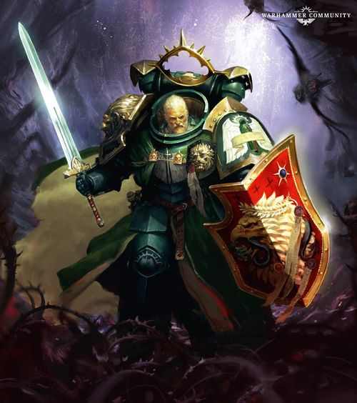

<!-- A0632-B0103 -->

原译文

An aged Lion El'Jonson returns to the Imperium 年迈的莱昂·艾尔庄森重返帝国

**校订译文**

An aged Lion El'Jonson returns to the Imperium 年迈的莱昂·艾尔’庄森重返帝国

<!-- /A0632-B0103 -->

<!-- A0632-B0104 -->
**英文原文**

As time went on, the Primarch learned how to freely enter Mirror-Caliban and use it to reach other worlds. By focusing on where he wants to go, El'Jonson causes the location to slowly appear within realm, until its forest finally fades away and the Primarch enters his destination. This ability is known as the Forestwalk, which also allows Lion El'Jonson to take others with him upon these journeys and the Primarch has used it to great effect in his battles against the Imperium's foes. Upon doing so, he is then teleported to another location, which Lion El'Jonson discovers contains Fallen Angels. The Primarch does not know, however, if this feeling that leads him to his wayward sons is an instinct of his or if another force within Mirror-Caliban is pulling him towards the Fallen Angels. The Lion has since formed a warband of loyalist Fallen known as The Risen.

<!-- /A0632-B0104 -->

<!-- A0632-B0105 -->

原译文

随着时间的推移，原体学会了如何自由进入镜像卡利班，并用它来到达其他世界。通过专注于他想去的地方，莱昂·艾尔庄森使这个地方慢慢出现在领域中，直到它的森林最终消失，原体进入了他的目的地。这种能力被称为森林穿行，它也允许莱昂·艾尔庄森在这些旅程中带上其他人，而原体在与帝国之敌的战斗中使用了这种能力。这样做后，他被传送到另一个地方，莱昂·艾尔庄森发现那里有堕天使。然而，原体不知道这种让他找到固执子嗣的感觉是他的本能，还是景象卡利班内部的另一股力量正在把他拉向堕天使。此后，莱昂组建了一支被称为赦天使的忠诚堕天使战帮。

**校订译文**

渐渐地，莱昂学会自由出入镜像卡利班，并借此前往其他世界。只要专注于目的地，那个地点便会逐渐显现在领域之中；森林最终淡去，他就抵达了目标。这种能力称为“森林穿行”，还可携带同伴同行，莱昂已将其有效用于对抗帝国之敌。借这种方式抵达某些地点时，他会发现那里恰有堕天使。他不知道，将自己引向迷途子嗣的究竟是本能，还是镜像卡利班中的另一股力量。此后，他把仍然忠诚的堕天使组织起来，组成“赦天使”。

**校注：** 前半称可专注选择目的地，后半又说受到不明力量引向堕天使；所给段落的衔接有所跳跃，保留两种机制的叙述，不擅自认定所有森林穿行都只能前往堕天使所在处。

<!-- /A0632-B0105 -->

<!-- A0632-B0106 -->
**英文原文**

Alongside Zabriel, his growing loyalist force of Risen, and the emerging Lion Guard auxilia, Lion El'Jonson worked to save his newly claimed region of Imperium Nihilus from the Ten Thousand Eyes Warband. Battling the Ten Thousand Eyes on Camarth and Avalus, on the world of Sable Lion El'Jonson was briefly captured by the Fallen Sorcerer Lord Seraphax. The Fallen Sorcerer revealed he intended to remove The Lion's soul from his body and use it as a puppet to gain audience with the Emperor. Seraphax would then use The Lion's slaved form to kill The Emperor, which Seraphax believed would elevate the Master of Mankind to a new Warp deity to destroy both Chaos and Xenos. However thanks to the intervention of The Risen, the Lion was able to escape and defeat Seraphax.

<!-- /A0632-B0106 -->

<!-- A0632-B0107 -->

原译文

除了扎布里尔、日益壮大的崛起忠诚部队和新兴的狮子卫队辅助军外，莱昂·艾尔庄森还致力于从万眼战帮中拯救他新声称的帝国暗面地区。在暗夜世界卡玛斯和阿瓦隆斯与万眼作战时，艾尔庄森被堕天使巫师塞拉法克斯领主短暂俘虏。这位堕天使巫师透露，他打算将莱昂的灵魂从身体中取出，并将其用作木偶，以获得帝皇的接见。塞拉法克斯随后将使用莱昂的奴隶形态杀死帝皇，塞拉法克斯认为这将把人类之主升格为一个新的亚空间之神，以摧毁混沌和异型。然而，多亏了赦天使的干预，莱昂得以逃脱并击败了塞拉法克斯。

**校订译文**

莱昂与扎布里尔、日益壮大的赦天使部队，以及新成立的狮子卫队辅助军并肩作战，保护他在帝国暗面新纳入庇护的地区，对抗万眼战帮。他先后在卡玛斯与阿瓦卢斯迎战万眼，后来却在暗夜星短暂落入堕天使巫师领主塞拉法克斯之手。对方透露，自己打算抽走莱昂的灵魂，把他的肉身制成傀儡，借原体的身份求见帝皇，再操纵这具躯体杀死帝皇。塞拉法克斯相信，这将使人类之主升格为新的亚空间神祇，进而毁灭混沌与异形。幸而赦天使出手，莱昂得以脱困，并击败塞拉法克斯。

**校注：** 原文地点是 Camarth、Avalus、Sable 三个世界；被俘发生于 Sable。傀儡指被抽走灵魂的肉身，而非把灵魂本身做成木偶。

<!-- /A0632-B0107 -->

<!-- A0632-B0108 图片 -->
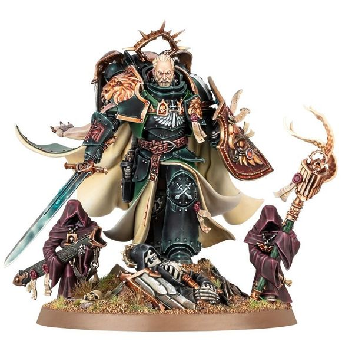

<!-- A0632-B0109 -->

原译文

Lion El'Jonson 莱昂·艾尔庄森

**校订译文**

Lion El'Jonson 莱昂·艾尔’庄森

<!-- /A0632-B0109 -->

<!-- A0632-B0110 -->
**英文原文**

After defeating Seraphax, The Lion continued to master his Forestwalk and attempted to unravel the mystery of Mirror-Caliban. The mysterious realm also once held the power sword Fealty and the Emperor's Shield, until both were discovered by Lion El'Jonson. The latter was contained in the domed building the Watcher had warned him against entering and upon doing so anyways, The Lion fought a Daemon that could shape-shift into the forms of his brother Primarchs. This ability caused him to be overwhelmed by the creature, until the Lion found the Emperor's Shield within the building and used its powers to destroy the Daemon.

<!-- /A0632-B0110 -->

<!-- A0632-B0111 -->

原译文

击败塞拉法克斯后，莱昂继续掌握他的森林穿行，并试图解开镜像卡利班的谜团。这个神秘的领域也曾拥有动力剑忠诚和帝皇之盾，直到莱昂·艾尔庄森发现了这两件装备。后者被放置在守望者警告他不要进入的圆顶建筑中，无论如何，莱昂与一个可以变形为他兄弟原体形态的恶魔进行了战斗。这种能力使他被这种生物压制，直到莱昂在建筑物内找到了帝皇之盾，并利用它的力量摧毁了恶魔。

**校订译文**

击败塞拉法克斯后，莱昂继续磨炼森林穿行，并探索镜像卡利班的秘密。动力剑“忠诚”与帝皇之盾原本都藏在这一领域，后来被他发现。盾牌位于守望者此前禁止他进入的圆顶建筑中。莱昂终究还是走了进去，迎战一头能变成各位原体兄弟模样的恶魔。他一度被这种能力压制，直到发现帝皇之盾，才借盾牌的力量将恶魔消灭。

<!-- /A0632-B0111 -->

<!-- A0632-B0112 图片 -->
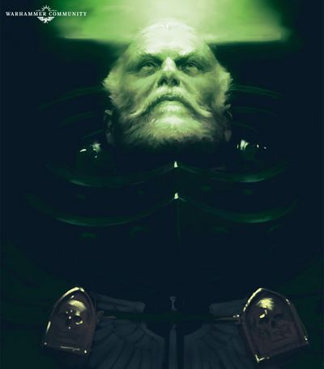

<!-- A0632-B0113 -->

原译文

Lion El'Jonson following his return to the Imperium in M42 莱昂·艾尔庄森在M42回归帝国之后

**校订译文**

Lion El'Jonson following his return to the Imperium in M42 莱昂·艾尔’庄森在M42回归帝国之后

<!-- /A0632-B0113 -->

<!-- A0632-B0114 -->
**英文原文**

Shortly after claiming the Emperor's Shield, The Lion rendezvoused with a group of Blood Angels that had arrived to investigate rumors of the Lion's return. Lion El'Jonson convenes with Dante, who shocks the Primarch by revealing that Roboute Guilliman lived.

<!-- /A0632-B0114 -->

<!-- A0632-B0115 -->

原译文

在获得帝皇之盾后不久，莱昂与一群前来调查莱昂回归传闻的圣血天使会合。莱昂·艾尔庄森与但丁会面，但丁揭示了罗伯特·基里曼的复活，震惊了原体。

**校订译文**

取得帝皇之盾不久，莱昂与前来核实其回归传闻的圣血天使会合。但丁告诉他，罗保特·基里曼仍然活着，令这位原体震惊不已。

**校注：** 原文此处仅说 lived，即仍然活着，未在此句具体叙述复活过程。

<!-- /A0632-B0115 -->

<!-- A0632-B0116 -->
### Arks of Omen 噩兆方舟

<!-- /A0632-B0116 -->

<!-- A0632-B0117 -->
**英文原文**

Boarding the Blood Angels flagship Absolution's Ire, the Lion made for the Idolatros System before using his Forestwalk to journey to the Wyrmwood amidst the fierce Battle of Idolatros, reappearing before the Unforgiven as they battled the forces of Vashtorr, Black Legion, and World Eaters.

<!-- /A0632-B0117 -->

<!-- A0632-B0118 -->

原译文

登上圣血天使的旗舰赦免之怒号，莱昂前往盲信星系，然后在激烈的盲信星之战中，用他的森林穿行前往龙林星，在不可饶恕者与瓦什托尔、黑色军团和吞世者的部队作战时，再次出现在他们面前。

**校订译文**

莱昂登上圣血天使旗舰赦免之怒号，前往盲信星系。盲信星之战正激烈进行时，他借森林穿行抵达龙林星，出现在戴罪者面前；他们当时正与瓦什托尔、黑色军团及吞世者的部队交战。

<!-- /A0632-B0118 -->

<!-- A0632-B0119 -->
**英文原文**

Upon manifesting, the Lion immediately saved Dante from the Daemon Primarch Angron. The two Primarchs subsequently engaged in a massive duel across Wyrmwood until Lion El'Jonson was able to use Angron's own attack to force the tip of Fealty into the Daemon's throat. After dispatching Angron with the Emperor's Shield, Lion El'Jonson and his Risen cleared a path for the Blood Angels and Unforgiven to evacuate back to their ships and escape as Wyrmwood activated The Key. Afterwards, Lion El'Jonson was declared the Knight of Nihilus.

<!-- /A0632-B0119 -->

<!-- A0632-B0120 -->

原译文

在显现后，莱昂立即将但丁从恶魔原体安格隆手中救了出来。两位原体随后在龙林星进行了一场大规模的决斗，直到莱昂·艾尔庄森能够利用安格隆自己的攻击迫使忠诚的尖端进入恶魔的喉咙。在用帝皇之盾驱逐安格隆后，莱昂·艾尔庄森和他的崛起为圣血天使和不可饶恕者开辟了一条道路，让他们撤退回他们的船上，并在龙林星激活钥匙时逃离。之后，莱昂·艾尔庄森被宣布为暗面骑士。

**校订译文**

莱昂一现身，便从恶魔原体安格隆手中救下但丁。两位原体随后在龙林星展开惊天动地的决斗。莱昂借安格隆自身的攻势，将“忠诚”的剑尖送入对方咽喉，再以帝皇之盾将他击败。随后，他与赦天使杀出通路，掩护圣血天使和戴罪者返回舰船，在龙林星启动“钥匙”之际脱离战场。此后，莱昂获称“暗面骑士”。

<!-- /A0632-B0120 -->

<!-- A0632-B0121 图片 -->
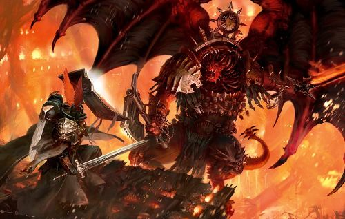

<!-- A0632-B0122 -->

原译文

Lion El'Jonson faces Angron on Wyrmwood 莱昂·艾尔庄森在龙林星面对安格隆

**校订译文**

Lion El'Jonson faces Angron on Wyrmwood 莱昂·艾尔’庄森在龙林星面对安格隆

<!-- /A0632-B0122 -->

<!-- A0632-B0123 -->
**英文原文**

Since his reawakening, the Knight of Nihilus has shown an even greater disdain for what has become of the Imperium than even Guilliman. When he appears on worlds, he often bypasses the local Governor and Imperial authorities and deals personally with the local civilians and soldiery. The Lion's coming has often heralded a vast regime change and reform process, for few of these leaders will dare defy a Primarch.

<!-- /A0632-B0123 -->

<!-- A0632-B0124 -->

原译文

自从他苏醒以来，暗面骑士对帝国的现状表现出的蔑视甚至比基里曼还要大。当他出现在世界上时，他经常绕过当地总督和帝国当局，亲自与当地平民和士兵打交道。莱昂的到来往往预示着一场巨大的政权更迭和改革进程，因为这些领导人中很少有人敢于挑战一位原体。

**校订译文**

自从他苏醒以来，暗面骑士对帝国的现状表现出的蔑视甚至比基里曼还要大。当他出现在世界上时，他经常绕过当地总督和帝国当局，亲自与当地平民和士兵打交道。莱昂的到来往往预示着一场巨大的政权更迭和改革进程，因为这些领导人中很少有人敢于挑战一位原体。

<!-- /A0632-B0124 -->

<!-- A0632-B0125 -->
## Wargear 武器装备

原题：Wargear 战备

<!-- /A0632-B0125 -->

<!-- A0632-B0126 -->
### Heresy-era 叛乱时期

原题：Heresy-era 叛乱前

**校注：** Heresy-era 是叛乱时期，非叛乱之前。

<!-- /A0632-B0126 -->

<!-- A0632-B0127 -->

原译文

Leonine Panoply 狮甲

**校订译文**

Leonine Panoply 狮甲

<!-- /A0632-B0127 -->

<!-- A0632-B0128 -->

原译文

Lion Helm 狮盔

**校订译文**

Lion Helm 狮盔

<!-- /A0632-B0128 -->

<!-- A0632-B0129 -->

原译文

Lion Sword 狮剑

**校订译文**

Lion Sword 狮剑

<!-- /A0632-B0129 -->

<!-- A0632-B0130 -->

原译文

Wolf Blade 狼刃

**校订译文**

Wolf Blade 狼刃

<!-- /A0632-B0130 -->

<!-- A0632-B0131 -->

原译文

Fusil Actinaeus 阿克缇纳厄斯离子枪

**校订译文**

Fusil Actinaeus 阿克缇纳厄斯离子枪

<!-- /A0632-B0131 -->

<!-- A0632-B0132 -->

原译文

Stasis Grenades 停滞手榴弹

**校订译文**

Stasis Grenades 停滞手榴弹

<!-- /A0632-B0132 -->

<!-- A0632-B0133 -->
### Modern-era 现代

<!-- /A0632-B0133 -->

<!-- A0632-B0134 -->

原译文

Fealty 忠诚

**校订译文**

Fealty 忠诚

<!-- /A0632-B0134 -->

<!-- A0632-B0135 -->

原译文

Emperor's Shield 帝皇之盾

**校订译文**

Emperor's Shield 帝皇之盾

<!-- /A0632-B0135 -->

<!-- A0632-B0136 -->

原译文

Arma Luminis 流光

**校订译文**

Arma Luminis 流光

<!-- /A0632-B0136 -->

<!-- A0632-B0137 -->

原译文

Iron Halo 铁光环

**校订译文**

Iron Halo 铁光环

<!-- /A0632-B0137 -->

本篇核心术语与暂定项

以下列出本篇出现的英文原形及核心术语表用词。同形词可能指不同对象，具体词义以本篇正文和校注为准；单复数、别名和仅见于图注的名称可能尚未列入。完整候选见[术语表](../../术语表/双语术语候选.csv)。

| 英文 | 采用中文 | 状态 |
| --- | --- | --- |
| Blood Angels | 圣血天使 | 官方已核对 |
| Dark Angels | 黑暗天使 | 官方已核对 |
| Space Wolves | 太空野狼 | 官方已核对 |
| World Eaters | 吞世者 | 官方已核对 |
| Librarian | 智库员 | 官方已核对 |
| Terminator | 终结者 | 官方已核对 |
| Roboute Guilliman | 罗保特·基里曼 | 官方已核对 |
| Ultramar | 奥特拉玛 | 官方已核对 |
| Ultramarines | 极限战士 | 官方已核对 |
| Horus Heresy | 荷鲁斯之乱 | 官方已核对 |
| Astronomican | 星炬 | 暂定 |
| Warp | 亚空间 | 官方已核对 |
| Imperium | 帝国 | 暂定·简称 |
| Warp Jump | 亚空间跳跃 | 暂定 |
| Sorcerer | 巫师 | 官方已核对 |
| Eye of Terror | 恐惧之眼 | 官方已核对 |
| Emperor | 帝皇 | 官方已核对 |
| Primarch | 原体 | 官方已核对 |
| Forge World | 铸造世界 | 暂定·官方待核 |
| Word Bearers | 怀言者 | 暂定·官方待核 |
| Black Legion | 黑色军团 | 暂定·官方待核 |
| Night Lords | 午夜领主 | 暂定·官方待核 |
| The Order | 秩序 | 暂定·官方待核 |
| Great Crusade | 大远征 | 暂定·官方待核 |
| Barbarus | 巴巴鲁斯 | 暂定·官方待核 |
| Ferrus Manus | 费鲁斯·马努斯 | 暂定·官方待核 |
| Terra | 泰拉 | 暂定·官方待核 |
| Horus | 荷鲁斯 | 暂定·官方待核 |
| Sons of Horus | 荷鲁斯之子 | 暂定·官方待核 |
| Gordian League | 戈尔迪安联盟 | 暂定·官方待核 |
| Lion El'Jonson | 莱昂·艾尔’庄森 | 官方已核对 |
| Diamat | 迪亚马特 | 暂定·官方待核 |
| Iron Hands | 钢铁之手 | 暂定·官方待核 |
| Imperium Nihilus | 帝国暗面 | 暂定·官方待核 |
| Golden Throne | 黄金王座 | 暂定·官方待核 |
| Cabal | 密教 | 暂定·官方待核 |
| Protector | 守护者 | 暂定·官方待核 |
| Konrad Curze | 康拉德·科兹 | 暂定·官方待核 |
| Thramas Crusade | 萨拉玛斯远征 | 暂定·官方待核 |
| Deeper | 深人 | 暂定·官方待核 |
| Kiavahr | 基亚瓦尔 | 暂定·官方待核 |
| Caliban | 卡利班 | 暂定·官方待核 |
| Davin | 戴文 | 暂定·官方待核 |
| Deliverance | 拯救星 | 暂定·官方待核 |
| Chemos | 彻莫斯 | 暂定·官方待核 |
| Macragge | 马库拉格 | 暂定·官方待核 |
| Sotha | 索萨 | 暂定·官方待核 |
| Imperium Secundus | 第二帝国 | 暂定·官方待核 |
| Lord Protector | 护国领主 | 暂定·官方待核 |
| Barabas Dantioch | 巴拉巴斯·丹提欧克 | 暂定·官方待核 |
| Pharos | 灯塔 | 暂定·官方待核 |
| Grandmaster | 大导师 | 暂定 |
| Master | 导师（审判庭职衔）／舰务官（舰员职务） | 语境定译·官方待核 |
| Rangdan Xenocides | 冉丹灭绝战争 | 暂定·官方待核 |
| Unforgiven | 戴罪者 | 暂定·官方待核 |
| Ancient | 旗手 | 官方已核对 |
| Veil | 韦尔 | 暂定·官方待核 |
| Raven Guard | 暗鸦守卫 | 官方已核 |
| Isstvan | 伊斯塔万 | 暂定·官方待核 |
| First Captain | 第一连长 | 暂定·官方待核 |
| Holguin | 霍尔金 | 暂定·官方待核 |
| Champion | 冠军 | 暂定·官方待核 |
| Power Armour | 动力盔甲 | 暂定·官方待核 |
| Dreadwing | 恐翼 | 暂定·官方待核 |
| Space Marine | 星际战士 | 暂定·官方待核 |
| Fortress-monastery | 要塞修道院 | 暂定·官方待核 |
| Captain | 连长 | 暂定·官方待核 |
| Brother | 修士 | 暂定·官方待核 |
| Dante | 但丁 | 暂定·官方待核 |
| The Angel | 天使 | 暂定·官方待核 |
| Supreme Grand Master | 至高大导师 | 暂定·官方待核 |
| Gloriana Class Battleship | 荣光女王级战列舰 | 暂定·官方待核 |
| Grief | 格里夫 | 暂定·官方待核 |
| Lorgar | 珞珈 | 暂定·官方待核 |
| Powers | 能天使 | 暂定·官方待核 |
| Alpharius | 阿尔法瑞斯 | 暂定·官方待核 |
| Hexagrammaton | 六翼 | 暂定·官方待核 |
| Host | 天军 | 暂定·官方待核 |
| Risen | 赦天使 | 暂定·官方待核 |
| Pyrhus Calagat | 皮鲁斯·卡拉加特 | 暂定·官方待核 |
| Calibanite | 卡利班诸语 | 暂定·官方待核 |
| Xenos | 异形 | 暂定·官方待核 |
| Rangdan | 冉丹 | 暂定·官方待核 |
| Ironwing | 铁翼 | 暂定·官方待核 |
| Kairos Fateweaver | 凯洛斯·织命者 | 官方已核对 |
| Lord of Change | 诡变领主 | 官方已核对 |
| Soul Grinder | 磨魂者 | 官方已核对 |
| Strain | 群系 | 暂定·官方待核 |
| Angron | 安格隆 | 官方已核对 |
| Passage of the Angels | 天使前进 | 暂定·官方待核 |
| Absolution's Ire | 赦免之怒号 | 暂定·官方待核 |
| Vengeance | 复仇号 | 暂定·官方待核 |
| Veritas Ferrum | 钢铁真理号 | 暂定·官方待核 |
| Light of the Pharos | 灯塔之光号 | 暂定·官方待核 |
| Grand Master | 大导师 | 暂定·官方待核 |
| Mirror-Caliban | 镜像卡利班 | 暂定·官方待核 |
| Forestwalk | 森林穿行 | 暂定·官方待核 |
| Zabriel | 扎布里尔 | 暂定·官方待核 |
| Seraphax | 塞拉法克斯 | 暂定·官方待核 |
| Camarth | 卡玛斯 | 暂定·官方待核 |
| Avalus | 阿瓦卢斯 | 暂定·官方待核 |
| Sable | 暗夜星 | 暂定·官方待核 |
| Tuchulcha | 图丘查 | 暂定·官方待核 |
| Zahariel | 扎哈瑞尔 | 暂定·官方待核 |
| Fealty | 忠诚 | 暂定·官方待核 |
| Knight of Nihilus | 暗面骑士 | 暂定·官方待核 |
| Shield Worlds | 盾牌诸世界 | 暂定·官方待核 |
| Gramarye | 格拉马利 | 暂定·官方待核 |
| Lion Guard | 狮子卫队 | 暂定·官方待核 |
| Ten Thousand Eyes | 万眼 | 暂定·官方待核 |
| The Key | 钥匙 | 暂定·官方待核 |
| Sevatar | 赛维塔 | 暂定·官方待核 |
| Tsagualsa | 查古尔萨 | 暂定·官方待核 |
| Invincible Reason | 无敌理性号 | 暂定·官方待核 |
| Dwell | 德威尔 | 暂定·官方待核 |
| Madail | 马代尔 | 暂定·官方待核 |
| Samothrace | 萨莫色雷斯号 | 暂定·官方待核 |
| The Dark | 《黑暗》 | 暂定·官方待核 |
| The Blood | 鲜血 | 暂定·官方待核 |
| Battle of Pyrrhan | 派尔罕之战 | 暂定·官方待核 |
| Council of Masters | 大师议会 | 暂定·官方待核 |
| Warp Storm | 亚空间风暴 | 暂定·官方待核 |
| Ruinstorm | 毁灭风暴 | 暂定·官方待核 |
| System | 星系（恒星系统） | 暂定·官方待核 |
| Xana | 夏娜 | 暂定·官方待核 |
| Illyrium | 伊利里亚姆 | 暂定·官方待核 |
| Corruption | 腐败 | 暂定·官方待核 |
| Zaramund | 扎拉蒙德 | 暂定·官方待核 |
| Omen | 预兆号 | 暂定·官方待核 |
| Ferrum | 钢铁号 | 暂定·官方待核 |
| Bolt Weapon | 爆矢武器 | 暂定·官方待核 |
| Bolt | 爆矢 | 暂定·官方待核 |
| Wyrmwood | 龙林星 | 暂定·官方待核 |
| Idolatros System | 盲信星系 | 暂定·官方待核 |
| Faash | 法什 | 暂定·官方待核 |

