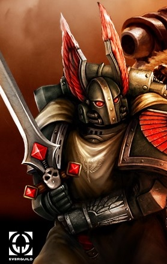
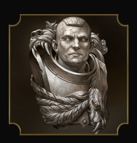
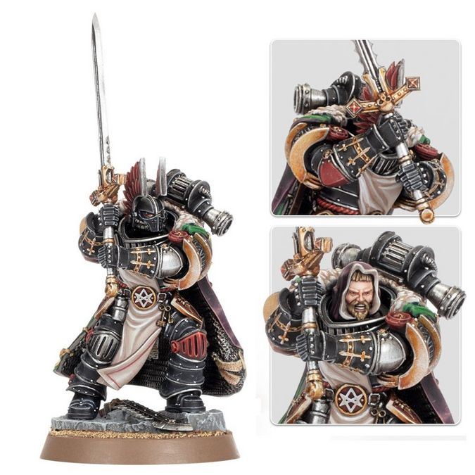

# 0633 考斯韦恩 Corswain

精校状态：中文行文已逐段精校，部分术语仍为暂定

分类：人类帝国 / 黑暗天使

原文来源：https://www.bilibili.com/opus/1206946798716846102

原作者：帝国神选罐头

原文时间：2026年05月27日 11:30

[返回分类目录](目录.md) · [全书目录](../../目录.md)

<!-- A0633-B0001 -->

原译文

"I left my sword in a Primarch’s Spine." “我把剑留在了一个原体的脊椎里。”

**校订译文**

"I left my sword in a Primarch’s Spine." “我把剑留在了一个原体的脊椎里。”

<!-- /A0633-B0001 -->

<!-- A0633-B0002 -->
**英文原文**

Corswain, the Hound of Caliban, was a Lord Commander and the Captain-Paladin of the Dark Angels' 9th Order during the Great Crusade and Horus Heresy, later commanding half the Legion as The Lion's Seneschal.

<!-- /A0633-B0002 -->

<!-- A0633-B0003 -->

原译文

考斯韦恩，卡利班猎犬，在大远征和荷鲁斯叛乱期间是一名领主指挥官和黑暗天使第九骑士团的圣骑士连长，后来作为莱昂的总管指挥了一半的军团。

**校订译文**

考斯韦恩，卡利班猎犬，在大远征和荷鲁斯之乱期间是一名领主指挥官和黑暗天使第九骑士团的圣骑士连长，后来作为莱昂的总管指挥了一半的军团。

<!-- /A0633-B0003 -->

<!-- A0633-B0004 -->
### Corswain 考斯韦恩

<!-- /A0633-B0004 -->

<!-- A0633-B0005 图片 -->

<!-- A0633-B0006 -->

原译文

Hound of Caliban 卡利班猎犬

**校订译文**

Hound of Caliban 卡利班猎犬

<!-- /A0633-B0006 -->

<!-- A0633-B0007 -->
## Biography 传记

<!-- /A0633-B0007 -->

<!-- A0633-B0008 -->
### The Great Crusade 大远征

<!-- /A0633-B0008 -->

<!-- A0633-B0009 -->
**英文原文**

Corswain was born on Caliban but was not inducted into The Order. He was uniquely placed to bridge the divisions within the First Legion during its formation into the Dark Angels under Lion El'Jonson's leadership. He was groomed to serve not any one Host or Order but to command the respect and knowledge of all.

<!-- /A0633-B0009 -->

<!-- A0633-B0010 -->

原译文

考斯韦恩出生在卡利班，但没有加入骑士团。在莱昂·艾尔庄森的领导下，他在第一军团组建为黑暗天使的过程中，处于独特的地位，可以弥合第一军团内部的分歧。他被培养成不是为任何一个天军或骑士团服务，而是要赢得所有人的尊重和知识。

**校订译文**

考斯韦恩生于卡利班，却未曾加入当地骑士团。当莱昂·艾尔’庄森将第一军团重塑为黑暗天使时，这一独特背景使他能够弥合军团内部的分歧。他接受的培养并非为了效忠某一支天军或某个战团结社，而是为了熟悉所有派系的知识，并赢得它们共同的尊重。

**校注：** command the respect and knowledge of all 在此是获得各组织的尊重、掌握其知识，不是“赢得知识”。Order 同时用于卡利班旧骑士团和军团组织，正文按具体所指展开。

<!-- /A0633-B0010 -->

<!-- A0633-B0011 -->
**英文原文**

Corswain became the Paladin of the 9th Order under Master Alajos during the Great Crusade. The finest swordsman in the Legion, he was the bearer of the Mantle of the Champion and one of only two Dark Angels ever to best Alajos. In time his reputation grew similar to the likes of Raldoron and Sigismund.

<!-- /A0633-B0011 -->

<!-- A0633-B0012 -->

原译文

在大远征期间，考斯韦恩成为阿拉霍斯导师手下的第九骑士团的圣骑士。他是军团中最优秀的剑士，是冠军斗篷的持有者，也是仅有的两位击败阿拉霍斯的黑暗天使之一。随着时间的推移，他的声誉逐渐与拉多隆和西吉斯蒙德等人相似。

**校订译文**

大远征期间，考斯韦恩成为阿拉霍斯导师麾下第九骑士团的圣骑士。他是军团最出色的剑士，持有冠军斗篷，也是仅有的两名曾击败阿拉霍斯的黑暗天使之一。他的声望逐渐与拉多隆、西吉斯蒙德等人比肩。

<!-- /A0633-B0012 -->

<!-- A0633-B0013 -->
**英文原文**

He was among the forces of the 9th Order that stripped Luther of his ships after he disobeyed his orders to remain on Caliban in order to aid Horus at Zaramund in 970.M30.

<!-- /A0633-B0013 -->

<!-- A0633-B0014 -->

原译文

970.M30，卢瑟违背了留在卡利班的命令，在扎拉蒙德协助荷鲁斯，他是第九骑士团的一员，该骑士团剥夺了卢瑟的船只。

**校订译文**

970.M30，卢瑟违抗留守卡利班的命令，前往扎拉蒙德援助荷鲁斯。考斯韦恩当时随第九骑士团前去收缴了他的舰船。

<!-- /A0633-B0014 -->

<!-- A0633-B0015 -->
### Horus Heresy 荷鲁斯之乱

原题：Horus Heresy 荷鲁斯叛乱

<!-- /A0633-B0015 -->

<!-- A0633-B0016 -->
### Thramas Crusade 萨拉玛斯远征

<!-- /A0633-B0016 -->

<!-- A0633-B0017 -->
**英文原文**

After the outbreak of the Horus Heresy, Corswain fought alongside his Primarch Lion El'Jonson against the Night Lords in the Thramas Crusade. On Tsagualsa, Corswain and Alajos accompanied the Lion when he met with the Primarch of the Night Lords Konrad Curze and his own Honour Guard. After battle broke out between the two sides, Corswain and Alajos battled Sevatar and Shang. Corswain was unable to prevent Captain Alajos from being killed, but impaled Curze as he strangled the Lion - leaving the sword in the primarch's spine.

<!-- /A0633-B0017 -->

<!-- A0633-B0018 -->

原译文

荷鲁斯叛乱爆发后，考斯韦恩在萨拉玛斯远征中与他的原体莱昂·艾尔庄森并肩作战，对抗午夜领主。在察古尔萨，考斯韦恩和阿拉霍斯陪同莱昂会见了午夜领主的原体康拉德·科兹和他自己的荣誉卫队。双方爆发战斗后，考斯韦恩和阿拉霍斯与赛维塔和沈交战。考斯韦恩无法阻止阿拉霍斯连长被杀，但在科兹勒住莱昂时刺穿了他，将剑留在了原体的脊椎中。

**校订译文**

荷鲁斯之乱爆发后，考斯韦恩在萨拉玛斯远征中与他的原体莱昂·艾尔’庄森并肩作战，对抗午夜领主。在察古尔萨，考斯韦恩和阿拉霍斯陪同莱昂会见了午夜领主的原体康拉德·科兹和他自己的荣誉卫队。双方爆发战斗后，考斯韦恩和阿拉霍斯与赛维塔和沈交战。考斯韦恩无法阻止阿拉霍斯连长被杀，但在科兹勒住莱昂时刺穿了他，将剑留在了原体的脊椎中。

<!-- /A0633-B0018 -->

<!-- A0633-B0019 -->
**英文原文**

Two years into the Thramas Crusade, Corswain was made Seneschal and, after the Battle of Perditus, given command of half of the remaining Legion to hunt down and eliminate First Captain Calas Typhon and his Death Guard splinter fleet while the Lion travelled with the other half to Ultramar. Sustaining heavy casualties at the hands of the Death Guard, Corswain sent a small number of volunteers to Caliban with transports to bring reinforcement. However these reinforcements never arrived, angering Corswain. He eventually rendezvoused with Luther and his secretly Fallen warriors at Zaramund, unaware that Luther had just secured the system for himself. Luther had fully committed himself to independence from the Imperium, and was secretly harboring the fleet of Death Guard which Corswain was pursuing. Luther deceived Corswain, stating that they had driven off the Death Guard. Corswain scolded Luther for violating the Lion's edict to not leave Caliban but otherwise fell for the ploy.

<!-- /A0633-B0019 -->

<!-- A0633-B0020 -->

原译文

萨拉玛斯远征两年后，考斯韦恩被任命为总管，在佩迪图斯之战后，他被授予剩余军团一半的指挥权，追捕并消灭第一连长卡拉斯·提丰及其死亡守卫分裂舰队，而莱昂则与另一半前往奥特拉玛。考斯韦恩在死亡守卫手中遭受了重大伤亡，他派了一小部分志愿者带着运输舰前往卡利班增援。然而，这些增援部队从未到达，这激怒了考斯韦恩。他最终在扎拉蒙德与卢瑟和他的秘密堕天使战士会合，不知道卢瑟刚刚为自己保护了这个星系。卢瑟完全致力于从帝国中独立出来，并秘密窝藏着考斯韦恩正在追捕的死亡守卫舰队。卢瑟欺骗了考斯韦恩，声称他们已经赶走了死亡守卫。考斯韦恩斥责卢瑟违反了莱昂会不离开卡利班的法令，但除此之外，他还是落入了这一伎俩的圈套。

**校订译文**

萨拉玛斯远征开始两年后，考斯韦恩获任总管。佩迪图斯之战后，他接掌剩余军团的一半兵力，追剿第一连长卡拉斯·提丰及其死亡守卫分遣舰队，莱昂则率另一半前往奥特拉玛。遭死亡守卫重创后，考斯韦恩派少量志愿者乘运输舰返回卡利班，接取援军。然而，援军始终没有抵达，令他十分恼怒。他最终在扎拉蒙德会合卢瑟及其暗中叛变的战士，却不知道卢瑟刚刚为自己夺下了该星系。卢瑟已决意脱离帝国，还秘密庇护着考斯韦恩追逐的死亡守卫舰队。他谎称自己赶走了死亡守卫。考斯韦恩虽斥责他违背莱昂的留守命令，却仍相信了这番说辞。

**校注：** 志愿者前往卡利班是接运援军回来，非前往增援卡利班。secured the system for himself 指卢瑟夺为己有，而非替帝国保护星系。

<!-- /A0633-B0020 -->

<!-- A0633-B0021 -->
### The Siege of Terra 泰拉围城

<!-- /A0633-B0021 -->

<!-- A0633-B0022 -->
**英文原文**

Corswain next appeared during the Siege of Terra, arriving at the edge of the Sol System to rendezvous with Admiral Niora Su-Kassen and the Phalanx and proclaimed his forces were ready to fight for the Emperor. Hiding at the edges of the Sol System, Corswain convinced Su-Kassen to a plan to have him and his warriors land on Terra to take part in the battle. Using the Imperator Somnium, Corswain was able to break the traitor blockade and land on the Hollow Mountain. The Dark Angels found the complex occupied by the forces of Chaos, and he was nearly overcome by the Daemon Vassukella. Saved by Vassago, Corswain expressed his intent to reactivate the Astronomican.

<!-- /A0633-B0022 -->

<!-- A0633-B0023 -->

原译文

考斯韦恩随后出现在泰拉围城中，抵达太阳系边缘，与海军上将尼奥拉·苏-卡珊和山阵号会合，并宣布他的部队已准备好为帝皇而战。隐藏在太阳系的边缘，考斯韦恩说服了苏-卡珊让他和他的战士登陆泰拉参加战斗的计划。使用帝皇幻梦号，考斯韦恩能够打破叛徒的封锁，降落在空心山脉上。黑暗天使发现混沌部队占据了这个建筑群，他几乎被恶魔瓦苏凯拉征服。在瓦萨戈的拯救下，考斯韦恩表达了他重新激活星炬的意图。

**校订译文**

泰拉围城期间，考斯韦恩抵达太阳系边缘，与海军上将尼奥拉·苏·卡森及山阵号会合，宣布所部已准备好为帝皇而战。隐蔽在星系外围时，他说服苏·卡森支持自己的登陆计划。借助帝皇幻梦号，他突破叛军封锁，将战士送上泰拉的空心山脉。黑暗天使发现当地建筑群已被混沌占据，考斯韦恩更险些败于恶魔瓦苏凯拉之手。瓦萨戈救下他后，他表明要重新点燃星炬。

<!-- /A0633-B0023 -->

<!-- A0633-B0024 图片 -->

<!-- A0633-B0025 -->

原译文

Corswain 考斯韦恩

**校订译文**

Corswain 考斯韦恩

<!-- /A0633-B0025 -->

<!-- A0633-B0026 -->
**英文原文**

In the final hours of the Siege, Corswain was horrified to learn of the murder of Vassago but faced more pressing matters as the Death Guard under Typhus moved in to retake the Astronomican. Despite being vastly outnumbered, Corswain slew a hulking Plague Marine but was wounded. He was steadied by Zahariel El'Zurias, who had taken the mantle of the Lord Cypher. In the subsequent battle, the Dark Angels were nearly overwhelmed by Typhus and the Death Guard but Corswain was committed to using Cypher's psychic talents to reactivate the Astronomican and guide Guilliman's fleet to Terra.

<!-- /A0633-B0026 -->

<!-- A0633-B0027 -->

原译文

在围城的最后几个小时里，考斯韦恩得知瓦萨戈被谋杀的消息后感到震惊，但随着泰丰斯手下的死亡守卫进入夺回星炬，他面临着更紧迫的问题。尽管寡不敌众，考斯韦恩还是杀死了一名庞大的瘟疫战士，但受了伤。他被扎哈里尔·艾尔'苏里亚斯稳定住了，他接过了塞弗领主的衣钵。在随后的战斗中，黑暗天使几乎被泰丰斯和死亡守卫压倒，但考斯韦恩致力于利用塞弗的灵能天赋重新激活星炬，并引导基里曼的舰队前往泰拉。

**校订译文**

围城最后数小时，考斯韦恩震惊地得知瓦萨戈遭到谋杀，却必须先应对更紧迫的威胁：泰弗斯率死亡守卫前来夺回星炬。敌众我寡，他杀死一名体型庞大的瘟疫战士，自己也负了伤。已继任塞弗领主的扎哈瑞尔·艾尔’苏里亚斯扶住了他。随后的战斗中，黑暗天使几乎被敌人淹没，但考斯韦恩仍决意借塞弗的灵能重新点燃星炬，为基里曼的舰队指引泰拉的位置。

**校注：** steadied 指负伤后被扶稳，非精神被稳定。塞弗领主是扎哈瑞尔当时继承的职衔；不据同名人物擅定其后所有 Cypher 身份。

<!-- /A0633-B0027 -->

<!-- A0633-B0028 -->
**英文原文**

Alongside Sigismund, Corswain led the defence of the Hollow Mountain, coming into personal conflict with Typhus. All seemed lost until Euphrati Keeler and her followers were able to reactivate the Astronomican, throwing back the traitors and giving the location of Terra to Guilliman's fleet of reinforcements.

<!-- /A0633-B0028 -->

<!-- A0633-B0029 -->

原译文

与西吉斯蒙德并肩作战，考斯韦恩领导了空心山脉的防御，与泰丰斯爆发了个人冲突。一切似乎都输了，直到幼发拉底·基勒和她的追随者能够重新激活星炬，击退叛徒，并将泰拉的位置交给基里曼的增援舰队。

**校订译文**

考斯韦恩与西吉斯蒙德共同主持空心山脉的防御，并亲自迎战泰弗斯。战局一度濒临绝望，直到尤弗拉蒂·琪乐及其信众重新点燃星炬，逼退叛军，也让基里曼的援军舰队得以锁定泰拉。

<!-- /A0633-B0029 -->

<!-- A0633-B0030 -->
**英文原文**

Corswain survived the Siege and reunited with Lion El'Jonson on Terra. He then became The Lion's emissary, working with the similarly appointed Archamus II of the Imperial Fists and Bjorn of the Space Wolves to initiate Rogal Dorn's plan for a new crusade of vengeance against the fleeing Traitors.

<!-- /A0633-B0030 -->

<!-- A0633-B0031 -->

原译文

考斯韦恩在围城中幸存下来，并在泰拉上与莱昂·艾尔庄森重聚。然后，他成为了莱昂的使者，与同样被任命的帝国之拳的阿尔卡穆斯二世和太空野狼的比约恩合作，启动了罗格·多恩对逃跑的叛徒进行新的复仇远征的计划。

**校订译文**

考斯韦恩在围城中幸存，并在泰拉与莱昂·艾尔’庄森重逢。此后，他担任原体使者，与同样受命的帝国之拳阿尔卡穆斯二世、太空野狼比约恩协力，推动罗格·多恩针对逃亡叛军发起新一轮复仇远征的计划。

<!-- /A0633-B0031 -->

<!-- A0633-B0032 -->
### Return to Caliban 回归卡利班

<!-- /A0633-B0032 -->

<!-- A0633-B0033 -->
**英文原文**

Corswain survived the Heresy to return to Caliban. During the Destruction of Caliban, he was among the first to make planetfall and do battle with the Fallen. During the battle, Corswain cornered and duelled the Lord Cypher.

<!-- /A0633-B0033 -->

<!-- A0633-B0034 -->

原译文

考斯韦恩在叛乱中幸存下来，回到了卡利班。在卡利班毁灭期间，他是第一个让行星陨落并与堕天使作战的人之一。在战斗中，考斯韦恩将塞弗领主逼入绝境并与之决斗。

**校订译文**

叛乱之后，考斯韦恩生还并返回卡利班。在卡利班毁灭之战中，他是最早登陆地表、迎战堕天使的战士之一。战斗期间，他将塞弗领主逼入绝境，并与之决斗。

**校注：** make planetfall 指登陆行星，非使行星陨落。

<!-- /A0633-B0034 -->

<!-- A0633-B0035 -->
### Legacy 遗产

<!-- /A0633-B0035 -->

<!-- A0633-B0036 -->
**英文原文**

Corswain is a legendary figure to the Dark Angels of the 41st Millennium. The sword he wielded during the fall of Caliban is known as the Blade of Corswain, presented as the bladesman's honour to the finest swordsman in the Ravenwing. He also lends his name to the Lost Mace of Corswain, a relic power maul used by the Deathwing.

<!-- /A0633-B0036 -->

<!-- A0633-B0037 -->

原译文

考斯韦恩是41个千年黑暗天使的传奇人物。他在卡利班陷落期间挥舞的剑被称为考斯韦恩之剑，作为剑士的荣誉颁发给鸦翼最优秀的剑士。他还被以自己的名字命名考斯韦恩的失落之杖，这是死翼使用的一种圣物动力槌。

**校订译文**

到第 41 千年，考斯韦恩已成为黑暗天使的传奇人物。他在卡利班陷落时使用的剑被称为“考斯韦恩之剑”，作为剑士的殊荣，授予鸦翼中剑术最出色的人。他的名字也被用于“考斯韦恩的失落之杖”——死翼使用的一件圣物动力槌。

<!-- /A0633-B0037 -->

<!-- A0633-B0038 图片 -->

<!-- A0633-B0039 -->

原译文

Corswain 考斯韦恩

**校订译文**

Corswain 考斯韦恩

<!-- /A0633-B0039 -->

<!-- A0633-B0040 -->
## Wargear 武器装备

原题：Wargear 战备

<!-- /A0633-B0040 -->

<!-- A0633-B0041 -->

原译文

The Blade 剑刃

**校订译文**

The Blade 剑刃

<!-- /A0633-B0041 -->

<!-- A0633-B0042 -->

原译文

Armour of the Forest 森林之甲

**校订译文**

Armour of the Forest 森林之甲

<!-- /A0633-B0042 -->

<!-- A0633-B0043 -->

原译文

Mantle of the Champion 冠军斗篷

**校订译文**

Mantle of the Champion 冠军斗篷

<!-- /A0633-B0043 -->

本篇核心术语与暂定项

以下列出本篇出现的英文原形及核心术语表用词。同形词可能指不同对象，具体词义以本篇正文和校注为准；单复数、别名和仅见于图注的名称可能尚未列入。完整候选见[术语表](../../术语表/双语术语候选.csv)。

| 英文 | 采用中文 | 状态 |
| --- | --- | --- |
| Dark Angels | 黑暗天使 | 官方已核对 |
| Space Wolves | 太空野狼 | 官方已核对 |
| Death Guard | 死亡守卫 | 官方已核对 |
| Ultramar | 奥特拉玛 | 官方已核对 |
| Horus Heresy | 荷鲁斯之乱 | 官方已核对 |
| Astronomican | 星炬 | 暂定 |
| Imperium | 帝国 | 暂定·简称 |
| Imperial Fists | 帝国之拳 | 暂定 |
| Phalanx | 山阵号 | 暂定 |
| Emperor | 帝皇 | 官方已核对 |
| Primarch | 原体 | 官方已核对 |
| Plague Marine | 瘟疫战士 | 官方已核对 |
| Night Lords | 午夜领主 | 暂定·官方待核 |
| The Order | 秩序 | 暂定·官方待核 |
| Great Crusade | 大远征 | 暂定·官方待核 |
| Terra | 泰拉 | 暂定·官方待核 |
| Murder | 谋杀 | 暂定·官方待核 |
| Horus | 荷鲁斯 | 暂定·官方待核 |
| Lion El'Jonson | 莱昂·艾尔’庄森 | 官方已核对 |
| Konrad Curze | 康拉德·科兹 | 暂定·官方待核 |
| Thramas Crusade | 萨拉玛斯远征 | 暂定·官方待核 |
| Caliban | 卡利班 | 暂定·官方待核 |
| Master | 导师（审判庭职衔）／舰务官（舰员职务） | 语境定译·官方待核 |
| Euphrati Keeler | 尤弗拉蒂·琪乐 | 暂定 |
| Honour Guard | 荣誉卫队 | 暂定·官方待核 |
| Lord Commander | 领主指挥官 | 暂定·官方待核 |
| The Battle of Perditus | 佩迪图斯之战 | 暂定·官方待核 |
| Sol | 太阳系 | 暂定·官方待核 |
| The Phalanx | 山阵号 | 暂定·官方待核 |
| First Captain | 第一连长 | 暂定·官方待核 |
| Corswain | 考斯韦恩 | 暂定·官方待核 |
| Sigismund | 西吉斯蒙德 | 暂定·官方待核 |
| Raldoron | 拉多隆 | 暂定·官方待核 |
| Shang | 尚 | 暂定·官方待核 |
| Calas Typhon | 卡拉斯·提丰 | 暂定·官方待核 |
| Champion | 冠军 | 暂定·官方待核 |
| Captain | 连长 | 暂定·官方待核 |
| Host | 天军 | 暂定·官方待核 |
| Cypher | 塞弗 | 官方已核对 |
| Initiate | 正式成员 | 暂定·官方待核 |
| Typhus | 泰弗斯 | 官方已核对 |
| Vengeance | 复仇号 | 暂定·官方待核 |
| The Lord Cypher | 塞弗领主 | 暂定·官方待核 |
| Niora Su-Kassen | 尼奥拉·苏·卡森 | 暂定·官方待核 |
| Zahariel | 扎哈瑞尔 | 暂定·官方待核 |
| Captain-Paladin | 圣骑士连长 | 暂定·官方待核 |
| Mantle of the Champion | 冠军斗篷 | 暂定·官方待核 |
| Alajos | 阿拉霍斯 | 暂定·官方待核 |
| Zahariel El'Zurias | 扎哈瑞尔·艾尔’苏里亚斯 | 暂定·官方待核 |
| Hollow Mountain | 空心山脉 | 暂定·官方待核 |
| Sevatar | 赛维塔 | 暂定·官方待核 |
| Tsagualsa | 查古尔萨 | 暂定·官方待核 |
| Archamus II | 阿坎姆斯二世 | 暂定·官方待核 |
| The Dark | 《黑暗》 | 暂定·官方待核 |
| System | 星系（恒星系统） | 暂定·官方待核 |
| Imperator Somnium | 帝皇幻梦号 | 暂定·官方待核 |
| Power Maul | 动力槌 | 暂定·官方待核 |
| Lost Mace of Corswain | 考斯韦恩的失落之槌 | 暂定·官方待核 |
| Zaramund | 扎拉蒙德 | 暂定·官方待核 |
| Sol System | 太阳系 | 暂定·官方待核 |

