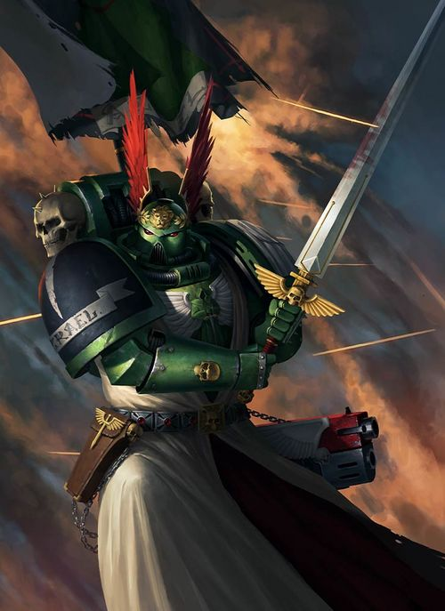
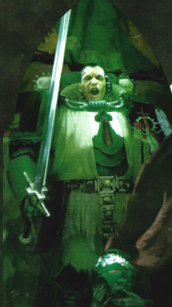
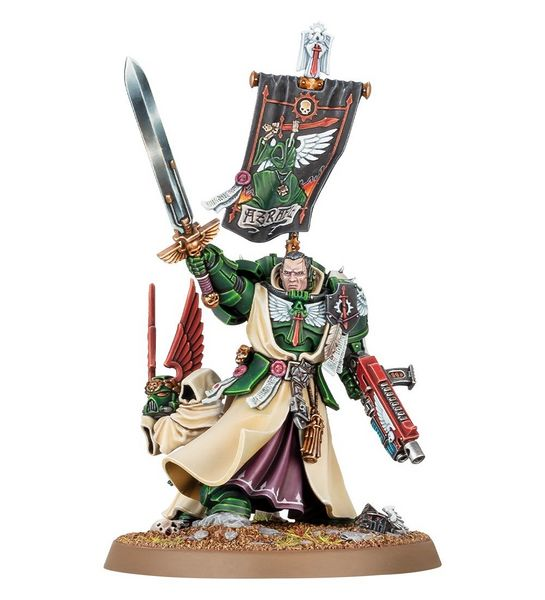

# 0634 阿兹瑞尔 Azrael

精校状态：中文行文已逐段精校，部分术语仍为暂定

分类：人类帝国 / 黑暗天使

原文来源：https://www.bilibili.com/opus/1114173422060961816

原作者：帝国神选罐头

原文时间：2025年09月19日 11:21

[返回分类目录](目录.md) · [全书目录](../../目录.md)

<!-- A0634-B0001 -->
**英文原文**

"Forget your past life. From this day on you are simply a Dark Angel - nothing else is of consequence. The Chapter is all that matters"

<!-- /A0634-B0001 -->

<!-- A0634-B0002 -->

原译文

“忘记你过去的生活。从今天起，你只是一个黑暗天使 - 其他什么都无关紧要。战团才是最重要的。”

**校订译文**

“忘记你过去的生活。从今天起，你只是一个黑暗天使 - 其他什么都无关紧要。战团才是最重要的。”

<!-- /A0634-B0002 -->

<!-- A0634-B0003 -->
**英文原文**

Azrael is the Supreme Grand Master of the Dark Angels Chapter and is one of the most secretive of the members of the already very secretive chapter.

<!-- /A0634-B0003 -->

<!-- A0634-B0004 -->

原译文

阿兹瑞尔是黑暗天使战团的至高大导师，也是已经非常神秘的战团中最神秘的成员之一。

**校订译文**

阿兹瑞尔是黑暗天使战团的至高大导师。这个战团本就行事隐秘，而他又是其中最深藏不露的人之一。

<!-- /A0634-B0004 -->

<!-- A0634-B0005 图片 -->

<!-- A0634-B0006 -->

原译文

Supreme Grand Master Azrael 至高大导师阿兹瑞尔

**校订译文**

Supreme Grand Master Azrael 至高大导师阿兹瑞尔

<!-- /A0634-B0006 -->

<!-- A0634-B0007 -->
## Biography 传记

<!-- /A0634-B0007 -->

<!-- A0634-B0008 -->
**英文原文**

He was recruited from the savages of the feral world Kimmeria but shows none of their uncultivated behaviors. He is best known for, other than his leadership of the Dark Angels, caring for the chapter banner, the scouring of Truan IX, and crushing a techno-revivalist cult during the Faze V Uprising. For decades he then disappeared but must have provided suitable services to the chapter for he later became a member of the Deathwing, Captain of the 3rd Company and then Master of the Deathwing in 917.M41. From there, he famously led the assault that slew the Daemonically possessed Governor of Sephlagm before subjecting the world to Exterminatus. He gained further fame during the Vendetta Campaign. A charismatic and dynamic leader, he was an inspiration to those who fought along side him.

<!-- /A0634-B0008 -->

<!-- A0634-B0009 -->

原译文

他是从蛮荒世界基梅里亚的野蛮人那里招募来的，但没有表现出他们野蛮的行为。除了他对黑暗天使的领导外，他最出名的是在法泽五号叛乱期间照料战团旗帜、清洗特鲁安九号和粉碎技术复兴主义教派。几十年来，他一直失踪，但一定为战团提供了合适的服务，因为他后来成为了死翼的成员，第三连队的连长，然后在917.M41成为了死翼的导师。从那时开始，他领导了一场著名的袭击，杀死了被恶魔附身的塞弗拉格姆总督，然后让世界遭受灭绝令。他在世仇战役中获得了更多的名声。他是一位富有魅力和活力的领导者，激励着那些与他并肩作战的人。

**校订译文**

阿兹瑞尔出身蛮荒世界基梅里亚的部落，却全无当地人粗野的举止。除了领导黑暗天使，他还因守护战团军旗、清剿特鲁安九号，以及在法泽五号叛乱中镇压技术复兴教派而闻名。此后数十年，他一度从记载中消失，但期间想必为战团立下了足够功勋：他后来加入死翼，升任第三连长，并于 917.M41 出任死翼导师。此后，他率突击队杀死被恶魔附身的塞弗拉格姆总督，再对该世界执行灭绝令；又在世仇战役中声名大振。作为富有魅力与行动力的领袖，他始终鼓舞着身边的战士。

**校注：** 原文列举三项功绩，仅最后一项明确发生在法泽五号叛乱；不能把前三项都归入同一战役。数十年“消失”按其履历中断表述，原文没有宣布他被认定失踪。

<!-- /A0634-B0009 -->

<!-- A0634-B0010 图片 -->

<!-- A0634-B0011 -->

原译文

Azrael 阿兹瑞尔

**校订译文**

Azrael 阿兹瑞尔

<!-- /A0634-B0011 -->

<!-- A0634-B0012 -->
**英文原文**

When the previous grand master, Naberius, died in 939.M41 in the Rhamiel Betrayal, Azrael fought alongside Ezekiel to recover his body as well as the Chapter Banner, and together defeated his killer, the Night Lords Daemon Prince Gendor Skraivok. After the battle Azrael was quickly promoted and given the title Keeper of the Truth and now sits at the head of the Inner Circle. He not only leads the Dark Angels in battle but also orchestrates the hunt for the Fallen and guards the chapter's most precious and terrible secrets, many of which are known only to him and the previous chapter masters before him.

<!-- /A0634-B0012 -->

<!-- A0634-B0013 -->

原译文

当前任大导师纳贝流士于939.M41在拉梅尔背叛中牺牲时，阿兹瑞尔与以西结并肩作战，夺回了他的尸体和战团旗帜，并共同击败了杀死他的午夜领主恶魔王子詹多·斯卡莱沃克。战斗结束后，阿兹瑞尔很快得到了晋升，并被授予真理守护者的称号，现在他位于内环之首。他不仅在战斗中领导黑暗天使，还精心策划了对堕天使的追捕，并守卫着战团中最珍贵和最可怕的秘密，其中许多秘密只有他和之前的战团长知道。

**校订译文**

939.M41，前任大导师纳贝流士死于拉梅尔背叛事件。阿兹瑞尔与以西结并肩作战，夺回他的遗体和战团军旗，又联手击败杀害他的午夜领主恶魔王子詹多·斯卡莱沃克。战后，阿兹瑞尔很快获晋升，取得“真理守护者”的称号，成为内环之首。他不仅统率战团作战，还组织对堕天使的追猎，并守护战团最珍贵、最可怕的秘密；其中许多只有他与历任战团长知晓。

<!-- /A0634-B0013 -->

<!-- A0634-B0014 -->
**英文原文**

Towards the end of the 41st Millennium, Cypher turned himself in to Azrael and not only informed him that The Rock held the time-altering Tuchulcha engine, but that both Astelan and Typhus were seeking similar devices. After the intervention of the Watchers in the Dark Azrael agrees to work with Cypher and they eventually gather all 3 engines, creating a warp rift over Caliban. However as Fallen attempt to enter the portal and potentially change history and pleading from Ezekiel to let history be, Azrael reluctantly orders Tuchulcha to scatter everyone from the rift. However Azrael was not specific at which moment in time he meant, and the Fallen on Caliban ten thousand years previous were scattered as well. This leads to the dark reality that Azrael himself may have been indirectly responsible for the scattering of the Fallen by causal loop.

<!-- /A0634-B0014 -->

<!-- A0634-B0015 -->

原译文

在第41个千年末，塞弗向阿兹瑞尔自首，不仅告诉他巨石拥有改变时间的图丘查引擎，而且阿斯特兰和泰丰斯都在寻找类似的装置。在黑暗守望者介入后，阿兹瑞尔同意与塞弗合作，最终收集了所有3个引擎，在卡利班上造成了亚空间裂隙。然而，当堕天使试图进入门户并可能改变历史，并恳求以西结让历史继续下去时，阿兹瑞尔不情愿地命令图丘查将所有人从裂隙中分散。然而，阿兹瑞尔并没有具体说明他指的是哪个时刻，一万年前卡利班的堕天使也分散了。这导致了一个黑暗的现实，即阿兹瑞尔本人可能间接地对因果循环中堕天使的分散负责。

**校订译文**

第 41 千年末，塞弗向阿兹瑞尔自首，告诉他巨石藏有能够改变时间的图丘查引擎，而阿斯特兰与泰弗斯也在寻找类似装置。黑暗守望者介入后，阿兹瑞尔同意与塞弗合作。双方最终集齐三台引擎，在卡利班上空打开亚空间裂隙。堕天使试图闯入门户，可能因此改写历史；以西结恳求阿兹瑞尔不要改变既定历史，他才勉强命令图丘查将裂隙中的所有人驱散。然而，他没有说明所指的时间点，结果一万年前卡利班上的堕天使也被一并散入时空。一个令人不安的可能性由此浮现：阿兹瑞尔本人或许通过因果循环，间接促成了堕天使的流散。

**校注：** 恳求者是以西结，受劝者是阿兹瑞尔；原译颠倒。因果循环仅是源文提出的可能性，未写成确定结论。

<!-- /A0634-B0015 -->

<!-- A0634-B0016 -->
### Age of the Dark Imperium 黑暗帝国时代

<!-- /A0634-B0016 -->

<!-- A0634-B0017 -->
**英文原文**

In the aftermath of the disastrous Massacre at Darkmor Azrael organized a summit of all Unforgiven Chapters Supreme Grand Master's at The Rock. During the summit, Roboute Guilliman and his new Indomitus Crusade docks at The Rock and delivers much-needed Primaris Space Marine reinforcements. Relieved that Guilliman apparently did not know or at least did not care about the truth of The Fallen, Azrael pledged his forces to the new Indomitus Crusade.

<!-- /A0634-B0017 -->

<!-- A0634-B0018 -->

原译文

在灾难性的达克莫尔大屠杀之后，至高大导师阿兹瑞尔在巨石组织了一次所有不可饶恕者战团的峰会。在峰会期间，罗伯特·基里曼和他的新不屈远征在巨石码头停靠，并提供急需的原铸星际战士增援部队。由于基里曼显然不知道或至少不关心堕天使的真相，阿兹瑞尔松了一口气，他承诺将他的部队投入新的不屈远征。

**校订译文**

达克莫尔大屠杀惨败后，阿兹瑞尔召集所有戴罪者战团的至高大导师，在巨石举行峰会。会议期间，罗保特·基里曼率不屈远征舰队停靠巨石，送来急需的原铸援军。基里曼似乎不知堕天使的真相，至少未将此事放在心上，这让阿兹瑞尔松了一口气，并承诺让所部参加不屈远征。

<!-- /A0634-B0018 -->

<!-- A0634-B0019 -->
**英文原文**

The Dark Angels accepted the new Primaris Space Marines out of necessity, but the Inner Circle remained skeptical of their presence as they have not gone through the strict rituals and tests of loyalty present to the rest of the Chapter. The Inner Circle began to debate over their worthiness to join their ranks. At the height of the debate Azrael staked his entire career on the Primaris Space Marine Apharan of the Deathwing, stating he was confident the Marine would pass a series of trials. Azrael personally oversaw Apharan's trials, and in the aftermath there could be no doubt of the Primaris' worthiness to join the ranks of the Inner Circle. The Supreme Grand Master would later undergo the Rubicon Primaris and successfully became a Primaris Space Marine himself.

<!-- /A0634-B0019 -->

<!-- A0634-B0020 -->

原译文

黑暗天使出于必要接受了新的原铸星际战士，但内环仍然对他们的存在持怀疑态度，因为他们没有经历过战团其余部分的严格仪式和忠诚测试。内环开始争论他们是否值得加入他们的行列。在辩论最激烈的时候，阿兹瑞尔将他的整个职业生涯都押在了死翼的原铸星际战士阿法兰身上，并表示他相信该星际战士会通过一系列试炼。阿兹瑞尔亲自监督了阿法兰的试炼，在此之后，毫无疑问，原铸有资格加入内环。这位至高大导师后来经历了原铸手术，并成功地成为了原铸星际战士。

**校订译文**

黑暗天使迫于形势接受了原铸星际战士，内环却仍不信任他们，因为这些新人未经历战团其他成员所受的严格仪式与忠诚考验。内环就是否接纳他们展开争论。争执最激烈时，阿兹瑞尔拿自己的全部前程作担保，坚信死翼原铸战士阿法兰能通过一系列试炼。他亲自监督试炼；结果证明，原铸战士有资格加入内环，此事再无可疑。后来，阿兹瑞尔自己也成功接受原铸跨越手术，成为原铸星际战士。

**校注：** Rubicon Primaris 为把传统星际战士转化为原铸的改造程序，沿用全书术语。

<!-- /A0634-B0020 -->

<!-- A0634-B0021 图片 -->

<!-- A0634-B0022 -->

原译文

Grand Master Azrael after becoming a Primaris Space Marine 成为原铸星际战士之后的大导师阿兹瑞尔

**校订译文**

Grand Master Azrael after becoming a Primaris Space Marine 成为原铸星际战士之后的大导师阿兹瑞尔

<!-- /A0634-B0022 -->

<!-- A0634-B0023 -->
### Arks of Omen 噩兆方舟

<!-- /A0634-B0023 -->

<!-- A0634-B0024 -->
**英文原文**

Shortly after Azrael's conversion into a Primaris Space Marine, Vashtorr assaulted The Rock as part of the greater Arks of Omen Campaign. Though still recovering from his wounds, he nonetheless met the powerful Daemon at the Nameless Gate before the heart of The Rock itself. During their battle, Azrael was overwhelmed but able to score a vicious blow on Vashtorr and retreat back to his own lines while the Daemon was distracted by the arrival of Be'lakor.

<!-- /A0634-B0024 -->

<!-- A0634-B0025 -->

原译文

在阿兹瑞尔转变为原铸星际战士后不久，瓦什托尔袭击了巨石，作为更大的噩兆方舟战役的一部分。虽然他仍在从伤口中恢复过来，但他还是在巨石中心之前的无名之门遇到了强大的恶魔。在他们的战斗中，阿兹瑞尔被击溃，但能够对瓦什托尔进行猛烈的打击，并撤退回自己的战线，而恶魔则因比拉克的到来而分心。

**校订译文**

阿兹瑞尔完成原铸改造后不久，瓦什托尔在噩兆方舟战役中进攻巨石。手术创伤尚未痊愈，阿兹瑞尔仍在通往巨石核心的无名之门迎战这头强大恶魔。他在交锋中落入下风，却也重重击中了瓦什托尔，并趁比拉克现身、牵制住恶魔注意力之际撤回己方阵线。

<!-- /A0634-B0025 -->

<!-- A0634-B0026 -->
**英文原文**

After Vashtorr's abortive assault on The Rock, Azrael ordered that the Unforgiven gather in a strength not seen since the Horus Heresy. Assembling at The Rock, Azrael and his Inner Circle made for the Somnium Stars to end the threat of Vashtorr. In the subsequent Battle of Idolatros, Azrael was horrified to discover Vashtorr had converted the Dark Angels ancient homeworld of Caliban into a monstrosity known as Wyrmwood. Azrael led a boarding assault on Wyrmwood that would have seen them all destroyed at the hands of Angron had Dante and reinforcements from across Imperium Nihilus not arrived. However not even Dante could overcome Angron, and when all seemed lost Lion El'Jonson himself returned after ten thousand years of absence. Azrael quickly overcame his confusion and countless questions and coordinated the Imperial effort with Dante as The Lion took care of Angron. Azrael succeeded in evacuating Wyrmwood with Dante and the rest of the Imperials as the planetoid activated The Key.

<!-- /A0634-B0026 -->

<!-- A0634-B0027 -->

原译文

在瓦什托尔对巨石的攻击失败之后，阿兹瑞尔命令不可饶恕者的力量聚集在一起，这是自荷鲁斯叛乱以来从未见过的力量。阿兹瑞尔和他的内环聚集在巨石上，为幻梦群星结束了瓦什托尔的威胁。在随后的盲信星之战中，阿兹瑞尔惊恐地发现瓦什托尔已经将黑暗天使古老的家园世界卡利班变成了一个被称为龙林星的巨大而丑陋之物。阿兹瑞尔率领跳帮袭击了龙林星，但如果但丁和帝国暗面的增援部队没有到达，他们都会被安格隆摧毁。然而，即使是但丁也无法战胜安格隆，当一切似乎都无可挽回时，莱昂·艾尔庄森本人在离开一万年后回来了。阿兹瑞尔很快克服了他的困惑和无数的问题，并与但丁协调了帝国的努力，因为莱昂引走了安格隆。当小行星激活钥匙时，阿兹瑞尔成功地与但丁和其他帝国军队一起撤离了龙林星。

**校订译文**

瓦什托尔进攻巨石受挫后，阿兹瑞尔下令集结戴罪者，汇聚自荷鲁斯之乱以来未曾见过的庞大兵力。众军在巨石会师后，他与内环向幻梦群星进发，决意彻底解除瓦什托尔的威胁。随后的盲信星之战中，他惊骇地发现，敌人竟把黑暗天使的古老母星卡利班改造成了名为龙林星的怪物。阿兹瑞尔率军登上龙林星；若非但丁及帝国暗面各地援军及时抵达，他们几乎全部要死于安格隆之手。但丁同样无法压倒恶魔原体，正当一切似乎无可挽回时，消失万年的莱昂·艾尔’庄森归来。阿兹瑞尔迅速压下困惑和无数疑问，与但丁协调帝国部队，让原体专心对付安格隆。龙林星启动“钥匙”时，他成功与但丁及其余帝国军队一同撤离。

**校注：** made for the Somnium Stars 指前往该星域，原译漏掉了行军方向，误写成已经结束威胁。

<!-- /A0634-B0027 -->

<!-- A0634-B0028 -->
## Wargear 武器装备

原题：Wargear 战备

<!-- /A0634-B0028 -->

<!-- A0634-B0029 -->
**英文原文**

Upon becoming Keeper of the Truth, he obtained the traditional wargear of his predecessors; the master crafted Sword of Secrets, an ornate suit of Power Armour known as The Protector, The Lion's Wrath combi-plasma gun, and the ornate Lion Helm. The Helm is carried by a being of unknown origin (possibly a Watcher in the Dark), but it shows extreme devotion to its master.

<!-- /A0634-B0029 -->

<!-- A0634-B0030 -->

原译文

成为真理守护者后，他获得了前任的传统战备；这位导师制作了秘密之剑、一套被称为保护者的华丽动力盔甲、狮子之怒复合等离子枪和华丽的狮盔。头盔由一个来源不明的生物（可能是黑暗守望者）携带，但它对主人表现出极度的忠诚。

**校订译文**

接任真理守护者后，阿兹瑞尔继承历代前任的传统装备：精工打造的秘密之剑、华丽的动力甲“守护者”、组合等离子枪“狮子之怒”，以及装饰精美的狮盔。狮盔由一个来历不明的矮小生物携带，它可能是黑暗守望者，对主人极为忠诚。

**校注：** master crafted 是精工制造，非“大导师亲自制作”。

<!-- /A0634-B0030 -->

<!-- A0634-B0031 -->
**英文原文**

During the Siege of Vraks the personal vehicle of Azrael was the Land Raider Prometheus named Angelis Imperator.

<!-- /A0634-B0031 -->

<!-- A0634-B0032 -->

原译文

在弗拉克斯围城期间，阿兹瑞尔的个人载具是名为帝皇天使的兰德掠袭者普罗米修斯。

**校订译文**

弗拉克斯围城期间，阿兹瑞尔的专用座车是普罗米修斯型兰德掠袭者战车帝皇天使号。

<!-- /A0634-B0032 -->

<!-- A0634-B0033 -->
## Trivia 琐事

<!-- /A0634-B0033 -->

<!-- A0634-B0034 -->
**英文原文**

Azrael is named after the Archangel of Death of the same name in Hebrew and a few select pieces of Islamic lore. From an adapted form of Hebrew it means "Whom God Helps".

<!-- /A0634-B0034 -->

<!-- A0634-B0035 -->

原译文

阿兹瑞尔以希伯来语中同名的死亡大天使和一些精选的伊斯兰传说命名。从希伯来语的改编形式来看，它的意思是“上帝帮助的人”。

**校订译文**

阿兹瑞尔之名取自希伯来传统及部分伊斯兰传说中的同名死亡大天使。这一名字经过转写，意为“上帝帮助的人”。

<!-- /A0634-B0035 -->

<!-- A0634-B0036 -->
### Notes 注释

<!-- /A0634-B0036 -->

<!-- A0634-B0037 -->
**英文原文**

The "Azrael" who currently leads the Dark Angels is not the first Supreme Grand Master whose name was "Azrael". There had been a previous "Supreme Grand Master Azrael" who lead the Dark Angels during the Siege of Vraks. This is mentioned to the current Azrael by Kharn the Betrayer during the Pandorax campaign

<!-- /A0634-B0037 -->

<!-- A0634-B0038 -->

原译文

目前领导黑暗天使的“阿兹瑞尔”并不是第一位名为“阿兹瑞尔”的至高大导师。在弗拉克斯围城中，曾有一位“至高大导师阿兹瑞尔”领导黑暗天使。在潘多拉克斯战役中，背叛者卡恩向现任阿兹瑞尔提到了这一点

**校订译文**

现今领导黑暗天使的阿兹瑞尔，并非首位使用此名的至高大导师。此前另有一位“至高大导师阿兹瑞尔”，曾在弗拉克斯围城中统率黑暗天使。潘多拉克斯战役期间，背叛者卡恩曾向现任阿兹瑞尔提起此事。

**校注：** 本篇先将弗拉克斯围城的座车计入现任阿兹瑞尔装备，末注却称当时是另一名同名至高大导师；所给英文存在人物归属矛盾，保留末注，前文不擅自据此删改史实。

<!-- /A0634-B0038 -->

本篇核心术语与暂定项

以下列出本篇出现的英文原形及核心术语表用词。同形词可能指不同对象，具体词义以本篇正文和校注为准；单复数、别名和仅见于图注的名称可能尚未列入。完整候选见[术语表](../../术语表/双语术语候选.csv)。

| 英文 | 采用中文 | 状态 |
| --- | --- | --- |
| Space Marines | 星际战士 | 官方已核对 |
| Dark Angels | 黑暗天使 | 官方已核对 |
| Roboute Guilliman | 罗保特·基里曼 | 官方已核对 |
| Be'lakor | 比拉克尔 | 官方已核对 |
| Horus Heresy | 荷鲁斯之乱 | 官方已核对 |
| Warp | 亚空间 | 官方已核对 |
| Imperium | 帝国 | 暂定·简称 |
| Indomitus | 不屈学派 | 暂定·学派语境 |
| History | 历史 | 编辑用语已统一 |
| Daemon Prince | 恶魔亲王 | 官方已核对 |
| Night Lords | 午夜领主 | 暂定·官方待核 |
| Horus | 荷鲁斯 | 暂定·官方待核 |
| Lion El'Jonson | 莱昂·艾尔’庄森 | 官方已核对 |
| Imperium Nihilus | 帝国暗面 | 暂定·官方待核 |
| Indomitus Crusade | 不屈远征 | 暂定·官方待核 |
| Protector | 守护者 | 暂定·官方待核 |
| Caliban | 卡利班 | 暂定·官方待核 |
| Land Raider | 兰德掠袭者战车 | 官方已核对 |
| Master | 导师（审判庭职衔）／舰务官（舰员职务） | 语境定译·官方待核 |
| Unforgiven | 戴罪者 | 暂定·官方待核 |
| Ancient | 旗手 | 官方已核对 |
| Astelan | 阿斯特兰 | 暂定·官方待核 |
| Power Armour | 动力盔甲 | 暂定·官方待核 |
| Space Marine | 星际战士 | 暂定·官方待核 |
| Chapter | 战团 | 暂定·官方待核 |
| Captain | 连长 | 暂定·官方待核 |
| Primaris Space Marine | 原铸星际战士 | 暂定·官方待核 |
| Azrael | 阿兹瑞尔 | 官方已核 |
| Ezekiel | 以西结 | 暂定·官方待核 |
| Dante | 但丁 | 暂定·官方待核 |
| Supreme Grand Master | 至高大导师 | 暂定·官方待核 |
| Nameless | 无名者 | 暂定·官方待核 |
| Rubicon Primaris | 原铸跨越手术 | 暂定·官方待核 |
| Cypher | 塞弗 | 官方已核对 |
| Typhus | 泰弗斯 | 官方已核对 |
| Raider | 掠袭者飞艇 | 官方已核对 |
| Gendor Skraivok | 詹多·斯卡莱沃克 | 暂定·官方待核 |
| Angron | 安格隆 | 官方已核对 |
| Grand Master | 大导师 | 暂定·官方待核 |
| Tuchulcha | 图丘查 | 暂定·官方待核 |
| Kimmeria | 基梅里亚 | 暂定·官方待核 |
| Naberius | 纳贝流士 | 暂定·官方待核 |
| Keeper of the Truth | 真理守护者 | 暂定·官方待核 |
| Sword of Secrets | 秘密之剑 | 暂定·官方待核 |
| The Protector | 守护者 | 暂定·官方待核 |
| The Lion's Wrath | 狮子之怒 | 暂定·官方待核 |
| The Key | 钥匙 | 暂定·官方待核 |
| Land Raider Prometheus | 普罗米修斯型兰德掠袭者战车 | 暂定·官方待核 |
| Gun | 甘 | 暂定·官方待核 |
| The Dark | 《黑暗》 | 暂定·官方待核 |
| Sephlagm | 塞弗拉格姆 | 暂定·官方待核 |
| Truan IX | 特鲁安九号 | 暂定·官方待核 |
| Feral World | 蛮荒世界 | 暂定·官方待核 |
| Angelis | 安杰利斯 | 暂定·官方待核 |
| Combi-Plasma Gun | 复合等离子枪 | 暂定·官方待核 |
| Lion's Wrath | 狮子之怒 | 暂定·官方待核 |
| Omen | 预兆号 | 暂定·官方待核 |
| Wyrmwood | 龙林星 | 暂定·官方待核 |
| Nameless Gate | 无名之门 | 暂定·官方待核 |
| Somnium Stars | 幻梦群星 | 暂定·官方待核 |
| Plasma gun | 等离子枪 | 官方已核对 |
| Vendetta Campaign | 仇杀战役 | 暂定·官方待核 |
| Angelis Imperator | 天使统领号 | 暂定·官方待核 |

