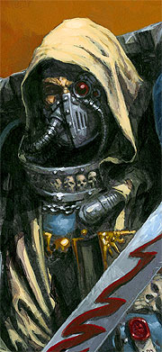
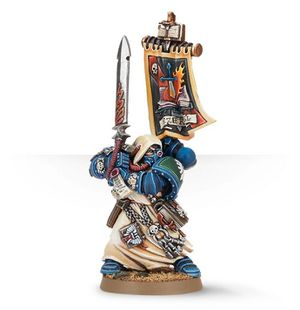

# 0635 以西结 Ezekiel

精校状态：中文行文已逐段精校，部分术语仍为暂定

分类：人类帝国 / 黑暗天使

原文来源：https://www.bilibili.com/opus/1114176939699994663

原作者：帝国神选罐头

原文时间：2025年09月19日 11:35

[返回分类目录](目录.md) · [全书目录](../../目录.md)

<!-- A0635-B0001 -->
**英文原文**

Ezekiel is the Chief Librarian (or Grand Master of the Librarians) of the Dark Angels Chapter. His full title is Ezekiel, Grand Master of Librarians, Keeper of the Book of Salvation, Holder of the Keys. He is regarded by others of his chapter as the most powerful psyker in its ranks since the time of Lion El'Jonson.

<!-- /A0635-B0001 -->

<!-- A0635-B0002 -->

原译文

以西结是黑暗天使战团的首席智库（或智库大导师）。他的全名是以西结，智库大导师，救赎之书的守护者，钥匙的持有者。他被战团的其他人视为自莱昂·艾尔庄森的时代以来最强大的灵能者。

**校订译文**

以西结是黑暗天使战团的首席智库员，又称智库员大导师。他的完整头衔是“以西结，智库员大导师，救赎之书守护者，执钥者”。战团成员认为，他是自莱昂·艾尔’庄森时代以来黑暗天使中最强大的灵能者。

**校注：** full title 指完整头衔，不是另一个全名。Chief Librarian 与 Grand Master of Librarians 在本章互作对应职衔，中文分别使用首席智库员、智库员大导师。

<!-- /A0635-B0002 -->

<!-- A0635-B0003 图片 -->

<!-- A0635-B0004 -->

原译文

Ezekiel, Grand Master of Librarians 以西结，智库大导师

**校订译文**

Ezekiel, Grand Master of Librarians 以西结，智库员大导师

<!-- /A0635-B0004 -->

<!-- A0635-B0005 -->
## Biography 传记

<!-- /A0635-B0005 -->

<!-- A0635-B0006 -->
### Early History 早期历史

<!-- /A0635-B0006 -->

<!-- A0635-B0007 -->
**英文原文**

Ezekiel was recruited by the Dark Angels on the world of Delphyna III in 516.M41 after it was conquered by the Chapter. During the conquest of the planet, the Dark Angels discovered a ten year old psyker of considerable talent imprisoned within the capital city's dungeons. Though physically frail, his psychic potential was enormous. Thus Ezekiel was admitted to train to join the Dark Angels Librarium, meekly submitting to every test and torment visited upon him by the Chaplains and Librarians.

<!-- /A0635-B0007 -->

<!-- A0635-B0008 -->

原译文

516.M41，黑暗天使在德尔非纳三号被该战团征服后，以西结被招募。在征服行星的过程中，黑暗天使发现了一名十岁的天才灵能者被囚禁在首都的地牢里。虽然身体虚弱，但他的灵能潜力是巨大的。因此，以西结获准接受训练，加入黑暗天使智库馆，温顺地接受牧师和智库对他的每一次考验和折磨。

**校订译文**

516.M41，黑暗天使征服德尔非纳三号，并在首都地牢中发现一名年仅十岁、天赋出众的灵能者：以西结。尽管体质孱弱，他的灵能潜力却十分巨大，因此被战团招收，接受加入智库馆的训练。他顺从地承受教士与智库员施加的每一项试炼和折磨。

<!-- /A0635-B0008 -->

<!-- A0635-B0009 -->
**英文原文**

After years of training in the 10th Company Ezekiel was presented with the final test: surviving a mental assault by a senior Librarian that unleashed the victim's worst fears upon their own psyche. Ezekiel not only survived the mental terror attack unleashed by Librarian Meroth, but fully opened his mind to him and showed him his dark tormented past. Meroth was overwhelmed by the pain he experienced and collapsed. Thus was Ezekiel fully admitted as a Librarian.

<!-- /A0635-B0009 -->

<!-- A0635-B0010 -->

原译文

在第十连队接受了多年的训练后，以西结接受了最后的考验：在一名高级智库的灵能攻击中幸存下来，这场攻击将受害者最可怕的恐惧释放到了他们自己的心灵上。以西结不仅在智库梅洛斯发动的恐怖灵能袭击中幸存下来，而且完全向他敞开了心扉，向他展示了他黑暗而痛苦的过去。梅洛斯被他所经历的痛苦压垮了，崩溃了。因此，以西结被完全接纳为智库。

**校订译文**

在第十连队受训多年后，以西结迎来最后考验：承受一位资深智库员的精神攻击，直面被释放到意识深处的最大恐惧。以西结不仅挺过梅洛斯智库员发动的恐惧袭击，还彻底敞开心灵，让对方亲历自己黑暗、备受折磨的过去。梅洛斯无法承受其中的痛苦，瘫倒在地。以西结由此正式成为智库员。

**校注：** 以西结向梅洛斯展现的是自己的过去；梅洛斯因感受到这段痛苦而崩溃，避免三个人称代词混指。

<!-- /A0635-B0010 -->

<!-- A0635-B0011 -->
### Mission on Korsh 科尔什任务

<!-- /A0635-B0011 -->

<!-- A0635-B0012 -->
**英文原文**

At some point Ezekiel led members of the Deathwing in a battle on the planet Korsh. The mission went poorly; a powerful Daemon he fought on the planet damaged his psychic abilities and they barely escaped. After that battle he was unable to use his powers of foresight. He spent a year recuperating from that battle on The Rock, and during that time he trained the librarian Turmiel. Turmiel also had the power of foresight, Ezekiel relied on his divinations during this time and passed on the information from them to Azrael and others.

<!-- /A0635-B0012 -->

<!-- A0635-B0013 -->

原译文

在某个时刻，以西结带领死翼的成员在科尔什行星上作战。任务进展得很糟糕；他在这个行星上与一个强大的恶魔战斗，破坏了他的灵能能力，他们几乎没能逃脱。那场战斗之后，他无法施展他的预知力量。他花了一年时间在巨石上从那场战斗中恢复过来，在此期间，他训练了智库图米尔。图米尔也有预知力量，以西结在这段时间里依靠他的占卜，并将信息传递给阿兹瑞尔和其他人。

**校订译文**

后来，以西结率死翼战士前往科尔什作战，行动却遭遇惨败。他与一头强大恶魔交锋，灵能因此受损，众人几乎未能逃脱。此后，他失去了预知能力，只得在巨石静养一年，期间教导智库员图米尔。图米尔同样能够预知未来，以西结便依赖他的占卜，将所得情报转告阿兹瑞尔等人。

<!-- /A0635-B0013 -->

<!-- A0635-B0014 -->
### Battle for Honoria 霍诺里亚之战

<!-- /A0635-B0014 -->

<!-- A0635-B0015 -->
### Prelude 序曲

<!-- /A0635-B0015 -->

<!-- A0635-B0016 -->
**英文原文**

In 949.M41, roughly a year after the mission to Korsh, Grand Master of Librarians, Danatheum assigned Ezekiel and Turmiel to accompany the 5th Company to the planet of Honoria and help defend it, as the Mechanicus had invoked the Pact of Kulgotha. He also wanted Ezekiel to assess Balthasar for ascension to the Deathwing, as one of the members wounded on Korsh had passed away. Danatheum also told Ezekiel that he wanted him to replace him as Grand Master some day, as Ezekiel's power was far greater than his own and he felt the only reason that he had retained the position was simply that he had not yet died. Immediately after his conversation with Danatheum, Turmiel revealed to Ezekiel that he knew Ezekiel had lost his power of foresight and had been relying on him for divinations, but that he did not care. He also told Ezekiel that he had several visions of the upcoming battle, and in every one Ezekiel died.

<!-- /A0635-B0016 -->

<!-- A0635-B0017 -->

原译文

949.M41，大约在科尔什任务的一年后，智库大导师达纳修姆指派以西结和图米尔陪同第五连队前往霍诺里亚行星并帮助保卫它，因为机械教援引了库尔戈塔条约。他还希望以西结评估巴尔塔萨升任死翼的情况，因为在科尔什上受伤的一名成员已经死亡。达纳修姆还告诉以西结，他希望有一天他能取代他成为大导师，因为以西结的力量远远大于他自己的力量，他觉得他仍保留这个职位的唯一原因就是他还没有死。在与达纳修姆交谈后，图米尔立即向以西结透露，他知道以西结已经失去了预知力量，一直依靠他占卜，但他并不在乎。他还告诉以西结，他对即将到来的战斗有几次幻象，每一次都有以西结死去。

**校订译文**

949.M41，科尔什任务结束约一年后，机械修会援引库尔戈塔条约请求援助。智库员大导师达纳修姆派以西结与图米尔随第五连队前往霍诺里亚，协助守卫行星。他还要求以西结考察巴尔塔萨是否适合晋入死翼，因为一名在科尔什负伤的死翼战士已经不治。达纳修姆也表明，希望以西结有朝一日继承自己的职位；他认为以西结的力量远胜自己，而自己仍任大导师，唯一原因不过是尚未死去。谈话后，图米尔向以西结坦言：他早已知道老师失去预知能力、一直依靠自己的占卜，但对此并不介意。随后，他又说，自己已多次预见即将到来的战斗，而每一次异象中，以西结都会死去。

<!-- /A0635-B0017 -->

<!-- A0635-B0018 -->
### Battle for Sularian Gate 苏拉里安之门之战

<!-- /A0635-B0018 -->

<!-- A0635-B0019 -->
**英文原文**

Ezekiel lost his left eye at the Battle for Sularian Gate against the horde of Waaagh! Groblonik. His eye was quickly replaced with a simple bionic eye, allowing him to return to battle in time to lead a counter-attack which broke Groblonik's army. Since then, he has refused to have it replaced for a more sophisticated and less noticeable one as a mark of respect to his fallen comrades. During the battle, Ezekiel displayed immense psychic power against the Ork Warboss and his hordes. Such was his accomplishment that the previous Dark Angels Grand Master of Librarians, Danatheum, stepped down and allowed Ezekiel to take his place.

<!-- /A0635-B0019 -->

<!-- A0635-B0020 -->

原译文

以西结在苏拉里安之门之战中失去了左眼，对手是格罗布洛尼克的Waaagh！部落。他的眼睛很快被一只简单的仿生眼所取代，使他能够及时重返战场，领导反击，摧毁了格罗布洛尼克的军队。从那以后，他拒绝用一个更复杂、不那么引人注目的东西来代替它，以示对逝去战友的尊重。在战斗中，以西结展示了巨大的灵能力量来对抗欧克战争头目和他的部落。他的成就如此之大，以至于之前的黑暗天使智库大导师达纳修姆卸任，并允许以西结接替他的位置。

**校订译文**

迎战格罗布洛尼克的 Waaagh! 大军时，以西结在苏拉里安之门失去左眼。战地人员迅速为他装上一只简易仿生眼，使他及时重返战场，率反击部队击溃敌军。此后，他始终拒绝换用更先进、外观更自然的义眼，以纪念阵亡战友。该战中，他向欧克战争头目及其大军展现出惊人的灵能力量。功绩如此耀眼，达纳修姆遂主动辞去黑暗天使智库员大导师之职，让以西结接任。

<!-- /A0635-B0020 -->

<!-- A0635-B0021 -->
### Return to Korsh 回归科尔什

<!-- /A0635-B0021 -->

<!-- A0635-B0022 -->
**英文原文**

After the battle of Honoria Ezekiel had Turmiel train in focusing his power through his blade nonstop. After several weeks of this Ezekiel and what remained of 5th Company returned to the planet Korsh to get answers from the Daemon he fought there. While Turmiel held it in place Ezekiel asked it about the visions he was shown while he was clinically dead on Honoria. The Daemon admitted to stealing his power of foresight, but said that Ezekiel's new augmetic eye gave it back to him. He also told Ezekiel he should be focused on where the eye came from and who made it. Turmiel was unable to hold the Daemon any longer and it was absorbed back into the warp. Ezekiel remarked that he didn't get the answers he wanted, just more questions.

<!-- /A0635-B0022 -->

<!-- A0635-B0023 -->

原译文

在霍诺里亚之战之后，以西结让图米尔训练他不间断地通过刀刃集中力量。几周后，以西结和第五连队剩下的人回到了科尔什行星，从他在那里战斗的恶魔那里得到答案。当图米尔把它控在原地时，以西结问它他在霍诺里亚濒临死亡时看到的幻象。恶魔承认偷了他的预知力量，但说以西结的新眼球把它还给了他。他还告诉以西结，他应该把注意力集中在眼睛的来源和制造者身上。图米尔再也控不住恶魔了，它被吸回了亚空间。以西结说，他没有得到他想要的答案，只是更多的问题。

**校订译文**

霍诺里亚之战后，以西结让图米尔持续练习将灵能力量凝聚于剑刃。数周后，他与第五连队残部返回科尔什，向当初交战的恶魔追问真相。图米尔将恶魔束缚在原地，以西结则询问自己在霍诺里亚一度临床死亡时见到的异象。恶魔承认，它偷走了他的预知能力，却又声称新装的义眼已将能力还给他，还让他去追查义眼从何而来、由谁制造。图米尔再也无法维持束缚，恶魔被吸回亚空间。以西结感叹，自己没得到想要的答案，只收获了更多疑问。

**校注：** Ezekiel had Turmiel train 指让图米尔训练，不是让图米尔反过来训练以西结。clinically dead 指一度达到临床死亡状态，不能弱化为仅仅濒死。

<!-- /A0635-B0023 -->

<!-- A0635-B0024 -->
### Grand Master of the Librarians 智库员大导师

原题：Grand Master of the Librarians 智库大导师

<!-- /A0635-B0024 -->

<!-- A0635-B0025 -->
**英文原文**

It is one of Ezekiel's many tasks to test the loyalty and dedication of any who rise to the rank of Master or Grand Master, to seek out weakness and ensure that they are pure of purpose. So intimidating is this prospect that fully a third of the Dark Angels selected for such promotion have politely refused the honour and chosen to remain as warriors of the Deathwing, Ravenwing or as Veteran Sergeants. Perhaps the cause for this is the case of Sergeant Cadraellon, who was selected to become Master of the 10th Company not long after Ezekiel's accession. Ezekiel probed Cadraellon's thoughts and memories for a day and a night. As soon as the Chief Librarian finished, the prospective Master drew his pistol and killed himself with a bolt through his temple. Ezekiel claimed he had seen nothing that would have prevented Cadraellon's promotion to Master, but there are those that think it unlikely the Chief Librarian's prophetic abilities would have failed to foretell such a devastating consequence. Whatever the cause, the incident has ensured that only those truly pure of heart and intent consider themselves worthy of leadership.

<!-- /A0635-B0025 -->

<!-- A0635-B0026 -->

原译文

这是以西结的许多任务之一，测试任何升到导师或大导师级别的人的忠诚和奉献精神，找出弱点，确保他们目标的纯洁性。这种可能性是如此令人生畏，以至于整整三分之一被选中晋升的黑暗天使礼貌地拒绝了这一荣誉，并选择继续担任死翼、鸦翼的战士或老兵军士。也许这是因为卡德拉隆军士的情况，他在以西结晋升后不久就被选为第十连队的导师。以西结研究了卡德拉隆的思想和记忆一天一夜。首席智库一结束，这位未来的导师就拔出手枪，用一颗穿过太阳穴的爆矢自杀了。以西结声称，他没有看到任何阻碍卡德拉隆晋升为导师的东西，但有人认为，首席智库的预言能力可能没预测到如此毁灭性的后果。无论原因如何，这一事件确保了只有那些真正纯洁的心和意图的人认为自己值得领导地位。

**校订译文**

以西结的一项职责，是检验所有将晋升导师或大导师者的忠诚与献身精神，找出弱点，确认其意图纯正。单是想到这场考验，就有整整三分之一的晋升候选人婉拒殊荣，宁愿继续担任死翼或鸦翼战士，或留在老兵军士之位。原因或许在于卡德拉隆军士的遭遇：以西结上任不久，卡德拉隆获选接掌第十连队。以西结探查了他整整一天一夜的思想与记忆；探查刚结束，这名准导师就拔出爆矢手枪，朝太阳穴开枪自尽。以西结声称，自己没有发现任何足以阻止他晋升的问题。但有人认为，首席智库员不大可能未能预见这种惨烈结局。无论原因何在，此事让人们确信：唯有内心与志向真正纯洁的人，才敢认为自己配得上统领同袍。

**校注：** 原句 think it unlikely ... failed to foretell 是否定其“未预见”的可能性，原译把否定方向颠倒。

<!-- /A0635-B0026 -->

<!-- A0635-B0027 图片 -->

<!-- A0635-B0028 -->

原译文

Ezekiel 以西结

**校订译文**

Ezekiel 以西结

<!-- /A0635-B0028 -->

<!-- A0635-B0029 -->
### Pandorax Campaign 潘多拉克斯战役

<!-- /A0635-B0029 -->

<!-- A0635-B0030 -->
**英文原文**

In 960.M41 Ezekiel took part in the Pandorax Campaign, during which he fought on the asteroid Malefus Murex, at one point fighting alongside Belial and 3 other Librarians against waves of Khorne Berzerkers. Shortly after he went to the ship Revenge with the rest of the Dark Angels to support the Grey Knights. After the fighting Azrael introduced Ezekiel and Kaldor Draigo to each other, each saying that the other's reputation precedes them.

<!-- /A0635-B0030 -->

<!-- A0635-B0031 -->

原译文

960.M41，以西结参加了潘多拉克斯战役，在此期间，他在小行星马勒弗斯·穆雷克斯上作战，一度与贝利亚和其他3名智库一起对抗恐虐狂战士的浪潮。不久之后，他与其他黑暗天使一起登上复仇号，支援灰骑士。战斗结束后，阿兹瑞尔将以西结和卡尔多·迪亚哥互相介绍给对方，双方都说对方的名声在他们之上。

**校订译文**

960.M41，以西结参加潘多拉克斯战役，在马勒弗斯·穆雷克斯小行星上作战，并曾与贝利亚及另外三名智库员一同迎击蜂拥而来的恐虐狂战士。随后，他随黑暗天使登上复仇号，支援灰骑士。战后，阿兹瑞尔介绍他与卡尔多·迪亚哥相识，二人都表示早已久仰对方大名。

**校注：** reputation precedes them 是久仰大名的惯用语，非对方声望高于自己。

<!-- /A0635-B0031 -->

<!-- A0635-B0032 -->
### Arks of Omen 噩兆方舟

<!-- /A0635-B0032 -->

<!-- A0635-B0033 -->
### Siege of The Rock 巨石围城

<!-- /A0635-B0033 -->

<!-- A0635-B0034 -->
**英文原文**

While Azrael was recovering from the Rubicon Surgery he had left Ezekiel and Belial in command of The Rock. When The Rock and the Dark Angels arrived near the world of Marwent's Reach, and had been ambushed by Vashtorr, Ezekiel had fleet command transferred to Sammael, and had the chapter start a fighting retreat to the planet, reasoning that if they could rendezvous with Task Force XII they'd be strong enough to fight back. As the enemy fleet got closer to the rock for boarding actions Ezekiel and Belial sent out redeployment orders in preparation. Azrael appointed Belial overall strategic commander While Ezekiel and others went out into battle. Ezekiel led a strikeforce at the Nameless Gate where he would fight against Vashtorr alongside Lazarus and Azrael, who had ordered him to die before allowing the Nameless Gate to be opened.

<!-- /A0635-B0034 -->

<!-- A0635-B0035 -->

原译文

当阿兹瑞尔从原铸手术中恢复过来时，他让以西结和贝利亚在巨石指挥。当巨石和黑暗天使到马尔温特河段的世界附近，并被瓦什托尔伏击时，以西结将舰队指挥权移交给萨麦尔，并让战团开始向行星撤退，理由是如果他们能与第十二特遣部队会合，他们将有足够的力量进行反击。当敌方舰队接近巨石进行跳帮行动时，以西结和贝利亚发出了重新部署的命令进行准备。阿兹瑞尔任命贝利亚为总战略指挥官，而以西结和其他人则投入战斗。以西结率领一支突击队前往无名之门，在那里他与拉撒路和阿兹瑞尔并肩作战，后者曾命令他死也不能让无名之门被打开。

**校订译文**

阿兹瑞尔接受原铸跨越手术、休养期间，将巨石交由以西结与贝利亚指挥。巨石及黑暗天使舰队接近马尔温特疆域星时，遭瓦什托尔伏击。以西结将舰队指挥权移交萨麦尔，命战团向行星边战边退，认为只要能与第十二特遣部队会合，就有足够力量反击。敌舰逼近、准备登舰时，他与贝利亚重新部署防御。阿兹瑞尔命贝利亚统筹全局战略，以西结等人则亲赴前线。以西结率突击部队守卫无名之门，与拉撒路、阿兹瑞尔一同迎战瓦什托尔；阿兹瑞尔给他的命令是，宁可战死，也绝不能让敌人打开这道门。

**校注：** Marwent’s Reach 在原文明确是一个世界，暂按专名译为马尔温特疆域星；“河段”误套普通地理义。fighting retreat 为边战边退，非无条件撤走。

<!-- /A0635-B0035 -->

<!-- A0635-B0036 -->
### Battle of Idolatros 盲信星之战

<!-- /A0635-B0036 -->

<!-- A0635-B0037 -->
**英文原文**

Prior to the Battle of Idolatros, Ezekiel took part in a meeting of the leaders of The Unforgiven, during which he suggested that the librarians could use their power of foresight to try and see what awaited them in the Idolatros System. It was a risk, but Ezekiel argued that they were already at risk as they were traveling through the warp, and they would be at greater danger if they missed some important detail. Azrael and his council of masters then gave him permission to proceed. One librarian died and several were so mentally and spiritually damaged it was doubtful that they would recover, however they did have a vision. Ezekiel confirmed that Vashtorr was waiting for them in the Idolatros System, and had some trap that involved its star or originated near it. He and the other librarians agreed that Vashtorr's plan would use The Unforgiven's culture or dogma against themselves in some way. During the battle, Ezekiel went down with most of the chapter to Wyrmwood to assault the Warpforge Palace. Several hours later in the battle, Ezekiel would lead the surviving Librarians against the Daemons while they and the other survivors tried to escape.

<!-- /A0635-B0037 -->

<!-- A0635-B0038 -->

原译文

在盲信星之战之前，以西结参加了不可饶恕者的领导人的会议，在会上他建议智库可以利用他们的预知力量，尝试看看盲信星系中等待他们的是什么。这是一个冒险，但以西结认为，他们在穿越亚空间时已经处于危险之中，如果他们错过了一些重要的细节，他们将面临更大的危险。阿兹瑞尔和他的导师议会随后批准他接着做。一名智库死亡，几名智库在思想和精神上受到重伤，他们能否康复值得怀疑，但他们确实得到了一个幻象。以西结证实，瓦什托尔正在盲信星系中等待他们，并且有一些陷阱涉及它的恒星或起源于它附近。他和其他智库一致认为，瓦什托尔的计划将以某种方式利用不可饶恕者的文化或教条来对抗自己。在战斗中，以西结带着战团的大部分成员前往龙林星，进攻亚空间铸造宫殿。几小时后，在战斗中，以西结带领幸存的智库对抗恶魔，他们和其他幸存者试图逃离。

**校订译文**

盲信星之战前，以西结参加戴罪者领袖会议，提议让智库员利用预知能力，窥探盲信星系的险情。此举虽有风险，但他认为舰队本就在危险的亚空间中航行，若漏掉关键情报，后果只会更严重。阿兹瑞尔与导师议会批准了计划。一名智库员因此死亡，数人心智与灵魂严重受创，能否恢复尚不可知；但众人确实取得了异象。以西结确认，瓦什托尔正在盲信星系等待，并布设了涉及当地恒星、或源于恒星附近的陷阱。他与同伴还一致判断，敌人将设法利用戴罪者自身的文化与信条反过来对付他们。战斗爆发后，以西结随战团大部降落龙林星，进攻亚空间铸造宫殿。数小时后撤离时，他率幸存智库员抵挡恶魔，掩护众人生还。

<!-- /A0635-B0038 -->

<!-- A0635-B0039 -->
## Wargear 武器装备

原题：Wargear 战备

<!-- /A0635-B0039 -->

<!-- A0635-B0040 -->
**英文原文**

Ezekiel's wargear includes an ancient set of Artificer Armour named Secret's Shield and the Deliverer, a master-crafted bolt pistol that has killed many Fallen Angels. The most ferocious and sinister of his weapons, though, is the force sword Traitor's Bane, which is rumoured to trap the souls of the Fallen he faces. The Book of Salvation, which he carries at all times, causes all Dark Angels in his presence to be fearless in battle.

<!-- /A0635-B0040 -->

<!-- A0635-B0041 -->

原译文

以西结的武器装备包括一套名为“秘密之盾”的古代精工盔甲和一把大师级的爆矢手枪拯救者，这把手枪已经杀死了许多堕天使。然而，他最凶猛、最险恶的武器是灵能剑叛徒之灾，据传它会困住他所面对的堕天使的灵魂。他随身携带的《救赎之书》使他面前的所有黑暗天使在战斗中无所畏惧。

**校订译文**

以西结穿着古老的精工甲“秘密之盾”，使用曾杀死许多堕天使的精工爆矢手枪“拯救者”。然而，他最凶险的武器还是灵能剑“叛徒之灾”：传说它会囚禁遭他迎战的堕天使灵魂。他还始终随身携带《救赎之书》，使身边的黑暗天使在战斗中无所畏惧。

<!-- /A0635-B0041 -->

<!-- A0635-B0042 -->
**英文原文**

He also carries the Keys which open the doors around the Rock, including the Tower of Angels, the cells and dungeons of the Fallen Angels, and the cell containing Luther himself.

<!-- /A0635-B0042 -->

<!-- A0635-B0043 -->

原译文

他还携带着打开巨石周围大门的钥匙，包括天使之塔、堕天使牢房和地牢，以及包含卢瑟本人的牢房。

**校订译文**

他还掌管开启巨石各处门户的钥匙，包括天使之塔、关押堕天使的牢房与地牢，以及卢瑟本人的囚室。

<!-- /A0635-B0043 -->

<!-- A0635-B0044 -->
## Trivia 琐事

<!-- /A0635-B0044 -->

<!-- A0635-B0045 -->
**英文原文**

Ezekiel is named after the Prophet from the Book of Ezekiel in the Jewish Bible, who prophesised the Destruction of Jerusalem (Drawing parallels against the destruction of Caliban, or the possible destruction of Terra or the Imperium). Ezekiel means "God will strengthen".

<!-- /A0635-B0045 -->

<!-- A0635-B0046 -->

原译文

以西结是以犹太圣经《以西结书》中的先知命名的，他预言了耶路撒冷的毁灭（与卡利班的毁灭、泰拉或帝国的可能毁灭相提并论）。以西结的意思是“上帝必赐力量”。

**校订译文**

以西结是以犹太圣经《以西结书》中的先知命名的，他预言了耶路撒冷的毁灭（与卡利班的毁灭、泰拉或帝国的可能毁灭相提并论）。以西结的意思是“上帝必赐力量”。

<!-- /A0635-B0046 -->

本篇核心术语与暂定项

以下列出本篇出现的英文原形及核心术语表用词。同形词可能指不同对象，具体词义以本篇正文和校注为准；单复数、别名和仅见于图注的名称可能尚未列入。完整候选见[术语表](../../术语表/双语术语候选.csv)。

| 英文 | 采用中文 | 状态 |
| --- | --- | --- |
| Dark Angels | 黑暗天使 | 官方已核对 |
| Grey Knights | 灰骑士 | 官方已核对 |
| Psyker | 灵能者 | 官方已核对 |
| Librarian | 智库员 | 官方已核对 |
| Bolt Pistol | 爆矢手枪 | 官方已核对 |
| Warp | 亚空间 | 官方已核对 |
| Imperium | 帝国 | 暂定·简称 |
| Khorne | 恐虐 | 官方已核对 |
| Waaagh! | Waaagh! | 暂定·保留原文 |
| Terra | 泰拉 | 暂定·官方待核 |
| Lion El'Jonson | 莱昂·艾尔’庄森 | 官方已核对 |
| Caliban | 卡利班 | 暂定·官方待核 |
| Chief Librarian | 首席智库员 | 暂定·官方待核 |
| Master | 导师（审判庭职衔）／舰务官（舰员职务） | 语境定译·官方待核 |
| Mission | 教团／传教机构 | 暂定 |
| Librarium | 智库馆 | 暂定·官方待核 |
| Unforgiven | 戴罪者 | 暂定·官方待核 |
| Ancient | 旗手 | 官方已核对 |
| Chapter | 战团 | 暂定·官方待核 |
| Veteran | 老兵 | 暂定·官方待核 |
| Sergeant | 军士 | 暂定·官方待核 |
| Azrael | 阿兹瑞尔 | 官方已核 |
| Sammael | 萨麦尔 | 官方已核 |
| Belial | 贝利亚 | 官方已核 |
| Ezekiel | 以西结 | 暂定·官方待核 |
| Lazarus | 拉撒路 | 官方已核 |
| Kaldor Draigo | 卡尔多·迪亚哥 | 暂定·官方待核 |
| Grand Master of the Librarians | 智库员大导师 | 暂定·官方待核 |
| Nameless | 无名者 | 暂定·官方待核 |
| Tormented | 煎熬 | 暂定·官方待核 |
| Artificer | 技工 | 暂定·官方待核 |
| Veteran Sergeants | 老兵军士 | 暂定·官方待核 |
| Powers | 能天使 | 暂定·官方待核 |
| Horde | 部落 | 暂定·官方待核 |
| Warboss | 战争头目 | 官方已核对 |
| Prospect | 开拓团 | 暂定·官方待核 |
| Chaplains | 教士 | 暂定·官方待核 |
| Grand Master | 大导师 | 暂定·官方待核 |
| Turmiel | 图米尔 | 暂定·官方待核 |
| Danatheum | 达纳修姆 | 暂定·官方待核 |
| Marwent's Reach | 马尔温特疆域星 | 暂定·官方待核 |
| Book of Salvation | 救赎之书 | 暂定·官方待核 |
| Holder of the Keys | 执钥者 | 暂定·官方待核 |
| Secret's Shield | 秘密之盾 | 暂定·官方待核 |
| Traitor's Bane | 叛徒之灾 | 暂定·官方待核 |
| Force Sword | 灵能剑 | 暂定·官方待核 |
| The Dark | 《黑暗》 | 暂定·官方待核 |
| Council of Masters | 大师议会 | 暂定·官方待核 |
| System | 星系（恒星系统） | 暂定·官方待核 |
| Tower of Angels | 天使之塔 | 暂定·官方待核 |
| Bolt | 爆矢 | 暂定·官方待核 |
| Wyrmwood | 龙林星 | 暂定·官方待核 |
| Nameless Gate | 无名之门 | 暂定·官方待核 |
| Idolatros System | 盲信星系 | 暂定·官方待核 |
| Warpforge Palace | 亚空间铸炉宫殿 | 暂定·官方待核 |
| Artificer Armour | 精工盔甲 | 暂定·官方待核 |

