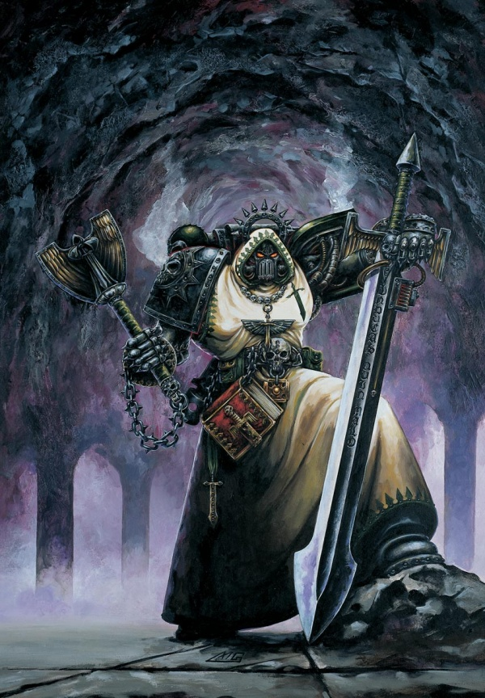
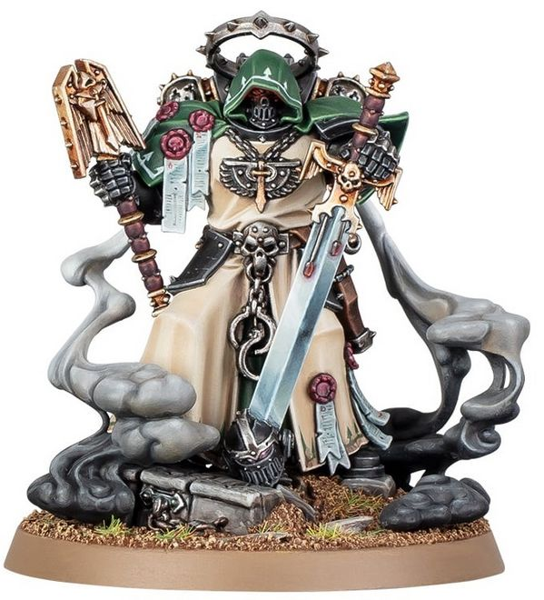

# 0636 阿斯莫德 Asmodai

精校状态：中文行文已逐段精校，部分术语仍为暂定

分类：人类帝国 / 黑暗天使

原文来源：https://www.bilibili.com/opus/1114184400000516099

原作者：帝国神选罐头

原文时间：2025年09月19日 12:04

[返回分类目录](目录.md) · [全书目录](../../目录.md)

原篇名：阿斯莫代 Asmodai

<!-- A0636-B0001 -->
**英文原文**

Asmodai is a Master Interrogator-Chaplain of the Dark Angels. One of the oldest and most successful Interrogator-Chaplains in the Chapter's history, he is also renowned as one of the most dark and sinister members of the Unforgiven. Suspected Fallen have learned that it is better to die than to fall into Asmodai's hands.

<!-- /A0636-B0001 -->

<!-- A0636-B0002 -->

原译文

阿斯莫代是黑暗天使的审讯牧师导师。作为战团历史上最古老、最成功的审讯牧师之一，他也是不可饶恕者中最黑暗、最险恶的成员之一。疑似堕天使已经明白，与其落入阿斯莫代之手，不如死去。

**校订译文**

阿斯莫德是黑暗天使的审讯教士导师。他是战团历史上资历最深、成果最显著的审讯教士之一，也是戴罪者中最阴沉、最可怕的人物之一。被怀疑为堕天使的人都明白，死去也比落入他手中更好。

<!-- /A0636-B0002 -->

<!-- A0636-B0003 图片 -->

<!-- A0636-B0004 -->

原译文

Asmodai 阿斯莫代

**校订译文**

Asmodai 阿斯莫德

<!-- /A0636-B0004 -->

<!-- A0636-B0005 -->
## Biography 传记

<!-- /A0636-B0005 -->

<!-- A0636-B0006 -->
**英文原文**

Asmodai was a well-regarded but unremarkable Tactical Marine serving in the Dark Angels' 8th Company in 405.M41 during the Macharian Heresy. During the battle of Hive-Moon Sigma, Asmodai fought under Captain Elijah against the rebellious forces of the Dark Angel Malvine Rhemell. During the fight the Dark Angels took heavy losses and Rhemell escaped, and Asmodai vowed to find him and make him repent. Afterwards he was quickly elevated to the position of Interrogator-Chaplain and captured his first Fallen Angel, Cephesus, in 411.M41, though he failed to make him repent. Over the next 25 years he captured three more, but they, too, refused to repent. Asmodai, however, had his first success after forcing the Fallen Angel Sorl Mebbon to repent after 18 days of torture. Asmodai quickly gained a reputation for ruthless and uncompromising dedication.

<!-- /A0636-B0006 -->

<!-- A0636-B0007 -->

原译文

阿斯莫代是一位备受好评但不起眼的战术战士，于405.M41在马卡里安叛乱期间在黑暗天使第八连队服役。在巢都卫星西格玛之战中，阿斯莫代在以利亚连长的指挥下与黑暗天使马尔文·雷梅尔的叛乱势力作战。在战斗中，黑暗天使遭受了重大损失，雷梅尔逃脱了，阿斯莫代发誓要找到他并让他忏悔。后来，他很快被提升为审讯牧师，并在411.M41抓获了他的第一个堕天使塞弗索斯，尽管他没能让他忏悔。在接下来的25年里，他又抓了三个人，但他们也拒绝忏悔。然而，阿斯莫代在18天的折磨后迫使堕天使索尔·梅邦忏悔后取得了第一次成功。阿斯莫代很快就以无情和毫不妥协的奉献精神而闻名。

**校订译文**

405.M41，马卡里安叛乱期间，阿斯莫德是黑暗天使第八连队一名评价良好、尚不显眼的战术战士。巢都卫星西格玛之战中，他在以利亚连长指挥下，对抗黑暗天使叛徒马尔文·雷梅尔的部队。战团损失惨重，雷梅尔又逃脱，阿斯莫德因此发誓要找到他、逼他忏悔。此后，他很快晋升审讯教士，于 411.M41 俘获首名堕天使塞弗索斯，却未能令其悔罪。接下来二十五年，他又抓到三人，同样未能使其屈服。直到连续折磨索尔·梅邦十八天，阿斯莫德才首次逼出忏悔。他也迅速因残酷、绝不妥协的执念而声名远播。

**校注：** 原文将战术战士安排在第八连队，可能与一般圣典编制认知不符；按所给英文保留，不擅改兵种或番号。

<!-- /A0636-B0007 -->

<!-- A0636-B0008 -->
**英文原文**

In his long career, he has only been able to make two members of The Fallen repent. But not many can resist his evil craft, and it is said that his enemies would rather die than fall into his hands, as he is rumoured to be able to keep a victim alive for weeks on end while undergoing horrific torture. Such is Asmodai's brutality and excess that even Azrael has had to counteract and cover up his actions multiple times over the Chapter's history.

<!-- /A0636-B0008 -->

<!-- A0636-B0009 -->

原译文

在他漫长的职业生涯中，他只让堕天使的两名成员忏悔。但没有多少人能抵抗他的邪恶技艺，据说他的敌人宁愿死也不愿落入他的手中，因为有传言说，在遭受可怕折磨的同时，让受害者连续几周活着。这就是阿斯莫代的残暴和过度，甚至阿兹瑞尔也不得不在战团的历史上多次抵制和掩盖他的行为。

**校订译文**

漫长生涯中，阿斯莫德只曾迫使两名堕天使忏悔，但鲜有人能承受他阴狠的手段。传闻他能让受害者在惨无人道的酷刑下连续存活数周，因此敌人宁愿死去，也不愿被他俘获。他的暴行与极端作风，甚至令阿兹瑞尔不得不多次出面制止、补救，并掩盖后果。

<!-- /A0636-B0009 -->

<!-- A0636-B0010 -->
**英文原文**

It was Asmodai who ordered the slaughter of all the new recruits from Narcium because of their lacklustre answers to his questions. Upon hearing laughter in the halls of The Rock, Asmodai placed the penance of silence upon the entire 7th Company. However, despite his brutal and disciplinary streaks, he is nonetheless an effective combatant and inspiring leader. He famously led the Dark Angels against the traitors of Rhun's Palace and inspired an impressive stand when his forces were surrounded by Daemons on the world of Amity. As with all Interrogator-Chaplains, he carries a weapon known as the Blades of Reason, a device used to inflict torment.

<!-- /A0636-B0010 -->

<!-- A0636-B0011 -->

原译文

阿斯莫代下令屠杀所有来自纳西姆的新兵，因为他们对他的问题的回答乏善可陈。听到巨石大厅里的笑声后，阿斯莫代对整个第七连队进行了寂静忏悔。然而，尽管他有着残酷和纪律严明的倾向，但他仍然是一名事实上的战士和鼓舞人心的领导者。他以领导黑暗天使对抗鲁恩的宫殿的叛徒而闻名，并在阿米提世界上他的部队被恶魔包围时鼓舞了令人印象深刻的抵抗。与所有审讯牧师一样，他携带一种名为理性之刃的武器，这是一种用于施加折磨的装置。

**校订译文**

阿斯莫德曾因纳西姆新兵回答问题时表现平庸，下令将他们全部处死；也曾听到巨石大厅中的笑声，便罚整个第七连队以缄默苦修赎罪。尽管残酷苛刻，他仍是一名强悍的战士和善于鼓舞士气的领袖。他率黑暗天使击败鲁恩宫殿的叛徒；在阿米提遭恶魔包围时，又激励所部顽强坚守。和其他审讯教士一样，他携带名为“理性之刃”的拷问装置。

**校注：** effective combatant 指善战、作战有效，非“事实上的战士”。寂静忏悔按处罚方式展开为缄默苦修。

<!-- /A0636-B0011 -->

<!-- A0636-B0012 -->
### Arks of Omen 噩兆方舟

<!-- /A0636-B0012 -->

<!-- A0636-B0013 -->
**英文原文**

During the Siege of The Rock during the Arks of Omen Campaign, Asmodai took part in the defence of their Fortress-Monastery against Chaos forces. In the Vault of Banners Asmodai and over 50 battle brothers fought off 4 waves of attackers before launching a counterattack that caused the remainder to flee. He would then lead elements of 4th and 5th company in a counter-assault against Gar Hathon and the Word Bearers in the silent sanctum. After the battle, Asmodai oversaw the interrogation and capture of captured Chaos Space Marines to learn of Vashtorr's next move.

<!-- /A0636-B0013 -->

<!-- A0636-B0014 -->

原译文

在噩兆方舟战役期间的巨石围城中，阿斯莫代参与了他们的堡垒修道院对混沌部队的防御。在旗帜秘库中，阿斯莫代和50多名战斗兄弟击退了4波袭击者，然后发动反击，导致其余人逃离。然后，他带领第四和第五连队的成员在寂静圣殿中对加尔·哈顿和怀言者进行反击。战斗结束后，阿斯莫代监督了对被俘的混沌星际战士的审讯和抓捕，以了解瓦什托尔的下一步行动。

**校订译文**

噩兆方舟战役中的巨石围城期间，阿斯莫德参与守卫要塞修道院。在军旗秘库，他与五十多名战斗兄弟击退四波敌人，再发动反击，迫使余敌溃逃。随后，他率第四、第五连队的部分兵力，在寂静圣所反击加尔·哈顿与怀言者。战后，他负责看押、审讯俘获的混沌星际战士，追查瓦什托尔下一步计划。

**校注：** 原文 interrogation and capture of captured ... 有重复，按战后控制俘虏并审讯的上下文整理为看押、审讯，未另造一次抓捕。

<!-- /A0636-B0014 -->

<!-- A0636-B0015 图片 -->

<!-- A0636-B0016 -->

原译文

Asmodai 阿斯莫代

**校订译文**

Asmodai 阿斯莫德

<!-- /A0636-B0016 -->

<!-- A0636-B0017 -->
**英文原文**

Shortly thereafter Vashtorr was identified as dwelling within the Somnium Stars, and Asmodai led Unforgiven forces in the Battle of Idolatros.

<!-- /A0636-B0017 -->

<!-- A0636-B0018 -->

原译文

此后不久，瓦什托尔被确定为栖身在幻梦群星内，阿斯莫代在盲信星之战中领导了不可饶恕者部队。

**校订译文**

不久，战团确认瓦什托尔藏身幻梦群星，阿斯莫德遂率戴罪者部队投入盲信星之战。

<!-- /A0636-B0018 -->

<!-- A0636-B0019 -->
## Trivia 琐事

<!-- /A0636-B0019 -->

<!-- A0636-B0020 -->
**英文原文**

Asmodai is named after a King of Demons known by the same name (but usually referred to as Asmodeus) who is the primary antagonist of the "Book of Tobit" from the Bible, as well as being featured in several earlier Hebrew texts, and later Christian texts. He is one of the Seven Princes of Hell, representing Lust.

<!-- /A0636-B0020 -->

<!-- A0636-B0021 -->

原译文

阿斯莫代以一位同名的恶魔之王（但通常被称为阿斯蒙蒂斯）的名字命名，他是《圣经》中“托比特书”的主要反对者，并在早期的希伯来语文本和后来的基督教文本中有所体现。他是代表欲望的地狱七王之一。

**校订译文**

阿斯莫德的名字取自同名恶魔之王，后者更常以 Asmodeus（阿斯蒙蒂斯）之名出现。他是《圣经·多俾亚传》的主要反派，也见于更早的希伯来文献及后来的基督教文献。此人物被列为地狱七王之一，代表色欲。

**校注：** 以本篇实际英文 Asmodai 对应官网人物名阿斯莫德；词源人物 Asmodeus 仍保留原名，避免把设定人物与宗教文献人物混为一人。

<!-- /A0636-B0021 -->

本篇核心术语与暂定项

以下列出本篇出现的英文原形及核心术语表用词。同形词可能指不同对象，具体词义以本篇正文和校注为准；单复数、别名和仅见于图注的名称可能尚未列入。完整候选见[术语表](../../术语表/双语术语候选.csv)。

| 英文 | 采用中文 | 状态 |
| --- | --- | --- |
| Space Marines | 星际战士 | 官方已核对 |
| Dark Angels | 黑暗天使 | 官方已核对 |
| Chaos Space Marines | 混沌星际战士 | 官方已核对 |
| History | 历史 | 编辑用语已统一 |
| Word Bearers | 怀言者 | 暂定·官方待核 |
| Master | 导师（审判庭职衔）／舰务官（舰员职务） | 语境定译·官方待核 |
| Interrogator-Chaplain | 审讯教士 | 暂定·官方待核 |
| Unforgiven | 戴罪者 | 暂定·官方待核 |
| Chaplain | 教士 | 官方已核对 |
| Asmodai | 阿斯莫德 | 官方已核对 |
| Chapter | 战团 | 暂定·官方待核 |
| Fortress-monastery | 要塞修道院 | 暂定·官方待核 |
| Captain | 连长 | 暂定·官方待核 |
| Azrael | 阿兹瑞尔 | 官方已核 |
| Sanctum | 圣所星 | 暂定·官方待核 |
| Chaplains | 教士 | 暂定·官方待核 |
| Tactical Marine | 战术战士 | 暂定·官方待核 |
| Blades of Reason | 理性之刃 | 暂定·官方待核 |
| Master Interrogator-Chaplain | 审讯教士导师 | 暂定·官方待核 |
| The Dark | 《黑暗》 | 暂定·官方待核 |
| Macharian Heresy | 马卡里安叛乱 | 暂定·官方待核 |
| Omen | 预兆号 | 暂定·官方待核 |
| Vault of Banners | 旗帜秘库 | 暂定·官方待核 |
| Gar Hathon | 加尔·哈顿 | 暂定·官方待核 |
| Somnium Stars | 幻梦群星 | 暂定·官方待核 |

