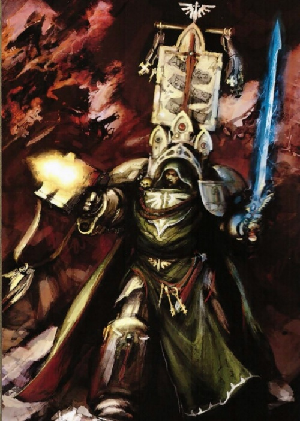
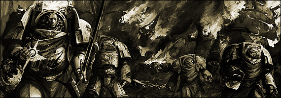
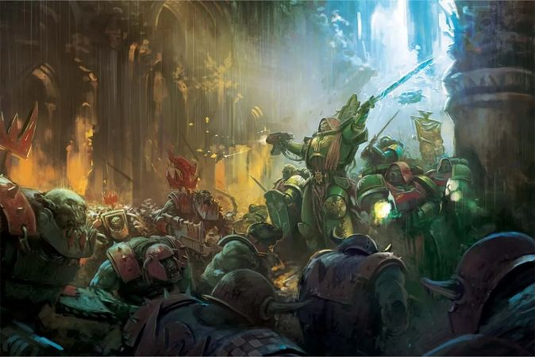
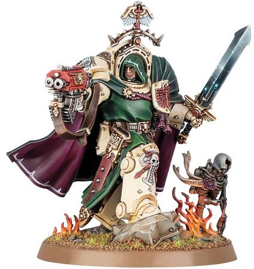

# 0637 贝利亚 Belial

精校状态：中文行文已逐段精校，部分术语仍为暂定

分类：人类帝国 / 黑暗天使

原文来源：https://www.bilibili.com/opus/1114576457557868553

原作者：帝国神选罐头

原文时间：2025年09月20日 13:25

[返回分类目录](目录.md) · [全书目录](../../目录.md)

<!-- A0637-B0001 -->
**英文原文**

Belial is the current Grand Master of the Deathwing (First Captain of the Dark Angels), and once served as the Third Company Master.

<!-- /A0637-B0001 -->

<!-- A0637-B0002 -->

原译文

贝利亚是目前的死翼大导师（黑暗天使的第一连长），曾担任第三连队导师。

**校订译文**

贝利亚是目前的死翼大导师（黑暗天使的第一连长），曾担任第三连队导师。

<!-- /A0637-B0002 -->

<!-- A0637-B0003 图片 -->

<!-- A0637-B0004 -->

原译文

Belial 贝利亚

**校订译文**

Belial 贝利亚

<!-- /A0637-B0004 -->

<!-- A0637-B0005 -->
## History 历史

<!-- /A0637-B0005 -->

<!-- A0637-B0006 -->
**英文原文**

Belial was born on the Feral World of Bregundia among the knightly orders. Born into the Society of the Ebon Star, Belilal was shaped and molded by its ideals of duty and honour. While an eleven year old knight Belilal fought against the Chaplain Lamorak. He was defeated, but did such a good job that he was accepted into the Dark Angels as an Aspirant.

<!-- /A0637-B0006 -->

<!-- A0637-B0007 -->

原译文

贝利亚出生在布雷冈迪亚的蛮荒世界，属于侠义骑士团。贝利亚出生于黑檀之星协会，其职责和荣誉的理想塑造了他。十一岁的老骑士贝利亚与拉莫拉克牧师战斗。他被打败了，但做得很好，被黑暗天使接纳为一名有志者。

**校订译文**

贝利亚出生于蛮荒世界布雷冈迪亚的骑士群体，所属组织名为黑檀之星社。他从小受到职责与荣誉理念的熏陶。十一岁时，这名年轻骑士与教士拉莫拉克交手，虽遭击败，却表现出色，因此获黑暗天使接纳，成为候选者。

**校注：** eleven year old 是年仅十一岁，原译“十一岁的老骑士”误拆句；Aspirant 在星际战士招募语境为候选者。

<!-- /A0637-B0007 -->

<!-- A0637-B0008 -->
**英文原文**

Throughout his rise through the Dark Angels ranks in the 3rd Company, it was noted that Belial was a perfectionist - chastising himself for even a single missed shot. As a commander, he has never reveled in triumphs but instead castigates himself for even the most minor failure. However it was during the Black Crusade of Furion that Belial was rewarded with the position of Master of the Deathwing after defeating a Chaos Lord of Khorne in single combat.

<!-- /A0637-B0008 -->

<!-- A0637-B0009 -->

原译文

在他从黑暗天使晋升到第三连队的整个过程中，人们注意到贝利亚是一个完美主义者，他甚至会因为一次射击失误而责备自己。作为一名指挥官，他从不陶醉于胜利，而是为哪怕是最微小的失败而自责。然而，正是在法里奥的黑色远征期间，贝利亚在一场战斗中击败了恐虐混沌领主，获得了死翼导师的职位。

**校订译文**

贝利亚在第三连队逐步晋升时，就以完美主义闻名；哪怕射失一发，他也会严厉责备自己。成为指挥官后，他从不沉醉于胜利，反而会为最细微的失误自责。弗里翁黑色远征期间，他在单挑中击败一名恐虐混沌领主，因而获任死翼导师。

**校注：** 本篇后段又把其晋升归因于皮希纳四号战绩与加百列阵亡；两段可为并列因素，但本篇没有完整衔接时间，保留各自叙述。

<!-- /A0637-B0009 -->

<!-- A0637-B0010 图片 -->

<!-- A0637-B0011 -->

原译文

Belial (on the left) with members of the Deathwing 贝利亚（左）与死翼成员

**校订译文**

Belial (on the left) with members of the Deathwing 贝利亚（左）与死翼成员

<!-- /A0637-B0011 -->

<!-- A0637-B0012 -->
### Battle of Piscina IV 皮希纳四号之战

<!-- /A0637-B0012 -->

<!-- A0637-B0013 -->
**英文原文**

Belial was serving as the Master of the Third Company on Piscina IV when the Orks — led by Warlords Ghazghkull Mag Uruk Thraka and Nazdreg Ug Urdgrub — invaded. Ghazghkull himself led the assault on the power plant of Kadillus Harbour, Piscina IV’s capital city, seeking to use it to power the Orks' tellyportas. Company Master Belial led a counter-attack that sent the Orks reeling, and it seemed that the Space Marines would prevail. But it was then that Ghazghkull himself attacked Belial, and almost killed him. The power plant fell soon afterward.

<!-- /A0637-B0013 -->

<!-- A0637-B0014 -->

原译文

当军阀碎骨者马格·乌鲁克·萨拉卡和纳兹德雷格·乌骨·乌德格拉布领导的欧克入侵皮希纳四号时，贝利亚正在其上担任第三连队导师。碎骨者亲自领导了对皮希纳四号首都卡迪卢斯港口的发电厂的袭击，试图利用它为欧克的传送器供电。连队导师贝利亚领导了一次反击，使欧克摇摇欲坠，星际战士似乎将获胜。但就在那时，碎骨者自己袭击了贝利亚，差点杀了他。不久之后，发电厂倒塌了。

**校订译文**

碎骨者·斯拉卡与纳兹德雷格·乌骨·乌德格拉布率欧克入侵皮希纳四号时，贝利亚正担任第三连队导师。碎骨者亲自进攻首都卡迪卢斯港的发电厂，打算用其能源驱动欧克传送器。贝利亚率军反击，打得敌人节节后退，胜利似已在望。然而，碎骨者亲自杀来，几乎将他杀死；发电厂随即失守。

**校注：** power plant fell 指发电厂失守，非建筑倒塌；人物完整英文 Ghazghkull Mag Uruk Thraka 依全书决定采用已核短名碎骨者·斯拉卡。

<!-- /A0637-B0014 -->

<!-- A0637-B0015 -->
**英文原文**

With the Orks' tellyportas fully operational, massive Ork reinforcements flooded through. The wounded Belial continued to lead the Dark Angels, who were outnumbered several thousands to one, against the Orks. The Battle for Piscina IV raged for another two weeks until the remainder of the Dark Angels Chapter arrived and drove off the Ork horde. Thanks to the actions of Master Belial and his small force, Piscina IV was saved, and Ghazghkull’s ambitions held in check, for a time at least, until he descended upon the Armageddon system. Following the death of Gabriel, Belial was later promoted to Master of the Deathwing partially due to the bravery he displayed during the Battle.

<!-- /A0637-B0015 -->

<!-- A0637-B0016 -->

原译文

随着欧克的传送器全面投入使用，大量的欧克增援部队涌入。受伤的贝利亚继续领导黑暗天使，他们的人数是几千比一，对抗欧克。皮希纳四号之战又持续了两周，直到黑暗天使战团的其余部分到达并赶走了欧克部落。多亏了贝利亚导师和他的小部队的行动，皮希纳四号得救了，碎骨者的野心至少在一段时间内得到了控制，直到他降临了阿玛吉多顿星系。加百列死后，贝利亚后来被提升为死翼导师，部分原因是他在战斗中表现出的勇气。

**校订译文**

传送器全力运转后，大批欧克援军蜂拥而入。贝利亚虽已负伤，仍率黑暗天使抵抗数千倍于己的敌军。激战又持续两周，直到战团其余部队赶来，终于击退欧克大军。凭借贝利亚及其少量部下的坚守，皮希纳四号得救，碎骨者的野心也暂时受到遏制——直到他后来进犯阿玛吉多顿星系。加百列阵亡后，贝利亚晋升死翼导师，本战中的英勇表现正是原因之一。

**校注：** outnumbered several thousands to one 指欧克为黑暗天使的数千倍，原译没有交代比例方向。

<!-- /A0637-B0016 -->

<!-- A0637-B0017 图片 -->

<!-- A0637-B0018 -->

原译文

Belial leading Dark Angels versus Orks 贝利亚领导的黑暗天使对抗兽人

**校订译文**

Belial leading Dark Angels versus Orks 贝利亚率黑暗天使迎战欧克

<!-- /A0637-B0018 -->

<!-- A0637-B0019 -->
### Recent Actions 近期行动

<!-- /A0637-B0019 -->

<!-- A0637-B0020 -->
**英文原文**

During the Siege of The Rock during the Arks of Omen Campaign, Belial took part in the defense of their Fortress-Monastery against Chaos forces. During the battle, Belial was appointed by Azrael as general commander of the defense of The Rock within the command spire known as the Tower of Angels as the Supreme Grand Master focused on stopping Vashtorr personally.

<!-- /A0637-B0020 -->

<!-- A0637-B0021 -->

原译文

在噩兆方舟战役期间的巨石围城中，贝利亚参与了他们的堡垒修道院对混沌部队的防御。在战斗中，贝利亚被阿兹瑞尔任命为天使之塔指挥尖塔内巨石防御的总指挥官，因为至高大导师专注于亲自阻止瓦什托尔。

**校订译文**

噩兆方舟战役的巨石围城中，贝利亚参与抵御混沌对要塞修道院的进攻。阿兹瑞尔任命他为巨石防御总指挥，让他在指挥尖塔天使之塔统筹战局，至高大导师自己则亲赴前线阻挡瓦什托尔。

<!-- /A0637-B0021 -->

<!-- A0637-B0022 -->
**英文原文**

Later in the same campaign during the Battle of Idolatros, Belial led the Deathwing in the boarding action against the corrupted ruins of Caliban dubbed Wyrmwood. However upon the appearance of Angron, Belial was badly injured by the Daemon Primarch's Axe and had to be carried away by his Deathwing veterans.

<!-- /A0637-B0022 -->

<!-- A0637-B0023 -->

原译文

在同一场战役的晚些时候，在盲信星之战中，贝利亚领导死翼对被称为龙林星的卡利班腐化废墟采取跳帮行动。然而，当安格隆出现时，贝利亚被恶魔原体的斧头重伤，不得不被他的死翼老兵带走。

**校订译文**

同一战役稍后的盲信星之战中，贝利亚率死翼登上卡利班遭腐化的残骸——龙林星。安格隆现身后，恶魔原体一斧将他重创，死翼老兵只得将他抬离战场。

<!-- /A0637-B0023 -->

<!-- A0637-B0024 -->
## Wargear 武器装备

原题：Wargear 战备

<!-- /A0637-B0024 -->

<!-- A0637-B0025 -->
**英文原文**

Belial wears a suit of Terminator Armour and carries a Storm Bolter and the Sword of Silence, a master crafted Power sword. He also displays the Deathwing Company Standard.

<!-- /A0637-B0025 -->

<!-- A0637-B0026 -->

原译文

贝利亚身穿终结者盔甲，手持风暴爆矢枪和寂静之剑，这是一把大师级的动力剑。他还展示了死翼连队旗帜。

**校订译文**

贝利亚身穿终结者护甲，携带风暴爆矢枪与精工动力剑“寂静之剑”，并展示死翼的连队军旗。

<!-- /A0637-B0026 -->

<!-- A0637-B0027 图片 -->

<!-- A0637-B0028 -->

原译文

Belial 贝利亚

**校订译文**

Belial 贝利亚

<!-- /A0637-B0028 -->

本篇核心术语与暂定项

以下列出本篇出现的英文原形及核心术语表用词。同形词可能指不同对象，具体词义以本篇正文和校注为准；单复数、别名和仅见于图注的名称可能尚未列入。完整候选见[术语表](../../术语表/双语术语候选.csv)。

| 英文 | 采用中文 | 状态 |
| --- | --- | --- |
| Space Marines | 星际战士 | 官方已核对 |
| Dark Angels | 黑暗天使 | 官方已核对 |
| Orks | 欧克蛮人 | 官方已核对 |
| Terminator | 终结者 | 官方已核对 |
| Khorne | 恐虐 | 官方已核对 |
| Primarch | 原体 | 官方已核对 |
| Ghazghkull Mag Uruk Thraka | 碎骨者·斯拉卡 | 暂定·官方短名对应 |
| Armageddon | 阿玛吉多顿 | 暂定·官方待核 |
| Caliban | 卡利班 | 暂定·官方待核 |
| Bregundia | 布雷冈迪亚 | 暂定·官方待核 |
| Piscina IV | 皮希纳四号 | 暂定·官方待核 |
| Master | 导师（审判庭职衔）／舰务官（舰员职务） | 语境定译·官方待核 |
| Chaplain | 教士 | 官方已核对 |
| Aspirant | 候补骑士 | 暂定·官方待核 |
| First Captain | 第一连长 | 暂定·官方待核 |
| Chapter | 战团 | 暂定·官方待核 |
| Fortress-monastery | 要塞修道院 | 暂定·官方待核 |
| Captain | 连长 | 暂定·官方待核 |
| Azrael | 阿兹瑞尔 | 官方已核 |
| Belial | 贝利亚 | 官方已核 |
| Supreme Grand Master | 至高大导师 | 暂定·官方待核 |
| Grand Master of the Deathwing | 死翼大导师 | 暂定·官方待核 |
| Horde | 部落 | 暂定·官方待核 |
| Nazdreg Ug Urdgrub | 纳兹德雷格·乌骨·乌德格拉布 | 暂定·官方待核 |
| Angron | 安格隆 | 官方已核对 |
| Grand Master | 大导师 | 暂定·官方待核 |
| Society of the Ebon Star | 黑檀之星社 | 暂定·官方待核 |
| Furion | 弗里翁 | 暂定·官方待核 |
| Sword of Silence | 寂静之剑 | 暂定·官方待核 |
| The Dark | 《黑暗》 | 暂定·官方待核 |
| System | 星系（恒星系统） | 暂定·官方待核 |
| Piscina | 皮希纳 | 暂定·官方待核 |
| Feral World | 蛮荒世界 | 暂定·官方待核 |
| Tower of Angels | 天使之塔 | 暂定·官方待核 |
| Omen | 预兆号 | 暂定·官方待核 |
| Bolter | 爆矢枪 | 暂定·官方待核 |
| Storm bolter | 风暴爆矢枪 | 官方已核对 |
| Wyrmwood | 龙林星 | 暂定·官方待核 |
| Terminator Armour | 终结者盔甲 | 暂定·官方待核 |

