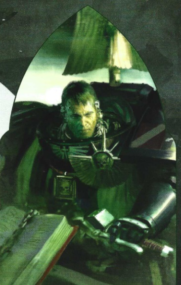
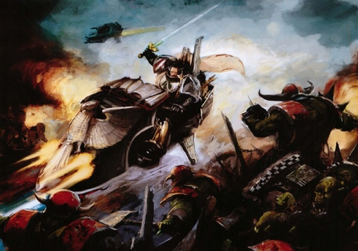
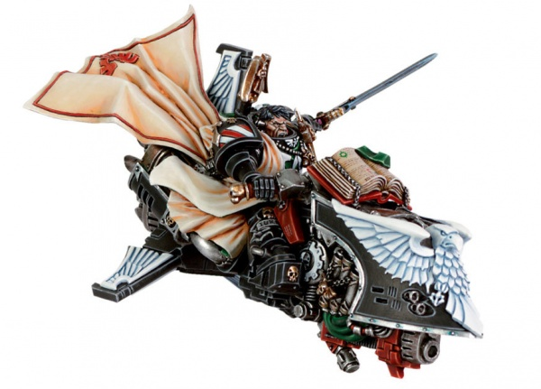

# 0638 萨麦尔 Sammael

精校状态：中文行文已逐段精校，部分术语仍为暂定

分类：人类帝国 / 黑暗天使

原文来源：https://www.bilibili.com/opus/1114560020688666674

原作者：帝国神选罐头

原文时间：2025年09月20日 12:22

[返回分类目录](目录.md) · [全书目录](../../目录.md)

<!-- A0638-B0001 -->
**英文原文**

Sammael is the present and 348th Master of the Ravenwing, the 2nd company of the Dark Angels Space Marines Chapter. He is the youngest Dark Angel to ever be inducted into the Ravenwing.

<!-- /A0638-B0001 -->

<!-- A0638-B0002 -->

原译文

萨麦尔是黑暗天使星际战士第二连队鸦翼的现任和第348任导师。他是有史以来加入鸦翼的最年轻的黑暗天使。

**校订译文**

萨麦尔是黑暗天使星际战士第二连队鸦翼的现任和第348任导师。他是有史以来加入鸦翼的最年轻的黑暗天使。

<!-- /A0638-B0002 -->

<!-- A0638-B0003 图片 -->

<!-- A0638-B0004 -->

原译文

Sammael 萨麦尔

**校订译文**

Sammael 萨麦尔

<!-- /A0638-B0004 -->

<!-- A0638-B0005 -->
## Biography 传记

<!-- /A0638-B0005 -->

<!-- A0638-B0006 -->
**英文原文**

Originally serving in the 8th Company as an Assault Marine, Sammael was chosen for induction into the Ravenwing by its Master Gideon due to his skill. After many great accomplishments against Orks, Traitors, and Eldar Pirates, Sammael fought alongside Gideon in their brief encounter with the arch-foe of the Dark Angels, The Fallen, on Kaphon Betis. There Gideon nearly encountered Cypher before the Fallen Angel again eluded the Dark Angels grasp. After the battle Sammael took several prisoners from pro-Xenos cults and learned of Cypher, and with this revelation Gideon unofficially inducted him into the Inner Circle.

<!-- /A0638-B0006 -->

<!-- A0638-B0007 -->

原译文

萨麦尔最初在第八连队担任突击战士，由于他的技能，他被其导师吉迪恩选中加入鸦翼。在对抗欧克、叛徒和灵族海盗取得许多伟大成就后，萨麦尔在卡彭·贝蒂斯与吉迪恩的短暂交锋中与黑暗天使的死敌堕天使并肩作战。在那里，吉迪恩差点遇到塞弗，然后堕天使再次躲过了黑暗天使的追捕。战斗结束后，萨麦尔从前异型教派中俘虏了几名囚犯，并了解到了塞弗，随着这一发现，吉迪恩非正式地将他引入了内环。

**校订译文**

萨麦尔最初在第八连队担任突击战士，后因技艺出众，被鸦翼导师吉迪恩选中。与欧克、叛军及灵族海盗交战、屡立功勋后，他随吉迪恩在卡彭·贝蒂斯迎战黑暗天使的宿敌堕天使。吉迪恩当时几乎就要与塞弗照面，后者却再次逃出追捕。战后，萨麦尔俘获几名亲异形教派成员，从他们口中得知塞弗的存在。由于已接触这一秘密，吉迪恩便非正式地将他纳入内环。

**校注：** 萨麦尔与吉迪恩并肩迎战堕天使，不是与堕天使并肩对抗吉迪恩。pro-Xenos 是亲异形，不是 former（前）。

<!-- /A0638-B0007 -->

<!-- A0638-B0008 -->
**英文原文**

Sammael's promotion to his current office came more than a century ago during the Kapua Uprising. As Gideon lay dying after an attack by the Chaos Reaver Titan Traitorous Ire, the old master declared Sammael to succeed him. Sammael then took up Gideon's mantle and oversaw the destruction of the Traitor Titan. Sammael's first action as master of the Ravenwing came as he led his company in the invasion of Rastabal (occurred in 465.M41) and led assaults on rebel forces during the Fourth Quadrant Rebellion. He then led the 2nd Company in the war against the Ork Empire of Charadon in the Invasion of Rynn's World. After his Thunderhawk was shot down by Ork forces, Sammael staged the only recorded successful aerial-drop separation maneuver, flying out of the gunship on his jetbike.

<!-- /A0638-B0008 -->

<!-- A0638-B0009 -->

原译文

萨麦尔晋升到现在的职位是在一个多世纪前的卡普阿叛乱期间。当吉迪恩在混沌收割者泰坦叛徒之怒的攻击下奄奄一息时，旧导师宣布萨麦尔接替他。萨麦尔随后接过吉迪恩的斗篷，监督叛徒泰坦的毁灭。萨麦尔作为鸦翼导师的第一次行动发生在他带领他的连队入侵拉斯塔巴尔（发生在465.M41），并在第四象限叛乱期间领导了对叛军的袭击。然后，他领导第二连队在入侵林恩世界的战争中对抗查拉顿的欧克帝国。在他的雷鹰被欧克部队击落后，萨麦尔上演了唯一一次有记录以来成功的空投分离机动，他骑着悬浮摩托飞出了炮艇。

**校订译文**

一个多世纪前的卡普阿叛乱中，吉迪恩遭混沌掠夺者级泰坦叛徒之怒号重创，临终前指定萨麦尔继任。萨麦尔接过职责，指挥部队摧毁那台叛军泰坦。他担任鸦翼导师后的首次行动，是率连进攻拉斯塔巴尔，时间为 465.M41；随后又在第四象限叛乱中突击叛军。瑞恩世界入侵战期间，他率第二连队迎战查拉顿欧克帝国。一次所乘雷鹰被欧克击落，他骑悬浮摩托从炮艇内飞出，完成了唯一有记载的成功空中投放分离机动。

**校注：** took up Gideon’s mantle 为继承职责，非单指穿上斗篷。正文的 465.M41、任期一百多年与末尾资料冲突说明均按英文保留。

<!-- /A0638-B0009 -->

<!-- A0638-B0010 图片 -->

<!-- A0638-B0011 -->

原译文

Sammael battles Orks 萨麦尔与欧克战斗

**校订译文**

Sammael battles Orks 萨麦尔与欧克战斗

<!-- /A0638-B0011 -->

<!-- A0638-B0012 -->
**英文原文**

Known to be as bold as he is reckless, Sammael's audacity is well-noted. Nonetheless, his reign as the Ravenwing's Master has been unusually long and successful and his boldness has benefited him on numerous occasions, such as dodging between Battlesuits to cut the Ethereal Sha Aux'Phan in twain.

<!-- /A0638-B0012 -->

<!-- A0638-B0013 -->

原译文

众所周知，萨梅尔既大胆又鲁莽，他的大胆是众所周知的。尽管如此，他作为鸦翼导师的任期异常漫长和成功，他的大胆在许多场合使他受益，例如在战斗服之间闪避，将以太导师沙·欧潘一分为二。

**校订译文**

萨麦尔既大胆又鲁莽，冒险作风众所周知。即便如此，他执掌鸦翼的时间仍异常长久，战绩也十分出色。这份胆气曾多次助他获胜，例如穿梭于敌方战斗服之间，将以太沙·欧潘一剑斩成两段。

<!-- /A0638-B0013 -->

<!-- A0638-B0014 -->
**英文原文**

Sammael took part in the attempt to aid the inhabitants of the Gehöft during the Gehöft Daemonic incursion. Although his Dark Angels and theirs allies of the White Scars and Brindelweld Imperial Guards valiantly fought the Nurgle daemons, Blighted Claw Chaos Space Marines and Plague Zombies, the planet was lost and declared Exterminatus. Dark Angels abandoned White Scars in pursuit of The Fallen angel Skethon.

<!-- /A0638-B0014 -->

<!-- A0638-B0015 -->

原译文

萨梅尔参与了在格霍夫特恶魔入侵期间帮助格霍夫特居民的尝试。尽管他的黑暗天使和他们的白色伤疤和布林德尔维德帝国卫队盟友勇敢地与纳垢恶魔、枯萎之爪混沌星际战士和瘟疫僵尸作战，但这颗行星已经陷落，并宣告了灭绝令。黑暗天使抛弃了白色伤疤，追逐堕天使斯凯松。

**校订译文**

格霍夫特遭恶魔入侵时，萨麦尔参与救援当地居民。黑暗天使与白疤、布林德尔维德帝国卫队盟军奋勇迎战纳垢恶魔、枯萎之爪混沌星际战士和瘟疫僵尸，却仍未能守住行星，最终决定执行灭绝令。黑暗天使还为追捕堕天使斯凯松，抛下了白疤盟友。

<!-- /A0638-B0015 -->

<!-- A0638-B0016 -->
**英文原文**

During the Siege of The Rock during the Arks of Omen Campaign, Sammael took part in the defense of their Fortress-Monastery against Chaos forces. During the battle, Sammael acted as fleet commander. Shortly afterwards he took part in the Battle of Idolatros, leading a boarding operation which destroyed the Ark of Omen Netherworld Blade and leading an assault on the Wyrmwood.

<!-- /A0638-B0016 -->

<!-- A0638-B0017 -->

原译文

在噩兆方舟战役期间的巨石围城中，萨麦尔参与了要塞修道院对混沌部队的防御。在战斗中，萨麦尔担任舰队指挥官。不久之后，他参加了盲信星之战，领导了一次跳帮行动，摧毁了噩兆方舟冥界之刃，并领导了对龙林星的进攻。

**校订译文**

噩兆方舟战役的巨石围城中，萨麦尔担任舰队指挥官，协助保卫要塞修道院。不久后，他参加盲信星之战，率登舰部队摧毁噩兆方舟冥界之刃号，并率军进攻龙林星。

<!-- /A0638-B0017 -->

<!-- A0638-B0018 -->
## Wargear 武器装备

原题：Wargear 战备

<!-- /A0638-B0018 -->

<!-- A0638-B0019 -->
**英文原文**

In battle he has access to Corvex, one of the few remaining Imperial Jetbikes, but sometimes also rides a Land Speeder known as Sableclaw. He fights with the Power Sword known as the Raven Sword.

<!-- /A0638-B0019 -->

<!-- A0638-B0020 -->

原译文

在战斗中，他可以使用渡鸦号，这是为数不多的帝国悬浮摩托之一，但有时也会乘坐一辆名为阴暗之爪的兰德速攻艇。他用被称为鸦剑的动力剑战斗。

**校订译文**

萨麦尔可骑乘帝国所剩无几的悬浮摩托之一“渡鸦号”，有时也驾驶兰德速攻艇“阴暗之爪”。他的近战武器是动力剑“鸦剑”。

<!-- /A0638-B0020 -->

<!-- A0638-B0021 图片 -->

<!-- A0638-B0022 -->

原译文

Master Sammael 萨麦尔导师

**校订译文**

Master Sammael 萨麦尔导师

<!-- /A0638-B0022 -->

<!-- A0638-B0023 -->
## Trivia 琐事

<!-- /A0638-B0023 -->

<!-- A0638-B0024 -->
### Conflicting sources 来源冲突

<!-- /A0638-B0024 -->

<!-- A0638-B0025 -->
**英文原文**

Codex: Dark Angels (6th Edition) states that Sammael has been the Grand Master of the Ravenwing for over a century, while Azrael had only just come into his respective rank in 939.M41. However, in short story the A Hunt in the Dark portrays that Azrael already was Supreme Grand Master at the time of Sammael's promotion.

<!-- /A0638-B0025 -->

<!-- A0638-B0026 -->

原译文

《圣典:黑暗天使》（第6版）指出，萨麦尔是鸦翼的导师已经有一个多世纪了，而阿兹瑞尔在939,M41才刚刚进入各自的等级。然而，在短篇小说《黑暗中的狩猎》中，阿兹瑞尔在萨麦尔晋升时已经是至高大导师。

**校订译文**

《圣典：黑暗天使》第六版称，萨麦尔担任鸦翼大导师已超过一个世纪，而阿兹瑞尔直到 939.M41 才取得自己的职位。但短篇小说《黑暗中的狩猎》却描写，萨麦尔晋升时，阿兹瑞尔已经是至高大导师。

**校注：** 保留原文已经指出的出版物矛盾；不以某一版覆盖另一版。

<!-- /A0638-B0026 -->

本篇核心术语与暂定项

以下列出本篇出现的英文原形及核心术语表用词。同形词可能指不同对象，具体词义以本篇正文和校注为准；单复数、别名和仅见于图注的名称可能尚未列入。完整候选见[术语表](../../术语表/双语术语候选.csv)。

| 英文 | 采用中文 | 状态 |
| --- | --- | --- |
| Space Marines | 星际战士 | 官方已核对 |
| Dark Angels | 黑暗天使 | 官方已核对 |
| Chaos Space Marines | 混沌星际战士 | 官方已核对 |
| Eldar | 灵族 | 暂定·语境区分 |
| Orks | 欧克蛮人 | 官方已核对 |
| Nurgle | 纳垢 | 官方已核对 |
| Ethereal | 以太 | 官方已核对 |
| Rynn's World | 瑞恩世界 | 暂定·官方待核 |
| Titan | 泰坦 | 暂定·官方待核 |
| Master | 导师（审判庭职衔）／舰务官（舰员职务） | 语境定译·官方待核 |
| White Scars | 白疤 | 官方已核 |
| Scars | 伤疤 | 暂定·官方待核 |
| Chapter | 战团 | 暂定·官方待核 |
| Fortress-monastery | 要塞修道院 | 暂定·官方待核 |
| Azrael | 阿兹瑞尔 | 官方已核 |
| Sammael | 萨麦尔 | 官方已核 |
| Supreme Grand Master | 至高大导师 | 暂定·官方待核 |
| Grand Master of the Ravenwing | 鸦翼大导师 | 暂定·官方待核 |
| Corvex | 渡鸦号 | 暂定·官方待核 |
| Cypher | 塞弗 | 官方已核对 |
| Xenos | 异形 | 暂定·官方待核 |
| Charadon | 查拉顿 | 暂定·官方待核 |
| Assault Marine | 突击战士 | 暂定·官方待核 |
| Grand Master | 大导师 | 暂定·官方待核 |
| Revelation | 启示 | 暂定·官方待核 |
| Reaver Titan | 掠夺者级泰坦 | 官方已核对 |
| Traitorous Ire | 叛徒之怒号 | 暂定·官方待核 |
| Netherworld Blade | 冥界之刃号 | 暂定·官方待核 |
| Gehöft | 格霍夫特 | 暂定·官方待核 |
| The Dark | 《黑暗》 | 暂定·官方待核 |
| Omen | 预兆号 | 暂定·官方待核 |
| claw | 利爪分队 | 暂定·官方待核 |
| Wyrmwood | 龙林星 | 暂定·官方待核 |
| Jetbike | 喷气摩托 | 暂定·官方待核 |
| Sableclaw | 黑爪号 | 暂定·官方待核 |
| Fourth Quadrant | 第四象限 | 暂定·官方待核 |

