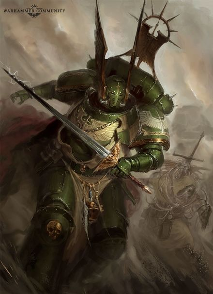
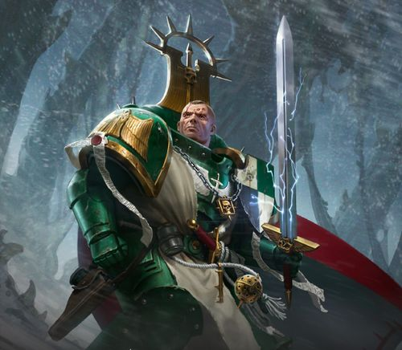
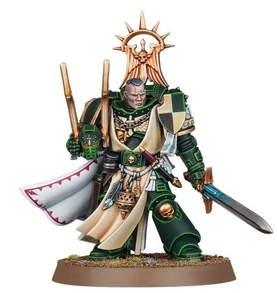

# 0639 拉撒路 Lazarus

精校状态：中文行文已逐段精校，部分术语仍为暂定

分类：人类帝国 / 黑暗天使

原文来源：https://www.bilibili.com/opus/1114593474157477928

原作者：帝国神选罐头

原文时间：2025年09月20日 14:31

[返回分类目录](目录.md) · [全书目录](../../目录.md)

原篇名：拉萨路 Lazarus

<!-- A0639-B0001 -->
**英文原文**

Lazarus is the current Master of the Dark Angels Chapter's 5th Company and is an expert strategist and tactician. Unlike most other Dark Angels Lazarus does not obsessively hunt The Fallen and instead has criticized the more zealous members of the Chapter as being distracted from the wider goal of protecting the Imperium. This criticism has even been leveled towards Supreme Grand Master Azrael.

<!-- /A0639-B0001 -->

<!-- A0639-B0002 -->

原译文

拉撒路是黑暗天使第五连队的现任导师，也是一位战略专家和战术家。与大多数其他黑暗天使不同，拉撒路并没有痴迷于追捕堕天使，而是批评该战团更狂热的成员分散了对保护帝国这一更广泛目标的注意力。这种批评甚至针对至高大导师阿兹瑞尔。

**校订译文**

拉撒路是黑暗天使第五连队的现任导师，精于战略与战术。与多数同袍不同，他不执迷于追猎堕天使，反而批评战团中的狂热者因这项追猎而忽视保卫帝国的大局。他甚至曾将矛头指向至高大导师阿兹瑞尔。

<!-- /A0639-B0002 -->

<!-- A0639-B0003 图片 -->

<!-- A0639-B0004 -->

原译文

Lazarus 拉撒路

**校订译文**

Lazarus 拉撒路

<!-- /A0639-B0004 -->

<!-- A0639-B0005 -->
## Biography 传记

<!-- /A0639-B0005 -->

<!-- A0639-B0006 -->
### Early career 早期职业生涯

<!-- /A0639-B0006 -->

<!-- A0639-B0007 -->
**英文原文**

During the Siege of the Fenris System, Lazarus was a Sergeant of the 5th Company and defended The Rock against Daemonic assaults alongside companies of Chapter Serfs. The experience affected Lazarus deeply and caused him to develop a deep hatred against Chaos. Lazarus took command of the 5th after his predecessor, Company Master Balthasar, was slain in the chaotic battles that followed the Great Rift's creation.

<!-- /A0639-B0007 -->

<!-- A0639-B0008 -->

原译文

在芬里斯星系围城期间，拉撒路是第五连队的军士，与连队的战团侍从一起保卫巨石免受恶魔的袭击。这段经历深深地影响了拉撒路，使他对混沌产生了深刻的仇恨。拉撒路在他的前任巴尔塔萨导师在大裂隙形成后的混乱战斗中被杀后，接管了第五连队。

**校订译文**

芬里斯星系围城期间，拉撒路是第五连队的军士，曾与数连战团农奴一道保卫巨石，抵挡恶魔。这段经历使他深受震撼，对混沌怀有深仇。大裂隙形成后的混战中，第五连队导师巴尔塔萨阵亡，拉撒路随后接任。

**校注：** companies of Chapter Serfs 指侍从组成的若干连队，不是“第五连队所属侍从”。

<!-- /A0639-B0008 -->

<!-- A0639-B0009 图片 -->

<!-- A0639-B0010 -->

原译文

Lazarus 拉撒路

**校订译文**

Lazarus 拉撒路

<!-- /A0639-B0010 -->

<!-- A0639-B0011 -->
### War Zone Stygius 冥河战区

<!-- /A0639-B0011 -->

<!-- A0639-B0012 -->
**英文原文**

He also took part in War Zone Stygius, where only Lazarus' leadership prevented a total rout of Imperial forces on the Ice World of Rimenok. While fighting there, though, Lazarus was struck by Thousand Sons fell sorcery, which left him with such severe wounds that not even a Dreadnought sarcophagus could save him. With his life on the line, the only option remaining to the Dark Angels' Apothecaries was for the Company Master to undergo the Rubicon Primaris. Days later, the operation was a success and Lazarus emerged as a fully healed Primaris Space Marine and the first to become a member of the Dark Angels Inner Circle. He now leads his Company once again and is even more determined to punish the servants of Tzeentch.

<!-- /A0639-B0012 -->

<!-- A0639-B0013 -->

原译文

他还参加了冥河战区，在那里，只有拉撒路的领导阻止了帝国军队在瑞姆诺克冰雪世界的彻底溃败。然而，在那里战斗时，拉撒路被千子堕落巫术击中，这给他留下了如此严重的伤口，甚至连无畏石棺都救不了他。由于生命垂危，黑暗天使药剂师剩下的唯一选择是让连队导师接受原铸手术。几天后，手术取得了成功，拉撒路成为一名完全康复的原铸星际战士，也是第一个成为黑暗天使内环成员的人。他现在再次领导他的连队，并更加决心惩戒奸奇的仆人。

**校订译文**

拉撒路还参加了冥河战区的战事；在冰封世界瑞姆诺克，全赖他的指挥，帝国部队才未全线溃退。但他在当地被千子的邪恶巫术击中，伤势严重到连无畏机甲的石棺也无法保住性命。药剂师已别无选择，只能为他实施原铸跨越手术。数日后，手术成功，拉撒路以伤势痊愈的原铸星际战士之身重返军中；源文称，他也是首位成为黑暗天使内环成员的原铸战士。此后，他重新统率第五连队，惩罚奸奇仆从的决心更加坚定。

**校注：** first 指首位原铸内环成员，非内环历史上的第一个人。此处首位资格与634篇阿法兰的试炼叙述可能存在先后版本差异，所给文本未清楚协调，保留并提示。

<!-- /A0639-B0013 -->

<!-- A0639-B0014 -->
### Ritual of the Damned 诅咒仪式

<!-- /A0639-B0014 -->

<!-- A0639-B0015 -->
**英文原文**

A few days after returning to The Rock from the Stygius sector a message from the Grey Knights arrived. Lazarus alongside Azrael and Ezekiel heard the message from the one surviving astropath that received it. After agreeing on an interpretation of the message, that Magnus and the Thousand Sons were doing some kind of ritual and the Grey Knights needed their help, Lazarus declared that he would answer the Grey Knights call. Despite his doubts about the message Azrael decided that Lazarus would go alongside a complement of the Deathwing and Ravenwing. During the journey to Sortiarius the Navigator of the Seeker of Redemption was exhausted to the point of near death, so Lazarus ordered that they exit the warp. During this time the Grey Knights strike cruiser Purging Sword found them. After a tense discussion Lazarus and Arvann Stern agreed that any strike they make must be quick and decisive. While reviewing their intelligence Lazarus came up with a plan of attack, he and the Dark Angels would go after a temple complex that was preventing planetary bombardment, while forces go to engage them the Grey Knights would be able to attack Tizca.

<!-- /A0639-B0015 -->

<!-- A0639-B0016 -->

原译文

从冥河地区返回巨石几天后，灰骑士传来了一条消息。拉撒路与阿兹瑞尔和以西结一起听到了一位幸存的星语者的信息。在就信息的解释达成一致后，即马格努斯和千子正在进行某种仪式，灰骑士需要他们的帮助，拉撒路宣布他将回应灰骑士的呼召。尽管阿兹瑞尔对这一信息表示怀疑，但他决定拉撒路将与死翼和鸦翼并肩作战。在前往索提尔瑞斯的旅程中，救赎寻求者号的导航者筋疲力尽，濒临死亡，所以拉撒路命令他们离开亚空间。在此期间，灰骑士打击巡洋舰净化之剑号发现了他们。经过紧张的讨论，拉撒路和艾维安·斯特恩一致认为，他们的任何打击都必须迅速而果断。在审查他们的情报时，拉撒路想出了一个攻击计划，他和黑暗天使将追击一个防止行星轰炸的神殿建筑群，而部队将与他们交战，灰骑士将能够攻击提兹卡。

**校订译文**

从冥河星区返回巨石数日后，一则来自灰骑士的讯息传来。负责接收的星语者只有一人生还，他向拉撒路、阿兹瑞尔与以西结转述了内容。三人一致判断，马格努斯与千子正在举行某种仪式，灰骑士需要援助。拉撒路主动响应；阿兹瑞尔虽仍对讯息存疑，还是准许他带部分死翼与鸦翼同行。前往索提尔瑞斯途中，救赎寻求者号的导航员已疲惫至濒死，拉撒路便下令退出亚空间。灰骑士打击巡洋舰净化之剑号随后找到他们。经过紧张商议，他与艾维安·斯特恩决定速战速决。研判情报后，拉撒路提出：黑暗天使先攻击一处阻止轨道轰炸的神殿建筑群，吸引敌军前来迎战，再由灰骑士趁机突击提兹卡。

<!-- /A0639-B0016 -->

<!-- A0639-B0017 -->
**英文原文**

Once in system both groups began their attack. Lazarus led 5th company down to the surface while the Deathwing and Ravenwing waited in reserve. His plan seemed to work and the Thousand Sons left Tizca to fight them. Lazarus knew the battle was going too slowly and ordered the Deathwing and Ravenwing to deploy. Once they were finally able to damage the crytstal at the top of the temple pyramid they engaged in a fighting withdrawal. It wasn't until the majority of the Dark Angels had left the surface, and were in the hanger of the Seeker, that he and the company found out the Grey Knights had been urgently hailing for aid, and that they had been deceived

<!-- /A0639-B0017 -->

<!-- A0639-B0018 -->

原译文

一进入星系，两组人都开始了攻击。拉撒路带领第五连队降下表面，而死翼和鸦翼则作为预备队等待。他的计划似乎奏效了，千子离开提兹卡与他们作战。拉撒路知道战斗进展太慢，于是命令死翼和鸦翼部署。一旦他们最终能够破坏神殿金字塔顶部的水晶塔，他们就进行了战斗撤退。直到大多数黑暗天使离开了表面，在救赎寻求者号上，他和他的战友才发现灰骑士们一直在紧急呼救，他们被欺骗了

**校订译文**

抵达星系后，两路部队按计划行动。拉撒路率第五连队降落地表，死翼与鸦翼则待命。计划起初似乎有效，千子离开提兹卡前来迎战；但战斗进展过慢，他便命预备队投入战场。黑暗天使最终破坏神殿金字塔顶端的水晶，随即边战边撤。直到大部已离开地表、回到救赎寻求者号机库，他们才得知灰骑士一直在紧急求援，而自己已经中计。

<!-- /A0639-B0018 -->

<!-- A0639-B0019 -->
**英文原文**

The Grey Knights were able to make contact from their librarians to another in the Dark Angels. They suggested creating a temporary corridor in the warp to unite them. This killed the Librarians, but it worked and Lazarus and the Dark Angels were able to join the Grey Knights in battle. They fought together towards the ritual site, at one point Stern and Lazarus fought back to back. When they finally arrived at the ritual site, where Magnus and the Thousand Sons had already begun, Lazarus knew they couldn't fight their way through and ordered the Dark Angels to fire upon Magnus, however this had no effect on him. The Grey Knights were able to get their ship in orbit to fire upon their position, disorienting Magnus and the Thousand Sons. Shortly after the space marine gunships rushed down to pick up the survivors, including Lazarus, and returned to orbit.

<!-- /A0639-B0019 -->

<!-- A0639-B0020 -->

原译文

灰骑士能够从他们的智库联系到黑暗天使中的另一个人。他们建议在亚空间中创建一条临时走廊来联合他们。这杀死了智库，但它奏效了，拉撒路和黑暗天使能够加入灰骑士的战斗。他们一起向仪式现场战斗，斯特恩和拉撒路一度背靠背。当他们最终到达仪式现场时，马格努斯和千子已经开始了，拉撒路知道他们无法战斗通过，并命令黑暗天使向马格努斯开火，但这对他没有影响。灰骑士能够让他们的飞船进入轨道，向他们的阵地开火，使马格努斯和千子迷失方向。不久之后，星际战士炮艇冲下来接包括拉撒路在内的幸存者，并返回轨道。

**校订译文**

灰骑士的智库员终于与一名黑暗天使智库员取得联络，提议在亚空间中开辟临时通道，让两军会合。参与的智库员为此付出生命，但通道成功开启，拉撒路得以率军赶到灰骑士身边。双方并肩向仪式地点推进，他还一度与斯特恩背靠背作战。抵达后，马格努斯与千子已开始仪式；拉撒路判断无法强行杀穿敌阵，便命部下直接向马格努斯射击，却毫无效果。灰骑士于是召唤轨道舰船轰击自己所在的位置，使敌人陷入混乱。随后，星际战士炮艇急速降下，接走拉撒路等幸存者，返回轨道。

**校注：** 船已在轨道，火力被引向己方位置；原译误解为先把船移入轨道。临时亚空间通道造成参与智库员死亡，英文没有逐一交代死者名单。

<!-- /A0639-B0020 -->

<!-- A0639-B0021 -->
### The Siege of The Rock 巨石围城

<!-- /A0639-B0021 -->

<!-- A0639-B0022 -->
**英文原文**

Lazuras was present and took part in the second assault on The Rock during the Arks of Omen Campaign. During the fighting Lazarus lead the defense of the Galleria Aspocondael, deploying holding forces to hold back Vashtorr himself. In the Galleria he led the defense of the Pilastrum, reinforced by survivors of the Forbidden Gate Garrison, though he had them fall back to the Oathway to avoid being surrounded by Word Bearers. When that starts to happen in the Oathway he sends out a call for aid. Azrael would then order him to fall back to the Gallerium Exactor with his surviving forces to reinforce Ezekiel, which he did. At the Nameless Gate he fought Vashtorr again alongside Ezekiel, and Azrael, who had arrived with reinforcements, he was ordered by Azrael to die before letting the Nameless Gate be opened.

<!-- /A0639-B0022 -->

<!-- A0639-B0023 -->

原译文

拉撒路当时在场，并参加了噩兆方舟战役期间对巨石的第二次进攻。在战斗中，拉撒路领导了阿斯波康戴尔拱廊的防御，部署了控制部队来阻止瓦什托尔本人。在拱廊，他领导了壁柱的防御，并得到了禁忌之门守备部队幸存者的增援，尽管他让他们回到誓言之路，以避免被怀言者包围。当这种情况开始在誓言之路发生时，他发出了求援呼叫。然后，阿兹瑞尔命令他带着幸存的部队撤退到强征大厅，以增援以西结，他照做了。在无名之门，他与以西结再次并肩作战，而阿兹瑞尔带着援军抵达，阿兹瑞尔命令他死也不能让无名之门被打开。

**校订译文**

噩兆方舟战役中，拉撒路参与抵御对巨石的第二次进攻。他主持阿斯波康戴尔拱廊的防御，部署阻击部队牵制瓦什托尔。在拱廊内的壁柱阵地，他获得禁忌之门守军残部增援，却又为避免怀言者包围，下令退往誓言之路。当该处同样面临包围时，他发出求援。阿兹瑞尔命他率残部继续后撤至强征大厅，增援以西结。在无名之门，他与以西结、率援军赶到的阿兹瑞尔再次迎战瓦什托尔，并受命死守大门，宁死也不能让它被打开。

**校注：** Lazarus 是抵御进攻的一方，原译“参加对巨石的进攻”易误认阵营。holding forces 为阻击部队。

<!-- /A0639-B0023 -->

<!-- A0639-B0024 -->
### Battle of Husk 赫斯克之战

<!-- /A0639-B0024 -->

<!-- A0639-B0025 -->
**英文原文**

When the planet of Husk had been invaded by Orks the imperial authorities that called for aid had underestimated both the size of the Ork forces, as well as how well armed they were. As a result Lazarus was sent alongside only 5th Company, some scouts, as well as the ships Unrelenting Fury, Sword of Caliban and Death of Mercy

<!-- /A0639-B0025 -->

<!-- A0639-B0026 -->

原译文

当赫斯克行星被欧克入侵时，呼叫救援的帝国当局低估了欧克军队的规模以及他们的武装程度。因此，只有拉撒路同第五连队、一些侦察兵以及无情狂怒号、卡利班之剑号和慈悲之死号战舰被派遣

**校订译文**

赫斯克遭欧克入侵时，求援的帝国当局低估了敌军规模与装备水平。因此，拉撒路仅带第五连队、一些侦察兵，以及无情狂怒号、卡利班之剑号、慈悲之死号三艘舰船前往。

<!-- /A0639-B0026 -->

<!-- A0639-B0027 -->
**英文原文**

On the planet Lazarus set a trap for the Orks that was dependent on Unrelenting Fury being able to bombard Ork forces that were heading straight for them. However, shortly before the Orks arrival the ship was called away by Azrael, forcing a rapid change of the plan. Lazarus was forced to have the company perform a fighting retreat. During the battle he saw Lieutenant Amad killed right in front of him by an Ork Weirdboy. Despite heavy losses they were able to beat the Orks in the end.

<!-- /A0639-B0027 -->

<!-- A0639-B0028 -->

原译文

在这个行星上，拉撒路为兽人设置了一个陷阱，这个陷阱依赖于无情狂怒号能够轰炸直接向他们前进的兽人部队。然而，在欧克抵达前不久，这艘船被阿兹瑞尔召唤，迫使计划迅速改变。拉撒路被迫让连队进行战斗撤退。在战斗中，他看到阿马德副官在他面前被一只欧克怪异小子杀死。尽管损失惨重，他们最终还是击败了欧克。

**校订译文**

拉撒路在地表设下陷阱，计划让无情狂怒号轰击迎面而来的欧克大军。但敌人抵达前不久，阿兹瑞尔突然调走战舰，迫使他临时改策，率连队边战边退。他亲眼看见阿马德副官被一名欧克灵能小子杀死。最终他们仍击败了敌军，却付出惨重伤亡。

<!-- /A0639-B0028 -->

<!-- A0639-B0029 -->
**英文原文**

After the Battle Lazarus was furious at Azrael for calling away the battle barge, leading to his heavy losses. When he returned to The Rock Lazarus met with Azrael, who confirmed that Unrelenting Fury left the battle to hunt The Fallen but was unsuccessful. As the conversation got more tense Lazarus told Azrael the story of the Doom of Droslin, how the knights fought a battle they knew they would die in, and as a result weren't around later to help other knightly orders finally kill the beast. He told Azrael that he saw the Dark Angels in that story, how their oath to destroy the fallen is an obsession that has the power to distract, distort and destroy them. Angered, Azrael accused Lazarus of speaking madness because he crossed the rubicon. Lazarus stated that it was not madness, and that the Dark Angels were afraid everyone would know they were human and flawed. Azrael then picked him up by the armor and told him that they knew no fear, that there would be no change in how they operate, and that The Fallen would always be their first priority. Azrael said that he understood and would carry out his will, then left the meeting.

<!-- /A0639-B0029 -->

<!-- A0639-B0030 -->

原译文

战斗结束后，拉撒路对阿兹瑞尔调离战斗驳船感到愤怒，导致他损失惨重。当他回到巨石时，拉撒路会见了阿兹瑞尔，阿兹雷尔证实，无情狂怒号离开了战斗去追捕堕天使，但没有成功。随着谈话变得越来越紧张，拉撒路向阿兹瑞尔讲述了德罗斯林的毁灭的故事，讲述了骑士们如何进行一场他们知道自己会死的战斗，结果后来没有帮助其他骑士团最终杀死这头野兽。他告诉阿兹瑞尔，他在那个故事中看到了黑暗天使，他们摧毁堕天使的誓言是一种痴迷，有能力分散、扭曲和摧毁他们。阿兹瑞尔愤怒地指责拉撒路说疯话，因为他越过原铸界限。拉撒路表示，这不是疯狂，黑暗天使害怕每个人都知道他们是人，有缺陷。然后，阿兹雷尔用盔甲把他托了起来，告诉他他们无所畏惧，他们的行动方式不会改变，堕天使将永远是他们的首要任务。阿兹瑞尔说他理解并会执行他的意愿，然后离开了会面。

**校订译文**

战后，拉撒路因战斗驳船被调走、致使所部伤亡惨重而怒不可遏。返回巨石后，他当面质问阿兹瑞尔；对方承认，无情狂怒号是去追猎堕天使，却一无所获。争执逐渐激烈，拉撒路讲起《德罗斯林的毁灭》：一群骑士执意投入必死的战斗，结果等到其他骑士团终于有机会杀死巨兽时，他们已无法参与。他说，这正像黑暗天使——消灭堕天使的誓言已成执念，足以使战团偏离方向、扭曲本心，乃至自毁。阿兹瑞尔大怒，指责他接受原铸改造后开始胡言乱语。拉撒路否认，并说黑暗天使其实害怕别人知道，他们也只是会犯错、有缺陷的人。阿兹瑞尔揪住他的护甲，将他提起，强调黑暗天使不知恐惧，行事方式不会改变，堕天使永远是第一要务。原文随后写道，阿兹瑞尔表示理解并会执行对方的意愿，然后离开会面。

**校注：** 英文末句仍写 Azrael said that he understood and would carry out his will，明显与前文由阿兹瑞尔下令、拉撒路受命的对话关系冲突，疑应为 Lazarus，但未查原著确认。本稿以“原文随后写道”明确归因保留，不默改英文人物身份。

<!-- /A0639-B0030 -->

<!-- A0639-B0031 -->
### Battle of Reis 雷斯之战

<!-- /A0639-B0031 -->

<!-- A0639-B0032 -->
**英文原文**

On Reis he and his 5th Company defeated the Chaos-corrupted Enginseer Heris Amis. During and after the campaign on Reis Lazarus translated the old Calibanite story The Doom of Droslin.

<!-- /A0639-B0032 -->

<!-- A0639-B0033 -->

原译文

在雷斯之战中，他和他的第五连队击败了被混沌腐化的工造士赫里斯·阿米斯。在雷斯战役期间和之后，拉撒路翻译了卡利班的老故事《德罗斯林的毁灭》。

**校订译文**

在雷斯之战中，他和他的第五连队击败了被混沌腐化的工造士赫里斯·阿米斯。在雷斯战役期间和之后，拉撒路翻译了卡利班的老故事《德罗斯林的毁灭》。

<!-- /A0639-B0033 -->

<!-- A0639-B0034 图片 -->

<!-- A0639-B0035 -->

原译文

Master Lazarus 拉萨路导师

**校订译文**

Master Lazarus 拉撒路导师

<!-- /A0639-B0035 -->

<!-- A0639-B0036 -->
## Wargear 武器装备

原题：Wargear 战备

<!-- /A0639-B0036 -->

<!-- A0639-B0037 -->
**英文原文**

Lazarus' wargear includes the Spiritshield Helm and the Power Sword Enmity's Edge. His personal flagship is the Strike Cruiser Sword of Caliban.

<!-- /A0639-B0037 -->

<!-- A0639-B0038 -->

原译文

拉撒路的战备包括灵盾头盔和动力剑仇恨之刃。他的个人旗舰是卡利班之剑打击巡洋舰。

**校订译文**

拉撒路的装备包括灵盾头盔与动力剑“仇恨之刃”。他的旗舰是打击巡洋舰卡利班之剑号。

<!-- /A0639-B0038 -->

本篇核心术语与暂定项

以下列出本篇出现的英文原形及核心术语表用词。同形词可能指不同对象，具体词义以本篇正文和校注为准；单复数、别名和仅见于图注的名称可能尚未列入。完整候选见[术语表](../../术语表/双语术语候选.csv)。

| 英文 | 采用中文 | 状态 |
| --- | --- | --- |
| Dark Angels | 黑暗天使 | 官方已核对 |
| Grey Knights | 灰骑士 | 官方已核对 |
| Thousand Sons | 千子 | 官方已核对 |
| Orks | 欧克蛮人 | 官方已核对 |
| Astropath | 星语者 | 官方已核对 |
| Navigator | 导航员 | 官方已核对 |
| Warp | 亚空间 | 官方已核对 |
| Great Rift | 大裂隙 | 官方已核对 |
| Imperium | 帝国 | 暂定·简称 |
| Tzeentch | 奸奇 | 官方已核对 |
| Weirdboy | 灵能小子 | 官方已核对 |
| Battle Barge | 战斗驳船 | 暂定·官方待核 |
| Word Bearers | 怀言者 | 暂定·官方待核 |
| Sector | 星区 | 暂定·官方待核 |
| Caliban | 卡利班 | 暂定·官方待核 |
| Fenris | 芬里斯 | 暂定·官方待核 |
| Master | 导师（审判庭职衔）／舰务官（舰员职务） | 语境定译·官方待核 |
| Enginseer | 工造士 | 暂定·官方待核 |
| Lieutenant | 副官 | 暂定·官方待核 |
| Seeker | 追踪者 | 暂定·官方待核 |
| Space Marine | 星际战士 | 暂定·官方待核 |
| Chapter | 战团 | 暂定·官方待核 |
| Sergeant | 军士 | 暂定·官方待核 |
| Primaris Space Marine | 原铸星际战士 | 暂定·官方待核 |
| Azrael | 阿兹瑞尔 | 官方已核 |
| Ezekiel | 以西结 | 暂定·官方待核 |
| Lazarus | 拉撒路 | 官方已核 |
| Arvann Stern | 艾维安·斯特恩 | 暂定·官方待核 |
| Supreme Grand Master | 至高大导师 | 暂定·官方待核 |
| Nameless | 无名者 | 暂定·官方待核 |
| Strike Cruiser | 打击巡洋舰 | 暂定·官方待核 |
| Chapter serfs | 战团农奴 | 暂定·官方待核 |
| Rubicon Primaris | 原铸跨越手术 | 暂定·官方待核 |
| Calibanite | 卡利班诸语 | 暂定·官方待核 |
| The Beast | 野兽 | 暂定·官方待核 |
| Sortiarius | 索提尔瑞斯 | 暂定·官方待核 |
| Dreadnought | 无畏机甲 | 暂定·官方待核 |
| Grand Master | 大导师 | 暂定·官方待核 |
| Unrelenting | 无情号 | 暂定·官方待核 |
| The Doom of Droslin | 德罗斯林的毁灭 | 暂定·官方待核 |
| Spiritshield Helm | 灵盾头盔 | 暂定·官方待核 |
| Enmity's Edge | 仇恨之刃 | 暂定·官方待核 |
| Galleria Aspocondael | 阿斯波康戴尔拱廊 | 暂定·官方待核 |
| Gallerium Exactor | 强征大厅 | 暂定·官方待核 |
| Oathway | 誓言之路 | 暂定·官方待核 |
| Mercy | 仁慈 | 暂定·官方待核 |
| The Dark | 《黑暗》 | 暂定·官方待核 |
| System | 星系（恒星系统） | 暂定·官方待核 |
| Omen | 预兆号 | 暂定·官方待核 |
| Forbidden Gate | 禁忌之门 | 暂定·官方待核 |
| Nameless Gate | 无名之门 | 暂定·官方待核 |
| Tizca | 提兹卡 | 暂定·官方待核 |
| Sword of Caliban | 卡利班之剑号 | 暂定·官方待核 |
| Stygius Sector | 冥河星区 | 暂定·官方待核 |

