# 0640 福格瑞姆 Fulgrim

精校状态：中文行文已逐段精校，部分术语仍为暂定

分类：人类帝国 / 帝皇之子

原文来源：https://www.bilibili.com/opus/1092239475079118871

原作者：帝国神选罐头

原文时间：编辑于 2025年08月17日 11:40

[返回分类目录](目录.md) · [全书目录](../../目录.md)

<!-- A0640-B0001 -->
**英文原文**

"Perfection is not a state of being, It is a state of striving. The journey is all that has meaning, not the goal"

<!-- /A0640-B0001 -->

<!-- A0640-B0002 -->

原译文

“完美不是一种存在状态，而是一种追求的过程。过程才是有意义的，而不是目标”

**校订译文**

“完美不是一种存在状态，而是一种追求的过程。过程才是有意义的，而不是目标”

<!-- /A0640-B0002 -->

<!-- A0640-B0003 -->
**英文原文**

Fulgrim (also known as the Phoenician, the Illuminator, the Prefector of Chemos) is the Primarch of the Emperor's Children, one of the twenty Primarchs created by the Emperor in the earliest days of the Imperium, just after the end of the Age of Strife. Fulgrim, like the other Primarchs, was sucked from Terra by the Gods of Chaos and placed on a faraway world in an attempt to prevent the coming of the Age of the Imperium. Constantly seeking to emulate the Emperor by perfecting himself, Fulgrim's obsession bred a hubris that drove him to eventually become consumed by the Chaos God Slaanesh.

<!-- /A0640-B0003 -->

<!-- A0640-B0004 -->

原译文

福格瑞姆（也被称为紫庭凤凰、启明者、彻莫斯提督）是帝皇之子的原体，是帝皇在纷争时代结束后，在帝国早期创建的二十位原体之一。福格瑞姆和其他的原体一样，被混沌诸神从泰拉吸走，并被安置在一个遥远的世界，试图阻止帝国时代的到来。福格瑞姆不断试图通过自我完善来效仿帝皇，他的执念滋生了一种傲慢，最终驱使他被混沌之神色孽吞噬。

**校订译文**

福格瑞姆又称“紫庭凤凰”“启明者”与“彻莫斯提督”，是帝皇之子的原体。他是纷争时代结束、帝国初创时，帝皇创造的二十位原体之一。混沌诸神将他与其他原体从泰拉卷走，抛向遥远的世界，企图阻止帝国时代到来。福格瑞姆一心完善自身，以求效仿帝皇；然而，追求完美的执念滋生了傲慢，最终使他沉沦于混沌之神色孽。

<!-- /A0640-B0004 -->

<!-- A0640-B0005 图片 -->
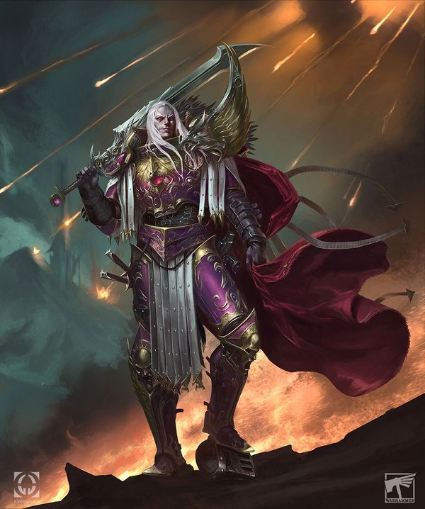

<!-- A0640-B0006 -->

原译文

Fulgrim during the Horus Heresy 荷鲁斯叛乱时期的福格瑞姆

**校订译文**

Fulgrim during the Horus Heresy 荷鲁斯之乱时期的福格瑞姆

<!-- /A0640-B0006 -->

<!-- A0640-B0007 -->
## Biography 传记

<!-- /A0640-B0007 -->

<!-- A0640-B0008 -->
### Youth 青年

<!-- /A0640-B0008 -->

<!-- A0640-B0009 -->
**英文原文**

Tullea, Corrin, and Sullax were labourers of the resource-poor world of Chemos sent to investigate a meteorite impact. Sent without transport, the three had to take shelter from a wire-storm in an abandoned factory. When they reached the impact site, they didn't find a fallen satellite or spacecraft, they found an ever-shifting mass of light. Sullax was wary, but Corrin felt that it was harmless. Corrin watched the light take shape and it touched his mind, learning everything he knew, before it took the shape of a perfectly-formed baby boy. Sullax wanted to kill the child, seeing it as a burden on their resources, but the child had entranced Corrin and he refused. Tullea shot Sullax and neither of them felt any guilt over killing him to save the perfect baby. Noticing that a stream of pure water had formed where the baby had landed, Corrin decided to name the child after the water-bringer of Chemos's creation myth, Fulgrim.

<!-- /A0640-B0009 -->

<!-- A0640-B0010 -->

原译文

图利亚、科林和苏拉克斯是资源贫乏的彻莫斯世界的工人，他们被派去调查陨石撞击。由于没有运输工具，三人不得不在一家废弃的工厂躲避雷暴。当他们到达撞击地点时，他们没有发现坠落的卫星或航天器，而是发现了一团不断变幻的光。苏拉克斯很谨慎，但科林认为这是无害的。科林看着光成形，它触动了他的心灵，在它成形为一个完美的男婴之前，他学习了他所知道的一切。苏拉克斯想杀了这个孩子，认为这是他们资源的负担，但这个孩子让科林着迷了，他拒绝了。图利亚枪杀了苏拉克斯，他们俩都没有因为为了救这个完美的婴儿而杀了他而感到内疚。注意到婴儿着陆的地方已经形成了一股纯净的水流，科林决定以彻莫斯创世神话中的引水者福格瑞姆的名字给孩子命名。

**校订译文**

图利亚、科林与苏拉克斯是资源匮乏的彻莫斯上的工人，受命调查一处陨石撞击地点。没有交通工具，三人只能徒步赶路，途中还躲进废弃工厂，避过一场“线暴”。到了撞击点，他们没有发现坠落的卫星或飞船，而是看到一团不断变幻的光。苏拉克斯心存戒备，科林却觉得它没有危险。他注视着光团成形；光团触及他的心灵，读取他所知的一切，随后化作形体完美的男婴。苏拉克斯认为婴儿只会消耗本已匮乏的资源，想将其杀死，科林却已被婴儿深深吸引，坚决反对。图利亚开枪杀死苏拉克斯；为了保护这名完美的婴儿，两人都毫无愧疚。科林发现婴儿落地处涌出一股清泉，便依照彻莫斯创世神话中带来水源者的名字，为他取名福格瑞姆。

**校注：** wire-storm 的具体成因在本段没有交代，暂按字面保留“线暴”，不擅自当成雷暴。读取科林记忆的是光团，非科林反过来学习自己的知识。

<!-- /A0640-B0010 -->

<!-- A0640-B0011 图片 -->
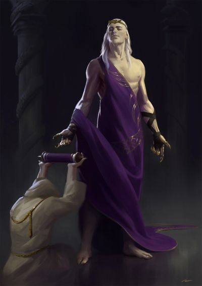

<!-- A0640-B0012 -->

原译文

younger Fulgrim 青年福格瑞姆

**校订译文**

younger Fulgrim 青年福格瑞姆

<!-- /A0640-B0012 -->

<!-- A0640-B0013 -->
**英文原文**

Fulgrim spent his early years as a humble factory worker, but soon became a legend in his own right. At half the age of his fellow workers, he was able to fulfill his obligations to the continual running of the fortress-factory of Callax with ease. He quickly grew to understand the technology he had to work with and began to modify it, increasing efficiency dramatically. By the time he was fifteen years of age, Fulgrim had risen from the rank of worker to become one of the executives ruling the settlement. Learning of the gradual deterioration of both Callax and all the other settlements of Chemos, Fulgrim decided that he would save his world.

<!-- /A0640-B0013 -->

<!-- A0640-B0014 -->

原译文

福格瑞姆早期是一名谦逊的工厂工人，但很快就凭借自己的力量成为了传奇。在他只有同事一半的年纪时，他能够轻松地履行自己对卡拉克斯堡垒工厂持续运营的义务。他很快就了解了他必须使用的技术，并开始对其进行修改，从而大大提高了效率。当他十五岁的时候，福格瑞姆已经从工人的级别上升到了统治定居点的高管之一。福格瑞姆得知卡拉克斯和彻莫斯的所有其他定居点都在逐渐恶化，他决定拯救自己的世界。

**校订译文**

福格瑞姆最初只是一名普通工人，却很快成为传奇。年龄只有同伴一半时，他就已能轻松完成维持卡拉克斯要塞工厂运转所需的工作。他迅速掌握技术原理，开始改良设备，大幅提高生产效率。十五岁时，他已从工人升为治理聚居地的管理者之一。得知卡拉克斯和彻莫斯其他聚居地都在逐渐衰败，他决心拯救整个世界。

<!-- /A0640-B0014 -->

<!-- A0640-B0015 -->
**英文原文**

Under Fulgrim's leadership, teams of engineers traveled far from their factory-fortress, reclaiming and repairing many of the far-flung mining outposts. As minerals poured back into Callax, Fulgrim supervised the construction of more sophisticated and energy efficient machinery. As recycling efficiency grew to the point where Chemos was producing a surplus for the first time in years, Fulgrim began to foster a re-emergence of art and culture, aspects of humanity sacrificed in the struggle for survival. The other settlements allied themselves with Callax and, fifty years after arriving on Chemos, Fulgrim was its sole leader. Fulgrim battled many foes during this time, most notably the sword-dancers of Sulpha. He also engaged in many political marriages to secure the loyalty of other factory-cities, marrying several times but quickly outliving his spouses. According to Fulgrim, he loved some of these spouses at first but after a while stopped caring.

<!-- /A0640-B0015 -->

<!-- A0640-B0016 -->

原译文

在福格瑞姆的领导下，工程师团队远离他们的工厂堡垒，夺回并修复了许多偏远的采矿前哨。随着矿产重新涌入卡拉克斯，副歌瑞姆监督了更复杂、更节能的机械的建设。随着回收效率的提高，彻莫斯多年来首次出现盈余，副歌瑞姆开始促进艺术和文化的重新出现，人类在生存斗争中牺牲了一些方面。其他定居点与卡拉克斯结盟，在抵达彻莫斯五十年后，福格瑞姆是其唯一的领导人。在此期间，福格瑞姆与许多敌人作战，最著名的是硫磺的剑舞者。他还参加了许多政治婚姻，以确保其他工厂城市的忠诚，结婚几次，但很快他的寿命就超过了他的配偶。根据福格瑞姆的说法，起初他爱这些配偶中的一些人，但过了一段时间就不再关心了。

**校订译文**

在福格瑞姆领导下，工程师远赴要塞工厂之外，收复并修缮偏远的采矿前哨。矿产重新运回卡拉克斯，他又督造更先进、更节能的机械。资源回收效率不断提高，使彻莫斯多年来首次出现盈余。此后，他着手复兴艺术与文化，找回人们为艰难求生而舍弃的精神生活。其他聚居地陆续与卡拉克斯结盟；抵达彻莫斯五十年后，他成为全星球唯一的统治者。其间，他击败许多敌人，以苏尔法的剑舞者最为著名。他还多次政治联姻，借此确保其他工厂城市的忠诚，却很快便逐一送走寿命远短于自己的配偶。据他自述，起初他爱过其中一些人，后来却渐渐不再在意。

**校注：** Sulpha 是剑舞者所属地／势力的专名，原译硫磺误当普通物质。长寿原体活过配偶的寿数，不是婚后才突然延长寿命。

<!-- /A0640-B0016 -->

<!-- A0640-B0017 -->
### The Great Crusade 大远征

<!-- /A0640-B0017 -->

<!-- A0640-B0018 -->
**英文原文**

It was not long after this that the planet's isolation came to an end. From the grey sky came a flight of dropships, armoured and battle-scarred, each bearing the same symbol, a two-headed eagle. On hearing of this, some fragment of memory stirred in Fulgrim. Chemos had no formal army, but the dropships' landing zone had been surrounded by the Caretakers, the police-soldiers responsible for maintaining order in the factory-fortresses. Fulgrim sent word to the Caretakers to stand down and allow the visitors from above into Callax.

<!-- /A0640-B0018 -->

<!-- A0640-B0019 -->

原译文

不久之后，行星的孤立就结束了。从灰蒙蒙的天空中飞来了一队覆甲和战斗伤痕累累的空降船，每艘都带有相同的标志，一只双头鹰。听到这个消息，福格瑞姆心中闪过一丝记忆。彻莫斯没有正式的军队，但空降船的着陆区已被负责维护工厂堡垒秩序的警卫包围。福格瑞姆向看门人发出通知，要求他们退下，允许来访者从上面进入卡拉克斯。

**校订译文**

不久，彻莫斯与外界隔绝的历史结束了。一队装甲登陆舰从灰暗天空降下，舰身遍布战痕，都绘着同一个双头鹰标志。听到消息，福格瑞姆心中某段模糊记忆被唤醒。彻莫斯没有正规军，但负责维持要塞工厂秩序的军警“看护者”已包围着陆区。福格瑞姆下令解除戒备，让这些来自天外的访客进入卡拉克斯。

<!-- /A0640-B0019 -->

<!-- A0640-B0020 图片 -->
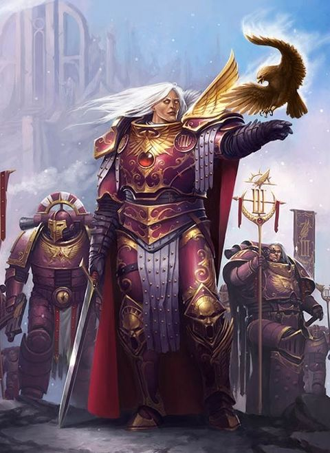

<!-- A0640-B0021 -->

原译文

Fulgrim during the Great Crusade 大远征时期的福格瑞姆

**校订译文**

Fulgrim during the Great Crusade 大远征时期的福格瑞姆

<!-- /A0640-B0021 -->

<!-- A0640-B0022 -->
**英文原文**

In his spartan quarters, Fulgrim was faced by armoured warriors from the stars. Their faces bore the scars of many battles, and from their shoulders hung scrolls listing their achievements. Their armour and weapons were finely-worked, and their banners and pennants were works of art. Fulgrim recognised that these men were not merely advanced, but civilised — his lost brothers from the stars had preserved the arts he had longed to return to Chemos. From the midst of these warriors stepped their leader, the Emperor of Humanity. Fulgrim surveyed him and, without a word, knelt and offered his sword. On that day Fulgrim swore to serve the Imperium with all his heart. From the Emperor, Fulgrim learned of the distant world of Terra, of the Great Crusade to reclaim the sundered galaxy, and of his own origins. It is unknown when exactly this event occurred; however, it is recorded that the construction of a starship for the Primarch of the III Legion was completed around 160 years before the beginning of the Horus Heresy.

<!-- /A0640-B0022 -->

<!-- A0640-B0023 -->

原译文

在他简朴的住所里，福格瑞姆面对着来自群星的覆甲战士。他们的脸上有许多战斗的伤痕，肩上挂着列出他们成就的卷轴。他们的盔甲和武器做工精细，他们的旗帜和三角旗都是艺术品。福格瑞姆意识到这些人不仅很先进，而且很文明 — 他那些从群星消失的兄弟们保存了他渴望回到彻莫斯的艺术。从这些战士中间走出来的是他们的领袖，人类帝皇。福格瑞姆打量了他一眼，一言不发地跪下，献上了剑。那天，福格瑞姆发誓全心全意为帝国服务。福格瑞姆从帝皇那里得知了遥远的泰拉世界、收复分裂星系的大远征以及他自己的起源。目前尚不清楚这一事件发生的确切时间；然而，据记载，为第三军团原体建造的战舰大约在荷鲁斯叛乱开始前160年完工。

**校订译文**

在简朴住所中，福格瑞姆见到来自群星的装甲战士。他们脸上满是战痕，肩头悬着记载功勋的卷轴；武器与铠甲做工精湛，军旗与三角旗亦堪称艺术品。他意识到，这些同胞拥有的不只是先进技术，更是完整的文明——失散在群星间的兄弟，保留着他一直希望在彻莫斯复兴的艺术。人类帝皇从战士中走出。福格瑞姆望向他，一言不发地跪下，献上自己的剑，并在当天发誓全心效忠帝国。帝皇向他讲述遥远的泰拉、重新统一银河的大远征，以及他的身世。会面日期已不可考，但记载表明，为第三军团原体建造的战舰，约在荷鲁斯之乱开始前一百六十年竣工。

**校注：** lost brothers from the stars 指失散的人类同胞，并非这些战士从群星消失；galaxy 指银河，非单个星系。

<!-- /A0640-B0023 -->

<!-- A0640-B0024 -->
**英文原文**

Traveling to Terra to meet his new Legion, Fulgrim learned that an accident had destroyed the majority of the gene-seed designated for his legion, and without their Primarch, replacing it was a slow and laborious process. Fulgrim came to address the two hundred Space Marines of his legion, and the words he spoke were said to inspire the Emperor so much that he named the legion the Emperor's Children, and allowed them to bear the sign of the Aquila, the double-headed eagle that was the Emperor's personal symbol, on their Power Armour.

<!-- /A0640-B0024 -->

<!-- A0640-B0025 -->

原译文

前往泰拉去见他的新军团，福格瑞姆得知一场事故摧毁了为他的军团指定的大部分基因种子，没有他们的原体，替换它是一个缓慢而费力的过程。福格瑞姆来向他的军团的200名星际战士发表讲话，据说他所说的话激励了帝皇，以至于他将这个军团命名为帝皇之子，并允许他们在他们的动力盔甲上佩戴天鹰的标志，这是一只双头鹰，是帝皇的个人象征。

**校订译文**

赴泰拉接掌军团时，福格瑞姆得知，一场事故毁掉了供本军团使用的大部分基因种子；此前没有原体可供参照，补充种子的过程极其缓慢艰难。他向仅存的二百名星际战士发表演说。据说帝皇深受感动，将军团命名为“帝皇之子”，并准许他们在动力甲上佩戴代表帝皇本人的天鹰——双头鹰徽记。

**校注：** 这一帝皇命名与准用天鹰的故事按所给源文保留；其精确时间及与其他军团早期记述的关系未另作断言。

<!-- /A0640-B0025 -->

<!-- A0640-B0026 -->
**英文原文**

Fulgrim became driven by the notion that his Legion should strive to live up to this honour and the perfection of the Emperor and his vision of Imperial culture. This drive to achieve perfection soon applied to all things the Primarch and his Legion became concerned with, from military tactics to the embrace of artistic culture that didn't exist on Chemos to their very appearances. Fulgrim was a particularly imposing sight, with shimmering white shoulder-length hair, large, friendly-seeming eyes and a mouth that was never far from a smile. His armour was of the finest quality, and intricately decorated. Over it he often wore one of a variety of high-collared cloaks.

<!-- /A0640-B0026 -->

<!-- A0640-B0027 -->

原译文

福格瑞姆被这样一种观念所驱使，即他的军团应该努力不辜负这一荣誉，不辜负帝皇的完美和他对帝国文化的愿景。这种追求完美的动力很快适用于原体和他的军团所关心的一切，从军事战术到对彻莫斯上不存在的艺术文化的拥抱，再到他们的外表。福格瑞姆是一个所见尤为壮丽的人，有着闪闪发光的白色齐肩长发，一双看起来友好的眼睛，一张永远不会远离微笑的嘴。他的盔甲质量上乘，装饰精致。他经常穿着各种高领斗篷中的一件。

**校订译文**

福格瑞姆决心让军团配得上这份荣誉，追随帝皇的完美典范，以及他心目中的帝国文明理想。这份追求很快延伸到军团关心的一切：从战术到彻莫斯从前缺失的艺术文化，再到战士的外貌。原体自身尤为耀眼：银白的齐肩长发熠熠生辉，双眼宽大而似乎亲切，嘴角总挂着笑意。他的铠甲质地精良、雕饰繁复，甲外常披一件高领披风。

<!-- /A0640-B0027 -->

<!-- A0640-B0028 -->
**英文原文**

Fulgrim was anxious to make his contribution to the Great Crusade, but the comparatively small size of his Legion meant that the Emperor's Children were placed under the command of Horus and his Luna Wolves. Horus and Fulgrim grew close to one another while pacifying the Eastern Fringe. Eventually, swelled by recruits from both Chemos and Terra, Fulgrim was soon able to lead a crusade of his own, bringing countless worlds into the light of the Imperium. Fulgrim sought perfection and spectacle in these campaigns, as demonstrated when he took the world of Byzas with only seven men, despite nearly dying in the process. Fulgrim also established a close friendship with his brother Ferrus Manus, who also attempted to purge imperfection from himself. Ferrus and Fulgrim eventually came to each try to build the perfect weapon, resulting in Fulgrim crafting Forgebreaker and Ferrus Fireblade. The two exchanged weapons and they became synonymous with their respective Primarchs thereafter. In the later stages of the Crusade the Emperor's Children soon made a name for themselves during the Crusade, battling fearsome enemies such as the Megarachnids and Diasporex.

<!-- /A0640-B0028 -->

<!-- A0640-B0029 -->

原译文

福格瑞姆急于为远征做出贡献，但他的军团规模相对较小，这意味着帝皇之子被置于荷鲁斯和他的影月苍狼的指挥之下。荷鲁斯和福格瑞姆在平定东部边缘的同时，彼此靠得很近。最终，在来自彻莫斯和泰拉的新兵的壮大下，副歌瑞姆很快就能够领导自己的远征，将无数世界带入了帝国的光明之中。福格瑞姆在这些战役中追求完美和壮观，正如他在只有七个人的情况下占领了拜扎斯世界所证明的那样，尽管在这个过程中差点丧命。福格瑞姆还与他的兄弟费鲁斯·马努斯建立了密切的友谊，后者也试图从自己身上清除不完美。最终，费鲁斯和福格瑞姆都试图制造出完美的武器，导致福格瑞姆和费鲁斯制作了破炉者和火焰剑。两人交换了武器，从此成为各自原体的代名词。在远征的后期阶段，帝皇之子很快在远征中声名鹊起，与巨蛛怪和流散者等可怕的敌人作战。

**校订译文**

福格瑞姆急于为大远征建功，但军团规模尚小，帝皇之子只能先归荷鲁斯与影月苍狼指挥。平定银河东部边缘期间，两位原体日渐亲近。随着彻莫斯与泰拉新兵补入，福格瑞姆终于能够独立统军，征服无数世界。他在这些战役中追求完美，也追求壮观的胜利；例如仅带七名战士征服拜扎斯，尽管自己险些丧命。他还与同样致力于消除自身缺陷的费鲁斯·马努斯结下深厚友谊。二人曾各自挑战锻造完美武器：福格瑞姆打造雷霆锤“破炉者”，费鲁斯铸成“火焰剑”。交换礼物后，这两件武器便分别成为各自持有者的象征。大远征后期，帝皇之子在与巨蛛怪、流散者等强敌的战斗中声名鹊起。

**校注：** 逐一明确两件武器的制造者与交换关系。Forgebreaker 暂沿本稿破炉者，Fireblade 暂火焰剑。

<!-- /A0640-B0029 -->

<!-- A0640-B0030 -->
**英文原文**

During this time, the Emperor's Children initiated the Cleansing of Laeran, a campaign that required great effort, dedication and sacrifice from the Imperial forces. At the conclusion of this campaign, Fulgrim acquired a trophy from the field of battle; a xenos-manufactured sword recovered from a Laeran temple known as the Silver Blade of Laer. He would begin to wield this sword more often than Fireblade, his customary personal weapon. With the benefit of hindsight, it can be recognised that the Laeran sword was a Daemon Weapon.

<!-- /A0640-B0030 -->

<!-- A0640-B0031 -->

原译文

在这段时间里，帝皇之子发起了对刺人的清洗，这场行动需要帝国军队的巨大努力、奉献和牺牲。在这场战役结束时，福格瑞姆从战场上获得了一座奖杯；从一座被称为刺人银刃的刺人神庙中发现的一把由异型制造的剑。他开始比他惯用的个人武器火焰剑更频繁地挥舞这把剑。事后看来，可以知道刺人剑是恶魔武器。

**校订译文**

这一时期，帝皇之子发动莱兰清洗。帝国部队为此投入巨大努力，付出沉重牺牲。战役结束时，福格瑞姆取得一件战利品：从莱兰神殿找到的异形造剑，名为“莱尔银刃”。此后，他越来越常用它作战，取代惯用的火焰剑。事后回看，人们才明白，这其实是一件恶魔武器。

**校注：** trophy 指战利品，非奖杯。Silver Blade of Laer 是剑名，非神殿名。Laer 为种族名、Laeran 为世界名，依核心分别莱尔、莱兰。

<!-- /A0640-B0031 -->

<!-- A0640-B0032 -->
### Horus Heresy 荷鲁斯之乱

原题：Horus Heresy 荷鲁斯叛乱

<!-- /A0640-B0032 -->

<!-- A0640-B0033 -->
**英文原文**

"A warrior is measured by the quality of the foes he defeats. For years we have blunted our blades against lesser species and backwards primitives, but now this war, this glorious cataclysm, it presents us a chance to display for all eternity our perfection in the arena of war against the most formidable foe we ever shall face, our brother Legionaries, and for this we humbly thank Him, our dear father whose name we carry."/Fulgrim, Primarch of the Emperor's Children. Open vox address before the Jhyran Luxor Atrocity

<!-- /A0640-B0033 -->

<!-- A0640-B0034 -->

原译文

“衡量一个战士的标准是他击败的敌人的质量。多年来，我们一直在削弱我们的刀刃，对抗较小的物种和落后的原始人，但现在这场战争，这场光荣的灾难，为我们提供了一个机会，在对抗我们将要面对的最可怕的敌人 — 我们的兄弟军团士兵的战争舞台上永远展示我们的完美，为此，我们谦卑地感谢他，我们亲爱的父亲，我们以他的名字命名。”/福格瑞姆，帝皇之子的原体。开始杰兰·卢克索暴行暴行前的音阵演讲

**校订译文**

“衡量战士，要看他击败的敌人有多强。多年来，我们在低等种族和落后的原始人身上磨钝了剑刃；如今，这场战争、这场光荣的浩劫，终于给了我们机会，在战争的舞台上迎击最强大的敌人——我们的军团兄弟——向永恒展示自身的完美。为此，让我们谦卑地感谢祂，感谢那位赋予我们名号的亲爱父亲。”——帝皇之子原体福格瑞姆，杰兰·卢克索暴行前的公开通讯演说。

**校注：** blunted our blades 是在敌人身上磨钝刀剑；open vox address 是公开通讯演说，并非“开始”。

<!-- /A0640-B0034 -->

<!-- A0640-B0035 -->
**英文原文**

It is now believed that this daemonsword began to exert a strong chaotic influence over Fulgrim, and that the forces he had deployed against the Laer may have become tainted by the Chaos power Slaanesh. It was in this perilous spiritual condition that Fulgrim found himself at the centre of the emerging Horus Heresy.

<!-- /A0640-B0035 -->

<!-- A0640-B0036 -->

原译文

现在人们认为，这个恶魔开始对福格瑞姆施加强烈的混沌影响，他部署的对抗刺人的部队可能已经被混沌力量色孽所污染。正是在这种危险的精神状态下，福格瑞姆发现自己处于形成的荷鲁斯叛乱的中心。

**校订译文**

如今一般认为，魔剑开始强烈影响福格瑞姆，而参与征服莱尔的部队也可能受到了色孽污染。正是在这种危险的精神状态下，他卷入了初起的荷鲁斯之乱核心。

<!-- /A0640-B0036 -->

<!-- A0640-B0037 图片 -->
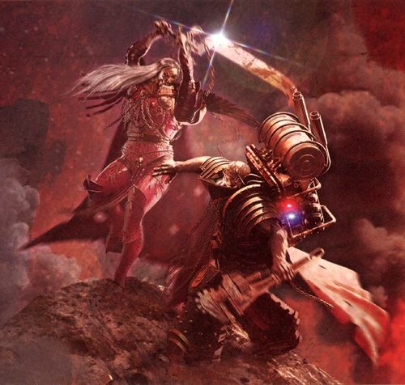

<!-- A0640-B0038 -->

原译文

Fulgrim battles Ferrus Manus 福格瑞姆与费鲁斯·马努斯战斗

**校订译文**

Fulgrim battles Ferrus Manus 福格瑞姆与费鲁斯·马努斯战斗

<!-- /A0640-B0038 -->

<!-- A0640-B0039 -->
**英文原文**

Fulgrim himself met with the renowned Farseer Eldrad Ulthran of Ulthwé on the Maiden World Tarsus, in which the Farseer attempted to warn Fulgrim of Horus's grievous wounding at the hands of Eugen Temba and his Anathame, and how he was slowly beginning to turn to Chaos as he recuperated. Fulgrim reacted with outrage at the Farseer's accusations due to his close friendship with Horus, second only to his bond with Ferrus Manus. This was spurred on by the influence of Fulgrim's Laeran blade, which was infused with a Slaaneshi entity. Fulgrim furiously attacked Eldrad alongside his captains and the Phoenix Guard, destroying both Khiraen Goldhelm, an ancient and revered Wraithlord, and an Avatar of Khaine in the process, forcing Eldrad and his beleaguered forces to withdraw. This victory led to Fulgrim's subsequent destruction of various Eldar maiden worlds using virus bombs as a means to end the supposed treachery of the Eldar.

<!-- /A0640-B0039 -->

<!-- A0640-B0040 -->

原译文

福格瑞姆本人在少女世界塔尔苏斯遇见了著名的乌斯维先知埃尔德拉德·乌索然，先知试图警告福格瑞姆荷鲁斯在尤金·坦巴和他的仪式之刃手中受了重伤，以及他在康复过程中是如何慢慢开始堕入混沌的。福格瑞姆对先知的指控表示愤怒，因为他与荷鲁斯的亲密友谊仅次于他与费鲁斯·马努斯的关系。这时福格瑞姆受到刺人剑的影响，该剑注入了色孽实体。福格瑞姆与他的连长和凤凰卫队一起猛烈袭击了埃尔德拉德，在此过程中摧毁了古老而受人尊敬的幽魂领主凯兰.金盔和凯恩化身，迫使埃尔德拉德和他陷入困境的部队撤退。这场胜利导致福格瑞姆随后使用病毒炸弹摧毁了各个灵族少女世界，以此作为结束灵族所谓背叛的手段。

**校订译文**

福格瑞姆曾在少女世界塔尔苏斯与乌斯维著名大先知艾尔德拉德·乌瑟兰会面。对方试图警告他：荷鲁斯被欧根·坦巴以诅咒之刃重伤，正在疗养中逐渐投向混沌。福格瑞姆与荷鲁斯的亲密程度仅次于同费鲁斯的关系，因此听闻指控便勃然大怒；寄宿于莱尔魔剑中的色孽存在又推波助澜。他率连长及凤凰卫队猛攻大先知，摧毁古老而受尊崇的幽冥领主凯兰·金盔，以及一尊凯恩化身，逼得灵族撤退。随后，他以终结灵族所谓背叛为由，用病毒炸弹摧毁多个少女世界。

**校注：** 官方 Eldrad Ulthran 艾尔德拉德·乌瑟兰、Farseer 大先知、Wraithlord 幽冥领主均依核心；Anathame 采用诅咒之刃，区别 athame 仪式之刃。

<!-- /A0640-B0040 -->

<!-- A0640-B0041 -->
**英文原文**

Whilst the exact timing and placement of it varies between versions of the story, it is clear that Fulgrim soon met Horus in person, demanding a personal account of his actions. Instead, Horus was able to sway Fulgrim to his cause. Fulgrim's respect for Horus allowed Chaos to find its way into Fulgrim's heart, destroying Fulgrim's loyalty to Terra, and replacing it with a burning desire to destroy the man who held humanity back from the perfection Fulgrim desired. Fulgrim was immediately sent to meet with Ferrus Manus, Primarch of the Iron Hands. Great bonds of friendship and brotherhood existed between them, and Fulgrim felt that he could convince Ferrus of the righteousness of Horus's cause. He was wrong, however, and their meeting did not go well, concluding in violence. When next the brothers met, it would be as enemies. Their path chosen, the chaotic rot spread quickly, from Fulgrim to his lieutenants, the Lord Commanders of the Legion, then to company and squad leaders, and finally all but a bare handful of Marines followed Slaanesh rather than the Emperor. Perfection became perfect hedonism. Fulgrim's mental state quickly deteriorated, he began talking to a painting by Serena D'Angelus and killed the sculptor Ostian Delafour after he inadvertently slighted the Primarch.

<!-- /A0640-B0041 -->

<!-- A0640-B0042 -->

原译文

虽然故事的确切时间和地点因版本而异，但很明显，福格瑞姆很快就亲自见到了荷鲁斯，要求他对自己的行为进行个人说明。相反，荷鲁斯能够说服福格瑞姆支持他的事业。福格瑞姆对荷鲁斯的尊重让混沌进入了福格瑞姆的内心，摧毁了福格瑞姆对泰拉的忠诚，取而代之的是一种强烈的欲望，即摧毁那个阻碍人类达到福格瑞姆所期望的完美的人。福格瑞姆立即被派去会见钢铁之手原体费鲁斯·马努斯。他们之间存在着深厚的友谊和兄弟情谊，福格瑞姆觉得他可以说服费鲁斯相信荷鲁斯事业的正义性。然而，他错了，他们的会面并不顺利，最终以暴力收场。当兄弟俩下次见面时，他们会像敌人一样。他们选择了这条路，混沌的腐化很快蔓延开来，从福格瑞姆到他的副手，军团的领主指挥官，然后到连长和队长，最后除了少数星际战士之外，所有人都追随色孽而不是帝皇。完美变成了完美的享乐主义。福格瑞姆的精神状态迅速恶化，他开始与塞雷娜·D’安洁洛斯的一幅画作交谈，并杀死了雕塑家奥斯蒂安·德拉富尔，在他无意中轻视了原体后。

**校订译文**

各版本对这次会面的时间与地点记载不一，但福格瑞姆很快亲自找到荷鲁斯，要求他解释所作所为，却反被说服加入叛乱。对荷鲁斯的敬重成了混沌渗入内心的通道，原先对泰拉的忠诚被烧尽，只剩摧毁帝皇的欲望——他开始认定，这个人阻碍人类达到自己期望的完美。随后，他受命游说钢铁之手原体费鲁斯·马努斯，以为二人深厚的情谊足以让兄弟认同荷鲁斯。事实却相反，会谈最终变成暴力冲突；再见时，他们便已是敌人。此后，混沌腐化由原体向下蔓延，依次侵蚀领主指挥官、连长与小队长，最终除极少数人外，军团尽皆转奉色孽。追求完美变成了追求极致享乐。福格瑞姆的精神迅速恶化，开始对塞雷娜·D’安洁洛斯所画的肖像说话，还因雕塑家奥斯蒂安·德拉富尔无意冒犯自己，将他杀死。

<!-- /A0640-B0042 -->

<!-- A0640-B0043 图片 -->
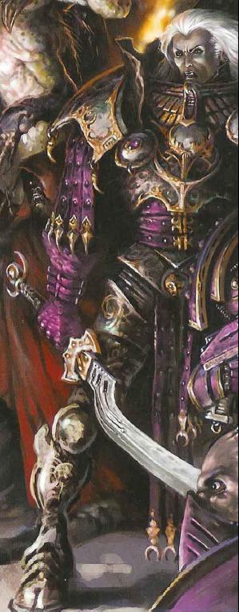

<!-- A0640-B0044 -->

原译文

Fulgrim during the Horus Heresy 荷鲁斯叛乱时期的福格瑞姆

**校订译文**

Fulgrim during the Horus Heresy 荷鲁斯之乱时期的福格瑞姆

<!-- /A0640-B0044 -->

<!-- A0640-B0045 -->
**英文原文**

When the loyalist legions arrived in the Isstvan system, the Emperor's Children were at the forefront of the fighting, aiding in the massacre of their former brethren. During the infamous Drop Site Massacre, Fulgrim and Ferrus Manus met once again, and had their final and fateful duel. Fulgrim wielded the weapon he had made for his brother, the Thunder Hammer Forgebreaker, while Ferrus did the same with the sword Fireblade. Though both weapons were shattered Fulgrim proved the victor after taking up his Silver Blade, but discovered he could not bring himself to kill his brother. It was at this point that the daemon bound within the Laeran blade fully exerted itself, and Ferrus Manus was struck dead. Fulgrim was shocked into clear-thinking by the death of his brother, aghast at what he had done and at the horrific betrayal and carnage around him. In a further moment of weakness he agreed to the daemon's offer to send him to oblivion and allowed the Warp-creature to escape from the sword. It took but a moment for it to possess him body and soul, trapping his consciousness in a tiny corner of his mind. From that moment on, Fulgrim became a prisoner in his own form, his existence fully controlled by the Slaaneshi daemon. Fulgrim's soul was later trapped in the twisted painting of Serena D'Angelus. The only person aware of the fate of Fulgrim was Horus, who recognized the Daemonic possession almost immediately during their next meeting but considered Fulgrim too valuable an asset to lose. Lorgar and Magnus also became aware of the true nature of Fulgrim upon encountering him.

<!-- /A0640-B0045 -->

<!-- A0640-B0046 -->

原译文

当忠诚的军团抵达伊斯塔万星系时，帝皇之子站在战斗的最前线，协助屠杀他们的前兄弟。在臭名昭著的登陆点大屠杀中，福格瑞姆和费鲁斯·马努斯再次相遇，并进行了最后一场决定性的决斗。福格瑞姆挥舞着他为他的兄弟制造的武器，雷霆锤破炉者，而费鲁斯用剑火焰剑做了同样的事情。虽然两件武器都被击碎了，但福格瑞姆拿起银刃后证明了自己的胜利，但他发现自己无法杀死自己的兄弟。就在这一点上，被束缚在刺人剑内的恶魔完全发挥了作用，费鲁斯·马努斯被击中身亡。福格瑞姆对他兄弟的死亡感到震惊，对他所做的一切以及他周围可怕的背叛和屠杀感到震惊。在又一个软弱的时刻，他同意了恶魔的提议，让他遗忘，并允许亚空间生物从剑中逃脱。它只花了一瞬间就占据了他的身体和灵魂，把他的意识困在了他头脑的一个小角落里。从那一刻起，福格瑞姆以自己的形式成为囚犯，他的存在完全由色孽恶魔控制。福格瑞姆的灵魂后来被困在塞雷娜·D’安洁洛斯扭曲的画作中。唯一知道福格瑞姆命运的人是荷鲁斯，他在下次会面中几乎立即认出了恶魔的占据，但认为福格瑞姆太有价值了，不能失去。珞珈和马格努斯在遇到福格瑞姆时也意识到了他的真实本性。

**校订译文**

忠诚军团抵达伊斯塔万星系时，帝皇之子冲杀在前，协助屠戮昔日同袍。登陆点大屠杀中，福格瑞姆与费鲁斯再次相遇，展开最后的宿命决斗。福格瑞姆持自己为兄弟打造的破炉者，费鲁斯则拿着亲手所铸的火焰剑。两件武器都在激战中毁坏；福格瑞姆改持莱尔银刃，最终占了上风，却无法对兄弟痛下杀手。此时，剑内恶魔完全掌控局面，费鲁斯当场被杀。兄弟的死亡令福格瑞姆骤然清醒，他为自己的行为和四周的背叛屠杀惊骇欲绝。又一次软弱中，他接受恶魔的提议，希望彻底失去知觉、忘却一切，容许它脱离魔剑。恶魔顷刻侵占其身心，将他的意识挤进心灵的狭小角落。福格瑞姆成了自己躯体中的囚徒，完全受色孽恶魔摆布，灵魂随后又被封入塞雷娜那幅扭曲的画中。起初，只有荷鲁斯知晓他的命运；下次会面时，战帅几乎立即认出附身，却认为这枚棋子太过重要，不能舍弃。珞珈与马格努斯后来见到他，也察觉了真相。

**校注：** 原文先称“唯一知道的是荷鲁斯”，又写珞珈和马格努斯也知晓，按段落前后叙述整理为先后获知；未改动英文。附身与之后灵魂转入肖像为两个阶段，均保留。

<!-- /A0640-B0046 -->

<!-- A0640-B0047 图片 -->
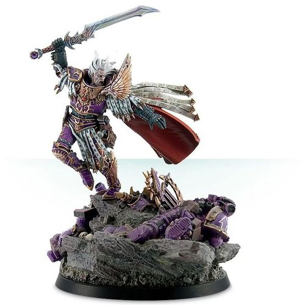

<!-- A0640-B0048 -->

原译文

Fulgrim 福格瑞姆

**校订译文**

Fulgrim 福格瑞姆

<!-- /A0640-B0048 -->

<!-- A0640-B0049 -->
**英文原文**

However, in the months afterward Fulgrim was able to regain his body by unknown means, trapping the daemon's essence in the same painting he had been trapped in. This was only revealed to his Legion when a group of captains led by Lucius realised what had happened to their Primarch and took Fulgrim captive; he allowed them to do this to prove he was no longer possessed, as they tried to make the daemon release its hold over him through extreme torture. Fulgrim revealed that he had forced the daemon out and had been himself for some time, and had chosen to devote himself to Slaanesh fully and of his own free will for reasons he did not deign to explain.

<!-- /A0640-B0049 -->

<!-- A0640-B0050 -->

原译文

然而，在随后的几个月里，福格瑞姆能够通过未知的方式夺回自己的身体，将恶魔的本质困在他被困的同一幅画中。只有当卢修斯带领的一群连长意识到他们的原体发生了什么事并俘虏了福格瑞姆时，他的军团才意识到这一点；他允许他们这样做以证明他不再被附身，因为他们试图通过极端的折磨让恶魔释放对他的控制。福格瑞姆透露，他已经把恶魔赶了出去，一段时间以来一直是他自己，并且出于他不愿解释的原因，他选择完全自愿地献身于色孽。

**校订译文**

数月后，福格瑞姆以不明手段夺回肉身，将恶魔反困在曾囚禁自己的画中。直到卢修斯率几名连长意识到原体曾遭附身，将他擒住，军团才得知此事。他任由众人用极端酷刑逼迫“恶魔”脱离肉身，借此证明自己已不再受附身。福格瑞姆说，他早已逐出恶魔、恢复自我一段时日；如今向色孽彻底献身，完全是自愿选择，只是他不屑解释缘由。

<!-- /A0640-B0050 -->

<!-- A0640-B0051 -->
### Daemonhood 升魔

原题：Daemonhood 恶魔王子

<!-- /A0640-B0051 -->

<!-- A0640-B0052 -->
**英文原文**

Fulgrim soon joined forces with Perturabo, Primarch of the Iron Warriors, on the world of Hydra Cordatus. Promising the Lord of Iron perfection, the two embarked on a quest to tip the balance of the rebellion in Horus's favor by journeying into the Eye of Terror and retrieving a weapon known as the Angel Exterminatus. Shortly before they were to leave, Fulgrim was hit by a direct headshot from the vengeful Sisypheum crew member Nykona Sharrowkyn. Fulgrim survived the wound, however, thanks to the efforts of Fabius Bile. After a brief boarding battle with the Sisypheum that saw the ship escape yet again, the two Primarchs arrived in the Eye and quickly landed on the Crone World of Iydris. Entering an ancient Eldar citadel known as the Amon ny'shak Kaelis, the Emperor's Children and Iron Warriors had to contend with an army of Wraithguard and Wraithlords that had awoken from their slumber. At the height of the vicious battle, Fulgrim attempted to betray his brother and slip away, but was pursued by Perturabo. Both soon arrived in a massive spherical chamber, and Fulgrim revealed to his brother that there was no Angel Exterminatus, but rather he was destined to become such a weapon on this world. Furious, Perturabo attempted to attack Fulgrim, but was drained of his power when Fulgrim activated the Maugetar stone that Perturabo had previously received under the guise of a gift. Now with the Iron Warriors Primarch's power in hand, Fulgrim revealed the purpose of his plan: to achieve Apotheosis, better known as Daemonhood.

<!-- /A0640-B0052 -->

<!-- A0640-B0053 -->

原译文

福格瑞姆很快与钢铁勇士的原体佩图拉博联手，在海德拉之心世界上。承诺钢铁之主完美，两人开始寻求通过进入恐惧之眼并取回一种名为灭绝天使的武器，使叛乱的平衡对荷鲁斯有利。在他们离开前不久，福格瑞姆被复仇的西西弗姆号的船员尼康那·沙罗金直接击中。然而，由于法比乌斯·拜尔的努力，福格瑞姆幸免于难。在与西西弗斯号进行了短暂的跳帮战后，这艘船再次逃脱，两位原体抵达了恐惧之眼，并迅速降落在伊德瑞斯老妪世界。进入一座名为阿蒙’尼沙克·卡利斯的古老灵族城堡，帝皇之子和钢铁勇士不得不与一支从沉睡中醒来的幽冥守卫和幽冥领主的军队作战。在激烈的战斗中，福格瑞姆试图背叛他的兄弟并逃跑，但被佩图拉博追捕。两人很快就进入了一个巨大的球形房间，福格瑞姆向他的兄弟透露，没有灭绝天使，而是他注定要成为这个世界上的武器。佩图拉博非常愤怒，试图攻击福格瑞姆，但当福格瑞姆激活佩图拉博之前以礼物的名义收到的莫甘塔尔之石时，他的力量被耗尽了。现在有了钢铁勇士原体的力量，副歌瑞姆透露了他的计划的目的：实现神化，更为人所知的是恶魔王子。

**校订译文**

福格瑞姆随后在海德拉之心与佩图拉博会合，许诺让钢铁之主见识完美。二人计划深入恐惧之眼，取出名为“灭绝天使”的武器，令战争天平倒向荷鲁斯。出发前，追寻复仇的西西弗姆号成员尼科纳·沙罗金一枪击中福格瑞姆头部；他却在法比乌斯·拜尔救治下活了下来。双方又爆发短暂登舰战，西西弗姆号再次逃脱。两位原体随后进入恐惧之眼，降落老妪世界伊德瑞斯。进入古老灵族堡垒阿蒙·尼沙克·卡利斯后，帝皇之子与钢铁勇士遭遇苏醒的幽冥护卫及幽冥领主大军。激战最烈时，福格瑞姆试图背叛兄弟、独自脱身，佩图拉博却紧追不放。二人来到一座巨大的球形厅室，福格瑞姆终于揭露：这里并没有现成的灭绝天使，他自己才将成为那件武器。佩图拉博盛怒进攻，福格瑞姆却启动了先前伪装成礼物送给他的莫甘塔尔之石，抽取兄弟的力量。夺得力量后，福格瑞姆道出真正目的——完成升魔，成为恶魔王子。

**校注：** headshot 明确命中头部，原译漏掉部位。升魔仪式将把福格瑞姆本人变成所谓灭绝天使，不是去获取一件已经存在的武器。

<!-- /A0640-B0053 -->

<!-- A0640-B0054 图片 -->
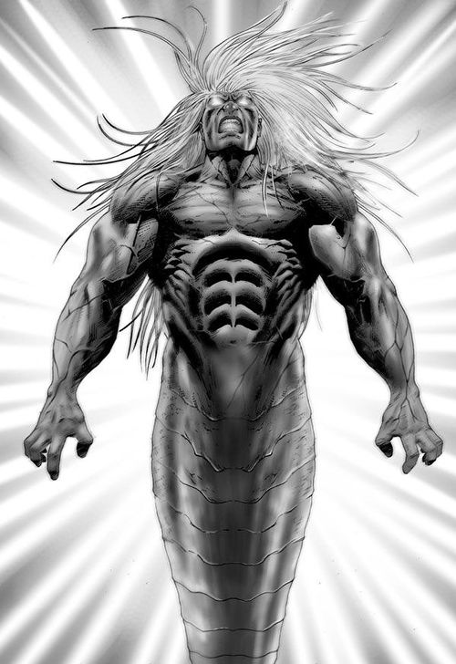

<!-- A0640-B0055 -->

原译文

Fulgrim transforms into a Daemon Prince 福格瑞姆转变为恶魔王子

**校订译文**

Fulgrim transforms into a Daemon Prince 福格瑞姆转变为恶魔王子

<!-- /A0640-B0055 -->

<!-- A0640-B0056 -->
**英文原文**

However, just as Fulgrim was about to complete his ritual and achieve Daemonhood, Perturabo gathered enough strength to charge at his brother but they were interrupted by an ambush of Salamanders, Iron Hands, and Raven Guard who had been stalking the traitor fleet in search of vengeance since the Drop Site Massacre. One of the loyalist Astartes during the battle shattered the Maugetar stone, freeing some of Perturabo's energy and giving him the ability to strike down Fulgrim with his Thunder Hammer. However, Perturabo only managed to destroy the Primarchs mortal skin and was reborn as a Daemon Prince of Slaanesh. Now a massive but elegant serpentine creature, Fulgrim told his brother that they would meet again then vanished in a burst of Warp energy along with his Emperor's Children. Fulgrim next appeared answering Horus's summons in the Battle of Dwell, where he was tasked to lead the Emperor's Children to the Halikarnaxes Stars. Before he could depart, Fulgrim survived another Iron Hands assassination attempt, this time by Shadrak Meduson and a trio of Fire Raptors. Fulgrim displayed his potent new abilities in the fight, destroying one of the loyalist aircraft with his psychic powers. Afterwards Fulgrim was tasked by Horus to secretly corrupt the Knight House of Devine in preparations for the Battle of Molech. Following these tasks, Fulgrim largely vanished as he became more concerned with the matters of the Warp and his Legion disintegrated into various warbands. However, Horus and Eidolon were both confident that he would ultimately return when they reached Terra. In 012.M31, his followers summoned Fulgrim during the Pale Stars campaign so that he could amuse himself in witnessing horribly mutated Inductii battle Salamanders. After taking some enjoyment in personally killing the local Salamanders commander, Brant Hesioth, Fulgrim vanished in a supernova-like explosion.

<!-- /A0640-B0056 -->

<!-- A0640-B0057 -->

原译文

然而，就在福格瑞姆即将完成他的仪式并成为恶魔王子时，佩图拉博聚集了足够的力量向他的兄弟冲锋，但他们被火蜥蜴，钢铁之手和暗鸦守卫的伏击打断了，自登陆点大屠杀以来，他们一直在跟踪叛徒舰队寻求复仇。在战斗中，一位忠诚的阿斯塔特打碎了莫甘塔尔之石，释放了佩图拉博的一些能量，使他能够用雷霆锤击倒福格瑞姆。然而，佩图拉博只设法摧毁了福格瑞姆的凡躯，并重生为色孽的恶魔王子。现在，福格瑞姆是一个巨大但优雅的蛇形生物，他告诉他的兄弟，他们会再次见面，然后和他的帝皇之子一起消失在一股亚空间能量中。福格瑞姆接下来在德维尔之战中回应了荷鲁斯的召唤，在那里他被指派带领帝皇之子前往哈利卡奈克西斯群星。在他离开之前，福格瑞姆在另一次钢铁之手的暗杀企图中幸存下来，这次是沙德拉克·梅杜森和三架火隼。副歌瑞姆在战斗中展示了他强大的新能力，用他的灵能力量摧毁了一架忠诚派的飞机。之后，荷鲁斯派福格瑞姆秘密腐化迪瓦恩骑士家族，为摩洛之战做准备。在完成这些任务后，福格瑞姆在很大程度上消失了，因为他越来越关心亚空间部队的事务，他的军团也分裂成了不同的战帮。然而，荷鲁斯和艾多隆都相信，当他们到达泰拉时，他最终会回来。在012.M31，他的追随者在苍白群星战役中召唤了福格瑞姆，这样他就可以在目睹可怕变异的速征军与火蜥蜴战斗时自娱自乐。在亲自杀死当地火蜥蜴指挥官布兰特·赫西奥斯后，福格瑞姆在一次超新星般的爆炸中消失了。

**校订译文**

仪式即将完成时，佩图拉博积蓄残余力量，向兄弟扑去；火蜥蜴、钢铁之手与暗鸦守卫却突然杀出。这些忠诚者自登陆点大屠杀以来一直追踪叛军舰队，伺机复仇。混战中，一名阿斯塔特击碎莫甘塔尔之石，使佩图拉博取回部分力量，得以挥动雷霆锤击倒福格瑞姆。然而，这一击只摧毁了原体的凡躯，福格瑞姆随即以色孽恶魔王子的形态重生。他化为巨大而优雅的蛇形存在，对兄弟说，他们还会再见，随后与帝皇之子一同消失在亚空间能量中。福格瑞姆再次现身，是在德威尔之战中响应荷鲁斯召唤，受命率军前往哈利卡奈克西斯群星。临行前，沙德拉克·梅杜森又率三架火猛禽炮艇刺杀他，仍未成功；他还以新获得的强大灵能击毁其中一架。随后，他奉荷鲁斯之命，秘密腐化迪瓦恩骑士家族，为摩洛之战铺路。完成任务后，他越来越沉迷亚空间事务，几乎不再现身，军团也裂为各个战帮。不过，荷鲁斯与艾多隆相信，进抵泰拉时他终会归来。012.M31，追随者在苍白群星战役中召唤他，以观看严重突变的速征军对抗火蜥蜴为乐。他亲手杀死当地火蜥蜴指挥官布兰特·赫西奥斯，享受杀戮之后，便在宛如超新星的爆发中消失。

**校注：** 英文 Perturabo only managed ... and was reborn 主语衔接有误，但前后明确蛇形重生者是福格瑞姆；中文补出其名，避免误称佩图拉博此时升魔。Fire Raptor 依核心为火猛禽炮艇。

<!-- /A0640-B0057 -->

<!-- A0640-B0058 -->
**英文原文**

After Horus issued his muster for the traitor primarch's to gather at Ullanor in preparation for the march to Terra, Fulgrim still could not be found. Thus Lorgar volunteered to find Fulgrim and bring him back to Horus's war effort. By accessing the Webway, Lorgar and his entourage eventually arrived inside the Eye of Terror and then the Palace of Slaanesh itself. Inside, they found Fulgrim engaged in debauchery and degeneracy with his new consort, N'Kari. Fulgrim refused Lorgar's demand to come to Ullanor with him, stating that he simply did not care about the war anymore. Lorgar refused to back down, and the two sides came to battle. As Fulgrim was about to strike Lorgar, the Dark Apostle Zardu Layak uttered the secret True Name of Fulgrim's newly elevated Daemonic form. Fulgrim was bound to the will of Layak, and forced to come with Lorgar. With a cry across the Warp, Fulgrim gathered the Emperor's Children back to himself and by the time the Word Bearers reached Ullanor, the Legion was whole once more.

<!-- /A0640-B0058 -->

<!-- A0640-B0059 -->

原译文

在荷鲁斯召集叛徒原体聚集在乌兰诺为前往泰拉的行军做准备后，仍然找不到福格瑞姆。因此，珞珈自愿找到福格瑞姆，把他带回荷鲁斯的战争中。通过进入网道，珞珈和他的随行人员最终进入了恐惧之眼，然后进入了色孽宫殿。在里面，他们发现福格瑞姆和他的新配偶纳’卡里一起放荡堕落。福格瑞姆拒绝了珞珈和他一起去乌兰诺的要求，说他根本不在乎战争了。珞珈拒绝让步，双方开始交战。当福格瑞姆即将袭击珞珈时，黑暗使徒扎度·拉亚克说出了福格瑞姆新升格的恶魔形态的秘密真名。福格瑞姆被拉亚克的意志所束缚，被迫与珞珈一起前往。随着亚空间的一声呼喊，福格瑞姆召集了帝皇之子回到自己身边，当怀言者到达乌兰诺时，军团再次完整了。

**校订译文**

荷鲁斯命叛军原体在乌兰诺集结、准备进军泰拉时，福格瑞姆仍不知所踪。珞珈于是自告奋勇，要把他带回战争。珞珈与随从借网道进入恐惧之眼，最终来到色孽宫殿，发现福格瑞姆正与新伴侣纳’卡里纵情享乐。福格瑞姆拒绝同行，直言自己已不在乎这场战争。珞珈不肯退让，双方遂爆发冲突。福格瑞姆正要攻击珞珈，黑暗使徒扎度·拉亚克却念出他升魔后的秘密真名，将他束缚于自己的意志，迫使他同行。福格瑞姆向亚空间发出呼唤，召回散落的帝皇之子；等怀言者抵达乌兰诺时，整个军团已重新集结。

<!-- /A0640-B0059 -->

<!-- A0640-B0060 图片 -->
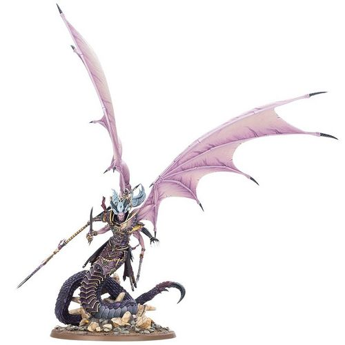

<!-- A0640-B0061 -->

原译文

Daemon Prince Fulgrim 恶魔王子福格瑞姆

**校订译文**

Daemon Prince Fulgrim 恶魔王子福格瑞姆

<!-- /A0640-B0061 -->

<!-- A0640-B0062 -->
**英文原文**

In truth, Lorgar intended to use the enslaved Fulgrim as part of a plan for him to kill Horus and take his place as Warmaster. However, when Lorgar's coup quickly unraveled when the oracle Actaea revealed his plans to Horus, and Zardu Layak freed Fulgrim from his binding instead of ordering him to attack Horus as originally intended. Fulgrim urged Horus to kill Lorgar, but instead the Primarch was banished from the Warmaster's sight after a vicious beating. Fulgrim licked the blood from Lorgar's taste, enjoying the sweet taste of revenge upon his former jailer. Fulgrim stayed by Horus's side during the muster at Ullanor and he and the Emperor's Children pledged themselves to the march on Terra. During the final stages of the Solar War, Fulgrim appeared aboard the Pride of the Emperor as part of the massive traitor fleet.

<!-- /A0640-B0062 -->

<!-- A0640-B0063 -->

原译文

事实上，珞珈打算利用被奴役的福格瑞姆作为他杀死荷鲁斯并取代战帅的计划的一部分。然而，当女祭司阿克泰向荷鲁斯透露了珞珈的计划后，珞珈的政变迅速瓦解，扎杜·拉亚克将福格瑞姆从束缚中解放出来，而不是命令他按原计划攻击荷鲁斯。福格瑞姆敦促荷鲁斯杀死珞珈，但相反，在一次恶毒的殴打后，原体被驱逐出战帅的视线。福格瑞姆舔掉了珞珈身上的血迹，享受着对前狱卒复仇的甜蜜滋味。在乌兰诺的集结期间，福格瑞姆留在了荷鲁斯的身边，他和帝皇之子承诺要前往泰拉。在太阳战争的最后阶段，福格瑞姆作为庞大的叛徒舰队的一部分出现在帝皇之傲号上。

**校订译文**

实际上，珞珈想利用受控的福格瑞姆刺杀荷鲁斯，自己取代战帅。预言者阿克泰却将阴谋告知荷鲁斯，政变迅速败露；扎度·拉亚克也没有按原计划命令福格瑞姆出手，反而解除了对他的束缚。福格瑞姆怂恿荷鲁斯杀死珞珈，后者最终只被痛打一顿，再逐出战帅面前。福格瑞姆舔舐珞珈的鲜血，品味向曾奴役自己的人复仇的快感。乌兰诺集结期间，他留在荷鲁斯身边，带帝皇之子宣誓进军泰拉。太阳战争末期，他乘帝皇之傲号，随庞大的叛军舰队抵达。

**校注：** 原文 licked the blood from Lorgar’s taste 语法异常，taste 不能作为血液的具体来源；正文保留舔血及复仇滋味，不补造伤口部位。oracle 此处为预言者，不据此指定宗教祭司身份。

<!-- /A0640-B0063 -->

<!-- A0640-B0064 -->
**英文原文**

All trace of decency amongst the Emperor's Children had vanished by the time they partook in the Siege of Terra. During the early stages of the Siege Fulgrim did little, goading Angron into fits of fury for his own amusement and constantly requesting that Horus let him be unleashed upon Terra. He oversaw a major attack on the southeastern region of the walls of the Palace, but failed to penetrate the Emperor's psychic shield. During a meeting of the traitor leaders, he mocked Perturabo for refusing the delights Chaos had to offer. While other Traitor Legions assaulted the Imperial Palace, the Emperor's Children embarked upon a spree of terror and gratification amongst the helpless citizenry of Terra. Even by the early stages of the battle they simply launched attacks to drag away prisoners for their own amusement. However, Abaddon was able to get Eidolon to somehow convince Fulgrim to lead the whole of the Emperor's Children against the Saturnine Gate in a bid to quickly end the battle. During the assault on Saturnine Fulgrim massacred his way across Imperial Fists until he encountered Sigismund, battling the First Captain. Fulgrim was impressed with Sigismund's abilities but quickly overmatched the Imperial Fists champion. As he was about to finish Sigismund, Fulgrim was then confronted Rogal Dorn himself. The two Primarchs did battle, with Fulgrim constantly goading and taunting his brother. Dorn refused to respond to Fulgrim's taunts, and seemed to have the advantage against the traitorous Primarch, who was transformed into his standard Primarch form as opposed to that of a Daemon Prince. Dorn managed to counter every attack and impale Fulgrim, but the Phoenician laughed off the damage as he rapidly regenerated and declared he can't die. It was then that Fulgrim learned that Abaddon's attack beneath Saturnine had failed, dooming the assault on the walls with it. No longer interested in the battle and annoyed with his allies, Fulgrim transformed into his Daemonic visage and abandoned the fight. However, before he left, he gave Dorn a parting gift by summoning his elite guard led by Eidolon to assassinate his brother.

<!-- /A0640-B0064 -->

<!-- A0640-B0065 -->

原译文

当帝皇之子参加泰拉围城时，他们所有的体面都消失了。在围城的早期阶段，福格瑞姆几乎没有采取任何行动，为了自己的娱乐而激怒了安格隆，并不断要求荷鲁斯让他在泰拉上被释放。他监督了对皇宫东南部城墙的一次重大袭击，但未能穿透帝皇的灵能屏障。在叛徒领袖的一次会议上，他嘲笑佩图拉博拒绝了混沌所提供的快乐。当其他叛徒军团袭击皇宫时，帝皇之子在泰拉无助的平民中开始了一场恐怖和满足的狂欢。即使在战斗的早期阶段，他们也只是发动攻击，把俘虏拖走，自娱自乐。然而，阿巴顿设法说服艾多隆说服福格瑞姆带领整个帝皇之子对抗土星之门，以迅速结束战斗。在对土星之门的进攻中，福格瑞姆屠杀了帝国之拳，直到他遇到了西吉斯蒙德，与第一连长作战。福格瑞姆对西吉斯蒙德的能力印象深刻，但很快就超越了帝国之拳冠军。当他即将终结西吉斯蒙德时，福格瑞姆遇到了罗格·多恩本人。两位原体确实发生了战斗，福格瑞姆不断地挑衅和嘲弄他的兄弟。多恩拒绝回应福格瑞姆的嘲讽，战斗似乎对叛徒原体有优势，后者被改造成他的标准原体形态，而不是恶魔王子的形态。多恩成功抵御了每一次攻击，刺穿了福格瑞姆，但这位紫庭凤凰对这种伤害一笑置之，因为他迅速重生，并宣布自己不会死。就在那时，福格瑞姆得知阿巴顿在土星之门地下的攻击失败了，这也注定了对城墙的攻击。福格瑞姆对这场战斗不再感兴趣，也对他的盟友感到恼火，于是他变成了恶魔的面孔，放弃了这场战斗。然而，在他离开之前，他给了多恩一份临别礼物，召唤了由艾多隆率领的精锐卫队杀向他的兄弟。

**校订译文**

到泰拉围城时，帝皇之子已丧尽最后一丝廉耻。福格瑞姆在战事初期少有作为，常故意激怒安格隆取乐，又不断请求荷鲁斯准许自己大举进攻泰拉。他曾指挥皇宫东南段城墙的一次猛攻，却未能突破帝皇的灵能屏障；在叛军领袖会议上，又嘲笑佩图拉博拒绝享受混沌的欢愉。其他军团攻打皇宫时，帝皇之子却在无力反抗的平民中制造恐怖、寻求满足，早早就把袭击变成抓走俘虏取乐的手段。后来，阿巴顿通过艾多隆，说动福格瑞姆率全军攻击土星之门，希望迅速结束围城。进攻中，福格瑞姆一路屠杀帝国之拳，直到第一连长西吉斯蒙德拦住他。他虽赞赏对方武艺，仍很快取得压倒性优势。正要痛下杀手时，罗格·多恩亲自赶来。两位原体交锋，福格瑞姆不断嘲弄挑衅，多恩却一言不答，并逐渐占了上风。当时，福格瑞姆使用的是原本的原体外形，而非恶魔王子之躯。多恩化解每次进攻，将剑刺入他的身体；紫庭凤凰却一笑置之，伤口迅速愈合，还宣称自己不会死。随后，他得知阿巴顿在城墙下的进攻失败，连带使墙上的攻势也注定落败。他顿时失去兴趣，又恼恨盟友，遂显出恶魔真容，抽身离去。临走前，他召来艾多隆率领的精锐卫队，命其刺杀多恩，作为留给兄弟的“礼物”。

**校注：** as opposed to 描写他选择普通原体外形，并非被他人改造成该形态。regenerated 指受伤后愈合，非再次投胎重生。

<!-- /A0640-B0065 -->

<!-- A0640-B0066 图片 -->
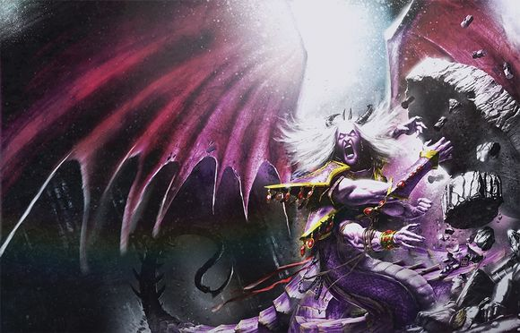

<!-- A0640-B0067 -->

原译文

Fulgrim as a Daemon Prince 恶魔王子福格瑞姆

**校订译文**

Fulgrim as a Daemon Prince 恶魔王子福格瑞姆

<!-- /A0640-B0067 -->

<!-- A0640-B0068 -->
**英文原文**

Under Fulgrim, billions of defenceless civilians were used as experimental subjects in the effort to create ever-more powerful stimulants and pleasure-inducing chemicals, used to suffer daemons, or were simply killed to sate the bloodlust of the Legion.

<!-- /A0640-B0068 -->

<!-- A0640-B0069 -->

原译文

在福格瑞姆的领导下，数十亿手无寸铁的平民被用作实验对象，试图创造更强大的兴奋剂和令人愉悦的化学物质，用来被恶魔折磨，或者只是为了满足军团的嗜血欲望而被杀害。

**校订译文**

在福格瑞姆指使下，数十亿无力反抗的平民沦为试验品，被用来研制更强的兴奋剂和催生快感的药物；另有许多人被交给恶魔折磨，或只为满足军团的嗜血欲而遭杀害。

**校注：** used to suffer daemons 原文不通顺；依整句平民遭奴役虐待的语境暂译被交给恶魔折磨，具体含义待原始出版物核验。

<!-- /A0640-B0069 -->

<!-- A0640-B0070 -->
### Post-Heresy 叛乱后

<!-- /A0640-B0070 -->

<!-- A0640-B0071 -->
**英文原文**

When Horus was defeated by the Emperor, the Emperor's Children left a trail of depopulated worlds in their wake as they fled towards the Eye of Terror. As their supply of slaves was exhausted, they resorted to raiding the other Traitor Legions for fresh meat, leading to a series of conflicts known as the Legion War. Fulgrim was seen in combat a century after the Heresy at the Battle of Thessala with Roboute Guilliman, the Primarch of the Ultramarines, where he slashed his brother's throat and laid him low with a fatal poison, before disappearing from records for many centuries.

<!-- /A0640-B0071 -->

<!-- A0640-B0072 -->

原译文

当荷鲁斯被帝皇击败时，帝皇之子在他们身后留下了一条人口稀少的世界，他们逃往恐惧之眼。随着奴隶供应的枯竭，他们不得不袭击其他叛徒军团以获取新鲜血肉，导致了一系列被称为军团战争的冲突。一个世纪后，福格瑞姆在塞萨拉之战中与极限战士的原体罗伯特·基里曼进行了战斗，在那里他割断了兄弟的喉咙，并用致命的毒药将他打倒，然后从记录中消失了许多世纪。

**校订译文**

荷鲁斯败于帝皇后，帝皇之子逃向恐惧之眼，沿途留下一个个被屠空的世界。奴隶来源耗尽，他们转而袭击其他叛军军团，抢夺新的血肉，引发一连串后来称为“军团战争”的冲突。叛乱结束一个世纪后，福格瑞姆在色萨拉之战迎战极限战士原体罗保特·基里曼，割伤兄弟喉部，又以致命毒素将他击倒；此后数百年，记录中再难找到他的踪迹。

**校注：** depopulated 指人口被清空，不能弱化为人口稀少；叛乱后一个世纪的时间基点明确补出。

<!-- /A0640-B0072 -->

<!-- A0640-B0073 图片 -->
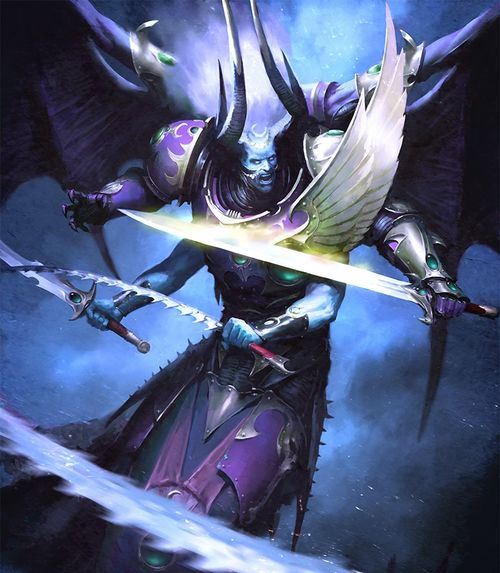

<!-- A0640-B0074 -->

原译文

Fulgrim, Daemon Prince of Slaanesh 福格瑞姆，色孽恶魔王子

**校订译文**

Fulgrim, Daemon Prince of Slaanesh 福格瑞姆，色孽恶魔王子

<!-- /A0640-B0074 -->

<!-- A0640-B0075 -->
**英文原文**

The Emperor's Children claimed that Fulgrim was gifted by Slaanesh with a hidden world of unlimited pleasure for him to rule. Several centuries after the Heresy, he was said to be asleep on this world and not active in guiding the Emperor's Children. Warbands of Emperor's Children, other Slaanesh-worshiping Chaos Space Marines and Cultists, and the Imperial Inquisition have sought out this world, but none have returned. Abaddon the Despoiler was also able to somehow find Fulgrim and was able to gain the favor of Slaanesh by trading an unblemished Pythosian Psyker with the Primarch.

<!-- /A0640-B0075 -->

<!-- A0640-B0076 -->

原译文

帝皇之子声称，色孽给了福格瑞姆一个隐藏的极乐世界，让他统治。叛乱后几个世纪，据说他在这个世界上沉睡，没有积极引导帝皇之子。帝皇之子、其他崇拜色孽的混沌星际战士和邪教徒以及帝国审判庭的战士们都在寻找这个世界，但没有人回来。掠夺者阿巴顿也以某种方式找到了福格瑞姆，并通过与原体交易一个无瑕疵的派索斯灵能者赢得了色孽的青睐。

**校订译文**

据帝皇之子所说，色孽赐给福格瑞姆一颗隐秘的世界，充满无尽欢愉，由他统治。叛乱后数百年，据称他沉睡在那里，不再积极领导军团。帝皇之子战帮、其他崇拜色孽的混沌星际战士与信徒，以及帝国审判庭，都曾派人寻觅，却无人归来。大掠夺者阿巴顿也不知通过何种办法找到了他，并交出一名未经玷污的派索斯灵能者，与原体交易，取得色孽青睐。

<!-- /A0640-B0076 -->

<!-- A0640-B0077 -->
**英文原文**

During the Thirteenth Black Crusade, it is thought that Fulgrim appeared to massacre Imperial Guard during the Cacophony of Extremis Six.

<!-- /A0640-B0077 -->

<!-- A0640-B0078 -->

原译文

在第十三次黑色远征期间，人们认为福格瑞姆似乎在极端六不协期间屠杀了帝国卫队。

**校订译文**

第十三次黑色远征期间，据推测，福格瑞姆曾在埃克斯特里米斯六号喧嚣事件中现身，屠杀帝国卫队。

<!-- /A0640-B0078 -->

<!-- A0640-B0079 -->
**英文原文**

Fulgrim made another appearance at the conclusion of the Ultramar Campaign in the closing days of M41. Through the efforts of the Mechanicum and Eldar Roboute Guilliman was healed from the wounds inflicted by Fulgrim. Fulgrim sensed his brother's revival and took the time to possess the Arch-Consul of Macragge in order to gloat to Guilliman during his first public appearance in ten thousand years. Through the body of the Arch-Consul, Fulgrim announces that Guilliman would have many temptations to resist and that any feeling of self-satisfaction would be his doom. Later, he appeared during the Sabbyst Planetstrike where he slew the Iron Hands Captain Sind Grolvoch. Using his personal messenger Mauvais, Fulgrim arbitrarily appeared before the Perfecti Emperor's Children warband and led them to conquer the Imperial world of Crucible. There, he declared that he would launch a new Crusade to "liberate" the people of the Imperium from the Emperor's tyranny.

<!-- /A0640-B0079 -->

<!-- A0640-B0080 -->

原译文

福格瑞姆在M41奥特拉玛战役结束时再次露面。通过机械教和灵族的努力，罗伯特·基里曼从福格瑞姆造成的伤口中痊愈了。福格瑞姆感觉到了他兄弟的复苏，并花时间占据了马库拉格的总领事，以便在基里曼一万年来首次公开露面时向他幸灾乐祸。通过总领事的身体，福格瑞姆宣布基里曼将有许多诱惑需要抵制，任何自我满足的感觉都将是他的厄运。后来，他出现在萨比斯特行星打击期间，在那里他杀死了钢铁之手连长辛德·格罗尔沃奇。 福格瑞姆利用他的个人信使莫维斯，任意出现在完美者帝皇之子战帮面前，带领他们征服了帝国的坩埚世界。在那里，他宣布将发动一场新的远征，将帝国人民从帝皇的暴政中“解放”出来。

**校订译文**

M41 末，奥特拉玛战役结束时，福格瑞姆再次现身。机械教与灵族的努力治愈了基里曼当年所受的创伤。察觉兄弟苏醒后，他附身于马库拉格首席执政官，专挑基里曼万年来首次公开露面时前去讥嘲。他借执政官之口宣称，兄弟将面临无数诱惑，而任何自满都足以令他毁灭。随后，他在萨比斯特行星突击战中杀死钢铁之手连长辛德·格罗尔沃奇。借私人信使莫维斯传讯，福格瑞姆又随兴现身于帝皇之子完美者战帮面前，率其征服帝国的坩埚星。他在那里宣布，将发动新远征，把帝国人民从帝皇的暴政中“解放”。

**校注：** 原文此处写 Mechanicum，按用户要求机械教保留；其他复活篇若使用 Adeptus Mechanicus 机械修会，属源文称谓不一致，不悄然覆盖。Arch-Consul 为首席执政官，非现代外交职位总领事。

<!-- /A0640-B0080 -->

<!-- A0640-B0081 -->
**英文原文**

At some point in the 41st Millennium, Fulgrim was lured back to Isstvan III by a sonic beacon. There he was confronted by the sole surviving loyalist Emperor's Child, the Dreadnought Rylanor. As Fulgrim tore the Dreadnought apart, an unexploded Virus Bomb was detonated and engulfed the planet. Though Fulgrim's form survived, his pride was wounded.

<!-- /A0640-B0081 -->

<!-- A0640-B0082 -->

原译文

在第41个千年的某个时刻，福格瑞姆被一个声波信标引诱回到了伊斯塔万三号。在那里，他遇到了唯一幸存的忠诚派帝皇之子，无畏瑞拉诺。当福格瑞姆将无畏撕裂时，一枚未爆炸的病毒炸弹被引爆并吞噬了整个星球。虽然福格瑞姆的形态幸存下来，但他的自尊心受到了伤害。

**校订译文**

第 41 千年某时，一座声波信标将福格瑞姆引回伊斯塔万三号。他在那里遇到唯一幸存的忠诚帝皇之子——无畏机甲瑞拉诺。就在他撕裂机甲时，一枚此前未引爆的病毒炸弹突然起爆，灾祸席卷整颗星球。福格瑞姆的躯体虽幸存，骄傲却遭到重创。

<!-- /A0640-B0082 -->

<!-- A0640-B0083 图片 -->
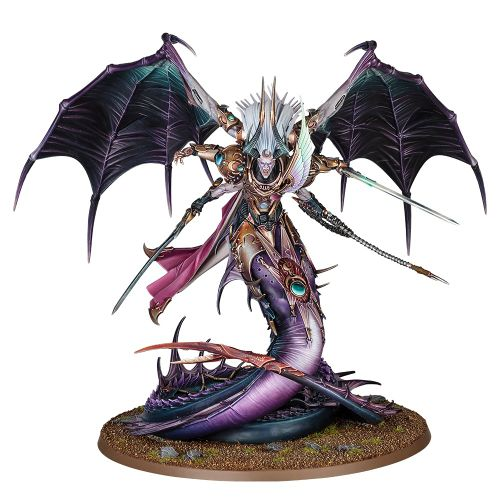

<!-- A0640-B0084 -->

原译文

Daemon Prince Fulgrim 恶魔王子福格瑞姆

**校订译文**

Daemon Prince Fulgrim 恶魔王子福格瑞姆

<!-- /A0640-B0084 -->

<!-- A0640-B0085 -->
**英文原文**

In the Era Indomitus, Fulgrim has become more active. While many Emperor's Children, other followers of Slaanesh, and even Xenos may spend their entire lives seeking him out, the Primarch is capricious and manifests seemingly on a whim. Many of those who seek him out are said to draw the eye of Slaanesh and rise in power themselves, encouraging even more to undertake the quest. When Fulgrim does appear, he seeks to glut himself on as varied a palette of existence as possible. Sometimes he will craft exquisite and genius strategies to bring pain, grief, and humiliation to his foes. But other times he may abandon all tactics to vent his aggression in a gory rush of reckless violence, not giving his sons even a modicum of attention. Just as Fulgrim will suddenly and seemingly randomly appear, so will he usually depart the battlefield without a word once he has sated his fill of sensation.

<!-- /A0640-B0085 -->

<!-- A0640-B0086 -->

原译文

在不屈远征时期，福格瑞姆变得更加活跃。虽然许多帝皇之子、色孽的其他追随者，甚至异型可能会花一辈子的时间寻找他，但这位原体反复无常，似乎是一时兴起。据说，许多寻找他的人吸引了色孽的目光，并自己掌权，鼓励更多人进行探索。当福格瑞姆出现时，他试图尽可能地丰富自己的生活。有时，他会制定出精致而天才的策略，给敌人带来痛苦、悲伤和羞辱。但其他时候，他可能会放弃一切策略，在血腥的鲁莽暴力中发泄自己的侵略性，甚至不给子嗣一点关注。就像福格瑞姆会突然出现，似乎是随机出现一样，一旦他吃饱了，他通常也会一言不发地离开战场。

**校订译文**

不屈时代，福格瑞姆变得更活跃。许多帝皇之子、色孽信徒，甚至异形穷尽一生寻觅他，原体却反复无常，仿佛只随一时兴致现身。传说其中不少寻觅者因而得到色孽注视，力量随之增长，这又吸引更多人加入寻访。福格瑞姆一旦出现，便贪婪地汲取尽可能丰富的存在体验。有时，他会设计精巧绝伦的谋略，让敌人饱受痛苦、悲伤与羞辱；有时却全然抛开战术，以鲁莽血腥的暴力宣泄攻击欲，连子嗣也懒得理会。他来时毫无征兆，一旦感官欲望得到满足，往往也会一言不发地离开战场。

**校注：** rise in power 指力量增长，不必然是掌握政治权力；sated his fill of sensation 指感官欲望满足，非吃饱。

<!-- /A0640-B0086 -->

<!-- A0640-B0087 -->
**英文原文**

When Fulgrim does manifest in realspace, he radiates an aura of exotic textures, colours, scents, and hideous beauties. He can change his appearance, fighting style, and even personality seemingly at random. He may appear monstrous in one appearance, but graceful the next. His arsenal of weaponry is equally as inconsistent, wielding a variety of polearms, sentient swords, Daemon Weapons, and ancient artifacts collectively dubbed the Blades of the Phoenician.

<!-- /A0640-B0087 -->

<!-- A0640-B0088 -->

原译文

当福格瑞姆在现实空间中显现时，他散发出一种奇异的纹理、颜色、气味和丑陋的美。他可以随意改变自己的外表、战斗风格，甚至性格。他可能一次看起来很可怕，但下一次却很优雅。他的武器库同样不一致，挥舞着各种长柄武器、有感知的剑、恶魔武器和被统称为紫庭凤凰之刃的古代造物。

**校订译文**

显现于现实空间时，福格瑞姆周围充斥奇异的质感、色彩、气味，以及骇人的美。他的外貌、战斗方式乃至性情都可随意变换，刚才还狰狞可怖，转眼便优雅迷人。武器同样变化无常：各式长柄兵器、有自主意识的利剑、恶魔武器和古老造物，统称为“紫庭凤凰之刃”。

**校注：** collectively dubbed 涵盖上列整组武器，不只末项古代造物。

<!-- /A0640-B0088 -->

<!-- A0640-B0089 -->
## Clone 克隆

<!-- /A0640-B0089 -->

<!-- A0640-B0090 -->
**英文原文**

Sometime before M41, Fabius Bile managed to create a perfect clone of Fulgrim. Unlike all previous attempts, this clone was pure and uncorrupted, with not even a hint of the warp affecting him. Why this one had succeeded was unknown, even to Fabius. The clone aged to adulthood quickly, his Primarch genetic memory allowing him to learn quickly, as well as remember the events of the Horus Heresy. Expressing regret for his actions and downfall, he swore to wipe away the sins of his past and atone for his treason. Fulgrim was taken by Trazyn the Infinite when Fabius betrayed him, fearing the clone would go down the same route as the original.

<!-- /A0640-B0090 -->

<!-- A0640-B0091 -->

原译文

在M41之前的某个时候，法比乌斯·拜尔设法创造了福格瑞姆的完美克隆。与之前的所有尝试不同，这个克隆人是纯洁的，没有腐化的，甚至没有一丝亚空间影响到他。为什么这个人成功了，甚至法比乌斯也不知道。克隆人很快长大成人，他的原体遗传记忆使他能够快速学习，并记住荷鲁斯叛乱的事件。他对自己的行为和堕落表示遗憾，并发誓要抹去过去的罪恶，为自己的背叛赎罪。当法比乌斯背叛福格瑞姆时，他被无限者塔拉辛带走了，担心克隆人会走上与原版相同的道路。

**校订译文**

M41 之前某时，法比乌斯·拜尔创造出一个完美的福格瑞姆克隆体。与此前所有尝试不同，他纯净而未受腐化，甚至没有一丝亚空间影响，连拜尔也不明白原因。克隆体迅速长大，凭原体的遗传记忆快速学习，甚至记得荷鲁斯之乱中的往事。他痛悔自己的罪行与堕落，发誓洗清往昔、为背叛赎罪。拜尔却担心他终会重蹈原体覆辙，最终出卖了他，让无尽者塔拉辛将其带走。

**校注：** 担心克隆体重蹈覆辙的是拜尔，不是塔拉辛。此段主体为克隆体，不能与原体本人被交给塔拉辛混淆。

<!-- /A0640-B0091 -->

<!-- A0640-B0092 -->
## Personality 性格

<!-- /A0640-B0092 -->

<!-- A0640-B0093 -->
**英文原文**

Before the Heresy, Fulgrim was a warrior that enjoyed the finer arts of civilisation and culture of his people such as art, music and celebration. He believed that there was little point in conquering the galaxy if they did not indulge in these civilised traits. Fulgrim himself also engaged in the arts and created marble statues of his two three first captains though he felt that his work was not perfect.

<!-- /A0640-B0093 -->

<!-- A0640-B0094 -->

原译文

在叛乱之前，福格瑞姆是一位战士，他喜欢他的人民的文明和文化的精美艺术，如艺术、音乐和庆祝活动。他认为，如果他们不沉迷于这些文明特征，征服银河系就没有什么意义。福格瑞姆本人也从事艺术创作，并为他的前三位第一连长创作了大理石雕像，尽管他觉得自己的作品并不完美。

**校订译文**

叛乱之前，福格瑞姆热爱人民的艺术、音乐与庆典等文明成果。他认为，若不能享受这些，征服银河又有什么意义。他本人也从事艺术创作，曾为麾下最早的几位连长制作大理石像，却仍觉得作品不够完美。

**校注：** 英文 two three first captains 存在“二／三”并置的明显编辑错误，无法确定雕像人数。中文用“最早的几位连长”保留不确定性；不误写成三名“第一连长”。

<!-- /A0640-B0094 -->

<!-- A0640-B0095 -->
**英文原文**

One of Fulgrim's noted character traits which was adopted by his Legion was the quest for perfection. He believed that Mankind was the perfect creation and that they must strive to emulate his father, the Emperor. As such, he was greatly angered whenever this goal was challenged. He demonstrated this in his hostility to adopting the Laer as a protectorate and believed that only Humanity had the right to rule. There was, however, a flaw here as he secretly believed that there was something wrong with him and his Legion due to the near disaster that claimed half their number before the start of the Great Crusade. This allowed others to exploit him and was the reason why he accepted Fabius Bile's genetic treatments of the Legion.

<!-- /A0640-B0095 -->

<!-- A0640-B0096 -->

原译文

福格瑞姆被他的军团采用的一个著名的性格特征是追求完美。他认为人类是完美的造物，他们必须努力效仿他的父亲，帝皇。因此，每当这个目标受到挑战时，他都会非常愤怒。他反对将刺人作为受保护国，并认为只有人类有权统治。然而，这里有一个缺陷，因为他私下里认为他和他的军团出了问题，因为在大远征开始前，一场近乎灾难夺走了他们一半的人数。这使得其他人可以利用他，这也是他接受法比乌斯·拜尔对军团的基因治疗的原因。

**校订译文**

追求完美是福格瑞姆鲜明的性格特征，也为军团继承。他相信人类是完美造物，必须努力效仿自己的父亲帝皇，因此对任何挑战这项理想的事都极为愤怒。例如，他反对将莱尔纳为保护国，认为唯有人类有权统治。然而，他内心始终有道裂缝：大远征开始前的一场灾难曾夺走军团半数人员，这让他暗自怀疑，自己与军团是否存在根本缺陷。别人正可利用这种不安，而这也是他接受法比乌斯·拜尔对军团实施基因治疗的原因。

**校注：** 本段明确 half their number，但前文二百人等叙述给出了不同规模的信息；照录此段，不自行以其他资料修改比例或时间。

<!-- /A0640-B0096 -->

<!-- A0640-B0097 -->
**英文原文**

Among his fellow Primarchs, Fulgrim's friendships were deepest with Ferrus Manus and Horus though the former was a stronger bond.

<!-- /A0640-B0097 -->

<!-- A0640-B0098 -->

原译文

在他的原体同伴中，福格瑞姆与费鲁斯·马努斯和荷鲁斯的友谊最为深厚，尽管前者的关系更为牢固。

**校订译文**

在他的原体同伴中，福格瑞姆与费鲁斯·马努斯和荷鲁斯的友谊最为深厚，尽管前者的关系更为牢固。

<!-- /A0640-B0098 -->

<!-- A0640-B0099 -->
## Wargear 武器装备

原题：Wargear 战备

<!-- /A0640-B0099 -->

<!-- A0640-B0100 -->
**英文原文**

Fulgrim wielded many weapons throughout the Heresy. He is perhaps most famous for the Silver Blade of Laer, the daemonic weapon that drove him to corruption. However, before wielding this weapon, his primary weapon was Fireblade, a power sword built for him by Ferrus Manus. After the Battle of Isstvan III, Fulgrim also came into the possession of the Anathame. During the Drop Site Massacre, Fulgrim effectively wielded Manus's thunderhammer Forgebreaker for a time. Fulgrim's personal firearm was the volkite charger Firebrand, while his power armour was an ornate artistically-crafted suit known as the Gilded Panoply.

<!-- /A0640-B0100 -->

<!-- A0640-B0101 -->

原译文

福格瑞姆在叛乱中挥舞着许多武器。他可能最出名的是刺人银刃，这是驱使他堕落的恶魔武器。然而，在挥舞这把武器之前，他的主要武器是火焰剑，一把由费鲁斯·马努斯为他打造的动力剑。伊斯塔万三号之战后，福格瑞姆也使用了仪式之刃。在登陆点大屠杀期间，福格瑞姆有效地使用了马努斯的雷霆锤破炉者一段时间。福格瑞姆的个人武器是爆燃突击铳纵火者，而他的动力盔甲是一套华丽的精工套装，被称为覆金之铠。

**校订译文**

叛乱期间，福格瑞姆使用过许多武器，最著名的或许是诱使他腐化的恶魔武器莱尔银刃。在取得它之前，他的主要武器是费鲁斯·马努斯为他打造的动力剑“火焰剑”。伊斯塔万三号之战后，他还得到了诅咒之刃；登陆点大屠杀期间，也曾使用马努斯的雷霆锤破炉者。他的惯用枪械是爆燃突击铳“纵火者”，动力甲则是一套精雕细琢、名为“覆金之铠”的华美甲胄。

<!-- /A0640-B0101 -->

<!-- A0640-B0102 -->
**英文原文**

After becoming a Daemon Prince, Fulgrim wielded a wide series of daemonic blades and spears collectively referred to as the Blades of the Phoenician. These include both Fireblade and the Blade of Laer.

<!-- /A0640-B0102 -->

<!-- A0640-B0103 -->

原译文

成为恶魔王子后，福格瑞姆挥舞着一系列被称为紫庭凤凰之刃的恶魔之刃和长矛。其中包括火焰剑和刺人剑。

**校订译文**

升为恶魔王子后，福格瑞姆使用多种恶魔利刃与长矛，统称“紫庭凤凰之刃”，其中包括火焰剑与莱尔之刃。

<!-- /A0640-B0103 -->

<!-- A0640-B0104 -->
## Trivia 琐事

<!-- /A0640-B0104 -->

<!-- A0640-B0105 -->
**英文原文**

Fulgrim's name may derive from the Latin word Fulgur, meaning electrifying, flashing, or dazzling. His title Phoenician is a term that can mean of the civilisation of Phoenicia, the mythical Phoenix, or the colour purple depending on the context.

<!-- /A0640-B0105 -->

<!-- A0640-B0106 -->

原译文

福格瑞姆的名字可能来源于拉丁语福根，意思是令人兴奋、闪烁或眼花缭乱。他的头衔紫庭凤凰是一个术语，根据上下文的不同，可以指腓尼基文明、神话中的凤凰或紫色。

**校订译文**

Fulgrim 之名可能源于拉丁语 Fulgur，带有电光、闪烁、耀目等含义。其尊号 Phoenician 在不同语境下可关联腓尼基文明、神话中的凤凰，或紫色；本稿译作“紫庭凤凰”。

**校注：** Fulgur 保留拉丁原词，原音译“福根”不便核对。词源本为源文推测，不将可能关系写成官方命名解释。

<!-- /A0640-B0106 -->

<!-- A0640-B0107 -->
**英文原文**

Serena D'Angelus's painting of Fulgrim and his later entrapment within it are very likely a reference to the novel The Picture of Dorian Gray, where the titular character owns a painting that ages instead of him, allowing Dorian to indulge in hedonism and excess.

<!-- /A0640-B0107 -->

<!-- A0640-B0108 -->

原译文

塞雷娜·D’安洁洛斯的福格瑞姆画作以及他后来被困在其中很可能是对小说 道林·格雷的画像 的引用，小说中的主角拥有一幅画，而不是他，这让道林沉迷于享乐主义和放肆行为。

**校订译文**

塞雷娜·D’安洁洛斯为福格瑞姆所作的肖像，以及他后来被困于画中的情节，很可能是在呼应小说《道林·格雷的画像》。该书主人公拥有一幅代替自己衰老的肖像，因此得以纵情享乐、放任欲望。

<!-- /A0640-B0108 -->

<!-- A0640-B0109 -->
### Conflicting sources 来源冲突

<!-- /A0640-B0109 -->

<!-- A0640-B0110 -->
**英文原文**

According to Index Astartes I, Fulgrim did not attain the status of Daemon Prince until after the Horus Heresy. However, the novel Angel Exterminatus has him achieving Daemonhood during the Heresy.

<!-- /A0640-B0110 -->

<!-- A0640-B0111 -->

原译文

根据阿斯塔特索引第一卷的记载，福格瑞姆直到荷鲁斯叛乱之后才获得了恶魔王子的身份。然而，小说 灭绝天使 让他在叛乱时期成为了恶魔王子。

**校订译文**

《阿斯塔特索引》第一卷称，福格瑞姆在荷鲁斯之乱结束后才升为恶魔王子；小说《灭绝天使》则将这一事件安排在叛乱期间。

<!-- /A0640-B0111 -->

本篇核心术语与暂定项

以下列出本篇出现的英文原形及核心术语表用词。同形词可能指不同对象，具体词义以本篇正文和校注为准；单复数、别名和仅见于图注的名称可能尚未列入。完整候选见[术语表](../../术语表/双语术语候选.csv)。

| 英文 | 采用中文 | 状态 |
| --- | --- | --- |
| Space Marines | 星际战士 | 官方已核对 |
| Imperial Guard | 帝国卫队 | 暂定·语境区分 |
| Chaos Space Marines | 混沌星际战士 | 官方已核对 |
| Eldar | 灵族 | 暂定·语境区分 |
| Psyker | 灵能者 | 官方已核对 |
| Roboute Guilliman | 罗保特·基里曼 | 官方已核对 |
| Ultramar | 奥特拉玛 | 官方已核对 |
| Ultramarines | 极限战士 | 官方已核对 |
| Horus Heresy | 荷鲁斯之乱 | 官方已核对 |
| Warp | 亚空间 | 官方已核对 |
| Inquisition | 审判庭 | 暂定 |
| Imperium | 帝国 | 暂定·简称 |
| Mechanicum | 机械教 | 暂定·历史称谓 |
| Webway | 网道 | 暂定 |
| Farseer | 大先知 | 官方已核对 |
| Ulthwé | 乌斯维 | 暂定 |
| Trazyn the Infinite | 无尽者塔拉辛 | 官方已核对 |
| Indomitus | 不屈学派 | 暂定·学派语境 |
| Eye of Terror | 恐惧之眼 | 官方已核对 |
| Imperial Fists | 帝国之拳 | 暂定 |
| Emperor | 帝皇 | 官方已核对 |
| Primarch | 原体 | 官方已核对 |
| Word Bearers | 怀言者 | 暂定·官方待核 |
| Dark Apostle | 黑暗使徒 | 官方已核对 |
| Daemon Prince | 恶魔亲王 | 官方已核对 |
| Emperor's Children | 帝皇之子 | 官方已核对 |
| Slaanesh | 色孽 | 官方已核对 |
| Iron Warriors | 钢铁勇士 | 暂定·官方待核 |
| Maiden World | 少女世界 | 暂定·官方待核 |
| Great Crusade | 大远征 | 暂定·官方待核 |
| Age of Strife | 纷争时代 | 暂定·官方待核 |
| Ferrus Manus | 费鲁斯·马努斯 | 暂定·官方待核 |
| Terra | 泰拉 | 暂定·官方待核 |
| Luna Wolves | 影月苍狼 | 暂定·官方待核 |
| Horus | 荷鲁斯 | 暂定·官方待核 |
| Anathame | 诅咒之刃 | 暂定·官方待核 |
| Isstvan III | 伊斯塔万三号 | 暂定·官方待核 |
| Iron Hands | 钢铁之手 | 暂定·官方待核 |
| Fulgrim | 福格瑞姆 | 官方已核对 |
| Wraithguard | 幽冥护卫 | 官方已核对 |
| Wraithlord | 幽冥领主 | 官方已核对 |
| Imperial Culture | 帝国文化 | 暂定·官方待核 |
| Era Indomitus | 不屈时代 | 暂定·官方待核 |
| Eastern Fringe | 东部边缘 | 暂定·官方待核 |
| Age of the Imperium | 帝国时代 | 暂定·官方待核 |
| Apotheosis | 神化 | 暂定·官方待核 |
| Salamanders | 火蜥蜴 | 暂定·官方待核 |
| Brotherhood | 兄弟会 | 暂定·官方待核 |
| Lucius | 卢修斯 | 暂定·官方待核 |
| Luna | 月球 | 暂定·官方待核 |
| Molech | 摩洛 | 暂定·官方待核 |
| Chemos | 彻莫斯 | 暂定·官方待核 |
| Macragge | 马库拉格 | 暂定·官方待核 |
| Aquila | 天鹰 | 暂定·官方待核 |
| Sign of the Aquila | 天鹰礼 | 暂定·官方待核 |
| Clear | 清明 | 暂定·官方待核 |
| Fabius Bile | 法比乌斯·拜尔 | 官方已核对 |
| Ancient | 旗手 | 官方已核对 |
| Shadrak Meduson | 沙德拉克·梅杜森 | 暂定·官方待核 |
| Eugen Temba | 欧根·坦巴 | 暂定·官方待核 |
| Ullanor | 乌兰诺 | 暂定·官方待核 |
| Saturnine Gate | 土星之门 | 暂定·官方待核 |
| Raven Guard | 暗鸦守卫 | 官方已核 |
| The Primarchs | 原体 | 暂定·官方待核 |
| Scars | 伤疤 | 暂定·官方待核 |
| The Pale Stars Campaign | 苍白群星战役 | 暂定·官方待核 |
| Nykona Sharrowkyn | 尼科纳·沙罗金 | 暂定·官方待核 |
| Isstvan | 伊斯塔万 | 暂定·官方待核 |
| First Captain | 第一连长 | 暂定·官方待核 |
| Sigismund | 西吉斯蒙德 | 暂定·官方待核 |
| Eidolon | 艾多隆 | 暂定·官方待核 |
| Amon | 阿蒙 | 暂定·官方待核 |
| Zardu Layak | 扎度·拉亚克 | 暂定·官方待核 |
| Consul | 领事 | 暂定·官方待核 |
| Champion | 冠军 | 暂定·官方待核 |
| Despoiler | 劫掠者 | 暂定·官方待核 |
| Power Armour | 动力盔甲 | 暂定·官方待核 |
| Captain | 连长 | 暂定·官方待核 |
| Brother | 修士 | 暂定·官方待核 |
| The Angel | 天使 | 暂定·官方待核 |
| Raptors | 猛禽 | 暂定·官方待核 |
| Reborn | 复生者（战团）／重生者（死神军自称） | 语境定译·官方待核 |
| Gene-seed | 基因种子 | 暂定·官方待核 |
| Virus Bomb | 病毒炸弹 | 暂定·官方待核 |
| Mortal | 凡人 | 暂定·官方待核 |
| Grief | 格里夫 | 暂定·官方待核 |
| Lorgar | 珞珈 | 暂定·官方待核 |
| Firebrand | 火焰烙印号（舰船）／纵火者（福格瑞姆的枪械） | 语境定译·官方待核 |
| Powers | 能天使 | 暂定·官方待核 |
| Actaea | 阿克泰 | 暂定·官方待核 |
| Risen | 赦天使 | 暂定·官方待核 |
| Laer | 莱尔 | 暂定·官方待核 |
| Xenos | 异形 | 暂定·官方待核 |
| Laeran | 莱兰 | 暂定·官方待核 |
| Cleansing of Laeran | 莱兰清洗 | 暂定·官方待核 |
| Abaddon the Despoiler | 掠夺者阿巴顿 | 官方已核对 |
| Eldrad Ulthran | 艾尔德拉德·乌瑟兰 | 官方已核对 |
| Maiden Worlds | 少女世界 | 暂定·官方待核 |
| Pale Stars | 苍白群星 | 暂定·官方待核 |
| The Cacophony of Extremis Six | 埃克斯特里米斯六号喧嚣事件 | 暂定·官方待核 |
| Iydris | 伊德瑞斯 | 暂定·官方待核 |
| Rylanor | 瑞拉诺 | 暂定·官方待核 |
| Angron | 安格隆 | 官方已核对 |
| Inductii | 速征军 | 暂定·官方待核 |
| Dreadnought | 无畏机甲 | 暂定·官方待核 |
| Vengeance | 复仇号 | 暂定·官方待核 |
| Sisypheum | 西西弗姆号 | 暂定·官方待核 |
| Grolvoch | 格罗尔沃奇 | 暂定·官方待核 |
| Thessala | 色萨拉 | 暂定·官方待核 |
| The Weapon | 武器 | 暂定·官方待核 |
| Crucible | 熔炉星 | 暂定·官方待核 |
| Hydra Cordatus | 海德拉之心 | 暂定·官方待核 |
| Hubris | 傲慢星 | 暂定·官方待核 |
| wire-storm | 线暴 | 暂定·官方待核 |
| Sulpha | 苏尔法 | 暂定·官方待核 |
| Caretakers | 看护者 | 暂定·官方待核 |
| Forgebreaker | 破炉者 | 暂定·官方待核 |
| Fireblade | 火焰剑 | 暂定·官方待核 |
| Silver Blade of Laer | 莱尔银刃 | 暂定·官方待核 |
| Blade of Laer | 莱尔之刃 | 暂定·官方待核 |
| Maugetar stone | 莫甘塔尔之石 | 暂定·官方待核 |
| Cacophony of Extremis Six | 埃克斯特里米斯六号喧嚣事件 | 暂定·官方待核 |
| Arch-Consul | 首席执政官 | 暂定·官方待核 |
| Blades of the Phoenician | 紫庭凤凰之刃 | 暂定·官方待核 |
| Gilded Panoply | 覆金之铠 | 暂定·官方待核 |
| Serena D'Angelus | 塞雷娜·D’安洁洛斯 | 暂定·官方待核 |
| Ostian Delafour | 奥斯蒂安·德拉富尔 | 暂定·官方待核 |
| Amon ny'shak Kaelis | 阿蒙·尼沙克·卡利斯 | 暂定·官方待核 |
| Bear | 熊 | 暂定·官方待核 |
| Dwell | 德威尔 | 暂定·官方待核 |
| The Dark | 《黑暗》 | 暂定·官方待核 |
| The Blood | 鲜血 | 暂定·官方待核 |
| The Phoenician | 紫庭凤凰 | 暂定·官方待核 |
| Legion War | 军团战争 | 暂定·官方待核 |
| Callax | 卡拉克斯 | 暂定·官方待核 |
| System | 星系（恒星系统） | 暂定·官方待核 |
| Knight House | 骑士家族 | 暂定·官方待核 |
| Tarsus | 塔苏斯 | 暂定·官方待核 |
| Khiraen Goldhelm | 希兰·金盔 | 暂定·官方待核 |
| Brant | 布兰特 | 暂定·官方待核 |
| Thunder Hammer | 雷霆锤 | 暂定·官方待核 |
| Daemon Weapon | 恶魔武器 | 暂定·官方待核 |
| Corruption | 腐败 | 暂定·官方待核 |
| Phoenix Guard | 凤凰卫队 | 暂定·官方待核 |
| Touched | 受触者 | 暂定·官方待核 |
| Daemon Weapons | 恶魔武器 | 暂定·官方待核 |
| Volkite Charger | 爆燃突击铳 | 暂定·官方待核 |
| Phoenicia | 腓尼基 | 暂定·官方待核 |
| Angel Exterminatus | 灭绝天使 | 暂定·官方待核 |

