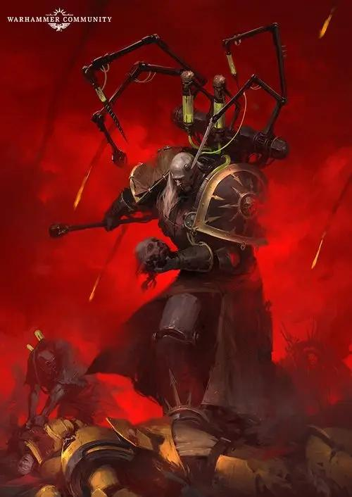
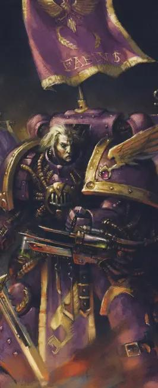
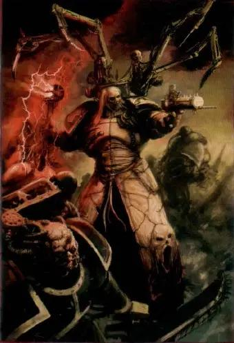
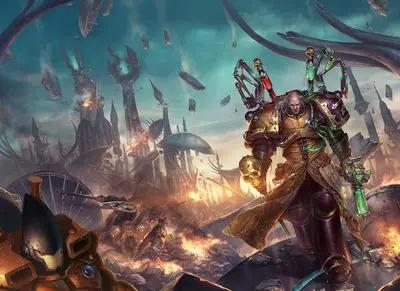
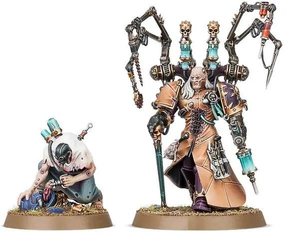
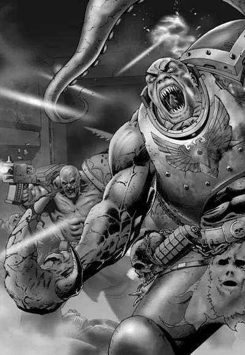
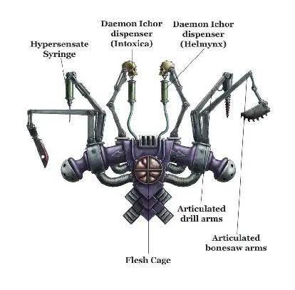

# 0641 法比乌斯·拜尔 Fabius Bile

精校状态：中文行文已逐段精校，部分术语仍为暂定

分类：人类帝国 / 帝皇之子

原文来源：https://www.bilibili.com/opus/1106804645497405441

原作者：帝国神选罐头

原文时间：编辑于 2025年09月26日 14:59

[返回分类目录](目录.md) · [全书目录](../../目录.md)

<!-- A0641-B0001 -->
**英文原文**

The only real crime for those of superlative intellect and great prowess is to allow one's self to become shackled by mediocrity. The crime is to let your grasp be less than your reach. To aim low.

<!-- /A0641-B0001 -->

<!-- A0641-B0002 -->

原译文

对于那些智力超群、技艺超群的人来说，唯一真正的罪就是让自己被平庸所束缚。罪在于让你的掌控低于你的触及。设定低目标。

**校订译文**

“对才智与能力卓绝的人而言，真正的罪只有一种：甘受平庸束缚。明明伸手可及，却不肯将它握住；明明能志存高远，却只求低处。”

**校注：** grasp 与 reach 的比喻按紧接的 To aim low 理解为目标低于自身能力，不保留难以理解的“掌控低于触及”。

<!-- /A0641-B0002 -->

<!-- A0641-B0003 -->
**英文原文**

Fabius Bile, originally just Fabius and also known as the Spider and the Primogenitor is a Chaos Space Marine. Prior to the defeat of the Horus Heresy, he was a Lieutenant-Commander and Chief Apothecary of the Emperor's Children. He is now an infamous mad scientist, specializing in genetic manipulation and the creation of Enhanced Warriors. Unlike most of the Emperor's Children, Bile does not follow Slaanesh, instead he devotes himself to science, and research into the creation of Space Marines. Unbeknownst to most, the present-day Fabius is a gestalt intelligence consisting of several fully autonomous clones who pursue their own agendas and projects.

<!-- /A0641-B0003 -->

<!-- A0641-B0004 -->

原译文

法比乌斯·拜尔，原名法比乌斯，也被称为蜘蛛和始祖，是一名混沌星际战士。在荷鲁斯叛乱被击败之前，他是帝皇之子的副指挥官兼首席药剂师。他现在是一个臭名昭著的疯狂科学家，专门从事基因操纵和增强战士的创造。与大多数帝皇之子不同，拜尔不追随色孽，而是致力于科学和研究星际战士的创建。大多数人不知道，如今的法比乌斯是一个格式塔智能，由几个完全自主的克隆人组成，他们追求自己的议程和项目。

**校订译文**

法比乌斯·拜尔原本只叫法比乌斯，又称“蜘蛛”与“始祖”，是一名混沌星际战士。荷鲁斯之乱败亡前，他曾任帝皇之子的副指挥官兼首席药剂师。如今，他以疯狂科学家之名臭名昭著，专精基因改造与增强战士的制造。与多数帝皇之子不同，他不奉祀色孽，而是专注科学，研究如何创造星际战士。鲜有人知，当今的“法比乌斯”实际上是由多个完全自主的克隆体构成的复合智能，各自推进不同计划与研究。

**校注：** gestalt intelligence 暂以复合智能表达多个独立克隆体组成的整体，非称每个克隆体只有一个完全受中央控制的意识。

<!-- /A0641-B0004 -->

<!-- A0641-B0005 图片 -->

<!-- A0641-B0006 -->

原译文

Fabius Bile 法比乌斯·拜尔

**校订译文**

Fabius Bile 法比乌斯·拜尔

<!-- /A0641-B0006 -->

<!-- A0641-B0007 -->
## History 历史

<!-- /A0641-B0007 -->

<!-- A0641-B0008 -->
### Early Life 早期生活

<!-- /A0641-B0008 -->

<!-- A0641-B0009 -->
**英文原文**

Fabius was born on Terra to Europan nobility. He spent at least part, if not all of his childhood in a region named Ingolstadt; potentially related to the Bavarian city but this is not expanded upon. As a child, he learned the art of fleshcrafting from one of his families servants. Among his first experiments was modifying mice to duel each other in elaborate garb and was inconsolable when they disobeyed his orders and killed one another. Shortly after, he was inducted into the III Legion.

<!-- /A0641-B0009 -->

<!-- A0641-B0010 -->

原译文

法比乌斯出生在泰拉的欧罗巴上。他的童年至少有一部分，如果不是全部，都在一个名为英戈尔施塔特的地区度过；可能与巴伐利亚城有关，但没有进一步扩展。小时候，他从家里的一个仆人那里学会了血肉制作的艺术。他的第一个实验是改造老鼠，让它们穿着精心设计的服装互相决斗，当它们不服从他的命令互相残杀时，他感到非常难过。不久之后，他被编入第三军团。

**校订译文**

法比乌斯生于泰拉的欧罗巴贵族家庭，至少有一部分童年在英戈尔施塔特度过。这个地区可能与巴伐利亚的同名城市有关，但资料没有展开说明。他幼年从家中一位仆人那里学会血肉塑造之术，早期实验之一就是改造老鼠，让它们穿上华丽服装相互决斗。老鼠违背他的命令、彼此残杀时，他悲痛得无法自抑。不久后，他加入第三军团。

**校注：** Europan nobility 为欧罗巴贵族家庭，原译漏掉贵族出身；Bavarian city 指巴伐利亚的同名城市，不是名为“巴伐利亚城”的地方。

<!-- /A0641-B0010 -->

<!-- A0641-B0011 -->
### Great Crusade 大远征

<!-- /A0641-B0011 -->

<!-- A0641-B0012 -->
**英文原文**

Fabius was the sole member of the original Legion's command structure amongst the Two Hundred survivors of 'the Blight' that caused organ degeneration in the Emperor's Children as a result of a Selenite plot. Despite this he did not seek promotion, being instead dedicated to his work to reverse the disease. He was nicknamed the Spider by other members of the Legion.

<!-- /A0641-B0012 -->

<!-- A0641-B0013 -->

原译文

法比乌斯是因赛琳娜教派阴谋导致帝皇之子器官退化的200名“枯萎病”幸存者中，原始军团指挥结构的唯一成员。尽管如此，他并没有寻求晋升，而是致力于扭转这种疾病。他被军团的其他成员称为蜘蛛。

**校订译文**

赛琳娜基因教派的阴谋使帝皇之子染上“枯萎病”，器官不断退化。最终留下的二百名幸存者中，法比乌斯是原军团指挥层的唯一成员。他却未谋求晋升，而是全力研究如何逆转病变。同袍给他起了个绰号：“蜘蛛”。

<!-- /A0641-B0013 -->

<!-- A0641-B0014 图片 -->

<!-- A0641-B0015 -->

原译文

Apothecary Fabius of the Emperor's Children 帝皇之子药剂师法比乌斯·拜尔

**校订译文**

Apothecary Fabius of the Emperor's Children 帝皇之子药剂师法比乌斯·拜尔

<!-- /A0641-B0015 -->

<!-- A0641-B0016 -->
**英文原文**

By the end of the Great Crusade, Fabius had risen to Chief Apothecary of the Emperor's Children and was known for his reclusive and inquisitive nature. As the Heresy and betrayal of the Emperor's Children loomed, Fabius managed to convince Fulgrim that he could improve upon the Legion's gene-seed and finalize their quest for perfection. To this end Fabius began experimenting on both Emperor's Children and Blood Angels wounded or slain in the War on Murder. This began Fabius' descent into corruption and madness, as his experiments became ever-more extreme.

<!-- /A0641-B0016 -->

<!-- A0641-B0017 -->

原译文

到大远征结束时，法比乌斯已经升任帝皇之子的首席药剂师，以其隐居和好奇的天性而闻名。随着叛乱和帝皇之子的背叛迫在眉睫，法比乌斯设法说服福格瑞姆，他可以改进军团的基因种子，并完成他们对完美的追求。为此，法比乌斯开始对帝皇之子和在谋杀战争中受伤或被杀的圣血天使进行实验。这开始了法比乌斯的堕落和疯狂，因为他的实验变得越来越极端。

**校订译文**

大远征末，法比乌斯已升任首席药剂师，以孤僻而好钻研闻名。叛乱和帝皇之子的背叛日益逼近时，他说服福格瑞姆相信，自己能够改进军团基因种子，使他们最终达到完美。为此，他开始以谋杀星之战中负伤或阵亡的帝皇之子、圣血天使为对象开展实验。实验愈发极端，他也由此一步步滑向腐化与疯狂。

**校注：** wounded or slain in the War on Murder 同时限定两个军团，不能只修饰圣血天使；Murder 为世界名。

<!-- /A0641-B0017 -->

<!-- A0641-B0018 -->
### Horus Heresy 荷鲁斯之乱

原题：Horus Heresy 荷鲁斯叛乱

<!-- /A0641-B0018 -->

<!-- A0641-B0019 -->
**英文原文**

Once the Heresy began and the Imperium became divided, Fabius was held in high esteem by both Horus and Erebus for his skills in genetic research. Omegon was told by Horus to give Fabius the stolen Data from the Primarch project. However the Data Omegon gave Bile was purposefully flawed, so that the traitors would waste manpower and resources, while it would be impossible to gain any benefit from it.

<!-- /A0641-B0019 -->

<!-- A0641-B0020 -->

原译文

一旦叛乱开始，帝国分裂，法比乌斯因其在基因研究方面的技能而受到荷鲁斯和艾瑞巴斯的高度尊重。荷鲁斯让欧米伽把从原体项目中窃取的数据交给法比乌斯。然而，欧米伽给拜尔的数据是故意有缺陷的，因此叛徒会浪费人力和资源，而不可能从中获得任何利益。

**校订译文**

叛乱爆发、帝国分裂后，法比乌斯凭基因研究才能受到荷鲁斯与艾瑞巴斯器重。荷鲁斯命欧米伽将窃取的原体计划资料交给他，但欧米伽故意提供有缺陷的数据，让叛军徒耗人力资源，无法取得成果。

<!-- /A0641-B0020 -->

<!-- A0641-B0021 -->
**英文原文**

Following the Drop Site Massacre Fabius trawled the ancient choral conclaves on Isstvan V, scavenging knowledge left there by the warsingers of the Isstvan System. Later, Fabius joined several Emperor's Children commanders such as Lucius and Marius Vairosean in using extreme torture to exorcise the Daemon that was inhabiting Fulgrim.

<!-- /A0641-B0021 -->

<!-- A0641-B0022 -->

原译文

在登陆点大屠杀之后，法比乌斯在伊斯塔万五号的古老唱诗班密会上搜寻，收集伊斯塔万星系的战争歌者留下的知识。后来，法比乌斯与卢修斯和马吕斯·瓦伊罗桑等几位帝皇之子指挥官一起，使用极端酷刑驱除占据福格瑞姆的恶魔。

**校订译文**

登陆点大屠杀后，法比乌斯搜遍伊斯塔万五号的古老合唱密会遗址，收集该星系战歌者遗留的知识。后来，他与卢修斯、马吕斯·瓦伊罗桑等帝皇之子指挥官一道，企图用极端酷刑驱逐附在福格瑞姆身上的恶魔。

<!-- /A0641-B0022 -->

<!-- A0641-B0023 -->
**英文原文**

At his Primarch's demand, Fabius produced his first cloned Primarch, creating a replica of Ferrus Manus which Fulgrim tried to again convert to his cause and killing him after he refused. Fabius created multiple clones of Ferrus, all refusing Fulgrim before being killed. Fabius proved vital for the Emperor's Children during the Heresy, reviving both Eidolon and Lucius at the demand of their Primarch. As the war ground on his experiments became more and more depraved, torturing captive Space Marines of both allied and enemy Legions to give birth to his first generation of Terata. Yet this period also contributed to a growing resentment, as Fabius saw his fellow Legionnaires often squander his scientific achievements, while they became more and more self-absorbed and ungrateful for his work. Fulgrim also restricted Fabius' experiments in certain regards, embittering him.

<!-- /A0641-B0023 -->

<!-- A0641-B0024 -->

原译文

在他的原体的要求下，法比乌斯生产了他的第一个克隆原体，创造了一个费鲁斯·马努斯的复制体，福格瑞姆试图再次让他皈依他的事业，并在他拒绝后杀死了他。法比乌斯创造了多个费鲁斯的克隆体，在被杀死之前都拒绝了福格瑞姆。法比乌斯在叛乱期间对帝皇之子至关重要，在他们的原体的要求下复活了艾多隆和卢修斯。随着他实验的战场变得越来越恶劣，盟军和敌方军团的被俘星际战士被折磨，诞生了他的第一代特拉塔。然而，这一时期也引发了越来越多的怨恨，因为法比乌斯看到他的战友们经常浪费他的科学成就，而他们对他的工作越来越自私和忘恩负义。福格瑞姆还在某些方面限制了法比乌斯的实验，这让他很痛苦。

**校订译文**

奉原体命令，法比乌斯制造出第一个原体克隆体——费鲁斯·马努斯的复制品。福格瑞姆再次试图劝他投向自己，却遭拒绝，随即将其杀死。此后又有多个费鲁斯克隆体诞生，无一不在拒绝福格瑞姆后遇害。叛乱中，法比乌斯对军团至关重要，还曾奉命复活艾多隆与卢修斯。随着战事拖延，他的实验愈加残忍，以俘获的敌我双方星际战士为对象施加折磨，造出第一代特拉塔。然而，他对同袍的怨恨也不断累积：这些人常糟蹋他的科学成果，越来越自我陶醉，又不知感激；福格瑞姆还限制了某些实验，更使他心怀不满。

**校注：** as the war ground on 是战争拖延，并非“实验的战场”；杀死拒绝皈依的费鲁斯克隆体的是福格瑞姆。

<!-- /A0641-B0024 -->

<!-- A0641-B0025 -->
### Siege of Terra and Great Scouring 泰拉围城和大清洗

<!-- /A0641-B0025 -->

<!-- A0641-B0026 -->
**英文原文**

During the end of the Heresy Fabius took part in the Siege of Terra as part of his legion's contribution. After some initial role in the campaign, however, the Emperor's Children mainly focused on exploiting the general population of Terra for their amusements. In the Legion's unrestrained fervour, millions of Earth's civilians were murdered. Bile used the opportunity to perform horrific experiments on captives. Human victims were rendered down to create special drugs which heightened the Legionnaires' feeling of ecstasy. It is possible that Earth served as the first example of Fabius' subsequent atrocious experiments on entire planetary populations. Despite his involvement, the siege only furthered Fabius' growing disdain for his legion, Fulgrim, and the forces of Chaos. He was disgusted by the powers of the Warp unleashed during the battle's last stage, retreating into an abandoned bunker complex to continue his efforts to enhance Space Marines as well as clone the Primarchs. As he worked, he mused how his scientific pursuits were actually closer to the Emperor's activities than whatever the followers of Chaos were trying to do, scorning their hatred for what he saw as an amazing scientist. He also started to think how all of humanity had to adapt to survive.

<!-- /A0641-B0026 -->

<!-- A0641-B0027 -->

原译文

叛乱结束时，法比乌斯参加了泰拉围城，这是他军团贡献的一部分。然而，在这场战役中发挥了一些最初的作用后，帝皇之子主要集中在利用泰拉的普通民众进行娱乐活动上。在军团不受约束的狂热中，数百万地球平民被谋杀。拜尔利用这个机会对俘虏进行了可怕的实验。人类受害者被制成特殊药物，增强了军团士兵的狂喜感。地球可能是法比乌斯随后对整个行星人口进行残暴实验的第一个例子。尽管他参与其中，但围城只会加剧法比乌斯对他的军团、福格瑞姆和混沌势力日益增长的蔑视。他对战斗最后阶段释放的亚空间力量感到厌恶，撤退到一个废弃的掩体中，继续努力增强星际战士并克隆原体。当他工作时，他沉思着他的科学追求实际上比混沌的追随者试图做的任何事情都更接近帝皇的行动，蔑视他们对他所看到的一位了不起的科学家的仇恨。他也开始思考全人类必须如何适应才能生存。

**校订译文**

叛乱末期，法比乌斯随军参加泰拉围城。帝皇之子最初还承担部分作战任务，随后却主要转向蹂躏平民、寻欢作乐。在毫无节制的暴行中，数百万泰拉居民遭到杀害。拜尔借机进行恐怖实验，将人体提炼成能强化战士快感的药物。泰拉或许就是他后来以整颗行星人口为实验对象的第一个案例。尽管自己深涉其中，围城仍使他愈发蔑视军团、福格瑞姆与混沌势力。他厌恶战事末期肆虐的亚空间力量，退入废弃掩体，继续研究强化星际战士与克隆原体。他觉得，自己的科学追求其实更接近帝皇当年的工作，因而鄙视混沌信徒对这位伟大科学家的仇恨。他也开始思考，整个人类应当如何改变，才能继续生存。

<!-- /A0641-B0027 -->

<!-- A0641-B0028 -->
**英文原文**

In the last weeks of the Siege of Terra, Fabius was chanced upon by loyalist Word Bearer Barthusa Narek and a group of armed refugees. At this point, the Chief Apothecary's ad-hoc bunker laboratory was largely decrepit and broken, with most of his creations and followers dead or otherwise gone. After a short conversation, the two sides clashed, with Fabius fleeing as his latest creation unsuccessfully attempted to kill Narek. Afterward, Fabius had an epiphany, seeing the uselessness of what the Traitor Legions were trying to accomplish. He thus left Terra before the death of Horus, along with a retinue of altered followers. The act incensed Fulgrim, who put a bounty on his head.

<!-- /A0641-B0028 -->

<!-- A0641-B0029 -->

原译文

在泰拉围城的最后几周，法比乌斯被忠诚的怀言者巴图萨·纳雷克和一群武装难民偶然发现。在这一点上，首席药剂师的特设掩体实验室基本上已经破旧不堪，他的大部分创作和追随者都死了或以其他方式消失了。经过短暂的交谈，双方发生冲突，法比乌斯逃离，因为他最新的创作试图杀死纳雷克，但未能成功。后来，法比乌斯顿悟了，看到了叛徒军团试图实现的徒劳。因此，他在荷鲁斯死亡前离开了泰拉，以及一群被改变的追随者。这一行为激怒了福格瑞姆，悬赏他的头颅。

**校订译文**

围城最后数周，忠诚的怀言者巴图萨·纳瑞克与一群武装难民偶然找到法比乌斯。此时，他临时搭建的掩体实验室已残破不堪，实验造物与追随者大半死去或失散。短暂交谈后，双方爆发冲突。他的最新造物没能杀死纳瑞克，自己却趁乱逃脱。随后，他忽然看清叛军军团所求之事的徒劳，便在荷鲁斯死前，带一群经过改造的追随者离开泰拉。福格瑞姆因此震怒，悬赏取他首级。

<!-- /A0641-B0029 -->

<!-- A0641-B0030 -->
**英文原文**

In the aftermath of the Siege of Terra, Bile was hunted by the Salamanders, personally led by Primarch Vulkan. For all his twisted genius, Bile could not hold back the furious crusade of loyalists that launched outward from ravaged Terra. Retribution finally caught him in the Arden System, where he was supporting the excesses of the renegade Lord Tyrell in exchange for foetal material. The Adeptus Astartes launched themselves down upon the corrupted world of Arden IX. Bile's flesh refineries and cloning vats all burned in a single night as the righteous fury of the Salamanders Chapter under Vulkan incinerated all evidence of the Primogenitor’s precious experiments. Bile brought low a dozen Space Marines in the battle as his once-brothers died agonising and inventive deaths. Yet he barely escaped the battle. He was forced to flee for his life, and his ship was crippled by an Imperial Gothic class cruiser as he fled for the dubious refuge of the Warp.

<!-- /A0641-B0030 -->

<!-- A0641-B0031 -->

原译文

在泰拉围城之后，拜尔被火蜥蜴追捕，火蜥蜴由原体沃坎亲自领导。尽管拜尔是扭曲的天才，但他无法阻止从饱受蹂躏的泰拉向外发起的忠诚者的激烈远征。惩罚最终将他带到了雅顿星系，在那里他支持叛徒提利尔领主的暴行，以换取胎儿材料。阿斯塔特修会向堕落的雅顿九号发起攻击。拜尔的血肉精炼工厂和克隆缸在一个晚上全部烧毁，沃坎领导下的火蜥蜴战团的正义之怒烧毁了始祖宝贵实验的所有证据。拜尔在战斗中击败了十几名星际战士，他的兄弟们痛苦而富有创造力地死去。然而，他几乎没有逃离这场战斗。他被迫逃命，当他逃往可疑的亚空间避难所时，他的船被一艘帝国哥特级巡洋舰损坏。

**校订译文**

围城结束后，原体沃坎亲率火蜥蜴追剿拜尔。任凭他的才智多么扭曲过人，也挡不住忠诚者从残破泰拉向外席卷的复仇攻势。追兵终于在雅顿星系找到他：他正协助叛乱领主提利尔纵行暴虐，以换取胎儿组织。阿斯塔特降临已遭腐化的雅顿九号，一夜之间焚尽血肉精炼厂与克隆培养槽，摧毁始祖珍视的实验。在战斗中，拜尔用种种残酷的新奇手段杀死十二名昔日同袍，自己却也仅以身免。他逃往并不可靠的亚空间避难处时，座舰又被帝国哥特级巡洋舰打成重伤。

**校注：** a dozen 为十二，非泛指十几；barely escaped 是勉强逃出，不是几乎没有逃出。本段原文明称此时 Salamanders Chapter，正文不据此重排军团拆分史。

<!-- /A0641-B0031 -->

<!-- A0641-B0032 -->
**英文原文**

Whether by accident or design, Bile’s vessel was slowly drawn into the Eye of Terror. He drifted there for an age, constantly experimenting on those few acolytes he had left until the hand of some dark god guided his ship into the gravity well of a Daemon world. Once, the planet had been one of the scintillating jewel-worlds of the Eldar civilisation before their own debaucheries saw their civilisation torn apart. Now it was a shriveled ruin, a Crone World of seething madness that echoed to the screams of souls long dead. To Fabius Bile, it became home.

<!-- /A0641-B0032 -->

<!-- A0641-B0033 -->

原译文

无论是偶然还是故意，拜尔的船都慢慢被拖入了恐惧之眼。他在那里漂泊了一段时间，不断地在他留下的少数追随者身上进行实验，直到某个黑暗之神的手引导他的船进入了恶魔世界的重力井。曾经，这个行星是灵族文明中闪闪发光的宝石世界之一，直到他们自己的放荡看到他们的文明被撕裂。现在，它变成了一片枯萎的废墟，一个充满疯狂的老妪世界，回荡着早已死去的灵魂的尖叫声。对法比乌斯·拜尔来说，这里成了家园。

**校订译文**

不知出于偶然还是某种安排，拜尔的战舰慢慢被卷入恐惧之眼。他在那里漂泊许久，不断拿仅存的少数侍从做实验，直到某位黑暗神祇引导舰船，落入一颗恶魔世界的引力范围。那曾是灵族文明光彩夺目的珍宝世界，后来灵族因纵欲而自毁，如今只剩干枯废墟，成为疯狂翻涌、回荡亡魂尖叫的老妪世界。法比乌斯·拜尔把这里当作了家。

<!-- /A0641-B0033 -->

<!-- A0641-B0034 -->
### Legion Wars 军团战争

<!-- /A0641-B0034 -->

<!-- A0641-B0035 -->
**英文原文**

Bile took up command of many remaining Emperor's Children and regrouped at Canticle City, the fortress of the Emperor's Children on the Daemon world of Harmony. When Fulgrim abandoned the Emperor's Children after the Battle of Thessala, Fabius emerged as a one of the most powerful figures in the Legion. He led one of the largest factions of the Legion, being only rivalled by Lucius and Eidolon. At the time, Fabius was still convinced that he could return the Emperor's Children to their former glory and purge them of disrupting Chaos influence using his research. He eventually concluded that the best way to save not just his own Legion, but also the other Traitor Legions, was by cloning all Primarchs and raising them with his atheist, perfectionist, and scientific ideology.

<!-- /A0641-B0035 -->

<!-- A0641-B0036 -->

原译文

拜尔接管了许多剩余的帝皇之子的指挥权，并在和谐星恶魔世界上的帝皇之子堡垒颂歌城重新集结。当福格瑞姆在色萨拉之战后抛弃了帝皇之子们时，法比乌斯成为了军团中最强大的人物之一。他领导着军团中最大的派系之一，仅次于卢修斯和艾多隆。当时，法比乌斯仍然相信，他可以用他的研究让帝皇之子们恢复昔日的荣耀，并清除正在扰乱他们的混沌影响。他最终得出结论，拯救他自己的军团以及其他叛徒军团的最好方法是克隆所有的原体，并用他的无神论者、完美主义者和科学意识形态抚养他们。

**校订译文**

拜尔召集大量帝皇之子残部，在恶魔世界和谐星的军团堡垒颂歌城重整旗鼓。色萨拉之战后，福格瑞姆弃军团而去，拜尔遂成为最有权势的人物之一，所率派系规模只有卢修斯与艾多隆能够匹敌。他当时仍相信，自己的研究能清除军团所受的混沌干扰，恢复昔日荣光。最终，他认定，不仅要救本军团，更要救其他叛军军团，最佳办法就是克隆所有原体，从小以无神论、完美主义和科学观念培养他们。

**校注：** only rivalled by 意为只有二者能匹敌，原译“仅次于”错误排出明确名次。

<!-- /A0641-B0036 -->

<!-- A0641-B0037 图片 -->

<!-- A0641-B0038 -->

原译文

Fabius Bile 法比乌斯·拜尔

**校订译文**

Fabius Bile 法比乌斯·拜尔

<!-- /A0641-B0038 -->

<!-- A0641-B0039 -->
**英文原文**

He thus went about continuing his work from before the Heresy, attempting to unravel the secrets of gene-seed and the Emperor's science in creating the Primarchs. He continued to clone Primarchs as he had Ferrus Manus earlier. Believing that he could end the destructive Legion Wars by resurrecting Horus as a unifying figure, Fabius captured the latter's corpse on Maleum with the aid of a Sons of Horus defector, Skalagrim Phar. However, Fabius' plans were foiled when the newly created Black Legion launched a surprise attack, largely destroying Canticle City. Horus' clone was found by Abaddon, and killed by him in the Battle of Harmony. During the battle, it was revealed that the other cloned Primarchs had ended up as a collection of adolescent monstrosities and deformed creatures, which were all subsequently wiped out by Abaddon and his forces. Annoyed, Bile stated that Abaddon had set his work back considerably and fled. Ultimately, Fabius realized that his attempts at cloning the Primarchs had been doomed from the start, as the Primarchs were too strong-willed to be influenced by him. Furthermore, he concluded that the Emperor's Children had become too degenerated and were beyond saving anyway; thus, his ideas to cleanse them with the aid of a Fulgrim clone would be futile. Ultimately, Fabius thus started to focus on other projects, mainly his "New Men" - a race of modified humans that would inherit the galaxy, replacing both regular humans as well as Space Marines.

<!-- /A0641-B0039 -->

<!-- A0641-B0040 -->

原译文

因此，他继续从事叛乱之前的工作，试图揭开基因种子的秘密和帝皇创造原体的科学。他继续克隆原体，就像之前克隆费鲁斯·马努斯一样。法比乌斯相信他可以通过复活荷鲁斯作为一个统一的人物来结束毁灭性的军团战争，在荷鲁斯之子叛逃者斯卡拉格里姆·法尔的帮助下，他在马勒姆捕获了荷鲁斯的尸体。然而，当新成立的黑色军团发动突然袭击，在很大程度上摧毁了颂歌城时，法比乌斯的计划被挫败了。阿巴顿发现了荷鲁斯的克隆体，并在和谐星之战中将他杀死。在战斗中，据透露，其他克隆的原体最终变成了一群未成熟的怪物和畸形生物，随后被阿巴顿和他的部队消灭了。拜尔很生气，他说阿巴顿已经大幅推迟了他的工作，并逃离了。最终，法比乌斯意识到，他克隆原体的尝试从一开始就注定要失败，因为原体的意志太强，无法受到他的影响。此外，他得出结论，帝皇之子们已经变得太堕落了，无论如何都无法挽救；因此，他用福格瑞姆克隆体来净化它们的想法将是徒劳的。最终，法比乌斯开始专注于其他项目，主要是他的“新人类” — 一个将继承银河系的改良人类种族，取代普通人类和星际战士。

**校订译文**

因此，他继续叛乱前的研究，探究基因种子与帝皇创造原体的奥秘，并像此前复制费鲁斯那样，继续克隆原体。他希望复活荷鲁斯，以其号召力终结军团战争。借荷鲁斯之子叛逃者斯卡拉格里姆·法尔协助，他在玛勒姆夺得荷鲁斯遗体。新成立的黑色军团却突袭颂歌城，将其大半摧毁。和谐星之战中，阿巴顿找到荷鲁斯克隆体，亲手杀死了他；其他原体克隆体则大多还是未长成的畸形怪物，也被黑色军团全部消灭。拜尔恼怒地斥责阿巴顿使研究大幅倒退，随后逃走。他最终认识到，克隆原体的计划从开始便难以成功：原体意志太强，不可能受他塑造。帝皇之子也早已堕落至无可救药，就算借福格瑞姆克隆体引领净化，也只是徒劳。于是，他逐渐把重心转向其他项目，尤其是“新人类”——他打算让这个经过改造的种族，取代普通人类与星际战士，继承银河。

**校注：** Maleum 与554 B0102的 Maeleum、B0106的 Maleum 指同一座荷鲁斯之子堡垒所在世界，属于所给源文的异拼，统一玛勒姆。其他克隆体失败与640篇唯一完美福格瑞姆克隆体的先后，按所给文本保留。

<!-- /A0641-B0040 -->

<!-- A0641-B0041 -->
**英文原文**

The other Emperor's Children considered Bile's retreat from Canticle City with the remnants of his work as a betrayal. After the fall of Canticle City, Bile found himself pursued by multiple foes, including Chaos Marines, eldar, the Dark Council, and even Fulgrim himself. He eventually settled on the Crone World of Urum.

<!-- /A0641-B0041 -->

<!-- A0641-B0042 -->

原译文

其他帝皇之子认为，拜尔带着他的作品残余从颂歌城撤退是一种背叛。颂歌城陷落后，拜尔发现自己被多个敌人追赶，包括混沌星际战士、灵族、黑暗议会，甚至福格瑞姆本人。他最终选择了乌鲁姆老妪世界。

**校订译文**

其他帝皇之子将拜尔带着残余研究成果逃离颂歌城视为背叛。城破之后，混沌星际战士、灵族、黑暗议会，乃至福格瑞姆本人都追杀他。他最终定居于老妪世界乌鲁姆。

<!-- /A0641-B0042 -->

<!-- A0641-B0043 -->
### The Long War 万古长战

<!-- /A0641-B0043 -->

<!-- A0641-B0044 -->
**英文原文**

In the centuries following the Heresy, he traveled the galaxy offering his services to various planetary lords or rebel leaders, in return for prisoners (the "Flesh-Tithe") or ancient technical libra. Many of these ambitious overlords came to regret allowing Bile's experimentation's on their people, as the results of his atrocities became apparent. His creations have also infiltrated many Imperial planets, helping to hide evidence of his activity and redirect potential enemies. Despite his infamy, Bile still adheres to a twisted version of the old Imperial Truth, believing that only the foolish and weak seek the comfort of gods and seeking scientific understanding above all else.

<!-- /A0641-B0044 -->

<!-- A0641-B0045 -->

原译文

在叛乱之后的几个世纪里，他周游银河系，为各种行星领主或叛军领袖提供服务，以换取囚犯（“血肉税”）或古代技术藏书。随着拜尔暴行的结果变得明显，许多雄心勃勃的统治者开始后悔允许拜尔在他们的人民身上进行实验。他的作品还渗透到了许多帝国行星，帮助隐藏了他活动的证据，并重新引导了潜在的敌人。尽管拜尔声名狼藉，但他仍然坚持旧帝国真理的扭曲版本，认为只有愚蠢和软弱的人才会寻求神的安慰，寻求科学理解高于一切。

**校订译文**

叛乱后数百年，拜尔游历银河，向行星领主与叛军头目提供服务，换取囚犯——即“血肉税”——或古老技术典籍。实验的恶果显现后，许多野心勃勃的统治者才后悔让他染指自己的臣民。他的造物还渗入许多帝国行星，掩盖活动证据，并误导潜在敌人。尽管声名狼藉，他仍坚持一种扭曲的帝国真理，认为只有愚昧软弱者才寻求神祇慰藉，而科学求知高于一切。

<!-- /A0641-B0045 -->

<!-- A0641-B0046 -->
**英文原文**

Bile eventually ended up leading a group of affiliated apothecaries from various Legions known as the Consortium based on Urum. Looking for a key to stop the decay of his body and achieve immortality, he was a key participant in the Shattering, the attack by the Emperor's Children on the Eldar Craftworld Lugganath in 764.M34. During the attack it became apparent that his former acolyte Oleander Koh and a group of Harlequins engineered the events to try and convince Fabius to lead the Emperor's Children once more. However Fabius refused to become a warleader and instead insisted that his work would continue.

<!-- /A0641-B0046 -->

<!-- A0641-B0047 -->

原译文

拜尔最终领导了一组来自不同军团的附属药剂师，他们被称为基于乌鲁姆的联合体。为了寻找一把阻止身体腐烂并实现永生的钥匙，他是764.M34帝皇之子们对灵族方舟世界拉格奈什发动的“大粉碎”袭击的关键参与者。在袭击期间，很明显，他的前助手欧利昂德·科赫和一群丑角策划了这些事件，试图说服法比乌斯再次领导帝皇之子们。然而，法比乌斯拒绝成为战争领袖，而是坚持要继续他的工作。

**校订译文**

拜尔后来以乌鲁姆为基地，领导来自多个军团的药剂师结成“共同体”。为找到阻止身体衰败、实现永生的办法，他积极参与 764.M34 帝皇之子袭击灵族方舟世界拉格奈什的“大粉碎”。袭击过程中，他发现前侍从欧利昂德·科赫与一群丑角才是事件的幕后策划者，目的在于说服他重新统领帝皇之子。拜尔拒绝成为战争领袖，坚持继续自己的研究。

<!-- /A0641-B0047 -->

<!-- A0641-B0048 图片 -->

<!-- A0641-B0049 -->

原译文

Fabius during the Shattering of Lugganath 拉格奈什粉碎期间的法比乌斯

**校订译文**

Fabius during the Shattering of Lugganath 拉格奈什粉碎期间的法比乌斯

<!-- /A0641-B0049 -->

<!-- A0641-B0050 -->
**英文原文**

Sometime later, Bile found himself continually hunted by Sylandri Veilwalker and her band of Harlequins. During one such encounter, he was captured by Flavius Alkenex and taken to Harmony to stand before Eidolon. Eidolon informed Fabius that a lost Gene-Seed tithe of the Emperor's Children had been located in the Eastern Fringes and requested that Bile bring it back to him and the Phoenix Conclave. Alkenex and his troops were kept at Fabius' side to make sure he did not betray his former comrades once more. While exploring the ruins of his former lab on Harmony, Bile discovered that one of his infant clones of Fulgrim still lived. Hoping to use the lost Gene-Tithe and Fulgrim to restore the Emperor's Children to what they used to be, Bile departed Harmony.

<!-- /A0641-B0050 -->

<!-- A0641-B0051 -->

原译文

过了一段时间，拜尔发现自己不断被西兰德里·帷幕行者和她的丑角小队追捕。在一次这样的遭遇中，他被弗莱维厄斯·阿尔克内斯俘虏，并被带到和谐星站在艾多隆面前。艾多隆告诉法比乌斯，在东部边缘发现了一个丢失的帝皇之子的十分之一的基因种子，并要求拜尔将其带回给他和凤凰秘会。阿尔克内斯和他的部队被留在法比乌斯身边，以确保他不再背叛他的前战友。在探索他以前的和谐星实验室的废墟时，拜尔发现他的一个克隆体婴儿的福格瑞姆仍然活着。为了利用丢失的基因什一税和福格瑞姆将帝皇之子们恢复到原来的样子，拜尔离开了和谐星。

**校订译文**

此后，西兰德里·帷幕行者与她的丑角不断追踪拜尔。一次遭遇中，弗莱维厄斯·阿尔克内斯将他俘获，押往和谐星，交给艾多隆。后者说，银河东部边缘发现了一批帝皇之子遗失的基因种子什一税，要他为自己与凤凰秘会取回。为防止再次背叛，阿尔克内斯及所部随行监视。搜索和谐星旧实验室的废墟时，拜尔发现一个尚在婴儿期的福格瑞姆克隆体仍活着。他希望借这批种子与克隆原体重建军团昔日荣光，遂离开和谐星。

**校注：** a lost Gene-Seed tithe 指一批失落的什一税种子，非“丢失了帝皇之子十分之一的种子”。

<!-- /A0641-B0051 -->

<!-- A0641-B0052 -->
**英文原文**

Following Eidolon's coordinates, Bile and his entourage found themselves at the Necron world of Solemnace. On its surface, they were assailed by the Necron legions of Trazyn the Infinite. Coming before Trazyn, Bile nearly became part of the Necron Lord's collection but bargained with the Xenos to exchange his life for the Harlequins which stalked him. Trazyn agreed, and upon their return to the Vesalius found that Alkenex had attempted to seize the vessel in his absence. Bile's clone of Fulgrim, now matured, had rallied his Gland Hounds to resist Alkenex and his Emperor's Children. However Bile became disturbed by the Gland Hound's dedication to Fulgrim as well as the young clone's insubordination. Fearing that Fulgrim was going down the same path of arrogance as before and worried his New Men would be ruined by the Primarch, Bile exchanged the clone and Emperor's Children to Trazyn in exchange for the lost Gene-Tithe. Bile came away with enough pure gene-seed to produce nearly 18,000 legionaries.

<!-- /A0641-B0052 -->

<!-- A0641-B0053 -->

原译文

跟随艾多隆的坐标，拜尔和他的随行人员发现自己来到了索勒姆纳斯死灵世界。从表面上看，他们受到了无限者塔拉辛的死灵军团的攻击。在塔拉辛之前，拜尔几乎成为了死灵领主收藏的一部分，但与异型讨价还价，用他的生命换取跟踪他的丑角。塔拉辛同意了，当他们回到维萨留斯号时，发现阿尔克内斯试图在他不在的情况下夺取这艘船。拜尔克隆的福格瑞姆现在已经成熟，他召集了他的腺体猎犬来抵抗阿尔克内斯和他的帝皇之子们。然而，拜尔对腺体猎犬对福格瑞姆的奉献以及年轻克隆体的不服从感到不安。由于担心福格瑞姆会像以前一样走上傲慢的道路，并担心他的新人会被原体毁掉，拜尔将克隆体和帝皇之子交换给了塔拉辛，以换取丢失的基因什一税。拜尔带来了足够的纯结基因种子，可以生产近18000名军团士兵。

**校订译文**

依照艾多隆提供的坐标，拜尔一行抵达太空死灵世界索勒纳姆斯，在地表遭无尽者塔拉辛的军队袭击。见到塔拉辛后，他几乎成为藏品，却谈成交易：交出追踪自己的丑角，换取自由。返回维萨里号时，拜尔发现阿尔克内斯趁他不在企图夺舰；已长大的福格瑞姆克隆体则率拜尔的腺体猎犬抵抗帝皇之子。猎犬对克隆原体的忠诚，以及后者不服从指令的表现，让拜尔深感不安。他担心克隆体会重复原版的傲慢，也担忧新人类被原体毁掉，便将克隆体与这批帝皇之子交给塔拉辛，换回遗失的基因种子。他最终得到的纯净种子，足以培育近一万八千名军团战士。

**校注：** on its surface 指星球地表，非“从表面看”。交易为交出丑角以换回自己性命，原译将交换方向颠倒。帝皇之子部队与克隆体后来一起交给塔拉辛。

<!-- /A0641-B0053 -->

<!-- A0641-B0054 -->
**英文原文**

Sometime after the events of Solemnace, Fabius Bile sought to further his craft by traveling to Commorragh. He managed to enter the Dark City by capturing a Dark Eldar warship and forcing his way in. Allowing himself to be captured, the Haemoncului were impressed by his bravado and knowledge and agreed to teach him his craft. He studied in the Tower of Flesh under the tutelage of Hexachires of the Coven of the Thirteen Scars. However when Bile felt he had learned all that he could from the Dark Eldar, he decided it was time to leave. Somehow he instigated a war between the Kabal of the Slashed Eye and the Kabal of the Stolen Conscience and used the chaos as a cover to escape Commorragh, the Coven of the Thirteen Scars swearing vengeance against him. When the coven began to move against his in a coordinated campaign, his entire attempt to uplift the New Men came under threat. Cornered and abandoned by most allies, Fabius ultimately chose to bend the knee to Fulgrim and Slaanesh, pledging his soul to them in exchange for securing aid as well as allowing the New Men the choose their own future. In this way, Bile managed to defeat the Coven of the Thirteen Scars and reach an understanding with the Dark Eldar at the Battle of Belial IV in M37. As a result of his battle wounds, however, Fabius subsequently died, though he continued to operate in form of a gestalt intelligence of fully autonomous clones over the following millenia. As a result of his pact with Fulgrim, Fabius (or rather his clones) would become much more influenced by Chaos from this point onward. Furthermore, the frevent worship of him as a god by his many creations meant that Fabius was gradually giving rise to a minor Chaos God in form of the "Pater Mutatis".

<!-- /A0641-B0054 -->

<!-- A0641-B0055 -->

原译文

在索勒姆纳斯事件发生后的某个时候，法比乌斯·拜尔试图通过前往科摩罗来进一步发展自己的技艺。他设法通过占领一艘黑暗灵族战舰并强行闯入黑暗之城。允许自己被俘虏，血伶人对他的虚张声势和知识印象深刻，并同意教他他的手艺。他在血肉之塔学习，师从十三伤痕集会的赫克萨凯瑞斯。然而，当拜尔觉得他已经从黑暗灵族那里学到了所有他能学到的东西时，他决定是时候离开了。不知怎么地，他挑起了一场割裂之眼阴谋团和受窃良知阴谋团之间的战争，并利用这场混乱作为掩护，逃离了科摩罗，十三伤痕集会发誓要报复他。当集会开始在一场协调的战役中对抗他时，他提高新人类的整个努力都受到了威胁。在大多数盟友的围攻和抛弃下，法比乌斯最终选择向福格瑞姆和色孽屈膝，向他们承诺自己的灵魂，以换取援助，并允许新人类选择自己的未来。通过这种方式，拜尔在M37的贝利亚四号战役中击败了十三伤痕集会，并与黑暗灵族达成了谅解。然而，由于他的战斗创伤，法比乌斯随后死去了，尽管在接下来的数千年里，他继续以完全自主克隆的格式塔智能的形式运作。由于他与福格瑞姆的协议，法比乌斯（或者更确切地说是他的克隆人）从这一点开始会受到混沌的影响。此外，他的许多创造物对他作为神的自由崇拜意味着法比乌斯正逐渐以“变种之父”的形式产生一个次级混沌神。

**校订译文**

索勒纳姆斯事件后，拜尔为精进技艺，劫持一艘黑暗灵族战舰，强行进入科摩罗。他有意让自己被俘；血伶人欣赏他的胆气与知识，同意传授技艺。他在血肉之塔，师从十三伤痕集会的赫克萨凯瑞斯。觉得已学尽可学之物后，他便设法挑起割裂之眼与受窃良知两支阴谋团的战争，趁乱逃出黑暗之城。十三伤痕集会誓言报复，随后展开协同追剿，令他整个新人类计划陷入危机。走投无路、又遭多数盟友抛弃，他最终向福格瑞姆与色孽屈膝，以灵魂换取援助，并要求让新人类自由选择未来。凭借这份交易，他在 M37 的贝利亚四号之战中击败集会，与黑暗灵族达成谅解。拜尔随后伤重而死，但此后数千年，“他”仍以一群完全自主克隆体组成的复合智能继续活动。从这份契约开始，克隆体所受混沌影响更深；造物们又狂热地将他奉为神祇，逐渐催生出名为“变种之父”的次级混沌神。

**校注：** bravado 在这里指冒险胆气；受大多数盟友抛弃，不等于由全部这些盟友围攻。fervent（源文误拼 frevent）为狂热，非自由。开篇称拜尔不奉色孽，本段却写其屈膝交易并加深腐化；保留阶段／克隆体差异，不抹平源文张力。

<!-- /A0641-B0055 -->

<!-- A0641-B0056 -->
**英文原文**

During the Psychic Awakening, Bile stole a precious Death Guard artifact known as the Ark Cornucontagious. This spurred Typhus and his Plague Fleet to pursue the Spider, who was forced to form an alliance with Argento Corian and his Shriven warband. During the subsequent War of the Spider Bile was able to manipulate all sides to his own advantage. The Shriven were modified into hordes of Terata while Corian himself was eventually doomed to become a monstrous golem. During the battle on Bairsten Prime Bile was able to capture a number of Custodes and Sisters of Silence, taking them as test subjects. In the final stage of the war on Dessah Bile was again able to escape as the Shriven, Death Guard, and Custodes destroyed one another. With his research subjects acquired and the Ark Cornucontagious in hand, Bile returned to Urum to begin his work.

<!-- /A0641-B0056 -->

<!-- A0641-B0057 -->

原译文

在灵能觉醒期间，拜尔偷走了一件珍贵的死亡守卫神器，名为传染之角方舟。这促使泰丰斯和他的瘟疫舰队追捕蜘蛛，蜘蛛被迫与阿根托·科里安和他的赎罪者战帮结盟。在随后的蜘蛛之战中，拜尔能够操纵各方，为自己谋利。赎罪者被改造成特拉塔部落，而科里安本人最终注定要成为一个可怕的傀儡。在贝尔斯滕主星之战中，拜尔成功捕获了许多禁军和寂静修女，并将其作为测试对象。在德萨战争的最后阶段，由于赎罪者、死亡守卫和禁军相互毁灭，拜尔再次得以逃脱。随着他的研究课题的获得和方舟的掌握，拜尔回到了乌鲁姆开始他的工作。

**校订译文**

灵能觉醒期间，拜尔偷走死亡守卫珍贵圣物传染之角方舟，引来泰弗斯与瘟疫舰队追杀。他被迫与阿根托·科里安及其赎罪者战帮结盟，却在随后的蜘蛛战争中操纵各方，为自己牟利。赎罪者被改造成成群的特拉塔，科里安则最终沦为可怕的傀儡。贝尔斯滕主星之战中，拜尔俘获数名帝皇禁军与寂静修女，作为实验对象。德萨战事进入末段，赎罪者、死亡守卫与禁军相互厮杀，他再次趁机逃脱。带着受试者与方舟，他返回乌鲁姆，展开研究。

**校注：** research subjects 是实验对象，非研究课题。hordes 为大量改造怪物，非其建立独立部落。

<!-- /A0641-B0057 -->

<!-- A0641-B0058 -->
**英文原文**

While Bile is capable of recreating the Primaris Space Marines of Belisarius Cawl, he considers them lesser then his New Men and instead seeks to create something even greater from the genetic template that was used to create the Primaris design. To that end, Bile was able to use his ship Vesalius to invade the Zar-Quaesitor, the flagship of Cawl and the mobile laboratory which produced Primaris Space Marines. After disabling the ship with a massive cyber hacking attack, Cawl launched a boarding operation with waves of Terata, Mutants, Beastmen, and other abominations. While Cawl thought Bile was after the Sangprimus Portum, he was in truth after Alpha Primus, the original Primaris Space Marine. Bile was able to overpower Alpha Primus and steal his Progenoid Glands before fleeing. Bile's constant companions around the time of the raid was Petros the Bezoar, a fellow Chaos Space Marine Apothecary, and Porter, Bile's mutant bodyguard and assassin.

<!-- /A0641-B0058 -->

<!-- A0641-B0059 -->

原译文

虽然拜尔能够重现贝利撒留·考尔的原铸星际战士，但他认为他们不如他的新人类，而是试图从用于创建原铸设计的基因模板中创造出更伟大的东西。为此，拜尔能够使用他的船维萨留斯号入侵考尔的旗舰探索者之王号和生产原铸星际战士的移动实验室。在通过大规模的网络黑客攻击使船只瘫痪后，拜尔发动了一波又一波的特拉塔、变种人、野兽人和其他可憎的跳帮行动。虽然考尔认为拜尔是在寻找原血之栈，但事实上他是在寻找最初的原铸星际战士原铸之首。拜尔在逃跑前成功制服了原铸之首并窃取了他的基因存收腺。在突袭期间，拜尔的忠实伙伴是混沌星际战士药剂师卡里和拜尔的变种人保镖兼刺客波特。

**校订译文**

拜尔能够复制贝利萨留斯·考尔的原铸星际战士，却认为它们不如自己创造的新人类。他真正想要的，是利用原铸设计背后的基因模板，造出更强的存在。为此，他驾驶维萨里号袭击考尔的旗舰探索者之王号——那也是培育原铸战士的移动实验室。大规模网络入侵使目标舰瘫痪后，拜尔放出一波波特拉塔、变种人、野兽人及其他怪物登舰。考尔以为敌人盯上的是原血之栈，实际目标却是首名原铸战士原铸之首。拜尔击败他，夺走基因存收腺，然后撤离。这段时期常伴拜尔左右的，是同为混沌星际战士药剂师的佩特罗斯，人称 Bezoar，以及变种人保镖兼刺客波特。

**校注：** 英文登舰攻击句写 Cawl launched，但前后均明确攻击方为 Bile，此处疑为主体笔误；保留原英文，中文沿现稿和上下文使用拜尔并明注。Petros the Bezoar 原译“卡里”与英文不符；首名暂译佩特罗斯，绰号 Bezoar 暂保留原文，待人物原著／官网核实，不擅自作姓氏。

<!-- /A0641-B0059 -->

<!-- A0641-B0060 图片 -->

<!-- A0641-B0061 -->

原译文

Fabius Bile and Surgeon Acolyte 法比乌斯·拜尔与外科医生侍从

**校订译文**

Fabius Bile and Surgeon Acolyte 法比乌斯·拜尔与外科医生侍从

<!-- /A0641-B0061 -->

<!-- A0641-B0062 -->
**英文原文**

Bile next appeared during the Pariah Crusade, raiding Restitution, homeworld of the Gilded Sons Space Marines alongside the Flawless Host. He was able to loot a large amount of their Gene-Seed before escaping.

<!-- /A0641-B0062 -->

<!-- A0641-B0063 -->

原译文

拜尔接下来出现在被遗弃者远征期间，与无瑕之主一起突袭了镀金之子星际战士的家园世界归还星。在逃跑之前，他能够掠夺他们的大量基因种子。

**校订译文**

拜尔随后在被遗弃者远征期间现身，与无暇大军一同袭击镀金之子战团的母星归还星，劫走大批基因种子后逃离。

<!-- /A0641-B0063 -->

<!-- A0641-B0064 -->
## Equipment and abilities 装备和能力

<!-- /A0641-B0064 -->

<!-- A0641-B0065 -->
### Degeneration and Rebirth 退化与重生

<!-- /A0641-B0065 -->

<!-- A0641-B0066 -->
**英文原文**

Due to his original genetic flaw, Bile's body quickly deteriorates and dies. He has managed to sustain his life over the centuries by creating clones of himself and transferring his own personality and memories into them. The key to Fabius' cloning process is a neural network which contains regularly updated copies of his neural pathways, these are then normally downloaded into a mindless clone but under emergency circumstances could be transferred into any Transhuman body. The procedure to do this is simple enough for any of his Gland Hounds to complete. Fabius was able to develop the technique by copying Eldar Infinity Circuit technology. This has allowed Fabius has die more times than he can count over the millennia, but each time he is able to return in a new body. Though each new Fabius is in effect a new "person", they are in essence the same being as they have his exact thoughts, memories, and personality.

<!-- /A0641-B0066 -->

<!-- A0641-B0067 -->

原译文

由于他最初的基因缺陷，拜尔的身体迅速恶化并死亡。几个世纪以来，他通过克隆自己并将自己的个性和记忆转移到克隆体中，成功地维持了自己的生命。法比乌斯克隆过程的关键是一个神经网络，其中包含他神经回路的定期更新副本，这些副本通常会被下载到一个无意识的克隆体中，但在紧急情况下可以转移到任何超人躯体中。这个过程很简单，任何一个腺体猎犬都可以完成。法比乌斯能够通过复制灵族无限回路技术来开发这项技术。这使得法比乌斯的死亡次数超过了他数千年来的计数，但每次他都能以新的身体回归。虽然每个新的法比乌斯实际上都是一个新的“人”，但他们本质上是同一个人，因为他们有他的确切想法、记忆和个性。

**校订译文**

原有基因缺陷使拜尔的身体迅速衰败，最终死亡。数百年来，他靠制造自己的克隆体，再将人格与记忆转入其中延续生命。关键是一套保存神经通路副本、并定期更新的神经网络。通常，副本会被下载到没有意识的克隆体；紧急时也可转移进其他经过强化的人类躯体。这套流程足够简单，任何腺体猎犬都能操作。拜尔通过仿制灵族无限回路，开发出这项技术。数千年来，他已死亡无数次，却每次都能借新身体归来。每一位新的法比乌斯虽可算作一个新人，但因思想、记忆、人格完全相同，本质上仍是同一个存在。

**校注：** 克隆转生流程描述的是下载心智副本；本篇后文另写实体脑移植，属于源文列出的另一种做法，未将二者强行合并。

<!-- /A0641-B0067 -->

<!-- A0641-B0068 -->
**英文原文**

Despite this apparent immortality, each of Fabius' bodies is breaking down faster than the last and he is changing bodies on a regular basis by the 41st Millennia. Moreover, should his neural database be destroyed and not rebuilt, Fabius would not able to be reborn.

<!-- /A0641-B0068 -->

<!-- A0641-B0069 -->

原译文

尽管有这种表面上的永生，但法比乌斯的每一个身体都比上一个更快地分解，到第41个千年，他会定期更换身体。此外，如果他的神经数据库被破坏而不是重建，法比乌斯将无法重生。

**校订译文**

这种永生并非没有代价：每具身体的衰败都比前一具更快，到第 41 千年，他已必须定期更换肉身。若保存心智的神经数据库被毁，而且无法重建，他也就不能再生。

<!-- /A0641-B0069 -->

<!-- A0641-B0070 图片 -->

<!-- A0641-B0071 -->

原译文

Enhanced Warriors during the Horus Heresy 荷鲁斯叛乱时期的增强战士

**校订译文**

Enhanced Warriors during the Horus Heresy 荷鲁斯之乱时期的增强战士

<!-- /A0641-B0071 -->

<!-- A0641-B0072 -->
### Creations and Experiments 创造物与实验体

<!-- /A0641-B0072 -->

<!-- A0641-B0073 -->
**英文原文**

Cloned Primarchs — Fabius styles himself 'Primogenitor', claiming he has unlocked the secrets in the creation of the Primarchs and the Space Marines. This is possibly due in part to the Raven Guard's research on the Primarch genetic code, which was stolen by Alpha Legion operatives. His fondest desire is to harvest the genetic bounty of the reborn Primarch Guilliman himself. Fabius has created clones of all twenty of the Primarchs, including matured clones of:

<!-- /A0641-B0073 -->

<!-- A0641-B0074 -->

原译文

克隆原体 — 法比乌斯自称“始祖”，声称他解开了原体和星际战士的秘密。这可能部分是由于阿尔法军团特工队对暗鸦守卫窃取的原体基因密码的研究。他最渴望的是收获重生的原体基里曼本人的基因赏金。法比乌斯创造了所有二十个原体的克隆体，包括以下成熟的克隆体：

**校订译文**

克隆原体——拜尔自号“始祖”，声称已揭开创造原体与星际战士的秘密。这可能部分得益于暗鸦守卫对原体基因密码的研究成果；资料后来被阿尔法军团特工窃走。他最渴望的，是取得归来的基里曼本人所拥有的丰富基因材料。他曾为全部二十位原体制造克隆体，其中已长成的包括：

**校注：** 资料本为暗鸦守卫研究成果，被阿尔法军团窃走；原译将窃取者和研究者混在一起。genetic bounty 是丰富基因材料，非赏金。

<!-- /A0641-B0074 -->

<!-- A0641-B0075 -->

原译文

Ferrus Manus 费鲁斯·马努斯

**校订译文**

Ferrus Manus 费鲁斯·马努斯

<!-- /A0641-B0075 -->

<!-- A0641-B0076 -->

原译文

Fulgrim 福格瑞姆

**校订译文**

Fulgrim 福格瑞姆

<!-- /A0641-B0076 -->

<!-- A0641-B0077 -->

原译文

Horus 荷鲁斯

**校订译文**

Horus 荷鲁斯

<!-- /A0641-B0077 -->

<!-- A0641-B0078 -->
**英文原文**

Eidolon — As well as his early work using Laer technology to give the Lord Commander the ability to emit a nerve paralysing shriek, following Eidolon's execution Fabius managed to reattach his severed head to his body and revive him.

<!-- /A0641-B0078 -->

<!-- A0641-B0079 -->

原译文

艾多隆 — 除了他早期使用刺人技术使领主指挥官能够发出神经麻痹的尖叫外，在艾多隆被处决后，法比乌斯还设法将他被砍下的头重新连接到身体上并使他复活。

**校订译文**

艾多隆——拜尔早期就曾利用莱尔技术，让这位领主指挥官能够发出麻痹神经的尖啸。艾多隆被处决后，他又把被斩下的头颅接回身体，令其复活。

<!-- /A0641-B0079 -->

<!-- A0641-B0080 -->
**英文原文**

Terata — His experiments on others bring uncertain results. Sometimes the experiment is a success, creating psychotic killers, superhuman even in comparison to their corrupted Chaos brethren, sometimes the subject's metabolism disintegrates in the face of the stress, resulting in instant death. He has become fascinated with the new Primaris Space Marines, and has obsessively dissected and studies whatever specimens he has captured. He has pledged to create his own twisted versions of the Primaris.

<!-- /A0641-B0080 -->

<!-- A0641-B0081 -->

原译文

特拉塔 — 他在其他人身上的实验带来了不确定的结果。有时实验是成功的，创造了灵能杀手，甚至与他们堕落的混沌兄弟相比都是超人，有时受试者的新陈代谢在压力面前会瓦解，导致瞬间死亡。他对新的原铸星际战士着迷，并痴迷于解剖和研究他捕获的任何标本。他承诺要创造自己扭曲的原铸版本。

**校订译文**

特拉塔——拜尔施加于他人的实验结果并不稳定。有时会造出疯狂的杀手，即使与已受混沌强化的同袍相比，仍拥有超乎常人的能力；有时受试者的代谢系统则无法承受压力，当场崩溃死亡。他对原铸星际战士极感兴趣，执迷地解剖研究所有到手的标本，决意创造自己的扭曲版本。

**校注：** psychotic killers 是精神疯狂的杀手，非 psychic（灵能）杀手。

<!-- /A0641-B0081 -->

<!-- A0641-B0082 -->
**英文原文**

Kakophoni — The original Noise Marines.

<!-- /A0641-B0082 -->

<!-- A0641-B0083 -->

原译文

噪音部队 — 最初的噪音战士。

**校订译文**

卡科弗尼噪音部队——最早的噪音战士。

<!-- /A0641-B0083 -->

<!-- A0641-B0084 -->
**英文原文**

New Men — The pinnacle of his art is the "New Man", creatures who possess strength and intelligence superior to any human, as well as the worst traits of mankind. As Fabius leaves behind planets of corrupted human abominations, the Adeptus Astartes and the Inquisition strive to purge these creations, and are forced to destroy entire populations.

<!-- /A0641-B0084 -->

<!-- A0641-B0085 -->

原译文

新人类 — 他艺术的巅峰是“新人类”，拥有比任何人类都优越的力量和智慧的生物，以及人类最糟糕的特征。当法比乌斯离开腐化的人类可憎之物的行星之后，阿斯塔特修会和审判庭努力清除这些造物，并被迫摧毁整个人口。

**校订译文**

新人类——这是拜尔技艺的顶点，力量与智力超越普通人类，却也汇集人性最恶劣的特质。他离开后，许多星球遍地都是扭曲的人类造物；阿斯塔特修会与审判庭为清除它们，往往不得不灭绝整个人口。

<!-- /A0641-B0085 -->

<!-- A0641-B0086 -->
**英文原文**

Gland-hounds - Made by partial gene-seed implantation, designed to hunt Space Marines in packs and retrieve their gene-seed.

<!-- /A0641-B0086 -->

<!-- A0641-B0087 -->

原译文

腺体猎犬 — 通过部分基因种子植入制成，旨在成群结队地追捕星际战士并取回他们的基因种子。

**校订译文**

腺体猎犬 — 通过部分基因种子植入制成，旨在成群结队地追捕星际战士并取回他们的基因种子。

<!-- /A0641-B0087 -->

<!-- A0641-B0088 -->
**英文原文**

Igori — "First" of the gland-hounds.

<!-- /A0641-B0088 -->

<!-- A0641-B0089 -->

原译文

伊戈尔 — 腺体猎犬中的“第一”。

**校订译文**

伊戈尔——腺体猎犬中的“第一人”。

<!-- /A0641-B0089 -->

<!-- A0641-B0090 -->
**英文原文**

Vat-born — Initially only created through growth in vats, but later generations were able to reproduce amongst themselves.

<!-- /A0641-B0090 -->

<!-- A0641-B0091 -->

原译文

缸裔 — 最初只是通过在缸中生长而产生的，但后来的几代人能够彼此之间繁殖。

**校订译文**

缸裔 — 最初只是通过在缸中生长而产生的，但后来的几代人能够彼此之间繁殖。

<!-- /A0641-B0091 -->

<!-- A0641-B0092 -->
**英文原文**

Melusine — The first and greatest of the vat-born, created from multiple genetic templates before Fabius' experiments on the cloned Warmaster.

<!-- /A0641-B0092 -->

<!-- A0641-B0093 -->

原译文

美露莘 — 第一个也是最伟大的缸裔，在法比乌斯对克隆的战帅进行实验之前，由多种基因模板创建。

**校订译文**

美露莘 — 第一个也是最伟大的缸裔，在法比乌斯对克隆的战帅进行实验之前，由多种基因模板创建。

<!-- /A0641-B0093 -->

<!-- A0641-B0094 -->
**英文原文**

Thralls — Fabius is attended by bonecrafted thralls of his own creation, existing as mixture of human, mutant, and Neverborn.

<!-- /A0641-B0094 -->

<!-- A0641-B0095 -->

原译文

奴隶 — 法比乌斯身边有他自己创造的被克隆的奴隶，他们是人类、变种人和无生者的混合体。

**校订译文**

奴仆——拜尔用塑骨之术创造的侍从，兼具人类、变种人与无生者的特征。

**校注：** bonecrafted 指塑骨或骨骼改造，不能直接译成克隆。

<!-- /A0641-B0095 -->

<!-- A0641-B0096 -->
**英文原文**

Witches — Psykers created by introducing genetic flaws into the abhuman population.

<!-- /A0641-B0096 -->

<!-- A0641-B0097 -->

原译文

女巫 — 通过将基因缺陷引入亚人人口而产生的灵能者。

**校订译文**

女巫 — 通过将基因缺陷引入亚人人口而产生的灵能者。

<!-- /A0641-B0097 -->

<!-- A0641-B0098 -->
**英文原文**

Overseers — Tall, grey creations implanted with psych-dampners and other implants to protect them from the witches' powers.

<!-- /A0641-B0098 -->

<!-- A0641-B0099 -->

原译文

监督者 — 高大的灰色造物植入了灵能阻尼器和其他植入物，以保护它们免受女巫的力量。

**校订译文**

监督者——高大、灰色的造物，体内装有灵能阻尼器等植入物，以抵御女巫的力量。

<!-- /A0641-B0099 -->

<!-- A0641-B0100 -->
**英文原文**

Mind-worm — Resembling a centipede with a metal segmented carapace and several fibrous antennae. Once implanted could copy the host's thoughts, memories, and dreams and download them for transfer to a data-spike.

<!-- /A0641-B0100 -->

<!-- A0641-B0101 -->

原译文

心灵蠕虫 — 类似蜈蚣，有金属分段甲壳和几个纤维触须。一旦植入，就可以复制宿主的想法、记忆和梦想，并下载它们以传输到数据尖顶。

**校订译文**

心灵蠕虫——形似蜈蚣，覆有分节的金属甲壳和数根纤维状触须。植入后可复制宿主的思想、记忆与梦境，再将资料下载、转存至数据针。

**校注：** data-spike 为数据传输／存储装置，暂数据针，非建筑尖顶。dreams 此处为梦境。

<!-- /A0641-B0101 -->

<!-- A0641-B0102 -->
**英文原文**

Splices — Multiple species of mutant created from mixing human and animal DNA. Identified types are described as canind, simian, bovine, rodentine, arachnoid, ophidian, minotal, and many more.

<!-- /A0641-B0102 -->

<!-- A0641-B0103 -->

原译文

剪接体 — 人类和动物DNA混合产生的多种突变体。已鉴定的类型被描述为犬科动物、猿猴、牛类、啮齿类动物、蛛类、蛇类、米诺陶等。

**校订译文**

拼接体——混合人类与动物 DNA 产生的各类变种，包括犬型、猿型、牛型、啮齿型、蛛型、蛇型、牛头怪型等。

<!-- /A0641-B0103 -->

<!-- A0641-B0104 -->
**英文原文**

Self-experimentation- He experiments on himself just as readily as on any of his victims, resulting in vast variations on his strength and other abilities. With his physical form frail, Bile has managed to create many clones of himself and implants his own brain into them to extend his life.

<!-- /A0641-B0104 -->

<!-- A0641-B0105 -->

原译文

自我实验 — 他像对待任何受害者一样，对自己进行实验，导致他的力量和其他能力发生巨大变化。由于身体虚弱，拜尔设法创造了许多自己的克隆体，并将自己的大脑植入其中以延长寿命。

**校订译文**

自我实验——拜尔对自己做实验，就像对待受害者一样毫无顾忌，因此力量与其他能力变化极大。肉身孱弱时，他会创造新的自身克隆体，并把大脑移植进去，借此延寿。

<!-- /A0641-B0105 -->

<!-- A0641-B0106 -->
**英文原文**

Wraithbone Neural Receivers — After studying with the Dark Eldar, Bile learned how to craft Wraithbone neural receivers that could transmit his mind and personality into bodies implanted with them. This can be used to subconsciously control or monitor individuals, as well as project his consciousness into multiple host bodies.

<!-- /A0641-B0106 -->

<!-- A0641-B0107 -->

原译文

灵骨神经接收器 — 在与黑暗灵族学习后，拜尔学会了如何制作灵骨神经接收器，将他的思想和个性传递到植入体内。这可以用来潜意识地控制或监视个体，以及将他的意识投射到多个宿主体内。

**校订译文**

灵骨神经接收器——向黑暗灵族求学后，拜尔掌握了制作这种装置的技术，能将自己的心智与人格传入装有接收器的躯体。借此，他可在潜意识层面控制或监视个体，也能将意识投射到多个宿主体内。

<!-- /A0641-B0107 -->

<!-- A0641-B0108 -->
**英文原文**

The Enlightener — Fabius Bile experimented on the corpse of Brazen Drakes Chapter Master Argento Corian, reworking him into a monstrous Golem devoid of free will and swelling with psychic might. The creature was slain by an Officio Assassinorum Execution Force during the War of the Spider.

<!-- /A0641-B0108 -->

<!-- A0641-B0109 -->

原译文

启蒙者 — 法比乌斯·比尔在黄铜火龙战团长阿根托·科里安的尸体上进行了实验，将他改造成一个没有自由意志、充满灵能力量的怪物傀儡。在蜘蛛战争期间，该生物被刺客庭处决部队杀死。

**校订译文**

启蒙者——拜尔将黄铜火龙战团长阿根托·科里安的尸体改造成怪物傀儡，剥夺其自由意志，同时注入强大灵能。蜘蛛战争期间，它被刺客庭处刑部队击杀。

<!-- /A0641-B0109 -->

<!-- A0641-B0110 -->
**英文原文**

Night Shields — Fabius Bile has acquired enough Dark Eldar technology to retrofit his own version of their night shields, allowing for his ships to cloak themselves.

<!-- /A0641-B0110 -->

<!-- A0641-B0111 -->

原译文

夜盾 — 法比乌斯·拜尔已经获得了足够的黑暗灵族技术，可以改装自己版本的夜盾，让他的飞船能够自我伪装。

**校订译文**

夜盾——拜尔掌握足够的黑暗灵族技术，改造出自己的夜盾版本，使舰船能够隐蔽行踪。

<!-- /A0641-B0111 -->

<!-- A0641-B0112 -->
**英文原文**

Primogenitor Primaris — Repeated attempts to blend the remains of Primaris Space Marines with the power of Chaos.

<!-- /A0641-B0112 -->

<!-- A0641-B0113 -->

原译文

始祖原铸 — 反复尝试将原铸星际战士的遗骸与混沌的力量融合在一起。

**校订译文**

始祖原铸 — 反复尝试将原铸星际战士的遗骸与混沌的力量融合在一起。

<!-- /A0641-B0113 -->

<!-- A0641-B0114 -->
**英文原文**

Beastmen - In M42, Bile's voidship has a sizable population of Beastmen whom crew portions of his ship and view Bile as their maker. Bile uses them as expendable chaff that requires little to no effort on his part to create or maintain. More powerful specimens might be equipped with stimm injectors to multiply their combat potential. Bile does tinker with his Beastmen populations to some degree, to select for hardiness. He occasionally introduces new genes into their population or goes on culls their population. Brutus was a particularly useful minotaur that was a product of his tinkering. The Minotaur would lead Bile's Beastmen hordes for a time.

<!-- /A0641-B0114 -->

<!-- A0641-B0115 -->

原译文

野兽人 - 在M42，拜尔的虚空舰上有相当多的野兽人，他们驾驶着他的船的一部分，并将拜尔视为他们的创造者。拜尔将它们用作可消耗的干草，几乎不需要他付出任何努力来创建或维护。更强大的标本可能会配备刺激注射器，以增加其战斗潜力。拜尔确实在一定程度上调整了他的野兽人种群，以适应性选择。他偶尔会将新基因引入他们的种群，或者宰杀他们的种群。布鲁特斯是一个特别有用的牛头怪，这是他修修补补的产物。牛头怪将领导拜尔的野兽人部落一段时间。

**校订译文**

野兽人——M42，拜尔的虚空舰中生活着大量野兽人，负责部分舱区的船务，并将他奉为创造者。他把它们当作炮灰，几乎无需费心培育或维护；较强个体可能装配兴奋剂注射器，以倍增战力。他也会适度改造种群，通过引入新基因或选择性淘汰，筛选更强健的个体。牛头怪布鲁特斯就是这些改造中的得力成果，曾一度统领舰上的野兽人大群。

**校注：** expendable chaff 为可消耗的炮灰，非干草；crew portions of the ship 为在部分舱区服役，非驾驶船只的一部分。hardiness 是体魄强健、耐受力。

<!-- /A0641-B0115 -->

<!-- A0641-B0116 -->
### Wargear 武器装备

原题：Wargear 战备

<!-- /A0641-B0116 -->

<!-- A0641-B0117 -->
**英文原文**

The Chirurgeon — a warp-tainted mechanical device attached to his spine. It pumps daemonically charged black ichor around his body giving him unnatural resilience. Spidery limbs tipped with vicious saws, blades and other twisted variations of medical devices extend over his shoulders, which act as both the tools of his experimentation and a means of attack.

<!-- /A0641-B0117 -->

<!-- A0641-B0118 -->

原译文

外科医生 — 一个附着在他脊椎上的亚空间污染的机械装置。它把充满恶魔般力量的黑色流液泵到他的身体周围，给他带来了不自然的恢复力。蜘蛛般的肢体上有锋利的锯子、刀片和其他扭曲的医疗器械，它们延伸到他的肩膀上，既是他的实验工具，也是攻击手段。

**校订译文**

“外科医生”——附着在拜尔脊柱上的机械装置，受过亚空间污染。它将蕴含恶魔力量的黑色脓液泵入体内，赋予他反常的耐受力。蛛腿般的机械肢从肩头上方伸出，末端装着锯刃、刀具和扭曲的医疗器械，既能用于实验，也能杀伤敌人。

<!-- /A0641-B0118 -->

<!-- A0641-B0119 图片 -->

<!-- A0641-B0120 -->

原译文

The Chirurgeon 外科医生

**校订译文**

The Chirurgeon 外科医生

<!-- /A0641-B0120 -->

<!-- A0641-B0121 -->
**英文原文**

Rod of Torment — a daemon-forged once belonging to the daemon prince Sh'lacqclak, when it strikes it is able to incapacitate almost any enemy with unbearable pain.

<!-- /A0641-B0121 -->

<!-- A0641-B0122 -->

原译文

折磨权杖 — 一个曾经属于恶魔王子沙’拉克克拉克的恶魔铸造，当它击中时，它能够以难以忍受的痛苦使几乎任何敌人丧失能力。

**校订译文**

折磨权杖——恶魔锻造的武器，曾属于恶魔王子沙’拉克克拉克。被它击中的敌人会承受难以忍受的剧痛，几乎无人能够继续行动。

**校注：** 原文 a daemon-forged 缺名词，依据武器条目及下一句作用补为恶魔锻造的武器。

<!-- /A0641-B0122 -->

<!-- A0641-B0123 -->
**英文原文**

Xyclos Needler — a gun that fires virulent poison darts

<!-- /A0641-B0123 -->

<!-- A0641-B0124 -->

原译文

灾剂针枪 — 一种发射有毒飞镖的枪

**校订译文**

灾剂针枪——发射剧毒飞针的枪械。

<!-- /A0641-B0124 -->

<!-- A0641-B0125 -->
### Vessels 战舰

<!-- /A0641-B0125 -->

<!-- A0641-B0126 -->
**英文原文**

In the years following the Heresy, he commanded the Lunar Cruiser Pulchritudinous at the Battle of Harmony. Later his personal vessel was the captured Gladius Frigate Vesalius. He also commands the custom gunship Butcher-Bird.

<!-- /A0641-B0126 -->

<!-- A0641-B0127 -->

原译文

在叛乱之后的几年里，他在和谐星之战中指挥了月球巡洋舰俊美号。后来，他的私人战舰是俘获的短剑护卫舰维萨留斯号。他还指挥着定制的炮艇屠夫之鸟号。

**校订译文**

叛乱后的岁月里，拜尔曾在和谐星之战中指挥月级巡洋舰俊美号。后来，他以俘获的短剑级护卫舰维萨里号为座舰，还拥有定制炮艇屠夫之鸟号。

<!-- /A0641-B0127 -->

<!-- A0641-B0128 -->
## Quotes 语录

<!-- /A0641-B0128 -->

<!-- A0641-B0129 -->
**英文原文**

"If a man dedicates his life to good deeds and the welfare of others, he will die unthanked and unremembered. If he exercises his genius bringing misery and death to billions, his name will echo down through the millennia for a hundred lifetimes. Infamy is always more preferable to ignominy."

<!-- /A0641-B0129 -->

<!-- A0641-B0130 -->

原译文

“如果一个人把一生都奉献给了善行和他人的福祉，他死后会不被感激和遗忘。如果他施展自己的天才，给数十亿人带来痛苦和死亡，他的名字将在千年中回荡，持续百年。恶名总是比耻辱更可取。”

**校订译文**

“若一个人终生行善、为他人谋福，死后既无人感谢，也无人铭记。若他发挥天才，给数十亿人带来苦难与死亡，他的名字却会传遍千年，流传百世。遗臭万年，总好过受辱无名。”

**校注：** a hundred lifetimes 指百世，非一百年。最后一句保留对恶名与受辱无名的价值比较，语气来自人物引语。

<!-- /A0641-B0130 -->

<!-- A0641-B0131 -->
**英文原文**

"Unlike you, whelp, I once walked the same ground as your Idol . I breathed the same air as him. And I tell you this, without lie or artifice. He never wanted to become what you have made him! He did not wish to be your god-thing. He abhorred such ideals! The slavery of your crippled, blind Imperium would sicken him, if he had eyes to see it."

<!-- /A0641-B0131 -->

<!-- A0641-B0132 -->

原译文

“小家伙，和你不一样，我曾经和你的偶像走在同一片土地上。我和他呼吸着同样的空气。我告诉你，没有谎言或诡计。他从来不想成为你创造的他！他不想成为你的神。他憎恶这样的理想！如果他有眼睛看到，你那残废、盲目的帝国的奴役会让他恶心的。”

**校订译文**

“小子，我与你不同。我曾与你膜拜的偶像踏过同一片土地，呼吸过同样的空气。现在我告诉你，句句属实，绝无欺瞒：他从未想变成你们如今塑造的模样！他不想当你们的神，憎恶的恰恰就是这种观念！若他能亲眼看见，你们那残缺、盲目的帝国所推行的奴役，定会令他作呕。”

<!-- /A0641-B0132 -->

<!-- A0641-B0133 -->
## Trivia 琐事

<!-- /A0641-B0133 -->

<!-- A0641-B0134 -->
**英文原文**

Fabius is a major antagonist in the third and fourth volumes of James Swallow's Blood Angels (Novel Series), and also appears peripherally in Swallow's short story The Returned and his Horus Heresy series novels The Flight of the Eisenstein and Fear to Tread. At the 2012 Black Library Weekender, Swallow confided that he lobbied hard with Black Library and Games Workshop to let him "kill" Fabius at the end of Black Tide (Novel) (because of the sheer evil of Fabius's actions), but was refused.

<!-- /A0641-B0134 -->

<!-- A0641-B0135 -->

原译文

法比乌斯是詹姆斯·斯沃洛的《圣血天使》（小说系列）第三卷和第四卷中的主要反派，也出现在斯沃洛的短篇小说《归来者》和他的荷鲁斯叛乱系列小说《爱森斯坦号的逃亡》和《惧于踏足》中。在2012年的黑色图书馆周末，斯沃洛透露，他与黑色图书馆和GW进行了大力游说，让他在《黑潮》（小说）结尾“杀死”法比乌斯（因为法比乌斯的行为纯粹是邪恶的），但遭到了拒绝。

**校订译文**

拜尔是詹姆斯·斯沃洛《圣血天使》小说系列第三、四卷的主要反派，也在作者的短篇《归来者》及荷鲁斯之乱系列小说《爱森斯坦号的逃亡》《惧于踏足》中有次要出场。2012 年黑色图书馆周末活动上，斯沃洛透露，他曾极力游说黑色图书馆与 Games Workshop，希望获准在《黑潮》结尾“杀死”拜尔，原因是此人的行为实在过于邪恶，但未获同意。

**校注：** 游说对象是黑色图书馆与 Games Workshop，不是与二者一起游说；书名仍为暂译。

<!-- /A0641-B0135 -->

<!-- A0641-B0136 -->
**英文原文**

Fabius Bile seems to have eyes that are of a striking violet colour.

<!-- /A0641-B0136 -->

<!-- A0641-B0137 -->

原译文

法比乌斯·拜尔的眼睛似乎是醒目的紫罗兰色。

**校订译文**

法比乌斯·拜尔的眼睛似乎是醒目的紫罗兰色。

<!-- /A0641-B0137 -->

本篇核心术语与暂定项

以下列出本篇出现的英文原形及核心术语表用词。同形词可能指不同对象，具体词义以本篇正文和校注为准；单复数、别名和仅见于图注的名称可能尚未列入。完整候选见[术语表](../../术语表/双语术语候选.csv)。

| 英文 | 采用中文 | 状态 |
| --- | --- | --- |
| Space Marines | 星际战士 | 官方已核对 |
| Adeptus Astartes | 阿斯塔特修会 | 官方已核对 |
| Blood Angels | 圣血天使 | 官方已核对 |
| Death Guard | 死亡守卫 | 官方已核对 |
| Eldar | 灵族 | 暂定·语境区分 |
| Dark Eldar | 黑暗灵族 | 暂定·旧称对应 |
| Horus Heresy | 荷鲁斯之乱 | 官方已核对 |
| Warp | 亚空间 | 官方已核对 |
| Inquisition | 审判庭 | 暂定 |
| Imperium | 帝国 | 暂定·简称 |
| Commorragh | 科摩罗 | 官方已核对 |
| Craftworld | 方舟世界 | 官方已核对 |
| Trazyn the Infinite | 无尽者塔拉辛 | 官方已核对 |
| Eye of Terror | 恐惧之眼 | 官方已核对 |
| Emperor | 帝皇 | 官方已核对 |
| Primarch | 原体 | 官方已核对 |
| Officio Assassinorum | 刺客庭 | 暂定·官方待核 |
| Slavery | 奴隶制 | 编辑用语已统一 |
| Abhuman | 亚人 | 暂定·官方待核 |
| Mutant | 变种人 | 暂定·官方待核 |
| Daemon Prince | 恶魔亲王 | 官方已核对 |
| Black Legion | 黑色军团 | 暂定·官方待核 |
| Emperor's Children | 帝皇之子 | 官方已核对 |
| Slaanesh | 色孽 | 官方已核对 |
| Kakophoni | 卡科弗尼噪音部队 | 暂定·官方待核 |
| Legion Wars | 军团战争 | 暂定·官方待核 |
| Kabal | 阴谋团 | 暂定·官方待核 |
| Great Crusade | 大远征 | 暂定·官方待核 |
| Ferrus Manus | 费鲁斯·马努斯 | 暂定·官方待核 |
| Terra | 泰拉 | 暂定·官方待核 |
| Murder | 谋杀 | 暂定·官方待核 |
| Horus | 荷鲁斯 | 暂定·官方待核 |
| Erebus | 艾瑞巴斯 | 暂定·官方待核 |
| Sons of Horus | 荷鲁斯之子 | 暂定·官方待核 |
| Fulgrim | 福格瑞姆 | 官方已核对 |
| Sisters of Silence | 寂静修女 | 暂定·官方待核 |
| Vulkan | 沃坎 | 暂定·官方待核 |
| Salamanders | 火蜥蜴 | 暂定·官方待核 |
| New Man | 新人类 | 暂定·官方待核 |
| Beastmen | 野兽人 | 暂定·官方待核 |
| Lucius | 卢修斯 | 暂定·官方待核 |
| Pariah | 贱民 | 暂定·官方待核 |
| Imperial Gothic | 帝国哥特语 | 暂定·官方待核 |
| Imperial Truth | 帝国真理 | 暂定·官方待核 |
| Primarch Project | 原体计划 | 暂定·官方待核 |
| Master | 导师（审判庭职衔）／舰务官（舰员职务） | 语境定译·官方待核 |
| Chief Apothecary | 首席药剂师 | 暂定·官方待核 |
| Progenoid glands | 基因存收腺 | 暂定·官方待核 |
| Apothecary | 药剂师 | 官方已核对 |
| Fabius Bile | 法比乌斯·拜尔 | 官方已核对 |
| Ancient | 旗手 | 官方已核对 |
| Belisarius Cawl | 贝利萨留斯·考尔 | 官方已核对 |
| Companions | 近侍 | 暂定·官方待核 |
| Execution Force | 处刑部队 | 暂定·官方待核 |
| Maleum | 玛勒姆 | 暂定·官方待核 |
| Lord Commander | 领主指挥官 | 暂定·官方待核 |
| Lieutenant | 副官 | 暂定·官方待核 |
| Alpha Legion | 阿尔法军团 | 暂定·官方待核 |
| Raven Guard | 暗鸦守卫 | 官方已核 |
| Fear to Tread | 惧于踏足 | 暂定·官方待核 |
| The Primarchs | 原体 | 暂定·官方待核 |
| Scars | 伤疤 | 暂定·官方待核 |
| Isstvan | 伊斯塔万 | 暂定·官方待核 |
| Eidolon | 艾多隆 | 暂定·官方待核 |
| Lieutenant-Commander | 副指挥官 | 暂定·官方待核 |
| Barthusa Narek | 巴图萨·纳瑞克 | 暂定·官方待核 |
| Space Marine | 星际战士 | 暂定·官方待核 |
| Chapter | 战团 | 暂定·官方待核 |
| Chapter Master | 战团长 | 暂定·官方待核 |
| Primaris Space Marine | 原铸星际战士 | 暂定·官方待核 |
| Belial | 贝利亚 | 官方已核 |
| Alpha Primus | 原铸之首 | 暂定·官方待核 |
| Gilded Sons | 镀金之子 | 暂定·官方待核 |
| Reborn | 复生者（战团）／重生者（死神军自称） | 语境定译·官方待核 |
| Remnants | 残骸 | 暂定·官方待核 |
| Gene-seed | 基因种子 | 暂定·官方待核 |
| Gladius Frigate | 短剑级护卫舰 | 暂定·官方待核 |
| Monitor | 监视者 | 暂定·官方待核 |
| Sangprimus Portum | 原血之栈 | 暂定·官方待核 |
| Dark Council | 黑暗议会 | 暂定·官方待核 |
| Powers | 能天使 | 暂定·官方待核 |
| Omegon | 欧米伽 | 暂定·官方待核 |
| Host | 天军 | 暂定·官方待核 |
| Risen | 赦天使 | 暂定·官方待核 |
| Laer | 莱尔 | 暂定·官方待核 |
| Pater Mutatis | 变种之父 | 暂定·官方待核 |
| Xenos | 异形 | 暂定·官方待核 |
| Typhus | 泰弗斯 | 官方已核对 |
| Vesalius | 维萨里号 | 暂定·官方待核 |
| Igori | 伊戈里 | 暂定·官方待核 |
| The Flawless Host | 无暇大军 | 暂定·官方待核 |
| Infinity Circuit | 无限回路 | 暂定·官方待核 |
| Wraithbone | 灵骨 | 暂定·官方待核 |
| Lugganath | 拉格奈什 | 暂定·官方待核 |
| Sylandri Veilwalker | 西兰德里·帷幕行者 | 暂定·官方待核 |
| The Consortium | 共同体 | 暂定·官方待核 |
| Phoenix Conclave | 凤凰秘会 | 暂定·官方待核 |
| Canticle City | 颂歌城 | 暂定·官方待核 |
| Harmony | 和谐星 | 暂定·官方待核 |
| Primus | 领军 | 官方已核对 |
| Pariah Crusade | 被遗弃者远征 | 暂定·官方待核 |
| Necron Lord | 死灵领主 | 暂定·官方待核 |
| Solemnace | 索勒纳姆斯 | 暂定·官方待核 |
| Zar-Quaesitor | 探索者之王号 | 暂定·官方待核 |
| Butcher | 屠夫号 | 暂定·官方待核 |
| Vengeance | 复仇号 | 暂定·官方待核 |
| Thessala | 色萨拉 | 暂定·官方待核 |
| Righteous Fury | 正义之怒号 | 暂定·官方待核 |
| The Key | 钥匙 | 暂定·官方待核 |
| Enhanced Warriors | 增强战士 | 暂定·官方待核 |
| Terata | 特拉塔 | 暂定·官方待核 |
| Gland-hounds | 腺体猎犬 | 暂定·官方待核 |
| New Men | 新人类 | 暂定·官方待核 |
| Vat-born | 缸裔 | 暂定·官方待核 |
| Petros the Bezoar | 佩特罗斯（Bezoar） | 暂定·官方待核 |
| Splices | 拼接体 | 暂定·官方待核 |
| The Enlightener | 启蒙者 | 暂定·官方待核 |
| The Chirurgeon | 外科医生 | 暂定·官方待核 |
| Rod of Torment | 折磨权杖 | 暂定·官方待核 |
| Xyclos Needler | 灾剂针枪 | 暂定·官方待核 |
| Mind-worm | 心灵蠕虫 | 暂定·官方待核 |
| data-spike | 数据针 | 暂定·官方待核 |
| Wraithbone Neural Receivers | 灵骨神经接收器 | 暂定·官方待核 |
| Pulchritudinous | 俊美号 | 暂定·官方待核 |
| Butcher-Bird | 屠夫之鸟号 | 暂定·官方待核 |
| Gun | 甘 | 暂定·官方待核 |
| The Dark | 《黑暗》 | 暂定·官方待核 |
| Flavius Alkenex | 弗莱维厄斯·阿尔克内斯 | 暂定·官方待核 |
| Oleander Koh | 欧利昂德·科赫 | 暂定·官方待核 |
| System | 星系（恒星系统） | 暂定·官方待核 |
| War on Murder | 谋杀星战争 | 暂定·官方待核 |
| Corruption | 腐败 | 暂定·官方待核 |
| Needler | 针刺枪 | 暂定·官方待核 |
| Ark Cornucontagious | 传染之角方舟 | 暂定·官方待核 |
| Warsingers | 战争歌者 | 暂定·官方待核 |
| Marius Vairosean | 马吕斯·瓦伊罗西恩 | 暂定·官方待核 |
| Restitution | 归还星 | 暂定·官方待核 |
| Black Library | 黑图书馆 | 暂定·官方待核 |
| Eisenstein | 艾森斯坦号 | 暂定·官方待核 |
| The Flight of the Eisenstein | 艾森斯坦号的逃亡 | 暂定·官方待核 |
| Games Workshop | Games Workshop | 暂定·官方待核 |
| Belial IV | 贝利亚四号 | 暂定·官方待核 |
| Urum | 乌鲁姆 | 暂定·官方待核 |
| Shriven | 忏悔者 | 暂定·官方待核 |

