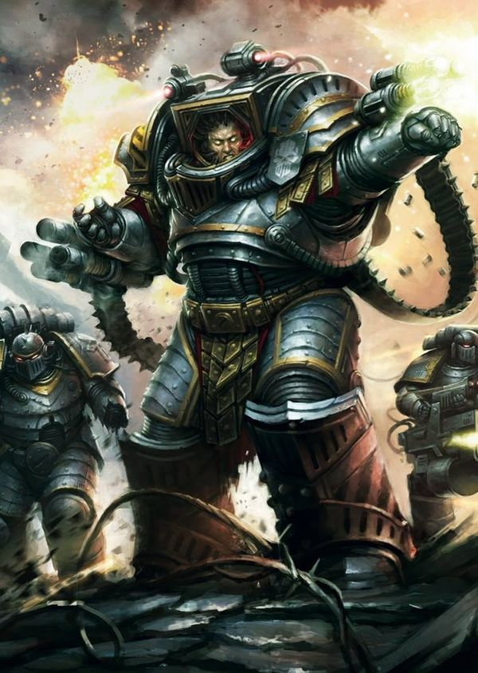
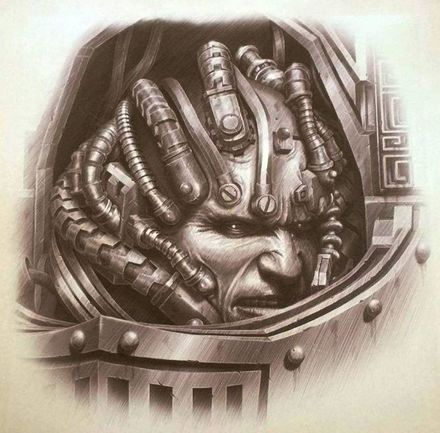
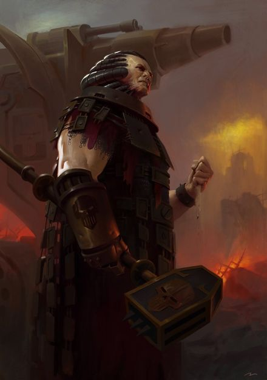
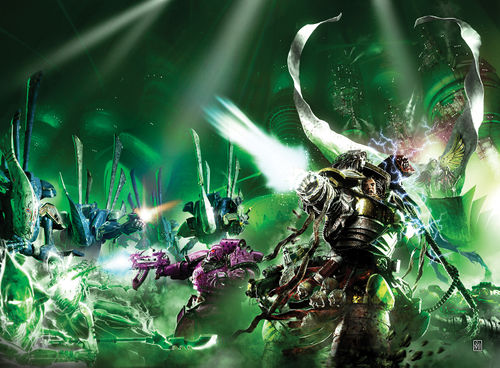
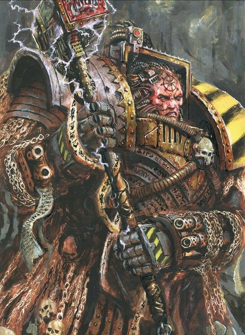
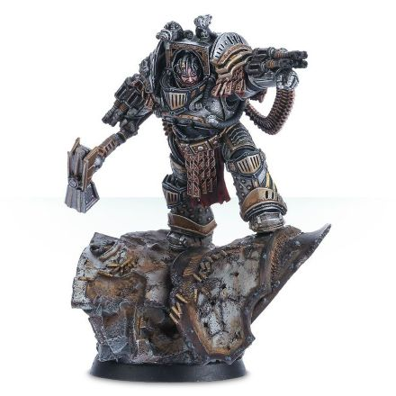
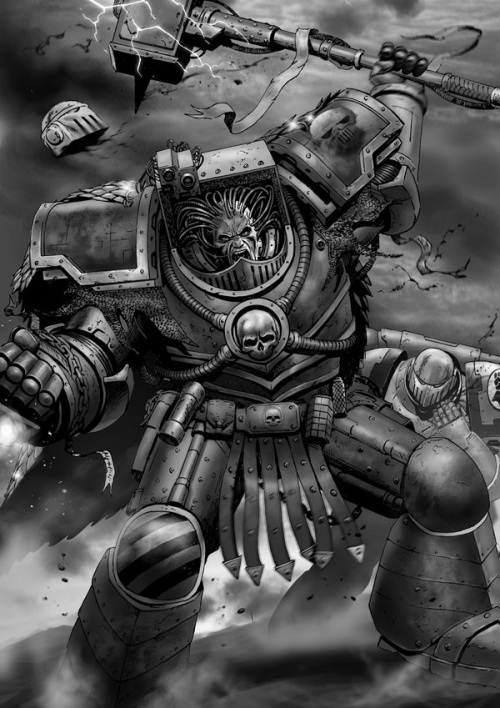

# 0642 佩图拉博 Perturabo

精校状态：中文行文已逐段精校，部分术语仍为暂定

分类：人类帝国 / 钢铁勇士

原文来源：https://www.bilibili.com/opus/1089686117042618369

原作者：帝国神选罐头

原文时间：2025年07月15日 11:38

[返回分类目录](目录.md) · [全书目录](../../目录.md)

<!-- A0642-B0001 -->
**英文原文**

“You don't know the things I dream. No one does, no one ever cared enough to find out."

<!-- /A0642-B0001 -->

<!-- A0642-B0002 -->

原译文

“你不知道我梦想的事情。没有人知道，也没有人足够关心去发现。”

**校订译文**

“你不知道我怀着怎样的梦想。没有人知道，也从来没有人真正关心到愿意了解。”

<!-- /A0642-B0002 -->

<!-- A0642-B0003 -->
**英文原文**

Perturabo is the Primarch of the Iron Warriors, one of the original twenty Space Marine Legions. Bitter and feeling marginalized by the Imperium, he sided with Horus during the Horus Heresy and has since ascended to Daemonhood. He, like his Iron Warriors, had a natural affinity towards technology and a cold logic, but lacked the strength of faith.

<!-- /A0642-B0003 -->

<!-- A0642-B0004 -->

原译文

佩图拉博是钢铁勇士的原体，钢铁勇士是最初的二十支星际战士之一。由于被帝国边缘化，他感到痛苦，在荷鲁斯叛乱期间站在荷鲁斯一边，此后升格为恶魔王子。他和他的钢铁勇士一样，对技术和冷酷的逻辑有着天生的亲和力，但缺乏信任的力量。

**校订译文**

佩图拉博是钢铁勇士的原体；钢铁勇士是最初二十支星际战士军团之一。他心怀怨恨，认为自己遭帝国边缘化，于是在荷鲁斯之乱中投向战帅，后来升为恶魔王子。他与子嗣一样，天生精通技术、崇尚冷峻的逻辑，却缺乏坚定的信仰。

**校注：** feeling marginalized 是佩图拉博的感受，不直接断言帝国客观上如何对待他；faith 是信仰，非一般信任。

<!-- /A0642-B0004 -->

<!-- A0642-B0005 图片 -->

<!-- A0642-B0006 -->

原译文

Perturabo, Primarch of the Iron Warriors 佩图拉博，钢铁勇士原体

**校订译文**

Perturabo, Primarch of the Iron Warriors 佩图拉博，钢铁勇士原体

<!-- /A0642-B0006 -->

<!-- A0642-B0007 -->
## History 历史

<!-- /A0642-B0007 -->

<!-- A0642-B0008 -->
### Youth 青年

<!-- /A0642-B0008 -->

<!-- A0642-B0009 -->
**英文原文**

According to Perturabo himself, he is estimated to have been born around 792.M30. When the primarchs were scattered to the ends of the galaxy, Perturabo landed on a planet named Olympia. For at least a year, he was alone in the rural regions of Olympia and became a famed wanderer that would slay legendary beasts. However, he was first discovered climbing the mountains below the city state of Lochos with no memory of anything prior. The guards, having realised this was no normal child, brought him before the Dammekos, the Tyrant of Lochos. Dammekos was intrigued by the child and brought him into his house and treated him as family. Dammekos noticed the boy's overwhelming intellect and skill with everything from architecture to the arts to political debate to combat, and he became a wonder with which Lochos secured alliances with other city-states. The young Perturabo, though he knew he was not of this world and was made by design as opposed to nature, was disgusted by the religious Olympians and believed in the cold logic of science and reason.

<!-- /A0642-B0009 -->

<!-- A0642-B0010 -->

原译文

根据佩图拉博本人的说法，他预计出生于792.M30左右。当原体分散到银河系的尽头时，佩图拉博降落在一颗名为奥林匹亚的行星上。在至少一年的时间里，他独自一人在奥林匹亚的农村地区，成为了一名著名的流浪者，会杀死传说中的野兽。然而，他第一次被发现是在洛科斯城下的山上攀爬，对之前的任何事情都没有记忆。卫兵们意识到这不是一个正常的孩子，把他带到了洛科斯暴君达美克斯面前。达美克斯对这个孩子很感兴趣，把他带进了家，把他当作家人对待。达美克斯注意到这个男孩在从建筑到艺术到政治辩论再到战斗的各个方面都有着压倒性的智慧和技能，他成为了洛科斯与其他城邦结盟的奇迹。年轻的佩图拉博虽然知道自己不属于这个世界，是由设计而非自然创造的，但他对奥林匹亚人的宗教感到厌恶，并相信科学和理性的冷酷逻辑。

**校订译文**

据佩图拉博本人估计，他约生于 792.M30。原体被散往银河各地时，他落在奥林匹亚，至少有一年独自游荡于荒野，以斩杀传说中的猛兽而闻名。但在记载中，他首次被发现时，正攀爬洛科斯城邦下方的山壁，对此前经历全无记忆。卫兵看出他不是普通孩子，便将其带到洛科斯暴君达美克斯面前。统治者对他深感兴趣，收进家中，以亲子相待。他在建筑、艺术、政治辩论乃至战斗上的惊人天赋，很快成为洛科斯争取其他城邦结盟的资本。佩图拉博知道自己并非来自本地，也不是自然诞生，而是人工设计的产物；尽管如此，他仍鄙视奥林匹亚人的宗教，只相信科学与理性的冷峻逻辑。

**校注：** 出生年为本人估计；英文先说曾漫游一年，后说首次被发现时不记得此前，保留其记忆空白与记录差别。Lochos 与后段 Lochus 为同一城邦异写。

<!-- /A0642-B0010 -->

<!-- A0642-B0011 图片 -->

<!-- A0642-B0012 -->

原译文

Perturabo 佩图拉博

**校订译文**

Perturabo 佩图拉博

<!-- /A0642-B0012 -->

<!-- A0642-B0013 -->
**英文原文**

Supposedly, Perturabo never trusted the Olympians and refused to return any affection given by Dammekos. Dammekos spent plenty of time with his new son, but never got anything in return. Perturabo shunned his siblings Herakon and Andos and only enjoyed the company of his foster sister Calliphone. Many saw Perturabo as a cold and brooding child but when considered that he had been thrown onto a world with no idea of his origins or purpose, this is perhaps a little harsh. Nonetheless Perturabo took the name not of venerated Olympian heroes as was expected of nobility but rather an ancient title for those with prodigious ability. Perturabo waged wars against rivals for his adopted father, and due to the many warring city-states of Olympia gathered enormous experience in siege warfare. Overseeing the construction of many siege engines once thought technologically impossible on the planet, Perturabo soon scored victory after victory and became known as a merciless bloody-handed warlord. Throughout his life Perturabo was haunted by visions and feelings of a Great Maelstrom, though he told none of it as he feared it would be seen as a sign of weakness.

<!-- /A0642-B0013 -->

<!-- A0642-B0014 -->

原译文

据说，佩图拉博从不信任奥林匹亚人，并拒绝回报达美克斯给予的任何感情。达美克斯花了很多时间陪伴他的新儿子，但从未得到任何回报。佩图拉博避开了他的兄弟赫拉孔和安多斯，只喜欢他的养姐卡莉芬的陪伴。许多人认为佩图拉博是一个冷酷而沉思的孩子，但考虑到他被抛到了一个不知道自己起源或目的的世界，这可能有点苛刻。尽管如此，佩图拉博的名字并不像贵族所期望的那样是受人尊敬的奥林匹亚英雄，而是那些能力非凡的人的古老头衔。佩图拉博为他的养父发动了与对手的战争，由于许多奥林匹亚城邦的交战，他在围城战中积累了丰富的经验。佩图拉博监督了许多曾经被认为在行星上技术上不可能的攻城引擎的建造，很快取得了一场又一场的胜利，并被称为无情的血腥军阀。佩图拉博一生都被大漩涡的幻觉和感知所困扰，尽管他没有告诉任何人，因为他担心这会被视为软弱的表现。

**校订译文**

据说佩图拉博从不信任奥林匹亚人，也不肯回应达美克斯的亲情。养父花许多时间陪伴他，却得不到情感上的回报。他疏远赫拉孔、安多斯两位兄弟，只愿与养姐卡莉芬相处。许多人认为他冷漠阴郁；但一个不知自己从何而来、为何而生的孩子被抛到陌生世界，受到这样的评价，或许过于苛刻。贵族通常以受尊崇的奥林匹亚英雄命名，他却选择了一个古老称号，意指天赋超凡者。他替养父征战四方，在城邦林立、战乱不休的奥林匹亚积累了丰富攻城经验，还督造出许多曾被认为超出当地技术能力的攻城机械。接连胜利让他获得无情、双手染血的军阀之名。一生之中，“大漩涡”的幻象与感知始终纠缠着他，但他怕被视为软弱，从不向人倾诉。

<!-- /A0642-B0014 -->

<!-- A0642-B0015 图片 -->

<!-- A0642-B0016 -->

原译文

Perturabo 佩图拉博

**校订译文**

Perturabo 佩图拉博

<!-- /A0642-B0016 -->

<!-- A0642-B0017 -->
**英文原文**

When the Emperor arrived Perturabo immediately submitted himself to the Emperor's mercy and ousted the Tyrant of Lochus. Dammekos is said to have spent his remaining few years gathering forces to attempt to retake his power. He failed but created a current of unrest which would be used later. Perturabo spent much time with his brother Magnus on Terra in his early days in the fledgling Imperium, attempting to discover the many secrets of mankind's past and became particularly interested in the works of famous inventors. It became said that of all the Emperor's sons, Perturabo had the most raw scientific and technological knowledge.

<!-- /A0642-B0017 -->

<!-- A0642-B0018 -->

原译文

当帝皇到达时，佩图拉博立即屈服于帝皇的怜悯，驱逐了洛科斯暴君。据说达美克斯在剩下的几年里一直在集结部队，试图夺回权力。他失败了，但制造了一股后来被利用的动荡。佩图拉博在初创帝国的早期与他的兄弟马格努斯在泰拉上度过了很多时间，试图发现人类过去的许多秘密，并对著名发明家的作品特别感兴趣。据说，在帝皇的所有子嗣中，佩图拉博拥有最原始的科学技术知识。

**校订译文**

帝皇到来时，佩图拉博立刻俯首归顺，并推翻洛科斯暴君。据说达美克斯余下数年一直招兵买马，企图复位；虽未成功，却埋下了后来被人利用的动乱伏笔。加入新生帝国之初，佩图拉博常在泰拉与马格努斯相处，共同探索人类往昔的秘密。他尤其着迷于著名发明家的成果。人们甚至说，帝皇诸子之中，以他所拥有的基础科学与技术知识最为渊博。

**校注：** raw scientific and technological knowledge 指基础、本有的科学技术知识，不是原始落后的知识。

<!-- /A0642-B0018 -->

<!-- A0642-B0019 -->
**英文原文**

Upon taking command of his Legion, Perturabo reviewed the war record of his new forces. After heavily analyzing their record, effectiveness, doctrines, and practices, Perturabo found them wanting. His punishment was decimation. By lottery, one in every ten Legionaries was chosen to be beaten to death by his comrades. Such would be Perturabo's reign: brutal and unforgiving. Perturabo went on to lead his new Iron Warriors on a lightning crusade against the planet of Justice Rock and its heretical Black Judges.

<!-- /A0642-B0019 -->

<!-- A0642-B0020 -->

原译文

在接管他的军团后，佩图拉博回顾了他的新部队的战争记录。在仔细分析了他们的记录、有效性、教义和实践后，佩图拉博发现他们存在不足。他的惩罚是毁灭性的。通过抽签，每十名军团士兵中就有一人被他的战友杀死。这将是佩图拉博的统治：残酷无情。佩图拉博继续领导他的新钢铁勇士对义岩星及其异端黑色法官进行闪电般的讨伐。

**校订译文**

接掌军团后，佩图拉博详查战绩、作战效能、战术原则与日常惯例，认为部队不合要求，便以十一抽杀律惩戒：每十名战士中抽出一人，由同袍活活打死。他此后的统治也一贯如此残酷无情。随后，他率新接掌的钢铁勇士闪击义岩星，征讨当地异端黑色法官。

**校注：** decimation 在此是具体的十一抽杀律，非泛指毁灭性惩罚；beaten to death 明确由同袍殴打致死。

<!-- /A0642-B0020 -->

<!-- A0642-B0021 -->
### Great Crusade 大远征

<!-- /A0642-B0021 -->

<!-- A0642-B0022 -->
**英文原文**

Perturabo established himself as efficient and highly capable, but also brutal, bitter, and envious. It is widely acclaimed that Perturabo was envious of Rogal Dorn. He was annoyed by his constant reminders of the perfection of the defences on Terra. The other primarchs also kept Perturabo at a distance. This might have been because of his supreme command of technology, far in advance of anything the other primarchs could do. He is referred to as the 'comrade' who devised the best plan to avoid the defences of Overdogg Mashogg, an Ork Warboss under attack by Leman Russ, leader of the Space Wolves, and Jaghatai Khan, Khan of the White Scars.

<!-- /A0642-B0022 -->

<!-- A0642-B0023 -->

原译文

佩图拉博建立了自己的高效和高超能力，但也有残酷，苦涩和嫉妒。佩图拉博嫉妒罗格·多恩，这一点广为所知。他对他不断提醒泰拉防御的完美感到恼火。其他的原体也与佩图拉博保持着一定的距离。这可能是因为他对技术的最高指挥，远远领先于其他原体所能做的任何事情。他被称为“战友”，他设计了最好的计划来避开巨犬·玛硕格的防御，巨犬是一名受到太空野狼原体黎曼·鲁斯和白色疤痕可汗察合台可汗攻击的欧克战争头目。

**校订译文**

佩图拉博证明自己高效而能干，却也残忍、怨毒、善妒。普遍认为，他嫉妒罗格·多恩，尤其受不了对方反复夸耀泰拉防御完美无缺。其他原体也与他保持距离，这或许是因为他驾驭技术的本领远超兄弟。在太空野狼的黎曼·鲁斯与白疤的察合台可汗进攻欧克战争头目巨犬·玛硕格时，记录中有一位“战友”提出绕过敌方防线的最佳方案；此人所指便是佩图拉博。

<!-- /A0642-B0023 -->

<!-- A0642-B0024 -->
**英文原文**

The Iron Warriors went on to create citadels throughout the regions they fought in. Small numbers of Iron Warriors were left behind at these outposts, but Perturabo resented being forced to split his army. As time went on they were stereotyped as being the best army for sieges and garrisons, but eventually the Iron Warriors were so worn out that they simply began to enjoy the killing they had to do after the trenches were dug. A particularly vicious campaign was against the Hrud in the Sak'trada Deeps, a region that Perturabo saw as strategically useless. Nonetheless, he dutifully oversaw the purging of the Hrud despite his legion's heavy casualties, as it was ordered by the War Council. At the climax of the campaign, as his fleet lay devastated by a Hrud temporal shockwave, Perturabo could only blame the Emperor's vanity for the damage done to his sons on this useless campaign. It might well have been Horus who kept the legion on this role, allowing him to more easily sway the mind of Perturabo towards Chaos.

<!-- /A0642-B0024 -->

<!-- A0642-B0025 -->

原译文

钢铁勇士继续在他们战斗的地区建造城堡。少数钢铁勇士被留在这些前哨，但佩图拉博对被迫分裂军队感到不满。随着时间的推移，他们被定型为围攻和驻军的最佳军队，但最终钢铁勇士疲惫不堪，他们只是开始享受战壕挖掘后必须进行的杀戮。一场特别恶毒的战役是在萨卡拉达深渊对赫鲁德人发起的，佩图拉博认为该地区在战略上毫无用处。尽管如此，尽管他的军团伤亡惨重，他还是尽职尽责地监督了战争议会下令对赫鲁德的清洗。在战役的高潮，当他的舰队被赫鲁德的时间冲击波摧毁时，佩图拉博只能将这场无用的战役对他的子嗣们造成的伤害归咎于帝皇的虚荣心。很可能是荷鲁斯让军团继续扮演这个角色，让他更容易地将佩图拉博的思想推向混沌。

**校订译文**

钢铁勇士在征战地区遍建堡垒，每处留下少量战士驻守。佩图拉博不满自己的军队被不断拆散，但人们渐渐只把他们看作最适合攻城与守备的军团。长年消耗之下，战士身心俱疲，最终似乎只剩挖好战壕后展开杀戮还能带来满足。萨克特拉达深渊的赫鲁德战役尤其惨烈；佩图拉博认为该地区毫无战略价值，却仍因战争议会下令而忠实执行清剿，任由军团付出惨重伤亡。赫鲁德的时间冲击波重创舰队后，他把这场无益战役对子嗣造成的损害，全归咎于帝皇的虚荣。源文推测，也许正是荷鲁斯刻意让军团不断承担此类任务，以便将佩图拉博引向混沌。

<!-- /A0642-B0025 -->

<!-- A0642-B0026 -->
## Horus Heresy 荷鲁斯之乱

原题：Horus Heresy 荷鲁斯叛乱

<!-- /A0642-B0026 -->

<!-- A0642-B0027 -->
### Rebellion 反叛

<!-- /A0642-B0027 -->

<!-- A0642-B0028 -->
**英文原文**

Shortly after the Sak'trada Deeps Campaign Perturabo learned that his homeworld, Olympia, was in rebellion. Dammekos was dead and in his absence the politicking and bickering of the city-states had resumed. Perturabo demanded the Olympians themselves enact decimation, killing one in every ten of their own or face extermination and enslavement. Many refused, and Perturabo purged Olympia city by city, overrunning the fortresses he had built and sparing no one. Iron Warriors that refused to take part in the genocide suffered the same fate. By the time the massacre was over, five million Olympians had been killed and the rest put into slavery. While storming Lochos' palace, Perturabo came across his old foster sister Calliphone and strangled her to death after a furious argument where she blamed the Primarch for what had befallen their world. As Olympia died, Perturabo looked on in cold silence. After the pyres were burning, the Iron Warriors realized what they had done. They were no more the saviours of the Imperium - they had been destroying the Hrud one moment and the next they were committing genocide on their own. Perturabo realized the Emperor could never forgive him for what he had done. Horus, on the other hand, commended Perturabo for his decisive action and the Lord of Iron swore an oath of loyalty to the Warmaster. After the Dropsite Massacre, Horus would present Perturabo with a hammer named Forgebreaker, the gift symbolic of a signing of a pact between them.

<!-- /A0642-B0028 -->

<!-- A0642-B0029 -->

原译文

在萨卡拉达深渊战役后不久，佩图拉博得知他的家乡奥林匹亚正在叛乱。达美科斯已经去世，在他缺席的情况下，城邦的政治活动和争吵又重新开始了。佩图拉博要求奥林匹亚人自己实施屠杀，杀死他们自己的十分之一，否则将面临灭绝和奴役。许多人拒绝了，佩图拉博一个城市一个城市地清洗奥林匹亚，占领了他建造的堡垒，不放过任何人。拒绝参与种族灭绝的钢铁勇士也遭遇了同样的命运。到大屠杀结束时，已有500万奥林匹亚被杀，其余人沦为奴隶。在突袭洛科斯的宫殿时，佩图拉博遇到了他的旧养姐卡莉芬，并在一场激烈的争吵后将她勒死，她指责原体给他们的世界带来了灾难。奥林匹亚死去时，佩图拉博冷冷地看着。火葬后，钢铁勇士意识到他们所做的一切。他们不再是帝国的救世主 — 他们前一刻还在摧毁赫鲁德王朝，下一刻又在独自实施种族灭绝。佩图拉博意识到帝皇永远不会原谅他的所作所为。另一方面，荷鲁斯赞扬了佩图拉博的果断行动，钢铁之主宣誓效忠战帅。在登陆点大屠杀之后，荷鲁斯将向佩图拉博赠送了一把名为破炉者的锤子，象征着他们之间签署了一项协议。

**校订译文**

萨克特拉达深渊战役后不久，佩图拉博得知奥林匹亚叛乱。达美克斯已死，各城邦又陷入勾心斗角与争斗。原体要求当地人自行执行十一抽杀律，杀死十分之一人口，否则就将面临灭绝与奴役。许多人拒绝，他便逐城清洗，攻破亲手建造的堡垒，不留活口；拒绝参与屠杀的钢铁勇士同样遭到处决。最终，五百万奥林匹亚人死去，余者沦为奴隶。攻入洛科斯宫殿时，佩图拉博遇到养姐卡莉芬；她责备他毁掉母星，激烈争执后，他将她活活勒死。原体冷眼看着奥林匹亚走向毁灭，直到焚尸柴堆燃起，钢铁勇士才意识到自己做了什么：刚才还在歼灭赫鲁德，如今却对自己的人民实施灭绝，他们已经不是帝国的拯救者。佩图拉博相信帝皇绝不会原谅自己，荷鲁斯却赞扬他果断处置。钢铁之主于是宣誓效忠战帅。登陆点大屠杀后，荷鲁斯将破炉者战锤赠给他，象征二人缔结盟约。

**校注：** on their own 指对自己人实施屠杀，非“独自实施”；英文无赫鲁德王朝，删去原译擅加组织类别。

<!-- /A0642-B0029 -->

<!-- A0642-B0030 -->
**英文原文**

It was in that time that disturbing news of the Horus Heresy and new orders came from Terra. Leman Russ and the Space Wolves had attacked Magnus and his Thousand Sons on Prospero. Horus had turned renegade with his legion the Sons of Horus besides some other legions. The whole of the Imperium was on the brink of a civil-war. The new orders were to join with six other legions and then to face Horus and his forces on Isstvan V. The result of the following battle was that the Iron Warriors, Night Lords, Word Bearers and Alpha Legion all joined Horus and almost completely destroyed the three remaining loyal legions on the Drop Site Massacre. After that the Iron Warriors were let loose and Perturabo relished the opportunity to fight in a way that did not rely on massive sieges and trench warfare. Because of their massive deployment throughout the galaxy, dozens of Warsmiths took over planets and demanded tithes to support the heresy.

<!-- /A0642-B0030 -->

<!-- A0642-B0031 -->

原译文

就在那个时候，来自泰拉的关于荷鲁斯叛乱和新命令的令人不安的消息传来。黎曼·罗斯和太空野狼在普罗斯佩罗袭击了马格努斯和他的千子。荷鲁斯已经背叛了他的军团 — 荷鲁斯之子军团，以及其他一些军团。整个帝国都处于内战的边缘。新的命令是与其他六个军团会合，然后在伊斯塔万五号面对荷鲁斯和他的部队。接下来的战斗的结果是，钢铁勇士、午夜领主、怀言者和阿尔法军团都加入了荷鲁斯，并在登录点大屠杀中几乎完全摧毁了剩下的三个忠诚军团。在那之后，钢铁勇士被解放，佩图拉博享受着以一种不依赖大规模围攻和堑壕战的方式作战的机会。由于他们在整个银河系的大规模部署，数十个战舰占领了行星，并要求什一税来支持叛乱。

**校订译文**

正是在这段时期，泰拉传来叛乱的噩耗与新命令：黎曼·鲁斯率太空野狼进攻普罗斯佩罗的马格努斯与千子；荷鲁斯也已带着荷鲁斯之子及其他数个军团反叛。帝国濒临全面内战。钢铁勇士奉命与另外六个军团会合，前往伊斯塔万五号讨伐荷鲁斯。然而，钢铁勇士、午夜领主、怀言者与阿尔法军团在战场倒戈，协助荷鲁斯几乎歼灭另三个忠诚军团，造成登陆点大屠杀。此后，钢铁勇士得以放手进攻，佩图拉博终于能摆脱大规模围攻与堑壕战的束缚，并乐在其中。军团原本在银河各地广泛驻防，数十名战争铁匠遂夺取行星、征收什一税，供养叛乱。

**校注：** 荷鲁斯是带领自己的军团反叛，非背叛自己的军团。Warsmiths 是战争铁匠，非战舰。

<!-- /A0642-B0031 -->

<!-- A0642-B0032 -->
### Iydris 伊德瑞斯

<!-- /A0642-B0032 -->

<!-- A0642-B0033 -->
**英文原文**

After the First Siege of Hydra Cordatus Perturabo was approached by Fulgrim, Primarch of the Emperor's Children, who promised the Lord of Iron near unlimited power. The two embarked on a quest to tip the balance of the rebellion in Horus' favor by journeying into the Eye of Terror and retrieve a weapon known as the Angel Exterminatus. After a brief boarding action with the Sisypheum (which Perturabo allowed to escape due to his disgust of Fulgrim's Legion), the duo arrived in the Eye and quickly landed on the Crone World of Iydris. Entering an ancient Eldar citadel known as the Amon ny'shak Kaelis, the Emperor's Children and Iron Warriors had to contend with an army of Wraithguard and Wraithlords that had awoken from their slumber. At the height of the vicious battle Fulgrim attempted to betray his brother and slip away, but was pursued by Perturabo. Both soon arrived in a massive spherical chamber, and Fulgrim revealed to his brother that there was no Angel Exterminatus, but he rather was destined to become such a weapon on this world. Furious, Perturabo attempted to attack Fulgrim but was drained of his power when Fulgrim activated the Maugetar stone that Perturabo had previously received under the guise of a gift. Now with the Iron Warriors Primarchs' power in hand, Fulgrim revealed the purpose of his plan: to achieve Apotheosis, better known as Daemonhood.

<!-- /A0642-B0033 -->

<!-- A0642-B0034 -->

原译文

佩图拉博在第一次海德拉之心围城之后，帝皇之子的原体福格瑞姆靠近了他，他向钢铁之主承诺了近乎无限的权力。两人开始寻求通过进入恐惧之眼并取回一种名为“灭绝天使”的武器来打破叛乱的平衡，使之对荷鲁斯有利。在与西西弗姆号（佩图拉博因厌恶福格瑞姆的军团而允许其逃脱）进行了短暂的跳帮行动后，两人抵达了恐惧之眼，并迅速降落在伊德瑞斯老妪世界上。进入一座名为阿蒙·尼’沙克·凯利斯的古老灵族城堡后，帝皇之子和钢铁勇士不得不与一支从沉睡中醒来的幽冥卫士和幽冥领主的军队作战。在激烈的战斗中，福格瑞姆试图背叛他的兄弟并逃跑，但被佩图拉博追捕。两人很快就进入了一个巨大的球形房间，福格瑞姆向他的兄弟透露，没有灭绝天使，但他注定要成为这个世界上的武器。佩图拉博非常愤怒，试图攻击福格瑞姆，但当福格瑞姆激活佩图拉博之前以礼物的名义收到的莫甘塔尔之石时，他的力量被耗尽了。现在有了钢铁勇士原体的力量，福格瑞姆透露了他的计划的目的：实现神化，更为人所知的是恶魔王子。

**校订译文**

第一次海德拉之心围城后，福格瑞姆找上佩图拉博，许诺近乎无穷的力量。二人计划深入恐惧之眼，取出“灭绝天使”，为荷鲁斯扭转战局。他们与西西弗姆号短暂交锋；佩图拉博因厌恶帝皇之子的行径，放任敌舰脱逃。随后，两位原体抵达老妪世界伊德瑞斯，进入古老灵族堡垒阿蒙·尼沙克·卡利斯，与苏醒的幽冥护卫及幽冥领主交战。战况最烈时，福格瑞姆背叛兄弟，试图独自脱身，佩图拉博却一路追到巨大的球形厅室。福格瑞姆揭露，根本没有现成的灭绝天使；他自己将成为这件武器。佩图拉博怒而出手，却被启动的莫甘塔尔之石抽取力量——那正是福格瑞姆先前伪装成礼物送给他的物件。凭借夺来的原体力量，福格瑞姆准备完成真正计划：升为恶魔王子。

<!-- /A0642-B0034 -->

<!-- A0642-B0035 图片 -->

<!-- A0642-B0036 -->

原译文

Perturabo and his brother Fulgrim, after their fall to Chaos, battle Eldar Revenants 佩图拉博和他的兄弟福格瑞姆在堕入混沌后，与灵族亡魂作战

**校订译文**

Perturabo and his brother Fulgrim, after their fall to Chaos, battle Eldar Revenants 佩图拉博和他的兄弟福格瑞姆在堕入混沌后，与灵族亡魂作战

<!-- /A0642-B0036 -->

<!-- A0642-B0037 -->
**英文原文**

However just as Fulgrim was about to complete his ritual and achieve Daemonhood, Perturabo gathered enough strength to charge at his brother but were interrupted by an ambush of Salamanders, Iron Hands, and Raven Guard who had been stalking the traitor fleet in search of vengeance since the Drop Site Massacre. One of the loyalist Astartes during the battle shattered the Maugetar stone, freeing some of Perturabo's energy and giving him the ability to strike down Fulgrim with his Thunder Hammer. However Perturabo only managed to destroy the Primarchs mortal skin and was reborn as a Daemon Prince. Now a massive but elegant serpentine creature, Fulgrim told his brother that they would meet again then vanished in a burst of Warp energy along with his Emperor's Children. Exhausted and betrayed by his brother he knew had now lost any trace of honor, Perturabo allowed the loyalist Astartes to withdraw and led his own forces off the Crone World. Looking to settle the score with Fulgrim and better understand the cosmic power he had witnessed, Perturabo ordered his fleet sail deep into the Eye of Terror.

<!-- /A0642-B0037 -->

<!-- A0642-B0038 -->

原译文

然而，就在福格瑞姆即将完成他的仪式并成为恶魔王子时，佩图拉博聚集了足够的力量向他的兄弟冲锋，但被火蜥蜴、钢铁之手和暗鸦守卫的伏击打断了，他们自登陆点大屠杀以来一直在跟踪叛徒舰队寻求复仇。在战斗中，一位忠诚的阿斯塔特打碎了莫甘塔尔之石，释放了佩图拉博的一些能量，使他能够用雷霆锤击倒福格瑞姆。然而，佩图拉博只设法摧毁了原体的凡人之躯，并重生为恶魔王子。现在，福格瑞姆是一个巨大但优雅的蛇形生物，他告诉他的兄弟，他们会再次见面，然后和他的帝皇之子一起消失在一股亚空间能量中。疲惫和背叛了他的兄弟，他知道现在已经失去了任何荣誉的痕迹，佩图拉博允许忠诚派阿斯塔特撤退，并带领自己的部队离开了老妪世界。为了与福格瑞姆算账，更好地了解他所目睹的宇宙之力，佩图拉博命令他的舰队深入恐惧之眼。

**校订译文**

福格瑞姆即将完成升魔仪式时，佩图拉博积蓄力量扑向他，却被突然杀出的火蜥蜴、钢铁之手与暗鸦守卫打断。这些忠诚者从登陆点大屠杀起便追踪叛军，寻求复仇。战斗中，一名阿斯塔特击碎莫甘塔尔之石，使佩图拉博取回部分力量，得以挥锤击倒兄弟。然而，战锤只毁掉福格瑞姆的凡躯，他随即化为巨大而优雅的蛇形恶魔王子，说了句“我们还会再见”，便与帝皇之子一同消失在亚空间能量中。佩图拉博疲惫不堪，明白背叛自己的兄弟已丧尽荣誉，遂放忠诚者撤走，再率所部离开老妪世界。为向福格瑞姆复仇，也为理解亲眼所见的超凡力量，他命舰队深入恐惧之眼。

**校注：** 与640篇同一段英文的主语衔接问题：重生为蛇形恶魔者是福格瑞姆，非佩图拉博；背叛者也是福格瑞姆。

<!-- /A0642-B0038 -->

<!-- A0642-B0039 -->
### The Black Oculus 黑暗之眼

原题：The Black Oculus 黑色之眼

<!-- /A0642-B0039 -->

<!-- A0642-B0040 -->
**英文原文**

Perturabo and the Iron Warriors next found themselves trapped by the singularity in the heart of the Eye of Terror. Perturabo gambles in his attempt to escape, diving straight into the Black Hole at its heart. Perhaps by sheer blind luck, they were transported far across the warp to the Tallarn System. Once arriving at Tallarn, Perturabo was made aware of the Black Oculus hidden beneath the planet, and he immediately drew up plans to invade. Eventually the Iron Warriors' search for the Black Oculus was exposed, and they are forced to withdraw from the planet.

<!-- /A0642-B0040 -->

<!-- A0642-B0041 -->

原译文

接下来，佩图拉博和钢铁勇士发现自己被恐惧之眼中心的奇点所困。佩图拉博冒险试图逃离，直接潜入黑洞的中心。也许纯粹是因为运气不好，他们被运送到了遥远的亚空间，到达了塔兰星系。抵达塔兰后，佩图拉博意识到隐藏在行星下面的黑色之眼，他立即制定了入侵计划。 最终，钢铁勇士对黑色之眼的搜寻被曝光，他们被迫退出这个行星。

**校订译文**

钢铁勇士随后被困在恐惧之眼中心的奇点附近。佩图拉博孤注一掷，径直驶入中央黑洞，试图脱身。也许只是侥幸，他们竟穿越遥远的亚空间，抵达塔兰星系。得知行星深处藏有黑暗之眼后，他立即筹划入侵。但钢铁勇士寻找这件秘密事物的行动终被揭露，最终被迫撤离。

**校注：** blind luck 指纯粹侥幸、碰巧走运，原译运气不好正相反。

<!-- /A0642-B0041 -->

<!-- A0642-B0042 图片 -->

<!-- A0642-B0043 -->

原译文

Perturabo - Iron Warriors Primarch, during the Horus Heresy 佩图拉博 - 钢铁勇士原体，荷鲁斯叛乱期间

**校订译文**

Perturabo - Iron Warriors Primarch, during the Horus Heresy 佩图拉博 - 钢铁勇士原体，荷鲁斯之乱期间

<!-- /A0642-B0043 -->

<!-- A0642-B0044 -->
**英文原文**

Following Tallarn, the Iron Warriors were ordered by Horus to man a defensive line of worlds in order to hold off the Ultramarines, which with the death of the Ruinstorm were advancing towards the traitors rear. Perturabo dutifully oversaw these vicious, bitter sieges. Overstretched and under-equipped, the Iron Warriors once again bled for worlds far from the center of the war without thanks. Perturabo by this point had grown weary and darker, both from the effects of Fulgrim's treachery and the corrupting effects of the Black Oculus. Perturabo's war on Krade was interrupted by Argonis, who brought orders from Horus to find Angron and bring both of their Legions for the muster at Ullanor in preparation for the drive on Terra. Despite having to abandon much of his forces as well as worlds he had fought so bitterly for, Perturabo obeyed the Warmaster and journeyed to Sarum with a small fleet in search of information of Angron's whereabouts. On Sarum, the Daemon Sa'ra'am revealed that Angron was on Deluge before possessing the body of Volk, creating the first Obliterator. Perturabo then traveled to Deluge, where he confronted the vicious and corrupted Daemon Primarch Angron. Perturabo and Angron engaged in a brutal battle, with the Daemon having the clear edge in power and speed. However despite taking many wounds Perturabo endured and goaded Angron, declaring that he was born a slave and now was a slave to Darkness for all eternity. By using the Iron Warriors, Iron Circle, and Volk to out-maneuver and bombard the World Eaters, Angron was bested as an Ultramarines fleet appeared in orbit over Deluge. Angron laughed and declared that they were all now going to die, but Perturabo reminded the Daemon Primarch that he had seen his warriors butchered while he had done nothing once before. This moved Angron enough to act, and after creating a Warp Storm the Iron Warriors and World Eaters fleets were able to escape the Ultramarines and move to Ullanor, where they accompanied Horus for the muster.

<!-- /A0642-B0044 -->

<!-- A0642-B0045 -->

原译文

在塔兰之后，荷鲁斯命令钢铁勇士守卫一条世界防线，以击退极限战士，随着毁灭风暴的消散，他们正朝叛徒后方前进。佩图拉博尽职尽责地监督了这些恶毒、痛苦的围攻。由于过度扩张和装备不足，钢铁勇士再次为远离战争中心的世界流血，没有得到任何感谢。此时，由于福格瑞姆的背叛和黑色之眼的腐化作用，佩图拉博已经变得疲惫和黑暗。佩图拉博对卡拉德的战争被安格隆打断，从荷鲁斯那里接到命令，找到安格隆，并将他们的两个军团带到乌兰诺集合，为在泰拉的进攻做准备。尽管不得不放弃他的大部分部队以及他为之苦苦战斗的世界，但佩图拉博还是听从了战帅的命令，率领一支小舰队前往萨鲁姆，寻找安格隆的下落。在萨鲁姆，恶魔萨拉姆透露，安格隆在占据沃克的尸体之前就在洪水星上，创造了第一个泯灭者。随后，佩图拉博前往洪水星，在那里他遇到了邪恶而腐败的恶魔原体安格隆。佩图拉博和安格隆进行了一场残酷的战斗，恶魔在力量和速度上具有明显的优势。然而，尽管受了很多伤，佩图拉博还是忍受并激怒了安革伦，宣称他生来就是奴隶，现在永远是黑暗之奴。通过使用钢铁勇士、铁环和沃克来超越机动并轰炸吞世者，当一支极限战士舰队出现在洪水星上空的轨道上时，安格隆被击败。安格隆笑着宣布他们现在都要死了，但佩图拉博提醒恶魔原体，他以前什么都没做，但他看到他的战士被屠杀了。这足以让安格隆采取行动，在制造了一场亚空间风暴后，钢铁勇士和吞世者舰队得以逃离极限战士，前往乌兰诺，在那里他们陪同荷鲁斯进行集结。

**校订译文**

塔兰战事后，荷鲁斯命钢铁勇士据守一连串世界，阻挡毁灭风暴消散后逼近叛军后方的极限战士。佩图拉博忠实主持这些惨烈围攻，部队却兵力分散、装备不足，再次在远离主战场的世界流血，仍得不到感谢。福格瑞姆背叛留下的创伤，加上黑暗之眼的腐蚀，使他越发疲倦阴郁。阿尔戈尼斯来到克拉德，带来荷鲁斯的新令：找到安格隆，带两支军团前往乌兰诺，为进军泰拉集结。尽管必须丢下大量部队与苦战夺来的世界，佩图拉博仍服从命令，率小舰队赴萨鲁姆打听消息。恶魔萨拉姆告诉他，安格隆在洪水星，随后附身于沃克，造出第一个泯灭者。佩图拉博赶到洪水星，与已被腐化的恶魔原体交锋。安格隆在力量、速度上明显占优，他却忍受伤势，不断挑衅，讥笑对方生来就是奴隶，如今又永远成了黑暗的奴仆。钢铁勇士、铁环与沃克凭机动和火力压制吞世者，终于使安格隆落败。此时，极限战士舰队进入轨道。安格隆大笑，说大家都要死了；佩图拉博却提醒他，从前就有一次，他眼看自己的战士被屠杀而无所作为。这终于使安格隆行动起来。他引发亚空间风暴，掩护两支军团摆脱极限战士，前往乌兰诺加入荷鲁斯的集结。

**校注：** 传令者 Argonis 阿尔戈尼斯，不是 Angron 安格隆。附身沃克、制造泯灭者的是恶魔萨拉姆，原译把安格隆的所在地点与附身主体混合。body 未写尸体，不断言沃克当时已死。

<!-- /A0642-B0045 -->

<!-- A0642-B0046 -->
### Terra 泰拉

<!-- /A0642-B0046 -->

<!-- A0642-B0047 -->
**英文原文**

Perturabo proved to be a pivotal and primary traitor commander during the Solar War. During the campaign to capture the Sol System, he oversaw the capture of both the Uranus and Jupiter defensive spheres from the Imperial Fists. During the early stages of the Siege of Terra, Perturabo was not allowed to lead the siege of the Imperial Palace but instead fortify the Sol System against Guilliman's expected arrival, something that embittered him greatly. Nonetheless, the Lord of Iron was able to review bombardment data and surmise a weakness in the Palace's Void Shield network. Horus later met with Perturabo personally aboard the Vengeful Spirit, where while still compelled to obey Horus he now saw the Warmaster as little more than a slave to the Ruinous Powers. Perturabo studied all Warp lore he saw aboard the damned flagship, pledging to master the Empyrean and achieve powers similar to that of a god. Horus attempted to appeal to Perturabo's pride, emphasizing how much he appreciated the Lord of Iron's contributions and how he was the only Primarch he could still trust. Perturabo was however still denied the coveted duty of besieging the Palace, instead being ordered to clear landing zones for the traitor Titans.

<!-- /A0642-B0047 -->

<!-- A0642-B0048 -->

原译文

事实证明，佩图拉博在太阳战争中是一位关键和主要的叛徒指挥官。在夺取太阳系的战役中，他监督了从帝国之拳手中夺取天王星和木星的防御界。在泰拉围城的早期阶段，佩图拉博不被允许领导对皇宫的围攻，而是加强太阳系，以抵御基里曼的预期到来，这让他非常痛苦。尽管如此，钢铁之主还是能够审查轰炸数据，并推测皇宫的虚空盾网络存在弱点。荷鲁斯后来在复仇之魂号上亲自会见了佩图拉博，在那里，虽然他仍然被迫服从荷鲁斯，但他现在认为战帅只不过是毁灭力量的奴隶。佩图拉博研究了他在这艘被诅咒的旗舰上看到的所有亚空间传说，承诺掌握至高天并获得类似于神的力量。荷鲁斯试图唤起佩图拉博的骄傲，强调他非常感激钢铁之主的贡献，以及他是唯一一位他仍然可以信任的原体。然而，佩图拉博仍然被剥夺了围攻皇宫的令人垂涎的职责，而是被命令为叛徒的泰坦清理登陆区。

**校订译文**

太阳战争中，佩图拉博是叛军最重要的统帅之一，指挥夺取帝国之拳的天王星、木星防御圈。围城初期，他却未能接掌皇宫攻坚，而是被派去加固太阳系，防备预期中的基里曼援军，心中因此怨恨不已。他仍分析轰炸数据，推断出皇宫虚空盾网络的弱点。后来，荷鲁斯在复仇之魂号召见他。佩图拉博虽仍服从战帅，却已看出荷鲁斯不过是毁灭诸神的奴仆。他研究旗舰上接触到的一切亚空间知识，决心掌握至高天，取得近神之力。荷鲁斯则恭维他的功绩，强调他是自己唯一仍可信任的原体。然而，佩图拉博依旧没能获得渴求的皇宫围攻指挥权，而是奉命为叛军泰坦清理着陆场。

<!-- /A0642-B0048 -->

<!-- A0642-B0049 -->
**英文原文**

After weeks of fighting, the traitor war effort stalled in the face of the walls of the Palace and the Daemon Primarchs proved aloof and unreliable. Horus thus relied on Perturabo to conduct the main offensive push into the Lion's Gate Spaceport. Hoping to overcome Dorn's traps with bluntness, Perturabo put Kroeger in charge of the ground offensive while inserting Forrix and a unit of Iron Warriors behind enemy lines to seize key bridges into the Spaceport. However the attack stalled in the face of the Emperor's psychic shield of the Palace, forcing Perturabo to rely on the Immaterium by having Zardu Layak and Typhus summon Cor'bax Utterblight to subvert the Imperial Palace's population. During the main assault on the Lion's Gate Spaceport, Perturabo revealed that Forrix and his men had been sacrificed as a ruse in order to draw away Imperial Fists defenses in order to allow the Iron Blood to dock with the Spaceport's main spire. As Perturabo set down, Rogal Dorn met him on the field of battle. However Perturabo refused to be goaded into a battle by Dorn's taunts, knowing the Imperial Fists Primarch simply intended to buy time for his troops to withdraw. Perturabo instead promised that only after he had torn down the Palace would he kill Dorn.

<!-- /A0642-B0049 -->

<!-- A0642-B0050 -->

原译文

经过数周的战斗，叛徒的战争努力在皇宫的墙壁前停滞不前，恶魔原体被证明是冷漠和不可靠的。因此，荷鲁斯依靠佩图拉博对狮门太空港进行了主要的进攻。为了直截了当地克服多恩的陷阱，佩图拉博让克罗格尔负责地面进攻，同时将弗里克斯和一支钢铁勇士部队插入敌后，夺取通往太空港的关键桥梁。然而，面对帝皇对皇宫的灵能屏障，袭击停滞不前，迫使佩图拉博依靠非物质界，让扎杜·拉亚克和泰丰斯召唤科尔’巴克斯·枯毁颠覆皇宫的人口。在对狮门太空港的主要攻击中，佩图拉博透露，弗里克斯和他的部下被牺牲作为一种诡计，目的是为了拉开帝国之拳的防御，让铁血号与太空港的主塔尖对接。当佩图拉博降下时，罗格·多恩在战场上遇到了他。然而，佩图拉博拒绝被多恩的嘲讽激怒而投入战斗，因为他知道帝国之拳原体只是想为他的部队撤退争取时间。相反，佩图拉博承诺，只有在他拆除皇宫后，他才会杀死多恩。

**校订译文**

数周后，叛军在皇宫城墙前停滞，恶魔原体又冷漠难恃，荷鲁斯终于转而倚重佩图拉博，命其主攻狮门太空港。他打算以强攻冲破多恩的陷阱，让克罗格指挥地面攻势，同时把弗里克斯及一支钢铁勇士部队送入敌后，夺取通往太空港的关键桥梁。帝皇的灵能屏障却使进攻再次受阻，迫使他借助亚空间：扎度·拉亚克与泰弗斯召来科尔’巴克斯·枯毁，腐化皇宫居民。主攻展开时，佩图拉博才揭露，弗里克斯及其部下其实是被牺牲的诱饵，目的在于引开帝国之拳，让铁血号靠上太空港主塔。原体登陆后，多恩前来迎战，并出言挑衅；佩图拉博却看穿对方只想拖延时间、掩护撤退，拒绝应战。他只许下一句话：等皇宫被拆毁，再杀多恩。

**校注：** Forrix 所部作为诱饵被牺牲，不代表句中已确认每人阵亡。subvert the population 指腐化居民，而非“颠覆人口”。

<!-- /A0642-B0050 -->

<!-- A0642-B0051 图片 -->

<!-- A0642-B0052 -->

原译文

Perturabo 佩图拉博

**校订译文**

Perturabo 佩图拉博

<!-- /A0642-B0052 -->

<!-- A0642-B0053 -->
**英文原文**

Following the fall of Lion's Gate, Perturabo landed on Terra's surface and set up a command center to direct the siege. With Horus increasingly losing touch with the Materium, it fell to Perturabo to command the war effort and he became the face of the enemy to the defenders of Terra. With the blessing of the Warmaster, Perturabo controlled his allies through a command staff that consisted of Abaddon and the Mournival, Ahriman, Typhus, Eidolon, and Krostovok. Perturabo directly connected himself to the traitor data network, absorbing enormous quantities of data and directing every facet of the siege with his own mind. In this state, commanding the greatest siege in history, Abaddon suspected that Perturabo was finally happy. In an uncharacteristically good mood, Perturabo praised Abaddon when he noticed the same flaw in the Saturnine Gate that he recently had also discovered. However Perturabo was worried that Dorn also knew of the flaw, and exploiting it would be a trap by his brother. As a result, he allowed Abaddon and the Emperor's Children to attack Saturnine and suffer the losses and humiliation that would come with it should the assault fail. Sure enough, Dorn had known of the flaw and ambushed the traitors as they attacked.

<!-- /A0642-B0053 -->

<!-- A0642-B0054 -->

原译文

狮门陷落后，佩图拉博降落在泰拉的地表，并建立了一个指挥中心来指挥围攻。随着荷鲁斯越来越失去与物质界的联系，佩图拉博负责指挥战争，他成为了泰拉防御者的敌人。在战帅的祝福下，佩图拉博通过一支由阿巴顿和穆尼瓦尔、阿里曼、泰丰斯、艾多隆和克罗斯托弗组成的指挥部控制着他的盟友。佩图拉博直接将自己连接到叛徒数据网络，吸收了大量数据，并用自己的思想指导围攻的各个方面。在这种状态下，指挥着历史上最大的围攻，阿巴顿怀疑佩图拉博终于高兴了。佩图拉博以一种不同寻常的好心情赞扬了阿巴顿，因为他注意到土星之门上也有他最近发现的同样的缺陷。然而，佩图拉博担心多恩也知道这个缺陷，而利用它将是他的兄弟的陷阱。因此，他允许阿巴顿和帝皇之子袭击土星之门，并遭受袭击失败后随之而来的损失和羞辱。果然，多恩知道了这个缺陷，并在叛徒进攻时伏击了他们。

**校订译文**

狮门陷落后，佩图拉博在地表建立指挥部，主持围城。荷鲁斯越来越脱离物质现实，全军作战便落到他肩上；在守军眼中，他成了敌方统帅的代表。战帅授权之下，他通过由阿巴顿、四王议会、阿里曼、泰弗斯、艾多隆及克罗斯托弗组成的参谋层调度盟军。他将自身直接接入叛军数据网，吞吐海量情报，以心智控制围攻的每一环节。阿巴顿觉得，指挥史上最庞大的攻城战，或许终于让佩图拉博尝到快乐。阿巴顿指出土星之门的一处弱点时，原体心情异常愉快，因为自己也刚发现同一问题，便出言赞许。但他担心多恩同样知情，故意把漏洞设为陷阱，于是任由阿巴顿和帝皇之子进攻，把失败时的伤亡与耻辱留给他们承担。多恩果然早有准备，伏击了来犯叛军。

**校注：** the face of the enemy 指敌方统帅代表，不是此时才“成为敌人”。should the assault fail 为预设失败时的后果，非尚未开战便客观注定失败。

<!-- /A0642-B0054 -->

<!-- A0642-B0055 -->
**英文原文**

After the setback at Saturnine, Perturabo began to despair over the state of his allies. All save he and the Iron Warriors had by now fully fallen to Chaos, and with his warriors marched all kinds of Warp abominations. Perturabo realized that the war was no longer one of Legion vs. Legion and the ultimate test against his brother Rogal was now tainted. The final straw for Perturabo came after Horus informed Perturabo that he was to disperse his Iron Warriors amongst the various warzones and that his position was to be taken over by Mortarion and the Death Guard. Finally having had enough, Perturabo ordered the Iron Warriors to evacuate Terra and withdrew to the Iron Blood.

<!-- /A0642-B0055 -->

<!-- A0642-B0056 -->

原译文

在土星之门遭遇挫折后，佩图拉博开始对其盟友的状况感到绝望。除了他和钢铁勇士，所有人现在都已经完全堕入混沌，他的战士们带着各种令人憎恶的亚空间行进。佩图拉博意识到这场战争不再是军团与军团之间的战争，对他的兄弟罗格的最终考验现在被玷污了。在荷鲁斯通知佩图拉博，他将把他的钢铁勇士分散到各个战区，他的阵地将由莫塔里安和死亡守卫接管后，佩图拉博的最后一根稻草落了下来。终于受够了，佩图拉博命令钢铁勇士撤离泰拉，撤退到铁血号。

**校订译文**

土星之门受挫后，佩图拉博对盟友彻底失望。除了自己与钢铁勇士，其他人都已完全投向混沌，各种亚空间怪物与他的战士并肩行军。他意识到，这已不再是军团之间的战争，自己与罗格·多恩的终极较量也被玷污了。最后一根稻草是荷鲁斯下令：把钢铁勇士拆散到各个战区，并将他的统帅职位交给莫塔里安与死亡守卫。佩图拉博终于忍无可忍，命军团撤出泰拉，返回铁血号。

**校注：** position 指总指挥职位，非地理阵地。

<!-- /A0642-B0056 -->

<!-- A0642-B0057 -->
**英文原文**

Later, aboard the Iron Blood off Mars, Perturabo watches the data coming in regard to the final actions of the Siege of Terra. He violently rages at being denied what should have been his greatest triumph, destroying whatever can be found around him with Forgebreaker. Now hating both sides equally, Perturabo contemplates killing Horus once he (in his mind by that point) inevitably prevails. Perturabo realizes he will need further power to survive in a sea of enemies, and begins to wonder how to evolve himself into something far deadlier.

<!-- /A0642-B0057 -->

<!-- A0642-B0058 -->

原译文

后来，在火星外的铁血号上，佩图拉博观察了有关泰拉围城最终行动的数据。他对被剥夺了本应是他最大的胜利而感到愤怒，用破炉者摧毁了他周围的一切。现在，佩图拉博对双方都怀有同样的仇恨，他考虑在荷鲁斯（在他看来）不可避免地获胜后杀死荷鲁斯。佩图拉博意识到他需要更多的力量才能在敌人的海洋中生存，并开始思考如何将自己进化成更致命的东西。

**校订译文**

后来，铁血号停在火星外，佩图拉博观看围城最后阶段传来的战况。他怒不可遏，认为自己被夺走了本应属于自己的最大胜利，挥动破炉者砸毁身边一切。此时，他同样憎恨交战双方，开始考虑等荷鲁斯取得他当时认定必然到手的胜利后，再将其杀死。他明白，要在群敌环伺中生存，就需要更强的力量，于是思考如何把自己进化为更致命的存在。

<!-- /A0642-B0058 -->

<!-- A0642-B0059 -->
### Post-Heresy 叛乱后

<!-- /A0642-B0059 -->

<!-- A0642-B0060 -->
**英文原文**

After fleeing Terra following Horus' death, Perturabo took the opportunity to take vengeance on the Imperial Fists with a trap on Sebastus IV. The trap was known as the Eternal Fortress, a keep centred within twenty square miles of bunkers, towers, minefields, trenches, tank traps and redoubts. Upon hearing of this, Rogal Dorn publicly declared that he "would dig Perturabo out of his hole and bring him back to Terra in an iron cage".

<!-- /A0642-B0060 -->

<!-- A0642-B0061 -->

原译文

在荷鲁斯死后逃离来拿后，佩图拉博抓住机会在塞巴斯图斯四号上设置了一个陷阱，对帝国之拳进行报复。这个陷阱被称为永恒堡垒，位于20平方英里的掩体、塔楼、雷区、战壕、坦克陷阱和堡垒内。听到这个消息后，罗格·多恩公开宣布他“将把佩图拉博从洞里挖出来，把他关进铁笼里带回泰拉”。

**校订译文**

本段记述称，荷鲁斯死后，佩图拉博逃离泰拉，在塞巴斯图斯四号布设陷阱，向帝国之拳复仇。“永恒堡垒”坐落在二十平方英里的工事中央，外围遍布地堡、高塔、雷场、战壕、反坦克障碍与堡垒。多恩听闻后公开宣布，要把佩图拉博从洞里挖出来，关进铁笼，押回泰拉。

**校注：** 英文此段说荷鲁斯死后才逃离泰拉，与前文撤出泰拉、在火星附近观看围城最后阶段的记述不一致。明确归为本段说法并保留，待版本来源核验。

<!-- /A0642-B0061 -->

<!-- A0642-B0062 图片 -->

<!-- A0642-B0063 -->

原译文

Perturabo vents his rage on the Imperial Fists 佩图拉博对帝国之拳发泄他的愤怒

**校订译文**

Perturabo vents his rage on the Imperial Fists 佩图拉博对帝国之拳发泄他的愤怒

<!-- /A0642-B0063 -->

<!-- A0642-B0064 -->
**英文原文**

Rogal Dorn expected an honourable battle, but this was not to be. Beginning by isolating the four Companies of the Imperial Fists from their orbital support, Perturabo began to carefully divide his enemy and destroy them piecemeal. Some Imperial Fists managed to penetrate the defences and reach the centre of the Eternal Fortress, only to find there was no central keep – simply an open space watched by yet more defenses. The fortress was a decoy of no real value, surrounded by twenty miles of killing ground. By the sixth day of the siege, Imperial Fists Space Marines were fighting individually, without support, using the bodies of their own battle brothers for cover.

<!-- /A0642-B0064 -->

<!-- A0642-B0065 -->

原译文

罗格·多恩期待着一场光荣的战斗，但事实并非如此。从将帝国之拳的四个连队与他们的轨道支援隔离开来开始，佩图拉博开始小心地分裂敌人，并将其逐一摧毁。一些帝国之拳设法穿透了防御工事，到达了永恒堡垒的中心，却发现那里没有中央要塞—只是一个被更多防御工事监视的开放空间。这座堡垒是一个没有真正价值的诱饵，周围环绕着二十英里的杀戮场。到围城的第六天，帝国之拳星际战士在没有支援的情况下，利用自己战斗兄弟的尸体作为掩护，单独作战。

**校订译文**

多恩期待一场堂堂正正的较量，得到的却完全相反。佩图拉博先切断帝国之拳四个连队与轨道支援的联系，再精心分割敌军，逐个击破。部分战士突破防线，抵达永恒堡垒中心，却发现根本没有中央主堡，只有更多防御工事瞄准的一片空地。整座要塞只是毫无实际价值的诱饵，四周尽是绵延二十英里的杀戮地带。到第六天，帝国之拳已各自孤军作战，只能以阵亡兄弟的尸体作掩护。

**校注：** 本段 twenty miles 为二十英里，与前段 twenty square miles 面积表述不同，忠实保留英文单位差别。

<!-- /A0642-B0065 -->

<!-- A0642-B0066 -->
**英文原文**

The siege of the Eternal Fortress (later referred to as the "Iron Cage Incident") lasted for a further three weeks. Relief came in the form of Roboute Guilliman and the Ultramarines, who drove off the Iron Warriors, but the siege left Rogal Dorn a broken man and rendered the Imperial Fists Chapter unable to fight for nineteen years. The gene-seed of over 400 Imperial Fists was sacrificed to the Dark Gods, and Perturabo was elevated to the rank of Daemon Prince of Chaos Undivided.

<!-- /A0642-B0066 -->

<!-- A0642-B0067 -->

原译文

对永恒要塞的围攻（后来被称为“铁笼事件”）又持续了三周。罗伯特·基里曼和极限战士的救援，他们赶走了钢铁勇士，但围攻让罗格·多恩心碎，使帝国之拳战团无法战斗19年。400多个帝国之拳的基因种子被献祭给了黑暗诸神，佩图拉博被升格为混沌无分的恶魔王子。

**校订译文**

围攻又持续三周，后来被称为“铁笼事件”。最终，罗保特·基里曼率极限战士赶来，击退钢铁勇士；但多恩已身心俱创，帝国之拳此后十九年都无力再战。四百余名帝国之拳的基因种子被献给黑暗诸神，佩图拉博由此升为混沌无分的恶魔王子。

<!-- /A0642-B0067 -->

<!-- A0642-B0068 -->
**英文原文**

Following this victory, the Iron Warriors fled to the Eye of Terror and secured a new Daemon world named Medrengard, crafting a terrible fortress world where his soldiers ruled in vast towers. Perturabo's stronghold, Fortress of Hate, is said to be the most redoubtable of Fortress worlds. Today, the Iron Warriors give their greatest loyalty to Perturabo for saving them from sacrifice in the name of the Emperor.

<!-- /A0642-B0068 -->

<!-- A0642-B0069 -->

原译文

在这场胜利之后，钢铁勇士逃到了恐惧之眼，并获得了一个名为梅德林加德的新恶魔世界，打造了一个可怕的堡垒世界，他的士兵在巨大的塔楼中统治着这个世界。佩图拉博的堡垒，仇恨堡垒，据说是堡垒世界中最令人敬畏的。今天，钢铁勇士对佩图拉博表示了最大的忠诚，因为他救了他们免于以帝皇的名义牺牲。

**校订译文**

胜利后，钢铁勇士退入恐惧之眼，占据恶魔世界梅林德加德，将其改造成恐怖的堡垒世界，战士们从巨塔中统治领地。佩图拉博的据点“仇恨堡垒”被称为最难攻克的堡垒世界之一。直到如今，钢铁勇士仍对原体忠心耿耿，因为在他们看来，正是他使他们免于继续以帝皇之名被牺牲。

**校注：** 原文把 Fortress of Hate 与 Fortress worlds 的类别混用；中文保留其说法，未自行把据点扩大为另一个星球。

<!-- /A0642-B0069 -->

<!-- A0642-B0070 -->
**英文原文**

In 400.M32, Perturabo emerged once more to wreak havoc. Invoking Nurgle, Perturabo imbued an extremely contagious curse and released it into the mechanical systems on the Forge World of Toil. The Chaos plague spread through the machines and factory complexes changed over the course of eight days. On the eighth day, giant cables burst from the ground, spewing forth hungry Daemon Engines while the factories themselves grew legs and prowled the planet's surface. All life on Toil was eventually annihilated. In early M39, Perturabo aided Abaddon the Despoiler in the 10th Black Crusade by opening a Warp Portal for the Black Legion.

<!-- /A0642-B0070 -->

<!-- A0642-B0071 -->

原译文

400.M32，佩图拉博再次出现，造成了严重破坏。佩图拉博请求纳垢，注入了一种极具传染性的诅咒，并将其释放到托伊尔铸造世界的机械系统中。混沌瘟疫通过机械传播，工厂在八天内发生了变化。第八天，巨大的电缆从地面上爆裂，喷出饥饿的恶魔引擎，而工厂本身也长出了腿，在行星表面徘徊。托伊尔上的所有生命最终都被消灭了。 在M39早期，佩图拉博在第十次黑色远征中为掠夺者阿巴顿提供了帮助，为黑色军团打开了一个亚空间传送门。

**校订译文**

400.M32，佩图拉博再次现身，祈求纳垢之力，造出极具传染性的诅咒，将其释放到铸造世界托伊尔的机械系统。混沌疫病在机器间传播，八天之内，整片工厂发生异变。第八天，巨大电缆破土而出，喷涌出饥饿的恶魔引擎；厂房也长出腿脚，在地表游荡。最终，托伊尔所有生命都被消灭。M39 初，佩图拉博又在第十次黑色远征中为黑色军团打开亚空间门户，协助大掠夺者阿巴顿。

<!-- /A0642-B0071 -->

<!-- A0642-B0072 -->
**英文原文**

Perturabo spent much of the subsequent millennia studying the defenses of Segmentum Obscurus and establishing a network of techno-Cultist informants. After the 13th Black Crusade and formation of the Great Rift, Perturabo unleashed a thousand armies and coordinated them in a grand strategy against the most heavily defended worlds in Obscurus. After the formation of the Great Rift, he appeared to fight his brother Mortarion in the War of Rust and Ruin.

<!-- /A0642-B0072 -->

<!-- A0642-B0073 -->

原译文

在随后的数千年里，佩图拉博花了大量时间研究朦胧星域的防御，并建立了一个技术教派线人网络。在第13次黑色远征和大裂隙形成后，佩图拉博发动了一千支军队，并协调他们制定了一项宏伟的战略，以对抗朦胧星域防御最严密的世界。大裂隙形成后，他似乎在铁锈与毁灭战争中与他的兄弟莫塔里安作战。

**校订译文**

此后数千年，佩图拉博大量研究朦胧星域的防御，布设技术邪教徒组成的线人网络。第十三次黑色远征后，大裂隙形成，他放出一千支军队，依照统一战略攻击该星域防御最严密的世界。随后，他还在铁锈与毁灭战争中现身，迎战兄弟莫塔里安。

<!-- /A0642-B0073 -->

<!-- A0642-B0074 -->
**英文原文**

Perturabo has collaborated with Vashtorr the Arkifane on many nightmarish technological projects. As such, he provided a complement of Iron Warriors to Vashtorr to assault The Rock during the Arks of Omen Campaign.

<!-- /A0642-B0074 -->

<!-- A0642-B0075 -->

原译文

佩图拉博与造物者瓦什托尔合作了许多噩梦般的技术项目。因此，他为瓦什托尔提供了一支钢铁勇士的补充部队，在噩兆方舟战役中攻击巨石。

**校订译文**

佩图拉博曾与造物者瓦什托尔合作，开展许多噩梦般的技术项目。因此，噩兆方舟战役中，他派出部分钢铁勇士，协助瓦什托尔进攻巨石。

<!-- /A0642-B0075 -->

<!-- A0642-B0076 -->
## Wargear 武器装备

原题：Wargear 战备

<!-- /A0642-B0076 -->

<!-- A0642-B0077 -->
**英文原文**

Perturabo's primary weapon during the Heresy was the Thunder Hammer Forgebreaker, a weapon that had previously belonged to Ferrus Manus before being given to him as a gift by Fulgrim. For protection, Perturabo wore a highly modified suit of Cataphractii Pattern Terminator Armour known as The Logos. One of the most advanced suits of its age, it was equipped with a wide variety of support systems as well as a Teleport beacon. The Logos was also equipped with a pair of four-barreled wrist-mounted cannons. On the battlefield, Perturabo would sometimes ride a modified Shadowsword known as Tormentor.

<!-- /A0642-B0077 -->

<!-- A0642-B0078 -->

原译文

佩图拉博在叛乱期间的主要武器是雷霆锤破炉者，这是一件以前属于费鲁斯·马努斯的武器，后来被福格瑞姆作为礼物送给他。为了保护自己，佩图拉博穿着一套经过高度改装的铁骑型终结者盔甲，被称为逻辑。它是同时代最先进的盔甲之一，配备了各种各样的支援系统和传送信标。逻辑还配备了一对四联腕炮。在战场上，佩图拉博有时会乘坐一辆被称为折磨者的改进型影剑。

**校订译文**

叛乱期间，佩图拉博的主要武器是雷霆锤破炉者。本段称，此锤原属费鲁斯·马努斯，后来由福格瑞姆赠给他。他的护甲“逻辑”由铁骑型终结者护甲深度改造而来，是当时最先进的甲胄之一，配有多种辅助系统、传送信标，以及一对腕部四管炮。他有时还乘坐改装影剑战车“折磨者号”上阵。

**校注：** 破炉者的赠送者与本篇前文“荷鲁斯赠送”冲突，也与640篇两武器被毁的记述有张力。保留本段以福格瑞姆为赠予者的英文说法，不默合不同版本。four-barreled 是每门炮四根炮管。

<!-- /A0642-B0078 -->

<!-- A0642-B0079 -->
## Etymology 词源学

<!-- /A0642-B0079 -->

<!-- A0642-B0080 -->
**英文原文**

Perturabo is Latin for "I will disturb"; his name may derive from the word Perturbed, which means anxious or upset. It may also relate to the motto of occultist Aleister Crowley Perdurabo, meaning "I Shall Endure".

<!-- /A0642-B0080 -->

<!-- A0642-B0081 -->

原译文

佩图拉博在拉丁语中意为“我会烦恼”；他的名字可能来源于“烦恼的”这个词，意思是焦虑或沮丧。它也可能与神秘学家亚雷斯塔·克劳利的咒语烦恼有关，意思是“我会忍耐”。

**校订译文**

Perturabo 在拉丁语中意为“我将扰乱”。这个名字也可能关联英语 perturbed，意为焦虑或不安；另一个可能来源，是神秘学家亚雷斯塔·克劳利使用的格言／名号 Perdurabo，意为“我将坚持到底”。

**校注：** disturb 是扰乱、使人不安，不是自己烦恼。Perturabo、perturbed、Perdurabo 三个字形不可混同；motto 是格言，不是法术咒语。词源关系原文均以可能表述。

<!-- /A0642-B0081 -->

本篇核心术语与暂定项

以下列出本篇出现的英文原形及核心术语表用词。同形词可能指不同对象，具体词义以本篇正文和校注为准；单复数、别名和仅见于图注的名称可能尚未列入。完整候选见[术语表](../../术语表/双语术语候选.csv)。

| 英文 | 采用中文 | 状态 |
| --- | --- | --- |
| Space Marines | 星际战士 | 官方已核对 |
| Space Wolves | 太空野狼 | 官方已核对 |
| Death Guard | 死亡守卫 | 官方已核对 |
| Thousand Sons | 千子 | 官方已核对 |
| World Eaters | 吞世者 | 官方已核对 |
| Eldar | 灵族 | 暂定·语境区分 |
| Terminator | 终结者 | 官方已核对 |
| Roboute Guilliman | 罗保特·基里曼 | 官方已核对 |
| Ultramarines | 极限战士 | 官方已核对 |
| Horus Heresy | 荷鲁斯之乱 | 官方已核对 |
| Warp | 亚空间 | 官方已核对 |
| Great Rift | 大裂隙 | 官方已核对 |
| Imperium | 帝国 | 暂定·简称 |
| Nurgle | 纳垢 | 官方已核对 |
| History | 历史 | 编辑用语已统一 |
| Eye of Terror | 恐惧之眼 | 官方已核对 |
| Maelstrom | 大漩涡 | 官方已核对 |
| Imperial Fists | 帝国之拳 | 暂定 |
| Obliterator | 泯灭者 | 官方已核对 |
| Emperor | 帝皇 | 官方已核对 |
| Primarch | 原体 | 官方已核对 |
| Slavery | 奴隶制 | 编辑用语已统一 |
| Forge World | 铸造世界 | 暂定·官方待核 |
| Word Bearers | 怀言者 | 暂定·官方待核 |
| Daemon Prince | 恶魔亲王 | 官方已核对 |
| Black Legion | 黑色军团 | 暂定·官方待核 |
| Emperor's Children | 帝皇之子 | 官方已核对 |
| Iron Warriors | 钢铁勇士 | 暂定·官方待核 |
| Night Lords | 午夜领主 | 暂定·官方待核 |
| Mortarion | 莫塔里安 | 官方已核对 |
| Ferrus Manus | 费鲁斯·马努斯 | 暂定·官方待核 |
| Terra | 泰拉 | 暂定·官方待核 |
| Horus | 荷鲁斯 | 暂定·官方待核 |
| Vengeful Spirit | 复仇之魂号 | 暂定·官方待核 |
| Sons of Horus | 荷鲁斯之子 | 暂定·官方待核 |
| Sarum | 萨勒姆 | 暂定·官方待核 |
| Iron Hands | 钢铁之手 | 暂定·官方待核 |
| Fulgrim | 福格瑞姆 | 官方已核对 |
| Wraithguard | 幽冥护卫 | 官方已核对 |
| Segmentum Obscurus | 朦胧星域 | 暂定·官方待核 |
| Segmentum | 星域 | 暂定·官方待核 |
| Apotheosis | 神化 | 暂定·官方待核 |
| Salamanders | 火蜥蜴 | 暂定·官方待核 |
| Mars | 火星 | 暂定·官方待核 |
| Jupiter | 木星 | 暂定·官方待核 |
| Tallarn | 塔兰 | 暂定·官方待核 |
| Olympia | 奥林匹亚 | 暂定·官方待核 |
| Obscurus | 朦胧星 | 暂定·官方待核 |
| Fortress Worlds | 堡垒世界 | 暂定·官方待核 |
| Clear | 清明 | 暂定·官方待核 |
| Master | 导师（审判庭职衔）／舰务官（舰员职务） | 语境定译·官方待核 |
| Ancient | 旗手 | 官方已核对 |
| Mournival | 四王议会 | 暂定·官方待核 |
| Ullanor | 乌兰诺 | 暂定·官方待核 |
| Saturnine Gate | 土星之门 | 暂定·官方待核 |
| White Scars | 白疤 | 官方已核 |
| Alpha Legion | 阿尔法军团 | 暂定·官方待核 |
| Raven Guard | 暗鸦守卫 | 官方已核 |
| The Primarchs | 原体 | 暂定·官方待核 |
| Scars | 伤疤 | 暂定·官方待核 |
| Sol | 太阳系 | 暂定·官方待核 |
| Isstvan | 伊斯塔万 | 暂定·官方待核 |
| Eidolon | 艾多隆 | 暂定·官方待核 |
| Kroeger | 克罗格 | 暂定·官方待核 |
| Amon | 阿蒙 | 暂定·官方待核 |
| Zardu Layak | 扎度·拉亚克 | 暂定·官方待核 |
| Despoiler | 劫掠者 | 暂定·官方待核 |
| Space Marine | 星际战士 | 暂定·官方待核 |
| Chapter | 战团 | 暂定·官方待核 |
| Brother | 修士 | 暂定·官方待核 |
| The Angel | 天使 | 暂定·官方待核 |
| Reborn | 复生者（战团）／重生者（死神军自称） | 语境定译·官方待核 |
| Gene-seed | 基因种子 | 暂定·官方待核 |
| Mortal | 凡人 | 暂定·官方待核 |
| Chaos Undivided | 混沌无分 | 暂定·官方待核 |
| Powers | 能天使 | 暂定·官方待核 |
| Shadowsword | 影剑 | 官方已核对 |
| Hrud | 赫鲁德 | 暂定·官方待核 |
| Daemon Prince of Chaos | 混沌恶魔亲王 | 官方已核对 |
| Abaddon the Despoiler | 掠夺者阿巴顿 | 官方已核对 |
| Vashtorr the Arkifane | 造物者瓦什托尔 | 官方已核对 |
| Ruinous Powers | 毁灭诸力 | 暂定·官方待核 |
| Typhus | 泰弗斯 | 官方已核对 |
| Jaghatai Khan | 察合台可汗 | 暂定·官方待核 |
| Warboss | 战争头目 | 官方已核对 |
| Medrengard | 梅林德加德 | 暂定·官方待核 |
| Iydris | 伊德瑞斯 | 暂定·官方待核 |
| Black Oculus | 黑暗之眼 | 暂定·官方待核 |
| Angron | 安格隆 | 官方已核对 |
| Merciless | 无情号 | 暂定·官方待核 |
| Vengeance | 复仇号 | 暂定·官方待核 |
| Sisypheum | 西西弗姆号 | 暂定·官方待核 |
| Iron Cage | 铁笼 | 暂定·官方待核 |
| Hydra Cordatus | 海德拉之心 | 暂定·官方待核 |
| Forgebreaker | 破炉者 | 暂定·官方待核 |
| Maugetar stone | 莫甘塔尔之石 | 暂定·官方待核 |
| Dammekos | 达美克斯 | 暂定·官方待核 |
| Calliphone | 卡莉芬 | 暂定·官方待核 |
| Lochos | 洛科斯 | 暂定·官方待核 |
| The Logos | 逻辑 | 暂定·官方待核 |
| Argonis | 阿尔戈尼斯 | 暂定·官方待核 |
| Amon ny'shak Kaelis | 阿蒙·尼沙克·卡利斯 | 暂定·官方待核 |
| Tormentor | 折磨者号 | 暂定·官方待核 |
| Fortress of Hate | 仇恨堡垒 | 暂定·官方待核 |
| Iron Blood | 铁血（芬里斯部落）／铁血号（舰船） | 语境定译·官方待核 |
| Mercy | 仁慈 | 暂定·官方待核 |
| The Dark | 《黑暗》 | 暂定·官方待核 |
| Warp Storm | 亚空间风暴 | 暂定·官方待核 |
| Ruinstorm | 毁灭风暴 | 暂定·官方待核 |
| System | 星系（恒星系统） | 暂定·官方待核 |
| Toil | 劳役星 | 暂定·官方待核 |
| Fortress World | 堡垒世界 | 暂定·官方待核 |
| Deluge | 德鲁格 | 暂定·官方待核 |
| Volk | 沃克 | 暂定·官方待核 |
| War Council | 战争议会 | 暂定·官方待核 |
| Iron Circle | 铁环 | 暂定·官方待核 |
| Thunder Hammer | 雷霆锤 | 暂定·官方待核 |
| Omen | 预兆号 | 暂定·官方待核 |
| Tallarn System | 塔兰星系 | 暂定·官方待核 |
| Redoubtable | 可敬号 | 暂定·官方待核 |
| Terminator Armour | 终结者盔甲 | 暂定·官方待核 |
| Cataphractii Pattern | 铁骑型 | 暂定·官方待核 |
| Angel Exterminatus | 灭绝天使 | 暂定·官方待核 |
| Sol System | 太阳系 | 暂定·官方待核 |
| Lion's Gate Spaceport | 狮门太空港 | 暂定·官方待核 |
| Lion's Gate | 狮门 | 暂定·官方待核 |

