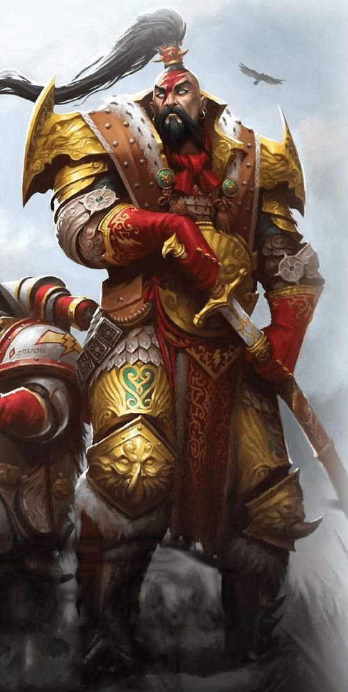
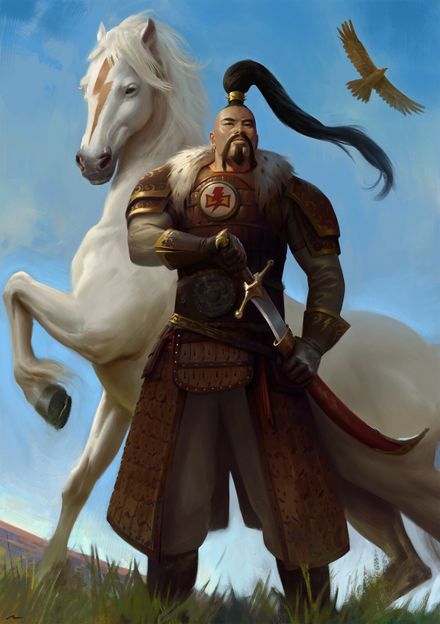
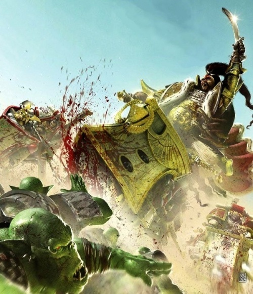
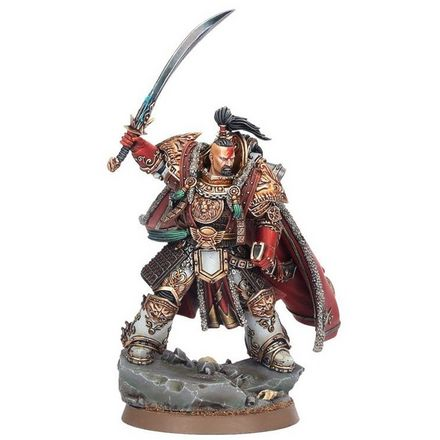
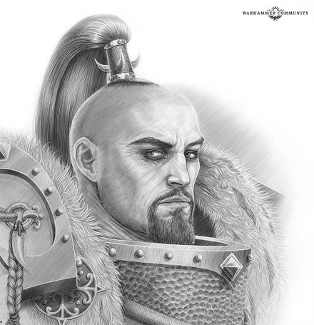
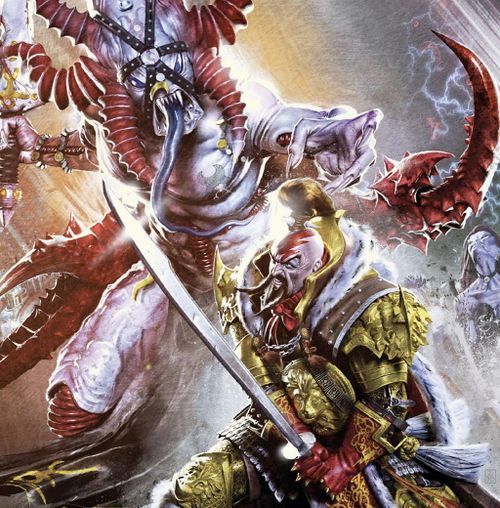
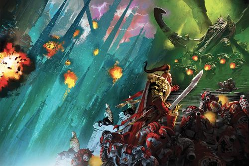
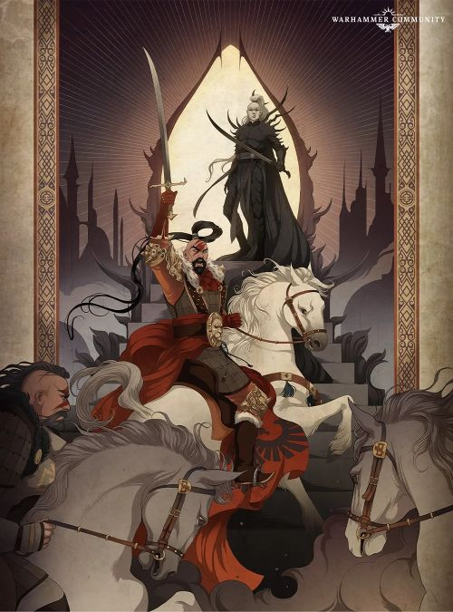

# 0643 察合台可汗 Jaghatai Khan

精校状态：中文行文已逐段精校，部分术语仍为暂定

分类：人类帝国 / 白色疤痕

原文来源：https://www.bilibili.com/opus/1095198136300732419

原作者：帝国神选罐头

原文时间：2025年07月30日 08:08

[返回分类目录](目录.md) · [全书目录](../../目录.md)

<!-- A0643-B0001 -->
**英文原文**

"We remained true. They can never have this, not if they burn all we ever built and scorn us through the dancing flames. You hear me? We remained true"

<!-- /A0643-B0001 -->

<!-- A0643-B0002 -->

原译文

“我们一直是真实的。如果他们烧毁我们建造的一切，在舞动的火焰中蔑视我们，他们就永远不会拥有这一切。你听到了吗？我们一直是真实的”

**校订译文**

“我们始终忠诚。即使他们烧尽我们建立的一切，隔着跃动的火焰对我们肆意嘲弄，也永远夺不走这一点。听见了吗？我们始终忠诚。”

<!-- /A0643-B0002 -->

<!-- A0643-B0003 -->
**英文原文**

Jaghatai Khan, known as The Great Khan or The Warhawk, was the primarch of the White Scars Space Marine Legion. Known for his secluded and fierce nature, the Khan was commonly overlooked and seen as a barbarian but in truth was a highly cultured individual. Most of the records about him are from the White Scars, and as such can be subject to variety and unreliability. The Chaos emissary to Lorgar called him the Warrior.

<!-- /A0643-B0003 -->

<!-- A0643-B0004 -->

原译文

察合台可汗，被称为大汗或战鹰，是白色疤痕星际战士军团的原体。可汗以其隐秘而凶猛的天性而闻名，他通常被忽视，被视为野蛮人，但事实上，他是一个受过高等教育的人。关于他的大部分记录都来自白色伤疤，因此可能存在多样性和不可靠性。混沌派去珞珈的使者称他为战士。

**校订译文**

察合台可汗又称“大汗”或“战鹰”，是白疤星际战士军团的原体。他性情孤傲、作战凶猛，常被人忽视或视为野蛮人，实际上却有着深厚的文化修养。关于他的大部分记载出自白疤，因此版本不一，可靠性也参差不齐。向珞珈传话的混沌使者称他为“战士”。

<!-- /A0643-B0004 -->

<!-- A0643-B0005 图片 -->

<!-- A0643-B0006 -->

原译文

Jaghatai Khan 察合台可汗

**校订译文**

Jaghatai Khan 察合台可汗

<!-- /A0643-B0006 -->

<!-- A0643-B0007 -->
## History 历史

<!-- /A0643-B0007 -->

<!-- A0643-B0008 -->
### Youth 青年

<!-- /A0643-B0008 -->

<!-- A0643-B0009 -->
**英文原文**

It is said that Khan landed on a planet in the Segmentum Pacificus named (by the Imperium), Mundus Planus, or as the native population called it, Chogoris. It is a fertile world with wide, open, green plains and tall white mountains and blue seas. At the time of the Great Crusade, the people had developed to a black powder stage. A census shows that the dominant empire was a well organised aristocracy which had conquered most of the planet with well equipped and highly disciplined armies, maintaining armoured horsemen and tight blocks of infantry. Their leader was the Palatine, and he won all of his battles with his great army.

<!-- /A0643-B0009 -->

<!-- A0643-B0010 -->

原译文

据说，可汗降落在太平星域的一颗行星上，该行星被帝国命名为蒙达斯·普莱纳斯，或当地人称之为巧高里斯。这是一个富饶的世界，有宽阔、开阔、绿色的平原、高耸的白色山脉和蓝色的海洋。在大远征时期，人民已经发展到了黑火药阶段。统计显示，占主导地位的帝国是一个组织良好的贵族国家，他们凭借装备精良、纪律严明的军队征服了行星的大部分地区，维持着装甲骑兵和密集的步兵。他们的领袖是帕拉廷，他用他的大军赢得了所有的战斗。

**校订译文**

据说，可汗降落在太平星域的一颗行星上。帝国称其为蒙达斯·普莱纳斯，当地人则称其为乔高里斯。这个富饶的世界有辽阔的绿色平原、高耸的白色山脉和蔚蓝的海洋。大远征抵达时，当地文明已发展到使用黑火药的阶段。一份调查记录显示，当时占据主导地位的是一个组织严密的贵族政权。它凭借装备精良、纪律严明的军队征服了行星的大部分地区，麾下既有披甲骑兵，也有列成密集方阵的步兵。其统治者被称为帕拉廷；他依靠这支强大的军队战无不胜。

**校注：** Palatine 此处为乔高里斯旧统治者称号，暂沿原稿帕拉廷；与战斗修女单位 Palatine 的官方译名宫廷官分义，不据同形词替换。

<!-- /A0643-B0010 -->

<!-- A0643-B0011 图片 -->

<!-- A0643-B0012 -->

原译文

Young Jaghatai Khan 年轻的察合台可汗

**校订译文**

Young Jaghatai Khan 年轻的察合台可汗

<!-- /A0643-B0012 -->

<!-- A0643-B0013 -->
**英文原文**

To the west of the Palatine's empire was the Empty Quarter, a barren grassland with little resources. As such, it was never invaded. It was home to wandering tribes of vicious horsemen who fought each other for their ancestral lands. The Palatine would sometimes lead forces in to capture slaves or merely to hunt the tribesmen for fun. Khan's legacy began here. He was found by Ong Khan, leader of a small tribe known as the Talskars, who saw the Primarch as a gift from the gods. It is said he had a fire in his eyes, the sign of a great warrior. He was hated by the other tribes because of his ability to see beyond the constant warfare on the steppes。

<!-- /A0643-B0013 -->

<!-- A0643-B0014 -->

原译文

帕拉廷帝国的西面是空区，这是一片贫瘠的草原，资源匮乏。因此，它从未被入侵。它是流浪部落的家园，这些部落都是狂暴的骑兵，他们为了祖传的土地而相互争斗。帕拉廷有时会带领军队抓捕奴隶，或者只是为了好玩而追捕部落成员。可汗的传奇从这里开始。他是由被称为塔尔斯卡的一个小部落的首领昂可汗发现的，他将这位原体视为众神的礼物。据说他的眼睛里有火，这是一个伟大战士的标志。他被其他部落憎恨，因为他能够超越草原上不断的战争。

**校订译文**

帕拉廷帝国以西是被称为“空区”的贫瘠草原，资源匮乏，因而一直未遭征服。那里生活着许多游牧部落，骁勇的骑手为了祖传土地彼此厮杀。帕拉廷有时会派兵深入草原掳掠奴隶，甚至以猎杀部落民为乐。可汗的传奇由此开始。塔尔斯卡小部落的首领昂可汗发现了他，将这位原体视为众神赐予的礼物。据说他的双眼燃烧着火焰，那是伟大战士的标志。其他部落憎恨他，因为他能够看破草原上无休止的争斗，着眼于更远大的目标。

**校注：** 本段前称该草原从未被入侵，后又记帕拉廷屡次劫掠；结合语境译为未遭征服，区分征服占领与短期袭扰。末句英文 he 指代不十分明确，沿段落主角可汗理解。

<!-- /A0643-B0014 -->

<!-- A0643-B0015 -->
**英文原文**

It is said the most influential moment in his life was the slaying of his father by the rival Kurayed tribe. Khan, even as a young child, was the greatest warrior of the tribe and gathered troops to avenge the death of his father. They moved on the Kurayed tribe and razed it to the ground, killing every man, woman and child in a killing frenzy. Khan took the head of the enemy tribe leader and mounted it on his tent. This is what shaped him into a man of fierce honour, loyalty and ruthlessness. From then on he swore to end the fighting, unite all the people of the steppes and bring an end to brother fighting brother. He fought hundreds of battles against other tribes and defeated hunting packs sent by Palatine. Each tribe they conquered was absorbed into the Talaskars and he made military service mandatory while splitting tribes up and merging them with others to remove tribal differences. His warriors were fiercely loyal to him and he promoted from the ranks based on merit and ability.

<!-- /A0643-B0015 -->

<!-- A0643-B0016 -->

原译文

据说，他一生中最有影响力的时刻是他的父亲被敌对的呼喇耶部落杀害。可汗从小就是部落里最伟大的战士，他召集军队为父亲报仇。他们向呼喇耶部落进发，将其夷为平地，疯狂地杀害了每一个男人、女人和孩子。可汗把敌人部落首领的头放在帐篷上。这就是他成为一个非常荣誉、忠诚和无情的人的原因。从那时起，他发誓要结束战斗，团结草原上的所有人，结束兄弟之间的战争。他与其他部落进行了数百次战斗，并击败了帕拉廷派来的狩猎队。他们征服的每个部落都被塔拉斯卡吞并，他强制服兵役，同时分裂部落并将其与其他部落合并，以消除部落差异。他的战士们对他非常忠诚，他根据功绩和能力从晋升军衔。

**校订译文**

据说，他人生中最具决定性的一刻，是养父被敌对的呼喇耶部落杀害。可汗虽仍年幼，却已是部落最强大的战士。他召集人马为父报仇，进攻呼喇耶部落，将其夷为平地，在狂怒中杀尽所有男女老幼。他斩下敌方首领的头颅，悬挂在自己的帐篷上。这段经历塑造了他强烈的荣誉感、忠诚与冷酷。此后，他立誓统一草原各部，结束兄弟相残。他与其他部落交战数百次，也击败了帕拉廷派来的狩猎队。每个被征服的部落都被并入塔尔斯卡。他实行强制服役制度，将原有部落拆散、混编，以消除部落间的隔阂。战士们对他忠心耿耿，而他依据功绩和能力从行伍中选拔将领。

**校注：** 原文先后拼写 Talskars / Talaskars，中文统一塔尔斯卡，英文异写保留。

<!-- /A0643-B0016 -->

<!-- A0643-B0017 -->
**英文原文**

Ten summers later as the tribe moved to their winter settlements, the Primarch was travelling on a mountainside with a group of his followers. A vast avalanche pushed him and his group back down the mountain, killing the normal men. Jaghatai survived, but could not get back up the mountain in time before the tribe moved on. Khan was caught by one of the Palatine's hunting band. All that returned of that band was one mutilated rider with the head of the son of Palatine (who had accompanied the hunting band) and a note saying that the people of the steppes were not his toys any more.

<!-- /A0643-B0017 -->

<!-- A0643-B0018 -->

原译文

十年后的夏天，当部落搬到他们的冬季定居点时，原体和他的一群追随者在山腰上旅行。一场巨大的雪崩将他和他的团队推回山下，杀死了普通人。察合台幸存下来，但在部落继续前进之前，他无法及时回到山上。可汗被帕拉廷的一个狩猎队抓住了。那支小队只带回了一个残缺不全的骑手，他带着帕拉廷之子（曾陪伴狩猎队）的头，还有一张纸条，上面写着草原上的人不再是他的玩具了。

**校订译文**

十年后，部落迁往冬营地时，原体正与一群追随者沿山腰前行。一场大雪崩将他们冲下山坡，同行的凡人尽数丧生。察合台活了下来，却没能在部落继续迁徙前及时返回山上，随后被帕拉廷的一支狩猎队发现。那支队伍最后只有一名伤残的骑手回去，带着随队出猎的帕拉廷之子的首级，以及一张字条：草原之民再也不是任他摆弄的玩物。

**校注：** Ten summers later 意为十年后，不足以断定事件发生于夏季；下文明确正在迁往冬营地。

<!-- /A0643-B0018 -->

<!-- A0643-B0019 图片 -->

<!-- A0643-B0020 -->

原译文

Jaghatai Khan battles Orks 察合台与兽人战斗

**校订译文**

Jaghatai Khan battles Orks 察合台与兽人战斗

<!-- /A0643-B0020 -->

<!-- A0643-B0021 -->
**英文原文**

When the snows cleared, an enraged Palatine gathered a massive army and determined to march west to wipe the tribes from the face of the planet. He had however underestimated the power and ability of Khan and brought his usual highly disciplined army of heavily armoured warriors. Another army under his general Subedei secretly led an army across the previously impassable Kuzil Quan desert. These proved to be his downfall as they could not catch the lightly armoured tribesmen. The constant rain of arrows from the tribesmen took their toll on the tight ranks of warriors. Eventually the tribesmen defeated the army of Palatine, who escaped back to his capital with a select few bodyguards. The rest of the army was slaughtered, almost to the last man. After the battle, the tribal elders gathered and announced that Jaghatai Khan was now Great Khan of the whole land. It was during this time that Jaghatai met comrades who would serve with him for centuries to come such as Qin Xa, Hasik, and Targutai Yesugei.

<!-- /A0643-B0021 -->

<!-- A0643-B0022 -->

原译文

当雪散去时，愤怒的帕拉廷召集了一支庞大的军队，决心向西进军，将部落从行星上抹去。然而，他低估了可汗的力量和能力，并带来了他通常训练有素的重甲战士军队。察合台的将军速不台率领的另一支军队秘密率领一支军队穿越了以前无法通行的库兹·泉沙漠。这些被证明是帕拉庭的衰落，因为他们抓不到那些身穿轻甲的部落成员。部落成员源源不断的箭雨对紧张的战士队伍造成了伤害。最终，部落成员击败了帕拉廷军队，后者带着几名精心挑选的护卫逃回了首都。其余的军队都被屠杀了，几乎到了最后一个人。战斗结束后，部落长老们聚集在一起，宣布察合台可汗现在是整片土地的大汗。正是在这段时间里，察合台遇到了将在未来几个世纪与他并肩作战的战友，如秦夏、哈西克和塔里忽台·也速该。

**校订译文**

积雪消融后，愤怒的帕拉廷集结大军，决心向西进军，将草原部落彻底消灭。他低估了可汗的力量与才干，仍带来惯用的、纪律严明的重甲军队。另一支军队则由速不台将军率领，秘密穿越此前被认为无法通行的库兹·泉沙漠。重甲部队追不上轻装的部落骑手，反而让密集阵列在绵绵箭雨中不断受损，最终招致败局。部落军击溃了帕拉廷的大军；他本人仅带着少数亲卫逃回首都，其余部队几乎全军覆没。战后，部落长老集会，宣布察合台可汗为整片土地的“大汗”。也正是在这一时期，他结识了秦夏、哈西克和塔里忽台·也速该等将在此后数百年间与他并肩作战的伙伴。

**校注：** 速不台一军的归属在英文 his general 中指代含混；原译明确补为察合台麾下，现保留将领姓名而不擅补归属。these / they 亦衔接不清，按后句重甲军无法追上部落骑手理顺败因。

<!-- /A0643-B0022 -->

<!-- A0643-B0023 -->
**英文原文**

Khan now began the long process of conquering the rest of the planet. He gave cities two choices: surrender or be wiped out. Most surrendered, but many were destroyed, utterly wiped from the face of the planet. Eventually they came to the palace of Palatine, where he demanded the head of Palatine on a spike. His request was obliged and he adorned his tent with his greatest conquest. In twenty years he had conquered the largest empire in the world's history. He now had the problems of ruling the empire, not something he had originally wanted. His people had no wish to rule these new lands, only to carry on living in the old ways. The people dispersed back to a tribal existence and Khan ruled over them all with his generals by his side.

<!-- /A0643-B0023 -->

<!-- A0643-B0024 -->

原译文

可汗现在开始了征服行星其他地区的漫长过程。他给了城市两个选择：投降或被消灭。大多数人投降了，但许多人被摧毁，从行星上彻底抹去。最终，他们来到了帕拉廷皇宫，在那里，他要求用钉子钉住帕拉廷的首领。他的请求得到了满足，他用他最大的胜利装饰了帐篷。二十年来，他征服了世界历史上最大的帝国。他现在面临着统治帝国的问题，这不是他最初想要的。他的人民不想统治这些新土地，只想继续以旧的方式生活。人们分散回到部落生活，可汗在他的将军们的陪伴下统治着他们。

**校订译文**

随后，可汗开始了征服行星其余地区的漫长战争。他让各座城市选择：投降，或被毁灭。大多数城市选择归顺，也有许多被彻底夷平。最终，大军来到帕拉廷的宫殿前，可汗要求将统治者的首级挑在长矛上献出。这个要求得到了满足，他用这一象征最大胜利的战利品装饰自己的帐篷。在二十年间，他征服了该世界历史上最庞大的帝国，却也不得不面对治理帝国这一原本无意承担的任务。他的人民无心统治新领土，只想继续原来的生活，于是纷纷散去，恢复部落生活；可汗则在将军们的辅佐下统治他们。

<!-- /A0643-B0024 -->

<!-- A0643-B0025 -->
**英文原文**

Six months later, the Emperor arrived and Khan knew at once that this man could fulfill his dream to unite all of the stars above them in one mighty empire. In front of all of his generals, he dropped to one knee and pledged his service to the Emperor. He was given command of the fifth legion of Space Marines. Upon taking command of his new Legion, known by this point as the Star Hunters, Jaghatai sought to assimilate the new mostly Terran troops into Chogorian culture and tactics while his new recruits from his homeworld were being planned. The Legion's tactics were completely overhauled to emphasize little but pure speed and maneuver. After the battle against the Nephilim on Hoadh, the Star Hunters became the White Scars.

<!-- /A0643-B0025 -->

<!-- A0643-B0026 -->

原译文

六个月后，帝皇来了，可汗立刻知道这个人可以实现他的梦想，将他们头顶的所有星辰团结成一个强大的帝国。在所有将军面前，他单膝跪地，向帝皇宣誓效忠。他被任命为星际战士第五军团的指挥官。在指挥他的新军团（此时被称为星辰猎手）后，察合台试图将新的主要是泰拉裔的部队融入巧高里斯的文化和战术，同时他正在计划从家乡招募新兵。军团的战术进行了彻底的改革，只强调纯粹的速度和机动性。在霍阿德与拿非利人作战后，星辰猎手变成了白色疤痕。

**校订译文**

六个月后，帝皇到来。可汗立刻意识到，此人能够实现他的梦想，将头顶群星统一在一个强大的帝国之下。他当着众将的面单膝跪地，宣誓为帝皇效力，随后获得了星际战士第五军团的指挥权。接掌当时仍称“星辰猎手”的军团后，察合台一面筹划从母星招募新兵，一面让现有的、以泰拉人为主的部队融入乔高里斯的文化，学习当地的作战方式。他彻底改造了军团战术，几乎将一切重心都放在速度与机动上。霍阿德对拿非利人的战争结束后，星辰猎手改称白疤。

<!-- /A0643-B0026 -->

<!-- A0643-B0027 图片 -->

<!-- A0643-B0028 -->

原译文

Jaghatai Khan 察合台可汗

**校订译文**

Jaghatai Khan 察合台可汗

<!-- /A0643-B0028 -->

<!-- A0643-B0029 -->
**英文原文**

Jaghatai Khan gained a fierce reputation during the Great Crusade and particularly the Ullanor Crusade, but mostly kept to himself save friendships with Horus and Magnus the Red. Conversely, he became detested by Primarchs such as Fulgrim.

<!-- /A0643-B0029 -->

<!-- A0643-B0030 -->

原译文

察合台可汗在大远征，特别是乌兰诺远征期间获得了凶猛的声誉，但他大多只与荷鲁斯和赤红之马格努斯保持友谊。相反，他受到了福格瑞姆等原体的厌恶。

**校订译文**

察合台可汗在大远征期间，尤其是乌兰诺远征中威名远扬。不过，他大多独来独往，主要只与荷鲁斯和红魔马格努斯交好；福格瑞姆等原体则厌恶他。

<!-- /A0643-B0030 -->

<!-- A0643-B0031 -->
### Horus Heresy 荷鲁斯之乱

原题：Horus Heresy 荷鲁斯叛乱

<!-- /A0643-B0031 -->

<!-- A0643-B0032 -->
### Choosing a Side 选择一方

<!-- /A0643-B0032 -->

<!-- A0643-B0033 -->
**英文原文**

Despite the fact that Horus felt that Khan was the most likely to join him over all remaining loyalist Primarchs, Jaghatai in fact never intended to switch allegiances and stayed true to his father. However he did receive conflicting Astropathic messages as to what had transpired in the Isstvan System, and decided to initially hold back his forces under he could determine the true nature of things. When Rogal Dorn sent a plea for all remaining loyal Astartes forces to make their way to Terra, Khan followed, reluctantly leaving the nearby Space Wolves to fend for themselves against the Alpha Legion while also ignoring calls by Horus to attack his brother Leman Russ. The Khan most of all sought answers for what could have led to this bloodshed before he would take any side in the conflict. However for a time the White Scars became bogged down against Orks and Warp Storms in the Chondax System as part of an elaborate trap by the Alpha Legion. Jaghatai eventually managed to break the Alpha Legion blockade and made his way to the source of all of these troubles to investigate it for himself: Prospero.

<!-- /A0643-B0033 -->

<!-- A0643-B0034 -->

原译文

尽管荷鲁斯认为可汗最有可能加入他，而不是所有剩下的忠诚原体，但察合台实际上从未打算改变效忠关系，而是忠于他的父亲。然而，他确实收到了关于伊斯塔万星系中发生的事情的相互矛盾的星语信息，并决定最初在他可以确定事物真实性质的情况下阻止他的部队。当罗格·多恩请求所有剩余的忠诚的阿斯塔特部队前往泰拉时，可汗紧随其后，不情愿地离开附近的太空野狼，独自对抗阿尔法军团，同时也无视荷鲁斯攻击他的兄弟黎曼·鲁斯的呼唤。可汗在冲突中选择任何一方之前，最重要的是寻求导致这场流血事件的答案。然而，有一段时间，作为阿尔法军团精心设计的陷阱的一部分，白色疤痕在康达克斯星系中与欧克和亚空间风暴的对抗陷入了困境。察合台最终设法打破了阿尔法军团的封锁，并前往所有这些麻烦的源头：普洛斯佩罗进行调查。

**校订译文**

在尚未叛变的原体中，荷鲁斯认为可汗最有可能加入自己。然而，察合台实际上从未打算改变效忠对象，始终忠于父亲。由于收到的星语讯息对伊斯塔万星系的变故说法矛盾，他决定先按兵不动，查清真相。当罗格·多恩呼吁所有仍然忠诚的阿斯塔特部队赶往泰拉时，可汗响应了号召。他虽不情愿，仍留下附近的太空野狼自行应对阿尔法军团，同时拒绝了荷鲁斯要求他攻击兄弟黎曼·鲁斯的命令。在公开选边之前，可汗最想弄清的，是究竟什么导致了这场流血冲突。但阿尔法军团精心布下的陷阱，使白疤一度困于康达克斯星系的欧克战事与亚空间风暴。察合台最终突破封锁，前往他认为是一切祸端源头的普洛斯佩罗，亲自调查。

**校注：** 源文一面说可汗始终忠诚，一面说他尚未选边；中文区分内心效忠与公开军事表态。under 应为 until 的源文笔误，英文不改。

<!-- /A0643-B0034 -->

<!-- A0643-B0035 图片 -->

<!-- A0643-B0036 -->

原译文

Jaghatai Khan 察合台可汗

**校订译文**

Jaghatai Khan 察合台可汗

<!-- /A0643-B0036 -->

<!-- A0643-B0037 -->
**英文原文**

At Prospero, the Khan and his men found no clear answers or Space Wolves as had been reported, only ruins and the ghosts of slain Thousand Sons. Eventually however the Khan confronted a projection of Magnus the Red. Magnus implored his brother and former friend to finally choose a side in the rebellion and discussed what both hoped to gain from the Great Crusade, but in the end the Khan shattered the shade with his Tulwar sword. Shortly after, Mortarion, Primarch of the Death Guard, also appeared on Prospero and tried to convince his brother to join with them. Jaghatai refused yet another offer, stating that while the Emperor is a tyrant Horus had become a slave to the Warp and had attempted to manipulate him to his own ends. This time, the Khan's choice came to a duel. The two Primarchs battled fairly evenly, though Jaghatai was faster and Mortarion had greater endurance. Eventually when the White Scars and Death Guard fleets began to clash in space, Mortarion withdrew. Meanwhile in space the failure in Mortarion's plan became apparent. During his time on Prospero the Khan was faced with an attempted pro-Horus coup by two of his own commanders, Hasik Noyan-Khan and Torghun Khan. It was through the efforts on Shiban Khan that it failed.

<!-- /A0643-B0037 -->

<!-- A0643-B0038 -->

原译文

在普洛斯佩罗，可汗和他的部下没有找到明确的答案，也没有找到报告中的太空野狼，只有废墟和被杀千子的幽灵。然而，最终，可汗遭遇了赤红之马格努斯的投影。马格努斯恳求他的兄弟和前朋友最终在叛乱中选择一方，并讨论了他们希望从大远征中获得什么，但最终可汗用他的弯刀打破了阴影。不久之后，死亡守卫原体莫塔里安也出现在普洛斯佩罗，并试图说服他的兄弟加入他们。察合台拒绝了这一提议，称虽然帝皇是暴君，但荷鲁斯已经成为亚空间的奴隶，并试图操纵他达到自己的目的。这一次，可汗的选择变成了决斗。两位原体的战斗相当均衡，尽管察合台更快，但莫塔里安的耐力更强。最终，当白色伤疤和死亡守卫舰队开始在太空中发生冲突时，莫塔里安撤退了。与此同时，在太空中，莫塔里安计划的失败变得显而易见。在普罗斯佩罗期间，可汗面临着他自己的两名指挥官哈西克诺扬汗和托尔汉可汗试图发动的亲荷鲁斯政变。正是通过昔班可汗的努力，它才失败了。

**校订译文**

在普洛斯佩罗，可汗和部下既没有找到明确答案，也没有见到传闻中的太空野狼，眼前只有废墟与阵亡千子留下的幽魂。最终，可汗遇见了红魔马格努斯的投影。马格努斯恳求这位兄弟兼昔日挚友在叛乱中作出选择，并与他谈及两人曾希望从大远征中获得什么。但谈话最终以可汗挥舞弯刀、斩碎幻影告终。不久后，死亡守卫原体莫塔里安也来到普洛斯佩罗，试图拉拢他。察合台再次拒绝，指出帝皇虽是暴君，荷鲁斯却已沦为亚空间的奴隶，还企图操纵自己来实现其目的。这一次，他的选择引发了决斗。两位原体势均力敌：察合台速度更快，莫塔里安耐力更强。当白疤与死亡守卫的舰队在太空中交火时，莫塔里安终于撤离，他的计划也宣告失败。可汗留在普洛斯佩罗期间，麾下指挥官哈西克诺扬汗和托尔浑可汗曾发动亲荷鲁斯政变；昔班可汗的努力最终挫败了他们。

<!-- /A0643-B0038 -->

<!-- A0643-B0039 -->
### Hit-and-Run 游击袭扰

原题：Hit-and-Run 跑打

<!-- /A0643-B0039 -->

<!-- A0643-B0040 -->
**英文原文**

For the next four years, Jaghatai had his Scars wage a brutal attrition hit-and-run campaign against the traitor lines. But with the road to Terra blocked by enemy fleets and Warp Storms, he could not reach the Emperor. Following the loss of his close friend and subordinate Qin Xa in the Battle of the Kalium Gate, Jaghatai became determined to forge a path home where he believed his destiny lay. Upon finding the Dark Glass artifact, the White Scars were cornered by their pursuers, and as Jaghatai prepared to settle his score with Mortarion in the face of certain doom, Targutai Yesugei sacrificed himself to the device to open a portal into the Webway. Refusing to allow Yesugei's sacrifice be for nothing, the Khan chose escape over honor and fled from Mortarion. Once inside the Webway, Jaghatai's ship Lance of Heaven was boarded by Daemons and the Khan slew the Keeper of Secrets Manushya-Rakshsasi. Thanks to the efforts of Revuel Arvida, the White Scars fleet was able to navigate the Webway and reappear over Terra. On Terra, Jaghatai Khan met with Rogal Dorn, Leman Russ, Sanguinius, and Malcador the Sigillite to discuss their war strategy. The Khan disapproved of Dorn's defensive approach to the war, and urged a swift attack on Horus' forces. He agreed to a degree with Leman Russ, who was preparing to leave Terra and face Horus aboard the Vengeful Spirit directly.

<!-- /A0643-B0040 -->

<!-- A0643-B0041 -->

原译文

在接下来的四年里，察合台让他的疤痕发起了一场残酷的消耗战，打击叛徒路线。但由于通往泰拉的道路被敌方舰队和亚空间风暴封锁，他无法到达帝皇那里。在钾之门之战中失去了他的密友和下属秦夏后，察合台决心开辟一条回家的路，他相信自己的命运就在那里。在发现神器黑色琉璃后，白色疤痕被他们的追捕者逼到了角落，当察合台准备在厄运面前与莫塔里安算账时，塔里忽台·也速该向该装置牺牲了自己，打开了通往网道的门户。可汗拒绝让也速该的牺牲毫无意义，他选择了逃离而非荣誉，逃离了莫塔里安。一进入网道，察合台的天堂之枪号战舰就被恶魔登上，可汗杀死了守密者玛努沙·拉克莎希。多亏了雷韦尔·阿维达的努力，白色疤痕舰队得以在网道航行，并在泰拉上空重新出现。在泰拉上，察合台可汗会见了罗格·多恩、黎曼·鲁斯、圣吉列斯和掌印者马卡多，讨论他们的战争战略。可汗不赞成多恩对战争的防御方式，并敦促迅速攻击荷鲁斯的部队。他在一定程度上同意了黎曼·鲁斯的观点，黎曼·鲁斯正准备离开泰拉，直接跳帮复仇之魂号面对荷鲁斯。

**校订译文**

此后四年，察合台率白疤反复突袭叛军战线，以残酷的游击战持续消耗敌人。但敌方舰队与亚空间风暴封死了通往泰拉的道路，使他无法回到帝皇身边。密友兼部属秦夏在卡利乌姆之门战役中阵亡后，察合台决心杀出一条归途；他相信自己的命运就在泰拉。白疤找到黑暗琉璃装置后，被追兵逼入绝境。察合台正准备在必死之局中与莫塔里安清算旧账，塔里忽台·也速该却以自己的生命启动装置，打开了通往网道的门户。为了不让也速该白白牺牲，可汗舍弃决斗的荣誉，选择脱离莫塔里安的追击。进入网道后，恶魔登上了察合台的天堂之枪号；可汗亲手杀死守密者玛努沙·拉克莎希。雷韦尔·阿维达帮助白疤舰队穿越网道，最终出现在泰拉上空。在泰拉，察合台与罗格·多恩、黎曼·鲁斯、圣吉列斯及掌印者马卡多会面，商讨战略。他不赞成多恩一味防守，主张迅速打击荷鲁斯的部队；他也在一定程度上支持黎曼·鲁斯的想法，后者正准备离开泰拉，直登复仇之魂号挑战荷鲁斯。

<!-- /A0643-B0041 -->

<!-- A0643-B0042 图片 -->

<!-- A0643-B0043 -->

原译文

Jaghatai Khan battles a Keeper of Secrets during the Horus Heresy 察合台可汗在荷鲁斯叛乱期间与一名守密者作战

**校订译文**

Jaghatai Khan battles a Keeper of Secrets during the Horus Heresy 察合台可汗在荷鲁斯之乱期间与一名守密者作战

<!-- /A0643-B0043 -->

<!-- A0643-B0044 -->
**英文原文**

Jaghatai Khan along with Sanguinius later appeared at the Battle of Beta-Garmon, though over a month late due to difficult Warp travel. The Khan immediately took to organizing hit-and-run strikes throughout the Beta-Garmon warzone. However the loyalists were ultimately outmaneuvered by Horus, and Sanguinius and the Khan agreed that Dorn's gambit at Beta-Garmon had reached its limit and it was time to return to Terra. During the final phase of the Solar War Jaghatai dispatched his Scars to above and below the orbital disc of the Sol System in an attempt to counter flanking assaults by the traitors. During the early portion of the battle for Sol, he expressed his belief that Horus had failed and that they had already bought enough time to allow for Roboute Guilliman to arrive with reinforcements.

<!-- /A0643-B0044 -->

<!-- A0643-B0045 -->

原译文

察合台可汗和圣吉列斯后来出现在贝塔·伽蒙之战中，尽管由于亚空间航行困难而晚了一个多月。可汗立即开始在贝塔·伽蒙战区组织跑打袭击。然而，忠诚派最终被荷鲁斯击败，圣吉列斯和可汗一致认为，多恩在贝塔·伽蒙的策略已经达到极限，是时候回到泰拉了。在太阳战争的最后阶段，察合台将他的伤痕派往太阳系轨道盘的上方和下方，试图对抗叛徒的侧翼攻击。在太阳之战的早期，他表示相信荷鲁斯失败了，他们已经争取到了足够的时间，让罗伯特·基里曼带着援军到达。

**校订译文**

此后，察合台可汗与圣吉列斯参加了贝塔·伽蒙之战，但因亚空间航行艰难，比预定时间迟到了一个多月。可汗立即在整个战区组织游击袭扰。最终，荷鲁斯在调兵遣将上占了上风；圣吉列斯与可汗都认为，多恩在贝塔·伽蒙布下的险局已无以为继，必须返回泰拉。太阳战争的最后阶段，察合台将白疤部队部署到太阳系行星轨道平面的上下两侧，试图抵御叛军的侧翼迂回。而在太阳系之战初期，他曾表示，相信荷鲁斯已经失败，因为他们争取到了足够时间，让罗保特·基里曼率援军赶来。

<!-- /A0643-B0045 -->

<!-- A0643-B0046 -->
### Siege of Terra 泰拉围城

<!-- /A0643-B0046 -->

<!-- A0643-B0047 -->
**英文原文**

During the Siege of Terra, Jaghatai Khan was initially forbidden from venturing outside the walls by Rogal Dorn, something The Khan refused to abide by. Jaghatai in particular resented abandoning the large amounts of Imperial Army conscripts outside the Palace to their fate, as well as the lack of a proactive defensive strategy. Later during the first Traitor Astartes assaults upon the outermost trenches around the Palace Jaghatai led a White Scars Jetbike charge from the Eternity Wall. They swept through the traitor ranks, with Jaghatai slaying over 40 Death Guard personally. However he was eventually forced from his bike and overwhelmed by the sheer numbers of traitor Astartes, being wounded by a Warp-tainted blade and becoming ill for the first time in his life. Surrounded, the Khan may have died had he not been rescued by Sanguinius, who pulled his brother back to a waiting aircraft and withdrew back into the Palace. The Khan's raid had other purposes however, uncovering intelligence that the Dark Mechanicum were constructing siege engines around the Palace. Following the fall of Lion's Gate, the situation for the loyalists worsened drastically. During a panicked command meeting, Jaghatai Khan flew into a rage when he heard General Saul Niborran and Militant Colonel Clement Brohn bemoaning the hopelessness of the situation. The Khan ejected the two from the Bhab Bastion, something Dorn later regretted and saw as unnecessary.

<!-- /A0643-B0047 -->

<!-- A0643-B0048 -->

原译文

在泰拉围城期间，察合台可汗最初被罗格·多恩禁止冒险走出城墙，而可汗拒绝遵守这一规定。察合台尤其憎恨将大量帝国军队应征入伍者遗弃在皇宫外听天由命，以及缺乏积极的防御策略。后来，在第一次叛徒阿斯塔特袭击察合台皇宫周围最外的战壕期间，他率领白色疤痕悬浮摩托从永恒之墙冲锋。他们横扫叛徒队伍，察合台亲自杀死了40多名死亡守卫。然而，他最终被迫离开了摩托，被大量叛徒阿斯塔特压制，被一把被亚空间污染的刀刃击伤，并有生以来第一次生病。如果没有圣吉列斯的营救，可汗可能已经死亡，圣吉列斯将他的兄弟拉回等待的飞机并撤回皇宫。然而，可汗的突袭还有其他目的，揭露了黑暗机械教正在皇宫周围建造攻城引擎的情报。狮门陷落后，忠诚派的处境急剧恶化。在一次惊慌失措的指挥会议上，当察合台可汗听到索尔·尼博兰将军和军事上校克莱门特·布洛赫哀叹局势的绝望时，他勃然大怒。可汗将两人逐出了巴布堡垒，多恩后来对此感到后悔，认为这是不必要的。

**校订译文**

泰拉围城初期，罗格·多恩禁止察合台可汗出城作战，但可汗拒不遵从。他尤其无法接受将皇宫外的大批帝国军征召兵抛下等死，也不满守军缺乏主动防御的部署。叛军阿斯塔特首次进攻皇宫外围最外层战壕时，察合台率白疤悬浮摩托部队从永恒之墙出击，横扫敌阵，亲手杀死四十余名死亡守卫。然而，数量占绝对优势的叛军最终迫使他离开摩托，将他团团围住。一柄受亚空间污染的兵刃刺伤了他，使他有生以来第一次染病。若非圣吉列斯及时救援，把他带回等候的飞行器并撤入皇宫，可汗或许就会战死。此次突袭也完成了侦察任务，查明黑暗机械教正在皇宫周围建造攻城机械。狮门陷落后，忠诚派的处境急剧恶化。在一次气氛惊惶的指挥会议上，索尔·尼博兰将军和作战上校克莱门特·布洛恩哀叹局势已无可挽回，令察合台勃然大怒，将两人赶出巴布堡垒。多恩事后对此感到遗憾，认为并无必要。

**校注：** 英文 assaults upon the ... Palace 的主语为叛军，察合台领兵出击；原译误拼成察合台皇宫。Militant Colonel 为职衔，作战上校暂定。

<!-- /A0643-B0048 -->

<!-- A0643-B0049 -->
**英文原文**

Not wanting to be bound to Dorn's purely defensive strategy, the Khan lobbied for a rapid assault to retake Lion's Gate. Dorn allowed Jaghatai a degree of autonomy in an attempt to control him during the battle. During the battle for the Colossi Gate the Khan led a 300-strong Jetbike assault against Death Guard besiegers before quickly turning around and withdrawing back to their defenses. Alongside Blood Angels Captain Raldoron, Custodes Captain-General Constantin Valdor, and Marshal Aldana Agathe, Jaghatai succeeded in holding the Colossi gate against a Death Guard, Thousand Sons, and Daemonic assault.

<!-- /A0643-B0049 -->

<!-- A0643-B0050 -->

原译文

可汗不想受制于多恩纯粹的防御战略，他游说迅速进攻，夺回狮门。多恩允许察合台有一定程度的自主权，试图在战斗中控制他。在争夺巨像之门的战斗中，可汗率领300多人的悬浮摩托袭击了死亡守卫围攻者，然后迅速转身撤回防御。察合台与圣血天使连长拉多隆、禁军元帅康斯坦丁·瓦尔多和元帅阿尔达娜.阿加西一起，成功地守住了巨像之门，抵御了死亡守卫、千子和恶魔的袭击。

**校订译文**

可汗不愿受多恩纯粹防守的战略束缚，力主迅速出击，夺回狮门。多恩给予他一定自主权，希望借此让他在战斗中接受约束。在巨像之门的战斗中，可汗率三百名悬浮摩托骑手突袭围攻城门的死亡守卫，随后迅速掉头撤回防线。他与圣血天使连长拉多隆、帝皇禁军统领康斯坦丁·瓦尔多及元帅阿尔达娜·阿加西并肩作战，成功守住巨像之门，击退了死亡守卫、千子与恶魔的联合攻击。

<!-- /A0643-B0050 -->

<!-- A0643-B0051 -->
**英文原文**

After traitor forces penetrated the Mercury and Exultant Walls, the loyalist war effort seemed doomed. However it was then that Jaghatai Khan announced his intent to retake the Lion's Gate Spaceport to not only slow the flow of traitor reinforcements on the planet but also allow for Roboute Guilliman to easily land his own forces once he arrived. An exhausted Rogal Dorn did not protest, and the Khan led a massive assault of the White Scars and Terran First Armoured alongside the Sky Fortress. During the height of the fighting, Jaghatai Khan again came to blows with his brother Mortarion. Faced with Mortarion's new Daemonic endurance and strength, the Khan was brutally beaten down and nearly defenseless. However he was able to find a weakness in the Death Lord with his pride. Jaghatai Khan scolded Mortarion for being weak and giving into the powers of the Warp, while he himself had resisted the temptations of Chaos and remained true to the Emperor. Mortarion flew into a rage, which the Khan took advantage of to launch a second wave of dizzying attacks that overwhelmed the Primarch. In the end the badly wounded Jaghatai Khan was impaled on the blade of Mortarion's scythe, but simply pulled his body along its length to get face-to-face with the Death Guard Primarch. The loyalist Primarch decapitated Mortarion, who was banished into the Warp in a massive explosion similar to that of a Vortex Weapon. Later, the Khan's nearly dead body was discovered by Ilya Ravallion and Jangsai Khan who sought to take him to Malcador.

<!-- /A0643-B0051 -->

<!-- A0643-B0052 -->

原译文

在叛徒部队渗透到水星之墙和欢欣之墙之后，忠诚派的战争似乎注定要失败。然而，就在那时，察合台可汗宣布他打算夺回狮门太空港，这不仅是为了减缓行星上叛徒增援的流动，也是为了让罗伯特·基里曼在抵达后能够轻松登陆自己的部队。疲惫的罗格·多恩没有抗议，可汗率领白色疤痕和泰拉第一装甲部队在天空堡垒旁发动了大规模进攻。在战斗最激烈的时候，察合台可汗再次与他的兄弟莫塔里安发生冲突。面对莫塔里安全新的恶魔耐力和力量，可汗被残酷地击败，几乎毫无防备。然而，他能够找到死亡之主的弱点和他的骄傲。察合台可汗斥责莫塔里安软弱，屈服于亚空间的力量，而他自己则抵制了混沌的诱惑，忠于帝皇。莫塔里安勃然大怒，可汗利用这一点发动了第二波令人眼花缭乱的攻击，压倒了原体。最后，重伤的察合台可汗被莫塔里安镰刀的刀刃刺穿，但他只是沿着镰刀的刃部拉动身体，与死亡守卫原体面对面。忠诚的原体斩首了莫塔里安，他在一场类似于涡旋武器的大规模爆炸中被放逐到亚空间。后来，伊利亚·拉瓦利昂和江赛可汗发现了可汗的尸体，他们试图将他带到马卡多面前。

**校订译文**

叛军突破水星之墙与欢欣之墙后，忠诚派似乎已无力回天。此时，察合台宣布要夺回狮门太空港，既阻滞叛军增援登陆，也为罗保特·基里曼到来后部署部队创造条件。精疲力竭的多恩没有反对。可汗率白疤与泰拉第一装甲部队，在天空堡垒配合下发动大规模进攻。激战中，他再次对上莫塔里安。面对兄弟升魔后获得的力量与耐力，可汗被打得遍体鳞伤，几乎无力招架，却也发现死亡之主的弱点正是骄傲。他讥讽莫塔里安懦弱，屈从于亚空间，而自己抵住混沌诱惑，始终效忠帝皇。莫塔里安被激怒后，可汗趁机发动第二轮快得令人目不暇接的攻势，压制了对手。最终，莫塔里安的镰刃刺穿重伤的察合台；可汗却顺着刀刃将自己拉向敌人，逼近死亡守卫原体，斩下了他的头颅。一场如同涡旋武器引爆般的剧烈爆炸，将莫塔里安放逐回亚空间。后来，伊利亚·拉瓦利翁与江塞可汗发现了奄奄一息的察合台，设法将他送到马卡多那里。

**校注：** nearly dead body 指濒死的身体，不可在此直接断言已是尸体；下一段的凡人死亡标准与原体复苏过程完整保留。

<!-- /A0643-B0052 -->

<!-- A0643-B0053 图片 -->

<!-- A0643-B0054 -->

原译文

Jaghatai Khan engages Mortarion and the Death Guard 察合台可汗与莫塔里安和死亡守卫交战

**校订译文**

Jaghatai Khan engages Mortarion and the Death Guard 察合台可汗与莫塔里安和死亡守卫交战

<!-- /A0643-B0054 -->

<!-- A0643-B0055 -->
**英文原文**

By all mortal standards, the Khan was dead. Nonetheless, Malcador used his psychic powers to try and heal the Primarch. He thought he had succeeded, before noticing that it was the Emperor Himself who had done it. Khan would live, though it would take a long time for him to awake. Sometime later after the Siege had concluded in a loyalist victory, Ilya Ravallion visited the still-recovering Jaghatai to bid him farewell. By this point Jaghatai had since awoken but was still in bad physical shape and had great difficulty speaking and remembering things.

<!-- /A0643-B0055 -->

<!-- A0643-B0056 -->

原译文

以凡人的标准来看，可汗已经死了。尽管如此，马卡多还是利用他的灵能能力试图治愈这位原体。他以为自己成功了，却没注意到是帝皇做的。可汗会活下来，尽管他需要很长时间才能醒来。在围城以忠诚派的胜利结束后的一段时间里，伊利亚·拉瓦利昂拜访了仍在康复中的察合台，向他道别。此时，察合台已经醒来，但身体状况仍然很差，说话和记忆都很困难。

**校订译文**

以凡人的标准判断，可汗已经死去。然而，马卡多仍施展灵能，试图治愈原体。他起初以为自己成功了，随后才意识到，真正救回可汗的是帝皇本人。可汗能够活下来，但还需很久才会苏醒。围城战以忠诚派获胜告终后的一段时间，伊利亚·拉瓦利翁前来向仍在康复的察合台告别。此时他已经醒来，却依旧十分虚弱，连说话和回忆往事都很困难。

<!-- /A0643-B0056 -->

<!-- A0643-B0057 图片 -->

<!-- A0643-B0058 -->

原译文

Artwork depicting the disappearance of Jaghatai Khan 描绘察合台可汗失踪的艺术品

**校订译文**

Artwork depicting the disappearance of Jaghatai Khan 描绘察合台可汗失踪的艺术品

<!-- /A0643-B0058 -->

<!-- A0643-B0059 -->
### Post Heresy 叛乱后

<!-- /A0643-B0059 -->

<!-- A0643-B0060 -->
**英文原文**

After the Heresy, Khan went on to lead the White Scars in the Great Scouring. During the campaign to conqueror the Yasan Sector, Khan came into conflict with both traitors and Dark Eldar raiders. During the Battle of Corusil V against a mighty Dark Eldar Lord, it was reported that Khan was lost within the Webway during the pursuit of the Xenos.

<!-- /A0643-B0060 -->

<!-- A0643-B0061 -->

原译文

叛乱之后，可汗继续领导大清洗中的白色伤疤。在征服崖山星区的战役中，可汗与叛徒和黑暗灵族袭击者发生了冲突。在科鲁希尔五号与一位强大的黑暗灵族领主的战斗中，据报告，在追捕异型的过程中，可汗在网道迷失了方向。

**校订译文**

叛乱结束后，可汗继续率白疤参与大清洗。征服崖山星区期间，他同时与叛军及黑暗灵族劫掠者作战。据记载，在科鲁希尔五号对抗一名强大的黑暗灵族领主时，可汗追击异形进入网道，随后失踪。

<!-- /A0643-B0061 -->

<!-- A0643-B0062 -->
## Character 性格

<!-- /A0643-B0062 -->

<!-- A0643-B0063 -->
**英文原文**

"Even his brother Primarchs understand little of him. His prowess with the blade earns him their respect even as his waywardness causes them concern. Guilliman has never trusted him. Russ is exasperated by him. Lorgar despises him for an untutored savage. Only Horus sees him for what he truly is. They are kindred souls, those two: warrior archetypes, bound by shared codes of martial honour and impatient with the heavy fetters of empire." — Chris Wraight on Jaghatai Khan

<!-- /A0643-B0063 -->

<!-- A0643-B0064 -->

原译文

“就连他的兄弟原体也对他知之甚少。尽管他的任性引起了他们的关注，但他的剑刃才能为他赢得了他们的尊重。基里曼从未信任过他。鲁斯被他激怒了。珞珈鄙视他是一个没有受过教育的野蛮人。只有荷鲁斯看到了他的真实面目。他们是志同道合的灵魂，这两个人：战士原型，受到共同的军事荣誉准则的约束，对帝国的沉重枷锁感到不耐烦。” — 克里斯·赖特谈论察合台可汗

**校订译文**

“就连他的原体兄弟也对他知之甚少。他出众的刀法赢得了兄弟们的尊敬，桀骜的性格却又令他们不安。基里曼从未信任过他，鲁斯被他气得无可奈何，珞珈则鄙夷他是未受教化的野蛮人。唯有荷鲁斯看清了他真正的模样。两人的灵魂彼此相契：他们都是典型的战士，奉行共同的武人荣誉准则，厌烦帝国加诸身上的沉重枷锁。”——克里斯·赖特谈察合台可汗

<!-- /A0643-B0064 -->

<!-- A0643-B0065 -->
## Wargear 武器装备

原题：Wargear 战备

<!-- /A0643-B0065 -->

<!-- A0643-B0066 -->
**英文原文**

During the Heresy, Jaghatai Khan is seen wielding a Tulwar-shaped Power Sword and wearing a helm that resembled a snarling beast. His more famous wargear consisted of the White Tiger Dao, Wildfire Panoply, Archaeotech Pistol known as Storm's Voice, and Sojutsu Pattern Voidbike

<!-- /A0643-B0066 -->

<!-- A0643-B0067 -->

原译文

在叛乱时期，察合台可汗挥舞着弯刀形状的动力剑，戴着像咆哮的野兽一样的头盔。他最著名的武器装备包括白虎刀、野火盔甲、被称为风暴之声的考古科技手枪和枪术型虚空摩托

**校订译文**

叛乱时期，察合台可汗曾手持印度弯刀式的动力剑，头戴造型如咆哮猛兽的头盔。他更著名的装备包括白虎刀、野火盔甲、名为“风暴之声”的远古科技手枪，以及枪术型虚空摩托。

**校注：** Tulwar 指印度弯刀形制；不是将其另认作一件已有专名的武器。

<!-- /A0643-B0067 -->

<!-- A0643-B0068 -->
## Trivia 琐事

<!-- /A0643-B0068 -->

<!-- A0643-B0069 -->
**英文原文**

Jaghatai Khan's background and history is strongly reminiscent of Genghis Khan and how he united the warring Mongolian tribes and led them to conquer an empire which stretched from the eastern coast of Asia to Europe. Like Jaghatai Khan, the Mongolians made use of fast, hit and run strikes from horseback to outmanoeuvre heavier armoured soldiers. Chagatai was also the name of one of Genghis Khan's sons.

<!-- /A0643-B0069 -->

<!-- A0643-B0070 -->

原译文

察合台可汗的背景和历史让人想起成吉思汗，以及他如何团结交战的蒙古部落，带领他们征服了一个从亚洲东海岸延伸到欧洲的帝国。像察合台可汗一样，蒙古人利用从马背上到更重的装甲士兵的快速、跑打攻击。察合台也是成吉思汗的一个儿子的名字。

**校订译文**

察合台可汗的身世与经历令人联想到成吉思汗：统一交战不休的蒙古部落，再率军建立一个从亚洲东海岸延伸至欧洲的庞大帝国。与察合台可汗一样，蒙古人依靠骑兵快速突袭、打了就走的战术，以机动优势对付甲胄更厚重的敌军。察合台也是成吉思汗一名儿子的名字。

<!-- /A0643-B0070 -->

本篇核心术语与暂定项

以下列出本篇出现的英文原形及核心术语表用词。同形词可能指不同对象，具体词义以本篇正文和校注为准；单复数、别名和仅见于图注的名称可能尚未列入。完整候选见[术语表](../../术语表/双语术语候选.csv)。

| 英文 | 采用中文 | 状态 |
| --- | --- | --- |
| Space Marines | 星际战士 | 官方已核对 |
| Blood Angels | 圣血天使 | 官方已核对 |
| Space Wolves | 太空野狼 | 官方已核对 |
| Imperial Army | 帝国军 | 暂定·官方待核 |
| Death Guard | 死亡守卫 | 官方已核对 |
| Thousand Sons | 千子 | 官方已核对 |
| Eldar | 灵族 | 暂定·语境区分 |
| Dark Eldar | 黑暗灵族 | 暂定·旧称对应 |
| Orks | 欧克蛮人 | 官方已核对 |
| Roboute Guilliman | 罗保特·基里曼 | 官方已核对 |
| Warp | 亚空间 | 官方已核对 |
| Imperium | 帝国 | 暂定·简称 |
| Mechanicum | 机械教 | 暂定·历史称谓 |
| Dark Mechanicum | 黑暗机械教 | 暂定·官方待核 |
| Webway | 网道 | 暂定 |
| History | 历史 | 编辑用语已统一 |
| Emperor | 帝皇 | 官方已核对 |
| Primarch | 原体 | 官方已核对 |
| Great Crusade | 大远征 | 暂定·官方待核 |
| Mortarion | 莫塔里安 | 官方已核对 |
| Terra | 泰拉 | 暂定·官方待核 |
| Horus | 荷鲁斯 | 暂定·官方待核 |
| Vengeful Spirit | 复仇之魂号 | 暂定·官方待核 |
| Fulgrim | 福格瑞姆 | 官方已核对 |
| Magnus the Red | 红魔马格努斯 | 官方已核对 |
| Segmentum Pacificus | 太平星域 | 暂定·官方待核 |
| Segmentum | 星域 | 暂定·官方待核 |
| Sector | 星区 | 暂定·官方待核 |
| Malcador the Sigillite | 掌印者马卡多 | 暂定·官方待核 |
| Endurance | 坚韧 | 暂定·官方待核 |
| Chogoris | 乔高里斯 | 暂定·官方待核 |
| Mercury | 水星 | 暂定·官方待核 |
| Clear | 清明 | 暂定·官方待核 |
| Dark Glass | 黑暗琉璃 | 暂定·官方待核 |
| Targutai Yesugei | 塔里忽台·也速该 | 暂定·官方待核 |
| Palatine | 宫廷官 | 官方已核对 |
| Jangsai Khan | 江塞可汗 | 暂定·官方待核 |
| Lance | 骑士矛阵 | 暂定·官方待核 |
| Captain-General | 禁军元帅 | 暂定·官方待核 |
| Ullanor | 乌兰诺 | 暂定·官方待核 |
| Space Marine Legion | 星际战士军团 | 暂定·官方待核 |
| White Scars | 白疤 | 官方已核 |
| Alpha Legion | 阿尔法军团 | 暂定·官方待核 |
| The Sigillite | 掌印者 | 暂定·官方待核 |
| Scars | 伤疤 | 暂定·官方待核 |
| The Battle of Beta-Garmon | 贝塔-伽蒙之战 | 暂定·官方待核 |
| Sol | 太阳系 | 暂定·官方待核 |
| Isstvan | 伊斯塔万 | 暂定·官方待核 |
| Revuel Arvida | 雷韦尔·阿维达 | 暂定·官方待核 |
| Qin Xa | 秦夏 | 暂定·官方待核 |
| Hasik Noyan-Khan | 哈西克诺扬汗 | 暂定·官方待核 |
| Raldoron | 拉多隆 | 暂定·官方待核 |
| Space Marine | 星际战士 | 暂定·官方待核 |
| Captain | 连长 | 暂定·官方待核 |
| Brother | 修士 | 暂定·官方待核 |
| Constantin Valdor | 康斯坦丁·瓦尔多 | 暂定·官方待核 |
| Mortal | 凡人 | 暂定·官方待核 |
| Lorgar | 珞珈 | 暂定·官方待核 |
| Powers | 能天使 | 暂定·官方待核 |
| Chondax | 香德克斯 | 暂定·官方待核 |
| Xenos | 异形 | 暂定·官方待核 |
| Keeper of Secrets | 守密者 | 官方已核对 |
| Jaghatai Khan | 察合台可汗 | 暂定·官方待核 |
| Kalium Gate | 卡利乌姆之门 | 暂定·官方待核 |
| Shiban Khan | 昔班可汗 | 暂定·官方待核 |
| Torghun Khan | 托尔浑可汗 | 暂定·官方待核 |
| Noyan-Khan | 诺扬汗 | 暂定·官方待核 |
| Tribe | 部落（欧克组织） | 暂定·官方待核 |
| Kindred | 亲族 | 暂定·官方待核 |
| Marshal | 元帅 | 官方已核对 |
| Great Scouring | 大清洗 | 暂定·官方待核 |
| Lance of Heaven | 天堂之枪号 | 暂定·官方待核 |
| Ilya Ravallion | 伊利亚·拉瓦利翁 | 暂定·官方待核 |
| Sojutsu pattern voidbike | 枪术型虚空摩托 | 暂定·官方待核 |
| Colossi Gate | 巨像门 | 暂定·官方待核 |
| The Great Khan | 大汗 | 暂定·官方待核 |
| The Warhawk | 战鹰 | 暂定·官方待核 |
| Mundus Planus | 蒙达斯·普莱纳斯 | 暂定·官方待核 |
| Empty Quarter | 空区 | 暂定·官方待核 |
| Ong Khan | 昂可汗 | 暂定·官方待核 |
| Kurayed | 呼喇耶 | 暂定·官方待核 |
| Subedei | 速不台 | 暂定·官方待核 |
| Kuzil Quan | 库兹·泉 | 暂定·官方待核 |
| Star Hunters | 星辰猎手 | 暂定·官方待核 |
| Hoadh | 霍阿德 | 暂定·官方待核 |
| Manushya-Rakshsasi | 玛努沙·拉克莎希 | 暂定·官方待核 |
| Saul Niborran | 索尔·尼博兰 | 暂定·官方待核 |
| Clement Brohn | 克莱门特·布洛恩 | 暂定·官方待核 |
| Militant Colonel | 作战上校 | 暂定·官方待核 |
| Aldana Agathe | 阿尔达娜·阿加西 | 暂定·官方待核 |
| Terran First Armoured | 泰拉第一装甲部队 | 暂定·官方待核 |
| Sky Fortress | 天空堡垒 | 暂定·官方待核 |
| Yasan Sector | 崖山星区 | 暂定·官方待核 |
| Corusil V | 科鲁希尔五号 | 暂定·官方待核 |
| White Tiger Dao | 白虎刀 | 暂定·官方待核 |
| Wildfire Panoply | 野火盔甲 | 暂定·官方待核 |
| The Dark | 《黑暗》 | 暂定·官方待核 |
| System | 星系（恒星系统） | 暂定·官方待核 |
| Archaeotech Pistol | 考古科技手枪 | 暂定·官方待核 |
| Chondax System | 香德克斯星系 | 暂定·官方待核 |
| Beta | 贝塔号 | 暂定·官方待核 |
| Kuzil Quan Desert | 库兹·泉沙漠 | 暂定·官方待核 |
| Talskars | 塔斯卡尔 | 暂定·官方待核 |
| Colossi | 巨像 | 暂定·官方待核 |
| Jetbike | 喷气摩托 | 暂定·官方待核 |
| The Loss | 失落 | 暂定·官方待核 |
| Sol System | 太阳系 | 暂定·官方待核 |
| The Bhab Bastion | 巴布要塞 | 暂定·官方待核 |
| Eternity Wall | 永恒之墙 | 暂定·官方待核 |
| Lion's Gate Spaceport | 狮门太空港 | 暂定·官方待核 |
| Lion's Gate | 狮门 | 暂定·官方待核 |

