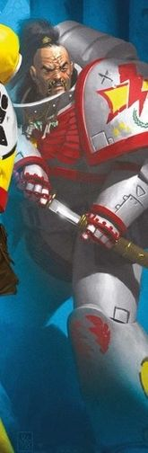
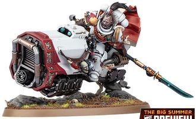

# 0644 苏博登可汗 Suboden Khan

精校状态：中文行文已逐段精校，部分术语仍为暂定

分类：人类帝国 / 白色疤痕

原文来源：https://www.bilibili.com/opus/1118610355230081033

原作者：帝国神选罐头

原文时间：2025年10月01日 10:19

[返回分类目录](目录.md) · [全书目录](../../目录.md)

<!-- A0644-B0001 -->
**英文原文**

Suboden Khan is a White Scars Captain, currently of the 1st Company.

<!-- /A0644-B0001 -->

<!-- A0644-B0002 -->

原译文

苏博登可汗是一名白色伤疤连长，目前就职于第一连队。

**校订译文**

苏博登可汗是白疤连长，按本篇记述，现任第一连连长。

**校注：** “现任”仅指所给英文稿的叙述时点，未以此断言出版最新状态。

<!-- /A0644-B0002 -->

<!-- A0644-B0003 图片 -->

<!-- A0644-B0004 -->

原译文

Suboden Khan 苏博登可汗

**校订译文**

Suboden Khan 苏博登可汗

<!-- /A0644-B0004 -->

<!-- A0644-B0005 -->
## History 历史

<!-- /A0644-B0005 -->

<!-- A0644-B0006 -->
**英文原文**

During the Third War for Armageddon he was the Captain of the 5th Company and charged with defending the vital oil and water drilling stations and processing plants located in the Armageddon Deadlands. In the opening days of the war, the Brotherhood clashed with the White Lightning Speed Kult during the Battle of Dante's Canyon, successfully driving the Ork into the frozen waters of the Tempest Ocean.

<!-- /A0644-B0006 -->

<!-- A0644-B0007 -->

原译文

在第三次阿玛吉多顿战争期间，他担任第五连队连长，负责保卫位于阿玛吉多顿死亡地带的重要燃油和水钻井站和加工厂。战争初期，兄弟会在但丁峡谷之战中与白色闪电飚速教派发生冲突，成功将欧克驱赶到暴风洋的冰冻水域。

**校订译文**

第三次阿玛吉多顿战争期间，苏博登担任第五连连长，负责保卫阿玛吉多顿死亡地带的重要油井、水井及加工设施。战争初期，他的兄弟会在但丁峡谷之战中迎击白色闪电飙速教派，成功将欧克逼入暴风洋冰冷的海水中。

<!-- /A0644-B0007 -->

<!-- A0644-B0008 -->
**英文原文**

Suboden reappeared during the Indomitus Crusade, leading the White Scars 5th Company against the Word Bearers in the Invasion of the Odoacer System. During the war, his fleet conducted devastating ambush elements that frustrated the Word Bearers under Amatnim Ur-Nabas Lash. Suboden led his surviving White Scars alongside Imperial Fists Lieutenant Heyd Calder in the final defense of the Cardinal Gate against the Word Bearers, surviving the battle but taking heavy losses amongst his men.

<!-- /A0644-B0008 -->

<!-- A0644-B0009 -->

原译文

苏博登在不屈远征期间再次出现，领导白色疤痕第五连队在奥多亚克星系的入侵中对抗怀言者。在战争期间，他的舰队进行了毁灭性的伏击，挫败了阿马特尼姆·乌尔-纳巴斯·莱什领导下的怀言者。苏博登率领他幸存的白色伤疤与帝国之拳连长海德·卡尔德一起，对红衣主教之门进行了最后的防御，对抗怀言者，在战斗中幸存下来，但他的部下遭受了重大损失。

**校订译文**

不屈远征期间，苏博登再度出战，率白疤第五连在奥多亚克星系入侵战中对抗怀言者。他的舰队发动了一连串毁灭性伏击，重挫阿马特尼姆·乌尔-纳巴斯·莱什麾下的怀言者。在枢机之门的最后防御战中，苏博登率幸存的白疤与帝国之拳副官海德·卡尔德并肩作战。他本人活了下来，部下却伤亡惨重。

**校注：** Lieutenant 为副官，原译连长误升其职衔。

<!-- /A0644-B0009 -->

<!-- A0644-B0010 -->
**英文原文**

After the grievous wounding of Jurga Khan in the War For Chogoris Suboden was promoted to Captain of the 1st Company.

<!-- /A0644-B0010 -->

<!-- A0644-B0011 -->

原译文

尤尔加可汗在乔高里斯战争中受重伤后，苏博登被提升为第一连长。

**校订译文**

尤尔加可汗在乔高里斯战争中受重伤后，苏博登被提升为第一连长。

<!-- /A0644-B0011 -->

<!-- A0644-B0012 -->
## Wargear 武器装备

原题：Wargear 战备

<!-- /A0644-B0012 -->

<!-- A0644-B0013 -->
**英文原文**

Subdoden Khan goes into battle mounted on a Grav-Bike equipped with an Onslaught Gatling Cannon while also wielding a Power Lance.

<!-- /A0644-B0013 -->

<!-- A0644-B0014 -->

原译文

苏博登可汗骑着一辆装有突击加特林炮的反重力摩托投入战斗，同时还挥舞着一把动力长枪。

**校订译文**

苏博登可汗骑乘装有猛攻加特林炮的反重力摩托出战，并持一柄动力长枪。

**校注：** 英文 Subdoden 与本篇其他位置 Suboden 不同，视为拼写疑点保留英文，中文统一苏博登；Onslaught 作为型号暂译猛攻。

<!-- /A0644-B0014 -->

<!-- A0644-B0015 图片 -->

<!-- A0644-B0016 -->

原译文

Suboden Khan 苏博登可汗

**校订译文**

Suboden Khan 苏博登可汗

<!-- /A0644-B0016 -->

本篇核心术语与暂定项

以下列出本篇出现的英文原形及核心术语表用词。同形词可能指不同对象，具体词义以本篇正文和校注为准；单复数、别名和仅见于图注的名称可能尚未列入。完整候选见[术语表](../../术语表/双语术语候选.csv)。

| 英文 | 采用中文 | 状态 |
| --- | --- | --- |
| Indomitus | 不屈学派 | 暂定·学派语境 |
| Imperial Fists | 帝国之拳 | 暂定 |
| Word Bearers | 怀言者 | 暂定·官方待核 |
| The Brotherhood | 兄弟会 | 暂定·官方待核 |
| Indomitus Crusade | 不屈远征 | 暂定·官方待核 |
| Brotherhood | 兄弟会 | 暂定·官方待核 |
| Armageddon | 阿玛吉多顿 | 暂定·官方待核 |
| Chogoris | 乔高里斯 | 暂定·官方待核 |
| Cardinal | 红衣主教 | 暂定 |
| Lance | 骑士矛阵 | 暂定·官方待核 |
| Lash | 鞭笞号 | 暂定·官方待核 |
| Lieutenant | 副官 | 暂定·官方待核 |
| White Scars | 白疤 | 官方已核 |
| Scars | 伤疤 | 暂定·官方待核 |
| Captain | 连长 | 暂定·官方待核 |
| Dante | 但丁 | 暂定·官方待核 |
| Heyd Calder | 海德·卡尔德 | 暂定·官方待核 |
| Cardinal Gate | 枢机之门 | 暂定·官方待核 |
| Suboden Khan | 苏博登可汗 | 暂定·官方待核 |
| White Lightning Speed Kult | 白色闪电飙速教派 | 暂定·官方待核 |
| Odoacer System | 奥多亚克星系 | 暂定·官方待核 |
| Amatnim Ur-Nabas Lash | 阿马特尼姆·乌尔-纳巴斯·莱什 | 暂定·官方待核 |
| Jurga Khan | 尤尔加可汗 | 暂定·官方待核 |
| Onslaught Gatling Cannon | 猛攻加特林炮 | 暂定·官方待核 |
| System | 星系（恒星系统） | 暂定·官方待核 |
| Power Lance | 动力长枪 | 暂定·官方待核 |

