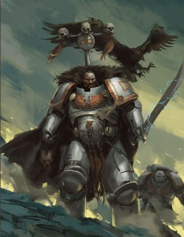
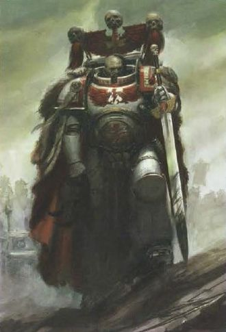
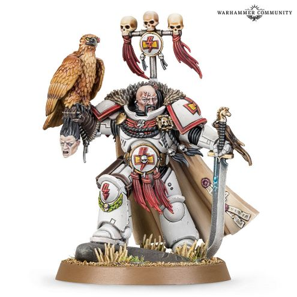

# 0645 科萨罗可汗 Kor'sarro Khan

精校状态：中文行文已逐段精校，部分术语仍为暂定

分类：人类帝国 / 白色疤痕

原文来源：https://www.bilibili.com/opus/1118616960927531027

原作者：帝国神选罐头

原文时间：2025年10月01日 10:45

[返回分类目录](目录.md) · [全书目录](../../目录.md)

原篇名：阔萨罗可汗 Kor'sarro Khan

<!-- A0645-B0001 -->
**英文原文**

"Surround yourself with the greatest warriors at your command, or cower in the deepest and darkest hole you can find. It matters not. I shall take your head for the Great Khan and for the Emperor."

<!-- /A0645-B0001 -->

<!-- A0645-B0002 -->

原译文

“让你身边有你指挥的最伟大的战士，或者蜷缩在你能找到的最深、最黑暗的洞穴里。这并不重要。我将为大汗和帝皇取你首级。"

**校订译文**

“把你麾下最强的战士都召集到身边，或缩进你能找到的最深、最黑暗的洞穴。无论如何，结局都一样。我必为大汗与帝皇取下你的首级。”

<!-- /A0645-B0002 -->

<!-- A0645-B0003 -->
**英文原文**

Kor'sarro Khan is Captain of the White Scars 3rd Company and the Chapter's fifty-first Master of the Hunt.

<!-- /A0645-B0003 -->

<!-- A0645-B0004 -->

原译文

阔萨罗可汗是白色伤疤第三连队的连长，也是战团的第五十一位狩猎大师。

**校订译文**

科萨罗可汗是白疤第三连连长，也是战团第五十一任狩猎大师。

<!-- /A0645-B0004 -->

<!-- A0645-B0005 图片 -->

<!-- A0645-B0006 -->

原译文

Kor'sarro Khan as a Primaris Space Marine 作为原铸星际战士的阔萨罗可汗

**校订译文**

Kor'sarro Khan as a Primaris Space Marine 作为原铸星际战士的科萨罗可汗

<!-- /A0645-B0006 -->

<!-- A0645-B0007 -->
## Biography 传记

<!-- /A0645-B0007 -->

<!-- A0645-B0008 -->
**英文原文**

Every twenty-five years, at the height of the Rites of Howling, the Master of the Hunt is dispatched to seek out a foe who, through luck or skill, has survived a confrontation with the White Scars. To aid him in his hunt, Kor'sarro will often select a small group of Battle brothers from his own company. A hunt can take months or years, as it is delayed by other engagements or duties, but it is never abandoned.

<!-- /A0645-B0008 -->

<!-- A0645-B0009 -->

原译文

每二十五年，在咆哮仪式的高潮期，狩猎大师都会被派去寻找一个通过运气或技能在与白色伤疤的对抗中幸存下来的敌人。为了帮助他狩猎，阔萨罗经常从自己的连队里挑选一小群战斗兄弟。狩猎可能需要数月或数年，因为其他任务或职责会推迟狩猎，但永远不会放弃。

**校订译文**

每隔二十五年，在咆哮仪式达到高潮时，狩猎大师便会奉命追杀一名曾凭运气或本领从白疤手中逃生的敌人。科萨罗通常从本连挑选少数战斗兄弟，协助自己完成狩猎。其他战事或职责可能使追猎延宕数月乃至数年，但他绝不会放弃。

<!-- /A0645-B0009 -->

<!-- A0645-B0010 -->
**英文原文**

Upon Kor'sarro's return to Chogoris, carrying the severed head of his quarry, a great celebration is held. When it is done, Kor'sarro surrenders the severed prey's head to the High Chaplain, who takes up a brand from the flames and burns the eyes from the skull. The hymn of vengeance is sung as the flesh burns and peels. The quarry's name is struck from the roster of the hunt, and its head masked in silver and set upon a lance, destined to forever stare out over the approach to the White Scars' Fortress-Monastery. Every step of the long road leading to the White Scars' citadel is lined in this manner.

<!-- /A0645-B0010 -->

<!-- A0645-B0011 -->

原译文

阔萨罗带着猎物被砍下的头颅回到乔高里斯后，会举行一场盛大的庆祝活动。当它完成时，阔萨罗将被切断的猎物的头交给至高牧师，至高牧师从火焰中拿起一个烙印，烧毁头骨上的眼睛。复仇的赞歌随着血肉的燃烧和剥落而吟唱。猎物的名字从狩猎名单中删除，它的头戴着银面具，插在长矛上，注定要永远凝视着通往白色伤疤要塞修道院的道路。通往白色伤疤城堡的漫长道路的每一步都是这样排列的。

**校订译文**

当科萨罗携猎物的首级返回乔高里斯时，战团便会举行盛大庆典。庆典结束后，他将首级交给至高教士。教士从烈火中取出燃烧的木条，焚去首级的双眼。血肉灼烧、剥落之际，众人齐唱复仇赞歌。猎物的名字随即从追猎名册上划去，头颅覆上银面、挑于长矛，永远俯视通往白疤要塞修道院的道路。通向堡垒的漫长道路两侧，处处排列着这样的首级。

<!-- /A0645-B0011 -->

<!-- A0645-B0012 -->
**英文原文**

As the fifty-first Master of the Hunt since the chapter's founding, Kor'sarro Khan has completed almost twenty such quests. Some of the White Scars' greatest enemies were slain by Kor'sarro Khan, such as the Daemon Prince Kernax Voldorius and Eldar pirate lord Varaliel. His other quarries have included the Daemon Prince known as Doomrider, and the Chaos Warlord Paramyx, who barely escaped his retribution during the Daemon incursion on Gehöft.

<!-- /A0645-B0012 -->

<!-- A0645-B0013 -->

原译文

作为自战团建立以来的第五十一位狩猎大师，阔萨罗可汗已经完成了近二十项这样的任务。一些白色疤痕最大的敌人被阔萨罗可汗杀死，如恶魔王子克纳克斯·沃尔多里乌斯和灵族海盗领主瓦拉列尔。他的其他猎物包括被称为末日骑手的恶魔王子和混沌军阀帕拉米克斯，后者在恶魔入侵格霍夫特期间几乎逃脱了他的惩罚。

**校订译文**

作为战团成立以来第五十一任狩猎大师，科萨罗可汗已完成近二十次追猎。他杀死过白疤的一些大敌，包括恶魔王子克纳克斯·沃尔多里乌斯和灵族海盗领主瓦拉列尔。他的猎物还包括恶魔王子末日骑手，以及混沌军阀帕拉米克斯；后者在格霍夫特的恶魔入侵期间，勉强逃过了他的复仇。

**校注：** barely escaped 是勉强逃脱，表示确已逃生；原译几乎逃脱反转了结局。

<!-- /A0645-B0013 -->

<!-- A0645-B0014 -->
### Notable actions 著名行动

<!-- /A0645-B0014 -->

<!-- A0645-B0015 -->
**英文原文**

Kor'sarro's first hunt concluded on the third moon of the gas giant planet Mai Nine.

<!-- /A0645-B0015 -->

<!-- A0645-B0016 -->

原译文

阔萨罗的第一次狩猎在气态巨行星麦九号的第三颗卫星上结束。

**校订译文**

科萨罗的第一次狩猎，终结于气态巨行星麦九号的第三颗卫星。

<!-- /A0645-B0016 -->

<!-- A0645-B0017 -->
**英文原文**

During the Siege of Mysibis, he slew a Tyranid Hive Tyrant in a duel.

<!-- /A0645-B0017 -->

<!-- A0645-B0018 -->

原译文

在迈西比斯围城中，他在一场决斗中杀死了一个泰伦虫巢暴君。

**校订译文**

在迈西比斯围城中，他在一场决斗中杀死了一个泰伦虫巢暴君。

<!-- /A0645-B0018 -->

<!-- A0645-B0019 -->
**英文原文**

In 813.M41, Khan was called to launch a punitive raid against the Tau world of Cano'var. However when he arrived he found that the world had already been claimed by Necrons under Overlord Zahndrekh. His Thunderhawk was shot down and despite a stubborn resistance, Kor'sarro and his men were taken prisoner. Kor'sarro soon learned that he was but one of dozens of prisoners and devised an escape with the Eldar Ranger Illic Nightspear. The ensuing breakout went well at first, but soon turned to disaster when they were confronted by Obyron. Khan and Nightspear were left the only survivors and were forced to do battle with the powerful Necron Vanguard, but in the end both were defeated. Unknown to either combatant, the entire battle was monitored by Zahndrekh himself, who, impressed by Kor'sarro's bravery and skill, and allowed both to depart.

<!-- /A0645-B0019 -->

<!-- A0645-B0020 -->

原译文

813.M41，可汗被召唤对卡诺瓦尔的钛世界发动惩罚性突袭。然而，当他到达时，他发现这个世界已经被霸主扎扎赫德克统治下的死灵所占领。他的雷鹰被击落，尽管进行了顽强抵抗，阔萨罗和他的部下还是被俘。阔萨罗很快意识到自己只是几十名囚犯中的一员，并与灵族游侠伊利克·夜矛一起策划了一次逃跑。随后的突破起初进展顺利，但当他们遇到奥比隆时，很快就变成了灾难。可汗和夜矛是唯一的幸存者，被迫与强大的死灵前卫作战，但最终都被击败了。两名战斗人员都不知道，整个战斗都由扎赫德克本人监控，他对阔萨罗的勇气和技能印象深刻，并允许两人离开。

**校订译文**

813.M41，科萨罗奉命对钛族世界卡诺瓦尔发动惩罚性突袭，抵达后却发现该世界已被扎赫德克霸主麾下的太空死灵占领。他的雷鹰被击落，他和部下虽顽强抵抗，仍遭俘虏。科萨罗很快发现，同样被关押的还有数十人，于是与灵族游侠伊利克·夜矛一同策划越狱。突围起初颇为顺利，遇上奥伯龙后却急转直下。最后仅有可汗与夜矛存活，两人被迫迎战这位强大的太空死灵王卫，却双双落败。他们都不知道，扎赫德克一直在观察战局。科萨罗的勇气与武艺令他折服，于是他放走了两人。

**校注：** 源文 Necron Vanguard 疑为已命名角色 Vargard Obyron 的职衔误写；按本书既定王卫奥伯龙理解并标注，英文原词不改。

<!-- /A0645-B0020 -->

<!-- A0645-B0021 -->
**英文原文**

On several occasions, Kor'sarro waged battle against Nullus of the Alpha Legion, Lieutenant of the Daemon Prince Kernax Voldorius. These engagements included the Lost Hope Incident, the battles below the glass seas of Sagrifarri, the Third Siege of Ex Bellum, as well as the battles on Cernis IV and Quintus.

<!-- /A0645-B0021 -->

<!-- A0645-B0022 -->

原译文

阔萨罗曾多次与阿尔法军团的努鲁斯、恶魔王子克纳克斯·沃尔多里乌斯的连长作战。这些交战包括迷失希望事件、萨格里法里玻璃海下的战斗、第三次前战争围城，以及塞尼斯四号和昆图斯之战。

**校订译文**

科萨罗曾多次与阿尔法军团的努鲁斯交战。努鲁斯是恶魔王子克纳克斯·沃尔多里乌斯的副手。他们的交锋包括迷失希望事件、萨格里法里玻璃海下的战斗、第三次埃克斯贝卢姆围城战，以及塞尼斯四号和昆图斯之战。

**校注：** 此处 Lieutenant 描述恶魔王子的下属，未指定星际战士副官编制，译副手；Ex Bellum 为地名，不能拆译成前战争。

<!-- /A0645-B0022 -->

<!-- A0645-B0023 -->
**英文原文**

In 943.M41 after Great Khan Kyublai went missing after battling the Dark Eldar Kabal of the Bloodied Talon, Kor'sarro sought vengeance by hunting down the Kabal. He returned two years later with the severed head of the Kabal's Archon, Kirareq, along with the heads of one thousand Dark Eldar warriors.

<!-- /A0645-B0023 -->

<!-- A0645-B0024 -->

原译文

943.M41，大汗忽必烈在与流血之爪阴谋团的黑暗灵族作战后失踪，阔萨罗通过追捕阴谋团寻求复仇。两年后，他带着阴谋团执政官基拉雷克被砍下的头，以及一千名黑暗灵族战士的头回来了。

**校订译文**

943.M41，大汗忽必烈在与流血之爪阴谋团交战后失踪，科萨罗随即追猎这个黑暗灵族阴谋团，为大汗复仇。两年后，他带回了执政官基拉雷克的首级，以及一千名黑暗灵族战士的头颅。

<!-- /A0645-B0024 -->

<!-- A0645-B0025 图片 -->

<!-- A0645-B0026 -->

原译文

Kor'sarro Khan before becoming a Primaris Space Marine 成为原铸星际战士之前的阔萨罗可汗

**校订译文**

Kor'sarro Khan before becoming a Primaris Space Marine 成为原铸星际战士之前的科萨罗可汗

<!-- /A0645-B0026 -->

<!-- A0645-B0027 -->
**英文原文**

In 999.M41 Kor'sarro Khan swore a blood oath to take the head of Tau Commander Shadowsun during the Battle of Mu'gulath Bay. The Maser of the Hunt met Shadowsun several times, engaging her in person at Blackshale Ridge. However despite his best efforts, Shadowsun survived. Nonetheless Kor'sarro managed to inflict such casualties on her command staff that her cool demeanor was replaced by a simmering fury. This led her to miscalculate and fall into an Imperial ambush at Voltoris, which Kor'sarro Khan helped plan. However Shadowsun escaped his clutches yet again, and he pledged to slay the Tau during Prefectia Campaign. After failing to do so, Kor'sarro next pursued the Tau leader during the Second Agrellan Campaign.

<!-- /A0645-B0027 -->

<!-- A0645-B0028 -->

原译文

999.M41，阔萨罗可汗在穆古拉湾之战中宣誓要拿下钛指挥官影阳的头颅。狩猎大师多次与影阳会面，并在黑页岩山脊吸引住她本人。然而，尽管他尽了最大的努力，影阳还是活了下来。尽管如此，阔萨罗还是给她的指挥人员造成了如此大的伤亡，以至于她冷静的举止被酝酿的愤怒所取代。这导致她误判，并在沃尔托利斯遭到帝国伏击，阔萨罗可汗帮助策划了这次伏击。然而，影阳再次逃脱了他的魔爪，他承诺在总督星战役中杀死钛。在未能做到这一点之后，阔萨罗在第二次阿格瑞兰战役中追捕了钛领袖。

**校订译文**

999.M41，科萨罗可汗在穆古拉湾之战中立下血誓，要取下钛族指挥官影阳的首级。狩猎大师数次与影阳交锋，并在黑页岩山脊亲自迎战她。尽管他全力以赴，影阳仍然活了下来。不过，科萨罗重创了她的指挥班子，使她一贯的冷静被压抑的怒火取代。她因此判断失误，落入帝国军在沃尔托利斯设下的伏击；科萨罗也参与策划了这场行动。但影阳再次从他手中逃脱。他继而誓言在总督星战役中杀死她，未果后，又在第二次阿格瑞兰战役中继续追猎这名钛族统帅。

**校注：** engaging her in person 指亲自与她交战，非吸引注意；Maser 应为 Master 的拼写疑点，英文保留。

<!-- /A0645-B0028 -->

<!-- A0645-B0029 -->
**英文原文**

After the creation of the Great Rift Kor'sarro Khan arrived at a critical juncture during the War for Chogoris, leading a charge that saved the White Scars homeworld from a force of Red Corsairs and Daemons. Seeking revenge against the Red Corsairs, he was converted into a Primaris Space Marine. Afterwards Chapter Master of the Scars Jubal Khan, grievously tortured by the Red Corsairs and thought to be suffering mentally, granted Kor'sarro his Psyber-Berkut Anzuq. While Kor'sarro accepted the gift, many believe this may be being used by Jubal to spy on Kor'sarro.

<!-- /A0645-B0029 -->

<!-- A0645-B0030 -->

原译文

在大裂隙形成后，阔萨罗可汗在乔高里斯战争期间到达了一个关键时刻，领导了一场从红海盗和恶魔的力量手中拯救白色伤疤家园世界的冲锋。为了向红海盗复仇，他被改造为原铸星际战士。后来，被红海盗严重折磨并被认为精神痛苦的白色伤疤战团长朱巴可汗授予阔萨罗他的灵能金雕安祖奇。虽然阔萨罗接受了这份礼物，但许多人认为这可能是朱巴用来监视阔萨罗的。

**校订译文**

大裂隙形成后，科萨罗可汗在乔高里斯战争的关键时刻赶到，率军冲锋，从红海盗与恶魔大军手中救下白疤母星。为了向红海盗复仇，他接受改造，成为原铸星际战士。此后，白疤战团长朱巴可汗将自己的灵能金雕安祖奇赠给了他。朱巴曾遭红海盗酷刑折磨，人们怀疑他的精神也受到了损伤。科萨罗接受了礼物，但许多人认为，朱巴可能正借这只金雕监视他。

<!-- /A0645-B0030 -->

<!-- A0645-B0031 图片 -->

<!-- A0645-B0032 -->

原译文

Kor'sarro Khan as a Primaris Space Marine Kor'sarro Khan as a Primaris Space Marine 作为原铸星际战士的阔萨罗可汗

**校订译文**

Kor'sarro Khan as a Primaris Space Marine Kor'sarro Khan as a Primaris Space Marine 作为原铸星际战士的科萨罗可汗

**校注：** 英文图注在底稿内重复一次，依保留英文原样要求未删；中文只保留一份。

<!-- /A0645-B0032 -->

<!-- A0645-B0033 -->
## Equipment 装备

<!-- /A0645-B0033 -->

<!-- A0645-B0034 -->
**英文原文**

Kor'sarro Khan goes into combat riding the bike Moondrakkan and armed with a bolt pistol and the ancient power sword Moonfang. Since becoming a Primaris Space Marine he wields the Psyber-Berkut Anzuq.

<!-- /A0645-B0034 -->

<!-- A0645-B0035 -->

原译文

阔萨罗可汗骑着摩托月龙投入战斗，手持爆矢手枪和古老的动力剑月牙。自从成为原铸星际战士以来，他一直在使用灵能金雕安祖奇。

**校订译文**

科萨罗可汗骑着名为“月龙”的摩托投入战斗，手持爆矢手枪与古老的动力剑“月牙”。成为原铸星际战士后，他还有灵能金雕安祖奇相伴。

**校注：** Psyber-Berkut 在上段明确为活体/改造金雕伙伴，wields 在此不译作挥舞武器。

<!-- /A0645-B0035 -->

本篇核心术语与暂定项

以下列出本篇出现的英文原形及核心术语表用词。同形词可能指不同对象，具体词义以本篇正文和校注为准；单复数、别名和仅见于图注的名称可能尚未列入。完整候选见[术语表](../../术语表/双语术语候选.csv)。

| 英文 | 采用中文 | 状态 |
| --- | --- | --- |
| Eldar | 灵族 | 暂定·语境区分 |
| Dark Eldar | 黑暗灵族 | 暂定·旧称对应 |
| Necrons | 太空死灵 | 官方已核对 |
| Bolt Pistol | 爆矢手枪 | 官方已核对 |
| Great Rift | 大裂隙 | 官方已核对 |
| Hive Tyrant | 虫巢暴君 | 官方已核对 |
| Emperor | 帝皇 | 官方已核对 |
| Daemon Prince | 恶魔亲王 | 官方已核对 |
| Kabal | 阴谋团 | 暂定·官方待核 |
| Archon | 执政官 | 官方已核对 |
| Chogoris | 乔高里斯 | 暂定·官方待核 |
| Prefectia | 总督星 | 暂定·官方待核 |
| Voltoris | 沃尔托利斯 | 暂定·官方待核 |
| Master | 导师（审判庭职衔）／舰务官（舰员职务） | 语境定译·官方待核 |
| High Chaplain | 至高教士 | 暂定·官方待核 |
| Chaplain | 教士 | 官方已核对 |
| Ancient | 旗手 | 官方已核对 |
| First Master | 首席舰务官（舰员职务）／第一大师（极限战士职衔） | 语境定译·官方待核 |
| Lance | 骑士矛阵 | 暂定·官方待核 |
| Lieutenant | 副官 | 暂定·官方待核 |
| White Scars | 白疤 | 官方已核 |
| Alpha Legion | 阿尔法军团 | 暂定·官方待核 |
| Scars | 伤疤 | 暂定·官方待核 |
| Founding | 建军 | 暂定·官方待核 |
| Jubal Khan | 朱巴可汗 | 暂定·官方待核 |
| Space Marine | 星际战士 | 暂定·官方待核 |
| Chapter | 战团 | 暂定·官方待核 |
| Fortress-monastery | 要塞修道院 | 暂定·官方待核 |
| Chapter Master | 战团长 | 暂定·官方待核 |
| Captain | 连长 | 暂定·官方待核 |
| Vanguard | 先锋 | 暂定·官方待核 |
| Primaris Space Marine | 原铸星际战士 | 暂定·官方待核 |
| Kor'sarro Khan | 科萨罗可汗 | 暂定·官方待核 |
| Master of the Hunt | 狩猎大师 | 暂定·官方待核 |
| Overlord | 霸主 | 官方已核对 |
| Kernax Voldorius | 克纳克斯·沃尔多里乌斯 | 暂定·官方待核 |
| Doomrider | 末日骑手 | 暂定·官方待核 |
| Illic Nightspear | 伊利克·夜矛 | 暂定·官方待核 |
| Prefectia Campaign | 总督星战役 | 暂定·官方待核 |
| Commander Shadowsun | 指挥官影阳 | 官方已核对 |
| Shadowsun | 影阳 | 官方词根参考·语境定译 |
| Vengeance | 复仇号 | 暂定·官方待核 |
| Brand | 布兰德 | 暂定·官方待核 |
| The Great Khan | 大汗 | 暂定·官方待核 |
| Rites of Howling | 咆哮仪式 | 暂定·官方待核 |
| Varaliel | 瓦拉列尔 | 暂定·官方待核 |
| Paramyx | 帕拉米克斯 | 暂定·官方待核 |
| Gehöft | 格霍夫特 | 暂定·官方待核 |
| Mai Nine | 麦九号 | 暂定·官方待核 |
| Ex Bellum | 埃克斯贝卢姆 | 暂定·官方待核 |
| Nullus | 努鲁斯 | 暂定·官方待核 |
| Kyublai | 忽必烈 | 暂定·官方待核 |
| Kabal of the Bloodied Talon | 流血之爪阴谋团 | 暂定·官方待核 |
| Kirareq | 基拉雷克 | 暂定·官方待核 |
| Anzuq | 安祖奇 | 暂定·官方待核 |
| Psyber-Berkut | 灵能金雕 | 暂定·官方待核 |
| Moondrakkan | 月龙 | 暂定·官方待核 |
| Moonfang | 月牙 | 暂定·官方待核 |
| The Dark | 《黑暗》 | 暂定·官方待核 |
| Quintus | 昆图斯 | 暂定·官方待核 |
| Agrellan | 阿格瑞兰 | 暂定·官方待核 |
| Lost Hope | 失落希望 | 暂定·官方待核 |
| Bolt | 爆矢 | 暂定·官方待核 |

