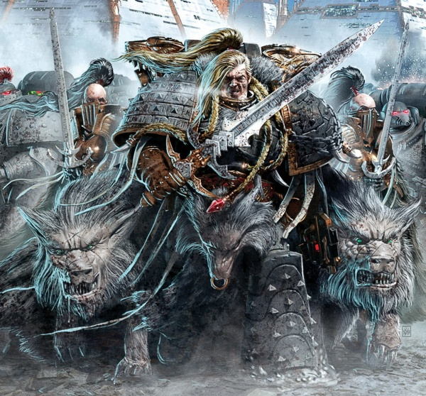
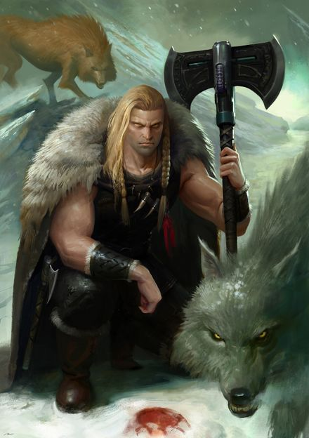
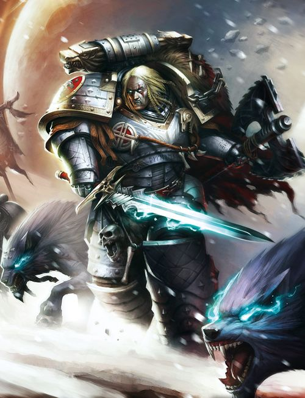
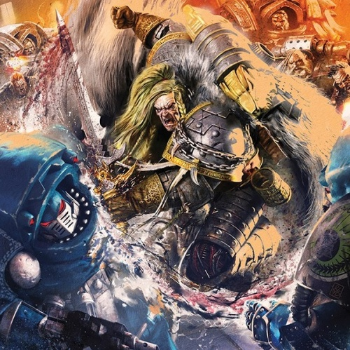
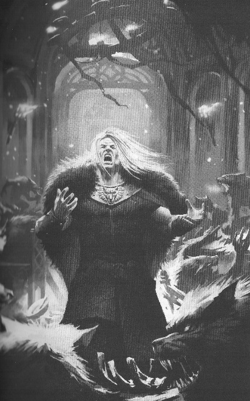
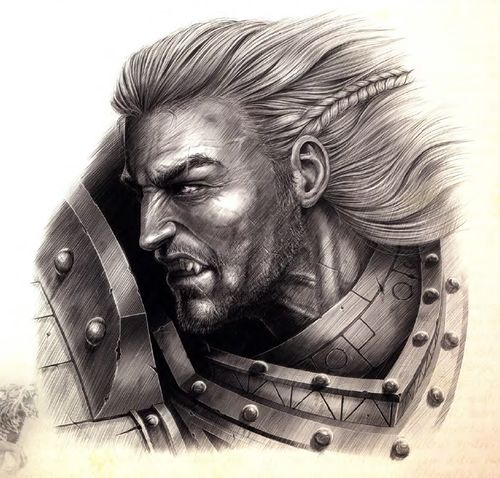

# 0646 黎曼·鲁斯 Leman Russ

精校状态：中文行文已逐段精校，部分术语仍为暂定

分类：人类帝国 / 太空野狼

原文来源：https://www.bilibili.com/opus/1058165072884400164

原作者：帝国神选罐头

原文时间：2025年04月21日 13:00

[返回分类目录](目录.md) · [全书目录](../../目录.md)

<!-- A0646-B0001 -->
**英文原文**

"Beat your thoughts to the mould of your will."

<!-- /A0646-B0001 -->

<!-- A0646-B0002 -->

原译文

“让你的思绪顺应你的意志。”

**校订译文**

“让你的思绪顺应你的意志。”

<!-- /A0646-B0002 -->

<!-- A0646-B0003 -->
**英文原文**

Leman Russ, also called The Wolf King, The Great Wolf or The Lord of Winter and War is the Primarch of the Space Wolves Chapter of the Space Marines. He along with Angron and Vulkan, was considered to be one of the mightiest warriors amongst the Primarchs. Known for his fierce and wild personality, Leman Russ considered himself the Emperor's most loyal son and executioner, unquestionably carrying out the punishment of the Master of Mankind. The Chaos emissary to Lorgar called him the Brawler.

<!-- /A0646-B0003 -->

<!-- A0646-B0004 -->

原译文

黎曼·鲁斯，也被称为“狼王”、“头狼”或“寒冬与战争之王”，是星际战士太空野狼战团的。他与安格隆和沃坎一起被认为是最强大的战士之一。以其凶猛和狂野的性格而闻名，黎曼·鲁斯认为自己是帝皇最忠诚的儿子和刽子手，毫无疑问地执行了人类之主的惩罚。混沌派去珞珈的使者称他为“斗士”。

**校订译文**

黎曼·鲁斯又称“狼王”“头狼”或“寒冬与战争之王”，是星际战士太空野狼战团的原体。他与安格隆、沃坎一同被视为原体中最强大的战士之一。鲁斯性情凶猛狂放，自认是帝皇最忠诚的儿子与刽子手，会毫不质疑地代人类之主执行惩罚。向珞珈传话的混沌使者称他为“斗士”。

<!-- /A0646-B0004 -->

<!-- A0646-B0005 图片 -->

<!-- A0646-B0006 -->

原译文

Leman Russ leads the Wolves of Fenris on Prospero 黎曼·鲁斯领导芬里斯之狼在普罗斯佩罗

**校订译文**

Leman Russ leads the Wolves of Fenris on Prospero 黎曼·鲁斯在普洛斯佩罗率领芬里斯之狼

<!-- /A0646-B0006 -->

<!-- A0646-B0007 -->
## History 历史

<!-- /A0646-B0007 -->

<!-- A0646-B0008 -->
### Youth 幼年

<!-- /A0646-B0008 -->

<!-- A0646-B0009 -->
**英文原文**

When the Primarchs were spread throughout the galaxy by the forces of Chaos, one came to land in the far north west of the galaxy on a remote ice world named Fenris. He was adopted by a Fenrisian she-wolf and raised among the wolves, with his two wolf brothers Freki and Geri. One harsh winter, the wolves attacked a village and stormed the food storage facilities. The villagers fought off the wolves, but Leman Russ fought them off so viciously that all of his brothers escaped alive. Thengir, King of the people of Russ, sent a raiding party of hunters and villagers to remove this menace for good with poisoned arrows and knives sharp enough to slice through oak.

<!-- /A0646-B0009 -->

<!-- A0646-B0010 -->

原译文

当混沌势力将原体分散到整个银河系时，其中一位来到银河系西北部一个名为芬里斯的偏远冰雪世界。他被一只芬里斯母狼收养，并与他的两个狼兄弟弗雷基和盖里一起在狼群中长大。一个严冬，狼群袭击了一个村庄，冲进了食物储存设施。村民们击退了狼群，但黎曼·鲁斯如此恶毒地击退了人们以至于他的所有兄弟都活了下来。恩吉尔，鲁斯人民的国王，派遣了一支由猎人和村民组成的突袭队，用毒箭和锋利到足以切开橡树的刀彻底消除这一威胁。

**校订译文**

混沌势力将原体散落到银河各地时，其中一人降临在银河西北远方的冰雪世界芬里斯。他被一只芬里斯母狼收养，与弗雷基和盖里两位狼兄弟一同在狼群中长大。某个严冬，狼群袭击村庄，闯入粮仓。村民奋力反击，黎曼·鲁斯则凶悍地挡住他们，让自己的兄弟全部逃生。鲁斯部族之王滕吉尔随后派出由猎人和村民组成的队伍，携带毒箭及足以劈开橡木的利刃，要将这个威胁彻底铲除。

<!-- /A0646-B0010 -->

<!-- A0646-B0011 图片 -->

<!-- A0646-B0012 -->

原译文

Young Leman Russ 年轻的黎曼·鲁斯

**校订译文**

Young Leman Russ 年轻的黎曼·鲁斯

<!-- /A0646-B0012 -->

<!-- A0646-B0013 -->
**英文原文**

The raiding party killed many members of the pack, including the she-wolf and one of his wolf brothers. Leman Russ was shot many times, and then captured, and brought, bound and gagged before King Thengir. Leman Russ proved himself to be more than just another wolf, and was eventually taken in by the king himself. Among men for the first time, Leman quickly learned their skills, showing a natural aptitude for the way of the warrior. He learned to speak, and mastered their weapons - iron axes and swords. He was quick to roar with laughter or sing tunelessly and he slowly realized that he was more human than wolf, but superior to both. Eventually, Leman Russ became sufficiently civilized to warrant a true name. The King named him Leman (Leman of the Russ). Later in his life, he is said to have been able to turn back whole armies of the king's enemies by himself without a scratch, to tear whole oak trees from the ground and snap them over his back, and to wrestle Fenrisian Mammoths to the ground. When King Thengir died, there was no question as to who should succeed him. Therefore, King Leman Russ took to the throne.

<!-- /A0646-B0013 -->

<!-- A0646-B0014 -->

原译文

突袭队杀死了许多狼群成员，包括母狼和他的一个狼兄弟。黎曼·鲁斯被射中了很多次，然后被捕，被带到恩吉尔国王面前，被捆绑和塞住嘴。黎曼·鲁斯证明了自己不仅仅是一只狼，最终被国王收养了。在第一次的男人中，黎曼很快学会了他们的技能，表现出了天生的战士天赋。他学会了说话，掌握了他们的武器——铁斧和剑。他很快就会哈哈大笑或没调地唱歌，慢慢意识到自己比狼更像人，但比两者都优越。最终，黎曼·鲁斯变得足够文明，值得拥有一个真正的名字。国王给他起名叫黎曼（鲁斯的黎曼）。据说，在他后来的生活中，他能够独自一人毫无伤痕地击退国王敌人的整支军队，从地上撕下整棵橡树，把它们套在背上，并把芬里斯猛犸摔到地上。当恩吉尔国王去世时，谁应该继任是毫无疑问的。因此，黎曼·鲁斯国王登上了王位。

**校订译文**

这支队伍杀死了许多狼，包括那只母狼和鲁斯的一位狼兄弟。鲁斯身中数箭后被俘，遭捆绑、堵嘴，押到滕吉尔王面前。他证明自己并非普通野狼，最终被国王收养。初次与人类共同生活，黎曼便迅速学会他们的技艺，尤其展现了与生俱来的武艺天赋。他学会说话，掌握铁斧和利剑的使用方法，动辄放声大笑或唱起不成调的歌。他逐渐意识到，自己更接近人而非狼，却又超越两者。等到他足够适应人类社会，国王便赐予他真正的名字：黎曼，即“鲁斯部族的黎曼”。据说，后来他能独力击退敌军而毫发无损，将整棵橡树连根拔起、架在背上折断，还能把芬里斯猛犸摔倒在地。滕吉尔去世后，王位继承人毫无争议，黎曼·鲁斯遂登上王座。

**校注：** 本段记一位狼兄弟被杀，开头则列出弗雷基与盖里两位狼兄弟；不擅自确定阵亡者是谁。

<!-- /A0646-B0014 -->

<!-- A0646-B0015 -->
**英文原文**

He was said to have been the best leader, no one could stand against him and it was not long before the tales came to the Emperor's notice. The Emperor recognized this figure as a Primarch and travelled to Fenris. He entered Russ's court, cloaked in runes of disguise and confusion. The natives shrunk from this new presence. Russ refused to pay him homage as the Master of Mankind. Russ challenged the Emperor to a series of tests. The first challenge was an eating one, this the Emperor lost. The second challenge was a drinking one. This the Emperor also failed. For the third challenge Russ boasted he could defeat the Emperor in combat. This time, after hours of intense brawling the Emperor eventually defeated Russ, felling him with a blow from his mighty power glove. Leman admitted defeat and swore to serve the Emperor. The first of his brother Primarchs he met was Horus, at that time the only other of the Emperor's sons discovered. Russ learned Gothic in just a few days, and recognized Horus's jealousy and disdain for his savage ways. Despite this, Russ expressed a desire for friendship and wanted to brawl with his brother. Just weeks later, Russ was placed at the head of his Legion (newly named the Space Wolves) and joined the Great Crusade. He was armed with a thrice blessed suit of power armour and a new sword forged from the maw of the Great Kraken Gormenjarl and reputably, the blade could cleave the ice mountains of Fenris in half.

<!-- /A0646-B0015 -->

<!-- A0646-B0016 -->

原译文

据说他是最好的领袖，没有人能对抗他，不久这些故事就引起了帝皇的注意。帝皇认出这个人物是一位原体，前往芬里斯。他披着伪装和迷惑的符文，进入了鲁斯的宫廷。当地人对这种新的存在望而却步。鲁斯拒绝奉他作为人类之主。鲁斯向帝皇挑战了一系列考验。第一个挑战是吃，帝皇输了。第二个挑战是饮酒。帝皇也失败了。对于第三个挑战，鲁斯吹嘘他可以在战斗中击败皇帝。这一次，经过数小时的激烈争斗，帝皇最终击败了鲁斯，用他强大的动力臂铠一击将他击倒。黎曼承认失败，并发誓为帝皇服务。他遇到的第一个兄弟原体是荷鲁斯，当时是帝皇唯一发现的儿子。鲁斯在短短几天内学会了哥特语，并意识到荷鲁斯对他野蛮行径的嫉妒和蔑视。尽管如此，鲁斯还是表达了对友谊的渴望，并想和他的兄弟打斗。几周后，鲁斯被任命为他的军团（新命名为太空野狼）的首领，并加入了大远征。他装备了一套三重祝福的动力盔甲和一把从大海怪血腥领主之喉锻造而成的新剑，这把剑可以把芬里斯的冰山劈成两半。

**校订译文**

据说，他是无可匹敌的杰出领袖。关于他的传说很快传入帝皇耳中；帝皇认出这正是一位原体，便前往芬里斯。他以符文隐去身份、扰乱旁人的感知，走进鲁斯的宫廷，当地人纷纷畏缩退让。鲁斯拒绝向这位人类之主行礼，反而提出一连串较量。第一场比食量，帝皇败下阵来；第二场比酒量，帝皇再次落败。第三场，鲁斯夸口能在战斗中打败帝皇。经过数小时的激烈搏斗，帝皇终于以强大的动力拳套将他击倒。黎曼认输，宣誓为帝皇效力。他最先见到的原体兄弟是荷鲁斯；当时，除了他自己，帝皇只找回了荷鲁斯。鲁斯数日内便学会了哥特语，也察觉到荷鲁斯的嫉妒，以及对自己粗野举止的鄙夷。即便如此，他仍希望与兄弟交好，也想与他切磋一番。数周后，鲁斯接掌刚改名为太空野狼的军团，加入大远征。他获赐一套经过三重祝福的动力甲，以及一柄用巨型海怪戈门雅尔的颚部材料打造的新剑。据说，这柄剑足以劈开芬里斯的冰山。

**校注：** Gormenjarl 是海怪专名，原译血腥领主无对应依据，暂音译戈门雅尔。此处只称新剑，未擅自与末节具体武器名合并。

<!-- /A0646-B0016 -->

<!-- A0646-B0017 -->
### Great Crusade 大远征

<!-- /A0646-B0017 -->

<!-- A0646-B0018 -->
**英文原文**

Leman fought well during the Great Crusade, gaining the reputation as a cunning and fierce, as well as slightly unstable, warrior and leader. After the Wheel of Fire Campaign in which a third of the legion was lost against Orks, Russ was rewarded with The Fang as well as the Spear of Russ. During the course of the Great Crusade Russ saw little of the Emperor. Instead, he received much of his counsel from Malcador, and the two formed a strong bond.

<!-- /A0646-B0018 -->

<!-- A0646-B0019 -->

原译文

黎曼在大远征期间打得很好，赢得了狡猾、凶猛、有点不稳定的战士和领袖的声誉。在火轮战役中，三分之一的军团在与欧克的战斗中损失，鲁斯获得了长牙堡和鲁斯之矛作为奖励。在大远征期间，鲁斯很少见到帝皇。相反，他从马卡多那里得到了很多建议，两人建立了牢固的联系。

**校订译文**

鲁斯在大远征中战功卓著，以机敏、凶猛而又有些喜怒无常的战士与统帅形象闻名。火轮战役中，军团在对欧克作战时折损三分之一兵力；战后，鲁斯获赐长牙堡与鲁斯之矛。整个大远征期间，他很少见到帝皇，更多时候接受马卡多的指点，两人由此结下深厚情谊。

<!-- /A0646-B0019 -->

<!-- A0646-B0020 图片 -->

<!-- A0646-B0021 -->

原译文

Leman Russ during the Great Crusade 大远征期间的黎曼·鲁斯

**校订译文**

Leman Russ during the Great Crusade 大远征期间的黎曼·鲁斯

<!-- /A0646-B0021 -->

<!-- A0646-B0022 -->
**英文原文**

During a conflict on the word of Dulan, Russ and his Wolves fought alongside the Dark Angels Legion. The leader of this particular planet had insulted Leman Russ's honour, and so he wanted to defeat the leader personally for the insult. The two Legions, each led by their Primarch, assaulted the rebels' fortress. Leman Russ burst into the throne room just in time to see Lion El'Jonson beheading the enemy leader. Angry that the honour was not his, Leman Russ marched up to the arrogant Lion. This led to a battle that lasted a week or more, until finally Russ saw how immature their squabble was and started laughing. Lion El'Jonson took this as Russ mocking him and in what was considered a cowardly act, knocked Russ unconscious whilst he was laughing. El'Jonson left the planet with his legion. This led to a bitter feud between the Legions (and subsequent Chapters), which lasts to this day - although recent events may finally have led to an end to the rivalry, though it is still customary for selected champions from both sides to engage in a (usually) non-lethal duel.

<!-- /A0646-B0022 -->

<!-- A0646-B0023 -->

原译文

在杜兰世界冲突中，鲁斯和他的野狼与黑暗天使军团并肩作战。这个特殊星球的领导人侮辱了黎曼·鲁斯的荣誉，所以他想亲自击败这位领导人。这两个军团，每个军团都由他们的原体领导，袭击了叛军的堡垒。黎曼·鲁斯冲进王座室，正好看到莱昂·艾尔庄森斩首敌方领袖。黎曼·鲁斯对荣誉不是他的感到愤怒，他走向傲慢的莱昂。这导致了一场持续一周或更长时间的战斗，直到最后鲁斯看到他们的争吵是多么不成熟，开始大笑。莱昂·艾尔庄森认为这是鲁斯在嘲笑他，在被认为是懦弱的行为中，在鲁斯笑的时候把他打晕了。艾尔庄森带着他的军团离开了这个星球。这导致了军团（和随后的战团）之间的激烈争斗，一直持续到今天 — 最近的事件可能最终导致了竞争的结束，尽管双方选定的冠军仍然习惯于进行（通常）非致命的决斗。

**校订译文**

杜兰战争期间，鲁斯率太空野狼与黑暗天使军团并肩作战。当地统治者曾侮辱鲁斯的荣誉，因此他决意亲手击败对方。两支军团各由原体率领，攻入叛军堡垒；鲁斯冲进王座室时，却正好看见莱昂·艾尔’庄森斩下敌方领袖的头颅。夺首之功被抢走，令鲁斯勃然大怒，上前与傲慢的莱昂冲突。两人的搏斗持续了一周甚至更久，直到鲁斯意识到这场争执何其幼稚，忽然大笑起来。莱昂却认为他在嘲笑自己，趁他大笑时将他击昏；这一举动被视为怯懦之举。随后，莱昂率军离开。两军团及其后来的战团由此结下深怨，延续至本篇所述时代。不过，近来的事件或许已使双方逐渐和解；各派一名勇士进行通常不致死的决斗，仍是双方保留的传统。

**校注：** 一周或更长时间的搏斗、莱昂出拳被视为怯懦，均为所给英文的叙事与评价，未作跨版本事实定论。

<!-- /A0646-B0023 -->

<!-- A0646-B0024 -->
**英文原文**

Later, when Angron refused to end the Butcher's Nails surgery on his World Eaters Legion, the Emperor dispatched Russ and his Wolves to Malkoya to bring Angron back to Terra to answer for his insubordination. However what resulted was a brief but bloody clash between the World Eaters and Space Wolves, and Russ engaged Angron himself in single combat. In the duel, Russ held back and was defeated by the Red Angel. Russ' true stratagem soon became apparent when it was revealed that Angron had allowed himself to become encircled by Space Wolves forces during the duel. Russ tried to convince Angron to stand down, explaining to him that while he had bested him in single combat, Angron was nonetheless trapped and that this was a result of his own bloodlust and failure to lead his Legion. Infuriated, Angron refused to stand down and Russ sadly realised his brother was a lost cause. With a howl, Russ ordered the Space Wolves to withdraw. Russ later clashed with another one of his brothers on the Great Crusade, this time almost coming to blows with Magnus the Red over the fate of the Great Library of Ark Reach Secundus. A direct confrontation was only stopped thanks to the intervention of Lorgar. Such was Russ' rage at Magnus that day that he made a blood vow to settle their score.

<!-- /A0646-B0024 -->

<!-- A0646-B0025 -->

原译文

后来，当安格隆拒绝结束对他的吞世者军团的屠夫之钉手术时，帝皇派遣鲁斯和他的野狼前往马尔科亚，将安格隆带回泰拉，以回应他的不服从。然而，结果是吞世者和太空野狼之间发生了一场短暂而血腥的冲突，鲁斯在一场战斗中与安格隆本人交战。在决斗中，鲁斯退缩了，被红天使打败了。当有消息称安格隆在决斗中被太空野狼部队包围时，鲁斯的真正战略很快就变得清晰起来。鲁斯试图说服安格隆解除戒备，向他解释说，虽然他在一场战斗中击败了他，但安格隆还是被困住了，这是他自己的嗜血欲望和未能领导他的军团的结果。愤怒的安格隆拒绝解除戒备，鲁斯悲伤地意识到他的兄弟已经失败了。随着嚎叫，鲁斯命令太空野狼撤退。后来，在大远征中，鲁斯与他的另一个兄弟发生了冲突，这一次，他几乎要与赤红之马格努斯就方舟第二河段大图书馆的命运发生冲突。由于珞珈的干预，直接对抗才得以停止。那天，鲁斯对马格努斯的愤怒如此之大，以至于他发誓要了结他们的恩怨。

**校订译文**

后来，安格隆拒绝停止为吞世者植入屠夫之钉。帝皇遂派鲁斯和太空野狼前往马尔科亚，将他带回泰拉问责。结果，两军团爆发了一场短暂而血腥的冲突，鲁斯也与安格隆展开单挑。鲁斯在决斗中有所留手，被红天使击败；但他的真正用意随即显现：安格隆专注于决斗，不知不觉已陷入太空野狼的包围。鲁斯试图让他停手，指出安格隆虽赢了单挑，却因嗜血冲动、疏于统率军团而落入死地。安格隆暴怒，拒绝罢战。鲁斯悲哀地意识到兄弟已无可挽回，长啸一声，命令太空野狼撤退。此后，鲁斯又在大远征中与另一位兄弟发生冲突：他为了方舟疆域塞昆杜斯大图书馆的命运，险些与红魔马格努斯动武。珞珈出面才阻止了冲突，但鲁斯怒火未消，立下血誓，日后必与马格努斯清算。

**校注：** held back 指有所保留、未出全力，原退缩改变战术含义；a lost cause 指无可挽回，并非输掉战斗。

<!-- /A0646-B0025 -->

<!-- A0646-B0026 -->
**英文原文**

Despite being considered "ill-tempered" and "argumentative," Russ was held in great esteem by his brother, Roboute Guilliman, who privately referred to him, along with Rogal Dorn, Sanguinius, and Ferrus Manus as "the dauntless few," the four primarchs who could be counted on to carry out their father's designs. Guilliman once said that he could win any war, outright, if he had one of those four and his Legion alongside the Ultramarines. Such was Russ' deadly abilities and loyalty that the Emperor appointed him as his unofficial Executioner and "Enforcer", and it is suggested he had something to do with the fates of the Lost Primarchs.

<!-- /A0646-B0026 -->

<!-- A0646-B0027 -->

原译文

尽管被认为是“脾气暴躁”和“爱争论”，但鲁斯受到了他的兄弟罗伯特·基里曼的极大尊重，他私下里称他与罗格·多恩、圣吉列斯和费鲁斯·马努斯为“少数无畏者”，这四位原体可以指望他们执行父亲的计划。基里曼曾说过，如果他有这四个人中的一个和他的极限战士军团并肩作战，他完全可以赢得任何战争。正是由于鲁斯的致命能力和忠诚，帝皇任命他为非官方的刽子手和“执行者”，有人认为他与失落原体的命运有关。

**校订译文**

尽管鲁斯被认为脾气暴躁、好与人争论，罗保特·基里曼仍极为敬重他。基里曼私下将鲁斯、罗格·多恩、圣吉列斯和费鲁斯·马努斯并称为“少数无畏者”，认为这四位兄弟都能可靠地贯彻父亲的意图。他曾说，只要四人中任意一人率其军团与极限战士并肩作战，自己便有把握赢得任何战争。鲁斯的杀伐本领与忠诚，使帝皇将他视为非正式的刽子手和执法者。也有说法暗示，失落原体的命运与他有关。

**校注：** 英文 one of those four and his Legion 指某位原体及该原体自己的军团，而非仅一人加入极限战士。

<!-- /A0646-B0027 -->

<!-- A0646-B0028 -->
### Horus Heresy 荷鲁斯之乱

原题：Horus Heresy 荷鲁斯叛乱

<!-- /A0646-B0028 -->

<!-- A0646-B0029 -->
**英文原文**

Many years passed, and many more battles. Thousands of worlds were reclaimed by the Imperium, but eventually the golden age came to an end. The Emperor sent Leman Russ and his Space Wolves to deal with Magnus the Red and the Thousand Sons legion, who the Emperor believed to be the true heretics; Magnus had used sorcery to warn the Emperor of Horus after being told not to and nearly ruining his secret project. Horus, seeking to either eliminate or turn the Magnus, manipulated Russ into launching an all-out assault on the Thousand Son homeworld of Prospero as opposed to simply bringing Magnus back to Terra. In an attempt to find a peaceful solution with the Thousand Sons Russ sent a plea through what he thought was a Hidden One, Kasper Hawser, though in truth he was a Chaos pawn and thus the message was never received.\[8a\] Ultimately Prospero was assaulted and bombarded. Thousands died within days. In the final battle between Russ and Magnus, it is said that Russ blinded Magnus and then broke the Cyclops's back over his knee, and just as Russ was about to deliver the final blow, Magnus used his sorcery to escape.

<!-- /A0646-B0029 -->

<!-- A0646-B0030 -->

原译文

许多年过去了，还有更多的战斗。帝国收复了数千个世界，但最终黄金时代结束了。帝皇派黎曼·鲁斯和他的太空野狼去对付赤红之马格努斯和千子军团，帝皇认为他们是真正的异端；马格努斯在被告知不要破坏他的秘密计划后，用巫术警告帝皇关于荷鲁斯。荷鲁斯试图消灭或改造马格努斯，操纵鲁斯对千子家园世界普罗斯佩罗发动全面进攻，而不是简单地将马格努斯带回泰拉。为了与千子找到和平解决方案，鲁斯通过他认为是隐藏者的卡斯佩尔·豪瑟尔发出了请求，尽管事实上他是一个混沌的棋子，因此从未收到过这条信息。最终普罗斯佩罗遭到袭击和轰炸。数千人在几天内死亡。在鲁斯和马格努斯之间的最后一场战斗中，据说鲁斯让马格努斯失明，然后在膝盖上摔断了独眼巨人的后背，就在鲁斯即将进行最后一击时，马格努斯用他的魔法逃跑了。

**校订译文**

岁月流逝，战事接连不断，帝国收复了数千个世界，但黄金时代终究走向终结。马格努斯违反禁令，施展巫术向帝皇警告荷鲁斯的威胁，险些毁掉帝皇的秘密计划。帝皇因此将他和千子视为异端，派鲁斯与太空野狼前去处置。荷鲁斯企图除掉马格努斯或迫使他倒向自己，便操纵鲁斯，将原本押送马格努斯返回泰拉的任务变成对千子母星普洛斯佩罗的全面攻击。鲁斯仍试图和平解决问题，他以为卡斯佩尔·豪瑟尔是一名隐者，便通过此人传达请求。然而，豪瑟尔实际上是混沌的棋子，千子从未收到这条讯息。\[8a\] 最终，普洛斯佩罗遭到轰炸与进攻，数日内便有数千人死亡。据说，在最后的原体决斗中，鲁斯刺瞎马格努斯，再将这位独眼巨人的脊背折断于膝上。就在他准备补上致命一击时，马格努斯以巫术逃走。

**校注：** 禁令针对使用巫术； nearly ruining the secret project 是违禁行为的后果。turn Magnus 指拉拢其叛变，非身体改造。Hidden One 暂译隐者，身份由鲁斯误判。

<!-- /A0646-B0030 -->

<!-- A0646-B0031 图片 -->

<!-- A0646-B0032 -->

原译文

Leman Russ battles the Alpha Legion during the Heresy 叛乱期间黎曼·鲁斯和阿尔法军团作战

**校订译文**

Leman Russ battles the Alpha Legion during the Heresy 叛乱期间黎曼·鲁斯和阿尔法军团作战

<!-- /A0646-B0032 -->

<!-- A0646-B0033 -->
**英文原文**

After Prospero Russ and his forces were forced into a rout by the Alpha Legion and forced to take shelter at the Alaxxes Nebula. Surrounded on all sides and abandoned by the White Scars, Russ consigned himself to defeat and admitted to Bjorn that blindly serving as the Emperor's Executioner had been a mistake. Russ pledged to take his own path from now on, and led a desperate last stand against the Alpha Legion, unwittingly battling Alpharius himself who was disguised as one of his Lernaean bodyguards. However Russ' forces were eventually saved by a detachment of Dark Angels and he returned to Terra. There, Russ helped Malcador organize the plan to have the Knights-Errant assassinate Horus during the Battle of Molech. He then announced his plans to leave Terra and take the fight back to the traitors. Russ was still on Terra when Jaghatai Khan and his Legion arrived. Upon meeting the brother who had abandoned him at Alaxxes, Russ expressed his seething anger but admitted that Terra needed all the help it could get.

<!-- /A0646-B0033 -->

<!-- A0646-B0034 -->

原译文

普罗斯佩罗之后，罗斯和他的部队被阿尔法军团强行击溃，被迫在阿拉克西斯星云避难。被四面包围，被白色伤疤遗弃，鲁斯屈服于失败，并向比约恩承认，盲目担任帝皇的刽子手是一个错误。鲁斯承诺从现在开始走自己的路，并领导了一场对抗阿尔法军团的绝望的最后一战，无意中与伪装成他的勒拿护卫之一的阿尔法瑞斯本人作战。然而，鲁斯的部队最终被一支黑暗天使分队救了出来，他回到了泰拉。在那里，鲁斯帮助马卡多组织了让游侠骑士在摩洛之战中暗杀荷鲁斯的计划。然后，他宣布了离开泰拉的计划，并将战斗带回叛徒手中。察合台可汗和他的军团到达时，鲁斯还在泰拉。在阿拉克西斯遇到抛弃他的兄弟后，鲁斯表达了他愤怒的情绪，但承认泰拉需要一切可能的帮助。

**校订译文**

普洛斯佩罗之战后，鲁斯的部队被阿尔法军团击溃，被迫退入阿拉克斯星云。四面受敌、又未获白疤援助的鲁斯一度认定败局已定，并向比约恩承认，自己盲目充当帝皇刽子手是个错误。他立誓今后走自己的路，率军向阿尔法军团发起绝望的最后抵抗；交战中，他还在不知情的情况下对上了伪装成勒拿终结者亲卫的阿尔法瑞斯本人。最终，一支黑暗天使分遣队救下了鲁斯的部队，他得以返回泰拉。在那里，他协助马卡多筹划由游侠骑士在摩洛之战期间刺杀荷鲁斯的行动，并宣布准备离开泰拉，主动反攻叛军。察合台可汗率军抵达时，鲁斯尚在泰拉。他对这位曾在阿拉克斯弃自己而去的兄弟怒意难平，却也承认泰拉需要一切援助。

<!-- /A0646-B0034 -->

<!-- A0646-B0035 -->
**英文原文**

After returning to Terra Russ was changed. He challenged the wisdom of the Emperor openly and expressed regret for being manipulated into destroying Prospero. Thinking that it was his destiny to deal with Horus personally, Russ eventually led the Wolves out from Terra to try and engage the Warmaster despite disagreement from Rogal Dorn and Sanguinius, who wished him to remain for the coming siege. Thanks to the efforts of the Knights-Errant during the Battle of Molech, Russ was able to track the location of the Vengeful Spirit in order to confront Horus directly. Before moving on Horus, however, he returned to Fenris to conduct a ritual with his Rune Priests to try and ascertain a weakness in the Warmaster.

<!-- /A0646-B0035 -->

<!-- A0646-B0036 -->

原译文

回到泰拉之后，鲁斯发生了变化。他公开质疑帝皇的智慧，并对被操纵摧毁普罗斯佩罗表示遗憾。考虑到这是他个人与荷鲁斯打交道的命运，鲁斯最终带领野狼离开泰拉，试图与战帅交战，尽管罗格·多恩和圣吉列斯不同意，他们希望他在即将到来的围城中留下来。在摩洛战役中，由于游侠骑士的努力，鲁斯能够追踪复仇之魂号的位置，以便直接对抗荷鲁斯。然而，在前往荷鲁斯所在之前，他回到芬里斯，与他的符文牧师一起举行仪式，试图确定战帅的弱点。

**校订译文**

回到泰拉后，鲁斯已与从前不同。他公开质疑帝皇的判断，懊悔自己受人操纵、毁掉了普洛斯佩罗。他认为亲自对付荷鲁斯是自己的宿命，最终不顾多恩和圣吉列斯希望他留下守城的劝阻，率太空野狼离开泰拉，前去迎战战帅。游侠骑士在摩洛之战中的行动，使鲁斯得以追踪复仇之魂号，准备直接挑战荷鲁斯。但在出击之前，他先回到芬里斯，与符文牧师举行仪式，试图找出战帅的弱点。

<!-- /A0646-B0036 -->

<!-- A0646-B0037 -->
**英文原文**

The ritual, overseen by Kva, Bjorn, and seven other Rune Priests, saw Russ enter the Underverse through the volcanic cavern known as Syrtyr's Door. Within the Underverse, Russ entered the Hall of the Erlking, a Warp Entity that collects the Fenrisian souls which die outside of battle. Russ was about to be consumed by the Erlking's hordes of Wulfen when he offered to complete four challenges in exchange for his soul. The Erlking accepted, and challenged him to first to drink the damned souls Amarok's bowl dry, next to wrestle an old crone, and finally move the Erlking's great sleeping wolf. Russ failed in the first three, and his soul depended on completing the fourth which was to explain what the Erlking challenged him to complete. Russ revealed that the first challenge symbolized the changing of the seasons on Fenris, the old woman represented the inevitability of age, the unmovable wolf inescapable death. The hall crumbled, replaced by a finely dressed, civilized version of Russ that was revealed to be his fate had he never landed upon Fenris. This Russ revealed the nature of the Spear, that it held a portion of the Emperor's power and could illuminate the truth to those it pierced. With that, the false-Russ impaled the Wolf King, revealing to him the truth regarding the nature of the Primarchs. Russ despaired, and the false-Russ revealed that this knowledge would one day see him leave Fenris. Nonetheless Russ had gotten what he was looking for, as he understood that the Spear of Russ could not only wound Horus but change the course of the war.

<!-- /A0646-B0037 -->

<!-- A0646-B0038 -->

原译文

仪式由卡瓦、比约恩和其他七名符文牧师监督，见证了鲁斯通过被称为瑟蒂尔之门的火山洞穴进入地下世界。在地下世界中，鲁斯进入了埃尔林王大厅，这是一个收集在战斗中死亡的芬里斯人灵魂的亚空间实体。当鲁斯即将被埃尔林王的狼人大军吞噬时，他提出完成四项挑战以换取他的灵魂。埃尔林王接受了，并向他发出挑战，要求他首先把阿玛罗克碗里那些受诅咒的灵魂喝光，接着要与一个老巫婆摔跤，最后还得挪动埃尔林王那只正在熟睡的巨狼。鲁斯在前三场比赛中失败了，他的灵魂取决于完成第四场比赛，这场比赛解释了埃尔林王向他提出的挑战。鲁斯透露，第一个挑战象征着在芬里斯上季节的变化，老妇人代表了年龄的必然性，不可移动的狼代表不可避免的死亡。大厅崩塌了，取而代之的是一个穿着考究、文明的鲁斯，如果他从未降落在芬里斯，这就是他的命运。这个鲁斯揭示了长矛的本质，它掌握着帝皇的一部分力量，可以向那些被它刺穿的人阐明真相。说完，假鲁斯刺穿了狼王，向他揭示了关于原体本质的真相。鲁斯绝望了，虚假的鲁斯透露，有一天会看到他离开芬里斯。尽管如此，鲁斯还是得到了他想要的东西，因为他明白鲁斯之矛矛不仅可以伤害荷鲁斯，还可以改变战争的进程。

**校订译文**

在卡瓦、比约恩及另外七位符文牧师守护下，鲁斯通过名为“瑟蒂尔之门”的火山洞穴进入下界。他在那里来到埃尔林王的大厅。这名亚空间实体收集的，是那些并非死于战斗的芬里斯人的灵魂。即将被埃尔林王麾下的狼人吞噬时，鲁斯提出完成四项挑战，以保全自己的灵魂。埃尔林王应允，先让他喝干阿玛罗克碗中的受诅咒灵魂，再与一位老妇摔跤，随后搬动其沉睡的巨狼。前三项鲁斯全部失败，能否保住灵魂，取决于第四项：说出这些考验究竟意味着什么。鲁斯答道，第一项象征芬里斯的季节轮转，老妇代表不可避免的衰老，无法挪动的巨狼则代表无从逃避的死亡。大厅随即崩塌，一个衣着考究、举止文明的鲁斯出现在他面前——那是如果自己不曾降临芬里斯，可能成为的模样。这个鲁斯揭示了鲁斯之矛的本质：它蕴藏帝皇的一部分力量，能让被刺中者看清真相。随后，他将长矛刺入狼王身体，向其揭示原体本质的真相。鲁斯陷入绝望；另一个自己告诉他，这份认知终有一天会促使他离开芬里斯。但鲁斯仍获得了想要的答案：鲁斯之矛不只能伤到荷鲁斯，还能改变战争的走向。

**校注：** outside of battle 明确指非战死者，原译反转；英文将 Bjorn 与 seven other Rune Priests 并列，措辞容易将比约恩误算为符文牧师，中文仅保留同行名单，不改变其身份。阿玛罗克之碗一句英语所有格缺失，沿原译所述碗中灵魂并留待原出处复核。

<!-- /A0646-B0038 -->

<!-- A0646-B0039 图片 -->

<!-- A0646-B0040 -->

原译文

Leman Russ in the Court of the Erlking during the Heresy 叛乱期间黎曼·鲁斯在埃尔林王宫廷

**校订译文**

Leman Russ in the Court of the Erlking during the Heresy 叛乱期间黎曼·鲁斯在埃尔林王宫廷

<!-- /A0646-B0040 -->

<!-- A0646-B0041 -->
**英文原文**

Russ emerged from Syrtyr's Door with Bjorn as the only surviving member of his retinue. He announced his intention to confront Horus despite it being suicidal. He allowed his Wolf Lords to decide if they would follow him or not, but none refused. Using the runes placed aboard the vessel by the Knights-Errant at Molech, the Space Wolves fleet ambushed the Vengeful Spirit as it was docked over Trisolian A4. A vicious battle erupted between the two armadas and Russ boarded the Vengeful Spirit and confronted Horus himself. Russ was disgusted with what had become of his brother, and unsurprisingly rejected his offer to join him in overthrowing the Emperor. The two engaged in a titanic duel, with Russ deliberately allowing himself to be wounded by Horus's Lightning Claw to create an opening to impale the treacherous Warmaster with the Spear of Russ. However, Russ hesitated to strike down his brother for a second, allowing Horus to deflect some of the blow and turn a fatal strike into a wounding. Nonetheless, Horus was grievously injured, and more importantly the power of the spear cleared him of the corruption that he had suffered since Molech. Faced not by a creature of Chaos but by Horus Lupercal, Russ again engaged his brother in battle and this time was badly injured. But before Horus could land the final blow, hundreds of Space Wolves swarmed the Warmaster and gave Bjorn and Grimnir Blackblood time to drag the barely-conscious Primarch back to the Hrafnkel and flee.

<!-- /A0646-B0041 -->

<!-- A0646-B0042 -->

原译文

鲁斯走出瑟蒂尔之门，比约恩是他唯一幸存的随从。他宣布他打算对抗荷鲁斯，尽管这像是自杀。他允许他的狼主决定是否跟随他，但没有人拒绝。太空野狼舰队使用游侠骑士在摩洛放置在战舰上的符文，伏击了停靠在特里索利亚A4上空的复仇之魂号。两支舰队之间爆发了一场激烈的战斗，鲁斯登上复仇之魂号，亲自与荷鲁斯对峙。鲁斯对他兄弟的所作所为感到厌恶，毫不奇怪地拒绝了他与他一起推翻帝皇的提议。两人进行了一场激烈的决斗，鲁斯故意让自己被荷鲁斯的闪电爪伤害，以创造一个突破口，用鲁斯之矛刺穿危险的战帅。然而，鲁斯犹豫了一下，没有击倒他的兄弟，让荷鲁斯转移了一些打击，将致命的打击变成了伤害。尽管如此，荷鲁斯还是受了重伤，更重要的是，长矛的力量使他摆脱了自摩洛以来遭受的腐化。面对的不是混沌生物，而是荷鲁斯·卢佩卡尔，鲁斯再次与他的兄弟交战，这次受了重伤。但在荷鲁斯发动最后一击之前，数百名太空野狼冲向战帅，给了比约恩和格里姆尼尔·黑血时间，把几乎没有意识的原体拖回赫拉夫克尔号并逃离。

**校订译文**

鲁斯走出瑟蒂尔之门时，随行者中唯有比约恩还活着。他宣布，即使无异于自杀，也要挑战荷鲁斯。他让狼主自行决定是否追随，结果无一人退缩。借助游侠骑士在摩洛期间留在舰上的符文，太空野狼舰队在复仇之魂号停泊于特里索兰 A4 上空时发动伏击。两支舰队激烈交战，鲁斯登舰直面荷鲁斯。他厌恶兄弟如今的模样，毫不犹豫地拒绝与其一同推翻帝皇。两人展开惊天动地的决斗。鲁斯故意承受荷鲁斯闪电爪的一击，趁机用鲁斯之矛刺向这个叛变的战帅。然而，面对杀死兄弟的机会，他迟疑了一瞬，让荷鲁斯偏开锋芒，将致命伤变为重伤。即便如此，长矛仍造成严重创伤，并以自身力量清除了荷鲁斯自摩洛以来遭受的腐化。鲁斯再度迎战的，已不是混沌怪物，而是荷鲁斯·卢佩卡尔本人；这一次，他身负重伤。就在荷鲁斯将要下杀手时，数百名太空野狼蜂拥而上，给比约恩与格里姆尼尔·黑血争取到时间，将几乎失去意识的原体拖回赫拉芬克尔号，随后撤离。

**校注：** 源文称长矛清除荷鲁斯腐化，未明确持续多久；不从其他版本补入永久净化结论。

<!-- /A0646-B0042 -->

<!-- A0646-B0043 -->
**英文原文**

After the fight against Horus, the badly wounded Russ fell into a comatose state. Abaddon pursued the depleted Space Wolves to Yarant, where he besieged them. Russ awoke only when Corax arrived with the Raven Guard, awake long enough to greet the Ravenlord and give Bjorn the Spear of Russ. In the end, the Space Wolves were able to evacuate Yarant with Corax's aid but Russ remained unconscious. Corax brought Russ and the Wolves to Deliverance, where the Wolf King was able to eventually heal from his injuries.

<!-- /A0646-B0043 -->

<!-- A0646-B0044 -->

原译文

在与荷鲁斯的战斗之后，重伤的鲁斯陷入了昏迷状态。阿巴顿追击精疲力尽的太空野狼至雅兰特，并在那里围攻他们。当科拉克斯带着暗鸦守卫到达时，鲁斯才醒了过来，醒了足够长的时间来迎接渡鸦领主，并将鲁斯之矛交给比约恩。最后，太空野狼在科拉克斯的帮助下撤离了雅兰特，但鲁斯仍然昏迷不醒。科拉克斯将鲁斯和野狼带到了拯救星，在那里狼王最终能够从伤病中痊愈。

**校订译文**

与荷鲁斯交战后，重伤的鲁斯陷入昏迷。阿巴顿追击兵力大损的太空野狼至雅兰特，将其包围。直到科拉克斯率暗鸦守卫抵达，鲁斯才短暂醒来，向鸦主致意，并将鲁斯之矛交给比约恩。太空野狼最终在科拉克斯帮助下撤出雅兰特，但鲁斯再次失去意识。科拉克斯将他与太空野狼带往拯救星，狼王在那里逐渐养好了伤。

<!-- /A0646-B0044 -->

<!-- A0646-B0045 -->
**英文原文**

Eventually, Russ met up with Lion El'Jonson at the Raven Guard's Fortress-Monastery. The Lion was quick to question the Raven Lord's absence from major fronts of the war, but his ire was put to rest by Russ, who points at the survival of his own legion as evidence of their worth. Russ declared he will join the Lion's Crusade of Vengeance, including warriors equipped with new Mark VI Power Armour produced on Kiavahr. While Corax was more cautious to commit his forces to such a bloody campaign, the Wolf King relished his role as the Emperor's Executioner and unleashed a campaign of vengeance on the traitors.

<!-- /A0646-B0045 -->

<!-- A0646-B0046 -->

原译文

最终，鲁斯在暗鸦守卫要塞修道院会见了莱昂·艾尔庄森。狮子很快质疑渡鸦领主没有出现在战争的主要战线上，但他的愤怒被鲁斯平息了，他指出自己军团的生存证明了他们的价值。鲁斯宣布他将加入莱昂的复仇行动，其中包括配备基亚瓦尔生产的新型Mark VI型动力盔甲的战士。虽然科拉克斯更谨慎地将他的部队投入到这样一场血腥的战役中，但狼王很享受他作为帝皇刽子手的角色，并对叛徒发动了一场复仇行动。

**校订译文**

最终，鲁斯在暗鸦守卫的要塞修道院与莱昂·艾尔’庄森会合。莱昂一见面便质问鸦主为何缺席战争的主要战场，鲁斯则指出，自己的军团得以幸存，正是暗鸦守卫发挥作用的证明，平息了莱昂的怒火。鲁斯宣布将加入莱昂的复仇远征，参战部队中还有穿戴基亚瓦尔新造 Mark VI 型动力甲的战士。科拉克斯对投入如此惨烈的战役较为谨慎，狼王却再度欣然承担帝皇刽子手的角色，向叛徒展开复仇。

**校注：** 此前鲁斯后悔盲从刽子手角色，此段又欣然承担；按英文保留阶段变化，不抹平人物转变。

<!-- /A0646-B0046 -->

<!-- A0646-B0047 -->
### Post-Heresy 叛乱后

<!-- /A0646-B0047 -->

<!-- A0646-B0048 -->
**英文原文**

Russ was not known to be present during the Siege of Terra or when the Emperor was entombed upon the Golden Throne. Upon his arrival on Terra and discovery of what had happened, Leman Russ became distraught and verbally clashed with Constantin Valdor, who suggested the events had transpired as the Emperor had planned. When the newly appointed Lord Commander of the Imperium Roboute Guilliman tried to reorganize the Legiones Astartes into Chapters based on his new Codex Astartes, Leman Russ protested heavily and sided with the Imperial Fists during the Codex Crisis. Ultimately, the Space Wolves would heavily deviate from the Codex Astartes and their only successor chapter became the ill-fated Wolf Brothers.

<!-- /A0646-B0048 -->

<!-- A0646-B0049 -->

原译文

在泰拉围城期间或帝皇被安置在黄金王座上时，鲁斯并不在场。当他到达泰拉并发现发生了什么事时，黎曼·鲁斯变得心烦意乱，并与康斯坦丁·瓦尔多发生了言语冲突，后者表示事件是按照帝皇的计划发生的。当新任命的帝国领主指挥官罗伯特·基里曼试图根据他的新阿斯塔特圣典将阿斯塔特军团重新组织成战团时，黎曼·鲁斯在圣典危机期间强烈抗议并支持帝国之拳。最终，太空野狼严重偏离阿斯塔特圣典，他们唯一的子战团成为了命运多舛的狼兄弟。

**校订译文**

没有已知记载表明，鲁斯参与了泰拉围城，或在帝皇被安置于黄金王座时在场。他抵达泰拉、得知发生的一切后悲痛不已，并与康斯坦丁·瓦尔多发生争执；后者暗示，事态正按帝皇的计划发展。新任帝国最高统帅罗保特·基里曼试图依据《阿斯塔特圣典》将阿斯塔特军团拆分成战团时，鲁斯强烈反对，在圣典危机中站在帝国之拳一方。最终，太空野狼在编制上保留了许多不遵循圣典的做法，当时唯一的子战团是命运多舛的狼兄弟。

**校注：** not known to be present 只说明没有已知在场记录，原译绝对断言不在场过强。only successor 依叛乱后建军时点理解，避免与本书后世原铸子战团混淆。

<!-- /A0646-B0049 -->

<!-- A0646-B0050 -->
**英文原文**

In 211.M31 Russ, at a great feast with his Legion in attendance, stood and said: "In the end I will return. For the final battle. For the Wolf Time." He then left the Fang and embarked into the Eye of Terror accompanied by his personal retinue bar one — Bjorn the Fell-Handed, who remained on Fenris in the role of Great Wolf. The tale of his disappearance is retold every thousand years by Bjorn, now the oldest dreadnought alive. Every once in a while, the Space Wolves embark on what is called the Great Hunt to search the galaxy for their missing leader. Though they have searched far and wide, they still haven't found any sign of their Primarch. Many within the Space Wolves believe that Russ has sought out the Tree of Life to restore the Emperor to health. Apparently the Wolf Primarch's arch-nemesis Magnus knows the Wolf King's whereabouts, but keeps it secret.

<!-- /A0646-B0050 -->

<!-- A0646-B0051 -->

原译文

211.M31，在他的军团出席的盛大宴会上，鲁斯站起来说：“最终我将会归来。为了那最后的决战。为了狼之时刻。 ”随后，他离开了长牙堡，在他的私人扈从的陪同下踏入了恐惧之眼，只有一人除外——断手比约恩，他留在芬里斯担任头狼。比约恩每千年都会讲述他失踪的故事，他现在是现存最古老的无畏。每隔一段时间，太空野狼就会开始所谓的大狩猎，在银河系中寻找他们失踪的原体。尽管他们四处搜寻，但仍然没有发现任何原体的踪迹。太空野狼内部的许多人认为，鲁斯已经找到了生命之树，以恢复帝皇的健康。显然，狼王的宿敌马格努斯知道狼王的行踪，但一直保密。

**校订译文**

211.M31，鲁斯在军团众人出席的盛宴上起身说道：“最后，我必归来。为了最终一战，为了狼之时刻。”他随后离开长牙堡，率私人扈从踏入恐惧之眼。唯有断手比约恩留下，在芬里斯担任头狼。如今已是现存最古老无畏机甲驾驶者的比约恩，每隔千年便会重述鲁斯失踪的故事。太空野狼也会不时发起“大狩猎”，遍寻银河，寻找失踪的原体。虽然足迹遍及各地，他们仍未找到鲁斯的下落。许多太空野狼相信，他是去寻找能令帝皇康复的生命之树。据说，狼王的宿敌马格努斯知道他的所在，却秘而不宣。

**校注：** sought out 在此未确证找到生命之树，译去寻找；apparently 不作确定事实。Great Wolf 是太空野狼的头狼职衔。

<!-- /A0646-B0051 -->

<!-- A0646-B0052 -->
## Quotations 语录

<!-- /A0646-B0052 -->

<!-- A0646-B0053 图片 -->

<!-- A0646-B0054 -->

原译文

Leman Russ 黎曼·鲁斯

**校订译文**

Leman Russ 黎曼·鲁斯

<!-- /A0646-B0054 -->

<!-- A0646-B0055 -->
**英文原文**

"You strive for victory. That is obvious. What may be less obvious is the nature of victory. There are circumstances in which you can destroy the enemy utterly, without loss to your own forces, and yet the victory may be his. In all situations, you must first decide on the nature of victory, and then take steps to secure it. Avoid the instinct of fight first and think later."(Meditations, Book VI)

<!-- /A0646-B0055 -->

<!-- A0646-B0056 -->

原译文

“你努力追求胜利，这一点显而易见。但不那么明显的或许是胜利的本质。在某些情况下，你可以彻底消灭敌人，己方部队毫无损失，然而，这场胜利可能反而是属于敌人的。在任何情形下，你都必须首先确定胜利的本质究竟是什么，然后再采取措施去确保获得胜利。要避免那种先战斗后思考的本能冲动。”（《沉思录》，第六卷）

**校订译文**

“你努力追求胜利，这一点显而易见。但不那么明显的或许是胜利的本质。在某些情况下，你可以彻底消灭敌人，己方部队毫无损失，然而，这场胜利可能反而是属于敌人的。在任何情形下，你都必须首先确定胜利的本质究竟是什么，然后再采取措施去确保获得胜利。要避免那种先战斗后思考的本能冲动。”（《沉思录》，第六卷）

<!-- /A0646-B0056 -->

<!-- A0646-B0057 -->
**英文原文**

"A fortress circumvented ceases to be an obstacle. A fortress destroyed ceases to be a threat. Do not forget the difference."(attributed)

<!-- /A0646-B0057 -->

<!-- A0646-B0058 -->

原译文

“一座被绕开的堡垒便不再是障碍。一座被摧毁的堡垒便不再是威胁。不要忘记这其中的区别。”（出处存疑）

**校订译文**

“一座被绕开的堡垒便不再是障碍。一座被摧毁的堡垒便不再是威胁。不要忘记这其中的区别。”（出处存疑）

<!-- /A0646-B0058 -->

<!-- A0646-B0059 -->
**英文原文**

"A fortress is built with blood and toil. Only by blood and toil may it be taken."(attributed)

<!-- /A0646-B0059 -->

<!-- A0646-B0060 -->

原译文

“一座堡垒是用鲜血和辛劳建造而成的。也只有通过鲜血和辛劳才能够将其攻克。”（出处存疑）

**校订译文**

“一座堡垒是用鲜血和辛劳建造而成的。也只有通过鲜血和辛劳才能够将其攻克。”（出处存疑）

<!-- /A0646-B0060 -->

<!-- A0646-B0061 -->
**英文原文**

"Beat your thoughts to the mould of your will."(attributed)

<!-- /A0646-B0061 -->

<!-- A0646-B0062 -->

原译文

“让你的思绪顺应你的意志。”（出处存疑）

**校订译文**

“让你的思绪顺应你的意志。”（出处存疑）

<!-- /A0646-B0062 -->

<!-- A0646-B0063 -->
**英文原文**

"Listen closely Brothers, for my life's breath is all but spent. There shall come a time far from now when our Chapter itself is dying, even as I am now dying, and our foes shall gather to destroy us. Then my children, I shall listen for your call in whatever realm of death holds me, and come I shall, no matter what the laws of life and death forbid. At the end I will be there. For the final battle. For the Wolftime."(last words of Leman Russ)

<!-- /A0646-B0063 -->

<!-- A0646-B0064 -->

原译文

“兄弟们，仔细听好了，因为我的生命气息已几近消散。在遥远的未来，会有那么一个时刻，我们战团自身将濒临绝境，就如同我此刻正走向死亡一样，而我们的敌人会集结起来企图消灭我们。那时，我的子嗣们，无论我身处死亡的哪个国度，我都会聆听你们的呼唤。无论生与死的法则如何禁止，我都会归来。在最后关头，我定会出现。为了那最后的决战，为了狼之时刻。”（黎曼·鲁斯的最后发言）

**校订译文**

“兄弟们，仔细听好了，因为我的生命气息已几近消散。在遥远的未来，会有那么一个时刻，我们战团自身将濒临绝境，就如同我此刻正走向死亡一样，而我们的敌人会集结起来企图消灭我们。那时，我的子嗣们，无论我身处死亡的哪个国度，我都会聆听你们的呼唤。无论生与死的法则如何禁止，我都会归来。在最后关头，我定会出现。为了那最后的决战，为了狼之时刻。”（黎曼·鲁斯的最后发言）

**校注：** 本篇先记鲁斯离开芬里斯失踪，此处另引带有临终口吻的 last words；两段叙事不一致，保留引文，不据此断定其已死亡。

<!-- /A0646-B0064 -->

<!-- A0646-B0065 -->
**英文原文**

"Only in the Space Marines of the Legiones Astartes are courage and expertise perfectly blended. In other troops they are present in varying degrees and proportions, and many scholars have debated their relative merits.

<!-- /A0646-B0065 -->

<!-- A0646-B0066 -->

原译文

只有在阿斯塔特军团的星际战士身上，勇气与专业技能才得以完美融合。在其他部队中，这两者虽也存在，但程度和比例各有不同，而且许多学者都曾就它们各自的相对价值展开过激烈的争论。

**校订译文**

“只有在阿斯塔特军团的星际战士身上，勇气与专业技能才得以完美融合。在其他部队中，这两者也存在，却各有不同的程度与比重，许多学者都曾争论两者孰重孰轻。

<!-- /A0646-B0066 -->

<!-- A0646-B0067 -->
**英文原文**

For my own part, I come down on the side of courage. For courage can sometimes make a virtue of inexperience. I myself have commanded Imperial Guard troops whose probitor units have achieved great things, because they were too inexperienced to realise that their goal was impossible."(Leman Russ on the military use of Whiteshields, De Natura Belli, Book XIV)

<!-- /A0646-B0067 -->

<!-- A0646-B0068 -->

原译文

就我个人而言，我支持勇气这一方。因为勇气有时能够让缺乏经验也成为一种优势。我自己就曾指挥过帝国卫队的部队，其中那些新兵部队取得了伟大的成就，这是因为他们太过缺乏经验，以至于都没有意识到他们所追求的目标是不可能实现的。”（黎曼·鲁斯关于白盾军事用途的言论，出自《战争的本质》，第十四卷）

**校订译文**

就我个人而言，我支持勇气这一方。因为勇气有时能够让缺乏经验也成为一种优势。我自己就曾指挥过帝国卫队的部队，其中那些新兵部队取得了伟大的成就，这是因为他们太过缺乏经验，以至于都没有意识到他们所追求的目标是不可能实现的。”（黎曼·鲁斯关于白盾军事用途的言论，出自《战争的本质》，第十四卷）

<!-- /A0646-B0068 -->

<!-- A0646-B0069 -->
**英文原文**

"There are those who undervalue the Penal Battalions. But they should consider this: should a man who has wronged the Emperor be allowed to wrong Him further? For each man executed is a man who can no longer serve, and to fail in service to the Emperor is the greatest of sins."(Meditations on Imperial Command, Book XXI)

<!-- /A0646-B0069 -->

<!-- A0646-B0070 -->

原译文

“有些人轻视惩戒营。但他们应该考虑这一点：一个冒犯了帝皇的人，难道还应该被允许进一步冒犯帝皇吗？因为每一个被处决的人都是一个无法再为帝皇效力的人，而不能为帝皇效力乃是最严重的罪过。”（《帝国指挥沉思录》，第二十一卷）

**校订译文**

“有些人轻视惩戒营。但他们应该考虑这一点：一个冒犯了帝皇的人，难道还应该被允许进一步冒犯帝皇吗？因为每一个被处决的人都是一个无法再为帝皇效力的人，而不能为帝皇效力乃是最严重的罪过。”（《帝国指挥沉思录》，第二十一卷）

<!-- /A0646-B0070 -->

<!-- A0646-B0071 -->
**英文原文**

"Do not underestimate the Squats. They survived for millennia cut off from the Imperium and assailed from all sides. Their determination and resilience is an example to all."(Meditations on Imperial Command, Book XVI)

<!-- /A0646-B0071 -->

<!-- A0646-B0072 -->

原译文

“切勿低估矮人族。他们在与帝国隔绝、四面受敌的情况下存活了数千年之久。他们的决心与韧性，是所有人都应学习的榜样。”（《帝国指挥沉思录》，第十六卷）

**校订译文**

“切勿低估矮人。他们在与帝国隔绝、四面受敌的情况下存活了数千年。他们的决心与韧性，是所有人都应学习的榜样。”（《帝国指挥沉思录》，第十六卷）

<!-- /A0646-B0072 -->

<!-- A0646-B0073 -->
**英文原文**

"Harden your soul against decadence. But do not despise it, for the soft appearance of the decadent may be deceptive. One need only consider the Harlequin dancers of the Eldar to see the truth of this proposition."(A Book of Admonitions for the Legiones Astartes)

<!-- /A0646-B0073 -->

<!-- A0646-B0074 -->

原译文

“让你的灵魂抵御堕落的侵蚀。但不要轻视堕落，因为堕落之人那柔弱的表象可能具有欺骗性。只需想想灵族的丑角舞者，就能明白这一观点的正确性。”（《阿斯塔特军团训诫之书》）

**校订译文**

“磨砺你的灵魂，抵御奢靡腐化。但也不要因此轻敌，沉湎享乐者看似柔弱的外表可能蒙蔽你的判断。只要想想灵族的丑角舞者，就能明白这一点。”（《阿斯塔特军团训诫之书》）

<!-- /A0646-B0074 -->

<!-- A0646-B0075 -->
**英文原文**

"Here I am and here shall I die."(attributed to Leman Russ at the Battle of Rising Fell)

<!-- /A0646-B0075 -->

<!-- A0646-B0076 -->

原译文

“我既已至此，便将在此赴死。”（据说是黎曼·鲁斯在升坠之战时所言）

**校订译文**

“我既已至此，便将在此赴死。”（据说是黎曼·鲁斯在升坠之战时所言）

<!-- /A0646-B0076 -->

<!-- A0646-B0077 -->
## Wargear 武器装备

原题：Wargear 战备

<!-- /A0646-B0077 -->

<!-- A0646-B0078 -->
**英文原文**

Leman Russ's primary weapon during the Horus Heresy was the Frostblade Mjalnar, an ancient weapon also known as the Sword of Balenight. Prior to taking up Mjalnar he wielded the chainsword Krakenmaw until it was destroyed by Angron during the Night of the Wolf. To complement his sword, Russ also wielded the frost axe Helwinter. For longer-ranged engagements, Russ wielded the combi-bolter Scornspitter. Russ is also known to have had an artifact known as the Spear of Russ, but he hated the weapon and ultimately gave it to Bjorn during the Battle of Yarant.

<!-- /A0646-B0078 -->

<!-- A0646-B0079 -->

原译文

黎曼·鲁斯在荷鲁斯叛乱期间的主要武器是霜刃妙尔尼尔，这是一件古老的武器，也被称为灾夜之剑。在使用妙尔尼尔之前，他挥舞着链锯剑海妖之喉，直到它在狼之夜被安格隆摧毁。为了补充他的剑，鲁斯还挥舞着霜斧狱冬。对于远程作战，鲁斯挥舞着复合爆矢枪轻蔑吐息者。众所周知，鲁斯也有一件被称为鲁斯之矛的神器，但他讨厌这件武器，最终在雅兰特之战中将其交给了比约恩。

**校订译文**

荷鲁斯之乱期间，鲁斯的主要武器是古老的霜刃“米亚尔纳”，又称“灾夜之剑”。在得到它之前，他使用链锯剑“海妖之喉”，直到该剑在狼之夜被安格隆毁掉。与利剑配合使用的，还有霜斧“狱冬”；较远距离交战时，他使用复合爆矢枪“轻蔑吐息者”。鲁斯还持有名为“鲁斯之矛”的神器，但他不喜这件武器，最终在雅兰特之战中将其交给比约恩。

**校注：** Mjalnar 与神话雷神之锤 Mjölnir 拼写不同，原妙尔尼尔易混淆，暂音译米亚尔纳，保留灾夜之剑别名。

<!-- /A0646-B0079 -->

<!-- A0646-B0080 -->
**英文原文**

For protection, Russ wore a singular suit of artificer armour known as the Armour Elavagar.

<!-- /A0646-B0080 -->

<!-- A0646-B0081 -->

原译文

为了保护自己，鲁斯穿着一套被称为埃拉韦拉尔德盔甲的独特精工盔甲。

**校订译文**

鲁斯身着一套独一无二的精工护甲，名为“埃拉瓦加尔之甲”。

**校注：** Elavagar 原译埃拉韦拉尔德多出不对应音节，暂调整埃拉瓦加尔。

<!-- /A0646-B0081 -->

本篇核心术语与暂定项

以下列出本篇出现的英文原形及核心术语表用词。同形词可能指不同对象，具体词义以本篇正文和校注为准；单复数、别名和仅见于图注的名称可能尚未列入。完整候选见[术语表](../../术语表/双语术语候选.csv)。

| 英文 | 采用中文 | 状态 |
| --- | --- | --- |
| Space Marines | 星际战士 | 官方已核对 |
| Dark Angels | 黑暗天使 | 官方已核对 |
| Space Wolves | 太空野狼 | 官方已核对 |
| Imperial Guard | 帝国卫队 | 暂定·语境区分 |
| Thousand Sons | 千子 | 官方已核对 |
| World Eaters | 吞世者 | 官方已核对 |
| Eldar | 灵族 | 暂定·语境区分 |
| Orks | 欧克蛮人 | 官方已核对 |
| Chainsword | 链锯剑 | 官方已核对 |
| Roboute Guilliman | 罗保特·基里曼 | 官方已核对 |
| Ultramarines | 极限战士 | 官方已核对 |
| Horus Heresy | 荷鲁斯之乱 | 官方已核对 |
| Warp | 亚空间 | 官方已核对 |
| Imperium | 帝国 | 暂定·简称 |
| Harlequin | 丑角 | 暂定 |
| Eye of Terror | 恐惧之眼 | 官方已核对 |
| Imperial Fists | 帝国之拳 | 暂定 |
| Emperor | 帝皇 | 官方已核对 |
| Primarch | 原体 | 官方已核对 |
| Great Crusade | 大远征 | 暂定·官方待核 |
| Ferrus Manus | 费鲁斯·马努斯 | 暂定·官方待核 |
| Terra | 泰拉 | 暂定·官方待核 |
| Horus | 荷鲁斯 | 暂定·官方待核 |
| Vengeful Spirit | 复仇之魂号 | 暂定·官方待核 |
| Lion El'Jonson | 莱昂·艾尔’庄森 | 官方已核对 |
| Magnus the Red | 红魔马格努斯 | 官方已核对 |
| Lord Commander of the Imperium | 帝国最高统帅 | 暂定·官方待核 |
| Golden Throne | 黄金王座 | 暂定·官方待核 |
| Legiones Astartes | 阿斯塔特军团 | 暂定·官方待核 |
| Vulkan | 沃坎 | 暂定·官方待核 |
| Ark Reach Secundus | 方舟疆域塞昆杜斯 | 暂定·官方待核 |
| Squats | 矮人 | 暂定·官方待核 |
| Kiavahr | 基亚瓦尔 | 暂定·官方待核 |
| Fenris | 芬里斯 | 暂定·官方待核 |
| Molech | 摩洛 | 暂定·官方待核 |
| Deliverance | 拯救星 | 暂定·官方待核 |
| Kasper Hawser | 卡斯佩尔·豪瑟尔 | 暂定·官方待核 |
| Master | 导师（审判庭职衔）／舰务官（舰员职务） | 语境定译·官方待核 |
| Ancient | 旗手 | 官方已核对 |
| Fates | 命运者 | 暂定·官方待核 |
| Horus Lupercal | 荷鲁斯·卢佩卡尔 | 暂定·官方待核 |
| Lupercal | 卢佩卡尔 | 暂定·官方待核 |
| Lord Commander | 领主指挥官 | 暂定·官方待核 |
| White Scars | 白疤 | 官方已核 |
| Alpha Legion | 阿尔法军团 | 暂定·官方待核 |
| Raven Guard | 暗鸦守卫 | 官方已核 |
| The Primarchs | 原体 | 暂定·官方待核 |
| Scars | 伤疤 | 暂定·官方待核 |
| The Wolftime | 狼之时刻 | 暂定·官方待核 |
| Knights-Errant | 游侠骑士 | 暂定·官方待核 |
| Power Armour | 动力盔甲 | 暂定·官方待核 |
| Chapter | 战团 | 暂定·官方待核 |
| Fortress-monastery | 要塞修道院 | 暂定·官方待核 |
| Brother | 修士 | 暂定·官方待核 |
| Bjorn the Fell-Handed | 断手比约恩 | 官方已核 |
| Constantin Valdor | 康斯坦丁·瓦尔多 | 暂定·官方待核 |
| Codex Astartes | 阿斯塔特圣典 | 暂定·官方待核 |
| Wolf Brothers | 狼兄弟 | 暂定·官方待核 |
| Nemesis | 复仇女神 | 暂定·官方待核 |
| Artificer | 技工 | 暂定·官方待核 |
| Lorgar | 珞珈 | 暂定·官方待核 |
| Alpharius | 阿尔法瑞斯 | 暂定·官方待核 |
| Lernaean | 勒拿终结者 | 暂定·官方待核 |
| Alaxxes Nebula | 阿拉克斯星云 | 暂定·官方待核 |
| probitor | 见习兵 | 暂定·官方待核 |
| Jaghatai Khan | 察合台可汗 | 暂定·官方待核 |
| Wulfen | 狼人 | 官方已核对 |
| Kva | 卡瓦 | 暂定·官方待核 |
| Greet | 格利特 | 暂定·官方待核 |
| Angron | 安格隆 | 官方已核对 |
| Dreadnought | 无畏机甲 | 暂定·官方待核 |
| Butcher | 屠夫号 | 暂定·官方待核 |
| Vengeance | 复仇号 | 暂定·官方待核 |
| The Weapon | 武器 | 暂定·官方待核 |
| Hrafnkel | 赫拉芬克尔号 | 暂定·官方待核 |
| The Lord of Winter and War | 寒冬与战争之王 | 暂定·官方待核 |
| Freki | 弗雷基 | 暂定·官方待核 |
| Geri | 盖里 | 暂定·官方待核 |
| Thengir | 滕吉尔 | 暂定·官方待核 |
| Gormenjarl | 戈门雅尔 | 暂定·官方待核 |
| the dauntless few | 少数无畏者 | 暂定·官方待核 |
| Hidden One | 隐者 | 暂定·官方待核 |
| Underverse | 下界 | 暂定·官方待核 |
| Erlking | 埃尔林王 | 暂定·官方待核 |
| Amarok | 阿玛罗克 | 暂定·官方待核 |
| Trisolian A4 | 特里索兰 A4 | 暂定·官方待核 |
| Grimnir Blackblood | 格里姆尼尔·黑血 | 暂定·官方待核 |
| Mjalnar | 米亚尔纳 | 暂定·官方待核 |
| Sword of Balenight | 灾夜之剑 | 暂定·官方待核 |
| Krakenmaw | 海妖之喉 | 暂定·官方待核 |
| Helwinter | 狱冬 | 暂定·官方待核 |
| Scornspitter | 轻蔑吐息者 | 暂定·官方待核 |
| Armour Elavagar | 埃拉瓦加尔之甲 | 暂定·官方待核 |
| The Dark | 《黑暗》 | 暂定·官方待核 |
| Ravenlord | 渡鸦领主 | 暂定·官方待核 |
| Trisolian | 特里索兰 | 暂定·官方待核 |
| Toil | 劳役星 | 暂定·官方待核 |
| Corruption | 腐败 | 暂定·官方待核 |
| Combi-Bolter | 复合爆矢枪 | 暂定·官方待核 |
| Spear of Russ | 鲁斯之矛 | 暂定·官方待核 |
| Wheel of Fire campaign | 火焰之轮战役 | 暂定·官方待核 |
| claw | 利爪分队 | 暂定·官方待核 |
| Bolter | 爆矢枪 | 暂定·官方待核 |
| Artificer Armour | 精工盔甲 | 暂定·官方待核 |
| Kraken | 克拉肯 | 暂定·官方待核 |

