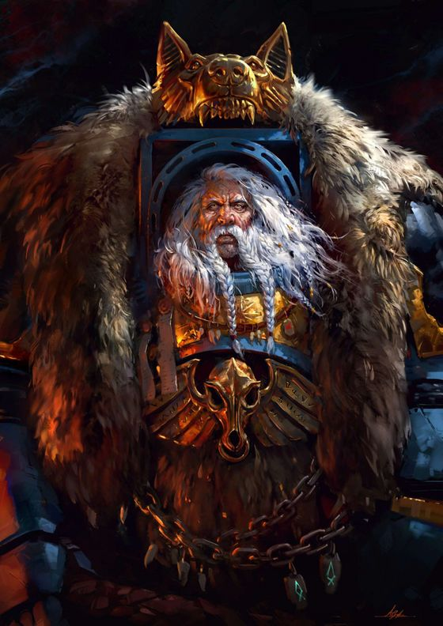
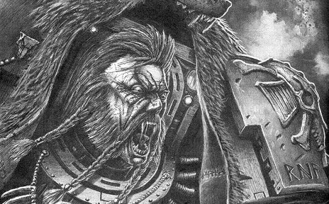
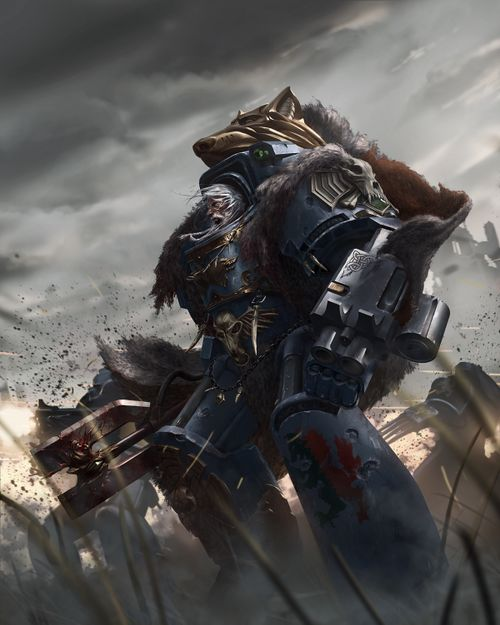
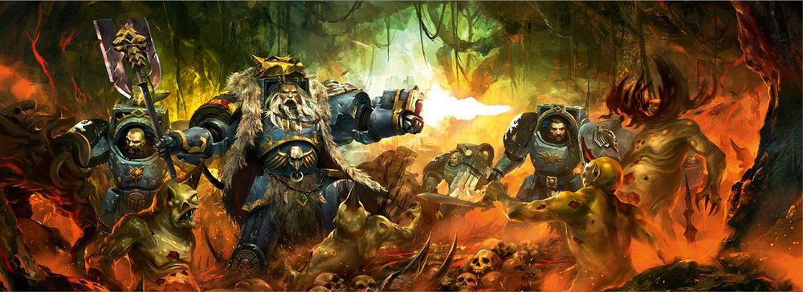
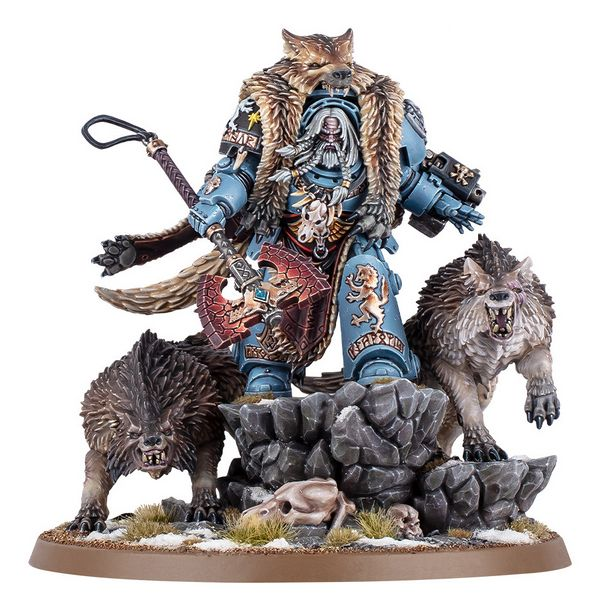
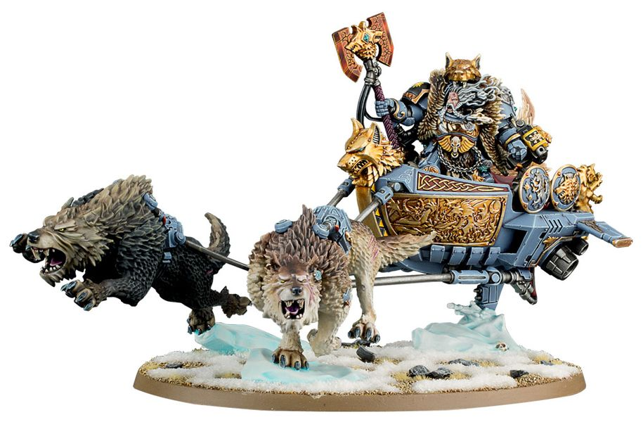

# 0647 洛根·格里姆纳尔 Logan Grimnar

精校状态：中文行文已逐段精校，部分术语仍为暂定

分类：人类帝国 / 太空野狼

原文来源：https://www.bilibili.com/opus/1114600204374376455

原作者：帝国神选罐头

原文时间：2025年09月20日 14:58

[返回分类目录](目录.md) · [全书目录](../../目录.md)

原篇名：罗根·格里姆纳尔 Logan Grimnar

<!-- A0647-B0001 -->
**英文原文**

"Logan Grimnar, Bloody-Handed Warrior. He piles the skulls of his enemies. He builds a mound of the fallen. His foes weep rivers of blood. Logan Grimnar, strong wolf of the pack. His Sword hungers for red flesh. His guns thirst for battle. He laughs. amidst the war-din. Logan Grimnar, father of wolves. His sons haunt his enemies. Slay them where they falter. And bring their pelts to Fenris."

<!-- /A0647-B0001 -->

<!-- A0647-B0002 -->

原译文

“罗根·格里姆纳尔，血手战士。他把敌人的头骨堆在一起。他把倒下的人堆成一堆。他的敌人流着血泪。罗根·格里姆纳尔，狼群中强壮的狼。他的剑渴望红色血肉。他的枪渴望战斗。他笑了。在战争的喧嚣中。罗根·格里姆纳尔，群狼之父。他的子嗣经常缠着他的敌人。在他们摇摇欲坠的地方杀死他们。把他们的皮毛带到芬里斯。”

**校订译文**

“洛根·格里姆纳尔，双手染血的战士。他堆起敌人的颅骨，以阵亡者筑成尸丘；敌人泣下的血泪汇成河流。洛根·格里姆纳尔，狼群中的雄狼。他的利剑渴求鲜红血肉，他的枪炮渴求厮杀；战声震天，他放声大笑。洛根·格里姆纳尔，群狼之父。他的子嗣紧追仇敌，趁他们失足便将其斩杀，剥下皮毛，带回芬里斯。”

<!-- /A0647-B0002 -->

<!-- A0647-B0003 -->
**英文原文**

Logan Grimnar, The Old Wolf, Fangfather, and High King of Fenris, has been the Great Wolf of the Space Wolves chapter for over 500 years and is one of the oldest Chapter Masters in the Imperium. Logan, like his fellow Space Wolves, is a fearsome warrior with great martial pride. He has led his Great Company (The Night Runners, also known as the Champions of Fenris) against many enemies of the Imperium and has shown a renowned thirst for battle, which some say, even rivals that of their legendary Primarch, Leman Russ. He doesn’t tolerate any outside interference when running the Chapter, to the point where the Space Wolves have had numerous clashes with the Administratum and the Ecclesiarchy and this has lead to the accusations of heresy and treason.

<!-- /A0647-B0003 -->

<!-- A0647-B0004 -->

原译文

罗根·格里姆纳尔，老狼、长牙之父和芬里斯至高王，担任太空野狼战团的头狼已有500多年的历史，是帝国中最古老的战团长之一。罗根和他的太空野狼战友一样，是一个可怕的战士，有着极大的军事骄傲。他带领他的大连（午夜跑者，也被称为芬里斯冠军）对抗帝国的许多敌人，并表现出众所周知的战斗欲望，有人说，这甚至可以与他们传说中的原体黎曼·鲁斯相媲美。他在管理战团时不容忍任何外界干扰，以至于太空野狼与内务部和国教教会发生了多次冲突，这导致了异端和叛国的指控。

**校订译文**

洛根·格里姆纳尔又称“老狼”“长牙之父”与“芬里斯至高王”。按本篇主要叙述，他担任太空野狼头狼已有五百余年，是帝国资历最深的战团长之一。和战团兄弟一样，他是骁勇可畏的战士，极为珍视武人的荣耀。他率自己的大连“午夜跑者”（又称“芬里斯勇士”）迎战帝国诸敌，以强烈的战斗欲望闻名；有人甚至将其与原体黎曼·鲁斯相比。他治理战团时不容外界干涉，导致太空野狼屡与内政部和国教会冲突，也因此遭到异端及叛国指控。

<!-- /A0647-B0004 -->

<!-- A0647-B0005 图片 -->

<!-- A0647-B0006 -->

原译文

Logan Grimnar 罗根·格里姆纳尔

**校订译文**

Logan Grimnar 洛根·格里姆纳尔

<!-- /A0647-B0006 -->

<!-- A0647-B0007 -->
## Biography 传记

<!-- /A0647-B0007 -->

<!-- A0647-B0008 -->
**英文原文**

A warrior from birth, Logan fought his way through the ranks of the Space Wolves under the watchful eye of Ulrik the Slayer. Logan's leadership of the Space Wolves has endured for five hundred years.

<!-- /A0647-B0008 -->

<!-- A0647-B0009 -->

原译文

作为一名天生的战士，罗根在屠戮者乌尔里克的警觉之眼下，在太空野狼的队伍中奋力拼搏。罗根对太空野狼的领导已经持续了五百年。

**校订译文**

洛根是天生的战士，在杀戮者乌尔里克的密切关注下，凭战功逐级晋升。本篇称，他已统领太空野狼五百年。

<!-- /A0647-B0009 -->

<!-- A0647-B0010 -->
### Early Life 早期生活

<!-- /A0647-B0010 -->

<!-- A0647-B0011 -->
**英文原文**

Born on Fenris, when Grimnar was young he was part of the Iron Blood tribe. In 313.M41 while battling the enemy Sea Devil and Ice Fang tribes on the Boiling Ocean of Fenris, Logan and his crew were ambushed at the ruins of a temple of Morkai. Soon only Logan was left among his comrades, facing enemy tribesmen with a bloody axe. High above, the battle was being observed by a Space Wolves Wolf Priest Ulrik. As Logan made his final stand, he was saved by Terminators who then spirited him to The Fang.

<!-- /A0647-B0011 -->

<!-- A0647-B0012 -->

原译文

格里姆纳尔出生在芬里斯，年轻时是铁血部落的一员。313.M41，罗根和他的船员在芬里斯的沸腾之洋上与敌人海魔和冰牙部落作战时，在莫凯神殿的废墟上遭到伏击。很快，他的战友们只剩下罗根了，他拿着一把血淋淋的斧头面对着敌人的部落。在高空中，一位太空野狼狼牧师乌尔里克正在观察这场战斗。当罗根做出最后的抵抗时，他被终结者救了下来，终结者随后将他带到了长牙堡。

**校订译文**

格里姆纳尔出生于芬里斯，年轻时属于铁血部落。313.M41，他与船员在芬里斯沸腾之洋迎战海魔和冰牙部落，途中于莫凯神殿遗迹遭到伏击。很快，同伴全部阵亡，只剩洛根手持染血的斧头，独自面对敌人。太空野狼的狼牧师乌尔里克一直在高处观察。洛根正作最后抵抗时，终结者出手救下他，将他带往长牙堡。

<!-- /A0647-B0012 -->

<!-- A0647-B0013 图片 -->

<!-- A0647-B0014 -->

原译文

The Wolf that Stalks Between the Stars 星间徘徊之狼

**校订译文**

The Wolf that Stalks Between the Stars 星间徘徊之狼

<!-- /A0647-B0014 -->

<!-- A0647-B0015 -->
### Space Wolf 太空野狼

<!-- /A0647-B0015 -->

<!-- A0647-B0016 -->
**英文原文**

At the Fang, a warrior named Ulrik would remain close to Logan and observe his growth and constantly test him. The first hints of this greatness came during the Trial of Morkai, when Logan slew the ice troll Frostblood, a dread beast that had killed dozens of the Chapter’s recruits. In a cave filled with the remains of Fenrisian warriors, Logan jammed a broken bone into Frostblood’s eye, howling his rage into the beast’s face even as its fangs savaged his arm.

<!-- /A0647-B0016 -->

<!-- A0647-B0017 -->

原译文

在长牙堡，一位名叫乌尔里克的战士会一直靠近罗根，观察他的成长，并不断考验他。这种伟大的第一个迹象出现在莫凯试炼期间，当时罗根杀死了冰巨魔霜血，这是一个可怕的野兽，杀死了数十名战团的新兵。在一个满是芬里斯战士遗骸的洞穴里，罗根把一块断骨塞进了霜血的眼睛里，在野兽的尖牙猛烈地咬着他的手臂的同时，他对着野兽的脸咆哮着。

**校订译文**

在长牙堡，乌尔里克始终关注洛根的成长，不断加以考验。莫凯试炼首次显露了他的不凡：他杀死曾吞噬数十名战团新兵的冰巨魔“霜血”。在遍布芬里斯战士残骸的洞穴里，洛根将一截断骨扎入巨魔眼中，即使巨兽的獠牙正在撕咬他的手臂，他仍对着它怒吼。

<!-- /A0647-B0017 -->

<!-- A0647-B0018 -->
**英文原文**

The Canis Helix bonded with Logan as though he had been born to become a Space Marine, and in time the young warrior was inducted into Asvald Stormwrack’s Great Company as a Blood Claw. Logan proved his skill and valour repeatedly in wars across the Sea of Stars, taking to the life of a Sky Warrior as easily as if he had been sailing the seas of Fenris. However, what made the future Wolf Lord stand out from his brothers was not just his bravery or his cunning, but the boundless charisma he wielded like a weapon. His easy grin and ready jests earned him the trust of everyone he met, even the old and cynical Long Fangs of the company, who grudgingly admitted they had warmed to the whelp.

<!-- /A0647-B0018 -->

<!-- A0647-B0019 -->

原译文

狼之螺旋与罗根建立了紧密的联系，仿佛他天生就是一名星际战士，随着时间的推移，这位年轻的战士作为血爪加入了阿斯瓦尔德·风暴遗骸的大连。罗根在星海的战争中反复证明了自己的技能和勇气，像在芬里斯的海上航行一样轻松地过上了天空战士的生活。然而，让这位未来的狼主从他的兄弟们中脱颖而出的不仅仅是他的勇敢或狡猾，还有他像武器一样挥舞的无限魅力。他轻松的笑容和现成的笑话为他赢得了他遇到的每个人的信任，甚至是连队里那些愤世嫉俗的老长牙，他们勉强承认他们已经对这个小家伙产生了好感。

**校订译文**

狼之螺旋与洛根完美融合，仿佛他生来就是为了成为星际战士。此后，他以血爪身份加入阿斯瓦尔德·风暴遗骸的大连，在星海间的战争中屡次证明自己的武艺与勇气。他适应天空战士的生活，就如同航行芬里斯诸海一般自然。但让这位未来狼主脱颖而出的，不只有勇敢与机智，更有他运用自如的强大感召力。爽朗的笑容与随口的诙谐，使他赢得所有人的信任；就连大连里那些年老多疑的长牙，也不得不承认，自己渐渐喜欢上了这个小狼崽。

<!-- /A0647-B0019 -->

<!-- A0647-B0020 -->
**英文原文**

After over a century of war and unparalleled heroism, Logan Grimnar had risen to earn a place among Asvald’s Wolf Guard, often keeping the counsel of the Wolf Lord and always close to his side. As always, the Wolf Priests kept close watch on Grimnar, and Ulrik taught the young warrior all there was to know about the traditions and history of the Chapter. In the 390s.M41, Logan Grimnar accompanied Ulrik to try and claim the Fist of Russ during the Macharian Crusade, working alongside the then-rising hero Lord Solar Macharius. He then led a Space Wolves strike force in the Macharian Crusade and came to personally respect Lord Solar Macharius. During one of the final battles of the war on Loki Logan alongside Inquisitor Hyronimus Drake led the assault on the citadel of the traitorous general Richter.

<!-- /A0647-B0020 -->

<!-- A0647-B0021 -->

原译文

经过一个多世纪的战争和无与伦比的英雄主义，罗根·格里姆纳尔已经崛起，在阿斯瓦尔德的野狼守卫中获得了一席之地，他经常听从狼主的建议，总是站在他身边。与往常一样，狼牧师们密切关注格里姆纳尔，乌尔里克向这位年轻的战士传授了关于战团传统和历史的所有知识。在390.M41，罗根·格里姆纳尔在马卡里亚远征期间陪同乌尔里克试图夺取鲁斯之拳，与当时正在崛起的英雄太阳领主马卡里乌斯并肩作战。然后，他在马卡里安远征中领导了一支太空野狼打击部队，并亲自向太阳领主马卡里乌斯致敬。在洛基战争的最后一场战斗中，罗根与审判官海罗尼穆斯·德拉克一起领导了对叛徒将军里希特的城堡的袭击。

**校订译文**

据本段叙述，经过一个多世纪的征战与卓越功勋，洛根升入阿斯瓦尔德的野狼守卫，常在狼主身边参与谋议。狼牧师一如既往地关注他，乌尔里克则向他传授战团的历史与传统。在 M41 第 390 年代，洛根陪同乌尔里克参加马卡里亚远征，试图取得鲁斯之拳，并与当时声名渐起的太阳领主马卡里乌斯合作。此后，他在这场远征中率领一支太空野狼打击部队，对马卡里乌斯本人产生了敬意。洛基战事接近尾声时，洛根与审判官海罗尼穆斯·德拉克一同率军，攻打叛将里希特的堡垒。

**校注：** 源文前称 313.M41 被选入战团，此处却在一个多世纪服役之后又叙述 M41 第 390 年代活动，纪年不合。保留原文顺序和数字，交由篇末来源冲突说明，不私自修史。390s 指十年区间，不是 390 年。

<!-- /A0647-B0021 -->

<!-- A0647-B0022 -->
**英文原文**

In 415.M41 when Asvald finally fell in battle against Orks for the Cyclopean Rift, Logan Grimnar was elected Wolf Lord in his place by unanimous assent of his fellow Wolf Guard, leading the Great Company known as the Night Runners. Favored by the Chapter, he soon ascended to Great Wolf in 440.M41 after the incumbent Sigvald Grimhammer was murdered by a Dark Eldar Succubus.

<!-- /A0647-B0022 -->

<!-- A0647-B0023 -->

原译文

415.M41，当阿斯瓦尔德最终在与欧克争夺独眼裂隙的战斗中倒下时，罗根·格里姆纳尔在他的战友野狼守卫的一致同意下被选为狼主，领导被称为午夜跑者的大连。受到战团的青睐，他很快在440.M41升任头狼，当时在任的西格瓦尔德·冷锤被一个黑暗灵族女妖谋杀。

**校订译文**

415.M41，阿斯瓦尔德在争夺独眼裂隙的对欧克作战中阵亡。野狼守卫一致推举洛根继任狼主，统领“午夜跑者”大连。他深得战团拥戴。440.M41，在任头狼西格瓦尔德·冷锤被一名黑暗灵族血腥魔女杀害后，洛根继任头狼。

**校注：** Succubus 按已核官方译血腥魔女，非灵族女妖；这里描述黑暗灵族刺杀者。

<!-- /A0647-B0023 -->

<!-- A0647-B0024 -->
### First War for Armageddon 第一次阿玛吉多顿战争

<!-- /A0647-B0024 -->

<!-- A0647-B0025 -->
**英文原文**

In the First War for Armageddon the Space Hulk, Devourer of Stars, caught Imperial forces by surprise. Even worse the Chaos forces were led by the daemon Primarch, Angron. The forces of Chaos quickly defeated the Imperial forces at Armageddon Prime. Unbeknownst to the forces of Chaos, the Space Wolves were recently assigned to this sector and answered the Imperial forces' cry for help.

<!-- /A0647-B0025 -->

<!-- A0647-B0026 -->

原译文

在第一次阿玛吉多顿战争中，群星吞噬者号太空废船让帝国军队大吃一惊。更糟糕的是，混沌部队是由恶魔原体安格隆领导的。混沌部队在阿玛吉多顿主星中迅速击败了帝国军队。在混沌部队不知情的情况下，最近的太空野狼被分配到这个区域，并回应了帝国军队的呼救。

**校订译文**

第一次阿玛吉多顿战争中，太空废船群星吞噬者号的到来令帝国军措手不及。更糟的是，来袭的混沌大军由恶魔原体安格隆亲自率领。他们迅速击败了阿玛吉多顿普赖姆地区的帝国守军。但混沌军并不知道，太空野狼刚被派驻这一星区，并已响应守军的求援。

**校注：** Armageddon Prime 不是阿玛吉多顿主星。底稿 821 B0020 明说主大陆划分为 Prime 与 Secundus；1006 B0083 定位 Prime 在西侧。暂保留音译普赖姆地区。

<!-- /A0647-B0026 -->

<!-- A0647-B0027 图片 -->

<!-- A0647-B0028 -->

原译文

Logan Grimnar, the Great Wolf 罗根·格里姆纳尔，头狼

**校订译文**

Logan Grimnar, the Great Wolf 洛根·格里姆纳尔，头狼

<!-- /A0647-B0028 -->

<!-- A0647-B0029 -->
**英文原文**

By the time the forces of Chaos had come around for a new attack, they found a well organized Imperial force bolstered by Space Wolves. This was Logan's first real test as Wolf Lord. Nonetheless Logan in all his foresight knew that he and the Space Wolves alone would not be able to defeat Angron's force. When the Daemon Primarch led the attack on the Imperial line, Logan played his ace, a full company of Grey Knights. At the great cost of many Grey Knights, they were able to banish Angron back to the Warp. With the defeat of their leader, the forces of Chaos were quickly crushed.

<!-- /A0647-B0029 -->

<!-- A0647-B0030 -->

原译文

当混沌部队开始新的攻击时，他们发现了一支由太空野狼支援的组织良好的帝国部队。这是罗根作为狼主的第一次真正考验。尽管如此，罗根深谋远虑地知道，仅靠他和太空野狼是无法击败安格隆的部队的。当恶魔原体领导对帝国战线的进攻时，罗根派出了他的王牌，一个完整的灰骑士连队。在许多灰骑士付出巨大代价的情况下，他们能够将安格隆驱逐回亚空间。随着他们领袖的失败，混沌部队很快就被粉碎了。

**校订译文**

混沌大军再次进攻时，面对的已是获得太空野狼支援、组织严密的帝国防线。按本段说法，这是洛根担任狼主后首次真正的大考验。他深知，单凭自己与太空野狼，无法击败安格隆的军队。恶魔原体率军冲击防线时，洛根打出底牌：一整个连队的灰骑士。灰骑士付出惨重伤亡，将安格隆放逐回亚空间。失去领袖的混沌大军随即被迅速击溃。

**校注：** 前文已述洛根在 440.M41 成为头狼，此处仍称狼主的首次考验；照英文保留职衔用语，不借此自行重排年份。

<!-- /A0647-B0030 -->

<!-- A0647-B0031 -->
### Months of Shame 耻辱之月

<!-- /A0647-B0031 -->

<!-- A0647-B0032 -->
**英文原文**

As is standard Inquisition practice for those exposed to Chaos, even for those who have valiantly been involved in fighting against it, the remaining population of Armageddon was rounded up into labour camps and sterilized. While in the labour camps, the original population was left to die while Armageddon was repopulated. Logan Grimnar attempted to rescue as many survivors of Armageddon as he could from this fate, having his fleet escort troop ships to their destinations before they could be fired upon by Inquisition vessels. This eventually led his fleet into conflict with Inquisitor Lord Ghesmei Kysnaros, and the two sides eventually agreed to negotiate terms to end the "Cold War" between the Ordo Malleus and Space Wolves in neutral space. However during the parlay, the Space Wolves fleet was betrayed and fired upon by the Inquisition and Grey Knights ships, with the Space Wolves losing four vessels and having a fifth crippled. Grimnar was brought aboard a Grey Knights ship to negotiate his "surrender", where he instead cut down Grey Knights Grand Master Joros for his breach of the laws of parlay before teleporting away to safety.

<!-- /A0647-B0032 -->

<!-- A0647-B0033 -->

原译文

正如对那些暴露在混沌中的人的标准审判庭做法一样，即使是那些勇敢地参与战斗的人，阿玛吉多顿的剩余人口也被关进劳改营并绝育。在劳改营中，原始人口被留下来死亡，而阿玛吉多顿则被重构。罗根·格里姆纳尔试图从这种命运中拯救尽可能多的阿玛吉多顿幸存者，让他的舰队在船只被审判庭船只开火之前将其护送到目的地。这最终导致他的舰队与审判官领主盖斯梅·凯斯纳罗斯发生冲突，双方最终同意协商条款，以结束圣锤修会和太空野狼在中立空域的“冷战”。然而，在这个说法中，太空野狼舰队被审判庭和灰骑士的船只背叛并开火，太空野狼损失了四艘船只，第五艘船只瘫痪。格里姆纳尔被带上了一艘灰骑士的船来谈判他的“投降”，在那里，他转而砍倒了灰骑士大导师乔洛斯，因为他违反了赌规，然后传送到安全地带。

**校订译文**

依审判庭对接触混沌者的惯常处置，哪怕曾英勇抵抗混沌，阿玛吉多顿的幸存居民仍被集中关入劳改营，并遭强制绝育。原居民在营中被任由等死，行星则另迁新人口填补。洛根·格里姆纳尔尽力拯救幸存者，派舰队护送运兵船抵达目的地，防止审判庭舰只向其开火。此举最终使他与审判领主盖斯梅·凯斯纳罗斯发生冲突。双方后来同意在中立空域谈判，结束恶魔审判庭与太空野狼之间的“冷战”。然而，会谈期间，审判庭与灰骑士舰只背信开火，击毁四艘太空野狼舰船，重创第五艘。格里姆纳尔登上一艘灰骑士战舰，名义上协商自己的“投降”，却为惩罚违反停战谈判规则的行为，斩杀了灰骑士大导师乔洛斯，随后传送脱身。

**校注：** parlay 此处应为 parley，指停战会谈；laws of parlay 为会谈规则，不是赌规。原文英文拼写保留。repopulated 指迁入新居民，非重构行星。

<!-- /A0647-B0033 -->

<!-- A0647-B0034 图片 -->

<!-- A0647-B0035 -->

原译文

Logan Grimnar on the field of battle 战场上的罗根·格里姆纳尔

**校订译文**

Logan Grimnar on the field of battle 战场上的洛根·格里姆纳尔

<!-- /A0647-B0035 -->

<!-- A0647-B0036 -->
**英文原文**

Later, the crisis with the Inquisition escalated to all-out warfare when the Ordo Malleus, Grey Knights, and Red Hunters besieged Fenris itself. During the fighting, Grimnar and a force of twenty Terminators teleported aboard the Inquisition flagship Corel's Hope and the Old Wolf personally slew Kysnaros. However in the end, with the Space Wolves and Fenris taking heavy damage and with Bjorn the Fell-Handed all but commanding him to seek peace, Grimnar ordered his forces to withdraw and cease the fighting. But since the First War for Armageddon, Logan has never forgiven the Administratum and Inquisition for this act.

<!-- /A0647-B0036 -->

<!-- A0647-B0037 -->

原译文

后来，当圣锤修会、灰骑士和红色猎手围攻芬里斯时，与审判庭的危机升级为全面战争。在战斗中，格里姆纳尔和一支由二十名终结者组成的部队跳帮审判庭旗舰科雷尔的希望号进行了远程传送，老狼亲自杀死了凯斯纳罗斯。然而，最终，随着太空野狼和芬里斯遭受重创，以及断手比约恩几乎命令他寻求和平，格里姆纳尔命令他的部队撤退并停止战斗。但自第一次阿玛吉多顿战争以来，罗根从未原谅过内务部和审判庭的这一行为。

**校订译文**

此后，恶魔审判庭、灰骑士和红色猎手围攻芬里斯，双方冲突升级为全面战争。格里姆纳尔率二十名终结者传送登上审判庭旗舰科雷尔的希望号，亲手杀死凯斯纳罗斯。然而，太空野狼与芬里斯都已损失惨重，断手比约恩更几乎以命令的口吻要求议和。格里姆纳尔最终下令撤兵，停止交战。不过，自第一次阿玛吉多顿战争以来，他始终没有原谅内政部与审判庭的所作所为。

<!-- /A0647-B0037 -->

<!-- A0647-B0038 -->

原译文

13th Black Crusade 第十三次黑色远征

**校订译文**

13th Black Crusade 第十三次黑色远征

<!-- /A0647-B0038 -->

<!-- A0647-B0039 -->
**英文原文**

During Abaddon’s 13th Black Crusade, Logan was selected as supreme commander for the defending Imperial forces. Under his command many key victories were won. If it were not for his leadership, more of Cadia would have been in the hands of Chaos. At the Battle of Kasr Sonnen, Logan and his Great Company and the Chapter Master of the Dark Angels, Azrael, defeated a force many times their size by putting aside their resentment of each other.

<!-- /A0647-B0039 -->

<!-- A0647-B0040 -->

原译文

在阿巴顿的第13次黑色远征期间，罗根被选为帝国防御部队的最高指挥官。在他的指挥下，取得了许多关键胜利。如果不是他的领导，更多的卡迪亚会落入混沌之手。在卡瑟尔·索南之战中，罗根和他的大连以及黑暗天使的战团长阿兹瑞尔通过放下彼此的怨恨击败了一支比他们大很多倍的部队。

**校订译文**

阿巴顿发动第十三次黑色远征时，洛根被推举为帝国守军最高统帅，指挥部队取得多场关键胜利。若非他的领导，卡迪亚将有更多地区落入混沌之手。卡瑟尔·索南之战中，他与黑暗天使战团长阿兹瑞尔暂时放下宿怨，率自己的大连协同作战，击败了规模数倍于己的敌军。

<!-- /A0647-B0040 -->

<!-- A0647-B0041 -->
### War Zone Fenris 芬里斯战区

<!-- /A0647-B0041 -->

<!-- A0647-B0042 -->
**英文原文**

During the Siege of the Fenris System, Logan Grimnar led the reclamation of Midgardia alongside Egil Iron Wolf. The Great Wolf battled the Infernal Tetrad during the campaign. Logan Grimnar ultimately became stranded upon Midgardia, but was saved by Egil Iron Wolf shortly before its doom was unleashed by Magnus himself. In the final battle against the Daemon Primarch Logan led his forces, the Grey Knights, and Dark Angels in an impossible struggle. Ultimately thanks to the sacrifice of Egil Iron Wolf, Grimnar was able to wound Magnus with the Axe of Morkai which gave the Grey Knights enough time to banish him back to the Warp.

<!-- /A0647-B0042 -->

<!-- A0647-B0043 -->

原译文

在芬里斯星系围城期间，罗根·格里姆纳尔与埃吉尔·铁狼一起领导了米德加迪亚的改造。在战役中，头狼与四联炼狱展开了激战。罗根·格里姆纳尔最终被困在米德加迪亚，但在马格努斯本人释放毁灭前不久，他被埃吉尔·铁狼救了出来。在与恶魔的最后一战中，罗根率领他的部队、灰骑士和黑暗天使进行了一场不可能的战斗。最终，由于埃吉尔·铁狼的牺牲，格里姆纳尔能够用莫凯之斧伤害马格努斯，这给了灰骑士足够的时间将他驱逐回亚空间。

**校订译文**

芬里斯星系围城期间，洛根与埃吉尔·铁狼率军收复米德加迪亚，并与四联炼狱交战。洛根一度被困在米德加迪亚；在马格努斯亲自毁灭那里之前，埃吉尔将他救走。在对抗恶魔原体的最后决战中，洛根率太空野狼、灰骑士和黑暗天使苦战，几乎看不到胜算。最终，埃吉尔·铁狼的牺牲创造了机会，使格里姆纳尔以莫凯之斧伤到马格努斯，为灰骑士赢得了将其放逐回亚空间的时间。

**校注：** reclamation 是收复失地，原改造误译；最后对手是恶魔原体马格努斯，非仅一名普通恶魔。

<!-- /A0647-B0043 -->

<!-- A0647-B0044 图片 -->

<!-- A0647-B0045 -->

原译文

Logan Grimnar and Space Wolves Terminators fighting Nurgle Daemons of the Infernal Tetrad on Midgardia 罗根·格里姆纳尔和太空野狼终结者在米德加迪亚与四联炼狱的纳垢恶魔作战

**校订译文**

Logan Grimnar and Space Wolves Terminators fighting Nurgle Daemons of the Infernal Tetrad on Midgardia 洛根·格里姆纳尔与太空野狼终结者在米德加迪亚迎战四联炼狱的纳垢恶魔

<!-- /A0647-B0045 -->

<!-- A0647-B0046 -->
### Dark Imperium 黑暗帝国

<!-- /A0647-B0046 -->

<!-- A0647-B0047 -->
**英文原文**

After the Noctis Aeterna, Grimnar and his Champions were battling Orks aboard a Space Hulk when news first arrives of a Torchbearer fleet carrying the first Primaris Space Marines for the Space Wolves. Despite the enthusiasm for the new warriors by Krom Dragongaze, Grimnar is distrustful of these new marines, who are not of Fenris, and is disdaindul of the "Legion" breaker Roboute Guilliman. Fearing Guilliman seeks to control the Space Wolves, a full muster of the badly depleted chapter takes place at The Fang, and summit with Guilliman is held. Logan seems to deny the newcomers to the Space Wolves and refuses to cooperate with Guilliman, instead seeking to meet and potentially change his fate which he thinks is to die at the hands of Ghazghkull Mag Uruk Thraka. However after hearing of the experiences of Kjarg Iron-Oath Logan has a change of heart and sees the Primaris Marines as worthy of being true sons of Fenris. Afterwards the Space Wolves become committed to the Indomitus Crusade and seek to smash the Ork threat as Guilliman advances into Imperium Nihilus.

<!-- /A0647-B0047 -->

<!-- A0647-B0048 -->

原译文

在永恒之夜之后，格里姆纳尔和他的冠军们正在太空废船上与欧克作战，这时有消息称，一支火炬手舰队为太空野狼运送了第一批原铸星际战士。尽管克罗姆·龙瞪对新战士充满热情，但格里姆纳尔不信任这些不属于芬里斯的新战士，并且蔑视“军团”破坏者罗伯特·基里曼。由于担心基里曼试图控制太空野狼，在长牙堡对严重枯竭的战团进行了全面集结，并与基里曼举行了峰会。罗根似乎拒绝与太空野狼的新来者合作，拒绝与基里曼合作，而是寻求会面并可能改变他的命运，他认为他的命运将死于碎骨者马格·乌鲁克·萨拉卡之手。然而，在听到克雅格·铁誓的经历后，罗根改变了主意，认为原铸星际战士值得成为芬里斯的真正子嗣。之后，随着基里曼进入帝国暗面，太空野狼致力于不屈远征，并寻求粉碎欧克的威胁。

**校订译文**

永恒之夜结束后，格里姆纳尔正率芬里斯勇士在太空废船上对抗欧克，获知一支持炬舰队已带来太空野狼的第一批原铸星际战士。克罗姆·龙瞪热切欢迎这些新兵，格里姆纳尔却怀疑这群并非来自芬里斯的战士，也鄙夷当年拆散军团的罗保特·基里曼。他担心基里曼企图控制太空野狼，于是将兵力严重不足的战团全体召集到长牙堡，与原体会谈。洛根起初似乎不愿接纳新人，也拒绝与基里曼合作，反而想迎向自己的宿命，或许还能改变它：他相信自己注定死于碎骨者·斯拉卡之手。然而，听过克雅格·铁誓的经历后，他改变了想法，认为原铸战士配得上芬里斯真正子嗣之名。此后，太空野狼投入不屈远征，在基里曼向帝国暗面推进时，致力于粉碎欧克威胁。

**校注：** meet ... his fate 指迎接自身宿命，非另行举行会面；基里曼称军团破坏者是人物立场下对拆分军团的不满。

<!-- /A0647-B0048 -->

<!-- A0647-B0049 图片 -->

<!-- A0647-B0050 -->

原译文

Logan Grimnar 罗根·格里姆纳尔

**校订译文**

Logan Grimnar 洛根·格里姆纳尔

<!-- /A0647-B0050 -->

<!-- A0647-B0051 -->
**英文原文**

During the Season of Blood, Logan Grimnar led the Champions of Fenris personally to Armageddon to prevent its fall at the hands of a massive Chaos horde under the Daemon Primarch Angron. During the campaign he frequently clashed with Black Templars High Marshal Helbrecht due to past grievances and his fear that the Templars would purge Armageddon's civilian population as had happened done during the Months of Shame. Helbrecht oversaw only limited purges, and the two ultimately learned to work together during the final assault on the Red Angel's Gate.

<!-- /A0647-B0051 -->

<!-- A0647-B0052 -->

原译文

在鲜血之季，罗根·格里姆纳尔亲自率领芬里斯的冠军前往阿玛吉多顿，以防止其落入恶魔原体安格隆领导下的庞大混沌部落手中。在战役期间，由于过去的不满，他经常与黑色圣堂至高元帅赫尔布雷希特发生冲突，他担心黑色圣堂会像耻辱之月那样净化阿玛吉多顿的平民。赫尔布雷希特只监督了有限的净化，两人最终在最后一次对红天使之门的袭击中学会了合作。

**校订译文**

鲜血之季期间，洛根亲率芬里斯勇士前往阿玛吉多顿，阻止恶魔原体安格隆麾下的庞大混沌军势夺取该世界。他在战役中屡与黑色圣堂至高元帅赫尔布雷彻发生冲突：既有旧怨，也因为他担心黑色圣堂会重演耻辱之月，对平民展开清洗。赫尔布雷彻仅实施了有限的肃清行动；最终，两人在攻打红天使之门时学会了协同作战。

<!-- /A0647-B0052 -->

<!-- A0647-B0053 -->
## Wargear 武器装备

原题：Wargear 战备

<!-- /A0647-B0053 -->

<!-- A0647-B0054 -->
**英文原文**

Logan wears an ornate suit of Terminator Armour with an integrated Storm Bolter known as the Armour of Asvald Stormwrack and carries the powerful axe Morkai into battle. The axe is from a Chaos Champion of Khorne Logan defeated in battle on Armageddon. He also rides the war chariot Stormrider drawn by his two Thunderwolves, Tyrnak and Fenrir.

<!-- /A0647-B0054 -->

<!-- A0647-B0055 -->

原译文

罗根穿着一套华丽的终结者盔甲，被称为阿斯瓦尔德·风暴遗骸之盔，并集成了一个风暴爆矢枪，并携带强大的莫凯之斧进入战斗。这把斧头来自罗根击败的恐虐混沌冠军，他在阿玛吉多顿之战中被击败。他还乘坐着由他的两只雷狼 — 泰纳克和芬里尔 — 拉着的战车风暴骑手。

**校订译文**

洛根身穿华丽的“阿斯瓦尔德·风暴遗骸之甲”，这套终结者护甲集成了一挺风暴爆矢枪。他手持强大的莫凯之斧作战；此斧夺自一名在阿玛吉多顿被他击败的恐虐混沌勇士。他还乘坐由泰纳克和芬里尔两头雷狼牵引的战车“风暴骑手”。

<!-- /A0647-B0055 -->

<!-- A0647-B0056 图片 -->

<!-- A0647-B0057 -->

原译文

Logan Grimnar on Stormrider 风暴骑手上的罗根·格里姆纳尔

**校订译文**

Logan Grimnar on Stormrider 乘坐风暴骑手战车的洛根·格里姆纳尔

<!-- /A0647-B0057 -->

<!-- A0647-B0058 -->
## Trivia 琐事

<!-- /A0647-B0058 -->

<!-- A0647-B0059 -->
### Conflicting sources 来源冲突

<!-- /A0647-B0059 -->

<!-- A0647-B0060 -->
### Age and Length of Tenure 年龄和任期

<!-- /A0647-B0060 -->

<!-- A0647-B0061 -->
**英文原文**

According to the 5th Edition Space Wolves codex, as of the end of M41, Grimnar has been Great Wolf for "over 700 years". However, according to the Champions of Fenris Codex Supplement, Grimnar was elected Great Wolf in 440.M41, just under 560 years from the end of M41.

<!-- /A0647-B0061 -->

<!-- A0647-B0062 -->

原译文

根据第5版太空野狼圣典，截至M41结束，格里姆纳尔已经是“700多年的”头狼了。然而，根据《芬里斯圣典补充》的章节，格里姆纳尔在440.M41当选为头狼，距离M41结束不到560年。

**校订译文**

《太空野狼圣典》第五版称，截至 M41 末，格里姆纳尔已担任头狼“七百余年”。但《圣典补充：芬里斯勇士》记载，他在 440.M41 当选头狼，距离 M41 结束不足五百六十年。

<!-- /A0647-B0062 -->

<!-- A0647-B0063 -->
**英文原文**

In William King's novel Fist of Demetrius (Novel), Grimnar is still a young warrior of the Space Wolves at the time of the Macharian Crusade (392-399.M41), which is inconsistent with him being Great Wolf for 700 years thereafter, and only slightly less inconsistent with him being elected Wolf Lord in 415.M41, and Great Wolf in 440.M41.

<!-- /A0647-B0063 -->

<!-- A0647-B0064 -->

原译文

在威廉·金的小说《德米特里厄斯之拳》（小说）中，格里姆纳尔在马卡里亚远征（392-399.M41）时仍然是太空野狼的年轻战士，这与他在之后的700年里一直是头狼不符，与他在415.M41和440.M41当选为狼主的情况也略有不同。

**校订译文**

在威廉·金的小说《德米特里厄斯之拳》中，格里姆纳尔在马卡里亚远征（392—399.M41）期间仍是年轻的太空野狼。这显然无法与他到 M41 末已有七百年头狼任期的说法相容；与他在 415.M41 当选狼主、440.M41 成为头狼的记载相比，也仍存在矛盾，只是程度稍轻。

**校注：** 原英文用 thereafter，若严格读作远征后七百年，会越过 M41 末；结合上一条明确的截至 M41 末，译出所比较的时间基准，保留资料间矛盾。

<!-- /A0647-B0064 -->

<!-- A0647-B0065 -->
### Succession 继承

<!-- /A0647-B0065 -->

<!-- A0647-B0066 -->
**英文原文**

Different sources give conflicting information on whom Grimnar succeeded as Great Wolf. The novel Grey Hunter states that the previous Great Wolf was Anakron Silvermane. Later material, however, says that the Great Wolf who preceded Grimnar was Sigvald Grimhammer.

<!-- /A0647-B0066 -->

<!-- A0647-B0067 -->

原译文

不同的消息来源提供了相互矛盾的信息，关于格里姆纳尔是接替了谁的头狼的角色。小说《灰猎》指出，之前的头狼是阿纳克伦·银鬃。然而，后来的材料说，在格里姆纳尔之前的头狼是西格瓦尔德·冷锤。

**校订译文**

不同来源对格里姆纳尔的前任头狼说法不一。小说《灰色猎手》称前任为阿纳克伦·银鬃，较晚的资料则称其为西格瓦尔德·冷锤。

**校注：** Gray/Grey Hunter 书名暂依已核同名兵种“灰色猎手”词根，书名本身未核官方。

<!-- /A0647-B0067 -->

本篇核心术语与暂定项

以下列出本篇出现的英文原形及核心术语表用词。同形词可能指不同对象，具体词义以本篇正文和校注为准；单复数、别名和仅见于图注的名称可能尚未列入。完整候选见[术语表](../../术语表/双语术语候选.csv)。

| 英文 | 采用中文 | 状态 |
| --- | --- | --- |
| Space Marines | 星际战士 | 官方已核对 |
| Black Templars | 黑色圣堂 | 官方已核对 |
| Dark Angels | 黑暗天使 | 官方已核对 |
| Grey Knights | 灰骑士 | 官方已核对 |
| Space Wolves | 太空野狼 | 官方已核对 |
| Eldar | 灵族 | 暂定·语境区分 |
| Dark Eldar | 黑暗灵族 | 暂定·旧称对应 |
| Orks | 欧克蛮人 | 官方已核对 |
| Terminator | 终结者 | 官方已核对 |
| Roboute Guilliman | 罗保特·基里曼 | 官方已核对 |
| Warp | 亚空间 | 官方已核对 |
| Inquisition | 审判庭 | 暂定 |
| Inquisitor | 审判官 | 官方已核对 |
| Imperium | 帝国 | 暂定·简称 |
| Khorne | 恐虐 | 官方已核对 |
| Indomitus | 不屈学派 | 暂定·学派语境 |
| History | 历史 | 编辑用语已统一 |
| Administratum | 内政部 | 暂定 |
| Ordo Malleus | 恶魔审判庭 | 用户指定 |
| Primarch | 原体 | 官方已核对 |
| Ecclesiarchy | 国教会 | 暂定 |
| Ghazghkull Mag Uruk Thraka | 碎骨者·斯拉卡 | 暂定·官方短名对应 |
| Imperium Nihilus | 帝国暗面 | 暂定·官方待核 |
| Indomitus Crusade | 不屈远征 | 暂定·官方待核 |
| Sector | 星区 | 暂定·官方待核 |
| Armageddon | 阿玛吉多顿 | 暂定·官方待核 |
| Fenris | 芬里斯 | 暂定·官方待核 |
| Midgardia | 米德加迪亚 | 暂定·官方待核 |
| Banish | 巴尼什 | 暂定·官方待核 |
| Cadia | 卡迪亚 | 暂定·官方待核 |
| Loki | 洛基 | 暂定·官方待核 |
| Inquisitor Lord | 领主审判官 | 暂定 |
| Master | 导师（审判庭职衔）／舰务官（舰员职务） | 语境定译·官方待核 |
| True Sons | 真子 | 暂定·官方待核 |
| Champion | 冠军 | 暂定·官方待核 |
| Space Marine | 星际战士 | 暂定·官方待核 |
| Chapter | 战团 | 暂定·官方待核 |
| Chapter Master | 战团长 | 暂定·官方待核 |
| Terminators | 终结者 | 暂定·官方待核 |
| Azrael | 阿兹瑞尔 | 官方已核 |
| Logan Grimnar | 洛根·格里姆纳尔 | 官方已核 |
| Ulrik the Slayer | 杀戮者乌尔里克 | 官方已核 |
| Krom Dragongaze | 克罗姆·龙瞪 | 暂定·官方待核 |
| Bjorn the Fell-Handed | 断手比约恩 | 官方已核 |
| Helbrecht | 赫尔布雷彻 | 暂定·官方待核 |
| The Months of Shame | 耻辱之月 | 暂定·官方待核 |
| Red Hunters | 红色猎手 | 暂定·官方待核 |
| Canis Helix | 狼之螺旋 | 暂定·官方待核 |
| High Marshal Helbrecht | 至高元帅赫尔布雷彻 | 官方已核 |
| Wolf Priest | 狼牧师 | 官方语境参考·待核 |
| Risen | 赦天使 | 暂定·官方待核 |
| Lord Solar | 太阳领主 | 暂定·官方待核 |
| Horde | 部落 | 暂定·官方待核 |
| Succubus | 血腥魔女 | 官方已核对 |
| Tribe | 部落（欧克组织） | 暂定·官方待核 |
| The Beast | 野兽 | 暂定·官方待核 |
| Wolf Guard | 野狼守卫 | 官方词根参考·通称待核 |
| Marshal | 元帅 | 官方已核对 |
| Torchbearer Fleet | 持炬舰队 | 暂定·官方待核 |
| Season of Blood | 血之季节 | 暂定·官方待核 |
| Angron | 安格隆 | 官方已核对 |
| Grand Master | 大导师 | 暂定·官方待核 |
| Joros | 乔洛斯 | 暂定·官方待核 |
| Night Runners | 午夜跑者 | 暂定·官方待核 |
| Champions of Fenris | 芬里斯勇士 | 暂定·官方待核 |
| Iron Blood | 铁血（芬里斯部落）／铁血号（舰船） | 语境定译·官方待核 |
| Sea Devil | 海魔 | 暂定·官方待核 |
| Ice Fang | 冰牙 | 暂定·官方待核 |
| Boiling Ocean | 沸腾之洋 | 暂定·官方待核 |
| Frostblood | 霜血 | 暂定·官方待核 |
| Asvald Stormwrack | 阿斯瓦尔德·风暴遗骸 | 暂定·官方待核 |
| Hyronimus Drake | 海罗尼穆斯·德拉克 | 暂定·官方待核 |
| Sigvald Grimhammer | 西格瓦尔德·冷锤 | 暂定·官方待核 |
| Armageddon Prime | 阿玛吉多顿普赖姆地区 | 暂定·官方待核 |
| Devourer of Stars | 群星吞噬者号 | 暂定·官方待核 |
| Ghesmei Kysnaros | 盖斯梅·凯斯纳罗斯 | 暂定·官方待核 |
| Infernal Tetrad | 四联炼狱 | 暂定·官方待核 |
| Kjarg Iron-Oath | 克雅格·铁誓 | 暂定·官方待核 |
| Armour of Asvald Stormwrack | 阿斯瓦尔德·风暴遗骸之甲 | 暂定·官方待核 |
| Axe of Morkai | 莫凯之斧 | 暂定·官方待核 |
| Stormrider | 风暴骑手 | 暂定·官方待核 |
| Tyrnak | 泰纳克 | 暂定·官方待核 |
| Fenrir | 芬里尔 | 暂定·官方待核 |
| Anakron Silvermane | 阿纳克伦·银鬃 | 暂定·官方待核 |
| The Dark | 《黑暗》 | 暂定·官方待核 |
| System | 星系（恒星系统） | 暂定·官方待核 |
| Noctis Aeterna | 永恒之夜 | 暂定·官方待核 |
| Macharian Crusade | 马卡里安远征 | 暂定·官方待核 |
| Macharius | 马卡里乌斯 | 暂定·官方待核 |
| Richter | 里希特 | 暂定·官方待核 |
| Demetrius | 德米特里厄斯 | 暂定·官方待核 |
| Fist of Russ | 鲁斯之拳 | 暂定·官方待核 |
| Egil Iron Wolf | 埃吉尔·铁狼 | 暂定·官方待核 |
| claw | 利爪分队 | 暂定·官方待核 |
| Bolter | 爆矢枪 | 暂定·官方待核 |
| Storm bolter | 风暴爆矢枪 | 官方已核对 |
| Terminator Armour | 终结者盔甲 | 暂定·官方待核 |

