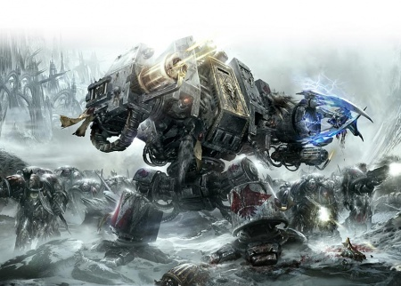
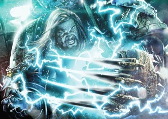
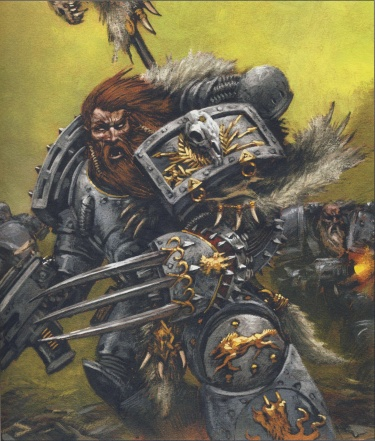
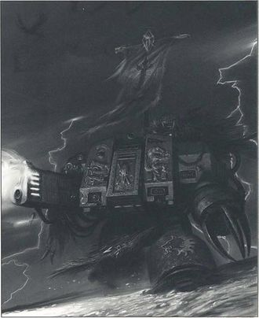
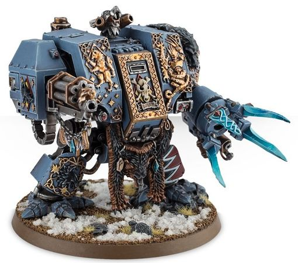

# 0648 断手比约恩 Bjorn the Fell-Handed

精校状态：中文行文已逐段精校，部分术语仍为暂定

分类：人类帝国 / 太空野狼

原文来源：https://www.bilibili.com/opus/1115319538442829842

原作者：帝国神选罐头

原文时间：2025年09月22日 13:29

[返回分类目录](目录.md) · [全书目录](../../目录.md)

<!-- A0648-B0001 -->
**英文原文**

"God-Emperor? Calling him a god was how all this mess started."

<!-- /A0648-B0001 -->

<!-- A0648-B0002 -->

原译文

“神皇？叫他神就是这一切混乱的开始。”

**校订译文**

“神皇？叫他神就是这一切混乱的开始。”

<!-- /A0648-B0002 -->

<!-- A0648-B0003 -->
**英文原文**

Bjorn the Fell-Handed is an ancient Space Wolves Dreadnought. Among the Sons of Fenris he holds many titles: "Eldest", "Trueclaw", "Revered One" and "Last of the Company of Russ" among them. He is the oldest warrior in the Imperium, and has been the salvation of his Chapter time and time again.

<!-- /A0648-B0003 -->

<!-- A0648-B0004 -->

原译文

断手比约恩是一位古老的太空野狼无畏。在芬里斯之子中，他拥有许多头衔：“最年长者”，“真实之爪”，“尊者”和“鲁斯连队的最后之人”。他是帝国中最年长的战士，一次又一次地拯救了他的战团。

**校订译文**

断手比约恩是太空野狼一位极其古老的无畏机甲战士。在芬里斯之子中，他拥有“最年长者”“真实之爪”“尊者”“鲁斯亲随的最后一人”等众多称号。本篇称他为帝国最年长的战士；他曾一次次拯救自己的战团。

**校注：** “帝国最年长战士”为源文断言，未以其他角色或时间推算私自改写。Company of Russ 此处结合后文指鲁斯的私人随从群体，不必等同正式编号连队。

<!-- /A0648-B0004 -->

<!-- A0648-B0005 图片 -->

<!-- A0648-B0006 -->

原译文

Bjorn the Fell-Handed M32 M32的断手比约恩

**校订译文**

Bjorn the Fell-Handed M32 M32的断手比约恩

<!-- /A0648-B0006 -->

<!-- A0648-B0007 -->
## History 历史

<!-- /A0648-B0007 -->

<!-- A0648-B0008 -->
### The Great Crusade 大远征

<!-- /A0648-B0008 -->

<!-- A0648-B0009 -->
**英文原文**

The first currently recorded mention of Bjorn in Imperial records occurs towards the end of the Great Crusade. Bjorn was responsible for saving the lives of the off-world conservator Kasper Hawser, as well as two Fenrisian natives, after they became embroiled in a tribal dispute over Hawser's fate. Bjorn saved Hawser only because he himself had been responsible for mistakenly shooting down the conservator's craft, and only grudgingly rescued the two natives at Hawser's insistence. In time, both of these natives would attempt to join the ranks of the Space Wolves, (with one — Fith — succeeding) and Hawser himself would go onto become skjald of Bjorn's Company.

<!-- /A0648-B0009 -->

<!-- A0648-B0010 -->

原译文

目前，帝国记录中首次提到比约恩是在大远征末期。比约恩负责拯救外界文物保护者卡斯帕·豪瑟尔以及两名芬里斯当地人的生命，因为他们卷入了关于豪瑟尔命运的部落争端。比约恩救了豪瑟尔，只是因为他自己错误地击落了文物保护者的飞船，并且在豪瑟尔的坚持下，他勉强救了这两个当地人。随着时间的推移，这两个当地人都会试图加入太空野狼的行列（其中一个 — 菲斯 — 成功了），豪瑟尔自己也会成为比约恩的连队的吟游诗人。

**校订译文**

现存帝国记录最早在大远征末期提到比约恩。当时，来自外界的文物保护者卡斯佩尔·豪瑟尔与两名芬里斯人卷入部落冲突，争端正与如何处置豪瑟尔有关，比约恩救了三人的性命。他之所以救豪瑟尔，只因对方的飞船先前正是被自己误击落的；至于两名当地人，则是他在豪瑟尔坚持下勉强救出的。后来，两人都尝试加入太空野狼，其中菲斯成功了；豪瑟尔则成为比约恩所在大连的吟游诗人。

<!-- /A0648-B0010 -->

<!-- A0648-B0011 图片 -->

<!-- A0648-B0012 -->

原译文

Bjorn during the Horus Heresy 荷鲁斯叛乱时期的比约恩

**校订译文**

Bjorn during the Horus Heresy 荷鲁斯之乱时期的比约恩

<!-- /A0648-B0012 -->

<!-- A0648-B0013 -->
**英文原文**

Bjorn is then recorded as being present, along with the rest of Tra — 3rd Company - during their assaults upon the Olamic Quietude xenos civilisation in support of the 40th Expedition Fleet. Tra were then summoned to the world of Nikaea, due to their skjald's presence having been requested by their Primarch, Leman Russ. Bjorn was part of the honour guard who landed upon Nikea, and later - as part of his sworn bond to protect Hawser - entered into combat with a being who appeared to be Captain Amon of the Thousand Sons, eventually driving him off.

<!-- /A0648-B0013 -->

<!-- A0648-B0014 -->

原译文

然后，记录显示比约恩和第三大连的其他人 — 第三连队 — 在他们为支援第40远征舰队而袭击奥拉米克静远异型文明时在场。第三大连因其原体黎曼·鲁斯的请求，被召唤至尼凯亚世界。比约恩是登上尼凯亚的荣誉卫队成员，后来，作为他保护豪瑟尔的誓言的一部分，他与一名似乎是千子的连长阿蒙的人交战，最终将他赶走。

**校订译文**

此后，比约恩随特拉（第三大连）参战，支援第四十远征舰队进攻奥拉米克静远异形文明。原体黎曼·鲁斯要求特拉的吟游诗人出席尼凯亚会议，因此该大连被召往尼凯亚。比约恩随仪仗卫队登陆；为履行保护豪瑟尔的誓言，他后来与一个形似千子连长阿蒙的存在交战，最终将其击退。

**校注：** 鲁斯要求到场的直接对象是该连的吟游诗人，原译漏掉召见原因。Nikaea/Nikea 拼写异写保留。

<!-- /A0648-B0014 -->

<!-- A0648-B0015 -->
**英文原文**

It was whilst undertaking an attack on the acrid, volcanic world of Gryth that events were to take a tragic turn. Bjorn’s pack had humbled tyrants, butchered aliens beyond counting, and even hewn down their brother Space Marines that had fallen from the Emperor’s grace; yet against the Daemon king, Arvax the Arch-slaughterer, they knew only death. That Bjorn actually survived the massacre of his kinsmen was a testament to his exceptional skills as a warrior, for all others who faced the mighty Daemon of Khorne that fateful day joined Bjorn’s packmates in death. Though the arrival of Leman Russ saw the Space Wolves ultimately emerge victorious against the daemonic host, it was Bjorn who finally drove the seemingly unstoppable Daemon general from the field. Despite his victory of sorts, Bjorn never forgave himself for the loss of his kinsmen, nor the fact that he alone yet lived having been denied a magnificent death. In the hours that followed the battle, Bjorn became increasingly melancholy, refusing to accept the hearty approval of those that had witnessed his heroic battle against the Daemon king. As he witnessed his packmates burn atop the victory pyres, he gave voice to a long, mournful howl. Kneeling before the bodies of his burning kinsmen, he swore a grave oath of vengeance against their slayer.

<!-- /A0648-B0015 -->

<!-- A0648-B0016 -->

原译文

就在对格里斯这个刺激的火山世界发动攻击的同时，事件发生了悲剧性的转折。比约恩的小队已经征服了暴君，屠杀了数不清的外星人，甚至还砍倒了从帝皇的恩典中堕落的兄弟星际战士；然而，他们只知道死亡，才能对抗恶魔之王、大屠戮者阿瓦克斯。比约恩在对他的血亲的大屠杀中幸存下来，这证明了他作为一名战士的非凡技能，因为在那个决定性的日子里，所有其他面对强大的恐虐恶魔的人都加入了比约恩的队友的行列。虽然黎曼·鲁斯的到来见证了太空野狼最终战胜了恶魔宿主，但最终是比约恩将看似势不可挡的恶魔将军赶出了战场。尽管比约恩取得了某种胜利，但他从未原谅自己失去血亲，也从未原谅自己独自一人被剥夺了一次雄壮的死亡。在战斗结束后的几个小时里，比约恩变得越来越忧郁，拒绝接受那些目睹他与恶魔之王英勇战斗的人的衷心赞同。当他目睹他的战友们在胜利的火堆上被焚烧时，他发出了一声长长的、悲伤的嚎叫。他跪在被烧死的血亲的尸体前，庄严宣誓要向凶手复仇。

**校订译文**

进攻弥漫刺鼻气息的火山世界格里斯时，悲剧降临了。比约恩的战斗小队曾打倒暴君、斩杀无数异形，甚至击毙过背叛帝皇的星际战士兄弟；但面对恶魔之王“大屠戮者”阿瓦克斯，他们迎来的只有死亡。那一日，凡迎战这头强大恐虐恶魔的人，都与比约恩的小队成员一同丧命。比约恩能够活下来，本身便证明了他卓越的武艺。黎曼·鲁斯的到来使太空野狼最终击败恶魔大军，而真正将那名看似不可阻挡的恶魔统帅逐出战场的，却是比约恩。即便取得这样的胜利，他仍无法原谅自己失去兄弟，也痛恨自己独活，未能与他们一同壮烈战死。战后数小时，他愈发郁郁，拒绝旁人对其英勇表现的赞扬。战友遗体在胜利篝火上燃烧时，他长声哀嚎，跪在火葬堆前，立下向凶手复仇的誓言。

**校注：** acrid 指气味辛辣刺鼻，非世界令人刺激；daemonic host 指恶魔大军，非恶魔宿主；尸体是在战后火葬，不是活活烧死的血亲。

<!-- /A0648-B0016 -->

<!-- A0648-B0017 图片 -->

<!-- A0648-B0018 -->

原译文

Bjorn fighting on Prospero 在普罗斯佩罗战斗的比约恩

**校订译文**

Bjorn fighting on Prospero 在普洛斯佩罗作战的比约恩

<!-- /A0648-B0018 -->

<!-- A0648-B0019 -->
**英文原文**

To Bjorn’s continued frustration, it was to be five long years before word of Arvax’s location surfaced once more. Russ immediately led his Wolves to destroy the foul creature, determined to personally slay the Daemon king himself and avenge those who had died during their last encounter. Yet in this goal, the Primarch was to be denied, for Bjorn too sought out his nemesis and, as fate would have it, was the first to face Arvax in battle. As the Wolf-King tore through the Khornate horde towards his quarry, he witnessed Bjorn’s duel first-hand. Russ could only look on in pride as Bjorn deftly rolled beneath a blow attempting to cut him in half, then clambered up the Daemon’s towering frame to tear out the Arch-slaughterer’s throat with his trusty wolf claw. In the aftermath of the battle, Russ came to Bjorn in person and exonerated him in front of the entire Chapter, holding his oath fulfilled. Setting a precedent that still exists to this day, the Wolf-King promoted Bjorn to his personal Wolf Guard, naming him the ‘Fell-handed’ in honour of his mighty deed- although this promotion varies in accounts (see Notes). The skjalds of the Chapter hold that it was the sense of loss and tragedy that Bjorn had already experienced and learned to master that influenced Russ’ decision to leave him behind when he set forth on his last, fateful journey to the Eye of Terror. Of all of the Primarch’s Wolf Guard, he alone had shown such strength of purpose and determination in his darkest hour; he alone would understand the lonely burden of command.

<!-- /A0648-B0019 -->

<!-- A0648-B0020 -->

原译文

令比约恩持续沮丧的是，直到五年后，阿瓦克斯所在地的消息才再次浮出水面。鲁斯立即带领他的野狼摧毁了这个肮脏的生物，决心亲自杀死恶魔之王本人，并为上次遭遇中死去的人报仇。然而，在这个目标中，原体被拒绝了，因为比约恩也找到了他的对手，而且，正如命运所料，他是第一个在战斗中面对阿瓦克斯的人。当狼王穿过恐虐部落朝他的猎物冲去时，他亲眼目睹了比约恩的决斗。鲁斯只能骄傲地看着比约恩巧妙地在一次试图将他切成两半的打击下翻滚，然后爬上恶魔高耸的身躯，用他信任的狼爪撕裂大屠戮者的喉咙。战斗结束后，鲁斯亲自来到比约恩面前，在整个战团面前为他开脱罪责，并履行了他的誓言。创造了一个至今仍然存在的先例，狼王将比约恩提升为他的个人野狼守卫，并为他命名为“断手”，以纪念他的伟大事迹 — 尽管这种晋升在不同的说法中有所不同（见注释）。战团的吟游诗人认为，正是比约恩已经经历并学会掌握的失落感和悲剧感，影响了鲁斯在最后一次前往恐惧之眼的决定性旅程中离开他的决定。在所有原体的野狼守卫中，只有他在最黑暗的时刻表现出了如此坚定的力量和目标；只有他才能理解指挥的孤独负担。

**校订译文**

比约恩苦等了整整五年，才再次听到阿瓦克斯的下落。鲁斯立刻率太空野狼出征，决意亲手斩杀恶魔之王，为上次阵亡者复仇。但他没能如愿：比约恩同样在寻找宿敌，并先一步与阿瓦克斯交锋。狼王撕开恐虐大军、赶往猎物所在时，亲眼目睹了这场决斗。比约恩灵巧翻滚，避开足以将他劈成两半的一击，随即攀上恶魔高大的身躯，以可靠的狼爪撕开其喉咙；鲁斯只能满怀骄傲地看着这一切。战后，鲁斯当众为比约恩洗清自责，宣布他的誓言已经履行，并将其擢升为私人野狼守卫，赐予“断手”之名以纪念壮举。这也立下沿用至今的晋升先例。不过，各来源对这次晋升的说法不同，详见篇末。战团吟游诗人认为，比约恩历经丧失与悲痛、又学会承受它们，正是鲁斯最后前往恐惧之眼时将他留下的原因。在原体所有野狼守卫中，唯有他曾在至暗时刻展现这样的决心；唯有他能理解统帅肩上的孤独重担。

**校注：** 本书已核官方名 Bjorn the Fell-Handed 为断手比约恩，沿定名。此版本却把得名缘由系于斩魔壮举，与断臂版本并不一致；保留译名与来源冲突，不据中文名称倒改故事。exonerated 在此无明示法律定罪，按解除自责理解。

<!-- /A0648-B0020 -->

<!-- A0648-B0021 -->
### The Horus Heresy and The Great Scouring 荷鲁斯之乱与大清洗

原题：The Horus Heresy and The Great Scouring 荷鲁斯之乱和大清洗

<!-- /A0648-B0021 -->

<!-- A0648-B0022 -->
**英文原文**

When the judgement of Nikaea ultimately led to the Space Wolves being ordered to sanction Magnus the Red and his Thousand Sons, Bjorn was once again present as part of Tra, and took part in the Battle of Prospero. It was during this battle that he is reckoned to have lost his left arm, although the precise circumstances of this event also varies from account to account (see Notes).

<!-- /A0648-B0022 -->

<!-- A0648-B0023 -->

原译文

当尼凯亚的判决最终导致太空野狼被命令制裁赤红之马格努斯和他的千子时，比约恩再次作为第三大连的一部分出现，并参加了普罗斯佩罗之战。据估计，正是在这场战斗中，他失去了左臂，尽管这一事件的确切情况也因解释而异（见注释）。

**校订译文**

尼凯亚裁决最终导致太空野狼奉命惩处红魔马格努斯与千子。比约恩随特拉再次参战，参加了普洛斯佩罗之战。据说，他在这场战斗中失去左臂，但具体经过因来源而异，详见篇末。

<!-- /A0648-B0023 -->

<!-- A0648-B0024 -->
**英文原文**

In the Battle of the Alaxxes Nebula that saw the Wolves ambushed by the Alpha Legion in the aftermath of the Burning of Prospero, Bjorn again saw battle. Defending his ship Helridder from Alpha Legion boarders, Bjorn and his pack made their way to Russ' flagship Hrafnkel where they were narrowly saved from a traitor Contemptor Dreadnought by the Wolf King himself. Bjorn would then help rouse Russ from his despair, convincing the Wolf King to forge his own path instead of blindly serving as the Emperor's Executioner.

<!-- /A0648-B0024 -->

<!-- A0648-B0025 -->

原译文

在阿拉克斯星云之战中，野狼在普罗斯佩罗之焚后被阿尔法军团伏击，比约恩再次看到了这场战斗。为了保护他的船地狱骑手号免受阿尔法军团跳帮者的袭击，比约恩和他的小队前往鲁斯的旗舰赫拉芬克尔号，在那里他们被狼王自己从叛徒蔑视者无畏手中勉强救出。比约恩将帮助鲁斯从绝望中醒来，说服狼王开辟自己的道路，而不是盲目地充当帝皇的刽子手。

**校订译文**

普洛斯佩罗焚毁后，太空野狼在阿拉克斯星云遭阿尔法军团伏击，比约恩再次投入战斗。他先保卫地狱骑手号，抵抗敌军跳帮，随后率小队转往鲁斯旗舰赫拉芬克尔号。在那里，一台叛军蔑视者无畏机甲几乎将他们杀死，幸而狼王亲自出手相救。比约恩随后帮助鲁斯摆脱绝望，劝他走自己的路，不再盲目充当帝皇的刽子手。

<!-- /A0648-B0025 -->

<!-- A0648-B0026 -->
**英文原文**

Bjorn later accompanied Russ to Fenris, where he, Kva, and seven other Rune Priests led a ritual at Syrtyr's Door. Russ journeyed into the Underverse but before he left he told Bjorn to not turn around until he returned no matter what. While Russ was away Daemons claimed the Rune Priests, including Kva, one by one but Bjorn did not turn around. Finally he was confronted by Russ, who told him to turn, but Bjorn realized that this too was a Daemon and resisted the temptation to turn. Bjorn was about to be slain by the Daemon when the real Russ returned, killing the creature with the Spear of Russ. Bjorn took part in the subsequent Battle of Trisolian, dragging the badly wounded Russ back to the Hrafnkel thanks to the sacrifice of Grimnir Blackblood.

<!-- /A0648-B0026 -->

<!-- A0648-B0027 -->

原译文

比约恩后来陪同鲁斯前往芬里斯，在那里，他、凯瓦和其他七名符文牧师在瑟蒂尔之门主持了一场仪式。鲁斯进入了地下世界，但在他离开之前，他告诉比约恩无论如何都不要回头，直到他回来。当鲁斯不在的时候，恶魔一个接一个地声称自己是符文牧师，包括凯瓦，但比约恩没有转身。最后，他遇到了鲁斯，鲁斯让他转身，但比约恩意识到这也是一个恶魔，并抵制了转身的诱惑。当真正的鲁斯回来时，比约恩即将被恶魔杀死，他用鲁斯之矛杀死了这个生物。比约恩参加了随后的特里索兰之战，由于格里姆尼尔.黑血的牺牲，他将重伤的鲁斯拖回了赫拉芬克尔号。

**校订译文**

比约恩后来陪鲁斯返回芬里斯，与卡瓦及另外七位符文牧师在瑟蒂尔之门举行仪式。鲁斯前往下界前命令比约恩：在自己返回之前，无论发生什么都不可回头。鲁斯离开后，恶魔逐一夺去符文牧师的性命，卡瓦也未能幸免，但比约恩始终不回头。最后，一个自称鲁斯的存在让他转身；比约恩识破它也是恶魔，抵住了诱惑。恶魔正要杀他，真正的鲁斯及时返回，以鲁斯之矛将其击杀。在随后的特里索兰之战中，比约恩又借格里姆尼尔·黑血以牺牲争取的机会，将重伤的鲁斯拖回赫拉芬克尔号。

**校注：** Daemons claimed the Rune Priests 指夺走/害死牧师，而非声称自己是牧师。真正伪装鲁斯的是下句恶魔。

<!-- /A0648-B0027 -->

<!-- A0648-B0028 -->
**英文原文**

During the Battle of Yarant, a badly wounded Russ gave Bjorn the Spear of Russ and command of the legion during their apparent last stand. However Bjorn's end did not come at Yarant, as he was convinced by Corvus Corax to evacuate the world from besieging traitor forces.

<!-- /A0648-B0028 -->

<!-- A0648-B0029 -->

原译文

在雅兰特之战中，重伤的鲁斯将鲁斯之矛交给比约恩，并在他们明显的最后一战中指挥军团。然而，比约恩的末日并没有在雅兰特到来，因为他被科沃斯·科拉克斯说服从围攻的叛徒部队中撤离世界。

**校订译文**

雅兰特之战中，重伤的鲁斯将鲁斯之矛与军团指挥权交给比约恩，当时他们似乎即将迎来最后一战。然而，比约恩并未战死于此：科沃斯·科拉克斯说服他率军撤离，脱离叛军的包围。

**校注：** gave ... the Spear ... and command 指同时移交长矛与指挥权，原译误写成鲁斯继续指挥。

<!-- /A0648-B0029 -->

<!-- A0648-B0030 -->
**英文原文**

Bjorn was the only member of Leman Russ's personal Wolf Guard that was left behind when Russ departed for the Eye of Terror, and he still harbors intense feelings of rejection and bitterness when he tells of this day. After Russ's disappearance, he assumed the Primarch's leadership of the Space Wolves, becoming the Chapter's first Great Wolf. His heroic career at the head of the Space Wolves ended during a raid against a fortress during the Proxima Rebellion in 934.M31, when he was so severely wounded and crippled that he was beyond the aid of the chapter's Apothecaries, and his paralyzed body was transplanted within a Dreadnought. Over the following five hundred years he remained at the forefront of battle. Eventually however, the long years took their toll on the warrior, and he began spending longer and longer periods dormant in stasis sleep.

<!-- /A0648-B0030 -->

<!-- A0648-B0031 -->

原译文

比约恩是黎曼·鲁斯的个人野狼守卫中唯一一个在鲁斯前往恐惧之眼时被留下的成员，当他诉说这一天时，他仍然怀有强烈的被拒绝和痛苦的情绪。在鲁斯失踪后，他承担了原体的太空野狼的领导者，成为了战团的第一位头狼。他在太空野狼的英雄生涯在934.M31普罗西马叛乱期间对一座堡垒的突袭中结束了。当时他受了重伤，瘫痪了，无法得到战团药剂师的帮助，他瘫痪的身体被移植到无畏内。在接下来的五百年里，他一直站在战斗的最前线。然而，最终，漫长的岁月对战士造成了伤害，他开始在静滞睡眠中度过越来越长的休眠期。

**校订译文**

鲁斯前往恐惧之眼时，比约恩是其私人野狼守卫中唯一被留下的人。直到后来，每逢讲述那一天，他仍深感被遗弃的苦涩。原体失踪后，比约恩接过太空野狼的领导权，成为战团第一任头狼。934.M31，普罗西马叛乱期间，他在突袭一座堡垒时身受重伤，瘫痪不起，已超出战团药剂师能够救治的范围，身体遂被安置进无畏机甲。他以血肉之躯统率太空野狼的生涯至此结束；此后五百年，他仍驾驶机甲奋战在最前线。最终，漫长岁月逐渐侵蚀这位战士，他在静滞休眠中度过的时间也越来越长。

<!-- /A0648-B0031 -->

<!-- A0648-B0032 -->
### The Battle of the Fang 长牙堡之战

原题：The Battle of the Fang 长牙之战

<!-- /A0648-B0032 -->

<!-- A0648-B0033 -->
**英文原文**

The first particularly notable time he was awoken from stasis currently known of was during the first Battle of the Fang in M32. At this time, as part of a scheme to permanently deny the Space Wolves the ability to produce Successor Chapters, as well as gain a measure of revenge for the Burning of Prospero, Magnus the Red and the Thousand Sons invaded Fenris, the homeworld of the Space Wolves. Before falling on the world, Magnus had ensured that the bulk of the Space Wolves Chapter would be off-planet; The Fang was defended by only one Great Company of Adeptus Astartes, as well as their serfs and mortal soldiery. Also present were several of the Space Wolves' Revered Fallen, chief amongst whom was Bjorn the Fell-Handed. Under orders from Jarl Greyloc, Bjorn was awoken.

<!-- /A0648-B0033 -->

<!-- A0648-B0034 -->

原译文

他从目前已知的静滞状态中醒来的第一次特别值得注意的时间是在M32的第一次长牙之战期间。此时，作为永久剥夺太空野狼创造子战团的能力以及为普罗斯佩罗之焚报仇的计划的一部分，赤红之马格努斯和千子入侵了太空野狼的家园世界芬里斯。在行星陷落之前，马格努斯已经确保太空野狼战团的大部分将离开行星；长牙堡只有一个阿斯塔特连队，以及他们的侍从和凡人士兵来保卫。出席的还有几位太空野狼的牺牲尊者，其中最主要的是断手比约恩。在格雷洛克首领的命令下，比约恩被唤醒。

**校订译文**

现有记载中，比约恩被唤醒后参与的首场格外重要的战役，是 M32 的第一次长牙堡之战。红魔马格努斯率千子入侵芬里斯，企图永远剥夺太空野狼建立子战团的能力，也借此报复普洛斯佩罗之焚。在攻上行星前，他已设法调走太空野狼主力。长牙堡仅有一个大连的阿斯塔特战士，以及侍从和凡人士兵守卫。此外，堡中还有数位“牺牲尊者”，其中首推断手比约恩。遵照格雷洛克首领的命令，比约恩被从休眠中唤醒。

**校注：** falling on the world 指扑向、入侵行星，非行星先陷落。Revered Fallen 为太空野狼无畏机甲的敬称，中文沿现稿并注明尚活着。

<!-- /A0648-B0034 -->

<!-- A0648-B0035 图片 -->

<!-- A0648-B0036 -->

原译文

Bjorn the Fell-Handed 断手比约恩

**校订译文**

Bjorn the Fell-Handed 断手比约恩

<!-- /A0648-B0036 -->

<!-- A0648-B0037 -->
**英文原文**

Once appraised of the tactical situation, Bjorn was swift to anger - as much that he had not been consulted by the current Great Wolf as to the sense of sending eleven twelfths of the Rout on a single mission as by the presence of the invaders - and took the position of honour amongst the commanding officers. There, Bjorn discerned the Thousand Sons attack strategy and planned the defence of the Fang accordingly. His presence proved invaluable when the Thousand Sons deployed Cataphract robots as part of their assault; these robots caused considerable havoc amongst the defenders until Bjorn stepped in.

<!-- /A0648-B0037 -->

<!-- A0648-B0038 -->

原译文

一旦评估了战术形势，比约恩很快就愤怒了 — 因为他没有被现任的头狼在派遣十二分之一的狼群执行一次任务时咨询过，也没有被侵略者的存在所影响 — 但仍在指挥官中占据了荣誉地位。在那里，比约恩发现了千子的进攻策略，并据此规划了长牙堡的防御。当千子部署了铁骑机兵作为他们进攻的一部分时，他的存在被证明是无价的；这些机兵在守军中造成了相当大的破坏，直到比约恩介入。

**校订译文**

得知战况后，比约恩勃然大怒。敌人入侵固然令他愤怒，现任头狼未经征询他的意见，就将战团十二分之十一的兵力派去执行同一任务，同样令他不满。他在众指挥官中居于尊位，判断出千子的攻势意图，并据此部署长牙堡防御。千子投入铁骑级机兵时，这些机兵曾在守军中大肆破坏，直到比约恩亲自出手才被遏止，再次彰显了他不可替代的价值。

**校注：** eleven twelfths 为十二分之十一，原译十二分之一使留守/出征兵力正好颠倒。

<!-- /A0648-B0038 -->

<!-- A0648-B0039 -->
**英文原文**

Eventually, Magnus the Red took to the field of battle himself, manifesting in the upper reaches of the Fang. Deep below, his arrival was felt not only by the Rune Priests of the Space Wolves, by but Bjorn as well. Bjorn immediately moved to intercept the daemon-primarch. Arriving too late to stop Magnus from achieving his twisted ends, the Fell-Handed nevertheless strode into battle with the Crimson King, duelling him from the ruins of a hangar bay out onto the open slopes of the Fang itself. Injuring Magnus with both fire and blade, Bjorn's strikes helped to inflict the greatest damage upon Magnus that the daemon-primarch had suffered since the Heresy. Even after Magnus destroyed both of Bjorn's weapon-arms, Bjorn attempted to continue the fight, trying to knock Magnus over the edge of the cliff they battled upon. Taking the upper hand, Magnus, recognising Bjorn's soul as one he sensed during the Battle of Prospero, was only prevented from slaying him by the sudden arrival of the Great Wolf, Harek Ironhelm. Bjorn was taken out of the fight in the events that followed, but survived to witness victory and to watch over the rebuilding of his Space Wolves.

<!-- /A0648-B0039 -->

<!-- A0648-B0040 -->

原译文

最终，赤红之马格努斯亲自进入战场，在长牙堡的区域显现。在深处，不仅太空野狼的符文牧师们感受到了他的到来，比约恩也感受到了。比约恩立即采取行动拦截恶魔原体。但来得太晚了，无法阻止马格努斯实现他的扭曲目标，尽管如此，断手还是大步与深红之王作战，将他从机库的废墟中决斗到长牙堡本身的开阔斜坡上。比约恩的攻击用火和剑伤害了马格努斯，对马格努斯造成了自叛乱以来恶魔原体所遭受的最大伤害。即使在马格努斯摧毁了比约恩的双臂武器后，比约恩仍试图继续战斗，试图将马格努斯撞倒在他们战斗的悬崖边缘。马格努斯占了上风，他认出比约恩的灵魂是他在普罗斯佩罗之战中感受到的，只是因为头狼哈雷克·铁盔的突然到来才阻止了他杀死比约恩。比约恩在随后的事件中退出了战斗，但幸存下来见证了胜利，并监督了他的太空野狼的重建。

**校订译文**

最终，马格努斯亲自现身于长牙堡上层。深处的符文牧师与比约恩都感知到了他的到来，比约恩立即前去截击。虽然他没能及时阻止马格努斯达成其邪恶目标，仍迎上这位赤红之王，从机库废墟一路打到长牙堡外的开阔山坡。他以炮火与利刃重创马格努斯，使其承受了自荷鲁斯之乱以来最严重的伤害。即使两条武器臂都被摧毁，比约恩仍试图将对手撞下交战处的悬崖。占据上风的马格努斯认出了这个曾在普洛斯佩罗感知过的灵魂，正要杀死他，头狼哈雷克·铁盔突然赶到，才阻止了致命一击。比约恩在之后的交战中被迫退场，却活着见证了胜利，并监督太空野狼的重建。

<!-- /A0648-B0040 -->

<!-- A0648-B0041 -->
### Clash with the Inquisition 与审判庭的冲突

<!-- /A0648-B0041 -->

<!-- A0648-B0042 -->
**英文原文**

Though not awakened for the First War for Armageddon, Bjorn was made active once more in its aftermath, the Months of Shame. Specifically, he was awoken by the Space Wolves garrisoning Fenris to negotiate an end to the conflict with the Inquisition, who had come to besiege Fenris at the height of the conflict. Bjorn proved to be less hot-headed then Grimnar, and was responsible for ending the conflict after the Logan killed Lord Inquisitor Ghesmei Kysnaros aboard the Inquisitor's flagship by convincing both sides to stand down. Bjorn's only demand from the Ordo Malleus — besides that it never return to Fenris - was a Grey Knight come down with him to The Fang and speak of their order, as the Wolves would forever remember them. The events saw the first time Bjorn ever used a teleporter, something he always was hesitant of.

<!-- /A0648-B0042 -->

<!-- A0648-B0043 -->

原译文

虽然比约恩在第一次阿玛吉多顿战争中没有苏醒，但在战争结束后的耻辱之月中，他再次活跃起来。具体来说，他被驻扎在芬里斯的太空野狼唤醒，与在冲突最激烈的时候围攻芬里斯的审判庭谈判结束冲突。事实证明，比约恩比格里姆纳尔更冷静，在罗根在审判官的旗舰上杀死了审判官领主吉斯梅·凯斯纳罗斯后说服双方退下，比约恩负责结束冲突。比约恩对圣锤修会的唯一要求 — 除了它永远不会回到芬里斯 — 是一位灰骑士和他一起来到长牙堡，谈论他们的命令，因为野狼会永远记住他们。这些事件见证了比约恩第一次使用传送器，这是他一直犹豫不决的事情。

**校订译文**

比约恩未在第一次阿玛吉多顿战争中被唤醒，却在战后的耻辱之月再次苏醒。审判庭围攻芬里斯、冲突达到顶点时，驻守当地的太空野狼唤醒他，希望由他出面谈判。比约恩比格里姆纳尔冷静得多。洛根在审判庭旗舰上杀死审判领主盖斯梅·凯斯纳罗斯后，比约恩说服双方停战，结束了冲突。他对恶魔审判庭的要求，除了永不再来芬里斯之外，只有一项：派一位灰骑士随自己返回长牙堡，讲述他们修会的来历，因为太空野狼将永远记住他们。这次事件中，比约恩首次使用了自己向来心存疑虑的传送装置。

**校注：** their order 指灰骑士修会，而非他们下达的命令。

<!-- /A0648-B0043 -->

<!-- A0648-B0044 -->
### Other Famous Deeds 其他著名事迹

<!-- /A0648-B0044 -->

<!-- A0648-B0045 -->
**英文原文**

Killing an Ork Warlord Makrina and breaking the spine of his Waaagh! on the planet Quaran.

<!-- /A0648-B0045 -->

<!-- A0648-B0046 -->

原译文

杀死了一个欧克军阀马克里纳，并折断了他的Waaagh！的脊椎在夸恩行星上。

**校订译文**

在夸恩行星杀死欧克军阀马克里纳，摧毁其 Waaagh! 大军的中坚力量。

<!-- /A0648-B0046 -->

<!-- A0648-B0047 -->
### Current Status 当前状态

<!-- /A0648-B0047 -->

<!-- A0648-B0048 -->
**英文原文**

Now he is only awakened once every thousand years, or when the chapter has the greatest need of his potent skills and wisdom. He is also awakened at the dawn of each new century to hold court at the Great Feast, where he recounts elements from his own saga to his battle-brothers. He represents the Chapter's link to the past, and is revered by the Space Wolves as a hero almost as much as Leman Russ.

<!-- /A0648-B0048 -->

<!-- A0648-B0049 -->

原译文

现在，他每千年才被唤醒一次，或者当这一战团最需要他的强大技能和智慧时。他也在每个新千年的黎明被唤醒，在大盛宴上主持宫廷，在那里他向他的战斗兄弟讲述了自己传奇故事中的成员。他代表了战团与过去的联系，被太空野狼视为英雄，几乎和黎曼·鲁斯一样受人尊敬。

**校订译文**

按本篇一处记载，如今只有每隔千年，或战团最迫切需要他的武艺与智慧时，比约恩才会被唤醒。另一处记载则称，每个新世纪伊始，他也会苏醒，在大盛宴上接受众人觐见，为战斗兄弟讲述自己传奇中的往事。他连接着战团的现在与过去；太空野狼尊他为英雄，敬仰之情几乎不亚于对黎曼·鲁斯。

**校注：** 源文同段先说 only ... every thousand years，再说 each new century，存在百年/千年频率矛盾。原译将后者也改成千年掩盖了差异；现保留两说并明示。

<!-- /A0648-B0049 -->

<!-- A0648-B0050 -->
**英文原文**

So ancient and powerful was Bjorn’s spirit that, while he slept in a Dreadnought sarcophagus, he had stood vigil from atop the hexagrammic ramparts of The Fang’s echo in the Warp. Thus Bjorn has become a defender of the Fang and Fenris itself, battling the attempts of Daemons to materialize in the realm of the Wolves.

<!-- /A0648-B0050 -->

<!-- A0648-B0051 -->

原译文

比约恩的灵魂如此古老而强大，以至于当他沉睡在无畏石棺里时，他站在长牙堡牙之回响的六角形城墙上警戒。因此，比约恩成为了长牙堡和芬里斯本身的捍卫者，与恶魔在野狼领域实现的企图作斗争。

**校订译文**

比约恩的灵魂古老而强大。身体沉睡在无畏机甲石棺中时，他的灵魂却守望着长牙堡在亚空间中的映像，立于刻有六芒星符文的城垒上警戒。他由此成为长牙堡乃至芬里斯本身的守卫，阻止恶魔在群狼的领土上显现。

**校注：** The Fang’s echo in the Warp 指要塞在亚空间中的映像；hexagrammic 是六芒星符号的，不是建筑平面六角形。符文形制暂按字义。

<!-- /A0648-B0051 -->

<!-- A0648-B0052 -->
**英文原文**

Outside the Chapter, he is scarcely less revered, as a legendary warrior and a link to the distant past when the Emperor walked among his people. Even Inquisitor Lord Ghesmei Kysnaros, and Hyperion of the Grey Knights felt compelled to kneel before the ancient Dreadnought when they learned his identity - a gesture which Bjorn found exasperating.

<!-- /A0648-B0052 -->

<!-- A0648-B0053 -->

原译文

在战团之外，他几乎同样受人尊敬，作为一名传奇战士，也是帝皇在他的人民中行走的遥远过去的纽带。即使是审判官领主吉斯梅·凯斯纳罗斯和灰骑士的许珀里翁，在得知这位古代无畏的身份后，也感到有必要跪在他面前 — 比约恩觉得这种姿势很令人恼火。

**校订译文**

即便在战团之外，他也同样备受敬重：他既是传奇战士，也亲历过帝皇仍行走于人民之间的遥远时代。审判领主盖斯梅·凯斯纳罗斯和灰骑士许珀里翁得知他的身份后，都不由得跪在这位古老无畏机甲战士面前；比约恩却对这种举动颇感恼火。

<!-- /A0648-B0053 -->

<!-- A0648-B0054 -->
## Appearance and Abilities 外观和能力

<!-- /A0648-B0054 -->

<!-- A0648-B0055 -->
**英文原文**

According to the records provided by Kasper Hawser, Bjorn possessed black, braided hair, and was notably sullen and quick to irritation. Hawser theorised however, that Bjorn's naturally negative attitude was probably worse in his presence due to the manner of their first meeting.

<!-- /A0648-B0055 -->

<!-- A0648-B0056 -->

原译文

根据卡斯帕·豪瑟尔提供的记录，比约恩有一头黑色的辫子，而且特别阴沉，很容易生气。然而，豪瑟尔推测，由于他们第一次见面的方式，比约恩在他面前的自然消极态度可能更糟。

**校订译文**

卡斯佩尔·豪瑟尔的记录称，比约恩留着黑色长辫，性情阴郁、易怒。但豪瑟尔也猜测，由于两人初次相遇的经历，比约恩在自己面前可能比平日更不友善。

<!-- /A0648-B0056 -->

<!-- A0648-B0057 图片 -->

<!-- A0648-B0058 -->

原译文

Bjorn 比约恩

**校订译文**

Bjorn 比约恩

<!-- /A0648-B0058 -->

<!-- A0648-B0059 -->
**英文原文**

As a Dreadnought, in M32 Bjorn was said to inhabit one of the most technologically advanced sarcophagi in existence, possessed of abilities considered rare even during the Horus Heresy. Noted for its ornamentation - which Bjorn despised - the Dreadnought chassis was capable of giving Bjorn much faster movement, reaction times, and sensory input than one would expect from such a brutal-looking construction. This allowed Bjorn to fight much as he always did when in the thick of combat; upon instinct. Armed with a Plasma Cannon during this time, Bjorn was reckoned to have a personal kill-count higher than that of some entire Chapters. His sullen nature only exacerbated by Dreadnought interment, Bjorn was possessed of a powerful, bitter, anger at not only his Dreadnought status, but that he did not know why Leman Russ, whom he loved above all others and more than all others, had left without explanation, apparently without thinking of those left behind. Bjorn believed that the Russ had left him behind with the foreknowledge that Bjorn would survive as a Dreadnought and that his incomparably cold anger would keep him not only alive in battle, but sane of mind and therefore able to guard over the Space Wolves throughout the generations.

<!-- /A0648-B0059 -->

<!-- A0648-B0060 -->

原译文

作为一位无畏，据说比约恩在M32居住在现存技术最先进的石棺之一，拥有即使在荷鲁斯叛乱时期也被认为罕见的能力。无畏底盘以其装饰而闻名 — 比约恩对此不屑一顾 — 它能够为比约恩提供比人们预期的如此残酷的结构更快的运动、反应时间和感官输入。这使得比约恩能够像往常一样在激烈的战斗中战斗；凭直觉。在这段时间里，比约恩配备了等离子炮，据估计他的个人杀人数比整个战团都要高。比约恩的阴郁本性因埋葬无畏而加剧，他不仅对自己的无畏身份感到强烈的痛苦和愤怒，而且他不知道为什么他最敬爱的黎曼·鲁斯没有解释就离开了，显然没有考虑到那些留下的人。比约恩相信，鲁斯已经把他抛在了身后，因为比约恩会作为无畏幸存下来，他无比冷酷的愤怒不仅会让他在战斗中活着，而且会让他保持理智，从而能够世世代代守护太空野狼。

**校订译文**

据说，M32 的比约恩被安置在当时技术最先进的无畏机甲石棺之一，具备一些即便在荷鲁斯之乱时期也极为罕见的功能。机体以华丽装饰著称，尽管比约恩本人对此十分厌烦。那看似笨重凶悍的构造，却提供了出人意料的敏捷、反应速度与感官反馈，使他仍能像从前一样，在激战中凭本能搏杀。当时他装备等离子炮，个人击杀数据称甚至超过某些整个战团。被安置于无畏机甲令他原有的阴郁更加严重。他既愤恨自己的处境，也始终无法理解，自己最深爱、最敬重的鲁斯为何不作解释便离去，仿佛全未顾及留下的人。比约恩相信，鲁斯将他留下，是因为预知他会以无畏机甲战士的身份活下去；他那冷冽的怒火会让他在战斗中存活、在漫长岁月中保持清醒，世世代代守护太空野狼。

<!-- /A0648-B0060 -->

<!-- A0648-B0061 -->
**英文原文**

Bjorn is thought to have gained the moniker "Fell Handed" partly because he used a lightning claw, but mostly because of what happened during the scouring of Prospero, which occurred during the beginning of the Horus Heresy. It was there he lost his arm due to the machinations of Chaos. Bjorn was initially deeply bitter about his missing arm and resented the title, insisting on calling himself Bjorn the One-Handed. Today, Bjorn continues to wield a massive Lightning Claw on his Dreadnought suit dubbed Trueclaw.

<!-- /A0648-B0061 -->

<!-- A0648-B0062 -->

原译文

比约恩被认为获得了“断手”的绰号，部分原因是他使用了闪电爪，但主要是因为在荷鲁斯叛乱开始时对普罗斯佩罗的清洗。正是在那里，由于混沌的阴谋，他失去了手臂。比约恩最初对自己失去的手臂深感痛苦，并对这个头衔感到不满，坚持称自己为独手比约恩。今天，比约恩继续在他的无畏机甲上挥舞着巨大的闪电爪，名为真实之爪。

**校订译文**

比约恩被认为获得了“断手”的绰号，部分原因是他使用了闪电爪，但主要是因为在荷鲁斯之乱开始时对普罗斯佩罗的清洗。正是在那里，由于混沌的阴谋，他失去了手臂。比约恩最初对自己失去的手臂深感痛苦，并对这个头衔感到不满，坚持称自己为独手比约恩。今天，比约恩继续在他的无畏机甲上挥舞着巨大的闪电爪，名为真实之爪。

<!-- /A0648-B0062 -->

<!-- A0648-B0063 -->
## Trivia 琐事

<!-- /A0648-B0063 -->

<!-- A0648-B0064 -->
**英文原文**

Bjorn translates into "bear" in all Scandinavian languages, such as björn (Swedish) and bjørn (Danish/Norwegian).

<!-- /A0648-B0064 -->

<!-- A0648-B0065 -->

原译文

比约恩在所有斯堪的纳维亚语言中都翻译成“熊”，如björn（瑞典语）和bjørn（丹麦语/挪威语）。

**校订译文**

比约恩在所有斯堪的纳维亚语言中都翻译成“熊”，如björn（瑞典语）和bjørn（丹麦语/挪威语）。

<!-- /A0648-B0065 -->

<!-- A0648-B0066 -->
### Conflicting sources 来源冲突

<!-- /A0648-B0066 -->

<!-- A0648-B0067 -->
**英文原文**

There are differing accounts as to how exactly Bjorn lost his arm. In one, Kasper Hawser, skjald of Tra, partook in the burning of Prospero. Encountering a daemon that had shaped itself into the form of the Warmaster Horus within a structure that was built by the Thousand Sons, he attempted to battle it into submission. Realizing that he could not win, he called for aid, and several members of Tra came to assist him. All of them fell to the daemon, owing to the fact that (thanks to a psychic link with Hawser) it knew all of their names; with that knowledge comes mortal power over the individual. As the daemon advanced on Hawser, a Space Wolf known to Hawser as Bear cut off the daemon's arm. It attempted to claim power over the Space Wolf by calling out his name - Bear - but to no avail. Eventually, however, the daemon overwhelmed Bear, and with a word of power, spread eldritch bale-fire to Bear's left arm. Hawser took up his axe and cut off Bear's arm just beneath the elbow, likely saving his life. As this event occurred, several dreadnoughts and rune priests along with members of the Silent Sisterhood came to confront the daemon. With the aid of the Sisterhood, the Wolves were able to banish it from the material realm. Hawser later learned that the daemon had been unable to gain power over Bear because that was not in fact the Space Wolf's true name; Hawser had mistakenly been referring to him by the Low Gothic translation of his name since they had first met. Bear's true name...was Bjorn.

<!-- /A0648-B0067 -->

<!-- A0648-B0068 -->

原译文

关于比约恩是如何失去手臂的，有不同的说法。其中一次，第三大连的吟游诗人卡斯帕·豪瑟尔参与了普罗斯佩罗之焚。在千子建造的建筑中，他遇到了一个已经形成了战帅荷鲁斯形态的恶魔，他试图与之战斗以使其屈服。意识到自己无法获胜，他呼叫援助，第三大连的几名成员前来协助他。但他们都落入了恶魔的魔掌，因为（多亏了与豪瑟尔的灵能联系）它知道他们所有人的名字；有了这些知识，就会对个人产生致命的力量。当恶魔通过豪瑟尔前进时，一只被豪瑟尔称为贝尔的太空野狼切断了恶魔的手臂。它试图通过呼喊太空野狼的名字 — 贝尔 — 来剥夺他的力量，但无济于事。然而，最终，恶魔压倒了贝尔，并用一句力量之言，将骇人的灾焰撒到了贝尔的左臂。豪瑟尔拿起斧头，砍掉了贝尔肘部正下方的手臂，可能救了他的命。当这一事件发生时，几名无畏和符文牧师以及寂静修女的成员来对抗恶魔。在修女的帮助下，野狼得以将其逐出物质领域。豪瑟尔后来得知，恶魔无法控制贝尔，因为这实际上不是太空野狼的真名；自从他们第一次见面以来，豪瑟尔就错误地用他的名字的低哥特语翻译来指代他。贝尔的真名…是比约恩。

**校订译文**

关于比约恩断臂，有几种不同记述。一种说法是，特拉的吟游诗人卡斯佩尔·豪瑟尔参加普洛斯佩罗之焚时，在千子建造的一座建筑内遇到化为战帅荷鲁斯模样的恶魔。他试图将其制服，发现不敌后便呼唤援助，数名特拉战士赶来，却全被恶魔击倒。恶魔通过与豪瑟尔的灵能联系，知道他们所有人的名字；掌握真名，便能施加致命控制。它逼近豪瑟尔时，一名被豪瑟尔称为“熊”的太空野狼斩断了它的手臂。恶魔呼喊“熊”这个名字，试图控制对方，却毫无效果。最终它仍压倒了这名战士，以一句力量之言让诡异的灾焰蔓延到其左臂。豪瑟尔挥斧在肘部稍下方斩断他的手臂，很可能因此救了他一命。此时，数台无畏机甲、数位符文牧师及寂静修女赶来。在修女帮助下，太空野狼将恶魔逐出物质世界。豪瑟尔后来才知道，恶魔无法借真名控制“熊”，因为那并非其本名：自初见以来，豪瑟尔一直误用其名字的低哥特语意译来称呼他。“熊”的真名，正是比约恩。

**校注：** Bear 为 Bjorn 的字面意译“熊”，原音译贝尔掩盖恶魔无法掌控真名的关键原因。原英文所有拼写保留。

<!-- /A0648-B0068 -->

<!-- A0648-B0069 -->
**英文原文**

Another account says that his left hand was corrupted by psychic feedback from a sorcerer of the Thousand Sons he had just slain. As the corruption crept up along his arm, Chief Custodian Constantin Valdor cut it off, saving Bjorn.

<!-- /A0648-B0069 -->

<!-- A0648-B0070 -->

原译文

另一个说法是，他的左手被他刚刚杀死的千子巫师的灵能反馈所腐化。当腐化沿着他的手臂蔓延时，首席禁军康斯坦丁·瓦尔多切断了它，救了比约恩。

**校订译文**

另一个说法是，他的左手被他刚刚杀死的千子巫师的灵能反馈所腐化。当腐化沿着他的手臂蔓延时，首席禁军康斯坦丁·瓦尔多切断了它，救了比约恩。

<!-- /A0648-B0070 -->

<!-- A0648-B0071 -->
**英文原文**

Another set of differing accounts center around when Bjorn was promoted into Russ's Einherjar: Multiple accounts state it was after slaying the Demon King Arvax, presumably before the Horus Heresy. Yet another account is given that Russ elevated Bjorn to his Einherjar after the Battle of the Alaxxes Nebula, though neither really knew why save for the fact that Bjorn's wyrd (or fate) would be important in the future. A fourth account posits that in the aftermath of the Horus Heresy, Bjorn sought to rebuild the Imperium with such conviction that Leman Russ elevated him to his personal retinue.

<!-- /A0648-B0071 -->

<!-- A0648-B0072 -->

原译文

另一组不同的说法围绕着比约恩何时被提拔为鲁斯的英灵：多个说法称，这是在杀死恶魔之王阿瓦克斯之后，大概是在荷鲁斯叛乱之前。还有一种说法是，在阿拉克斯星云之战后，鲁斯将比约恩提升到了他的英灵，尽管除了比约恩的命运在未来很重要之外，他们都不知道为什么。第四种说法认为，在荷鲁斯叛乱事件之后，比约恩以坚定的信念寻求重建帝国，以至于黎曼·鲁斯将他提升为个人随从。

**校订译文**

关于比约恩何时升入鲁斯的“英灵”亲卫，也有不同记述。多个来源称，那是在他杀死恶魔之王阿瓦克斯之后，推测发生于荷鲁斯之乱前。另一个来源称，晋升发生在阿拉克斯星云之战后；鲁斯与比约恩都说不清确切缘由，只知道比约恩的 wyrd（命运）将在未来至关重要。第四种说法则认为，荷鲁斯之乱后，比约恩重建帝国的坚定信念打动了鲁斯，使其被擢升为私人亲随。

<!-- /A0648-B0072 -->

本篇核心术语与暂定项

以下列出本篇出现的英文原形及核心术语表用词。同形词可能指不同对象，具体词义以本篇正文和校注为准；单复数、别名和仅见于图注的名称可能尚未列入。完整候选见[术语表](../../术语表/双语术语候选.csv)。

| 英文 | 采用中文 | 状态 |
| --- | --- | --- |
| Space Marines | 星际战士 | 官方已核对 |
| Adeptus Astartes | 阿斯塔特修会 | 官方已核对 |
| Grey Knights | 灰骑士 | 官方已核对 |
| Space Wolves | 太空野狼 | 官方已核对 |
| Thousand Sons | 千子 | 官方已核对 |
| Horus Heresy | 荷鲁斯之乱 | 官方已核对 |
| Warp | 亚空间 | 官方已核对 |
| Inquisition | 审判庭 | 暂定 |
| Inquisitor | 审判官 | 官方已核对 |
| Imperium | 帝国 | 暂定·简称 |
| Sorcerer | 巫师 | 官方已核对 |
| Khorne | 恐虐 | 官方已核对 |
| Waaagh! | Waaagh! | 暂定·保留原文 |
| Notes | 注释 | 编辑用语已统一 |
| Eye of Terror | 恐惧之眼 | 官方已核对 |
| Ordo Malleus | 恶魔审判庭 | 用户指定 |
| Emperor | 帝皇 | 官方已核对 |
| Primarch | 原体 | 官方已核对 |
| Great Crusade | 大远征 | 暂定·官方待核 |
| Horus | 荷鲁斯 | 暂定·官方待核 |
| Magnus the Red | 红魔马格努斯 | 官方已核对 |
| Low Gothic | 低哥特语 | 暂定·官方待核 |
| Armageddon | 阿玛吉多顿 | 暂定·官方待核 |
| Fenris | 芬里斯 | 暂定·官方待核 |
| Banish | 巴尼什 | 暂定·官方待核 |
| wyrd | 灵能异人（灵能者类别）／命数（芬里斯观念） | 语境定译·官方待核 |
| Kasper Hawser | 卡斯佩尔·豪瑟尔 | 暂定·官方待核 |
| Inquisitor Lord | 领主审判官 | 暂定 |
| Master | 导师（审判庭职衔）／舰务官（舰员职务） | 语境定译·官方待核 |
| Mission | 教团／传教机构 | 暂定 |
| Ancient | 旗手 | 官方已核对 |
| Vigil | 警戒团（静默修女编制）／警戒堡（红蝎空间站）／守夜星（行星） | 语境定译·官方待核 |
| Honour Guard | 荣誉卫队 | 暂定·官方待核 |
| Alpha Legion | 阿尔法军团 | 暂定·官方待核 |
| Amon | 阿蒙 | 暂定·官方待核 |
| Chapter | 战团 | 暂定·官方待核 |
| Captain | 连长 | 暂定·官方待核 |
| Brother | 修士 | 暂定·官方待核 |
| Bjorn the Fell-Handed | 断手比约恩 | 官方已核 |
| Constantin Valdor | 康斯坦丁·瓦尔多 | 暂定·官方待核 |
| Nemesis | 复仇女神 | 暂定·官方待核 |
| The Months of Shame | 耻辱之月 | 暂定·官方待核 |
| Invaders | 侵略者 | 暂定·官方待核 |
| Mortal | 凡人 | 暂定·官方待核 |
| Alaxxes Nebula | 阿拉克斯星云 | 暂定·官方待核 |
| Bale | 贝尔 | 暂定·官方待核 |
| Host | 天军 | 暂定·官方待核 |
| Xenos | 异形 | 暂定·官方待核 |
| Horde | 部落 | 暂定·官方待核 |
| Einherjar | 英灵 | 暂定·官方待核 |
| Kva | 卡瓦 | 暂定·官方待核 |
| Wolf Guard | 野狼守卫 | 官方词根参考·通称待核 |
| Battle of the Fang | 长牙之战 | 暂定·官方待核 |
| Dreadnought | 无畏机甲 | 暂定·官方待核 |
| Vengeance | 复仇号 | 暂定·官方待核 |
| Corvus Corax | 科沃斯·科拉克斯 | 暂定·官方待核 |
| Hyperion | 许珀里翁 | 暂定·官方待核 |
| Hrafnkel | 赫拉芬克尔号 | 暂定·官方待核 |
| Underverse | 下界 | 暂定·官方待核 |
| Grimnir Blackblood | 格里姆尼尔·黑血 | 暂定·官方待核 |
| Ghesmei Kysnaros | 盖斯梅·凯斯纳罗斯 | 暂定·官方待核 |
| Tra | 特拉（第三大连） | 暂定·官方待核 |
| Fith | 菲斯 | 暂定·官方待核 |
| skjald | 吟游诗人 | 暂定·官方待核 |
| Olamic Quietude | 奥拉米克静远 | 暂定·官方待核 |
| Gryth | 格里斯 | 暂定·官方待核 |
| Arvax the Arch-slaughterer | 大屠戮者阿瓦克斯 | 暂定·官方待核 |
| Helridder | 地狱骑手号 | 暂定·官方待核 |
| Revered Fallen | 牺牲尊者 | 暂定·官方待核 |
| Greyloc | 格雷洛克 | 暂定·官方待核 |
| Harek Ironhelm | 哈雷克·铁盔 | 暂定·官方待核 |
| Makrina | 马克里纳 | 暂定·官方待核 |
| Quaran | 夸恩 | 暂定·官方待核 |
| Trueclaw | 真实之爪 | 暂定·官方待核 |
| Bear | 熊 | 暂定·官方待核 |
| Trisolian | 特里索兰 | 暂定·官方待核 |
| Corruption | 腐败 | 暂定·官方待核 |
| Spear of Russ | 鲁斯之矛 | 暂定·官方待核 |
| Battle of Trisolian | 特里索兰之战 | 暂定·官方待核 |
| claw | 利爪分队 | 暂定·官方待核 |
| Conservator | 文物保护员 | 暂定·官方待核 |
| Proxima | 普罗西马 | 暂定·官方待核 |
| Plasma cannon | 等离子炮 | 官方已核对 |
| The Loss | 失落 | 暂定·官方待核 |
| Nikaea | 尼凯亚 | 暂定·官方待核 |

