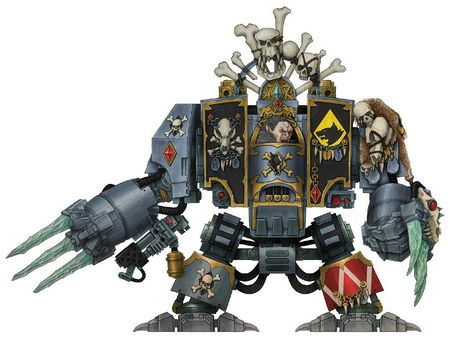
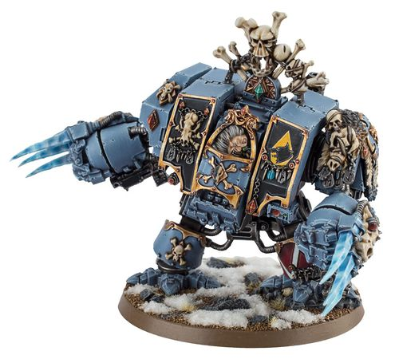

# 0649 杀戮牙 Murderfang

精校状态：中文行文已逐段精校，部分术语仍为暂定

分类：人类帝国 / 太空野狼

原文来源：https://www.bilibili.com/opus/1115346987558895617

原作者：帝国神选罐头

原文时间：2025年09月22日 15:15

[返回分类目录](目录.md) · [全书目录](../../目录.md)

原篇名：弑牙 Murderfang

<!-- A0649-B0001 -->
**英文原文**

Murderfang is a renowned Space Wolves Wulfen Dreadnought.

<!-- /A0649-B0001 -->

<!-- A0649-B0002 -->

原译文

弑牙是著名的太空野狼狼人无畏。

**校订译文**

杀戮牙是一台著名的太空野狼狼人无畏机甲。

**校注：** Murderfang 依 GW09 第34页/GW10 第33页既核官译杀戮牙；原弑牙留原译栏。

<!-- /A0649-B0002 -->

<!-- A0649-B0003 图片 -->

<!-- A0649-B0004 -->

原译文

Murderfang 弑牙

**校订译文**

Murderfang 杀戮牙

<!-- /A0649-B0004 -->

<!-- A0649-B0005 -->
## History 历史

<!-- /A0649-B0005 -->

<!-- A0649-B0006 -->
**英文原文**

In 960.M41, on the hell world of Omnicide, Logan Grimnar’s Great Company stumbled upon a feral Space Wolf Dreadnought carving its way through a force of Chaos Space Marines. After a fierce struggle, the murderous machine was captured and frozen in stasis before being taken back to the Fang for study.

<!-- /A0649-B0006 -->

<!-- A0649-B0007 -->

原译文

960.M41，在欧姆尼塞德地狱世界里，罗根·格里姆纳尔的大连偶然发现了一位野蛮的太空野狼无畏正在穿越混沌星际战士部队。经过激烈的战斗，这台凶残的机械被抓获并冻结在静滞状态，然后被带回长牙堡研究。

**校订译文**

960.M41，洛根·格里姆纳尔的大连在地狱世界欧姆尼塞德偶遇一台陷入兽性的太空野狼无畏机甲；它正一路屠戮混沌星际战士。经过激烈搏斗，战团将这台杀戮机器制服，置于静滞状态，运回长牙堡研究。

<!-- /A0649-B0007 -->

<!-- A0649-B0008 -->
**英文原文**

The identity of the once-noble hero within its sarcophagus is long lost, consumed by the bestial thing that now leers from its facade. In times of great strife, the machine-beast is released from its glacial prison and set upon the foe, and it will claw and stamp and bite until nothing is left but ruin. At battle’s end, the Space Wolves will freeze it with helfrost technology, hoping that Murderfang’s wrath can be stayed for long enough to see it contained once more in the caverns beneath the Fang. Yet all know that as the Time of Ending approaches, the white heat of its rage will be needed more than ever.

<!-- /A0649-B0008 -->

<!-- A0649-B0009 -->

原译文

石棺里曾经高贵的英雄的身份早已消失，现在从它的外表上露出的野兽般的东西。在大纷争时期，机械野兽从冰川监狱中被释放出来，攻击敌人，它会抓、戳、咬，直到只剩下毁灭。战斗结束后，太空野狼将用霜狱技术将其冷冻，希望弑牙的愤怒能够持续足够长的时间，让它再次被困在长牙堡下方的洞穴中。然而，所有人都知道，随着终结之刻的临近，人们将比以往任何时候都更需要它愤怒的高温。

**校订译文**

石棺中那位曾经高贵的英雄，身份早已无从追溯，其自我已被如今从机体前方狰狞窥视的兽性存在吞没。大战来临时，太空野狼会将这头机械猛兽从冰封牢狱中释放，驱向敌军。它不断撕抓、践踏、噬咬，直到眼前只余废墟。战斗结束后，战团再以霜狱技术将其冻结，希望暂时压住它的暴怒，争取足够时间，把它重新关入长牙堡地下的洞穴。所有人都明白，终结之刻越近，他们就越需要这股白热般的怒火。

**校注：** wrath can be stayed 指遏止愤怒，原译愤怒持续足够长时间完全相反；white heat 为怒火强烈的比喻，不指机器实际温度。

<!-- /A0649-B0009 -->

<!-- A0649-B0010 图片 -->

<!-- A0649-B0011 -->

原译文

Murderfang 弑牙

**校订译文**

Murderfang 杀戮牙

<!-- /A0649-B0011 -->

<!-- A0649-B0012 -->
**英文原文**

During the Hunt for the Wulfen in 999.M41, Murderfang helped Logan Grimnar find the Wulfen on the doomed planet of Vikurus. It seems that the dreadnought shares some kind of unspoken communion with Wulfen warriors.

<!-- /A0649-B0012 -->

<!-- A0649-B0013 -->

原译文

在999.M41的狼人狩猎期间，弑牙帮助罗根·格里姆纳尔在注定要毁灭的维库鲁斯行星上找到了狼人。这名无畏似乎与狼人战士有着某种默契。

**校订译文**

999.M41 的狼人狩猎期间，杀戮牙帮助洛根·格里姆纳尔在注定毁灭的维库鲁斯行星找到狼人。这台无畏机甲似乎与狼人战士有某种无声的心灵联系。

<!-- /A0649-B0013 -->

本篇核心术语与暂定项

以下列出本篇出现的英文原形及核心术语表用词。同形词可能指不同对象，具体词义以本篇正文和校注为准；单复数、别名和仅见于图注的名称可能尚未列入。完整候选见[术语表](../../术语表/双语术语候选.csv)。

| 英文 | 采用中文 | 状态 |
| --- | --- | --- |
| Space Marines | 星际战士 | 官方已核对 |
| Space Wolves | 太空野狼 | 官方已核对 |
| Chaos Space Marines | 混沌星际战士 | 官方已核对 |
| Stamp | 印块 | 暂定·官方待核 |
| Logan Grimnar | 洛根·格里姆纳尔 | 官方已核 |
| Murderfang | 杀戮牙 | 官方已核对 |
| Wulfen | 狼人 | 官方已核对 |
| Wulfen Dreadnought | 狼人无畏机甲 | 官方已核对 |
| Dreadnought | 无畏机甲 | 暂定·官方待核 |
| Omnicide | 欧姆尼塞德 | 暂定·官方待核 |
| Vikurus | 维库鲁斯 | 暂定·官方待核 |
| helfrost | 霜狱 | 暂定·官方待核 |
| Time of Ending | 终结之刻 | 暂定·官方待核 |
| claw | 利爪分队 | 暂定·官方待核 |

