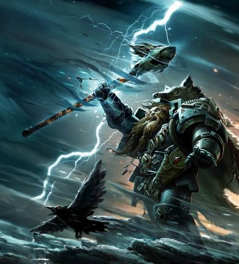
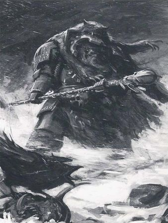
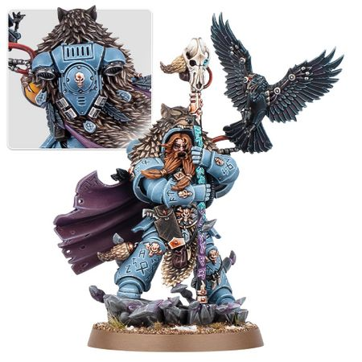

# 0650 风暴召唤者纳吉奥 Njal Stormcaller

精校状态：中文行文已逐段精校，部分术语仍为暂定

分类：人类帝国 / 太空野狼

原文来源：https://www.bilibili.com/opus/1114603412724383768

原作者：帝国神选罐头

原文时间：2025年09月20日 15:10

[返回分类目录](目录.md) · [全书目录](../../目录.md)

原篇名：尼加尔·唤风者 Njal Stormcaller

<!-- A0650-B0001 -->
**英文原文**

Njal Stormcaller is one of the Space Wolves' greatest Rune Priests and is among the greatest Librarians in the Imperium.

<!-- /A0650-B0001 -->

<!-- A0650-B0002 -->

原译文

尼加尔·唤风者是太空野狼最伟大的符文牧师之一，也是帝国最伟大的智库之一。

**校订译文**

风暴召唤者纳吉奥是太空野狼最杰出的符文牧师之一，也是帝国最强大的智库员之一。

**校注：** 依既核官译 Njal Stormcaller 为风暴召唤者纳吉奥；原尼加尔·唤风者保留原译对照。

<!-- /A0650-B0002 -->

<!-- A0650-B0003 图片 -->

<!-- A0650-B0004 -->

原译文

Njal Stormcaller 尼加尔·唤风者

**校订译文**

Njal Stormcaller 风暴召唤者纳吉奥

<!-- /A0650-B0004 -->

<!-- A0650-B0005 -->
## History 历史

<!-- /A0650-B0005 -->

<!-- A0650-B0006 -->
**英文原文**

Njal Stormcaller's long saga began many years ago upon the cold oceans of Fenris. In ships of wood and skin his tribe put to the sea after their lands sank amidst the trial of fire and water. For many months they wandered the raging oceans of Fenris in search of new lands. After a mighty sea battle they defeated their rivals the Paleskins and took possession of the land born with the turning of the great year. In battle the young Njal fought with such ferocity that not even a full-blooded warrior dare stand before him. Leaping from oar to oar he threw himself upon the enemy ships, clearing the whole decks and casting foes into the engulfing waters. At the battles end he lay exhausted on the deck, a spear point embedded in his breast. The pall of death lay upon him.

<!-- /A0650-B0006 -->

<!-- A0650-B0007 -->

原译文

尼加尔·唤风者的漫长传奇始于多年前的芬里斯的寒冷海洋。在他们的土地在火与水的试炼中沉没后，他的部落乘坐木船和皮筏出海。几个月来，他们在肆虐的芬里斯海洋中游荡，寻找新的土地。经过一场激烈的海战，他们击败了对手帕莱斯克人，占领了这片在大年之际诞生的土地。在战斗中，年轻的尼加尔战斗得如此凶猛，以至于连一个猛烈的战士都不敢站在他面前。他从一个桨跳到另一个桨，扑向敌舰，清理了整个甲板，把敌人扔进了吞没的水中。战斗结束时，他筋疲力尽地躺在甲板上，胸前插着一把长矛。死亡的阴影笼罩着他。

**校订译文**

风暴召唤者纳吉奥的漫长传奇始于多年前芬里斯冰冷的海洋。故土在火与水的灾变中沉没后，他的部落乘着以木材和兽皮造的船出海，在怒涛中漂泊数月，寻找新家园。他们经过激烈海战，击败苍白皮肤部族，夺下随着大年轮转而升起的新陆地。年轻的纳吉奥作战凶猛，即使身经百战的成年战士也不敢与之相抗。他踏着一支支船桨跃向敌船，杀遍甲板，将敌人抛入吞人的海水。战斗结束时，他筋疲力尽地倒在甲板上，一截矛尖嵌入胸膛，死亡阴影笼罩着他。

**校注：** Paleskins 为部族称呼，直义苍白皮肤；原帕莱斯克人的音译不能对应 skins 尾部，现用描述性暂译。full-blooded warrior 此处对照少年，指成熟战士，不涉及基因纯血。

<!-- /A0650-B0007 -->

<!-- A0650-B0008 图片 -->

<!-- A0650-B0009 -->

原译文

Njal Stormcaller 尼加尔·唤风者

**校订译文**

Njal Stormcaller 风暴召唤者纳吉奥

<!-- /A0650-B0009 -->

<!-- A0650-B0010 -->
**英文原文**

Njal's valor would have ended there, doubtless passing into the legends of his tribe, but his bravery had not gone unnoticed. His dying body was plucked from the enemy ship by Rune Priest Heimdall of the Space Wolves and was taken back to Asaheim. There he was trained by Heimdall and became a Space Wolves Rune Priest.

<!-- /A0650-B0010 -->

<!-- A0650-B0011 -->

原译文

尼加尔的英勇本应就此结束，无疑会成为他部落的传说，但他的英勇并没有被忽视。他垂死的身体被太空野狼的符文牧师海姆达尔从敌舰上收回，带回阿萨海姆。在那里，他接受了海姆达尔的训练，成为了太空野狼符文牧师。

**校订译文**

纳吉奥的事迹本该就此终结，成为部落传说，但太空野狼的符文牧师海姆达尔看见了他的英勇，将濒死的他从敌船救走，带回阿萨海姆。在海姆达尔教导下，他最终成为太空野狼符文牧师。

<!-- /A0650-B0011 -->

<!-- A0650-B0012 -->
**英文原文**

At the Battle of Goreswirl, he earned his name, Stormcaller, by using his psychic talent to blast apart a Bloodthirster that had killed his mentor, and then called up a psychic ice storm that destroyed the whole Chaos Army. Later, after saving the life of the Iron Priest Ulf Schwarzbraur at the Battle of Rust World, he was awarded with his Psyber Raven, Nightwing.

<!-- /A0650-B0012 -->

<!-- A0650-B0013 -->

原译文

在戈尔斯维尔之战中，他凭借自己的灵能天赋炸毁了一个杀死了他的导师的嗜血狂魔，然后召来了一场摧毁整个混沌军队的灵能冰雪风暴，从而获得了自己的名字，唤风者。后来，在铁锈世界之战中救了钢铁牧师乌尔夫·施瓦茨布劳尔的命后，他被授予了他的灵能渡鸦，夜翼。

**校订译文**

戈雷斯维尔之战中，纳吉奥以灵能轰碎杀害导师的嗜血狂魔，又召来灵能冰暴，摧毁整支混沌军队，因此获称“风暴召唤者”。后来，他在铁锈世界之战中救下钢铁牧师乌尔夫·施瓦茨布劳尔，获赠灵能渡鸦“夜翼”。

<!-- /A0650-B0013 -->

<!-- A0650-B0014 -->
**英文原文**

Around the same time as the 13th Black Crusade, Njal Stormcaller accompanied an Ecclesiarchy fleet to Ras Shakeh, where he rendezvous with Járnhamar Pack under Gunnlaugur. Disdainful of the Ecclesiarchy purges on the world, he instead focuses on leading the Pack in stopping the Space Hulk Festerax before it can destroy the Hive World of Kefa Primaris. During the subsequent boarding operation, the Pack member and nascent Psyker Baldr is captured by the Death Guard Sorcerer Mycelite. However Njal is able to destroy Baldr's psychic nullification collar, allowing the Space Wolf to annihilate Mycelite. Afterwards, Njal still dubs Baldr a dangerous witch despite his help, condemning him to execution. This causes the rest of Járnhamar Pack to rescue Baldr and flee Njal as renegades.

<!-- /A0650-B0014 -->

<!-- A0650-B0015 -->

原译文

大约在第13次黑色远征的同一时间，尼加尔·唤风者陪同一支教会舰队前往拉斯·沙克，在那里他与贡劳格尔手下的铁锤小队会合。他对教会对世界的净化不屑一顾，而是专注于带领小队在太空废船溃烂之斧号摧毁凯法主星巢都世界之前阻止它。在随后的跳帮行动中，小队成员和新生的灵能者巴德尔被死亡守卫巫师迈塞利特俘虏。然而，尼加尔能够摧毁巴德尔的灵能无效项圈，使太空野狼能够消灭迈塞利特。之后，尼加尔仍然称巴德尔是一个危险的巫师，尽管他提供了帮助，并判处他死刑。这导致铁锤小队的其他成员营救巴德尔，并作为叛徒逃离尼加尔。

**校订译文**

第十三次黑色远征前后，纳吉奥随一支国教会舰队前往拉斯·沙克，与贡劳尔率领的铁锤小队会合。他不屑于国教会在当地的清洗，把重心放在阻止太空废船费斯特拉克斯号上，避免它摧毁巢都世界凯法普里马里斯。在随后的跳帮行动中，刚觉醒灵能的小队成员巴德尔被死亡守卫巫师迈塞利特俘虏。纳吉奥摧毁了巴德尔的灵能压制项圈，使他得以消灭巫师。然而，事后纳吉奥仍认定巴德尔是危险的巫徒，判他死刑，未因其帮助而改变判决。铁锤小队其余成员因此救出巴德尔，逃离纳吉奥，沦为叛逆者。

**校注：** Festerax 为舰名，不足以据尾音 ax 拆成溃烂之斧；Kefa Primaris 为行星全名，也未写明它是系统主星，暂保留音译。Baldr 为刚觉醒的灵能者，非新生婴儿。

<!-- /A0650-B0015 -->

<!-- A0650-B0016 -->
**英文原文**

At the dawn of the Age of the Dark Imperium Njal received a vision of a son of the Allfather returning to usher in the apocalyptic Wolftime and bring salvation to Fenris, while also that of Logan Grimnar apparently meeting his end at the hand of a mighty beast believed to be Ghazghkull. Many interpreted this as the coming of Leman Russ, but in the end it turned out to be Roboute Guilliman and new Primaris Space Marine reinforcements. Njal urged caution to the distrustful Grimnar and was mostly accepting of the new warriors, and upon scanning the memories of the Unnumbered Son Gaius passed on the information to Logan to prove that these new warriors could be true Sons of Fenris.

<!-- /A0650-B0016 -->

<!-- A0650-B0017 -->

原译文

在黑暗帝国时代的黎明，尼加尔看到了全父之子回来迎接世界末日的狼之时刻并为芬里斯带来救赎的幻象，而罗根·格里姆纳尔的幻象显然是在一只据信是碎骨者的强大野兽手中结束了自己的生命。许多人将此解释为黎曼·鲁斯的到来，但最终证明是罗伯特·基里曼和新的原铸星际战士增援部队。尼加尔敦促不信任的格里姆纳尔保持谨慎，并基本上接受了新战士，在扫描了未计之子盖乌斯的记忆后，将信息传递给了罗根，以证明这些新战士可能是真正的芬里斯之子。

**校订译文**

黑暗帝国时代初临，纳吉奥看见全父一名儿子归来的异象：他将开启末日般的狼之时刻，为芬里斯带来救赎。与此同时，纳吉奥也预见洛根·格里姆纳尔似乎将死于一头强大野兽之手，人们认为那指碎骨者·斯拉卡。许多人将归来的儿子解读为黎曼·鲁斯，最后却发现来者是罗保特·基里曼，以及新的原铸星际战士援军。纳吉奥劝充满戒心的洛根谨慎行事，自己则基本接受这些新战士。他读取未计之子盖乌斯的记忆后，将所见转告洛根，证明原铸战士同样能够成为真正的芬里斯之子。

**校注：** meeting his end at the hand of 指被对手杀死，原结束自己的生命易误成自杀。

<!-- /A0650-B0017 -->

<!-- A0650-B0018 图片 -->

<!-- A0650-B0019 -->

原译文

Njal Stormcaller 尼加尔·唤风者

**校订译文**

Njal Stormcaller 风暴召唤者纳吉奥

<!-- /A0650-B0019 -->

<!-- A0650-B0020 -->
**英文原文**

Some time after the introduction of Primaris Space Marines into the Space Wolves Njal Stormcaller was led to Prospero by the spirit of a Thousand Sons Librarian Izzakar Orr. Izzakar offered his help to Njal in finding the lost remaining members of the Space Wolves 13th Great Company on Prospero in a network of portals called the Portal Maze in exchange for returning his spirit back to his body which was also located in the Portal Maze. In the ensuing battle on Tizca and the Portal Maze Njal was able to rescue most of the heresy-era warriors from Magnus the Red and the Thousand Sons and return to his ship in orbit, ordering that Prospero be purged.

<!-- /A0650-B0020 -->

<!-- A0650-B0021 -->

原译文

在将原铸星际战士引入太空野狼一段时间后，尼加尔·唤风者被千子智库伊萨卡尔·欧尔的精神带到了普罗斯佩罗。伊萨卡尔表示愿意帮助尼加尔在普罗斯佩罗的一个名为门户迷宫的门户网络中找到太空野狼第十三大连失踪的剩余成员，以换取他的灵魂回到同样位于门户迷宫中的身体。在随后的提兹卡和门户迷宫之战中，尼加尔成功地从赤红之马格努斯和千子手中救出了大多数叛乱时期的战士，并返回了他在轨道上的飞船，命令净化普罗斯佩罗。

**校订译文**

太空野狼接纳原铸星际战士一段时间后，纳吉奥在千子智库员伊萨卡尔·欧尔的灵魂引导下来到普洛斯佩罗。伊萨卡尔愿帮助他在名为“门户迷宫”的传送门网络中寻找失踪的第十三大连残部，条件是纳吉奥将他的灵魂送回同样困在迷宫中的身体。随后的提兹卡与门户迷宫之战中，纳吉奥从红魔马格努斯及千子手中救回了大多数荷鲁斯之乱时期的战士，返回轨道上的战舰，并下令净化普洛斯佩罗。

**校注：** Izzakar 为灵魂体引路；原精神带到措辞不明，现区分灵魂与肉体。

<!-- /A0650-B0021 -->

本篇核心术语与暂定项

以下列出本篇出现的英文原形及核心术语表用词。同形词可能指不同对象，具体词义以本篇正文和校注为准；单复数、别名和仅见于图注的名称可能尚未列入。完整候选见[术语表](../../术语表/双语术语候选.csv)。

| 英文 | 采用中文 | 状态 |
| --- | --- | --- |
| Space Marines | 星际战士 | 官方已核对 |
| Space Wolves | 太空野狼 | 官方已核对 |
| Death Guard | 死亡守卫 | 官方已核对 |
| Thousand Sons | 千子 | 官方已核对 |
| Psyker | 灵能者 | 官方已核对 |
| Librarian | 智库员 | 官方已核对 |
| Roboute Guilliman | 罗保特·基里曼 | 官方已核对 |
| Imperium | 帝国 | 暂定·简称 |
| Sorcerer | 巫师 | 官方已核对 |
| Ecclesiarchy | 国教会 | 暂定 |
| Hive World | 巢都世界 | 暂定·官方待核 |
| Magnus the Red | 红魔马格努斯 | 官方已核对 |
| Dark Imperium | 黑暗帝国 | 暂定·官方待核 |
| Fenris | 芬里斯 | 暂定·官方待核 |
| Iron Priest | 钢铁牧师 | 官方已核对 |
| True Sons | 真子 | 暂定·官方待核 |
| Space Marine | 星际战士 | 暂定·官方待核 |
| Primaris Space Marine | 原铸星际战士 | 暂定·官方待核 |
| Logan Grimnar | 洛根·格里姆纳尔 | 官方已核 |
| Njal Stormcaller | 风暴召唤者纳吉奥 | 官方已核 |
| Bloodthirster | 嗜血狂魔 | 官方已核对 |
| Great Year | 大年 | 暂定·官方待核 |
| Tribe | 部落（欧克组织） | 暂定·官方待核 |
| Goreswirl | 戈雷斯维尔 | 暂定·官方待核 |
| Járnhamar Pack | 铁锤小队 | 暂定·官方待核 |
| Gunnlaugur | 贡劳尔 | 暂定·官方待核 |
| Paleskins | 苍白皮肤部族 | 暂定·官方待核 |
| Heimdall | 海姆达尔 | 暂定·官方待核 |
| Ulf Schwarzbraur | 乌尔夫·施瓦茨布劳尔 | 暂定·官方待核 |
| Nightwing | 夜翼 | 暂定·官方待核 |
| Ras Shakeh | 拉斯·沙克 | 暂定·官方待核 |
| Festerax | 费斯特拉克斯号 | 暂定·官方待核 |
| Kefa Primaris | 凯法普里马里斯 | 暂定·官方待核 |
| Baldr | 巴德尔 | 暂定·官方待核 |
| Mycelite | 迈塞利特 | 暂定·官方待核 |
| Izzakar Orr | 伊萨卡尔·欧尔 | 暂定·官方待核 |
| Portal Maze | 门户迷宫 | 暂定·官方待核 |
| Ferocity | 凶猛 | 暂定·官方待核 |
| The Dark | 《黑暗》 | 暂定·官方待核 |
| Tizca | 提兹卡 | 暂定·官方待核 |

