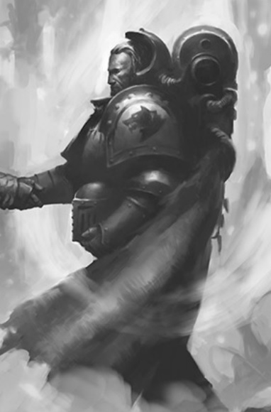

# 0651 博德瓦尔·比亚尔基 Bodvar Bjarki

精校状态：中文行文已逐段精校，部分术语仍为暂定

分类：人类帝国 / 太空野狼

原文来源：https://www.bilibili.com/opus/1064897468472229906

原作者：帝国神选罐头

原文时间：2025年05月09日 16:26

[返回分类目录](目录.md) · [全书目录](../../目录.md)

<!-- A0651-B0001 -->
**英文原文**

Bodvar Bjarki was a Rune Priest of the Space Wolves during the Horus Heresy.

<!-- /A0651-B0001 -->

<!-- A0651-B0002 -->

原译文

博德瓦尔·比亚尔基是荷鲁斯叛乱时期太空野狼的符文牧师。

**校订译文**

博德瓦尔·比亚尔基是荷鲁斯之乱时期太空野狼的符文牧师。

<!-- /A0651-B0002 -->

<!-- A0651-B0003 图片 -->

<!-- A0651-B0004 -->

原译文

Bodvar Bjarki 博德瓦尔·比亚尔基

**校订译文**

Bodvar Bjarki 博德瓦尔·比亚尔基

<!-- /A0651-B0004 -->

<!-- A0651-B0005 -->
## Overview 概述

<!-- /A0651-B0005 -->

<!-- A0651-B0006 -->
**英文原文**

Serving in the 3rd Great Company, while in service to Malcador the Sigillite Bjarki led a squad of Space Wolves against Thousand Sons attempting to recover various Shards of Magnus. Bjarki and his pact alongside Yasu Nagasena the captive Lemuel Gaumon ultimately failed in stopping Magnus from recovering his shards. Upon learning of Dio Promus' crimes against loyalists in the past, Bjarki's forces killed the Librarian but took the possessed Lemuel Gaumon back to Malcador for study.

<!-- /A0651-B0006 -->

<!-- A0651-B0007 -->

原译文

在第三大连服役期间，服务于掌印者马卡多的比亚尔基率领一支太空野狼小队对抗试图夺回马格努斯碎片的千子。比亚尔基和他的小队与长濑康与被俘的莱缪尔·高蒙的协议最终未能阻止马格努斯收回他的碎片。在得知迪奥·普罗姆斯过去对忠诚者犯下的罪行后，比亚尔基的部队杀死了智库，但将被附身的莱缪尔·高蒙带回给马卡多研究。

**校订译文**

比亚尔基隶属第三大连。为掌印者马卡多效力期间，他率一支太空野狼小队，阻止千子回收马格努斯的灵魂碎片。他与小队、长濑康及被俘的莱缪尔·高蒙同行，最终仍未能阻止马格努斯收回碎片。得知智库员迪奥·普罗姆斯过去残害忠诚者的罪行后，比亚尔基的部下将其杀死，却把遭附身的高蒙带回马卡多处研究。

**校注：** pact 与前后小队语境不合，疑 pack 笔误；原译另添协议没有支撑。英文同行名单缺 and，按三组参与者理顺，不改英文。

<!-- /A0651-B0007 -->

<!-- A0651-B0008 -->
**英文原文**

During the Siege of Terra Bjarki alongside his two remaining pack-mates fought alongside the Salamanders trio Atok Abidemi, Igen Gargo, and Barek Zytos at the Western Hemispheric wall section of the Imperial Palace. Apparently repelling a Thousand Sons assault. During the battle Bjarki summoned the power of both Fenris and Nocturne by combining his power with that of Abidemi, seemingly driving back an attack by Magnus the Red himself. During the battle Bjarki overloaded with the psychic power and would have slain both himself and Abidemi had the latter not severed their connection by cutting off his arm.

<!-- /A0651-B0008 -->

<!-- A0651-B0009 -->

原译文

在泰拉围城期间，比亚尔基与剩下的两名队友在皇宫西部墙段与火蜥蜴三人组阿托克·阿比德米、伊根·加戈和巴雷克·兹托斯并肩作战。击退了千子的进攻。在战斗中，比亚尔基通过将自己的力量与阿比德米的力量相结合，召集了芬里斯和夜曲星之力，击退了赤红之马格努斯本人的进攻。在战斗中，比亚尔基的灵能力量过载，如果阿比德米没有切断他的手臂，他就会杀死自己和阿比德米。

**校订译文**

泰拉围城期间，比亚尔基与仅剩的两名队友，在皇宫西半球城墙段与三名火蜥蜴——阿托克·阿比德米、伊根·加戈及巴雷克·齐托斯——并肩作战，看似击退了千子的进攻。比亚尔基将自身灵能与阿比德米的力量相连，同时引动芬里斯与夜曲星之力，似乎连红魔马格努斯本人都被逼退。然而，涌入的灵能超出他的承受能力。若非阿比德米斩断他的手臂、切断两人的联系，比亚尔基与阿比德米都会丧命。

**校注：** 保留 apparently / seemingly 的不确定性，下一段明确是假退。cutting off his arm 的 his 有代词歧义，沿原译理解为阿比德米砍断比亚尔基手臂并标待核，未擅改为自断臂。

<!-- /A0651-B0009 -->

<!-- A0651-B0010 -->
**英文原文**

The apparent repulsion of Magnus was however a ruse by the Crimson King, who instead infiltrated the Palace with a select entourage. Accompanied by the new Promeus, Bjarki's pack and the Salamanders confronted the Thousand Sons in the Throneroom before the Golden Throne. Bjarki seemingly defeated Ahriman in the battle, as the Sorcerer had been weakened by the anti-Warp wardings of the Palace. But before he could deliver the final blow Ahriman vanished from the Palace alongside Magnus after the Crimson King gave himself over fully to the powers of Chaos. After the battle the rest of Bjarki's squad was dead, and the sole survivor alongside the two remaining Salamanders joined forces with Garviel Loken and Nathaniel Garro.

<!-- /A0651-B0010 -->

<!-- A0651-B0011 -->

原译文

然而，马格努斯的明显撤退是深红之王的诡计，他带着精心挑选的随从潜入了皇宫。在新的普罗米修斯的陪伴下，比亚尔基的小队和火蜥蜴小队在黄金王座前与王座厅的千子对峙。比亚尔基在战斗中击败了阿里曼，因为巫师被皇宫的反亚空间防护所削弱。但在他能够发出最后一击之前，阿里曼在深红之王将自己完全交给混沌力量后，与马格努斯一起从皇宫消失了。战斗结束后，比亚尔基的其他队员都死了，唯一的幸存者与剩下的两名火蜥蜴一起与加维尔·洛肯和纳撒尼尔·伽罗联手。

**校订译文**

但马格努斯的败退只是赤红之王的计策，他趁机带少数亲随潜入皇宫。在新生的普罗梅乌斯陪同下，比亚尔基的小队与火蜥蜴于王座厅、黄金王座之前迎战千子。皇宫的反亚空间防护削弱了阿里曼，比亚尔基似乎将他击败。但在他补上最后一击之前，马格努斯彻底投身混沌，与阿里曼一同从皇宫消失。战后，比亚尔基的小队其余成员全部阵亡，他与幸存的两名火蜥蜴转而加入加维尔·洛肯和纳撒尼尔·伽罗。

**校注：** Promeus 与 Prometheus 不同，原普罗米修斯误合，暂音译普罗梅乌斯；称新生的来自 new，未额外推断本段未明说的身份。

<!-- /A0651-B0011 -->

<!-- A0651-B0012 -->
**英文原文**

Later during the final stages of the Siege, a badly wounded Bjarki is seen battling hordes of Death Guard at the Delphic Battlement.

<!-- /A0651-B0012 -->

<!-- A0651-B0013 -->

原译文

在围城的最后阶段，重伤的比亚尔基在德尔菲城垛中与成群的死亡守卫作战。

**校订译文**

在围城的最后阶段，重伤的比亚尔基在德尔菲城垛中与成群的死亡守卫作战。

<!-- /A0651-B0013 -->

<!-- A0651-B0014 -->
### Bjarki's Squad 比亚尔基的小队

<!-- /A0651-B0014 -->

<!-- A0651-B0015 -->
**英文原文**

Bjarki's squad consisted of:

<!-- /A0651-B0015 -->

<!-- A0651-B0016 -->

原译文

比亚尔基的小队由以下成员组成：

**校订译文**

比亚尔基的小队由以下成员组成：

<!-- /A0651-B0016 -->

<!-- A0651-B0017 -->
**英文原文**

Svafnir Rackwulf — The woe-maker, armed with an anti-Psyker null-spear. Killed beneath the Imperial Palace by Menkaura during the Siege of Terra.

<!-- /A0651-B0017 -->

<!-- A0651-B0018 -->

原译文

斯瓦夫尼尔·拉克伍尔夫 — 一个手持反灵能者虚无之矛的灾难制造者。在泰拉围城中被门卡乌拉在皇宫下杀死。

**校订译文**

斯瓦夫尼尔·拉克伍尔夫——称号“灾祸制造者”，手持克制灵能者的虚无之矛。泰拉围城期间，在皇宫地下被门卡乌拉杀死。

<!-- /A0651-B0018 -->

<!-- A0651-B0019 -->
**英文原文**

Olgyr Widdowsyn — Shield bearer. Killed by Ahriman beneath the Imperial Palace during the Siege of Terra.

<!-- /A0651-B0019 -->

<!-- A0651-B0020 -->

原译文

奥尔吉尔·威多辛 — 持盾者。在泰拉围城中被皇宫下的阿里曼杀死。

**校订译文**

奥尔吉尔·威多辛——持盾者。泰拉围城期间，在皇宫地下被阿里曼杀死。

<!-- /A0651-B0020 -->

<!-- A0651-B0021 -->
**英文原文**

Gierlonthnir Helblind — Shield bearer. Killed by Lemuel Gaumon who at the time was possessed by a Shard of Magnus.

<!-- /A0651-B0021 -->

<!-- A0651-B0022 -->

原译文

吉尔隆尼尔·赫尔布林德 — 持盾者。被当时被马格努斯碎片附身的莱缪尔·高蒙杀死。

**校订译文**

吉尔隆尼尔·赫尔布林德——持盾者。被当时遭马格努斯灵魂碎片附身的莱缪尔·高蒙杀死。

<!-- /A0651-B0022 -->

<!-- A0651-B0023 -->
**英文原文**

Harr Balegyr — Berserker. Killed by Lucius on Kamiti Sona

<!-- /A0651-B0023 -->

<!-- A0651-B0024 -->

原译文

哈里·贝尔格 — 狂战士。在卡米蒂·索纳被卢修斯杀死

**校订译文**

哈里·贝尔格——狂战士，在卡米蒂·索纳被卢修斯杀死。

<!-- /A0651-B0024 -->

<!-- A0651-B0025 -->
## Trivia 琐事

<!-- /A0651-B0025 -->

<!-- A0651-B0026 -->
**英文原文**

In Norse mythology, Bödvar Bjarki is the hero appearing in the Saga of Hrólf Kraki.

<!-- /A0651-B0026 -->

<!-- A0651-B0027 -->

原译文

在挪威神话中，博德瓦尔·比亚尔基是出现在罗尔夫国王传奇中的英雄。

**校订译文**

在北欧传说中，博德瓦尔·比亚尔基（Bödvar Bjarki）是《赫罗尔夫·克拉基传奇》（Saga of Hrólf Kraki）中的英雄。

<!-- /A0651-B0027 -->

本篇核心术语与暂定项

以下列出本篇出现的英文原形及核心术语表用词。同形词可能指不同对象，具体词义以本篇正文和校注为准；单复数、别名和仅见于图注的名称可能尚未列入。完整候选见[术语表](../../术语表/双语术语候选.csv)。

| 英文 | 采用中文 | 状态 |
| --- | --- | --- |
| Space Wolves | 太空野狼 | 官方已核对 |
| Death Guard | 死亡守卫 | 官方已核对 |
| Thousand Sons | 千子 | 官方已核对 |
| Psyker | 灵能者 | 官方已核对 |
| Librarian | 智库员 | 官方已核对 |
| Horus Heresy | 荷鲁斯之乱 | 官方已核对 |
| Warp | 亚空间 | 官方已核对 |
| Sorcerer | 巫师 | 官方已核对 |
| Terra | 泰拉 | 暂定·官方待核 |
| Horus | 荷鲁斯 | 暂定·官方待核 |
| Garviel Loken | 加维尔·洛肯 | 暂定·官方待核 |
| Magnus the Red | 红魔马格努斯 | 官方已核对 |
| Golden Throne | 黄金王座 | 暂定·官方待核 |
| Malcador the Sigillite | 掌印者马卡多 | 暂定·官方待核 |
| Salamanders | 火蜥蜴 | 暂定·官方待核 |
| Lucius | 卢修斯 | 暂定·官方待核 |
| Fenris | 芬里斯 | 暂定·官方待核 |
| Nocturne | 夜曲星 | 暂定·官方待核 |
| Zytos | 赛托斯 | 暂定·官方待核 |
| The Sigillite | 掌印者 | 暂定·官方待核 |
| Barek Zytos | 巴雷克·齐托斯 | 暂定·官方待核 |
| Igen Gargo | 伊根·加戈 | 暂定·官方待核 |
| Nathaniel Garro | 纳撒尼尔·伽罗 | 暂定·官方待核 |
| Dio Promus | 迪奥·普罗姆斯 | 暂定·官方待核 |
| Powers | 能天使 | 暂定·官方待核 |
| Delphic | 德尔斐 | 暂定·官方待核 |
| Atok Abidemi | 阿托克·阿比德米 | 暂定·官方待核 |
| Menkaura | 门卡乌拉 | 暂定·官方待核 |
| Lemuel Gaumon | 莱缪尔·高蒙 | 暂定·官方待核 |
| Bodvar Bjarki | 博德瓦尔·比亚尔基 | 暂定·官方待核 |
| Yasu Nagasena | 长濑康 | 暂定·官方待核 |
| Promeus | 普罗梅乌斯 | 暂定·官方待核 |
| Svafnir Rackwulf | 斯瓦夫尼尔·拉克伍尔夫 | 暂定·官方待核 |
| Olgyr Widdowsyn | 奥尔吉尔·威多辛 | 暂定·官方待核 |
| Gierlonthnir Helblind | 吉尔隆尼尔·赫尔布林德 | 暂定·官方待核 |
| Harr Balegyr | 哈里·贝尔格 | 暂定·官方待核 |
| Kamiti Sona | 卡米蒂·索纳 | 暂定·官方待核 |
| Delphic Battlement | 德尔斐城垛 | 暂定·官方待核 |
| Woe | 悲哀星 | 暂定·官方待核 |
| The Delphic Battlement | 德尔菲城垛 | 暂定·官方待核 |

