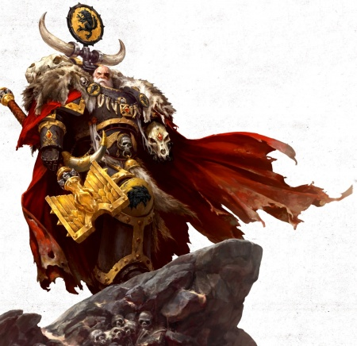
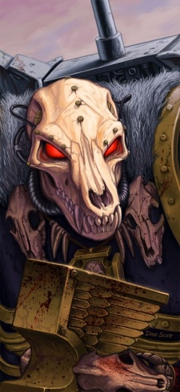
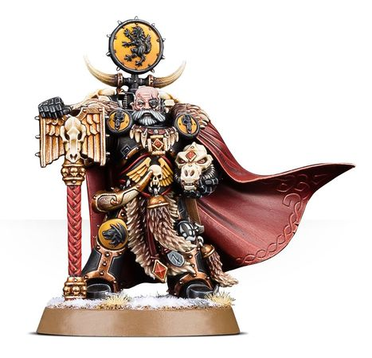

# 0652 杀戮者乌尔里克 Ulrik the Slayer

精校状态：中文行文已逐段精校，部分术语仍为暂定

分类：人类帝国 / 太空野狼

原文来源：https://www.bilibili.com/opus/1114906349656866816

原作者：帝国神选罐头

原文时间：2025年09月21日 10:46

[返回分类目录](目录.md) · [全书目录](../../目录.md)

原篇名：屠戮者乌尔里克 Ulrik the Slayer

<!-- A0652-B0001 -->
**英文原文**

Ulrik the Slayer, also known as Grandfather Lupus and Guardian of the Sons of Russ, is Wolf High Priest of the Space Wolves

<!-- /A0652-B0001 -->

<!-- A0652-B0002 -->

原译文

屠戮者乌尔里克，也被称为狼祖父和鲁斯之子的守护者，是太空野狼的至高狼祭司

**校订译文**

杀戮者乌尔里克又称“狼祖父”与“鲁斯子嗣守护者”，是太空野狼的至高狼牧师。

<!-- /A0652-B0002 -->

<!-- A0652-B0003 图片 -->

<!-- A0652-B0004 -->

原译文

Ulrik the Slayer 屠戮者乌尔里克

**校订译文**

Ulrik the Slayer 杀戮者乌尔里克

<!-- /A0652-B0004 -->

<!-- A0652-B0005 -->
## Biography 传记

<!-- /A0652-B0005 -->

<!-- A0652-B0006 -->
**英文原文**

As indicated by his snow-white hair, Ulrik is the oldest Wolf alive (excluding Dreadnoughts), older even than Great Wolf Logan Grimnar, who has served the Chapter for 700 years. It was Ulrik who selected future Great Wolf Logan Grimnar for induction into the Chapter and watched him grow into the leader he is today. Ulrik still has a close bond with Grimnar and is his chief adviser, still referring to the Great Wolf by his first name and treating him like he is still a young upstart.

<!-- /A0652-B0006 -->

<!-- A0652-B0007 -->

原译文

正如他雪白的头发所表明的那样，乌尔里克是现存最古老的野狼（不包括无畏），甚至比在战团服役了700年的头狼罗根·格里姆纳尔还要老。正是乌尔里克选择了未来的头狼罗根·格里姆纳尔加入战团，并看着他成长为今天的领导者。乌尔里克仍然与格里姆纳尔保持着密切的联系，并且是他的首席顾问，仍然以他的名字称呼头狼，并把他当作一个年轻的新人对待。

**校订译文**

一头雪白的发丝见证着乌尔里克的年岁。他是尚未进入无畏机甲的太空野狼中最年长者，甚至比本段称已为战团服役七百年的头狼洛根·格里姆纳尔更老。当年正是他选中洛根加入战团，见证其成长为如今的领袖。两人至今关系密切，乌尔里克担任首席顾问，仍直呼洛根的名字，把他当作初露头角的年轻人。

**校注：** 本段称洛根服役七百年，非头狼任期七百年；与 647 的各种纪年说法分别保留，不混作同一指标。

<!-- /A0652-B0007 -->

<!-- A0652-B0008 -->
**英文原文**

Ulrik won renown during the First War for Armageddon, while serving as a Wolf Guard in the Great Company of Wolf Lord Kruger. When his Company stormed head-on into the attacking Chaos Space Marines of the World Eaters, Lord Kruger fell in combat with three hulking Khorne Berserkers. Though he had lost his own weapon, Ulrik leapt to defend his dying Lord, slaying the three Berserkers in a bloody melee. His battle fury was so awe-inspiring that Angron Daemon Primarch of the World Eaters felt compelled to offer a grim salute The day after the Imperium's victory on Armageddon, Ulrik was renamed "the Slayer" and his fellow Wolf Guards voted him as Kruger's replacement. To general astonishment, Ulrik declined, being one of the few, if not the only, Wolves to refuse such a promotion. At heart, Ulrik believed he was a warrior, not a leader

<!-- /A0652-B0008 -->

<!-- A0652-B0009 -->

原译文

乌尔里克在第一次阿玛吉多顿战争期间闻名，当时他在狼主克鲁格的大连担任野狼守卫。当他的连队迎头冲入进攻的吞世者混沌星际战士时，狼主克鲁格与三名笨重的恐虐狂战士交战。虽然他失去了自己的武器，但乌尔里克还是跳起来保卫垂死的狼主，在血腥的混战中杀死了三名狂战士。他的战斗怒火如此令人敬畏，以至于吞世者的恶魔原体安格隆也不得不向他致敬。帝国在阿玛吉多顿获胜后的第二天，乌尔里克被重新命名为“屠戮者”，他的野狼守卫战友投票将他选为克鲁格的继任者。令大家惊讶的是，乌尔里克拒绝了，他是少数几个（如果不是唯一一个）拒绝这样晋升的野狼之一。本质上，乌尔里克认为自己是一名战士，而不是领导者

**校订译文**

第一次阿玛吉多顿战争期间，乌尔里克以狼主克鲁格大连的野狼守卫身份成名。大连正面迎击吞世者时，克鲁格倒在三名身形魁梧的恐虐狂战士围攻之下。乌尔里克虽然丢失武器，仍跃上前守护垂死的狼主，在血腥近战中杀死三名狂战士。他的战斗怒火震撼全场，就连吞世者恶魔原体安格隆也向他肃然致意。帝国获胜翌日，乌尔里克被赋予“杀戮者”之名，其他野狼守卫投票推举他继任克鲁格。令人惊讶的是，他拒绝了这一晋升，成为极少数——或许也是唯一——作此选择的太空野狼。他内心认定自己属于战士，而非统帅。

<!-- /A0652-B0009 -->

<!-- A0652-B0010 图片 -->

<!-- A0652-B0011 -->

原译文

Ulrik the Slayer 屠戮者乌尔里克

**校订译文**

Ulrik the Slayer 杀戮者乌尔里克

<!-- /A0652-B0011 -->

<!-- A0652-B0012 -->
**英文原文**

In the aftermath of the war, the human defenders of Armageddon were declared tainted by the Administratum and the Inquisition, and rounded up, en masse, sterilized, and relocated to slave labour camps. Logan Grimnar was enraged by this treatment of the Wolves' allies, and it was only Ulrik's counsel that prevented this rage from exploding into open war against the Administratum. Instead of ascending to Wolf Lord, Ulrik accepted the rank of Wolf Priest, and discovered his true calling: the selection and training of new recruits to the Chapter. With years of combat experience and accrued wisdom, Ulrik is both a fine teacher and a great mentor for any aspiring Wolf

<!-- /A0652-B0012 -->

<!-- A0652-B0013 -->

原译文

战争结束后，阿玛吉多顿的人类防御者被内务部和审判庭宣布为有污点，被集体围捕、绝育并重新安置到奴隶劳改营。罗根·格里姆纳尔对野狼的盟友的这种待遇感到愤怒，只有乌尔里克的建议阻止了这种愤怒爆发为对内务部的公开战争。乌尔里克没有升任狼主，而是接受了狼牧师的军衔，并发现了他的真正使命：挑选和训练新成员加入战团。凭借多年的战斗经验和积累的智慧，乌尔里克既是一位优秀的老师，也是任何野狼有志者的伟大导师

**校订译文**

战后，内政部与审判庭宣称阿玛吉多顿的凡人守军已遭污染，将他们大批拘捕、强制绝育，送入奴役劳改营。盟友受到如此对待，令洛根愤怒不已。本篇称，只有乌尔里克的劝告，才避免这股怒火演变成对内政部的公开战争。乌尔里克没有继任狼主，而是接受狼牧师职务，找到了真正的使命：为战团选拔与训练新兵。丰富的战斗经验和多年积累的智慧，使他成为每个立志加入太空野狼者的优秀导师。

**校注：** 此处称未与内政部全面开战；其他章节的耻辱之月记载双方实际与审判庭交战。组织和阶段均不同，不将这句改成从未与帝国机构开战。

<!-- /A0652-B0013 -->

<!-- A0652-B0014 -->
**英文原文**

In recent years, however, Ulrik has become even more aggressive in combat, rushing headlong to meet the most deadly of enemies with no regard for his own safety. By the start of the Indomitus Crusade Ulrik was now extremely elderly and acknowledged that he was nearing the end of his life. Nonetheless he battled Orks alongside Logan Grimnar and counseled the Great Wolf against accepting the new Primaris Space Marines. He also urged Logan to meet his supposed fate at the hands of Ghazghkull, whatever it may be. However once Logan agreed to take in the new warriors, Ulrik carried out the orders without question.

<!-- /A0652-B0014 -->

<!-- A0652-B0015 -->

原译文

然而，近年来，乌尔里克在战斗中变得更加有侵略性，不顾一切地冲向最致命的敌人。到不屈远征开始时，乌尔里克已经非常老了，他承认自己的生命即将结束。尽管如此，他还是与罗根·格里姆纳尔并肩作战，并建议头狼不要接受新的原铸星际战士。他还敦促罗根在碎骨者的手中迎接他所谓的命运，无论是什么。然而，一旦罗根同意接收新的战士，乌尔里克毫无疑问地执行了命令。

**校订译文**

近些年来，乌尔里克作战更加悍勇，常不顾自身安危，径直冲向最危险的敌人。不屈远征初期，他已极其年迈，也承认生命将近终点。即便如此，他仍与洛根并肩对抗欧克，并劝头狼拒绝接纳新的原铸星际战士。他也敦促洛根去面对碎骨者·斯拉卡为自己带来的所谓宿命，无论结局如何。但当洛根最终决定接纳新人时，乌尔里克仍毫不质疑地执行了命令。

<!-- /A0652-B0015 -->

<!-- A0652-B0016 -->
## Wargear 武器装备

原题：Wargear 战备

<!-- /A0652-B0016 -->

<!-- A0652-B0017 -->
**英文原文**

Like all Wolf Priests, Ulrik is equipped with a Crozius Arcanum, a Fang of Morkai, and a Wolf Amulet. He also carries a Plasma pistol. In recognition of his status, Ulrik has been gifted with the sacred Wolf Helm of Russ, fashioned by the Emperor's own artificers and given to Leman Russ at the founding of the Space Wolf Chapter. It gives Ulrik a penetrating gaze that reinforces the morale of any Wolves who catch sight of him, while striking terror into any enemies unlucky enough to do so

<!-- /A0652-B0017 -->

<!-- A0652-B0018 -->

原译文

像所有的狼牧师一样，乌尔里克配备了一个牧师权杖，一个莫凯之牙和一个野狼护身符。他还带着一把等离子手枪。为了表彰他的地位，乌尔里克被授予了神圣的鲁斯狼盔，由帝皇的工匠制作，并在太空野狼战团成立时赠送给黎曼·鲁斯。它给了乌尔里克一种敏锐的目光，增强了任何看到他的野狼的士气，同时也让任何不幸的敌人感到恐惧

**校订译文**

与其他狼牧师一样，乌尔里克装备教士权杖、莫凯之牙与野狼护符，另携一把等离子手枪。为彰显他的地位，战团将神圣的鲁斯狼盔授予他。这件头盔由帝皇麾下工匠打造，在太空野狼成立时赠予黎曼·鲁斯。戴上它，乌尔里克的目光更具穿透力：看见他的太空野狼士气大振，不幸与之对视的敌人则心生恐惧。

**校注：** 原文 founding of the Space Wolf Chapter 与给鲁斯赠盔的早期年代称呼存在军团/战团用语问题，译太空野狼成立时，保留事件本身。

<!-- /A0652-B0018 -->

<!-- A0652-B0019 图片 -->

<!-- A0652-B0020 -->

原译文

Ulrik 乌尔里克

**校订译文**

Ulrik 乌尔里克

<!-- /A0652-B0020 -->

<!-- A0652-B0021 -->
## Conflicting sources 来源冲突

<!-- /A0652-B0021 -->

<!-- A0652-B0022 -->
**英文原文**

According to one early White Dwarf article, Ulrik (misspelled Ulric) was responsible for recruiting Logan Grimnar into the Space Wolves and fought during the First War for Armageddon as a Blood Claw. This does not make sense, when Grimnar also fought in the First War, before Ulrik became a Wolf Priest.

<!-- /A0652-B0022 -->

<!-- A0652-B0023 -->

原译文

根据《白矮人》早期的一篇文章，乌尔里克（错误拼写为乌尔里）负责招募罗根·格里姆纳尔加入太空野狼，并在第一次阿玛吉多顿战争期间作为血爪为阿玛吉多顿而战。这是没有道理的，当时格里姆纳尔也参加了第一次战争，在乌尔里克成为狼牧师之前。

**校订译文**

早期一篇《白矮人》文章称，乌尔里克（该文拼作 Ulric）负责招募洛根·格里姆纳尔加入太空野狼，又称他在第一次阿玛吉多顿战争中还是血爪。这与通常的招募职责及前述经历难以相容：格里姆纳尔本人也参加了那场战争，而按其他记载，乌尔里克是在战后才成为狼牧师。

<!-- /A0652-B0023 -->

<!-- A0652-B0024 -->
**英文原文**

Also, his description as an advisor to Grimnar, who convinces him not to retaliate against the Adminstratum after the First War ends, is inconsistent with the description of his role as a Wolf Guard during that War, and only becoming a Wolf Priest in the aftermath.

<!-- /A0652-B0024 -->

<!-- A0652-B0025 -->

原译文

此外，他被描述为格里姆纳尔的顾问，他说服格里姆纳尔在第一次战争结束后不要对内务部进行报复，这与他在那场战争中作为野狼守卫的角色描述不一致，他只是在战争结束后才成为狼牧师。

**校订译文**

此外，有记载称乌尔里克已是格里姆纳尔的顾问，在第一次阿玛吉多顿战争结束后劝他不要报复内政部；本篇指出，这与另一处将他记为战时的野狼守卫、战后才转任狼牧师的叙述存在角色衔接上的矛盾。

**校注：** 顾问身份并不在逻辑上必然要求先为狼牧师；该条对矛盾的判断出自所给英文，现明确为本篇判断，供读者对照。

<!-- /A0652-B0025 -->

<!-- A0652-B0026 -->
**英文原文**

Other sources also credit Ulrik with recruiting Ragnar Blackmane, which is inconsistent with the novel Space Wolf by William King, in which Ragnar is recruited by Ranek Icewalker

<!-- /A0652-B0026 -->

<!-- A0652-B0027 -->

原译文

其他消息来源也认为乌尔里克招募了拉格纳·黑鬃，这与威廉·金的小说《太空野狼》不一致，在该小说中，拉格纳被拉内克·冰行者招募

**校订译文**

另有来源称，拉格纳·黑鬃也是由乌尔里克招募的。但威廉·金的小说《太空野狼》中，招募拉格纳的却是拉内克·冰行者。

<!-- /A0652-B0027 -->

本篇核心术语与暂定项

以下列出本篇出现的英文原形及核心术语表用词。同形词可能指不同对象，具体词义以本篇正文和校注为准；单复数、别名和仅见于图注的名称可能尚未列入。完整候选见[术语表](../../术语表/双语术语候选.csv)。

| 英文 | 采用中文 | 状态 |
| --- | --- | --- |
| Space Marines | 星际战士 | 官方已核对 |
| Space Wolves | 太空野狼 | 官方已核对 |
| Chaos Space Marines | 混沌星际战士 | 官方已核对 |
| World Eaters | 吞世者 | 官方已核对 |
| Orks | 欧克蛮人 | 官方已核对 |
| Inquisition | 审判庭 | 暂定 |
| Imperium | 帝国 | 暂定·简称 |
| Khorne | 恐虐 | 官方已核对 |
| Indomitus | 不屈学派 | 暂定·学派语境 |
| Description | 描述 | 编辑用语已统一 |
| Administratum | 内政部 | 暂定 |
| Emperor | 帝皇 | 官方已核对 |
| Primarch | 原体 | 官方已核对 |
| Indomitus Crusade | 不屈远征 | 暂定·官方待核 |
| Armageddon | 阿玛吉多顿 | 暂定·官方待核 |
| Crozius Arcanum | 教士权杖 | 暂定·官方待核 |
| High Priest | 高阶祭司 | 暂定·官方待核 |
| Founding | 建军 | 暂定·官方待核 |
| Chapter | 战团 | 暂定·官方待核 |
| Logan Grimnar | 洛根·格里姆纳尔 | 官方已核 |
| Ulrik the Slayer | 杀戮者乌尔里克 | 官方已核 |
| Ragnar Blackmane | 拉格纳·黑鬃 | 官方已核 |
| Wolf Priest | 狼牧师 | 官方语境参考·待核 |
| Fang of Morkai | 莫凯之牙 | 暂定·官方待核 |
| Wolf Amulet | 野狼护符 | 暂定·官方待核 |
| Wolf Guard | 野狼守卫 | 官方词根参考·通称待核 |
| Angron | 安格隆 | 官方已核对 |
| Wolf High Priest | 至高狼牧师 | 暂定·官方待核 |
| Grandfather Lupus | 狼祖父 | 暂定·官方待核 |
| Guardian of the Sons of Russ | 鲁斯子嗣守护者 | 暂定·官方待核 |
| Kruger | 克鲁格 | 暂定·官方待核 |
| Wolf Helm of Russ | 鲁斯狼盔 | 暂定·官方待核 |
| Ranek Icewalker | 拉内克·冰行者 | 暂定·官方待核 |
| claw | 利爪分队 | 暂定·官方待核 |
| Plasma pistol | 等离子手枪 | 官方已核对 |

