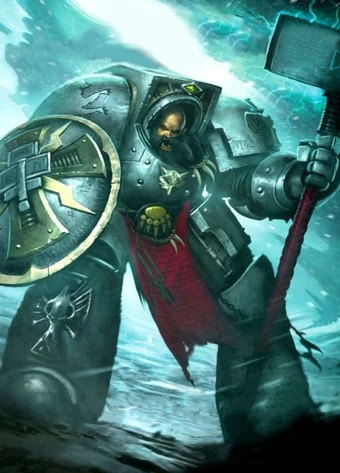
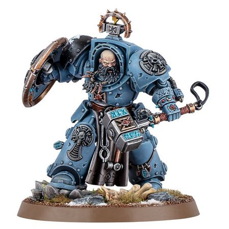

# 0653 阿贾克·石拳 Arjac Rockfist

精校状态：中文行文已逐段精校，部分术语仍为暂定

分类：人类帝国 / 太空野狼

原文来源：https://www.bilibili.com/opus/1115322909968039937

原作者：帝国神选罐头

原文时间：2025年09月22日 13:42

[返回分类目录](目录.md) · [全书目录](../../目录.md)

<!-- A0653-B0001 -->
**英文原文**

"As the mountain is Arjac, a snow-capped peak

<!-- /A0653-B0001 -->

<!-- A0653-B0002 -->

原译文

山为阿贾克，覆雪之峰

**校订译文**

“阿贾克如巍峨高山，峰顶覆雪；

<!-- /A0653-B0002 -->

<!-- A0653-B0003 -->
**英文原文**

His rage overshadows the wounded bear.

<!-- /A0653-B0003 -->

<!-- A0653-B0004 -->

原译文

他的愤怒就算伤熊也相形见绌。

**校订译文**

他的狂怒，连伤熊也望尘莫及。

<!-- /A0653-B0004 -->

<!-- A0653-B0005 -->
**英文原文**

The Rockfist endures when all seems lost."

<!-- /A0653-B0005 -->

<!-- A0653-B0006 -->

原译文

当一切陷落时，石拳屹立不倒。"

**校订译文**

纵使万事皆休，石拳仍屹立不倒。”

<!-- /A0653-B0006 -->

<!-- A0653-B0007 -->
**英文原文**

+++from The Saga of Arjac Rockfist+++

<!-- /A0653-B0007 -->

<!-- A0653-B0008 -->

原译文

+++摘自《阿贾克·石拳传奇》+++

**校订译文**

+++摘自《阿贾克·石拳传奇》+++

<!-- /A0653-B0008 -->

<!-- A0653-B0009 -->
**英文原文**

Arjac Rockfist, also known as The Man-Mountain, Grimnar's Champion, and Anvil of Fenris, is a massive Wolf Guard of the Space Wolves Space Marines Chapter, and the personal champion of the Great Wolf Logan Grimnar himself .

<!-- /A0653-B0009 -->

<!-- A0653-B0010 -->

原译文

阿贾克·石拳，也被称为似山之人、格里姆纳尔的冠军和芬里斯的铁砧，是太空野狼星际战士战团的一名巨大的野狼守卫，也是头狼罗根·格里姆纳尔本人的个人冠军。

**校订译文**

阿贾克·石拳又称“似山之人”“格里姆纳尔的冠军”及“芬里斯之砧”。他是太空野狼战团一名体格异常魁梧的野狼守卫，也是头狼洛根·格里姆纳尔亲自选定的冠军战士。

<!-- /A0653-B0010 -->

<!-- A0653-B0011 图片 -->

<!-- A0653-B0012 -->

原译文

Arjac Rockfist 阿贾克·石拳

**校订译文**

Arjac Rockfist 阿贾克·石拳

<!-- /A0653-B0012 -->

<!-- A0653-B0013 -->
**英文原文**

He speaks little, but he is not a lackwit. He knows full well that he will always be a warrior and not a leader. He is modest and unassuming in person, though he cannot deny his rare gift for crushing the mightiest of foes

<!-- /A0653-B0013 -->

<!-- A0653-B0014 -->

原译文

他话不多，但他不是个懒散的人。他深知自己将永远是一名战士，而非领导者。他本人谦虚谦逊，尽管他不能否认自己粉碎最强大敌人的罕见天赋

**校订译文**

他沉默寡言，却并不愚笨。他很清楚自己会始终做一名战士，而非领袖。平日的他谦逊朴实，但也无法否认，自己确有击溃至强敌人的罕见天赋。

**校注：** lackwit 指愚笨者，非懒散者。

<!-- /A0653-B0014 -->

<!-- A0653-B0015 -->
## History 历史

<!-- /A0653-B0015 -->

<!-- A0653-B0016 -->
**英文原文**

Before he was inducted into the Space Wolves, Arjac was a blacksmith of the Bear Claw tribe of Fenris, and was always renowned as a giant of a man, possessed of prodigious strength.

<!-- /A0653-B0016 -->

<!-- A0653-B0017 -->

原译文

在加入太空野狼之前，阿贾克是芬里斯熊爪部落的铁匠，他一直被誉为巨人，拥有惊人的力量。

**校订译文**

在加入太空野狼之前，阿贾克是芬里斯熊爪部落的铁匠，他一直被誉为巨人，拥有惊人的力量。

<!-- /A0653-B0017 -->

<!-- A0653-B0018 -->
**英文原文**

After joining the Wolves, he became an Iron Priest. He keenly misses his life at the furnace and hopes one day to return to his Iron Priest brethren. Yet to anyone who witnesses one of Arjac's legendary rampages, it is obvious that his true calling lies on the battlefield, not the forge.

<!-- /A0653-B0018 -->

<!-- A0653-B0019 -->

原译文

加入野狼后，他成为了一名钢铁牧师。他深切怀念在火炉旁的生活，希望有一天能回到他的钢铁牧师兄弟身边。然而，对于任何目睹阿贾克传奇暴行的人来说，很明显，他的真正使命在于战场，而不是铁匠铺。

**校订译文**

加入太空野狼后，阿贾克成为钢铁牧师。他非常怀念守着熔炉的生活，希望有朝一日回到钢铁牧师兄弟们身边。然而，只要见过他在战场上的惊人杀伐，就会明白他的真正使命仍在战场。

<!-- /A0653-B0019 -->

<!-- A0653-B0020 -->
**英文原文**

It was a particularly hot year on the Iron Isles when one of these rampages earned Arjac his place at Grimnar's side. The shores were covered in algae, and around each volcano vegetation grew in surreal proportions - the signs of an imminent attack, but the Iron Priests were too absorbed in their work in the lava forges to notice.

<!-- /A0653-B0020 -->

<!-- A0653-B0021 -->

原译文

这是钢铁群岛特别炎热的一年，其中一次暴行为阿贾克赢得了格里姆纳尔身边的位置。海岸上长满了藻类，每座火山周围的植被都以超现实的比例生长 — 这是即将发生袭击的迹象，但钢铁牧师们太专注于他们在熔岩铸造厂中的工作了，没有注意到。

**校订译文**

钢铁群岛某个格外炎热的年份，阿贾克的一次壮举使他赢得了格里姆纳尔身边的位置。当时海岸遍布藻类，火山周围的植被疯长，规模异乎寻常。这些都是袭击将至的征兆，但钢铁牧师专注于熔岩锻炉中的工作，没有察觉。

<!-- /A0653-B0021 -->

<!-- A0653-B0022 -->
**英文原文**

So when a thousand kraken-spawn surged from the ocean, the Priests found themselves sorely outnumbered. The most senior of the Priests, Hengis Blackhand, was left no choice but to order the vaults sealed against the tide of the kraken, sealing hundreds of good men outside on the volcano slopes.

<!-- /A0653-B0022 -->

<!-- A0653-B0023 -->

原译文

因此，当一千只海怪幼体从海洋中涌出时，牧师们发现自己处于劣势。最资深的牧师亨吉斯·黑手别无选择，只能下令将穹顶密封起来，以抵御海怪的浪潮，将火山斜坡上的数百名好人密封起来。

**校订译文**

一千头海怪幼体突然从海中涌出，钢铁牧师寡不敌众。最资深的亨吉斯·黑手别无选择，只能下令封闭地库，抵御海怪狂潮，数百人因此被关在外面的火山坡上。

<!-- /A0653-B0023 -->

<!-- A0653-B0024 -->
**英文原文**

Arjac did not agree with his decision, but did not waste time trying to argue with his superior. He smashed his way out of the vaults with his hammer, opening an escape route for those trapped outside. All but a dozen escaped inside, choosing instead to stand with Arjac as the first wave of Kraken struck.

<!-- /A0653-B0024 -->

<!-- A0653-B0025 -->

原译文

阿贾克不同意他的决定，但并没有浪费时间与上司争论。他用锤子砸碎了穹顶，为被困在外面的人开辟了一条逃生路线。除了十几个人外，其他人都逃了进去，在第一波海怪来袭时，他们选择和阿贾克站在一起。

**校订译文**

阿贾克不赞同这一决定，却没有浪费时间与上级争辩。他挥锤砸开出口，冲出地库，为受困者打开逃生通道。绝大多数人逃入地库，唯有十二人选择留下，与他共同迎击第一波海怪。

**校注：** 英文 All but a dozen ... choosing instead 的主语衔接有歧义，结合 instead，留下的应是十二人，不能理解为所有撤入者又在外应敌。

<!-- /A0653-B0025 -->

<!-- A0653-B0026 -->
**英文原文**

Less than two hours later, reinforcements arrived from The Fang in a hundred Thunderhawk gunships - and saw, on the ground, a lone figure surrounded by kraken and the crackling blue arcs of a Thunder hammer in full swing.

<!-- /A0653-B0026 -->

<!-- A0653-B0027 -->

原译文

不到两个小时后，增援部队从长牙堡乘坐一百架雷鹰炮艇抵达，在地面上看到一个被海怪包围的孤独身影，雷霆锤的蓝色弧线噼啪作响。

**校订译文**

不到两小时，一百架雷鹰炮艇载着长牙堡援军赶到。他们看见地面上仅剩一个被海怪团团围住的身影，正挥动雷霆锤，劈出噼啪作响的蓝色电弧。

<!-- /A0653-B0027 -->

<!-- A0653-B0028 -->
**英文原文**

When Logan Grimnar and his men reached the entrance to the vaults, Arjac's body still plugged the entrance buried under a mountain of chitin and scythed limbs. Once dug out, Arjac was immediately given to the Wolf Priests who brought him back from the threshold of Morkai's realm. Greatly impressed, the Great Wolf made him his personal champion on the spot. Since that day, Arjac has earned his spot again a dozen times over. During the Battle of the Weeping Stars, Arjac was the last to abandon the crippled Strike Cruiser Fangs of Fenris, dragging wounded brothers to the salvation pods even as the hulk burned around him. While he was protecting the Great Wolf on the crystal plains of Vhaldon IX, Arjac filled the Mirrored Gate with the corpses of Hormagaunts until the weight of the Tyranids' own dead halted their advance.

<!-- /A0653-B0028 -->

<!-- A0653-B0029 -->

原译文

当罗根·格里姆纳尔和他的部下到达穹顶入口时，阿贾克的身体仍然堵塞着埋在甲壳质山下的入口，并被镰肢割下了四肢。一被挖出，阿贾克立即被交给了狼牧师，他们把他从莫凯领域的门槛上带了回来。印象深刻的是，头狼当场让他成为了自己的个人冠军。从那天起，阿贾克已经十几次赢得了自己的位置。在啜泣群星之战中，阿贾克是最后一个放弃残缺不全的打击巡洋舰芬里斯之牙的人，他把受伤的兄弟拖到救生舱里，即使他周围的船体在燃烧。当他在瓦哈顿九号的水晶平原上保护头狼时，阿贾克用刀虫的尸体填满了镜门，直到泰伦的尸体的重量阻止了他们的前进。

**校订译文**

洛根与部下赶到地库入口时，阿贾克的身体仍堵在门前，埋在堆积如山的甲壳与镰肢之下。众人将他挖出，立即交给狼牧师，把他从莫凯的死亡国度边缘救了回来。头狼深受震撼，当场任命他为自己的冠军战士。此后，阿贾克又以十多次壮举证明自己当之无愧。啜泣群星之战中，他最后一个撤离重创的打击巡洋舰芬里斯之牙号，即使舰体四周已燃起大火，仍将伤员拖入救生舱。在瓦哈顿九号水晶平原护卫头狼时，他杀死的刀虫堆满镜门，直到泰伦自己的尸骸堵住通路，阻止了后续攻势。

**校注：** under a mountain of chitin and scythed limbs 描述堆积的海怪残骸，原译另添阿贾克被割下四肢，没有英文依据。莫凯领域边缘为濒死意象，非实际已经死后复生。

<!-- /A0653-B0029 -->

<!-- A0653-B0030 -->
**英文原文**

In the end of M41 during the Hunt for the Wulfen, Arjac joined Lord Grimnar in the quest for finding these mysterious and long lost warriors of Space Wolves. Defending Grimnar, Arjac fought on the planet of Vikurus with Daemons. Later during the Siege of the Fenris System Arjac again fought on the Grimnar side on Fenris itself - battling in the Wolf’s Gullet region. At the dawn of the Age of the Dark Imperium he fought desperately to keep Logan Grimnar alive as the Great Wolf rejected Guilliman's offer of Primaris Space Marine reinforcements and sought to meet his supposed fate at the hands Ghazghkull. However fortunately for Arjac, Logan had a change of heart on all of these issues and instead took the path of caution and acceptance.

<!-- /A0653-B0030 -->

<!-- A0653-B0031 -->

原译文

在M41的最后，在寻找狼人的过程中，阿贾克加入了格里姆纳尔领主的行列，寻找这些神秘而失散已久的太空野狼战士。为了保卫格里姆纳尔，阿贾克与恶魔在维库鲁斯行星上作战。后来，在芬里斯星系围城中，阿贾克再次在芬里斯的格里姆纳尔身侧作战，在狼之咽喉地区作战。在黑暗帝国时代的黎明，他拼命地战斗，以保住罗根·格里姆纳尔的生命，因为头狼拒绝了基里曼原铸星际战士增援的提议，并试图在碎骨者手中迎接他所谓的命运。然而，幸运的是，罗根在所有这些问题上都改变了主意，转而选择了谨慎和接受的道路。

**校订译文**

M41 末的狼人狩猎期间，阿贾克随格里姆纳尔寻找这些神秘、失踪已久的太空野狼战士，在维库鲁斯对抗恶魔，保护头狼。随后芬里斯星系遭围攻时，他又在母星的狼之咽喉地区与格里姆纳尔并肩作战。黑暗帝国时代初期，头狼拒绝基里曼提供的原铸援军，执意去面对自己将死于碎骨者·斯拉卡之手的预定命运，阿贾克不得不拼命保他周全。所幸，洛根后来改变想法，选择谨慎应对，并接纳新人。

<!-- /A0653-B0031 -->

<!-- A0653-B0032 -->
**英文原文**

Arjac Rockfist was among those under Njal Stormcaller who ventured to Prospero to recover survivors of the Space Wolves 13th Great Company.

<!-- /A0653-B0032 -->

<!-- A0653-B0033 -->

原译文

阿贾克·石拳是尼加尔·唤风者手下冒险前往普罗斯佩罗营救太空野狼第十三大连幸存者的人之一。

**校订译文**

阿贾克·石拳也曾随风暴召唤者纳吉奥冒险前往普洛斯佩罗，营救太空野狼第十三大连的幸存者。

<!-- /A0653-B0033 -->

<!-- A0653-B0034 图片 -->

<!-- A0653-B0035 -->

原译文

Arjac Rockfist 阿贾克·石拳

**校订译文**

Arjac Rockfist 阿贾克·石拳

<!-- /A0653-B0035 -->

<!-- A0653-B0036 -->
## Wargear 武器装备

原题：Wargear 战备

<!-- /A0653-B0036 -->

<!-- A0653-B0037 -->
**英文原文**

Arjac's strength affords him the ability to wield weapons of unusual bulk and heft. The Anvil Shield is a huge Storm Shield that can be used as a bludgeon in itself — many a foe's skull has been shattered on its rune-covered surface. Foehammer is an equally oversized Thunder Hammer, which delivers devastating blows when combined with the Champion's superhuman strength. Foehammer is more than merely a potent close combat weapon, for it incorporates an ancient miniaturised teleporter keyed to Arjac's gauntlet, allowing it to be hurled at the enemy from a distance before returning to its wielder's outstretched hand in a flash of scorched atmosphere.

<!-- /A0653-B0037 -->

<!-- A0653-B0038 -->

原译文

阿贾克的力量使他能够使用不同寻常的体积和重量的武器。铁砧盾是一个巨大的风暴盾，本身可以用作棍棒 — 许多敌人的头骨在其符文覆盖的表面上被砸碎了。是一个同样超大的雷霆锤，当与冠军的超人力量相结合时，它会发出毁灭性的打击。破敌锤不仅仅是一件强大的近战武器，因为它采用了一种古老的微型传送器，与阿贾克的臂铠相连接，使其能够从远处向敌人投掷，然后在烧焦的大气中回到使用者伸出的手上。

**校订译文**

阿贾克的巨力使他能够使用格外庞大沉重的武器。铁砧盾是一面巨型风暴盾，本身便可充作钝器；许多敌人的头颅就碎在布满符文的盾面上。破敌锤则是一柄同样超大的雷霆锤，在他超人力量的驱动下，能造成毁灭性打击。它还远不止是近战武器：锤内装有古老的微型传送器，与阿贾克的护手联动。他可以远远掷锤攻击敌人，再让它伴着灼烧空气的闪光，传送回自己伸出的手中。

**校注：** 原译丢失第二句主语 Foehammer，现补足破敌锤；回手通过传送器实现，不是普通飞行轨迹。

<!-- /A0653-B0038 -->

<!-- A0653-B0039 -->
## Trivia 琐事

<!-- /A0653-B0039 -->

<!-- A0653-B0040 -->
**英文原文**

Arjac's hammer is likely inspired by Mjölnir, the weapon of the Norse God Thor, which would always return to his hand when thrown.

<!-- /A0653-B0040 -->

<!-- A0653-B0041 -->

原译文

阿贾克的锤子很可能是受到北欧神祇托尔的武器妙尔尼尔的启发，这种武器在投掷时总是会回到他的手中。

**校订译文**

阿贾克的锤子很可能是受到北欧神祇托尔的武器妙尔尼尔的启发，这种武器在投掷时总是会回到他的手中。

<!-- /A0653-B0041 -->

本篇核心术语与暂定项

以下列出本篇出现的英文原形及核心术语表用词。同形词可能指不同对象，具体词义以本篇正文和校注为准；单复数、别名和仅见于图注的名称可能尚未列入。完整候选见[术语表](../../术语表/双语术语候选.csv)。

| 英文 | 采用中文 | 状态 |
| --- | --- | --- |
| Space Marines | 星际战士 | 官方已核对 |
| Space Wolves | 太空野狼 | 官方已核对 |
| Tyranids | 泰伦虫族 | 官方已核对 |
| Imperium | 帝国 | 暂定·简称 |
| Dark Imperium | 黑暗帝国 | 暂定·官方待核 |
| Fenris | 芬里斯 | 暂定·官方待核 |
| Iron Priest | 钢铁牧师 | 官方已核对 |
| Ancient | 旗手 | 官方已核对 |
| Champion | 冠军 | 暂定·官方待核 |
| Space Marine | 星际战士 | 暂定·官方待核 |
| Chapter | 战团 | 暂定·官方待核 |
| Primaris Space Marine | 原铸星际战士 | 暂定·官方待核 |
| Logan Grimnar | 洛根·格里姆纳尔 | 官方已核 |
| Njal Stormcaller | 风暴召唤者纳吉奥 | 官方已核 |
| Arjac Rockfist | 阿贾克·石拳 | 官方已核 |
| Strike Cruiser | 打击巡洋舰 | 暂定·官方待核 |
| Wulfen | 狼人 | 官方已核对 |
| Tribe | 部落（欧克组织） | 暂定·官方待核 |
| Wolf Guard | 野狼守卫 | 官方词根参考·通称待核 |
| Hormagaunts | 刀虫 | 官方已核对 |
| The Weapon | 武器 | 暂定·官方待核 |
| The Anvil | 铁砧星堡 | 暂定·官方待核 |
| Bear | 熊 | 暂定·官方待核 |
| Vikurus | 维库鲁斯 | 暂定·官方待核 |
| The Man-Mountain | 似山之人 | 暂定·官方待核 |
| Anvil of Fenris | 芬里斯之砧 | 暂定·官方待核 |
| Hengis Blackhand | 亨吉斯·黑手 | 暂定·官方待核 |
| Fangs of Fenris | 芬里斯之牙号 | 暂定·官方待核 |
| Vhaldon IX | 瓦哈顿九号 | 暂定·官方待核 |
| Mirrored Gate | 镜门 | 暂定·官方待核 |
| Anvil Shield | 铁砧盾 | 暂定·官方待核 |
| Foehammer | 破敌锤 | 暂定·官方待核 |
| The Dark | 《黑暗》 | 暂定·官方待核 |
| System | 星系（恒星系统） | 暂定·官方待核 |
| Thunder Hammer | 雷霆锤 | 暂定·官方待核 |
| claw | 利爪分队 | 暂定·官方待核 |
| Storm Shield | 风暴盾 | 暂定·官方待核 |
| Kraken | 克拉肯 | 暂定·官方待核 |

