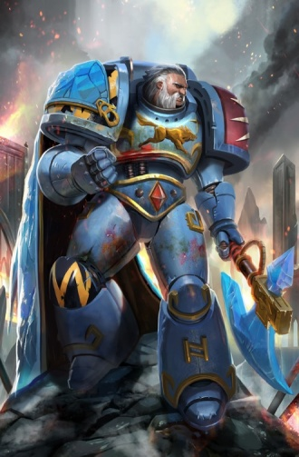
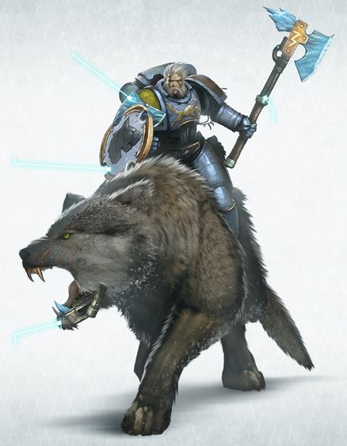

# 0654 哈拉尔德·死狼 Harald Deathwolf

精校状态：中文行文已逐段精校，部分术语仍为暂定

分类：人类帝国 / 太空野狼

原文来源：https://www.bilibili.com/opus/1114930332764733444

原作者：帝国神选罐头

原文时间：2025年09月21日 12:19

[返回分类目录](目录.md) · [全书目录](../../目录.md)

<!-- A0654-B0001 -->
**英文原文**

Harald Deathwolf is a Wolf Lord of the Space Wolves, commanding the Deathwolves Great Company.

<!-- /A0654-B0001 -->

<!-- A0654-B0002 -->

原译文

哈拉尔德·死狼是太空野狼的狼主，指挥着死狼大连。

**校订译文**

哈拉尔德·死狼是太空野狼的狼主，指挥着死狼大连。

<!-- /A0654-B0002 -->

<!-- A0654-B0003 图片 -->

<!-- A0654-B0004 -->

原译文

Harald Deathwolf 哈拉尔德·死狼

**校订译文**

Harald Deathwolf 哈拉尔德·死狼

<!-- /A0654-B0004 -->

<!-- A0654-B0005 -->
**英文原文**

He is often found riding into battle on his Thunderwolf Icetooth with many lupine beasts in tow, whether they be made of flesh, metal or a mixture of both. Usually found close behind will be his savage champion, Canis Wolfborn, a giant of a man riding his equally giant Thunderwolf, Fangir. His chosen symbol is the Ravening Jaw, symbolized by a wolf eating a star. The Ravening Jaw in Fenrisian mythology symbolizes the Wolftime, when Morkai will eat the sun and the stars and shroud Fenris in an eternal night.

<!-- /A0654-B0005 -->

<!-- A0654-B0006 -->

原译文

他经常被发现骑着他的雷狼冰牙和许多狼兽一起参加战斗，无论它们是由血肉、金属还是两者的混合物制成的。通常发现紧随其后的是他的野蛮冠军卡尼斯·狼裔，一个骑着他同样巨大的雷狼方吉尔的巨人。他选择的象征是凶颌，象征着吞星之狼。芬里斯神话中的凶颌象征着狼之时刻，莫凯将吃掉太阳和群星，在永恒的夜晚笼罩芬里斯。

**校订译文**

哈拉尔德常骑乘雷狼“冰牙”出战，身后跟着大批狼兽，其中既有血肉之躯，也有机械造物或血肉与机械结合的生物。他凶悍的冠军战士卡尼斯·狼裔通常紧随其后，骑着同样巨大的雷狼方吉尔。哈拉尔德选择的徽记是“凶颌”，图案为一头吞噬星辰的狼。在芬里斯神话中，凶颌象征狼之时刻：届时莫凯将吞下太阳与群星，让芬里斯陷入永夜。

<!-- /A0654-B0006 -->

<!-- A0654-B0007 -->
**英文原文**

Harald Deathwolf is known for his mutual animosity with Thousand Sons Sorcerer Mordant Hex, and the two have frequently come to blows.

<!-- /A0654-B0007 -->

<!-- A0654-B0008 -->

原译文

哈拉尔德·死狼以与千子巫师莫丹特·海克斯的相互仇恨而闻名，两人经常发生冲突。

**校订译文**

哈拉尔德·死狼以与千子巫师莫丹特·海克斯的相互仇恨而闻名，两人经常发生冲突。

<!-- /A0654-B0008 -->

<!-- A0654-B0009 -->
## Biography 传记

<!-- /A0654-B0009 -->

<!-- A0654-B0010 -->
**英文原文**

Before his induction into the Space Wolves, Harald Deathwolf was a champion of the Tide Hounds tribe on Fenris.

<!-- /A0654-B0010 -->

<!-- A0654-B0011 -->

原译文

在加入太空野狼之前，哈拉尔德·死狼是芬里斯潮汐猎犬部落的冠军。

**校订译文**

在加入太空野狼之前，哈拉尔德·死狼是芬里斯潮汐猎犬部落的冠军。

<!-- /A0654-B0011 -->

<!-- A0654-B0012 -->
**英文原文**

Harald Deathwolf has held the rank of Wolf Lord for over a century. A renowned warrior of Leif Snowfang’s Great Company, Harald had risen quickly to his lord’s Wolf Guard, and won many victories in Leif’s name. Ever since Harald was a Blood Claw he always had an affinity for lupine creatures, and his packmates often joked that he was the misbegotten son of a Thunderwolf, earning him the nickname Thunderson. Leif used Harald’s kinship with wolves often in battle, and the Thunderson would lead packs of Fenrisian Wolves, Thunderwolves and other feral creatures with a skill beyond anyone in living memory. When Leif Snowfang fell broken upon the battlefields of Rygar, slain by a lucky blow from the Ork Warboss Rokbad Necksnapper, it was Harald who rallied the warriors of his Great Company and led them to victory. On a field piled high with the corpses of Rokbad’s tribe, Harald was voted Wolf Lord amid the cheers and howls of his kin. As the tale goes, at that moment Harald looked up to the dim Rygar sun, shrouded by battle smoke, and proclaimed himself Deathwolf, and his totem the Ravening Jaw, the symbol of the Wolftime.

<!-- /A0654-B0012 -->

<!-- A0654-B0013 -->

原译文

哈拉尔德·死狼已经担任狼主一个多世纪了。哈拉尔德是雷夫·雪牙的大连的著名战士，他很快就加入了狼主的野狼守卫，并以雷夫的名义赢得了许多胜利。自从哈拉尔德成为一位血爪以来，他一直对狼类生物有着深厚的感情，他的战友们经常开玩笑说他是雷狼之子，这为他赢得了雷霆之子的绰号。雷夫经常在战斗中使用哈拉尔德与狼的亲密关系，雷霆之子将带领一群芬里斯狼、雷狼和其他野生生物，其技能超出了人们的想象。当雷夫·雪牙在莱加的战场上倒下，被欧克战争头目洛克巴德·折颈者的幸运一击杀死时，是哈拉尔德召集了他的大连的战士并带领他们取得了胜利。在一片堆满洛克巴德部落的尸体的田野上，哈拉尔德在战友的欢呼和嚎叫中被选为狼主。据说，就在那一刻，哈拉尔德抬头看着笼罩在战斗烟雾中的昏暗的莱加的太阳，宣布自己是死狼，他的图腾是狼之时刻的象征 — 凶颌。

**校订译文**

哈拉尔德担任狼主已逾一个世纪。他原是雷夫·雪牙大连中的杰出战士，很快升入野狼守卫，为狼主赢得许多胜利。早在血爪时期，他就与狼类格外亲近，伙伴常笑称他是雷狼生错种的儿子，因而得名“雷霆之子”。雷夫经常运用他驭狼的本领，让他率领芬里斯狼、雷狼及其他凶兽投入战斗；在世之人的记忆中，无人能与他相比。雷夫后来在莱加战场被欧克战争头目洛克巴德·折颈者侥幸击杀，哈拉尔德收拢部队，率大连赢得胜利。在堆满敌方部落尸体的战场上，他在战友欢呼与长嚎中被推举为狼主。据说，那一刻他抬头望向被硝烟遮蔽的莱加太阳，自称“死狼”，并选取象征狼之时刻的凶颌为图腾。

<!-- /A0654-B0013 -->

<!-- A0654-B0014 图片 -->

<!-- A0654-B0015 -->

原译文

The Badge of the Great Devourer 大吞噬者徽章

**校订译文**

The Badge of the Great Devourer 大吞噬者徽章

<!-- /A0654-B0015 -->

<!-- A0654-B0016 -->
**英文原文**

Harald Deathwolf’s Great Company swelled with packs of wolves, and many of his chambers in the Fang are given over to dens and lairs. Wherever the Wolf Lord goes, loping packs of wolves will follow, always skulking in his shadow or lying at his feet. One frozen Fenrisian night, the Deathwolves gained a powerful new warrior. On this night, Canis Wolfborn came to the Fang with his wolf pack, following the snow-covered tracks of the Space Wolves initiate Jorek the Giant, who had come to hunt Canis’ kin and failed. Raised by wolves and completely feral, Canis howled out to the cold stone edifice, a haunting challenge to those that would try to kill his wolf-family. It was Harald Deathwolf who answered this call and met with the young warrior by the light of a cold moon. Unable to communicate with Canis, Harald stared into his eyes and growled a challenge, before both warriors hurled themselves at the other with bared teeth. Even though Canis was but a man, Harald was impressed with the strength and skill with which he fought. When Canis finally bared his neck in submission to Harald, the Wolf Lord led him into the Fang. In time, Canis would become Harald’s champion and the greatest of his warriors.

<!-- /A0654-B0016 -->

<!-- A0654-B0017 -->

原译文

哈拉尔德·死狼的大连里挤满了狼群，他在长牙堡里的许多房间都变成了兽穴和兽巢。无论狼主走到哪里，成群的狼都会跟着，总是躲在他的阴影下或躺在他的脚下。在一个冰冷的芬里斯之夜，死狼获得了一位强大的新战士。这天晚上，卡尼斯·狼裔带着他的狼群来到长牙堡，沿着太空野狼信徒巨人乔雷克的白雪覆盖的足迹，乔雷克是来追捕卡尼斯的血亲的，但失败了。卡尼斯由狼抚养长大，完全野性十足，他对着冰冷的石头建筑嚎叫，这对那些试图杀死他的狼家族的人来说是一个令人难忘的挑战。是哈拉尔德·死狼响应了这一号召，在一轮冰冷的月光下会见了这位年轻的战士。由于无法与卡尼斯沟通，哈拉尔德盯着他的眼睛，咆哮着挑战，然后两名战士都亮着牙齿向对方扑去。尽管卡尼斯只是个男人，哈拉尔德对他战斗的力量和技巧印象深刻。当卡尼斯终于向哈拉尔德投降时，狼主把他带进了长牙堡。随着时间的推移，卡尼斯成为哈拉尔德的冠军，也是他最伟大的战士。

**校订译文**

哈拉尔德的大连中狼群日增，连他在长牙堡的许多房间都成了兽巢。狼主无论走到哪里，总有狼群追随，潜行于其阴影中，或伏卧在他脚边。一个冰寒的芬里斯夜晚，死狼大连迎来一名强大战士。那夜，卡尼斯·狼裔率狼群来到长牙堡，循着太空野狼新兵“巨人”乔雷克留在积雪中的足迹而来；乔雷克此前试图猎杀他的狼族亲人，却未得手。由狼抚养、全无文明习性的卡尼斯对着冰冷堡墙长嚎，向猎杀狼群者发出令人悚然的挑战。哈拉尔德应声而出，在寒月下与他相见。双方无法交谈，狼主便直视他的双眼、低吼挑衅，两人随即龇牙扑向对方。卡尼斯虽仍是凡人，力量与技巧却令哈拉尔德赞叹。最终，卡尼斯露出脖颈表示臣服，狼主将他带入长牙堡。此后，他成为哈拉尔德的冠军战士，也是麾下最强大的战士。

**校注：** initiate 指入伍受训者，非宗教信徒；露出脖颈的臣服动作在英文明确，原译遗漏。

<!-- /A0654-B0017 -->

<!-- A0654-B0018 -->
**英文原文**

After hearing that his Tide Hounds tribe was again beset by Ice Troll migrations, Harald returned to his ancestral lands without permission and purged the marauding monsters, claiming the enchanted pelt of the largest of their number as a trophy.

<!-- /A0654-B0018 -->

<!-- A0654-B0019 -->

原译文

在听说他的潮汐猎犬部落再次受到冰巨魔迁徙的困扰后，哈拉尔德未经许可返回了他的先祖土地，并清除了劫掠的怪物，将它们中数量最多的魔法皮毛作为战利品。

**校订译文**

听说自己的潮汐猎犬部落再次遭受迁徙冰巨魔袭扰，哈拉尔德未经许可便返回祖地，杀尽劫掠的怪物，并将最大那头冰巨魔带有魔力的毛皮取作战利品。

**校注：** the largest of their number 指群体中个头最大的一只，原译数量最多的皮毛错误。

<!-- /A0654-B0019 -->

<!-- A0654-B0020 -->
**英文原文**

The personal Strike Cruiser of Harald is called Alpha Fang — it is no less swift and predatory than his master.

<!-- /A0654-B0020 -->

<!-- A0654-B0021 -->

原译文

哈拉尔德的个人打击巡洋舰被称为獠牙之首号，它的速度和掠夺性并不亚于他的主人。

**校订译文**

哈拉尔德的专属打击巡洋舰名为“獠牙之首号”，其迅疾与凶猛不逊于主人。

<!-- /A0654-B0021 -->

<!-- A0654-B0022 图片 -->

<!-- A0654-B0023 -->

原译文

Harald Deathwolf on his Thunderwolf Icetooth 哈拉尔德·死狼在他的雷狼冰牙上

**校订译文**

Harald Deathwolf on his Thunderwolf Icetooth 哈拉尔德·死狼在他的雷狼冰牙上

<!-- /A0654-B0023 -->

<!-- A0654-B0024 -->
## Later Battles 后期战事

原题：Later Battles 后来战斗

<!-- /A0654-B0024 -->

<!-- A0654-B0025 -->
**英文原文**

913.M41: Harald was charged with eliminating the notorious Space Wolves traitor and Chaos Lord Svane Vulfbad.

<!-- /A0654-B0025 -->

<!-- A0654-B0026 -->

原译文

哈拉尔德被要求消灭臭名昭著的太空野狼叛徒和混沌领主斯瓦恩·沃夫巴德。

**校订译文**

913.M41：哈拉尔德奉命消灭臭名昭著的太空野狼叛徒、混沌领主斯瓦恩·沃夫巴德。

**校注：** 补回原译遗漏的 913.M41；后两项也补回英文中的 M41 末及 999.M41。

<!-- /A0654-B0026 -->

<!-- A0654-B0027 -->
**英文原文**

End of M41: Hunt for the Wulfen — Battle of Nurades and fighting on Svardeghul.

<!-- /A0654-B0027 -->

<!-- A0654-B0028 -->

原译文

狼人狩猎 — 努拉德斯之战和斯瓦德格尔之战。

**校订译文**

M41 末：参加狼人狩猎，在努拉德斯与斯瓦德格尔作战。

<!-- /A0654-B0028 -->

<!-- A0654-B0029 -->
**英文原文**

999.M41: Siege of the Fenris System — fighting for Frostheim ,Battle of Morkai's Keep, battle on Fenris itself.

<!-- /A0654-B0029 -->

<!-- A0654-B0030 -->

原译文

芬里斯星系围城 — 弗罗斯特海姆之战，莫凯要塞之战，芬里斯之战。

**校订译文**

999.M41：参加芬里斯星系围城，先后在弗罗斯特海姆、莫凯要塞及芬里斯本土作战。

<!-- /A0654-B0030 -->

<!-- A0654-B0031 -->
## Equipment 装备

<!-- /A0654-B0031 -->

<!-- A0654-B0032 -->
**英文原文**

Glacius — Frost Axe

<!-- /A0654-B0032 -->

<!-- A0654-B0033 -->

原译文

格雷休斯 — 霜斧

**校订译文**

格雷休斯 — 霜斧

<!-- /A0654-B0033 -->

<!-- A0654-B0034 -->
**英文原文**

Icetooth — Thunderwolf that many times bore Harald to victory - for example he fought on the blasted plains of Zslabin and tore the life from Phaenoc the Unclean

<!-- /A0654-B0034 -->

<!-- A0654-B0035 -->

原译文

冰牙 — 雷狼多次带领哈拉尔德取得胜利 — 例如，他在兹斯拉宾被炸毁的平原上作战，夺走了不净者费农的生命

**校订译文**

冰牙——曾多次载哈拉尔德赢得胜利的雷狼。例如，它在兹斯拉宾遭轰击的平原上参战，杀死了不净者费农。

<!-- /A0654-B0035 -->

<!-- A0654-B0036 -->

原译文

Mantle of the Ice Troll King 冰巨魔王斗篷

**校订译文**

Mantle of the Ice Troll King 冰巨魔王斗篷

<!-- /A0654-B0036 -->

本篇核心术语与暂定项

以下列出本篇出现的英文原形及核心术语表用词。同形词可能指不同对象，具体词义以本篇正文和校注为准；单复数、别名和仅见于图注的名称可能尚未列入。完整候选见[术语表](../../术语表/双语术语候选.csv)。

| 英文 | 采用中文 | 状态 |
| --- | --- | --- |
| Space Wolves | 太空野狼 | 官方已核对 |
| Thousand Sons | 千子 | 官方已核对 |
| Sorcerer | 巫师 | 官方已核对 |
| Fenris | 芬里斯 | 暂定·官方待核 |
| Master | 导师（审判庭职衔）／舰务官（舰员职务） | 语境定译·官方待核 |
| The Wolftime | 狼之时刻 | 暂定·官方待核 |
| Champion | 冠军 | 暂定·官方待核 |
| Harald Deathwolf | 哈拉尔德·死狼 | 暂定·官方待核 |
| Canis Wolfborn | 卡尼斯·狼裔 | 暂定·官方待核 |
| Strike Cruiser | 打击巡洋舰 | 暂定·官方待核 |
| Risen | 赦天使 | 暂定·官方待核 |
| Initiate | 正式成员 | 暂定·官方待核 |
| Fenrisian Wolves | 芬里斯狼 | 官方已核对 |
| Wulfen | 狼人 | 官方已核对 |
| Warboss | 战争头目 | 官方已核对 |
| Tribe | 部落（欧克组织） | 暂定·官方待核 |
| Wolf Guard | 野狼守卫 | 官方词根参考·通称待核 |
| Hex | 施法号 | 暂定·官方待核 |
| Mordant Hex | 莫丹特·海克斯 | 暂定·官方待核 |
| Deathwolves | 死狼 | 暂定·官方待核 |
| Icetooth | 冰牙 | 暂定·官方待核 |
| Fangir | 方吉尔 | 暂定·官方待核 |
| Ravening Jaw | 凶颌 | 暂定·官方待核 |
| Tide Hounds | 潮汐猎犬 | 暂定·官方待核 |
| Leif Snowfang | 雷夫·雪牙 | 暂定·官方待核 |
| Thunderson | 雷霆之子 | 暂定·官方待核 |
| Rygar | 莱加 | 暂定·官方待核 |
| Rokbad Necksnapper | 洛克巴德·折颈者 | 暂定·官方待核 |
| Jorek the Giant | 巨人乔雷克 | 暂定·官方待核 |
| Alpha Fang | 獠牙之首号 | 暂定·官方待核 |
| Svane Vulfbad | 斯瓦恩·沃夫巴德 | 暂定·官方待核 |
| Nurades | 努拉德斯 | 暂定·官方待核 |
| Svardeghul | 斯瓦德格尔 | 暂定·官方待核 |
| Glacius | 格雷休斯 | 暂定·官方待核 |
| Zslabin | 兹斯拉宾 | 暂定·官方待核 |
| Phaenoc the Unclean | 不净者费农 | 暂定·官方待核 |
| Frostheim | 弗罗斯特海姆 | 暂定·官方待核 |
| System | 星系（恒星系统） | 暂定·官方待核 |
| Kin | 炉裔 | 暂定·官方待核 |
| Shroud | 裹尸布 | 暂定·官方待核 |
| claw | 利爪分队 | 暂定·官方待核 |
| Jorek | 乔瑞克号 | 暂定·官方待核 |

