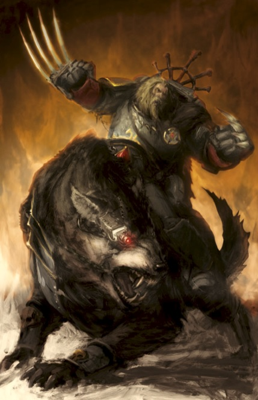
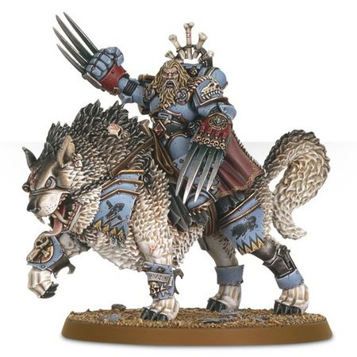

# 0655 卡尼斯·狼裔 Canis Wolfborn

精校状态：中文行文已逐段精校，部分术语仍为暂定

分类：人类帝国 / 太空野狼

原文来源：https://www.bilibili.com/opus/1114935456652328981

原作者：帝国神选罐头

原文时间：2025年09月21日 12:39

[返回分类目录](目录.md) · [全书目录](../../目录.md)

<!-- A0655-B0001 -->
**英文原文**

Canis Wolfborn (also known as Growlthroat, The Feral Knight, and Fangrider) is a Wolf Guard in Harald Deathwolf's Great Company and the Wolf Lord's champion.

<!-- /A0655-B0001 -->

<!-- A0655-B0002 -->

原译文

卡尼斯·狼裔（又名巨喉、野蛮之王和尖牙骑手）是哈拉尔德·死狼大连的一名野狼守卫，也是狼主的冠军。

**校订译文**

卡尼斯·狼裔又称“咆哮之喉”“野性骑士”及“尖牙骑手”，是哈拉尔德·死狼大连的野狼守卫，也是狼主的冠军战士。

**校注：** The Feral Knight 为骑士，原野蛮之王误为 King；Growlthroat 的 growl 指咆哮，原巨喉丢失该义。

<!-- /A0655-B0002 -->

<!-- A0655-B0003 图片 -->

<!-- A0655-B0004 -->

原译文

Canis Wolfborn 卡尼斯·狼裔

**校订译文**

Canis Wolfborn 卡尼斯·狼裔

<!-- /A0655-B0004 -->

<!-- A0655-B0005 -->
**英文原文**

Canis is a loner, more at home amongst wolves than men. His steel and courage are beyond question, and all wolves instinctively obey his commands. He is well-known for his terrible battle frenzy, and rides the monstrous Thunderwolf Fangir into battle, with his old pack mates following in his wake.

<!-- /A0655-B0005 -->

<!-- A0655-B0006 -->

原译文

卡尼斯是一个孤独的人，在狼群中比在人类中更自在。他的钢铁和勇气是毋庸置疑的，所有的狼都本能地服从他的命令。他以可怕的战斗狂热而闻名，他骑着可怕的雷狼方吉尔投入战斗，他的老队友紧随其后。

**校订译文**

卡尼斯独来独往，与狼相处比与人相处更自在。他的坚毅与勇气毋庸置疑，群狼也都本能地服从他。他以可怕的战斗狂怒闻名，常骑着巨型雷狼方吉尔出战，昔日的狼群伙伴紧随其后。

**校注：** steel 此处指坚毅，不是携带的钢铁；old pack mates 结合前史指原狼群伙伴，非先前所属星际战士小队。

<!-- /A0655-B0006 -->

<!-- A0655-B0007 -->
## History 历史

<!-- /A0655-B0007 -->

<!-- A0655-B0008 -->
**英文原文**

Much of Canis's origins is unknown. However, the Wolf Priests have theorised that Canis was lost in a snowstorm as an infant, abandoned after his nomadic tribe was killed, and raised as a whelp by a brooding she-wolf in whose lair Canis sought shelter.

<!-- /A0655-B0008 -->

<!-- A0655-B0009 -->

原译文

卡尼斯的大部分起源都是未知的。然而，狼牧师们推测，卡尼斯在婴儿时期就在暴风雪中迷路了，在他的游牧部落被杀后被遗弃，并由一只忧思的母狼抚养长大，卡尼斯就在母狼的巢穴中寻求庇护。

**校订译文**

卡尼斯的身世大多不为人知。狼牧师推测，他所属的游牧部落遇难后，年幼的他被遗弃，在暴风雪中迷失，最终躲进一只正在育幼的母狼巢穴，被当作狼崽抚养长大。

**校注：** brooding 在母狼育幼语境下非忧思。源文对婴儿自行寻庇护的细节未解释，不额外补年龄。

<!-- /A0655-B0009 -->

<!-- A0655-B0010 -->
**英文原文**

Canis was first encountered by the initiate Jorek the Giant during his Lone Hunt. Jorek had tracked a pack of Fenrisian wolves to a fissure in the Bladed Mountains and was about to pounce upon what he believed to be the alpha male of the pack when Canis (who had been tracking his footprints) slammed into him and pitched him over the edge of the cave roof into the circle of wolves below. Canis then beat Jorek unconscious and dragged him by the heels across the wasteland and back to the gate of the Fang, with an entire family of gigantic Fenrisian wolves in tow. Canis and his pack gave up such a great howling that Wolf Lord Harald Deathwolf came to investigate, seeing that a mere man had bested a Space Marine. After several abortive attempts to communicate, Harald growled a challenge to Canis, and bested him in the resultant duel, although it was far more close-fought than Harald had expected. Canis begrudgingly bared his throat to Harald but instead of killing the young Canis, Harald instead inducted him into the Space Marines and his Great Company. Enhancing his already superhuman skill for battle.

<!-- /A0655-B0010 -->

<!-- A0655-B0011 -->

原译文

巨人乔雷克在独自狩猎时第一次遇到了卡尼斯。乔雷克追踪了一群芬里斯狼到剑刃山脉的一条裂隙，正要扑向他认为是狼群中的雄性之首，这时卡尼斯（一直在追踪他的足迹）猛烈地撞上了他，把他扔向洞穴顶部的边缘，扔进了下面的狼巢。然后，卡尼斯把乔雷克打得昏迷不醒，用脚后跟拖着他穿过荒地，回到长牙堡门口，身后带着一整家巨大的芬里斯狼。卡尼斯和他的狼群发出了如此巨大的嚎叫声，以至于狼主哈拉尔德·死狼前来调查，发现只有一个人击败了一名星际战士。在几次失败的沟通尝试后，哈拉尔德咆哮着向卡尼斯发起挑战，并在随后的决斗中击败了他，尽管这场决斗比哈拉尔德预想的要激烈得多。卡尼斯不情愿地向哈拉尔德展示了自己的喉咙，但哈拉尔德没有杀死年轻的卡尼斯，而是让他加入了星际战士和他的大连。增强他已经超人的战斗技能。

**校订译文**

最先遇到卡尼斯的是正在进行独猎试炼的新兵“巨人”乔雷克。乔雷克追踪一群芬里斯狼来到剑刃山脉的裂隙，正要扑向他认定的头狼，卡尼斯却循着他的足迹赶到，猛然将他撞下洞顶，跌入下方狼群的包围圈。卡尼斯将乔雷克打昏，抓住他的脚踝，一路拖过荒原，带到长牙堡门前，身后跟着整个巨型芬里斯狼家族。他与狼群的长嚎引来哈拉尔德·死狼；狼主发现，一名凡人竟击败了星际战士。几次沟通失败后，哈拉尔德低吼挑战，最终在远比预想激烈的决斗中取胜。卡尼斯不情愿地露出喉咙臣服。狼主却没有杀他，而是让他接受星际战士改造、加入自己的大连，使他原已超乎常人的战斗天赋更上一层楼。

**校注：** by the heels 指抓着对方脚部拖行，不是用自己的脚后跟拖；654 记追踪而来，此篇进一步记载拖来乔雷克，分别保留各文详略。

<!-- /A0655-B0011 -->

<!-- A0655-B0012 -->
**英文原文**

Riding atop the monstrous bulk of the Thunderwolf, Fangir, Canis is a whirlwind of feral rage, a frenzied killing machine capable of hacking apart entire squads of the enemy in a welter of blood and gore. Though his brothers within the Wolf Guard of Harald Deathwolf gently mock their pack brother Canis and his unusual heritage, their humour conceals a heartfelt respect. Canis has courage and strength beyond measure and despite his feral nature (or perhaps because of it) all are honoured to call him Battle-Brother.

<!-- /A0655-B0012 -->

<!-- A0655-B0013 -->

原译文

卡尼斯骑在雷狼方吉尔的巨大身躯上，是一股狂暴的旋风，一台疯狂的杀戮机械，能够在鲜血和凝血中摧毁整个敌人小队。尽管他在哈拉尔德·死狼的野狼守卫中的兄弟们温和地嘲笑他们的狼群兄弟卡尼斯和他不同寻常的特色，但他们的幽默中隐藏着发自内心的尊重。卡尼斯拥有无与伦比的勇气和力量，尽管他生性野蛮（或者可能正因为如此），但所有人都很荣幸称他为战斗兄弟。

**校订译文**

骑在巨大雷狼方吉尔背上的卡尼斯，宛如狂怒旋风，是一台足以将整队敌人撕成血肉的杀戮机器。哈拉尔德麾下的野狼守卫偶尔会善意取笑他的特殊出身，但玩笑背后满是真诚的敬意。他的勇气与力量无可估量；尽管他野性难驯——或许正因如此——众人都以能称他为战斗兄弟为荣。

<!-- /A0655-B0013 -->

<!-- A0655-B0014 -->
**英文原文**

During the Siege of the Fenris System Canis defended Morkai's Keep on the planet Frostheim from the Daemonic invasion. He came close to death, losing a personal fight with Korvak Bladelord, Herald of Khorne, but was saved at the last moment by his Thunderwolf, Fangir and the arrival of Harald Deathwolf and his warriors.

<!-- /A0655-B0014 -->

<!-- A0655-B0015 -->

原译文

在芬里斯星系围攻期间，卡尼斯保卫了莫凯守护在弗罗斯海姆行星上的要塞，使其免受恶魔的入侵。他濒临死亡，在与恐虐先驱科罗瓦克·刃主的私人战斗中失利，但在最后一刻被他的雷狼方吉尔和哈拉尔德·死狼及其战士的到来所救。

**校订译文**

芬里斯星系围城期间，卡尼斯守卫弗罗斯特海姆上的莫凯要塞，抵御恶魔入侵。他在与恐虐先驱科罗瓦克·刃主的单挑中落败，几近丧命；雷狼方吉尔与及时赶到的哈拉尔德及其战士，才在最后关头将他救下。

<!-- /A0655-B0015 -->

<!-- A0655-B0016 图片 -->

<!-- A0655-B0017 -->

原译文

Canis Wolfborn, mounted on Fangir 卡尼斯·狼裔骑在方吉尔上

**校订译文**

Canis Wolfborn, mounted on Fangir 卡尼斯·狼裔骑在方吉尔上

<!-- /A0655-B0017 -->

<!-- A0655-B0018 -->
## Wargear 武器装备

原题：Wargear 战备

<!-- /A0655-B0018 -->

<!-- A0655-B0019 -->
**英文原文**

Canis is armed with a pair of Lightning Claws. He rides the Thunderwolf Fangir into battle, who is as strong as a mastodon and as tall at the shoulder as an Ice Troll. Canis prefer Fangir's company to that of his fellow Astartes, so close is their pack-bond, and their combined aptitude for destructive rampage in close quarters is legendary amongst the Space Wolves.

<!-- /A0655-B0019 -->

<!-- A0655-B0020 -->

原译文

卡尼斯手持一对闪电爪。他骑着雷狼方吉尔投入战斗，它像乳齿象一样强壮，肩膀像冰巨魔一样高。卡尼斯更喜欢方吉尔的陪伴，而不是他的阿斯塔特战友，他们的团队关系如此紧密，他们在近距离内进行破坏性横冲直撞的能力在太空野狼中是传奇。

**校订译文**

卡尼斯手持一对闪电爪，骑乘雷狼方吉尔出战。方吉尔壮如乳齿象，肩高堪比冰巨魔。卡尼斯与它情谊深厚，甚至比起阿斯塔特兄弟，更愿与它相伴。两者在近战中联手肆虐的本领，在太空野狼中早已成为传奇。

<!-- /A0655-B0020 -->

本篇核心术语与暂定项

以下列出本篇出现的英文原形及核心术语表用词。同形词可能指不同对象，具体词义以本篇正文和校注为准；单复数、别名和仅见于图注的名称可能尚未列入。完整候选见[术语表](../../术语表/双语术语候选.csv)。

| 英文 | 采用中文 | 状态 |
| --- | --- | --- |
| Space Marines | 星际战士 | 官方已核对 |
| Space Wolves | 太空野狼 | 官方已核对 |
| Khorne | 恐虐 | 官方已核对 |
| Fenris | 芬里斯 | 暂定·官方待核 |
| Whirlwind | 旋风战车 | 官方已核对 |
| Champion | 冠军 | 暂定·官方待核 |
| Herald | 传令官 | 暂定·官方待核 |
| Space Marine | 星际战士 | 暂定·官方待核 |
| Brother | 修士 | 暂定·官方待核 |
| Battle-Brother | 战斗兄弟 | 暂定·官方待核 |
| Harald Deathwolf | 哈拉尔德·死狼 | 暂定·官方待核 |
| Canis Wolfborn | 卡尼斯·狼裔 | 暂定·官方待核 |
| Initiate | 正式成员 | 暂定·官方待核 |
| Fenrisian Wolves | 芬里斯狼 | 官方已核对 |
| Tribe | 部落（欧克组织） | 暂定·官方待核 |
| Wolf Guard | 野狼守卫 | 官方词根参考·通称待核 |
| Fangir | 方吉尔 | 暂定·官方待核 |
| Jorek the Giant | 巨人乔雷克 | 暂定·官方待核 |
| Growlthroat | 咆哮之喉 | 暂定·官方待核 |
| The Feral Knight | 野性骑士 | 暂定·官方待核 |
| Fangrider | 尖牙骑手 | 暂定·官方待核 |
| Lone Hunt | 独猎试炼 | 暂定·官方待核 |
| Korvak Bladelord | 科罗瓦克·刃主 | 暂定·官方待核 |
| Frostheim | 弗罗斯特海姆 | 暂定·官方待核 |
| System | 星系（恒星系统） | 暂定·官方待核 |
| Jorek | 乔瑞克号 | 暂定·官方待核 |

