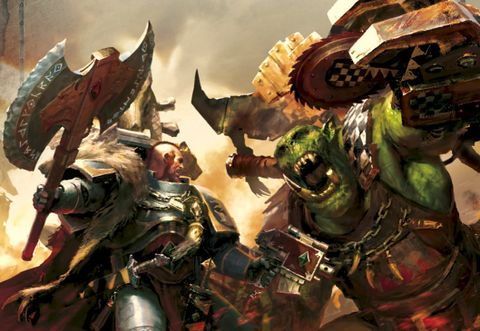
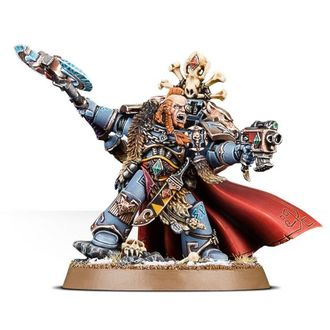

# 0656 克罗姆·龙瞪 Krom Dragongaze

精校状态：中文行文已逐段精校，部分术语仍为暂定

分类：人类帝国 / 太空野狼

原文来源：https://www.bilibili.com/opus/1114922485866823685

原作者：帝国神选罐头

原文时间：2025年09月21日 11:48

[返回分类目录](目录.md) · [全书目录](../../目录.md)

<!-- A0656-B0001 -->
**英文原文**

Krom Dragongaze is a Wolf Lord of the Space Wolves.

<!-- /A0656-B0001 -->

<!-- A0656-B0002 -->

原译文

克罗姆·龙瞪是太空野狼的狼主。

**校订译文**

克罗姆·龙瞪是太空野狼的狼主。

<!-- /A0656-B0002 -->

<!-- A0656-B0003 图片 -->

<!-- A0656-B0004 -->

原译文

Krom Dragongaze fights an Ork 克罗姆·龙瞪与一个兽人战斗

**校订译文**

Krom Dragongaze fights an Ork 克罗姆·龙瞪与一个兽人战斗

<!-- /A0656-B0004 -->

<!-- A0656-B0005 -->
## History 历史

<!-- /A0656-B0005 -->

<!-- A0656-B0006 -->
**英文原文**

Also known as "fierce-eye", he leads the Drakeslayers Great Company and has a presence and sheer force of will capable of terrifying lesser opponents. He does not suffer fools and is known to rip the throats out of those who challenge his decisions. Highly competitive, Krom loves taking part in contests against his fellow Wolf Lords. In battle he employs many Wolf Guards, for the Fierce-eye believes that valor should be rewarded wherever it is to be found. One of twelve legendary warriors who lead that unorthodox Chapter's Great Companies into battle. Notoriously violent and possessed of a short temper, Krom has been known to let his anger govern his reason. Thankfully for Krom, his skill in personal combat and the glory he has accrued from his service to the Chapter more than makes up for any doubts the Great Wolf Logan Grimnar might have over "Fierce-eye".

<!-- /A0656-B0006 -->

<!-- A0656-B0007 -->

原译文

他也被称为“凶眼”，领导着屠龙者大连，拥有强大的存在感和意志力，能够恐吓较小的对手。他不会容忍傻瓜，而且众所周知，他会把那些决定挑战他的人掐死。克罗姆竞争激烈，喜欢参加与狼主对抗的比赛。在战斗中，他使用了许多野狼守卫，因为凶眼认为，无论在哪里，英勇都应该得到回报。十二位传奇战士之一，带领不正规战团的大连投入战斗。众所周知，克罗姆以暴力和脾气暴躁著称，他总是让愤怒支配自己的理智。值得庆幸的是，克罗姆在个人战斗中的技能以及他为战团服役所获得的荣耀，足以弥补头狼罗根·格里姆纳尔对凶眼的任何怀疑。

**校订译文**

克罗姆又称“凶眼”，统领屠龙者大连，是这个不遵循常规编制的战团中率大连出征的十二位传奇狼主之一。他的威势与意志足以震慑弱小对手。他不容愚蠢之辈，据说甚至会撕开质疑其决定者的喉咙。克罗姆争强好胜，热衷与其他狼主较量。他麾下拥有众多野狼守卫，因为他相信，一切勇武都应得到嘉奖。他也以暴烈易怒著称，常让怒火压过理智。所幸，精湛的个人武艺与为战团赢得的荣耀，足以抵消头狼洛根·格里姆纳尔对他的疑虑。

**校注：** lesser 为实力较弱，非身体尺寸较小；challenge his decisions 是质疑决策，非所有与他比试者。rip throats out 为撕裂喉咙，非掐死。

<!-- /A0656-B0007 -->

<!-- A0656-B0008 -->
**英文原文**

Clutching the rune-carved Frost Axe Wyrmclaw, and an ornate Bolt Pistol, Krom Dragongaze is a lord among men. Upon his back he wears a wolf-skull totem and his cloak is trimmed with furs. Krom's fearsome visage is one of notorious rage: his lips drawn back in a howl, wolf fangs bared, he is further accentuated by his windswept cloak and outstretched arm clutching Wyrmclaw, perfectly capturing the Wolf Lord's ferocious might and his occasionally wild, unpredictable savagery. Krom's sigil is that of the Sun Wolf, who makes the belly of the sun his lair, and attacks Fenris anew with every dawn.

<!-- /A0656-B0008 -->

<!-- A0656-B0009 -->

原译文

克罗姆·龙瞪手握刻有符文的霜斧龙爪和华丽的爆矢手枪，是人间之主。他背上戴着狼头骨图腾，斗篷上装饰着毛皮。克罗姆可怕的面容是一种著名的愤怒：他的嘴唇在嚎叫中缩回，露出狼牙，他被风吹得突出的斗篷和伸出的手臂紧紧抓住龙爪，完美地捕捉到了狼主的凶猛力量和他偶尔狂野、不可预测的野蛮行径。克罗姆的标志是日狼徽章，它以太阳之腹作为巢穴，每个黎明都会重新攻击芬里斯。

**校订译文**

克罗姆手持刻满符文的霜斧“龙爪”与华丽的爆矢手枪，尽显统帅威仪。他背负狼颅图腾，披着镶毛皮的斗篷。其形象充满暴怒：双唇翻起，露出獠牙长嚎，斗篷迎风翻飞，伸出的手臂紧握龙爪，展现狼主的凶悍力量与难以预测的野性。克罗姆的徽记是日狼；神话中的日狼以太阳腹中为巢，每逢黎明便再次向芬里斯发动攻击。

<!-- /A0656-B0009 -->

<!-- A0656-B0010 图片 -->

<!-- A0656-B0011 -->

原译文

The Badge of the Sunwolf 日狼徽章

**校订译文**

The Badge of the Sunwolf 日狼徽章

<!-- /A0656-B0011 -->

<!-- A0656-B0012 -->
**英文原文**

Krom Dragongaze's saga is long and blood-drenched, featuring heroic victories and epic duel in great number. However, though his string of victories is beyond question, there are many who mutter darkly of his methods. Krom's temper is little short of volcanic — his nickname of "Fierce-eye" stemming from the furious intensity of his rage-filled stare — and he will suffer no impediment to his perpetual hunt for glory. Krom is also partially blinded in one eye, a result of being wagered by Lukas the Trickster into engaging in a staring contest with Fenris' sun. However when the sun set, he declared his victory in the challenge.

<!-- /A0656-B0012 -->

<!-- A0656-B0013 -->

原译文

克罗姆·龙瞪的传奇故事漫长而血腥，以大量的英雄胜利和史诗般的决斗为特色。然而，尽管他的一连串胜利是毋庸置疑的，但也有许多人对他的方法嗤之以鼻。克罗姆的脾气几乎像火山一样 — 他的绰号“凶眼”源于他愤怒的眼神 — 他永远追求荣耀，不会受到任何阻碍。克罗姆的一只眼睛也部分失明，这是因为骗子卢卡斯打赌要用芬里斯的太阳进行一场凝视比赛。然而，当太阳落山时，他宣布自己在挑战中获胜。

**校订译文**

克罗姆的传奇漫长而染血，充满英勇胜利与惊人的决斗。尽管战绩不容否认，仍有许多人暗自非议他的手段。他的怒气近乎火山爆发，“凶眼”之名便来自那饱含烈怒的逼人目光；他不容任何人妨碍自己追求荣耀。克罗姆一只眼睛部分失明，原因是骗子卢卡斯诱他打赌，与芬里斯的太阳比谁先移开视线。等到日落，克罗姆却宣布自己赢了。

<!-- /A0656-B0013 -->

<!-- A0656-B0014 -->
**英文原文**

For every moment of shining heroism in Krom's past, there is an instance of bloody-mindedness or needless barbarism that overshadows it, and the Wolf Lord has been in and out of Logan Grimnar's good graces time and again. Krom is belligerent and competitive to a fault, with little humour or humility to leaven his hard-eyed aggression, and he and his fellow Wolf Lords have butted heads on many occasions. Yet for all this, Krom Dragongaze is a deadly weapon in the Great Wolf's arsenal, for his uncompromising ferocity is as dangerous to the foe as it is wearing to his allies.

<!-- /A0656-B0014 -->

<!-- A0656-B0015 -->

原译文

在克罗姆过去的每一刻闪耀的英雄主义中，都有一个血腥的思想或不必要的野蛮的例子掩盖了它，而狼主一次又一次地受到罗根·格里姆纳尔的青睐。克罗姆好斗，竞争激烈，几乎没有幽默或谦逊来缓和他冷酷的侵略性，他和他的狼主战友在很多场合都发生过冲突。然而，尽管如此，克罗姆·龙瞪仍是头狼军械库中的致命武器，因为他毫不妥协的凶猛对敌人来说就像对盟友一样危险。

**校订译文**

克罗姆每有一项耀眼的英雄壮举，似乎就伴着一次固执蛮干或无谓残暴，使荣耀蒙尘。因此，他一再获得洛根的赏识，又一再失宠。他好斗争胜到了过分的地步，缺乏足够幽默与谦逊来缓和凶悍性情，常与其他狼主发生冲突。即便如此，他仍是头狼手中致命的武器：那股毫不退让的凶猛，会让盟友疲于应付，也会让敌人面临致命威胁。

**校注：** in and out of good graces 为受赏识与失宠交替，原只说受到青睐漏掉一半；wearing 指令盟友疲惫，不是同样危及盟友性命。

<!-- /A0656-B0015 -->

<!-- A0656-B0016 -->
### Other Engagements 其他交战

<!-- /A0656-B0016 -->

<!-- A0656-B0017 -->
**英文原文**

It is known that Krom and his Wolf Guard fought with the Orks on Alaric Prime, where they suffered a painful defeat. He also is known to have saved a Knight from House Hawkshroud, causing the Knight House to become oathsworn to the Space Wolves.

<!-- /A0656-B0017 -->

<!-- A0656-B0018 -->

原译文

众所周知，克罗姆和他的野狼守卫在阿拉里克主星与欧克作战，在那里他们遭受了痛苦的失败。众所周知，他还从覆鹰家族手中救出了一名骑士，导致骑士家族对太空狼宣誓。

**校订译文**

克罗姆与野狼守卫曾在阿拉里克主星对抗欧克，遭受惨败。他也曾救下一名覆隼家族的骑士，使该家族向太空野狼立誓效忠。

**校注：** a Knight from House Hawkshroud 是来自覆隼家族的骑士，非从该家族手中救出他；修正施受关系。

<!-- /A0656-B0018 -->

<!-- A0656-B0019 图片 -->

<!-- A0656-B0020 -->

原译文

Krom Dragongaze 克罗姆·龙瞪

**校订译文**

Krom Dragongaze 克罗姆·龙瞪

<!-- /A0656-B0020 -->

<!-- A0656-B0021 -->
**英文原文**

During the Hunt for the Wulfen Krom remained on Fenris to watch over the Fang in his brothers absence. Then after begining of the Siege of the Fenris System he joined battle on Valdrmani where with the Grey Knights and Stern himself, Krom and his warriors fought off the Daemon infestation. Krom returned to Fenris and when the battle started there, defended the Fang against enemy within. Upon the formation of the Great Rift Krom Dragongaze was the first Wolf Lord to encounter the new Primaris Space Marines and enthusiastically embraced them, as opposed to the more cautious and distrustful Logan Grimnar.

<!-- /A0656-B0021 -->

<!-- A0656-B0022 -->

原译文

在狼人狩猎期间，克罗姆留在芬里斯，在兄弟们不在的时候照看长牙堡。然后，在芬里斯星系围城开始后，他加入了瓦尔德马尼的战斗，在那里，克罗姆和他的战士们与灰骑士和斯特恩本人一起击退了恶魔的侵扰。克罗姆回到芬里斯，当战斗开始时，他保护长牙堡免受内部敌人的攻击。大裂隙形成后，克罗姆·龙瞪是第一位遇到新的原铸星际战士的狼主，并热情地拥抱了他们，而不是更谨慎和不信任的罗根·格里姆纳尔。

**校订译文**

狼人狩猎期间，其他狼主外出，克罗姆留守芬里斯的长牙堡。芬里斯星系围城开始后，他前往瓦尔德马尼，与斯特恩及灰骑士一起清除恶魔。随后他返回芬里斯，在母星战事爆发时抵御侵入长牙堡的敌人。大裂隙形成后，克罗姆成为首位接触原铸星际战士的狼主，热情接纳他们；洛根·格里姆纳尔则更为谨慎，怀有戒心。

<!-- /A0656-B0022 -->

<!-- A0656-B0023 -->
**英文原文**

During the War of Beasts, Krom's Company was deployed to Vigilus after its invasion by various hostile forces. He led a Space Wolves fleet assault on the Ork Cruiser Worldsmasha, succeeding in sending the construct plummeting into Ork settlements on the planet below. He considered it a fitting spectacle to herald his arrival, but found himself in a tense relationship with Marneus Calgar and his war council. Before total conflict between these two leaders could erupt, Krom heard of a renewed Ork assault on the temple districts of Hyperia and left to deal with the threat.

<!-- /A0656-B0023 -->

<!-- A0656-B0024 -->

原译文

在野兽战争期间，克罗姆的连队在各个敌对部队入侵后被部署到警戒星。他率领太空野狼舰队对欧克巡洋舰世界粉碎者号发动攻击，成功地将该结构坠入行星上的欧克定居点。他认为这是一个合适的场面来预示他的到来，但发现自己与马涅乌斯·卡尔加和他的战争议会关系紧张。在这两位领导人之间的全面冲突爆发之前，克罗姆听说欧克再次袭击了海珀利亚的神殿地区，并离开去应对威胁。

**校订译文**

野兽之战期间，警戒星遭多方敌军入侵，克罗姆大连奉命驰援。他率太空野狼舰队攻击欧克巡洋舰世界粉碎者号，使其坠入下方行星的欧克聚居地。他认为这场壮观爆炸足以宣告自己的到来，却与马涅乌斯·卡尔加及其战争议会关系紧张。双方领袖尚未彻底翻脸，克罗姆便听说欧克再次攻击海珀利亚的神殿区，随即动身前去迎敌。

**校注：** War of Beasts 按全书定译野兽之战，区别 War of the Beast 野兽战争。

<!-- /A0656-B0024 -->

本篇核心术语与暂定项

以下列出本篇出现的英文原形及核心术语表用词。同形词可能指不同对象，具体词义以本篇正文和校注为准；单复数、别名和仅见于图注的名称可能尚未列入。完整候选见[术语表](../../术语表/双语术语候选.csv)。

| 英文 | 采用中文 | 状态 |
| --- | --- | --- |
| Space Marines | 星际战士 | 官方已核对 |
| Grey Knights | 灰骑士 | 官方已核对 |
| Space Wolves | 太空野狼 | 官方已核对 |
| Orks | 欧克蛮人 | 官方已核对 |
| Bolt Pistol | 爆矢手枪 | 官方已核对 |
| Great Rift | 大裂隙 | 官方已核对 |
| War of Beasts | 野兽之战 | 暂定·官方待核 |
| Perpetual | 永生者 | 暂定·官方待核 |
| Fenris | 芬里斯 | 暂定·官方待核 |
| Alaric Prime | 阿拉里克主星 | 暂定·官方待核 |
| Vigilus | 警戒星 | 暂定·官方待核 |
| House Hawkshroud | 覆隼家族 | 暂定·官方待核 |
| Herald | 传令官 | 暂定·官方待核 |
| Chapter | 战团 | 暂定·官方待核 |
| Marneus Calgar | 马涅乌斯·卡尔加 | 暂定·官方待核 |
| Logan Grimnar | 洛根·格里姆纳尔 | 官方已核 |
| Krom Dragongaze | 克罗姆·龙瞪 | 暂定·官方待核 |
| Lukas the Trickster | 骗子卢卡斯 | 暂定·官方待核 |
| Wulfen | 狼人 | 官方已核对 |
| Wolf Guard | 野狼守卫 | 官方词根参考·通称待核 |
| Alaric | 阿拉里克 | 暂定·官方待核 |
| Drakeslayers | 屠龙者 | 暂定·官方待核 |
| Fierce-eye | 凶眼 | 暂定·官方待核 |
| Wyrmclaw | 龙爪 | 暂定·官方待核 |
| Worldsmasha | 世界粉碎者号 | 暂定·官方待核 |
| Ferocity | 凶猛 | 暂定·官方待核 |
| System | 星系（恒星系统） | 暂定·官方待核 |
| Knight House | 骑士家族 | 暂定·官方待核 |
| War Council | 战争议会 | 暂定·官方待核 |
| Valdrmani | 瓦尔德曼尼 | 暂定·官方待核 |
| Bolt | 爆矢 | 暂定·官方待核 |
| Epic | 史诗 | 暂定·官方待核 |
| Hyperia | 海珀利亚 | 暂定·官方待核 |

