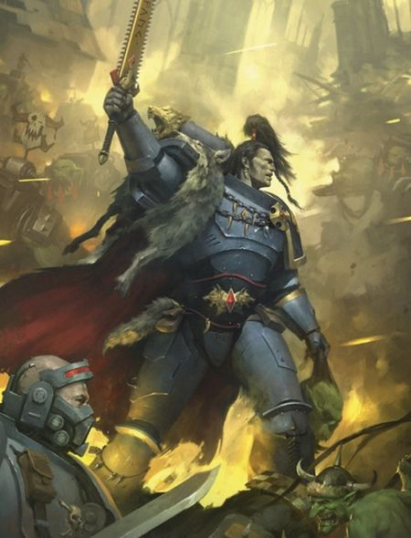
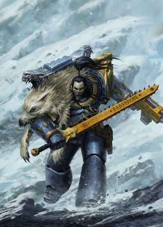
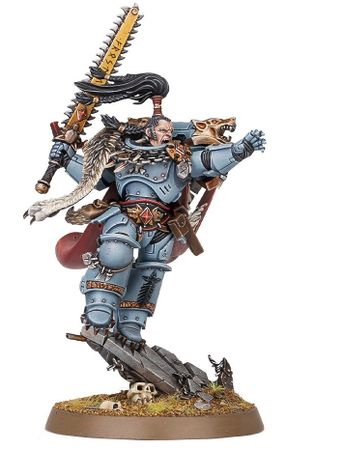
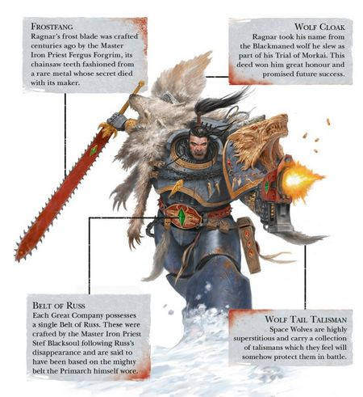

# 0657 拉格纳·黑鬃 Ragnar Blackmane

精校状态：中文行文已逐段精校，部分术语仍为暂定

分类：人类帝国 / 太空野狼

原文来源：https://www.bilibili.com/opus/1114911937442873367

原作者：帝国神选罐头

原文时间：2025年09月21日 11:07

[返回分类目录](目录.md) · [全书目录](../../目录.md)

<!-- A0657-B0001 -->
**英文原文**

"We may be few, and our enemies many. Yet so long as there remains one of us still fighting, one who still rages in the name of justice and truth, then by the Allfather, the galaxy shall yet know hope."

<!-- /A0657-B0001 -->

<!-- A0657-B0002 -->

原译文

“我们可能很少，我们的敌人很多。然而，只要我们中还有一个人还在战斗，一个仍然以正义和真理之名愤怒的人，那么全父保佑，银河系就会知晓希望。”

**校订译文**

“我寡敌众，或许如此。但只要我们还有一人仍在战斗，仍为正义与真理奋起抗争——我以全父之名起誓，银河就仍有希望。”

<!-- /A0657-B0002 -->

<!-- A0657-B0003 -->
**英文原文**

Ragnar Blackmane, also known as the Black Wolf, is the youngest Wolf Lord in the history of the Space Wolves, commanding the Blackmanes Great Company.

<!-- /A0657-B0003 -->

<!-- A0657-B0004 -->

原译文

拉格纳·黑鬃，也被称为黑狼，是太空野狼历史上最年轻的狼主，指挥着黑鬃大连。

**校订译文**

拉格纳·黑鬃，也被称为黑狼，是太空野狼历史上最年轻的狼主，指挥着黑鬃大连。

<!-- /A0657-B0004 -->

<!-- A0657-B0005 图片 -->

<!-- A0657-B0006 -->

原译文

Ragnar Blackmane as a Primaris Space Marine 作为原铸星际战士的拉格纳·黑鬃

**校订译文**

Ragnar Blackmane as a Primaris Space Marine 作为原铸星际战士的拉格纳·黑鬃

<!-- /A0657-B0006 -->

<!-- A0657-B0007 -->
## History 历史

<!-- /A0657-B0007 -->

<!-- A0657-B0008 -->
### Origins 起源

<!-- /A0657-B0008 -->

<!-- A0657-B0009 -->
**英文原文**

Ragnar was born Ragnar Thunderfist on Fenris, a barbarian of the Thunderfists tribe. When he was still a teenager, his village was attacked by a rival tribe, the Grimskulls, who slaughtered his family and most of his tribe. Despite his youth, Ragnar showed extraordinary fighting talent, using berserker-like rage to slay many of the invaders. He finally fell in combat with the Grimskull youth who had killed his father, Strybjorn, though Ragnar dealt him a mortal wound in kind. Because of their equal ferocity and fighting skill, both youths were selected by the Wolf Priest Ranek to join the ranks of the Space Marines, and their lives were saved by the medicine of the Astartes.

<!-- /A0657-B0009 -->

<!-- A0657-B0010 -->

原译文

拉格纳出生于芬里斯的拉格纳·雷拳，是雷拳部落的野蛮人。当他还是个十几岁的孩子时，他的村庄遭到了敌对部落冷颅的袭击，他们屠杀了他的家人和部落的大部分人。尽管年轻，拉格纳表现出非凡的战斗天赋，用狂暴的愤怒杀死了许多入侵者。他最终与杀害了他父亲的冷颅青年斯特里比约恩作战，尽管拉格纳也给他造成了致命的伤害。由于他们同样的凶猛和战斗技能，这两名年轻人被狼牧师拉内克选中加入星际战士，他们的生命被阿斯塔特的药物挽救了。

**校订译文**

拉格纳出生于芬里斯的雷拳部落，原名拉格纳·雷拳。十几岁时，敌对的冷颅部落袭击村庄，杀死他的家人和大部分族人。拉格纳虽年少，却展现惊人的战斗天赋，在狂怒中杀死许多入侵者。最终，他倒在杀父仇人——冷颅青年斯特里比约恩——手中，也给对方留下致命伤。两名少年同样凶悍、武艺不凡，狼牧师拉内克因此同时选中他们，救治其伤势，准备让他们加入星际战士。

**校注：** Strybjorn 是杀父仇人的名字，非父亲之名；原文逗号位置略含混，依据后续共同受训情节消歧。

<!-- /A0657-B0010 -->

<!-- A0657-B0011 -->
**英文原文**

Ragnar was sent to one of the training camps on Fenris, and was eventually sent through the Gates of Morkai, in which he was subjected to psychic interrogation, searching for any hint of taint. His hatred for Strybjorn, against whom he had sworn revenge, was almost his undoing, but he did not give in to the wolf spirit and was allowed to drink from the Cup of Wulfen. At the end of his initiation rite he returned to the Chapter's fortress of The Fang bearing the pelt of a blackmaned Fenrisian wolf, a notoriously vicious breed.

<!-- /A0657-B0011 -->

<!-- A0657-B0012 -->

原译文

拉格纳被送往芬里斯的一个训练营，最终被送往莫凯之门，在那里他接受了灵能审讯，寻找任何污点的迹象。他对斯特里比约恩的仇恨，他发誓要报复的人，几乎毁了他，但他并没有屈服于狼魂，而是被允许喝狼人之杯。在他的入会仪式结束时，他带着一只黑鬃芬里斯狼的皮毛回到了战团的长牙要塞，这是一种著名的凶猛品种。

**校订译文**

拉格纳被送往芬里斯训练营，随后接受莫凯之门试炼，通过灵能审讯检查有无污染。他曾立誓向斯特里比约恩复仇，这股仇恨险些毁掉自己；但他没有屈服于狼魂，得以饮下狼人之杯中的液体。入伍试炼结束时，他带着一头黑鬃芬里斯狼的毛皮返回长牙堡。这种狼以凶暴著称。

<!-- /A0657-B0012 -->

<!-- A0657-B0013 -->
### Early Exploits 早期战功

<!-- /A0657-B0013 -->

<!-- A0657-B0014 -->
**英文原文**

While still in training at the Fang, Ragnar's Blood Claw pack stumbled onto a secret base beneath one of Fenris's mountains being used by the Thousand Sons Chaos Space Marines. Ragnar and Strybjorn confronted the Sorcerer Madox, and together managed to banish him back to the Warp. Ragnar also fought in Magdelon Incursion in 712.M41

<!-- /A0657-B0014 -->

<!-- A0657-B0015 -->

原译文

还在长牙堡训练时，拉格纳的血爪小队偶然发现了芬里斯山脉下的一个秘密基地，该基地正被千子混沌星际战士使用。拉格纳和斯特里比约恩与巫师马多克斯对峙，并共同设法将他驱逐回亚空间。拉格纳还参加了712.M41的马格德隆入侵

**校订译文**

仍在长牙堡受训时，拉格纳的血爪小队偶然发现一处藏于芬里斯山下、由千子混沌星际战士使用的秘密基地。他与斯特里比约恩联手对抗巫师马多克斯，将其放逐回亚空间。他也参加了 712.M41 的马格德隆入侵战。

<!-- /A0657-B0015 -->

<!-- A0657-B0016 -->
### First Mission 第一次任务

<!-- /A0657-B0016 -->

<!-- A0657-B0017 -->
**英文原文**

Ragnar's Blood Claw pack's first mission off-planet was to assist and escort Inquisitor Sternberg, an old ally of the Great Wolf Logan Grimnar, in tracking down an Eldar talisman which Sternberg believed was crucial to stopping a plague on his home planet. The talisman's pieces were scattered throughout the galaxy, taking Ragnar and his Claws to a world overrun by Orks, where they slew a massive Warboss gifted with psyker powers, and a Space Hulk infested with genestealers. The final journey of their quest took them to Sternberg's home planet, where they confronted the Daemon Botchulaz, who had almost escaped the prison the Eldar had fashioned for him.

<!-- /A0657-B0017 -->

<!-- A0657-B0018 -->

原译文

拉格纳的血爪小队的第一个任务是协助和护送头狼罗根·格里姆纳尔的老盟友审判官斯特恩伯格追踪一个灵族护身符，斯滕伯格认为这对阻止他家乡行星上的瘟疫至关重要。护身符的碎片散落在整个银河系，将拉格纳和他的血爪带到了一个被兽人占领的世界，在那里他们杀死了一个拥有灵能者能力的巨大战争头目，以及一个被基因窃取者侵扰的太空废船。他们的最后一次探索之旅将他们带到了斯特恩伯格的家乡行星，在那里他们遇到了几乎逃离了灵族为他建造的监狱的恶魔博楚拉兹。

**校订译文**

血爪小队首次离开母星执行任务，是护送并协助审判官斯特恩伯格寻找一件灵族护符。斯特恩伯格是头狼洛根的旧盟友，他相信护符是制止母星瘟疫的关键。护符碎片散落银河各处，拉格纳等人为此深入欧克占据的世界，杀死一名具有灵能的巨型战争头目，又登上基因窃取者盘踞的太空废船。最后，他们抵达审判官的母星，迎战几乎已挣脱灵族囚笼的恶魔博楚拉兹。

<!-- /A0657-B0018 -->

<!-- A0657-B0019 图片 -->

<!-- A0657-B0020 -->

原译文

Ragnar Blackmane pre-Primaris 原铸前的拉格纳·黑鬃

**校订译文**

Ragnar Blackmane pre-Primaris 原铸前的拉格纳·黑鬃

<!-- /A0657-B0020 -->

<!-- A0657-B0021 -->
### Uprising on Garm 加姆叛乱

<!-- /A0657-B0021 -->

<!-- A0657-B0022 -->
**英文原文**

Ragnar's actions won him great renown, and he was inducted into the Great Company of Wolf Lord Berek Thunderfist. Soon a great portion of the Chapter was deployed to Garm, where a Chaos-fueled uprising had stolen the Spear of Russ, a sacred relic of the Wolves. During the climactic battle, Ragnar was again confronted by Madox, who was conducting a ritual to raise fallen Thousand Sons again and to summon his master, Magnus the Red, into the Materium. In a desperate action, Ragnar threw the Spear into the opening warp rift, preventing Magnus's return.

<!-- /A0657-B0022 -->

<!-- A0657-B0023 -->

原译文

拉格纳的行动为他赢得了巨大的声誉，他被纳入了狼主贝雷克·雷拳的大连。很快，战团的很大一部分被部署到加姆，在那里，一场由混沌引发的叛乱偷走了野狼的神圣遗物 — 鲁斯之矛。在这场战斗的高潮中，拉格纳再次遭遇马多克斯，马多克斯正在举行一场仪式，再次复活堕落的千子，并召唤他的主人赤红之马格努斯进入物质界。在一次绝望的行动中，拉格纳将长矛扔进了开口的亚空间裂隙，阻止了马格努斯的回归。

**校订译文**

这些战功为拉格纳赢得盛名，他被编入狼主贝雷克·雷拳的大连。不久，战团大批兵力开赴加姆：当地混沌煽动的叛乱中，太空野狼圣物鲁斯之矛遭窃。决战时，拉格纳再次对上马多克斯。巫师正施术复活阵亡千子，并将主人红魔马格努斯召入物质宇宙。危急中，拉格纳把长矛掷进正在开启的亚空间裂隙，阻止了马格努斯归来。

**校注：** fallen Thousand Sons 在复活仪式语境中指阵亡千子，原堕落的千子不能表达被复活的状态。

<!-- /A0657-B0023 -->

<!-- A0657-B0024 -->
### Exile to Terra 流放泰拉

<!-- /A0657-B0024 -->

<!-- A0657-B0025 -->
**英文原文**

While many, including Logan Grimnar, believed it to be the only way to save the chapter from annihilation, Ragnar was despised by many for the seeming loss of the relic to the enemy. As a symbolic punishment, Ragnar was assigned to the Wolfblade on Terra, a bodyguard unit for Lady Gabriela Belisarius, an important scion of an allied Navis Nobilite house. There, he foiled an assassination plot by a rival House, and defeated the Imperial Assassin Xenothan in the process. As a reward, the Navigators gifted him with the ancient Frost Blade that he continued to use for the rest of his life. While accompanying Gabriela on an inspection tour of their holdings on Hyades, Ragnar was caught in the middle of a plot by The Fallen, allied with a resurrected Madox, to foment war between the Dark Angels and the Space Wolves. Ragnar formed a temporary alliance with a rival Dark Angel, Jeremiah Gieyus, that helped defeat the Fallen's commander and encouraged a truce between the two chapters.

<!-- /A0657-B0025 -->

<!-- A0657-B0026 -->

原译文

虽然包括罗根·格里姆纳尔在内的许多人认为这是拯救战团免遭毁灭的唯一途径，但拉格纳因圣物似乎被敌人夺走而受到许多人的鄙视。作为一种象征性的惩罚，拉格纳被分配到泰拉上的狼刃，这是盟友导航者家族的重要继承人加芙列拉·贝利萨留斯夫人的护卫部队。在那里，他挫败了对手家族的暗杀阴谋，并在此过程中击败了帝国刺客赛纳坦。作为奖励，导航者们送给他一把古老的霜刃，他将在余生中继续使用。在陪同加芙列拉参观他们在毕星团的财产时，拉格纳被堕天使卷入了一场阴谋，与复活的马多克斯结盟，煽动黑暗天使和太空野狼之间的战争。拉格纳与对手黑暗天使杰里迈亚·吉尤斯建立了临时联盟，帮助击败了堕天使的指挥官，并促进两个战团之间休战。

**校订译文**

洛根等人相信，掷出长矛是当时避免战团覆灭的唯一办法；但也有许多人鄙夷拉格纳，认为他把圣物丢给了敌人。作为象征性惩罚，他被派往泰拉的狼刃部队，为盟友导航员贵族家族的重要后裔加芙列拉·贝利萨留斯夫人担任护卫。他在那里挫败敌对家族的刺杀阴谋，击败帝国刺客赛纳坦。导航员们以一柄古老霜刃作为酬谢，此后他一直使用它。陪加芙列拉巡视毕星团产业时，拉格纳又卷入堕天使的阴谋：他们与复活的马多克斯联手，企图挑起黑暗天使与太空野狼之间的战争。拉格纳因此与对手阵营的黑暗天使杰里迈亚·吉尤斯暂时结盟，协力击败堕天使指挥官，促成两战团休战。

**校注：** 与马多克斯结盟的是堕天使，而非拉格纳；原句错误挂接容易改变人物阵营。for the rest of his life 为原稿叙事表达，未据此推断拉格纳已死。

<!-- /A0657-B0026 -->

<!-- A0657-B0027 -->
**英文原文**

The Wolfblade had stumbled onto another plot by the Thousand Sons to resurrect Magnus and destroy the Space Wolves entirely, which involved the Spear of Russ. When the Wolfblades were temporarily recalled to Fenris for debriefing, Ragnar swore an oath before Logan Grimnar himself, to recover the Spear or die trying.

<!-- /A0657-B0027 -->

<!-- A0657-B0028 -->

原译文

狼刃偶然发现了千子的另一个阴谋，即恢复马格努斯并彻底摧毁太空野狼，其中涉及鲁斯之矛。当狼刃被临时召回芬里斯进行汇报时，拉格纳在罗根·格里姆纳尔本人面前宣誓，要么收回长矛，要么死亡。

**校订译文**

狼刃随后发现，千子又在谋划召回马格努斯、彻底摧毁太空野狼，而鲁斯之矛也牵涉其中。部队暂被召回芬里斯汇报时，拉格纳当着洛根的面立誓：要么取回长矛，要么为此战死。

<!-- /A0657-B0028 -->

<!-- A0657-B0029 -->
**英文原文**

In the midst of the brutal Chaos attack on the Wolves protected world of Charys, Ragnar led a strike team to the mirror world version of Charys, with the aid of the lost Thirteenth Great Company. There, he confronted Madox yet again, killing him with the Spear, interrupting the ritual, and returning with the Spear to Grimnar.

<!-- /A0657-B0029 -->

<!-- A0657-B0030 -->

原译文

在混沌对野狼保护的查瑞斯世界的残酷攻击中，拉格纳在迷失的第十三大连的帮助下，带领一支突击队前往镜像世界版本的查瑞斯。在那里，他再次与马多克斯对峙，用长矛杀死了他，打断了仪式，然后带着长矛回归格里姆纳尔。

**校订译文**

混沌猛烈攻击太空野狼保护下的查瑞斯时，拉格纳在失踪的第十三大连帮助下，率打击小队进入查瑞斯的镜像世界。他再次迎战马多克斯，用鲁斯之矛将其杀死，打断仪式，最终携圣物返回洛根面前。

<!-- /A0657-B0030 -->

<!-- A0657-B0031 -->
### Trial of the Flesh Tearers 撕肉者的试炼

<!-- /A0657-B0031 -->

<!-- A0657-B0032 -->
**英文原文**

In 960.M41 while aboard the Veregelt, Ragnar in engaged in a ritual honour duel with a Dark Angels Champion, killing him in a fit of rage despite agreeing to first blood prior to the match. This created further animosity between the two chapters, leading to Ragnar agreeing to a second duel to the death with the Dark Angels Sergeant Sorael to settle the matter. However, before the duel could begin, the Imperials were ambushed by Night Lords warships and forced to flee. Afterwards, Ragnar and his squad boarded a derelict Flesh Tearers ship, the Baryonyx, leading to a clash with one of the maddened warriors found in stasis within.

<!-- /A0657-B0032 -->

<!-- A0657-B0033 -->

原译文

960.M41，拉格纳在维勒格特号上与一位黑暗天使冠军进行了一场仪式性的荣誉决斗，尽管他在比赛前先同意了流血，但还是在愤怒中杀死了他。这在两个战团之间造成了进一步的敌意，导致拉格纳同意与黑暗天使军士索瑞尔进行第二次决斗以解决此事。然而，在决斗开始之前，帝国遭到午夜领主战舰和部队的伏击，被迫逃离。之后，拉格纳和他的小队登上了一艘被遗弃的撕肉者舰船重爪龙号，与内部静滞的一名疯狂战士发生了冲突。

**校订译文**

960.M41，拉格纳在维勒格特号上与一名黑暗天使冠军战士进行仪式性的荣誉决斗。双方虽事先约定见血即止，他却在怒火中杀死了对方，两战团因此更加敌视。为解决此事，拉格纳答应与黑暗天使军士索瑞尔再作一场生死决斗。但尚未开战，帝国部队就遭午夜领主舰只伏击，被迫撤离。随后，拉格纳率小队登上一艘废弃的撕肉者战舰重爪龙号，与舰内原处于静滞状态的一名疯狂战士交手。

**校注：** first blood 指一方见血即结束决斗，非单纯同意流血；第二场明确为 to the death，原译遗漏。

<!-- /A0657-B0033 -->

<!-- A0657-B0034 -->
**英文原文**

In the subsequent council with Berek and his Wolf Guard, the fate of the Baryonyx was discussed. Some wished to return the ship to the Flesh Tearers, while others wanted to keep it for themselves. Ultimately Ulrik the Slayer arrived and decided to return it. Ragnar, alongside fellow Wolf Guard Nalfir Razortongue, was assigned to the mission to return the ship to the Flesh Tearers at Cretacia. Upon arriving at the Flesh Tearers homeworld, Ragnar was nearly executed on the spot for being a Space Wolf by the Chaplain Scarath. Instead, they were banished to the harsh wilds of Cretacia in a test of survival and met Sergeant Vorain, who was seeking to mend ties between the two Chapters. Before the trio could be extracted via gunship, a large pteranadon attacked the group. Nalfir was killed slaying the beast, and Ragnar later returned to Fenris with his body alongside Vorain. Vorain then acted as an emissary between the two chapters.

<!-- /A0657-B0034 -->

<!-- A0657-B0035 -->

原译文

在随后与贝雷克和他的野狼守卫举行的会议上，讨论了重爪龙号的命运。一些人想把船还给撕肉者，而另一些人则想把它留给自己。最终，屠戮者乌尔里克到达并决定归还这艘船。拉格纳与野狼守卫战友纳菲尔·剃刀舌一起被指派执行任务，将这艘船归还给科瑞塔西亚的撕肉者。抵达撕肉者的家园世界后，拉格纳因是太空野狼而差点被斯卡拉斯牧师当场处决。相反，为了生存的考验，他们被流放到科瑞塔西亚的严酷荒野，并遇到了沃林军士，他正在寻求修复两个战团之间的联系。在三人被炮艇救出之前，一个巨型翼龙袭击了这群人。纳菲尔在杀死野兽时被杀，拉格纳后来带着他的尸体和沃林一起回到了芬里斯。沃林随后充当了两个战团之间的使者。

**校订译文**

贝雷克与野狼守卫随后商议如何处置重爪龙号。有人主张归还撕肉者，有人想将舰船据为己有。杀戮者乌尔里克到来后，决定归还。拉格纳与野狼守卫纳菲尔·剃刀舌奉命将其送回科瑞塔西亚。抵达撕肉者母星时，斯卡拉斯教士仅因他们是太空野狼，便险些当场处决拉格纳。最终，他们被放逐到险恶荒野，接受生存考验，并遇见希望修复两战团关系的沃林军士。炮艇尚未接走三人，一头巨型翼龙便发动袭击。纳菲尔杀死猛兽，自己也战死。拉格纳随后带着他的遗体，与沃林一同返回芬里斯；沃林由此成为两战团之间的使者。

<!-- /A0657-B0035 -->

<!-- A0657-B0036 -->
### Jarl 首领

<!-- /A0657-B0036 -->

<!-- A0657-B0037 -->
**英文原文**

Ragnar was one of the few, if not the only, Space Wolves to completely bypass the rank of Grey Hunter, being elevated from a Blood Claw straight to the rank of Wolf Guard in Berek Thunderfist's entourage. This incredibly rare feat was achieved after Ragnar single-handedly killed Ork Warlord Borzag Khan and his entire retinue in close combat.

<!-- /A0657-B0037 -->

<!-- A0657-B0038 -->

原译文

拉格纳是为数不多的，如果不是唯一的，完全绕过灰猎军衔的太空野狼之一，在贝雷克·雷拳的随从中，他从血爪直接晋升为野狼守卫。这一令人难以置信的罕见壮举是在拉格纳在近距离战斗中单枪匹马杀死了欧克军阀博尔扎格可汗和他的所有随从之后实现的。

**校订译文**

拉格纳是极少数——甚至可能是唯一——完全跳过灰色猎手阶段的太空野狼。他在近战中独力杀死欧克军阀博尔扎格可汗及全部亲随后，直接从血爪升入贝雷克·雷拳的野狼守卫，成就极为罕见。

<!-- /A0657-B0038 -->

<!-- A0657-B0039 图片 -->

<!-- A0657-B0040 -->

原译文

The Badge of the Blackmane 黑鬃徽章

**校订译文**

The Badge of the Blackmane 黑鬃徽章

<!-- /A0657-B0040 -->

<!-- A0657-B0041 -->
**英文原文**

When Berek was killed in single combat with the Chaos champion Ghorox Bloodfist, it was Ragnar who hunted down and slew his former Lord's killer. As a result, Ragnar was elevated to Wolf Lord and took command of Berek's Great Company. He is the youngest battle-brother to ever reach such a rank.

<!-- /A0657-B0041 -->

<!-- A0657-B0042 -->

原译文

当贝雷克在与混沌冠军格洛克斯·血拳的决斗中被杀时，是拉格纳追捕并杀死了杀害他前狼主的凶手。结果，拉格纳被提升为狼主，并指挥了贝雷克的大连。他是有史以来最年轻的达到这个等级的战斗兄弟。

**校订译文**

贝雷克在与混沌勇士格洛克斯·血拳的单挑中阵亡后，拉格纳追杀并斩除了凶手。他因此继任狼主，统领贝雷克的大连，成为战团历史上担任此职最年轻的战斗兄弟。

<!-- /A0657-B0042 -->

<!-- A0657-B0043 -->
**英文原文**

Later, during the Hunt for the Wulfen, Ragnar fell upon Dragos, battling in Daemon-haunted jungles to recover his former 13th Great Company brethren. After rescuing the Wulfen, Blackmane rescued Mechanicus personnel stranded on the planet.

<!-- /A0657-B0043 -->

<!-- A0657-B0044 -->

原译文

后来，在狼人狩猎的过程中，拉格纳落在德拉戈斯，在恶魔出没的丛林中作战，以夺回他以前的第13大连兄弟。在营救了狼人之后，黑鬃营救了被困在行星上的机械教人员。

**校订译文**

此后，狼人狩猎期间，拉格纳登陆德拉戈斯，穿行恶魔出没的丛林，寻找失落的第十三大连兄弟。救出狼人后，他又营救了被困当地的机械修会人员。

**校注：** 源文 his former 13th Great Company brethren 不表示拉格纳本人曾属第十三大连；按营救失踪兄弟理解。

<!-- /A0657-B0044 -->

<!-- A0657-B0045 -->
### Thirteenth Black Crusade 第十三次黑色远征

<!-- /A0657-B0045 -->

<!-- A0657-B0046 -->
**英文原文**

Ragnar led his Great Company to Cadia as part of the Thirteenth Black Crusade in 999.M41, battling at Kasr Belloc against Chaos hordes. During the battle, he reunites with a force of Flesh Tearers under the now-Captain Vorain as well as Dark Angels under Sorael, who he had pledged to fight in a duel to the death decades earlier. Despite the war around them, the duel takes place and Ragnar emerges victorious, but chooses not to kill the Dark Angel and instead focus on their common enemy.

<!-- /A0657-B0046 -->

<!-- A0657-B0047 -->

原译文

作为参加999.M41第十三次黑色远征的一部分，拉格纳带领他的大连前往卡迪亚，在卡斯·贝洛克与混沌部落作战。在战斗中，他与现在的沃林连长领导下的撕肉者以及几十年前他承诺在决斗中至死的索瑞尔领导下的黑暗天使重聚。尽管周围有战争，决斗还是发生了，拉格纳取得了胜利，但他选择不杀死黑暗天使，而是专注于他们共同的敌人。

**校订译文**

999.M41，第十三次黑色远征期间，拉格纳率大连前往卡迪亚，在卡斯·贝洛克迎战混沌大军。他在战场上重逢已晋升连长的沃林及其撕肉者部队，也遇到索瑞尔率领的黑暗天使。两人几十年前约定的生死决斗，终于在战火中举行。拉格纳获胜，却选择不杀对方，转而与之共同对敌。

<!-- /A0657-B0047 -->

<!-- A0657-B0048 图片 -->

<!-- A0657-B0049 -->

原译文

Ragnar Blackmane 拉格纳·黑鬃

**校订译文**

Ragnar Blackmane 拉格纳·黑鬃

<!-- /A0657-B0049 -->

<!-- A0657-B0050 -->
**英文原文**

Later in the war, Ragnar was nearly the target of an assassination by the heretical Cardinal Leon ­Chirastes, who had his agents dispatched in a campaign of vengeance against the Space Wolves over the Incursion of Fools. Ragnar was warned of the plot by the renegade Járnhamar Pack at Kasr Vasta and was able to foil it just as Cadia fell. Afterwards while leaving the Cadian System in the Frigate Dawnrunner, Ragnar clears Járnhamar Pack of any prior wrongdoings.

<!-- /A0657-B0050 -->

<!-- A0657-B0051 -->

原译文

战争后期，拉格纳几乎成为异端红衣主教里昂·克拉斯泰斯暗杀的目标，他派遣特工对太空野狼的愚蠢入侵进行报复。拉格纳在卡斯·瓦斯塔被叛徒铁锤小队警告了这一阴谋，并在卡迪亚陷落时挫败了它。之后，在护卫舰黎明跑者号离开卡迪亚星系时，拉格纳清除了铁锤小队之前的任何不当行为。

**校订译文**

战争后期，异端枢机主教莱昂·奇拉斯特斯派出特工，因愚者入侵一事向太空野狼复仇，拉格纳也险些遭到刺杀。叛离战团的铁锤小队在卡斯·瓦斯塔向他示警，使他在卡迪亚陷落之际挫败阴谋。之后，乘护卫舰黎明跑者号撤离卡迪亚星系时，拉格纳赦免了铁锤小队此前的过错。

**校注：** clears ... wrongdoings 指赦免/解除罪责，非抹去已发生行为。

<!-- /A0657-B0051 -->

<!-- A0657-B0052 -->
### Age of the Dark Imperium 黑暗帝国时代

<!-- /A0657-B0052 -->

<!-- A0657-B0053 -->
**英文原文**

During the Psychic Awakening, the Space Wolves attempted to curb the power of the infamous Ork Warboss Ghazghkull Thraka. Ragnar and his Great Company eventually cornered Ghazghkull at the Battle of Krongar. During the battle, Ragnar Blackmane managed to decapitate the Ork Warboss but suffered great wounds himself. He only narrowly survived after days of intense surgery that saw him cross the Rubicon Primaris. Upon returning to duty, Ragnar was horrified to find that Ghazghkull still lived. In another attempt to slay The Beast, Ragnar redirected an orbital station into Krongar's surface. During the hunt for Ghazghkull, Ragnar's two wolves Svangir and Ulfgir were slain by Ghazghkull.

<!-- /A0657-B0053 -->

<!-- A0657-B0054 -->

原译文

在灵能觉醒期间，太空野狼试图遏制臭名昭著的欧克战争头目碎骨者萨拉卡的力量。拉格纳和他的大连最终在克朗加之战中将碎骨者逼入绝境。在战斗中，拉格纳·黑鬃设法斩首了欧克战争头目，但自己也受了重伤。经过几天的激烈手术，他勉强挺过了原铸手术。回到岗位后，拉格纳惊恐地发现碎骨者还活着。在另一次杀死野兽的尝试中，拉格纳将一个轨道站重定向到克朗加的表面。在寻找碎骨者的过程中，拉格纳的两只狼斯万吉尔和乌尔夫吉尔被碎骨者杀死。

**校订译文**

灵能觉醒期间，太空野狼试图遏制恶名昭彰的欧克战争头目碎骨者·斯拉卡。拉格纳与大连最终在克朗加之战中将他逼入绝境。拉格纳成功斩下战争头目的首级，自己却也身负重伤。经过数日紧急手术，他完成原铸跨越手术，勉强活了下来。重返战场后，他惊愕地发现碎骨者仍然活着。为再次尝试杀死这头野兽，拉格纳改变一座轨道站的轨道，使其撞向克朗加地表。追猎期间，他的两头狼斯万吉尔与乌尔夫吉尔被碎骨者杀死。

<!-- /A0657-B0054 -->

<!-- A0657-B0055 -->
## Wargear 武器装备

原题：Wargear 战备

<!-- /A0657-B0055 -->

<!-- A0657-B0056 -->
**英文原文**

Ragnar goes into battle with a Frostblade dubbed Frostfang and Bolt Pistol. He also wears a Belt of Russ, which is gifted to each Great Company and the skin cloak of a Fenrisian Wolf he slew during his Trial of Morkai.

<!-- /A0657-B0056 -->

<!-- A0657-B0057 -->

原译文

拉格纳带着一个名为霜牙和霜刃和爆矢手枪开始战斗。他还戴着一条鲁斯之带，这是送给每个大连的，还有他在莫凯试炼期间杀死的一只芬里斯狼的皮斗篷。

**校订译文**

拉格纳携名为“霜牙”的霜刃与爆矢手枪出战，佩有各大连获赐的鲁斯之带，披着自己在莫凯试炼中猎杀的芬里斯狼毛皮。

**校注：** Frostfang 是单件霜刃武器的名字，原文误拆成两个物品。

<!-- /A0657-B0057 -->

<!-- A0657-B0058 图片 -->

<!-- A0657-B0059 -->

原译文

Ragnar Blackmane and his Wargear 拉格纳·黑鬃与他的战备

**校订译文**

Ragnar Blackmane and his Wargear 拉格纳·黑鬃及其武器装备

<!-- /A0657-B0059 -->

<!-- A0657-B0060 -->
**英文原文**

Ragnar's own Wolf Guard consists of Brothers Egil (who went through basic training with Ragnar) and Gunnar, as well as many others. He was sometimes accompanied into battle by two Fenrisian Wolves, Svangir and Ulfgir.

<!-- /A0657-B0060 -->

<!-- A0657-B0061 -->

原译文

拉格纳自己的野狼守卫由埃吉尔兄弟（曾与拉格纳一起接受过基础训练）和甘纳尔兄弟以及其他许多人组成。他有时会在两支芬里斯狼的陪同下作战，斯万吉尔和乌尔夫吉尔。

**校订译文**

拉格纳的野狼守卫包括曾与他一同接受基础训练的埃吉尔、甘纳尔，以及其他多名战士。他过去有时还会带着斯万吉尔与乌尔夫吉尔两头芬里斯狼出战。

<!-- /A0657-B0061 -->

<!-- A0657-B0062 -->
**英文原文**

Blood Ravens artificers once crafted a Power Axe in Ragnar's honour, named Gift of Blackmane, and intended to send it to Fenris as a gift. When informed of this, Ragnar is said to have laughed aloud and remarked, "Let them keep their trinkets."

<!-- /A0657-B0062 -->

<!-- A0657-B0063 -->

原译文

血鸦工匠曾为拉格纳制作了一把动力斧，名为黑鬃之耀，并打算将其作为礼物送给芬里斯。据说，当得知此事时，拉格纳大笑起来，说：“让他们保留他们的小饰品吧。”

**校订译文**

血鸦工匠曾为致敬拉格纳打造一柄动力斧，名为“黑鬃之赠”，打算送往芬里斯。据说拉格纳得知后大笑道：“让他们自己留着那些小玩意儿吧。”

**校注：** Gift of Blackmane 直指礼赠；原黑鬃之耀不对应，暂作黑鬃之赠。

<!-- /A0657-B0063 -->

<!-- A0657-B0064 -->
## Trivia 琐事

<!-- /A0657-B0064 -->

<!-- A0657-B0065 -->
### Conflicting sources 来源冲突

<!-- /A0657-B0065 -->

<!-- A0657-B0066 -->
**英文原文**

According to some sources, Ragnar was recruited by Ulrik the Slayer, who also recruited Logan Grimnar. However, this is contradicted by the Space Wolf novel series, in which Ranek Icewalker recruits Ragnar, and also plays a similar role to Ulrik's as a close advisor to Grimnar.

<!-- /A0657-B0066 -->

<!-- A0657-B0067 -->

原译文

据一些消息来源称，拉格纳是由屠戮者乌尔里克招募的，后者也招募了罗根·格里姆纳尔。然而，这与《太空野狼》系列小说相矛盾，在该系列小说中，拉内克·冰行者招募了拉格纳，并扮演了与乌尔里克类似的角色，成为格里姆纳尔的亲密顾问。

**校订译文**

部分来源称，拉格纳由杀戮者乌尔里克招募，洛根·格里姆纳尔也曾由其引入战团。但《太空野狼》系列小说给出的说法不同：招募拉格纳的是拉内克·冰行者，他也与乌尔里克一样，是格里姆纳尔身边的重要顾问。

<!-- /A0657-B0067 -->

本篇核心术语与暂定项

以下列出本篇出现的英文原形及核心术语表用词。同形词可能指不同对象，具体词义以本篇正文和校注为准；单复数、别名和仅见于图注的名称可能尚未列入。完整候选见[术语表](../../术语表/双语术语候选.csv)。

| 英文 | 采用中文 | 状态 |
| --- | --- | --- |
| Space Marines | 星际战士 | 官方已核对 |
| Dark Angels | 黑暗天使 | 官方已核对 |
| Space Wolves | 太空野狼 | 官方已核对 |
| Chaos Space Marines | 混沌星际战士 | 官方已核对 |
| Thousand Sons | 千子 | 官方已核对 |
| Eldar | 灵族 | 暂定·语境区分 |
| Orks | 欧克蛮人 | 官方已核对 |
| Psyker | 灵能者 | 官方已核对 |
| Bolt Pistol | 爆矢手枪 | 官方已核对 |
| Warp | 亚空间 | 官方已核对 |
| Inquisitor | 审判官 | 官方已核对 |
| Sorcerer | 巫师 | 官方已核对 |
| History | 历史 | 编辑用语已统一 |
| Blood Ravens | 血鸦 | 暂定 |
| Navis Nobilite | 导航员家族 | 暂定·官方待核 |
| Night Lords | 午夜领主 | 暂定·官方待核 |
| Terra | 泰拉 | 暂定·官方待核 |
| Magnus the Red | 红魔马格努斯 | 官方已核对 |
| Ghazghkull Thraka | 碎骨者·斯拉卡 | 官方已核对 |
| Navigators | 导航员 | 官方已核对 |
| Fenris | 芬里斯 | 暂定·官方待核 |
| Cretacia | 科瑞塔西亚 | 暂定·官方待核 |
| Banish | 巴尼什 | 暂定·官方待核 |
| Cadia | 卡迪亚 | 暂定·官方待核 |
| Master | 导师（审判庭职衔）／舰务官（舰员职务） | 语境定译·官方待核 |
| Cardinal | 红衣主教 | 暂定 |
| Mission | 教团／传教机构 | 暂定 |
| Chaplain | 教士 | 官方已核对 |
| Ancient | 旗手 | 官方已核对 |
| Champion | 冠军 | 暂定·官方待核 |
| Chapter | 战团 | 暂定·官方待核 |
| Captain | 连长 | 暂定·官方待核 |
| Sergeant | 军士 | 暂定·官方待核 |
| Brother | 修士 | 暂定·官方待核 |
| Battle-Brother | 战斗兄弟 | 暂定·官方待核 |
| Logan Grimnar | 洛根·格里姆纳尔 | 官方已核 |
| Ulrik the Slayer | 杀戮者乌尔里克 | 官方已核 |
| Ragnar Blackmane | 拉格纳·黑鬃 | 官方已核 |
| Flesh Tearers | 撕肉者 | 暂定·官方待核 |
| The Incursion of Fools | 愚者入侵 | 暂定·官方待核 |
| Invaders | 侵略者 | 暂定·官方待核 |
| Mortal | 凡人 | 暂定·官方待核 |
| Rubicon Primaris | 原铸跨越手术 | 暂定·官方待核 |
| Wolf Priest | 狼牧师 | 官方语境参考·待核 |
| Powers | 能天使 | 暂定·官方待核 |
| Vorain | 沃林 | 暂定·官方待核 |
| Fenrisian Wolves | 芬里斯狼 | 官方已核对 |
| Wulfen | 狼人 | 官方已核对 |
| Warboss | 战争头目 | 官方已核对 |
| Tribe | 部落（欧克组织） | 暂定·官方待核 |
| The Beast | 野兽 | 暂定·官方待核 |
| Wolf Guard | 野狼守卫 | 官方词根参考·通称待核 |
| Krongar | 克朗加 | 暂定·官方待核 |
| Vengeance | 复仇号 | 暂定·官方待核 |
| Madox | 马多克斯 | 暂定·官方待核 |
| Járnhamar Pack | 铁锤小队 | 暂定·官方待核 |
| Berek Thunderfist | 贝雷克·雷拳 | 暂定·官方待核 |
| Ranek Icewalker | 拉内克·冰行者 | 暂定·官方待核 |
| Ragnar Thunderfist | 拉格纳·雷拳 | 暂定·官方待核 |
| Thunderfists | 雷拳 | 暂定·官方待核 |
| Grimskulls | 冷颅 | 暂定·官方待核 |
| Magdelon Incursion | 马格德隆入侵 | 暂定·官方待核 |
| Sternberg | 斯特恩伯格 | 暂定·官方待核 |
| Botchulaz | 博楚拉兹 | 暂定·官方待核 |
| Wolfblade | 狼刃 | 暂定·官方待核 |
| Gabriela Belisarius | 加芙列拉·贝利萨留斯 | 暂定·官方待核 |
| Xenothan | 赛纳坦 | 暂定·官方待核 |
| Jeremiah Gieyus | 杰里迈亚·吉尤斯 | 暂定·官方待核 |
| Charys | 查瑞斯 | 暂定·官方待核 |
| Veregelt | 维勒格特号 | 暂定·官方待核 |
| Baryonyx | 重爪龙号 | 暂定·官方待核 |
| Sorael | 索瑞尔 | 暂定·官方待核 |
| Nalfir Razortongue | 纳菲尔·剃刀舌 | 暂定·官方待核 |
| Scarath | 斯卡拉斯 | 暂定·官方待核 |
| Borzag Khan | 博尔扎格可汗 | 暂定·官方待核 |
| Ghorox Bloodfist | 格洛克斯·血拳 | 暂定·官方待核 |
| Dawnrunner | 黎明跑者号 | 暂定·官方待核 |
| Svangir | 斯万吉尔 | 暂定·官方待核 |
| Ulfgir | 乌尔夫吉尔 | 暂定·官方待核 |
| Frostfang | 霜牙 | 暂定·官方待核 |
| Belt of Russ | 鲁斯之带 | 暂定·官方待核 |
| Gift of Blackmane | 黑鬃之赠 | 暂定·官方待核 |
| Ferocity | 凶猛 | 暂定·官方待核 |
| The Dark | 《黑暗》 | 暂定·官方待核 |
| System | 星系（恒星系统） | 暂定·官方待核 |
| Hyades | 希亚德斯 | 暂定·官方待核 |
| Incursion of Fools | 愚者入侵 | 暂定·官方待核 |
| Spear of Russ | 鲁斯之矛 | 暂定·官方待核 |
| claw | 利爪分队 | 暂定·官方待核 |
| Bolt | 爆矢 | 暂定·官方待核 |
| Bloodfist | 血拳 | 暂定·官方待核 |

