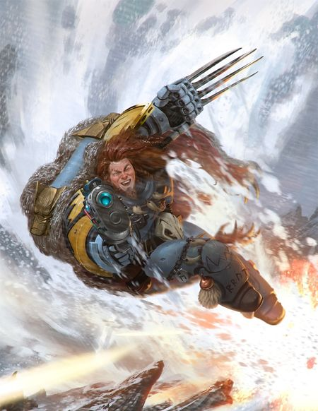
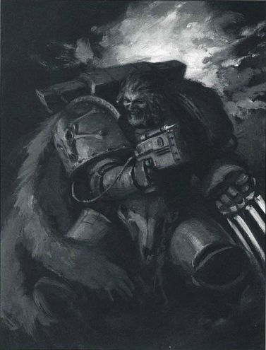
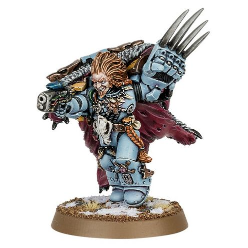

# 0658 骗子卢卡斯 Lukas the Trickster

精校状态：中文行文已逐段精校，部分术语仍为暂定

分类：人类帝国 / 太空野狼

原文来源：https://www.bilibili.com/opus/1115333475609608199

原作者：帝国神选罐头

原文时间：2025年09月22日 14:23

[返回分类目录](目录.md) · [全书目录](../../目录.md)

<!-- A0658-B0001 -->
**英文原文**

Lukas the Trickster (also known as the Strifeson, the Laughing One, and the Jackalwolf) is a Blood Claw of the Space Wolves, famous for his irreverence and rebelliousness and universally despised by the Wolf Lords. Due to this, he has never made it out of the Blood Claws despite his abilities being far in advance of many Wolf Guards. His cunning is undisputed, and even unarmed he is the dirtiest fighter in the Chapter.

<!-- /A0658-B0001 -->

<!-- A0658-B0002 -->

原译文

骗子卢卡斯（又名纷争之子、嘲笑者和豺狼）是太空野狼的血爪，以其不敬和叛逆而闻名，被狼主普遍鄙视。因此，尽管他的能力远远领先于许多野狼守卫，但他从未走出血爪。他的狡猾是毋庸置疑的，即使没有武装，他也是战团中最卑鄙的战士。

**校订译文**

骗子卢卡斯又称“纷争之子”“嘲笑者”与“豺狼”，是太空野狼的血爪。他以不敬权威、桀骜叛逆闻名，几乎所有狼主都厌恶他。因此，即便本领远胜许多野狼守卫，他仍始终停留在血爪阶段。他的狡黠无人怀疑；即使赤手空拳，他也是整个战团最擅长阴招的斗士。

<!-- /A0658-B0002 -->

<!-- A0658-B0003 图片 -->

<!-- A0658-B0004 -->

原译文

Lukas the Trickster 骗子卢卡斯

**校订译文**

Lukas the Trickster 骗子卢卡斯

<!-- /A0658-B0004 -->

<!-- A0658-B0005 -->
## Biography 传记

<!-- /A0658-B0005 -->

<!-- A0658-B0006 -->
**英文原文**

Before his induction into the Space Wolves, Lukas was a near-legendary figure amongst Fenris's womanfolk, famous for sharing a dozen beds in a single night. Following his induction, he has gained something of a cult following amongst the Blood Claws after "accidentally" locking an Inquisitorial genotax delegation in a grox breeding pen while the creatures were in season, and risking death when he spiked the arrogant Wolf Lord Hrothgar Ironblade's ale with the concentrated venom of a bloat-toad. Amongst his famous exploits are faking a series of transmissions that led directly to an Ork civil war, infecting a traitor cell of the Adeptus Mechanicus with their own necrovirus, and luring a lord of the Word Bearers into making planetfall upon thin ice, resulting in hundreds of Traitor Marines plunging to their death into the Sea of Lost Souls. He was also the only man to best a chameleonic Doppelgangrel, and wears its skin to this day.

<!-- /A0658-B0006 -->

<!-- A0658-B0007 -->

原译文

在加入太空野狼之前，卢卡斯在芬里斯的女性群体中是一个近乎传奇的人物，以一夜睡十几张床而闻名。在他入职后，他在血爪中获得了一些崇拜者的追随者，因为他“意外”地将一个审判庭的基因税代表团锁在了一个格洛克斯繁殖围栏里，而当他在傲慢的狼主赫罗斯加尔·铁刃的麦芽酒中掺入了一只肿胀蟾蜍的浓缩毒液时，他冒着死亡的风险。他著名的功绩包括伪造一系列直接导致欧克内战的传信，用他们自己的坏死病毒感染机械神教的叛徒单元，引诱一位怀言者的领主，让行星坠落在薄冰上，导致数百名叛徒战士坠入迷失的灵魂之海。他也是唯一一个打败变形怪多普尔甘雷尔的人，直到今天，他还穿着它的皮。

**校订译文**

加入太空野狼前，卢卡斯在芬里斯女性之间已近乎传奇，据说曾一夜辗转十二张床。入伍后，他的恶作剧更使不少血爪热烈追随：他曾“无意”将前来收取基因税的审判庭代表锁进正值发情期的格洛克斯兽繁殖栏，还冒着杀身之祸，在傲慢狼主赫罗斯加尔·铁刃的麦酒里加入胀蟾的浓缩毒液。他的著名事迹还包括伪造通讯，引发欧克内战；用机械修会叛变团体自己的坏死病毒感染他们；以及诱使一名怀言者领主在薄冰上登陆，让数百名叛军战士沉入失魂之海淹死。他还是唯一击败过能如变色龙般变化的多普尔甘雷尔的人，至今仍披着它的皮。

**校注：** in season 指兽群发情期，原译遗漏，致恶作剧含义不明。make planetfall 是部队登陆，非令行星坠落。

<!-- /A0658-B0007 -->

<!-- A0658-B0008 -->
**英文原文**

Arguably Lukas' finest moment was in 999 M41, when he and his Blood Claw pack were banished by Wolf Lord Dvorjac to the Elixir system, which was coming under attack from Waaagh! Megamek. The Orks' Warboss, Megamek, was a mechanical genius as well as a warlord, and the Ork horde was equipped with a huge fleet of Stompas, Dreadnoughts, and Gargants of all shapes and sizes. Instead of attacking the Orks head on, Lukas studied all available data on the planet, and discovered an ancient Climatrope at the world's arctic pole. Lukas and his Blood Claws performed a jump pack assault into the Climatrope, and then altered its programming to lower the planet's temperature to freezing levels. A few weeks later, when Lord Dvorjac and his Great Company arrived in the Elixir system to combat the threat, they found the Orks crippled, and their fleet of war machines severely damaged, by the freezing temperatures in which Space Wolves are quite comfortable making war.

<!-- /A0658-B0008 -->

<!-- A0658-B0009 -->

原译文

可以说，卢卡斯最辉煌的时刻是在999.M41，当时他和他的血爪小队被狼主德沃贾克放逐到灵药星系，该星系正受到超级技霸的Waaagh！的攻击。欧克的战争头目超级技霸是一位机械天才，也是一位军阀，欧克部落配备了一支由各种形状和大小的古巨圾、无畏和加冈特组成的庞大舰队。卢卡斯没有正面攻击欧克，而是研究了行星上所有可用的数据，并在世界北极发现了一条古老的气候线缆。卢卡斯和他的血爪对气候线缆进行了跳跃背包攻击，然后改变了它的程序，将行星的温度降至冰点。几周后，当德沃贾克领主和他的大连抵达灵药星系以对抗威胁时，他们发现欧克瘫痪了，他们的战争机械舰队严重受损，太空野狼在寒冷的温度下很容易发动战争。

**校订译文**

卢卡斯最出色的壮举之一发生在 999.M41。他与血爪小队被狼主德沃贾克放逐到正遭 Waaagh! 超级技霸攻击的灵药星系。战争头目超级技霸兼具统兵本领与机械天才，欧克大军配有大量形制各异的古巨圾、无畏机甲和加冈特。卢卡斯没有正面硬拼，而是研究当地行星资料，在北极发现一座古老的气候调控装置。他率血爪以跳跃背包突袭装置，修改程序，让全球陷入严寒。数周后，德沃贾克率大连前来迎敌，发现欧克已被冻得失去战斗力，战争机器也严重受损；这样的低温对太空野狼作战却相当适宜。

**校注：** Climatrope 为控制行星气候的装置，原气候线缆误将其当普通线缆；fleet 在战争机器语境指大群载具，不必译太空舰队。

<!-- /A0658-B0009 -->

<!-- A0658-B0010 图片 -->

<!-- A0658-B0011 -->

原译文

Lukas the Trickster 骗子卢卡斯

**校订译文**

Lukas the Trickster 骗子卢卡斯

<!-- /A0658-B0011 -->

<!-- A0658-B0012 -->
**英文原文**

Lukas was only once bested, during an abortive attempt to cripple the flagship of the Dark Eldar Duke Sliscus, wherein one of his two hearts was cut out as a souvenir and he was set adrift in space - an ordeal that only a Space Marine could survive, and only Lukas could laugh about. Lukas later had a Stasis Bomb wired in place of his secondary heart, so that when his primary heart stops beating, he and the one who finally bests him will be frozen in time as a gruesome and eternal monument to his own glory - giving Lukas the last laugh after all.

<!-- /A0658-B0012 -->

<!-- A0658-B0013 -->

原译文

卢卡斯只被击败过一次，在一次失败的尝试中，他试图削弱黑暗灵族斯里斯克斯公爵的旗舰，他的两颗心脏其中的一颗被切下作为纪念品，他被放在太空中漂流 — 这是一场只有星际战士才能生存的磨难，只有卢卡斯才能对于它笑。卢卡斯后来用静滞炸弹代替了他的第二颗心脏，这样当他的第一颗心脏停止跳动时，他和最终战胜他的人将被及时静滞，成为他自己荣耀的可怕而永恒的纪念碑 — 毕竟这让卢卡斯笑到了最后。

**校订译文**

卢卡斯仅有一次被人彻底算计：他试图瘫痪黑暗灵族斯里斯克斯公爵的旗舰，却遭失败，两颗心脏中的一颗被挖走作纪念，自己则被抛入太空任其漂流。这种磨难唯有星际战士可能幸存，也唯有卢卡斯能事后笑谈。他后来在第二心脏的位置接入静滞炸弹，一旦主心脏停跳，他与最终击败自己的人就会被冻结在时间中，成为彰显其“荣耀”的恐怖永恒纪念碑——如此，笑到最后的仍是卢卡斯。

**校注：** frozen in time 指冻结于时间中，原及时静滞误把 in time 当及时。

<!-- /A0658-B0013 -->

<!-- A0658-B0014 -->
**英文原文**

Shortly after the Indomitus Crusade Lukas was among the forces brought by Njal Stormcaller to Prospero. During the ensuing battle Lukas attempted to buy time for the Space Wolves to evacuate through Warp portals from Magnus the Red. Lukas confronted the Daemon Primarch and distracted him by offering him the spell of unsealing needed to control Prospero's portal network. Once he had bought enough time Lukas threw the "spell" into the air, revealing it to be a useless piece of paper, and lept into the portal as Magnus howled in fury.

<!-- /A0658-B0014 -->

<!-- A0658-B0015 -->

原译文

不屈远征后不久，卢卡斯就加入了尼加尔·唤风者带到普罗斯佩罗的部队。在随后的战斗中，卢卡斯试图为太空野狼从赤红之马格努斯的亚空间传送门疏散争取时间。卢卡斯与恶魔原体对峙，并向他提供了控制普罗斯佩罗传送门网络所需的解封咒语，分散了他的注意力。一旦他争取到足够的时间，卢卡斯就把这个“咒语”抛向空中，发现它是一张无用的纸，然后在马格努斯愤怒地嚎叫时跳进传送门。

**校订译文**

本篇记载，不屈远征后不久，卢卡斯随风暴召唤者纳吉奥前往普洛斯佩罗。随后的战斗中，他为太空野狼争取时间，使众人得以穿越亚空间门户，逃离红魔马格努斯。他当面声称，可以交出控制普洛斯佩罗传送门网络所需的解封咒语，以此牵制恶魔原体。等撤离时间足够，他将“咒语”抛向空中，露出那不过是一张无用纸片的真相，自己则在马格努斯怒吼声中跃入传送门。

**校注：** revealing it to be 是卢卡斯主动揭示假咒语，非他自己才发现纸片无用。after the Indomitus Crusade 的纪年表达与650只说接纳原铸后略有不同，按本篇原文保留，不自行改为远征初期。

<!-- /A0658-B0015 -->

<!-- A0658-B0016 -->
## Wargear 武器装备

原题：Wargear 战备

<!-- /A0658-B0016 -->

<!-- A0658-B0017 -->
**英文原文**

Lukas is armed with a plasma pistol and a Lightning Claw. He also wears a Doppegangrel's pelt, which surrounds him with shimmering and conflicting images, making it virtually impossible to land a telling blow on him

<!-- /A0658-B0017 -->

<!-- A0658-B0018 -->

原译文

卢卡斯手持等离子手枪和闪电爪。他还戴着一块多普尔甘雷尔的皮毛，周围环绕着闪闪发光、相互矛盾的图像，几乎不可能给他一记重击

**校订译文**

卢卡斯装备等离子手枪与闪电爪，还披着多普尔甘雷尔的毛皮。毛皮在他周围映出闪烁变幻、彼此错乱的影像，让敌人几乎无法打中要害。

**校注：** 源文 Doppegangrel 与前文 Doppelgangrel 异写，中文统一；telling blow 为有效重击/要害一击。

<!-- /A0658-B0018 -->

<!-- A0658-B0019 图片 -->

<!-- A0658-B0020 -->

原译文

Lukas the Trickster Lukas the Trickster 骗子卢卡斯

**校订译文**

Lukas the Trickster Lukas the Trickster 骗子卢卡斯

**校注：** 英文图注重复，依保留原英文要求留存；中文不重复。

<!-- /A0658-B0020 -->

<!-- A0658-B0021 -->
## Trivia

**补译**

琐事

<!-- /A0658-B0021 -->

<!-- A0658-B0022 -->
**英文原文**

Lukas may be a play on Loki, the Norse deity also known as the Trickster.

<!-- /A0658-B0022 -->

<!-- A0658-B0023 -->

原译文

卢卡斯可能是一个关于洛基的角色，洛基是北欧神，也被称为骗子。

**校订译文**

卢卡斯可能借鉴了北欧神祇洛基；洛基同样以诡计多端著称。

<!-- /A0658-B0023 -->

本篇核心术语与暂定项

以下列出本篇出现的英文原形及核心术语表用词。同形词可能指不同对象，具体词义以本篇正文和校注为准；单复数、别名和仅见于图注的名称可能尚未列入。完整候选见[术语表](../../术语表/双语术语候选.csv)。

| 英文 | 采用中文 | 状态 |
| --- | --- | --- |
| Space Wolves | 太空野狼 | 官方已核对 |
| Adeptus Mechanicus | 机械修会 | 官方已核对 |
| Eldar | 灵族 | 暂定·语境区分 |
| Dark Eldar | 黑暗灵族 | 暂定·旧称对应 |
| Orks | 欧克蛮人 | 官方已核对 |
| Warp | 亚空间 | 官方已核对 |
| Waaagh! | Waaagh! | 暂定·保留原文 |
| Indomitus | 不屈学派 | 暂定·学派语境 |
| Primarch | 原体 | 官方已核对 |
| Word Bearers | 怀言者 | 暂定·官方待核 |
| Magnus the Red | 红魔马格努斯 | 官方已核对 |
| Indomitus Crusade | 不屈远征 | 暂定·官方待核 |
| Fenris | 芬里斯 | 暂定·官方待核 |
| Loki | 洛基 | 暂定·官方待核 |
| Ancient | 旗手 | 官方已核对 |
| Space Marine | 星际战士 | 暂定·官方待核 |
| Chapter | 战团 | 暂定·官方待核 |
| Njal Stormcaller | 风暴召唤者纳吉奥 | 官方已核 |
| Lukas the Trickster | 骗子卢卡斯 | 暂定·官方待核 |
| Secondary Heart | 第二心脏 | 暂定·官方待核 |
| Horde | 部落 | 暂定·官方待核 |
| Blood Claws | 血爪 | 官方已核对 |
| Duke Sliscus | 斯里斯克斯公爵 | 暂定·官方待核 |
| Venom | 毒液飞艇 | 官方已核对 |
| Warboss | 战争头目 | 官方已核对 |
| Strifeson | 纷争之子 | 暂定·官方待核 |
| The Laughing One | 嘲笑者 | 暂定·官方待核 |
| Jackalwolf | 豺狼 | 暂定·官方待核 |
| Hrothgar Ironblade | 赫罗斯加尔·铁刃 | 暂定·官方待核 |
| bloat-toad | 胀蟾 | 暂定·官方待核 |
| Sea of Lost Souls | 失魂之海 | 暂定·官方待核 |
| Dvorjac | 德沃贾克 | 暂定·官方待核 |
| Climatrope | 气候调控装置 | 暂定·官方待核 |
| Megamek | 超级技霸 | 暂定·官方待核 |
| Sliscus | 斯里斯克斯 | 暂定·官方待核 |
| The Dark | 《黑暗》 | 暂定·官方待核 |
| The Blood | 鲜血 | 暂定·官方待核 |
| System | 星系（恒星系统） | 暂定·官方待核 |
| Grox | 格洛克斯 | 暂定·官方待核 |
| claw | 利爪分队 | 暂定·官方待核 |
| Plasma pistol | 等离子手枪 | 官方已核对 |
| Jump Pack | 跳跃背包 | 暂定·官方待核 |

