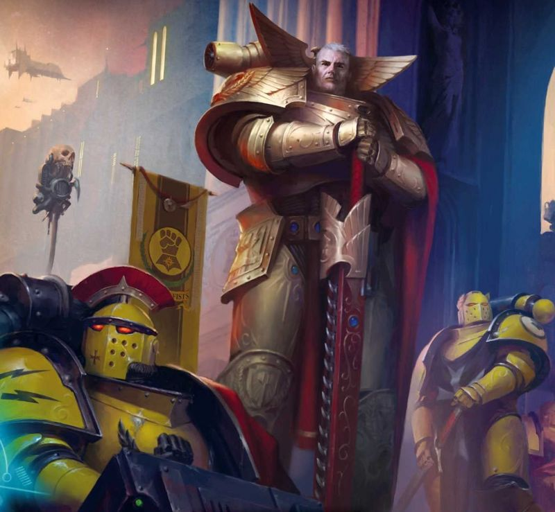
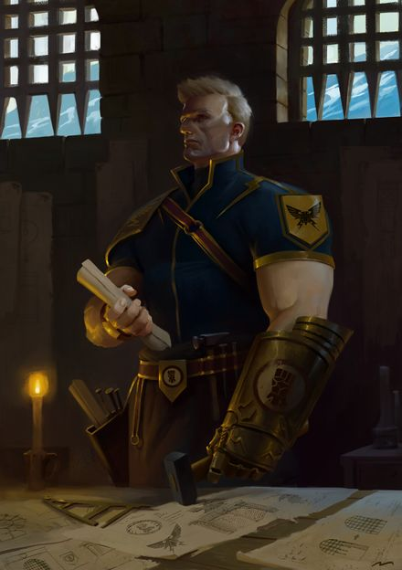
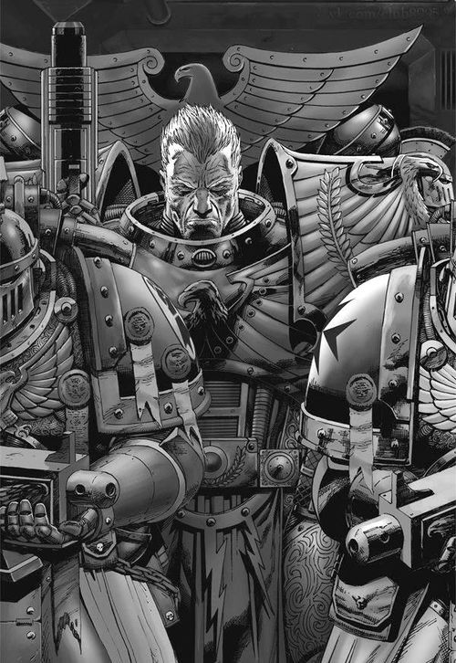
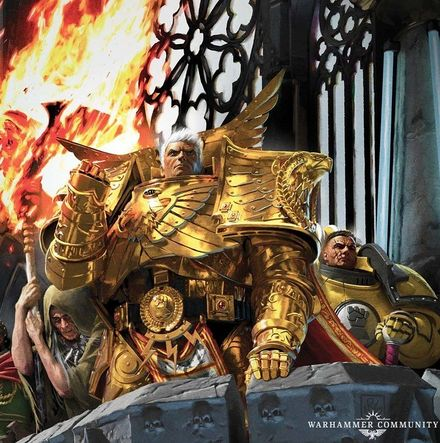
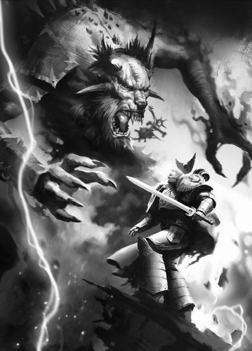
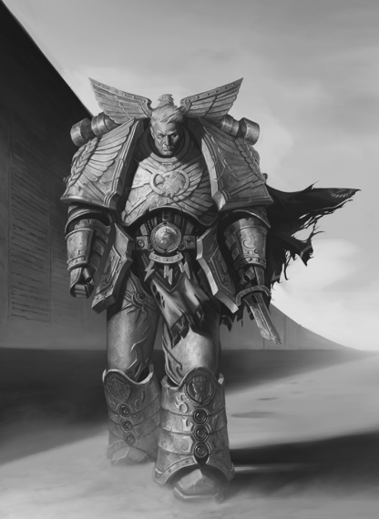
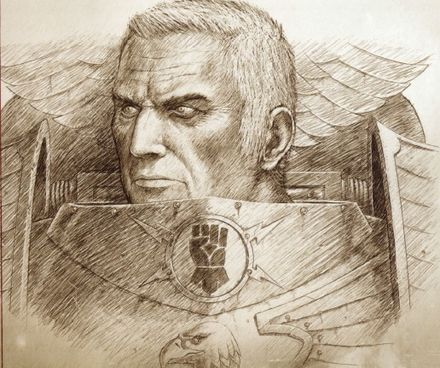
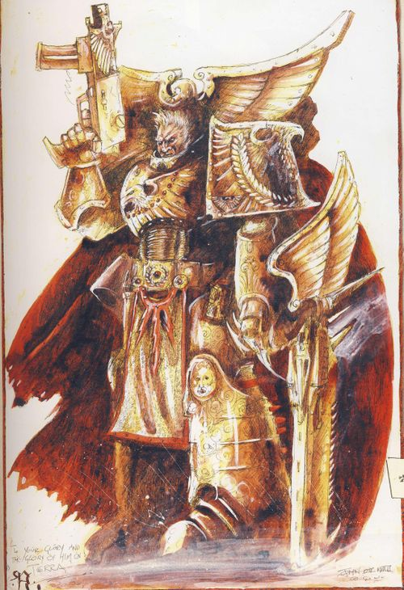
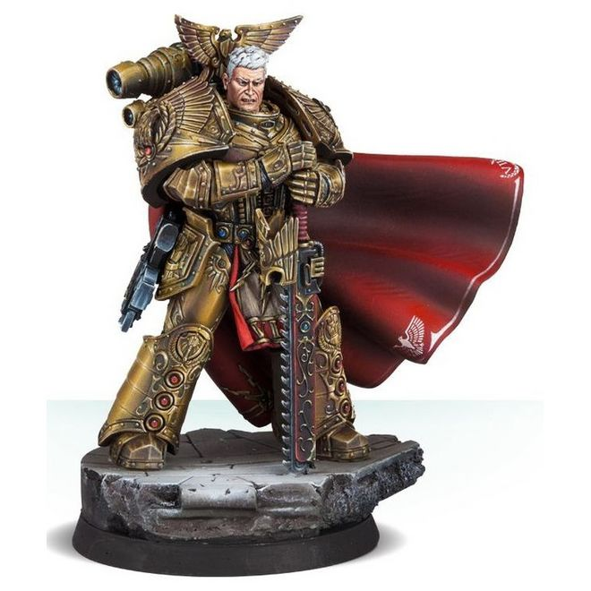

# 0659 罗格·多恩 Rogal Dorn

精校状态：中文行文已逐段精校，部分术语仍为暂定

分类：人类帝国 / 帝国之拳

原文来源：https://www.bilibili.com/opus/1058591661897023537

原作者：帝国神选罐头

原文时间：2025年04月22日 16:36

[返回分类目录](目录.md) · [全书目录](../../目录.md)

<!-- A0659-B0001 -->
**英文原文**

"There is no enemy. The foe on the battlefield is merely the manifestation of that which we must overcome. He is doubt, and fear, and despair. Every battle is fought within. Conquer the battlefield that lies inside you, and the enemy disappears like the illusion he is."

<!-- /A0659-B0001 -->

<!-- A0659-B0002 -->

原译文

“没有敌人。战场上的仇敌，不过是我们必须克服之物的具象化。他是疑虑，是恐惧，是绝望。每场战斗都发生在内心深处。征服你心中的战场吧，而敌人自会如幻影般消散。”

**校订译文**

“没有敌人。战场上的仇敌，不过是我们必须克服之物的具象化。他是疑虑，是恐惧，是绝望。每场战斗都发生在内心深处。征服你心中的战场吧，而敌人自会如幻影般消散。”

<!-- /A0659-B0002 -->

<!-- A0659-B0003 -->
**英文原文**

Rogal Dorn, also known as the Praetorian of Terra was the Primarch of the Imperial Fists Space Marine Legion. He was one of the twenty Primarchs created by the Emperor in the earliest days of the Imperium, just after the end of the Age of Strife. Dorn, like the other Primarchs, was randomly transported across the galaxy by the Gods of Chaos and placed on a far-away world in an attempt to prevent the coming of the Age of the Imperium. During the Horus Heresy Rogal Dorn oversaw most of the loyalist war effort and ultimately orchestrated the defense of the Throneworld during the Siege of Terra. He was the first known Lord Commander of the Imperium, ultimately ceding the title to Roboute Guilliman. The Chaos emissary to Lorgar called him the Soldier.

<!-- /A0659-B0003 -->

<!-- A0659-B0004 -->

原译文

罗格·多恩，也被称为泰拉禁卫，是帝国之拳星际战士军团的原体。他是帝皇在帝国初期，即纷争时代结束后创造的二十位原体之一。多恩和其他原体一样，被混沌诸神随机传送到银河系各地，并被安置在一个遥远的世界，试图阻止帝国时代的到来。在荷鲁斯叛乱时期，罗格·多恩监督了大部分忠诚派的战争努力，并最终在泰拉围城期间精心策划了对王座世界的防御。他是第一位已知的帝国领主指挥官，最终将头衔让给了罗伯特·基里曼。混沌派去珞珈的使者称他为士兵。

**校订译文**

罗格·多恩又称“泰拉禁卫”，是帝国之拳星际战士军团的原体，也是帝皇在纷争时代结束、帝国初建之际创造的二十位原体之一。与兄弟们一样，他被混沌诸神散落到遥远世界，以破坏帝国时代的到来。荷鲁斯之乱期间，多恩统筹忠诚派大部分战事，并在泰拉围城中组织王座世界的防御。他是已知首任帝国最高统帅，后来将此职交给罗保特·基里曼。向珞珈传话的混沌使者称他为“士兵”。

<!-- /A0659-B0004 -->

<!-- A0659-B0005 图片 -->

<!-- A0659-B0006 -->

原译文

Rogal Dorn during the Great Crusade 大远征期间的罗格·多恩

**校订译文**

Rogal Dorn during the Great Crusade 大远征期间的罗格·多恩

<!-- /A0659-B0006 -->

<!-- A0659-B0007 -->
## Biography 传记

<!-- /A0659-B0007 -->

<!-- A0659-B0008 -->
### Youth 青年

<!-- /A0659-B0008 -->

<!-- A0659-B0009 -->
**英文原文**

Very little is known about Rogal Dorn's youth. It is believed that that he was raised on the planet of Inwit in the system of the same name by an ice-caste native to the Ice Hives of the world. The patriarch of the clan, the House of Dorn, soon became as a grandfather to him, and taught him much of tactics and survival. Even after he discovered he was not blood-related to his 'grandfather' Dorn held his memory in high value; he kept a fur-edged robe that had belonged to the man and slept with it on his bed every night. Eventually Rogal Dorn became the leader not only of his caste but of the whole world and then the surrounding region of space, ruling the Inwit Cluster as Emperor of the House of Dorn. Intrigued by the enormous station known as The Phalanx orbiting Inwit, Dorn spent many years reactivating the vessel.

<!-- /A0659-B0009 -->

<!-- A0659-B0010 -->

原译文

关于罗格·多恩的年轻时代，我们所知甚少。据信，他是在同名星系中的因维特星球上被一名来自该星球寒冰巢都的冰种原住民抚养长大的。多恩家族，氏族的族长，很快成为了他的祖父，并教会了他很多战术和生存。即使在他发现自己与“祖父”没有血缘关系之后，多恩仍对自己的记忆怀有高度的珍惜；他留着一件属于那个人的毛皮边长袍，每天晚上都穿着它睡在床上。最终，罗格·多恩不仅成为了他氏族的领袖，还成为了整个世界以及周围太空地区的领袖，以多恩家族皇帝的身份统治着因维特星团。多恩对被称为山阵号的巨大空间站很感兴趣，花了很多年时间重新激活这艘船。

**校订译文**

多恩的早年生平所知甚少。据说，他由因维特星系同名行星冰巢中的一个寒冰氏族抚养长大。这个氏族即多恩家族，其族长如祖父般照料他，教导战术与生存技艺。即使后来得知两人没有血缘关系，多恩仍珍视祖父的记忆，保留他穿过的毛皮镶边长袍，每夜将其放在床上。最终，多恩先后成为氏族、整颗行星与周围星域的领袖，以多恩家族皇帝的身份统治因维特星群。他对环绕因维特的巨型空间站山阵号深感兴趣，花费多年使其重新运转。

**校注：** ice-caste 为群体，非一个原住民；House of Dorn 是氏族名，非族长姓名。祖父长袍放在床上，英文未说多恩每夜穿着它。

<!-- /A0659-B0010 -->

<!-- A0659-B0011 图片 -->

<!-- A0659-B0012 -->

原译文

younger Rogal Dorn 年轻的罗格·多恩

**校订译文**

younger Rogal Dorn 年轻的罗格·多恩

<!-- /A0659-B0012 -->

<!-- A0659-B0013 -->
**英文原文**

40 years after his grandfather's death, the Great Crusade reached the Ice Hives of Inwit. Dorn greeted the Emperor at the helm of his enormous Phalanx, the seventh Primarch to be found. The Emperor welcomed Dorn, and returned the Phalanx to his care, making it the Fortress Monastery of the Imperial Fists.

<!-- /A0659-B0013 -->

<!-- A0659-B0014 -->

原译文

在他祖父去世40年后，大远征到达了因维特的寒冰巢都。多恩驾驶着庞大的山阵号迎接帝皇，这是第七位被发现的原图。帝皇欢迎多恩，并将山阵号交还给他照顾，使其成为帝国之拳的堡垒修道院。

**校订译文**

祖父去世四十年后，大远征抵达因维特冰巢。多恩驾驭庞大的山阵号迎接帝皇，成为第七位被找回的原体。帝皇欢迎他的归来，并将山阵号交还他掌管，使其成为帝国之拳的要塞修道院。

<!-- /A0659-B0014 -->

<!-- A0659-B0015 -->
**英文原文**

Commonly dressed in armour of burnished copper and gold, Dorn also wore a red velvet cloak and unfurled eagle-wing motif. It was heavily present on most parts of his gear, most notably on a decorative section of his armour that rose above his shoulders. He had a stern and naturally unsmiling face, topped with an unruly shock of short, bone-white hair.

<!-- /A0659-B0015 -->

<!-- A0659-B0016 -->

原译文

多恩通常穿着抛光铜和黄金制成的盔甲，还穿着红色天鹅绒斗篷，展开的鹰翼图案大量出现在他的大部分装备上，最明显的是他肩上盔甲的装饰部分。他有一张严肃的、天生不苟言笑的脸，上面长着一头难以控制的、骨白的短发。

**校订译文**

多恩通常穿着铜金色泽锃亮的护甲，披红色天鹅绒斗篷。展开的鹰翼纹样遍布装备，尤其醒目的是高出双肩的护甲饰板。他面容严峻，天性不苟言笑，留着一头略显蓬乱的骨白短发。

<!-- /A0659-B0016 -->

<!-- A0659-B0017 -->
### Great Crusade 大远征

<!-- /A0659-B0017 -->

<!-- A0659-B0018 -->
**英文原文**

Dorn himself was fiercely loyal to the Emperor, and never once sought any favour from him. He exemplified the truth, and could never tell a lie, even if it would have aided his cause. Because of this, Dorn's statue stands as one of four on Macragge, next to that of Roboute Guilliman, Primarch of the Ultramarines.

<!-- /A0659-B0018 -->

<!-- A0659-B0019 -->

原译文

多恩本人对帝皇非常忠诚，从未向他寻求过任何帮助。他以身作则，从不撒谎，即使这有助于他的事业。因此，多恩的雕像是马库拉格四座雕像中的一座，旁边是极限战士军团原体罗伯特·基里曼的雕像。

**校订译文**

多恩对帝皇忠贞不渝，从不索求恩宠。他奉真诚为准则，即使谎言有利于自己的目标，也不会说谎。因此，马库拉格竖立的四座雕像中有他一席，毗邻极限战士原体罗保特·基里曼的雕像。

**校注：** favour 指恩宠/优待，非任何帮助；could never tell a lie 是源文人物描述，未据此推断其他章节所有隐瞒均不存在。

<!-- /A0659-B0019 -->

<!-- A0659-B0020 图片 -->

<!-- A0659-B0021 -->

原译文

Rogal Dorn 罗格·多恩

**校订译文**

Rogal Dorn 罗格·多恩

<!-- /A0659-B0021 -->

<!-- A0659-B0022 -->
**英文原文**

Dorn commanded his Legion and Expeditionary Fleets with peerless devotion and military genius. It was said that he possessed perhaps the finest military mind of the Primarchs, as ordered and disciplined as Roboute Guilliman's and as courageous as Lion El'Jonson's, but still inclined to the flashes of zeal and inspiration which marked the successes of Leman Russ and Jaghatai Khan. Indeed, the Warmaster had said that he esteemed Dorn and the Imperial Fists so highly that he reckoned if the Fists, noted masters of defence, were to hold a fortress against him and his Luna Wolves, the resultant conflict would result in a never-ending stalemate. Despite his fierce reputation as a general, Dorn had compassion for civilian populations as demonstrated during his clash with Curze in the Chernaut War and with Ferrus Manus in the Astranii Campaign. Further evidence of his compassion may be found on Necromunda, a planet which he liberated from Orks sometime in M30. The local holiday of Imperial Fistmas commemorates this liberation and, according to legend, Rogal Dorn felt compassion for the populace devastated by the Orks and charged a defeated mythical mutant foe and its descendants with forever aiding them in rebuilding. Though the events of the legend are disputed by Imperial scholars, Rogal Dorns presence had inspired a universal time of goodwill and cheer in an otherwise brutal and violent Hive World.

<!-- /A0659-B0022 -->

<!-- A0659-B0023 -->

原译文

多恩以无与伦比的奉献精神和军事才能指挥着他的军团和远征舰队。据说他可能拥有最优秀的军事头脑，像罗伯特·基里曼一样有秩序和纪律，像莱昂·艾尔庄森一样勇敢，但仍然倾向于黎曼·鲁斯和察合台可汗取得成功时所表现出的热情和灵感。事实上，战帅曾说过，他非常尊重多恩和帝国之拳，以至于他认为，若作为防御大师著称的帝国之拳，以要塞抵御他和他的影月苍狼军团，这场冲突将陷入永无止境的僵局。尽管多恩作为一名将军享有盛誉，但他对平民怀有同情，这在他与科兹在切尔诺战争中的冲突以及与马努斯在阿斯特罗尼战役中的冲突中得到了证明。在涅克罗蒙达上可以找到他同情心的进一步证据，这颗行星是他在M30的某个时候从欧克手中解放出来的。当地的帝国之拳节是为了纪念这一解放，据传说，罗格·多恩对被兽人摧毁的民众表示同情，并要求一个被击败的神话的变种敌人及其后代永远帮助他们重建。尽管帝国学者对传说中的事件存在争议，但罗格·多恩的出现在一个残酷暴力的巢都世界中激发了一个充满善意和欢呼的世界。

**校订译文**

多恩以无比忠诚与卓越军事才能指挥军团和远征舰队。据说，他或许拥有原体中最优秀的军事头脑：像基里曼一样严整自律，像莱昂·艾尔’庄森一样勇敢，又不乏黎曼·鲁斯和察合台可汗那种带来胜利的激情与灵感。战帅荷鲁斯曾高度评价多恩与帝国之拳，认为若自己率影月苍狼攻打一座由他们把守的要塞，战局将永远僵持下去。多恩虽以作战凶悍闻名，却同情平民；切尔诺战争中与科兹、阿斯特拉尼战役中与费鲁斯·马努斯的争执，都体现了这一点。他在 M30 从欧克手中解放涅克罗蒙达的传说也是一例。当地以“帝国之拳节”纪念解放；传说多恩怜悯饱受欧克蹂躏的人民，命令一名被他击败的神话变种敌人及其后代永远协助居民重建。虽然帝国学者对传说细节存疑，多恩的事迹仍为这个残酷暴力的巢都世界带来一段人人互致善意、共同欢庆的节期。

**校注：** Imperial Fistmas 是节庆，末句 time of goodwill 指欢庆时节，非建立另一个美好世界。

<!-- /A0659-B0023 -->

<!-- A0659-B0024 -->
### Horus Heresy 荷鲁斯之乱

原题：Horus Heresy 荷鲁斯叛乱

<!-- /A0659-B0024 -->

<!-- A0659-B0025 -->
**英文原文**

Before the Imperial fists could arrive at Terra in full complement, the events of the Horus Heresy overtook them. Stranded for some considerable time by severe Warp storms, the Imperial Fist fleet eventually discovered the badly damaged Death Guard frigate Eisenstein, and so learned of Horus' betrayal. At first unwilling to believe it, Rogal Dorn was eventually convinced by several members of the Eisenstein survivors, notably Captain Nathaniel Garro and remembrancer Mersadie Oliton, that his brother Horus was staging a full-scale rebellion. Dorn therefore despatched the bulk of his Legion to the Isstvan III system on a war-footing. He himself returned to Terra with his veteran companies to bring word of the events personally.

<!-- /A0659-B0025 -->

<!-- A0659-B0026 -->

原译文

在帝国之拳完全到达泰拉之前，荷鲁斯叛乱的事件已经超越了他们。帝国之拳舰队被严重的亚空间风暴困住了相当长的一段时间，最终发现了严重受损的死亡守卫护卫舰爱森斯坦号，因此得知了荷鲁斯的背叛。起初，罗格·多恩不愿意相信，但最终被爱森斯坦幸存者中的几名成员说服，特别是纳撒尼尔·伽罗连长和纪述者梅赛蒂·奥列顿，他的兄弟荷鲁斯正在发动一场全面的叛乱。因此，多恩在战争状态下将他的大部分军团派往伊斯塔万三号星系。他亲自带着他的老兵连队回到泰拉，亲自传达事件的消息。

**校订译文**

帝国之拳尚未全员返回泰拉，荷鲁斯之乱便已爆发。舰队被强烈亚空间风暴困住多时，最终发现重创的死亡守卫护卫舰爱森斯坦号，得知荷鲁斯背叛。多恩起初不愿相信，直到舰上幸存者——尤其是纳撒尼尔·伽罗连长与纪述者梅萨迪·奥莱顿——提供证言，才接受兄弟已全面叛变的事实。他立即派军团主力奔赴伊斯塔万三号所在星系备战，自己率老兵连返回泰拉，亲自报信。

**校注：** Isstvan III system 的原文地理表达不精确，译伊斯塔万三号所在星系，未将编号 III 改为另一个战役地点。

<!-- /A0659-B0026 -->

<!-- A0659-B0027 图片 -->

<!-- A0659-B0028 -->

原译文

Rogal Dorn during the Horus Heresy 荷鲁斯叛乱期间的罗格·多恩

**校订译文**

Rogal Dorn during the Horus Heresy 荷鲁斯之乱期间的罗格·多恩

<!-- /A0659-B0028 -->

<!-- A0659-B0029 -->
**英文原文**

Declared Lord Commander of the Imperium until the arrival of Roboute Guilliman, Dorn was subsequently charged with bolstering the defences of the Imperial Palace even further, and oversaw the construction himself. He felt he was marring the perfection and beauty of the existing structure in doing this, and regretted it, even though it was necessary. As the Emperor was held up with the War Within the Webway, Dorn effectively managed the loyalist war effort while Malcador the Sigillite handled the political spectrum. Dorn divided the Sol System into several spheres of defense, attempting to contain the traitor advance in the subsequent Solar War. During the Battle of Pluto, Dorn seemingly killed Alpharius, Primarch of the Alpha Legion, but lost his trusted Huscarls commander Archamus in the process. Later, Dorn appeared to greet Vulkan when the Salamanders Primarch emerged from the Webway. Vulkan sensed that Dorn was mentally and physically exhausted from his duties and the constant bad news, and embraced his brother. Dorn next held a war council with Leman Russ, Jaghatai Khan, Sanguinius, and Malcador the Sigillite during which he revealed that the Ruinstorm was weakening, and intended to exploit this by mustering his forces at the Beta-Garmon System until Guilliman and Lion El'Jonson could arrive to crush Horus from the rear. The Khan and Russ both disagreed with Dorn's actions, and as Russ left Terra with his Legion to confront Horus directly Rogal pleaded with him to stay.

<!-- /A0659-B0029 -->

<!-- A0659-B0030 -->

原译文

在罗伯特·基里曼抵达之前，多恩被宣布为帝国领主指挥官，随后被要求进一步加强皇宫的防御，并亲自监督建造。他觉得这样做破坏了现有结构的完美和美丽，并对此表示遗憾，尽管这是必要的。由于帝皇被网道内部的战争所阻碍，多恩有效地管理了忠诚派的战争努力，而掌印者马卡多则处理了政治派别。多恩将太阳系划分为几个防御领域，试图在随后的太阳战争中遏制叛徒的推进。在冥王星战役中，多恩似乎杀死了阿尔法军团的原体阿尔法瑞斯，但在此过程中失去了他信任的胡斯卡尔指挥官阿坎姆斯。后来，当火蜥蜴原体从网道出现时，多恩似乎向沃坎打招呼。沃坎感觉到多恩因职责和不断的坏消息而身心俱疲，于是拥抱了他的兄弟。多恩接下来与黎曼·鲁斯、察合台可汗、圣吉列斯和掌印者马卡多举行了一次战争会议，在会上他透露毁灭风暴正在减弱，并打算利用这一点，在贝塔·加蒙星系集结他的部队，直到基里曼和莱昂·艾尔庄森能够从后方粉碎荷鲁斯。可汗和鲁斯都不同意多恩的行为，当鲁斯带着他的军团离开泰拉直接对抗荷鲁斯时，罗格恳求他留下来。

**校订译文**

多恩被任命为帝国最高统帅，直至后来由基里曼接任。他奉命进一步加固皇宫，亲自监督工程；尽管知道势在必行，仍为破坏宫殿原有的完美与美感而遗憾。帝皇忙于网道战争，多恩实际统筹忠诚派战事，掌印者马卡多则主持政务。多恩将太阳系划分为数个防区，准备在太阳战争中遏制叛军推进。冥王星之战中，他似乎杀死了阿尔法瑞斯，却失去了信任的胡斯卡尔亲卫统领阿坎姆斯。后来，沃坎从网道归来，多恩前去迎接。火蜥蜴原体察觉兄弟已被繁重职责与接连噩耗耗得身心俱疲，便拥抱了他。此后，多恩与鲁斯、察合台、圣吉列斯及马卡多商讨战局，指出毁灭风暴正在减弱，准备于贝塔·伽蒙集结，等待基里曼与莱昂从后方夹击荷鲁斯。可汗与鲁斯都反对这套部署。鲁斯决定率军离开泰拉、直接挑战荷鲁斯时，多恩恳求他留下。

<!-- /A0659-B0030 -->

<!-- A0659-B0031 图片 -->

<!-- A0659-B0032 -->

原译文

Dorn battles Alpharius during the Battle of Pluto 在冥王星之战中，多恩与阿尔法瑞斯战斗

**校订译文**

Dorn battles Alpharius during the Battle of Pluto 在冥王星之战中，多恩与阿尔法瑞斯战斗

<!-- /A0659-B0032 -->

<!-- A0659-B0033 -->
### Siege of Terra 泰拉围城

<!-- /A0659-B0033 -->

<!-- A0659-B0034 -->
**英文原文**

In 014.M31, Horus finally struck at the Sol System and brought about the final phase of the Solar War. Dorn by this point had conceived a five-tiered defensive layer based around buying as much time as possible in order to stall for Guilliman's arrival. Commanding from the Bhab Bastion with his primarily Human staff during the initial phase of the battle, as Luna and Mars came under direct attack Dorn finally decided to unleash the Phalanx into the battle and moved aboard the Battlestation. However as they were departing Terra's orbit for the battle Garviel Loken brought Remembrancer Mersadie Oliton aboard the station with urgent news. Dorn, having been given the initial news of Horus' treachery from Oliton years prior, trusted her judgement when Loken informed him that Oliton had to speak with the Primarch. However this was a trap by Chaos, and Oliton was revealed to have been unknowingly corrupted by Maloghurst years prior. The Daemon Samus manifested directly aboard the Phalanx, bringing with him hordes of Daemonic creatures. Dorn and the Imperial Fists aboard the Phalanx fought a desperate battle, with the Primarch even engaging Samus in direct combat and slaying the creature. However Samus was continually reborn by possessing the bodies of the fallen, and Dorn was ready to order the self-destruction of the Phalanx until Oliton committed suicide, closing the portal from which the Daemons manifested. With the Sol System falling around him due to Horus' attacks, Dorn ordered that Admiral Niora Su-Kassen take the Phalanx to the outer reaches of the System while he returned to Terra to command the defenses of the world for Horus' coming attack.

<!-- /A0659-B0034 -->

<!-- A0659-B0035 -->

原译文

014.M31，荷鲁斯最终袭击了太阳系，并带来了太阳战争的最后阶段。此时，多恩已经设想了一个五层防御，其基础是尽可能多地争取时间，以等待基里曼的到来。在战斗的初始阶段，当月球和火星受到直接攻击时，多恩带着他的主要泰拉参谋在巴布堡指挥，最终决定将山阵号投入战斗，并登上了战场。然而，当他们离开泰拉的轨道前往战斗时，加维尔·洛肯带着紧急消息将记述者梅赛蒂·奥列顿带上了空间站。多年前，多恩从奥列顿那里得到了荷鲁斯背叛的最初消息，当洛肯告诉他奥列顿必须与原体交谈时，多恩相信了他的判断。然而，这是混沌的陷阱，奥列顿被揭露在几年前被马洛赫斯特不知不觉地腐化了。恶魔萨姆斯直接出现在山阵号上，带来了成群的恶魔生物。多恩和山阵号上的帝国之拳进行了一场绝望的战斗，原体甚至与萨姆斯直接交战并杀死了这只生物。然而，萨姆斯通过占据堕落者的尸体不断重生，多恩准备命令山阵号自我毁灭，直到奥列顿自杀，关闭了恶魔显现的门户。由于荷鲁斯的攻击，太阳系在他周围陷落，多恩命令海军上将尼奥拉·苏-卡珊将山阵号带到太阳系的外围，同时他返回泰拉指挥世界防御荷鲁斯的进攻。

**校订译文**

014.M31，荷鲁斯攻入太阳系，太阳战争进入最后阶段。多恩已制定五层防御体系，尽可能拖延时间，等待基里曼。战斗初期，他与以凡人为主的参谋班子在巴布堡垒指挥。月球与火星遭到直接攻击后，他决定投入山阵号，并登上这座战斗空间站。然而，山阵号离开泰拉轨道时，加维尔·洛肯带着急报的纪述者梅萨迪·奥莱顿登舰。多年前，多恩正是从奥莱顿处获知荷鲁斯叛变，因此听洛肯说她必须面见原体时，便信任了她的判断。实际上，这却是混沌陷阱：奥莱顿数年前就已在不知情的情况下遭马洛赫斯特腐化。恶魔萨姆斯直接显现在山阵号内，带来大群恶魔。多恩率帝国之拳拼死抵抗，亲自击杀萨姆斯；但它不断附身阵亡者的身体重生。原体几乎要下令自毁山阵号，直到奥莱顿自尽，关闭恶魔显现的门户。太阳系各防区在荷鲁斯攻势下接连失守，多恩命令海军上将尼奥拉·苏·卡森率山阵号撤往星系外围，自己返回泰拉，统率最后防御。

**校注：** primarily Human staff 为主要由凡人组成的参谋班子，非主要泰拉参谋；fallen 在此为阵亡者，非堕落叛徒。Battlestation 是山阵号，不是泛指战场。

<!-- /A0659-B0035 -->

<!-- A0659-B0036 图片 -->

<!-- A0659-B0037 -->

原译文

Rogal Dorn battles Samus aboard the Phalanx 罗格·多恩在山阵号上与萨姆斯战斗

**校订译文**

Rogal Dorn battles Samus aboard the Phalanx 罗格·多恩在山阵号上与萨姆斯战斗

<!-- /A0659-B0037 -->

<!-- A0659-B0038 -->
**英文原文**

During the final battle on Terra's surface, Dorn was charged with the overall command of the defenses of the Imperial Palace, personally commanding the effort from the Bhab Bastion and later the Sky Fortress. During the early stages of the battle he attempted to maintain a sense of normalcy by allowing the Council of Terra to meet within the Great Chamber of the Senatorum Imperialis, but in truth he was completely occupied by the traitor siege. He forbid his brother Primarch's, Sanguinius and Jaghatai Khan, from leaving the Palace Walls and planned to instead bleed Horus' forces in a protracted siege to buy time for Roboute Guilliman's expected arrival. However he later relented on his plan to not allow the deployment of his best troops outside the Palace, opening the Helios Gate of the Palace and allowing Sanguinius to lead a counterattack by the Blood Angels, Imperial Fists, and Legio Solaria to rescue the Imperial Army conscripts being overrun outside.

<!-- /A0659-B0038 -->

<!-- A0659-B0039 -->

原译文

在泰拉表面的最后一场战斗中，多恩负责皇宫防御的总体指挥，亲自指挥巴布堡垒和后来的天空堡垒的行动。在战斗的早期阶段，他试图通过允许泰拉议会在帝国参议院大会议厅内举行会议来保持正常感，但事实上，他完全被叛徒围攻所占据。他禁止他的兄弟原体圣吉列斯和察合台可汗离开宫殿城墙，并计划在一场旷日持久的围攻中让荷鲁斯的部队流血，为罗伯特·基里曼的预期到来争取时间。然而，他后来改变了计划，不允许将他最好的部队部署到宫殿外，打开了宫殿的日神之门，允许圣吉列斯率领圣血天使、帝国之拳和日晷军团进行反击，以营救被占领的帝国军队征召兵。

**校订译文**

泰拉地表决战中，多恩总揽皇宫防御，先在巴布堡垒、后在天空堡垒亲自指挥。战斗初期，他允许泰拉议会继续在帝国参议院大议事厅开会，希望维持局势尚属正常的表象；但他本人已被围城战完全牵制。他禁止圣吉列斯与察合台出城，打算以持久防御不断消耗荷鲁斯，等待基里曼。然而，他后来放宽了精锐部队不得出城的限制，开启日神之门，让圣吉列斯率圣血天使、帝国之拳及日晷军团反击，救援城外正被敌军淹没的帝国军征召兵。

**校注：** relented ... not allow 表示松动原禁止令，原中文仍写不允许部署，使后文出城自相矛盾。

<!-- /A0659-B0039 -->

<!-- A0659-B0040 -->
**英文原文**

During the battle for Terra's Lion's Gate Spaceport Dorn put Fafnir Rann in charge of the defenses, but was later forced to send in Sigismund to lead in reinforcements. During this period Dorn confronted Euphrati Keeler over her proto-Imperial Cult, but the future Saint refused to back down and insisted she would aid the defense of Terra through faith. She desired to send Sigismund on a crusade to slay Abaddon, something which infuriated Dorn. Later as Sigismund faced death at the hands of Kharn and traitors were overrunning the Spaceport, Dorn took to the field himself to allow time for the loyalists to withdraw. He easily bested Kharn, swatting away the chosen of Khorne like an insect. It was then that Perturabo set down on the field from the Iron Blood, and Dorn attempted to goad the Lord of Iron into a personal duel in order to buy time. However Perturabo refused to be baited by Dorn's taunts, promising to only slay his brother after Terra's defenses had been subdued. Dorn responded that Perturabo had spent an immense amount of lives to merely take the first wall, and many more awaited. Despite the fall of the Spaceport Dorn was not distraught, as he had held it longer than he expected and knew all that mattered was to hold out until Guilliman's arrival.

<!-- /A0659-B0040 -->

<!-- A0659-B0041 -->

原译文

在争夺泰拉狮门太空港的战斗中，多恩让法夫尼尔·兰恩负责防御，但后来被迫派遣西吉斯蒙德率领援军。在此期间，多恩与幼发拉底·琪乐就她的原始帝国教派进行了对峙，但这位未来的圣人拒绝让步，坚持认为她将通过信仰帮助保卫泰拉。她想派西吉斯蒙德去讨伐阿巴顿，这激怒了多恩。后来，当西吉斯蒙德在卡恩手中面临死亡，叛徒占领太空港时，多恩亲自前往战场，为忠诚派留出时间撤退。他轻而易举地击败了卡恩，像击退一只昆虫一样击退了神选者卡恩。就在那时，佩图拉博从铁血号上下来，多恩试图怂恿钢铁之主进行决斗，以争取时间。然而，佩图拉博拒绝被多恩的嘲讽所激怒，他承诺只有在泰拉的防御被征服后才会杀死他的兄弟。多恩回应说，佩图拉博花了大量的生命只为了占领第一堵墙，还有更多的在等待。尽管太空港坠落，多恩并没有心烦意乱，因为他坚持的时间比他预期的要长，他知道重要的是坚持到基里曼的到来。

**校订译文**

争夺狮门太空港时，多恩先命法夫尼尔·兰恩主持防御，后来又派西吉斯蒙德率援军增援。这期间，他与尤弗拉蒂·琪乐就初兴的帝皇信仰发生争执。这位未来圣徒毫不退让，坚持要以信仰协助守卫泰拉，甚至想派西吉斯蒙德出征杀死阿巴顿，令多恩大怒。太空港即将被攻陷、西吉斯蒙德险些死于卡恩之手时，多恩亲自出战，掩护忠诚派撤离。他轻易击退卡恩，如挥开昆虫般将这名恐虐受选者打飞。佩图拉博此时从铁血号登陆，多恩出言挑衅，试图以原体决斗争取时间。钢铁之主却不肯上钩，宣称必先摧毁泰拉防御，再杀兄弟。多恩回应道，他耗费无数人命才攻下第一道墙，而前面还有更多城墙。太空港虽已失守，多恩并未沮丧：守军坚持得比预想更久，只要撑到基里曼抵达，一切牺牲便有意义。

<!-- /A0659-B0041 -->

<!-- A0659-B0042 -->
**英文原文**

After the fall of the Lion's Gate, the strategic situation for the loyalists worsened and four key areas were now threatened: the Colossi Gate, Saturnine Gate, Gorgon Bar, and Eternity Wall Spaceport. However the loyalists only had enough resources to defend three of these sites. Dorn was thus faced with the difficult decision of abandoning one and its defenders with it, eventually choosing the Spaceport. While stopping Kyril Sindermann from a possible suicide attempt, the Remembrancer's words made Dorn realize that he had overlooked the flaw in the Saturnine Gate that Perturabo could possibly exploit. Dorn thus set a trap for the traitors at Saturnine as he prepared to abandon the Eternity Wall Spaceport. At the height of the battle for Saturnine, Dorn saved Sigismund from his fallen brother Fulgrim, the two Primarchs coming to battle. With Fulgrim in his human state, Dorn was able to resist his constant goading, match his swordsmanship, and land mortal blows. However Fulgrim quickly regenerated and laughed off the damage. Dorn then informed Fulgrim of his trap and that Abaddon's subterranean assault had failed. Fulgrim became fed up with his allies and quit the battle, though not before summoning his elite guard led by Eidolon to assassinate the Primarch. With the help of Sigismund, Dorn was able to survive the battle. He next took direct command of the Shard Bastion along the Mercury-Exultant Killzone, organizing defenses against a massive Legio Mortis assault alongside 400 Imperial Fists.

<!-- /A0659-B0042 -->

<!-- A0659-B0043 -->

原译文

狮门陷落后，忠诚派的战略形势恶化，四个关键地区现在受到威胁：巨像之门、土星之门，戈尔贡障碍和永恒之墙太空港。然而，忠诚派只有足够的资源来保卫其中三个地点。因此，多恩面临着一个艰难的决定，即放弃一个及其防御者，最终选择太空港。在阻止凯里尔·辛德曼可能的自杀企图时，纪述者的话让多恩意识到，他忽略了佩图拉博可能利用的土星之门的缺陷。多恩在准备放弃永恒之墙太空港时，在土星为叛徒设下了陷阱。在土星战役的高潮，多恩从他倒下的兄弟福格瑞姆手中拯救了西吉斯蒙德，这两位原体即将投入战斗。当福格瑞姆处于人类状态时，多恩能够抵抗他不断的刺激，与他的剑术相匹配，并进行致命的打击。然而，福格瑞姆很快恢复了活力，并一笑置之。多恩随后告知福格瑞姆他的陷阱，阿巴顿的地下进攻失败了。福格瑞姆厌倦了他的盟友并退出了战斗，尽管在此之前他召集了由艾多隆领导的精锐卫队刺杀了原体。在西吉斯蒙德的帮助下，多恩得以在战斗中幸存下来。接下来，他直接指挥了水星欢欣杀戮区沿线的破片堡垒，与400名帝国之拳一起组织了对死亡军团大规模攻击的防御。

**校订译文**

狮门陷落后，巨像之门、土星之门、戈尔贡防线与永恒之墙太空港同时受到威胁，忠诚派却仅有足够资源防守其中三处。多恩不得不选择放弃一处及其守军，最终决定舍弃太空港。他阻止凯里尔·辛德曼疑似自尽之举时，纪述者的话令他想到：土星之门还有一处自己忽略、佩图拉博可能利用的破绽。于是，他一面准备放弃太空港，一面在土星之门设伏。战斗最激烈时，多恩从叛变兄弟福格瑞姆手中救下西吉斯蒙德，两位原体随即交锋。面对仍保持人形的福格瑞姆，多恩不为挑衅所动，以剑术与之抗衡，造成致命创伤；但福格瑞姆迅速再生，对伤势一笑置之。多恩告知其伏击计划，以及阿巴顿地下攻势已经失败的消息。福格瑞姆厌倦盟友，退出战斗，临走前却召来艾多隆率领的精锐亲卫，企图刺杀多恩。西吉斯蒙德协助多恩渡过危局。随后，多恩亲自指挥水星—欢欣杀戮区的破片堡垒，与四百名帝国之拳共同防御死亡军团的大举进攻。

**校注：** 福格瑞姆的精锐奉命企图刺杀多恩，原译刺杀了原体误表成功；fallen brother 指叛变兄弟，不是被击倒。

<!-- /A0659-B0043 -->

<!-- A0659-B0044 -->
**英文原文**

Three months into the Siege, Rogal Dorn had not slept or even rested for a single moment. The strain finally caught up with even his superhuman biology, and he began to slow. Admitting the war effort was lost, he nonetheless continued his work and did not oppose when Jaghatai Khan launched a counterattack to retake the Lion's Gate Spaceport. While admiring the Khan's ultimate achievement and seeming sacrifice, he did not think the recapture of the Port would change the battle's outcome. With loyalist positions collapsing across the Inner Palace, Dorn soon found his own Bhab Bastion under siege by Traitor forces and fought alongside Sigismund and Fafnir Rann.

<!-- /A0659-B0044 -->

<!-- A0659-B0045 -->

原译文

围攻的三个月中，罗格·多恩一刻也没睡，甚至没有休息。压力终于赶上了他超人的生理，他开始放慢速度。他承认战争失败了，但仍继续工作，当察合台可汗发动反击夺回狮门太空港时，他没有反对。在钦佩可汗的最终成就和看似牺牲的同时，他认为夺回港口不会改变战斗的结果。随着忠诚派在内殿的阵地崩溃，多恩很快发现自己的巴布堡垒被叛徒部队围困，并与西吉斯蒙德和法夫尼尔·兰恩并肩作战。

**校订译文**

围城进入第三个月，多恩始终未眠，甚至片刻不曾休息。长期重负终于使他的超人体魄也难以承受，行动开始迟缓。他虽认定大势已去，仍继续指挥，也未阻止察合台反攻狮门太空港。他敬佩可汗的战果与看似付出的牺牲，却不认为夺回港口足以扭转结局。忠诚派在内皇宫的阵地接连崩溃，多恩的巴布堡垒也被叛军围困，他与西吉斯蒙德、法夫尼尔·兰恩并肩作战。

<!-- /A0659-B0045 -->

<!-- A0659-B0046 -->
**英文原文**

Mere hours after Sanguinius' stand at the Eternity Gate, the Bhab Bastion fell to a massive assault led by the Sons of Horus. Dorn was forced to conducted a chaotic retreat back to the Sanctum Imperialis, while many of his staff and sons were slain. He subsequently took part in the last-ditch teleportation assault aboard the Vengeful Spirit, but upon arrival aboard the blighted vessel became trapped in an endless sweltering desert. For what seemed to him to be centuries, Dorn endured the desert, completely alone save for the corpses of his sons all around him. Slowly he began to lose his memories, eventually only remembering his own name as Khorne attempted to corrupt his soul. Dorn remained trapped within the desert for untold mortal lifetimes, continually being tempted by a voice baiting him to give into Khorne. Dorn, though forgetful of much of his identity and history, was nonetheless able to maintain his sanity by reciting old historical passages and scratching battle plans into the black wall of the desert. Such was his stubbornness that even the voice of Khorne grew frustrated but his inability to corrupt the Primarch. However Dorn was able to finally escape when the Emperor gave up the power he had built up as the proto-Dark King, purifying the madness sweeping across both Terra and the Vengeful Spirit. As Dorn found himself within the Inevitable City, his full memories were restored and he discovered Actae trapped beneath rubble.

<!-- /A0659-B0046 -->

<!-- A0659-B0047 -->

原译文

圣吉列斯防守永恒之门仅数小时后，巴布堡垒就被荷鲁斯之子领导的大规模进攻所摧毁。多恩被迫混乱地撤退回帝国圣地，他的许多参谋和子嗣被杀。随后，他参加了复仇之魂号上的最后一搏的传送攻击，但当他登上这艘枯萎的船时，却被困在了无尽的闷热沙漠中。在他看来，几个世纪以来，多恩一直独自忍受着沙漠，除了他周围子嗣的尸体。慢慢地，他开始失去记忆，最终只记得自己的名字，因为恐虐试图腐化他的灵魂。多恩在沙漠中被困了无数个凡人的一生，不断地被一个声音诱惑，诱使他屈服于恐虐。多恩虽然忘记了自己的大部分身份和历史，但仍然能够通过背诵旧的历史段落和在沙漠的黑墙上刻作战计划来保持理智。这就是他的顽固，甚至恐虐的声音也变得沮丧，他无法腐化原体。然而，当帝皇放弃了他作为原初黑暗之王所获得的力量，净化了席卷泰拉和复仇之魂的疯狂时，多恩终于逃脱了。当多恩发现自己身处不可避免之城时，他的全部记忆都恢复了，他发现阿克泰被困在废墟下。

**校订译文**

圣吉列斯坚守永恒之门数小时后，巴布堡垒便被荷鲁斯之子主导的大规模攻势夺取。多恩仓促撤回帝国圣所，途中大批参谋和子嗣丧生。随后，他参加了向复仇之魂号发动的最后传送突袭，却在登舰后陷入无尽炽热沙漠。对他而言，仿佛数百年过去了，身边除子嗣尸体再无他人。恐虐试图腐化他的灵魂，记忆逐渐消退，最终几乎只剩自己的名字。无数个凡人寿命般漫长的时间里，一个声音不断诱他臣服。虽然忘掉大部分往事，多恩仍靠背诵历史、在沙漠黑墙上刻画战术，维系理智。他顽强得连恐虐的声音也因无法将其腐化而恼怒。最终，帝皇放弃为成为黑暗之王而积聚的力量，驱散横扫泰拉与复仇之魂号的疯狂，多恩才得以脱困。他来到必然之城，记忆尽数恢复，并发现阿克泰被压在瓦砾下。

**校注：** 帝皇放弃的是为可能成为黑暗之王而积蓄的力量；proto 表示未完成阶段，避免当作已最终升格。

<!-- /A0659-B0047 -->

<!-- A0659-B0048 图片 -->

<!-- A0659-B0049 -->

原译文

Dorn trapped within the endless desert 多恩被困在无尽的沙漠中

**校订译文**

Dorn trapped within the endless desert 多恩被困在无尽的沙漠中

<!-- /A0659-B0049 -->

<!-- A0659-B0050 -->
**英文原文**

Despite being free from the desert, the endless centuries within Horus' trap had rendered Dorn prone to worrying, pessimistic thoughts and a tendency to reflect upon the past. After leaving Actae, Dorn continued through the Inevitable City and eventually found himself back aboard the Vengeful Spirit as Valdor and his Custodes fought against a counterattack by Abaddon. Dorn was able to break the gridlock and allowed Valdor and himself to escape to Lupercal's Court, where they discovered Garviel Loken and Leetu as the only ones standing. Horus lay dead and the Emperor was grievously wounded.

<!-- /A0659-B0050 -->

<!-- A0659-B0051 -->

原译文

尽管远离沙漠，但荷鲁斯陷阱中无尽的几个世纪使多恩容易产生担忧、悲观的想法，并倾向于反思过去。离开阿克泰后，多恩继续穿越不可避免之城，最终发现自己回到了复仇之魂号上，瓦尔多和他的禁军正在与阿巴顿的反击作战。多恩打破了僵局，让瓦尔多和他自己逃到了卢佩卡尔王庭，在那里他们发现只有加维尔·洛肯和勒图站着。荷鲁斯死了，帝皇受了重伤。

**校订译文**

虽然逃出沙漠，在荷鲁斯陷阱中度过的漫长世纪仍使多恩变得忧虑悲观，频频回望过去。与阿克泰分别后，他穿过必然之城，最终重返复仇之魂号，恰逢瓦尔多率帝皇禁军抵御阿巴顿的反击。多恩打破僵局，与瓦尔多脱身，抵达卢佩卡尔王庭。那里只剩加维尔·洛肯与勒图仍然站立；荷鲁斯已死，帝皇身负重伤。

<!-- /A0659-B0051 -->

<!-- A0659-B0052 -->
**英文原文**

Dorn and the furious Valdor argued over what to do next. Dorn agreed with Leetu, who had found a tarot card of The Throne near the Emperor's body and interpreted it as a sign that the Emperor must be placed back on the Golden Throne. Dorn, Valdor, and the other survivors teleported back into the Palace and the Emperor took his seat for the next 10,000 years.

<!-- /A0659-B0052 -->

<!-- A0659-B0053 -->

原译文

多恩和愤怒的瓦尔多争论着下一步该怎么办。多恩同意勒图的观点，勒图在帝皇的尸体附近发现了一张王座塔罗牌，并将其解释为帝皇必须重新坐上黄金王座的标志。多恩、瓦尔多和其他幸存者被传送回皇宫，帝皇在接下来的一万年里一直坐在那里。

**校订译文**

多恩与愤怒的瓦尔多争论下一步行动。他赞同勒图的判断：勒图在帝皇身旁发现一张“王座”塔罗牌，认为这是将帝皇送回黄金王座的启示。多恩、瓦尔多与其他幸存者传送返回皇宫，帝皇由此端坐王座，延续此后一万年。

**校注：** Emperor’s body 此处指重伤帝皇的身体，原译尸体错误；相邻英文明确 grievously wounded。

<!-- /A0659-B0053 -->

<!-- A0659-B0054 -->
### Post Heresy 叛乱后

<!-- /A0659-B0054 -->

<!-- A0659-B0055 -->
**英文原文**

After the fall of the Emperor, Rogal Dorn entered a dark period of his life; he felt he had failed in his sworn duty to protect the Emperor and Dorn's legion faltered without the guiding light of the Emperor. Dorn led his Legion on a crusade of penitence across the Imperium. Forgoing his golden armour, he donned himself in black and fought a merciless campaign dispensing justice to the traitors. Though absent from the high councils held on Terra, Dorn answered Roboute Guilliman's summons when the latter had announced the adoption of the Codex Astartes, turning Legions into smaller Chapters. Dorn was initially outraged at this proposal, feeling that the Imperium blamed him (and rightly so, he thought) for the fall of his brother marines. But realizing what damage another internal conflict could do to the fragile peace of the Imperium, Dorn agreed.

<!-- /A0659-B0055 -->

<!-- A0659-B0056 -->

原译文

帝皇倒下后，罗格·多恩进入了人生的黑暗时期；他觉得自己没有履行保护帝皇的誓言，多恩的军团在没有帝皇指引的情况下摇摇欲坠。多恩率领他的军团在帝国各地进行了忏悔运动。他脱下金甲，穿上黑衣，展开了一场无情的战役，向叛徒伸张正义。尽管多恩没有参加在泰拉举行的高级会议，但当罗伯特·基里曼宣布通过阿斯塔特圣典时，多恩回应了他的召唤，将军团变成了更小的战团。多恩最初对这一提议感到愤怒，觉得帝国将他的兄弟战士的堕落归咎于他（他认为这是正确的）。但多恩意识到另一场内部冲突会对帝国脆弱的和平造成多大的破坏，他同意了。

**校订译文**

帝皇倒下后，多恩陷入人生至暗时期。他认为自己未能履行守护帝皇的誓言，军团也因失去帝皇指引而迷惘。他率军横越帝国，展开赎罪远征，脱下金甲，改披黑衣，无情惩处叛徒。他虽未出席泰拉的高层会议，却响应了基里曼的召集：后者宣布采用《阿斯塔特圣典》，将军团拆分为较小战团。多恩起初愤怒，认为帝国将兄弟战士的堕落归咎于自己，而他也自认难辞其咎。但考虑到再次内战会摧毁帝国脆弱的和平，他最终同意。

<!-- /A0659-B0056 -->

<!-- A0659-B0057 图片 -->

<!-- A0659-B0058 -->

原译文

Rogal Dorn 罗格·多恩

**校订译文**

Rogal Dorn 罗格·多恩

<!-- /A0659-B0058 -->

<!-- A0659-B0059 -->
**英文原文**

Some controversy exists about the next event in Rogal Dorn's life. What is clear is that the Imperial Fists could not be as easily divided into chapters as, for example the Ultramarines could. The total commitment to the legion was bred into each marine and many didn't wish to form their own chapters. Dorn found the answer to this problem in meditation through self-inflicted pain, using a device known as the Pain Glove. While under the influence of the device, Dorn had a vision of the Emperor. The pain-induced vision revealed that his legion had to be redeemed, and that the way to salvation was through pain and self-sacrifice.

<!-- /A0659-B0059 -->

<!-- A0659-B0060 -->

原译文

关于罗格·多恩生命中的下一个事件存在一些争议。显而易见的是，帝国之拳不能像极限战士那样容易地分成战团。对军团的全部承诺被灌输到每个战士身上，许多人不想组成自己的战团。多恩通过使用一种名为痛苦手套的装置，通过自我施加的疼痛在冥想中找到了这个问题的答案。在装置的影响下，多恩看到了帝皇。痛苦引发的幻觉表明，他的军团必须得到救赎，而救赎的道路是通过痛苦和自我牺牲。

**校订译文**

多恩接下来的经历存在争议。可以确定的是，帝国之拳不像极限战士那样容易拆分。对军团的全心忠诚已深植每名战士心中，许多人不愿另建战团。多恩使用名为“痛苦手套”的装置，以自我折磨辅助冥想，寻求解答。在痛苦诱发的异象中，他看见帝皇，并认定军团需要救赎，而通往救赎的道路就是痛苦与自我牺牲。

<!-- /A0659-B0060 -->

<!-- A0659-B0061 -->
**英文原文**

Pain is the wine of communion with heroes.

<!-- /A0659-B0061 -->

<!-- A0659-B0062 -->

原译文

痛苦是与英雄交流的酒。

**校订译文**

痛苦，是与英雄共融的美酒。

<!-- /A0659-B0062 -->

<!-- A0659-B0063 -->
**英文原文**

Teachings of Rhetoricus

<!-- /A0659-B0063 -->

<!-- A0659-B0064 -->

原译文

修辞教学

**校订译文**

瑞托里库斯的教诲

<!-- /A0659-B0064 -->

<!-- A0659-B0065 -->
**英文原文**

The 'collective pain' needed to cleanse the Chapter was decided by Dorn to be an Iron Warriors' fortress, the Iron Cage. Perturabo had built the massive fortifications to mock the Imperial Fists, and Dorn led his most die-hard followers in a siege that would last for several weeks. Followers of the Iron Warriors claim that the Imperial Fists suffered a crushing defeat, and that Dorn and his legion would have been wiped out if Perturabo hadn't prolonged Dorn's suffering so long that the Ultramarines managed to intervene.

<!-- /A0659-B0065 -->

<!-- A0659-B0066 -->

原译文

多恩决定将清理战团所需的“集体痛苦”选为钢铁勇士的堡垒，即铁笼。佩图拉博建造了巨大的防御工事来模拟帝国之拳，多恩带领他最顽固的追随者进行了持续数周的围攻。钢铁勇士的追随者声称，帝国之拳遭受了毁灭性的失败，如果佩图拉博没有将多恩的痛苦延长到极限战士设法干预的程度，多恩和他的军团就会被消灭。

**校订译文**

多恩决定以攻打钢铁勇士的“铁笼”堡垒，作为净化战团所需的集体苦难。佩图拉博修筑这座庞大工事来嘲弄帝国之拳，多恩则带最坚定的追随者展开持续数周的围攻。钢铁勇士一方声称，帝国之拳惨败，若非佩图拉博一心延长多恩的痛苦、拖到极限战士赶来干预，多恩与军团早已覆灭。

<!-- /A0659-B0066 -->

<!-- A0659-B0067 -->
**英文原文**

Imperial records indicate otherwise. The Imperial Fists had always been masters of siege craft, and even unprepared and at a disadvantage they fought like lions. Dorn stood as a giant in their midst, his mind clear with purpose after years of doubt and guilt. The Iron Warriors would have had to sacrifice their lives and Primarch to destroy the Imperial Fists, a price they weren't ready to pay. The arrival of the Ultramarines cut the conflict short and the Iron Warriors fled for the Eye of Terror. The Imperial Fists had suffered staggering losses, but they had proved their loyalty to the Emperor and cleansed themselves of earlier failures.

<!-- /A0659-B0067 -->

<!-- A0659-B0068 -->

原译文

帝国的记录表明并非如此。帝国之拳一直是攻城造物的大师，甚至毫无准备，处于劣势，他们像狮子一样战斗。多恩站在他们中间，就像一个巨人，在多年的怀疑和内疚之后，他的头脑清晰而有目的。钢铁勇士们将不得不牺牲自己的生命和原体来摧毁帝国之拳，这是他们还没有准备好付出的代价。极限战士的到来缩短了冲突，钢铁勇士逃离了恐惧之眼。帝国之拳遭受了惊人的损失，但他们已经证明了对帝皇的忠诚，并清除了之前的失败。

**校订译文**

帝国记录却另有说法：帝国之拳本就精于攻城，即使准备不足、处于劣势，仍如雄狮般奋战。经历多年怀疑与自责后，多恩目标重归清晰，如巨人般屹立于子嗣之间。钢铁勇士若想将他们彻底消灭，也必须赔上自己的性命与原体，而他们不愿付出这般代价。极限战士的到来使战事提前结束，钢铁勇士逃往恐惧之眼。帝国之拳虽损失惊人，却以行动证明忠诚，洗刷了先前失败。

<!-- /A0659-B0068 -->

<!-- A0659-B0069 -->
**英文原文**

What remained of the Legion was divided into three Chapters. The most zealous marines formed the Black Templars; the more rational and newly recruited marines the Crimson Fists and the ones most devoted to their Primarch and Legion remained the Imperial Fists. Rogal Dorn spent the next twenty years rebuilding and reforming his chapter according to the standards of the Index Astartes. (There were other chapters, like the Soul Drinkers for instance, though it is unclear when they came into existence.)

<!-- /A0659-B0069 -->

<!-- A0659-B0070 -->

原译文

军团剩下的部分分为三个战团。最热诚的战士组成了黑色圣堂；更理性和新招募的战士 — 绯红之拳，以及最忠于他们的原体和军团的人 — 仍然是帝国之拳。罗格·多恩在接下来的二十年里，根据阿斯塔特索引的标准重建和改变了他的战团。（还有其他战团，比如饮魂者，尽管尚不清楚它们是什么时候出现的。）

**校订译文**

军团残部被分为三个战团：最热狂的战士组成黑色圣堂，较为理性者与新近招募者组成绯红之拳，最忠于原体和旧军团者则留在帝国之拳。随后二十年，多恩按照原文所谓《阿斯塔特索引》的标准重建、改组自己的战团。（另有饮魂者等战团，但其成立时间并不明确。）

**校注：** 英文写 Index Astartes，而本篇前文军团改革依据为 Codex Astartes。保留源文书名差异并标注，不能无声替换。饮魂者等更多子团也使本段“三个”并非无争议总数。

<!-- /A0659-B0070 -->

<!-- A0659-B0071 -->
**英文原文**

Rogal Dorn is missing and presumed dead after attacking a Chaos fleet with a vastly outnumbered force. Seeing the importance of attacking the enemy fleet while they were still preparing, he relied on hit-and-run attacks until his reinforcements could arrive. Dorn went missing on board the Despoiler Class Battleship Sword of Sacrilege after leading a desperate attack on its bridge. Only his hand was recovered, which is kept in stasis by his chapter.

<!-- /A0659-B0071 -->

<!-- A0659-B0072 -->

原译文

罗格·多恩在袭击了一支寡不敌众的混沌舰队后失踪，并被推定死亡。在看到敌人舰队还在准备的时候攻击他们的重要节点，他依靠跑打攻击，直到他的援军到达。多恩在掠夺者级战列舰亵渎之剑号上对舰桥发动了绝望的袭击，随后失踪。只有他的手留下了，由他的战团保持停滞。

**校订译文**

多恩率一支兵力远逊于敌的部队袭击混沌舰队后失踪，被推定死亡。他认为必须趁敌军尚在备战时主动进攻，于是采用游击袭扰，等待援军。他率队绝望强攻掠夺者级战列舰亵渎之剑号的舰桥，此后下落不明。战团仅寻回他的一只手，将其置于静滞状态保存。

**校注：** vastly outnumbered force 指多恩率领的部队寡不敌众，原文反将敌方舰队写成少数。失踪与推定死亡保留，不升级确证死亡。

<!-- /A0659-B0072 -->

<!-- A0659-B0073 图片 -->

<!-- A0659-B0074 -->

原译文

Rogal Dorn in full armour 全武装的罗格·多恩

**校订译文**

Rogal Dorn in full armour 全武装的罗格·多恩

<!-- /A0659-B0074 -->

<!-- A0659-B0075 -->
**英文原文**

Dorn's skeletal fist is kept within the shrine, the bones intricately engraved with the heraldry of all the Chapter's previous Masters. Only the Chapter Master has the right to engrave his name upon the bones. Each bone corresponds to former commanders. Left hand, the first metacarpal: Lords Bronwin Abermort, Maximus Thane, Kalman Flodensbog, the first phalanx of the thumb, Ambrosian Spactor, etc.

<!-- /A0659-B0075 -->

<!-- A0659-B0076 -->

原译文

多恩的骨拳被保存在神殿内，这些骨头上错综复杂地雕刻着战团所有前任大师的纹章。只有战团长有权把他的名字刻在骨头上。每块骨头都对应着前指挥官。左手，第一掌骨：布朗温·阿伯莫特领主、马克西姆斯·塞恩、卡门·弗洛登斯博格、拇指第一指骨：安布罗西安·斯帕克托等。

**校订译文**

多恩的拳骨供奉于神殿，骨面精雕战团历任战团长的纹章。唯有战团长有权在其上刻名，各块骨头分别对应不同的前任统帅。例如，左手第一掌骨刻有布朗温·阿伯莫特、马克西姆斯·塞恩和卡尔曼·弗洛登斯博格等人的名字，拇指第一指骨则刻有安布罗西安·斯帕克托等。

<!-- /A0659-B0076 -->

<!-- A0659-B0077 -->
### Current Status 当前状态

<!-- /A0659-B0077 -->

<!-- A0659-B0078 -->
**英文原文**

Despite being considered dead by the Imperium at large, Dorn's status remains unclear. During the War of the Beast, the rediscovered Primarch Vulkan stated to Koorland that he would speak well of the Imperial Fist to Rogal Dorn. Konrad Curze, however, remained convinced of Dorn's death and that he was torn to pieces by the enemy. This fate was foreseen by the Night Haunter when the two brothers met on Nostramo and was confirmed many years later, when Curze reflected on his past while waiting to be executed by M'Shen, but crucially, this answered only the how, and was entirety lacking the when.

<!-- /A0659-B0078 -->

<!-- A0659-B0079 -->

原译文

尽管被整个帝国视为死亡，但多恩的情况仍不清楚。在野兽战争期间，重新回归的原体沃坎向库兰德表示，他会向罗加尔·多恩称赞帝国之拳。然而，康拉德·柯兹仍然相信多恩的死，他被敌人撕成了碎片。当两兄弟在诺斯特拉莫会面时，午夜猎手预见到了这一命运，多年后，当科兹在等待被玛’沈处决时反思自己的过去时，这一命运得到了证实，但至关重要的是，这只回答了如何被处决，而完全不知道何时被处决。

**校订译文**

帝国普遍认定多恩已死，但其下落仍不明确。野兽战争期间，重新现身的沃坎曾向库兰德表示，会在罗格·多恩面前赞扬这名帝国之拳。另一方面，康拉德·科兹始终确信，多恩将被敌人撕成碎片。两兄弟在诺斯特拉莫相见时，午夜幽魂便预见了这一结局；多年后，科兹等待穆’沈行刺、回顾往事时，又确认了这一预见。但这只描述了多恩会如何死去，没有给出何时发生。

**校注：** 结局获得 confirmed 是科兹自己对异象的确信，并非另有尸体证据；how/when 指多恩的死，不是科兹的处决。

<!-- /A0659-B0079 -->

<!-- A0659-B0080 -->
## Wargear 武器装备

原题：Wargear 战备

<!-- /A0659-B0080 -->

<!-- A0659-B0081 -->
**英文原文**

Rogal Dorn's primary weapon was the massive Chainsword known as Storm's Teeth, said to have been constructed on Inwit before the coming of the Emperor. For long range combat, he was equipped with the ornate Bolter Voice of Terra. This firearm was given to him as a gift by the Adeptus Custodes to honor his appointment as defender of Terra. For protection, Dorn wore a massive suit of Power Armour known as The Auric Armour which was constructed from the same auric-adamantium alloy as the Emperor's own armor. After several attempts on his life during the Heresy, Rogal Dorn was often seen being transported in a specialized Thunderhawk known as the Ætos Dios. Another device associated with Dorn is the Soulspear.

<!-- /A0659-B0081 -->

<!-- A0659-B0082 -->

原译文

罗格·多恩的主要武器是被称为“风暴之牙”的巨大链锯剑，据说是在帝皇到来之前在因维特制造的。为了进行远程战斗，他配备了华丽的爆矢枪泰拉之声。这把枪是禁军送给他的礼物，以纪念他被任命为泰拉防卫者。为了保护自己，多恩穿了一套巨大的动力盔甲，名为正金之甲，由与帝皇自己的盔甲相同的正金-精金合金制成。在叛乱期间，罗格·多恩几次试图自杀后，经常被看到乘坐一辆被称为“神鹰”的特殊雷鹰被运送。另一个与多恩有关的装置是灵魂之矛。

**校订译文**

多恩的主要武器是巨型链锯剑“风暴之牙”，据说帝皇到来前便已在因维特铸成。远程作战时，他使用华丽的爆矢枪“泰拉之声”，这是帝皇禁军为庆贺他受命守卫泰拉而赠送的礼物。他身披巨大的“正金之甲”，材料是与帝皇铠甲相同的正金—精金合金。叛乱期间遭遇数次刺杀后，他常乘坐名为“神鹰”的特制雷鹰。另一件与他有关的装置是灵魂之矛。

**校注：** attempts on his life 指针对他的刺杀企图，原译几次试图自杀完全相反。

<!-- /A0659-B0082 -->

<!-- A0659-B0083 图片 -->

<!-- A0659-B0084 -->

原译文

Rogal Dorn 罗格·多恩

**校订译文**

Rogal Dorn 罗格·多恩

<!-- /A0659-B0084 -->

<!-- A0659-B0085 -->
**英文原文**

Later on in his career, Rogal Dorn took up the Pain Glove as an act of atonement.

<!-- /A0659-B0085 -->

<!-- A0659-B0086 -->

原译文

在生涯的后期，罗格多恩·拿起痛苦手套作为赎罪行为。

**校订译文**

生涯后期，多恩使用痛苦手套自我惩戒，以此赎罪。

<!-- /A0659-B0086 -->

<!-- A0659-B0087 -->
## Trivia 琐事

<!-- /A0659-B0087 -->

<!-- A0659-B0088 -->
**英文原文**

Rogal is possibly a play on the word Regal, while Dorn means hand and/or fist in numerous Celtic languages, including Breton, Cornish, and Irish (see also Scottish Gaelic dòrn, Welsh dwrn, and Manx doarn).

<!-- /A0659-B0088 -->

<!-- A0659-B0089 -->

原译文

罗格可能是帝王这个词的一个利用，而多恩在许多凯尔特语言中的意思是手和/或拳头，包括布列塔尼语、康沃尔语和爱尔兰语（另见苏格兰盖尔语dòrn、威尔士语dwrn和马恩岛语doarn）。

**校订译文**

Rogal 可能借用了 regal（王者的、帝王的）一词；Dorn 在多种凯尔特语言中含“手”或“拳头”之意，包括布列塔尼语、康沃尔语和爱尔兰语，也可参见苏格兰盖尔语 dòrn、威尔士语 dwrn 与马恩岛语 doarn。

<!-- /A0659-B0089 -->

<!-- A0659-B0090 -->
### Conflicting sources 来源冲突

<!-- /A0659-B0090 -->

<!-- A0659-B0091 -->
**英文原文**

In the Index Astartes II, Dorn's death is said to have taken place soon after the disappearance of his brother, Corax. This would put his death not long after the Heresy and Great Scouring. However, Dorn is known to have died aboard a Despoiler Class Battleship Chaos ship, the Sword of Sacrilege. The Despoiler class ship wasn't designed until the mid-M36, having originally been a Imperial warship class that fell to Chaos. Whether this is an oversight on the class of warship, or if Dorn did indeed lead the Imperial Fists for several millennia is unclear.

<!-- /A0659-B0091 -->

<!-- A0659-B0092 -->

原译文

在《阿斯塔特索引II》中，多恩的死亡据说发生在他的兄弟科拉克斯失踪后不久。这将使多恩的死亡发生在叛乱和大清洗之后不久。然而，众所周知，多恩是在一艘掠夺者级战列舰上死亡的，这艘战舰是亵渎之剑号。掠夺者级战列舰直到M36中期才设计出来，最初是一艘落入混沌之手的帝国战舰级别。 目前尚不清楚这是否是对战舰级别的疏忽，或者是多恩确实领导了帝国之拳数千年。

**校订译文**

《阿斯塔特索引 II》称，多恩之死发生在科拉克斯失踪后不久，即荷鲁斯之乱与大清洗结束后不久。然而，另有记载将其最后一战放在混沌掠夺者级战列舰亵渎之剑号上；这种舰型直到 M36 中期才设计完成，原属帝国舰型，后来落入混沌之手。究竟是舰型记载疏漏，还是多恩确实又统领帝国之拳数千年，目前并不清楚。

**校注：** 本篇状态节明确下落不明，因此将此处 known to have died 作为另一记载呈现，保留源文的判断差异及舰型纪年矛盾。

<!-- /A0659-B0092 -->

本篇核心术语与暂定项

以下列出本篇出现的英文原形及核心术语表用词。同形词可能指不同对象，具体词义以本篇正文和校注为准；单复数、别名和仅见于图注的名称可能尚未列入。完整候选见[术语表](../../术语表/双语术语候选.csv)。

| 英文 | 采用中文 | 状态 |
| --- | --- | --- |
| Black Templars | 黑色圣堂 | 官方已核对 |
| Blood Angels | 圣血天使 | 官方已核对 |
| Adeptus Custodes | 帝皇禁军 | 官方已核对 |
| Imperial Army | 帝国军 | 暂定·官方待核 |
| Death Guard | 死亡守卫 | 官方已核对 |
| Orks | 欧克蛮人 | 官方已核对 |
| Chainsword | 链锯剑 | 官方已核对 |
| Roboute Guilliman | 罗保特·基里曼 | 官方已核对 |
| Ultramarines | 极限战士 | 官方已核对 |
| Horus Heresy | 荷鲁斯之乱 | 官方已核对 |
| Warp | 亚空间 | 官方已核对 |
| Imperium | 帝国 | 暂定·简称 |
| Webway | 网道 | 暂定 |
| Teleportation | 传送 | 暂定 |
| Khorne | 恐虐 | 官方已核对 |
| Patriarch | 族长 | 官方已核对 |
| History | 历史 | 编辑用语已统一 |
| Eye of Terror | 恐惧之眼 | 官方已核对 |
| Imperial Fists | 帝国之拳 | 暂定 |
| Phalanx | 山阵号 | 暂定 |
| Emperor | 帝皇 | 官方已核对 |
| Primarch | 原体 | 官方已核对 |
| Hive World | 巢都世界 | 暂定·官方待核 |
| Mutant | 变种人 | 暂定·官方待核 |
| Necromunda | 涅克罗蒙达 | 暂定·官方待核 |
| Iron Warriors | 钢铁勇士 | 暂定·官方待核 |
| Great Crusade | 大远征 | 暂定·官方待核 |
| Age of Strife | 纷争时代 | 暂定·官方待核 |
| Ferrus Manus | 费鲁斯·马努斯 | 暂定·官方待核 |
| Terra | 泰拉 | 暂定·官方待核 |
| Luna Wolves | 影月苍狼 | 暂定·官方待核 |
| Horus | 荷鲁斯 | 暂定·官方待核 |
| Garviel Loken | 加维尔·洛肯 | 暂定·官方待核 |
| Vengeful Spirit | 复仇之魂号 | 暂定·官方待核 |
| Sons of Horus | 荷鲁斯之子 | 暂定·官方待核 |
| Lion El'Jonson | 莱昂·艾尔’庄森 | 官方已核对 |
| Isstvan III | 伊斯塔万三号 | 暂定·官方待核 |
| Fulgrim | 福格瑞姆 | 官方已核对 |
| Imperial Cult | 帝皇信仰 | 暂定·官方待核 |
| Lord Commander of the Imperium | 帝国最高统帅 | 暂定·官方待核 |
| Golden Throne | 黄金王座 | 暂定·官方待核 |
| Age of the Imperium | 帝国时代 | 暂定·官方待核 |
| Malcador the Sigillite | 掌印者马卡多 | 暂定·官方待核 |
| Vulkan | 沃坎 | 暂定·官方待核 |
| Redeemed | 被救赎者 | 暂定·官方待核 |
| Salamanders | 火蜥蜴 | 暂定·官方待核 |
| Konrad Curze | 康拉德·科兹 | 暂定·官方待核 |
| Nostramo | 诺斯特拉莫 | 暂定·官方待核 |
| Mars | 火星 | 暂定·官方待核 |
| Luna | 月球 | 暂定·官方待核 |
| Mercury | 水星 | 暂定·官方待核 |
| Macragge | 马库拉格 | 暂定·官方待核 |
| Clear | 清明 | 暂定·官方待核 |
| Master | 导师（审判庭职衔）／舰务官（舰员职务） | 语境定译·官方待核 |
| Euphrati Keeler | 尤弗拉蒂·琪乐 | 暂定 |
| Leetu | 勒图 | 暂定·官方待核 |
| Praetorian | 禁卫兵 | 暂定·官方待核 |
| Lupercal | 卢佩卡尔 | 暂定·官方待核 |
| Maloghurst | 马洛赫斯特 | 暂定·官方待核 |
| Saturnine Gate | 土星之门 | 暂定·官方待核 |
| Space Marine Legion | 星际战士军团 | 暂定·官方待核 |
| Lord Commander | 领主指挥官 | 暂定·官方待核 |
| Alpha Legion | 阿尔法军团 | 暂定·官方待核 |
| The Sigillite | 掌印者 | 暂定·官方待核 |
| The Primarchs | 原体 | 暂定·官方待核 |
| Sol | 太阳系 | 暂定·官方待核 |
| The Phalanx | 山阵号 | 暂定·官方待核 |
| Isstvan | 伊斯塔万 | 暂定·官方待核 |
| Nathaniel Garro | 纳撒尼尔·伽罗 | 暂定·官方待核 |
| Crimson Fists | 绯红之拳 | 暂定·官方待核 |
| Sigismund | 西吉斯蒙德 | 暂定·官方待核 |
| Eidolon | 艾多隆 | 暂定·官方待核 |
| Despoiler | 劫掠者 | 暂定·官方待核 |
| Power Armour | 动力盔甲 | 暂定·官方待核 |
| Space Marine | 星际战士 | 暂定·官方待核 |
| Chapter | 战团 | 暂定·官方待核 |
| Chapter Master | 战团长 | 暂定·官方待核 |
| Captain | 连长 | 暂定·官方待核 |
| Veteran | 老兵 | 暂定·官方待核 |
| Brother | 修士 | 暂定·官方待核 |
| Codex Astartes | 阿斯塔特圣典 | 暂定·官方待核 |
| Soul Drinkers | 饮魂者 | 暂定·官方待核 |
| The Black Templars | 黑色圣堂 | 暂定·官方待核 |
| Reborn | 复生者（战团）／重生者（死神军自称） | 语境定译·官方待核 |
| Mortal | 凡人 | 暂定·官方待核 |
| Lorgar | 珞珈 | 暂定·官方待核 |
| Alpharius | 阿尔法瑞斯 | 暂定·官方待核 |
| Jaghatai Khan | 察合台可汗 | 暂定·官方待核 |
| Inevitable City | 必然之城 | 暂定·官方待核 |
| The Beast | 野兽 | 暂定·官方待核 |
| Imperialis | 帝国徽记 | 暂定·官方待核 |
| Koorland | 库兰德 | 暂定·官方待核 |
| Maximus Thane | 马克西姆斯·塞恩 | 暂定·官方待核 |
| Sanctum | 圣所星 | 暂定·官方待核 |
| Rhetoricus | 瑞托里库斯 | 暂定·官方待核 |
| Pain Glove | 痛苦手套 | 暂定·官方待核 |
| Gorgon Bar | 戈尔贡防线 | 暂定·官方待核 |
| Greet | 格利特 | 暂定·官方待核 |
| Strain | 群系 | 暂定·官方待核 |
| Sanctum Imperialis | 帝国圣所 | 暂定·官方待核 |
| Merciless | 无情号 | 暂定·官方待核 |
| Great Scouring | 大清洗 | 暂定·官方待核 |
| Iron Cage | 铁笼 | 暂定·官方待核 |
| Dark King | 黑暗之王 | 暂定·官方待核 |
| Actae | 阿克泰 | 暂定·官方待核 |
| Kyril Sindermann | 凯里尔·辛德曼 | 暂定·官方待核 |
| Mersadie Oliton | 梅萨迪·奥莱顿 | 暂定·官方待核 |
| Niora Su-Kassen | 尼奥拉·苏·卡森 | 暂定·官方待核 |
| Legio Solaria | 日晷军团 | 暂定·官方待核 |
| Colossi Gate | 巨像门 | 暂定·官方待核 |
| Sky Fortress | 天空堡垒 | 暂定·官方待核 |
| Iron Blood | 铁血（芬里斯部落）／铁血号（舰船） | 语境定译·官方待核 |
| Praetorian of Terra | 泰拉禁卫 | 暂定·官方待核 |
| Inwit Cluster | 因维特星群 | 暂定·官方待核 |
| Astranii Campaign | 阿斯特拉尼战役 | 暂定·官方待核 |
| Imperial Fistmas | 帝国之拳节 | 暂定·官方待核 |
| Shard Bastion | 破片堡垒 | 暂定·官方待核 |
| Mercury-Exultant Killzone | 水星—欢欣杀戮区 | 暂定·官方待核 |
| Bronwin Abermort | 布朗温·阿伯莫特 | 暂定·官方待核 |
| Kalman Flodensbog | 卡尔曼·弗洛登斯博格 | 暂定·官方待核 |
| Ambrosian Spactor | 安布罗西安·斯帕克托 | 暂定·官方待核 |
| Voice of Terra | 泰拉之声 | 暂定·官方待核 |
| The Auric Armour | 正金之甲 | 暂定·官方待核 |
| Ætos Dios | 神鹰 | 暂定·官方待核 |
| Soulspear | 灵魂之矛 | 暂定·官方待核 |
| The Blood | 鲜血 | 暂定·官方待核 |
| Price | 普莱斯 | 暂定·官方待核 |
| Ruinstorm | 毁灭风暴 | 暂定·官方待核 |
| System | 星系（恒星系统） | 暂定·官方待核 |
| War Council | 战争议会 | 暂定·官方待核 |
| Legio Mortis | 死亡军团 | 暂定·官方待核 |
| Helios | 赫利俄斯 | 暂定·官方待核 |
| Beta | 贝塔号 | 暂定·官方待核 |
| Bolter | 爆矢枪 | 暂定·官方待核 |
| Fafnir Rann | 法夫尼尔·兰恩 | 暂定·官方待核 |
| Colossi | 巨像 | 暂定·官方待核 |
| Eisenstein | 艾森斯坦号 | 暂定·官方待核 |
| Lupercal's Court | 卢佩卡尔王庭 | 暂定·官方待核 |
| Despoiler Class Battleship | 掠夺者级战列舰 | 暂定·官方待核 |
| Gorgon | 戈尔贡 | 暂定·官方待核 |
| Sol System | 太阳系 | 暂定·官方待核 |
| The Bhab Bastion | 巴布要塞 | 暂定·官方待核 |
| Helios Gate | 日神之门 | 暂定·官方待核 |
| Eternity Wall | 永恒之墙 | 暂定·官方待核 |
| Lion's Gate Spaceport | 狮门太空港 | 暂定·官方待核 |
| Lion's Gate | 狮门 | 暂定·官方待核 |
| Eternity Wall Spaceport | 永恒之墙太空港 | 暂定·官方待核 |
| Inner Palace | 内殿 | 暂定·官方待核 |
| The Great Chamber of the Senatorum Imperialis | 帝国议会大会议厅 | 暂定·官方待核 |
| Eternity Gate | 永恒之门 | 暂定·官方待核 |

