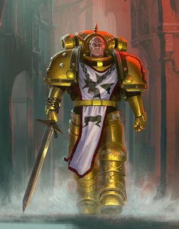
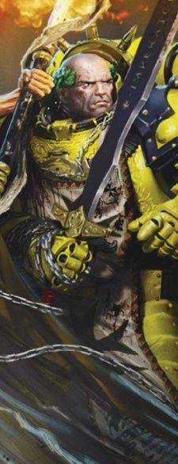
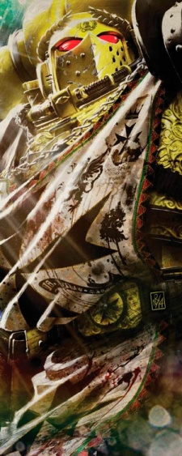
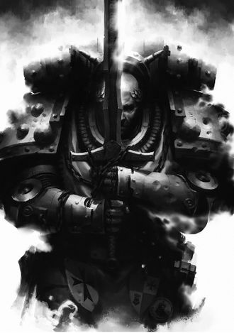
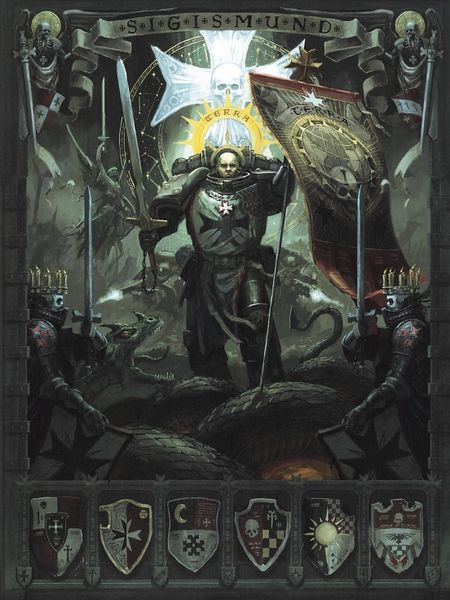
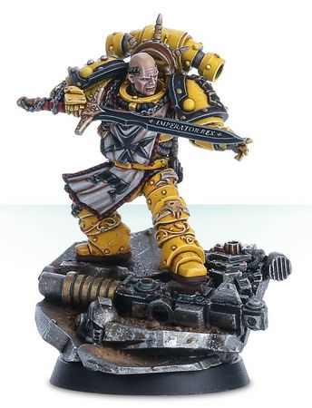

# 0660 西吉斯蒙德 Sigismund

精校状态：中文行文已逐段精校，部分术语仍为暂定

分类：人类帝国 / 帝国之拳

原文来源：https://www.bilibili.com/opus/1198048489773203521

原作者：帝国神选罐头

原文时间：2026年05月03日 12:00

[返回分类目录](目录.md) · [全书目录](../../目录.md)

<!-- A0660-B0001 -->
**英文原文**

Sigismund was the Marshal of the Templars, the First Captain of the Imperial Fists Legion during the Great Crusade, and right-hand man to his Primarch Rogal Dorn. During the Horus Heresy, Dorn appointed Sigismund the first Emperor's Champion, to defend the Imperial Palace during the Battle of Terra. After the Heresy, Sigismund became the founder and first High Marshal of the Black Templars Chapter.

<!-- /A0660-B0001 -->

<!-- A0660-B0002 -->

原译文

西吉斯蒙德是圣殿骑士的元帅，大远征期间帝国之拳军团的第一连长，也是他的原体罗格·多恩的得力助手。在荷鲁斯叛乱期间，多恩任命西吉斯蒙德为第一位帝皇的冠军，在泰拉之战中保卫帝国皇宫。叛乱之后，西吉斯蒙德成为黑色圣堂战团的创始人和第一位至高元帅。

**校订译文**

西吉斯蒙德是大远征时期帝国之拳军团的圣殿元帅兼第一连长，也是原体罗格·多恩的得力助手。荷鲁斯之乱期间，多恩任命他为首位帝皇勇士，守卫泰拉皇宫。叛乱后，他创建黑色圣堂战团，出任首位至高元帅。

**校注：** Emperor’s Champion 依核心已核官译帝皇勇士；大远征 Templars 为军团圣殿组织，不能提前写成后世黑色圣堂战团。

<!-- /A0660-B0002 -->

<!-- A0660-B0003 图片 -->

<!-- A0660-B0004 -->

原译文

Sigismund 西吉斯蒙德

**校订译文**

Sigismund 西吉斯蒙德

<!-- /A0660-B0004 -->

<!-- A0660-B0005 -->
## History 历史

<!-- /A0660-B0005 -->

<!-- A0660-B0006 -->
## Early life 早期生活

<!-- /A0660-B0006 -->

<!-- A0660-B0007 -->
**英文原文**

Sigismund was born during the Unification Wars on Terra, within a city that was later burned down during the conflict. While he escaped the city's destruction, Sigismund was left an orphan and eventually found himself in the Ionus Plateau's refugee camp. Shortly after the Unification Wars were ended, he was among a young group of fellow orphans that were protected by a young girl named Thera. She defended the orphans from the camp's gangs and during an attack by the Corpse Kings, she used a metal bar to cause them to flee. However the orphans knew the Kings would come seeking revenge and they hid in their hideout. As they did so, Nestro, one of the youngest orphans, hoped that the gang would not find them. Thera, though, told him the Kings surely would, but that she would protect the orphans when the gang did. Shortly afterwards, she was proven correct, when the orphans heard the Kings approaching the door to their hideout.

<!-- /A0660-B0007 -->

<!-- A0660-B0008 -->

原译文

西吉斯蒙德出生于泰拉统一战争期间，在一个后来在冲突中被烧毁的城市里。西吉斯蒙德在逃离这座城市的毁灭时，成为了孤儿，最终发现自己身处约纳斯高原的难民营。统一战争结束后不久，他和一群年轻的孤儿一样，受到一个名叫锡拉的年轻女孩的保护。她保护孤儿免受营地帮派的袭击，在死尸之王的袭击中，她用金属棒让他们逃跑。然而，孤儿们知道死尸之王会来复仇，于是躲在他们的藏身之处。当他们这样做的时候，最小的孤儿之一的内斯特罗希望帮派找不到他们。不过，锡拉告诉他，死尸之王肯定会的，但当帮派这样做时，她会保护孤儿。不久之后，当孤儿听到死尸之王走近他们藏身之处的门时，她被证明是正确的。

**校订译文**

西吉斯蒙德生于泰拉统一战争期间，故乡城市后来毁于战火。他虽逃过一劫，却成了孤儿，最终辗转至约纳斯高原难民营。统一战争刚结束时，他与一群孤儿受到少女锡拉保护。她曾用金属棍击退“死尸之王”帮派，但众人知道，对方必来报复，便躲进藏身处。最年幼的孩子之一内斯特罗希望敌人找不到这里，锡拉却说，他们一定会来，而自己会保护大家。不久，孩子们果然听见帮派成员逼近门口的声音。

<!-- /A0660-B0008 -->

<!-- A0660-B0009 图片 -->

<!-- A0660-B0010 -->

原译文

Sigismund 西吉斯蒙德

**校订译文**

Sigismund 西吉斯蒙德

<!-- /A0660-B0010 -->

<!-- A0660-B0011 -->
**英文原文**

Despite being wounded from her last fight with the gang, Thera began to prepare herself to face them once again. As she did so, Thera kneeled and closed her eyes, before she rested her forehead on the metal bar. This was a ritual Thera did before all of her fights, though none of the orphans knew why. Sigismund witnessed this and finally asked Thera why she did it. She did not answer and the Corpse Kings soon called for the orphans to face them. This caused Thera to finally open her eyes and she began to tremble. Thera quickly steadied herself, though, and began to painfully move towards the door. Upon seeing this, the other orphans knew she was still wounded and began to moan in fear. Sigismund knew this as well and tried to stop Thera from leaving. She shook her head, however, and told Sigismund this fight needed to happen. She had hurt the Corpse Kings too badly for the gang to leave the orphans alone. If Thera did not defeat them now, then the Kings would continue to come after the orphans. With that, she walked out of the hideout and closed the door behind her.

<!-- /A0660-B0011 -->

<!-- A0660-B0012 -->

原译文

尽管在上次与帮派的战斗中受伤，锡拉开始准备再次面对他们。当她这样做的时候，锡拉跪下闭上眼睛，然后将额头放在金属棒上。这是锡拉在所有战斗之前都会做的仪式，尽管没有一个孤儿知道为什么。西吉斯蒙德目睹了这一幕，最后问锡拉为什么这样做。她没有回答，死尸之王很快就命令孤儿面对他们。这让锡拉终于睁开了眼睛，她开始发抖。不过，锡拉很快就站稳了，开始痛苦地朝门口走去。看到这一幕，其他孤儿知道她仍然受伤，开始害怕地呻吟起来。西吉斯蒙德也知道这一点，并试图阻止锡拉离开。然而，她摇了摇头，告诉西吉斯蒙德，这场战斗需要发生。她对死尸之王造成的损失太过严重，那帮人不可能放过孤儿。如果锡拉现在不打败他们，那么死尸之王就会继续追捕孤儿。说完，她走出藏身之处，关上了身后的门。

**校订译文**

锡拉上次战斗的伤尚未痊愈，却仍准备迎敌。她跪下闭眼，将额头抵在金属棍上——每次战斗前她都会如此，孤儿们却不知缘故。西吉斯蒙德终于开口询问，她没有回答。门外很快传来死尸之王的叫嚣，逼孩子们出去。锡拉睁眼，身子微颤，随即定住心神，忍痛走向门口。孩子们看出她仍有伤，害怕得低声呜咽。西吉斯蒙德试图拦住她，她却摇头说，这一战非打不可：自己上次把帮派伤得太重，对方不会放过他们；不彻底击败他们，追杀就不会停止。说完，她独自出去，关上了门。

<!-- /A0660-B0012 -->

<!-- A0660-B0013 -->
**英文原文**

Sometime would pass, but eventually the Corpse Kings began calling the orphans to face them once more. None of the fearful orphans did so, until Sigismund began moving towards the door. He was not the eldest of the remaining orphans, nor did Sigismund want to face his death by fighting the gang. Sigismund knew, however, that unless he did so the orphans would be left at the mercy of the gang. After opening the door, he saw Thera's lifeless body nearby. The orphan's protector lay dead in a pool of her own blood, with the metal bat close by her. The leering Kings surrounded them and they asked if Sigismund would kneel or die like Thera did. In answer, the fearful Sigismund kneeled and grabbed Thera's metal bat, causing the gang to begin laughing.

<!-- /A0660-B0013 -->

<!-- A0660-B0014 -->

原译文

一些时间过去了，但最终死尸之王再次开始命令孤儿面对他们。在西吉斯蒙德开始朝门口走去之前，所有害怕的孤儿都没有这样做。他不是剩下的孤儿中年龄最大的，西吉斯蒙德也不想通过与帮派战斗来面对死亡。然而，西吉斯蒙德知道，除非他这样做，否则孤儿将任由帮派摆布。打开门后，他看到锡拉的尸体就在附近。孤儿的保护者死在她自己的血泊中，金属棒就在她身边。死尸之王围住了他们，他们问西吉斯蒙德是否会像锡拉那样跪下或死去。作为回应，恐惧的西吉斯蒙德跪下抓住锡拉的金属棒，这让帮派开始大笑。

**校订译文**

过了一阵，帮派又开始叫孤儿们出来。众人惊惧不动，直到西吉斯蒙德走向门口。他并非剩余孩子中年纪最大者，也不想就这样送死，但他知道，若无人出面，大家就只能任由帮派摆布。打开门，锡拉的尸体近在眼前；保护他们的少女倒在血泊中，金属棍落在旁边。帮派成员狞笑着包围他，问他是跪地求饶，还是像锡拉一样去死。西吉斯蒙德满心恐惧地跪下，握住金属棍，引来一片哄笑。

<!-- /A0660-B0014 -->

<!-- A0660-B0015 -->
**英文原文**

As they did so, Sigismund closed his eyes and placed his forehead upon the metal bar like he had seen Thera do. This steadied Sigismund's nerves and stopped him from trembling. Seconds later, the Corpse Kings rushed Sigismund, but he miraculously beat them back and protected the orphans from Thera's killers. Sigismund later became Space Marine of the Imperial Fists Legion and he continued to use Thera's ritual, throughout his service to the Imperium. As an Aspirant Sigismund would come to meet his longtime comrade Fafnir Rann.

<!-- /A0660-B0015 -->

<!-- A0660-B0016 -->

原译文

当他们这样做的时候，西吉斯蒙德闭上眼睛，把额头放在金属棒上，就像他看到锡拉做的一样。这稳定了西吉斯孟德的神经，阻止了他颤抖。几秒钟后，死尸之王冲向西吉斯蒙德，但他奇迹般地击退了他们，保护孤儿免受杀死锡拉的人的伤害。西吉斯蒙德后来成为帝国之拳军团的星际战士，在为帝国服役的整个过程中，他继续使用锡拉的仪式。作为一个有志者，西吉斯蒙德会来见他的长期战友法夫尼尔·兰恩。

**校订译文**

西吉斯蒙德闭上眼，将额头抵在棍上，如锡拉曾经做的那样。他稳住心神，不再颤抖。几秒后，死尸之王扑来，他却奇迹般将他们击退，保护孤儿免受杀害锡拉之人的毒手。后来，他成为帝国之拳星际战士，在漫长服役生涯中始终保留这套仪式。在候选者时期，他还结识了日后的长期战友法夫尼尔·兰恩。

<!-- /A0660-B0016 -->

<!-- A0660-B0017 -->
## The Great Crusade 大远征

<!-- /A0660-B0017 -->

<!-- A0660-B0018 -->
**英文原文**

Sometime later, Sigismund became an Imperial Fist and 12 years after he defeated the Corpse Kings, he was selected to join the Legion's Templar Brethren. Sigismund was among the youngest in the Imperial Fists' history for the honour and he received his training under the Templar's Weapon Smith Appius. During their training together, Appius knew that Sigismund was a great warrior, who would become a Templar and potentially more. After telling the young Imperial Fist this, however, Appius then asked Sigismund what he fought for. All Imperial Fists never took a step backwards, in their fight for the Imperium, but each had their own reason for doing so. The question caused Sigismund to think back to when the Corpse Kings had Thera's frightened orphans surrounded. Sigismund then answered Appius, that his reason was to protect those Imperials who were too weak to defend themselves from Mankind's foes. This answer satisfied Appius and Sigismund would go on to join the Templars.

<!-- /A0660-B0018 -->

<!-- A0660-B0019 -->

原译文

过了一段时间，西吉斯蒙德成为帝国之拳，在击败死尸之王12年后，他被选中加入了军团的圣殿兄弟会。西吉斯蒙德是帝国之拳历史上最年轻的获得这一荣誉的人之一，他在圣殿骑士的武器铁匠阿庇乌斯的指导下接受了训练。在他们一起训练期间，阿庇乌斯知道西吉斯蒙德是一位伟大的战士，他将成为圣殿骑士，甚至可能更多。然而，在告诉年轻的帝国之拳后，阿庇乌斯问西吉斯蒙德他为什么而战。所有帝国之拳在为了帝国的战斗中从未后退一步，但每个人都有自己的理由这样做。这个问题让西吉斯蒙德回想起死尸之王把锡拉的受惊的孤儿包围起来的时候。西吉斯蒙德随后回答阿庇乌斯，他的理由是保护那些太弱小而无法抵御人类之敌的帝国人。这个答案让阿庇乌斯和西吉斯蒙德感到满意，他们将继续加入圣殿骑士。

**校订译文**

击退死尸之王十二年后，已加入帝国之拳的西吉斯蒙德获选接受圣殿兄弟会的训练，是军团史上获此殊荣最年轻的战士之一。武器匠阿庇乌斯教导他，并看出他必将成为优秀圣殿战士，甚至取得更高成就。但阿庇乌斯也问他：究竟为何而战？帝国之拳人人为帝国奋战、绝不后退，理由却各不相同。西吉斯蒙德想起锡拉留下的孩子们被帮派包围的情景，回答说，自己要保护无力抵抗人类之敌的帝国人民。阿庇乌斯满意于此；西吉斯蒙德后来正式加入圣殿兄弟会。

**校注：** 末句 satisfied Appius and Sigismund would go on 的 and 连接两件事，原译误成师徒二人都满意、一起加入组织。

<!-- /A0660-B0019 -->

<!-- A0660-B0020 图片 -->

<!-- A0660-B0021 -->

原译文

First Captain Sigismund 第一连长西吉斯蒙德

**校订译文**

First Captain Sigismund 第一连长西吉斯蒙德

<!-- /A0660-B0021 -->

<!-- A0660-B0022 -->
**英文原文**

He would rise through their ranks and when a new First Captain for the Templars was needed, Sigismund put himself forward as a potential successor. This required him to undergo a combat ritual, where he would face 200 hundred Templars in one on one combat. He would need to defeat them one after another, with no respite, if he wanted to become their leader. As the ritual began, Sigismund first defeated, Anaxsus and then Ecturo. What followed afterwards, felt like a blur to Sigismund as he defeated one Templar after another. Eventually he defeated Calivar, his 199th challenger, before Sigismund faced his last foe: Appius. By then, however, the former Weapon Master was now interred within a Contemptor Dreadnought and Sigismund was at his physical limits. This combined with the Dreadnought's size and strength, nearly allowed Appius to defeat Sigismund. After being struck down by Appius, Sigismund found himself to be accepting of his failure. He had not undergone the ritual for honour and rank, as they were not what drove him on. They were just a consequence of Sigismund's desire to face and fight fate. To not take one step backwards. If he could not now stand and win the trial, then Sigismund felt he deserved to lose.

<!-- /A0660-B0022 -->

<!-- A0660-B0023 -->

原译文

他将在他们的队伍中崛起，当需要一位新的圣殿骑士第一连长时，西吉斯蒙德提出自己作为潜在的继任者。这要求他接受一个战斗仪式，在那里他将在一对一的战斗中面对200名圣殿骑士。如果他想成为他们的领袖，他需要一个接一个地击败他们，没有喘息的机会。仪式开始时，西吉斯蒙德首先击败了阿纳克苏斯，然后是艾克图罗。西吉斯蒙德击败了一个又一个圣殿骑士，随后发生的事情对他来说就像一团迷雾。最终，他击败了他的第199位挑战者卡利瓦尔，然后西吉斯蒙德面对了他的最后一个敌人：阿庇乌斯。然而，在那时，这位前武器大师已经被安置在一架蔑视者无畏内，西吉斯蒙德已经到了身体极限。再加上无畏的规模和力量，阿庇乌斯几乎击败了西吉斯蒙德。在被阿庇乌斯击倒后，西吉斯蒙德发现自己正在接受自己的失败。他没有经历过荣誉和地位的仪式，因为这些仪式并不是他前进的动力。它们只是西吉斯蒙德渴望面对和对抗命运的结果。不要后退一步。如果他现在不能站起来赢得试炼，那么西吉斯蒙德觉得他应该输。

**校订译文**

西吉斯蒙德逐级晋升，圣殿需要新任第一连长时，他主动参选。候选人必须完成战斗仪式，连续单挑两百名圣殿战士，毫无休息。他先击败阿纳克苏斯，再击败艾克图罗，之后一场接一场，记忆渐成模糊片段。战胜第一百九十九名对手卡利瓦尔后，最后出现的是阿庇乌斯——昔日导师如今已被安置进蔑视者无畏机甲。西吉斯蒙德体力耗尽，面对机甲庞大的体型与力量，几乎无法取胜。被击倒后，他一度接受失败。他参加试炼并非贪求荣誉和地位；这些只是他对抗命运、绝不后退的结果。若此刻站不起身赢下试炼，他便觉得自己理应落败。

**校注：** 英文 200 hundred 重复计数词，后文明确第199名与最后一名，故按两百处理；无畏机甲也是最后一个对手，不另加为第201个。

<!-- /A0660-B0023 -->

<!-- A0660-B0024 -->
**英文原文**

At that moment, though, Sigismund heard a voice asking:

<!-- /A0660-B0024 -->

<!-- A0660-B0025 -->

原译文

然而，就在那一刻，西吉斯蒙德听到一个声音问道：

**校订译文**

然而，就在那一刻，西吉斯蒙德听到一个声音问道：

<!-- /A0660-B0025 -->

<!-- A0660-B0026 -->

原译文

But who if not you? Who will stand if you will not? Who will you let die in your place? 但如果不是你，会是谁？如果你不愿意，谁会站起来？你会让谁代替你死？

**校订译文**

But who if not you? Who will stand if you will not? Who will you let die in your place? 但如果不是你，会是谁？如果你不愿意，谁会站起来？你会让谁代替你死？

<!-- /A0660-B0026 -->

<!-- A0660-B0027 -->
**英文原文**

He had no idea, who had spoken, as it could have been his own voice, Appius', or even Thera's. Regardless of who had spoken, though, the voice's question caused Sigismund to rise and dodge a blow from Appius, that would have finished him. Despite being heavily wounded, Sigismund was able to move quickly and disable Appius' Dreadnought. With that, Sigismund defeated 200 Templars and his Primarch, Rogal Dorn, was there to witness this. Dorn then proclaimed Sigismund to be the Templars' new First Captain and presented him with the relic power sword Imperator Rex. Sigismund accepted it and as he looked upon his fellow Templars, he felt as if he could taste the dust of the Ionus plateau. Sigismund then began Thera's ritual, by kneeling with the Imperator Rex in his hands, and closing his eyes, before placing his forehead on the power sword.

<!-- /A0660-B0027 -->

<!-- A0660-B0028 -->

原译文

他不知道是谁在说话，因为这可能是他自己的声音，阿庇乌斯的，甚至是锡拉的。不过，不管是谁在说，这个声音的问题都让西吉斯蒙德站起来躲避阿庇厄斯的猛击，否则他就完了。尽管西吉斯蒙德身负重伤，但他仍能迅速行动，使阿皮乌斯的无畏失效。就这样，西吉斯蒙德击败了200名圣殿骑士，他的原体罗格·多恩也在场见证了这一刻。多恩随后宣布西吉斯蒙德为圣殿骑士的新任第一连长，并向他赠送了圣物动力剑统御君主。西吉斯蒙德接受了这一点，当他看着他的圣殿骑士同伴时，他觉得自己仿佛能尝到约纳斯高原的尘土。西吉斯蒙德随后开始了锡拉的仪式，双手握着统御君主跪下，闭上眼睛，然后将额头放在动力剑上。

**校订译文**

他不知道声音属于谁，也许是自己，也许是阿庇乌斯，甚至是锡拉。但这个问题让他再次起身，闪过本将终结试炼的一击。虽然伤势严重，他仍迅速行动，使阿庇乌斯的无畏机甲失去战斗能力。两百名圣殿战士尽数败北，罗格·多恩亲眼见证，宣布他为新任第一连长，赐予圣物动力剑“统御君主”。接过宝剑、望向同袍时，西吉斯蒙德仿佛又尝到约纳斯高原的尘土。他握剑跪地，闭上眼，将额头抵在剑身上，再次行起锡拉的仪式。

<!-- /A0660-B0028 -->

<!-- A0660-B0029 -->
**英文原文**

During the Astranii Campaign, Sigismund was the sole survivor of an ambush early in the conflict by the Astranii Machine Empire. After rescue, he gave his briefing on the Astranii and their perceived weaknesses to not only Dorn but also Horus Lupercal and Ferrus Manus. A dispute arose between Ferrus and Dorn over what should be done with the Astranii, with the former wishing for their total destruction as Hereteks while the latter wished for their assimilation into the Imperium. Due to the intervention of Horus, it was agreed that the matter would be settled once the fighting was over. Thus after the war Ferrus demanded his honour satisfied, and Sigismund battled the Iron Hands Centurion champion Thos in an duel. After a difficult battle Sigismund was able to defeat Thos, but the warrior refused to yield. It was then Ferrus stated that the warrior would never yield unless ordered to, and asked Sigismund if he was willing to spill the blood of his fellow Astartes. Sigismund replied that he would not do so in something so petty as an honour duel. Ferrus agreed, and ordered Thos to yield.

<!-- /A0660-B0029 -->

<!-- A0660-B0030 -->

原译文

在阿斯特拉尼战役期间，西吉斯蒙德是阿斯特拉尼机械帝国在冲突早期伏击的唯一幸存者。营救后，他不仅向多恩，还向荷鲁斯·卢佩卡尔和费鲁斯·马努斯介绍了阿斯特拉尼及其弱点。费鲁斯和多恩之间就应该如何处理阿斯特拉尼产生了争议，前者希望将他们作为技术异端彻底毁灭，而后者则希望将他们同化到帝国中。由于荷鲁斯的干预，双方同意战斗结束后解决此事。因此，战争结束后，费鲁斯要求他的荣誉得到满足，西吉斯蒙德与钢铁之手百夫长冠军托斯决斗。经过一场艰难的战斗，西吉斯蒙德击败了拖斯，但这位战士拒绝屈服。就在那时，费鲁斯说，除非接到命令，否则战士永远不会屈服，并问西吉斯蒙德是否愿意让他的阿斯塔特同胞流血。西吉斯蒙德回答说，他不会在荣誉决斗这样小的事情上这样做。费鲁斯同意了，命令托斯屈服。

**校订译文**

阿斯特拉尼战役初期，西吉斯蒙德成为机械帝国一次伏击中的唯一幸存者。获救后，他向多恩、荷鲁斯·卢佩卡尔及费鲁斯·马努斯报告敌情与可能的弱点。多恩与费鲁斯对阿斯特拉尼的处置产生分歧：费鲁斯欲将这些技术异端彻底灭绝，多恩则希望纳入帝国。在荷鲁斯协调下，双方同意战后再议。战事结束，费鲁斯要求维护自身荣誉，于是西吉斯蒙德与钢铁之手的百夫长冠军托斯决斗。激战后，西吉斯蒙德取胜，托斯却拒绝认输。费鲁斯说，若无命令，这名战士绝不投降，又问西吉斯蒙德是否真愿让阿斯塔特同胞流血。西吉斯蒙德回答，不会为荣誉决斗这等小事杀死同袍。费鲁斯认同，遂命托斯认输。

<!-- /A0660-B0030 -->

<!-- A0660-B0031 -->
**英文原文**

After becoming the Templars' First Captain, Sigismund also became an Adjutant to his Primarch Rogal Dorn, during the Great Crusade. As the Great Crusade was fought, Sigismund demonstrated a cold, realist view of the future of the Imperium. While conversing with Captains Garviel Loken and Tarik Torgaddon of the Luna Wolves, he stated his belief that the Great Crusade would never end:

<!-- /A0660-B0031 -->

<!-- A0660-B0032 -->

原译文

在成为圣殿骑士的第一连长后，西吉斯蒙德在大远征期间还成为了他的原体罗格·多恩的副官。随着大远征的进行，西吉斯蒙德对帝国的未来表现出了冷酷、现实的看法。在与影月苍狼的加维尔·洛肯和塔里克·托加顿连长交谈时，他表示相信大远征永远不会结束：

**校订译文**

在成为圣殿骑士的第一连长后，西吉斯蒙德在大远征期间还成为了他的原体罗格·多恩的副官。随着大远征的进行，西吉斯蒙德对帝国的未来表现出了冷酷、现实的看法。在与影月苍狼的加维尔·洛肯和塔里克·托加顿连长交谈时，他表示相信大远征永远不会结束：

<!-- /A0660-B0032 -->

<!-- A0660-B0033 -->

原译文

We will spend our lives fighting to secure this Imperium, and then I fear we will spend the rest of our days fighting to keep it intact... In the far future, there will be only war. 我们将用我们一生的战斗来保卫这个帝国，然后我担心我们将用余生的战斗来保卫它的完整...在遥远的未来，只会有战争。

**校订译文**

We will spend our lives fighting to secure this Imperium, and then I fear we will spend the rest of our days fighting to keep it intact... In the far future, there will be only war. 我们将倾尽一生奋战，建立稳固的帝国；而后，恐怕还得用尽余日，为保全它而战……遥远的未来，唯有战争。

<!-- /A0660-B0033 -->

<!-- A0660-B0034 -->
**英文原文**

He also delivered a striking statement on the nature of the Imperium, perhaps even the nature of man:

<!-- /A0660-B0034 -->

<!-- A0660-B0035 -->

原译文

他还就帝国的性质，甚至是人类的天性发表了引人注目的声明：

**校订译文**

他还就帝国的性质，甚至是人类的天性发表了引人注目的声明：

<!-- /A0660-B0035 -->

<!-- A0660-B0036 -->

原译文

Space is limitless, and so is our appetite to master it. 空间是无限的，我们掌握它的欲望也是无限的。

**校订译文**

Space is limitless, and so is our appetite to master it. 宇宙没有边界，我们征服它的欲望也永无止境。

<!-- /A0660-B0036 -->

<!-- A0660-B0037 -->
**英文原文**

At some point prior to the Horus Heresy, the Imperial Fists and World Eaters served together for a significant period of time. During their campaigns, Assault Captain Khârn and Sigismund became close comrades, even going as far to refer to one another as "Oath Brothers". It was during their frequent duels in the cages of the World Eaters' flagship, the Conqueror, that Sigismund earned the name the "Black Knight" and adopted the custom of binding his weapons to his wrists with chains from Khârn (after a duel with the Primarch Angron. This custom would later be adopted by members of the Black Templars.

<!-- /A0660-B0037 -->

<!-- A0660-B0038 -->

原译文

在荷鲁斯叛乱之前的某个时候，帝国之拳和吞世者一起服役了很长一段时间。在他们的战役中，突击连长卡恩和西吉斯蒙德成为亲密的战友，甚至称对方为“誓言兄弟”。正是在他们经常在吞世者旗舰征服者号的笼子里决斗期间，西吉斯蒙德获得了“黑骑士”之名，并采用了用卡恩的用锁链将武器绑在手腕上的习惯（在与原体安格隆决斗后）。这一习惯后来被黑色圣堂成员采用。

**校订译文**

叛乱前，帝国之拳曾与吞世者长期共同作战。西吉斯蒙德与突击连长卡恩结为挚友，互称“誓言兄弟”。两人经常在吞世者旗舰征服者号的角斗笼里切磋，西吉斯蒙德由此获称“黑骑士”，并在与安格隆的一场较量后，学来卡恩以锁链将武器缚于腕上的习惯。这个习惯后来也被黑色圣堂继承。

**校注：** 源文在 Angron 前括号未闭合，中文顺句处理，英文保留。锁链习俗学自卡恩，并非一定使用卡恩本人的某条锁链。

<!-- /A0660-B0038 -->

<!-- A0660-B0039 -->
**英文原文**

Later during the Cheraut campaign, Sigismund alongside his trusted lieutenant Fafnir Rann would become horrified by the brutal behavior of the Night Lords. After a heated verbal exchange with the Night Lords commander Sevatar, Sigismund launched a surprise blow which was blocked by the Captain. Sigismund and Sevatar subsequently agreed to a duel to end their disputes, with the rule being only blows with weapons were allowed and it would end when one warrior yielded. After a fierce battle, Sevatar violated the rules of the duel by headbutting Sigismund in the face. Though Sevatar forfeited the battle by his act, he stated that he had nonetheless won and Sigismund should always remember there is no honour in war.

<!-- /A0660-B0039 -->

<!-- A0660-B0040 -->

原译文

在切劳特战役的后期，西吉斯蒙德和他信任的副官法夫尼尔·兰恩对午夜领主的残酷行为感到震惊。在与午夜领主指挥官赛维塔进行了激烈的口头交流后，西吉斯蒙德发动了一次突袭，但被连长阻止了。西吉斯蒙德和赛维塔随后同意决斗以结束他们的争端，规则是只允许用武器击打，当一名战士屈服时，决斗就会结束。经过一场激烈的战斗，赛维塔违反了决斗规则，用头撞了西吉斯蒙德的脸。尽管赛维塔因其行为而放弃了这场战斗，但他表示自己还是赢了，西吉斯蒙德应该永远记住战争中没有荣誉。

**校订译文**

后来的切劳特战役中，西吉斯蒙德与亲信副官法夫尼尔·兰恩为午夜领主的残暴所震惊。他与对方指挥官赛维塔激烈争吵后突然出手，却被挡住。两人随后约定以决斗解决争端，只能使用武器攻击，直到一方认输。激战中，赛维塔违规以头撞击西吉斯蒙德的面部，因此被判负；他却声称自己仍是赢家，并让西吉斯蒙德永远记住：战争中没有荣誉。

**校注：** 本篇 Cheraut 与659 Chernaut 可能是同战役异拼，但暂不凭近似强行合并；分别保留沿稿译名并待核。Sevatar 因违规被判负，不是主动认输。

<!-- /A0660-B0040 -->

<!-- A0660-B0041 -->
## The Horus Heresy 荷鲁斯之乱

原题：The Horus Heresy 荷鲁斯叛乱

<!-- /A0660-B0041 -->

<!-- A0660-B0042 -->
**英文原文**

It was Sigismund who led the squad of marines that accompanied Rogal Dorn in a boarding action on the Eisenstein, under the command of Battle-Captain Nathaniel Garro of the Death Guard, bringing word of Horus’s rebellion.

<!-- /A0660-B0042 -->

<!-- A0660-B0043 -->

原译文

西吉斯蒙德率领战士小队，在死亡守卫连长纳撒尼尔·伽罗的指挥下，陪同罗格·多恩登上爱森斯坦号，带来了荷鲁斯叛乱的消息。

**校订译文**

携荷鲁斯之乱消息而来的爱森斯坦号，由死亡守卫战斗连长纳撒尼尔·伽罗指挥。西吉斯蒙德率一队战士，陪同多恩登上该舰。

**校注：** under command of Garro 修饰爱森斯坦号，原译错把西吉斯蒙德/多恩置于伽罗指挥之下；报信者也为该舰一行。

<!-- /A0660-B0043 -->

<!-- A0660-B0044 图片 -->

<!-- A0660-B0045 -->

原译文

Sigismund honours the fallen Boreas during the Solar War 西吉斯蒙德纪念在太阳战争中牺牲的波瑞亚斯

**校订译文**

Sigismund honours the fallen Boreas during the Solar War 西吉斯蒙德纪念在太阳战争中牺牲的波瑞亚斯

<!-- /A0660-B0045 -->

<!-- A0660-B0046 -->
**英文原文**

Once Dorn had absorbed the news, he ordered Sigismund as his "strong, right arm" to go on a mission to the Isstvan System to assist any surviving loyalists and evaluate the situation. During the time Dorn spent in isolation Sigismund struggled with the dark news, and felt he lacked purpose. He met Euphrati Keeler who told him Horus would, in fact, go to Terra, and that Sigismund would have to choose where to stand. She gave him a vision of the death of the Imperium, as well as his own. One choice would result in his death in space, in the light of an unknown star, forgotten. The other, to war without end. She also told him that his father would need him before the end. His resolve shaken, Sigismund was deeply affected by the conversation. As a result, Sigismund requested that he be allowed to remain at his Primarch's side, and so command of the Retribution Fleet was given instead to another. Dorn did not know why Sigismund made this request, but trusted him and did not question it.

<!-- /A0660-B0046 -->

<!-- A0660-B0047 -->

原译文

多恩得知消息后，命令西吉斯蒙德作为他的“强有力的右臂”前往伊斯塔万星系执行任务，协助任何幸存的忠诚者并评估局势。在多恩与世隔绝的那段时间里，西吉斯蒙德一直在与黑暗的消息作斗争，他觉得自己缺乏目标。他遇到了幼发拉底·基勒，基勒告诉他荷鲁斯实际上会去泰拉，西吉斯蒙德必须选择站在哪里。她给了他一个帝国之死的幻象，以及他自己的幻象。一个选择将导致他在太空中死亡，在一颗未知恒星的照耀下，被遗忘。另一个是无休止的战争。她还告诉他，他的父亲在最后一刻会需要他。西吉斯蒙德的决心动摇了，这次谈话深深地打动了他。因此，西吉斯蒙德要求允许他留在他的原体身边，因此报复舰队的指挥权被交给了另一个人。多恩不知道西吉斯蒙德为什么提出这个要求，但信任他，没有质疑。

**校订译文**

多恩接受噩耗后，命令自己的“有力右臂”西吉斯蒙德率军前往伊斯塔万，支援忠诚派幸存者、查明情况。多恩闭门独处期间，西吉斯蒙德也被噩耗压得失去方向。他遇见尤弗拉蒂·琪乐；她预言荷鲁斯将攻向泰拉，而西吉斯蒙德必须决定自己站在哪里。她向他展示帝国与他自身覆灭的异象：一种选择，是在陌生恒星光芒下葬身太空、无人铭记；另一种，则是永无终结的战争。她又说，多恩将在终局到来前需要他。这番话动摇了他的决心。他请求留在原体身边，于是惩戒舰队改由别人指挥。多恩不知真正缘由，却信任他，没有追问。

**校注：** Retribution Fleet 暂用惩戒舰队，非单纯复仇情绪；若前文已有特定全舰名以主审统一为准。

<!-- /A0660-B0047 -->

<!-- A0660-B0048 -->
**英文原文**

Sigismund led four companies of Imperial Fists on a mission to secure resources from the forges at Mondus Occulam and Mondus Gamma on Mars. Enemy resistance was too intense to maintain control, and Sigismund's mission was to evacuate as much material and personnel as possible then withdraw from the planet. Upon hearing the news of the Isstvan V Massacre, Dorn ordered Sigismund to purge the Terra solar system of all remnants of the traitor legions.

<!-- /A0660-B0048 -->

<!-- A0660-B0049 -->

原译文

西吉斯蒙德带领四个帝国之拳连队执行任务，从火星上的世界之眼和蒙杜斯·伽玛的铸造厂获取资源。敌人的抵抗过于激烈，无法维持控制，西吉斯蒙德的任务是尽可能多地撤离物资和人员，然后从行星上撤离。听到伊斯塔万五号大屠杀的消息后，多恩命令西吉斯蒙德清除泰拉太阳系中所有叛徒军团的残余。

**校订译文**

西吉斯蒙德率帝国之拳四个连前往火星，从世界之眼与蒙杜斯·伽马铸造厂抢运资源。敌军抵抗过于猛烈，无法长期占领，他便尽力撤出物资与人员，随后离开行星。伊斯塔万五号大屠杀的消息传来后，多恩命他清除太阳系内的叛军残余。

<!-- /A0660-B0049 -->

<!-- A0660-B0050 -->
**英文原文**

Soon after his return to Terra, Sigismund confessed to Dorn his reasons for asking to remain on Terra rather than command the Retribution Fleet. Dorn became enraged, and rebuked Sigismund. He showed Sigismund why he had erred out of pride, and that his error was not unlike the pride that drive some of the Primarchs to rebellion. Shamed, Sigismund offered his life to his father, but the Primarch declined to take it. He retained Sigismund as his First Company Captain to avoid demoralizing the men, but disowned Sigismund as a son.

<!-- /A0660-B0050 -->

<!-- A0660-B0051 -->

原译文

回到泰拉后不久，西吉斯蒙德向多恩坦白了他要求留在泰拉而不是指挥报复舰队的原因。多恩怒不可遏，斥责西吉斯蒙德。他向西吉斯蒙德展示了他为什么因为骄傲而犯错，他的错误与驱使一些原体叛乱的骄傲并无二致。西吉斯蒙德感到羞愧，将自己的生命献给父亲，但原体拒绝接受。他保留了西吉斯蒙德作为第一连长，以避免士气低落，但作为子嗣与西吉斯蒙德断绝了关系。

**校订译文**

返抵泰拉不久，西吉斯蒙德向多恩坦白不愿指挥惩戒舰队、请求留下的真正原因。多恩大怒，斥责他因骄傲犯错，与那些被骄傲驱使而叛变的原体并无不同。西吉斯蒙德羞愧地请父亲处死自己，多恩却拒绝。为免损及士气，他仍保留其第一连长职务，却不再承认他是自己的儿子。

<!-- /A0660-B0051 -->

<!-- A0660-B0052 -->
**英文原文**

Later, Sigismund was placed in command of the outermost defences of the Sol System during the Solar War. He led a fleet which battled the Alpha Legion during the Battle of Pluto. During the final phase of the Solar War shortly before the Siege of Terra, Sigismund commanded against a massive traitor assault from the Frigate Lachrymae. During this second battle at Pluto, Sigismund dueled Horus Aximand as he boarded the Lachrymae. During the battle, his Templars fought alongside him against Aximand's warriors, resulting in the death of Lieutenant Boreas. Though wounded and forced to teleport away aboard the nearby vessel Persphone, Sigismund was able to cut off Aximand's hand before his departure. He led a retreat from Pluto, later reuniting with Dorn as he battled Samus aboard the Phalanx. Together, they moved to Terra in preparation for Horus' final attack.

<!-- /A0660-B0052 -->

<!-- A0660-B0053 -->

原译文

后来，西吉斯蒙德在太阳战争期间被任命为太阳系最外层防御的指挥官。在冥王星之战中，他率领一支舰队与阿尔法军团作战。在泰拉围城之前不久的太阳战争的最后阶段，西吉斯蒙德指挥了一艘护卫舰泪滴号对抗大规模叛徒袭击。在冥王星的第二次战斗中，西吉斯蒙德与荷鲁斯·阿西曼德在跳帮泪滴号时决斗。在战斗中，他的圣殿骑士与他并肩作战，对抗阿西曼德的战士，导致副官波瑞亚斯死亡。尽管西吉斯蒙德受伤并被迫乘坐附近的珀耳塞福涅号战舰远程传送，但他还是在离开前切断了阿西曼德的手。他率领部队从冥王星撤退，后来在山阵号上与萨姆斯作战时与多恩重聚。他们一起转移到了泰拉，为荷鲁斯的最后一次进攻做准备。

**校订译文**

太阳战争中，西吉斯蒙德负责太阳系最外层防线，率舰队在冥王星对抗阿尔法军团。泰拉围城前的最后阶段，他在护卫舰泪痕号上指挥，迎战叛军大举进攻。第二次冥王星之战中，荷鲁斯·阿西曼德登上泪痕号，两人随即决斗。圣殿战士在旁迎战阿西曼德部下，副官波瑞亚斯阵亡。西吉斯蒙德受伤，被迫传送到附近的珀耳塞福涅号，却在离开前斩下阿西曼德一只手。他率军撤出冥王星，后来在山阵号迎战萨姆斯时与多恩会合，一同返回泰拉，准备迎接荷鲁斯的最终进攻。

**校注：** 登上泪痕号的是阿西曼德；西吉斯蒙德原本以该舰指挥。传送目的地为珀耳塞福涅号，而非乘该舰才启动传送。

<!-- /A0660-B0053 -->

<!-- A0660-B0054 -->
### Terra 泰拉

<!-- /A0660-B0054 -->

<!-- A0660-B0055 -->
**英文原文**

During the Siege of Terra Sigismund acted as a major loyalist commander but continued to be under Dorn's close scrutiny. He met with Euphrati Keeler inside the Imperial Palace, who stated that the Emperor intended for him to slay Abaddon in order to prevent the ultimate victory of Chaos. This prophecy tempted Sigismund later during the battle for the Lion's Gate Spaceport, where he saw Abaddon's banner and had to chose between challenging the Sons of Horus First Captain or instead overseeing a withdrawal of his forces in the face of certain defeat. Sigismund instead chose to help his men retreat. Later during the final battle for the Spaceport Sigismund battled Khârn, and while the First Captain was the superior swordsman he could not match the World Eater, who was surging with the powers of Khorne. Sigismund faced defeat, but was saved by Dorn himself. Later during the fight for Saturnine Gate, Sigismund led the defense of the walls against the whole of the Emperor's Children. During the fight he was assailed by Fulgrim himself, proving skilled as a fight but utterly outmatched by the Daemon Primarch. As Fulgrim moved to finish Sigismund, he was saved by the intervention of Rogal Dorn. Primarch and his son managed to next hold off Fulgrim's elite guard, with Sigismund himself throwing Eidolon from the walls of the Palace.

<!-- /A0660-B0055 -->

<!-- A0660-B0056 -->

原译文

在泰拉围城期间，西吉斯蒙德担任主要的忠诚派指挥官，但仍受到多恩的密切监视。他在帝国皇宫内会见了幼发拉底·基勒，基勒表示，帝皇打算让他杀死阿巴顿，以防止混沌的最终胜利。这一预言后来在狮门太空港的战斗中诱惑了西吉斯蒙德，在那里他看到了阿巴顿的旗帜，不得不在挑战荷鲁斯之子第一连长或在面对某些监督他的部队失败时的撤军之间做出选择。西吉斯蒙德反而选择帮助他的部下撤退。后来，在太空港的最后一场战斗中，西吉斯蒙德与卡恩战斗，虽然第一连长是一名优秀的剑士，但他无法与吞世者匹敌，后者正凭借激增的恐虐力量。西吉斯蒙德面临失败，但被多恩救了出来。后来在争夺土星之门的战斗中，西吉斯蒙德领导了城墙的防御，以对抗整个帝皇之子。在战斗中，他遭到了福格瑞姆本人的攻击，证明了自己的战斗技巧，但完全被恶魔原体击败。当福格瑞姆着手终结西吉斯蒙德时，他被罗格·多恩的干预所救。接下来，原体和他的子嗣设法击退了福格瑞姆的精锐卫队，西吉斯蒙德亲自将艾多隆从皇宫的墙上扔了下去。

**校订译文**

泰拉围城期间，西吉斯蒙德是忠诚派主要指挥官之一，却仍受到多恩严密审视。他在皇宫见到琪乐，听她说帝皇要他杀死阿巴顿，避免混沌最终获胜。狮门太空港之战中，他看见阿巴顿旗帜，预言令他心动：是挑战荷鲁斯之子第一连长，还是面对必败局面，组织部下撤退？他最终选择后者。太空港最后决战时，他迎战卡恩；虽剑术更胜一筹，却敌不过受恐虐力量加持的吞世者，幸由多恩救下。后来，他在土星之门率守军抵御帝皇之子全军，遭福格瑞姆亲自攻击。他虽武艺高强，却完全无法抗衡恶魔原体，险遭斩杀，再度被多恩救下。父子联手挡住福格瑞姆精锐卫队，西吉斯蒙德还亲手将艾多隆掷下宫墙。

<!-- /A0660-B0056 -->

<!-- A0660-B0057 -->
**英文原文**

Ultimately during the Siege Sigismund became known as the Emperor's Champion and was a hero to the growing religious cults on the planet that resisted the traitors. By this point Sigismund had become a dour and embittered figure, not speaking to those he battled and mercilessly delivering death wherever he could. Wielding his Black Sword given to him at the Emperor's own orders, Sigismund slew such champions as Indras Archeta of the Sons of Horus and even Khârn of the World Eaters. After besting Khârn, Sigismund expressed his desire for an uncorrupted foe to test himself again and sought out First Captain Ezekyle Abaddon. When Rogal Dorn accompanied the Emperor of Mankind and Sanguinius in boarding Horus's flagship, he left most of his Imperial Fists behind to look to the defense of the Imperial Palace. Considering him his finest soldier, Dorn placed Sigismund as the leader of the ground forces until Dorn returned. Sigismund and Rann both then became held up in the Bhab Bastion as it was besieged by the traitors.

<!-- /A0660-B0057 -->

<!-- A0660-B0058 -->

原译文

最终，在围城期间，西吉斯蒙德被称为帝皇的冠军，是这个行星上抵抗叛徒的日益壮大的宗教教派的英雄。在那时，西吉斯蒙德已经变成了一个阴沉而痛苦的人物，他不和那些与他作战的人说话，并在任何可能的地方无情地传递死亡。西吉斯蒙德挥舞着帝皇下令赐予他的黑剑，杀死了荷鲁斯之子的因德拉斯·阿切塔，甚至吞世者的卡恩冠军。在击败了卡恩之后，西吉斯蒙德表达了他希望一个未腐化的敌人再次考验自己的愿望，并找到了第一连长以泽凯尔·阿巴顿。当罗格·多恩陪同人类帝皇和圣吉列斯登上荷鲁斯的旗舰时，他留下了大部分的帝国之拳来保卫帝国皇宫。多恩认为西吉斯蒙德是他最好的士兵，因此任命他为地面部队的领袖，直到多恩回来。西吉斯蒙德和兰恩随后都被困在巴布堡垒，因为它被叛徒围困了。

**校订译文**

围城期间，西吉斯蒙德终以帝皇勇士之名闻世，成为泰拉上日益壮大、奋力抵抗叛军的宗教信众心中的英雄。此时，他已沉郁而苦涩，不向敌人多言，只毫不留情地施予死亡。他挥舞奉帝皇之命赐下的黑剑，杀死荷鲁斯之子的因德拉斯·阿切塔等敌方勇士，乃至吞世者卡恩。击败卡恩后，他希望找一个尚未受腐化加持的对手检验自己，转而寻找第一连长以泽凯尔·阿巴顿。多恩随帝皇及圣吉列斯登上荷鲁斯旗舰时，将大部帝国之拳留守皇宫，并把地面部队交给自己认定最优秀的战士西吉斯蒙德，直到自己归来。本段还记载，西吉斯蒙德与兰恩被叛军围困在巴布堡垒。

**校注：** seeking out 阿巴顿指寻找，未在此战期间已经找到。段末巴布堡垒围攻排在登舰之后，与659先陷落后登舰的顺序不合，按本篇分述并标疑。

<!-- /A0660-B0058 -->

<!-- A0660-B0059 -->
**英文原文**

After the fall of Bhab Bastion, Sigismund led his Templars and other survivors in the madness that had become the Imperial Palace. During the fighting, Sigismund rescued Euphrati Keeler and her refugees from a group of Sons of Horus. Sigismund led the party to the Hollow Mountain, slaying the Death Guard commander Skulidas Gehrerg. After arriving at their new refuge, where Sigismund and the others began a last stand alongside Corswain, The Lord Cypher, and Dark Angels against a furious Death Guard assault led by Typhus.

<!-- /A0660-B0059 -->

<!-- A0660-B0060 -->

原译文

巴布堡垒陷落后，西吉斯蒙德带领他的圣殿骑士和其他疯狂的幸存者到了帝国皇宫。在战斗中，西吉斯蒙德从一群荷鲁斯之子手中救出了幼发拉底·基勒和她的难民。西吉斯蒙德率领队伍前往空心山脉，杀死了死亡守卫指挥官斯库利达斯·格赫尔格。抵达新避难所后，西吉斯蒙德和其他人在那里与考斯韦恩、赛弗领主和黑暗天使一起开始了最后的抵抗，以对抗由泰丰斯领导的死亡守卫的猛烈袭击。

**校订译文**

巴布堡垒陷落后，西吉斯蒙德率圣殿战士与其他幸存者，在已陷入疯狂的皇宫中奋战。他从荷鲁斯之子手中救下琪乐与难民，带领众人前往空心山脉，途中杀死死亡守卫指挥官斯库利达斯·格赫尔格。抵达新的避难所后，他们与考斯韦恩、塞弗领主及黑暗天使共同作最后抵抗，迎战泰弗斯率领的凶猛攻势。

**校注：** madness 修饰皇宫整体局势，非幸存者全已发疯。此处 Lord Cypher 为历史职衔人物，不据同名词认定后世塞弗。

<!-- /A0660-B0060 -->

<!-- A0660-B0061 -->
**英文原文**

During the final battle, Sigismund was at the forefront of the fighting but all seemed lost in the face of Typhus' massive and relentless assault. However Keeler was able to lead a sacrificial prayer amongst the faithful throngs (Sigismund included) that caused a psychic backlash which not only threw back the Death Guard but also reactivated the Astronomican. Immediately following the battle, Sigismund takes part in a prayer to the now-enthroned Emperor alongside Keeler.

<!-- /A0660-B0061 -->

<!-- A0660-B0062 -->

原译文

在最后的战斗中，西吉斯蒙德站在战斗的最前线，但面对泰丰斯的大规模和无情的袭击，一切似乎都输了。然而，基勒能够在忠实的人群（包括西吉斯蒙德）中领导一场祭祀祈祷，这引起了灵能上的反击，不仅击退了死亡守卫，还重新激活了星炬。战斗结束后，西吉斯蒙德立即与基勒一起参加了向现已即位的帝皇的祈祷。

**校订译文**

最后决战中，西吉斯蒙德冲杀在前，但泰弗斯的进攻庞大而无休，战局看似已无可挽回。琪乐率信众——包括西吉斯蒙德——进行牺牲性的祈祷，引发灵能反冲，不仅击退死亡守卫，也重新点亮星炬。战斗刚结束，西吉斯蒙德便与琪乐一道，向已被安置在黄金王座上的帝皇祈祷。

**校注：** enthroned 指安置在黄金王座上，非此时帝皇才登基。

<!-- /A0660-B0062 -->

<!-- A0660-B0063 -->
**英文原文**

After the Traitors retreated from Terra, an enraged Sigismund began a hunt to track down and kill the Sons of Horus First Captain Ezekyle Abaddon. Despite his efforts though, his path to Abaddon was always blocked by Traitors loyal to the First Captain, who then had their lives ended by Sigismund's hands. Sigismund was not deterred by these setbacks though and continued his hunt for genetic cousin for the next several centuries.

<!-- /A0660-B0063 -->

<!-- A0660-B0064 -->

原译文

叛徒从泰拉撤退后，愤怒的西吉斯蒙德开始追捕并杀死荷鲁斯之子第一连长以泽凯尔·阿巴顿。尽管他做出了努力，但他通往阿巴顿的道路总是被忠于第一连长的叛徒封锁，然后他们的生命被西吉斯蒙德之手夺走了。然而，西吉斯蒙德并没有被这些挫折吓倒，在接下来的几个世纪里，他继续寻找基因表亲。

**校订译文**

叛军撤离泰拉后，怒不可遏的西吉斯蒙德踏上追猎之路，决意杀死阿巴顿。但忠于这位第一连长的叛徒总挡在前路，最终纷纷死于他的剑下。西吉斯蒙德毫不退缩，在接下来的数百年继续追寻这名血缘上的远亲。

<!-- /A0660-B0064 -->

<!-- A0660-B0065 -->
### Traitor Champions defeated by Sigismund during the Siege of Terra 在泰拉围城中被西吉斯蒙德击败的叛徒冠军

<!-- /A0660-B0065 -->

<!-- A0660-B0066 -->
**英文原文**

Khârn - World Eaters (killed)

<!-- /A0660-B0066 -->

<!-- A0660-B0067 -->

原译文

卡恩 - 吞世者（被杀）

**校订译文**

卡恩 - 吞世者（被杀）

<!-- /A0660-B0067 -->

<!-- A0660-B0068 -->
**英文原文**

Horus Aximand - Sons of Horus (wounded)

<!-- /A0660-B0068 -->

<!-- A0660-B0069 -->

原译文

荷鲁斯·阿西曼德 - 荷鲁斯之子（受伤）

**校订译文**

荷鲁斯·阿西曼德 - 荷鲁斯之子（受伤）

<!-- /A0660-B0069 -->

<!-- A0660-B0070 -->
**英文原文**

Indras Archeta - Sons of Horus (killed)

<!-- /A0660-B0070 -->

<!-- A0660-B0071 -->

原译文

因德拉斯·阿切塔 - 荷鲁斯之子（被杀）

**校订译文**

因德拉斯·阿切塔 - 荷鲁斯之子（被杀）

<!-- /A0660-B0071 -->

<!-- A0660-B0072 -->
**英文原文**

Selgar Dorgaddon - Sons of Horus (killed)

<!-- /A0660-B0072 -->

<!-- A0660-B0073 -->

原译文

塞尔加尔·多尔加顿 - 荷鲁斯之子（被杀）

**校订译文**

塞尔加尔·多尔加顿 - 荷鲁斯之子（被杀）

<!-- /A0660-B0073 -->

<!-- A0660-B0074 -->
**英文原文**

Skulidas Gehrerg - Death Guard (killed)

<!-- /A0660-B0074 -->

<!-- A0660-B0075 -->

原译文

斯库利达斯·格赫尔格 - 死亡守卫（被杀）

**校订译文**

斯库利达斯·格赫尔格 - 死亡守卫（被杀）

<!-- /A0660-B0075 -->

<!-- A0660-B0076 -->
**英文原文**

Eidolon - Emperor's Children (defeated)

<!-- /A0660-B0076 -->

<!-- A0660-B0077 -->

原译文

艾多隆 - 帝皇之子（击败）

**校订译文**

艾多隆 - 帝皇之子（击败）

<!-- /A0660-B0077 -->

<!-- A0660-B0078 -->
**英文原文**

Janvar Kell - Emperor's Children (killed)

<!-- /A0660-B0078 -->

<!-- A0660-B0079 -->

原译文

贾恩瓦尔·凯尔 - 帝皇之子（被杀）

**校订译文**

贾恩瓦尔·凯尔 - 帝皇之子（被杀）

<!-- /A0660-B0079 -->

<!-- A0660-B0080 -->
**英文原文**

Jarkon Darol - Emperor's Children (killed)

<!-- /A0660-B0080 -->

<!-- A0660-B0081 -->

原译文

雅孔·达罗尔 - 帝皇之子（被杀）

**校订译文**

雅孔·达罗尔 - 帝皇之子（被杀）

<!-- /A0660-B0081 -->

<!-- A0660-B0082 -->
## Scouring 清洗

<!-- /A0660-B0082 -->

<!-- A0660-B0083 -->
**英文原文**

Upon the end of the Siege of Terra and commencement of the Great Scouring, Sigismund immediately escorted Keeler to an unknown location and hid her away to protect her. He and his Templar Brethren then began their own vengeful and fanatical purge against remaining Traitors in the Sol System, slaughtering them all the way to Jupiter before contact with reestablished with the wider Legion under Archamus II. He urged Archamus that they must focus on destroying the fleeing traitors rather than adopt Roboute Guilliman's more cautious consolidation strategy. Sigismund's zealous crusade was proudly cited by Dorn as the path the entire Imperium should take.

<!-- /A0660-B0083 -->

<!-- A0660-B0084 -->

原译文

在泰拉围城结束和大清洗开始后，西吉斯蒙德立即护送基勒到一个未知的地方，并把她藏起来保护她。然后，他和他的圣殿兄弟会开始了对太阳系中剩余叛徒的复仇和狂热清洗，一路屠杀他们到木星，然后与阿尔卡穆斯二世领导下的更广泛的军团重新建立联系。他敦促阿尔卡穆斯，他们必须专注于摧毁逃跑的叛徒，而不是采取罗伯特·基里曼更谨慎的巩固战略。多恩自豪地引用西吉斯蒙德的狂热远征作为整个帝国应该走的道路。

**校订译文**

泰拉围城结束、大清洗开始之际，西吉斯蒙德先将琪乐护送到秘密地点藏匿保护，随后率圣殿兄弟会狂热清剿太阳系叛军，一路杀至木星，才重新联络上阿坎姆斯二世率领的军团其他部队。他力劝阿坎姆斯全力消灭逃敌，而非遵从基里曼谨慎巩固局势的策略。多恩赞许这场热狂远征，认为整个帝国都应仿效。

<!-- /A0660-B0084 -->

<!-- A0660-B0085 -->
## The Second Founding 二次建军

<!-- /A0660-B0085 -->

<!-- A0660-B0086 -->
**英文原文**

Sigismund was a mighty warrior and after the Horus Heresy and the breakdown of the Imperial Fists into Codex Chapters, he led the more zealous of the Imperial Fists as the Black Templars chapter and was elevated to the rank of High Marshal of the Black Templars. His personal heraldry, consisting of black and white, became the official colors of his new Chapter. Immediately following the Horus Heresy, the Imperial Fists and their Primarch Dorn came under suspicion as heretics for their refusal to back the Codex Astartes and break down into smaller Chapters. In addition, the Chapters and former Legions were laden with strife. Recognizing that only an act of supreme faith could quell such suspicion and restore the integrity of the Space Marines, Sigismund declared an eternal crusade, vowing never to cease his prosecution of the Emperor's enemies. All subsequent High Marshals of the Black Templars have renewed this oath, and so the Black Templars have waged their crusade, unbroken, for more than 10,000 years.

<!-- /A0660-B0086 -->

<!-- A0660-B0087 -->

原译文

西吉斯蒙德是一位强大的战士，在荷鲁斯叛乱和帝国之拳被分解为圣典战团之后，他领导了帝国之拳更狂热的黑色圣堂战团，并被提升为黑色圣堂的至高元帅。他的个人纹章，由黑色和白色组成，成为他新战团的官方颜色。在荷鲁斯叛乱之后，帝国之拳及其原体多恩因拒绝支持《阿斯塔特法典》并将其分解为更小的战团而被怀疑为异端。此外，各战团和前军团也充满了冲突。西吉斯蒙德认识到，只有至高信仰才能平息这种怀疑，恢复星际战士的完整，他宣布了一场永恒远征，发誓永远不会停止对帝皇之敌的追猎。所有后来的黑色圣堂至高元帅都重申了这一誓言，因此黑色圣堂在一万多年的时间里一直在进行他们的远征。

**校订译文**

叛乱结束，帝国之拳被拆分为圣典战团后，西吉斯蒙德率其中最热狂的战士组建黑色圣堂，担任至高元帅。他个人纹章的黑白二色，成为新战团的正式配色。此前，多恩与帝国之拳因拒绝依《阿斯塔特圣典》拆分军团，一度被怀疑是异端，各战团与昔日军团间也充满纷争。西吉斯蒙德认为，唯有展现至高信仰的行动，才能消除疑虑、恢复星际战士的团结与操守，于是宣告永恒远征，誓不停歇地追猎帝皇之敌。历任黑色圣堂至高元帅都重申此誓，使远征延续了一万余年。

<!-- /A0660-B0087 -->

<!-- A0660-B0088 图片 -->

<!-- A0660-B0089 -->

原译文

Artwork of Sigismund founding the Black Templars 西吉斯蒙德创建黑色圣堂的插图

**校订译文**

Artwork of Sigismund founding the Black Templars 西吉斯蒙德创建黑色圣堂的插图

<!-- /A0660-B0089 -->

<!-- A0660-B0090 -->
## Fate 命运

<!-- /A0660-B0090 -->

<!-- A0660-B0091 -->
**英文原文**

Eventually, Sigismund realized that the Abaddon and many of the Traitor Legion survivors had fled within the Eye of Terror. He was not believed though by the High Lords of Terra and many other leaders within the Imperium, as they doubted the Traitors could have survived these long centuries since the Heresy's end within the Eye. Sigismund held firm in his belief that the Traitors lived though and he brought a significant Black Templars fleet to the Cadian Gate, where they maintained a vigil over the Eye of Terror. Not content to merely wait for the Traitors to make their return, Sigismund also sent ships into the Eye to scout for them and one such ship crashed into the Black Legion held world of Maeleum. This set into motion events that would grant Sigismund his wish of confronting Abaddon, as the Lord of the Black Legion eventually led his Warband out of the Eye of Terror and attacked the Black Templars' fleet in the First Battle of Cadia. At this time Sigismund was a thousand years old, but despite his advance age, his hatred of Abaddon and the Traitors had kept him alive; as he was too stubborn to die without ending their lives first.

<!-- /A0660-B0091 -->

<!-- A0660-B0092 -->

原译文

最终，西吉斯蒙德意识到阿巴顿和许多叛徒军团幸存者已经逃离到恐惧之眼内。尽管如此，泰拉高领主和帝国内的许多其他领导人并不相信他，因为他们怀疑叛徒自叛乱在恐惧之眼内结束以来能否存活这么长时间。西吉斯蒙德坚信叛徒仍然活着，他带着一支重要的黑色圣堂舰队来到卡迪亚之门，在那里他们对恐惧之眼警戒。西吉斯蒙德不仅满足于等待叛徒的归来，还派遣船只进入恐惧之眼进行侦察，其中一艘船只撞上了黑色军团控制的梅利厄姆世界。这引发了一系列事件，使西吉斯蒙德实现了对抗阿巴顿的愿望，因为黑色军团之主最终带领他的战帮走出了恐惧之眼，并在第一次卡迪亚之战中袭击了黑色圣堂的舰队。此时西吉斯蒙德已经一千岁了，但尽管他年岁已高，但他对阿巴顿和叛徒的仇恨让他活了下来；因为他太固执了，死前不能不先结束他们的生命。

**校订译文**

西吉斯蒙德最终确认，阿巴顿与许多叛军残部逃进了恐惧之眼。泰拉高领主及不少帝国领袖却不相信，认为自叛乱结束已过数百年，叛徒不可能在那里存活至今。他仍坚信敌人尚在，率大批黑色圣堂舰队驻守卡迪亚之门，监视恐惧之眼。他也不满足于被动等待，派舰深入侦察；其中一艘坠毁于黑色军团控制的玛勒姆。这促成一连串事件，最终让他如愿面对阿巴顿：黑色军团之主率战帮离开恐惧之眼，在第一次卡迪亚之战中攻击圣堂舰队。西吉斯蒙德此时已活了千年，却凭仇恨支撑，固执地不肯在杀死叛徒之前死去。

**校注：** Maeleum 与641/554的 Maleum 同为荷鲁斯之子曾建堡垒的世界；554 B0102/B0106已交叉确认为源文异拼，统一玛勒姆。

<!-- /A0660-B0092 -->

<!-- A0660-B0093 -->
**英文原文**

He proved this when Abaddon and his Warband boarded Sigismund's flagship, the Eternal Crusader, during the battle and scores of the Black Legion were killed in their attempt to claim the High Marshal's head. Finally, though, Abaddon found Sigismund and his Sword Brethren fighting within a large chamber and their warriors stopped and gathered by their leaders' sides as the Lord of the Black Legion approached the Black Templars' High Marshal. Instead of drawing his weapons, however, Abaddon instead spoke with kindness to a foe he had long respected and gave an impassioned plea for Sigismund to open his eyes to the Traitors' cause. He insisted that the Imperium rightfully belonged to the Space Marine Legions that had bled and died to build it during the Great Crusade and Sigismund should join them in reclaiming it from the Emperor's corpse. Sigismund pushed back against this, though, stating that by beginning the Horus Heresy and nearly destroying the Imperium, Abaddon and his fellow Traitors were oath-breakers who proved that they did not care for the Empire they had built. Though Abaddon continued to state the traitors' cause, as the Black Legion Lord had hoped to spare Sigismund life, the High Marshal finally stopped him from any further attempts.

<!-- /A0660-B0093 -->

<!-- A0660-B0094 -->

原译文

在战斗中，阿巴顿和他的战帮登上西吉斯蒙德的旗舰永恒远征，数十名黑色军团在试图夺取至高元帅的头颅时被杀，这证明了一点。不过，最终阿巴顿发现西吉斯蒙德和他的圣剑兄弟会在一个大房间里战斗，当黑色军团之主接近黑色圣堂的至高元帅时，他们的战士停下来聚集在他们的领袖身边。然而，阿巴顿没有拔出武器，而是对他长期尊重的敌人表示善意，并慷慨激昂地恳求西吉斯蒙德睁开眼睛，正视叛徒的事业。他坚持认为，帝国理应属于在大远征期间为建造帝国而流血牺牲的星际战士，西吉斯蒙德应该和他们一起从帝皇的尸体中夺回帝国。然而，西吉斯蒙德反驳了这一点，他说，通过开启荷鲁斯叛乱并几乎摧毁帝国，阿巴顿和他的叛徒同伴是誓言的破坏者，他们证明了他们不关心他们建立的帝国。尽管阿巴顿继续陈述叛徒的事业，正如黑色军团领主希望挽救西吉斯蒙德的生命一样，但至高元帅最终阻止了他进一步的企图。

**校订译文**

阿巴顿率战帮登上永恒远征号时，数十名试图取至高元帅首级的黑色军团战士被杀，证明了老战士仍然强悍。最终，阿巴顿在一间大厅找到西吉斯蒙德与圣剑兄弟会。两方战士停手，聚到各自主帅身旁。阿巴顿没有立即拔出武器，而是温和地对待这位敬重已久的敌人，热切劝其认同自己的事业。他声称，帝国本就属于大远征中为建立它而流血牺牲的星际战士军团，西吉斯蒙德应加入他们，从“帝皇尸骸”手中夺回帝国。至高元帅反驳：叛乱几乎毁灭帝国，恰恰证明阿巴顿等背誓者并不在乎自己建立的一切。阿巴顿仍想说服他，希望留他一命，西吉斯蒙德却终于打断了劝说。

**校注：** 帝皇尸骸是阿巴顿在此的贬称，保留说话者立场，并非正文医学判断。

<!-- /A0660-B0094 -->

<!-- A0660-B0095 -->

原译文

You keep speaking, Ezekyle. Do I look as though I am listening? 你继续说，以泽凯尔。我看起来像在听吗？

**校订译文**

You keep speaking, Ezekyle. Do I look as though I am listening? 你继续说，以泽凯尔。我看起来像在听吗？

<!-- /A0660-B0095 -->

<!-- A0660-B0096 -->
**英文原文**

With that, they both drew their weapons, but Sigismund did not wield the Sword of the High Marshals and instead unsheathed his Black Sword. The Sword of the High Marshals was then given to one of Sigismund's Sword Brethren, who quickly left the chamber for some unclear reason as Sigismund and Abaddon began their duel. What followed was a fierce battle between two heavily experienced opponents in which neither was able to gain an advantage over the other, as though Abaddon was still in his prime, due to how little time had passed within the Eye, Sigismund's sword skills were as sharp as ever. Eventually, however, Sigismund's age began to work against him, and he began to tire under Abaddon's unrelenting assault.

<!-- /A0660-B0096 -->

<!-- A0660-B0097 -->

原译文

说完，他们都拔出了武器，但西吉斯蒙德没有挥舞至高元帅之剑，而是拔出了他的黑剑。随后，至高元帅之剑被交给了西吉斯蒙德的一位圣剑兄弟，当西吉斯蒙德和阿巴顿开始决斗时，他出于某种不明原因迅速离开了大厅。接下来是两个经验丰富的对手之间的一场激烈战斗，双方都无法获得优势，阿巴顿还处于巅峰时期，由于在恐惧之眼中度过的时间很短，西吉斯蒙德的剑术一如既往地锋利。然而，最终，西吉斯蒙德的年龄开始对他不利，他开始在阿巴顿无情的攻击下疲惫不堪。

**校订译文**

两人拔出武器。西吉斯蒙德没有使用至高元帅之剑，而是抽出黑剑，将前一柄剑交给一名圣剑兄弟。此人随即离厅，原因不明。决斗随之开始，两位经验极丰富的对手一时难分高下：恐惧之眼内流逝的时间很短，使阿巴顿仍在壮年；西吉斯蒙德的剑术则锋芒依旧。但年岁最终成为老元帅的弱点，他在持续猛攻下开始疲惫。

**校注：** 亚空间时间较短解释阿巴顿年轻，非西吉斯蒙德未衰老。

<!-- /A0660-B0097 -->

<!-- A0660-B0098 -->
**英文原文**

Knowing that his life was at an end, Sigismund laid a trap for Abaddon by stepping away from the Lord of the Black Legion. Abaddon thought this was his opportunity to end their duel and arrogantly rushed forward to kill the High Marshal, but this allowed Sigismund to strike a blow that left the Black Sword buried within Abaddon's chest. Doing so, however, left Sigismund defenseless and Abaddon retaliated with a swing from the Talon of Horus that severed the High Marshal into two pieces. Despite this horrific wound, though, Sigismund still clung to life as Abaddon knelt down beside the High Marshal, while clenching his torn-apart chest. Abaddon kindly told his old foe that he regretted having to kill the High Marshal, but at least now Sigismund could finally rest. Sigismund replied not with an oath to the Emperor or his Chapter's creed, but instead he used the last of his life to rebuke the Lord of the Black Legion:

<!-- /A0660-B0098 -->

<!-- A0660-B0099 -->

原译文

西吉斯蒙德知道自己的生命已经走到了尽头，于是远离了黑色军团之主，为阿巴顿设下了陷阱。阿巴顿以为这是他结束决斗的机会，便傲慢地冲上前去杀死至高元帅，但这让西吉斯蒙德一击将黑剑刺入阿巴顿的胸膛。然而，这样做让西吉斯蒙德手无寸铁，阿巴顿用荷鲁斯之爪将这位至高元帅劈成两半进行了报复。尽管受到了这一可怕的伤害，但西吉斯蒙德仍然维持着生命，阿巴顿跪在至高元帅身边，紧握着他撕裂的胸膛。阿巴顿善意地告诉他的老对手，他后悔不得不杀死元帅，但至少现在西吉斯蒙德终于可以安息了。西吉斯蒙德没有对帝皇或其战团的信条宣誓，而是用他生命的最后一刻来斥责黑色军团之主：

**校订译文**

自知大限将至，西吉斯蒙德后退一步设下陷阱。阿巴顿自以为抓住决斗的终结时机，傲然扑来，反让黑剑深深刺入胸膛。可这也使西吉斯蒙德无力防守；阿巴顿挥出荷鲁斯之爪，将至高元帅斩成两截。即使如此，他仍有一息尚存。阿巴顿捂着自己撕裂的胸口，在他身旁跪下，温言说很遗憾必须杀死这位老对手，但至少他终于能够安息。西吉斯蒙德最后没有向帝皇宣誓，也没有诵念战团信条，而是用残余生命斥责阿巴顿：

**校注：** 捂住的是阿巴顿自己受伤的胸膛，原译代词可误认成西吉斯蒙德；defenseless 是无法防守，非必然手无寸铁。

<!-- /A0660-B0099 -->

<!-- A0660-B0100 -->

原译文

You will die as your weakling father died. Soulless. Honourless. Weeping. Ashamed.’ 你会像你软弱的父亲一样死去。无魂。无誉。哭泣。羞愧。”

**校订译文**

You will die as your weakling father died. Soulless. Honourless. Weeping. Ashamed.’ 你会像你软弱的父亲一样死去。无魂。无誉。哭泣。羞愧。”

<!-- /A0660-B0100 -->

<!-- A0660-B0101 -->
**英文原文**

With that Sigismund, First Captain of the Imperial Fists and High Marshal of the Black Templars, died. Afterwards, Abaddon's Warband gathered their mortally wounded leader and the slain High Marshal before quickly evacuating the Eternal Crusader, as another of the Legion's foes had entered the battle during their boarding attack. The Sorcerer Lord Thagus Daravek, commander of the Legion Host and main rival for Abaddon's claim as the new Warmaster of Chaos, had pursued the Black Legion out of the Eye of Terror and his Warband had begun attacking their fleet. However, as the battle raged on, the tide turned in the Black Legion's favour: as the Legion Host forced the Black Templars' fleet to escape into the Warp and Daravek was killed while boarding the Vengeful Spirit, which caused his Warband to stop attacking the Black Legion.

<!-- /A0660-B0101 -->

<!-- A0660-B0102 -->

原译文

就这样，帝国之拳第一队长、黑色圣堂至高元帅西吉斯蒙德牺牲了。之后，阿巴顿的战帮召集了他们受了致命伤的领袖和被杀的至高元帅，然后迅速撤离了永恒远征号，因为军团的另一个敌人在跳帮攻击期间加入了战斗。军团宿主巫师领主塔古斯·达拉维克，也是阿巴顿声称自己是新的混沌战帅的主要对手，他从恐惧之眼追逐黑色军团，他的战帮已经开始攻击他们的舰队。然而，随着战斗的激烈进行，潮流转向了对黑色军团有利的方向：军团宿主迫使黑色圣堂的舰队逃入亚空间，达拉维克在登上复仇之魂号时被杀，这导致他的战帮停止攻击黑色军团。

**校订译文**

帝国之拳第一连长、黑色圣堂至高元帅西吉斯蒙德就此死去。阿巴顿的战帮带上重伤的主帅与至高元帅遗体，迅速撤离永恒远征号：他们跳帮期间，另一支敌军加入了战场。统领“军团大军”的巫师领主塔古斯·达拉维克，是争夺混沌新战帅之位的主要对手；他一路追出恐惧之眼，正率战帮攻击黑色军团舰队。但局势随后转而有利于阿巴顿：军团大军迫使圣堂舰队遁入亚空间，达拉维克本人却在跳帮复仇之魂号时被杀，其战帮随即停止攻击黑色军团。

<!-- /A0660-B0102 -->

<!-- A0660-B0103 -->
**英文原文**

As for Abaddon himself, though he was provided with the best care the Black Legion possessed, he barely survived the wound dealt to him by Sigismund and would forever keep the scar it left, as a sign of respect for the High Marshal. Before the Black Legion then left the Cadian Gate to begin their Black Crusade, they prepared to send a declaration of war to the Imperium's High Lords. Sigismund would bear this message and his corpse and Black Sword were respectfully placed in the captured Black Templars ship Valorous Vow, whose databanks were filled with information, feeds, and recording pics of the First Battle of Cadia. As the slave-crewed Valorous Vow was prepared to be sent on its long journey to Terra, Abaddon had the Sorcerer Iskandar Khayon carve three simple words into Sigismund's Black Sword:"We are returned".

<!-- /A0660-B0103 -->

<!-- A0660-B0104 -->

原译文

至于阿巴顿本人，尽管他得到了黑色军团所拥有的最好的照顾，但他几乎没有从西吉斯蒙德给他的伤口中幸存下来，并将永远保留留下的疤痕，作为对至高元帅的尊重。在黑色军团离开卡迪亚之门开始他们的黑色远征之前，他们准备向帝国高领主宣战。西吉斯蒙德将携带这条信息，他的尸体和黑剑被恭敬地放置在被俘的黑色圣堂舰船英勇誓言号上，该船的数据库中充满了第一次卡迪亚之战的信息、攻击和记录照片。当英勇誓言号的奴隶船员准备被派往泰拉进行长途旅行时，阿巴顿让巫师伊斯坎达尔·卡杨在西吉斯蒙德的黑剑上刻下了三个简单的单词：“我们回来了”。

**校订译文**

尽管接受黑色军团最好的救治，阿巴顿仍险些死于西吉斯蒙德留下的伤。他永久保留那道疤痕，以示敬意。黑色军团离开卡迪亚之门、发动黑色远征之前，准备向泰拉高领主送去宣战书。他们选择让西吉斯蒙德“传信”：遗体与黑剑被郑重安放在缴获的圣堂战舰英勇誓言号上，舰载数据库装满第一次卡迪亚之战的资料、传输记录和影像。这艘由奴隶驾驶的舰船将远赴泰拉；启程前，阿巴顿命巫师伊斯坎达尔·卡扬在黑剑上刻下简单的三个英文单词：“We are returned”——“我们回来了”。

**校注：** feeds 是数据/传输记录，原攻击无对应；barely survived 是勉强幸存，不是未能活下来。

<!-- /A0660-B0104 -->

<!-- A0660-B0105 -->
## Description and Personality 描述和性格

<!-- /A0660-B0105 -->

<!-- A0660-B0106 -->
**英文原文**

Sigismund had dark blond hair and a patrician face. His build was thick and sturdy. He is described as having a face that "might have been handsome, but war and genecraft had carved it to a different end." He had a scar under his right eye that ran down his cheek to his jaw. His eyes were bright, sapphire blue. Sigismund also bears the Raptor Imperialis on the knee of his armour, indicating that he fought alongside the Emperor himself.

<!-- /A0660-B0106 -->

<!-- A0660-B0107 -->

原译文

西吉斯蒙德有一头深金色的头发和一张贵族般的脸。他的体格又厚又结实。他被描述为有一张“可能很英俊，但战争和基因工艺把它雕刻成了另一个结局”的脸。他的右眼下有一道疤痕，从脸颊一直延伸到下巴。他的眼睛是明亮的，蓝宝石般的蓝色。西吉斯蒙德的膝甲上还戴着帝国猛禽，表明他曾与帝皇并肩作战。

**校订译文**

西吉斯蒙德有深金色头发、贵族般的面容，身材厚实健壮。有人说，他的脸“本可能十分英俊，却被战争与基因改造雕琢成了另一副模样”。一道伤疤自右眼下方沿脸颊延伸至下颌，双眼则明亮如蓝宝石。他的膝甲饰有帝国猛禽徽记，表明曾与帝皇本人并肩作战。

<!-- /A0660-B0107 -->

<!-- A0660-B0108 图片 -->

<!-- A0660-B0109 -->

原译文

Sigismund 西吉斯蒙德

**校订译文**

Sigismund 西吉斯蒙德

<!-- /A0660-B0109 -->

<!-- A0660-B0110 -->
**英文原文**

Sigismund was known for being volatile and hot headed, a reputation known widely enough that even Malcador the Sigillite remarked on it in conversation with Rogal Dorn. He was also known for his superior swordsmanship, being regarded as one of the best swordsmen in the Astartes Legions.

<!-- /A0660-B0110 -->

<!-- A0660-B0111 -->

原译文

西吉斯蒙德以不稳定和脾气暴躁而闻名，这一声誉广为人知，甚至掌印者马卡多在与罗格·多恩的交谈中也对此发表了评论。他也以高超的剑术而闻名，被认为是阿斯塔特军团中最好的剑士之一。

**校订译文**

西吉斯蒙德脾气急躁、易冲动的名声广为人知，甚至马卡多与多恩交谈时也曾提及。他同样以超卓剑术闻名，被视为阿斯塔特各军团最优秀的剑士之一。

<!-- /A0660-B0111 -->

<!-- A0660-B0112 -->
**英文原文**

Perhaps the greatest Space Marine warrior of the Great Crusade and Heresy-era, Sigismund nonetheless had a strong sense of honour and was horrified by the unscrupulous behavior of the Night Lords.

<!-- /A0660-B0112 -->

<!-- A0660-B0113 -->

原译文

西吉斯蒙德也许是大远征和叛乱时代最伟大的星际战士，但他仍然有着强烈的荣誉感，并对午夜领主的肆无忌惮的行为感到震惊。

**校订译文**

西吉斯蒙德也许是大远征和叛乱时代最伟大的星际战士，但他仍然有着强烈的荣誉感，并对午夜领主的肆无忌惮的行为感到震惊。

<!-- /A0660-B0113 -->

<!-- A0660-B0114 -->
## Conflicting sources 来源冲突

<!-- /A0660-B0114 -->

<!-- A0660-B0115 -->
**英文原文**

While the novel Warhawk establishes that Sigismund took up his famous black blade during the Siege of Terra, several pieces of artwork set before the battle depicts him already wielding the blade.

<!-- /A0660-B0115 -->

<!-- A0660-B0116 -->

原译文

虽然小说《战鹰》确立了西吉斯蒙德在泰拉围城中拿起了他著名的黑刃，但在战斗前的几个插图中，他已经挥舞着刀刃。

**校订译文**

虽然小说《战鹰》确立了西吉斯蒙德在泰拉围城中拿起了他著名的黑刃，但在战斗前的几个插图中，他已经挥舞着刀刃。

<!-- /A0660-B0116 -->

本篇核心术语与暂定项

以下列出本篇出现的英文原形及核心术语表用词。同形词可能指不同对象，具体词义以本篇正文和校注为准；单复数、别名和仅见于图注的名称可能尚未列入。完整候选见[术语表](../../术语表/双语术语候选.csv)。

| 英文 | 采用中文 | 状态 |
| --- | --- | --- |
| Space Marines | 星际战士 | 官方已核对 |
| Black Templars | 黑色圣堂 | 官方已核对 |
| Dark Angels | 黑暗天使 | 官方已核对 |
| Death Guard | 死亡守卫 | 官方已核对 |
| World Eaters | 吞世者 | 官方已核对 |
| Roboute Guilliman | 罗保特·基里曼 | 官方已核对 |
| Horus Heresy | 荷鲁斯之乱 | 官方已核对 |
| Astronomican | 星炬 | 暂定 |
| Warp | 亚空间 | 官方已核对 |
| Imperium | 帝国 | 暂定·简称 |
| Sorcerer | 巫师 | 官方已核对 |
| Khorne | 恐虐 | 官方已核对 |
| History | 历史 | 编辑用语已统一 |
| Eye of Terror | 恐惧之眼 | 官方已核对 |
| Imperial Fists | 帝国之拳 | 暂定 |
| Phalanx | 山阵号 | 暂定 |
| Emperor of Mankind | 人类帝皇 | 暂定 |
| Emperor | 帝皇 | 官方已核对 |
| Primarch | 原体 | 官方已核对 |
| Black Legion | 黑色军团 | 暂定·官方待核 |
| Emperor's Children | 帝皇之子 | 官方已核对 |
| Unbroken | 不屈者 | 暂定·官方待核 |
| Night Lords | 午夜领主 | 暂定·官方待核 |
| Great Crusade | 大远征 | 暂定·官方待核 |
| Ferrus Manus | 费鲁斯·马努斯 | 暂定·官方待核 |
| Terra | 泰拉 | 暂定·官方待核 |
| Luna Wolves | 影月苍狼 | 暂定·官方待核 |
| Horus | 荷鲁斯 | 暂定·官方待核 |
| Garviel Loken | 加维尔·洛肯 | 暂定·官方待核 |
| Vengeful Spirit | 复仇之魂号 | 暂定·官方待核 |
| Sons of Horus | 荷鲁斯之子 | 暂定·官方待核 |
| Iron Hands | 钢铁之手 | 暂定·官方待核 |
| Fulgrim | 福格瑞姆 | 官方已核对 |
| High Lords of Terra | 泰拉高领主 | 暂定·官方待核 |
| Unification Wars | 统一战争 | 暂定·官方待核 |
| Malcador the Sigillite | 掌印者马卡多 | 暂定·官方待核 |
| Protector | 守护者 | 暂定·官方待核 |
| Mars | 火星 | 暂定·官方待核 |
| Jupiter | 木星 | 暂定·官方待核 |
| Cadia | 卡迪亚 | 暂定·官方待核 |
| Luna | 月球 | 暂定·官方待核 |
| Master | 导师（审判庭职衔）／舰务官（舰员职务） | 语境定译·官方待核 |
| Euphrati Keeler | 尤弗拉蒂·琪乐 | 暂定 |
| Mission | 教团／传教机构 | 暂定 |
| Aspirant | 候补骑士 | 暂定·官方待核 |
| Vigil | 警戒团（静默修女编制）／警戒堡（红蝎空间站）／守夜星（行星） | 语境定译·官方待核 |
| Horus Lupercal | 荷鲁斯·卢佩卡尔 | 暂定·官方待核 |
| Lupercal | 卢佩卡尔 | 暂定·官方待核 |
| Maeleum | 玛勒姆 | 暂定·官方待核 |
| Horus Aximand | 荷鲁斯·阿西曼德 | 暂定·官方待核 |
| Tarik Torgaddon | 塔里克·托加顿 | 暂定·官方待核 |
| Saturnine Gate | 土星之门 | 暂定·官方待核 |
| Lieutenant | 副官 | 暂定·官方待核 |
| Alpha Legion | 阿尔法军团 | 暂定·官方待核 |
| The Sigillite | 掌印者 | 暂定·官方待核 |
| The Primarchs | 原体 | 暂定·官方待核 |
| Sol | 太阳系 | 暂定·官方待核 |
| The Phalanx | 山阵号 | 暂定·官方待核 |
| Isstvan | 伊斯塔万 | 暂定·官方待核 |
| Nathaniel Garro | 纳撒尼尔·伽罗 | 暂定·官方待核 |
| First Captain | 第一连长 | 暂定·官方待核 |
| Corswain | 考斯韦恩 | 暂定·官方待核 |
| Sigismund | 西吉斯蒙德 | 暂定·官方待核 |
| Eidolon | 艾多隆 | 暂定·官方待核 |
| Khârn | 卡恩 | 暂定·官方待核 |
| Ezekyle Abaddon | 以泽凯尔·阿巴顿 | 暂定·官方待核 |
| Champion | 冠军 | 暂定·官方待核 |
| Space Marine | 星际战士 | 暂定·官方待核 |
| Chapter | 战团 | 暂定·官方待核 |
| Captain | 连长 | 暂定·官方待核 |
| Scout | 侦察兵 | 暂定·官方待核 |
| Codex Astartes | 阿斯塔特圣典 | 暂定·官方待核 |
| The Black Templars | 黑色圣堂 | 暂定·官方待核 |
| Remnants | 残骸 | 暂定·官方待核 |
| Powers | 能天使 | 暂定·官方待核 |
| Host | 天军 | 暂定·官方待核 |
| Cypher | 塞弗 | 官方已核对 |
| Legion Host | 军团大军 | 暂定·官方待核 |
| Typhus | 泰弗斯 | 官方已核对 |
| Imperialis | 帝国徽记 | 暂定·官方待核 |
| Mondus Gamma | 蒙杜斯·伽马 | 暂定·官方待核 |
| Marshal | 元帅 | 官方已核对 |
| Sword Brethren | 圣剑兄弟会 | 官方词根参考·通称待核 |
| Angron | 安格隆 | 官方已核对 |
| Dreadnought | 无畏机甲 | 暂定·官方待核 |
| Great Scouring | 大清洗 | 暂定·官方待核 |
| Unrelenting | 无情号 | 暂定·官方待核 |
| Iskandar Khayon | 伊斯坎达尔·卡扬 | 暂定·官方待核 |
| The Lord Cypher | 塞弗领主 | 暂定·官方待核 |
| Hollow Mountain | 空心山脉 | 暂定·官方待核 |
| Thagus Daravek | 塔古斯·达拉维克 | 暂定·官方待核 |
| Sevatar | 赛维塔 | 暂定·官方待核 |
| Mondus Occulam | 蒙杜斯·奥库勒姆 | 暂定·官方待核 |
| Bear | 熊 | 暂定·官方待核 |
| Lachrymae | 泪痕号 | 暂定·官方待核 |
| Astranii Campaign | 阿斯特拉尼战役 | 暂定·官方待核 |
| Ionus Plateau | 约纳斯高原 | 暂定·官方待核 |
| Thera | 锡拉 | 暂定·官方待核 |
| Nestro | 内斯特罗 | 暂定·官方待核 |
| Corpse Kings | 死尸之王 | 暂定·官方待核 |
| Appius | 阿庇乌斯 | 暂定·官方待核 |
| Anaxsus | 阿纳克苏斯 | 暂定·官方待核 |
| Ecturo | 艾克图罗 | 暂定·官方待核 |
| Calivar | 卡利瓦尔 | 暂定·官方待核 |
| Imperator Rex | 统御君主 | 暂定·官方待核 |
| Thos | 托斯 | 暂定·官方待核 |
| Cheraut campaign | 切劳特战役 | 暂定·官方待核 |
| Retribution Fleet | 惩戒舰队 | 暂定·官方待核 |
| Persphone | 珀耳塞福涅号 | 暂定·官方待核 |
| Boreas | 波瑞亚斯 | 暂定·官方待核 |
| Skulidas Gehrerg | 斯库利达斯·格赫尔格 | 暂定·官方待核 |
| Indras Archeta | 因德拉斯·阿切塔 | 暂定·官方待核 |
| Selgar Dorgaddon | 塞尔加尔·多尔加顿 | 暂定·官方待核 |
| Janvar Kell | 贾恩瓦尔·凯尔 | 暂定·官方待核 |
| Jarkon Darol | 雅孔·达罗尔 | 暂定·官方待核 |
| Archamus II | 阿坎姆斯二世 | 暂定·官方待核 |
| Sword of the High Marshals | 至高元帅之剑 | 暂定·官方待核 |
| Valorous Vow | 英勇誓言号 | 暂定·官方待核 |
| Raptor Imperialis | 帝国猛禽 | 暂定·官方待核 |
| Mercy | 仁慈 | 暂定·官方待核 |
| The Dark | 《黑暗》 | 暂定·官方待核 |
| The Blood | 鲜血 | 暂定·官方待核 |
| System | 星系（恒星系统） | 暂定·官方待核 |
| Black Blade | 黑刃 | 暂定·官方待核 |
| Talon of Horus | 荷鲁斯之爪 | 暂定·官方待核 |
| Fafnir Rann | 法夫尼尔·兰恩 | 暂定·官方待核 |
| Eisenstein | 艾森斯坦号 | 暂定·官方待核 |
| Sol System | 太阳系 | 暂定·官方待核 |
| The Bhab Bastion | 巴布要塞 | 暂定·官方待核 |
| Lion's Gate Spaceport | 狮门太空港 | 暂定·官方待核 |
| Lion's Gate | 狮门 | 暂定·官方待核 |

