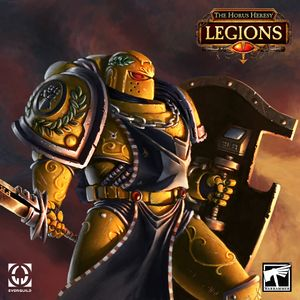

# 0661 坎巴·迪亚兹 Camba Diaz

精校状态：中文行文已逐段精校，部分术语仍为暂定

分类：人类帝国 / 帝国之拳

原文来源：https://www.bilibili.com/opus/1198088171026382857

原作者：帝国神选罐头

原文时间：2026年05月03日 14:34

[返回分类目录](目录.md) · [全书目录](../../目录.md)

<!-- A0661-B0001 -->
**英文原文**

Camba Diaz was a Captain of the Imperial Fists Legion's 50th Company during the Great Crusade and the Horus Heresy.

<!-- /A0661-B0001 -->

<!-- A0661-B0002 -->

原译文

坎巴·迪亚兹在大远征和荷鲁斯叛乱期间是帝国之拳军团第50连队的连长。

**校订译文**

坎巴·迪亚兹在大远征和荷鲁斯之乱期间是帝国之拳军团第50连队的连长。

<!-- /A0661-B0002 -->

<!-- A0661-B0003 图片 -->

<!-- A0661-B0004 -->

原译文

Camba Diaz 坎巴·迪亚兹

**校订译文**

Camba Diaz 坎巴·迪亚兹

<!-- /A0661-B0004 -->

<!-- A0661-B0005 -->
## History 历史

<!-- /A0661-B0005 -->

<!-- A0661-B0006 -->
**英文原文**

As the Heresy raged, he was co-commander, along with Captain Sigismund, of an Imperial task force that was sent to Mars when Horus' influence caused a civil war to erupt on its surface. Diaz and Sigismund were charged by their Primarch Rogal Dorn, with securing the two main forge-complexes on Mars that supplied the Legio Astartes weapons and equipment, which were led by Magos Kane and Lukas Chrom.

<!-- /A0661-B0006 -->

<!-- A0661-B0007 -->

原译文

当叛乱肆虐时，他与西吉斯蒙德连长一起担任帝国特遣部队的联合指挥官，当荷鲁斯的影响导致火星表面爆发内战时，该特遣部队被派往火星。迪亚兹和西吉斯蒙德被他们的原体罗格·多恩要求，负责保护火星上两个主要的铸造厂，这两个铸造厂为阿斯塔特军团提供武器和装备，由贤者凯恩和卢卡斯·克罗姆领导。

**校订译文**

叛乱期间，荷鲁斯的影响使火星爆发内战。迪亚兹与西吉斯蒙德共同指挥派往火星的帝国特遣部队，奉多恩之命，控制为阿斯塔特军团供应武器装备的两大铸造厂区；两厂分别由贤者凯恩与卢卡斯·克罗姆主持。

<!-- /A0661-B0007 -->

<!-- A0661-B0008 -->
**英文原文**

To achieve this, the task force was split in half and Diaz led his forces to secure Chrom's forge-complex - unaware that the Magos had sided with Horus and was one of the leading traitors on Mars. When his task force later arrived at Chrom's forge-complex, they were attacked and Diaz was forced to secure what resources he could from the traitorous Magos's hands. Meanwhile, Mars' civil war was nearing its end and those forces loyal to Horus, were close to achieving victory. Recognizing that the task force could not stand against their enemies' superior numbers, Sigismund issued an evacuation order for all loyal Imperial forces. After hearing this, Diaz and his half of the task force retreated back to Terra, with what resources they could take from Magos Chrom with them.

<!-- /A0661-B0008 -->

<!-- A0661-B0009 -->

原译文

为了实现这一目标，特遣部队被一分为二，迪亚兹带领他的部队保护了克罗姆的铸造厂，却不知道贤者站在荷鲁斯一边，是火星上的主要叛徒之一。当他的特遣部队后来抵达克罗姆的铸造厂时，他们遭到了袭击，迪亚兹被迫从叛徒贤者手中获得他所能获得的资源。与此同时，火星的内战即将结束，忠于荷鲁斯的部队也接近胜利。西吉斯蒙德意识到特遣部队无法对抗敌人的优势兵力，因此向所有忠诚的帝国部队发布了撤离命令。听到这个消息后，迪亚兹和他的一半特遣部队以及他们可以从贤者克罗姆那里获得的任何资源撤退回泰拉，

**校订译文**

特遣部队兵分两路，迪亚兹率一半人马前往控制克罗姆的铸造厂，却不知道这位贤者已投靠荷鲁斯，还是火星叛军的主要首领之一。部队抵达便遭攻击，只能尽量从叛徒手中抢出资源。与此同时，火星内战渐近尾声，荷鲁斯一方即将获胜。西吉斯蒙德判断己方无法抗衡优势敌军，遂命所有帝国忠诚部队撤离。迪亚兹率部带上能够夺取的物资，退回泰拉。

**校注：** 先前只是奉命前往，并未已成功保护克罗姆的铸造厂；修正原译将行动目标写成既成成果。

<!-- /A0661-B0009 -->

<!-- A0661-B0010 -->
**英文原文**

Several years later into the Heresy, when the Alpha Legion began their attack on the Sol System, Diaz had been promoted to the rank of Lord Castellan. He was also given the title of Siege Master within his Legion and was given command of Terra's Fourth Sphere of defense, which oversaw the blockade of Traitor-occupied Mars. During the Solar War's final phase, Diaz commanded the largest of his Primarch Dorn's five-tiered defensive fleets, from the Battle Barge Fortress of Eternity.

<!-- /A0661-B0010 -->

<!-- A0661-B0011 -->

原译文

几年后，当阿尔法军团开始攻击太阳系时，迪亚兹被提升为领主堡主。他还在他的军团中被授予攻城大师的称号，并被授予泰拉第四防御圈的指挥权，该防御圈负责监督对叛徒占领的火星的封锁。在太阳战争的最后阶段，迪亚兹指挥着他的原体多恩的五层防御舰队中最大的一支，由战斗驳船永恒堡垒号率领。

**校订译文**

叛乱数年后，阿尔法军团开始攻击太阳系时，迪亚兹已晋升堡主领主，并获军团“攻城大师”称号。他指挥泰拉第四防御圈，负责封锁叛军占领的火星。太阳战争最后阶段，他以战斗驳船永恒堡垒号为指挥舰，统率多恩五层防御体系中规模最大的舰队。

<!-- /A0661-B0011 -->

<!-- A0661-B0012 -->
**英文原文**

As Horus's forces overwhelmed the Sol System, Diaz's fleet near Mars was assailed by the Dark Mechanicum. These attacks came not only from the Traitor-held Forge World, but also from Dark Mechanicum fleets that were among Horus' forces that invaded the Sol System. The attacks eventually led Diaz to order his fleet to withdraw to Terra, before it could be destroyed. During the subsequent Siege of Terra, he agreed to take command of the Eternity Wall Spaceport's defenses, despite his Primarch Dorn judging it to be doomed. When the Spaceport's Pons Solar bridge was later swarmed by Horus' forces, Diaz was witnessed to be among the Imperials defending it. Their sheer numbers soon began to overwhelm the defenders, but Diaz's skill left him among the last Imperials to be still standing. He never once took a step backwards and when he was eventually killed, Diaz died while still cutting down the invaders.

<!-- /A0661-B0012 -->

<!-- A0661-B0013 -->

原译文

当荷鲁斯的部队压倒太阳系时，迪亚兹在火星附近的舰队遭到了黑暗机械教的袭击。这些攻击不仅来自叛徒控制的铸造世界，还来自入侵太阳系的荷鲁斯部队中的黑暗机械教舰队。这些袭击最终导致迪亚兹命令他的舰队在被摧毁之前撤退到泰拉。在随后的泰拉围城中，他同意指挥永恒之墙太空港的防御，尽管他的原体多恩认为它注定要陷落。当太空港的连接桥太阳之桥后来被荷鲁斯的部队包围时，迪亚斯被目击到是保卫它的帝国人之一。他们的庞大数量很快就开始压倒防御者，但迪亚斯的技艺使他成为最后一个仍然屹立不倒的帝国人。他从未后退过一步，当他最终被杀时，迪亚兹在杀死入侵者的同时死去。

**校订译文**

荷鲁斯大军攻入太阳系后，迪亚兹驻火星附近的舰队遭黑暗机械教夹击：攻击既来自叛军控制的铸造世界，也来自随荷鲁斯入侵的黑暗机械教舰队。他最终下令退往泰拉，避免全军覆灭。泰拉围城期间，虽然多恩已判断永恒之墙太空港注定失守，迪亚兹仍答应接掌防御。荷鲁斯部队涌上太阳之桥时，他就站在帝国守军之中。敌军以压倒性数量冲垮防线，他却凭精湛武艺坚持到最后一批抵抗者仍在战斗的时刻。他从未后退一步，直到战死，仍在斩杀入侵者。

**校注：** among the last 为最后一批之一，原最后一个放大其唯一性。第四防御圈称 Terra’s 为英文原称，地理工作范围仍含火星。

<!-- /A0661-B0013 -->

<!-- A0661-B0014 -->
## Wargear 武器装备

原题：Wargear 战备

<!-- /A0661-B0014 -->

<!-- A0661-B0015 -->
**英文原文**

Camba Diaz wielded the Power Sword Durenda, a relic blade forged by Sabik Wayland of the Iron Hands.

<!-- /A0661-B0015 -->

<!-- A0661-B0016 -->

原译文

坎巴·迪亚兹挥舞着由钢铁之手的萨比克·韦兰铸造的圣物之刃，动力剑杜伦达。

**校订译文**

坎巴·迪亚兹挥舞着由钢铁之手的萨比克·韦兰铸造的圣物之刃，动力剑杜伦达。

<!-- /A0661-B0016 -->

<!-- A0661-B0017 -->
## Trivia 琐事

<!-- /A0661-B0017 -->

<!-- A0661-B0018 -->
**英文原文**

Camba Diaz's sacrificial final stand holding a bridge against an invading army mirrors that of the ancient Roman hero Horatius Cocles.

<!-- /A0661-B0018 -->

<!-- A0661-B0019 -->

原译文

坎巴·迪亚兹的最后一战是为了抵御入侵的军队坚守一座桥梁，这与古罗马英雄贺雷修斯·科克勒斯的形象如出一辙。

**校订译文**

迪亚兹为抵挡大军而死守桥梁的最后一战，呼应了古罗马英雄贺雷修斯·科克勒斯守桥的故事。

<!-- /A0661-B0019 -->

本篇核心术语与暂定项

以下列出本篇出现的英文原形及核心术语表用词。同形词可能指不同对象，具体词义以本篇正文和校注为准；单复数、别名和仅见于图注的名称可能尚未列入。完整候选见[术语表](../../术语表/双语术语候选.csv)。

| 英文 | 采用中文 | 状态 |
| --- | --- | --- |
| Horus Heresy | 荷鲁斯之乱 | 官方已核对 |
| Mechanicum | 机械教 | 暂定·历史称谓 |
| Dark Mechanicum | 黑暗机械教 | 暂定·官方待核 |
| Equipment | 装备 | 编辑用语已统一 |
| Imperial Fists | 帝国之拳 | 暂定 |
| Primarch | 原体 | 官方已核对 |
| Battle Barge | 战斗驳船 | 暂定·官方待核 |
| Forge World | 铸造世界 | 暂定·官方待核 |
| Great Crusade | 大远征 | 暂定·官方待核 |
| Terra | 泰拉 | 暂定·官方待核 |
| Horus | 荷鲁斯 | 暂定·官方待核 |
| Iron Hands | 钢铁之手 | 暂定·官方待核 |
| Mars | 火星 | 暂定·官方待核 |
| Master | 导师（审判庭职衔）／舰务官（舰员职务） | 语境定译·官方待核 |
| Ancient | 旗手 | 官方已核对 |
| Alpha Legion | 阿尔法军团 | 暂定·官方待核 |
| Sabik Wayland | 萨比克·韦兰 | 暂定·官方待核 |
| Sol | 太阳系 | 暂定·官方待核 |
| Sigismund | 西吉斯蒙德 | 暂定·官方待核 |
| Captain | 连长 | 暂定·官方待核 |
| Invaders | 侵略者 | 暂定·官方待核 |
| Castellan | 堡主 | 官方已核对 |
| Lukas Chrom | 卢卡斯·克罗姆 | 暂定·官方待核 |
| Sphere | 防御圈 | 暂定·官方待核 |
| Lord Castellan | 堡主领主 | 暂定·官方待核 |
| Siege Master | 攻城大师 | 暂定·官方待核 |
| Fortress of Eternity | 永恒堡垒号 | 暂定·官方待核 |
| Pons Solar | 太阳之桥 | 暂定·官方待核 |
| Durenda | 杜伦达 | 暂定·官方待核 |
| The Dark | 《黑暗》 | 暂定·官方待核 |
| System | 星系（恒星系统） | 暂定·官方待核 |
| Relic Blade | 圣物武器 | 暂定·官方待核 |
| Sol System | 太阳系 | 暂定·官方待核 |
| Eternity Wall | 永恒之墙 | 暂定·官方待核 |
| Eternity Wall Spaceport | 永恒之墙太空港 | 暂定·官方待核 |

