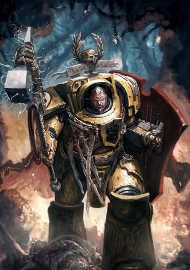
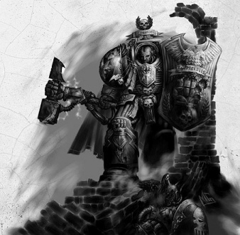
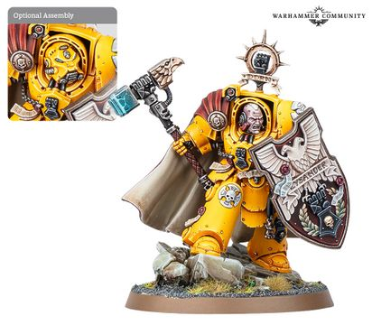

# 0662 达纳斯·莱山德 Darnath Lysander

精校状态：中文行文已逐段精校，部分术语仍为暂定

分类：人类帝国 / 帝国之拳

原文来源：https://www.bilibili.com/opus/1117878106231668736

原作者：帝国神选罐头

原文时间：2025年09月29日 10:57

[返回分类目录](目录.md) · [全书目录](../../目录.md)

<!-- A0662-B0001 -->
**英文原文**

Darnath Lysander is First Captain of the Imperial Fists and a legendary hero among the Space Marines.

<!-- /A0662-B0001 -->

<!-- A0662-B0002 -->

原译文

达纳斯·莱山德是帝国之拳的第一连长，也是星际战士中的传奇英雄。

**校订译文**

达纳斯·莱山德是帝国之拳的第一连长，也是星际战士中的传奇英雄。

<!-- /A0662-B0002 -->

<!-- A0662-B0003 图片 -->

<!-- A0662-B0004 -->

原译文

Darnath Lysander 达纳斯·莱山德

**校订译文**

Darnath Lysander 达纳斯·莱山德

<!-- /A0662-B0004 -->

<!-- A0662-B0005 -->
## Biography 传记

<!-- /A0662-B0005 -->

<!-- A0662-B0006 -->
### Early Life 早期生活

<!-- /A0662-B0006 -->

<!-- A0662-B0007 -->
**英文原文**

Lysander was recruited from Holy Terra itself after a 13-year-long pilgrimage that saw the death of his parents. The youth's survival through Waaagh! Grozdakk and the Quesarch Heresy had made Lysander famous, and brought him to the attention of the Imperial Fists' Chaplain Shadryss. When Shadryss found the boy near the Pillar of Bone, a famous monument known only to a few as the last remnant of the Fists' Fortress-monastery on Terra, he took it as a sign from Rogal Dorn himself and recruited the boy.

<!-- /A0662-B0007 -->

<!-- A0662-B0008 -->

原译文

莱桑德在经历了13年的朝圣之旅，目睹了父母的去世后，被从神圣泰拉招募。年轻人通过格罗兹达克的Waaagh！和奎萨奇叛乱的生存使莱山德出名，并引起了帝国之拳牧师沙德瑞斯的注意。当沙德瑞斯在白骨之墩 - 一座著名的纪念碑 - 附近发现这个男孩时，只有少数人知道它是泰拉上帝国之拳堡垒修道院的最后遗迹，他把它当作罗格·多恩的标志，并招募了这个男孩。

**校订译文**

莱山德经历了长达十三年的朝圣，父母死于途中，最终在神圣泰拉获选加入战团。他曾挺过 Waaagh! 格罗兹达克与奎萨奇叛乱，少年幸存者的名声引起帝国之拳教士沙德瑞斯的注意。沙德瑞斯在白骨之墩附近找到他；这座著名纪念碑其实是帝国之拳泰拉要塞修道院的最后遗存，只有少数人知晓。教士将此视为多恩的指引，招募了少年。

<!-- /A0662-B0008 -->

<!-- A0662-B0009 -->
### Scout Service 侦察兵服役

<!-- /A0662-B0009 -->

<!-- A0662-B0010 -->
**英文原文**

While a Scout, Lysander fought against the Iron Warriors for the first time in his life. During his first engagement with the Warsmith Shon'tu, Lysander allowed the Warsmith to escape, choosing instead to defend the life of a hostage - a decision he would come to regret later.

<!-- /A0662-B0010 -->

<!-- A0662-B0011 -->

原译文

作为一名侦察兵，莱桑德一生中第一次与钢铁勇士作战。在与战争铁匠绍恩'图的第一次交战中，莱山德允许战争铁匠逃跑，而选择捍卫人质的生命 — 这一决定后来让他后悔不已。

**校订译文**

仍是侦察兵时，莱山德首次与钢铁勇士交战。他第一次面对战争铁匠邵恩·图时，选择保护人质，让敌人逃脱；后来他为这个决定深感后悔。

<!-- /A0662-B0011 -->

<!-- A0662-B0012 -->
### Ascension to Command 升任指挥官

<!-- /A0662-B0012 -->

<!-- A0662-B0013 -->
**英文原文**

Lysander first appeared in the Liber Honorus Imperial Fists in 567.M40 as a sergeant in command of a unit in the 2nd Company, where he was victorious over a group of heretics on Iduno at the Battle of Colonial Bridge. He was then promoted to command of the 2nd Company in 585.M40 after successfully boarding and capturing an Eldar Cruiser named Blood of Khaine.

<!-- /A0662-B0013 -->

<!-- A0662-B0014 -->

原译文

莱山德于567.M40首次出现在帝国之拳荣誉册中，当时他是第二连队一个部队的指挥官，在那里他在伊杜诺的殖民地之桥之战中战胜了一群异端。在成功跳帮并俘获一艘名为凯恩之血的灵族巡洋舰后，他于585.M40被提升为第二连队指挥官。

**校订译文**

567.M40，莱山德首次被载入《帝国之拳荣誉册》，当时以第二连军士身份指挥一支小队，在伊杜诺的殖民地之桥战役中击败异端。585.M40，他成功跳帮并夺取灵族巡洋舰凯恩之血号，获擢升为第二连连长。

**校注：** sergeant 职衔原译漏掉，恢复军士；名誉记载所指为小队，不是当时已任连长。

<!-- /A0662-B0014 -->

<!-- A0662-B0015 图片 -->

<!-- A0662-B0016 -->

原译文

Darnath Lysander 达纳斯·莱山德

**校订译文**

Darnath Lysander 达纳斯·莱山德

<!-- /A0662-B0016 -->

<!-- A0662-B0017 -->
**英文原文**

During the three-year siege of Haddrake Tor, Lysander led a drop pod assault to take the highest peaks. Once the area was secured he set up teleport homers, allowing the Terminators of the 1st Company to teleport in and assault the lower levels. However, the heretics were able to manipulate the warp and caused the deaths of several Terminators, as they materialized embedded in stone or over deep precipices. Lysander himself witnessed the death of the 1st Company's Captain Kleitus and from him received the Fist of Dorn, a mighty Thunder Hammer which he used to go on and conquer the heretics.

<!-- /A0662-B0017 -->

<!-- A0662-B0018 -->

原译文

在哈德雷克·托尔围城的三年中，莱山德率领一支空投舱突击队夺取了最高的山峰。一旦该地区被占领，他就设置了传送信标，允许第一连队的终结者传送并攻击低部。然而，异端能够操纵亚空间，并导致几名终结者死亡，他们被嵌入石头或深崖。莱山德亲眼目睹了第一连队连长克雷图斯的死亡，并从他那里获得了多恩之拳，这是一把强大的雷霆锤，他用来继续征服异端。

**校订译文**

哈德雷克·托尔围城持续三年，其间莱山德率空降舱突击部队夺下最高峰，架设传送信标，让第一连终结者传送进来，进攻下层。但异端操纵亚空间，使数名终结者在实体化时嵌入岩石，或出现在深渊上方而丧生。莱山德目睹第一连长克雷图斯战死，接过他留下的强大雷霆锤“多恩之拳”，继续作战，最终击败异端。

**校注：** over deep precipices 指传送到深渊上方，不是嵌入深崖；Drop Pod 用官方空降舱。

<!-- /A0662-B0018 -->

<!-- A0662-B0019 -->
**英文原文**

Due to the sudden destruction of much of the 1st Company, Lysander was promoted to First Captain, Master of the 1st Company, Overseer of the Armoury and Watch Commander of the Phalanx. He went on to lead the 1st Company for many years and perfected the tactic of teleporting multiple Terminator Squads into enemy positions. Lysander was often at the head of such assaults, leading some to believe him reckless and foolhardy, but fortune thus far had been kind to him. One of his most notable success was during the campaign against the Alpha Legion in the Jorgurd Cluster. After tracking down the Legion's cruiser to a hidden asteroid base, Lysander lead the boarding action to cleanse it of heretics, an effort that lasted for several hours of intense, close-quarters combat.

<!-- /A0662-B0019 -->

<!-- A0662-B0020 -->

原译文

由于第一连队的大部分突然被摧毁，莱山德被提升为第一连长、第一连队之主、军械库监督者和山阵号守望指挥官。他继续领导第一连队多年，并完善了将多个终结者小队传送到敌方阵地的战术。莱山德经常是这种攻击的领导者，导致一些人认为他鲁莽和莽撞，但到目前为止，命运对他很好。他最显著的成功之一是在约古尔德星群对抗阿尔法军团的战役中。在将军团的巡洋舰追踪到一个隐藏的小行星基地后，莱山德领导跳帮行动，清除异端，这一努力持续了几个小时的激烈近距离战斗。

**校订译文**

第一连突然损失大部兵力后，莱山德晋升第一连长，兼任第一连之主、军械库督管及山阵号守望指挥官。此后多年，他不断完善将多个终结者小队同时传送到敌阵的战术，并经常身先士卒。有人因而认为他鲁莽，但幸运始终眷顾着他。他最著名的胜利之一，是约古尔德星群的对阿尔法军团战役：他追踪敌方巡洋舰至隐蔽的小行星基地，亲率跳帮，在数小时激烈近战后清除了舰内异端。

<!-- /A0662-B0020 -->

<!-- A0662-B0021 -->
**英文原文**

Lysander and a force of Imperial Fists he was leading aboard the Shield of Valour disappeared in a warp storm and, after some time, were pronounced dead by the remainder of the Imperial Fists chapter. In truth, Lysander's ship re-emerged into Chaos-held space, caught right in the gun sights of several Iron Warriors spacecraft. Lysander and the survivors of the ensuing barrage were taken by the Iron Warriors to one of their accursed fortress worlds, Malodrax, and tortured. Eventually Lysander, without weapons or armour, escaped with a handful of others and fought their way out to freedom. When he returned to the Imperial Fists Chapter, a millennium had passed in the material universe. For six months he was thoroughly screened by apothecaries, chaplains and librarians, but after finding no taint, Lysander was reinstated to his position as Captain of the 1st Company. Lysander then led a force to raze the Iron Warriors from Malodrax and laid it to waste, thereby achieving vengeance.

<!-- /A0662-B0021 -->

<!-- A0662-B0022 -->

原译文

莱山德和他率领的一支帝国之拳部队在一场亚空间风暴中消失了，过了一段时间，帝国之拳战团的其余部分宣布他们死亡。事实上，莱山德的飞船重新出现在混沌控制的空域中，正好被几艘钢铁勇士飞船的瞄准器击中。莱山德和随后炮击的幸存者被钢铁勇士带到他们被诅咒的堡垒世界之一长恶星，并受到折磨。最终，莱山德在没有武器或盔甲的情况下，和其他几个人一起逃脱，奋力争取自由。当他回到帝国之拳战团时，物质界已经过去了一千年。六个月来，他接受了药剂师、牧师和智库的彻底审查，但在没有发现任何污染后，莱山德被恢复为第一连队连长的职位。莱山德随后率领一支部队将钢铁勇士从长恶星彻底摧毁，并将其付之东流，从而实现了复仇。

**校订译文**

莱山德率部乘英勇之盾号航行时，在亚空间风暴中失踪，后来被战团认定死亡。事实上，战舰重现于混沌控制的空域，恰好落入数艘钢铁勇士战舰的火力范围。幸存者被俘，带往堡垒世界长恶星遭受折磨。莱山德最终在没有武器和护甲的情况下，与少数同伴逃出囚禁、杀出生路。待他重返战团，物质宇宙已过去一千年。药剂师、教士与智库员对他进行了六个月的严密检查，确认未受污染后，他才恢复第一连长职务。随后，他率军重返长恶星，摧毁当地钢铁勇士据点，将该世界夷为废墟，完成复仇。

**校注：** 原译漏舰名 Shield of Valour，现补；gun sights 表示被瞄准，非被瞄准器本体击中。

<!-- /A0662-B0022 -->

<!-- A0662-B0023 -->
### Recent History 近期历史

<!-- /A0662-B0023 -->

<!-- A0662-B0024 -->
**英文原文**

Lysander has continued his illustrious career in the Imperial Fists. He commanded Task Force Gauntlet on planet Vernalis in Segmentum Obscurus, a mixed force of 1st Company, elements of the 5th Company, and several Scout squads of the 10th Company, and defeated Chaos warband consisting of Emperor's Children Legion, the Roaring Blades traitor guard regiment and daemons that were led by arch-traitor Sybaris. In 998.M41, he defeated the Iron Warriors Warsmith Shon'tu in the Battle for the Endeavour of Will, earning the Warsmith's eternal hatred in the process. He also has apprehended the mutant Soul Drinker Sarpedon.

<!-- /A0662-B0024 -->

<!-- A0662-B0025 -->

原译文

莱山德在帝国之拳继续了他辉煌的职业生涯。他在朦胧星域的维纳利斯行星上指挥拳套特遣部队，这是一支由第一连队、第五连队和第十连队的几个侦察小队组成的混合部队，并击败了由帝皇之子军团、咆哮之刃叛徒卫队和由大叛徒席巴里斯领导的恶魔组成的混沌战帮。998.M41，他在奋进意志号之战中击败了钢铁勇士战争铁匠绍恩'图，在此过程中赢得了战争铁匠的永恒仇恨。他还逮捕了突变的饮魂者萨尔珀冬。

**校订译文**

莱山德继续为帝国之拳立下战功。他曾在朦胧星域的维纳利斯指挥拳套特遣部队，其兵力由第一连、第五连部分部队及第十连数支侦察小队组成。他们击败大叛徒席巴里斯率领的混沌军队，敌军包括帝皇之子、叛变卫队团“咆哮之刃”及恶魔。998.M41，他在奋进意志号之战中击败战争铁匠邵恩·图，使对方恨之入骨。他也曾擒获发生变异的饮魂者萨尔佩冬。

<!-- /A0662-B0025 -->

<!-- A0662-B0026 -->
**英文原文**

However, his career has not been without controversy. Sometime in M41 Lysander once again engaged Shon'tu and his Sons of the Forge in the Invasion of Taladorn. During the battle, which he saw as his own opportunity for vengeance, Lysander repeatedly refused Ultramarines and Blood Angels aid, resulting in higher Imperial Fist casualties. In the aftermath of the battle Lysander was recalled back to the Phalanx to meet with Chapter Master Vladimir Pugh and the eight surviving Company Captains. In the ensuing testimony half of the Chapter Council agreed with Lysander that the defeat of Shon'tu was a glory for the Imperial Fists alone and the division saved him from the demotion Pugh hoped to carry out. Pugh, however, ordered his own lighter sentence, removing Lysander from Command of the 1st Company and instead placing him as Captain of the 3rd, which suffered heavily during the Battle of Taladorn. Lysander had no choice but to obey, and was assigned to lead the newly reformed 3rd Company in the Crusade of Thunder. Later, after the death of Vladimir Pugh in the Infestation of Drashin, Lysander was offered the position of Chapter Master, but refused the honour. He has since instead been restored to full command of the 1st Company.

<!-- /A0662-B0026 -->

<!-- A0662-B0027 -->

原译文

然而，他的职业生涯并非没有争议。在M41的某个时候，莱山德再次与绍恩'图和他的铸炉之子交战，塔拉顿入侵。在这场被他视为复仇机会的战斗中，莱山德多次拒绝了极限战士和圣血天使的援助，导致帝国之拳的伤亡人数增加。战斗结束后，莱山德被召回山阵号，与战团长弗拉基米尔·普格和八名幸存的连长会面。在随后的证词中，战团议会的一半成员同意莱山德的观点，即绍恩'图的失败是帝国之拳的荣耀，这部分人将他从普格希望进行的降级中拯救出来。然而，普格下令自己更轻的判决，将莱山德从第一连队指挥撤职，并任命他为第三连队连长，第三连队在塔拉顿之战中遭受重创。莱山德别无选择，只能服从命令，并被指派领导新改造的第三连队参加雷霆远征。后来，弗拉基米尔·普格在德拉辛围城中牺牲后，莱山德被任命为战团长，但他拒绝了这一荣誉。此后，他恢复了对第一连队的全面指挥。

**校订译文**

莱山德的生涯亦有争议。M41 某时，邵恩·图率铸炉之子入侵塔拉顿，他将此战视为复仇机会，屡次拒绝极限战士与圣血天使援助，导致帝国之拳伤亡加重。战后，他被召回山阵号，面见战团长弗拉基米尔·普格与八名幸存连长。听证中，战团议会半数成员认同，击败邵恩·图的荣耀应由帝国之拳独享。这种分歧使普格无法实施原拟的降级处分。不过，战团长仍施加较轻惩罚：撤去莱山德的第一连指挥权，改派他统领塔拉顿之战后重创重建的第三连，参加雷霆远征。他只能服从。后来，普格在德拉辛虫害战中阵亡，莱山德获提议接任战团长，却拒绝此荣誉，随后重新掌管第一连。

**校注：** offered 职位是获邀接任，不是已经正式被任命又辞职；reformed 第三连是重建部队，非身体改造。Infestation 沿虫害语义，未写成围城。

<!-- /A0662-B0027 -->

<!-- A0662-B0028 -->
**英文原文**

Since the opening of the Great Rift, Lysander and elements of the 1st Company have been active across the Segmentum Solar and Segmentum Obscurus. During these battles, Lysander killed the Ork Freebooter Droknog Redfist and turned the tide of the naval battle over Amurav. He also led teleportation and dropship strikes against the Necrons on the forge world of Mons Magnifica, liberating a number of manufactorum facilities from the Xenos. Of late, Lysander has been active in the vicinity of the Cadian Gate, suppressing Chaos uprisings on Hazzephet and responding to calls for aid from dozens of worlds in the region. His suspicions have been raised by reports of renewed Iron Warriors activity. He is still suspicious that Shon'tu may have returned and harbours hopes of finally exacting his revenge against the Warsmith.

<!-- /A0662-B0028 -->

<!-- A0662-B0029 -->

原译文

自大裂隙打开以来，莱山德和第一连队的成员一直活跃在太阳星域和朦胧星域。在这些战斗中，莱山德杀死了欧克流寇德罗康·红拳，扭转了阿姆拉夫海战的局面。他还领导了对蒙斯壮丽铸造世界上的死灵的传送和空投打击，将许多铸造厂设施从异型手中解放出来。最近，莱山德一直活跃在卡迪亚之门附近，镇压哈泽费特的混沌叛乱，并回应该地区数十个世界的援助呼吁。有关钢铁勇士重新活跃的报告引起了他的怀疑。他仍然怀疑绍恩'图可能已经回来了，并希望最终对战争铁匠进行复仇。

**校订译文**

大裂隙开启后，莱山德率第一连部分兵力活跃于太阳星域与朦胧星域。他杀死欧克自由掠夺者德罗克诺格·红拳，扭转阿姆拉夫上空的舰队战局；又在铸造世界蒙斯·马格尼菲卡对太空死灵发动传送与登陆艇突击，夺回多处工厂。近来，他在卡迪亚之门周边镇压哈泽费特的混沌叛乱，回应数十个世界的求援。有关钢铁勇士再次活动的报告令他警觉；他怀疑邵恩·图卷土重来，也盼望终于能够彻底复仇。

**校注：** 原译阿姆拉夫海战容易误为海洋作战，英文 over Amurav 指上空舰战。Mons Magnifica 全名暂音译，原蒙斯壮丽为半音半意混合。

<!-- /A0662-B0029 -->

<!-- A0662-B0030 -->
**英文原文**

Lysander was the pioneer of the Terminator Titanhammer Squad, first used against Legio Unctator.

<!-- /A0662-B0030 -->

<!-- A0662-B0031 -->

原译文

莱桑德是终结者泰坦之锤小队的先锋，该小队首次用于对抗涂者军团。

**校订译文**

莱山德首创终结者泰坦之锤小队，并首次将其用于对抗昂克塔托军团。

**校注：** pioneer 此处为创设者，非先锋兵身份。Legio Unctator 原涂者军团不够明确，暂音译昂克塔托军团。

<!-- /A0662-B0031 -->

<!-- A0662-B0032 -->
## Wargear 武器装备

原题：Wargear 战备

<!-- /A0662-B0032 -->

<!-- A0662-B0033 -->
**英文原文**

Lysander is most famous for wearing his suit of Terminator Armour and carrying the Fist of Dorn and the Storm Shield Rampart. His armour is also highly embellished with purity seals and incorporates a teleport homer.

<!-- /A0662-B0033 -->

<!-- A0662-B0034 -->

原译文

莱山德最著名的是他穿着终结者盔甲，携带多恩之拳和风暴盾壁垒。他的盔甲也高度装饰着纯结印记，并融入了传送信标。

**校订译文**

莱山德最为人熟知的装束，是终结者护甲、多恩之拳及风暴盾“壁垒”。护甲饰有大量纯洁印记，并装有传送信标。

<!-- /A0662-B0034 -->

<!-- A0662-B0035 图片 -->

<!-- A0662-B0036 -->

原译文

Darnath Lysander 达纳斯·莱山德

**校订译文**

Darnath Lysander 达纳斯·莱山德

<!-- /A0662-B0036 -->

<!-- A0662-B0037 -->
## Trivia 琐事

<!-- /A0662-B0037 -->

<!-- A0662-B0038 -->
**英文原文**

Lysander was originally introduced as a unique Veteran Sergeant in standard Power Armor specialized in Bolter Drills.

<!-- /A0662-B0038 -->

<!-- A0662-B0039 -->

原译文

莱山德最初被介绍为一名独特的老兵军士，身穿标准动力盔甲，专用爆矢枪钻。

**校订译文**

莱山德最初登场时，是一名身穿标准动力甲、专精爆矢射击操练的独特老兵军士角色。

**校注：** Bolter Drills 指射击训练/操练，原爆矢枪钻误取 drill 工具义。

<!-- /A0662-B0039 -->

<!-- A0662-B0040 -->
### Conflicting sources 来源冲突

<!-- /A0662-B0040 -->

<!-- A0662-B0041 -->
**英文原文**

Sentinels of Terra - A Codex: Space Marines Supplement (6th Edition) names Lysander's captor on Malodrax as the Warsmith Shon'tu, a rival whom Lysander had encountered several times before. Malodrax (Novel) instead names Lysander's captor as Warsmith Kraegon Thul, and Shon'tu is not mentioned.

<!-- /A0662-B0041 -->

<!-- A0662-B0042 -->

原译文

《泰拉哨兵-圣典：星际战士补充》（第6版）将莱山德在长恶星的俘虏命名为战争铁匠绍恩'图，莱山德之前曾多次遇到过这个对手。长恶星（小说）将莱山德的俘虏命名为战争铁匠克雷贡·图尔，而没有提到绍恩'图。

**校订译文**

《泰拉哨兵——〈圣典：星际战士〉补充书》第六版称，在长恶星俘虏莱山德的是战争铁匠邵恩·图，两人此前已多次交锋。但小说《长恶星》把俘获者写成战争铁匠克雷贡·图尔，并未提及邵恩·图。

**校注：** captor 指俘获他的人，原译他的俘虏正好反转身份。

<!-- /A0662-B0042 -->

本篇核心术语与暂定项

以下列出本篇出现的英文原形及核心术语表用词。同形词可能指不同对象，具体词义以本篇正文和校注为准；单复数、别名和仅见于图注的名称可能尚未列入。完整候选见[术语表](../../术语表/双语术语候选.csv)。

| 英文 | 采用中文 | 状态 |
| --- | --- | --- |
| Space Marines | 星际战士 | 官方已核对 |
| Blood Angels | 圣血天使 | 官方已核对 |
| Eldar | 灵族 | 暂定·语境区分 |
| Necrons | 太空死灵 | 官方已核对 |
| Terminator | 终结者 | 官方已核对 |
| Ultramarines | 极限战士 | 官方已核对 |
| Warp | 亚空间 | 官方已核对 |
| Great Rift | 大裂隙 | 官方已核对 |
| Teleportation | 传送 | 暂定 |
| Waaagh! | Waaagh! | 暂定·保留原文 |
| Teleport Homer | 传送信标 | 暂定·官方待核 |
| Imperial Fists | 帝国之拳 | 暂定 |
| Darnath Lysander | 达纳斯·莱山德 | 官方已核对 |
| Phalanx | 山阵号 | 暂定 |
| Emperor | 帝皇 | 官方已核对 |
| Forge World | 铸造世界 | 暂定·官方待核 |
| Mutant | 变种人 | 暂定·官方待核 |
| Emperor's Children | 帝皇之子 | 官方已核对 |
| Iron Warriors | 钢铁勇士 | 暂定·官方待核 |
| Freebooter | 流寇 | 暂定·官方待核 |
| Terra | 泰拉 | 暂定·官方待核 |
| Segmentum Solar | 太阳星域 | 暂定·官方待核 |
| Segmentum Obscurus | 朦胧星域 | 暂定·官方待核 |
| Segmentum | 星域 | 暂定·官方待核 |
| Obscurus | 朦胧星 | 暂定·官方待核 |
| Fortress Worlds | 堡垒世界 | 暂定·官方待核 |
| Warsmith | 战争铁匠 | 暂定·官方待核 |
| Master | 导师（审判庭职衔）／舰务官（舰员职务） | 语境定译·官方待核 |
| Terminator Titanhammer Squad | 终结者泰坦之锤小队 | 暂定·官方待核 |
| Chaplain | 教士 | 官方已核对 |
| Drop Pod | 空降舱 | 官方已核·中英对照 |
| Alpha Legion | 阿尔法军团 | 暂定·官方待核 |
| Soul Drinker | 饮魂者 | 暂定·官方待核 |
| The Phalanx | 山阵号 | 暂定·官方待核 |
| First Captain | 第一连长 | 暂定·官方待核 |
| Overseer | 监督者 | 暂定·官方待核 |
| Chapter | 战团 | 暂定·官方待核 |
| Fortress-monastery | 要塞修道院 | 暂定·官方待核 |
| Chapter Master | 战团长 | 暂定·官方待核 |
| Captain | 连长 | 暂定·官方待核 |
| Veteran | 老兵 | 暂定·官方待核 |
| Terminators | 终结者 | 暂定·官方待核 |
| Sergeant | 军士 | 暂定·官方待核 |
| Scout | 侦察兵 | 暂定·官方待核 |
| Armoury | 军械库 | 暂定·官方待核 |
| Terminator Squads | 终结者小队 | 暂定·官方待核 |
| Sarpedon | 萨尔佩冬 | 暂定·官方待核 |
| Xenos | 异形 | 暂定·官方待核 |
| Pillar of Bone | 白骨之墩 | 暂定·官方待核 |
| Endeavour of Will | 奋进意志号 | 暂定·官方待核 |
| Vengeance | 复仇号 | 暂定·官方待核 |
| Chaplains | 教士 | 暂定·官方待核 |
| Shadryss | 沙德瑞斯 | 暂定·官方待核 |
| Liber Honorus Imperial Fists | 帝国之拳荣誉册 | 暂定·官方待核 |
| Iduno | 伊杜诺 | 暂定·官方待核 |
| Blood of Khaine | 凯恩之血号 | 暂定·官方待核 |
| Haddrake Tor | 哈德雷克·托尔 | 暂定·官方待核 |
| Kleitus | 克雷图斯 | 暂定·官方待核 |
| Fist of Dorn | 多恩之拳 | 暂定·官方待核 |
| Shield of Valour | 英勇之盾号 | 暂定·官方待核 |
| Vernalis | 维纳利斯 | 暂定·官方待核 |
| Sybaris | 席巴里斯 | 暂定·官方待核 |
| Vladimir Pugh | 弗拉基米尔·普格 | 暂定·官方待核 |
| Droknog Redfist | 德罗克诺格·红拳 | 暂定·官方待核 |
| Mons Magnifica | 蒙斯·马格尼菲卡 | 暂定·官方待核 |
| Legio Unctator | 昂克塔托军团 | 暂定·官方待核 |
| Rampart | 壁垒 | 暂定·官方待核 |
| Kraegon Thul | 克雷贡·图尔 | 暂定·官方待核 |
| Gun | 甘 | 暂定·官方待核 |
| Warp Storm | 亚空间风暴 | 暂定·官方待核 |
| Thunder Hammer | 雷霆锤 | 暂定·官方待核 |
| Bolter | 爆矢枪 | 暂定·官方待核 |
| The Fist of Dorn | 多恩之拳 | 暂定·官方待核 |
| Storm Shield | 风暴盾 | 暂定·官方待核 |
| Terminator Armour | 终结者盔甲 | 暂定·官方待核 |
| The Pillar of Bone | 白骨之墩 | 暂定·官方待核 |

