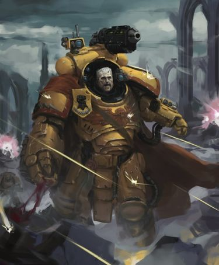
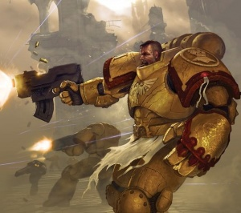
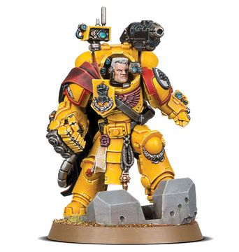

# 0663 托尔·加拉顿 Tor Garadon

精校状态：中文行文已逐段精校，部分术语仍为暂定

分类：人类帝国 / 帝国之拳

原文来源：https://www.bilibili.com/opus/1118228042990223363

原作者：帝国神选罐头

原文时间：2025年09月30日 09:35

[返回分类目录](目录.md) · [全书目录](../../目录.md)

<!-- A0663-B0001 -->
**英文原文**

Tor Garadon is the Captain of the Imperial Fists 3rd Company. He is currently the longest-serving Battle Company Captain of the Chapter.

<!-- /A0663-B0001 -->

<!-- A0663-B0002 -->

原译文

托尔·加拉顿是帝国之拳第三连队的连长。他目前是战团服役时间最长的战斗连队连长。

**校订译文**

托尔·加拉顿是帝国之拳第三连队的连长。他目前是战团服役时间最长的战斗连队连长。

<!-- /A0663-B0002 -->

<!-- A0663-B0003 图片 -->

<!-- A0663-B0004 -->

原译文

Tor Garadon as a Primaris Space Marine 作为原铸星际战士的托尔·加拉顿

**校订译文**

Tor Garadon as a Primaris Space Marine 作为原铸星际战士的托尔·加拉顿

<!-- /A0663-B0004 -->

<!-- A0663-B0005 -->
## Biography 传记

<!-- /A0663-B0005 -->

<!-- A0663-B0006 -->
### Early Career 早期职业生涯

<!-- /A0663-B0006 -->

<!-- A0663-B0007 -->
**英文原文**

Recruited into the Chapter from the orbitals of Callisto, his wealthy family were glad to see him depart, for fate had cursed him with a stubborn and straightforward nature. During his first decade of service, Garadon earned high amounts of commendations but was not offered any promotions. Garadon earned a name for himself during the Nosfer Planetstrike, when the 3rd Company became stranded behind Necron lines under Lord Zangeneb. There, Garadon was forced to take command after his Captain, Opara, was killed and led 6 surviving Battle Brothers in rear assaults.

<!-- /A0663-B0007 -->

<!-- A0663-B0008 -->

原译文

他从卡利斯托的轨道上被招募到战团，他的富裕家庭很高兴看到他离开，因为命运诅咒他固执而直率。在服役的第一个十年里，加拉顿获得了大量的表彰，但没有得到任何晋升。加拉顿在诺斯弗行星打击期间为自己赢得了一个名字，当时第三连队被困在赞格尼布领主的领导下死灵战线后面。在那里，加拉顿在他的队长奥帕拉被杀后被迫接管指挥权，并带领6名幸存的战斗兄弟进行了后方突击。

**校订译文**

加拉顿来自卡利斯托轨道上的居住设施。他生性固执直率，富裕的家人反倒乐见他获选加入战团、离家而去。最初十年，他屡获表彰，却始终未获晋升。诺斯弗行星突击战使他声名鹊起：第三连被困在赞格尼布领主麾下太空死灵的战线之后，连长奥帕拉阵亡，他被迫接掌指挥，率六名幸存战斗兄弟继续袭扰敌后。

**校注：** orbitals 指轨道居住设施，不是人在轨道本身被招募。

<!-- /A0663-B0008 -->

<!-- A0663-B0009 -->
**英文原文**

When Captain Julius Vogen took command of the 3rd Company, he thought there was more to Garadon than others let themselves see, and decided to personally help Garadon unlock his potential. By the time Garadon was in the 1st Company as a Veteran Sergeant he had an unbreakable friendship with Vogen, and returned to the 3rd Company without hesitation.

<!-- /A0663-B0009 -->

<!-- A0663-B0010 -->

原译文

当尤利乌斯·沃根连长指挥第三连队时，他认为加拉顿比其他人看到的要多，并决定亲自帮助加拉顿释放他的潜力。当加拉顿在第一连队担任老兵军士时，他与沃根建立了牢不可破的友谊，并毫不犹豫地回到了第三连队。

**校订译文**

尤利乌斯·沃根接掌第三连后，看见了旁人忽视的加拉顿的潜力，决定亲自培养他。加拉顿升入第一连、担任老兵军士时，两人已结下牢不可破的友谊，因此他毫不犹豫地回到沃根的第三连。

<!-- /A0663-B0010 -->

<!-- A0663-B0011 -->
### Taladorn 塔拉顿

<!-- /A0663-B0011 -->

<!-- A0663-B0012 -->
**英文原文**

In 969.M41 Garadon took part in the Invasion of Taladorn. During the battle Garadon served as second in command for Julius Vogen. after landing via drop pod 3rd Company made its way into the fortress following the trail of destruction left by Lysander. As they wen through the fortress a running battle broke out between them and the Iron Warriors, during which a Daemon engine attacked them, and killed Vogen, leaving Garadon in command. After killing the Daemon engine the Iron Warriors retreated and Garadon had 3rd company press on. After entering the pinnacle of the command spire he had 3rd Company head towards the fight 5th company, 1st company, and Lysander were in the middle of. After Garadon had the company form a defensive circle a Heldrake damaged an Imperial Fist stormraven, causing it to crash right through 3rd Company's position, after which they were decimated by nearby enemies. During the fighting Garadon's right arm was shattered by an autocannon shell. When Cato Sicarius offered assistance for the second time in the battle, and Lysander refused again, Garadon turned on his comm and formally accepted their assistance. He then ignored Lysander screaming on the comm, turned on his teleport homer, and was surrounded by 30 Ultramarine terminators. The battle turned in their favour but Garadon took little part in the scouring of the world later, as the Apothecaries said he was unfit for battle.

<!-- /A0663-B0012 -->

<!-- A0663-B0013 -->

原译文

969.M41 加拉顿参加了对塔拉顿的入侵。在战斗中，加拉顿担任尤利乌斯·沃根的副指挥官。第三连队在降落后，沿着莱山德留下的破坏痕迹进入了堡垒。当他们穿过堡垒时，他们与钢铁勇士之间爆发了一场激战，在此期间，一台恶魔引擎袭击了他们，杀死了沃根，留下加拉顿指挥。在杀死恶魔引擎后，钢铁勇士撤退了，加拉顿让第3连队继续前进。在进入指挥尖塔的顶部后，他让第3连队朝着战斗前进，第5连队、第1连队和莱山德都在战斗中。加拉顿让连队形成防御圈后，一只地狱飞龙击毁了一架帝国之拳风暴鸦，导致其直接撞向第三连队的阵地，之后被附近的敌人摧毁。在战斗中，加拉顿的右臂被一枚自动炮炮弹击碎。当卡托·西卡留斯在战斗中第二次提供援助，莱山德再次拒绝时，加拉顿打开了通讯，正式接受了他们的援助。然后，他无视莱山德在通讯中的大叫，打开了他的远程传送信标，被30个极限战士终结者包围。这场战斗对他们有利，但加拉顿后来几乎没有参与世界的清洗，因为药剂师们说他不适合继续战斗。

**校订译文**

969.M41，塔拉顿入侵战中，加拉顿担任沃根的副手。第三连乘空降舱登陆，沿莱山德开出的血路进入堡垒，与钢铁勇士边推进边交火。恶魔引擎袭来，杀死沃根，加拉顿接掌指挥。摧毁引擎、迫退钢铁勇士后，他继续推进，登上指挥尖塔，赶往第一连、第五连与莱山德所在战场。他命令第三连结成防御圈，一头地狱魔龙却击伤帝国之拳的风暴鸦炮艇，使其坠入连队阵地，邻近敌军随即重创守军。加拉顿右臂也被自动炮弹打碎。卡托·西卡留斯第二次提出支援、莱山德再次拒绝时，加拉顿直接接通通讯，正式接受援助，无视莱山德的怒吼，开启传送信标。三十名极限战士终结者随即出现在他身旁，战局由此逆转。药剂师判定他已不宜作战，因此他几乎没有参加随后肃清全世界的行动。

**校注：** Heldrake 依主审提供的 GW09/GW10 第15页直接中英对应统一地狱魔龙，原地狱飞龙留在原译对照。

<!-- /A0663-B0013 -->

<!-- A0663-B0014 图片 -->

<!-- A0663-B0015 -->

原译文

Then-Sergeant Tor Garadon during the Invasion of Taladorn 在塔拉顿入侵期间，托尔·加拉顿军士

**校订译文**

Then-Sergeant Tor Garadon during the Invasion of Taladorn 在塔拉顿入侵期间，托尔·加拉顿军士

<!-- /A0663-B0015 -->

<!-- A0663-B0016 -->
**英文原文**

In the aftermath of the battle, Garadon became disillusioned with Darnath Lysander's reckless leadership which caused unnecessary casualties. Garadon tried talking to Lysander three times on the voyage home from Taladorn to see if he had any remorse for what happened in the battle - each time Garadon was angrily dismissed and the last time Lysander threatened to strip Garadon of his rank. Garadon requested a private meeting with Chapter Master Vladimir Pugh and told him exactly what happened on Taladorn; Pugh commended Garadon for speaking on the matter. When a chapter council was convened to judge Lysander, Garadon stood in the space set aside for the 3rd company captain, though he had no vote as an acting captain. He was then called as a witness and calmly explained what had happened on Taladorn. When Pugh assigned Lysander as captain of the third company to rebuild it, as a punishment that would not divide the chapter captains, Garadon was disappointed that he wasn't taking permanent command of the company, and angry that the man who almost destroyed it was now in charge of it.

<!-- /A0663-B0016 -->

<!-- A0663-B0017 -->

原译文

战斗结束后，加拉顿对达纳斯·莱山德的鲁莽领导感到失望，这种领导造成了不必要的伤亡。加拉顿在从塔拉顿回家的航行途中三次试图与莱山德交谈，看看他是否对战斗中发生的事情感到懊悔 — 每次加拉顿都被愤怒地驳回，最后一次莱山德威胁要剥夺加拉顿的军衔。加拉顿要求与战团长弗拉基米尔·普格进行一次私人会面，并向他详细讲述了塔拉顿上发生的事情；普格赞扬加拉顿谈论这件事。当战团议会召开会议来评判莱山德时，加拉顿站在为第三连长留出的空间里，尽管他作为代理连长没有投票权。随后，他被传唤为证人，平静地解释了塔拉顿上发生的事情。当普格任命莱山德为第三连队的连长重建它，作为一种不会分裂战团连长的惩罚，加拉顿对他没有永久指挥连队感到失望，并对几乎摧毁连队的人现在负责连队感到愤怒。

**校订译文**

莱山德的鲁莽指挥造成无谓伤亡，使加拉顿彻底失望。返航途中，他三次试图探询对方是否有所悔意，每次都被怒斥赶走，最后莱山德甚至威胁剥夺其军衔。加拉顿遂私下向战团长弗拉基米尔·普格如实报告，得到战团长对其直言的肯定。审议莱山德行为的战团议会召开时，他站在第三连长的位置，却因只是代理连长而无投票权，随后作为证人平静陈述战况。为避免处分分裂连长们，普格最终命莱山德接掌第三连、负责重建。加拉顿既失望于自己未能正式继任，也愤怒于几乎毁掉连队的人如今反而成为其统帅。

<!-- /A0663-B0017 -->

<!-- A0663-B0018 -->
### Rebuilding 重建

<!-- /A0663-B0018 -->

<!-- A0663-B0019 -->
**英文原文**

While rebuilding the company, Garadon was surprised that Lysander consulted him on which battle brothers to promote to sergeant, though their conversations were awkward due to their mutual dislike. Garadon started to gain a grudging respect for Lysander due to his professionalism in his new duties, as well as the apology he offered for threatening to demote Garadon.

<!-- /A0663-B0019 -->

<!-- A0663-B0020 -->

原译文

在重建连队时，加拉顿很惊讶莱山德向他咨询了哪些战斗兄弟晋升为军士的问题，尽管他们的谈话因彼此不喜欢而很尴尬。由于莱山德在新的职责中表现出的专业精神，以及他为威胁要降职加拉顿而道歉，加拉顿开始勉强尊重他。

**校订译文**

重建期间，莱山德竟主动征询加拉顿该提拔哪些战士为军士，令他意外。两人互有嫌隙，交谈仍很尴尬；但莱山德认真履行新职，也为先前威胁降职一事道歉，使加拉顿渐渐对他生出不情愿却真实的敬意。

<!-- /A0663-B0020 -->

<!-- A0663-B0021 -->
**英文原文**

In 994.M41 Garadon responded to a request for aid from Cato Sicarius of the Ultramarines to defend the shrine world Victorix from the remnants of Hive Fleet Kraken. Upon arrival Garadon realised that these Tyranids were from the same strain that Shon'tu unleashed during the Infestation on Drashin. During the battle, known as the Triumph at Victorix, both companies were able to defend the planet and the artefact was kept safe.

<!-- /A0663-B0021 -->

<!-- A0663-B0022 -->

原译文

994.M41加拉顿回应了极限战士的卡托·西卡留斯的援助请求，以保卫圣地世界胜利星免受虫巢舰队克拉肯的残余攻击。抵达后，加拉顿意识到这些泰伦与绍恩·图在德拉辛的入侵中释放的品种相同。在这场被称为胜利星大捷的战斗中，两个连队都能够保卫行星，造物也得到了安全保护。

**校订译文**

994.M41，加拉顿响应卡托·西卡留斯求援，保卫圣地世界胜利星，抵抗克拉肯虫巢舰队残部。抵达后，他认出这些泰伦与邵恩·图在德拉辛释放的虫群属于同一支系。两连部队共同赢得胜利星大捷，保住行星，也确保当地圣物安全。

**校注：** the artefact 前文未具体交代何物，沿圣地防卫语境译圣物，未虚构其名称或来源。

<!-- /A0663-B0022 -->

<!-- A0663-B0023 -->
**英文原文**

In 997.M41 Garadon and the Third Company were requested by Darnath Lysander for the Defence of Miral II against the Tyranids. During the battle Garadon had tactical and devastator squads shoot upon the Tyranids. A tacticae predicted that they would last 6 days, they ended up lasting 7 and killed all of the Tyranids.

<!-- /A0663-B0023 -->

<!-- A0663-B0024 -->

原译文

997.M41，达纳斯·莱山德要求加拉顿和第三连队为米拉尔二号防御泰伦。在战斗中，加拉顿让战术和毁灭者小队向泰伦开火。一位战术战士预测，他们将坚持6天，但最终坚持了7天，并杀死了所有的泰伦。

**校订译文**

997.M41，加拉顿奉莱山德之请，率第三连保卫米拉尔二号，对抗泰伦。他指挥战术小队与破坏者小队持续射击。战术推算认为守军只能坚持六天，他们最终守了七天，将来袭泰伦全部歼灭。

**校注：** A tacticae 为不规范用法，源文未说明是一名人员或推演系统；用战术推算表达预测，不凭空增设“战术战士”。Devastator Squad 官译破坏者小队。

<!-- /A0663-B0024 -->

<!-- A0663-B0025 -->
### Becoming Captain 成为连长

<!-- /A0663-B0025 -->

<!-- A0663-B0026 -->
**英文原文**

In 997.M41, after being made Captain of the 2nd Company, Garadon cultivated alliances and ties with many famous Space Marines such as Cato Sicarius of the Ultramarines, Colvane Brasch of the Invaders, Erasmus Tycho of the Blood Angels, and Draco of the Black Templars.

<!-- /A0663-B0026 -->

<!-- A0663-B0027 -->

原译文

997.M41，在被任命为第二连队连长后，加拉顿与许多著名的星际战士建立了联盟和关系，如极限战士的卡托·西卡留斯、入侵者的科万·布拉施、圣血天使的伊拉斯谟·第谷和黑色圣堂的德拉科。

**校订译文**

997.M41，在被任命为第二连队连长后，加拉顿与许多著名的星际战士建立了联盟和关系，如极限战士的卡托·西卡留斯、入侵者的科万·布拉施、圣血天使的伊拉斯谟·第谷和黑色圣堂的德拉科。

<!-- /A0663-B0027 -->

<!-- A0663-B0028 -->
**英文原文**

In 999.M41 after the Siege of Hydra Cordatus, the 3rd Company was slain to a man. Garadon received permission to leave the 2nd Company and rebuild the 3rd. Many veterans of the Crusade of Thunder arrived to be transferred into the rebuilt formation under Garadon.

<!-- /A0663-B0028 -->

<!-- A0663-B0029 -->

原译文

999.M41，九头蛇之心围城后，第三连队被一个人残害。加拉顿获准离开第二连队重建第三连队。许多参加雷霆远征的老兵抵达后，被转移到加拉顿重建的编队中。

**校订译文**

999.M41，九头蛇之心围城后，第三连全军覆没。加拉顿获准离开第二连，重建第三连，许多参加过雷霆远征的老兵调入他麾下的新编部队。

**校注：** slain to a man 指全员阵亡，原译被一个人残害完全错误。

<!-- /A0663-B0029 -->

<!-- A0663-B0030 -->

原译文

13th Black Crusade 第十三次黑色远征

**校订译文**

13th Black Crusade 第十三次黑色远征

<!-- /A0663-B0030 -->

<!-- A0663-B0031 -->
**英文原文**

Garadon was left on the Phalanx to rebuild the company while Lysander and Vorn Hagan left with 5 Companies for a Crusade, and 3 others were deployed to the Segmentum Obscurus, leaving 30 members of the First Company and the brand new Third Company on the Phalanx. When the 13th Black Crusade started, Warsmith Shon'tu and Daemon Prince Be'lakor assaulted the Phalanx, entering it via a warp. Garadon took command, rallying the crew and his battle brothers. When the ship was infected with corruption he withdrew his forces from those sections and ordered the Phalanx's weapons to shoot those sections. Once the infected sections were gone and the machine virus no longer had a hold on the ship, Garadon set it on a blind heading into the Immaterium. This made the Daemons that had invaded stronger, so Garadon gathered the remainder of his forces in the Chamber of Storms to make a stand. When Be'lakor joined the fight, the Legion of the Damned arrived to help the Imperial Fists, and Be'lakor was forced to retreat with his forces in the middle of a fight with Garadon. When the Legion didn't leave after the battle Garadon thought there was still something for the Phalanx to do before returning to Terra. As soon as they set their course for Terra the Librarians received a distress hymnal from Cadia. Garadon overruled Trevaux's and Furan's objections to them responding and had the Phalanx set out for Cadia.

<!-- /A0663-B0031 -->

<!-- A0663-B0032 -->

原译文

加拉顿留在山阵号上重建连队，而莱山德和沃恩·哈根则带着5个连队参加远征，另外3个连队被部署到朦胧星域，留下30名第一连队和全新的第三连队成员留在山阵号上。当第13次黑色远征开始时，战争铁匠绍恩·图和恶魔王子比拉克袭击了山阵号，通过亚空间进入山阵号。加拉顿接管了指挥权，召集了船员和他的战斗兄弟。当这艘船被腐化感染时，他从这些地区撤军，并命令山阵号的武器射击这些地区。一旦受感染的部分消失，机械病毒在船上不受控制，加拉顿就让它盲目地驶向非物质界。这使得入侵的恶魔变得更加强大，因此加拉顿将剩余的部队聚集在风暴大厅中停下来抵抗。当比拉克加入战斗时，咒缚军团前来帮助帝国之拳，比拉克在与加拉顿的战斗中被迫与他的部队撤退。当军团在战斗后没有离开时，加拉顿认为山阵号在返回泰拉之前还有一些事情要做。智库们一定下泰拉的航向，就收到了卡迪亚的痛苦圣歌。加拉顿驳回了特雷沃和弗兰对他们回应的反对意见，并让山阵号出发前往卡迪亚。

**校订译文**

莱山德与沃恩·哈根率五个连出征，另有三个连部署在朦胧星域，加拉顿则留在山阵号重建部队。留守兵力只有第一连三十名战士，以及刚组建的第三连。第十三次黑色远征爆发时，战争铁匠邵恩·图与恶魔亲王比拉克尔经亚空间突入山阵号。加拉顿接掌指挥，集结舰员与战斗兄弟。舰体遭腐化后，他先撤出受感染区域，再命山阵号自身武器轰毁这些部分。机械病毒失去立足之处后，他令战舰在未经精确导航的情况下冲入亚空间。这反而强化了入侵恶魔，他便率残部退守风暴大厅。比拉克尔亲自参战时，诅咒军团突然赶来，帮助帝国之拳；恶魔亲王与加拉顿激战途中，被迫率军撤走。诅咒军团战后仍未离去，令加拉顿觉得，山阵号返回泰拉前尚有使命。刚设定回航方向，智库员便收到卡迪亚的求援圣歌。他驳回特雷沃与弗兰的异议，转而驰援卡迪亚。

**校注：** no longer had a hold 为病毒已失去控制，原译不受控制反转含义；distress hymnal 是求救讯号，非痛苦赞歌。

<!-- /A0663-B0032 -->

<!-- A0663-B0033 -->
**英文原文**

Upon arrival in the system Garadon had the Phalanx immediately engage the Black Fleet, seeing it as retribution. Ignoring all warnings about incoming ships, Garadon had them go straight after the Blackstone Fortress Will of Eternity. Seeing part of its shields go out in a section Garadon had the main batteries open fire. He ignored warnings of hull breaches and concerns from his crew, continuing to engage. The Will of Eternity's core was soon split and the fortress broke apart. He then had the Phalanx withdraw to Cadia beyond the Equator.

<!-- /A0663-B0033 -->

<!-- A0663-B0034 -->

原译文

到达星系后，加拉顿让山阵号立即与黑色舰队交战，将其视为惩罚。加拉顿无视所有关于来袭船只的警告，让他们直接冲向黑石堡垒永恒意志号。加拉顿看到其部分护盾在一个区域内熄灭，导致主阵列起火。他无视船体破损的警告和船员的担忧，继续参与。永恒意志号的核心很快就分裂了，堡垒也分崩离析。然后，他让山阵号撤退到卡迪亚的赤道面以外。

**校订译文**

抵达卡迪亚星系后，加拉顿立即命山阵号攻击黑色舰队，誓要报复。他无视敌舰逼近的警告，径取黑石堡垒永恒意志号。发现堡垒局部护盾失效，他便命主炮齐射；即使舰体破损警报不断、船员满心忧虑，也坚持攻击。永恒意志号的核心很快被击裂，整座堡垒崩解，加拉顿随后令山阵号退向卡迪亚赤道之外。

**校注：** had the main batteries open fire 是命主炮开火，原译导致主阵列起火误成己方火灾。末句 beyond the Equator 地理方位本身不够清楚，保留赤道之外，不擅补南北半球。

<!-- /A0663-B0034 -->

<!-- A0663-B0035 -->
**英文原文**

On the planet Garadon would then join the strike force under Korahael's command. His Imperial Fists would fight alongside Amalrich's Black Templars on the southern lines of the Elysion Fields. During the fighting they'd both plant their respective banners in the path of the Black Legion. When the invaders started to evacuate Garadon rallied what remained of third company, and at that point the only survivor of first company was Furan, the irony wasn't lost on Garadon.

<!-- /A0663-B0035 -->

<!-- A0663-B0036 -->

原译文

在行星上，加拉顿在科拉希尔的指挥下加入打击部队。他的帝国之拳在艾利森平原的南部与阿马里奇的黑色圣堂并肩作战。在战斗中，他们都在黑色军团的路线上插上了各自的旗帜。当入侵者开始撤离时，加拉顿将第三连队的残余力量重新集结起来，当时第一连队唯一的幸存者是弗兰，加拉顿并未忽视其中的讽刺意味。

**校订译文**

登陆后，加拉顿加入科拉海尔统率的打击部队，与阿马尔里奇麾下黑色圣堂并肩守卫艾利森平原南部。两位指挥官将各自旗帜插在黑色军团进军路上。入侵者开始撤离时，加拉顿收拢第三连残部；此刻，第一连已只剩弗兰一人，他不禁感到命运的讽刺。

<!-- /A0663-B0036 -->

<!-- A0663-B0037 -->
**英文原文**

During the evacuation Garadon and the Phalanx took the lead of the retreating imperial ships. When the ship Pride of St Cerephos's plasma drives failed Garadon took aboard what transport craft they could, but reluctantly ordered that the Pride be left behind due to the enemies following after them. To avoid unnecessary losses Garadon had the Phalanx slow down to not stress the other ships as much, and brought the least spaceworthy aboard. The evacuation fleet eventually started to enter the warp and leave the system, Garadon let out a heartfelt curse before the Phalanx left as well.

<!-- /A0663-B0037 -->

<!-- A0663-B0038 -->

原译文

在撤离过程中，加拉顿和山阵号率领撤退的帝国舰船。当圣塞勒福斯之傲号的等离子驱动器故障时，加拉顿尽其所能登上了运输船，但由于敌人紧随其后，他不情愿地命令留下骄傲号。为了避免不必要的损失，加拉顿让山阵号放慢速度，以免对其他舰船按造成太大压力，并把最不具太空耐航力的人带上船。撤离舰队最终开始进入亚空间并离开星系，加拉顿在山阵号离开之前发出了衷心的诅咒。

**校订译文**

撤离时，加拉顿以山阵号为帝国舰队领航。圣塞勒福斯之傲号等离子引擎失效，他尽力接收其逃出的运输艇，却因追兵逼近，不得不下令放弃该舰。为减少损失，他令山阵号放慢速度，避免其他舰船为追赶而过度负荷，并将最不适宜继续航行的船只收容到山阵号内。撤离舰队终于陆续跃入亚空间，加拉顿发出一声痛彻心扉的咒骂，随后也率山阵号离去。

**校注：** 接收运输艇的主语是加拉顿指挥的山阵号，非加拉顿本人登上运输艇；least spaceworthy 根据承接对象为舰船，非不适宜太空航行的人。

<!-- /A0663-B0038 -->

<!-- A0663-B0039 -->
### Age of the Dark Imperium 黑暗帝国时代

<!-- /A0663-B0039 -->

<!-- A0663-B0040 -->
**英文原文**

When the Age of the Dark Imperium began, Tor Garadon led the Phalanx to Terra, where he deployed a Company of Imperial Fists to help establish calm on the Throneworld following the Sack of the Lion's Gate. While on Terra he worked closely with Custodes under Valerian against Chaos Cults on Terra and later helped battle the Minotaurs following their participation in the Hexarchy's coup.

<!-- /A0663-B0040 -->

<!-- A0663-B0041 -->

原译文

当黑暗帝国时代开始时，托尔·加拉顿带领山阵号前往泰拉，在那里他部署了一个帝国之拳连队，以帮助在狮门被洗劫后在王座世界确立平静。在泰拉期间，他与瓦莱里安手下的禁军密切合作，对抗泰拉上的混沌教派，后来在米诺陶参与了六头政变后帮助他们与之作战。

**校订译文**

黑暗帝国时代初期，加拉顿率山阵号返回泰拉，在狮门遭洗劫后部署一个连，帮助恢复王座世界秩序。他与瓦里瑞安统领的帝皇禁军密切合作，清剿混沌教派；后来，米诺陶战团卷入六头政变，他又协助禁军与之交战。

<!-- /A0663-B0041 -->

<!-- A0663-B0042 -->
**英文原文**

He later crossed the Rubicon Primaris and become a Primaris Space Marine. Alongside Lysander he is now one of the last surviving Fists from before the formation of the Great Rift. Since the Indomitus Crusade began he nearly came to blows with Iron Hands Master of the Forge Feirros during the Battle of Xalladin.

<!-- /A0663-B0042 -->

<!-- A0663-B0043 -->

原译文

后来，他越过原铸界限，成为原铸星际战士。与莱山德一起，他现在是大裂隙形成前仅存的帝国之拳之一。自从不屈远征开始以来，在沙拉丁之战中，他几乎与钢铁之手铸造大师费罗斯发生冲突。

**校订译文**

随后，加拉顿完成原铸跨越手术，成为原铸星际战士。本篇称，他与莱山德是大裂隙形成前便已服役、如今仍健在的最后一批帝国之拳。不屈远征期间，他在沙拉丁之战中险些与钢铁之手铸造大师费洛斯动武。

**校注：** “大裂隙前仅存的最后一批”是本篇源文说法，范围不清，不能由此推断其他章节的旧帝国之拳人物全部阵亡。

<!-- /A0663-B0043 -->

<!-- A0663-B0044 -->
**英文原文**

During the Fourth Tyrannic War, Tor Garadon led a Solblade against Tyranid forces within the Bastior Sub-sector.

<!-- /A0663-B0044 -->

<!-- A0663-B0045 -->

原译文

在第四次泰伦战争期间，托尔·加拉顿率领一支太阳之刃部队在巴斯蒂奥分区对抗泰伦军队。

**校订译文**

在第四次泰伦战争期间，托尔·加拉顿率领一支太阳之刃部队在巴斯蒂奥分区对抗泰伦军队。

<!-- /A0663-B0045 -->

<!-- A0663-B0046 图片 -->

<!-- A0663-B0047 -->

原译文

Tor Garadon as a Primaris Space Marine 作为原铸星际战士的托尔·加拉顿

**校订译文**

Tor Garadon as a Primaris Space Marine 作为原铸星际战士的托尔·加拉顿

<!-- /A0663-B0047 -->

<!-- A0663-B0048 -->
## Wargear 武器装备

原题：Wargear 战备

<!-- /A0663-B0048 -->

<!-- A0663-B0049 -->
**英文原文**

Before becoming a Primaris Space Marine, Garadon wielded the relic Bolt Pistol known as the Spartean. As a Primaris Space Marine, he wields the Power Fist known as Hand of Defiance and an armour-mounted Grav-Gun.

<!-- /A0663-B0049 -->

<!-- A0663-B0050 -->

原译文

在成为原铸星际战士之前，加拉顿使用了被称为斯巴达的爆矢手枪。作为一名原铸星际战士，他挥舞着被称为反抗之手的动力拳和一把盔甲装载重力枪。

**校订译文**

改造为原铸之前，加拉顿使用圣物爆矢手枪“斯巴达”。此后，他装备动力拳“反抗之手”，以及一门固定在护甲上的重力枪。

<!-- /A0663-B0050 -->

本篇核心术语与暂定项

以下列出本篇出现的英文原形及核心术语表用词。同形词可能指不同对象，具体词义以本篇正文和校注为准；单复数、别名和仅见于图注的名称可能尚未列入。完整候选见[术语表](../../术语表/双语术语候选.csv)。

| 英文 | 采用中文 | 状态 |
| --- | --- | --- |
| Space Marines | 星际战士 | 官方已核对 |
| Black Templars | 黑色圣堂 | 官方已核对 |
| Blood Angels | 圣血天使 | 官方已核对 |
| Tyranids | 泰伦虫族 | 官方已核对 |
| Bolt Pistol | 爆矢手枪 | 官方已核对 |
| Ultramarines | 极限战士 | 官方已核对 |
| Be'lakor | 比拉克尔 | 官方已核对 |
| Warp | 亚空间 | 官方已核对 |
| Great Rift | 大裂隙 | 官方已核对 |
| Imperium | 帝国 | 暂定·简称 |
| Daemon Engine | 恶魔引擎 | 暂定 |
| Indomitus | 不屈学派 | 暂定·学派语境 |
| Teleport Homer | 传送信标 | 暂定·官方待核 |
| Imperial Fists | 帝国之拳 | 暂定 |
| Darnath Lysander | 达纳斯·莱山德 | 官方已核对 |
| Phalanx | 山阵号 | 暂定 |
| Shrine World | 圣地世界 | 暂定·官方待核 |
| Daemon Prince | 恶魔亲王 | 官方已核对 |
| Black Legion | 黑色军团 | 暂定·官方待核 |
| Iron Warriors | 钢铁勇士 | 暂定·官方待核 |
| Terra | 泰拉 | 暂定·官方待核 |
| Iron Hands | 钢铁之手 | 暂定·官方待核 |
| Dark Imperium | 黑暗帝国 | 暂定·官方待核 |
| Indomitus Crusade | 不屈远征 | 暂定·官方待核 |
| Fourth Tyrannic War | 第四次泰伦战争 | 暂定·官方待核 |
| Segmentum Obscurus | 朦胧星域 | 暂定·官方待核 |
| Segmentum | 星域 | 暂定·官方待核 |
| Sector | 星区 | 暂定·官方待核 |
| Cadia | 卡迪亚 | 暂定·官方待核 |
| Obscurus | 朦胧星 | 暂定·官方待核 |
| Warsmith | 战争铁匠 | 暂定·官方待核 |
| Crash | 崩溃 | 暂定·官方待核 |
| Master | 导师（审判庭职衔）／舰务官（舰员职务） | 语境定译·官方待核 |
| Minotaurs | 米诺陶 | 暂定·官方待核 |
| Master of the Forge | 铸造大师 | 暂定·官方待核 |
| Drop Pod | 空降舱 | 官方已核·中英对照 |
| Valerian | 瓦里瑞安 | 官方已核对 |
| The Phalanx | 山阵号 | 暂定·官方待核 |
| Space Marine | 星际战士 | 暂定·官方待核 |
| Chapter | 战团 | 暂定·官方待核 |
| Chapter Master | 战团长 | 暂定·官方待核 |
| Captain | 连长 | 暂定·官方待核 |
| Veteran | 老兵 | 暂定·官方待核 |
| Terminators | 终结者 | 暂定·官方待核 |
| Sergeant | 军士 | 暂定·官方待核 |
| Devastator | 破坏者 | 暂定·官方待核 |
| Primaris Space Marine | 原铸星际战士 | 暂定·官方待核 |
| Cato Sicarius | 卡托·西卡留斯 | 暂定·官方待核 |
| Tor Garadon | 托尔·加拉顿 | 官方已核 |
| The Black Templars | 黑色圣堂 | 暂定·官方待核 |
| Devastator Squads | 破坏者小队 | 暂定·官方待核 |
| Invaders | 侵略者 | 暂定·官方待核 |
| Legion of the Damned | 诅咒军团 | 暂定·官方待核 |
| Remnants | 残骸 | 暂定·官方待核 |
| Erasmus Tycho | 伊拉斯谟·第谷 | 暂定·官方待核 |
| Rubicon Primaris | 原铸跨越手术 | 暂定·官方待核 |
| Korahael | 科拉海尔 | 暂定·官方待核 |
| Blackstone Fortress | 黑石要塞 | 暂定·官方待核 |
| Bastior Sub-sector | 巴斯蒂奥次星区 | 暂定·官方待核 |
| Strain | 群系 | 暂定·官方待核 |
| Feirros | 费洛斯 | 暂定·官方待核 |
| Brand | 布兰德 | 暂定·官方待核 |
| Hydra Cordatus | 海德拉之心 | 暂定·官方待核 |
| Vladimir Pugh | 弗拉基米尔·普格 | 暂定·官方待核 |
| Nosfer Planetstrike | 诺斯弗行星突击战 | 暂定·官方待核 |
| Zangeneb | 赞格尼布 | 暂定·官方待核 |
| Opara | 奥帕拉 | 暂定·官方待核 |
| Julius Vogen | 尤利乌斯·沃根 | 暂定·官方待核 |
| Victorix | 胜利星 | 暂定·官方待核 |
| Triumph at Victorix | 胜利星大捷 | 暂定·官方待核 |
| Trevaux | 特雷沃 | 暂定·官方待核 |
| Furan | 弗兰 | 暂定·官方待核 |
| Pride of St Cerephos | 圣塞勒福斯之傲号 | 暂定·官方待核 |
| Xalladin | 沙拉丁 | 暂定·官方待核 |
| Spartean | 斯巴达 | 暂定·官方待核 |
| Hand of Defiance | 反抗之手 | 暂定·官方待核 |
| Gun | 甘 | 暂定·官方待核 |
| The Dark | 《黑暗》 | 暂定·官方待核 |
| The Blood | 鲜血 | 暂定·官方待核 |
| Battle of Xalladin | 沙拉丁之战 | 暂定·官方待核 |
| Hexarchy | 六头集团 | 暂定·官方待核 |
| System | 星系（恒星系统） | 暂定·官方待核 |
| Defiance | 反抗号 | 暂定·官方待核 |
| Corruption | 腐败 | 暂定·官方待核 |
| Will of Eternity | 永恒意志号 | 暂定·官方待核 |
| Heldrake | 地狱魔龙 | 官方已核 |
| Autocannon | 自动炮 | 暂定·官方待核 |
| Bolt | 爆矢 | 暂定·官方待核 |
| Power fist | 动力拳 | 官方已核对 |
| Kraken | 克拉肯 | 暂定·官方待核 |
| Vogen | 沃根 | 暂定·官方待核 |
| Lion's Gate | 狮门 | 暂定·官方待核 |

