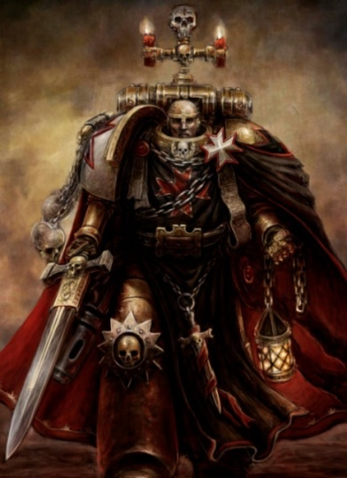
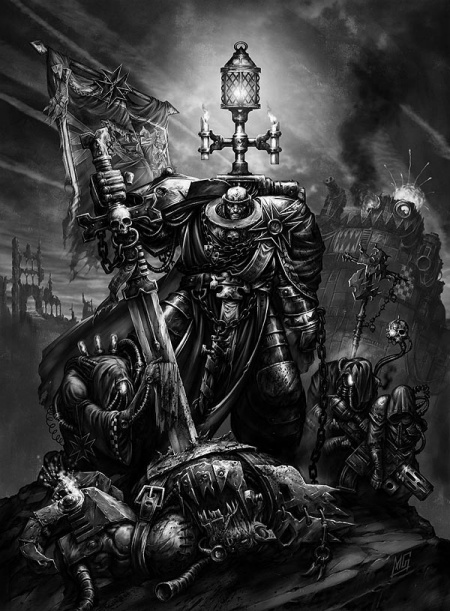
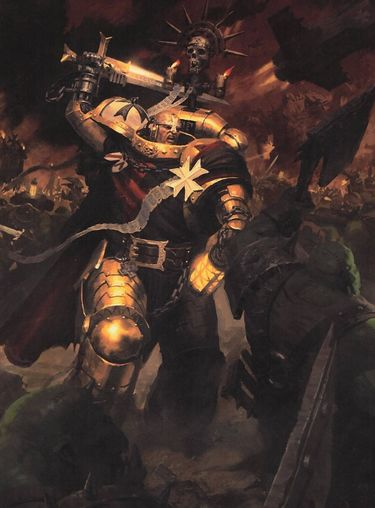
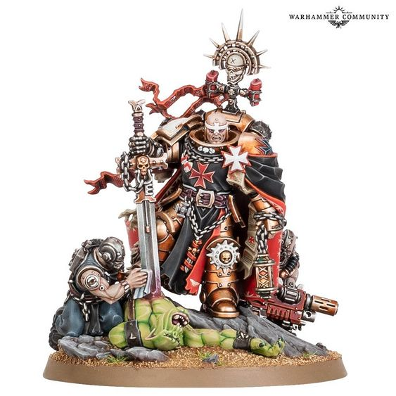

# 0664 赫尔布雷彻 Helbrecht

精校状态：中文行文已逐段精校，部分术语仍为暂定

分类：人类帝国 / 黑色圣堂

原文来源：https://www.bilibili.com/opus/1119414970127220742

原作者：帝国神选罐头

原文时间：2025年10月03日 14:21

[返回分类目录](目录.md) · [全书目录](../../目录.md)

原篇名：赫尔布雷希特 Helbrecht

<!-- A0664-B0001 -->
**英文原文**

"Where the Neophyte sees only the difficulties and the Initiate only the advantages in any great enterprise, the hero sees both."

<!-- /A0664-B0001 -->

<!-- A0664-B0002 -->

原译文

“在任何伟大的事业中，新手只看到困难，初学者只看到优势，而英雄则看到了两者。”

**校订译文**

“面对任何伟大事业，新进者只看见困难，进阶者只看见优势，英雄则两者皆见。”

**校注：** 黑色圣堂语境 Neophyte 与 Initiate 为训练阶段，采用新进者／进阶者，后者已有官方单位名依据。

<!-- /A0664-B0002 -->

<!-- A0664-B0003 -->
**英文原文**

Helbrecht is the current High Marshal of the Black Templars Chapter.

<!-- /A0664-B0003 -->

<!-- A0664-B0004 -->

原译文

赫尔布雷希特是现任黑色圣堂战团的至高元帅。

**校订译文**

赫尔布雷彻是本篇所述时期黑色圣堂战团的至高元帅。

<!-- /A0664-B0004 -->

<!-- A0664-B0005 图片 -->

<!-- A0664-B0006 -->

原译文

Helbrecht 赫尔布雷希特

**校订译文**

Helbrecht 赫尔布雷彻

<!-- /A0664-B0006 -->

<!-- A0664-B0007 -->
### Biography 传记

<!-- /A0664-B0007 -->

<!-- A0664-B0008 -->
### Childhood 童年

<!-- /A0664-B0008 -->

<!-- A0664-B0009 -->
**英文原文**

Helbrecht was born in the underhives of the world of Piety. Unbeknownst to him, a group of Custodes of the Aquilan Shield led by Grateion Artabane guided by Doomscryers prophecies watched over and protected him until the Black Templars recruited him into their Chapter.

<!-- /A0664-B0009 -->

<!-- A0664-B0010 -->

原译文

赫尔布雷希特出生在虔诚星世界的地下。在他不知情的情况下，由格拉提翁·阿塔班领导的一群天鹰之盾的禁军在末日卜者的指引下监视并保护了他，直到黑色圣堂将他招募到他们的战团。

**校订译文**

赫尔布雷彻出生于虔诚星的下巢。他不知道的是，格拉提翁·阿塔班率领的天鹰之盾帝皇禁军，曾遵循末日卜者的预言暗中守护他，直到他被黑色圣堂招募。

**校注：** underhives 指下巢贫困城区，非笼统行星地下；Doomscryers 为预言者群体，原译暂保留。

<!-- /A0664-B0010 -->

<!-- A0664-B0011 -->
### Ascent 崭露头角

原题：Ascent 升职

<!-- /A0664-B0011 -->

<!-- A0664-B0012 -->
**英文原文**

Helbrecht is best known among his friends and enemies for his violence, stubbornness, and desire to slay the enemies of the Emperor. The notice he received for his many violent campaigns aided his rise through the ranks and he secured a position in the Sword Brethren after he slew a Vampire which had risen to power on Cephian IV. When the crusade's leader, Marshal Daidin, was killed, Helbrecht was elected in his place.

<!-- /A0664-B0012 -->

<!-- A0664-B0013 -->

原译文

赫尔布雷希特在他的朋友和敌人中最为人所知的是他的暴力、固执和杀死帝皇之敌的欲望。他因多次暴力战役而收到的通知有助于他在队伍中的崛起，他在杀死了一名在塞斐安四号掌权的吸血鬼后，在圣剑兄弟会中获得了一个职位。当远征的领袖戴丁元帅被杀时，赫尔布雷希特被选为他的继任者。

**校订译文**

无论敌友，都知道赫尔布雷彻作风凶悍、性格固执，渴望杀尽帝皇之敌。多次激烈战役让他备受瞩目、逐步晋升；斩杀在塞斐安四号掌权的吸血鬼后，他进入圣剑兄弟会。远征统帅戴丁元帅阵亡时，众人推举他继任。

<!-- /A0664-B0013 -->

<!-- A0664-B0014 -->
### Rise to High Marshal 升任至高元帅

<!-- /A0664-B0014 -->

<!-- A0664-B0015 -->
**英文原文**

On the death of High Marshal Kordhel at the hands of a Chaos Champion, the Marshals unanimously chose Helbrecht in 989.M41 to succeed him after the subjugation of the Xenarchs of the Sigilare Nebula. He was ritually presented with the Sword of the High Marshals and immediately led a crusade against the Cythor Fiends in the Ghoul Stars. After eight years securing outlying systems, Helbrecht moved on to the homeworlds of the Fiends, only to find them empty. The crusade was cut short when a request for aid came from Armageddon: Ghazghkull Thraka had returned and the Black Templars channelled their energies into stopping one of the greatest Waaagh!

<!-- /A0664-B0015 -->

<!-- A0664-B0016 -->

原译文

在至高元帅科尔德赫死于混沌冠军之手后，元帅们于989.M41一致选择赫尔布雷希特接替他。征服了西吉拉尔星云的泽纳克斯之后。他被仪式性地授予了至高元帅之剑，并立即领导了一场针对食尸鬼群星的西索尔恶魔的远征。在保护偏远星系八年后，赫尔布雷希特移动到了恶魔的家园，却发现它们是空的。当阿玛吉多顿发出援助请求时，远征被停止了：碎骨者萨拉卡已经回来了，黑色圣堂将精力投入到阻止最大的Waaagh！

**校订译文**

至高元帅科尔德赫死于混沌勇士之手后，元帅们在 989.M41、征服西吉拉尔星云泽纳克人之后，一致推举赫尔布雷彻继任。他在仪式中接过至高元帅之剑，随即率军远征食尸鬼群星，讨伐西索尔凶魔。经过八年战斗、控制外围星系后，他向敌人母星进发，却发现诸世界已空无一人。阿玛吉多顿的求援使远征中止：碎骨者·斯拉卡再度来袭，黑色圣堂转而迎战这场规模空前的 Waaagh!。

**校注：** Cythor Fiends 是异形种族名称，不据 fiend 泛义认作混沌恶魔，暂作西索尔凶魔并保留种族说明；Xenarchs 依核心统一泽纳克。one of greatest 并不表示唯一最大。

<!-- /A0664-B0016 -->

<!-- A0664-B0017 -->
### Third Armageddon War 第三次阿玛吉多顿战争

<!-- /A0664-B0017 -->

<!-- A0664-B0018 -->
**英文原文**

Helbrecht returned to the Eternal Crusader and contacted Marshals Ricard of the Dimaris Crusade and Amalrich of the Tiberior Crusade, ordering them to Armageddon. Upon arrival, Helbrecht assumed control of the space fleet, his skills in space combat honed by directing the vast fleet of the Black Templars, while the two crusades deployed to the surface. Helbrecht worked closely with Admiral Parol to storm and destroy Ork Roks and ships in an effort to stem the tide of reinforcements. When Ghazghkull's suspected command ship was seen retreating from Armageddon, Helbrecht swore an oath to pursue and destroy him. As a sign of respect, he allowed Commissar Yarrick to accompany him on the crusade.

<!-- /A0664-B0018 -->

<!-- A0664-B0019 -->

原译文

赫尔布雷希特回到了永恒远征号，联系了迪马瑞斯远征的里卡德元帅和提贝里奥远征的元帅阿马里奇，命令他们前往阿玛吉多顿。抵达后，赫尔布雷希特接管了太空舰队的控制权，他在太空战斗中的技能通过指挥庞大的黑色圣堂舰队而得到磨练，而两个远征军则部署在表面。赫尔布雷希特与海军上将帕罗尔密切合作，突袭并摧毁兽人巨石和舰船，以阻止增援的浪潮。当人们看到碎骨者的疑似指挥舰从阿玛吉多顿撤退时，赫尔布雷希特发誓要追捕并毁灭他。为了表示尊重，他允许亚瑞克政委陪同他参加远征。

**校订译文**

赫尔布雷彻返回永恒远征号，联系迪马瑞斯远征的里卡德元帅与提贝里奥远征的阿马尔里奇元帅，令其前往阿玛吉多顿。抵达后，两支远征军登陆，他则凭统领圣堂庞大舰队磨练出的本领，接掌太空作战。他与海军上将帕罗尔合作，强攻并摧毁欧克巨石及舰船，截断增援。发现疑似碎骨者旗舰的战舰撤退后，他立誓追杀战争头目，并出于敬重，允许亚瑞克政委同行。

<!-- /A0664-B0019 -->

<!-- A0664-B0020 图片 -->

<!-- A0664-B0021 -->

原译文

High Marshal Helbrecht 至高元帅赫尔布雷希特

**校订译文**

High Marshal Helbrecht 至高元帅赫尔布雷彻

<!-- /A0664-B0021 -->

<!-- A0664-B0022 -->
**英文原文**

Helbrecht, accompanying Commissar Yarrick, pursued the infamous Ork Warlord Ghazghkull Mag Uruk Thraka. However while they were able to corner his flagship Kill Wrecka at the Battle of the Haunted Gulf, Ghazghkull was able to escape into the Warp and begin his Great Waaagh!.

<!-- /A0664-B0022 -->

<!-- A0664-B0023 -->

原译文

赫尔布雷希特陪同亚瑞克政委追捕臭名昭著的欧克军阀碎骨者马格·乌鲁克·萨拉卡。然而，当他们能够在闹鬼湾之战中将他的旗舰残骸杀手号逼到角落时，碎骨者逃进亚空间并开始他的大Waaagh！。

**校订译文**

赫尔布雷彻与亚瑞克继续追猎碎骨者·斯拉卡，在闹鬼湾之战中将其旗舰杀戮破坏者号逼入绝境。战争头目却仍逃入亚空间，随后发起自己的大 Waaagh!。

<!-- /A0664-B0023 -->

<!-- A0664-B0024 -->
### Slaughter at Schrodinger VII 薛定谔七号屠杀

<!-- /A0664-B0024 -->

<!-- A0664-B0025 -->
**英文原文**

Helbrecht commanded the crusade that came to the aid of the Ice World of Schrodinger VII. The Necron Phaeron, Imotekh the Stormlord of the Sautekh Dynasty, had already shifted his armies into defensive configurations. Helbrecht's assault bogged down in a series of impeccably placed ambushes on the drop pod and Thunderhawk drop zones and Helbrecht and Imotekh met face to face on an ice bridge. They traded blows until Helbrecht collapsed but, instead of finishing him, Imotekh severed his right hand so he would always be reminded of the humiliation. The Black Templars retreated with Helbrecht, leaving Schrodinger VII in the Stormlord's hands.

<!-- /A0664-B0025 -->

<!-- A0664-B0026 -->

原译文

赫尔布雷希特指挥了远征，以帮助薛定谔七号冰雪世界。死灵法皇，索泰克王朝的统治者伊莫特克，已经将他的军队转变为防御配置。赫尔布雷希特的攻击陷入了一系列无可挑剔的伏击中，这些伏击发生在空投舱和雷鹰降落区，赫尔布雷希特和伊莫特克在冰桥上面对面相遇。他们互相攻击，直到赫尔布雷希特倒下，但伊莫特克没有终结他，而是切断了他的右手，这样他就会永远想起这次羞辱。黑色圣堂与赫尔布雷希特一起撤退，将薛定谔七号留给了风暴王之手。

**校订译文**

赫尔布雷彻率远征军援助冰雪世界薛定谔七号，索泰克王朝法皇风暴王伊摩特克却早已布好防御。针对空降舱与雷鹰着陆区的精密伏击，让圣堂攻势陷入泥沼。两位统帅在冰桥上交锋，直到赫尔布雷彻倒下。伊摩特克没有杀他，而是斩断其右手，要他永远铭记耻辱。黑色圣堂带着至高元帅撤离，将该世界留在风暴王掌控中。

<!-- /A0664-B0026 -->

<!-- A0664-B0027 -->
**英文原文**

Following a five year Crusade of penitence to atone for his defeat, Helbrecht made a pilgrimage to the Phalanx to pray at the hand of Rogal Dorn. There, the Chapter Master came to realise that the loss of his hand was symbolic of his Primarch's sacrifice and a sign from the Emperor. Helbrecht's faith returned to him.

<!-- /A0664-B0027 -->

<!-- A0664-B0028 -->

原译文

经过五年的忏悔远征，他为自己的失败赎罪，赫尔布雷希特前往山阵号朝圣，对罗格·多恩之手祈祷。在那里，战团长意识到，失去他的手象征着他的原体的牺牲，也是来自帝皇的一个预兆。赫尔布雷希特的信仰又回来了。

**校订译文**

赫尔布雷彻先以五年赎罪远征弥补败绩，随后前往山阵号，在多恩遗手前祈祷。他由此明悟，自己的断手是原体牺牲的象征，也是帝皇的启示，信念重新坚定。

<!-- /A0664-B0028 -->

<!-- A0664-B0029 -->
### Conqueror's Fall 征服者之陨

<!-- /A0664-B0029 -->

<!-- A0664-B0030 -->
**英文原文**

Helbrecht, aboard his Battle Barge Sigismund, later sought revenge for his humiliation by attacking Imotekh's Tomb Ship Inevitable Conqueror while en route to Davatas. Boarding Torpedo attacks by the Black Templars succeeded in capturing the ship and Helbrecht and the Stormlord came to blows once more, but this time the Marshal was able to use his rekindled faith to prevail. Realising the battle was lost, Imotekh teleported to a nearby escort vessel to safety, but not before congratulating Helbrecht on 'one victory apiece'. In a rage that his enemy had escaped, Helbrecht destroyed the Inevitable Conqueror from the inside out.

<!-- /A0664-B0030 -->

<!-- A0664-B0031 -->

原译文

赫尔布雷希特乘坐他的战斗驳船西吉斯蒙德号，后来在前往达瓦塔斯的途中袭击了伊莫特克的天命征服者号墓穴舰，为自己的耻辱报仇。黑色圣堂的鱼雷袭击成功夺取了这艘船，赫尔布雷希特和风暴王再次爆发冲突，但这一次元帅能够利用他重新点燃的信仰取得胜利。意识到这场战斗已经失败，伊莫特克被传送到附近的一艘护卫舰上，但在此之前，他祝贺赫尔布雷希特“每人一场胜利”。在对敌人逃跑的愤怒中，赫尔布雷希特从内到外摧毁了天命征服者号。

**校订译文**

后来，他乘战斗驳船西吉斯蒙德号，袭击驶向达瓦塔斯的天命征服者号墓穴舰，向伊摩特克雪耻。黑色圣堂通过跳帮鱼雷登舰，成功夺取战舰，赫尔布雷彻再与风暴王交锋。这一次，重燃的信仰助他取胜。伊摩特克见大势已去，传送到附近护航舰逃生，临走还祝贺对手，如今“各胜一场”。至高元帅愤怒于敌人脱逃，遂从内部摧毁墓穴舰。

**校注：** while en route to Davatas 的主语在原文略含混，按被袭墓穴舰航行目的地理解；未扩写双方共同任务。Boarding Torpedo 是载人的跳帮鱼雷，非普通火力攻击直接“夺舰”。

<!-- /A0664-B0031 -->

<!-- A0664-B0032 -->
### Dark Imperium 黑暗帝国

<!-- /A0664-B0032 -->

<!-- A0664-B0033 -->
### Hunt for the Beast 狩猎野兽

<!-- /A0664-B0033 -->

<!-- A0664-B0034 -->
**英文原文**

In the aftermath of the Great Rift's creation, the Black Templars lost contact with several of their Crusades. Helbrecht, though, still believes the lost Crusades are still alive and are continuing to fight the Imperium's enemies. While he was still hunting for Warlord Ghazghkull, he was visited by Lord Commander Guilliman about several matters concerning his Chapter. At first, Helbrecht worried the Black Templars would be censured for not following the Codex Astartes that Guilliman had written, but the Lord Commander made no mention of this. Instead he sought to convince the High Marshal to accept the ability to create Primaris Space Marines and accept the Indomitus Crusade's Greyshields into the Black Templars' ranks. Guilliman did so in person, because the openly fanatical Chapter were deemed amongst the most temperamentally unpredictable in how they would react to the Primaris' creation. The Lord Commander knew that if Helbrecht accepted them, then his approval would spread throughout the Black Templars' forces. The High Marshal readily did so, as he attributed a spark of the divine to the technology to create Primaris.

<!-- /A0664-B0034 -->

<!-- A0664-B0035 -->

原译文

大裂隙打开后，黑色圣堂与他们的几个远征失去了联系。然而，赫尔布雷希特仍然相信迷失的远征仍然活着，并继续与帝国的敌人作战。当他仍在寻找军阀碎骨者时，领主指挥官基里曼就其战团的几件事拜访了他。起初，赫尔布雷希特担心黑色圣堂会因为没有遵循基里曼写的《阿斯塔特圣典》而受到谴责，但领主指挥官没有提到这一点。相反，他试图说服至高元帅接受创建原铸星际战士的能力，并接受不屈远征的灰盾加入黑色圣堂的行列。基里曼亲自这样做，因为公开狂热的战团被认为是他们对原铸的创造反应最不可预测的。领主指挥官知道，如果赫尔布雷希特接受他们，那么他的批准将传遍整个黑色圣堂。至高元帅欣然这样做，因为他将神圣的火花归因于创造原铸的技术。

**校订译文**

大裂隙形成后，黑色圣堂与数支远征军失联，赫尔布雷彻仍相信他们尚在帝皇之敌间奋战。他追猎碎骨者期间，帝国最高统帅基里曼亲自到访，讨论战团事务。他起初担心不遵《阿斯塔特圣典》会遭问责，基里曼却未提此事，只希望他接受制造原铸星际战士的技术，并接纳不屈远征的灰盾部队。圣堂信仰狂热，对原铸技术的反应尤其难测，因此原体亲来斡旋：只要至高元帅同意，其余部队就会效仿。赫尔布雷彻欣然接受，因为他认为这项技术中蕴含神圣启示。

<!-- /A0664-B0035 -->

<!-- A0664-B0036 图片 -->

<!-- A0664-B0037 -->

原译文

Helbrecht battles Orks 赫尔布雷希特与欧克作战

**校订译文**

Helbrecht battles Orks 赫尔布雷彻与欧克作战

<!-- /A0664-B0037 -->

<!-- A0664-B0038 -->
**英文原文**

With that settled, the two then began to clash over Helbrecht's utterly focused pursuit of Warlord Ghazghkull. The Lord Commander reminded the High Marshal of the oaths he swore to protect the Emperor's realm, rather than just carrying out his own vendettas. Helbrecht was shamed by Guilliman's words and sought to immediately rectify his failings. The High Marshal then promoted a number of his most seasoned Sword Brethren to the rank of Marshal and bade them to muster new Crusades. The Black Templars' Primaris Greyshields were also mingled into the Marshals' forces to ensure they were accepted. Helbrecht then oath-swore these new Crusades, including Marshal Holgher's Purgus Crusade, to aid all those worlds of the Ecclesiarchy that lay perilously along the Great Rift's border. With his duty done, the High Marshal renewed his vow to purse Ghazghkull to the ends of the Emperor's realm and continued his quest to hunt down the Warlord. As part of Indomitus Crusade Fleet Primus, Helbrecht led a Taskforce which saved the world of Sigma-Ulstari from Tyranid and Ork forces in the Octarius War. During the battle, Helbrecht slew the Warboss Tuskagrob Wurldkilla.

<!-- /A0664-B0038 -->

<!-- A0664-B0039 -->

原译文

事情解决后，两人开始就赫尔布雷希特对军阀碎骨者的全力追捕发生冲突。领主指挥官提醒至高元帅，他发誓要保护帝皇的王国，而不仅仅是执行自己的复仇。赫尔布雷希特对基里曼的话感到羞愧，并试图立即纠正自己的失误。随后，至高元帅将他的一些最有经验的圣剑兄弟会提升为元帅，并命令他们召集新的远征。黑色圣堂的原铸灰盾也混入了元帅的部队，以确保他们被接受。赫尔布雷希特随后宣誓，这些新的远征，包括霍尔格尔元帅的普格斯远征，将援助沿着大裂隙的边界危险的存在的所有国教世界。完成任务后，至高元帅重申了他的誓言，要将碎骨者追到帝皇的王国尽头，并继续追捕军阀。作为不屈远征第一舰队的一部分，赫尔布雷希特领导了一支特遣部队，在奥克塔留斯战争中从泰伦和欧克部队手中拯救了西格玛·乌斯塔利世界。在战斗中，赫尔布雷希特杀死了战争头目图斯卡格罗布·灭世者。

**校订译文**

两人随后却为他一心追杀碎骨者而争执。基里曼提醒他，誓言要求自己保护帝皇的国度，而非只顾私仇。至高元帅深感羞愧，立即改正：他擢升一批资深圣剑兄弟为元帅，命其建立新远征军，并将原铸灰盾混编其中，促进接纳。他命包括霍尔格尔麾下普格斯远征在内的新军立誓，援助大裂隙沿线处境危急的国教会世界。安排妥当后，他才重申追猎碎骨者至天涯的誓言。奥克塔留斯战争中，他率不屈远征第一舰队的一支特遣部队，从泰伦与欧克手中救下西格玛·乌斯塔利，并斩杀战争头目图斯卡格罗布·灭世者。

<!-- /A0664-B0039 -->

<!-- A0664-B0040 -->
### Vision Quest 追寻幻象

<!-- /A0664-B0040 -->

<!-- A0664-B0041 -->
**英文原文**

Following his encounter with Guilliman, Helbrecht crossed the Rubicon Primaris and became a Primaris Space Marine. Shortly thereafter, he received a vision of Rogal Dorn fighting Iron Warriors during The Scouring. The vision climaxed with a warrior with a Black Blade and a shattered shard of Dorn's armour. Helbrecht came to believe this was divine guidance, and upon consultation with Grimaldus learned that another brother, Bloheim, had received the vision. They were able to deduce that the vision pointed to the world of Hevaran, which had been the site of a battle between Dorn and the Iron Warriors. Helbrecht saw the vision quest as a form of atonement for his obsessive hunt of Ghazghkull, but Grimaldus framed it as a quest to instead retrieve a relic of Dorn.

<!-- /A0664-B0041 -->

<!-- A0664-B0042 -->

原译文

在与基里曼相遇后，赫尔布雷希特越过原铸界限，成为原铸星际战士。不久之后，他看到了罗格·多恩在大清洗期间与钢铁勇士作战的幻象。这一幻象以一名手持黑刃和多恩盔甲碎片的战士达到高潮。赫尔布雷希特开始相信这是神圣的指引，在与格瑞马度斯协商后得知，另一位兄弟布洛海姆也已经收到了这一幻象。他们能够推断出，这一幻象指向了海瓦兰世界，那里曾是多恩和钢铁勇士之间战斗的地点。赫尔布雷希特将追寻幻象视为对他痴迷于狩猎碎骨者的一种赎罪形式，但格瑞马度斯将其视为寻找多恩遗物的一种追求。

**校订译文**

与基里曼会面后，赫尔布雷彻完成原铸跨越手术。不久，他看见多恩在大清洗中迎战钢铁勇士的异象，最后出现一名持黑刃的战士与多恩护甲的一块碎片。他认定这是神圣指引，向格里玛度斯求教，又得知布洛海姆也见到同样异象。众人推断，线索指向多恩曾与钢铁勇士交战的海瓦兰。至高元帅把此行视为对痴迷追杀碎骨者的赎罪；格里玛度斯则强调，其目的在于寻回原体圣物。

**校注：** a warrior with a Black Blade and a shattered shard 原句未必要求人物同时手持碎片，译为异象中两个要素，避免超出叙述。

<!-- /A0664-B0042 -->

<!-- A0664-B0043 -->
**英文原文**

Helbrecht, newly christened Emperor's Champion Bloheim, and Grimaldus undertook their subsequent quest with only a small honour guard. Arriving at Hevaran aboard the Nova Frigate Faith Adamant, finding it in a state of ruin since the opening of the Great Rift. They then travelled to "Golgoth", finding a valley littered with Chaos effigies and an Iron Warriors presence as the Faith Adamant was destroyed in orbit. Stranded, the group then made their way towards Hevaran's Astropathic facility, coming under attack by Traitor Guard under the Iron Warrior Lykas. During the subsequent fight, Helbrecht was wounded by the Iron Warrior and would have died had it not been for the sacrifice of the Sword Brother Nivelo. While unconscious, Helbercht received more visions from prior High Marshals as well as the spirit of Nivelo, whom he apologized to. Upon awakening aboard the Overlord Gunship Flame of Terra, the group overheard a broadcast from the ruling Iron Warriors Warsmith Torven Vakra, proclaiming the planet "liberated" from the Imperium. The group then met with a group of Imperial pilgrims led by Laren, and the Black Templars agreed to lead them in the coming struggle against the Heretics.

<!-- /A0664-B0043 -->

<!-- A0664-B0044 -->

原译文

赫尔布雷希特，新任命的帝皇冠军布洛海姆，和格瑞马度斯承担了他们随后的任务，只有一个小型荣誉卫队。乘坐新星护卫舰信仰坚定号抵达海瓦兰，发现它自大裂隙打开以来一直处于废墟状态。然后，他们前往“各各他”，发现一个山谷里到处都是混沌雕像和钢铁勇士的存在，因为信仰坚定号在轨道上被摧毁。他们被困，然后前往海瓦兰的星语设施，遭到钢铁勇士雷卡斯手下的叛徒卫队的袭击。在随后的战斗中，赫尔布雷希特被钢铁勇士打伤，如果不是因为圣剑兄弟尼维洛的牺牲，他早就死了。在失去意识的时候，赫尔布雷希特从之前的至高元帅那里得到了更多的幻象，也得到了尼维洛的灵魂，他向尼维洛道歉。在霸主炮艇泰拉之火号上醒来后，这群人无意中听到了执政的钢铁勇士战争铁匠托文·瓦克拉的广播，宣布行星从帝国中“解放”出来。随后，该小队会见了由拉伦领导的一群帝国朝圣者，黑色圣堂同意领导他们与异端分子进行即将到来的战斗。

**校订译文**

赫尔布雷彻与新任帝皇勇士布洛海姆、格里玛度斯，仅带少数仪仗卫兵，乘新星级护卫舰信仰坚定号抵达海瓦兰，发现世界自大裂隙后已成废墟。他们前往“各各他”，在山谷中看见遍地混沌偶像与钢铁勇士；与此同时，信仰坚定号在轨道上被毁。一行人困在地表，转向星语设施，遭钢铁勇士雷卡斯率叛变卫队袭击。至高元帅被雷卡斯重伤，若非圣剑兄弟尼维洛牺牲相救，便会丧命。昏迷中，他又见历任至高元帅及尼维洛灵魂的异象，并向后者致歉。赫尔布雷彻在霸主炮艇泰拉之火号上醒来后，众人听到战争铁匠托文·瓦克拉广播，宣称已将行星从帝国手中“解放”。他们随后遇见拉伦率领的朝圣者，答应带领众人对抗异端。

**校注：** 昏迷并看见异象者明确为赫尔布雷彻；醒转地点为霸主炮艇，未将全队都解释为曾昏迷。Golgoth 沿原稿各各他，名称精确出处待核。

<!-- /A0664-B0044 -->

<!-- A0664-B0045 -->
**英文原文**

Assaulting the Iron Warriors fortress with the pilgrims, the Imperials were able to breach the traitor walls thanks to their fanatical religious zeal. In the central keep, Helbrecht battled Torven Vakra personally as Bloheim reclaimed the lost shard of Dorn's armour and sent out a distress signal at the Astropathic Choir. Drawing on his immense faith, Helbrecht was able to kill Vakra as the fortress began to collapse around them. Helbrecht was then pulled from the rubble as the Black Templars left Hevaran for the Eternal Crusader with the lost shard of Dorn's armour reclaimed. Afterwards, Helbrecht confided in Grimaldus that the quest taught him that he was a mere instrument of the Emperor and would go wherever he was needed instead of focusing solely on his vendetta against Ghazghkull.

<!-- /A0664-B0045 -->

<!-- A0664-B0046 -->

原译文

帝国与朝圣者一起袭击了钢铁勇士堡垒，由于他们狂热的宗教热情，他们能够突破叛徒的城墙。在中央要塞，赫尔布雷希特亲自与托文·瓦克拉战斗，布洛海姆夺回了多恩丢失的盔甲碎片，并向星语唱诗班发出了求救信号。凭借他极大的信仰，赫尔布雷希特能够杀死瓦克拉，堡垒开始在他们周围坍塌。当黑色圣堂离开海瓦兰前往永恒远征号时，赫尔布雷希特被从废墟中救出，多恩丢失的盔甲碎片被夺回。之后，赫尔布雷希特向格瑞马度斯透露，这次任务教会了他，他只是帝皇的工具，会去任何需要的地方，而不是只专注于他对碎骨者的仇恨。

**校订译文**

圣堂与朝圣者一同进攻钢铁勇士堡垒，凭狂热信仰冲破城墙。中央堡楼中，赫尔布雷彻亲自迎战托文·瓦克拉；布洛海姆则夺回多恩护甲碎片，并在星语唱诗班所在地发出求救讯号。堡垒开始坍塌时，至高元帅凭坚定信念杀死瓦克拉，随后被同伴从瓦砾中救出。一行人带着圣物离开海瓦兰，返回永恒远征号。事后，他向格里玛度斯坦言，这次经历让他明白：自己只是帝皇的工具，哪里需要就应去哪里，不该只执着于对碎骨者的复仇。

**校注：** at the Astropathic Choir 是发送求援的地点/设施，非求援对象为唱诗班。

<!-- /A0664-B0046 -->

<!-- A0664-B0047 -->
### Return to Armageddon 回归阿玛吉多顿

<!-- /A0664-B0047 -->

<!-- A0664-B0048 -->
**英文原文**

During the Season of Blood, Helbrecht led the Helbrecht Crusade to Armageddon to prevent its fall at the hands of a massive Chaos horde under the Daemon Primarch Angron. During the campaign he frequently clashed with Space Wolves Great Wolf Logan Grimnar due to past grievances and the Space Wolf's fear that the Templars would purge Armageddon's civilian population as had happened during the Months of Shame. Helbrecht oversaw only limited purges based around Hive Infernus, and the two ultimately learned to work together during the final assault on the Red Angel's Gate.

<!-- /A0664-B0048 -->

<!-- A0664-B0049 -->

原译文

在鲜血之季，赫尔布雷希特率领赫尔布雷希特远征前往阿玛吉多顿，以防止其落入恶魔原体安格隆领导的庞大混沌部落手中。在战役期间，由于过去的不满和太空野狼担心黑色圣堂会像耻辱之月那样清洗阿玛吉多顿的平民，他经常与太空野狼的头狼罗根·格里姆纳尔发生冲突。赫尔布雷希特只监督了围绕炼狱巢都的有限清洗，两人最终在最后一次袭击红天使之门时学会了合作。

**校订译文**

鲜血之季，赫尔布雷彻率自己的远征军再赴阿玛吉多顿，阻止安格隆麾下混沌大军夺取该世界。他屡与太空野狼头狼洛根·格里姆纳尔争执，既因旧怨，也因后者担心圣堂会重演耻辱之月，对平民大肆清洗。至高元帅最终只在炼狱巢都周边进行有限肃清，两位统帅也在攻打红天使之门时学会了合作。

<!-- /A0664-B0049 -->

<!-- A0664-B0050 图片 -->

<!-- A0664-B0051 -->

原译文

Helbrecht 赫尔布雷希特

**校订译文**

Helbrecht 赫尔布雷彻

<!-- /A0664-B0051 -->

<!-- A0664-B0052 -->
## Wargear 武器装备

原题：Wargear 战备

<!-- /A0664-B0052 -->

<!-- A0664-B0053 -->
**英文原文**

As the High Marshal of the Black Templars, Helbrecht wields the legendary Sword of the High Marshals. In addition, he is equipped with the combi-melta Ferocity.

<!-- /A0664-B0053 -->

<!-- A0664-B0054 -->

原译文

作为黑色圣堂的至高元帅，赫尔布雷希特挥舞着传说中的至高元帅之剑。此外，他还装备了复合热熔凶猛。

**校订译文**

赫尔布雷彻持传奇圣物至高元帅之剑，并配备名为“凶猛”的复合热熔枪。

<!-- /A0664-B0054 -->

本篇核心术语与暂定项

以下列出本篇出现的英文原形及核心术语表用词。同形词可能指不同对象，具体词义以本篇正文和校注为准；单复数、别名和仅见于图注的名称可能尚未列入。完整候选见[术语表](../../术语表/双语术语候选.csv)。

| 英文 | 采用中文 | 状态 |
| --- | --- | --- |
| Space Marines | 星际战士 | 官方已核对 |
| Black Templars | 黑色圣堂 | 官方已核对 |
| Space Wolves | 太空野狼 | 官方已核对 |
| Commissar | 政委 | 官方已核对 |
| Warp | 亚空间 | 官方已核对 |
| Great Rift | 大裂隙 | 官方已核对 |
| Imperium | 帝国 | 暂定·简称 |
| Waaagh! | Waaagh! | 暂定·保留原文 |
| Indomitus | 不屈学派 | 暂定·学派语境 |
| Phalanx | 山阵号 | 暂定 |
| Emperor | 帝皇 | 官方已核对 |
| Primarch | 原体 | 官方已核对 |
| Ecclesiarchy | 国教会 | 暂定 |
| Battle Barge | 战斗驳船 | 暂定·官方待核 |
| Iron Warriors | 钢铁勇士 | 暂定·官方待核 |
| Sautekh Dynasty | 索泰克王朝 | 暂定·官方待核 |
| Terra | 泰拉 | 暂定·官方待核 |
| Ghazghkull Thraka | 碎骨者·斯拉卡 | 官方已核对 |
| Ghazghkull Mag Uruk Thraka | 碎骨者·斯拉卡 | 暂定·官方短名对应 |
| Indomitus Crusade | 不屈远征 | 暂定·官方待核 |
| Octarius | 奥克塔琉斯 | 暂定·官方待核 |
| Ghoul Stars | 食尸鬼群星 | 暂定·官方待核 |
| Armageddon | 阿玛吉多顿 | 暂定·官方待核 |
| Warsmith | 战争铁匠 | 暂定·官方待核 |
| Master | 导师（审判庭职衔）／舰务官（舰员职务） | 语境定译·官方待核 |
| Neophyte | 新进者 | 暂定 |
| Drop Pod | 空降舱 | 官方已核·中英对照 |
| Astropathic Choir | 星语唱诗团 | 暂定·官方待核 |
| Honour Guard | 荣誉卫队 | 暂定·官方待核 |
| Lord Commander | 领主指挥官 | 暂定·官方待核 |
| The Phalanx | 山阵号 | 暂定·官方待核 |
| Sigismund | 西吉斯蒙德 | 暂定·官方待核 |
| Champion | 冠军 | 暂定·官方待核 |
| Space Marine | 星际战士 | 暂定·官方待核 |
| Chapter | 战团 | 暂定·官方待核 |
| Chapter Master | 战团长 | 暂定·官方待核 |
| Brother | 修士 | 暂定·官方待核 |
| Primaris Space Marine | 原铸星际战士 | 暂定·官方待核 |
| Logan Grimnar | 洛根·格里姆纳尔 | 官方已核 |
| Helbrecht | 赫尔布雷彻 | 暂定·官方待核 |
| Codex Astartes | 阿斯塔特圣典 | 暂定·官方待核 |
| The Months of Shame | 耻辱之月 | 暂定·官方待核 |
| The Black Templars | 黑色圣堂 | 暂定·官方待核 |
| Overlord | 霸主 | 官方已核对 |
| Nova Frigate | 新星级护卫舰 | 暂定·官方待核 |
| Torpedo | 鱼雷 | 暂定·官方待核 |
| Rubicon Primaris | 原铸跨越手术 | 暂定·官方待核 |
| Risen | 赦天使 | 暂定·官方待核 |
| Initiate | 正式成员 | 暂定·官方待核 |
| Fiends | 欢愉魔 | 官方已核对 |
| Horde | 部落 | 暂定·官方待核 |
| Warboss | 战争头目 | 官方已核对 |
| Kill Wrecka | 杀戮破坏者号 | 暂定·官方待核 |
| Haunted Gulf | 闹鬼湾 | 暂定·官方待核 |
| Commissar Yarrick | 雅瑞克政委 | 官方中文参考·英文对应待复核 |
| Primus | 领军 | 官方已核对 |
| Marshal | 元帅 | 官方已核对 |
| Sword Brother | 圣剑兄弟会修士 | 官方已核对 |
| Sword Brethren | 圣剑兄弟会 | 官方词根参考·通称待核 |
| Season of Blood | 血之季节 | 暂定·官方待核 |
| Angron | 安格隆 | 官方已核对 |
| Phaeron | 法皇 | 暂定·官方待核 |
| Imotekh the Stormlord | 风暴王伊摩特克 | 官方已核对 |
| Imotekh | 伊摩特克 | 官方词根参考·单名待核 |
| Sigma-Ulstari | 西格玛-乌斯塔利 | 暂定·官方待核 |
| Sword of the High Marshals | 至高元帅之剑 | 暂定·官方待核 |
| Piety | 虔诚星 | 暂定·官方待核 |
| Grateion Artabane | 格拉提翁·阿塔班 | 暂定·官方待核 |
| Doomscryers | 末日卜者 | 暂定·官方待核 |
| Cephian IV | 塞斐安四号 | 暂定·官方待核 |
| Daidin | 戴丁 | 暂定·官方待核 |
| Kordhel | 科尔德赫 | 暂定·官方待核 |
| Cythor Fiends | 西索尔凶魔 | 暂定·官方待核 |
| Sigilare Nebula | 西吉拉尔星云 | 暂定·官方待核 |
| Ricard | 里卡德 | 暂定·官方待核 |
| Dimaris Crusade | 迪马瑞斯远征 | 暂定·官方待核 |
| Tiberior Crusade | 提贝里奥远征 | 暂定·官方待核 |
| Inevitable Conqueror | 天命征服者号 | 暂定·官方待核 |
| Davatas | 达瓦塔斯 | 暂定·官方待核 |
| Holgher | 霍尔格尔 | 暂定·官方待核 |
| Purgus Crusade | 普格斯远征 | 暂定·官方待核 |
| Bloheim | 布洛海姆 | 暂定·官方待核 |
| Hevaran | 海瓦兰 | 暂定·官方待核 |
| Faith Adamant | 信仰坚定号 | 暂定·官方待核 |
| Lykas | 雷卡斯 | 暂定·官方待核 |
| Nivelo | 尼维洛 | 暂定·官方待核 |
| Flame of Terra | 泰拉之火号 | 暂定·官方待核 |
| Torven Vakra | 托文·瓦克拉 | 暂定·官方待核 |
| Laren | 拉伦 | 暂定·官方待核 |
| Ferocity | 凶猛 | 暂定·官方待核 |
| Hive Infernus | 炼狱巢都 | 暂定·官方待核 |
| Admiral Parol | 海军上将帕罗尔 | 暂定·官方待核 |
| Black Blade | 黑刃 | 暂定·官方待核 |
| Combi-Melta | 复合热熔枪 | 暂定·官方待核 |
| Octarius War | 奥克塔琉斯战争 | 暂定·官方待核 |
| Tuskagrob Wurldkilla | 塔斯卡格罗布·世界杀手 | 暂定·官方待核 |
| Boarding Torpedo | 跳帮鱼雷 | 暂定·官方待核 |
| Greyshields | 灰盾 | 暂定·官方待核 |
| Overlord Gunship | 霸主炮艇 | 暂定·官方待核 |
| The Loss | 失落 | 暂定·官方待核 |

