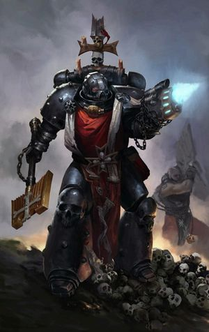
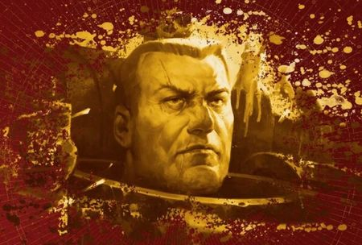
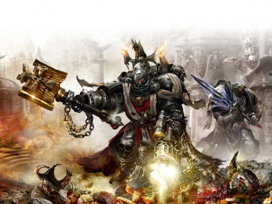
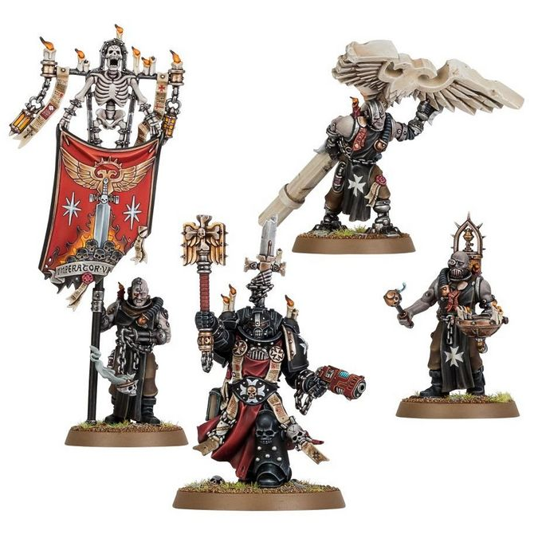

# 0665 梅瑞克·格里玛度斯 Merek Grimaldus

精校状态：中文行文已逐段精校，部分术语仍为暂定

分类：人类帝国 / 黑色圣堂

原文来源：https://www.bilibili.com/opus/1119422018171699206

原作者：帝国神选罐头

原文时间：2025年10月03日 14:49

[返回分类目录](目录.md) · [全书目录](../../目录.md)

原篇名：梅里克·格瑞马度斯 Merek Grimaldus

<!-- A0665-B0001 -->
**英文原文**

"To the darkness I bring fire. To the ignorant I bring faith. Those who welcome these gifts may live, but I will visit naught but death and eternal damnation on those who refuse them."

<!-- /A0665-B0001 -->

<!-- A0665-B0002 -->

原译文

“我给黑暗带来火焰。给无知的人带来信仰。那些欢迎这些礼物的人可能会活着，但我将会给那些拒绝这些礼物的人们带来死亡和永恒的诅咒。”

**校订译文**

“我为黑暗带来烈火，为无知者带来信仰。欣然接受这些馈赠的人可以活下去；拒绝者将迎来死亡与永恒的诅咒。”

<!-- /A0665-B0002 -->

<!-- A0665-B0003 -->
**英文原文**

Reclusiarch Merek Grimaldus is a veteran of a score of successful Black Templars Crusades.

<!-- /A0665-B0003 -->

<!-- A0665-B0004 -->

原译文

隐修长梅里克·格瑞马度斯是一位成功的黑色圣堂远征军的老兵。

**校订译文**

隐修长梅瑞克·格里玛度斯是一位身经百战的老兵，曾参加过二十次胜利的黑色圣堂远征。

**校注：** a score of 指二十次；原译漏掉数量，并把 successful 修饰成“成功的老兵/远征军”。

<!-- /A0665-B0004 -->

<!-- A0665-B0005 图片 -->

<!-- A0665-B0006 -->

原译文

Merek Grimaldus 梅里克·格瑞马度斯

**校订译文**

Merek Grimaldus 梅瑞克·格里玛度斯

<!-- /A0665-B0006 -->

<!-- A0665-B0007 -->
## Biography 传记

<!-- /A0665-B0007 -->

<!-- A0665-B0008 -->
### Early Career 早期经历

原题：Early Career 早期职业生涯

<!-- /A0665-B0008 -->

<!-- A0665-B0009 -->
**英文原文**

Grimaldus was noted by High Marshal Helbrecht to have been the youngest Marine in the Black Templars' history to be raised to the rank of Sword Brother.

<!-- /A0665-B0009 -->

<!-- A0665-B0010 -->

原译文

至高元帅赫尔布雷希特指出，格瑞马度斯是黑色圣堂历史上最年轻的被提升为圣剑兄弟的战士。

**校订译文**

至高元帅赫尔布雷彻曾指出，格里玛度斯是黑色圣堂历史上晋升圣剑兄弟时最年轻的星际战士。

<!-- /A0665-B0010 -->

<!-- A0665-B0011 -->
**英文原文**

He was later elevated from his Marshal's Sword Brethren and inducted into the mysteries of the Reclusiam after the Battle of Fire and Blood. Such was his faith and devotion to the Emperor that the Chaplains saw in the young Grimaldus the makings of a powerful warrior priest. He was mentored by Mordred, whom Grimaldus would eventually succeed as Reclusiarch.

<!-- /A0665-B0011 -->

<!-- A0665-B0012 -->

原译文

后来，他从元帅的圣剑兄弟中升任，并在火与血之战后被引入隐修室。正是由于他对帝皇的信仰和忠诚，牧师们在年轻的格瑞马度斯身上看到了成为一名强大的战士牧师的特质。他受到莫德雷德的指导，格瑞马度斯最终接替莫德雷德成为隐修长。

**校订译文**

火与血之战后，他从所属元帅的圣剑兄弟中获选晋升，开始研习隐修室的奥秘。他对帝皇的信仰与奉献如此坚定，教士们从年轻的格里玛度斯身上看到了成为强大战斗教士的潜质。他师从莫德雷德，后来接替导师担任隐修长。

<!-- /A0665-B0012 -->

<!-- A0665-B0013 -->
**英文原文**

He took his vows before the broken Sword of Dorn aboard the Battle Barge Eternal Crusader and has since justified the Chaplains' faith, zealously leading the warriors of the Black Templars in battle.

<!-- /A0665-B0013 -->

<!-- A0665-B0014 -->

原译文

他在战斗驳船永恒远征号上的多恩断剑前宣誓，此后为牧师的信仰辩护，热诚地领导黑色圣堂的战士们作战。

**校订译文**

他在战斗驳船永恒远征号上，面对多恩断剑立下誓言。此后，他满怀热忱地率领黑色圣堂战士征战，证明自己无愧于教士们的信任。

**校注：** justify the Chaplains’ faith 指证明教士对他的信任有据，不是“为教士的信仰辩护”。

<!-- /A0665-B0014 -->

<!-- A0665-B0015 -->
### Third War for Armageddon 第三次阿玛吉多顿战争

<!-- /A0665-B0015 -->

<!-- A0665-B0016 -->
**英文原文**

For his first command as Reclusiarch, High Marshal Helbrecht charged Grimaldus to lead one of the three Black Templars Crusades that had been dispatched to Armageddon, specifically the Helsreach Crusade. Grimaldus led a hundred Black Templars in the defence of Hive Helsreach. They were besieged by millions of Orks, who attacked from land-side but also from a vast fleet of submersibles launched from the icy Deadlands far to the south. Towards the end of the siege, a great horde of Orks attacked the Temple of the Emperor Ascendant, a vast basilica that had stood since the earliest days of colonisation, and was held at bay for nearly two months before they finally penetrated the temple precincts, looting and destroying priceless holy relics as they went. The Imperial Guard units and the hive militia fled, but the Black Templars refused to yield. The battle degenerated into bloody melee combat in the heart of the temple, where Grimaldus bellowed his now famous cry:"I have dug my grave in this place and I will either triumph or I will die." The battle only ended when the entire Temple collapsed. All were thought lost, but a day later, Grimaldus crawled out from underneath the ruins, carrying the last relics of the Temple. Apothecaries who later treated Grimaldus' wounds claimed that it was a miracle that he still lived, let alone had the strength to crawl from the rubble of the destroyed Temple.

<!-- /A0665-B0016 -->

<!-- A0665-B0017 -->

原译文

作为隐修长的第一个命令，至高元帅赫尔布雷希特要求格瑞马度斯领导被派往阿玛吉多顿的三个黑色圣堂远征军之一，特别是赫尔斯利奇远征军。格瑞马度斯率领一百名黑色圣堂保卫赫尔斯利奇巢都。他们被数百万欧克包围，他们从陆地一侧进攻，也从遥远的南方冰冷的死亡之地发射的庞大潜水器舰队进攻。围城接近尾声时，一大群欧克袭击了帝皇升天圣堂，这是一座自殖民初期就屹立不倒的巨大教堂，被围困了近两个月，然后他们终于渗透到圣堂区，沿途掠夺和摧毁了无价的圣物。帝国卫队和巢都民兵逃跑了，但黑色圣堂拒绝屈服。这场战斗在圣堂中心演变成了血腥的混战，格瑞马度斯在那里咆哮着他现在著名的呼喊：“我在这里挖掘了我的坟墓，要么胜利，要么死亡。”直到整个圣堂倒塌，这场战斗才结束。所有这些都被认为已经损失，但一天后，格瑞马度斯从废墟下爬了出来，带着圣堂的最后圣物。后来治疗格瑞马度斯伤口的药剂师声称，他还活着是一个奇迹，更不用说有力量从被毁的圣殿废墟中爬出来了。

**校订译文**

格里玛度斯就任隐修长后的首项指挥任务，是奉至高元帅赫尔布雷彻之命，领导派往阿玛吉多顿的三支黑色圣堂远征军之一——赫尔斯利奇远征军。他率领一百名黑色圣堂战士保卫赫尔斯利奇巢都。数百万欧克包围了他们，既从陆地进攻，也乘庞大的潜航舰队从遥远南方冰封的死亡之地发动袭击。围城战后期，大批欧克进攻帝皇升天圣堂。这座宏伟的圣堂自殖民之初便屹立于此；守军将敌人挡在外面近两个月，欧克才最终闯入圣堂区域，沿途劫掠并毁坏无价的圣物。帝国卫队与巢都民兵溃逃，黑色圣堂却拒绝退让。战斗在圣堂深处变成血腥的近身厮杀，格里玛度斯吼出了后来广为人知的誓言：“我已在此掘好坟墓；我将在此胜利，或在此死去。”战斗直到整座圣堂坍塌才告终。所有人都被认为已经丧生，但一天后，格里玛度斯带着圣堂最后的圣物，从废墟下爬了出来。后来为他治疗的药剂师声称，他能活着就已经是奇迹，更不用说还有力气爬出被毁圣堂的瓦砾堆。

<!-- /A0665-B0017 -->

<!-- A0665-B0018 图片 -->

<!-- A0665-B0019 -->

原译文

Merek Grimaldus 梅里克·格瑞马度斯

**校订译文**

Merek Grimaldus 梅瑞克·格里玛度斯

<!-- /A0665-B0019 -->

<!-- A0665-B0020 -->
**英文原文**

Upon commencement of the Season of Fire, Grimaldus was given the title "Hero of Helsreach", the greatest honour its inhabitants could grant. Grimaldus's next assignment was to have been to return to the Eternal Crusader and stand with High Marshal Helbrecht and Commissar Yarrick in their pursuit of the Ork Warlord Ghazghkull, who by this point had left the Armageddon Warzone. However, Grimaldus had uncovered evidence that a hidden enemy was attempting to systematically eliminate one of their brother Chapters, the Celestial Lions. Helbrecht gave Grimaldus leave to remain on Armageddon to investigate these troubling findings.

<!-- /A0665-B0020 -->

<!-- A0665-B0021 -->

原译文

在火之季节开始时，格瑞马度斯被授予“赫尔斯利奇英雄”的称号，这是其居民所能给予的最大荣誉。格瑞马度斯的下一个任务是回到永恒远征号，与至高元帅赫尔布雷希特和亚瑞克政委一起，追捕此时已经离开阿玛吉多顿战区的欧克军阀碎骨者。然而，格瑞马度斯发现了证据，表明一个隐藏的敌人正试图系统地消灭他们的兄弟战团之一，天狮。赫尔布雷希特允许格瑞马度斯留在阿玛吉多顿，调查这些令人不安的发现。

**校订译文**

火之季节到来时，格里玛度斯获授“赫尔斯利奇英雄”的称号，这是当地居民能够授予的最高荣誉。他接下来原本应当返回永恒远征号，与至高元帅赫尔布雷彻及亚瑞克政委一起，追击已经离开阿玛吉多顿战区的欧克军阀碎骨者。然而，格里玛度斯发现，有证据表明一个潜藏的敌人正试图有计划地消灭他们的兄弟战团天狮。赫尔布雷彻准许他留在阿玛吉多顿，调查这些令人不安的线索。

<!-- /A0665-B0021 -->

<!-- A0665-B0022 -->
**英文原文**

Grimaldus travelled to the Lions' forward base near Hive Volcanus, where he met with only 96 surviving Space Marines out of the 983 that arrived on Armageddon. After speaking with the highest-ranking surviving Celestial Lion, Pride Leader Ekene Dubaku, he learned of the Lions' plight - they had challenged the Inquisition over the conduct of Inquisitor Apollyon during the Khattar Massacre and the Inquisition had decided to make an example of the Chapter by grinding them down and letting others witness their shameful death. Dubaku and his remaining Brothers were determined to die in a final blaze of glory against the orks infesting the Mannheim Gap and avenge the deaths of those Lions that had perished in the Third War. Dubaku asked Grimaldus to perform a ceremony of last rites to bless them for the coming battle.

<!-- /A0665-B0022 -->

<!-- A0665-B0023 -->

原译文

格瑞马度斯前往火山巢都附近的天狮前方基地，在那里他会见了983名抵达阿玛吉多顿的战士中幸存的96名。在与幸存的最高级别的天狮、骄傲领袖埃肯·杜巴库交谈后，他了解到了天狮的困境 — 他们在哈塔尔大屠杀期间就审判官亚玻伦的行为向审判庭提出了质疑，审判庭决定以该战团为例，把他们碾碎，让其他人见证他们可耻的死亡。杜巴库和他剩下的兄弟们决心在最后的荣耀之火中死去，对抗曼海姆峡谷的欧克，为那些在第三次战争中丧生的天狮报仇。杜巴库请格瑞马度斯为他们举行最后的仪式，为即将到来的战斗祈福。

**校订译文**

格里玛度斯前往火山巢都附近的天狮前线基地。最初抵达阿玛吉多顿的 983 名天狮星际战士，此时只剩 96 人。他与幸存者中军阶最高的狮群领袖埃肯·杜巴库交谈，了解到战团的处境：天狮曾就审判官亚玻伦在哈塔尔大屠杀中的行径质问审判庭，审判庭因此决定以他们杀一儆百，通过持续消耗将战团磨灭，让其他人目睹他们蒙羞覆亡。杜巴库及其余下的兄弟决心向盘踞曼海姆峡谷的欧克发动最后一战，在荣耀中战死，为第三次阿玛吉多顿战争中牺牲的天狮复仇。他请求格里玛度斯为他们举行临终仪式，为即将到来的战斗赐福。

<!-- /A0665-B0023 -->

<!-- A0665-B0024 图片 -->

<!-- A0665-B0025 -->

原译文

Grimaldus at Hive Helsreach 格瑞马度斯在赫尔斯利奇巢都

**校订译文**

Grimaldus at Hive Helsreach 格里玛度斯在赫尔斯利奇巢都

<!-- /A0665-B0025 -->

<!-- A0665-B0026 -->
**英文原文**

Grimaldus, however, refused. He believed that the Celestial Lions could and should rebuild themselves. To that end, he called upon Astra Militarum forces from Helsreach and joined the Lions when they returned to Mannheim. The Imperial forces were victorious and Grimaldus earned the gratitude of Ekene Dubaku - now Chapter Master of the Celestial Lions. Grimaldus would later depart from Armageddon alongside Helbrecht in their pursuit of Ghazghkull.

<!-- /A0665-B0026 -->

<!-- A0665-B0027 -->

原译文

然而，格瑞马度斯拒绝了。他相信天狮可以而且应该重建自己。为此，他从赫尔斯利奇召集星界军部队，并在天狮返回曼海姆时加入了他们。帝国军队取得了胜利，格瑞马度斯赢得了埃肯·杜巴库的感激之情，他现在是天狮的战团长。格瑞马度斯后来与赫尔布雷希特一起离开阿玛吉多顿，追捕碎骨者。

**校订译文**

格里玛度斯却拒绝了。他相信天狮能够、也应该重建。为此，他从赫尔斯利奇召来星界军部队，并在天狮重返曼海姆时与他们并肩作战。帝国部队取得胜利，格里玛度斯也赢得了埃肯·杜巴库的感激；杜巴库此时已成为天狮战团长。此后，格里玛度斯与赫尔布雷彻一同离开阿玛吉多顿，继续追击碎骨者。

<!-- /A0665-B0027 -->

<!-- A0665-B0028 -->
### Age of the Dark Imperium 黑暗帝国时代

<!-- /A0665-B0028 -->

<!-- A0665-B0029 -->
**英文原文**

Grimaldus has since crossed the Rubicon Primaris and become a Primaris Space Marine.

<!-- /A0665-B0029 -->

<!-- A0665-B0030 -->

原译文

格瑞马度斯已经越过原铸界限，成为原铸星际战士。

**校订译文**

此后，格里玛度斯接受了原铸跨越手术，成为一名原铸星际战士。

<!-- /A0665-B0030 -->

<!-- A0665-B0031 -->
**英文原文**

In the wake of the Great Rift's creation, Armageddon has been invaded by Daemons. This has caused a climate of fearful and superstitious fervor and its major population centres have become rife with Imperial sub-cults and worshipful creeds. The same is true for the people of Hive Helsreach and Grimaldus has, perhaps unsurprisingly, become the focus of one particularly large Imperial Savior Cult within the Hive. Due to his efforts to save its people during the Third War for Armageddon, the Cult attaches spiritual significance to the Hero of Helsreach and a talismanic notion of protection to him. To worship the Reclusiarch, Grimaldus' Cult will gather at the ruins of the Temple of the Emperor Ascendant and perform several rituals in his name. These include lighting huge pyres, where the Cult burns alive citizens that they have accused of witchery, mutation or heretical thought.

<!-- /A0665-B0031 -->

<!-- A0665-B0032 -->

原译文

大裂隙形成后，阿玛吉多顿被恶魔入侵。这造成了恐惧和迷信的气氛，其主要人口中心充斥着帝国的分教派和崇拜的信条。对于赫尔斯利奇巢都的人们来说也是如此，也许毫不奇怪，格瑞马度斯已经成为巢都内一个特别大的帝国救主教派的焦点。由于他在第三次阿玛吉多顿战争期间为拯救人民所做的努力，该教派对赫尔斯利奇英雄给予了精神上的重视，并对他给予了护身符般的保护。为了崇拜隐修长，格瑞马度斯的信徒聚集在帝皇升天圣堂的废墟上，以他的名义举行几次仪式。其中包括点燃巨大的火堆，教派在那里焚烧他们指控的巫术、突变或异端思想的活着的公民。

**校订译文**

大裂隙形成后，恶魔入侵了阿玛吉多顿，恐惧与迷信狂热随之蔓延。各大人口聚居区涌现出形形色色的帝国信仰分支与崇拜教义，赫尔斯利奇巢都也不例外。格里玛度斯成为当地一个规模尤其庞大的帝国救主教派的崇拜对象，或许并不令人意外。因为他在第三次阿玛吉多顿战争中竭力拯救居民，这个教派赋予“赫尔斯利奇英雄”宗教意义，并相信他如同护身符般能够庇佑信徒。信徒聚集在帝皇升天圣堂的遗址上，以隐修长之名举行各种仪式，其中包括点燃巨大的柴堆，将他们指控犯有巫术、变异或异端思想罪行的居民活活烧死。

**校注：** 信徒认为格里玛度斯能够庇护他们；原译颠倒了保护关系。此处是教派信念，不代表叙述者证实超自然庇护。

<!-- /A0665-B0032 -->

<!-- A0665-B0033 -->
**英文原文**

Many of the Cult's members will also dig ceremonial graves and then cover them over with shrouds of industrial tarpaulin. They do so in the belief that - just as he reputedly dug his grave in the Temple's grounds once before - Grimaldus might rise from such a ritual pit, to defend the people of Helsreach as he did previously. A high ranking member of the Imperium has his servants watching these Cults, and the one that worships the Reclusiarch in particular. So far, however, it is unclear if there is anything excessively divergent in the Cult's beliefs. They do wonder, though, what the pious Grimaldus would make of the Cult, if he knew about it.

<!-- /A0665-B0033 -->

<!-- A0665-B0034 -->

原译文

许多教派成员也会挖掘仪式坟墓，然后用工业防水布覆盖。他们这样做是因为他们相信，就像他以前在圣堂里挖掘坟墓一样，格瑞马度斯可能会像以前一样从这样的仪式坑中升起，保卫赫尔斯利奇的人民。帝国的一位高级成员让他的仆人监视这些教派，尤其是崇拜隐修长的教派。然而，到目前为止，尚不清楚教派的信仰是否存在过度分歧。不过，他们确实想知道，如果虔诚的格瑞马度斯知道这件事，他会怎么看待这个教派。

**校订译文**

许多信徒还会挖出象征性的坟墓，再盖上工业防水布。他们相信，正如传说中格里玛度斯曾在圣堂内为自己掘墓一样，他或许会从这些仪式性的墓穴中走出，再次保卫赫尔斯利奇的人民。一位帝国高层已命令仆从监视这些教派，尤其是崇拜隐修长的这一支。目前仍不清楚其信仰是否严重偏离正统。不过，监视者也好奇，虔诚的格里玛度斯若知道这个教派的存在，会作何感想。

<!-- /A0665-B0034 -->

<!-- A0665-B0035 -->
## Retinue 随从

<!-- /A0665-B0035 -->

<!-- A0665-B0036 -->
**英文原文**

Grimaldus often went to battle accompanied by his Reclusiam Command Squad, known as Squad Grimaldus. Over the course of the siege of Helsreach, the squadron suffered losses, with the remaining members being wiped out in the defence of the Temple of the Emperor Ascendant.

<!-- /A0665-B0036 -->

<!-- A0665-B0037 -->

原译文

格瑞马度斯经常在他的隐修室指挥组，即格瑞马度斯小队的陪同下参加战斗。在赫尔斯利奇围城期间，中队遭受了损失，其余成员在保卫帝皇升天圣堂时损失。

**校订译文**

格里玛度斯常由自己的隐修室指挥小队陪同出战，这支队伍又称格里玛度斯小队。赫尔斯利奇围城战期间，小队不断遭受损失，余下成员也全部在保卫帝皇升天圣堂时阵亡。

<!-- /A0665-B0037 -->

<!-- A0665-B0038 -->
**英文原文**

Grimaldus elected not to reform his Command Squad following their deaths. In the aftermath of the siege, however, High Marshal Helbrecht provided Grimaldus with an apprentice, Initiate Cyneric, who was under consideration for elevation to the Chaplaincy.

<!-- /A0665-B0038 -->

<!-- A0665-B0039 -->

原译文

格瑞马度斯在他们牺牲后选择不改革他的指挥组。然而，在围城之后，至高元帅赫尔布雷希特为格瑞马度斯提供了一名学徒，即信徒塞内里克，他正在考虑升任牧师。

**校订译文**

这些战士牺牲后，格里玛度斯决定不再重建指挥小队。不过，围城战结束后，至高元帅赫尔布雷彻为他安排了一名学徒——进阶者塞内里克；后者正接受考察，有望晋升为教士。

**校注：** reform 在此指重建队伍，非改革；Initiate 按黑色圣堂官译用“进阶者”。

<!-- /A0665-B0039 -->

<!-- A0665-B0040 -->
**英文原文**

In addition, Grimaldus is occasionally accompanied by a trio of Cenobyte Servitors, each bearing one of the surviving relics from the Temple of the Emperor Ascendant - a broken aquila statue, the remains of the founding charter of Helsreach and an orb containing the last of the Temple's holy water.

<!-- /A0665-B0040 -->

<!-- A0665-B0041 -->

原译文

此外，格瑞马度斯偶尔会有三名修士机仆陪同，每名机仆都携带着帝皇升天圣堂的一件幸存圣物 — 一尊破碎的天鹰雕像、赫尔斯利奇创始宪章的残余和一个装有圣堂最后圣水的宝球。

**校订译文**

此外，格里玛度斯有时还会由三名修士机仆随行。每名机仆各携带一件从帝皇升天圣堂保存下来的圣物：破碎的天鹰雕像、赫尔斯利奇建城宪章的残片，以及盛有圣堂最后一份圣水的宝球。

<!-- /A0665-B0041 -->

<!-- A0665-B0042 图片 -->

<!-- A0665-B0043 -->

原译文

Grimaldus 格瑞马度斯

**校订译文**

Grimaldus 格里玛度斯

<!-- /A0665-B0043 -->

<!-- A0665-B0044 -->
## Wargear 武器装备

原题：Wargear 战备

<!-- /A0665-B0044 -->

<!-- A0665-B0045 -->
**英文原文**

As a Chaplain, Grimaldus wields a crozius arcanum that was forged for him upon his induction into the Chaplancy. He also possesses a plasma pistol recovered from the body of a Sergeant of the Imperial Fists who saved his life in the Battle of Alfava Metraxis.

<!-- /A0665-B0045 -->

<!-- A0665-B0046 -->

原译文

作为一名牧师，格瑞马度斯使用的是他入职牧师时为他锻造的牧师权杖。他还拥有一把等离子手枪，是从一名在阿尔法瓦·梅特里克斯之战中救了他一命的帝国之拳军士身上找到的。

**校订译文**

身为教士，格里玛度斯持有一柄在他就任教士时为其锻造的教士权杖。他还有一把等离子手枪，取自一名帝国之拳军士的遗体；这位军士曾在阿尔法瓦·梅特里克斯之战中救过他的命。

<!-- /A0665-B0046 -->

<!-- A0665-B0047 -->
**英文原文**

He wears a relic helmet, worn by every Reclusiarch in the Chapter's history since their very founding. He also has a Chaplain's rosarius made out of bronze and red iron and shaped like a heraldic cross.

<!-- /A0665-B0047 -->

<!-- A0665-B0048 -->

原译文

他戴着一顶圣物头盔，自战团成立以来，每一位隐修长都戴着这顶头盔。他还有一个由青铜和红铁制成的牧师的玫瑰念珠，形状像纹章十字。

**校订译文**

他佩戴一顶圣物头盔，战团自创建以来的每一位隐修长都曾使用它。他还拥有一枚以青铜和红铁制成的教士玫瑰念珠，外形为纹章十字。

<!-- /A0665-B0048 -->

本篇核心术语与暂定项

以下列出本篇出现的英文原形及核心术语表用词。同形词可能指不同对象，具体词义以本篇正文和校注为准；单复数、别名和仅见于图注的名称可能尚未列入。完整候选见[术语表](../../术语表/双语术语候选.csv)。

| 英文 | 采用中文 | 状态 |
| --- | --- | --- |
| Space Marines | 星际战士 | 官方已核对 |
| Black Templars | 黑色圣堂 | 官方已核对 |
| Astra Militarum | 星界军 | 官方已核对 |
| Imperial Guard | 帝国卫队 | 暂定·语境区分 |
| Orks | 欧克蛮人 | 官方已核对 |
| Commissar | 政委 | 官方已核对 |
| Great Rift | 大裂隙 | 官方已核对 |
| Inquisition | 审判庭 | 暂定 |
| Inquisitor | 审判官 | 官方已核对 |
| Imperium | 帝国 | 暂定·简称 |
| History | 历史 | 编辑用语已统一 |
| Imperial Fists | 帝国之拳 | 暂定 |
| Emperor | 帝皇 | 官方已核对 |
| Battle Barge | 战斗驳船 | 暂定·官方待核 |
| Armageddon | 阿玛吉多顿 | 暂定·官方待核 |
| Assignment | 灵能分级 | 暂定·官方待核 |
| Aquila | 天鹰 | 暂定·官方待核 |
| Master | 导师（审判庭职衔）／舰务官（舰员职务） | 语境定译·官方待核 |
| Reclusiarch | 隐修长 | 暂定·官方待核 |
| Reclusiam | 隐修圣殿 | 暂定·官方待核 |
| Rosarius | 玫瑰念珠 | 暂定·官方待核 |
| Crozius Arcanum | 教士权杖 | 暂定·官方待核 |
| Command Squad | 指挥小队 | 暂定·官方待核 |
| Reclusiam Command Squad | 隐修圣殿指挥小队 | 暂定·官方待核 |
| Chaplain | 教士 | 官方已核对 |
| Cenobyte Servitors | 修士机仆 | 暂定·官方待核 |
| Shrouds | 帷幕 | 暂定·官方待核 |
| Founding | 建军 | 暂定·官方待核 |
| Space Marine | 星际战士 | 暂定·官方待核 |
| Chapter | 战团 | 暂定·官方待核 |
| Chapter Master | 战团长 | 暂定·官方待核 |
| Veteran | 老兵 | 暂定·官方待核 |
| Sergeant | 军士 | 暂定·官方待核 |
| Brother | 修士 | 暂定·官方待核 |
| Primaris Space Marine | 原铸星际战士 | 暂定·官方待核 |
| Helbrecht | 赫尔布雷彻 | 暂定·官方待核 |
| Merek Grimaldus | 梅瑞克·格里玛度斯 | 暂定·官方待核 |
| Celestial Lions | 天狮 | 暂定·官方待核 |
| The Black Templars | 黑色圣堂 | 暂定·官方待核 |
| Pride Leader | 狮群领袖 | 暂定·官方待核 |
| Rubicon Primaris | 原铸跨越手术 | 暂定·官方待核 |
| High Marshal Helbrecht | 至高元帅赫尔布雷彻 | 官方已核 |
| Initiate | 正式成员 | 暂定·官方待核 |
| Horde | 部落 | 暂定·官方待核 |
| Commissar Yarrick | 雅瑞克政委 | 官方中文参考·英文对应待复核 |
| Ekene Dubaku | 埃肯·杜巴库 | 暂定·官方待核 |
| Apollyon | 亚玻伦 | 暂定·官方待核 |
| Khattar | 哈塔尔 | 暂定·官方待核 |
| Marshal | 元帅 | 官方已核对 |
| Sword Brother | 圣剑兄弟会修士 | 官方已核对 |
| Sword Brethren | 圣剑兄弟会 | 官方词根参考·通称待核 |
| Chaplaincy | 教士团 | 暂定·官方待核 |
| Chaplains | 教士 | 暂定·官方待核 |
| Mordred | 莫德雷德 | 暂定·官方待核 |
| Cyneric | 塞内里克 | 暂定·官方待核 |
| Battle of Fire and Blood | 火与血之战 | 暂定·官方待核 |
| Battle of Alfava Metraxis | 阿尔法瓦·梅特里克斯之战 | 暂定·官方待核 |
| Imperial Savior Cult | 帝国救主教派 | 暂定·官方待核 |
| Hive Helsreach | 赫尔斯利奇巢都 | 暂定·官方待核 |
| Plasma pistol | 等离子手枪 | 官方已核对 |
| Holy relics | 圣遗物 | 暂定·官方待核 |
| Ascendant | 升腾星堡 | 暂定·官方待核 |

