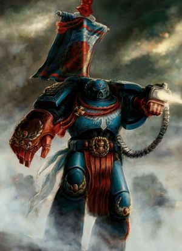
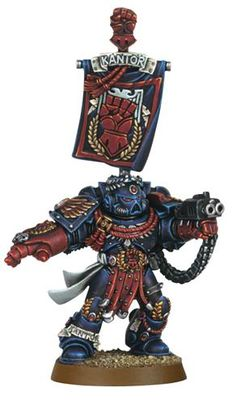

# 0666 佩德罗·坎托 Pedro Kantor

精校状态：中文行文已逐段精校，部分术语仍为暂定

分类：人类帝国 / 绯红之拳

原文来源：https://www.bilibili.com/opus/1119446112897335312

原作者：帝国神选罐头

原文时间：2025年10月03日 16:22

[返回分类目录](目录.md) · [全书目录](../../目录.md)

<!-- A0666-B0001 -->
**英文原文**

"We have been wounded sorely. Yet still we stand, with fire in our eyes and valour in our hearts. Let them think us beaten. We shall teach them otherwise."

<!-- /A0666-B0001 -->

<!-- A0666-B0002 -->

原译文

“我们受了重伤。但我们仍然站着，眼中充满火焰，心中充满勇气。让他们以为我们被打败了。否则，我们会教他们。”

**校订译文**

“我们虽身负重创，却依然屹立，眼中燃着烈火，心中满怀勇气。就让他们以为我们已被击败吧。我们会让他们知道自己错得多么彻底。”

<!-- /A0666-B0002 -->

<!-- A0666-B0003 -->
**英文原文**

Pedro Kantor (or Cantor), Lord Hellblade, is the current Chapter Master of the Crimson Fists, and one of the survivors of the Invasion of Rynn's World in 989.M41.

<!-- /A0666-B0003 -->

<!-- A0666-B0004 -->

原译文

佩德罗·坎托（或卡托），狱刃领主，目前是绯红之拳的战团长，也是989.M41入侵林恩世界的幸存者之一。

**校订译文**

佩德罗·坎托（Pedro Kantor，亦拼作 Cantor），号称“狱刃领主”，是绯红之拳的现任战团长，也是 989.M41 林恩世界入侵之战的幸存者之一。

**校注：** Cantor 是 Kantor 的英文异拼，中文统一坎托；“现任”按源文叙述时点。

<!-- /A0666-B0004 -->

<!-- A0666-B0005 图片 -->

<!-- A0666-B0006 -->

原译文

Pedro Kantor 佩德罗·坎托

**校订译文**

Pedro Kantor 佩德罗·坎托

<!-- /A0666-B0006 -->

<!-- A0666-B0007 -->
### Biography 传记

<!-- /A0666-B0007 -->

<!-- A0666-B0008 -->
**英文原文**

Pedro Kantor is first mentioned during the Battle of Melchitt Sound, when he was a Sergeant. Leading a boarding party, Kantor disabled Da Growla, an Ork Kill Kroozer. With the vessel disabled, a Crimson Fists Strike Cruiser, The Crusader, was able to scatter the fleet.

<!-- /A0666-B0008 -->

<!-- A0666-B0009 -->

原译文

佩德罗·坎托在梅尔奇特海峡之战中首次被提及，当时他还是一名军士。坎托带领一个跳帮队，让一个欧克杀戮巡洋舰 — 大咆哮号残疾了。由于舰船无法使用，一艘名为十字军号的绯红之拳打击巡洋舰能够分散舰队。

**校订译文**

关于佩德罗·坎托的最早记载出自梅尔奇特海峡之战，当时他还是一名军士。他率领跳帮队瘫痪了欧克杀戮巡洋舰大咆哮号，使绯红之拳打击巡洋舰十字军号得以击散敌方舰队。

<!-- /A0666-B0009 -->

<!-- A0666-B0010 -->
**英文原文**

Kantor would continue to rise in rank over the next 200 years, often side by side with the legendary Captain Cortez. They both participated in campaigns such as Steel Cross, the defense of Fortress Maladon and the Kardian Campaign.

<!-- /A0666-B0010 -->

<!-- A0666-B0011 -->

原译文

在接下来的200年里，坎托的等级继续上升，经常与传奇的科尔特斯连长并肩作战。他们都参加了钢铁十字、马拉顿要塞防御和卡迪安战役等战役。

**校订译文**

此后的二百年间，坎托不断晋升，常与传奇人物科尔特斯连长并肩作战。两人共同参加了钢铁十字战役、马拉顿要塞保卫战以及卡迪安战役等行动。

**校注：** Kardian 按现稿暂留卡迪安；不与 Cadia 卡迪亚直接等同。

<!-- /A0666-B0011 -->

<!-- A0666-B0012 -->
**英文原文**

He was promoted to Chapter Master in 900.M41 and was one of the few surviving Crimson Fists when the Arx Tyrannus was destroyed during the Ork invasion of Rynn's World in 989.M41. Kantor was on the outskirts of the monastery doing routine inspection, and he quickly gathered up the survivors and marched to New Rynn City, a trek that took ten days. Here they linked up with the other Crimson Fists survivors and the PDF, and managed to defeat the main Ork force.

<!-- /A0666-B0012 -->

<!-- A0666-B0013 -->

原译文

他在900.M41被提升为战团长，并且是989.M41欧克入侵林恩世界期间暴君堡被摧毁时为数不多的幸存绯红之拳之一。坎托当时在修道院的郊区进行例行检查，他迅速召集幸存者，前往新林恩城，这是一次耗时十天的跋涉。在这里，他们与其他绯红之拳幸存者和行星防御部队联合在一起，并设法击败了主要的欧克部队。

**校订译文**

他于 900.M41 晋升战团长。989.M41，欧克入侵林恩世界，暴君堡遭到毁灭，他成为少数幸存的绯红之拳之一。当时，坎托正在要塞修道院外围进行例行巡视。他迅速集结幸存者，经过十天跋涉抵达新林恩城，与其他绯红之拳幸存者及行星防御部队会合，并最终击败欧克主力。

<!-- /A0666-B0013 -->

<!-- A0666-B0014 -->
**英文原文**

The decision to conserve one's forces rather than strike at an opponent with all the might one can muster is a difficult one for a proud Space Marine. A bold military operation would probably have destroyed any hopes of rebuilding the chapter, so Kantor had to use his forces in smaller operations where the elite Space Marines could inflict maximum damage for a minimal loss of manpower. Even after winning the war, Kantor had to do his utmost to keep the High Lords of Terra from disbanding the chapter due to the extensive losses.

<!-- /A0666-B0014 -->

<!-- A0666-B0015 -->

原译文

对于一个自豪的星际战士来说，决定保留自己的力量而不是用尽全力打击对手是一个艰难的决定。一场大胆的军事行动可能会摧毁重建该战团的任何希望，因此坎托不得不在规模较小的行动中使用他的部队，在这些行动中，精英星际战士可以以最小的人力损失造成最大的伤害。即使在赢得战争后，坎托也不得不尽最大努力阻止泰拉高领主因损失惨重而解散战团。

**校订译文**

对于骄傲的星际战士而言，保存实力而不倾尽全力打击敌人，是一个艰难的决定。然而，一次贸然的大规模行动便可能葬送重建战团的全部希望。因此，坎托不得不让部队执行规模较小的任务，使精锐星际战士以尽可能少的人员损失，给敌人造成最大的打击。即使赢得战争后，他仍须竭力阻止泰拉高领主以伤亡过重为由解散战团。

<!-- /A0666-B0015 -->

<!-- A0666-B0016 -->
**英文原文**

Kantor is still Chapter Master and the Crimson Fists are almost at half their original strength as of 999.M41. He later appeared as one of the primary Imperial commanders during the War of Beasts, leading the defense of the Dirkden Fortwall.

<!-- /A0666-B0016 -->

<!-- A0666-B0017 -->

原译文

坎托仍然是战团长，截至999.M41，绯红之拳的力量几乎只有原来的一半。他后来成为野兽战争期间帝国的主要指挥官之一，领导了德克登堡垒的防御。

**校订译文**

截至 999.M41，坎托仍担任战团长，绯红之拳的兵力已恢复到接近原有规模的一半。后来，他在野兽之战中担任帝国主要指挥官之一，负责德克登堡垒防线的防御。

**校注：** War of Beasts 为野兽之战，区别 M32 的 War of the Beast 野兽战争。

<!-- /A0666-B0017 -->

<!-- A0666-B0018 -->
**英文原文**

When Kantor was made Chapter Master, he was the twenty-ninth to take on that title in the Crimson Fists.

<!-- /A0666-B0018 -->

<!-- A0666-B0019 -->

原译文

当坎托被任命为战团长时，他是绯红之拳中第二十九位获得这一头衔的人。

**校订译文**

当坎托被任命为战团长时，他是绯红之拳中第二十九位获得这一头衔的人。

<!-- /A0666-B0019 -->

<!-- A0666-B0020 图片 -->

<!-- A0666-B0021 -->

原译文

Commander Pedro Kantor 指挥官佩德罗·坎托

**校订译文**

Commander Pedro Kantor 指挥官佩德罗·坎托

<!-- /A0666-B0021 -->

<!-- A0666-B0022 -->
### Equipment 装备

<!-- /A0666-B0022 -->

<!-- A0666-B0023 -->
**英文原文**

Pedro Kantor's weapons include a power fist and Dorn's Arrow, an ancient and venerated storm bolter named after Rogal Dorn, the Primarch of the Imperial Fists (of the same gene-seed line as the Crimson Fists). It is loaded via a back-mounted powered drum feed commonly seen on vehicles, carrying approx. 800 Kraken Pattern Penetrator Rounds. This allows for a faster rate of fire at double that of a standard Storm bolter with marginally improved armor penetration.

<!-- /A0666-B0023 -->

<!-- A0666-B0024 -->

原译文

佩德罗·坎托的武器包括一件动力拳和多恩之箭，这是一件古老而受人尊敬的风暴爆矢枪，以帝国之拳的原体罗格·多恩的名字命名（与绯红之拳的基因种子系相同）。它通过载具上常见的后置动力滚筒装弹装置装载，携带约800个克拉肯型穿透弹药。这使得射击速度更快，是标准风暴爆矢的两倍，装甲穿透力略有提高。

**校订译文**

佩德罗·坎托的武器包括动力拳和“多恩之箭”。后者是一把古老而备受尊崇的风暴爆矢枪，以帝国之拳原体罗格·多恩之名命名；绯红之拳与帝国之拳也拥有相同的基因种子血统。这把枪采用载具上常见的背部安装式动力弹鼓供弹系统，可容纳约八百发克拉肯型穿甲弹。它的射速达到标准风暴爆矢枪的两倍，穿甲能力也略有增强。

<!-- /A0666-B0024 -->

<!-- A0666-B0025 -->
### Trivia 琐事

<!-- /A0666-B0025 -->

<!-- A0666-B0026 -->
**英文原文**

Pedro Kantor first appeared in Warhammer 40,000: Rogue Trader in 1987, named after "Pete Cantor" - one of the book's contributors.

<!-- /A0666-B0026 -->

<!-- A0666-B0027 -->

原译文

佩德罗·坎托于1987年首次出现在《战锤40000：行商浪人》中，以该书的撰稿人之一“佩特·坎托”命名。

**校订译文**

佩德罗·坎托于1987年首次出现在《战锤40000：行商浪人》中，以该书的撰稿人之一“佩特·坎托”命名。

<!-- /A0666-B0027 -->

<!-- A0666-B0028 -->
**英文原文**

Games Workshop did not produce a Pedro Kantor miniature until the 5th Edition of Warhammer 40,000. A tutorial in the UK version of White Dwarf 310 (UK) did explain how to build a Crimson Fist Chapter Master, however.

<!-- /A0666-B0028 -->

<!-- A0666-B0029 -->

原译文

GW直到《战锤40000》第五版才制作出佩德罗·坎托的模型作品。然而，英国版本的《白矮人310期》（英国）中的一个教程确实解释了如何构建一个制造绯红之拳战团长。

**校订译文**

Games Workshop 直到《战锤 40,000》第五版才推出佩德罗·坎托的专属模型。不过，英国版《白矮人》第 310 期曾刊登教程，介绍如何制作一名绯红之拳战团长的模型。

<!-- /A0666-B0029 -->

本篇核心术语与暂定项

以下列出本篇出现的英文原形及核心术语表用词。同形词可能指不同对象，具体词义以本篇正文和校注为准；单复数、别名和仅见于图注的名称可能尚未列入。完整候选见[术语表](../../术语表/双语术语候选.csv)。

| 英文 | 采用中文 | 状态 |
| --- | --- | --- |
| Space Marines | 星际战士 | 官方已核对 |
| Rogue Trader | 行商浪人 | 暂定 |
| Imperial Fists | 帝国之拳 | 暂定 |
| Primarch | 原体 | 官方已核对 |
| Terra | 泰拉 | 暂定·官方待核 |
| High Lords of Terra | 泰拉高领主 | 暂定·官方待核 |
| War of Beasts | 野兽之战 | 暂定·官方待核 |
| Rynn's World | 瑞恩世界 | 暂定·官方待核 |
| Master | 导师（审判庭职衔）／舰务官（舰员职务） | 语境定译·官方待核 |
| Kraken Pattern Penetrator Rounds | 克拉肯型穿甲弹 | 暂定·官方待核 |
| Ancient | 旗手 | 官方已核对 |
| Crimson Fists | 绯红之拳 | 暂定·官方待核 |
| Space Marine | 星际战士 | 暂定·官方待核 |
| Chapter | 战团 | 暂定·官方待核 |
| Chapter Master | 战团长 | 暂定·官方待核 |
| Captain | 连长 | 暂定·官方待核 |
| Sergeant | 军士 | 暂定·官方待核 |
| Pedro Kantor | 佩德罗·坎托 | 官方已核 |
| Gene-seed | 基因种子 | 暂定·官方待核 |
| Strike Cruiser | 打击巡洋舰 | 暂定·官方待核 |
| Arx Tyrannus | 暴君堡 | 暂定·官方待核 |
| Lord Hellblade | 狱刃领主 | 暂定·官方待核 |
| Battle of Melchitt Sound | 梅尔奇特海峡之战 | 暂定·官方待核 |
| Da Growla | 大咆哮号 | 暂定·官方待核 |
| The Crusader | 十字军号 | 暂定·官方待核 |
| Kardian Campaign | 卡迪安战役 | 暂定·官方待核 |
| Dirkden Fortwall | 德克登堡垒防线 | 暂定·官方待核 |
| Dorn's Arrow | 多恩之箭 | 暂定·官方待核 |
| Hellblade | 地狱之刃 | 暂定·官方待核 |
| Bolter | 爆矢枪 | 暂定·官方待核 |
| Storm bolter | 风暴爆矢枪 | 官方已核对 |
| Warhammer 40,000: Rogue Trader | 战锤40000：行商浪人 | 暂定·官方待核 |
| Power fist | 动力拳 | 官方已核对 |
| Kraken | 克拉肯 | 暂定·官方待核 |
| Games Workshop | Games Workshop | 暂定·官方待核 |

