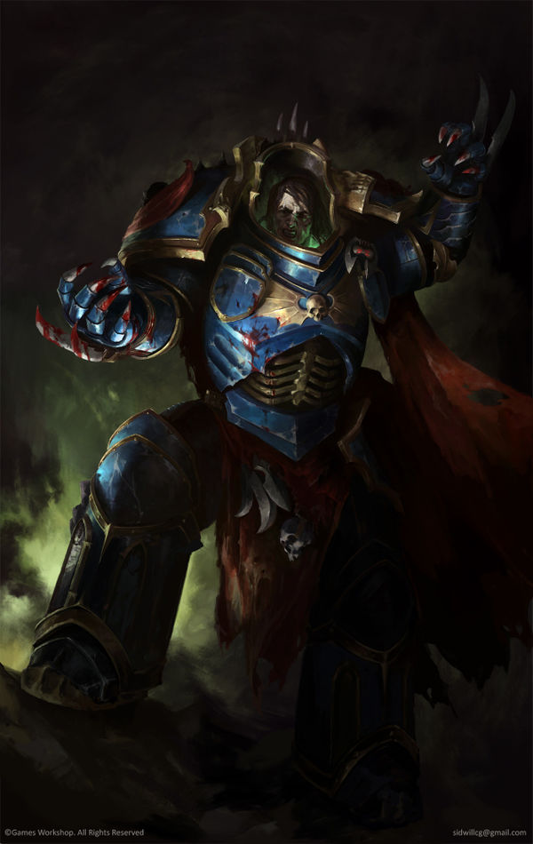
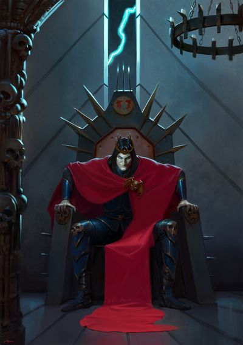
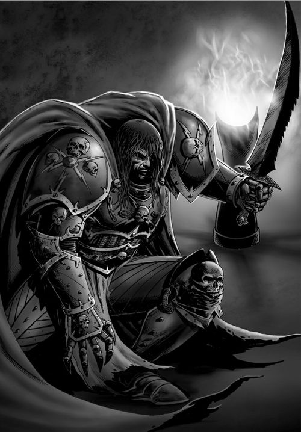
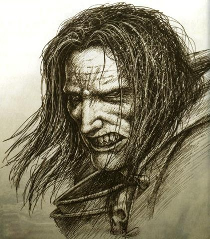
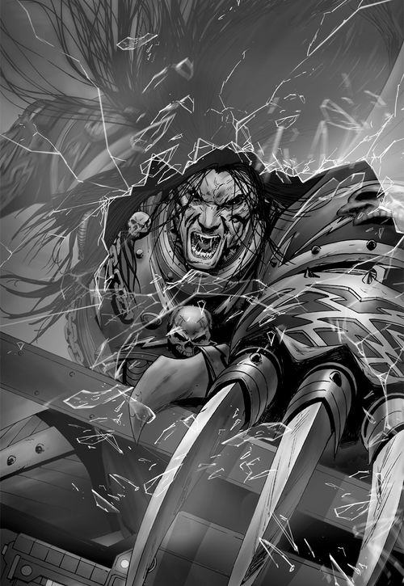
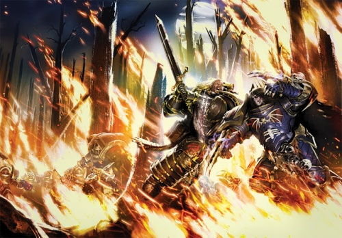
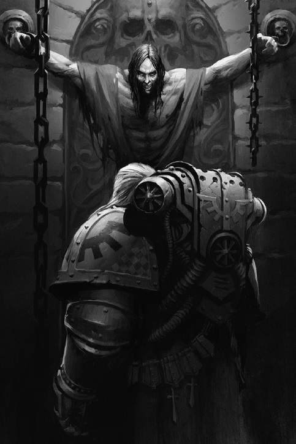
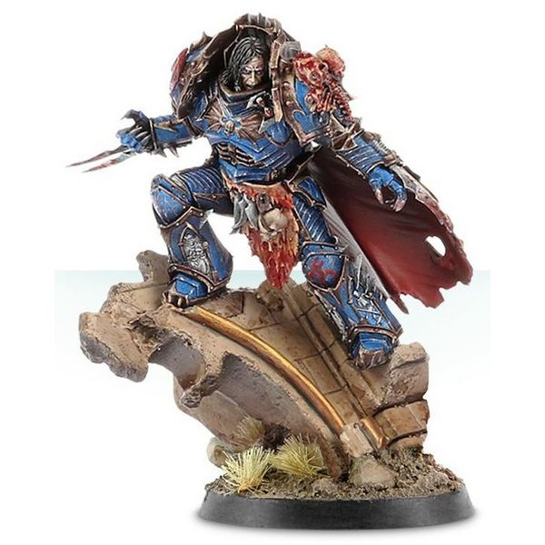

# 0667 康拉德·科兹 Konrad Curze

精校状态：中文行文已逐段精校，部分术语仍为暂定

分类：人类帝国 / 午夜领主

原文来源：https://www.bilibili.com/opus/1072639404706627591

原作者：帝国神选罐头

原文时间：2025年05月30日 13:08

[返回分类目录](目录.md) · [全书目录](../../目录.md)

<!-- A0667-B0001 -->
**英文原文**

"Death is nothing compared to vindication"

<!-- /A0667-B0001 -->

<!-- A0667-B0002 -->

原译文

“死亡与平反相比微不足道。”

**校订译文**

“死亡算得了什么，证明我是对的才重要。”

**校注：** vindication 在此是科兹认为自己的理念与行为得到证实，并非获得官方平反；结合 B0076 遗言统一。

<!-- /A0667-B0002 -->

<!-- A0667-B0003 -->
**英文原文**

Konrad Curze, also known as Night Haunter, was one of the twenty Primarchs created by the Emperor. Raised on the hellish world of Nostramo and plagued by prophetic visions of death, Curze became known as one of the most brutal and unstable Primarchs, a creature of terror and darkness that set him apart from many of his brothers. Ultimately he betrayed the Emperor and joined with Warmaster Horus in the Horus Heresy. The Chaos emissary to Lorgar called him the Killer.

<!-- /A0667-B0003 -->

<!-- A0667-B0004 -->

原译文

康拉德·科兹，也被称为午夜幽魂，是帝皇创造的二十位原体之一。在诺斯特拉莫地狱般的世界长大，被死亡的预言所困扰，科兹被称为最残酷、最不稳定的原体之一，一种恐怖和黑暗的生物，使他与许多兄弟区别开来。最终，他背叛了帝皇，并与战帅荷鲁斯一起加入了荷鲁斯叛乱。混沌派去珞珈的使者称他为杀手。

**校订译文**

康拉德·科兹，又称午夜幽魂，是帝皇创造的二十位原体之一。他在地狱般的诺斯特拉莫长大，饱受预示死亡的幻象折磨，是以残暴和精神不稳定而闻名的原体之一。他仿佛恐怖与黑暗的化身，与许多兄弟格格不入。最终，他背叛帝皇，在荷鲁斯之乱中加入战帅荷鲁斯一方。混沌派往珞珈身边的使者称他为“杀手”。

<!-- /A0667-B0004 -->

<!-- A0667-B0005 图片 -->

<!-- A0667-B0006 -->

原译文

Konrad Curze 康拉德·科兹

**校订译文**

Konrad Curze 康拉德·科兹

<!-- /A0667-B0006 -->

<!-- A0667-B0007 -->
## History 历史

<!-- /A0667-B0007 -->

<!-- A0667-B0008 -->
### Youth 青年

<!-- /A0667-B0008 -->

<!-- A0667-B0009 -->
**英文原文**

The child that would come to be known as Konrad Curze was first recorded as crashing through the surface and into the core of the night-shrouded world of Nostramo. The crust of Nostramo bore high quantities of the mineral adamantium, which provided the basis of the planet's immense mining and purifying industries. The vast majority of the planet's population lived in abject poverty, toiling in the mines while the rich grew in affluence, exploiting the already downtrodden workers. Crime ran mostly unchecked, depression was inescapable, and overpopulation was kept in check more by suicide than by any other measure.

<!-- /A0667-B0009 -->

<!-- A0667-B0010 -->

原译文

后来被称为康拉德·科兹的孩子最初被记录为穿过地表，进入诺斯特拉莫被黑夜笼罩的世界的核心。诺斯特拉莫的地壳中含有大量的精金矿物，这为地球上巨大的采矿和精炼工业提供了基础。地球上绝大多数人口生活在赤贫中，在矿井里辛勤劳动，而富人则日益富裕，剥削已经受到压迫的工人。犯罪大多没有得到控制，抑郁是不可避免的，人口过剩更多地是通过自杀来控制的，而不是通过任何其他措施。

**校订译文**

关于后来被称为康拉德·科兹的那个孩子，最早的记录是他坠入永夜笼罩的诺斯特拉莫，穿透地表，直达地核。诺斯特拉莫地壳蕴藏着大量精金，支撑起规模庞大的采矿与精炼产业。绝大多数居民赤贫如洗，在矿井中辛苦劳作；富人则压榨这些早已备受欺凌的工人，愈发富有。犯罪几乎无人遏制，绝望无处不在。相比任何其他因素，自杀更有效地限制了人口过剩。

<!-- /A0667-B0010 -->

<!-- A0667-B0011 图片 -->

<!-- A0667-B0012 -->

原译文

Young Konrad Curze 青年康拉德·科兹

**校订译文**

Young Konrad Curze 青年康拉德·科兹

<!-- /A0667-B0012 -->

<!-- A0667-B0013 -->
**英文原文**

Unlike many of the other Primarchs, Konrad Curze was not taken in by any family and was left to raise himself. He spent his early life surviving off his wits and determination, feeding himself by hunting the feral animals that roamed through the vast city of Nostramo Quintus. He was continually plagued by visions of the darkest possible future, horrifyingly potent waking dreams that would curse him throughout his life.

<!-- /A0667-B0013 -->

<!-- A0667-B0014 -->

原译文

与许多其他原体不同，康拉德·科兹没有被任何家庭收养，而是由他自己抚养。他早年靠智慧和决心生存，靠狩猎在广阔的诺斯特拉莫的昆图斯城游荡的野生动物养活自己。他不断地被最黑暗的未来的景象所困扰，那些可怕而强大的清醒梦境会诅咒他的一生。

**校订译文**

与许多其他原体不同，康拉德·科兹没有得到任何家庭的收养，只能独自长大。年幼时，他依靠机智与意志生存，捕猎游荡在诺斯特拉莫昆图斯这座巨城中的野生动物充饥。最黑暗的未来可能性不断化作幻象纠缠他；这些强烈得令人惊骇的清醒梦境，将成为伴随他一生的诅咒。

<!-- /A0667-B0014 -->

<!-- A0667-B0015 -->
### Night Haunter 午夜幽魂

<!-- /A0667-B0015 -->

<!-- A0667-B0016 -->
**英文原文**

During his short youth, Curze was pitched into a destructive cycle of persecution and murder, focusing on the criminal elements of Nostramo's society. His vigilante actions began small, intervening when he witnessed something he believed to be wrong, but rapidly escalating into hunting down those he believed had committed transgressions. At first, several people prominent within the city's corrupt hierarchy disappeared. Leaders of the most vocal opposition to the status quo vanished in similar circumstances. Bodies of known criminals began to appear, gutted like fish by some cruel assailant. Officials were found hung from high windows. Body parts blocked storm water drains. Many of the corpses found were so horribly beaten by their assailant that identification was impossible. Within the year, the crime rate of Nostramo Quintus fell to near-zero. Society underwent massive changes, most notable of which was the self-imposed curfew that came into being. Mothers began to threaten children that if they continued to misbehave, the Night Haunter would come for them. This term quickly came into common usage, describing a dark creature that stalked the city, ready to disembowel anyone it believed to be a criminal or heretic with dirty, razor-sharp talons.

<!-- /A0667-B0016 -->

<!-- A0667-B0017 -->

原译文

在他短暂的青年时期，科泽陷入了迫害和杀戮的毁灭性循环，专注于诺斯特拉莫社会的犯罪分子。他的治安维持行动起初很小，只在他目睹了他认为错误的事情时进行干预，但迅速升级为追捕他认为有违法行为的人。起初，该市腐败等级制度中的几位重要人物消失了。在类似的情况下，最强烈反对现状的领导人也消失了。已知罪犯的尸体开始出现，被残忍的袭击者像鱼一样挖出内脏。官员们被发现吊在高高的窗户上。身体部位堵塞了雨水排放口。许多被发现的尸体被袭击者殴打得如此可怕，以至于无法辨认。年内，诺斯特拉莫的昆图斯城的犯罪率降至接近零。社会经历了巨大的变化，其中最引人注目的是自行实施的宵禁。母亲们开始威胁孩子们，如果他们继续行为不端，午夜幽魂就会来抓他们。这个词很快就被广泛使用，描述了一种在城市中潜行的黑暗生物，准备用肮脏、锋利的爪子挖出任何它认为是罪犯或异端的人的内脏。

**校订译文**

在短暂的少年时期，科兹陷入了追猎与杀戮的恶性循环，将诺斯特拉莫社会中的犯罪分子作为目标。他的私刑行动最初规模很小，只在目睹自己认为不对的事情时出手干预，但很快便发展为主动追杀他认定的作恶者。起初，城中腐败权力体系里的几名要人失踪了；最激烈反对现状的领袖也在类似情况下消失。随后，恶名昭彰的罪犯尸体开始出现，腹部如同宰鱼般被某个残忍的袭击者剖开。官员被吊在高窗外，残肢堵塞了雨水排水口。许多尸体遭到惨烈殴打，已无法辨认身份。不到一年，诺斯特拉莫昆图斯的犯罪率便降至近乎为零。社会发生剧变，最显著的是居民自发实行宵禁。母亲们开始吓唬孩子：再不听话，午夜幽魂就会来抓他们。这个称呼迅速传开，指代在城中潜行的黑暗怪物；它随时会用肮脏而锋利如剃刀的爪子，将自己认定的罪犯或异端开膛破肚。

<!-- /A0667-B0017 -->

<!-- A0667-B0018 图片 -->

<!-- A0667-B0019 -->

原译文

Konrad Curze 康拉德·科兹

**校订译文**

Konrad Curze 康拉德·科兹

<!-- /A0667-B0019 -->

<!-- A0667-B0020 -->
**英文原文**

Curze saw hope for the inhabitants of his world. He had become the only object of fear and hate within the city. Appearing before the nobles that had survived his vigilante purge, Night Haunter became the first monarch of Nostramo Quintus. He assimilated knowledge almost greedily, and became considered a fair and temperate ruler, until word of some injustice reached his ears. He would then hunt the guilty through the streets, wearing them down and then killing and mutilating them. The unpredictable pattern of benevolent wisdom and hideous vengeance ushered in a new level of efficiency and honesty. Other cities around the planet followed suit, in an attempt to keep the Night Haunter from their doors.

<!-- /A0667-B0020 -->

<!-- A0667-B0021 -->

原译文

寇兹看到了他的世界居民的希望。他成了这座城市里唯一恐惧和仇恨的对象。午夜幽魂出现在那些在私刑清洗中幸存下来的贵族面前，成为诺斯特拉莫的昆图斯城的第一位君主。他几乎贪婪地吸收知识，被认为是一个公正温和的统治者，直到听到一些不公正的话。然后，他会在街上追捕罪犯，把他们打倒，然后杀害和残杀他们。仁慈的智慧和可怕的复仇的不可预测的模式带来了崭新的效率和正直。星球上的其他城市也纷纷效仿，试图将午夜幽魂拒之门外。

**校订译文**

科兹觉得，这个世界的居民终于有了希望；他自己已成为城中唯一令人恐惧和憎恨的对象。午夜幽魂来到从私刑清洗中幸存的贵族面前，成为诺斯特拉莫昆图斯的第一位君主。他近乎贪婪地汲取知识，被视为公正、克制的统治者——直到某件不公之事传到他耳中。他便会在街巷间追猎罪人，耗尽对方的体力，再将其杀死、肢解。仁慈明智与骇人报复之间难以预测的转换，使行政效率与廉洁程度达到新的高度。星球上其他城市也纷纷效仿，以免午夜幽魂找上门来。

<!-- /A0667-B0021 -->

<!-- A0667-B0022 -->
### The Coming of the Emperor 帝皇的到来

<!-- /A0667-B0022 -->

<!-- A0667-B0023 -->
**英文原文**

A short time into the reign of Night Haunter, the Emperor's Great Crusade reached the outskirts of the Nostramo system. The coming of the Emperor of Man was an event that had been prophesied in Nostramo's history: an event that would lead to the planet's downfall.

<!-- /A0667-B0023 -->

<!-- A0667-B0024 -->

原译文

在午夜幽魂统治的短时间内，帝皇的大远征到达了诺斯特拉莫星系的边区。人类帝皇的到来是诺斯特拉莫历史上预言的一个事件：一个将导致星球毁灭的事件。

**校订译文**

午夜幽魂开始统治后不久，帝皇的大远征抵达诺斯特拉莫星系外围。诺斯特拉莫的历史中早有预言：人类帝皇将会到来，而这也将导致这颗星球的毁灭。

<!-- /A0667-B0024 -->

<!-- A0667-B0025 图片 -->

<!-- A0667-B0026 -->

原译文

Konrad Curze 康拉德·科兹

**校订译文**

Konrad Curze 康拉德·科兹

<!-- /A0667-B0026 -->

<!-- A0667-B0027 -->
**英文原文**

The Emperor, Fulgrim, Ferrus Manus, Rogal Dorn, and Lorgar landed on Nostramo, and led a delegation to the centre of Nostramo Quintus on foot. The citizens of Nostramo, adapted to the near-constant darkness, could not bear to look upon the radiance of the Emperor. Most wept, as the healing light he projected reflected off the rain-slicked streets into their faces. Those brave enough to look upon him directly were blinded. At the end of the broad road leading to Night Haunter's palace, the Primarch stood, waiting for the delegation to approach. As they did, he succumbed to a vision so potent and horrifying that he tried to claw his own eyes out, but was stopped by the Emperor. Night Haunter then looked at the Emperor and his brothers, and it is said he foresaw the fates of them all as well as his own death. He then looked at his father and the following dialogue ensued:

<!-- /A0667-B0027 -->

<!-- A0667-B0028 -->

原译文

帝皇、福格瑞姆、费鲁斯·马努斯、罗格·多恩和珞珈登上了诺斯特拉莫，并率领代表团步行前往诺斯特拉莫的昆图斯城。诺斯特拉莫的人民已经适应了近乎持续的黑暗，无法忍受看到帝皇的光芒。大多数人都哭了，因为他投射出的治愈之光从雨水浸湿的街道反射到他们的脸上。那些勇敢地直视他的人双目失明。在通往午夜幽魂宫殿的宽阔道路尽头，原体站在那里，等待代表团的到来。就在他们这样做的时候，他屈服于一个如此强大和可怕的幻象，以至于他试图挖出自己的眼睛，但被帝皇拦住了。午夜幽魂看着帝皇和他的兄弟们，据说他预见到了他们所有人的命运以及自己的死亡。然后，他看着父亲，接着进行了以下对话：

**校订译文**

帝皇与福格瑞姆、费鲁斯·马努斯、罗格·多恩及珞珈一同降临诺斯特拉莫，率领使团步行前往诺斯特拉莫昆图斯的市中心。居民早已适应近乎永恒的黑暗，无法承受帝皇的光辉。他散发的疗愈之光从雨湿的街道反射到人们脸上，令大多数人流下泪来；那些大胆直视他的人则双目失明。在通往午夜幽魂宫殿的大道尽头，原体静候使团到来。当他们走近时，一个极其强烈而恐怖的幻象突然攫住了他，令他企图挖出自己的双眼，却被帝皇制止。随后，午夜幽魂望向帝皇与兄弟们；据说，他看见了所有人的命运，也看见了自己的死亡。接着，他望着父亲，两人有了如下对话：

<!-- /A0667-B0028 -->

<!-- A0667-B0029 -->
**英文原文**

"Konrad Curze, be at peace, for I have arrived and intend to take you home."

<!-- /A0667-B0029 -->

<!-- A0667-B0030 -->

原译文

“康拉德·柯兹，放心，因为我已经到了并打算带你回家。”

**校订译文**

“康拉德·科兹，平静下来吧。我已经来了，要带你回家。”

<!-- /A0667-B0030 -->

<!-- A0667-B0031 -->
**英文原文**

"That is not my name, Father. I am Night Haunter, and I know full well what you intend for me."

<!-- /A0667-B0031 -->

<!-- A0667-B0032 -->

原译文

“那不是我的名字，父亲。我是午夜幽魂，我完全知道你对我的打算。”

**校订译文**

“那不是我的名字，父亲。我是午夜幽魂，我完全知道你对我的打算。”

<!-- /A0667-B0032 -->

<!-- A0667-B0033 -->
### The Great Crusade 大远征

<!-- /A0667-B0033 -->

<!-- A0667-B0034 -->
**英文原文**

When Curze first took command of his Legion, he was vicious and horrifying to behold but nonetheless was a regal leader with a clear sense of justice. This Curze was in stark contrast to the monster he would eventually become. The Night Haunter quickly adapted to the teachings of the Imperium, studying the complex doctrines of the Adeptus Astartes under Fulgrim's tutelage. During this time Curze had visions of the Horus Heresy and Fulgrim's fall, telling him of their dark future. Curze was eventually placed in command of his Space Marine Legion, which he renamed the Night Lords.

<!-- /A0667-B0034 -->

<!-- A0667-B0035 -->

原译文

当科兹第一次指挥他的军团时，他看起来很恶毒和可怕，但他仍然是一位具有明确正义感的帝王领袖。这个科兹与他最终变成的怪物形成了鲜明对比。午夜幽魂很快适应了帝国的教义，在福格瑞姆的指导下研究了阿斯塔特的复杂教义。在这段时间里，科兹看到了荷鲁斯叛乱和福格瑞姆堕落的幻象，告诉他他们黑暗的未来。科兹最终被任命为星际战士军团的指挥官，并将其更名为午夜领主。

**校订译文**

科兹初掌军团时虽凶狠骇人，却仍有君王般的威仪，以及明确的正义观念，与后来沦为的怪物截然不同。午夜幽魂很快掌握帝国的教导，在福格瑞姆指导下研习阿斯塔特修会复杂的作战学说。这段时期，他看见了荷鲁斯之乱与福格瑞姆堕落的幻象，并将黑暗的未来告诉了这位兄弟。科兹最终正式受命统率自己的星际战士军团，将其改名为午夜领主。

<!-- /A0667-B0035 -->

<!-- A0667-B0036 -->
**英文原文**

Although he and his Legion excelled in many theatres of war, a tendency soon became apparent. It never occurred to the Night Lords to use anything other than total and decisive force to achieve their goals. Over the first few years, the Night Lords were molded by their Primarch into an efficient, humourless force, possessing the fanatical thoroughness of Witch Hunters. Night Haunter encouraged his legion to decorate their armour with images designed to inspire fear in the enemy, a tactic that proved incredibly effective. Soon, rumours of the impending presence of the Night Lords would cause a system to pay all outstanding tithes, cease all illegal activities and put to death any mutants and suspected heretics. Reinforcements to replace the Night Lords that fell in battle were selected from the population of Nostramo, but in Night Haunter's absence, the population of the planet collapsed back into the corrupt and decadent ways that had prevailed before his arrival. Originally Curze had intended to only have the best and brightest of Nostramo serve within the Legion, but in a ploy to avoid the Imperial Tithe the noble families of the world emptied its jails and sent him murderers and thieves. By the time Curze had realized what was happening he already viewed the Night Lords as a corrupted Legion. Curze began to lose some of the control he held over his Legion, and the visions that plagued him increased in both lucidity and quantity. Curze was unique among the Primarchs in that he hated his own Legionaries, viewing them as the very criminals he sought out to destroy.

<!-- /A0667-B0036 -->

<!-- A0667-B0037 -->

原译文

尽管他和他的军团在许多战场上表现出色，但一种趋势很快变得明显。午夜领主们从未想过，除了使用全面而果断的力量来实现他们的目标外，还可以使用其他任何东西。在最初的几年里，午夜领主被他们的原体塑造成一支高效、无情的部队，拥有猎巫人的彻底狂热性。午夜幽魂鼓励他的军团用旨在激发敌人恐惧的图像装饰他们的盔甲，这一策略被证明非常有效。很快，关于午夜领主即将到来的谣言将导致一个系统支付所有未付的什一税，停止所有非法活动，并处死任何变种人和疑似异端。从诺斯特拉莫的人口中选出了增援部队，以取代在战斗中倒下的午夜领主，但在午夜幽魂缺席的情况下，这个星球的人口又回到了他到来之前盛行的腐败和颓废的方式。起初，科兹只打算让诺斯特拉莫中最优秀、最聪明的人在军团中服役，但为了躲避帝国什一税，世界各地的贵族家庭清空了监狱，派来了杀人犯和小偷。当科兹意识到发生了什么时，他已经把午夜领主视为一个腐败的军团。科兹开始失去对军团的一些控制，困扰他的幻觉在清晰度和数量上都有所增加。 科兹在原体中是独一无二的，因为他憎恨自己的军团，将他们视为他试图摧毁的罪犯。

**校订译文**

科兹与他的军团虽在许多战区表现出色，却很快显露出一种倾向：午夜领主从不考虑其他手段，只会以毫无保留、务求彻底的武力达成目的。最初几年，原体将他们塑造成一支高效而严酷的部队，像猎巫人一样狂热地追求斩草除根。午夜幽魂鼓励战士在盔甲上绘制能令敌人恐惧的图案，效果极其显著。不久之后，仅仅传出午夜领主即将抵达的消息，就足以让一个星系补缴全部拖欠的什一税、停止一切非法活动，并处死所有变种人与疑似异端。军团从诺斯特拉莫征募新兵，补充战斗损失；然而，午夜幽魂离开后，这颗星球又重新陷入他到来前的腐败与堕落。科兹起初只想招收诺斯特拉莫最优秀、最聪慧的人，贵族家族却为了规避帝国什一税，清空监狱，将杀人犯和盗贼送给他。等科兹察觉真相时，他已认定午夜领主成了腐化的军团。他逐渐失去对军团的部分控制，而折磨他的幻象变得越来越清晰，也越来越频繁。科兹在原体中独树一帜：他憎恨自己的军团战士，将他们视为自己立志消灭的那类罪犯。

<!-- /A0667-B0037 -->

<!-- A0667-B0038 -->
**英文原文**

Curze's relations with his brothers were equally strained. The Night Lords brutal tactics caused controversy among other Primarchs, most notably Rogal Dorn and Vulkan. However while he was widely reviled, Curze himself states that he didn't hate any of his brother save Corax. The two were extremely similar in their appearance, tactics, and upbringing but unlike him Corax had retained his humanity and dignity despite his hellish upbringing. Curze himself did not know if he hated Corax out of self-loathing or the fact that he saw the Ravenlord as still holding onto naive ideals despite his upbringing. For his part, Corax stated that he hated nothing about Curze save his methods of waging war.

<!-- /A0667-B0038 -->

<!-- A0667-B0039 -->

原译文

科兹与他的兄弟们的关系同样紧张。午夜领主的残酷战术在其他原体中引起了争议，最著名的是罗格·多恩和沃坎。然而，尽管他受到了广泛的谴责，但科兹自己表示，除了科拉克斯之外，他并不憎恨他的任何兄弟。两人在外貌、战术和成长经历上极为相似，但与他不同的是，尽管受到地狱般的成长，科拉克斯仍然保持了人性和尊严。科兹自己不知道他是因为自我厌恶而憎恨科拉克斯，还是因为他认为尽管受到了教育，但渡鸦领主仍然坚持着天真的理想。就他而言，科拉克斯表示，除了他发动战争的方法外，他对科兹一无所知。

**校订译文**

科兹与兄弟们的关系同样紧张。午夜领主残酷的战术引发其他原体的争议，尤其受到罗格·多恩与沃坎的反对。不过，尽管许多兄弟厌恶他，科兹却声称，自己唯一憎恨的兄弟是科拉克斯。两人在外貌、战术与成长经历上都极为相似；但科拉克斯历经地狱般的童年，仍保有人性与尊严。科兹自己也说不清，这份憎恨究竟源于自我厌弃，还是因为他认为渡鸦领主经历了这一切，却仍固守天真的理想。科拉克斯则表示，除了科兹发动战争的方式之外，他并不憎恨这位兄弟的其他方面。

**校注：** 原译末句“对科兹一无所知”误译 hated nothing...save his methods，实指只憎恨其作战方式。

<!-- /A0667-B0039 -->

<!-- A0667-B0040 -->
**英文原文**

Relations with Vulkan were even more strained, with the Primarch nearly fighting Curze over the fate of Kharaatan. Sometime after Curze had a particularly violent vision where he saw the future monstrosity he was destined to become. Curze was horrified by his future, and when snapped out of his trance he realized he had murdered one of his archivists. This was the first known person Curze killed whom he considered "innocent", and it was at this moment that Curze realized he himself now deserved punishment.

<!-- /A0667-B0040 -->

<!-- A0667-B0041 -->

原译文

与沃坎的关系则更加紧张，原体几乎要为卡拉坦的命运与科兹作战。不久之后，科兹看到了一个特别激烈的幻象，他看到了自己注定要成为的未来的怪物。科兹对自己的未来感到震惊，当他从恍惚中醒来时，他意识到自己杀死了一名档案员。这是科兹杀害的第一个他认为“无辜”的人，就在这一刻，科兹意识到自己现在应该受到惩罚。

**校订译文**

他与沃坎的关系更加紧张，后者几乎为哈拉坦的命运与他大打出手。此后某时，科兹经历了一场尤为猛烈的幻象，看见自己注定将成为的怪物。他对这一未来惊恐不已；从恍惚中醒来后，才发现自己已经杀死了一名档案员。这是目前已知第一个被科兹杀死、而他自己也认定为“无辜者”的人。就在那一刻，科兹意识到，自己如今也应当受到惩罚。

**校注：** Kharaatan 按全书更早篇暂定哈拉坦，原卡拉坦。

<!-- /A0667-B0041 -->

<!-- A0667-B0042 -->
**英文原文**

Later, in a campaign with the Imperial Fists and Emperor's Children in the Cheraut System, he learned of the renewed crime and anarchy on his homeworld. Falling into anguish, the Night Haunter tried to confide in his brother Primarchs Fulgrim and Rogal Dorn, but they had never been close to them in the beginning, and their reaction was less than favourable to his claims. When Fulgrim revealed Curze had told him of disturbing visions of civil war, Dorn confronted the Night Haunter on the matter. Finally snapping from Fulgrim's betrayal of confidence Curze attacked and wounded Dorn as well as massacring several Imperial Fists that were guarding him before taking the Night Lords fleet to Nostramo. A few Imperial pursuit craft arrived just in time to see the Night Lords' laser batteries firing into the hole left by Night Haunter's arrival decades earlier. Nostramo's core overheated and the world exploded.

<!-- /A0667-B0042 -->

<!-- A0667-B0043 -->

原译文

后来，在切劳特星系中与帝国之拳和帝皇之子的一场战役中，他了解到家园世界再次出现犯罪和无政府状态。午夜幽魂陷入痛苦，试图向他的兄弟原体福格瑞姆和罗格·多恩吐露心声，但他一开始从未接近过他们，他们的反应也不太赞成他的说法。当福格瑞姆透露科兹告诉他令人不安的内战景象时，多恩就此事与午夜幽魂对峙。最后，在福格瑞姆对信任的背叛中，科兹袭击并打伤了多恩，并屠杀了几名守卫他的帝国之拳，然后将午夜领主舰队带到了诺斯特拉莫。几艘帝国追击艇及时抵达，看到午夜领主的激光阵列射入了几十年前午夜幽魂抵达时留下的洞。诺斯特拉莫的核心过热，世界爆炸。

**校订译文**

后来，他在切劳特星系与帝国之拳、帝皇之子共同作战时，得知母星再次陷入犯罪与无政府状态。午夜幽魂痛苦不堪，试图向福格瑞姆和罗格·多恩倾诉；然而，三人本就不亲近，两位兄弟对他的说法也反应不佳。福格瑞姆透露科兹曾向他诉说关于内战的可怕幻象后，多恩前来质问午夜幽魂。福格瑞姆泄露秘密、辜负信任，终于令科兹失控。他袭击并打伤多恩，又屠杀了数名看守他的帝国之拳战士，随后率午夜领主舰队返回诺斯特拉莫。几艘追赶而来的帝国舰艇恰好目睹：午夜领主的激光炮组正向数十年前午夜幽魂坠落时留下的孔洞开火。诺斯特拉莫地核过热，整颗星球随即爆炸。

<!-- /A0667-B0043 -->

<!-- A0667-B0044 -->
### The Horus Heresy 荷鲁斯之乱

原题：The Horus Heresy 荷鲁斯叛乱

<!-- /A0667-B0044 -->

<!-- A0667-B0045 -->
**英文原文**

Night Haunter's terrible acts caused him to become susceptible to the whispers of Chaos. The campaigns of the Night Lords became less justifiable, terror campaigns leaving a trail of devastated worlds across the galaxy. Night Haunter no longer crusaded in the Emperor's name, instead fighting only in the name of death and fear. Eventually, the Emperor was forced to order the recall of Night Haunter to answer charges laid against him and his men. But before the Night Lords reached Terra a new crisis erupted...

<!-- /A0667-B0045 -->

<!-- A0667-B0046 -->

原译文

午夜幽魂的可怕行为使他变得容易受到混沌的低语。午夜领主的行动变得不那么正当，恐怖活动在银河系中留下了一系列被摧毁的世界。午夜幽魂不再以帝皇的名义进行远征，而是以死亡和恐惧的名义进行战斗。最终，帝皇被迫下令召回午夜幽魂，以回应对他和他的部下的指控。但在午夜领主到达泰拉之前，一场新的危机爆发了...

**校订译文**

午夜幽魂的可怕行径使他更容易受到混沌低语的影响。午夜领主的征战越来越难以辩护，恐怖攻势令一个又一个世界化为废墟。午夜幽魂不再以帝皇之名远征，只为死亡与恐惧而战。最终，帝皇不得不下令召回他，令他为自己与部下受到的指控接受问讯。然而，午夜领主尚未抵达泰拉，一场新的危机便爆发了……

<!-- /A0667-B0046 -->

<!-- A0667-B0047 图片 -->

<!-- A0667-B0048 -->

原译文

Konrad Curze smashes into a Storm Eagle during his rampage on Macragge 康拉德·科兹在马库拉格的横冲直撞中撞上了一只风暴鹰

**校订译文**

Konrad Curze smashes into a Storm Eagle during his rampage on Macragge 康拉德·科兹在马库拉格肆虐时撞入一架风暴鹰炮艇

<!-- /A0667-B0048 -->

<!-- A0667-B0049 -->
**英文原文**

When the Horus Heresy broke out, Night Haunter was quick to swear his Legion to the forces of Warmaster Horus. Curze revealed his treachery during the Drop Site Massacre, launching his legion against the loyalist forces of the Raven Guard, Salamanders, and Iron Hands. During the battle, Curze and Lorgar battled against Corax. After the massacre, Curze captured Vulkan but found that the Perpetual Primarch could not be killed despite his best efforts. After unleashing every torment imaginable on Vulkan, the Salamanders Primarch was eventually able to escape Curze's clutches.

<!-- /A0667-B0049 -->

<!-- A0667-B0050 -->

原译文

当荷鲁斯叛乱爆发时，午夜幽魂很快向战帅荷鲁斯的军队宣誓他的军团。科兹在登陆点大屠杀中揭露了他的背叛，发动了他的军团对抗暗鸦守卫、火蜥蜴和钢铁之手的忠诚部队。在战斗中，科兹和珞珈与科拉克斯作战。大屠杀后，科兹俘虏了沃坎，但发现尽管他尽了最大的努力，但这位永生者原体还是无法被杀死。在对沃坎施加了所有可以想象的折磨后，火蜥蜴原体最终逃脱了科兹的魔爪。

**校订译文**

荷鲁斯之乱爆发后，午夜幽魂迅速宣布军团效忠战帅荷鲁斯。他在登陆点大屠杀中公开叛变，率军攻击暗鸦守卫、火蜥蜴与钢铁之手的忠诚派部队。战斗中，他与珞珈一同对抗科拉克斯。大屠杀后，科兹俘获了沃坎，却发现无论如何尝试，都无法真正杀死这位身为永生者的原体。他对沃坎施以一切可以想象的酷刑，但火蜥蜴原体最终还是逃出了他的掌控。

<!-- /A0667-B0050 -->

<!-- A0667-B0051 -->
**英文原文**

Two years after the Dropsite Massacre, Curze engaged the Lion El'Jonson in a series of hit and run battles all over the Thramas Sector. Eventually, Curze would leave a message for his brother to meet him (Curze) on the planet Tsagualsa. Here he would reveal some prophecy to Lion. Afterwards, a fight would ensue between the two Primarchs and their respective troops. Eventually, Curze would slash the Lion's throat and the Dark Angel Corswain would stab the Night Haunter in the back. Both Legions retreated. The next encounter between the two brothers would begin when the Dark Angels ambushed the Night Lords and would end with the Lion dealing Curze eleven identifiable wounds that are instantly fatal to an Astartes. These injuries would put Curze in a comatose state. While recovering, Sevatar would take temporary command of the Legion and divide it into six fleets that would go wherever the respective commander directed it. During this reorganization, the Dark Angels would attack again. During this second attack, Curze would reawaken and board the Invincible Reason. He would remain in hiding aboard the Dark Angels' flagship for the next sixteen weeks. Curze was able to evade capture on the massive ship, massacring every search team and confounding the Lion himself.

<!-- /A0667-B0051 -->

<!-- A0667-B0052 -->

原译文

登陆点大屠杀两年后，科兹与莱昂·艾尔庄森在整个萨拉马斯星区进行了一系列运动战。最终，科兹给他的兄弟留下一条信息，让他在察古尔萨星球上与科兹会面。在这里，他会向莱昂透露一些预言。随后，两位原体及其各自的军队之间发生战斗。最终，科兹割断莱昂的喉咙，黑暗天使的考斯韦恩在背后刺击午夜幽魂。两个军团都撤退了。两兄弟之间的下一次相遇将在黑暗天使伏击午夜领主时开始，并以莱昂造成了科兹的十一处可识别的伤口而结束，这些伤口对阿斯塔特来说是致命的。这些伤害使科兹陷入昏迷状态。在恢复期间，赛维塔临时指挥军团，将其分为六支舰队，这些舰队将前往各自指挥官指示的任何地方。在这次重组中，黑暗天使将再次进攻。在第二次攻击中，科兹被重新唤醒并登上无敌理性号。在接下来的十六周里，他继续躲在黑暗天使的旗舰上。科兹成功逃脱了在这艘巨型战舰上的抓捕，屠杀了每一支搜索队，并让莱昂本人感到困惑。

**校订译文**

登陆点大屠杀两年后，科兹在整个萨拉马斯星区与莱昂·艾尔’庄森展开一连串袭扰战。最终，他留话约莱昂在察古尔萨会面，并在那里透露了部分预言。随后，两位原体及其部队爆发冲突。科兹割伤莱昂的咽喉，黑暗天使战士考斯韦恩则从背后刺中午夜幽魂，两个军团随后各自撤退。两兄弟下一次交锋始于黑暗天使对午夜领主的伏击；莱昂在科兹身上留下十一处清晰可辨的伤口，每一处都足以让普通阿斯塔特当场毙命，令他陷入昏迷。科兹养伤期间，赛维塔暂掌军团，将其分为六支舰队，由各自指挥官决定去向。重组尚未完成，黑暗天使再度来袭。科兹在第二次进攻期间苏醒，登上无敌理性号，此后在这艘黑暗天使旗舰上躲藏了十六周。他在庞大的舰体内躲避追捕，屠杀每一支搜索队，连莱昂本人也拿他无可奈何。

<!-- /A0667-B0052 -->

<!-- A0667-B0053 -->
**英文原文**

When the Dark Angels ship arrived over Macragge, Curze made his escape and landed on the planet by hacking into the Invincible Reason and initiating a mass Drop Pod landing, commandeering one of the vessels. Curze then unleashed havoc upon Macragge's capital, massacring all he came across and eluding any capture. After killing Phratus Auguston in a Chapel within the Fortress of Hera, Curze was confronted by both Roboute Guilliman and Lion El'Jonson. Managing to hold out against both Primarch's simultaneously, Curze unveiled his trap and detonated the explosives he had rigged around the Chapel. Curze escaped in the chaos while Guilliman and the Lion only survived thanks to Barabas Dantioch teleporting them to Sotha with the Pharos. Thinking both Primarch's dead, Curze swept aside a pack of Space Wolves and was about to kill Guilliman's "mother" Tarasha Euten when he was beset upon by the now-insane Vulkan, who had teleported to Macragge. Curze, in genuine shock due to not having any visions of Vulkan, battled the Salamanders Primarch across Macragge. The duel was only interrupted by the Cabal assassin John Grammaticus, who stabbed and apparently killed Vulkan with the Fulgurite. Curze wished the Fulgurite for himself, and as he attacked Grammaticus his comrade Damon Prytanis used a captured Daemon to banish the Primarch into the Warp. After being trapped inside the Warp for what seemed to him to be weeks, Curze managed to escape and reemerged into the Materium in front of Macragge's capital.

<!-- /A0667-B0053 -->

<!-- A0667-B0054 -->

原译文

当黑暗天使战舰抵达马库拉格上空时，科兹成功逃脱，并通过侵入无敌理性号并启动大规模空投舱着陆，占据了其中一个，降落在了这个星球上。科兹随后对马库拉格的首都发动了浩劫，屠杀了他遇到的所有人，并逃脱了任何抓捕。在赫拉要塞内的一座教堂里杀死了弗拉图斯·奥古斯顿后，科兹遇到了罗伯特·基里曼和莱昂·艾尔庄森。科兹设法同时对抗两位原体，揭开了他的陷阱，引爆了他在教堂周围安装的炸药。科兹在混乱中逃脱了，而基里曼和莱昂幸存下来，这要归功于巴拉巴斯-丹提欧克将他们传送到索萨的法罗斯。认为两位原体都死了，科兹掠过一群太空野狼，正要杀死基里曼的“母亲”塔拉莎·尤顿，这时他被现在疯狂的沃坎围困了，沃坎已经传送到马库拉格。由于没有看到任何沃坎的幻象，科兹感到非常震惊，他在马库拉格与火蜥蜴原体作战。这场决斗被密会刺客约翰·格拉马迪库斯打断，他用雷击石刺伤并显然杀死了沃坎。科兹希望雷击石归于自己，当他攻击格拉马迪库斯时，他的战友达蒙·普莱塔尼斯用一个被俘的恶魔将原体驱逐到亚空间中。在他看来被困在亚空间中数周后，科兹设法逃脱，并重新出现在物质界中的马库拉格首都前。

**校订译文**

无敌理性号抵达马库拉格上空后，科兹侵入舰上系统，启动大批空降舱，并夺取其中一舱逃向地表。他随即在马库拉格首府大肆杀戮，杀死所有遭遇的人，并不断逃脱追捕。他在赫拉要塞一座礼拜堂内杀死弗拉图斯·奥古斯顿后，与罗保特·基里曼和莱昂·艾尔’庄森同时交战。他暂时抵挡住两位原体的攻势，随后发动陷阱，引爆预先布置在礼拜堂周围的炸药，并趁乱逃脱。巴拉巴斯·丹提欧克借助法罗斯，将基里曼与莱昂传送到索萨，两人才得以幸存。科兹以为他们已死，击退一队太空野狼后，正准备杀死基里曼的“母亲”塔拉莎·尤顿，却遭到已传送至马库拉格、此时精神失常的沃坎袭击。由于先前没有任何幻象预示沃坎会出现，科兹大为震惊。两位原体的决斗波及马库拉格各处，直到密会刺客约翰·格拉马迪库斯用雷击石刺中沃坎、似乎将其杀死，战斗才被打断。科兹想夺取雷击石，转而攻击格拉马迪库斯；后者的同伴达蒙·普莱塔尼斯却利用一只被捕获的恶魔，将科兹放逐进亚空间。科兹感觉自己受困数周后，终于逃脱，重返物质宇宙，出现在马库拉格首府之外。

**校注：** 达蒙·普莱塔尼斯是格拉马迪库斯的同伴，原译紧接科兹使用“他的战友”易颠倒所属。

<!-- /A0667-B0054 -->

<!-- A0667-B0055 -->
**英文原文**

Haunted by visions of Sanguinius' death aboard the Vengeful Spirit, Curze then infiltrated the "Emperor" of Imperium Secundus' throne room on Macragge. Badly wounding Azkaellon and using him as a hostage, Curze revealed to the Angel that he not only foresaw the death of Sanguinius, but his own as well. Curze had come to believe that the scattering of the Primarchs, his own life on Nostramo, the Horus Heresy, and his own eventual death by the Officio Assassinorum were all part of a grand scheme by the Emperor. The Night Haunter wished to know why Sanguinius chose to be a "slave" to the Emperor and why he had not accepted the offer of Daemons on Signus Prime to become their champion. When Sanguinius expressed his continued faith in their father, Curze gave the Angel a chance to strike him down, an offer Sanguinius refused and instead pleaded to the Night Haunter that there was still final chance to join the loyalists and seek redemption. Stating that Horus' rebellion was nothing in the grand scheme of things, the galaxy was doomed to eternal war, and only Chaos existed in the end, Curze set off an explosive trap and escaped from the throne room.

<!-- /A0667-B0055 -->

<!-- A0667-B0056 -->

原译文

被圣吉列斯在复仇之魂号上死亡的幻象所困扰，科兹随后潜入了马库拉格上第二帝国的“帝皇”王座厅。科泽重伤了阿兹卡隆，并把他当作人质，他向天使透露，他不仅预见到了圣吉列斯的死亡，也预见到了他自己的死亡。科兹开始相信，原体的分散、他自己在诺斯特拉莫的生活、荷鲁斯叛乱，以及他自己最终被刺客庭杀害，都是帝皇宏伟计划的一部分。午夜幽魂想知道为什么圣吉列斯选择成为帝皇的“奴隶”，为什么他没有接受西格纳斯主星上的恶魔并成为他们的冠军。当圣吉列斯表达了他对父亲的继续信任时，科兹给了天使一个打倒他的机会，圣吉列斯拒绝了这一提议，而是恳求午夜幽魂还有最后的机会加入忠诚者并寻求救赎。科兹说，荷鲁斯的叛乱在宏伟的计划中毫无意义，银河系注定要陷入永恒的战争，最终只有混沌存在，于是引爆了一个爆炸陷阱，逃离了王座厅。

**校订译文**

科兹不断看见圣吉列斯死于复仇之魂号的幻象，随后潜入马库拉格上第二帝国“帝皇”的王座厅。他重伤阿兹卡隆，将其挟为人质，并告诉天使，自己不仅预见到圣吉列斯之死，也看见了自己的结局。科兹此时相信，原体被分散各地、自己在诺斯特拉莫的生活、荷鲁斯之乱，以及自己最终死于刺客庭之手，全都是帝皇宏大计划的一部分。他质问圣吉列斯，为何甘愿继续做帝皇的“奴隶”，又为何拒绝西格纳斯主星上那些恶魔的提议，不肯成为它们的勇士。圣吉列斯重申对父亲的信任后，科兹给了他杀死自己的机会。天使拒绝了，反而恳求午夜幽魂抓住最后的机会，重回忠诚派，寻求救赎。科兹宣称，在宇宙的宏观格局中，荷鲁斯的叛乱无足轻重；银河注定陷入永恒战争，最终唯有混沌长存。说罢，他引爆陷阱，逃出王座厅。

<!-- /A0667-B0056 -->

<!-- A0667-B0057 -->
**英文原文**

Curze continued to plague Macragge, spreading terror and working with anti-Guilliman bandits on the world. Curze even was able to send a suicide bomber to destroy a strategically important bridge on the Imperium Secundus capital. However Lion El'Jonson (now Lord Protector of Imperium Secundus) was able to corner the Night Haunter in the Alma Mons region of Macragge. After a vicious battle, Curze was defeated by the Lion. However The Lion could not bring himself to slay his demented brother, and instead broke his back over his knee. Curze was brought into custody and put on trial before the Emperor of Imperium Secundus Sanguinius.

<!-- /A0667-B0057 -->

<!-- A0667-B0058 -->

原译文

科兹继续困扰着马库拉格，散布恐怖，并与世界各地的反基里曼强盗合作。科兹甚至派遣了一名自杀式炸弹袭击者摧毁了第二帝国首都一架具有重要战略意义的桥梁。然而，莱昂·艾尔庄森（现为第二帝国的护国公）成功地将午夜幽魂围困在马库拉格的阿尔玛山地区。经过一场激烈的战斗，科兹被莱昂打败了。然而，莱昂无法杀死他精神错乱的兄弟，反而把他的背摔到膝盖上。科兹被拘留，并在第二帝国帝皇圣吉列斯面前受审。

**校订译文**

科兹继续在马库拉格散播恐怖，并与当地反对基里曼的匪徒合作。他甚至派出一名自杀式袭击者，炸毁第二帝国首都一座战略要桥。然而，此时担任第二帝国护国领主的莱昂·艾尔’庄森，最终将午夜幽魂逼入马库拉格阿尔玛山地区的绝境。激战之后，莱昂击败科兹，却无法狠下心来杀死精神错乱的兄弟，于是将他横摔在膝上，折断其脊背。科兹随后被拘押，在第二帝国帝皇圣吉列斯面前受审。

<!-- /A0667-B0058 -->

<!-- A0667-B0059 图片 -->

<!-- A0667-B0060 -->

原译文

Konrad Curze battles Lion El'Jonson on Macragge 康拉德·科兹与莱昂·艾尔庄森在马库拉格上战斗

**校订译文**

Konrad Curze battles Lion El'Jonson on Macragge 康拉德·科兹与莱昂·艾尔’庄森在马库拉格上战斗

<!-- /A0667-B0060 -->

<!-- A0667-B0061 -->
**英文原文**

During the trial, Curze admitted to his actions, but refused to accept guilt because he was made to act that way, thus they were not crimes. Curze then divided Guilliman from the Lion, accusing the Lion of ordering secret orbital attacks and pitting them against each other. The Lion sought to kill Curze, but Sanguinius prevented him with words and Guilliman broke his sword. Later, Guilliman and Sanguinius stood before Curze in judgment and to execute him. Guilliman said that he should be the executioner, and Curze said that it was just like the Emperor. However, Sanguinius was filled with his psychic power and attacked Curze to his cries that it was not how he would die. Suddenly, the Lion appeared, asking for Sanguinius to stop. Troops came into the room, demanding the Lion's surrender but he responded that Curze was able to see the future, and he repeated that Curze's claim that his death would be at the hands of an assassin was sent by the Emperor. This, to the Lion, was proof that the Emperor was still alive. Sanguinius recognized that his own visions of death would also be true. Guilliman demanded what would come of Curze. The Lion knelt before his brothers and promised that he would be Curze's gaoler, and Curze laughed at the confusion of the scene.

<!-- /A0667-B0061 -->

<!-- A0667-B0062 -->

原译文

在审判期间，科兹承认了自己的行为，但拒绝认罪，因为他是被迫这样做的，因此这些行为不是犯罪。科兹随后将基里曼与莱昂分裂，指责莱昂下令进行秘密轨道攻击并使他们相互对抗。莱昂试图杀死科兹，但圣吉列斯用言语阻止了他，基里曼折断了他的剑。后来，基里曼和圣吉列斯站在科兹面前审判并准备处决他。基里曼说他应该是刽子手，而科兹则说这就像帝皇一样。然而，圣吉列斯聚集了他的灵能力量，并攻击了科兹，他喊叫着说这不是他的死亡方式。突然，莱昂出现了，要求圣吉列斯停下来。军队进入房间，要求莱昂投降，但他回应说，科兹能够看到未来，他重申，科兹声称他的死亡将由刺客造成，这是帝皇发出的。对莱昂来说，这证明了帝皇还活着。圣吉列斯认识到，他自己对死亡的看法也是真实的。基里曼问科兹该怎么处理。莱昂跪在他的兄弟们面前，承诺他会成为科兹的狱卒，科兹嘲笑现场的混乱。

**校订译文**

受审时，科兹承认自己的所作所为，却拒绝认罪，声称自己生来便注定如此行事，因此这些行为不能算作罪行。随后，他指控莱昂曾秘密下令实施轨道打击，挑拨莱昂与基里曼反目。莱昂试图杀死科兹，圣吉列斯出言阻止，基里曼则折断了莱昂的剑。后来，基里曼与圣吉列斯前来裁决并处死科兹。基里曼表示应由自己行刑，科兹讥讽这简直与帝皇如出一辙。圣吉列斯随后运起灵能攻击科兹，后者大叫这不是自己预见的死法。莱昂突然现身，请圣吉列斯住手。士兵冲进房间，要求莱昂投降；莱昂却指出，科兹的确能预见未来，并重申科兹一直声称自己将死于帝皇派出的刺客之手。莱昂认为，这足以证明帝皇仍然活着。圣吉列斯也意识到，自己关于死亡的幻象会成真。基里曼追问该如何处置科兹，莱昂便跪在兄弟们面前，承诺亲自看守他。科兹则对这混乱的场面大笑不止。

**校注：** 源文称帝皇派出的刺客将杀死科兹；原译把 sent by the Emperor 的施受关系译得不清。

<!-- /A0667-B0062 -->

<!-- A0667-B0063 -->
**英文原文**

Curze remained a chained captive aboard the Invincible Reason, with The Lion occasionally visiting him to try and use his prophetic visions and insight into helping their effort. However, the Night Haunter, having since regenerated from his spinal injury, rarely proved cooperative enough and continue to taunt The Lion. Curze, aboard the Invincible Reason, was part of the combined fleet of Guilliman, The Lion, and Sanguinius as they tried to breach the Ruinstorm and reach Terra. Upon having a vision that his destiny lay at Davin, Sanguinius went aboard the Invincible Reason and took the chained Curze with him, hoping to not only use his prophetic insight into what he must do but also try and show the Night Haunter that destiny could be changed. Sanguinius was forced to defeat several Dark Angels guards through non-lethal force, enraging The Lion and almost causing him to destroy Davin with Cyclonic Torpedoes. However The Lion and Guilliman both eventually followed Sanguinius and Curze to the surface, and together the four Primarch's journeyed to the temple on Davin where Horus had fallen. At the temple, Curze fell into anger and depression as he realized he had foreseen none of this and that his view that destiny was set in stone was being tested. When Sanguinius was swallowed up by the Daemon Madail's portal, Curze broke down and seemed genuinely concerned for Sanguinius. Guilliman and The Lion attempted to get Curze to predict a way to save Sanguinius, but the Night Haunter in his despair declared he no idea what to do, he had foreseen none of this. As Daemons erupted across Davin Curze was dragged back aboard the Invincible Reason.

<!-- /A0667-B0063 -->

<!-- A0667-B0064 -->

原译文

科兹仍然是无敌理性号上被锁链束缚的俘虏，莱昂偶尔会来拜访他，试图利用他的预言景象和洞察来帮助他们的努力。然而，午夜幽魂已经从脊髓损伤中恢复过来，很少表现出足够的合作精神，并继续嘲笑莱昂。科兹乘坐的无敌理性号，是基里曼、莱昂和圣吉列斯联合舰队的一部分，他们试图突破毁灭风暴并到达泰拉。在看到自己的命运就在戴文之后，圣吉列斯登上了无敌理性号，带着被锁链锁住的科兹，希望不仅利用他对自己必须做什么的预言洞察，而且试图向午夜幽魂展示命运是可以改变的。圣吉列斯被迫通过非致命武力击败了几名黑暗天使守卫，激怒了莱昂，几乎让他用旋风鱼雷摧毁了戴文。然而，莱昂和基里曼最终都跟随圣吉列斯和科兹来到了地表，四位原体一起前往戴文的神殿，那里是荷鲁斯倒下的地方。在神殿里，科兹陷入了愤怒和沮丧之中，因为他意识到自己没有预见到这一切，而且他认为命运已经注定的观点正在受到考验。当圣吉列斯被恶魔玛戴尔的传送门吞没时，科兹崩溃了，似乎真的很关心圣吉列斯。基里曼和莱昂试图让科兹预测拯救圣吉列斯的方法，但午夜幽魂在绝望中宣布他不知道该怎么办，他没有预见到这一切。当恶魔在戴文上空爆发时，科兹被拖回无敌理性号。

**校订译文**

科兹继续被锁链囚禁在无敌理性号上。莱昂偶尔来探视，试图借助他的预言与洞察帮助己方行动；但脊背伤势已再生愈合的午夜幽魂很少配合，反而不断嘲弄莱昂。此时，无敌理性号随基里曼、莱昂和圣吉列斯的联合舰队行动，尝试突破毁灭风暴，抵达泰拉。圣吉列斯看见自己的命运指向戴文后，登上无敌理性号，带走被锁住的科兹。他既希望借助兄弟的预言弄清自己该做什么，也想向午夜幽魂证明命运可以改变。为此，圣吉列斯不得不用非致命手段制服几名黑暗天使守卫，激怒了莱昂，险些令其用旋风鱼雷摧毁戴文。不过，莱昂与基里曼最终仍跟随两人来到地表，四位原体一同前往荷鲁斯曾经堕落的神殿。科兹意识到自己从未预见过这一切，命运不可更改的信念正受到挑战，因而陷入愤怒与沮丧。圣吉列斯被恶魔马代尔的传送门吞没时，科兹情绪崩溃，似乎真心担忧天使的安危。基里曼与莱昂要求他预见救回圣吉列斯的办法，但绝望的午夜幽魂表示自己毫无头绪——这一切都不在他的幻象之中。恶魔在戴文各处涌现时，科兹被拖回了无敌理性号。

<!-- /A0667-B0064 -->

<!-- A0667-B0065 图片 -->

<!-- A0667-B0066 -->

原译文

Lion El'Jonson meets with the captive Curze aboard the Invincible Reason 莱昂·艾尔庄森在无敌理性号上与俘虏科兹会面

**校订译文**

Lion El'Jonson meets with the captive Curze aboard the Invincible Reason 莱昂·艾尔’庄森在无敌理性号上与俘虏科兹会面

<!-- /A0667-B0066 -->

<!-- A0667-B0067 -->
**英文原文**

Following the battle, a way to Terra was clear but blockaded by the fleets of Horus. Guilliman and The Lion agreed to distract the blockade while Sanguinius and the Blood Angels raced to Terra, as was their destiny. Sanguinius took custody of Curze and brought him aboard the Red Tear, declaring that he would face the Emperor's judgement. However once aboard the vessel Sanguinius put Curze in a stasis coffin and said that just as he was about to meet his destiny on Terra, so must Curze follow his foreseen path. Sanguinius declared that he would freeze Curze in the stasis coffin and jettison him into space. Though it may take millennia for the Imperial Assassin Curze had foreseen killing him to find the Night Haunter, one day fate would catch up. The raging Night Haunter was frozen in the coffin and shot into the void of space.

<!-- /A0667-B0067 -->

<!-- A0667-B0068 -->

原译文

战斗结束后，通往泰拉的道路畅通无阻，但被荷鲁斯舰队封锁。基里曼和莱昂同意分散封锁的注意力，而圣吉列斯和圣血天使则像他们的命运一样冲向泰拉。圣吉列斯接管了科兹，并将其带上红泪号，宣称他将面临帝皇的审判。然而，一旦登上战舰，圣吉列斯就把科兹放进了一个静滞的棺材里，并说，就在他即将在泰拉上遭遇命运之际，科兹也必须遵循他预见的道路。圣吉列斯宣布，他将把科兹冷冻在休眠棺材中，并将其抛入太空。虽然帝国刺客 - 寇兹预见到杀死他的 - 可能需要数千年的时间才能找到午夜幽魂，但总有一天命运会赶上的。狂暴的午夜幽魂被冻在棺材里，被射入了太空。

**校订译文**

战后，通往泰拉的航路已显现，却仍被荷鲁斯的舰队封锁。基里曼与莱昂同意牵制封锁舰队，让圣吉列斯与圣血天使赶赴泰拉，迎向他们的命运。圣吉列斯接手看管科兹，将他带上红泪号，宣称他将接受帝皇审判。然而登舰后，圣吉列斯却把科兹放进静滞棺，告诉他：正如自己即将在泰拉面对命运，科兹也必须走完预见中的道路。他将把科兹封入静滞状态，抛进太空。科兹所预见的那名帝国刺客或许要花上数千年才能找到他，但命运终有一天会追上午夜幽魂。狂怒的科兹随即被冻结在静滞棺中，射入太空。

**校注：** 静滞场冻结时间状态，不按普通冷冻棺理解；“航路显现”与“舰队封锁”是两层障碍。

<!-- /A0667-B0068 -->

<!-- A0667-B0069 -->
### Post-Heresy 叛乱后

<!-- /A0667-B0069 -->

<!-- A0667-B0070 -->
**英文原文**

Within his stasis capsule Curze floated through the void of space for the rest of the Heresy, eventually being discovered by the human salvage ship Sheldroon several years after it had ended, approximately in 032.M31. A hidden Imperial Assassin of the vessel broke the surface of the capsule, awakening Curze who proceeded to massacre all on board. In the end only Curze, a crewman known as Elver, and a Callidus Temple acolyte Gun remained. Gun was able to alert his Temple to Curze's general location in the Galaxy before meeting his end, while Elver was taken by Curze as a slave to navigate the Sheldroon. As the vessel lacked a warp drive, the trip to Curze's intended destination, Tsagualsa, would take four years. During that time Curze tormented Elver while also instructing the slave in his philosophies. After years of travel the duo arrived at Tsagualsa and rendezvoused with a Night Lords force under Talos Valcoran. However Elver saw a glimpse into Curze's mind, coming to the realization that the Night Haunter in fact had doubts regarding his visions and beliefs. To keep the secret safe, Curze had the Night Lords dispose of the slave.

<!-- /A0667-B0070 -->

<!-- A0667-B0071 -->

原译文

在他的休眠舱内，科兹在叛乱的其余时间中都漂浮在太空中，最终在叛乱结束的几年后，大约在032.M31，被人类打捞船谢尔德伦发现。一个隐藏的帝国刺客打破了舱体的表面，唤醒了科兹，他开始屠杀船上的所有人。最后，只剩下科兹、一个名叫埃尔弗的船员和一个卡利杜斯神庙的侍从甘。在遭遇死亡之前，甘向他的神庙发出警报，告知科兹在银河系的大致位置，而埃尔弗则被科兹作为奴隶带上谢尔德伦。由于该船缺乏亚空间驱动，前往科兹预定目的地察古尔萨的旅程将需要四年时间。在那段时间里，科兹折磨埃尔弗，同时也教导奴隶他的哲学。经过多年的航行，两人抵达察古尔萨，与塔洛斯·瓦尔科朗领导的午夜领主部队会合。然而，埃尔弗瞥见了寇兹的心思，意识到午夜幽魂实际上对他的愿景和信仰有怀疑。为了保守秘密，科兹让午夜领主处置了奴隶。

**校订译文**

叛乱余下的岁月里，科兹始终封在静滞舱中漂流。叛乱结束数年后，约在 032.M31，人类打捞船谢尔德伦号发现了他。潜伏在船上的一名帝国刺客破开舱体，唤醒科兹，后者随即大开杀戒。最后，船上只剩科兹、船员埃尔弗，以及卡利杜斯神庙学徒甘。甘临死前成功向神庙报告科兹在银河中的大致方位；埃尔弗则被科兹留下，充作奴隶，负责驾驶谢尔德伦号。该船没有亚空间引擎，因此前往科兹指定的目的地察古尔萨需要四年。这段时间里，科兹一边折磨埃尔弗，一边向他灌输自己的哲学。经过多年航行，两人终于抵达察古尔萨，与塔洛斯·瓦尔科兰率领的午夜领主部队会合。然而，埃尔弗已窥见科兹内心的一角，意识到午夜幽魂其实也在怀疑自己的幻象与信念。为保守秘密，科兹命令午夜领主除掉了这个奴隶。

<!-- /A0667-B0071 -->

<!-- A0667-B0072 -->
**英文原文**

On Tsagualsa, Curze was able to rejoin his Legion. After the invasion of Terra, the Night Lords did not splinter and flee like the rest of the Traitor Legions. Instead, they continued to attack the Imperium. However, their tactics seemed to change, betraying a self-destructive desperation. The Night Haunter himself had gradually lost the sanity and sense of purpose that had earned the respect of his Legion, and in his last days would frequently erupt into fits of violence, incoherency, and sadism. Many, such as Sevatar, had became disheartened at what their Primarch had become since the Thramas Crusade. The Emperor himself, wishing to disband the Night Lords forever, dispatched half the Callidus Temple of assassins to terminate the renegade Primarch.

<!-- /A0667-B0072 -->

<!-- A0667-B0073 -->

原译文

在察古尔萨，科兹能够重新加入他的军团。入侵泰拉后，午夜领主并没有像其他叛徒军团那样分裂和逃跑。相反，他们继续攻击帝国。然而，他们的策略似乎发生了变化，暴露出一种自我毁灭的绝望。午夜幽魂本人逐渐失去了赢得军团尊重的理智和目标感，在最后的日子里，他经常爆发出暴力、停顿和虐待。许多人，如赛维塔，对自萨拉马斯远征以来他们的原体的所作所为感到沮丧。帝皇本人希望永远解散午夜领主，派遣了一半的卡利杜斯神庙刺客来终结叛徒原体。

**校订译文**

科兹在察古尔萨与军团重新会合。泰拉入侵战之后，午夜领主并未像其他叛徒军团那样分裂逃亡，而是继续袭击帝国。不过，他们的战术似乎有所改变，显露出一种自毁式的绝望。午夜幽魂逐渐失去曾令军团敬重他的理智与目标感；临终前的日子里，他常常暴怒失控、语无伦次，或沉溺于虐杀。赛维塔等许多人自萨拉马斯远征起，便对原体的蜕变感到灰心。帝皇希望彻底瓦解午夜领主，据本段记载，亲自派出了卡利杜斯神庙半数刺客，前去除掉这位叛变原体。

**校注：** 本段对帝皇亲自派遣刺客、赛维塔所处时期的说法照英文保留；不将不同版本/时点资料擅自拼接为确定结论。

<!-- /A0667-B0073 -->

<!-- A0667-B0074 -->
**英文原文**

Konrad Curze was eventually killed, assassinated by the Callidus M'Shen. He fully knew when he would be slain down to the annointed hour, and in the time before his death he conversed with a corpse-statue that he addressed as the Emperor. Suprisingly the corpse spoke back, and the Emperor apparently assured Curze that his insanity was never his fault and he had acted as intended until Chaos interfered. Curze broke down when the Emperor questioned his belief that fate was predetermined, stating that he himself had chosen this path. He tore the corpse-puppet to pieces, and it is unclear if it was actually the Emperor speaking or a mere hallucination. Thereafter he completed his memoirs, known as The Dark, hiding the book away within his fortress. Later that night it is believed the assassin M'Shen was allowed to infiltrate his palace on Tsagualsa, as she encountered no guards between herself and his throne room. Confronted with her, he simply said:

<!-- /A0667-B0074 -->

<!-- A0667-B0075 -->

原译文

康拉德·科兹最终被杀死，被卡利杜斯穆’沈暗杀。他完全知道自己什么时候会被杀，直到指定的时刻，在他死去前的一段时间里，他与一尊他称之为帝皇的尸偶交谈。令人惊讶的是，尸体反驳道，帝皇显然向科兹保证，他的精神错乱从来不是他的错，在混沌介入之前，他一直按计划行事。当帝皇质疑他相信命运是预先决定的，并表示是他自己选择了这条路时，科兹崩溃了。他把尸偶撕成碎片，不清楚这是帝皇在说话，还是只是幻觉。此后，他完成了回忆录 黑暗 ，并将书藏在了自己的堡垒里。当晚晚些时候，刺客穆’沈被允许潜入他在察古尔萨的宫殿，因为在她和他的王座厅之间没有遇到警卫。面对她，他只是说：

**校订译文**

康拉德·科兹最终死于卡利杜斯刺客穆’沈之手。他早已知道自己确切的死亡时刻。临死前，他与一尊由尸体拼成、被他称作“帝皇”的雕像交谈。令人惊讶的是，尸偶竟作出了回应：“帝皇”似乎向科兹保证，他的疯狂并不是自己的过错；在混沌干预之前，他一直在按预定的方式行事。然而，当“帝皇”质疑命运注定的信念，指出这条道路是科兹自行选择的，科兹彻底崩溃，将尸偶撕成碎片。究竟真是帝皇在说话，还是他的幻觉，仍不得而知。此后，他完成回忆录《黑暗》，将其藏在堡垒内。人们认为，当晚穆’沈是被有意放进察古尔萨宫殿的，因为她一路前往王座厅，竟没有遇到任何守卫。面对刺客，科兹只说：

**校注：** spoke back 指作出回应，不是反驳；对话是否真实，源文明示不确定。M’Shen 沿全书暂定穆’沈。

<!-- /A0667-B0075 -->

<!-- A0667-B0076 -->
**英文原文**

"Your presence does not surprise me, Assassin. I have known of you ever since your craft entered the Eastern Fringes. Why did I not have you killed? Because your mission and the act you are about to commit proves the truth of all I have ever said or done. I merely punished those who had wronged, just as your false Emperor now seeks to punish me. Death is nothing compared to vindication."

<!-- /A0667-B0076 -->

<!-- A0667-B0077 -->

原译文

“刺客，你的出现并不让我惊讶。自从你的飞船进入东部边缘以来，我就认识你了。为什么我没有杀了你？因为你的使命和你即将犯下的行为证明了我所说或所做的一切的真实性。我只是惩罚了那些不公正的人，就像你的伪帝现在试图惩罚我一样。死亡与平反相比根本不算什么。”

**校订译文**

“刺客，你的出现并不令我意外。你的飞船一进入东部边缘，我便知道你来了。为什么我没有命人杀你？因为你的任务，以及你即将做的事，将证明我一生所言所为都是对的。我不过是在惩罚作恶之人，正如你的伪帝如今要惩罚我一样。死亡算得了什么，证明我是对的才重要。”

<!-- /A0667-B0077 -->

<!-- A0667-B0078 -->
**英文原文**

The vid-log then shows M'Shen leaping forward, although the kill was never confirmed, as the video feed cuts out right before they fight. It is believed that Night Haunter allowed himself to be killed: he saw himself as a murderous and corrupt villain, the very thing he sought to destroy. Regardless, his final words are considered one of the great enigmas to the Imperium's history.

<!-- /A0667-B0078 -->

<!-- A0667-B0079 -->

原译文

视频记录显示，沈向前跳，尽管杀戮从未得到证实，因为视频在他们战斗前突然中断。据信，午夜幽魂让自己被杀：他把自己看作是一个凶残而腐败的恶棍，这正是他想要摧毁的东西。无论如何，他的最后一句话被认为是帝国历史上最大的谜团之一。

**校订译文**

随后，影像记录显示穆’沈向前跃去，但画面在双方交手前中断，因此这份记录本身并未证实刺杀结果。人们相信，午夜幽魂是自愿受死的：他认为自己已成为凶残腐化的恶徒，正是他曾立志铲除的那类人。无论如何，他的遗言始终被视为帝国历史上的重大谜团之一。

**校注：** “未证实”限定于该录像在交战前中断，避免与本篇前文明言刺杀成功产生无说明的叙述冲突。

<!-- /A0667-B0079 -->

<!-- A0667-B0080 -->
## Wargear 武器装备

原题：Wargear 战备

<!-- /A0667-B0080 -->

<!-- A0667-B0081 -->
**英文原文**

Curze's primary weapons were twin Lightning Claws known as Mercy and Forgiveness. For protection, Curze wore a terrifying suit of Power Armour known as the Nightmare Mantle, which was decorated with the flayed skin and body parts of his victims. In combat, he was also known to have wielded a Flaying Knife-shaped Power Sword and throwing knives known as Widowmakers.

<!-- /A0667-B0081 -->

<!-- A0667-B0082 -->

原译文

科兹的主要武器是被称为仁慈和宽恕的双联闪电爪。为了保护自己，科兹穿着一套被称为梦魇斗篷的可怕的动力盔甲，上面装饰着受害者的剥皮皮肤和身体部位。在战斗中，他还挥舞着一把剥皮刀形状的动力剑和被称为寡妇制造者的投掷刀。

**校订译文**

科兹的主要武器是一对分别名为“仁慈”与“宽恕”的闪电爪。他身披骇人的“梦魇斗篷”动力甲，上面缀满受害者被剥下的皮肤与残肢。他在战斗中也使用过一柄形似剥皮刀的动力剑，以及名为“寡妇制造者”的飞刀。

<!-- /A0667-B0082 -->

<!-- A0667-B0083 图片 -->

<!-- A0667-B0084 -->

原译文

Konrad Curze 康拉德·科兹

**校订译文**

Konrad Curze 康拉德·科兹

<!-- /A0667-B0084 -->

<!-- A0667-B0085 -->
## Trivia 琐事

<!-- /A0667-B0085 -->

<!-- A0667-B0086 -->
**英文原文**

The character's last name is probably inspired by the novella 'Heart of Darkness' by Joseph Conrad, where a former ivory trader in the Congo named Kurtz rules over the native population as a charismatic demigod. The book was later adapted into the Vietnam War movie 'Apocalypse Now', where Kurtz's assassin is played by Martin Sheen who M'Shen is likely a reference to. The first name 'Konrad' is probably inspired by the author's last name.

<!-- /A0667-B0086 -->

<!-- A0667-B0087 -->

原译文

这个角色的姓氏可能受到约瑟夫·康拉德的中篇小说 黑暗之心 的启发，在这部中篇小说中，刚果的一位名叫库尔茨的前象牙贸易商作为一位有魅力的半神统治着当地居民。这本书后来被改编成越南战争电影 现代启示录 ，在这部电影中，库尔茨的刺客由马丁·辛饰演，而穆’沈很可能就是其中的一员。名字“康拉德”可能是受作者姓氏的启发。

**校订译文**

这一角色的姓氏可能源自约瑟夫·康拉德的中篇小说《黑暗之心》。书中，原先从事象牙贸易的库尔茨，在刚果如同魅力非凡的半神般统治当地居民。该作后来被改编为以越南战争为背景的电影《现代启示录》，片中奉命刺杀库尔茨的人由马丁·辛饰演，M’Shen 这一名字很可能是在向该演员致意。角色的名字 Konrad 则可能借用了作者的姓氏。

**校注：** 源文是在推测名字与演员 Martin Sheen 的关系；不是说 M’Shen 是电影人物的一员。

<!-- /A0667-B0087 -->

<!-- A0667-B0088 -->
**英文原文**

It is implied in the novel Lord of the Night that Curze had a dual personality. 'He knew that he was two men. One was... just and righteous' - the daemon spat the words, disgusted - 'whilst the other... mm... the other had felt the kiss of Chaos all its life. One thrived on focus. The other ate fear.'

<!-- /A0667-B0088 -->

<!-- A0667-B0089 -->

原译文

小说 午夜领主 中暗示了柯兹具有双重人格。“他知道他是两个人。一个是。……公正和正义”——恶魔厌恶地吐了口唾沫——“而另一个。……嗯……另一个一生都感受到了混沌之吻。一个在专注中茁壮成长。另一个吞噬恐惧。”

**校订译文**

小说《午夜领主》暗示，科兹具有双重人格：“他知道自己是两个人。一个……公正，正直，”恶魔厌恶地吐出这些词，“另一个……唔……另一个一生都受到混沌的亲吻。一个因专注而强大，另一个以恐惧为食。”

<!-- /A0667-B0089 -->

<!-- A0667-B0090 -->
**英文原文**

Also, in the book Shadows of Treachery, it is revealed that Curze had limited psychic ability, when he destroys a series of lights via a telekinetic pulse.

<!-- /A0667-B0090 -->

<!-- A0667-B0091 -->

原译文

此外，在 背叛之影 一书中，科兹有着有限的灵能能力，展示在当他通过念力脉冲摧毁一系列光源时。

**校订译文**

此外，《背叛之影》一书通过科兹用一道念动力脉冲摧毁数盏灯的场景，表明他具备有限的灵能。

<!-- /A0667-B0091 -->

本篇核心术语与暂定项

以下列出本篇出现的英文原形及核心术语表用词。同形词可能指不同对象，具体词义以本篇正文和校注为准；单复数、别名和仅见于图注的名称可能尚未列入。完整候选见[术语表](../../术语表/双语术语候选.csv)。

| 英文 | 采用中文 | 状态 |
| --- | --- | --- |
| Adeptus Astartes | 阿斯塔特修会 | 官方已核对 |
| Blood Angels | 圣血天使 | 官方已核对 |
| Dark Angels | 黑暗天使 | 官方已核对 |
| Space Wolves | 太空野狼 | 官方已核对 |
| Roboute Guilliman | 罗保特·基里曼 | 官方已核对 |
| Horus Heresy | 荷鲁斯之乱 | 官方已核对 |
| Warp | 亚空间 | 官方已核对 |
| Imperium | 帝国 | 暂定·简称 |
| Warp Drive | 亚空间驱动装置 | 暂定 |
| History | 历史 | 编辑用语已统一 |
| Imperial Fists | 帝国之拳 | 暂定 |
| Emperor | 帝皇 | 官方已核对 |
| Primarch | 原体 | 官方已核对 |
| Officio Assassinorum | 刺客庭 | 暂定·官方待核 |
| Emperor's Children | 帝皇之子 | 官方已核对 |
| Night Lords | 午夜领主 | 暂定·官方待核 |
| Great Crusade | 大远征 | 暂定·官方待核 |
| Ferrus Manus | 费鲁斯·马努斯 | 暂定·官方待核 |
| Terra | 泰拉 | 暂定·官方待核 |
| Murder | 谋杀 | 暂定·官方待核 |
| Horus | 荷鲁斯 | 暂定·官方待核 |
| Vengeful Spirit | 复仇之魂号 | 暂定·官方待核 |
| Lion El'Jonson | 莱昂·艾尔’庄森 | 官方已核对 |
| Iron Hands | 钢铁之手 | 暂定·官方待核 |
| Fulgrim | 福格瑞姆 | 官方已核对 |
| Sector | 星区 | 暂定·官方待核 |
| Perpetual | 永生者 | 暂定·官方待核 |
| Fulgurite | 雷击石 | 暂定·官方待核 |
| Cabal | 密教 | 暂定·官方待核 |
| John Grammaticus | 约翰·格拉马迪库斯 | 暂定·官方待核 |
| Damon Prytanis | 达蒙·普莱塔尼斯 | 暂定·官方待核 |
| Vulkan | 沃坎 | 暂定·官方待核 |
| Protector | 守护者 | 暂定·官方待核 |
| Salamanders | 火蜥蜴 | 暂定·官方待核 |
| Konrad Curze | 康拉德·科兹 | 暂定·官方待核 |
| Thramas Crusade | 萨拉玛斯远征 | 暂定·官方待核 |
| Nostramo | 诺斯特拉莫 | 暂定·官方待核 |
| Banish | 巴尼什 | 暂定·官方待核 |
| Davin | 戴文 | 暂定·官方待核 |
| Macragge | 马库拉格 | 暂定·官方待核 |
| Sotha | 索萨 | 暂定·官方待核 |
| Imperium Secundus | 第二帝国 | 暂定·官方待核 |
| Lord Protector | 护国领主 | 暂定·官方待核 |
| Barabas Dantioch | 巴拉巴斯·丹提欧克 | 暂定·官方待核 |
| Pharos | 灯塔 | 暂定·官方待核 |
| Imperial Tithe | 帝国什一税 | 暂定·官方待核 |
| Clear | 清明 | 暂定·官方待核 |
| Witch Hunters | 猎巫者 | 暂定 |
| Mission | 教团／传教机构 | 暂定 |
| Drop Pod | 空降舱 | 官方已核·中英对照 |
| Fates | 命运者 | 暂定·官方待核 |
| Space Marine Legion | 星际战士军团 | 暂定·官方待核 |
| Raven Guard | 暗鸦守卫 | 官方已核 |
| The Primarchs | 原体 | 暂定·官方待核 |
| Corswain | 考斯韦恩 | 暂定·官方待核 |
| Azkaellon | 阿兹卡隆 | 暂定·官方待核 |
| Phratus Auguston | 弗拉图斯·奥古斯顿 | 暂定·官方待核 |
| Champion | 冠军 | 暂定·官方待核 |
| Power Armour | 动力盔甲 | 暂定·官方待核 |
| Space Marine | 星际战士 | 暂定·官方待核 |
| Brother | 修士 | 暂定·官方待核 |
| The Angel | 天使 | 暂定·官方待核 |
| Tormented | 煎熬 | 暂定·官方待核 |
| Widowmakers | 寡妇制造者 | 暂定·官方待核 |
| Lorgar | 珞珈 | 暂定·官方待核 |
| Talos Valcoran | 塔洛斯·瓦尔科兰 | 暂定·官方待核 |
| Red Tear | 红泪号 | 暂定·官方待核 |
| Vengeance | 复仇号 | 暂定·官方待核 |
| Sevatar | 赛维塔 | 暂定·官方待核 |
| Tsagualsa | 查古尔萨 | 暂定·官方待核 |
| Invincible Reason | 无敌理性号 | 暂定·官方待核 |
| Bear | 熊 | 暂定·官方待核 |
| Kharaatan | 哈拉坦 | 暂定·官方待核 |
| Madail | 马代尔 | 暂定·官方待核 |
| Nostramo Quintus | 诺斯特拉莫昆图斯 | 暂定·官方待核 |
| Sheldroon | 谢尔德伦号 | 暂定·官方待核 |
| Elver | 埃尔弗 | 暂定·官方待核 |
| Gun | 甘 | 暂定·官方待核 |
| Nightmare Mantle | 梦魇斗篷 | 暂定·官方待核 |
| Mercy | 仁慈 | 暂定·官方待核 |
| Forgiveness | 宽恕 | 暂定·官方待核 |
| The Dark | 《黑暗》 | 暂定·官方待核 |
| Shadows of Treachery | 《背叛之影》 | 暂定·官方待核 |
| The Blood | 鲜血 | 暂定·官方待核 |
| Zero | 零世界 | 暂定·官方待核 |
| Ravenlord | 渡鸦领主 | 暂定·官方待核 |
| Quintus | 昆图斯 | 暂定·官方待核 |
| Fortress of Hera | 赫拉要塞 | 暂定·官方待核 |
| Ruinstorm | 毁灭风暴 | 暂定·官方待核 |
| System | 星系（恒星系统） | 暂定·官方待核 |
| claw | 利爪分队 | 暂定·官方待核 |
| Thramas Sector | 萨拉玛斯星区 | 暂定·官方待核 |
| Signus Prime | 西格纳斯主星 | 暂定·官方待核 |
| Mercy and Forgiveness | 慈悲与宽恕 | 暂定·官方待核 |
| Emperor's Judgement | 帝皇审判 | 暂定·官方待核 |
| Tarasha Euten | 塔拉莎·尤顿 | 暂定·官方待核 |

